# 编写我们的第一个应用

我想让你立刻开始，感受一下这一切是怎么回事，并激励你持续进步，成为一名优秀的开发者。那么，让我们动手用我们的 iPhone 做点什么吧（见图 2-1）。在本章中，我们将使用 `Xcode` 创建一个显示 `Hello, World!` 的小型 iOS 应用程序。我们将了解在 `Xcode` 中创建项目所涉及的内容，学习如何使用 `Xcode` 的 Interface Builder 来设计我们应用的用户界面，然后在 iOS 模拟器和实际设备上运行我们的应用。最后，我们会为应用添加一个图标，让它更像一个真正的 iOS 应用。

图 2-1. 我们在本章中创建的应用结果看上去可能很简单，但这项工作将引领我们走上通往卓越 iOS 开发者的道路

## 创建 Hello World 项目

到目前为止，你应该已经在 Mac 上安装了 `Xcode 8` 和 iOS SDK。你也可以从 Apress 网站（[www.apress.com](http://www.apress.com)）下载本书的源代码档案。同时，不妨看看位于 [`forum.learncocoa.org`](http://forum.learncocoa.org) 的图书论坛。这本书的论坛是讨论 iOS 开发、解答疑问以及结识志同道合之人的好地方。

注意：尽管本书的源代码档案中提供了完整的项目文件，但如果你手动创建每个项目，而不是直接运行下载的版本，你会从本书中获得更多收获。通过这样做，你将熟悉并精通各种应用程序开发工具的使用。

我们将在本章中构建的项目位于源代码档案的 `02 - Hello World` 文件夹中。

在开始之前，我们需要启动 `Xcode`，这个工具将贯穿本书大部分工作。从 Mac App Store 或 Apple 开发者网站下载后，你会像大多数 Mac 应用程序一样发现它安装在 `/Applications` 文件夹中。你会频繁使用 `Xcode`，因此不妨考虑将它拖到 Dock 中，以便快速访问。

如果这是你第一次使用 `Xcode`，别担心；我们会一步一步地指导你完成创建新项目的每个步骤。如果你已经是个老手，但没接触过 `Xcode 7`，你可能会发现有些东西发生了变化（我认为大部分是更好的变化）。

当你首次启动 `Xcode` 时，会看到一个如图 2-2 所示的欢迎窗口。在这里，你可以选择创建新项目、连接到版本控制系统以检出现有项目，或者从最近打开的项目列表中选择。欢迎窗口为你提供了一个良好的起点，涵盖了启动 `Xcode` 后你可能执行的某些最常见任务。所有这些操作也可以通过菜单访问，所以请关闭窗口，我们继续。如果你将来不想再看到这个窗口，只需在关闭窗口前取消选中底部的“`启动 Xcode 时显示此窗口`”复选框即可。

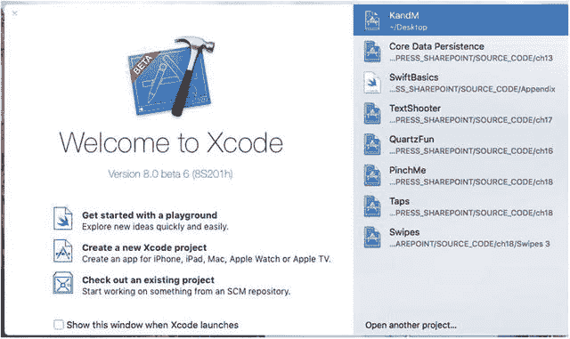

图 2-2. Xcode 欢迎窗口

通过从文件菜单中选择 `新建 ➤ 项目...`（或按 `Shift-Command-N`）来创建新项目。此时会打开一个新项目窗口，显示项目模板选择面板（见图 2-3）。在这个面板中，你将选择一个项目模板作为构建应用的起点。顶部的栏被分为五个部分：`iOS`、`watchOS`、`tvOS`、`macOS` 和 `跨平台`。由于我们正在构建一个 iOS 应用程序，请选择 `iOS` 按钮以显示应用模板。

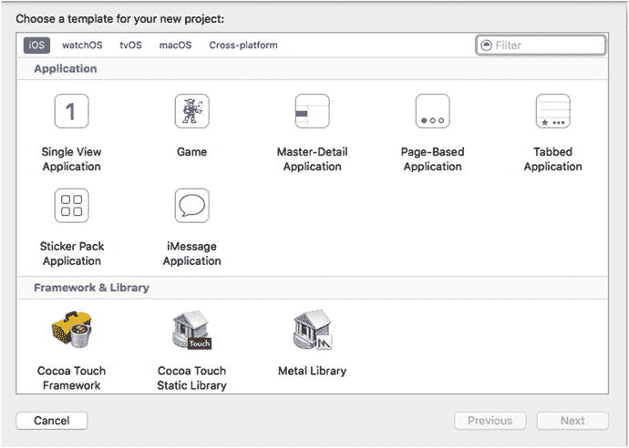

图 2-3. 项目模板选择面板让你在创建新项目时从各种模板中选择

图 2-3 中右上方面板显示的每个图标都代表一个单独的项目模板，可用作 iOS 应用的起点。标有“`单视图应用`”的图标包含最简单的模板，也是我们在前几章中将要使用的模板。其他模板则提供了创建常见 iPhone 和 iPad 应用界面所需的额外代码和/或资源，你将在后续章节中看到。

点击**Single View Application**（见图 2-3），然后点击**Next**按钮。您将看到项目选项面板，其外观应如图 2-4 所示。在此面板上，您需要为项目指定**Product Name**和**Company Identifier**。`Xcode`将结合这两项内容生成一个唯一的`bundle identifier`，用于标识您的应用。您还会看到一个用于输入**Organization Name**的字段，`Xcode`将使用该名称在您创建的每个源代码文件中自动插入版权声明。将产品命名为**Hello World**，并在**Organization Name**和**Organization Identifier**字段中输入组织名称和标识符，如图 2-4 所示。请不要使用与图 2-4 中相同的名称和标识符——原因将在本章末尾我们尝试在实际设备上运行此应用程序时揭晓：您需要选择一个专属于您（或您的公司）的唯一标识符。

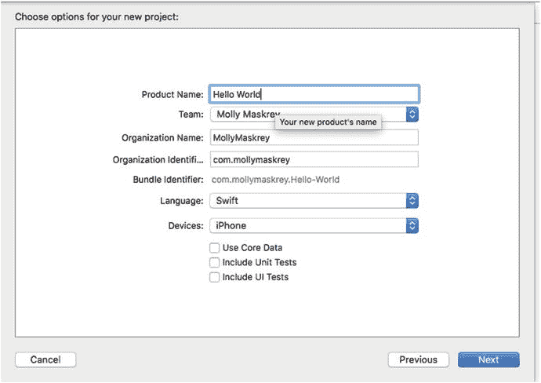

图 2-4. 为项目选择产品名称和组织标识符

**Language**字段允许您选择要使用的编程语言，可在`Objective-C`和`Swift`之间进行选择。由于本书中的所有示例均使用`Swift`，因此这里恰当的选择当然是`Swift`。

我们还需要指定设备。换句话说，`Xcode`需要知道我们正在为 iPhone 和 iPod touch 构建应用、为 iPad 构建应用，还是构建一个可运行在所有 iOS 设备上的通用应用。如果尚未选择，请在**Devices**下拉菜单中选择**iPhone**。这告诉`Xcode`，我们将此特定应用的目标设备设定为 iPhone 和 iPod touch，它们具有大致相同的屏幕尺寸和外形。在本书的前几章中，我们将使用 iPhone 设备，但请放心——我们也会涵盖 iPad 的内容。

保持**Core Data**复选框处于未选中状态——我们将在第 13 章中使用它。我们还将保持**Include Unit Tests**和**Include UI Tests**复选框处于未选中状态。`Xcode`对应用程序测试提供了非常好的支持，但这超出了本书的讨论范围，因此我们不需要`Xcode`在项目中包含对它们的支持。再次点击**Next**按钮，系统会通过一个标准的保存面板询问您将新项目保存到何处（见图 2-5）。如果您尚未执行此操作，请使用**New Folder**按钮为这些书籍项目创建一个新的主目录，然后返回`Xcode`并导航到该目录。在点击**Create**按钮之前，请注意**Source Control**复选框。本书不涉及`Git`，但`Xcode`包含一些对使用`Git`和其他类型源代码管理（`SCM`）工具的支持。如果您已经熟悉`Git`并希望使用它，请启用此复选框；否则，请随意将其关闭。

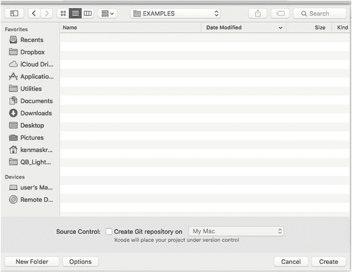

图 2-5. 将项目保存到硬盘驱动器上的项目文件夹中

### Xcode 项目窗口

关闭保存面板后，`Xcode`将创建并打开您的项目。您将看到一个新的项目窗口，如图 2-6 所示。此窗口中包含大量信息；这里将是我们花费大量 iOS 开发时间的地方。

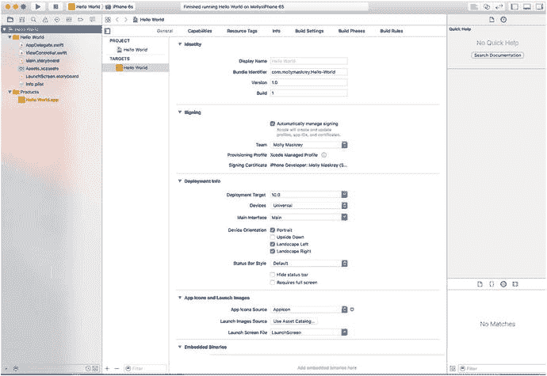

图 2-6. 在 Xcode 中的 Hello World 项目

#### 工具栏

`Xcode`项目窗口的顶部称为工具栏（见图 2-7）。在工具栏的左侧，您会看到用于启动和停止运行项目的控件，以及一个用于选择要运行的`schema`的下拉菜单。一个`schema`汇集了目标和构建设置，工具栏中的下拉菜单让您可以快速轻松地选择特定的设置。

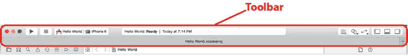

图 2-7. Xcode 工具栏

工具栏中间的大框是**Activity View**（活动视图）。顾名思义，活动视图会显示当前正在发生的任何操作或进程。例如，当您运行项目时，活动视图会提供关于构建应用程序所执行的各个步骤的实时说明。如果您遇到任何错误或警告，这些信息也会显示在这里。如果您点击警告或错误，将直接跳转到**Issue Navigator**（问题导航器），该导航器会提供关于警告或错误的更多信息，如下一节所述。

在工具栏的右侧有两组按钮。左侧的一组按钮让您可以在三种不同的编辑器配置之间切换：

*   **Editor Area**（编辑器区域）：提供一个专用于编辑文件或项目特定配置值的单个窗格。
*   功能强大的**Assistant Editor**（助手编辑器）将编辑器区域分割成多个窗格（左侧、右侧、顶部和底部）。右侧的窗格通常用于显示与左侧文件相关的文件，或者您在编辑左侧文件时可能需要参考的文件。您可以手动指定每个窗格中显示的内容，也可以让`Xcode`根据当前任务决定最合适的内容。例如，如果您在左侧设计用户界面，`Xcode`会在右侧显示用户界面可以与之交互的代码。您将在本书中看到**Assistant Editor**的实际应用。
*   **Version Editor**（版本编辑器）按钮将编辑器窗格转换为一个类似时间机器的比较视图，该视图可与`Git`等版本控制系统配合使用。您可以将源文件的当前版本与之前提交的版本进行比较，或者对任意两个早期版本进行相互比较。

在编辑器按钮的右侧是一组切换按钮，用于显示和隐藏编辑器视图左侧和右侧的大型窗格，以及窗口底部的调试区域。多次点击这些按钮中的每一个，以查看这些窗格的实际效果。我们很快就会探讨如何使用它们。

#### 导航器

在项目窗口左侧工具栏的正下方就是导航器。导航器提供了八种视图，分别展示项目的不同方面。点击导航器顶部的各个图标（从左到右），即可在以下导航器之间切换：

- **报告导航器**：此导航器保存了最近的构建结果和运行日志的历史记录，如图 2-15 所示。点击某个具体日志，编辑窗格中便会显示构建命令和任何构建问题。

  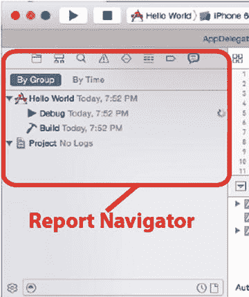

  *图 2-15. Xcode 报告导航器。报告导航器显示构建列表，与所选视图关联的详细信息会显示在编辑窗格中*

- **断点导航器**：断点导航器让你能查看已设置的所有断点，如图 2-14 所示。顾名思义，断点就是代码中应用程序将停止运行（或中断）的位置，这样你就可以查看变量值并执行调试应用所需的其他任务。此导航器中的断点列表按文件组织。点击列表中的某个断点，对应代码行就会出现在编辑窗格中。请注意，在断点导航器中，项目窗口左下角的加号（`+`）按钮值得关注。该按钮会打开一个弹出菜单，让你添加四种不同类型的断点，包括符号断点，这也是你最常使用的断点类型。

  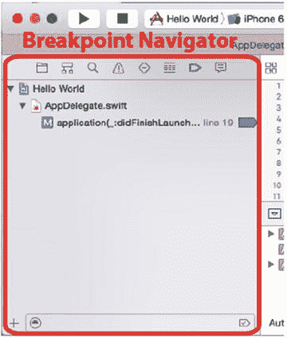

  *图 2-14. Xcode 断点导航器。断点列表按文件组织*

- **调试导航器**：此导航器为你提供进入调试过程的主要视图（参见图 2-13）。如果你是调试新手，可以查看 Xcode 概述 (`https://developer.apple.com/library/prerelease/content/documentation/ToolsLanguages/Conceptual/Xcode_Overview/UsingtheDebugger.html`) 中的这部分内容。调试导航器会列出每个活动线程的栈帧。栈帧是按调用顺序排列的、已被调用的函数或方法的列表。点击某个方法，相关代码就会出现在编辑窗格中。在编辑器中，会出现第二个窗格，让你能控制调试过程、显示和修改数据值，并访问底层调试器。调试导航器底部有一个按钮，允许你控制哪些栈帧可见。另一个按钮则让你选择是显示所有线程，还是仅显示已崩溃或在断点处停止的线程。将鼠标依次悬停在这些按钮上，即可了解它们各自的功能。

  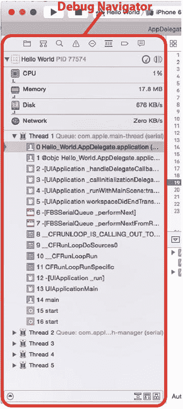

  *图 2-13. Xcode 调试导航器。导航器底部的控件让你能控制想要查看的详细程度*

- **测试导航器**：如果你正在使用 Xcode 集成的单元测试功能（本书不涉及此主题），那么这里将显示单元测试的结果。由于我们未在项目中包含单元测试，所以此导航器是空的（参见图 2-12）。

  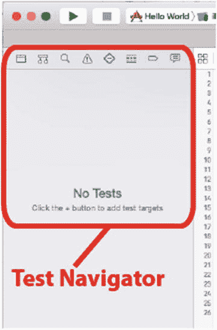

  *图 2-12. Xcode 测试导航器。单元测试的输出将在此处显示*

- **问题导航器**：当构建项目时，任何错误或警告都会显示在此导航器中，并且在窗口顶部的活动视图中会显示一条详细说明错误数量的消息（参见图 2-11）。在问题导航器中点击一个错误，你就会跳转到编辑器中相应的代码行。

  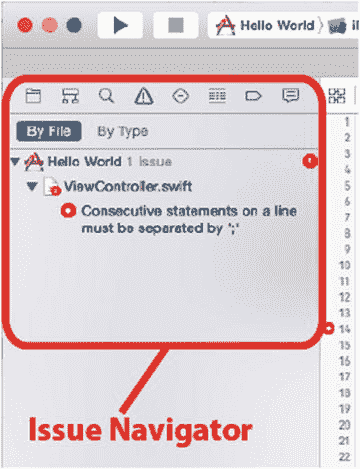

  *图 2-11. Xcode 问题导航器。你可以在此处找到编译器的错误和警告*

- **查找导航器**：你将使用此导航器对工作区中的所有文件执行搜索（参见图 2-10）。此窗格顶部有一个多级弹出式控件，让你可以选择`替换`而非`查找`，以及用于对输入的文本应用搜索条件的其他选项。在文本字段下方，其他控件让你可以选择在整个项目或仅部分项目中搜索，并指定搜索是否区分大小写。

  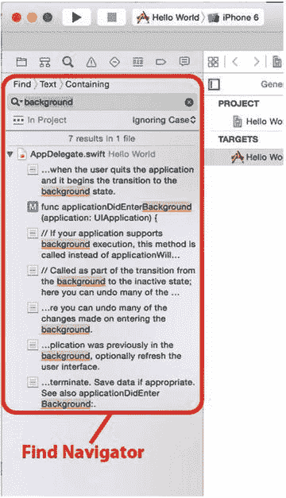

  *图 2-10. Xcode 查找导航器。务必查看隐藏在“Find”一词以及搜索栏下方按钮后面的弹出菜单*

- **符号导航器**：顾名思义，此导航器专注于工作区中定义的符号（参见图 2-9）。符号基本就是编译器能识别的项目，例如类、枚举、`struct`和全局变量。

  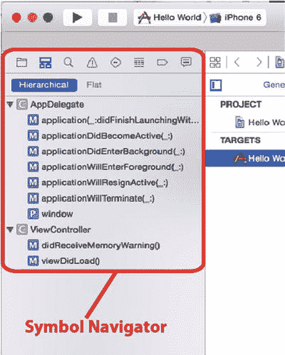

  *图 2-9. Xcode 符号导航器。展开显示三角形，即可浏览在每个组内定义的类、方法及其他符号*

- **项目导航器**：此视图包含项目中的文件列表，如图 2-8 所示。你可以存储各种资源的引用，从源代码文件到美工资源、数据模型、属性列表（或 `.plist`）文件（将在本章后面的“深入了解 Hello World 项目”部分讨论），甚至其他项目文件，应有尽有。通过将多个项目存储在一个工作区中，这些项目可以轻松共享资源。如果你在导航器视图中点击任何文件，该文件将显示在编辑区中。除了查看文件，如果 Xcode 知道如何编辑该文件，你还可以对其进行编辑。

  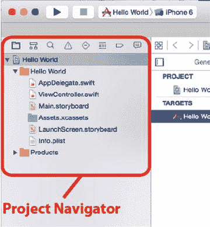

  *图 2-8. Xcode 项目导航器。点击视图顶部的八个图标之一即可切换导航器*

#### 跳转栏

在编辑器的顶部，你会发现一个名为跳转栏的控件。只需单击一次，跳转栏就能让你跳转到当前导航层级中的特定元素。例如，图 2-16 展示了编辑窗格中正在编辑的源文件。

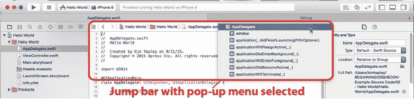

图 2-16.  
Xcode 编辑器窗格显示跳转栏，并选中了一个源代码文件。子菜单显示了所选文件中的方法列表

跳转栏位于源代码的正上方。其组成如下：

- 跳转栏左端那个样式奇特的图标实际上是一个弹出式菜单，它会显示子菜单，列出最近文件、对应文件、父类与子类、同级文件、分类、包含文件等。此处显示的子菜单可以带你跳转到与编辑器中当前打开代码相关的几乎所有其他代码。
- 菜单右侧是左右箭头，分别用于返回上一个文件和前进到下一个文件。
- 跳转栏包含一个分段弹出式菜单，显示在项目中到达所选文件的层级路径。你可以单击显示组名或文件名的任意分段，查看层级结构中同一位置的所有其他文件和组。最后一个分段显示所选文件中的项目列表。在图 2-16 中，你会看到跳转栏的末端是一个弹出式菜单，显示当前所选文件中包含的方法和其他符号。跳转栏显示了 `AppDelegate.swift` 文件，其子菜单列出了该文件中定义的符号。

当你浏览构成 Xcode 的各种界面元素时，请留意跳转栏。

提示

与大多数 Apple 的 macOS 应用程序一样，Xcode 完全支持全屏模式。只需点击项目窗口右上角的全屏按钮，即可体验无干扰的全屏编码！

#### Xcode 键盘快捷键

如果你更喜欢使用键盘快捷键而非鼠标点击屏幕控件进行导航，你会喜欢 Xcode 提供的功能。大多数你在 Xcode 中经常执行的操作都有对应的键盘快捷键，例如使用 `⌘B` 构建应用程序，或使用 `⌘N` 创建新文件。

你可以更改 Xcode 的所有键盘快捷键，也可以为尚无快捷键的命令分配快捷键。这需要在 Xcode 偏好设置的“按键绑定”标签页中进行。

一个非常方便的快捷键是 `⇧⌘O`，这是 Xcode 的“快速打开”功能。按下该组合键后，开始输入文件、设置或符号的名称，Xcode 将显示一个选项列表。当你将列表缩小到目标文件时，按下回车键即可在编辑窗格中打开它，让你只需几次按键就能切换文件。

### 工具区

如前所述，Xcode 工具栏右侧倒数第二个按钮用于打开和关闭工具区。工具区的上半部分是一个上下文相关的检查器面板，其内容会随编辑器窗格中显示的内容而变化。工具区的下半部分包含几种不同的资源，你可以将其拖入项目。本书中将有相关示例。

#### 界面生成器

早期版本的 Xcode 包含一个名为界面生成器（IB）的独立界面设计应用程序，用于构建和自定义项目的用户界面。后期版本引入的一项重大变更将界面生成器整合到了工作区本身。界面生成器不再是一个独立的应用程序，这意味着在代码和界面演变过程中，你无需在 Xcode 和 IB 之间来回切换。

本书将广泛使用 Xcode 的界面构建功能，深入探讨各种细节。事实上，我们将在本章稍后部分开始使用界面生成器。

#### 集成编译器和调试器

Xcode 4 带来的最重要变化之一隐藏在表面之下：全新的编译器和底层调试器。两者都比其前代产品更快、更智能，并且此后每个版本都不断改进。

多年来，Apple 一直使用 GCC（GNU 编译器套件）作为其编译器技术的基础。但在过去几年中，Apple 已完全转向 LLVM（低级虚拟机）编译器。LLVM 生成的代码速度远快于传统 GCC 生成的代码。除了生成更快的代码，LLVM 对你的代码了解也更多，因此它能生成更智能、更精准的错误消息和警告。

Xcode 还与 LLVM 紧密集成，从而获得了一些新的超能力。Xcode 可以提供更精准的代码补全，并且当它产生警告时，能够对代码的实际意图做出明智的猜测，并提供可能修复方案的弹出菜单。这使得拼写错误的符号名称和不匹配的括号等错误变得轻而易举就能发现和修复。

LLVM 还带来了一个强大的静态分析器，可以扫描你的代码，查找各种潜在问题，包括内存管理问题。事实上，LLVM 在这方面非常智能，只要你在编写代码时遵守几条简单规则，它就能为你处理大多数内存管理任务。我们将在下一章开始研究名为自动引用计数（ARC）的新特性。

### 深入剖析 Hello World 项目

在了解了 Xcode 项目窗口之后，让我们来看看构成新 Hello World 项目的文件。点击工作区左侧八个导航图标中最左边的一个（本章前面“导航器”部分已讨论过），或按下 `⌘1`，切换到项目导航器。

**注意**

可以使用键盘快捷键 `⌘1` 到 `⌘8` 来访问这八个导航器配置。这些数字对应从左开始的图标，因此 `⌘1` 是项目导航器，`⌘2` 是符号导航器，依此类推，直到 `⌘8` 将带你进入报告导航器。

项目导航器列表中的第一项与你的项目同名——在本例中，即为 Hello World。此项代表你的整个项目，并且也是进行项目特定配置的地方。如果你单击它，就可以在 Xcode 的编辑器中编辑许多项目配置设置。不过，你现在不必担心那些特定于项目的设置。目前，默认设置就能很好地工作。

翻回图 2-8。请注意，Hello World 左侧的展开三角形是打开的，显示了几个子文件夹（在 Xcode 中称为组）：

- **Hello World**：第一个组，始终以你的项目命名，你将在这里花费大部分时间。这是你编写的大部分代码以及构成应用程序用户界面的文件所在的位置。你可以自由地在 Hello World 组下创建子组来帮助组织代码。如果你更喜欢不同的组织方式，甚至可以添加自己的组。虽然我们直到下一章才会触及此文件夹中的大部分文件，但在下一节使用 Interface Builder 时，我们将探索其中一个文件。该文件名为 `Main.storyboard`，它包含特定于项目主视图控制器的用户界面元素。Hello World 组还包含不是 Swift 源文件但对项目必要的文件和资源。这些文件中有一个名为 `Info.plist` 的文件，其中包含关于应用程序的重要信息，例如它的名称、它是否要求运行它的设备上存在任何特定功能等。在早期版本的 Xcode 中，这些文件被放置在一个名为 Supporting Files 的单独组中。
- **Hello WorldTests**：如果你为项目启用了单元测试（我们没有启用，因此我们的项目中不存在此组），则会创建此组。它包含如果你想为应用程序代码编写一些单元测试所需的初始文件。我们不打算在本书中讨论单元测试，但如果你愿意，Xcode 可以在你创建的每个新项目中为你设置其中的一些功能，这很不错。与 Hello World 文件夹一样，此文件夹包含它自己的 `Info.plist` 文件。
- **Products**：此组包含此项目在构建时生成的应用程序。如果你展开 Products，将看到一个名为 `Hello World.app` 的项，这正是此特定项目创建的应用程序。如果创建项目时启用了单元测试，它还会包含一个名为 `Hello WorldTests.xctest` 的项，代表测试代码。这两个项都称为构建目标。因为我们从未构建过它们中的任何一个，所以它们都是红色的，这是 Xcode 告诉你某个文件引用指向不存在的内容的方式。

**注意**

导航器区域中的“文件夹”并不一定对应于 Mac 文件系统中的文件夹。它们只是 Xcode 内部的逻辑分组，帮助你保持所有内容并并有条，并在处理应用程序时更快、更轻松地找到你要找的内容。通常，这些组中包含的项目直接存储在项目的目录中，但你可以将它们存储在任何地方——如果你愿意，甚至可以存储在项目文件夹之外。Xcode 内部的层级结构与文件系统层级结构完全无关，因此，例如，在 Xcode 中将文件移出 Hello World 组并不会改变该文件在硬盘上的位置。

### 介绍 Xcode 的 Interface Builder

在项目窗口的项目导航器中，如果 Hello World 组尚未展开，请将其展开，然后选择 `Main.storyboard` 文件。完成后，该文件将在编辑窗格中打开，如图 2-17 所示。你应该会看到一个类似于全白 iOS 设备的图形，居中显示在纯白色背景上，这为编辑界面提供了很好的背景。这就是 Xcode 的 Interface Builder，我们将在这里设计应用程序的用户界面。

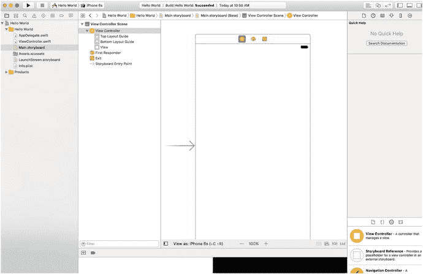

**图 2-17.** 在项目导航器中选中 `Main.storyboard` 会在 Interface Builder 中打开该文件

Interface Builder 历史悠久。它自 1988 年就已存在，并已用于为 NeXTSTEP、OpenStep、OS X、macOS 以及现在的 iOS 设备（如 iPhone、iPad、Apple TV）和 Apple Watch 开发应用程序。

#### 文件格式

Interface Builder 支持几种不同的文件类型。最古老的是使用 `.nib` 扩展名的二进制格式，现在则采用基于 XML 的格式，使用 `.xib` 扩展名。这两种格式包含完全相同类型的文档，但 `.xib` 版本基于文本，具有许多优势，尤其是在使用任何源代码控制软件时。在 Interface Builder 存在的前 20 年里，它的所有文件都使用 `.nib` 扩展名。因此，大多数开发者习惯将 Interface Builder 文件称为 nib 文件。Interface Builder 文件通常被称为 nib 文件，无论实际使用的扩展名是 `.xib` 还是 `.nib`。事实上，Apple 有时会在其文档中交替使用 nib 和 nib file（nib 文件）这两个术语。

每个 nib 文件可以包含任意数量的对象，但在处理 iOS 项目时，每个 nib 文件通常包含一个单独的视图（通常是全屏视图）以及与其连接的控制器或其他对象。这让我们能够将应用程序模块化，仅在需要显示视图时才加载该视图的 nib 文件。最终结果是：当我们的应用程序在内存受限的 iOS 设备上运行时，可以节省内存。一个新建的 iOS 项目包含一个名为 `LaunchScreen.xib` 的 nib 文件，它包含一个屏幕布局，默认情况下，当应用程序启动时会显示该布局。我们将在本章末尾进一步讨论这个文件。

过去几年中 IB 支持的另一种文件格式是 storyboard。你可以将 storyboard 视为一个“元 nib 文件”，因为它可以包含多个视图控制器，以及关于它们在应用程序运行时如何相互连接的信息。与 nib 文件不同——其内容会一次性全部加载——storyboard 不能包含独立的视图，并且永远不会一次性加载其所有内容。相反，你可以在需要时要求它加载特定的控制器。Xcode 8 中的 iOS 项目模板都使用 storyboard，因此本书中的所有示例都将从 storyboard 开始。虽然你只能免费获得一个 storyboard，但如果需要，你可以添加更多。现在，让我们回到 Interface Builder 以及我们的 Hello World 应用程序的 `Main.storyboard` 文件（见图 2-17）。

### 故事板

我们现在正在审视用于构建 iOS 应用用户界面的主要工具。假设你想创建一个按钮实例。你可以通过编写代码来创建这个按钮，但从库中拖出一个按钮并指定其属性来创建界面对象要简单得多，并且它在运行时产生的效果完全相同。

我们当前看到的 `Main.storyboard` 文件会在你的应用启动时自动加载（暂时不必担心它是如何加载的），因此它是添加构成你应用用户界面的对象的正确位置。当你在 Interface Builder 中创建对象时，它们会在你添加它们的 storyboard 或 nib 文件加载时在你的程序中被实例化。本书中会有很多这样的例子。

每个故事板都被划分为一个或多个视图控制器，每个视图控制器至少有一个视图。视图是你可以图形化查看并在 Interface Builder 中编辑的部分，而控制器则是你将编写的应用代码，用于在用户与应用交互时触发相应操作。控制器是你应用真正发生动作的地方。

在 IB 中，你经常看到一个用矩形表示的视图，代表 iOS 设备的屏幕（实际上，它代表了一个视图控制器，这是一个你将在下一章了解的概念，但这个特定的视图控制器覆盖了设备的整个屏幕，所以两者几乎等同）。在 IB 窗口的底部附近，你会看到一个下拉控件，以 `View as:` 开头，并带有默认的设备类型。点击该设备类型。你可以选择我们要为其创建布局的设备，如图 2-18 所示。

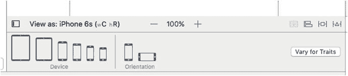

图 2-18.

在 Xcode 8 中，IB 允许你选择工作的设备类型和方向

回到我们的故事板，点击大纲中的任意位置，你会看到其顶部有一行三个图标，如图 2-17 所示。将鼠标悬停在每个图标上，你会看到弹出提示显示它们的名称：`View Controller`、`First Responder` 和 `Exit`。暂时忽略 `Exit`，把注意力集中在另外两个上。

- `View Controller` 代表一个控制器对象，它会从文件存储中与其关联的视图一起被加载。视图控制器的任务是管理用户在屏幕上看到的内容。一个典型的应用有几个视图控制器，每个屏幕对应一个。完全有可能编写一个只有一个屏幕（因此只有一个视图控制器）的应用，本书中的许多例子都只有一个视图控制器。
- `First Responder` 简单来说，就是用户当前正在与之交互的对象。例如，如果用户当前正在文本字段中输入数据，那么这个字段就是当前的第一响应者。当用户与用户界面交互时，第一响应者会发生变化，而 `First Responder` 图标提供了一种便捷方式，让你无需编写代码来确定当前是哪个控件或视图，就能与当前的第一响应者（无论是哪个控件或其他对象）进行通信。

我们将在下一章开始更详细地讨论这些对象，所以如果现在难以确定何时使用 `First Responder` 或 `View Controller` 如何被加载，也不用担心。

除了这些图标，你在编辑区看到的其余部分就是你可以放置图形对象的空间。但在那之前，还有一件事你应该了解 IB 的编辑器区域：它的层级视图——或者更准确地说，`Document Outline`。`Document Outline` 如图 2-19 所示。

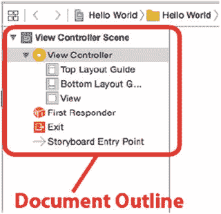

图 2-19.

`Document Outline` 包含故事板内容的有用层级表示

如果 `Document Outline` 不可见，点击编辑区左下角的小按钮，它会从左侧滑入。它显示故事板中的所有内容，并分成包含相关内容的场景。在我们的例子中，只有一个场景，叫做 `View Controller Scene`。我们看到它包含一个名为 `View Controller` 的项，而该项又包含一个名为 `View` 的项（以及一些你以后会学到的其他东西）。这提供了一个很好的方式来概览内容，主编辑区中看到的所有内容都会在此处镜像显示。

`View` 图标代表 `UIView` 类的一个实例。`UIView` 对象是一个用户可以看到并与之交互的区域。在这个应用中，我们当前只有一个视图，所以这个图标代表了用户在我们的应用中可以看到的所有内容。稍后，我们将构建包含多个视图的更复杂的应用。现在，只需将这个视图视为用户在使用你的应用时可以看到的一个对象。

如果你点击 `View` 图标，Xcode 会自动高亮我们之前讨论过的方形屏幕轮廓。这里就是你可以图形化设计用户界面的地方。

### 工具区

工具区位于工作区的右侧。如果它当前没有被选中，点击工具栏中三个视图按钮的最右边一个，选择 View ➤ Utilities ➤ Show Utilities，或者按 `⌥⌘0`（Option-Command-Zero）。工具区的下半部分，如图 2-20 所示，被称为库面板，或者简称为库。

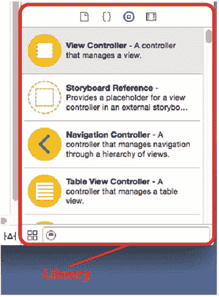

图 2-20.

在库中，你可以找到来自 UIKit 的、可在 Interface Builder 中使用的标准对象。库之上、工具栏之下的所有内容统称为检查器

库提供了一系列可重用的项目，供你在自己的程序中使用。库面板顶部栏中的四个图标将其分为四个部分。依次点击每个图标，查看每个部分的内容：

- **文件模板库**：此部分包含一组文件模板，当你需要向项目添加新文件时可以使用。例如，如果你想向项目添加一个新的 Swift 源文件，一种方法是从文件模板库中拖出一个类型放到项目导航器中。
- **代码片段库**：此部分提供了一组代码片段，你可以将其拖入源代码文件中。如果你编写了一些你认为以后会再次使用的代码，在文本编辑器中选中它，然后将其拖到代码片段库中。
- **对象库**：此部分包含可重用的对象，例如文本字段、标签、滑块、按钮，以及几乎所有设计 iOS 界面所需的对象。本书将广泛使用对象库来构建示例程序的界面。
- **媒体库**：顾名思义，此部分用于存放你的所有媒体文件，包括图片、声音和电影。在你添加内容之前，它都是空的。

注意

对象库中的项目来自 iOS UIKit，这是一个用于创建应用用户界面的对象框架。UIKit 在 Cocoa Touch 中扮演的角色与 AppKit 在 macOS 的 Cocoa 中扮演的角色相同。这两个框架在概念上是相似的；然而，由于平台的差异，它们之间显然存在许多不同之处。另一方面，Foundation 框架类，例如 `NSString` 和 `NSArray`，在 Cocoa 和 Cocoa Touch 中是共享的。

注意库底部的搜索字段。如果你想找一个按钮，在搜索字段中输入 `button`；当前库将只显示名称中包含“button”的项目。搜索完成后，别忘了清除搜索字段，否则不会显示所有可用的项目。

### 为视图添加标签

让我们开始使用`IB`。点击库区域顶部的`对象库`图标（看起来像一个中间带有方块的圆圈——你可以在图 2-20 中看到它），调出`对象库`。为了好玩，您可以滚动浏览库以找到`表视图`。没错——继续滚动，你就会找到它。不过，还有更好的方法：只需在搜索字段中输入`表视图`，它就会立即出现。

**提示**  
这里有一个有用的快捷键：按下`^⌘3`即可跳转到搜索字段并高亮其内容。接下来，您只需输入要搜索的项目名称即可。

现在，在库中找到一个`标签`。然后，将标签拖拽到我们之前看到的视图上。（如果在编辑器窗格中看不到该视图，请点击`界面构建器文档大纲`中的`视图`图标）。当光标移到视图上时，它会变成你熟悉的、来自访达的那种标准的“我正在复制某物”绿色加号。将标签拖到视图中央。当标签居中时，会显示出一组蓝色参考线——一条垂直和一条水平。标签是否居中并不重要，但了解这些参考线的存在是件好事。当您放开标签时，它应该会显示出来，如图 2-21 所示。

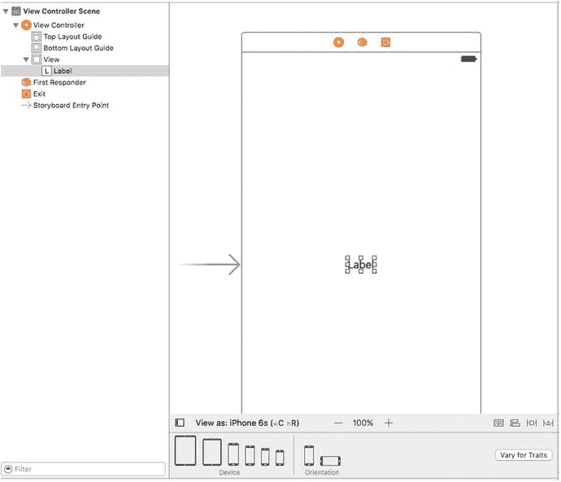

图 2-21. 我们在库中找到了一个标签，并将其拖拽到了视图上

用户界面项目按层级结构存储。大多数视图可以包含子视图；但是，有些视图（如按钮和大多数其他控件）则不能。`Interface Builder`很智能。如果一个对象不接受子视图，你就无法将其他对象拖拽到它上面。

通过将标签直接拖拽到我们正在编辑的视图上，我们将其作为子视图添加到该主视图（名为`视图`的视图）中，这将导致当该视图显示给用户时，它会自动出现。将标签从库拖拽到名为`视图`的视图上，会将一个`UILabel`实例作为子视图添加到我们应用程序的主视图中。

让我们编辑这个标签，让它显示一些有意义的内容。双击你刚刚创建的标签，然后输入`Hello, World!`。接下来，点击标签外部取消选中，然后重新选中它，并拖动标签以重新居中，或将其放置到屏幕上你希望它出现的任何位置。

我们完成了这部分，现在保存以结束。选择`文件 ➤ 保存`，或按下`⌘S`。现在查看 Xcode 项目窗口左上角的弹出菜单，上面写着`Hello World`。这实际上是一个多段弹出控件。左侧部分允许您选择不同的编译目标并执行其他一些操作，但我们关注的是右侧部分，它允许您选择要在哪个设备上运行。点击右侧部分，您将看到可用设备列表。在顶部，如果您有已连接并准备就绪的 iOS 设备，您会看到它的列表。否则，您只会看到一个通用的`iOS 设备`条目。在其下方，您会看到一个完整的部分，标题为`iOS 模拟器`，列出了所有可用于 iOS 模拟器的设备类型。从该下方部分，选择`iPhone 6/6s`，这样我们的应用就会在模拟器中运行，其配置就像是一部`iPhone 6/6s`。

有几种方法可以启动你的应用程序：你可以选择`产品 ➤ 运行`，按下`⌘R`，或者按下模拟器弹出菜单左侧的`运行`按钮。Xcode 将编译你的应用并在 iOS 模拟器中启动它（见图 2-22）。

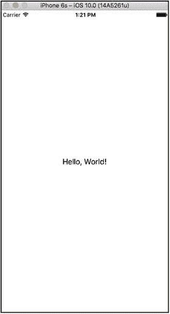

图 2-22. 这是我们的`Hello, World!`程序在 iPhone 6s 模拟器中运行的效果

**注意**  
在添加了`Xcode 8`的功能之前，文本不会自动居中，您需要使用`Auto Layout`添加一些称为约束的东西，以确保它在任何设备上都能居中。

这基本上就是我们第一个应用程序最基础的全部内容——注意，我们完全没有编写任何`Swift`代码。

### 更改属性

回到 Xcode，单击`Hello World`标签将其选中，并注意库面板上方的区域。工具面板的这一部分被称为`检查器`。`检查器`面板顶部有一系列图标，每个图标都会将`检查器`切换到查看特定类型的数据。要更改标签的属性，我们需要从左数第四个图标，它会调出`属性检查器`（见图 2-23）。

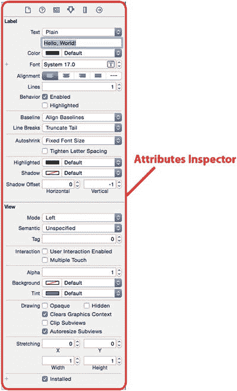

图 2-23. `属性检查器`显示我们标签的属性

**提示**  
`检查器`与`项目导航器`一样，其每个图标都有对应的键盘快捷键。`检查器`的键盘快捷键从最左侧图标的`⌘1`开始，下一个图标是`⌘2`，依此类推。与`项目导航器`不同，`检查器`中图标的数量是上下文相关的，并且根据在导航器和/或编辑器中选择的对象而改变。请注意，您的键盘可能没有标有`⌘`的键。如果没有，请改用`Option`键。

按照您喜欢的任何方式更改标签的外观，随意尝试文本的字体、大小和颜色。请注意，如果您更改字体大小，则需要添加一个自动布局约束，以确保它在运行时具有正确的大小。为此，请选中该标签，然后从 Xcode 菜单中选择`编辑器 ➤ 适配内容大小`（见图 2-24）。操作完成后，保存文件并再次选择`运行`。您所做的更改应该会显示在您的应用中，同样无需编写任何代码。

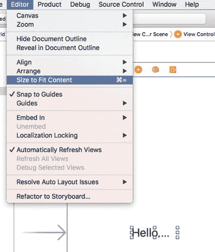

图 2-24. 将字体大小改大会迫使你通过从`编辑器`下拉菜单中选择`适配内容大小`来更改布局约束

**注意**  
不必过于担心`属性检查器`中所有字段的含义，因为随着你阅读本书的深入，你将了解很多关于`属性检查器`以及大多数字段功能的知识。

通过让我们以图形方式设计界面，`Interface Builder`将我们从编写用于构建用户界面的繁琐代码中解放出来，从而让我们能够将时间花在编写特定于应用程序的代码上。

大多数现代应用程序开发环境都有某种工具，允许您以图形方式构建用户界面。`Interface Builder`与许多其他工具的一个区别在于，`Interface Builder`不会生成任何需要维护的代码。相反，`Interface Builder`创建用户界面对象，就像你在自己的代码中做的一样，然后将这些对象序列化到故事板或 nib 文件中，以便它们可以在运行时直接加载到内存中。这避免了与代码生成相关的许多问题，并且总体而言，是一种更强大的方法。

## 收尾工作

现在我们来完善应用，让它更像一个真正的 iPhone 应用。首先，再次运行你的项目。当模拟器窗口出现时，按下 ⇧⌘H。这会将你带回 iPhone 主屏幕，如图 2-25 所示。注意，应用图标现在显示为一个普通的默认图像。

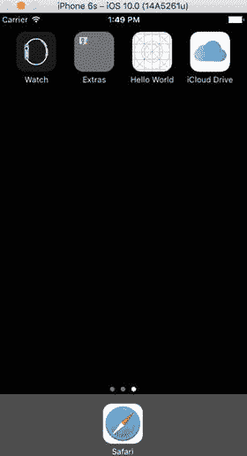

图 2-25. 主屏幕上显示的 Hello World 应用

看一看屏幕顶部的 Hello World 图标。要改变这个乏味的默认图像，我们需要创建一个图标，并将其保存为可移植网络图形（`.png`）文件。实际上，为了获得最佳效果，你应为 iPhone 创建以下五个尺寸的图标：180 × 180 像素、120 × 120 像素、87 × 87 像素、80 × 80 像素和 58 × 58 像素。如果你计划为 iPad 发布应用，还需要另外一组四个图标。此外，你还需要一个 187 × 187 像素的图标用于 iPad Pro。需要这么多图标的原因在于，它们会被用于主屏幕、“设置”应用以及“聚焦搜索”的结果列表中。这解释了其中三种尺寸，但事情还没完——iPhone 6/6s Plus 屏幕更大，需要更高分辨率的图标，这又增加了三种尺寸。幸运的是，其中一种尺寸与另一组中的某个图标尺寸相同，所以你实际上只需要为 iPhone 创建五个版本的应用图标。如果你没有提供某些较小的图标，较大的图标会自动按比例缩小；但为了最佳效果，你（或你团队中的美术设计师）最好事先手动缩放它们。

**注意**

图标尺寸的问题比这还要复杂。在 iOS 7 之前，所有现代 iPhone 的图标边长均为 114 × 114 像素。但如果你要支持较旧的非 Retina 屏 iPhone，则需要提供分辨率减半的图标，即 57 × 57 像素。此外，iPad 也有其他图标尺寸，包括 Retina 和非 Retina 规格，并且适用于 iOS 10 及更早版本的 iOS。

创建图标时，不要试图匹配设备上已有按钮的样式；你的 iPhone 或 iPad 会自动将边缘圆角化。只需创建普通的方形图像即可。你可以在项目归档文件 `02 - Hello World - icons` 文件夹中找到一组合适的图标图像。

**注意**

对于应用图标，你必须使用 `.png` 图像；实际上，在你的 iOS 项目中，所有图像都应使用这种格式。Xcode 会在构建时自动优化 `.png` 图像，使其成为 iOS 应用中最快、最高效的图像类型。即使大多数常见图像格式都能正确显示，仍请使用 `.png` 文件，除非你有充分的理由使用其他格式。

按 ⌘1 打开项目导航器，在 Hello World 组内查找名为 `Assets.xcassets` 的项。这就是所谓的“素材目录”。默认情况下，每个新 Xcode 项目都会创建一个素材目录，用于存放应用图标和其他资源文件。选中 `Assets.xcassets`，然后将注意力转向编辑器面板。

在编辑器面板的左侧，你会看到一个带有 `AppIcon` 标签的条目。选中此项，右侧会出现一个区域，左上角显示 `AppIcon` 字样，以及我们刚才提到的图标的虚线框（见图 2-26）。这就是我们要拖放所有应用图标的地方。

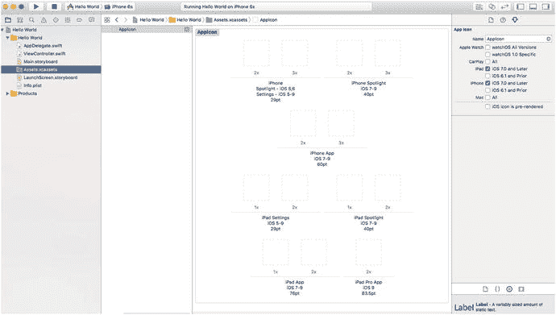

图 2-26. 项目素材目录中的 `AppIcon` 方框。此处用于设置应用图标

在访达中，打开 `02 - Hello World - icons` 文件夹，选中所有文件，将它们拖拽到 IB 中。大多数图标都会自动填充正确的名称。你可能会留下几个空的方框，这时需要找到对应的文件并单独拖拽它们，确保没有空的方框。方法是将文件名称中的尺寸与方框上的点数进行比对。注意，如果方框下方标有 `2x` 或 `3x`，你需要找到两倍或三倍尺寸的文件。例如，注意在图 2-27 中，iPhone Spotlight iOS 7-9 的图标是空的，并显示 `t`。此外，该方框还标有 `3x` 标签。这意味着你需要找到对应 `120pts` 的文件；即 `3 × 40pts`。

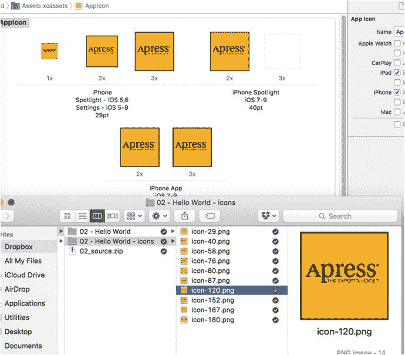

图 2-27. 确保将 `.png` 文件与图标的正确尺寸要求匹配

现在编译并运行你的应用。当模拟器启动完毕后，按下 ⇧⌘ 跳转到主屏幕，查看你的图标（见图 2-28）。要查看其中一个较小图标的使用情况，可在主屏幕内向下滑动以调出聚焦搜索字段，并开始输入单词 Hello——你会立即看到新应用的图标出现。

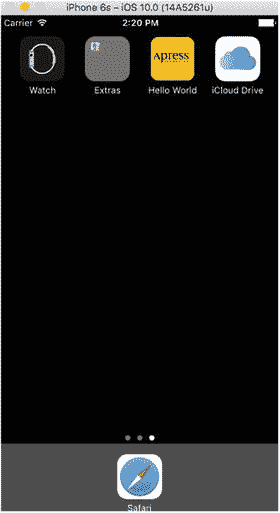

图 2-28. 我们的 Hello World 应用的新应用图标

**注意**

在我们学习本书的过程中，模拟器的主屏幕会因我们运行的示例应用图标而变得杂乱。如果你想从主屏幕清除旧应用，请从 iOS 模拟器的应用菜单中选择 iOS Simulator ➤ Reset Content and Settings…（重置内容和设置…）。

## 启动屏幕

当你启动应用程序时，可能已经注意到了加载过程中出现的白色启动屏幕。iOS 应用一直都有启动屏幕。由于将应用加载到内存需要一定时间（应用越大，耗时越长），该屏幕的作用是让用户尽快看到应用正在启动。在 iOS 8 之前，你可以提供一张图片（实际上可以是多张不同尺寸的图片）作为应用的启动屏幕。iOS 会加载正确的图片，并在加载应用其余部分之前立即显示它。从 iOS 8 开始，你仍然可以选择这种方式，但苹果现在强烈建议使用启动文件而非启动图片，如果你的应用仍需支持更早的版本，也可以同时使用启动图片。

启动文件是一个包含启动屏幕用户界面的故事板。在运行 iOS 8 及更高版本的设备上，如果检测到启动文件，系统会优先使用它而不是启动图片。在项目导航器中查看，你会发现项目中已经存在一个启动文件——名为 `LaunchScreen.storyboard`。如果你在界面构建器中打开它，会看到它只包含一个空白视图，如图 2-29 所示。

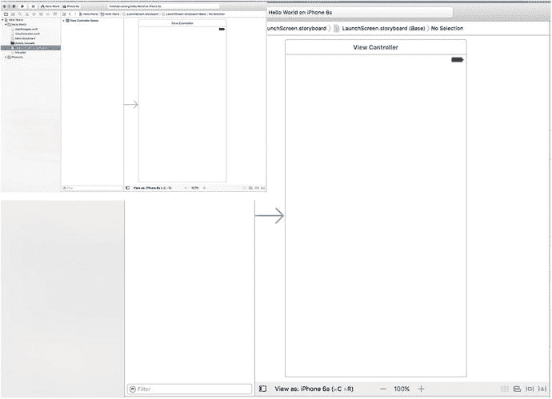

图 2-29. 我们应用的默认启动文件

苹果希望你使用界面构建器自己构建启动屏幕，就像构建应用用户界面的其他部分一样。苹果建议不要尝试创建复杂或视觉上令人印象深刻的启动屏幕，因此我们将遵循这些指导原则。相反，我们只需在故事板上添加一个标签并更改主视图的背景颜色，这样你就可以将启动屏幕与应用本身区分开来。与之前一样，将一个标签拖到故事板上，将其文本改为 `Hello World`，然后使用属性检查器（见图 2-23）将字体更改为 `System Bold 32`。确保标签被选中，在 Xcode 菜单中点击 `Editor ➤ Size to Fit Content`。现在将标签居中在视图中，点击 `Editor ➤ Resolve Auto Layout Issues ➤ Add Missing Constraints` 来添加布局约束，确保标签保持在该位置。接下来，通过在故事板或文档大纲中点击选择主视图，使用属性检查器更改其背景颜色。为此，找到标记为 `Background` 的控件并选择任何你喜欢的颜色——由于这是一本 Apress 的书，我选择了黄色。现在只需再次运行应用。你会看到启动屏幕出现，然后随着应用本身出现而淡出，如图 2-30 所示。

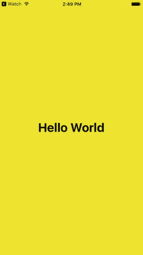

图 2-30. `Hello World` 应用的黄色启动屏幕

你可以在苹果的 iOS 人机界面指南文档中了解更多关于启动文件、启动图片和应用图标的信息，在线访问地址为 [`https://developer.apple.com/library/ios/documentation/UserExperience/Conceptual/MobileHIG/LaunchImages.html`](https://developer.apple.com/library/ios/documentation/UserExperience/Conceptual/MobileHIG/LaunchImages.html)。

## 在设备上运行应用

在结束本章之前，我们还有一件事要做。让我们加载应用并在实际设备上运行它。第一步是使用充电线将 iOS 设备连接到 Mac。连接后，Xcode 应该会识别设备并花一些时间读取其符号信息。你可能会在 Mac 和设备上看到安全提示，询问是否要让它们相互信任。等待 Xcode 完成从设备处理符号文件（检查活动视图确认），然后打开工具栏中的设备选择器。你应该会看到设备列在其中，如图 2-31 所示。

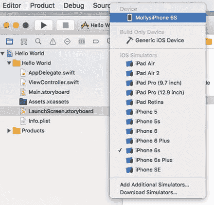

图 2-31. 设备和模拟器列表现在包括作者的 iPhone 6s

选择设备并点击工具栏上的运行按钮，开始在其上安装和运行应用的过程。Xcode 会重新构建应用并在你的设备上运行它。然而，由于我使用的是 Xcode 8 的早期测试版，你可能会看到类似图 2-32 所示的提示。

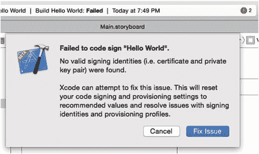

图 2-32. 如果自动配置功能失败，你可能会看到此消息注意

苹果在 Xcode 8 中对配置系统进行了改进，许多“修复问题”功能已经过时，过程更加无缝和成功。在这里，我们讨论这个问题是为了确保完成配置，让应用在我们的实际设备上运行。

在 iOS 设备上安装应用之前，应用必须拥有配置描述文件并进行签名。签名应用可以让设备识别应用的作者，并检查二进制文件在创建后是否被篡改。配置描述文件包含的信息告诉 iOS 应用需要哪些功能（例如 iCloud 访问）以及可以在哪些特定设备上运行。要签名应用，Xcode 需要证书和私钥。

提示：你可以在苹果应用分发指南中的应用分发工作流程中阅读关于代码签名、配置描述文件、证书和私钥的内容，地址为 [`https://developer.apple.com/library/ios/documentation/IDEs/Conceptual/AppDistributionGuide`](https://developer.apple.com/library/ios/documentation/IDEs/Conceptual/AppDistributionGuide)。

在 iOS 开发的早期，你必须登录开发者计划帐户并手动创建这两项，然后注册你想要安装应用的测试设备。这是一个复杂且令人沮丧的过程。Xcode 7 经过改进已经足够智能，可以为你完成这些操作，而 Xcode 8 则进一步改进，因此当你只需要将应用放到设备上进行测试时，这一切都可以正常工作。在某些情况下，对于需要分发给特定用户的不同专用构建版本，我们可能需要自定义配置过程，但对于我们的学习过程，默认的、易于使用的机制已经足够。

可能会出现一些问题。首先，如果你看到消息说应用 ID 不可用，你需要选择另一个。应用 ID 基于项目名称和创建项目时选择的组织标识符（见图 2-4）。如果你使用了 `com.beginningiphone` 或其他已被他人注册的标识符，就会看到此消息。要修复它，打开项目导航器并选择项目树顶部的 `Hello World` 节点。然后点击文档大纲中 `TARGETS` 部分下的 `Hello World` 节点。最后，点击编辑器区域顶部的 `General` 按钮（见图 2-33）。

## 排版后的文本

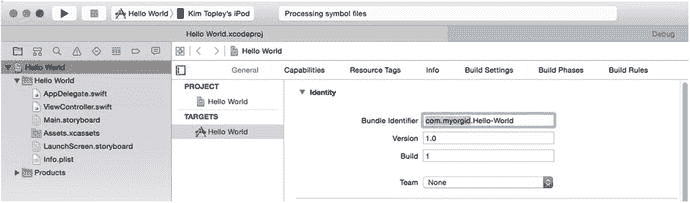

**图 2-33.** 更改应用包标识符

Xcode 用于签名的 App ID 取自编辑器中的 `Bundle Identifier` 字段。你会看到其中包含你创建项目时选择的 `Organization Identifier`——该字段中高亮显示的部分如图 2-33 所示。选择其他值并尝试重新构建。最终，你需要找到一个尚未被使用的标识符。完成后，请记下它，并在创建新项目时务必使用该值填写 `Organization Identifier` 字段。只要正确完成一次，Xcode 就会记住它，因此你无需再次操作。

另一个可能出错的情况如图 2-34 所示。

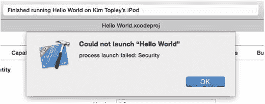

**图 2-34.** 在 iOS 9 或 10 中启动失败

只有当你未注册开发者计划时，才会看到此消息。这意味着你的 iOS 设备不信任你运行用 Apple ID 签名的应用程序。要解决此问题，请打开设备上的“设置”应用，然后转到 **通用** ➤ **描述文件**。你会进入一个页面，其中包含一个显示你 Apple ID 的表格。点击该表格行，打开另一个页面，如图 2-35 所示。

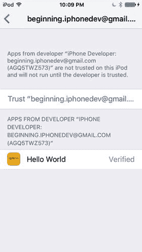

**图 2-35.** 在 iOS 9 及以上版本中，默认情况下，没有开发者计划成员资格的开发者不被信任

## 本章小结

我们应该对本节所取得的进展感到满意。虽然看起来我们并未完成太多工作，但实际上我们涵盖了很多内容。你了解了 iOS 项目模板，创建了一个应用程序，学习了关于 Xcode 8 的关键知识，开始使用 Interface Builder，学习了如何设置应用图标以及如何在模拟器和真实设备上运行应用程序。

然而，Hello World 程序严格来说是一个单向应用程序。我们向用户展示了一些信息，但从未接收他们的任何输入。在下一章中，我们将探讨如何从 iOS 设备用户那里获取输入，并根据该输入执行操作。

