# 3. 基本用户交互

我们的 Hello World 应用很好地介绍了如何使用 Xcode 和 Cocoa Touch 进行 iOS 开发，但它缺少一个关键功能——与用户交互的能力。如果无法接受用户输入，我们工作的实用性将受到严重限制。

在本章中，我们将编写一个稍微复杂一点的应用程序——它将包含两个按钮和一个标签（见图 3-1）。当用户点击任一按钮时，标签的文本会发生变化。这展示了创建交互式 iOS 应用所涉及的关键概念。我们还将了解 `NSAttributedString` 类，它允许你在许多 Cocoa Touch 视觉元素中使用样式化文本。

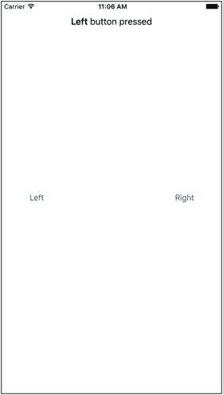

**图 3-1.** 在本章中，我们将开发这个简单的双按钮应用

## MVC 范式

即使你现在不了解 MVC，你最终也会了解。它代表模型-视图-控制器（MVC），是一种将构成 GUI 应用程序的代码进行划分的非常合乎逻辑的方式。如今，几乎所有面向对象的框架都建立在 MVC 之上，但很少有像 Cocoa Touch 那样严格遵守 MVC 模型的。

MVC 模式将所有功能划分为三个不同的类别：

* **模型：** 持有应用程序数据的类。
* **视图：** 由用户可以看到和交互的窗口、控件和其他元素组成。
* **控制器：** 将模型和视图绑定在一起的代码。它包含决定如何处理用户输入的应用程序逻辑。

MVC 确保实现这三种类型代码的对象尽可能彼此不同。你创建的任何对象都应能轻易识别为属于这三个类别之一，并且几乎不包含或被归类为其他两个类别的功能。例如，实现按钮的对象不应包含处理按钮被点击时数据的代码，而实现银行账户的代码不应包含绘制表格以显示其交易记录的代码。

MVC 有助于确保最大程度的可重用性。实现通用按钮的类可以在任何应用程序中使用。而实现一个在点击时执行特定计算的按钮的类，则只能在其最初编写的应用程序中使用。

在编写 Cocoa Touch 应用程序时，你主要通过使用 Interface Builder 来创建视图组件，不过有时也会在代码中修改，甚至创建部分用户界面。

你通过编写 Swift 类来保存数据的方式创建模型。在本章的应用程序中，我们不会创建任何模型对象，因为我们不需要存储或保留数据。在后续章节中，随着我们的应用程序变得更加复杂，我们将引入模型对象。

控制器组件包含你创建且特定于你的应用程序的类。控制器是完全自定义的类，但通常它们作为 UIKit 框架中几个现有通用控制器类（如 `UIViewController`）的子类存在。通过继承这些现有类中的一个，你可以免费获得大量功能，无需重复造轮子。

随着我们对 Cocoa Touch 的深入，我们会很快发现 UIKit 框架的类是如何遵循 MVC 原则的。在开发过程中牢记这一概念，你将最终编写出更清晰、更易于维护的 Swift 代码。

## 创建 ButtonFun 应用

是时候创建我们的下一个 Xcode 项目了。我们将使用与上一章相同的模板：单视图应用程序。通过再次从这个简单模板开始，更容易看到视图和控制器对象是如何在 iOS 应用程序中协同工作的。我们将在后面的章节中使用其他一些模板。

启动 Xcode 并选择 **文件** ➤ **新建** ➤ **项目…** 或按 ⌘N。选择 `Single View Application` 模板，然后点击 **Next**。

你会看到与上一章相同的选项表。在 `Product Name` 字段中，输入我们新应用程序的名称：**Button Fun**。`Organization Name`、`Company Identifier` 和 `Language` 字段应该仍然包含你在上一章中使用的值，因此你可以保留它们不变。同样，我们将使用 Auto Layout 来创建一个适用于所有 iOS 设备的应用程序，因此在 `Devices` 字段中，选择 `Universal`。图 3-2 显示了完整的选项表。

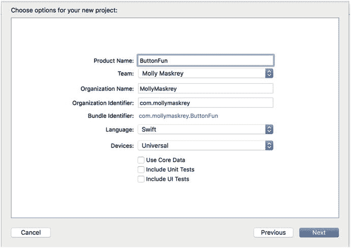

**图 3-2.** 命名我们的项目并选择选项

点击 **Next**。系统会提示你选择项目位置。你可以根据自己的偏好勾选或取消勾选 **Create Git repository** 复选框。点击 **Create** 并将项目保存到你的书籍项目目录中。


## ViewController（视图控制器）

在本章稍后部分，我们将像上一章一样，使用 Interface Builder 为应用程序设计视图（或用户界面）。在此之前，我们先查看并修改一些已创建的源代码文件。在开始修改之前，先看看系统为我们创建了哪些文件。在项目导航器中，`Button Fun` 组应该已经展开；如果没有，请点击其旁边的展开三角形（见图 [3-3]）。

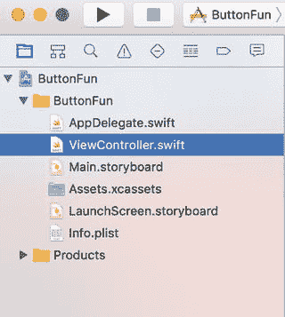

**图 3-3.** 项目导航器显示项目模板为我们创建的类文件

`Button Fun` 组应包含两个源代码文件，以及主故事板文件、启动屏幕故事板文件、用于存放应用所需图片的资源目录（Asset Catalog）和一个 `Info.plist` 文件（我们将在后续章节讨论）。这两个源代码文件实现了应用所需的类：应用程序代理（Application Delegate）和应用唯一视图的视图控制器。我们将在本章稍后部分查看应用程序代理。首先，我们来处理系统为我们创建的视图控制器类。

名为 `ViewController` 的控制器类管理着应用的视图。顾名思义，这个类就是一个视图控制器。在项目导航器中点击 `ViewController.swift`，查看视图控制器文件的内容（见 [3-1] 所示）。

```
import UIKit
class ViewController: UIViewController {
    override func viewDidLoad() {
        super.viewDidLoad()
        // 视图加载后（通常从 nib 文件）进行额外设置
    }
    override func didReceiveMemoryWarning() {
        super.didReceiveMemoryWarning()
        // 释放可重建的资源
    }
}
Listing 3-1. 模板生成的 ViewController 代码
```

由于是模板生成的，目前内容并不多。`ViewController` 作为 `UIViewController` 的子类存在，后者是之前提到的通用控制器类之一。它是 `UIKit` 框架的一部分，通过继承这个类，我们获得了一系列内置功能。Xcode 不知道应用具体需要什么功能，但它知道我们肯定会添加一些功能，因此创建了这个类，供我们自行编写具体的功能代码。

## 输出口（Outlets）与操作（Actions）

在[第 2 章]中，我们使用 Xcode 的 Interface Builder 设计了一个简单的用户界面，并在[3-1]中看到了视图控制器类的框架。现在我们来讨论视图控制器类中的代码如何与故事板中的对象（如按钮、标签等）进行交互。控制器类可以通过一种称为输出口（Outlet）的特殊属性来引用故事板或 nib 文件中的对象。可以将输出口视为指向用户界面中某个对象的指针。例如，假设你在 Interface Builder 中创建了一个文本标签（和[第 2 章]中一样），并想通过代码更改标签的文本。通过声明一个输出口并将其连接到该标签对象，你就可以在代码中使用该输出口来更改标签显示的文本。我们将在本章稍后部分演示这一操作。

反过来，故事板或 nib 文件中的界面对象可以设置为触发控制器类中的特殊方法。这些特殊方法被称为操作方法（Action Methods），或简称为操作（Actions）。例如，你可以告诉 Interface Builder，当用户点击某个按钮时，应调用代码中的特定操作方法。你甚至可以指示 Interface Builder，当用户首次触摸按钮时调用一个操作方法，而当手指从按钮上抬起时则调用另一个不同的操作方法。

Xcode 支持多种创建输出口和操作的方式。一种方式是在源代码中先指定它们，然后使用 Interface Builder 将它们与代码连接。但 Xcode 的助理视图（Assistant View）提供了一种更快速、更直观的方法，让我们可以一步完成输出口和操作的创建与连接，我们很快就会看到这个过程。在开始建立连接之前，我们先更详细地讨论一下输出口和操作。输出口和操作是创建 iOS 应用时最基本的两个构建块，因此理解它们的含义和工作原理非常重要。

### 输出口（Outlets）

输出口是带有 `@IBOutlet` 装饰标记的普通 Swift 属性。一个输出口看起来像这样：

```
@IBOutlet weak var myButton: UIButton!
```

这个例子定义了一个名为 `myButton` 的输出口，它可以设置为指向用户界面中的任意按钮。

Swift 编译器看到 `@IBOutlet` 装饰时并不会做任何特殊处理。它的唯一作用就是作为提示，告诉 Xcode 这是一个我们希望连接到故事板或 nib 文件中某个对象的属性。任何你创建并希望连接到故事板或 nib 文件中对象的属性，前面都必须加上 `@IBOutlet`。幸运的是，正如你将看到的，在 Xcode 中只需将对象拖拽到要链接的属性上，甚至只需拖拽到你想在其中创建新输出口的类中，即可创建输出口。

你可能会好奇，为什么 `myButton` 属性的声明以 `!` 结尾。Swift 要求所有属性在完成任何初始化器之前都必须完全初始化，除非该属性被声明为可选类型。当视图控制器从故事板加载时，其输出口属性的值会从故事板中保存的信息设置，但这发生在视图控制器的初始化器运行之后。因此，除非你显式地给它们赋假值（这不可取），否则输出口属性必须声明为可选类型。这样就提供了两种声明方式：使用 `!` 或 `?`，如 [3-2] 所示。

```
@IBOutlet weak var myButton1: UIButton?
@IBOutlet weak var myButton2: UIButton!
Listing 3-2. 声明可选变量的两种方式
```

一般来说，你会发现第二种方式更容易使用，因为之后在视图控制器的代码中使用时，无需显式地解包可选类型（见 [3-3]）。需要注意的是，如果使用第二种方式，你必须确保输出口被正确设置，并且后续不会变成 nil。

```
let button1 = myButton1!   // 需要解包可选类型
let button2 = myButton2    // myButton2 是隐式解包可选类型
Listing 3-3. 无需显式解包可选类型
```

> **注意**
> 输出口属性声明中的 `weak` 说明符表示该属性不需要对按钮创建强引用。一旦没有更多的强引用指向对象，对象就会被自动释放。在这种情况下，按钮不会被释放，因为只要它仍然是用户界面的一部分，就会有一个强引用指向它。如果视图不再需要并在某个时刻从用户界面中移除，将属性引用设为弱引用可以允许释放发生。如果发生这种情况，属性引用会被设置为 `nil`。


#### 操作

简而言之，操作（actions）是指被标记了 `@IBAction` 装饰的方法，这告诉 Interface Builder 该方法可以由故事板或 nib 文件中的控件触发。操作方法的声明通常如下所示：

```
@IBAction func doSomething(sender: UIButton) {}
```

也可能是这样：

```
@IBAction func doSomething() {}
```

方法的实际名称可以是您想要的任何名称，并且它必须不接收参数，或者只接收一个参数，该参数通常被称为 `sender`。当操作方法被调用时，`sender` 将包含一个指向调用它的对象的指针。例如，如果用户在点击按钮时触发了这个操作方法，那么 `sender` 将指向被点击的按钮。`sender` 参数的存在使得您可以通过单个操作方法响应多个控件，从而提供一种识别哪个控件调用了该操作方法的方式。

**提示**  
实际上还有第三种不太常用的声明操作方法的方式，如下所示：

```
@IBAction func doSomething(sender: UIButton,
forEvent event: UIEvent) {}
```

如果您需要更多关于导致方法被调用的事件的信息，可以使用这种形式。我们将在下一章中详细讨论控件事件。

声明一个带有 `sender` 参数的操作方法然后忽略它并不会造成任何影响。您很可能会看到大量代码正是这样做的。在 Cocoa 和 NeXTSTEP 中，操作方法无论是否使用 `sender` 都必须接受它，因此许多 iOS 代码，尤其是早期的 iOS 代码，都是这样编写的。

既然您已经理解了操作和插座变量的含义，那么在我们设计用户界面时，我们将看到它们是如何工作的。但首先，让我们来处理一些基本的代码整理工作。

### 简化视图控制器

在项目导航器中单击 `ViewController.swift` 文件以打开其实现文件。如您所见，其中包含少量样板代码，形式为我们所选项目模板提供的 `viewDidLoad()` 和 `didReceiveMemoryWarning()` 方法。这些方法常用于 `UIViewController` 的子类，因此 Xcode 为我们提供了它们的桩实现。如果我们需要使用它们，只需将代码添加进去即可。然而，对于这个项目，我们不需要这两个桩实现，因此它们只是在占用空间并使代码更难以阅读。为了方便起见，我们将清除不需要的方法，所以请继续删除它们。完成后，您的文件应如列表 3-4 所示。

```
import UIKit
class ViewController: UIViewController {
}
列表 3-4.
我们简化的 ViewController.swift 文件
```

### 设计用户界面

确保保存刚才所做的更改，然后单击 `Main.storyboard` 使用 Interface Builder 打开应用程序的视图（见图 3-4）。正如您从上章所记得的，编辑器中显示的白色窗口代表应用程序唯一的一个视图。如果回头看图 3-1，您可以看到我们需要向此视图添加两个按钮和一个标签。

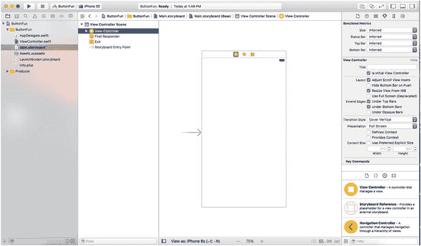

**图 3-4.**  
在 Xcode 的 Interface Builder 中打开的 Main.storyboard 进行编辑

让我们花点时间思考一下我们的应用程序。我们将向用户界面添加两个按钮和一个标签，这个过程与我们上一章构建应用程序时添加标签的过程非常相似。然而，我们还需要插座变量和操作才能使应用程序具有交互性。

每个按钮都需要触发控制器上的一个操作方法。我们可以选择让每个按钮调用不同的操作方法；但由于它们将执行基本上相同的任务（更新标签的文本），我们将需要调用相同的操作方法。我们将使用前面讨论过的那个 `sender` 参数来区分这两个按钮。除了操作方法之外，我们还需要一个连接到标签的插座变量，以便能够更改标签显示的文本。

我们将先添加按钮，然后放置标签，并在设计界面时创建相应的操作和插座变量。我们也可以手动声明操作和插座变量，然后将用户界面元素连接到它们，但 Xcode 可以为我们处理这些。


### 添加按钮与操作方法

首先，我们将向用户界面添加两个按钮。接着，让 Xcode 为我们创建一个空的操作方法，并将两个按钮都连接到该方法。用户轻点按钮时，我们在该方法中编写的任何代码都将被执行。

选择“视图”➜“实用工具”➜“显示对象库”，或按下 `^⌥⌘3` 打开对象库。在对象库的搜索框中输入 `UIButton`。（实际上，你只需输入前四个字符 `uibu` 即可缩小列表范围。你可以全部使用小写字母，省去按 `Shift` 键的麻烦。）输入完成后，对象库中应只显示一个项目：按钮（见图 3-5）。

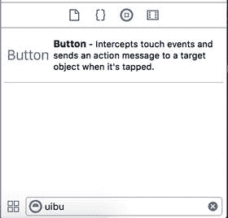

图 3-5. 对象库中显示的按钮

将按钮从库中拖出，放到编辑区域内的白色窗口上，将按钮添加到应用的视图中。将按钮置于视图左侧，利用将按钮移向视图左边缘时出现的垂直蓝色辅助线，使其与左边缘保持适当距离。对于垂直位置，使用水平蓝色辅助线将按钮置于视图的中部。如果这有帮助，你可以参考图 3-1 作为放置指南。

> **注意：** 在 Interface Builder 中移动对象时出现的小蓝色辅助线，是为了帮助你遵循 iOS 人机界面指南（HIG）。苹果为设计 iPhone 和 iPad 应用的人员提供了 HIG。HIG 告诉你应该如何——以及不应该如何——设计用户界面。你真的应该阅读它，因为它包含每个 iOS 开发者都需要了解的宝贵信息。你可以在 [`https://developer.apple.com/library/ios/documentation/UserExperience/Conceptual/MobileHIG/`](https://developer.apple.com/library/ios/documentation/UserExperience/Conceptual/MobileHIG/) 找到它。

双击新添加的按钮。这将允许你编辑按钮的标题。将这个按钮的标题设置为 `Left`。

选择“视图”➜“辅助编辑器”➜“显示辅助编辑器”，或按下 `⌥⌘⏎` 打开辅助编辑器。你也可以通过点击项目窗口右上角七个按钮组中间的编辑器按钮（见图 3-6）来显示或隐藏辅助编辑器。

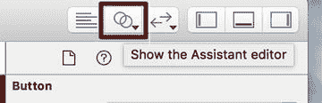

图 3-6. 显示辅助编辑器切换按钮（双圆圈）

辅助编辑器出现在编辑窗格的右侧，而编辑窗格继续显示 Interface Builder。辅助编辑器应自动显示 `ViewController.swift`，这是“拥有”当前视图的视图控制器的实现文件。

> **提示：** 打开辅助编辑器后，你可能需要调整窗口大小以获得足够的操作空间。如果你使用的是较小屏幕（如 MacBook Air 的屏幕），你可能需要关闭实用工具视图和/或项目导航器，以便为有效使用辅助编辑器腾出空间（见图 3-7）。你可以通过项目窗口右上角的三个视图按钮轻松实现这一点（见图 3-6）。

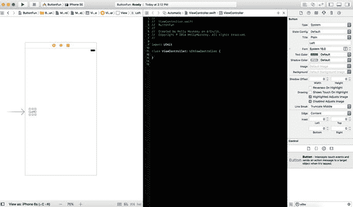

图 3-7. 在较小显示器上，你可能需要关闭其他视图才能同时看到两个编辑窗口

Xcode 知道我们的视图控制器类负责显示故事板中的视图，因此辅助编辑器知道要向我们展示视图控制器类的实现，这是最可能连接操作和出口的地方。然而，如果它没有显示你想要的文件，你可以使用辅助编辑器顶部的跳转栏来修正。首先，找到跳转栏中标有 `Automatic` 的段并点击它。在出现的弹出菜单中，选择 Manual ➜ Button Fun ➜ Button Fun ➜ `ViewController.swift`。现在你应看到正确的文件。

接下来，让 Xcode 自动为我们创建一个新的操作方法，并将该操作与我们刚刚创建的按钮关联。我们将把这些定义添加到视图控制器的类扩展中。为此，首先点击你添加到故事板中的按钮，使其被选中。然后，按住键盘上的 `Control` 键，并从按钮点击并拖动到辅助编辑器中的源代码上。你应该会看到一条从按钮延伸到光标的蓝色线，如图 3-8 所示。这条蓝线允许我们将 IB 中的对象连接到代码或其他对象。将光标移动到类定义内部，如图 3-8 所示，会出现一个弹出窗口，提示你释放鼠标按钮将为你插入一个出口、操作或出口集合。

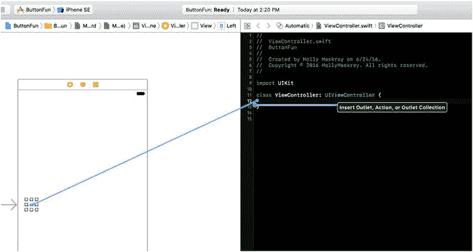

图 3-8. 按住 Control 键拖拽到源代码将让你选择创建出口、操作或出口集合

> **注意：** 我们在本章中使用操作和出口，并在本书后面使用出口集合。出口集合允许你将多个同类型对象连接到一个数组属性，而不是为每个对象创建单独的属性。

要完成此连接，释放鼠标按钮，将出现一个浮动弹出窗口，如图 3-9 所示。

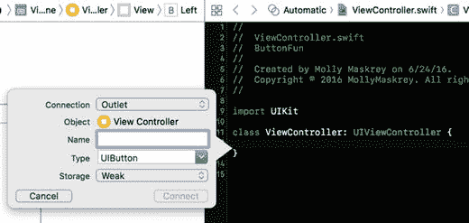

图 3-9. 按住 Control 键拖拽到源代码后出现的浮动弹出窗口

此窗口允许你自定义新操作。在窗口中，点击标有 `Connection` 的弹出菜单，并将选项从 `Outlet` 改为 `Action`。这告诉 Xcode 我们要创建一个操作而不是出口（见图 3-10）。在 `Name` 字段中，输入 `buttonPressed`。完成后，不要按 `Return` 键。按下 `Return` 会确认我们的出口；我们还没有完全准备好。相反，请按下 `Tab` 键移动到 `Type` 字段，输入 `UIButton`，替换默认值 `AnyObject`。

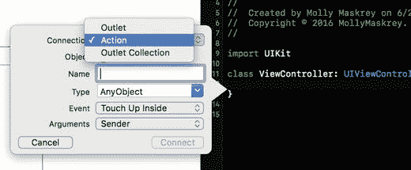

图 3-10. 从 `Outlet` 更改为 `Action`

`Type` 下面有两个字段，我们将保留其默认值。`Event` 字段让你指定何时调用该方法。默认值 `Touch Up Inside` 在用户从屏幕抬起手指时触发——当且仅当手指仍停留在按钮上时。这是按钮的标准事件。这给了用户重新考虑的机会。如果用户在抬起手指前将手指移离按钮，该方法将不会触发。

`Arguments` 字段让你选择可用于操作方法的三种不同方法签名。我们想要 `sender` 参数，以便能够分辨是哪个按钮调用了该方法。这是默认选项，因此我们保持原样。

按下 `Return` 键或点击 `Connect` 按钮，Xcode 将为你插入操作方法。辅助编辑器中的 `ViewController.swift` 文件现在应如代码清单 3-5 所示。我们将回到这里编写当用户点击此按钮或我们稍后添加的按钮时需要执行的代码。


```swift
import UIKit
class ViewController: UIViewController {
@IBAction func buttonPressed(_ sender: UIButton) {
}
}
```
**代码清单 3-5**：已添加 `IBAction` 的 `ViewController.swift` 文件

除了创建方法代码段，Xcode 还将该按钮连接到了该方法，并将该信息存储在了故事板中。这意味着我们无需再做任何其他操作，即可让该按钮在应用运行时调用此方法。

回到 `Main.storyboard`，再拖出另一个按钮，这次将其放置在屏幕右侧。蓝色参考线会像之前那样出现，帮助你将其与右边缘对齐，同时还会帮助你将该按钮与另一个按钮垂直对齐。放置好按钮后，双击它并将其名称改为 `Right`。

**提示**  
除了从对象库中拖出一个新对象，你也可以按住 `⌥` 键（Option 键）并拖出原始对象（本例中为 `Left` 按钮）的副本。按住 `⌥` 键会告诉接口生成器复制你拖动的对象。

这次，我们不想创建新的操作方法。相反，我们希望将这个按钮连接到刚才 Xcode 为我们创建的那个已有的方法。更改按钮名称后，按住 Control 键并点击该按钮，然后拖向助理编辑器中 `buttonPressed()` 方法代码的声明处。这次，当光标靠近 `buttonPressed()` 时，该方法会高亮显示，并且你会看到一个灰色的弹出窗口，显示**连接操作**（见图 3-11）。如果没有立即看到，请移动鼠标直到它出现。看到弹出窗口后，松开鼠标按钮，Xcode 就会将该按钮连接到操作方法。这样，当按钮被点击时，就会触发与另一个按钮相同的操作方法。

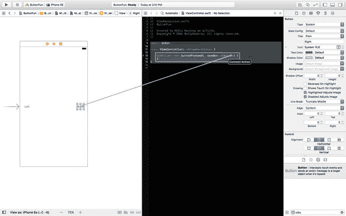

**图 3-11**：拖向现有操作会将按钮连接到该操作

## 添加标签和输出口

在对象库中，在搜索框中输入 `lab` 来查找标签用户界面项（见图 3-12）。将标签拖到用户界面上，位置在你之前放置的两个按钮上方某处。放置好后，使用调整大小手柄将标签从左边缘（由蓝色参考线指示）拉伸到右边缘。这样应该能为我们将要显示给用户的文本留出足够空间。

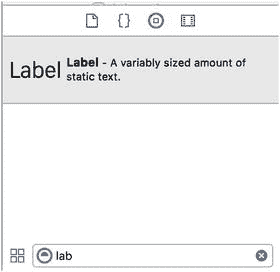

**图 3-12**：标签在对象库中的显示样子

默认情况下，标签中的文本是左对齐的，但我们希望这个标签中的文本居中。选择**视图** ➤ **实用工具** ➤ **显示属性检查器**（或按 `⌥⌘4`）以调出属性检查器（见图 3-13）。确保标签已选中，然后在属性检查器中找到**对齐**按钮。选择中间的**对齐**按钮来居中标签文本。

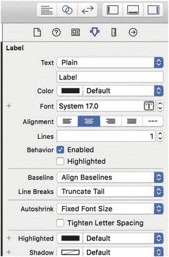

**图 3-13**：使用属性检查器居中标签文本

在用户点击按钮之前，我们希望标签是空白的，因此双击标签（以便选中文本）并按键盘上的**删除**按钮。这将删除当前分配给标签的文本。按 **Return** 键确认更改。即使未选中时你看不到标签，它仍然在那里。

**提示**  
如果你有不可见的用户界面元素（如空标签），并希望能够看到它们的位置，请从**编辑器**菜单中选择**画布**。接着，从弹出的子菜单中，开启**显示边界矩形**。如果你只是想选择一个看不到的元素，只需在文档大纲中点击它的图标即可。

最后，让我们为标签创建一个输出口。我们的操作方式与之前创建和连接操作方法完全相同。确保助理编辑器已打开并显示 `ViewController.swift`。如果需要切换文件，请使用助理编辑器上方跳转栏中的弹出菜单。

接下来，在界面生成器中选择标签，然后按住 Control 键从标签拖向头文件。拖动直到光标位于现有操作方法正上方。当看到类似图 3-14 的情况时，松开鼠标按钮，你会再次看到弹出窗口（如图 3-9 所示）。

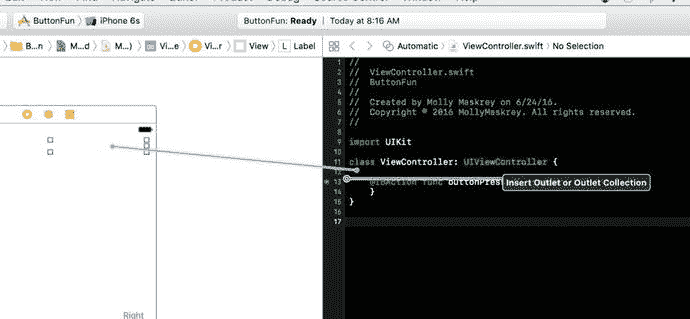

**图 3-14**：连接 `UILabel` 输出口

将**连接**保留为默认类型的**输出口**。我们想为这个输出口选择一个描述性的名称，以便在编写代码时记住它的用途。在**名称**字段中输入 `statusLabel`。将**类型**字段保留为 `UILabel`。最后一个名为**存储**的字段，可以保留默认值。

按 **Return** 键确认更改，Xcode 会将输出口属性插入到你的代码中。你的代码现在应该看起来像代码清单 3-6。

```swift
import UIKit
class ViewController: UIViewController {
@IBOutlet weak var statusLabel: UILabel!
@IBAction func buttonPressed(_ sender: UIButton) {
}
}
```
**代码清单 3-6**：将标签输出口添加到视图控制器

现在我们有了一个输出口，Xcode 已经神奇地将标签连接到了我们的输出口。这意味着如果我们对代码中的 `statusLabel` 进行任何更改，这些更改都会影响用户界面中的标签。例如，设置 `statusLabel` 的文本属性会更改显示给用户的文本。

## 自动引用计数

如果你熟悉 C 或 C++ 这类语言，在使用完后需要小心释放分配的内存，那么你可能会有些担忧，因为我们似乎一直在创建对象却没有销毁它们。

如今 Xcode 自带的 LLVM 编译器足够智能，能够使用一个名为**自动引用计数**（Automatic Reference Counting，ARC）的功能来为我们释放对象。

ARC 仅适用于 Swift 对象和结构体，不适用于 Core Foundation 对象或使用 C 语言库函数（如 `malloc()`）分配的内存，并且有一些注意事项和陷阱可能会让你出错。但大多数情况下，担心内存管理已经成为了过去式。

要了解更多关于 ARC 的信息，请查看此 URL 上的 ARC 发布说明：

[`developer.apple.com/library/ios/#releasenotes/ObjectiveC/RN-TransitioningToARC/`](http://developer.apple.com/library/ios/#releasenotes/ObjectiveC/RN-TransitioningToARC/)

ARC 非常有用，但它并非魔法。你仍然应该理解 iOS 中内存管理的基本规则，以避免在使用 ARC 时遇到问题。要了解 iOS（和 macOS）的内存管理约定，请阅读此 URL 上的苹果**内存管理编程指南**：

[`developer.apple.com/library/ios/documentation/Cocoa/Conceptual/MemoryMgmt/Articles/MemoryMgmt.html`](https://developer.apple.com/library/ios/documentation/Cocoa/Conceptual/MemoryMgmt/Articles/MemoryMgmt.html)


#### 编写操作方法

到目前为止，我们已设计好用户界面，并连接了插座变量（outlets）和操作方法（actions）。剩下的工作就是利用这些操作方法和插座变量，在按下按钮时设置标签的文本。在项目导航器中单击`ViewController.swift`，在编辑器中打开它。找到 Xcode 先前为我们创建的空白`buttonPressed()`方法。

为了区分两个按钮，我们将使用`sender`参数。通过 sender 获取被按下按钮的标题，然后基于该标题创建新字符串，并将其赋值为标签的文本。将`buttonPressed()`方法修改为清单 3-7 所示的内容。

```
@IBAction func buttonPressed(sender: UIButton) {
let title = sender.title(for: .selected)!
let text = "\(title) button pressed"
statusLabel.text = text
}
清单 3-7.
完成操作方法
```

这相当直观。第一行使用`sender`获取被点击按钮的标题。由于按钮可能根据当前状态（尽管本例中没有）具有不同的标题，我们使用`UIControlState.selected`参数指定在按钮处于选中状态时获取其标题，因为用户通过点击使其处于选中状态。我们将在第 4 章更详细地介绍控件状态。

提示

你或许注意到调用`title(for: )`方法时使用的参数是`.selected`，而不是`UIControlState.selected`。Swift 已经知道该参数必须是`UIControlState`枚举中的某个值，因此我们可以省略枚举名称以减少输入。

下一行通过将文本`button pressed`附加到上一行获取的标题来创建新字符串。因此，如果标题为“Left”的左侧按钮被点击，该行将创建内容为“Left button pressed”的字符串。最后一行将新字符串赋值给标签的文本属性，这就是我们更改标签显示文本的方式。

### 测试 ButtonFun 应用

选择“产品”➤“运行”。如果遇到任何编译或链接错误，请返回并对比您的代码修改与本教程中的修改。代码构建成功后，Xcode 将启动 iOS 模拟器并运行您的应用。如果在 iPhone 模拟器上运行并点击“Left”按钮，您将看到类似图 3-15 的结果。

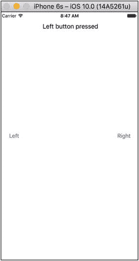

图 3-15.

在 iPhone 6s 上运行应用

尽管一切看起来正常，但整体布局仍需调整。要了解原因，如图 3-16 所示，将活动方案更改为 iPhone SE 并再次运行应用。

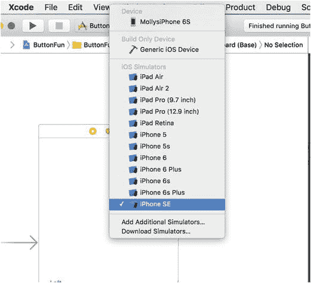

图 3-16.

更改方案（即执行目标），变为不同尺寸和形状的设备

结果显示在图 3-17 中，暴露了问题。请注意，虽然左侧按钮仍然可用，但标签本身向右偏移了一些，而右侧按钮完全消失了。

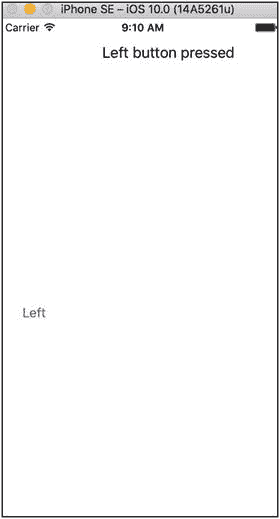

图 3-17.

使用不同的模拟设备时，我们的布局有些问题

为了了解原因，在 Xcode 的界⾯构建器窗口下方，点击右侧按钮将其选中并查看轮廓，然后在下方的“View As”中选择 iPhone SE，如图 3-18 所示。您可以看到，由于我们将布局设置为适用于屏幕尺寸较大的设备，当切换到较小设备时，部分控件在新的显示区域内发生了移动。

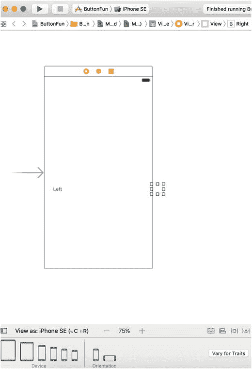

图 3-18.

在屏幕区域较小的设备上查看布局时，右侧按钮发生位移，不再可见

#### 使用自动布局修复问题

左侧按钮位置正确，但标签和另一个按钮位置不对。在第 2 章中，我们使用自动布局（Auto Layout）解决了类似问题。自动布局的核心思想是使用约束（constraints）来指定控件的放置方式。在本例中，我们希望实现以下效果：

*   “Left”按钮应垂直居中并靠近屏幕左边缘。
*   “Right”按钮应垂直居中并靠近屏幕右边缘。
*   标签应水平居中，并距屏幕顶部稍向下一些。

上述每条描述都包含两个约束——一个是水平约束，另一个是垂直约束。如果我们将这些约束应用于三个视图，自动布局将负责在任何屏幕上正确定位它们。那么具体如何操作呢？您可以在代码中通过创建`NSLayoutConstraint`类的实例来为视图添加自动布局约束。在某些情况下，这是实现正确布局的唯一方法，但在此例（以及本书的所有示例）中，您可以通过使用界⾯构建器来获得所需布局。界⾯构建器允许您通过拖拽和点击直观地添加约束。首先，在界⾯构建器窗口下的“View As”中，重新选择 6s 作为设备，以便看到与之前一致的控件。将缩放比例设置为能够看到整个屏幕；我使用的是 75%。我们也将使用自动布局来修复其他设备配置的问题（见图 3-19）。

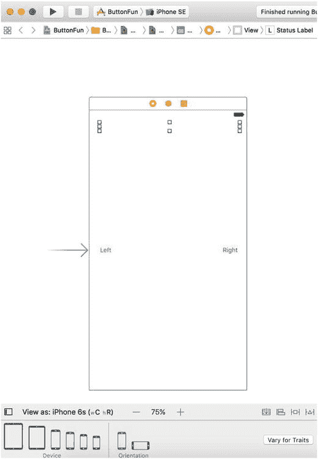

图 3-19.

我们将使用与初始相同的设备的自动布局，来配置所有其他设备类型

我们先从定位标签开始。在项目导航器中选择`Main.storyboard`，打开文档大纲以显示视图层级。找到标记为“View”的图标。这代表视图控制器的主视图，我们需要相对于它来定位其他视图。如果“View”图标尚未展开，点击其展开三角形，显示两个按钮（标记为“Left”和“Right”）以及标签。按住 Control 键，将鼠标从标签拖拽到其父视图，如图 3-20 左侧所示。

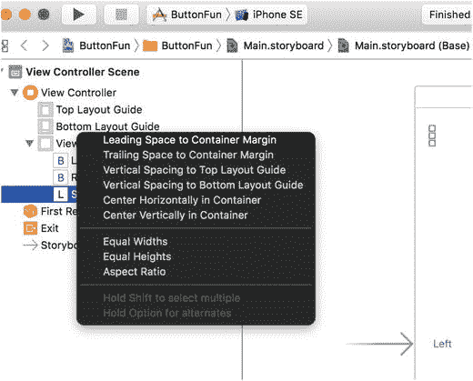

图 3-20.

使用自动布局约束定位标签

通过将一个视图拖拽到另一个视图，您是在告诉界⾯构建器要在它们之间应用自动布局约束。释放鼠标后，将出现一个灰色弹出菜单，其中包含各种选项，如图 3-20 右侧所示。此弹出菜单中的每个选项都是一个单独的约束。点击其中任何一个都将应用该约束，但我们知道需要对标签应用两个约束，而这两个约束都在弹出菜单中。要同时应用多个约束，您需要在选择时按住 Shift 键。因此，按住 Shift 键并点击“Center Horizontally in Container”和“Vertical Spacing to Top Layout Guide”。要实际应用约束，请点击弹出菜单外部的任意位置或按回车键。执行此操作后，您创建的约束将出现在文档大纲的“Constraints”标题下，并同时在故事板中直观显示，如图 3-21 所示。

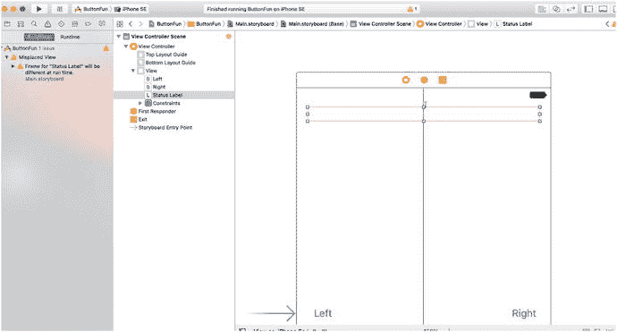

图 3-21.

已对标签应用了两个自动布局约束

提示

如果在添加约束时出错，可以通过在文档大纲或故事板中点击其表示，然后按 Delete 键将其移除。


你可能还会看到标签（label）有一个橙色的轮廓。Interface Builder 使用橙色来表示自动布局（Auto Layout）问题。Interface Builder 以这种方式强调的典型问题有三种：

*   你没有足够的约束来完全指定视图的位置或大小。
*   视图的约束存在歧义——也就是说，它们没能唯一确定其大小或位置。
*   约束是正确的，但视图在运行时的位置和/或大小与 Interface Builder 中的不同。

你可以通过点击活动视图（Activity View）中的黄色警告三角形，在问题导航器（Issue Navigator）中查看解释，来了解更多关于该问题的信息（见图 3-21，最左侧）。如果你这样做，你会看到它显示“Status Label”的框架（Frame）在运行时将会不同——这是所列出的第三个问题。你可以通过让 Interface Builder 将标签移动到其正确的运行时位置并赋予其配置好的大小来消除此警告。为此，请查看故事板编辑器（storyboard editor）的右下侧。你会看到四个按钮，如图 3-22 所示。

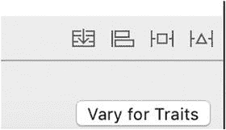

图 3-22. 故事板编辑器右下角的自动布局按钮

你可以通过将鼠标悬停在按钮上来了解每个按钮的功能。最左边的按钮与`UIStackView`控件相关，我们将在第 10 章讨论。从左到右，其他三个按钮的功能如下：

1.  对齐（Align）按钮允许你将选中的视图相对于另一个视图对齐。如果你现在点击此按钮，你会看到一个包含各种对齐选项的弹出窗口。其中一个是“容器中水平居中”（Horizontal Center in Container），这是一个你已经从文档大纲（Document Outline）应用于标签的约束。在 Interface Builder 中，实现自动布局相关功能通常有多种方法。随着你阅读本书，你会看到完成最常见自动布局任务的替代方法。
2.  固定（Pin）按钮的弹出窗口包含一些控件，允许你设置视图相对于其他视图的位置，并应用大小约束。例如，你可以设置一个约束，将一个视图的高度约束为与另一个视图相同。
3.  解决自动布局问题（Resolve Auto Layout Issues）按钮允许你纠正布局问题。你可以使用其弹出窗口中的菜单项，让 Interface Builder 移除视图（或整个故事板）的所有约束，猜测哪些约束可能缺失、添加它们，并将一个或多个视图的框架调整到它们在运行时的样子。

你可以通过在文档大纲或故事板中选择标签，然后点击解决自动布局问题按钮来修复标签的框架。此按钮的弹出窗口有两个相同的操作组（见图 3-23）。

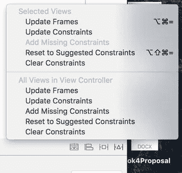

图 3-23. 解决自动布局问题按钮的弹出窗口提示

如果弹出窗口中的项目都没有启用，请点击文档大纲中的标签以确保它被选中，然后重试。

如果你从顶部组中选择一个操作，它仅应用于当前选中的视图，而底部组的操作则应用于视图控制器中的所有视图。在这种情况下，我们只需要修复一个标签的框架，所以点击弹出窗口顶部部分的“更新框架”（Update Frames）。当你这样做时，橙色轮廓和活动视图中的警告三角形都会消失，因为标签现在拥有了它在运行时的位置和大小。实际上，标签已经缩小到零宽度，并在故事板中由一个小的空正方形表示，如图 3-24 所示。

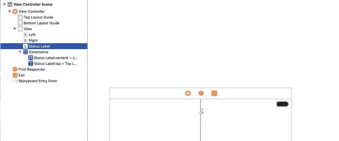

图 3-24. 修复其框架后，标签已缩小到零尺寸

结果表明，这实际上正是我们希望看到的。许多 UIKit 提供的视图，包括`UILabel`，都能够让 Auto Layout 根据其实际内容设置其大小。它们通过计算其自然或固有内容大小（intrinsic content size）来实现这一点。在固有大小下，标签刚好足够宽、足够高，以完全包围其包含的文本。目前，这个标签没有内容，所以其固有内容大小在两个轴向上确实应该为零。当我们运行应用程序并点击其中一个按钮时，标签的文本被设置，其固有内容大小发生变化。当这种情况发生时，Auto Layout 将自动调整标签大小，以便你可以看到所有文本。

现在我们处理好了标签，接下来将修复两个按钮的位置。在故事板中选择左按钮，然后点击故事板编辑器右下角的对齐按钮（图 3-22 中从左数第二个按钮）。我们希望按钮垂直居中，所以在弹出窗口中选择“容器中垂直居中”（Vertical Center in Container），然后点击“添加 1 个约束”（Add 1 Constraint）（见图 3-25）。

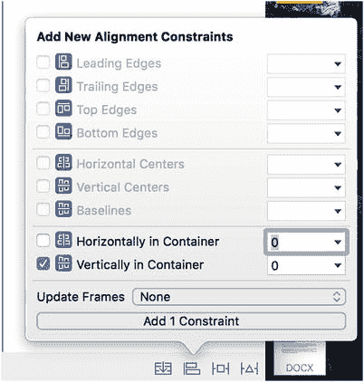

图 3-25. 使用对齐弹出窗口垂直居中视图

我们需要对右按钮应用相同的约束，所以选择它并重复此过程。在你执行此操作时，Interface Builder 发现了几个新问题，表现为故事板中的橙色轮廓和活动视图中的警告三角形。点击三角形以在问题导航器中查看警告的原因，如图 3-26 所示。

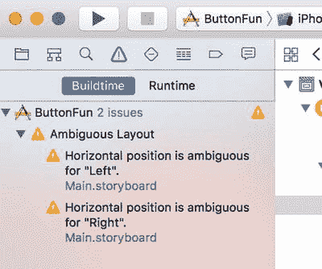

图 3-26. Interface Builder 关于缺失约束的警告

Interface Builder 警告我们，两个按钮的水平位置是不明确的。实际上，由于我们尚未设置任何约束来控制按钮的水平位置，这并不奇怪。

注意

在设置 Auto Layout 约束时，出现此类警告是正常的。你应该利用它们来帮助设置一套完整的约束。完成布局过程后，你应该没有任何警告。本书中的大多数示例都包含设置布局约束的说明。在添加这些约束时，你通常会遇到警告，但如果你在完成所有步骤后仍有警告，则无需担心。在这种情况下，你可能漏掉了一步，执行步骤不正确，或者书中有错误。如果是后一种情况，请通过提交勘误到本书的页面[`www.apress.com`](http://www.apress.com)让我们知道。


我们希望左按钮与父视图左侧保持固定距离，右按钮与父视图右侧保持相同距离。我们可以从 **“Pin”** 按钮（图 3-22 中 **“Align”** 按钮右侧的那个）的弹出菜单中设置这些约束。选中左按钮，点击 **“Pin”** 按钮打开其弹出菜单。在弹出菜单顶部，你会看到四个输入框，通过橙色虚线连接到一个小方块，如图 3-27 左侧所示。这个小方块代表我们正在约束的按钮。四个输入框允许你设置按钮与其上方、下方、左侧和右侧最近邻居之间的距离。虚线表示尚未存在任何约束。对于左按钮，我们希望设置它与父视图左侧之间的固定距离，因此点击方块左侧的橙色虚线。点击后，虚线变为实线橙色线，表示现在已有要应用的约束。接下来，在左侧输入框中输入 `32`，设置左按钮到其父视图的距离。

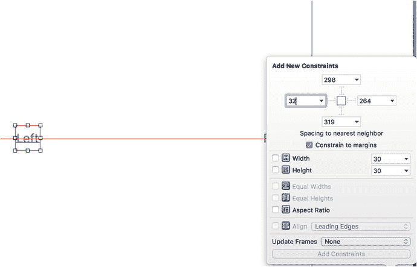

**图 3-27.** 使用 Pin 弹出菜单设置视图的水平位置

要固定右按钮的位置，选中它，点击 **“Pin”** 按钮，点击方块右侧的橙色虚线（因为我们将此按钮固定到其父视图的右侧），在输入框中输入 `32`，然后点击 `Add 1 Constraint`。

我们现在已经应用了所有需要的约束，但活动视图中可能仍有警告。如果你检查一下，会发现警告是因为按钮没有位于正确的运行时位置。要解决这个问题，我们再次使用 `Resolve Auto Layout Issues` 按钮。点击该按钮（最右侧的那个）打开其弹出菜单，然后从底部选项组中点击 `Update Frames`。我们使用底部选项组中的选项，因为我们需要调整视图控制器中所有视图的框架。

**提示**

你可能会发现顶部选项组中没有可用的选项。如果出现这种情况，请选择文档大纲中的 **“View Controller”** 图标，然后重试。

警告现在应该消失，我们的布局终于完成了。在 iPhone 模拟器上运行应用程序。你会看到结果几乎与本章开头的图 3-1 相似。当你点击右侧按钮时，应显示此文本：`Right button pressed.`。如果你随后点击左侧按钮，标签将变为 `Left button pressed.`。在 iPad 模拟器上运行此示例，你会发现布局仍然有效，尽管由于屏幕更宽，按钮之间的距离更大。这就是自动布局的强大之处。

**提示**

在大屏幕模拟设备上运行应用程序时，你可能会发现无法一次性看到整个屏幕。你可以通过在 iOS 模拟器菜单中选择 `Window ➤ Scale`，然后选择适合你屏幕的缩放比例来解决此问题。

如果你回头查看图 3-1，会发现缺少一样东西。我们为最终结果展示的截图以粗体文本显示所选按钮的名称；然而，我们目前所做的只是显示一个普通字符串。我们稍后将使用 `NSAttributedString` 类来添加粗体效果。让我们看一下 Xcode 的另一个有用功能——**布局预览**。

### 预览布局

返回 Xcode 并选择 `Main.storyboard`，然后打开助理编辑器（如果尚未显示，请参考图 3-6 了解操作方法）。在助理编辑器顶部跳转栏的左侧，你会看到当前选择是 `Automatic`（除非你已将其更改为 `Manual` 以选择助理编辑器要显示的文件）。点击打开此跳转栏段的弹出菜单，你会看到几个选项，最后一个选项是 `Preview`。当将光标悬停在 `Preview` 上时，会出现一个包含应用程序故事板名称的菜单。点击它，在预览编辑器中打开故事板。

当预览编辑器打开时，你会看到应用程序在 iPhone 竖屏模式下的显示效果。这只是一个预览，因此它不会响应按钮点击，因此你不会看到标签。如果将鼠标移动到预览下方显示 `iPhone 6s` 的区域，会出现一个控件，允许你将手机旋转到横屏模式。你可以在图 3-28 左侧看到该控件，以及点击它旋转手机后的结果。

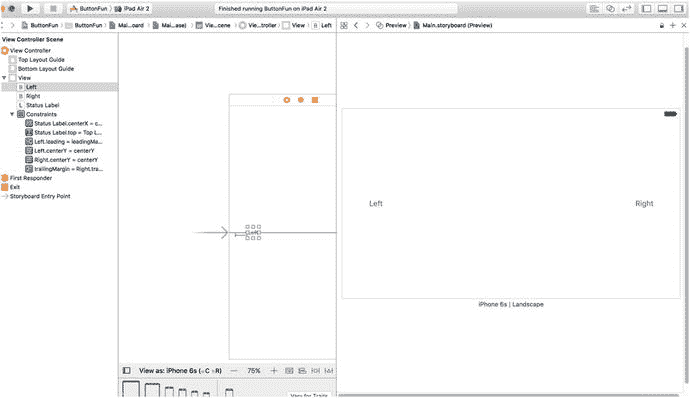

**图 3-28.** 预览 iPhone 在横屏模式下的布局

使用自动布局，当我们旋转手机时，按钮会移动，使其保持垂直居中，并且与设备两侧的距离与竖屏方向相同。如果标签可见，你会看到它也处于正确位置。

我们还可以使用预览助理查看在另一台设备上运行应用程序时会发生什么。在预览助理的左下角（以及图 3-28 中），你会看到一个 `+` 图标。点击它以打开设备列表，然后选择 `iPhone SE` 将新预览添加到预览助理。如果你仍然无法看到所有内容，可以通过几种不同的方式缩放预览助理。最简单的方法是双击预览助理窗格——这会在全尺寸视图和更小的视图之间切换。如果你希望对缩放级别有更多控制，可以在触控板上使用捏合手势（遗憾的是，至少在撰写本文时，这在 Magic Mouse 上不受支持）。图 3-29 显示了两个 iPhone 预览，缩小后以适应我屏幕上的可用空间。同样，自动布局已将按钮安排到正确位置。旋转 iPhone SE 预览以查看布局在横屏模式下是否也有效。

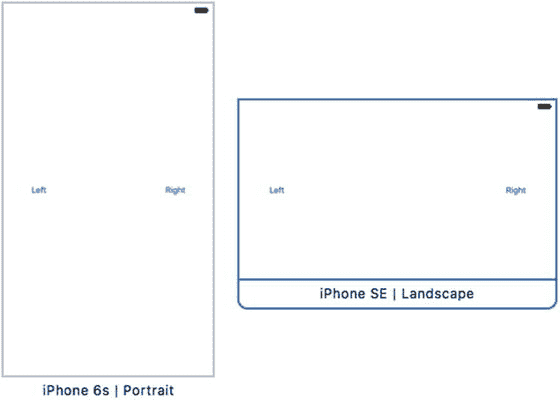

**图 3-29.** 同时在两台设备上预览布局

**注意**

在撰写本文时，预览助理未能正确显示 iPad 9.7 英寸和 12.9 英寸的预览布局。这很可能是由于 Xcode 8 测试版中的错误造成的。但是，在模拟器中运行它们显示它们工作正常。


### 更改文本样式

`NSAttributedString` 类允许你为字符串附加格式化信息，例如字体和段落对齐方式。这些元数据可以应用于整个字符串，也可以对不同的部分应用不同的属性。如果你想象一下在文字处理器中如何对文本片段应用格式化，那么这基本上就是 `NSAttributedString` 的工作模型。大部分主要的 UIKit 控件都允许你使用属性字符串。对于像我们这里使用的 `UILabel` 来说，只需创建一个属性字符串，然后通过它的 `attributedText` 属性将其传递给标签即可。

因此，选择 `ViewController.swift` 并更新 `buttonPressed()` 方法，如代码清单 3-8 所示。

```
import UIKit

class ViewController: UIViewController {
    @IBOutlet weak var statusLabel: UILabel!
    
    @IBAction func buttonPressed(_ sender: UIButton) {
        let title = sender.title(for: .selected)!
        let text = "\(title) button pressed"
        let styledText = NSMutableAttributedString(string: text)
        let attributes = [
            NSFontAttributeName:
                UIFont.boldSystemFont(ofSize: statusLabel.font.pointSize)
        ]
        let nameRange = (text as NSString).range(of: title)
        styledText.setAttributes(attributes, range: nameRange)
        statusLabel.attributedText = styledText
    }
}
```

*代码清单 3-8. 更新后的 `buttonPressed()` 方法，用于添加粗体字体特性*

新代码首先做的事情是基于我们要显示的字符串创建一个属性字符串——具体来说，是一个 `NSMutableAttributedString` 实例。这里我们需要一个可变的属性字符串，因为我们想要更改它的属性。

接下来，我们创建一个字典来存放要应用于字符串的属性。目前我们只有一个属性，所以这个字典只包含一个键值对。键 `NSFontAttributeName` 让我们可以为属性字符串的一部分指定一种字体。传入的值是粗体系统字体，其大小与标签当前使用的字体大小相同。从长远来看，以这种方式指定字体比按名称指定字体更灵活，因为系统总能合理地知道该用什么粗体字。

然后，我们请求文本字符串提供标题所在子字符串的范围（包含起始索引和长度）。我们使用这个范围将属性应用于属性字符串中与标题对应的部分，并将其传递给标签。让我们仔细看看定位标题字符串的那行代码：

```
let nameRange = (text as NSString).range(of: title)
```

注意，`text` 变量从 Swift 类型 `String` 被转换成了 Core Foundation 类型 `NSString`。这是必要的，因为 `String` 和 `NSString` 都有一个名为 `range(of: String)` 的方法。我们需要调用 `NSString` 的方法来获取一个 `NSRange` 对象作为范围，因为下一行中的 `setAttributes()` 方法期望的就是这种类型。

现在你可以点击“运行”按钮。你会看到应用用粗体文本显示了被点击按钮的名称，如图 3-1 所示。

## 检查应用委托

现在我们的应用能运行了，在进入下一个主题之前，让我们花点时间看看我们尚未检查的源代码文件——`AppDelegate.swift`。这个文件实现了我们的应用委托。

Cocoa Touch 广泛使用了委托，委托是负责代表另一个对象执行某些任务的对象。应用委托让我们可以在某些预定义的时间点代表 `UIApplication` 类做一些事情。每个 iOS 应用都恰好有一个 `UIApplication` 实例，它负责应用的主运行循环并处理应用级别的功能，例如将输入路由到相应的控制器类。`UIApplication` 是 UIKit 的一个标准部分；它主要在幕后工作，因此你通常无需担心它。

在应用执行的某些明确定义的时间点，如果委托存在并实现了相应的方法，`UIApplication` 就会调用其委托上的特定方法。例如，如果你有需要在程序退出前执行的代码，你应该在你的应用委托中实现 `applicationWillTerminate()` 方法，并将终止代码放在那里。这种类型的委托允许你的应用实现行为，而无需继承 `UIApplication` 子类，甚至无需了解 `UIApplication` 的内部工作原理。所有的 Xcode 模板都会为你创建一个应用委托，并安排它在应用启动时与 `UIApplication` 对象建立联系。

在项目导航器中点击 `AppDelegate.swift`，查看项目模板提供的应用委托存根。前几行应该看起来像代码清单 3-9 所示。

```
import UIKit
@UIApplicationMain
class AppDelegate: UIResponder, UIApplicationDelegate {
    var window: UIWindow?
```

*代码清单 3-9. 应用委托初始代码*

以粗体高亮显示的代码表示这个类遵循一个名为 `UIApplicationDelegate` 的协议。按住 ⌥ 键。你的光标应变为十字准线。移动光标使其悬停在 `UIApplicationDelegate` 字样上。你的光标会变成一个问号，并且 `UIApplicationDelegate` 字样会像浏览器中的链接一样被高亮显示（见图 3-30）。

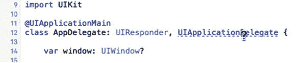

*图 3-30.* 在 Xcode 中按住 ⌥ 键（Option 键）并将鼠标指向代码中的某个符号时，该符号会被高亮显示，光标会变成一个带问号的手型指针

在按住 ⌥ 键的同时点击这个链接。会打开一个小弹出窗口，显示 `UIApplicationDelegate` 协议的简要概述（见图 3-31）。

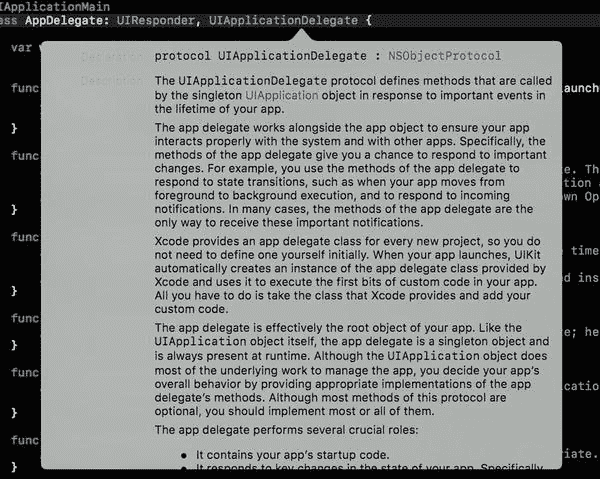

*图 3-31.* 我们在源代码中按住 Option 键并点击 `UIApplicationDelegate` 时，Xcode 会弹出这个名为“快速帮助”面板的窗口，其中描述了该协议

向下滚动弹出窗口到底部，你会找到两个链接（见图 3-32）。

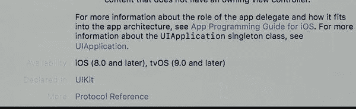

*图 3-32.* 指向所选项目附加信息的链接

注意这个新的弹出式文档窗口底部的两个链接；点击 **更多** 链接可查看此符号的完整文档，或点击 **声明于** 链接可在头文件中查看符号的定义。同样的技巧也适用于类名和协议名，以及编辑器窗格中显示的方法名。只需按住 Option 键并点击一个单词，Xcode 就会在文档浏览器中搜索该单词。


学会快速查阅文档固然值得，但了解该协议的说明或许更为重要。在这里，你将找到应用委托可以实现的那些方法，以及这些方法会在何时被调用。花点时间阅读这些方法的描述，对你来说很可能是值得的。

回到项目导航器中，打开 `AppDelegate.swift` 查看应用委托的实现。它看起来应该类似于代码清单 3-10。

```
import UIKit
@UIApplicationMain
class AppDelegate: UIResponder, UIApplicationDelegate {
var window: UIWindow?
func application(_ application: UIApplication, didFinishLaunchingWithOptions launchOptions: [NSObject: AnyObject]?) -> Bool {
// 应用启动后进行自定义设置的覆盖点。
return true
}
func applicationWillResignActive(_ application: UIApplication) {
// 当应用即将从活跃状态切换到非活跃状态时发送。这可能发生在某些类型的临时中断（例如来电或短信）时，或者当用户退出应用并开始过渡到后台状态时。
// 使用此方法暂停正在进行的任务、禁用计时器并降低 OpenGL ES 帧率。游戏应使用此方法来暂停游戏。
}
func applicationDidEnterBackground(_ application: UIApplication) {
// 使用此方法释放共享资源、保存用户数据、使计时器失效，并存储足够的应用状态信息，以便在应用稍后终止时将其恢复到当前状态。
// 如果您的应用支持后台执行，当用户退出时，将调用此方法而不是 applicationWillTerminate：。
}
func applicationWillEnterForeground(_ application: UIApplication) {
// 作为从后台到活跃状态转换的一部分被调用；在此处您可以撤消许多在进入后台时所做的更改。
}
func applicationDidBecomeActive(_ application: UIApplication) {
// 重新启动在应用处于非活跃状态时暂停（或尚未开始）的任何任务。如果应用之前在后台运行，可以选择刷新用户界面。
}
func applicationWillTerminate(_ application: UIApplication) {
// 当应用即将终止时调用。如果合适，请保存数据。另请参阅 applicationDidEnterBackground：。
}
}
```
代码清单 3-10. 我们的 `AppDelegate.swift` 文件

在文件顶部，你可以看到我们的应用委托实现了文档中涵盖的其中一个协议方法，名为 `application(_: didFinishLaunchingWithOptions:)`。正如你可能猜测的那样，此方法会在应用完成所有设置工作并准备好开始与用户交互时立即触发。它通常用于创建需要在运行应用的整个生命周期内存在的任何对象。

你将在本书后面看到更多相关内容，特别是在第 15 章中，我们将在那里更详细地讨论委托在应用生命周期中所扮演的角色。在结束本章之前，我们只是想给你提供一些关于应用委托的背景知识，并展示这一切是如何联系在一起的。

## 总结

本章的简单应用向你介绍了 MVC、创建并连接输出口和操作、实现视图控制器以及使用应用委托。你学会了如何在按钮被点击时触发操作方法。并且你看到了如何在运行时更改标签的文本。尽管我们构建了一个非常简单的应用，但所使用的基本概念与 iOS 下所有控件（不仅仅是按钮）所基于的概念是相同的。事实上，本章中我们使用按钮和标签的方式，很大程度上与我们将在 iOS 下实现和交互的大多数标准控件的方式相同。

理解我们在本章中所做的一切以及我们这样做的原因至关重要。如果你不理解，请务必复习你不完全理解的部分。如果事情不是完全清楚，随着我们在本书后面创建更复杂的界面，你只会变得更加困惑。

在下一章中，我们将介绍一些其他标准的 iOS 控件。你还将学习如何使用警报来通知用户重要事件，以及如何使用操作表来指示用户在继续操作前需要做出选择。


