# 4. 添加中级用户交互

在第 3 章中，我们讨论了 MVC 并使用它构建了一个应用程序。你学习了 outlet 和 action，并将按钮控件连接到文本标签上。在本章中，我们将构建一个包含更广泛控件集的应用程序，以加深你对用户界面开发的熟悉程度，如图 4-1 所示。

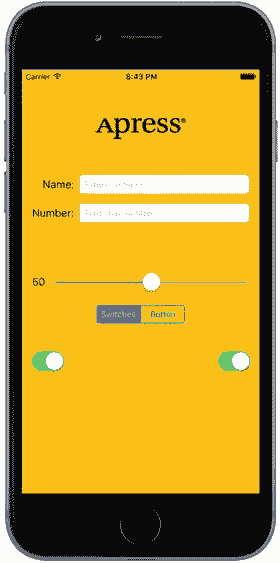

图 4-1. 本章项目通过组合多个新控件来提升你的 UI 技能

我们将实现一个图像视图、一个滑块、两个不同的文本字段、一个分段控件、几个开关，以及一个看起来像 iOS 7 之前样式的 iOS 按钮。你将了解如何设置和检索各种控件的值。你将学习如何使用操作表强制用户做出选择，以及如何使用警报向用户提供重要的反馈。你还将了解控件状态以及如何使用可拉伸图像来改变按钮的外观。

由于本章的应用使用了如此多的不同用户界面元素，我们的工作方式将与之前两章略有不同。我们将把应用程序拆分成多个部分，一次实现一个部分。在 Xcode 和 iOS 模拟器之间来回切换，我们将在进入下一部分之前测试每个部分。将构建复杂界面的过程分解为更小的组件，不仅使其不那么令人生畏，而且更接近你在构建自己的应用程序时所经历的实际过程。这种编码-编译-调试循环占据了软件开发人员日常工作的大部分时间。

我们的应用只使用了一个视图和控制器；但正如你在图 4-1 中所见，这个视图中的复杂性要高得多。

屏幕顶部的 Logo 位于一个图像视图中，在这个应用中，它除了显示静态图像外什么都不做。我在 Logo 下方放置了两个文本字段：一个允许输入字母数字文本，另一个只允许输入数字。文本字段下方是一个滑块。当用户移动滑块时，它旁边标签的值会随之变化，始终反映滑块的当前值。

滑块下方是一个分段控件和两个开关。分段控件在其下方的空间内切换两种不同类型的控件。当应用程序首次启动时，分段控件下方会出现两个开关。改变任一开关的值会导致另一个开关的值也随之改变。虽然你在实际应用中不太可能这样做，但这演示了如何以编程方式更改控件的值，以及 Cocoa Touch 如何在无需你做任何工作的情况下对某些操作进行动画处理。

图 4-2 展示了用户点击分段控件时发生的情况。开关消失，取而代之的是一个按钮。

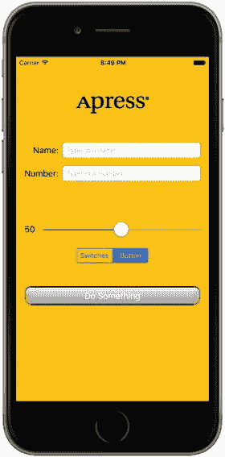

图 4-2. 点击左侧的分段控制器会显示一对开关。点击右侧则会显示一个按钮，如图所示

按下“Do Something”按钮会弹出一个操作表，询问用户是否真的打算按下该按钮（见图 4-3）。注意操作表现在是如何高亮显示并处于前景中，而其他控件则变暗。

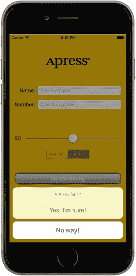

图 4-3. 操作表请求用户做出响应

这提供了一种标准方式来响应可能具有危险性或可能产生重大影响的输入，并给用户一个机会来阻止潜在问题的发生。如果选择了“Yes, I'm Sure!”，应用程序会显示一个警报，让用户知道一切正常（见图 4-4）。

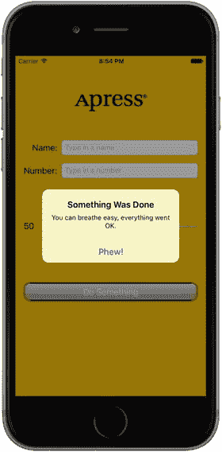

图 4-4. 当重要事件发生时，警报会通知用户。我们的应用使用一个警报来确认一切正常

## 主动、静态和被动控件

界面控件以三种基本模式运行：主动、静态（或不活动）和被动。我们在上一章中使用的按钮是主动控件的典型示例。你按下它们，就会有事情发生——通常是你编写的 Swift 代码会执行。

尽管你直接使用的许多控件会触发操作方法，但并非所有控件都以此方式工作。我们将在本应用中实现的图像视图除了在应用中显示图像外不做其他事情；虽然它可以配置为触发操作方法——但在这里，用户不会对它进行任何操作。标签和图像控件通常以此方式工作。

某些控件以被动模式运行，仅保存用户输入的值，直到你准备好使用它。这些控件不会触发操作方法，但用户可以与其交互并更改它们的值。被动控件的一个经典示例是网页上的文本字段。虽然可以创建当用户跳出字段时触发的验证代码，但绝大多数网页文本字段仅包含在用户单击提交按钮时提交给服务器的数据。文本字段本身通常不会触发任何代码，但当提交按钮被点击时，文本字段的数据会被传递给相关的 Swift 代码。

在 iOS 设备上，大多数可用的控件在所有三种模式下都能工作，并且几乎所有的控件都可以根据你的需求在多种模式下工作。所有 iOS 控件都是`UIControl`的子类，这使得它们能够触发操作方法。许多控件可以被动使用，并且所有控件都可以被设置为不活动或不可见。例如，使用一个控件可能会触发另一个不活动的控件变为活动状态。然而，某些控件（例如按钮）如果不在主动模式下用于触发代码，实际上没有太大用途。

iOS 上的控件与 Mac 上的控件之间存在一些行为差异。以下是一些示例：

- 由于多点触控界面，所有 iOS 控件都可以根据被触摸的方式触发多个操作。用户用手指在控件上滑动可能触发与轻点不同的操作。
- 你可以设置在用户按下按钮时触发一个操作，而在手指从按钮上抬起时触发另一个不同的操作。
- 你可以让一个控件在单个事件上调用多个操作方法。例如，当用户在触摸按钮后抬起手指时，你可以让两个不同的操作方法在“Touch Up Inside”事件上触发。

**注意**：尽管在 iOS 上控件可以触发多个方法，但绝大多数情况下，你最好实现一个单一的操作方法来满足控件的特定使用需求。你通常不需要这种能力，但在 Interface Builder 中工作时最好记住这一点。在 Interface Builder 中将事件连接到操作，并不会断开同一控件上之前已连接的操作！这可能导致应用中出现令人惊讶的错误行为，即一个控件会触发多个操作方法。在 Interface Builder 中重新定位事件时请保持警惕，并确保在连接到新操作之前移除旧操作。

iOS 与 Mac 之间的另一个主要差异源于一个事实：通常 iOS 设备没有物理键盘。标准的 iOS 软件键盘实际上只是一个充满一系列按钮控件的视图，由系统为你管理。你的代码很可能永远不会直接与 iOS 键盘交互。


## 创建 Control Fun 应用

打开 Xcode 并创建一个名为 `Control Fun` 的新项目。我们将再次使用**单视图应用**模板，因此按照前两章的步骤创建项目即可。

创建好项目后，我们先把要在图像视图中使用的图片准备好。图片必须先导入到 Xcode 中，才能在 Interface Builder 中使用，所以现在就来操作吧。在示例源代码归档的 `04 - Logos` 文件夹中，你会找到三个文件，分别命名为 `apress_logo.png`、`apress_logo@2x.png` 和 `apress_logo@3x.png`，它们是同一张图片的标准版和两个 Retina 版本。我们将把这三个文件全部添加到新项目的资源目录中，让应用在运行时决定使用哪一个。如果你更愿意使用自己选择的一组图片，请确保它们是 `.png` 格式，且尺寸适合可用空间。小版本的高度应小于 100 像素，宽度最大为 300 像素，这样它才能在最窄的 iPhone 屏幕的视图顶部舒适地显示，而无需调整大小。较大的版本应分别为小版本的两倍和三倍大小。

在 Xcode 中，选择项目导航器中的 `Assets.xcassets`，然后在访达中打开 `04 - Logos` 文件夹并选中全部三张图片。接着，将图片拖拽到 Xcode 的编辑区域并松开鼠标。Xcode 会根据图片名称判断出你正在添加名为 `apress_logo` 的图片的三个版本，并为你完成其余工作（见图 4-5）。你会看到在编辑区域左侧列中，原先的 `AppIcon` 条目下方出现了一个 `apress_logo` 条目。现在，你可以在代码或 Interface Builder 中使用名称 `apress_logo` 来引用这个图片集，运行时将会加载正确的版本。

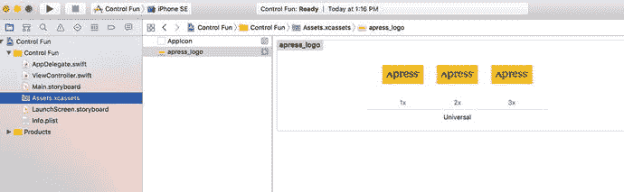

图 4-5. 将我们的 apress_logo 图片添加到 Xcode 项目

## 实现图像视图和文本字段

将图片添加到项目后，下一步是在应用屏幕顶部实现五个界面元素：图像视图、两个文本字段和两个标签，如图 4-6 所示。

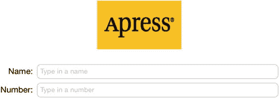

图 4-6. 我们首先实现的图像视图、标签和文本字段

### 添加图像视图

在项目导航器中，点击 `Main.storyboard` 以在 Interface Builder 中打开主故事板。你会看到熟悉的白色背景和一个可以布置应用界面的方形视图。与上一章一样，在 IB 窗口下方，选择 **iPhone 6s** 作为我们的 **View As:** 选项。

**注意：** 画布下方的这个区域是 Xcode 8 的新功能，称为**视图尺寸**，它允许我们选择在 IB 画布中查看当前场景的视图方式。

如果对象库未打开，请选择 **View** ➤ **Utilities** ➤ **Show Object Library** 将其打开。在列表中向下滚动约四分之一，找到 `ImageView`（见图 4-7），或者在搜索框中直接输入 `image`。请记住，对象库对应的是库面板顶部的第三个图标。

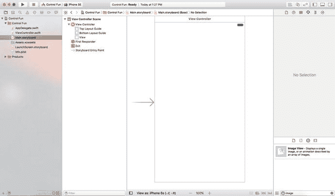

图 4-7. Interface Builder 对象库中的图像视图元素

将一个图像视图拖拽到故事板编辑器的视图上，并将其放置在靠近视图顶部的位置，如图 4-8 所示。目前不必担心精确定位——我们将在下一节中进行调整。

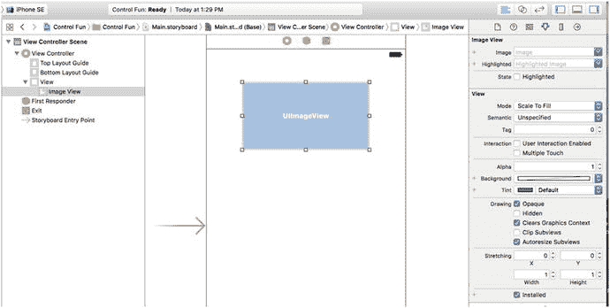

图 4-8. 向故事板添加 UIImageView

选中图像视图后，按下 `⌥⌘4` 打开属性检查器。你应该会看到 `UIImageView` 类的可编辑选项。对我们图像视图来说，最重要的设置是检查器中顶部标有 **Image** 的选项。点击字段右侧的小箭头，会弹出一个菜单，列出可用的图片。这个列表包括你添加到项目资源目录中的所有图片。选择你之前添加的 `apress_logo` 图片，它应该会显示在图像视图中，如图 4-9 所示。

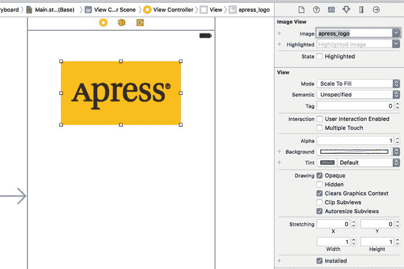

图 4-9. 图像视图属性检查器。我们从检查器顶部的图片弹出菜单中选择了图片，图像视图随即显示了该图片


### 调整图像视图大小

我们使用的图像与其放置的图像视图尺寸并不相同。默认情况下，Xcode 会缩放图像以完全填满其图像视图。属性检查器中的“Mode”设置（默认为“Scale To Fill”）就是这一操作的重要提示。虽然我们可以让应用保持这种状态，但通常最好在运行时之前完成所有必要的图像缩放，因为图像缩放会消耗时间和处理器周期。在本例中，我们完全不想进行任何缩放，因此让我们将图像视图的大小调整为图像的精确尺寸。首先，将“Mode”属性更改为“Center”，这表示图像不应缩放，并且应在分配给图像视图的任何空间中居中显示。现在，让图像视图适配图像的尺寸。为此，请确保图像视图处于选中状态，以便您能看到其轮廓和调整控制柄，然后按下 `⌘=` 或选择 Xcode 菜单中的 Editor ➤ Size to Fit Content。如果按下 `⌘=` 无效，或者“Size to Fit Content”呈灰色不可用状态，请重新选中图像视图，将其向侧面拖动一小段距离，然后重试。

**提示**

如果在编辑区域选择某个项目时遇到困难，您可以点击左下角的小矩形图标打开文档大纲。现在，在文档大纲中单击您想要选中的项目，果然，该物品就会在编辑器中被选中。

要获取嵌套在另一个对象中的对象，请点击外层对象左侧的展开三角形以显示嵌套对象。在本例中，要选择图像视图，首先点击视图左侧的展开三角形。然后，当图像视图出现在文档大纲中时，点击它，它就会在编辑区域中被选中。

现在图像视图已调整大小，我们将其移回居中位置。您已经知道如何操作，因为我们在第 3 章中做过同样的事情。拖动图像视图直到它在水平方向上居中，点击编辑器区域右下角的“Align”图标，勾选“Horizontally in Container”复选框，然后点击“Add 1 Constraint”。

您可能会注意到，Interface Builder 显示了一些实线，这些线从一个视图的边缘延伸到其父视图的边缘（不要与拖动项目时显示的蓝色虚线混淆），或者从父视图的一侧延伸到另一侧。这些实线代表您已添加的约束。如果您点击刚刚添加的约束来选中它，您会发现它变成了一条贯穿主视图整个高度的实橙色线，如图 4-10 所示。

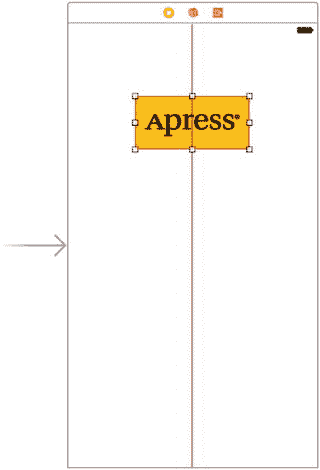

图 4-10.

一旦我们将图像视图调整为适合其图像的大小，我们就使用视图的蓝色参考线将其拖动到位，并创建一个约束来使其保持居中

实线表示您已选中该约束。它为橙色这一事实意味着图像视图的位置和/或大小尚未完全确定，因此您需要添加更多约束。您可以通过点击活动视图中的橙色三角形来了解问题所在。在本例中，Xcode 告诉我们，我们需要为图像视图设置一个垂直约束。您可以现在使用第 3 章中介绍的技术进行设置，或者等到本章后面我们为布局修复所有约束时再处理。

**提示**

在 Interface Builder 中拖动和调整视图大小可能比较棘手。别忘了使用文档大纲，您可以通过点击编辑区域左下角的小矩形图标来打开它。在调整大小时，按住 `➤` 键，Interface Builder 会在屏幕上绘制一些有用的红色线条，从而更容易感知图像视图的位置。这个技巧在拖动时不起作用，因为按住 `➤` 键会提示 Interface Builder 复制被拖动的对象。但是，如果您选择 Editor ➤ Canvas ➤ Show Bounds Rectangles，Interface Builder 会在所有界面项目周围绘制线条，使其更容易看到。再次选择“Show Bounds Rectangles”可以关闭这些线条。

### 设置视图属性

选中您的图像视图，然后将注意力转回属性检查器。检查器中“Image View”部分下方是“View”部分。您可能已经推断出，这里的模式是：特定于所选对象的属性显示在最顶部，其后是适用于所选对象父类的更通用属性。在本例中，`UIImageView` 的父类是 `UIView`，因此下一部分简单地标记为“View”，它包含任何视图类都具有的属性。

#### Mode 属性

视图检查器中的第一个选项是一个标记为“Mode”的弹出菜单。“Mode”菜单定义了视图将如何显示其内容。如您所见，就图像视图而言，这决定了图像在视图内部的对齐方式以及是否缩放以适配。您可以随意尝试 `apress_logo` 的各种选项，但完成后请记得将其重置为“Center”。

如前所述，选择任何会导致图像缩放的选项都可能会在运行时增加处理开销，因此最好尽可能避免这种情况，并在导入图像之前正确调整其大小。如果您想以多种尺寸显示同一张图像，通常最好在项目中拥有同一张图像的不同尺寸副本，而不是强制 iOS 设备在运行时进行缩放。当然，有时在运行时进行缩放是合适的，甚至是不可避免的；这是一条指导原则，而非硬性规定。

#### Semantic 属性

紧挨在“Mode”下方，您会找到 `Semantic` 属性。此属性在 iOS 9 中添加，允许您指定在从右到左阅读顺序的区域设置（如希伯来语或阿拉伯语）中，视图应如何呈现。默认情况下，视图状态为“unspecified”（未指定），但您可以通过在此处选择合适的值来更改它。有关更多详细信息，请参阅 Xcode 文档中 `UIView` 类的 `semanticContentAttribute` 属性描述。

#### Tag

下一个项目“Tag”值得一提，尽管我们在本章中不会用到它。`UIView` 的所有子类（包括所有视图和控件）都有一个名为 `tag` 的属性，它只是一个数值，您可以在此处或在代码中设置它。标签是供您使用的——系统不会设置或更改其值。如果您为控件或视图分配了一个标签值，那么除非您更改它，否则可以确信该标签将始终具有该值。

标签提供了一种简单、与语言无关的方式来识别界面中的对象。假设您有五个不同的按钮，每个都有不同的标签，并且您希望使用单个操作方法处理所有五个按钮。在这种情况下，您可能需要某种方法在调用您的操作方法时区分这些按钮。与标签不同，标记永远不会改变，因此如果您在 Interface Builder 中设置了标签值，您就可以将其作为一种快速可靠的方法，通过 `sender` 参数来检查哪个控件被传递到了操作方法中。


#### 交互复选框

“交互”部分的两个复选框与用户交互相关。第一个复选框 `User Interaction Enabled`（启用用户交互）指定用户是否能够对此对象执行任何操作。对于大多数控件，此框应被勾选，因为若未勾选，控件将永远无法触发操作方法。然而，图像视图默认未勾选，因为它们通常仅用于显示静态信息。由于我们在此只是需要在屏幕上显示一张图片，因此无需开启此项。

第二个复选框是 `Multiple Touch`（多点触控），它决定了该控件是否能够接收多点触控事件。多点触控事件支持复杂手势，例如许多 iOS 应用中用于缩放的双指捏合手势。我们将在第 18 章详细讨论手势和多点触控事件。由于此图像视图完全不接受用户交互，因此没有理由开启多点触控事件，所以请保持此复选框未勾选状态。

#### Alpha 值

检查器中的下一项是 `Alpha`。使用 `Alpha` 时需小心，因为它定义了视图的透明程度——即其下方内容透过显示的可见度。它被定义为一个介于 `0.0` 和 `1.0` 之间的浮点数，其中 `0.0` 表示完全透明，`1.0` 表示完全不透明。如果你使用任何小于 `1.0` 的值，你的 iOS 设备将以一定的透明度绘制此视图，从而使其背后的任何对象都能透显出来。当值小于 `1.0` 时，即使视图背后没有有趣的内容，也会导致你的应用程序耗费处理器周期，将部分透明的视图与背后的空白区域进行合成。因此，除非你有非常充分的理由，否则不要将 `Alpha` 设置为 `1.0` 以外的值。

#### 背景

下一项是 `Background`（背景），它决定了视图的背景颜色。对于图像视图，只有当图像未填满其视图并出现上下黑边，或者图像的某些部分透明时，此设置才有意义。由于我们已经调整了视图大小以完美匹配图像，此设置将不会产生可见效果，因此我们可以保持其默认状态。

#### 色调

下一个控件允许你为选中的视图指定一个色调颜色（tint color）。某些视图在绘制自身时会使用此颜色。我们将在本章稍后使用的分段控件会根据其色调颜色着色，但 `UIImageView` 不会。

#### 绘制复选框

在 `Tint`（色调）下方，你将看到一系列绘制（Drawing）复选框。第一个标记为 `Opaque`（不透明）。该复选框默认应处于勾选状态；如果未勾选，请点击勾选它。这会告诉 iOS，视图背后无需绘制任何内容，并允许 iOS 的绘制方法进行一些优化以加速绘制。

你可能会好奇，既然我们已经将 `Alpha` 值设置为 `1.0` 以表示不透明，为何还需要勾选 `Opaque` 复选框。Alpha 值适用于待绘制图像的各个部分；但如果图像未完全填满图像视图，或者由于 Alpha 通道的存在导致图像有孔洞，那么无论 `Alpha` 中设置的值如何，下层对象仍可能透显出来。通过勾选 `Opaque`，我们是在告诉 iOS：无论何种情况，此视图背后永远无需绘制，因此它无需在处理我们对象背后的事物上浪费处理时间。我们可以安全地勾选 `Opaque` 复选框，因为我们之前选择了 `Size To Fit`（大小适应内容），这会使图像视图与其包含的图像尺寸相匹配。

`Hidden`（隐藏）复选框的功能正如你所想。若勾选，用户将无法看到此对象。隐藏对象有时很有用，如同你将在本章后面隐藏开关和按钮时所见；然而，在绝大多数情况下——包括现在——你希望此框保持未勾选状态。

下一个复选框 `Clears Graphics Context`（清除图形上下文）极少需要勾选。当勾选时，iOS 在实际绘制对象之前，会用透明黑色绘制该对象覆盖的整个区域。再次强调，出于性能考虑且很少需要用到，应将其关闭。请确保此复选框未被勾选（默认情况下可能是勾选状态）。

`Clip Subviews`（裁剪子视图）是一个有趣的选项。如果你的视图包含子视图，且这些子视图并未完全包含在其父视图的边界内，此复选框决定了子视图的绘制方式。如果勾选了 `Clip Subviews`，则仅绘制子视图中位于父视图边界内的部分。如果未勾选 `Clip Subviews`，子视图将被完整绘制，即使它们超出了父视图的边界。

`Clip Subviews` 默认未勾选。似乎默认行为应与实际情况相反，这样子视图就无法四处随意绘制。然而，从数学计算角度来看，计算裁剪区域并仅显示子视图的一部分是一种成本相对较高的操作；大多数情况下，子视图不会超出其父视图的边界。如果你确实因某种原因需要它，可以开启 `Clip Subviews`，但出于性能考虑，它默认是关闭的。

本节最后一个复选框 `Autoresize Subviews`（自动调整子视图大小）告诉 iOS，如果此视图大小改变，则自动调整其所有子视图的大小。保持此框勾选，但由于我们不允许视图大小被调整，因此无论它是否勾选，实际上都无关紧要。

#### 拉伸

接下来你会看到一个标签仅为 `Stretching`（拉伸）的部分，它指的是矩形视图在屏幕上调整大小时被重新绘制的方式。其核心思想是，视图的整体内容并非均匀拉伸，而是可以保持视图的外边缘（例如按钮的斜边）的外观不变，即使中心部分被拉伸。

这里设置的四个浮点数让你可以指定矩形中哪些部分是可拉伸的，方法是指定视图左上角的一个点以及可拉伸区域的大小，所有值都以介于 `0.0` 和 `1.0` 之间的数字形式表示，代表占整个视图尺寸的比例。例如，如果你希望每条边有 10% 的部分不可拉伸，你可以将 `X` 和 `Y` 都设置为 `0.1`，并将 `Width` 和 `Height` 都设置为 `0.8`。在这种情况下，我们将保持默认值：`X` 和 `Y` 为 `0.0`，`Width` 和 `Height` 为 `1.0`。大多数情况下，你无需更改这些值。


### 添加文本字段

视图图片完成后，接下来该添加文本字段了。从对象库中拖取一个文本字段，放到故事板上。利用蓝色参考线将其与右侧边距对齐，并放置在图片视图下方稍远一点的位置，如图 4-11 所示。

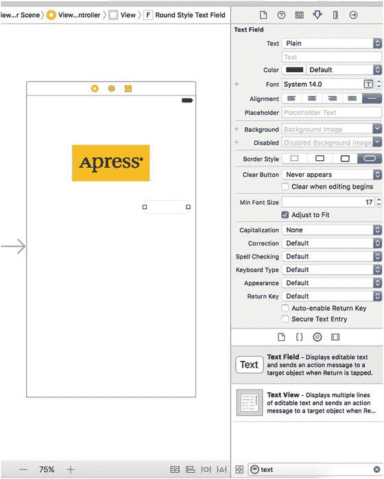

图 4-11.

从库中拖出一个文本字段，放到视图上，位于图片视图正下方，并紧贴右侧的蓝色参考线。

接下来，从库中拖出一个标签，然后拖到视图上，使其与视图左边距对齐，并与之前放置的文本字段在垂直方向上对齐。注意，当你移动标签时，会出现多条蓝色参考线，方便你通过标签的顶部、底部或中间位置与文本字段对齐。我们将使用基线来对齐标签和文本字段，在你拖拽到这些参考线的中间位置时，基线就会显示出来（参见图 4-12）。

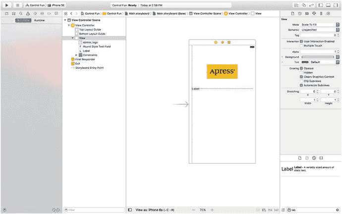

图 4-12.

使用基线参考线对齐标签和文本字段。

双击你刚刚放置的标签，将其文本从 `Label` 改为 `Name:`（注意标签末尾的冒号），然后按 `Enter` 键确认更改。

接着，从库中再拖出一个文本字段到视图上，利用参考线将其放置在第一个文本字段下方，如图 4-13 所示。

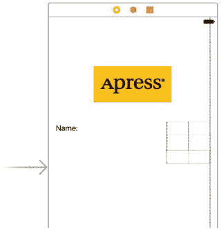

图 4-13.

添加第二个文本字段。

添加完第二个文本字段后，从库中再取出一个标签，放在左侧已有标签的下方。再次使用中间的蓝色参考线将新标签与第二个文本字段对齐。双击新标签，将其文本改为 `Number:`（同样，别忘了加冒号）。

现在，将底部文本字段的宽度向左扩展，使其紧挨着标签的右侧。为什么要从底部文本字段开始？因为我们希望两个文本字段宽度相同，而底部标签更长。

单击底部文本字段，向左拖动左侧的调整大小点，直到出现一条蓝色参考线，提示你已经到达应靠近标签的极限位置，如图 4-14 所示。这条参考线比较细微——高度仅与文本字段本身一致，所以请仔细查看。

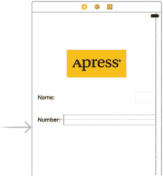

图 4-14.

扩展底部文本字段的宽度。

现在，用同样的方式扩展顶部文本字段，使其与底部字段尺寸一致。同样，蓝色参考线会提供帮助，并且这次它会一直延伸到另一个文本字段，更容易发现。

文本字段部分基本完成，但还有一个小细节。回头看看图 4-1。你注意到 `Name:` 和 `Number:` 是右对齐的吗？目前，我们的标签都靠左对齐。要右对齐这两个标签的右侧，请点击 `Name:` 标签，按住 `⇧(Shift)` 键，再点击 `Number:` 标签，将两个标签同时选中。接下来，按 `⌥⌘4` 打开属性检查器，并确保 `Label` 部分已展开，以便查看标签的特定属性。如果未展开，点击标题右侧的 `Show` 按钮将其打开。现在，使用检查器中的 `Alignment` 控件，将这两个标签的内容设置为右对齐。然后，点击编辑区域底部的 `Pin` 图标，在弹出的菜单中勾选 `Equal Widths` 复选框，并点击 `Add 1 Constraint`，添加一个约束，确保这两个字段始终保持相同的宽度。此时，活动视图中会出现一个橙色警告三角形，问题导航器中也会出现一些布局警告。先忽略它们——我们稍后会修复。

完成后，界面的这一部分应该与图 4-1 非常相似。唯一的区别是每个文本字段中的浅灰色文本。我们现在就添加它。选中顶部文本字段（即 `Name:` 标签旁边的那个），按 `⌥⌘4` 打开属性检查器（见图 4-15）。文本字段是 iOS 中最复杂的控件之一，也是最常用的控件之一。让我们从检查器顶部开始查看设置。请确保你选中的是文本字段，而不是标签或其他元素。

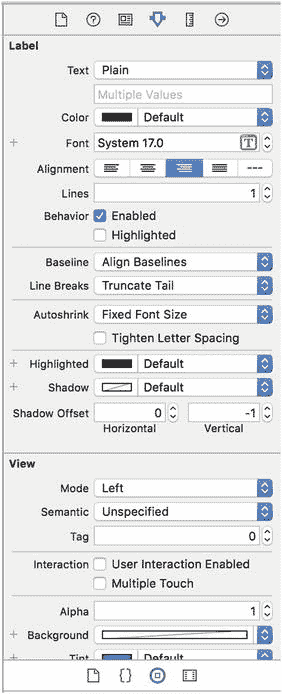

图 4-15.

显示默认值的文本字段检查器。


## 文本字段检查器设置

在第一个部分中，`Text`（文本）标签关联了两个输入字段，用于控制显示在文本字段中的文本。上方是一个弹出按钮，可让您在纯文本和富文本之间选择，富文本可以包含多种字体和其他属性。我们在第 3 章的示例中使用了富文本为部分文本添加了粗体效果。现在，我们先将该弹出按钮设置为 Plain（纯文本）。紧接着，您可以设置文本字段的默认值。当您的应用程序启动时，在此处输入的任何内容都会显示在文本字段中，而不是一片空白。

接下来是一些用于设置字体和字体颜色的控件。我们将颜色保留为默认的黑色。请注意，颜色弹出菜单分为两部分，右侧允许您从一组预设颜色中选择，左侧则让您访问颜色选择器，以便更精确地指定颜色。

字体设置分为三个部分。右侧是一个控件，可让您逐点增加或减小文本字号。左侧允许您手动编辑字体名称或字号。您可以点击 T 形框图标，调出一个弹出窗口，用于设置各种字体属性。我们将字体保留默认设置 System 14.0（系统 14.0），或根据您的配置所设置的任何字号。

在这些字段下方，有五个用于控制字段内文本对齐方式的按钮。我们将此设置保留为默认的左对齐（最左侧的按钮）。

在本节末尾，Placeholder（占位符）允许您指定一段文本，该文本会以灰色显示在文本字段内，但仅在字段为空值时可见。如果空间紧张，您可以使用占位符来代替向布局中添加标签（就像我们之前做的那样），或者用它来提示用户应在此文本字段中输入什么。请在我们当前选中的文本字段的占位符中，输入文本 `Type in a name`（输入一个名称），然后按 Enter 键确认更改。

接下来的两个字段，Background（背景）和 Disabled（禁用），仅当您需要自定义文本字段的外观时才使用，在绝大多数情况下这是不必要的，实际上也是不建议的。用户期望文本字段有其特定的外观。我们将保留其默认设置。

接下来是四个标记为 Border Style（边框样式）的按钮。这些按钮允许您更改文本字段边缘的绘制方式。默认值（最右侧的按钮）会创建 iOS 应用程序中用户最习惯看到的普通文本字段样式。您可能想查看所有四种不同的样式，但完成后，请将此设置恢复为最右侧的按钮。

在边框设置下方是一个 Clear button（清除按钮）弹出菜单，允许您选择清除按钮何时出现。清除按钮是可能出现在文本字段右端的小 X 标记。清除按钮通常用于搜索字段以及您可能经常更改值的其他字段。它们通常不包含在用于持久化数据的文本字段中，因此请将其保留为默认的 Never appears（从不出现）。

`Clear When Editing Begins`（开始编辑时清除）复选框指定了用户触摸此字段时会发生什么。如果勾选此框，该字段中先前存在的任何值都将被删除，用户将从空字段开始输入。如果未勾选此框，则之前的值将保留在字段中，用户可以对其进行编辑。请保持此框未勾选。

下一部分以一个控件开始，该控件允许您设置文本字段用于显示文本的最小字号。暂时将其保留为默认值。`Adjust to Fit`（自动调整）复选框指定了如果文本字段尺寸缩小，文本大小是否应缩小。自动调整将确保整个文本在视图中可见，即使文本通常过大而无法适应分配的空间。此复选框与最小字号设置协同工作。无论字段大小如何，文本都不会被调整为小于该最小字号。指定最小字号可以确保文本不会变得太小而难以阅读。

下一部分定义了当此文本字段被使用时，键盘的外观和行为。由于我们期望输入的是姓名，让我们将 Capitalization（自动大写）弹出菜单更改为 Words（单词）。这会导致每个单词的首字母自动大写，这通常是处理姓名时需要的效果。

接下来的四个弹出菜单——Correction（自动纠正）、Spell Checking（拼写检查）、Keyboard Type（键盘类型）和 Appearance（外观）——可以保留默认值。花点时间查看每个选项，了解这些设置的作用。

接下来是 Return Key（返回键）弹出菜单。返回键位于虚拟键盘的右下角，其标签会根据您所执行的操作而变化。例如，如果您在 Safari 的搜索字段中输入文本，它会显示 Search（搜索）。在我们这样的应用程序中，文本字段与其他控件共享屏幕，Done（完成）是合适的选择。在此处进行更改。

如果勾选了 `Auto-enable Return Key`（自动启用返回键）复选框，那么在文本字段中至少输入一个字符后，返回键才会被启用。请保持此框未勾选，因为我们允许文本字段保持为空，如果用户不想输入任何内容的话。

`Secure`（安全）复选框指定了输入的字符是否在文本字段中显示。如果文本字段被用作密码字段，您需要勾选此框。在我们的应用程序中，请保持此框未勾选。

下一部分（您可能需要向下滚动才能看到）允许您设置从 `UIControl` 继承的控件属性；但是，这些属性通常不适用于文本字段，并且除了 `Enabled`（启用）复选框之外，不会影响字段的外观。我们希望保持这些文本字段处于启用状态，以便用户可以与它们交互。请保留此部分的默认设置。

检查器中的最后一个部分，View（视图），应该看起来很熟悉。它与我们之前查看的图像视图检查器中的同名部分相同。这些是从 `UIView` 类继承的属性；由于所有控件都是 `UIView` 的子类，因此它们都共享此部分的属性。就像您之前对图像视图所做的那样，勾选 `Opaque`（不透明）复选框，并取消勾选 `Clears Graphics Context`（清除图形上下文）和 `Clip Subviews`（裁剪子视图）——原因如前所述。


好的，作为高级文档工程师和翻译员，我将严格遵循您提供的注意事项和示例，将给定的英文文本翻译成中文。


#### 设置第二个文本字段的属性

接下来，在故事板中单击下方文本字段（即`Number:`标签旁边的那个），然后返回属性检查器。在`占位符`字段中，输入`Type in a number`，并确保`开始编辑时清除`未被勾选。再往下一点，点击`键盘类型`弹出菜单。由于我们希望用户只输入数字，而不是字母，因此选择`数字键盘`。在 iPhone 上，这可以确保用户看到的键盘只包含数字，这意味着他们将无法输入字母字符、符号或数字以外的任何内容。我们不需要为数字键盘设置`回车键`值，因为该样式的键盘没有`Return`键；因此，所有其他检查器设置可以保留为默认值。正如您之前所做的那样，勾选`不透明`复选框，并取消勾选`清除图形上下文`和`剪裁子视图`。在 iPad 上，选择`数字键盘`的效果是，当用户激活文本字段时，会弹出一个处于数字模式的全功能虚拟键盘，但用户可以切换回字母输入。这意味着在实际的应用程序中，您在处理`Number`字段的内容时，必须验证用户实际输入的是否是有效的数字。

> **提示**  
> 如果您真的想阻止用户在文本字段中输入数字以外的任何内容，可以通过创建一个实现 `UITextViewDelegate` 协议中 `textView(_ textView: shouldChangeTextInRange: replacementText text:)` 方法的类，并将其设置为文本视图的委托来实现。具体细节并不复杂，但超出了本书的范围。

### 添加约束

在继续之前，我们需要调整一些布局约束。当您在 Interface Builder 中将一个视图拖到另一个视图中时（就像我们刚才所做的），Xcode 不会自动为其创建任何约束。布局系统需要一组完整的约束，因此在编译代码时，Xcode 会生成一组描述布局的默认约束。这些约束取决于每个对象在其父视图中的位置，如果它更靠近左边缘或右边缘，它将被固定到左侧或右侧。类似地，如果它更靠近顶部或底部边缘，它将被固定到顶部或底部。如果它在任一方向上居中，它通常会获得一个将其固定到中心的约束。

更复杂的是，Xcode 还可能应用自动约束，将每个新对象固定到同一父视图中的一个或多个“同级”对象。这种自动行为可能符合也可能不符合您的期望，因此通常情况下，最好在应用程序编译之前，在 Interface Builder 中创建一组完整的约束。在前两章中，我们通过一些示例进行了实践。

让我们再看一下我们目前所处的位置。要查看任何特定视图的所有有效约束，可以尝试选择它并打开大小检查器。如果您选择任一文本字段，您会看到大小检查器显示一条消息，声称所选视图没有约束。实际上，我们一直在构建的这个 GUI 只有我们之前应用的约束，这些约束将图像视图和容器视图的水平中心绑定在一起，并使标签具有相同的大小。点击图像视图和标签，在检查器中查看这些约束。

我们真正需要的是一组完整的约束，以精确地告诉布局系统如何处理我们所有的视图和控件，就像在编译时得到的那样。幸运的是，这很容易实现。通过从容器视图的左上角内部向右下角拖动鼠标框选所有视图和控件。如果您开始拖动并发现视图开始移动，只需松开鼠标，在视图内部稍微移动一点，然后重试。当所有项目都被选中后，使用菜单执行`Editor ➤ Resolve Auto Layout Issues ➤ Add Missing Constraints`命令，从菜单的`All Views in View Controller`部分。完成此操作后，您将看到我们所有的视图和控件现在都有一些蓝色的小棒将它们相互连接并连接到容器视图。每个小棒代表一个约束。现在创建这些约束而不是让 Xcode 在编译时创建它们的好处是，我们有机会在需要时修改每个约束。在本书中，我们将进一步探讨对约束可以执行的操作。

> **提示**  
> 将约束应用于视图控制器拥有的所有视图的另一种方法是在文档大纲中选择该视图控制器，然后选择`Editor ➤ Resolve Auto Layout Issues ➤ Add Missing Constraints`。

此时，所有必要的约束都已就位，我们可以修复问题导航器中的布局警告。为此，在文档大纲中选择视图控制器，然后在 Xcode 菜单中点击`Editor ➤ Resolve Auto Layout Issues ➤ Update Frames`。布局警告应该会消失。

### 创建并连接插座

对于界面的这第一部分，剩下的就是创建和连接我们的插座。我们界面上的图像视图和标签不需要插座，因为我们不需要在运行时更改它们。然而，这两个文本字段将保存我们代码中需要使用到的数据，因此我们需要指向每个文本字段的插座。

正如您可能从上一章中记得的那样，Xcode 允许我们使用助理编辑器同时创建和连接插座，该编辑器应该已经打开（但如果尚未打开，请按照前面所述打开它）。

确保在项目导航器中选中了您的故事板文件。如果您的屏幕空间不大，您可能还想在这一步中选择`View ➤ Utilities ➤ Hide Utilities`来隐藏工具面板。在助理编辑器的跳转栏中，选择`Automatic`。您应该会看到 `ViewController.swift` 文件，如图 4-16 所示。


图 4-16. 打开助理编辑器后的故事板编辑区域。您可以在右侧看到助理编辑器，其中显示了来自 `ViewController.swift` 的代码。

让我们开始连接。从顶部文本字段按住 Control 键拖拽到 `ViewController.swift` 文件中，就在 `ViewController` 行的正下方。您应该会看到一个灰色的弹出窗口，上面写着 `Insert Outlet, Action, or Outlet Collection`（参见图 4-17）。松开鼠标按钮，您会看到与上一章中相同的弹出窗口。我们想要创建一个名为 `nameField` 的插座，因此，在`名称`字段中输入 `nameField`，然后按回车键或点击`连接`按钮。

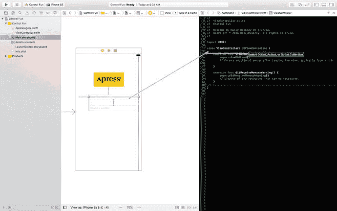

图 4-17. 打开助理编辑器后，我们按住 Control 键拖拽到源代码上，以便同时创建 `nameField` 插座并将其连接到相应的文本字段。

现在，您在 `ViewController` 中有了一个名为 `nameField` 的属性，并且它已连接到顶部文本字段。对第二个文本字段执行相同操作，创建并连接到一个名为 `numberField` 的属性。完成此操作后，您的代码应如列表 4-1 所示。

```
class ViewController: UIViewController {
@IBOutlet weak var nameField: UITextField!
@IBOutlet weak var numberField: UITextField!
列表 4-1.
我们已连接的文本字段
```


## 关闭键盘

让我们来看看应用目前的工作效果，选择 产品 ➤ 运行。我们的应用应该会出现在 iOS 模拟器中。点击 `Name` 文本字段，传统的键盘应该会弹出来。

**提示**  
如果键盘没有出现，可能是模拟器被配置为连接了硬件键盘。要解决这个问题，请在 iOS 模拟器菜单中取消选中 Hardware ➤ Keyboard ➤ Connect Hardware Keyboard，然后重试。

输入一个名字，然后点击 `Number` 字段。数字键盘应该会弹出，如图 4-18 所示。Cocoa Touch 仅仅通过向界面添加文本字段，就免费为我们提供了所有这些功能。

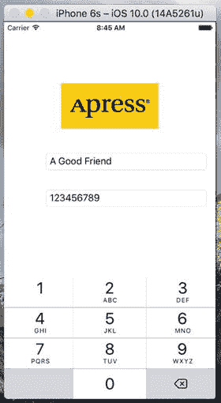  
图 4-18。当你点击文本字段或数字字段时，键盘会自动弹出

但有一个小问题。如何让键盘消失呢？直接试试看。你会发现什么都没发生。

### 点击“完成”时关闭键盘

由于键盘是基于软件的，而非实体键盘，我们需要额外几步操作来确保用户使用完毕后键盘能够消失。当用户点击文本键盘上的“完成”按钮时，会触发一个“Did End On Exit”事件。当这种情况发生时，我们需要告知文本字段放弃控制权，以便键盘消失。为此，我们需要向我们的控制器类添加一个操作方法。

在项目导航器中选择 `ViewController.swift`，并在文件底部、闭花括号之前添加列表 4-2 中的操作方法。

```
@IBAction func textFieldDoneEditing(sender: UITextField) {
    sender.resignFirstResponder()
}
```

列表 4-2。点击“完成”时关闭键盘的方法

正如我们在第 2 章中看到的，第一响应者代表用户当前正在与之交互的控件。在我们的新方法中，我们告知我们的控件放弃第一响应者的身份，将这一角色交还给用户之前操作过的控件。当一个文本字段交出第一响应者状态时，与之关联的键盘就会消失。

保存 `ViewController.swift` 文件。让我们回到故事板，并安排从我们的两个文本字段触发此操作。

在项目导航器中选择 `Main.storyboard`，单击选中 `Name` 文本字段，然后按 ⌥⌘6 调出连接检查器。这次，我们不需要上一章中使用的“Touch Up Inside”事件。相反，我们需要“Did End On Exit”事件，因为当用户点击文本键盘上的“完成”按钮时，该事件将被触发。

将“Did End On Exit”旁边的圆圈拖到故事板中的黄色 View Controller 图标上（该图标位于你一直配置的视图上方的工具栏中），然后松开鼠标。会出现一个小的弹出菜单，其中包含我们刚刚添加的单个操作的名称。点击 `textFieldDoneEditing` 操作来选择它。如果你还打开了辅助编辑器，也可以通过将连接检查器中的圆圈拖到辅助编辑器中的 `textFieldDoneEditing()` 方法来实现。对另一个文本字段重复此过程，保存更改，然后再次运行应用。

当模拟器出现后，点击 `Name` 字段，输入一些内容，然后点击“完成”按钮。正如预期，键盘消失了，但 `Number` 字段怎么办呢？从图 4-18 中可以看到，数字键盘并没有“完成”按钮。

并非所有键盘布局都包含“完成”按钮，包括数字键盘。我们可以强制用户点击 `Name` 字段然后点击“完成”，但这不太用户友好。而我们显然希望我们的应用是用户友好的。让我们看看如何处理这种情况。

### 点击背景关闭键盘

苹果的 iPhone 应用允许在大多数文本字段中通过点击视图中没有活跃控件的任何地方来让键盘消失。让我们为我们的应用实现这个功能。

答案可能因其简单而让你惊讶。我们的视图控制器包含一个从 `UIViewController` 继承而来的名为 `view` 的属性。这个 `view` 属性对应故事板中的主视图。`view` 属性指向一个 `UIView` 实例，该实例充当用户界面中所有项目的容器。它有时被称为容器视图，因为它的主要目的仅仅是容纳其他视图和控件。本质上，容器视图提供了用户界面的背景。我们需要做的就是检测用户何时点击了它。正如你将在第 18 章中看到的，有几种方法可以做到这一点。首先，`UIResponder` 类（`UIView` 派生自此类）中有一些方法，当用户将一根或多根手指放在视图上、移动手指或抬起手指时，这些方法会被调用。我们可以覆盖其中一个方法（特别是当用户从屏幕抬起手指时调用的那个方法）并在其中添加我们的代码。另一种方法是为容器视图添加一个手势识别器。手势识别器会监听用户与视图交互时生成的事件，并尝试弄清楚用户正在做什么。有几种不同的手势识别器对应不同的操作序列，正如你将在第 18 章中看到的。我们需要使用的是轻点手势识别器，当用户将手指放在屏幕上，然后在相当短的时间内再次抬起时，它会发出一个事件信号。

要使用手势识别器，你需要创建一个实例，配置它，将其链接到你要监视触摸事件的视图，并将其连接到视图控制器类中的一个操作方法。当手势被识别时，你的操作方法就会被调用。你可以通过代码创建和配置识别器，也可以在 Interface Builder 中完成。在这里，我们将使用 Interface Builder，因为它更简单。返回故事板，确保对象库可见，然后找到轻点手势识别器，将其拖到故事板上，并放到容器视图中。该识别器在运行时不可见，因此你在故事板中看不到它，但它会出现在文档大纲中，如图 4-19 所示。

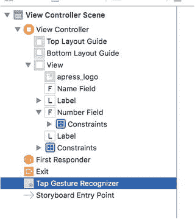  
图 4-19。文档大纲中的轻点手势识别器

选择手势识别器后，你可以在属性检查器中看到其可配置的属性，如图 4-20 所示。

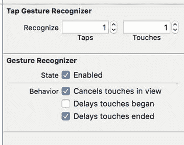  
图 4-20。轻点手势识别器的属性


`Taps`字段指定了手势识别前需要的点击次数，而`Touches`字段控制需要几根手指点击。默认的单次单指点击正是我们所需的，因此保持这两个字段不变。其他属性也无需修改，我们只需要将识别器关联到一个操作方法上。为此，在助理编辑器中打开`ViewController.swift`，然后按住 Control 键从文档大纲中的识别器拖拽到`ViewController.swift`中结束花括号上方的那一行。当出现如图 4-16 所示的常见灰色弹出窗口时松开鼠标。在打开的弹出窗口中，将连接类型改为`Action`，方法名称改为`onTapGestureRecognized`，以便让 Xcode 添加操作方法并将其关联到手势识别器。每当用户点击主视图时，此方法都会被调用。我们只需添加关闭键盘的代码（如果键盘处于打开状态）。我们已经知道如何实现，因此将代码修改为清单 4-3 所示。

```swift
@IBAction func onTapGestureRecognized(sender: AnyObject) {
    nameField.resignFirstResponder()
    numberField.resignFirstResponder()
}
```

这段代码会告知两个文本字段：如果它们处于第一响应者状态，则放弃该状态。对非第一响应者的控件调用`resignFirstResponder()`是完全安全的，因此我们无需检查哪个是第一响应者，直接对两个文本字段都调用即可。再次构建并运行应用程序，这次键盘不仅会在点击“完成”按钮时消失，还会在你点击非活动控件的任何区域时消失——这正是用户期望的行为。

### 添加滑块和标签

接下来，我们添加一个滑块和一个标签，目的是让标签显示的数值随滑块移动而变化。在项目导航器中选择`Main.storyboard`，以便向应用程序的用户界面添加更多组件。从对象库中拖出一个滑块，将其排列在“数字”文本字段下方，以右侧的蓝色参考线为停止点，并在滑块与底部文本字段之间留出一些间距。单击新添加的滑块将其选中，然后按下⌥⌘4 返回属性检查器（如果尚未显示，如图 4-21 所示）。

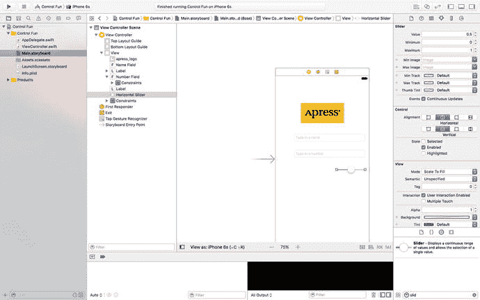

滑块允许你在给定范围内选择一个数值。使用检查器将最小值设为`1`，最大值设为`100`，当前值设为`50`。保持“连续事件更新”复选框为选中状态。这可以确保当滑块值变化时，事件会持续触发。

拖出一个标签，将其放置在滑块旁边，使用蓝色参考线使其在垂直方向上与滑块对齐，并且其左侧边缘与视图的左边距对齐（如图 4-22 所示）。

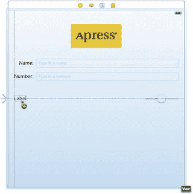

双击新放置的标签，将其文本从`Label`改为`100`。这是滑块能容纳的最大值，我们可以用它来确定滑块的正确宽度。由于`100`比`Label`短，接口生成器会自动缩小标签，就像你拖拽了右侧中间的重置大小圆点一样。尽管有这种自动行为，你仍然可以自由调整标签的大小。如果你之后想让工具再次为你选择最佳尺寸，只需按下⌘=或选择“编辑器”➤“适配内容大小”。

接下来，调整滑块大小：单击滑块将其选中，然后向左拖拽左侧的重置大小手柄，直到蓝色参考线指示你已接近标签的右侧边缘为止。

现在我们已经添加了两个控件，需要添加相应的自动布局约束。这次我们还是采用简单的方法：在文档大纲中选择“视图控制器”图标，然后点击“编辑器”➤“解决自动布局问题”➤“添加缺失的约束”。Xcode 会调整约束，使其匹配屏幕上所有控件的位置。

### 创建并连接操作和插座

对于这两个控件，剩下要做的就是将它们连接到插座和操作——我们需要一个指向标签的插座，以便在滑块被使用时更新标签的值；同时还需要为滑块提供一个操作方法，以便在其值变化时调用。确保助理编辑器已打开并显示`ViewController.swift`，然后按住 Control 键从滑块拖拽到助理编辑器中`onTapGestureRecognized()`方法的下方。当弹出窗口出现时，将“连接”字段改为`Action`，在“名称”字段中输入`onSliderChanged`，将“类型”设置为`UISlider`，然后按回车键创建并连接操作。

接下来，按住 Control 键从新添加的标签（显示`100`的那个）拖拽到助理编辑器。这次，将其拖拽到文件顶部`numberField`属性声明的下方。当弹出窗口出现时，在“名称”文本字段中输入`sliderLabel`，然后按回车键创建并连接插座。


### 实现操作（Action）方法

虽然 Xcode 已经创建并连接了我们的操作（Action）方法，但实际编写构成该方法的代码，使其按预期工作，仍需由我们完成。将 `onSliderChanged()` 方法修改为代码清单 4-4 所示的内容。

```
@IBAction func onSliderChanged(_ sender: UISlider) {
sliderLabel.text = "\(lroundf(sender.value))"
}
```

对 `lroundf()` 函数（属于标准 C 库的一部分）的调用，会获取滑块的当前值并将其四舍五入为最接近的整数。该行代码的其余部分将此值转换为包含该数字的字符串，并将其赋值给标签。

这处理了控制器对滑块移动的响应；但为了做到完全一致，我们需要确保在用户甚至还没有触摸滑块之前，标签就能显示正确的滑块数值。为此，请在 `viewDidLoad()` 方法中添加以下代码行：`sliderLabel.text = "50"`。

该方法在运行中的应用从故事板文件加载视图后、但在视图显示在屏幕上之前立即执行。我们添加的这行代码确保了用户第一时间就看到正确的起始值。

保存文件。接下来，按下 ⌘R 在 iOS 模拟器中构建并启动你的应用，然后尝试拖动滑块。当你移动滑块时，你应该会看到标签的文本实时变化。又一块拼图归位了。但是，如果你将滑块拖向左侧（使数值低于 10）或一直拖到右侧（将数值设为 100），你会看到一个奇怪的现象。当标签显示单个数字时，其左侧会水平收缩；当显示三位数字时，则会水平扩展。现在，除了标签包含的文本之外，你实际上并看不到标签本身，所以你看不到它的大小变化，但你会看到滑块实际上在与标签一起改变大小，变得更小或更大。它（滑块）与标签保持着某种尺寸关系，确保两者之间的间距始终相同。

这仅仅是 Interface Builder 工作方式的一个副作用，它帮助你创建响应式且流畅的图形用户界面（GUI）。我们之前创建了一些默认约束，而你现在看到的正是其中一个约束在起作用。Interface Builder 创建的其中一个约束保持了这些元素之间的水平距离恒定。

让我们通过创建自己的约束来覆盖这种行为。回到 Xcode，在故事板中选择标签，点击故事板底部的“图钉”图标。在弹出的菜单中，勾选“宽度”复选框，然后点击“添加 1 个约束”。这将创建一个新的高优先级约束，告诉布局系统：“不要乱动这个标签的宽度。”如果你现在按下 ⌘R 再次构建并运行，你会看到当你在滑块上来回拖动时，标签不再扩大和缩小。

在本书后续内容中，我们还会看到更多关于约束及其使用的示例。但现在，让我们先来看看如何实现开关。

## 实现开关、按钮和分段控件

让我们再次回到 Xcode；这种来回切换可能看起来有点奇怪，但在 Xcode 中，在源代码、故事板和 nib 文件之间来回跳转，并在开发过程中在 iOS 模拟器中测试你的应用，是相当常见的做法。

我们的应用将有两个开关，它们是只有两种状态（开和关）的小型控件。我们还将添加一个分段控件来隐藏和显示这些开关。除了这个控件，我们还会添加一个按钮，当分段控件的右侧被点击时，这个按钮会显示出来。

在故事板中，从对象库中拖出一个分段控件（见图 4-23），将其放置在视图窗口中，位置略低于滑块，并水平居中。

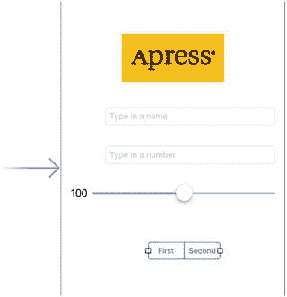

图 4-23. 将分段控件放置到故事板上

双击分段控件上的“First”字样，将标题从“First”改为“Switches”。完成此操作后，对另一个分段重复此过程，将其重命名为“Button”（见图 4-24），然后将控件拖回其居中位置。

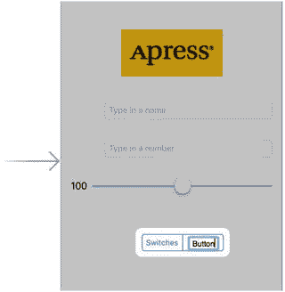

图 4-24. 重命名分段控件中的分段

### 添加两个带标签的开关

接下来，从库中取出一个开关，将其放置在视图上，位于分段控件下方并紧靠左边距。然后拖出第二个开关，将其放置在紧靠右边距的位置，并与第一个开关垂直对齐，如图 4-25 所示。

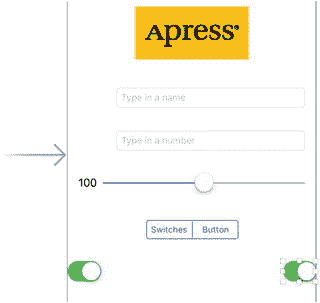

图 4-25. 向视图添加开关

提示：在 Interface Builder 中，按住 ⌥ 键并拖动对象会创建该对象的副本。当需要创建同一对象的多个实例时，从库中只拖出一个对象，然后按住 Option 键拖动出所需数量的副本，可能会更快。

我们添加的三个新控件需要布局约束。这次，我们将手动添加约束。首先，选择分段控件，点击“对齐”图标，在弹出的菜单中勾选“在容器中水平居中”，然后点击“添加 1 个约束”，使其与视图中心对齐。接下来，再次选择分段控件，按住 Control 键向上方微微拖动，直到主视图的背景变为蓝色。松开鼠标，在弹出的菜单中选择“垂直间距 - 顶部布局指南”，以固定分段控件到视图顶部的距离。

现在让我们调整开关。按住 Control 键，从左侧开关开始，相对于该开关向左上方向对角拖动，然后松开鼠标。按住 Shift 键，在弹出的菜单中同时选择“前导空间 - 容器边距”和“垂直间距 - 顶部布局指南”，松开 Shift 键，然后按 Return 键或点击弹出菜单外的任意位置以应用约束。对另一个开关执行类似操作，但这次是向相对于该开关的右上方向拖动，并选择“尾随空间 - 容器边距”和“垂直间距 - 顶部布局指南”。当你通过拖动来应用约束时，Xcode 会根据你拖动的方向提供不同的选项。如果你水平拖动，你会得到可以让你将控件附着到其父视图左边距或右边距的选项；而如果你垂直拖动，Xcode 会假定你想要设置控件相对于其父视图顶部或底部的位置。这里，每个开关我们需要一个水平约束和一个垂直约束，所以我们对角拖动以向 Xcode 表明这一点，并同时获得了水平和垂直选项。


### 连接并创建 Outlets 和 Actions

在添加按钮之前，我们需要为两个开关创建 Outlets 并连接它们。接下来要添加的按钮实际上会覆盖在开关上方，使得从开关 Control-drag 到其他元素或反向操作变得困难，因此我们希望在添加按钮之前先处理好开关的连接。由于按钮和开关永远不会同时可见，将它们放置在同一个物理位置不会产生问题。

使用助手编辑器，从左侧开关 Control-drag 到 `ViewController.swift` 中最后一个 outlet 的下方。弹出提示时，将 outlet 命名为 `leftSwitch`，然后按 Return 键。对另一个开关重复此操作，将其 outlet 命名为 `rightSwitch`。

现在，单击选中左侧开关。再次 Control-drag 到助手编辑器。这次，拖到类声明末尾的大括号上方，然后松开。弹出提示时，将 Connection 字段改为 Action，将新的 action 方法命名为 `onSwitchChanged()`，并将其 `sender` 参数的类型设置为 `UISwitch`。接下来，按 Return 键创建新的 action。现在对右侧开关重复此操作，但有一处改动：不要创建新的 action，而是将鼠标拖到刚刚创建的 `onSwitchChanged()` 方法上并连接到它。正如我们在上一章中所做的那样，我们将使用一个方法来处理两个开关。

最后，从分段控件 Control-drag 到助手编辑器，位置在 `onSwitchChanged()` 方法正下方。按照之前的操作，插入一个名为 `toggleControls()` 的新 action 方法。这次，将其 `sender` 参数的类型设置为 `UISegmentedControl`。

### 实现开关 Actions

保存故事板，然后向已在助手编辑器中打开的 `ViewController.swift` 中添加更多代码。找到 `onSwitchChanged()` 方法，将其修改为清单 4-5 所示的内容。

```
@IBAction func onSwitchChanged(_ sender: UISwitch) {
let setting = sender.isOn
leftSwitch.setOn(setting, animated: true)
rightSwitch.setOn(setting, animated: true)
}
清单 4-5.
我们新的 onSwitchChanged() 方法
```

当两个开关中的任何一个被点击时，`onSwitchChanged()` 方法就会被调用。在该方法中，我们只需获取 `sender`（代表被按下的开关）的 `isOn` 属性值，并用该值来设置两个开关。这里的思路是，设置一个开关的值会同时改变另一个开关，从而使它们始终保持同步。

现在，`sender` 始终是 `leftSwitch` 或 `rightSwitch`，你可能会疑惑为什么我们要同时设置两者。我们这样做是出于实用性考虑，因为每次设置两个开关的值比判断哪个开关发起调用然后仅设置另一个开关要更省事。无论哪个开关调用了此方法，它本身已经被设置为正确的值，再次将其设置为相同的值不会产生任何影响。

#### 添加按钮

接下来，回到 Interface Builder，从库中拖一个 Button 到你的视图上。将此按钮直接放置在左侧开关的正上方，使其与左边距对齐，并将其顶部边缘与两个开关的顶部边缘垂直对齐，如图 4-26 所示。

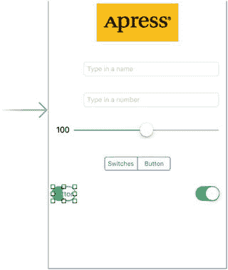

图 4-26. 在现有开关上方添加一个按钮

现在，抓住按钮右侧中间的大小调整手柄，一直向右拖动，直到到达指示右边距的蓝色参考线。按钮应完全覆盖两个开关所占的空间，但由于默认按钮是透明的，你仍然可以看到开关（见图 4-27）。

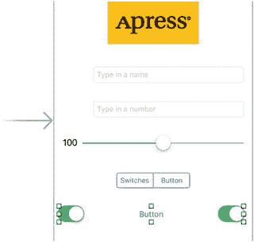

图 4-27. 放置并调整大小后的按钮占据了两个开关所占的空间

双击新添加的按钮，将其标题设置为 **Do Something**。

该按钮需要 Auto Layout 约束。我们将其固定到主视图的顶部和两侧。从按钮向上 Control-drag，直到视图背景变为蓝色，然后松开鼠标，选择 **Vertical Spacing to Top Layout Guide**。然后向左水平 Control-drag，直到主视图背景再次变为蓝色，选择 **Leading Space to Container Margin**。只有将鼠标向左拖得足够远时，才会出现此选项，因此如果没看到，请重试，向左拖动直到鼠标超出按钮边界。最后，向右 Control-drag，直到主视图背景变为蓝色，然后选择 **Trailing Space to Container Margin**。现在运行应用程序，看看我们刚刚做了什么。

#### 向按钮添加图片

如果你将正在运行的应用程序与图 4-2 进行比较，会立刻发现差异。你的 **Do Something** 按钮看起来不像图中的那样。这是因为从 iOS 7 开始，默认按钮显示非常简单的外观：它只是一段纯文本，没有轮廓、边框、背景颜色或其他装饰性特征。这很好地符合了 Apple 针对 iOS 7 及更高版本的设计指南，但在某些情况下你仍需要使用自定义按钮，因此我们将向你展示如何操作。

你在 iOS 设备上看到的许多按钮都是使用图片绘制的。我们提供了在本书源代码存档的 **04 – Button Images** 文件夹中可用于此示例的图片。在 Xcode 的项目导航器中，选择 `Assets.xcassets`（与我们之前为 Apress 标志添加图片时使用的素材目录相同），然后将 **04 – Button Images** 文件夹中的两个图片直接拖入 Xcode 窗口的编辑区域中。这些图片被添加到你的项目中，并立即可供你的应用程序使用。


## 可拉伸图像

如果查看刚添加的两个按钮图像，你会发现它们非常小，似乎太窄了，无法填满你在故事板中添加的按钮。这是因为这些图像设计为可拉伸的。恰好，UIKit 可以拉伸图像，使其完美填充你想要的几乎任何尺寸。可拉伸图像是一个有趣的概念。可拉伸图像是一种可调整大小的图像，它知道如何智能地调整自身大小，从而保持正确的外观。对于这些按钮模板，我们不希望边缘与图像的其余部分均匀拉伸。边缘插图是图像中不应调整大小的部分（以像素为单位测量）。我们希望无论按钮尺寸如何，边缘的斜面都保持不变，因此需要指定每个边缘由多少非可拉伸空间构成。

在过去，这只能通过代码实现。你需要使用图形程序测量图像的像素边界，然后在代码中使用这些数值来设置边缘插图。Xcode 6 通过让你在资源目录中直观地“切片”任何图像，消除了这一需求！这就是我们接下来要做的。

在 Xcode 中选择 `Assets.xcassets` 资源目录，并在其中选择 `whiteButton`。在编辑区域的右下角，你会看到一个标有“显示切片”的按钮。单击它以启动切片过程，该过程首先会在你的图像正上方放置一个“开始切片”按钮。点击它。你会看到三个新按钮，让你选择是希望图像垂直、水平还是双向切片（因此可拉伸）。选择中间的按钮进行双向切片。Xcode 会对图像进行快速分析，然后找到边缘周围似乎具有独特像素的部分，以及中间应可重复的垂直和水平切片。你会看到这些边界由虚线表示，如图 4-28 所示。如果你的图像比较复杂，可能需要调整这些边界（操作很简单，只需用鼠标拖动它们即可）；但对于这个图像，自动边缘插图将工作得很好。

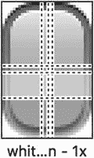

图 4-28. 白色按钮的默认切片

接下来，选择 `blueButton` 并对其执行相同的自动切片操作。现在是时候使用这些图形了。

返回你一直在处理的故事板，单击“Do Something”按钮。选中按钮后，按下 ⌥⌘4 打开属性检查器。在检查器中，使用“类型”弹出菜单将类型从“系统”更改为“自定义”。在检查器的“按钮”部分底部，你会看到可以为按钮指定图像和背景。我们将使用“背景”来显示可调整大小的图形，因此点击“背景”弹出菜单并选择 `whiteButton`。你会看到按钮现在显示白色图形，完美拉伸以覆盖整个按钮框架。

我们想使用蓝色按钮定义此按钮高亮状态的外观，也就是按钮被按下时看到的状态。我们将在本章下一节中详细介绍控件状态；但现在，只需查看顶部第二个弹出菜单，标有“状态配置”。一个 `UIButton` 可以有多种状态，每种状态都有自己的文本和图像。目前我们配置的是默认状态，因此将此弹出菜单切换到“高亮”，以便配置该状态。你会看到“背景”弹出菜单已被清空；点击它以选择 `blueButton`——大功告成。

### 控件状态

每个 iOS 控件都有五种可能的控件状态，并且在任何时刻都处于且仅处于其中一种状态：

- **默认：** 最常见的是默认控件状态，即默认状态。这是控件未处于任何其他状态时的状态。
- **聚焦：** 在基于焦点的导航系统中，当控件获得焦点时进入此状态。聚焦的控件会改变其外观以指示它具有焦点，并且此外观与控件在高亮或选中时的外观不同。与控件的进一步交互可能导致它也变得高亮或选中。
- **高亮：** 高亮状态是控件当前正被使用时的状态。对于按钮来说，这指的是用户手指放在按钮上的时候。
- **选中：** 只有部分控件支持选中状态。它通常用于指示控件已开启或被选中。选中状态与高亮类似，但即使用户不再直接使用该控件，控件也可以保持选中状态。
- **禁用：** 当控件被关闭时，它们处于禁用状态，可以通过在 Interface Builder 中取消选中“已启用”复选框或设置控件的 `isEnabled` 属性为 NO 来实现。

某些 iOS 控件具有可根据其状态取不同值的属性。例如，通过为 `isDefault` 指定一个图像，为 `isHighlighted` 指定另一个图像，我们告诉 iOS 在用户手指放在按钮上时使用一个图像，而在其他时间使用另一个图像。这基本上就是我们在故事板中为按钮配置两个不同背景状态时所做的事情。

注意

在本书的早期版本中，有四种状态：`Normal`（正常）、`Highlighted`（高亮）、`Disabled`（禁用）和 `Selected`（选中），在 Objective-C 中的枚举值为 `UIControlStateNormal`、`UIControlStateHighlighted`、`UIControlStateEnabled` 和 `UIControlStateSelected`。你可能会看到早于 Xcode 8 和 Swift 3 的旧版本引用了这些值。

### 连接和创建按钮的 Outlet 和 Action

从新按钮按住 Control 键拖动到助理编辑器，位于文件顶部部分中最后一个 outlet 的正下方。弹出窗口出现后，创建一个名为 `doSomethingButton` 的新 outlet。完成此操作后，再次从按钮按住 Control 键拖动到文件底部右大括号的上方。在那里，创建一个名为 `onButtonPressed()` 的动作方法，并将“类型”设置为 `UIButton`。

如果你保存工作并尝试运行应用程序，你会看到分段控件将处于活动状态，但它不会执行任何特别有用的操作，因为我们还需要添加一些逻辑来让按钮和开关显示和隐藏。

我们还需要从一开始就将按钮标记为隐藏。我们之前不想这样做，因为那会使连接 outlet 和 action 变得更加困难。然而，既然我们已经完成了连接，现在就来隐藏按钮。当用户点击分段控件的右侧时，我们将显示按钮；但在应用程序启动时，我们希望按钮隐藏。在故事板中，选择按钮并按下 ⌥⌘4 以调出属性检查器。向下滚动到“视图”部分，然后点击“隐藏”复选框。按钮在 Interface Builder 中仍将可见。


## 实现分段控件操作

保存故事板，将注意力重新聚焦到 `ViewController.swift` 上。找到 Xcode 为我们创建的 `toggleControls()` 方法，并添加代码清单 4-6 中所示的新代码。

```
@IBAction func toggleControls(_ sender: UISegmentedControl) {
if sender.selectedSegmentIndex == 0 {  // 选中了“开关”
leftSwitch.isHidden = false
rightSwitch.isHidden = false
doSomethingButton.isHidden = true
} else {
leftSwitch.isHidden = true
rightSwitch.isHidden = true
doSomethingButton.isHidden = false
}
}
代码清单 4-6.
根据分段控件隐藏或显示开关
```

这段代码检查了 `sender` 的 `selectedSegmentIndex` 属性，该属性告诉我们当前选中了哪个分段。第一个分段名为 `switches`，其索引为 0。我们在注释中标注了这一点，这样以后回看代码时就能清楚意图。根据选中的分段，我们隐藏或显示相应的控件。

在运行应用之前，让我们做一个小调整，使其看起来更美观一些。从 iOS 7 开始，Apple 引入了一些新的 GUI 设计范式。其中之一是屏幕顶部的状态栏变为透明，以便你的内容可以无缝地透过它显示。目前，那个黄色的 Apress 图标在我们应用的白色背景上显得格外突兀，所以让我们将黄色背景扩展到覆盖整个视图。在 `Main.storyboard` 中，选择主内容视图（在文档大纲中标记为 View），然后按下 ⌥⌘4 打开属性检查器。点击标记为 Background 的颜色样本（当前显示为白色矩形），打开标准的 OS X 颜色选择器。该颜色选择器的一个功能是允许你选取屏幕上看到的任何颜色。打开颜色选择器后，点击右下角的吸管图标，打开一个放大镜。将放大镜拖到故事板中的 Apress 图像视图上，并在它悬停在图像黄色部分时点击。现在你应该能在颜色选择器中，吸管图标旁边看到 Apress 图像的背景色。要将其设置为主内容视图的背景色，请在文档大纲中选择主视图，然后点击颜色选择器中的黄色。完成后，关闭颜色选择器。

在屏幕上，你可能会发现背景和 Apress 图像的颜色略有不同，但在模拟器或真机上运行时，它们会一致。这些颜色在 Interface Builder 中看起来不同，是因为 macOS 会根据你使用的显示器自动调整颜色。在 iOS 设备和模拟器中，则不会出现这种情况。

运行应用。你会看到黄色填充了整个屏幕，状态栏与应用内容之间没有明显的分界。如果你的应用没有需要全屏滚动的长内容，或其他需要在屏幕顶部使用导航栏或控件的内容，这可以成为一种很好的方式，呈现不受状态栏过多干扰的全屏内容。

如果你正确输入了所有代码，应该能够使用分段控件在按钮和一对开关之间切换。并且，如果你点击任一开关，另一个开关也会同步改变值。不过，按钮目前仍然没有功能。在实现它之前，我们需要讨论一下操作表和警告框。

## 实现操作表和警告框

操作表和警告框都用于向用户提供反馈：

*   操作表用于强制用户在两个或多个选项之间做出选择。在 iPhone 上，操作表从屏幕底部弹出，并显示一系列按钮（见图 4-3）。在 iPad 上，你需要指定操作表相对于另一个视图（通常是按钮）的位置。用户只有在点击了其中一个按钮后，才能继续使用应用。操作表常用于确认潜在危险或不可逆的操作，例如删除对象。
*   警告框以屏幕中央的圆角矩形形式出现（见图 4-4）。与操作表类似，警告框会强制用户在做出响应后才能继续使用应用。警告框通常用于告知用户发生了重要或异常的情况。与操作表一样，警告框可以只显示一个按钮，但如果需要提供多个响应选项，你也可以显示多个按钮。

注意

强制用户在选择后才能继续使用应用的视图被称为模态视图。


### 显示操作列表

切换到 `ViewController.swift`，我们将实现按钮的动作方法。首先，找到 Xcode 为你创建的空 `onButtonPressed()` 方法，然后添加代码清单 4-7 中的代码，以创建并显示操作列表。

```
@IBAction func onButtonPressed(_ sender: UIButton) {
let controller = UIAlertController(title: "Are You Sure?",
message:nil, preferredStyle: .actionSheet)
let yesAction = UIAlertAction(title: "Yes, I'm sure!",
style: .destructive, handler: { action in
let msg = self.nameField.text!.isEmpty
? "You can breathe easy, everything went OK."
: "You can breathe easy, \(self.nameField.text),"
+ "everything went OK."
let controller2 = UIAlertController(
title:"Something Was Done",
message: msg, preferredStyle: .alert)
let cancelAction = UIAlertAction(title: "Phew!",
style: .cancel, handler: nil)
controller2.addAction(cancelAction)
self.present(controller2, animated: true,
completion: nil)
})
let noAction = UIAlertAction(title: "No way!",
style: .cancel, handler: nil)
controller.addAction(yesAction)
controller.addAction(noAction)
if let ppc = controller.popoverPresentationController {
ppc.sourceView = sender
ppc.sourceRect = sender.bounds
}
present(controller, animated: true, completion: nil)
}
代码清单 4-7.
显示操作列表
```

我们到底做了什么？首先，在 `onButtonPressed()` 动作方法中，我们分配并初始化了一个 `UIAlertController`，这是一个视图控制器子类，可以显示操作列表或警告框：

```
let controller = UIAlertController(title: "Are You Sure?",
message:nil, preferredStyle: .actionSheet)
```

第一个参数是要显示的标题。请参考图 4-3，查看我们提供的标题将如何显示在操作列表的顶部。第二个参数是标题下方立即显示的消息，字体较小。在这个示例中，我们未使用消息，因此为该参数提供了值 `nil`。最后一个参数指定我们希望控制器显示警告框（值 `UIAlertControllerStyle.alert`）还是操作列表（`UIAlertControllerStyle.actionSheet`）。由于我们需要操作列表，因此在此处提供值 `UIAlertControllerStyle.actionSheet`。

默认情况下，警告控制器不提供任何按钮——你需要为每个想要的按钮创建一个 `UIAlertAction` 对象，并将其添加到控制器中。代码清单 4-8 显示了为操作列表创建两个按钮的代码部分。

```
let yesAction = UIAlertAction(title: "Yes, I'm sure!",
style: .destructive, handler: { action in
// 代码已省略 – 见下文。
})
let noAction = UIAlertAction(title: "No way!",
style: .cancel, handler: nil)
代码清单 4-8.
创建操作列表按钮
```

对于每个按钮，你可以指定标题、样式以及按下按钮时调用的处理程序。有三种可选择的样式：

*   `UIAlertActionStyle.destructive` 应在按钮触发破坏性、危险或不可逆操作（如删除或覆盖文件）时使用。使用此样式的按钮标题以红色粗体字体显示。
*   `UIAlertActionStyle.default` 用于普通按钮，例如确定按钮，当触发的操作不是破坏性时使用。标题以常规蓝色字体显示。
*   `UIAlertStyle.cancel` 用于取消按钮。标题以蓝色粗体字体显示。

最后，将按钮添加到控制器中：

```
[controller addAction:yesAction];
[controller addAction:noAction];
```

要使警告框或操作列表可见，你需要请求当前视图控制器呈现警告控制器。代码清单 4-9 展示了如何呈现操作列表。

```
if let ppc = controller.popoverPresentationController {
ppc.sourceView = sender
ppc.sourceRect = sender.bounds
}
present(controller, animated: true, completion: nil)
代码清单 4-9.
呈现操作列表
```

前四行通过获取警告控制器的弹出呈现控制器并设置其 `sourceView` 和 `sourceRect` 属性，配置了操作列表出现的位置。我们稍后会详细介绍这些属性。最后，通过调用视图控制器的 `present(_:animated:completion:)` 方法，并将警告控制器作为要呈现的控制器传递，使操作列表可见。当视图控制器被呈现时，其视图会临时替换呈现它的视图控制器的视图。对于警告视图控制器，操作列表或警告框会部分覆盖呈现视图控制器的视图；视图的其余部分被深色半透明背景覆盖，让你可以看到底层视图，但明确表明在解除呈现的视图控制器之前无法与之交互。

现在，让我们重新审视弹出呈现控制器的配置。在 iPhone 上，操作列表总是从屏幕底部弹出，如图 4-3 所示，但在 iPad 上，它显示在弹出窗口中——一个小的圆角矩形，带有一个指向另一个视图（通常是导致其出现的视图）的箭头。图 4-29 展示了操作列表在 iPad Air 模拟器上的外观。

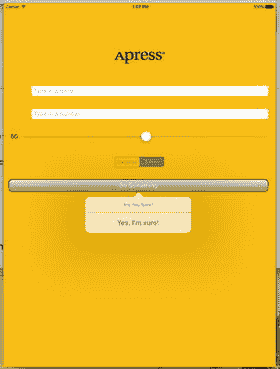

图 4-29.
在 iPad Air 上呈现的操作列表

如你所见，弹出窗口的箭头指向“Do Something”按钮。这是因为我们将警告控制器的弹出呈现控制器的 `sourceView` 属性设置为指向该按钮，并将其 `sourceRect` 属性设置为按钮的边界，如代码清单 4-10 所示。

```
if let ppc = controller.popoverPresentationController {
ppc.sourceView = sender
ppc.sourceRect = sender.bounds
}
代码清单 4-10.
设置 sourceView 和 sourceRect 属性

注意 `if let` 结构——这是必要的，因为在 iPhone 上，警告控制器不会在弹出窗口中呈现操作列表，因此其 `popoverPresentationController` 属性为 `nil`。

在图 4-29 中，弹出窗口出现在源按钮下方，但如果你需要，可以通过设置弹出呈现控制器的 `permittedArrowDirections` 属性来更改此位置，该属性是弹出窗口箭头允许方向的掩码。以下代码通过将此属性设置为 `UIPopoverArrowDirection.down`，将弹出窗口移动到源按钮上方，如代码清单 4-11 所示。

```
if let ppc = controller.popoverPresentationController {
ppc.sourceView = sender
ppc.sourceRect = sender.bounds
ppc.permittedArrowDirections = .down
}
代码清单 4-11.
设置弹出窗口的方向

如果你比较图 4-29 和图 4-3，你会发现在 iPad 上缺少“No Way!”按钮。警告控制器在 iPad 上不使用样式为 `UIAlertStyle.cancel` 的按钮，因为用户习惯于通过点击弹出窗口外的任何位置来解除弹出窗口，而不执行任何操作。


### 显示警告框

当用户按下`Yes, I’m Sure!`按钮时，我们希望弹出一个包含消息的警告框。当警告控制器中添加的按钮被按下时，操作列表（或警告框）会被关闭，并且按钮的处理程序块会接收到一个指向创建该按钮的`UIAlertAction`对象的引用。当`Yes, I’m Sure!`按钮被按下时执行的代码如代码清单 4-12 所示。

```
let yesAction = UIAlertAction(title: "Yes, I'm sure!",
style: .destructive, handler: { action in
let msg = self.nameField.text!.isEmpty
? "You can breathe easy, everything went OK."
: "You can breathe easy, \(self.nameField.text),"
+ "everything went OK."
let controller2 = UIAlertController(
title:"Something Was Done",
message: msg, preferredStyle: .alert)
let cancelAction = UIAlertAction(title: "Phew!",
style: .cancel, handler: nil)
controller2.addAction(cancelAction)
self.present(controller2, animated: true,
completion: nil)
})
代码清单 4-12.
弹出警告消息
```

我们在处理程序块中做的第一件事是创建一个将显示给用户的新字符串。在实际的应用程序中，你应该在此处执行用户请求的任何处理。我们只是假装做了一些事情，并通过警告框通知用户。如果用户在顶部文本字段中输入了姓名，我们会获取该姓名，并将其用于将在警告框中显示的消息中。否则，我们只会生成一条通用消息来显示：

```
let msg = self.nameField.text!.isEmpty
? "You can breathe easy, everything went OK."
: "You can breathe easy, \(self.nameField.text),"
+ " everything went OK."
```

接下来的几行代码可能会让你觉得熟悉。警告视图和操作列表的创建和使用方式非常相似。我们总是从创建一个`UIAlertController`开始：

```
let controller2 = UIAlertController(
title:"Something Was Done",
message: msg, preferredStyle: .alert)
```

同样，我们传入一个要显示的标题。这次，我们还传入了一条更详细的消息，也就是我们刚刚创建的字符串。最后一个参数是样式，我们将其设置为`UIAlertControllerStyle.alert`，因为我们想要一个警告框，而不是操作列表。接下来，我们为警告框的取消按钮创建一个`UIAlertAction`并将其添加到控制器中：

```
let cancelAction = UIAlertAction(title: "Phew!",
style: .cancel, handler: nil)
controller2.addAction(cancelAction)
```

最后，我们通过展示警告视图控制器来让警告框出现：

```
self.present(controller2, animated: true, completion: nil)
```

你可以在图 4-4 中看到由这段代码创建的警告框。你会注意到，我们的代码并没有尝试获取和配置警告控制器的弹出展示控制器。这是因为在 iPhone 和 iPad 上，警告框都会以屏幕中央的小圆角视图形式出现，因此没有需要配置的弹出展示控制器。

保存`ViewController.swift`文件，然后构建、运行并测试完成的应用程序。

## 本章小结

在这一长篇章节中，希望我们没有向你灌输太多新内容，但我们详细介绍了许多控件的使用，并展示了多种不同的实现细节。我们进一步练习了出口和操作的使用，了解了如何利用视图的层级特性来为你所用，并获得了更多添加 Auto Layout 约束的实践。你学习了控件状态和可拉伸图片。你还学习了如何使用操作列表和警告框。

我们的 Control Fun 应用程序涉及了诸多内容。你可以随时返回去尝试各种操作。修改值、通过添加和修改代码进行实验，并观察 Interface Builder 中不同设置的效果。我们不可能带你了解 iOS 中所有控件的每一种排列组合，但你刚刚完成的这个应用程序是一个很好的起点，涵盖了大部分基础知识。

在下一章中，我们将探讨当用户将 iOS 设备从竖屏旋转到横屏或反之亦然时会发生什么。你可能很清楚，许多应用程序会根据用户握持设备的方式改变其显示内容，我们将向你展示如何在自己的应用程序中实现这一点。

