# 5. 处理设备旋转

iPhone 和 iPad 在外形、适配性和功能方面展现了惊人的工程学设计。苹果工程师们想出了各种方法，将最大功能压缩到非常小巧优雅的包装中。其中一个例子就是这些设备可以在竖屏（窄高）或横屏（短宽）模式下使用，并且这种方向可以在运行时通过简单地旋转设备来改变。你可以在 iOS Safari 浏览器中看到这种自动旋转行为的一个示例，如图 5-1 所示。在本章中，我们将详细讨论旋转，首先概述自动旋转的来龙去脉，然后介绍在应用程序中实现该功能的不同方法。

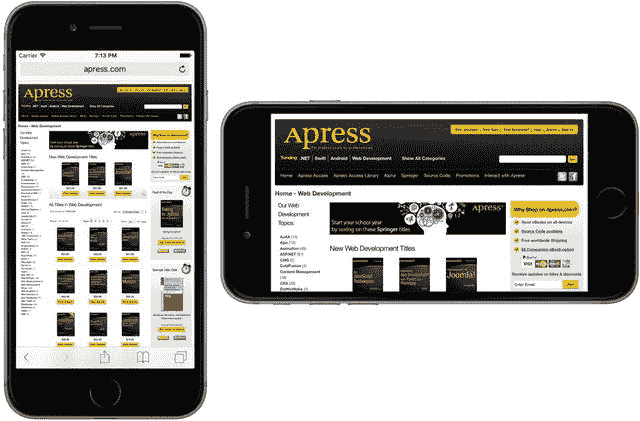

图 5-1. 与许多 iOS 应用程序一样，Mobile Safari 会根据其握持方式改变显示内容，以充分利用可用的屏幕空间

在 iOS 8 之前，如果你想要设计一个既能在 iPhone 上运行又能在 iPad 上运行的应用程序，你需要创建一个包含 iPhone 布局的故事板，以及另一个包含 iPad 布局的故事板。在 iOS 8 中，这一切都发生了变化，苹果在 UIKit 中添加了 API，并在 Xcode 中增加了工具，使得仅用一个故事板就能构建可以在任何设备上运行（或者用他们的术语来说，“适配”到任何设备）的应用程序。你仍然必须针对每种设备类型的不同外形因素进行精心设计，但现在你可以在一个地方完成所有工作。更棒的是，使用我们在第 3 章中介绍的预览功能，你无需启动模拟器就能立即看到你的应用程序在任何设备上的显示效果。我们将在本章的第二部分探讨如何构建自适应应用程序布局。


## 旋转机制

在竖屏和横屏方向下运行的能力并非适用于所有应用。苹果的几款 iPhone 应用（如天气应用）仅支持单一方向。然而，iPad 应用则有所不同，苹果建议大多数应用（沉浸式应用如游戏除外）应支持所有方向，且苹果自身的大多数 iPad 应用在两种方向下都能良好运行。许多应用会利用方向变化来展示数据的不同视图。例如，邮件和备忘录应用在横屏时，会在左侧显示项目列表（文件夹、邮件或笔记），右侧显示所选项目；而在竖屏时，则让您专注于所选项目的详细信息。

对于 iPhone 应用，基本原则是：如果自动旋转能增强用户体验，就应将其添加到应用中。对于 iPad 应用，规则是：除非有充分理由不这样做，否则应添加自动旋转。幸运的是，苹果出色地隐藏了在 iOS 和 UIKit 中处理方向变化的复杂性，因此在您自己的 iOS 应用中实现这一行为变得相当容易。

视图控制器授权图像进行旋转。如果用户旋转设备，当前活动的视图控制器会被询问是否可以切换到新方向（本章将介绍该操作）。如果视图控制器肯定回答，应用的窗口和视图便会旋转，并且窗口和视图会调整大小以适应新方向。

在 iPhone 和 iPod touch 上，以竖屏模式启动的视图高度大于宽度——您可以通过参阅第 1 章表 1-1 的“软件尺寸”列来查看任何给定设备的实际可用空间。但请注意，如果您的应用显示了状态栏（即屏幕顶部显示信号强度、时间、电池电量等信息的 20 点宽的条，见图 5-1），那么应用可用的垂直屏幕空间会减少 20 点。

当设备旋转到横屏模式时，垂直和水平尺寸互换。例如，在 iPhone 6/6s 上运行的应用，竖屏时屏幕宽 375 点、高 667 点；横屏时则变为宽 667 点、高 375 点。同样需要再次指出，在 iPad 上，如果显示状态栏（大多数应用都会显示），应用的实际可用垂直空间会减少 20 点。在 iPhone 上，自 iOS 8 起，状态栏在横屏时会隐藏。

### 点、像素与 Retina 显示屏

您可能想知道为什么我们讨论的是“点”而不是像素。本书较早的版本确实是以像素而非点来指代屏幕尺寸。这一变化的原因是苹果推出了 Retina 显示屏——这是苹果针对从 iPhone 4 及之后各代 iPhone、后续 iPod touch 以及新款 iPad 变体所配备的高分辨率屏幕的营销术语。再次回顾表 1-1 可以看到，它使大多数型号的硬件屏幕分辨率翻倍，对于 iPhone 6/6s Plus 则几乎翻了三倍。

幸运的是，在大多数情况下，我们无需为此做任何额外工作。在处理屏幕元素时，我们以点（而非像素）来指定尺寸和距离。对于旧款 iPhone、iPad、iPad 2 和 iPad mini 1，点与像素等价——1 点等于 1 像素。然而，在较新的苹果设备上，1 点相当于一个 4 像素的正方形（宽 2 像素 × 高 2 像素），且 iPhone 5s（例如）的屏幕虽然实际宽度为 640 像素，但在逻辑上仍显示为 320 点宽。在 iPhone 6/6s Plus 上，缩放因子为 3，因此每个点对应一个 9 像素的正方形。可以将其理解为一种“虚拟分辨率”，iOS 会自动将点映射到屏幕的物理像素上。我们将在第 16 章对此进行更多讨论。

在典型应用中，实际在屏幕上移动像素的大部分工作由 iOS 管理。我们的应用在此过程中的主要功能是确保所有元素在调整大小后的窗口中都能恰当排列并显示正常。

### 处理旋转

要处理设备旋转，我们需要为构成界面的所有对象指定正确的约束。约束告诉 iOS，当控件所在的视图调整大小时，控件应如何表现。这与设备旋转有何关系？当设备旋转时，屏幕的尺寸（大致）互换——因此视图布局的可用区域大小发生了变化。

使用约束最简单的方法是在 Interface Builder (IB) 中进行配置。Interface Builder 允许您定义约束，这些约束描述了当父视图发生变化或其他视图移动时，GUI 组件将如何重新定位和调整大小。我们在第 4 章中已经略有涉及，本章将进一步深入探讨约束这一主题。您可以将约束视为关于视图几何的方程式，而 iOS 视图系统本身则像一个“求解器”，会在必要时重新排列视图以满足这些方程式。您也可以在代码中添加约束，但本书不涵盖这一内容。

约束在 iOS 6 中被引入，但在 Mac 上存在的时间稍长。在 iOS 和 macOS 上，约束可以替代早期版本中使用的旧版“弹簧和支柱”系统。约束能够实现旧技术所能做到的一切，甚至更多。

## 创建我们的方向项目

我们将创建一个简单的应用，向您展示如何选择应用支持的方向。在 Xcode 中创建一个新的 Single View Application 项目，将其命名为 `Orientations`。从 `Devices` 弹出菜单中选择 `Universal`，并将其与其他项目保存在一起。

在故事板中布局 GUI 之前，我们需要告知 iOS，我们的视图支持界面旋转。实际上有两种方法可以做到这一点：您可以创建一个应用范围的设置，该设置将成为所有视图控制器的默认值；您还可以进一步为每个单独的视图控制器调整设置。我们将从应用范围的设置开始，依次执行这两种操作。


### 应用级别的支持方向

首先，我们需要明确应用支持哪些屏幕方向。当你的新建 Xcode 项目窗口出现时，它应该已经打开了你的项目设置。如果没有，请点击项目导航器中的最顶行（以你项目命名的行），然后确保你处于“通用”（General）标签页。在摘要中可用的选项里，你会看到一个名为“部署信息”（Deployment Info）的区域，其中有一个“设备方向”（Device Orientation）部分（见图 5-2），带有一系列复选框。

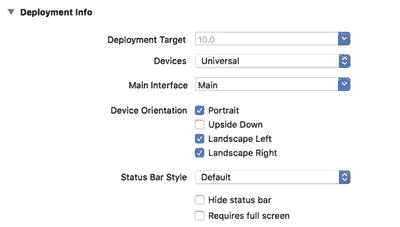

图 5-2. 项目“通用”标签页显示了（以及其他内容）支持的设备方向

这就是我们指定应用支持哪些方向的方式。这并不一定意味着每个视图都会使用所有选中的方向；但如果我们要在任何视图中支持某个方向，那么该方向必须在此处勾选。请注意，“上下颠倒”（Upside Down）方向默认是关闭的。这是因为苹果不鼓励用户倒置手机，因为如果手机在该方向时有来电，用户必须将其旋转整整半圈才能接听。

打开复选框上方的“设备”（Devices）下拉菜单（见图 5-3），你将看到可以为 iPhone 和 iPad 分别配置允许的方向。如果你选择 iPad，你会发现所有四个复选框都被选中，因为 iPad 被设计为可以在任何方向使用。

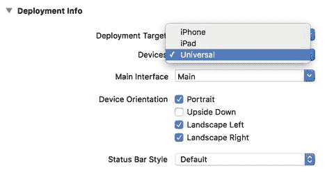

图 5-3. 你可以为 iPhone 和 iPad 配置不同的方向

注意

图 5-2 和 5-3 中显示的四个复选框实际上是向应用的 `Info.plist` 文件中添加和删除条目的快捷方式。如果你在项目导航器中单击 `Info.plist`，你应该会看到两个条目，名为 `Supported interface orientations` 和 `Supported interface orientations (iPad)`，其子条目对应于当前选中的方向。在项目摘要中勾选或取消勾选这些复选框，实际上只是从这些数组中添加或移除项目。使用复选框更简单且不易出错，因此强烈建议使用复选框。不过，你应该了解它们的底层原理。

同样，我们将以 iPhone 6s 作为设备进行演示。现在，选中 `Main.storyboard`。在对象库中找到标签（Label），将其拖入你的视图中，放置在水平居中且靠近顶部的位置，如图 5-4 所示。选中标签的文本，将其改为 `This way up`。更改文本可能会改变标签的位置，因此请再次拖动以使其水平居中。

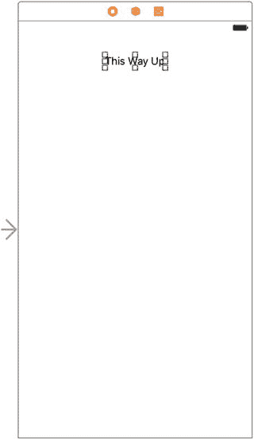

图 5-4. 设置竖屏方向的标签

在运行应用程序之前，我们需要添加 Auto Layout 约束来固定标签的位置。因此，按住 Control 键从标签向上拖动，直到包含视图的背景变为蓝色，然后松开鼠标。按住 Shift 键，在弹出的菜单中选择 `Vertical Spacing to Top Layout Guide` 和 `Center Horizontally in Container`，然后按回车键。现在，按 `⌘R` 在 iPhone 模拟器中构建并运行这个简单的应用。当它在模拟器中启动后，尝试通过按 `⌘-Left Arrow` 或 `⌘-Right Arrow` 旋转设备几次。你会看到整个视图（包括你添加的标签）会旋转到除上下颠倒外的所有方向，正如我们配置的那样。在 iPad 模拟器上运行它，确认它会旋转到所有四个可能的方向。

我们已经明确了应用将支持的方向，但这并非需要做的全部。我们还可以为每个视图控制器指定一组可接受的方向，从而更精细地控制哪些方向在应用的不同部分生效。


### 逐控制器旋转支持

下面让我们配置视图控制器，使其只允许接受一组较小的、不同的朝向。应用的全局配置为允许的朝向设定了一个绝对上限。例如，如果全局配置未包含倒置方向，那么没有任何视图控制器能强制系统将屏幕旋转为倒置。我们在视图控制器中所能做的，只是进一步限制可接受的朝向范围。

在项目导航器中，单击 `ViewController.swift`。这里我们将实现定义在 `UIViewController` 超类中的一个方法，该方法允许我们指定当前视图控制器接受全局朝向集合中的哪个子集：

```
override func supportedInterfaceOrientations() -> UIInterfaceOrientationMask {
return UIInterfaceOrientationMask(rawValue:
(UIInterfaceOrientationMask.portrait.rawValue
| UIInterfaceOrientationMask.landscapeLeft.rawValue))
}
```

该方法让我们返回一个指定可接受朝向的 `UIInterfaceOrientationMask`。调用此方法是 iOS 向视图控制器询问是否允许旋转到某一特定朝向的方式。在本例中，我们返回的值表示接受两种朝向：默认的竖屏朝向，以及将手机顺时针旋转 90° 后（即手机左侧朝上）的朝向。我们使用布尔 `OR` 运算符（竖线符号）来组合这两种朝向掩码的原始值，然后用结果创建一个新的 `UIInterfaceOrientationMask`，来表示组合后的值。

`UIKit` 定义了以下朝向掩码，你可以使用 `OR` 运算符（如上例所示）按任意方式组合它们：

- `UIInterfaceOrientationMask.portrait.rawValue`
- `UIInterfaceOrientationMask.landscapeLeft.rawValue`
- `UIInterfaceOrientationMask.landscapeRight.rawValue`
- `UIInterfaceOrientationMask.portraitUpsideDown.rawValue`

此外，还有一些针对常见使用场景的预定义组合。它们在功能上等效于你自己手动进行 `OR` 运算，但可以节省打字时间，并使代码更具可读性：

- `UIInterfaceOrientationMask.landscape.rawValue`
- `UIInterfaceOrientationMask.all.rawValue`
- `UIInterfaceOrientationMask.allButUpsideDown.rawValue`

当 iOS 设备改变朝向时，系统会调用当前活动视图控制器的 `supportedInterfaceOrientations()` 方法。根据返回的值是否包含新朝向，应用会决定是否旋转视图。由于每个视图控制器子类都可以实现不同的逻辑，因此同一个应用可以支持部分视图旋转而其他视图不旋转，或者某个视图控制器在特定条件下支持某些朝向。再次运行示例应用，并验证现在只能将模拟器旋转到 `supportedInterfaceOrientations()` 方法返回的那两个朝向。每个朝向后缀的 `.rawValue` 会返回该朝向的整数值，用于比较。

> **注意**  
> 实际上你可以旋转设备，但视图本身不会旋转，因此除了选中的两个朝向外，标签依然会回到顶部。

### 代码补全的实际应用

你有没有注意到，iPhone 上定义的系统常量总是这样设计：那些相互配合使用的值，都以相同的字母开头？`UIInterfaceOrientationMask.portrait`、`UIInterfaceOrientationMask.portraitUpsideDown`、`UIInterfaceOrientationMask.landscapeLeft` 和 `UIInterfaceOrientationMask.landscapeRight` 全部以 `UIInterfaceOrientationMask` 开头的原因之一，就是为了让你能利用 Xcode 的代码补全功能。

你可能已经注意到，在输入时，Xcode 经常尝试补全你正在输入的单词。这就是代码补全的实际应用。

开发者不可能记住系统中所有定义的常量，但你可以记住常用组的共同开头。当你需要指定一个朝向时，只需输入 `UIInterfaceOrientationMask`（甚至只需输入 `UIInterf`），就会看到所有匹配项的列表弹出。（在 Xcode 的偏好设置中，你可以配置为仅在你按下 `Esc` 键时才弹出列表。）你可以使用方向键浏览出现的列表，并通过按下 `Tab` 或 `Return` 键进行选择。这比在文档或头文件中查找值要快得多。

你可以随意尝试此方法，返回不同的朝向掩码组合。你可以强制系统将视图的显示限制在你的应用所需的朝向上，但不要忘记我们之前讨论过的全局配置。请记住，如果你没有在那里启用倒置方向（例如），那么无论其视图控制器的 `supportedInterfaceOrientations()` 方法如何声明，你的任何视图都不会以倒置方向显示。

> **注意**  
> iOS 实际上支持两种不同类型的朝向。我们这里讨论的是界面朝向。还有一个独立但相关的概念叫设备朝向。设备朝向指定设备当前被手持的方式。界面朝向则是指屏幕上的视图如何旋转。如果你将标准 iPhone 倒置，设备朝向会是倒置，但界面朝向几乎总是其他三个之一，因为 iPhone 应用默认不支持竖屏倒置。


## 创建布局项目

在 Xcode 中，基于“单视图应用程序”模板再新建一个项目，并将其命名为 `Layout`。选择 `Main.storyboard` 在 Interface Builder 中编辑故事板。约束的一大优点是，它们用极少的代码就能实现很多功能。要了解其工作原理，请从库中将四个标签拖到你的视图上，并按照图 5-5 所示放置它们。使用蓝色虚线辅助线帮助你让每个标签靠近其对应的角落。在本例中，我们将使用 `UILabel` 类的实例来演示如何利用约束构建 GUI 布局，但相同的规则适用于许多 GUI 对象。

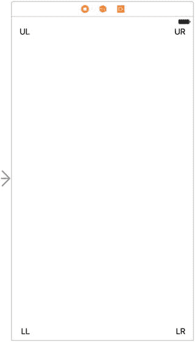

图 5-5. 向故事板中添加四个标签

双击每个标签，并为每个标签指定一个标题，以便稍后能区分它们。我们将左上角标签命名为 `UL`，右上角标签命名为 `UR`，左下角标签命名为 `LL`，右下角标签命名为 `LR`。设置好每个标签的文本后，将它们全部拖到合适的位置，使其相对于容器视图的角落均匀对齐。

现在，既然我们尚未设置任何自动布局约束，让我们看看会发生什么。在 iPad Air 模拟器上构建并运行应用程序。模拟器启动后，你会发现只能看到左侧的标签——另外两个标签在屏幕右侧之外。此外，左下角的标签也不在它应在的位置——即屏幕的左下角。选择 **硬件** ➤ **向左旋转**，这将模拟将 iPad 旋转到横屏模式。你会发现现在可以看到左上角和右上角的标签，如图 5-6 所示。

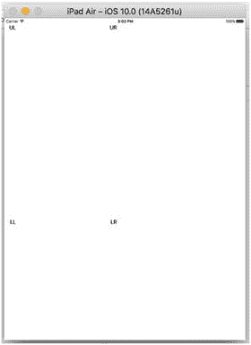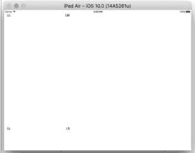

图 5-6. 在未添加任何约束的情况下改变方向

如你所见，情况看起来并不理想。旋转后，左上角的标签位于正确位置，但所有其他标签都放错了地方，有些甚至完全不可见！发生这种情况的原因是，每个对象都保持其相对于故事板中视图左上角的距离。我们真正想要的是，旋转后每个标签都能紧贴其最近的角落。右侧的标签应水平移动以适应视图的新宽度，底部的标签应垂直移动以适应新高度。幸运的是，我们可以轻松地在 Interface Builder 中设置约束，让这些变化自动发生。

正如我们在前面章节中所见，Interface Builder 足够智能，可以检查这组对象并创建一组默认约束，这些约束将完全实现我们想要的效果。它使用一些经验法则来判断，如果我们将对象靠近边缘，我们可能希望将它们保持在那里。要让它应用这些规则，首先选中所有四个标签。你可以通过单击一个标签，然后按住 Shift 或 ⌘ 键并依次单击其他三个标签来完成此操作。全部选中后，从菜单中选择 **编辑器** ➤ **解决自动布局问题** ➤ **添加缺失的约束**（你会发现有两个同名菜单项——在本例中，因为我们已选中所有标签，你可以使用其中任意一个）。接下来，只需按下 **运行** 按钮在模拟器中启动应用程序，然后验证它是否正常工作。

> **注意**：另一种轻松选中所有标签的方法是，在文档大纲中按住 Shift 键单击标签名称，如图 5-7 所示。

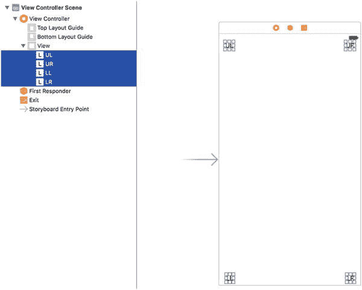

图 5-7. 使用文档大纲视图（位于故事板画布左侧）有时可以更轻松地选择和处理多个 UI 对象

知道这种方法有效是一回事，但要最有效地使用此类约束，理解其工作原理也非常重要。因此，让我们深入探讨一下。回到 Xcode，单击左上角的标签以选中它。你会注意到可以看到一些附着在该标签上的蓝色实线。这些蓝色实线不同于在屏幕上拖动对象时看到的蓝色虚线辅助线，如图 5-8 所示。

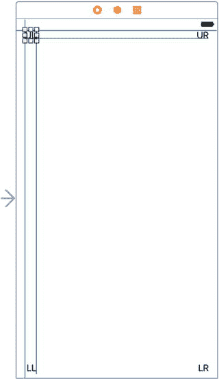

图 5-8. 蓝色实线表示为所选对象配置的约束

每一条蓝色实线都代表一个约束。如果你现在按下 ⌥⌘5 打开大小检查器，你会看到它包含一个约束列表。图 5-9 显示了 Xcode 在我的故事板中应用于 `UL` 标签的约束，但 Xcode 创建的约束取决于你精确放置标签的位置，因此你可能会看到不同的结果。

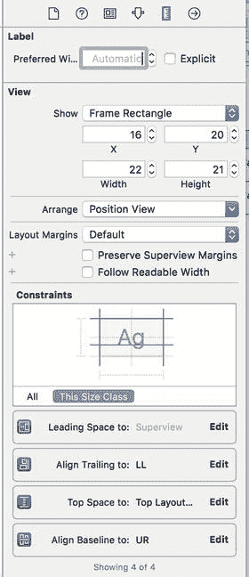

图 5-9. Xcode 生成的四个约束，用于将标签固定在其父视图中

在本例中，其中两个约束处理该标签相对于其父视图（即容器视图）的位置：它指定了前导间距（通常指右侧的间距）和顶部间距（即标签上方的间距）。当父视图大小发生变化时（例如设备旋转时），这些约束会使标签保持与父视图顶部和右侧边缘相同的距离。另外两个约束使该标签与另外两个标签对齐。检查其他每个标签，查看它们具有哪些约束，并确保你理解这些约束如何工作，以将四个标签固定在父视图的四角。

你应该知道，在文本书写和阅读方向是从右到左的语言中，“前导间距”位于右侧，因此如果用户为其设备选择了阿拉伯语等语言，添加尾随约束将导致 GUI 以相反方向布局。这实际上正是用户所期望的。而且这是自动的，因此你无需做任何特殊操作即可实现。


## 覆盖默认约束

从库中抓取另一个标签，并将其拖到布局区域。这一次，不要将其移向角落，而是将其拖到视图的左边缘，让标签的左边缘与左侧其他标签的左边缘对齐，并在视图中垂直居中。虚线会帮助你完成操作。图 5-10 展示了这一效果。

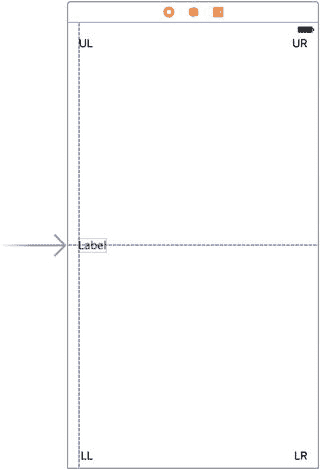

图 5-10. 放置左侧标签

我们来添加一个新的约束，强制这个标签保持垂直居中。选中该标签，点击故事板下方的`Align`图标，在出现的弹出窗口中勾选`Vertically in Container`，然后点击`Add 1 Constraint`。现在确保`Size Inspector`为显示状态（必要时可按⌥⌘5）。你会看到这个标签现在有了一条约束，将其中心 Y 值与其父视图的中心 Y 值对齐。该标签还需要一条水平约束。你可以通过确保标签已选中，然后在菜单的`All Views`部分选择`Editor ➤ Resolve Auto Layout Issues ➤ Add Missing Constraints`来添加此约束。按⌘R 再次运行应用。旋转设备，你会发现所有标签现在都能完美地移动到不同设备类型下预期的位置。

现在，我们通过拖出一个新标签到视图右侧，使其右边缘与右侧的其他标签对齐，并在垂直方向上与左侧标签对齐，来完成我们的标签环。将这个标签的标题改为`Right`，然后稍微拖动它，确保其右边缘与其他两个标签的右边缘垂直对齐，以蓝色虚线作为参考。我们希望使用 Xcode 能提供的自动约束，因此选择`Editor ➤ Resolve Auto Layout Issues ➤ Add Missing Constraints`来生成它们。

构建并再次运行。再次旋转设备。你会看到所有标签都保持在屏幕上，并且彼此之间的位置正确（见图 5-11）。如果你旋转回来，它们应恢复到原始位置。这种技术对于你可能遇到的许多应用来说都非常有效。

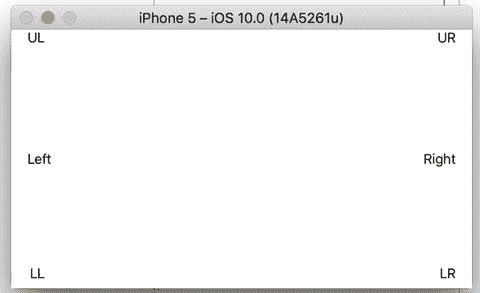

图 5-11. 旋转后标签在新位置

## 全宽标签

我们将创建一些约束，确保我们的标签彼此保持相同的宽度，间距紧凑，即使在设备旋转时也能使它们横向延伸在视图顶部。图 5-12 应该能让你了解我们要实现的效果。

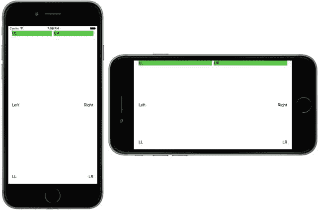

图 5-12. 顶部标签在竖屏和横屏方向上都横跨显示器的整个宽度

我们需要能够直观地验证是否得到了想要的结果——即每个标签都精确地居中于其所在的那一半屏幕。为了更容易判断我们是否做对了，让我们暂时为标签设置一个背景颜色。在故事板中，同时选中`UL`和`UR`标签，打开`Attributes Inspector`，向下滚动到`View`部分。使用`Background`控件选择一个亮眼的颜色。你会看到每个标签（目前非常小）的框架都填充了你选择的颜色。

从`UL`标签的右边缘拖动其大小调整控件，将其拉到接近视图的水平中点。你不需要精确对齐，原因很快就会明了。完成此操作后，通过将`UR`标签的左边缘大小调整控件向左拖动来调整其大小，直到出现蓝色虚线参考线（如果没有看到参考线，只需合理拖动即可），它会告诉你标签到其左侧的推荐宽度。现在我们将添加一条约束，使这些标签保持相对位置。按住 Control 键从`UL`标签拖动，直到鼠标悬停在`UR`标签上，然后松开鼠标。在弹出的窗口中，选择`Horizontal Spacing`并按 Return 键。该约束告诉布局系统将这些标签彼此相邻放置，并保持与当前相同的水平间距。构建并运行看看效果。你应该会看到类似图 5-13 的结果；较长的标签可能出现在左侧或右侧，具体取决于你的配置。

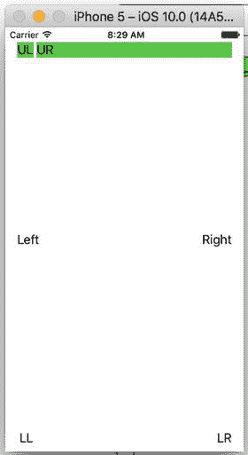

图 5-13. 标签横跨显示器，但分布不均匀

方向对了，但还不是我们设想的样子。那么缺少什么呢？我们已经定义了约束来控制每个标签相对于其父视图的位置以及两个标签之间的允许距离，但我们没有对标签的大小做任何规定。这使得布局系统可以自由地以任何方式调整它们的大小（正如我们刚刚看到的，这可能会非常错误）。要解决这个问题，我们需要再添加一个约束。

确保`UL`标签被选中，然后按住 Shift 键（⇧）并点击`UR`标签。同时选中两个标签后，你可以创建一个影响它们两者的约束。点击故事板下方的`Pin`图标，在出现的弹出窗口中勾选`Equal Widths`复选框（我们在第 3 章中见过），然后点击`Add 1 Constraint`。现在你会看到一个新的约束出现，如图 5-14 所示。你可能注意到标签下方出现了两条橙色线；这意味着故事板中标签的当前位置和大小与运行时看到的不匹配。要修复此问题，请选择`Document Outline`中的`View`图标，然后在 Xcode 的菜单中选择`Editor ➤ Resolve Auto Layout Issues ➤ Update Frames`。约束应变为蓝色，并且标签将自动调整大小，使它们的宽度相等。

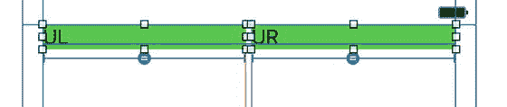

图 5-14. 顶部标签现在通过约束实现了宽度相等

如果此时再次运行，你应该会看到标签横跨整个屏幕，无论是在竖屏还是横屏方向（见图 5-12）。

在这个项目中，我们所有的标签都可见并且在多种方向下布局正确；然而，屏幕上还有很多未使用的空间。也许我们最好也设置另外两行标签来填充视图的宽度，或者允许标签的高度改变，以减少界面上的空白区域？你可以随意尝试这六个标签的约束，甚至添加一些其他约束。除了我们已经介绍的内容，你还会在点击故事板下方的`Pin`和`Align`图标时出现的弹出窗口中找到更多创建约束的操作。如果你最终创建的约束没有达到预期效果，你可以通过选中它并按`Delete`键来删除它，或者尝试在`Attributes Inspector`中配置它。多练习，直到你对约束工作的基本原理感到得心应手。我们将在本书中持续使用约束，但如果你想要完整的详细信息，只需在 Xcode 文档窗口中搜索`Auto Layout`即可。


## 创建自适应布局

我们刚刚创建的简单示例布局在竖屏和横屏方向下都能良好工作。它同样适用于屏幕尺寸不同的 iPhone 和 iPad。正如我们之前提到的，处理设备旋转和创建在不同屏幕尺寸设备上工作的用户界面实际上是同一个问题——毕竟，从应用程序的角度来看，当设备旋转时，屏幕的有效尺寸发生了改变。在最简单的情况下，你可以通过设置 Auto Layout 约束来同时处理这两种情况，确保所有视图都按照预期定位和调整大小。然而，这并非总是可行。有些布局在设备竖屏时工作良好，但旋转到横屏后效果不佳；同样，有些设计适合 iPhone 却不适合 iPad。当出现这种情况时，除了为每种情况创建独立的设计外，你其实别无选择。在 iOS 8 之前，这意味着要么用代码实现整个布局，要么使用多个故事板，要么将两者结合。幸运的是，苹果公司已经使设计既能适应两种屏幕方向又能适应不同设备的自适应应用成为可能，且只需使用单个故事板。让我们来看看这是如何实现的。

### 创建 Restructure 应用程序

首先，我们将设计一个在 iPhone 竖屏模式下工作良好，但在手机旋转或应用在 iPad 上运行时效果不佳的用户界面。然后，我们将学习如何使用 Interface Builder 调整设计，使其在所有场景下都能良好工作。

像之前一样，新建一个 Single View 项目，并将其命名为 `Restructure`。我们将构建一个包含一个大内容区域和一组执行各种（虚构）操作的小按钮的 GUI。我们将按钮放置在屏幕底部，让内容区域占据剩余空间，如图 5-15 所示。

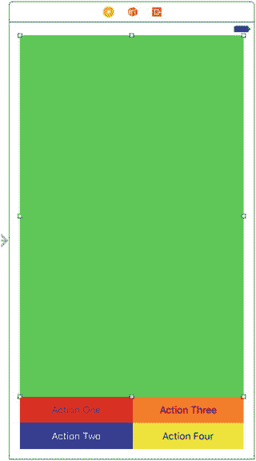

图 5-15.

`Restructure` 应用的初始 GUI，iPhone 竖屏显示

你可能注意到，本书中使用的苹果设备插图有不同的配置。有些插图（如图 5-15）外观更接近“真实”设备，而其他一些（如图 5-11）则显得更基础。这些差异无需担忧，因为你在技术文档（包括苹果公司的文档）中很可能会遇到各种风格。

选择 `Main.storyboard` 开始编辑 GUI。由于我们并没有真正需要显示的有趣内容视图，我们只需使用一个彩色的大矩形。从对象库中拖拽一个 `UIView` 到容器视图中。在它仍处于选中状态时，调整其大小使其填满可用空间的顶部区域，并在上方和两侧留出小边距，如图 5-15 所示。接下来，切换到属性检查器，使用 `Background` 弹出菜单选择其他背景颜色。你可以选择任何你喜欢的颜色，只要不是白色，这样视图就能从背景中凸显出来。在示例源代码存档的故事板中，这个视图是绿色的，所以从现在起我们称它为绿色视图。

从对象库中拖拽一个按钮，将其放置在绿色视图下方空白区域的左下角。双击选择其标签中的文本，并将其改为 `Action One`。现在，按住 Option 键并拖拽该按钮三次，复制出三个副本，并将它们排列成两列，如图 5-15 所示。你无需将它们完美对齐，因为我们将使用约束来最终确定它们的位置，但你应该尽量让两个按钮组离容器视图各自对应侧边的距离大致相等。将它们的标题分别改为 `Action Two`、`Action Three` 和 `Action Four`。另外，为每个按钮添加不同的背景色，以便于区分；我按顺序使用了红色、蓝色、橙色和黄色，但你可以选择任何你喜欢的颜色。如果你使用了像蓝色这样的深色背景色，最好同时将文本颜色调亮。最后，将绿色视图的下边缘向下拖动，直到它刚好触及第一行按钮。使用蓝色参考线将所有元素对齐，如图 5-15 所示。


现在我们来设置 Auto Layout 约束。首先选中绿色视图。我们要将它固定在主视图的顶部、左侧和右侧。但这仍然不足以完全约束它，因为还没有指定它的高度；稍后当我们固定好按钮后，我们会将其锚定到按钮顶部来解决这个问题。点击故事板编辑器右下角的 `Pin` 按钮。在弹出的窗口顶部，你会看到熟悉的四个输入框围绕一个小方块的布局。保持勾选 `Constrain to Margins`（约束到边距）复选框。点击小方块上方、左侧和右侧的红色虚线，将视图附着到其父视图的顶部、左侧和右侧（见图 5-16）。点击 `Add 3 Constraints`（添加 3 个约束）。

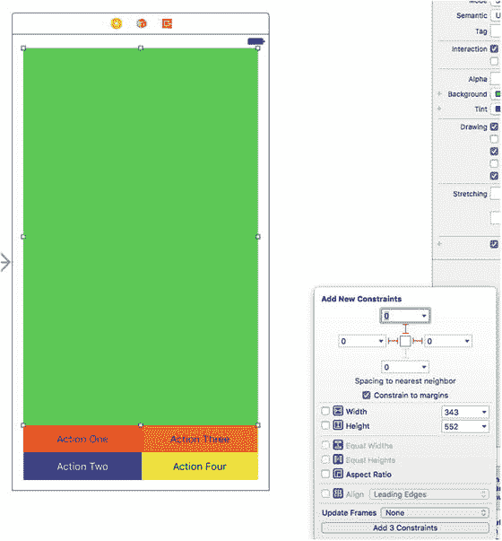

图 5-16. 添加约束，将绿色视图固定到顶部、左侧和右侧

现在，我们从 `Action One` 按钮开始，为按钮设置一个固定高度，如图 5-17 所示。我使用 43 点的值，仅仅是因为创建按钮时它就是这个值。对于本例所要实现的目标（处理不同设备和方向），这个数值附近的任何值都应该没问题。然后对其他三个按钮重复此操作。

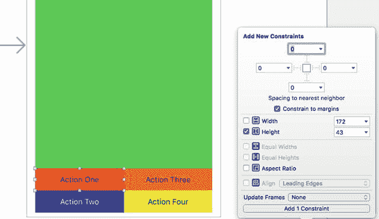

图 5-17. 为其中一个按钮设置高度值

到目前为止，如果你操作正确，应该能在 `Document Outline`（文档大纲）中看到所有约束的结果，如图 5-18 所示，其中我们可以看到四个按钮各自的高度，以及绿色视图的三个边。

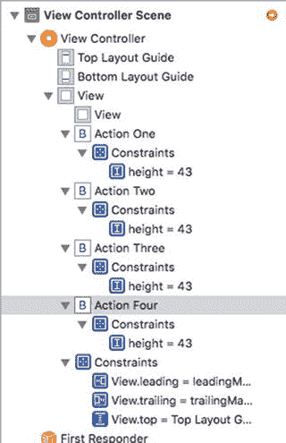

图 5-18. 你可以在 `Document Outline`（文档大纲）中随时查看约束设置进度

接下来，通过从每个按钮分别按住 `Control` 键拖拽到左下角和右下角，将左下角（`Action Two`）和右下角（`Action Four`）按钮固定到容器视图的底部角落。对于 `Action Two`，按住 `Shift` 键选择两个选项，如图 5-19 所示。

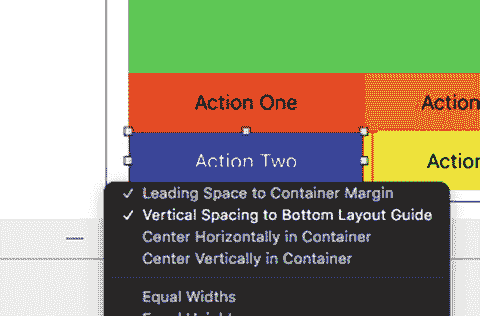

图 5-19. 按住 `Control` 键向左下方拖拽，将 `Action Two` 按钮固定到容器视图的左下角

执行类似操作，按住 `Control` 键向右下方拖拽，为 `Action Four` 按钮设置 `Leading`（前导）和 `Vertical Spacing`（垂直间距），如图 5-20 所示。

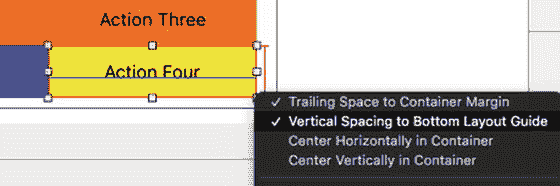

图 5-20. 按住 `Control` 键向右下方拖拽，将 `Action Four` 按钮固定到容器视图的右下角

接下来，按住 `Shift` 键选中所有四个按钮，点击 `Pin`（固定）图标，并设置所有宽度相等（见图 5-21）。请注意，我们尚未设置宽度，因此它们可能从很小到非常宽不等；但稍后我们会通过额外约束来解决这个问题。

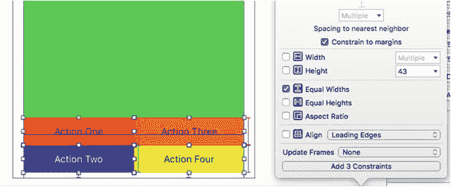

图 5-21. 将所有按钮设置为等宽，尽管我们尚未在故事板中设置任何宽度值

对于顶行的按钮 `Action One` 和 `Action Three`，分别按住 `Control` 键向左和向右拖拽，以设置 `Leading Space to Container Margin`（容器前导边距）和 `Trailing Space to Container Margin`（容器尾部边距）（见图 5-22）。这将 `Action One` 的左边缘和 `Action Three` 的右边缘绑定到视图边缘，从而设置了一个宽度锚点。

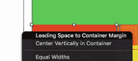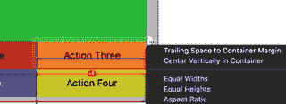

图 5-22. 将 `Action One` 的左边缘和 `Action Three` 的右边缘设置到容器视图的边缘

最后这两个约束将确保按钮宽度为绿色视图的一半且彼此匹配。按住 `Control` 键从 `Action One` 拖拽到 `Action Three`，设置 `Horizontal Spacing`（水平间距）。在 `Action Two` 和 `Action Four` 之间执行相同操作，如图 5-23 所示。我们所做的是将边缘锚点设置为固定位置，即图 5-22 中容器的左边缘和右边缘。并且，如图 5-21 所示，我们设置了按钮等宽。通过设置水平间距使同一行的按钮彼此紧贴，它们最终会在视图中心相接。由于绿色视图也被固定到了左右边缘，因此按钮也在绿色视图的中心相接。

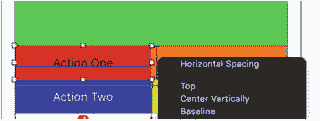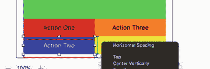

图 5-23. 将每行按钮在视图中心连接起来；这样默认会将每个按钮的宽度设置为视图宽度的一半

只差最后几步，我们就可以在各种设备上测试我们的应用了。按住 `Control` 键从 `Action Three` 拖拽到 `Action Four`，设置 `Vertical Spacing`（垂直间距），就像刚才对行的 `Horizontal Spacing`（水平间距）所做的那样，如图 5-24 所示。在 `Action One` 和 `Action Two` 之间也执行相同操作。

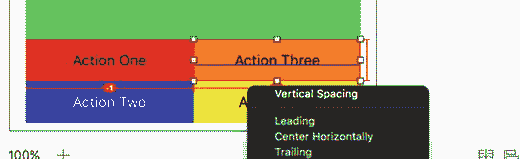

图 5-24. 像处理按钮行一样设置同一列按钮之间的垂直间距

最后，按住 `Control` 键在绿色视图和 `Action One` 按钮之间拖拽，设置间距，使绿色视图和顶行按钮相邻，如图 5-25 所示。

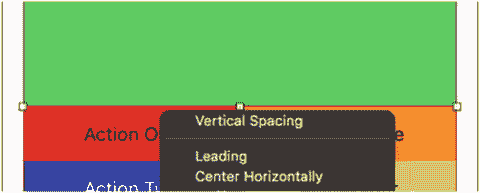

图 5-25. 设置绿色视图与顶行按钮之间的间距

现在，你应该能够选择任何全屏的 iPhone 或 iPad，无论是竖屏还是横屏，按钮都应保持其位置，如图 5-26 所示。

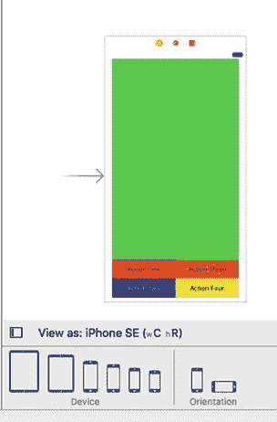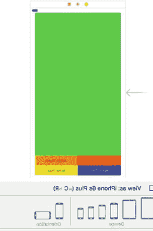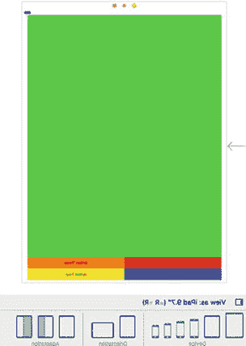

图 5-26. 选择竖屏方向的不同设备；布局应保持其定位

在查看 Xcode 中的 `Issue Navigator`（问题导航器）时，还有一点值得注意：没有任何问题。通过系统地设置我们需要的约束，我们以最小的努力创建了一个布局。但不要期望一直这么容易。

最后要做的一件事：在继续之前，让我们在模拟器中构建并运行我们的项目，以确保它按预期工作。图 5-27 显示了两种 iPhone 6s 方向，而图 5-28 显示了全屏 iPad Air 的两种方向。

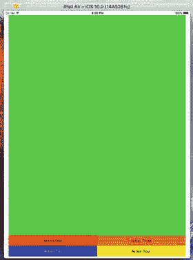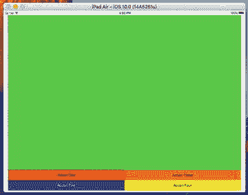

图 5-28. iPad Air 的两种方向

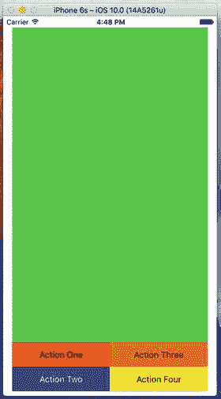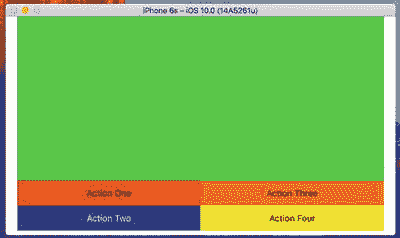

图 5-27. iPhone 6s 的两种方向

虽然这些看起来符合我们的预期，但它们并不是我们想要的结果。对于横屏的 iPhone，仍然是 `wC hC` 配置，我们希望是一个单独的按钮列紧靠在右侧。对于任何方向的 iPad，`wR hR`，我们希望是一行单独的按钮位于视图底部。

**注意**


## Auto Layout 配置中的宽高表示法

记法`w- h-`指代的是所考虑配置的宽度和高度。为了简化，在 Auto Layout 中，这将被表示为 `C`（紧凑）或 `R`（常规），因此你会有以下选项：`wC hC`、`wC hR`、`wR hC` 和 `wR hR`。通过查看设备配置栏（Device Configuration Bar），你可以看到这些如何应用于实际的 Apple 设备。

### 设置 iPhone 横屏（wC hC）配置

我们将很快开始设置我们的 `wC hC` 横屏配置，但首先请保存你的工作，然后关闭 Xcode 项目。你只需点击 Xcode 窗口左上角的红色圆点即可关闭此项目。你不需要完全退出 Xcode。

前往 Mac 上的访达（Finder），找到 `Restructure` 文件夹并创建一个压缩版本，如图 5-29 所示。这将创建我们项目的“主”副本，如果在后续的修改中出现问题，我们可以随时回到这个副本。

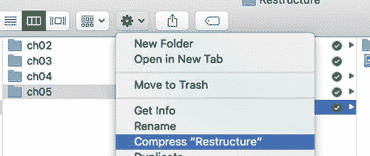

图 5-29. 创建项目当前状态的备份副本

因为我们可能在后续工作中再次需要这样做，我将 `.zip` 文件重命名为 `RestructureBaseline`，如图 5-30 所示，这样我就知道这是最初创建的项目，它能够以相同的方式在所有设备和方向上工作。

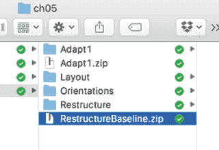

图 5-30. 以唯一名称保存我们的基线项目

首先，让我们创建 iPhone 横屏方向。选择 iPhone 6s 和横屏方向。在设备配置栏的右侧，点击`Vary for Traits`，注意该栏会变为蓝色，如图 5-31 所示。在弹出的选项中，同时选择高度和宽度。你应该会再次在图 5-31 中看到，现在只显示 iPhone 设备，并且仅限横屏方向。在这个特性变体中，我们将专门为这个配置开发我们的 UI。

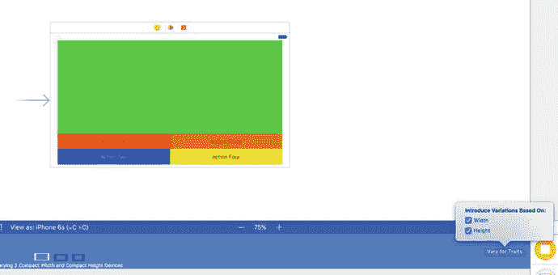

图 5-31. 为 iPhone 横屏配置创建 UI 的起点

接下来——是的，这看起来可能有点吓人——点击所有五个 UI 元素（我们的绿色视图和四个按钮），然后按 Delete 键。不必太担心，因为你已经保存了项目并创建了一个压缩的基线版本，我们随时可以回到那个版本。如果你还没有做，现在去做可能是个好主意。完成后，你的画布将如你所料，像图 5-32 所示。但是，如果你查看文档大纲（Document Outline），你仍然会看到这些元素，甚至约束条件。这是因为它们存在于基线配置中，而我们正在为我们的 `wC hC` 横屏配置创建一个新的配置或新的特性集合。

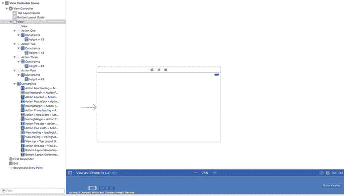

图 5-32. 仅为 iPhone 横屏配置重新开始。注意，文档大纲中仍然显示了基线配置的所有 UI 元素和约束

正如我们为基线所做的那样，拖拽一个 `UIView` 和四个按钮，并像之前一样为它们设置颜色和标题。将它们放置在如图 5-33 所示的近似位置，但暂时不要设置任何约束。

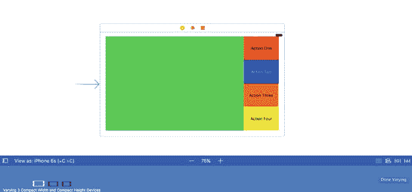

图 5-33. 将新的 UI 元素拖到故事板上，并按图示大致定位

在本节中，让我们让测量更精确一些。选择绿色视图。使用尺寸检查器（Size Inspector），将尺寸设置为 500 × 340 点，如图 5-34 所示。宽度（500 点）是任意的；高度为 340，除以 4 得到 85，这正是我们将要设置的按钮高度。请注意，这不一定是一个约束，而是故事板上的外观。实际上，我们不希望绿色视图有任何固定尺寸，因为它会随着我们升级到 Plus 或降级到 SE 而变化。

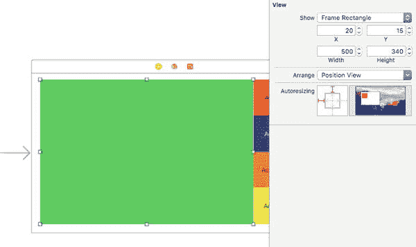

图 5-34. 设置绿色视图的尺寸


选择绿色视图，并将其顶部、左侧和右侧固定到边缘，如图 5-35 所示。

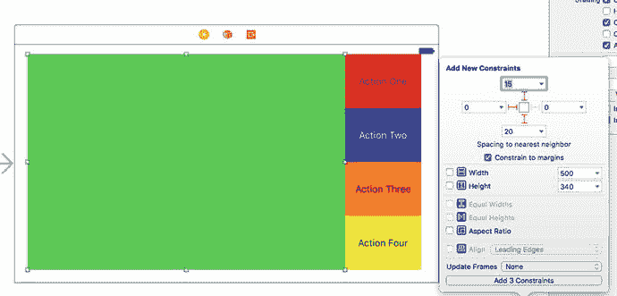

图 5-35：将绿色视图固定到顶部、左侧和右侧（横屏方向）

接下来，我们将固定`Action One`按钮的宽度，但操作方式与之前略有不同。在`Action One`按钮内部，按住`Control`键从红色边界内的一个点拖拽到另一个点（起点和终点均在红色边界内），然后松开。此时会弹出一个类似的弹出菜单（见图 5-36），在其中选择`Width`。现在，`Action One`按钮的宽度应设置为 120 点，如图 5-37 所示。

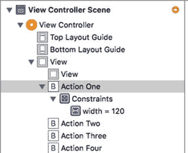

图 5-37：确认`Action One`按钮宽度设置为 120 点

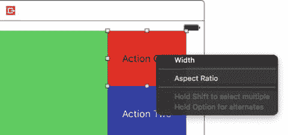

图 5-36：设置`Action One`按钮的宽度

我们希望所有四个按钮具有相同的宽度和高度——宽度为 120 点，而高度则根据 iPhone 横屏时可用垂直区域动态调整。和之前一样，我们将通过设置列中按钮之间的间距来处理等高问题。现在，按住`Shift`键选中全部四个按钮，点击`Pin`图标，设置等宽和等高约束，如图 5-38 所示。

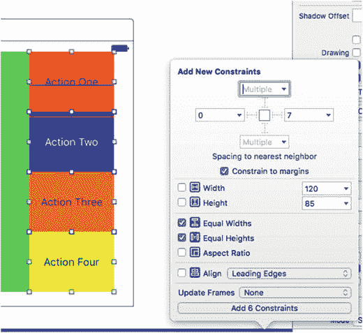

图 5-38：将所有四个按钮设置为等宽等高

注意：你可能已经注意到，虽然我们有四个按钮，每个按钮有两个约束，但实际上添加的约束总数是 6。这是因为我们实际上是将三个按钮的等质量关系设置为与第四个按钮相同。

将`Action One`按钮固定到其容器视图的顶部和右侧（见图 5-39），并将`Action Four`按钮固定到右侧和底部（见图 5-40）。

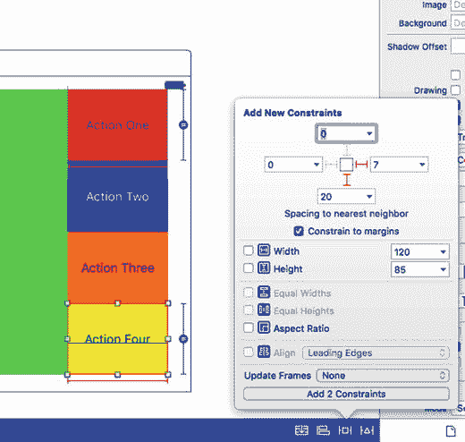

图 5-40：将`Action Four`按钮固定到底部和右侧

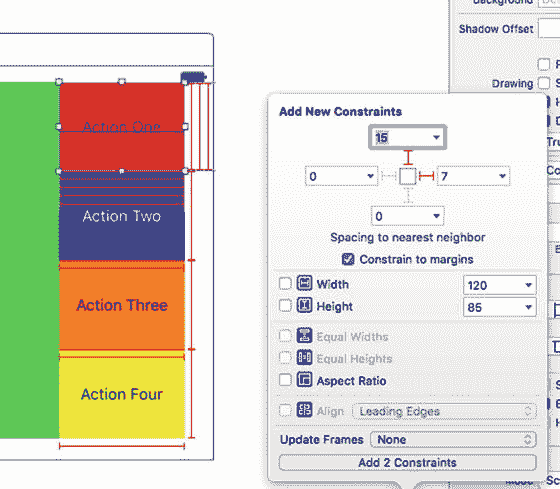

图 5-39：将`Action One`按钮固定到顶部和右侧

对于`Action Two`按钮，按住`Control`键向右拖拽，然后选择`Trailing Space to Container Margin`，将其固定到容器的右侧，如图 5-41 所示。对`Action Three`按钮重复此操作。

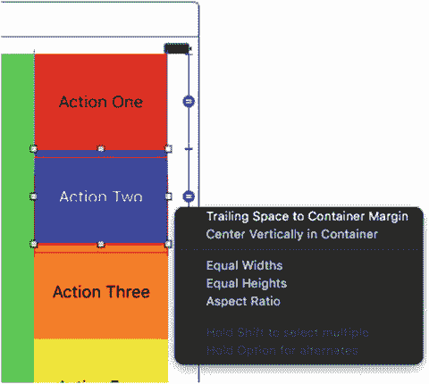

图 5-41：使用`Control`-拖拽将中间按钮固定到右侧，并在弹出的菜单中选择`Trailing Space to Container Margin`，此处以`Action Two`按钮为例。对`Action Three`按钮执行相同操作

在`Action One`和`Action Two`按钮之间，按住`Control`键拖拽以设置垂直间距，如图 5-42 所示。重复此操作，为`Action Two`和`Action Three`、`Action Three`和`Action Four`按钮设置间距。

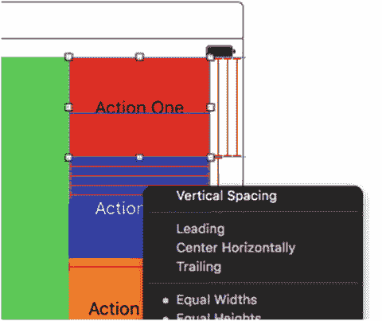

图 5-42：设置列中每对按钮之间的垂直间距。这将强制每个按钮的高度为容器高度的四分之一

最后，设置绿色视图与`Action One`按钮（你可以使用四个按钮中的任意一个）之间的水平间距，如图 5-43 所示。

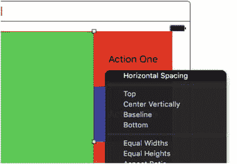

图 5-43：设置绿色视图与按钮行之间的水平间距

点击设备配置栏中的`Done Varying`按钮，完成此 iPhone 横屏配置的约束添加、放置和设置，如图 5-44 所示。


图 5-44：最后，点击设备配置栏中的`Done Varying`按钮完成操作

现在，按钮应能在所有三种 iPhone 的`wC hC`配置中正确放置，如图 5-45 所示。请注意，如果我们选择 6/6s Plus 设备（属于`wR hC`设备），我们将看到之前的基础布局。


图 5-45：在设备配置栏中更改设备类型，显示我们已为`wC hC` iPhone 设备的横屏方向正确设置了约束

在模拟器中运行应用程序，应得到如图 5-46 所示的结果。虽然我们可以将对齐做得更贴合边缘（这对于生产环境的应用是合适的），但在本例中，我们重点强调了针对不同设备和方向配置操作 UI 元素的过程。随着你对 Auto Layout 越来越熟悉，你的设计自然也会越来越好。


图 5-46：如果一切操作正确，在任何 iPhone（6/6s Plus 除外）的横屏配置下，我们都应看到正确的布局

在继续处理 iPad 之前，我们最后要做的一件事是：通过压缩项目并赋予一个可识别的名称来保存此版本。如图 5-47 所示，我将文件命名为`Restructure_wChC.zip`，代表紧凑宽度和高度。你可以随意使用任何你喜欢的命名约定，只要能够追踪不同的迭代版本即可。


图 5-47：保存此版本的项目，以备日后需要回到此基线状态


### 设置 iPad（iPhone Plus 横屏）(wR hR) 配置

在前两节中，我逐步引导你完成了基准配置和 iPhone 横屏配置的布局创建。你需要能够快速使用 Auto Layout 来设计 UI，因此如果需要复习，我建议将前面几节再练习几遍，尝试在不看文字或图片的情况下独立完成。

为了节省篇幅，对于此配置，我将关键步骤显示在表 5-1 中，并提供了参考图片，以便你在需要理解步骤时获得帮助。从现在开始，我们将以这种方式工作，至少在大多数情况下如此，除非我们需要处理一些新的内容。

**表 5-1.** 在 iPad 上设置所有方向，以及在 iPhone 6/6s Plus 上设置横屏方向

| 步骤 | 操作 | 图片 |
| --- | --- | --- |
| 1 | 点击 `Vary For Traits`，并根据宽度引入变体。 | 5-48 |
| 2 | 删除 Storyboard 中的五个 UI 元素。然后，像上一节那样，从对象库中重新添加五个新元素。 | 5-49 |
| 3 | 选择我们刚添加的绿色视图，在尺寸检查器中，将宽度设置为 728，高度设置为 926。这些不是约束；它们只是帮助我们在 Storyboard 上进行可视化布局。（注意：这些值适用于 iPhone 6s。如果使用不同的设备尺寸，你需要相应地调整高度和宽度。） | 5-50 |
| 4 | 选择`操作四`按钮，并使用尺寸检查器将其宽度设置为 182……同样，这是针对 iPhone 6s 设备的。这仅用于视觉定位，不是约束。 | 5-51 |
| 5 | 确保蓝色的设备配置栏仍然显示我们处于`Vary for Traits`模式，按图示排列 UI 元素：绿色视图位于顶部，单行按钮位于底部。 | 5-52 |
| 6 | 与我们之前所做的类似，将绿色视图固定到其父视图的顶部、左侧和右侧。 | 5-53 |
| 7 | 将`操作一`按钮固定到其父视图的左下角。 | 5-54 |
| 8 | 将`操作四`按钮固定到其父视图的右下角。 | 5-55 |
| 9 | 将`操作二`按钮固定到其父视图的底部边缘。 | 5-56 |
| 10 | 将`操作三`按钮固定到其父视图的底部边缘。 | 5-57 |
| 11 | 添加一个约束，将`操作一`按钮的高度设置为固定值。我使用了 63 点，因为它适合我 Storyboard 上的布局。没有“正确”的答案；根据你的布局需求进行调整。 | 5-58 |
| 12 | 按住 Shift 键选择底部一行的所有四个操作按钮，并将它们设置为相等的高度和宽度。 | 5-59 |
| 13 | 从绿色视图点击拖动到`操作一`按钮，并设置垂直间距。这将迫使绿色视图与按钮行紧贴。 | 5-60 |
| 14 | 从`操作一`点击拖动到`操作二`，设置水平间距。对`操作二`到`操作三`以及`操作三`到`操作四`重复此操作。这会使按钮在侧面彼此相邻，并且宽度为外部容器宽度的四分之一。 | 5-61 |
| 15 | 点击`Done Varying`按钮以结束对这组特征的修改。 | 5-62 |

按照表 5-1 中的步骤来为 iPad 的所有方向以及 iPhone 6/6s Plus 的横屏方向设置配置。


**图 5-62.** 点击`Done Varying`按钮以结束对这组特征的修改


**图 5-61.** 从`操作一`点击拖动到`操作二`，设置水平间距。对`操作二`到`操作三`以及`操作三`到`操作四`重复此操作


**图 5-60.** 从绿色视图点击拖动到`操作一`按钮，并设置垂直间距。这将迫使绿色视图与按钮行紧贴


**图 5-59.** 按住 Shift 键选择底部一行的所有四个操作按钮，并将它们设置为相等的高度和宽度


**图 5-58.** 添加一个约束，将`操作一`按钮的高度设置为固定值。我使用了 63 点，因为它适合我 Storyboard 上的布局


**图 5-57.** 将`操作三`按钮固定到其父视图的底部边缘


**图 5-56.** 将`操作二`按钮固定到其父视图的底部边缘


**图 5-55.** 将`操作四`按钮固定到其父视图的右下角


**图 5-54.** 将`操作一`按钮固定到其父视图的左下角


**图 5-53.** 与我们之前所做的类似，将绿色视图固定到其父视图的顶部、左侧和右侧


**图 5-52.** 按图示对齐所有元素，确保我们的设备配置栏仍为蓝色，表明我们正在处理一组特定的特征


**图 5-51.** 同样，设置`操作四`按钮的宽度和高度，以便我们有一个可视参考，用于操作和调整我们的 Storyboard


**图 5-50.** 从 UI 对象库中添加五个新的 UI 元素，并使用尺寸检查器设置绿色视图的宽度和高度。这不会设置约束，仅设置视觉方面，以便我们可以调整 Storyboard


**图 5-49.** 删除五个 UI 元素


**图 5-48.** 选择 iPad，点击`Vary For Traits`，然后选择`Width`

希望你能理解这种使用 Auto Layout 的简化形式。如果你遇到任何问题，最好的方法是返回，删除你的项目，并从上一个基准项目重新开始。在你重复使用 Auto Layout 十几次之前，你很可能会犯几个错误并感到沮丧。你并不孤单。当我几周不接触 Xcode（特别是 Auto Layout）时，我经常需要不断重启和重新布局，直到达到我需要或想要的效果。

假设你成功完成了这一步，点击几个不同的 iPad 和方向配置，验证事物是否如预期显示，如图 5-63 所示。


**图 5-63.** 检查以确保你的方向在 Storyboard 画布上正确显示

最后，运行各种设备的模拟器，确保一切显示正常。图 5-64 显示了 iPad Air 在竖屏和横屏方向下应有的显示效果。


**图 5-64.** 通过使用不同设备类型运行模拟器并检查方向，验证一切是否按预期工作


## 本章小结

在本章中，我们涵盖了处理设备旋转的基础知识，包括深入学习如何使用全新的 Xcode 8 Auto Layout 以及设备配置栏下的特性编辑器。我们首先讨论了旋转的基本原理，以及当你在 Apple 设备上改变方向时会发生什么。我们的第一个项目 `Orientations` 展示了处理简单设备旋转以及保持标签定位的基础知识。在第二个项目 `Layout` 中，我们通过将标签放置到四个角以及左右边缘来处理旋转，从而加深了对标签定位的理解。

最后，在 `Restructure` 项目中，我们深入理解了如何使用 Auto Layout 来创建针对设备和方向的特定布局配置。由于你将在本书的剩余部分以及你的职业生涯中用到 Auto Layout，请确保在继续之前对其使用感到得心应手。虽然一开始可能会令人望而生畏，但通过练习，就像其他任何事情一样，它会变成你的第二天性——直到明年 Apple 做出改变。

