# 6. 创建多视图应用程序

到目前为止，我们编写的应用程序都使用了单个视图控制器。虽然单视图应用通常能满足你的需求，但 iOS 平台的真正威力在于你能根据用户输入切换视图。多视图应用程序有几种不同的形式，但无论应用在屏幕上的外观如何，其底层机制的工作原理是相同的。在本章中，我们将通过从头构建自己的多视图应用，重点介绍多视图应用的结构以及交换内容视图的基础知识。通过编写我们自己的自定义控制器类，在两个不同的内容视图之间切换，我们将为利用 Apple 提供的各种多视图控制器打下坚实的基础。

首先，让我们看看一些我们即将探索的新领域——多视图的例子。

## 多视图应用的常见类型

严格来说，我们在之前的应用程序中已经处理过多个视图，因为按钮、标签和其他控件都是 `UIView` 的子类，并且它们都可以进入视图层级结构。但是，当 Apple 在文档中使用术语“视图”时，它们指的是一个 `UIView` 或其一个子类，并且拥有一个对应的视图控制器。这类视图有时也被称为内容视图，因为它们是你应用程序内容的主要容器。

工具类应用提供了多视图应用外观的最简单示例。它主要关注单个视图，但同时提供第二个视图，通常用于配置应用程序或提供比主视图更详细的信息。iPhone 自带的 Stocks 应用就是一个很好的例子（见图 6-1）。点击右下角的按钮，视图会过渡到一个新视图，让你设置应用跟踪的股票列表。

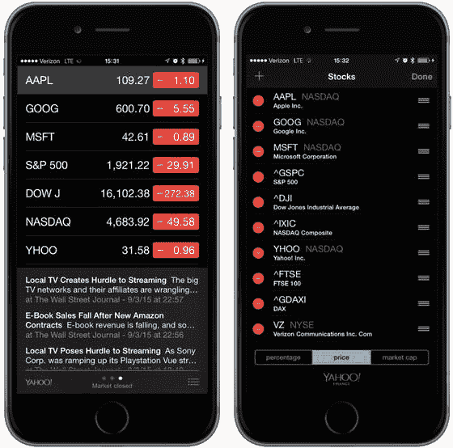

*图 6-1. iPhone 自带的 Stocks 应用提供了两个视图：一个用于显示数据，另一个用于配置股票列表*

iPhone 自带了几个标签栏应用，包括电话应用（见图 6-2）和时钟应用。标签栏应用在屏幕底部显示一行按钮，称为标签栏。点击其中一个按钮会激活一个新的视图控制器，并显示一个新的视图。例如，在电话应用中，点击“通讯录”会显示与点击“拨号键盘”时不同的视图。

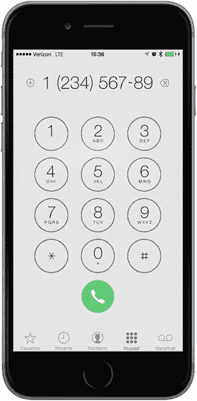

*图 6-2. 电话应用提供了一个使用标签栏的多视图应用示例*

另一种常见的多视图应用类型使用基于导航的机制，其特点是使用一个导航控制器，通过导航栏来控制一系列层级化的视图，如设置应用所示（见图 6-3）。在“设置”中，你首先会看到一系列行，每一行对应一组设置或一个特定应用。触摸其中一行，你便会进入一个新视图，在那里你可以自定义某一组特定设置。某些视图会提供一个列表，允许你进一步深入。导航控制器会跟踪你深入的层级，并提供一个控件让你能返回到上一个视图。

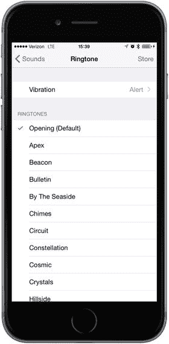

*图 6-3. iPhone 的设置应用是一个使用导航栏的多视图应用的绝佳示例*

例如，选择“声音”偏好设置会将你带到一个包含声音相关选项列表的视图。该视图的顶部显示一个导航栏，带有一个标记为“设置”的左箭头，如果你点击它，就会返回到上一个视图。在声音选项中，你会看到一个标有“铃声”的行。点击“铃声”，你会被带到一个新视图，其中包含一个铃声列表和一个导航栏，该导航栏可以带你回到主“声音”偏好设置视图，如图 6-4 所示。当你想要呈现一个层级化的视图时，基于导航的应用提供了一种有用的机制。

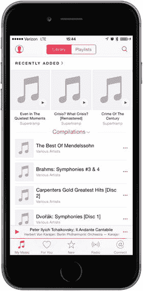

*图 6-4. 音乐应用同时使用了导航栏和标签栏*

在 iPad 上，我们使用分屏视图实现大多数基于导航的应用，例如邮件应用。在分屏视图中，导航元素出现在屏幕左侧，而你选择查看或编辑的项目则出现在右侧。我们将在第 11 章讨论分屏视图。

由于视图本身本质上是层级化的，我们可能会在单个应用程序中组合使用不同的视图切换机制。例如，iPhone 的音乐应用使用一个标签栏来切换组织音乐的不同方式。同时，它也使用一个导航控制器及其关联的导航栏来让你基于所选方式进行音乐浏览。在图 6-4 中，标签栏位于屏幕底部，而导航栏位于屏幕顶部。

有些应用使用工具栏，它经常与标签栏混淆。标签栏从两个或多个选项中选择且仅选择一个选项。而工具栏包含按钮和某些其他控件，但这些项目之间不是互斥的。一个完美的例子是 Safari 浏览器主视图底部的工具栏，如图 6-5 所示。如果你将 Safari 浏览器视图底部的工具栏与电话或音乐应用底部的标签栏进行比较，你会发现它们很容易区分。标签栏有多个分段，恰好有一个（选中的那个）会以某种颜色高亮显示；但在工具栏上，通常每个可用的按钮都会被高亮显示。

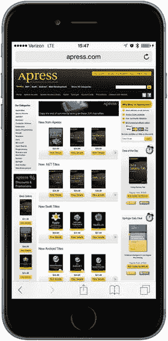

*图 6-5. 移动版 Safari 浏览器在底部设有一个工具栏，它像一个自由格式的栏，允许你包含各种控件*

这些多视图应用类型中的每一种都使用了 UIKit 中一个特定的控制器类。标签栏接口使用 `UITabBarController` 类实现，而导航接口使用 `UINavigationController` 实现。我们将在接下来的几章中详细描述它们的用法。


## 多视图应用的架构

本章将要构建的应用`View Switcher`（视图切换器）外观相当简洁，但就代码而言，它是我们目前处理过的最复杂的应用。`View Switcher`由三个不同的控制器、一个故事板和一个应用委托组成。

首次启动时，`View Switcher`会如图 6-6 所示出现，底部有一个包含单个按钮的工具栏。视图的其余部分显示蓝色背景和一个待按下的按钮。

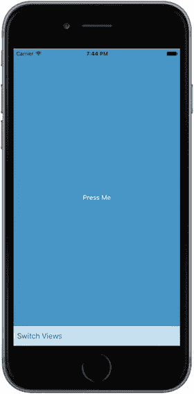

图 6-6. 当你首次启动`View Switcher`应用时，你会看到一个带有按钮的蓝色视图，以及一个带有自身按钮的工具栏

按下`Switch Views`（切换视图）按钮会导致背景变为黄色，并且按钮的标题也会改变，如图 6-7 所示。

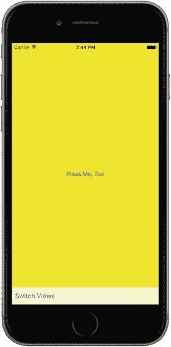

图 6-7. 按下`Switch Views`按钮会使蓝色视图翻转，露出黄色视图

如果按下`Press Me`（按我）或`Press Me, Too`（也按我）按钮，会出现一个提示框，指明是哪个视图的按钮被按下了，如图 6-8 所示。

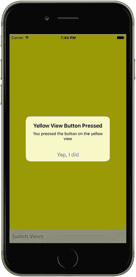

图 6-8. 按下`Press Me`或`Press Me, Too`按钮会显示提示框

虽然我们可以通过编写一个单视图应用来实现相同的功能，但我采用这种更复杂的方法是为了演示多视图应用的实际运作机制。在这个简单的应用中，有三个视图控制器在交互：一个控制蓝色视图，一个控制黄色视图，还有一个特殊的控制器，当按下`Switch Views`按钮时，它会将另外两个控制器进行切换。

在开始构建我们的应用之前，先来讨论一下 iOS 多视图应用是如何组合起来的。大多数多视图应用都使用相同的基本模式。

### 根控制器

故事板在此处扮演关键角色，因为它包含了我们应用的所有视图和视图控制器。我们将创建一个故事板，其中包含一个控制器类的实例，该实例负责管理当前向用户显示的是哪个其他视图。我们称这个控制器为根控制器（如同“树的根”），因为它是用户看到的第一个控制器，也是应用加载时加载的控制器。这个根控制器通常充当`UINavigationController`或`UITabBarController`的实例，尽管它也可以是`UIViewController`的自定义子类。

在多视图应用中，根控制器会获取两个或更多其他视图，并根据用户的输入适时地将它们呈现给用户。例如，标签栏控制器会根据最后点击的标签栏项目来切换不同的视图和视图控制器。当用户在分层数据中进行深入和返回操作时，导航控制器也会执行同样的操作。

> **注意**: 根控制器为应用提供主要的视图控制器，因此它需要指定是否可以自动旋转到新的方向。然而，根控制器可能会将此类任务的责任传递给当前活动的控制器。

在多视图应用中，内容视图占据屏幕的大部分区域，每个内容视图都有其自身的视图控制器，其中包含输出口和操作。例如，在标签栏应用中，点击标签栏的操作会由标签栏控制器处理，但点击屏幕其他任何位置的操作则由当前显示的内容视图对应的控制器处理。

### 内容视图剖析

在多视图应用中，每个视图控制器（Swift 代码）管理一个内容视图，而这些内容视图构成了应用用户界面的主体。总的来说，每一对这样的组合在故事板中被称为一个场景。每个场景由一个视图控制器和一个内容视图组成，内容视图可以是`UIView`或其子类的实例。虽然你可以在代码中而非使用 Interface Builder 来创建界面，但相关工具的强大、灵活和稳定性使得我们无需这样做。

在这个项目中，我们将为每个内容视图创建一个新的控制器类。我们的根控制器管理一个内容视图，该视图包含一个位于屏幕底部的工具栏。然后，根控制器加载一个蓝色视图控制器，将蓝色内容视图作为子视图放置到根控制器视图中。当你按下根控制器的`Switch Views`按钮（即工具栏中的按钮）时，根控制器会切换出蓝色视图控制器，并切换入一个黄色视图控制器，如果必要，它还会实例化该控制器。让我们构建这个项目，一切将变得更加清晰。

## 创建视图切换器应用

要开始我们的项目，在 Xcode 中：选择 File（文件）➤ New（新建）➤ Project…（项目…）或按下`⌘` `N`。当模板选择表打开时，选择`Single View Application`（单视图应用），然后点击 Next（下一步）。在助手的下一页，输入`View Switcher`作为产品名称，将 Language（语言）设置为 Swift，Devices（设备）弹出按钮设置为 Universal（通用）。一切设置正确后，点击 Next（下一步）继续。在下一个屏幕上，导航到你保存项目的位置，然后点击 Create（创建）按钮来创建一个新的项目目录。


### 重命名视图控制器

如您所见，单视图应用程序模板提供了应用程序委托、视图控制器和故事板。视图控制器类名为`ViewController`。在此应用程序中，我们将处理三个视图控制器，但大部分逻辑将位于主视图控制器中。它的任务是切换显示，使得始终展示另一个视图控制器的视图。为了使主视图控制器的角色更清晰，我们想给它一个更好的名称，例如`SwitchingViewController`。项目中有多处引用了视图控制器的类名。要更改其名称，我们需要更新所有这些位置。Xcode 有一个名为**重构**的便捷功能可以帮我们完成此操作，但在我撰写本文时，我使用的 Xcode beta 版尚不支持对 Swift 项目进行重构。因此，我们将删除模板创建的控制器，并添加一个新的。

首先在项目导航器中选择`ViewController.swift`。右键单击它，然后从弹出菜单中选择**删除**（见图 6-9）。当系统提示时，选择将源文件移到废纸篓。

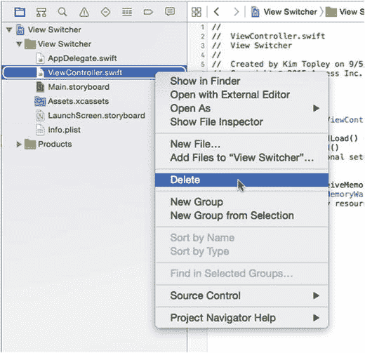

图 6-9.  
删除模板视图控制器

现在右键单击 View Switcher 组，然后选择**新建文件...**。在模板选择器中，从 iOS 源部分选择 **Cocoa Touch 类**。将类命名为`SwitchingViewController`，并使其成为`UIViewController`的子类。确保未勾选“同时创建 XIB 文件”，因为我们稍后会将此控制器添加到故事板；同时确保语言设置为 Swift，如图 6-10 所示，然后点击“下一步”，接着点击“创建”。

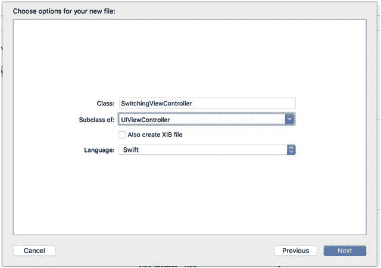

图 6-10.  
创建`SwitchingViewController`类

现在我们有了新的视图控制器，需要将其添加到故事板中。在文档大纲中选择`Main.storyboard`以打开故事板进行编辑。您会看到模板已经为我们创建了一个视图控制器——我们只需将它链接到我们的`SwitchingViewController`类即可。在文档大纲中选择该视图控制器，然后打开身份检查器。在“自定义类”部分，将类从`UIViewController`更改为`SwitchingViewController`，如图 6-11 所示。

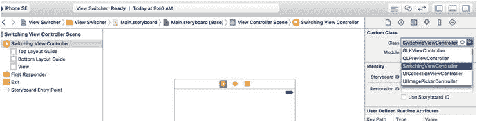

图 6-11.  
在故事板中更改视图控制器类

现在，如果您检查文档大纲，应该会看到视图控制器的名称已更改为“Switching View Controller”，如图 6-12 所示。

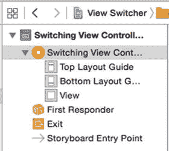

图 6-12.  
文档大纲中的新视图控制器

### 添加内容视图控制器

我们需要另外两个视图控制器来显示内容视图。在项目导航器中，右键单击 View Switcher 组，然后选择**新建文件...**。在模板对话框中，从 iOS 源部分选择 **Cocoa Touch 类**，然后点击“下一步”。将新类命名为`BlueViewController`，使其成为`UIViewController`的子类，并确保未勾选“同时创建 XIB 文件”复选框。点击“下一步”，然后点击“创建”以保存新视图控制器的文件。重复此过程以创建第二个内容视图控制器，将其命名为`YellowViewController`。为了保持组织有序，您可能需要将这些文件移动到项目导航器中 View Switcher 文件夹下，如图 6-13 所示。

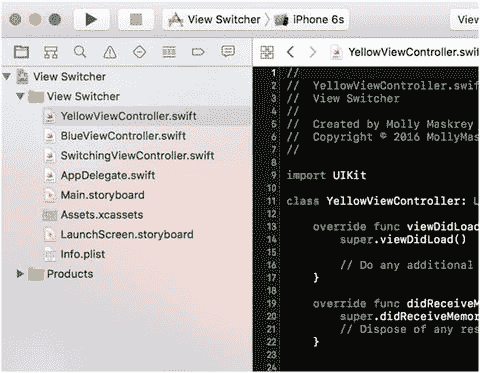

图 6-13.  
您可能希望将新的 Swift 文件移动到 Xcode 项目导航器中 View Switcher 文件夹下

### 修改`SwitchingViewController.swift`

`SwitchingViewController`类将需要一个操作方法来切换蓝色和黄色视图。我们不会创建任何输出口，但需要两个属性——分别对应我们将要换入换出的两个视图控制器。这些属性不需要是输出口，因为我们将在代码中创建视图控制器，而不是在故事板中。将以下属性声明添加到`SwitchingViewController.swift`中：

```
private var blueViewController: BlueViewController!
private var yellowViewController: YellowViewController!
```

在类的末尾添加以下方法：

```
@IBAction func switchViews(sender: UIBarButtonItem) {
}
```

之前，我们通过从视图按住 Control 键拖拽到视图控制器的源代码来添加操作方法，但这里您会看到，我们也可以反过来操作，因为 Interface Builder 能够看到我们源代码中已经定义了的输出口和操作。现在我们已经声明了所需的方法，就可以在故事板中为此控制器设置最小的用户界面了。


### 使用工具栏构建视图

现在我们需要为 `SwitchingViewController` 设置视图。提醒一下，这个视图控制器将是我们的根视图控制器——即应用程序启动时活跃的控制器。`SwitchingViewController` 的内容视图将由一个位于屏幕底部的工具栏以及来自黄色或蓝色视图控制器的视图组成。它的职责是在蓝色视图和黄色视图之间切换，因此需要为用户提供一种改变视图的方式。为此，我们将使用一个带按钮的工具栏。现在就来构建这个工具栏吧。

在项目导航器中，选择 `Main.storyboard`。在 IB 编辑器视图中，你会看到我们的切换视图控制器。如图 6-14 所示，它目前是空白的，相当单调。这就是我们开始构建图形用户界面的地方。

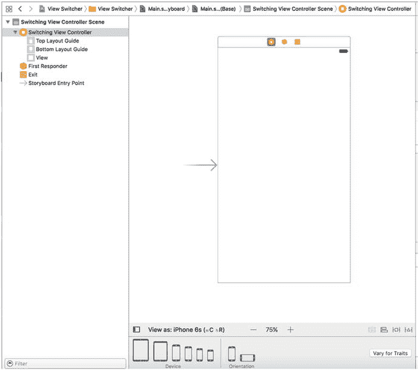

图 6-14. 空的根视图控制器（切换视图控制器）Storyboard

从库中抓取一个工具栏，将其拖到你的视图上，并放置在底部，使其看起来如图 6-15 所示。

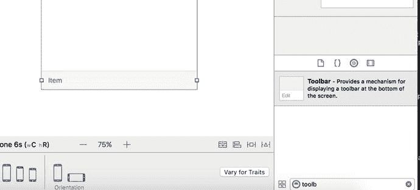

图 6-15. 向根视图控制器的底部添加一个工具栏

我们希望无论视图尺寸如何，该工具栏都能保持拉伸并固定在内容视图的底部。为此，我们需要添加三个布局约束——一个将工具栏固定在视图底部，另外两个将其固定在视图的左侧和右侧。要实现这一点，请在文档大纲中选择该工具栏，点击 storyboard 下方工具栏上的 Pin 按钮，然后更改弹出窗口中的值，如图 6-16 所示。

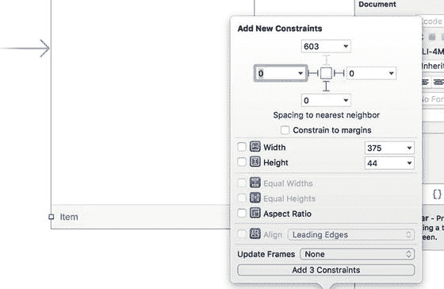

图 6-16. 将工具栏约束到其包含视图的底部、左侧和右侧

取消选中 `Constrain to margins` 复选框，因为我们希望将工具栏相对于内容视图的边缘而不是其边缘附近的蓝色参考线进行定位。接下来，将距最近左侧、右侧和底部邻居的距离设置为零（如果你已正确定位工具栏，它们应该已经是零了）。在这种情况下，工具栏最近的邻居是内容视图。你可以通过单击某个距离框中的小箭头来查看这一点。它会打开一个弹出窗口，显示最近的邻居以及你相对于其放置工具栏的任何其他邻居；在这个例子中，没有其他邻居。为了指示这些距离约束应处于活动状态，请单击连接距离框与中心小方框的三条虚线红线，使其变为实线。最后，将 `Update Frames` 更改为 `Items of New Constraints`（这样工具栏在 storyboard 中的表示就会移动到其新的约束位置），并点击 `Add 3 Constraints`。

现在，为了确保你走在正确的轨道上，请点击 Run 按钮，让此应用在 iOS 模拟器中启动。你应该会看到一个纯白色的应用启动，底部有一个浅灰色工具栏，其中包含一个单独的按钮。如果没有，请返回并重新检查你的步骤，看看遗漏了什么。旋转模拟器。验证工具栏是否固定在视图底部并横跨整个屏幕。如果情况并非如此，你需要修复刚刚应用于工具栏的约束。

### 将工具栏按钮连接到视图控制器

你可以看到工具栏有一个按钮，我们将使用该按钮在不同的内容视图之间切换。双击 storyboard 中的按钮，如图 6-17 所示，并将其标题更改为 `Switch Views`。按下 Return 键以确认更改。现在我们可以将工具栏按钮连接到 `SwitchingViewController` 中的操作方法。不过，在此之前，你应该知道工具栏按钮与其他 iOS 控件不同。它们只支持单个目标动作，并且仅在某个明确界定的时刻触发该动作——这相当于其他 iOS 控件上的 touch up inside 事件。

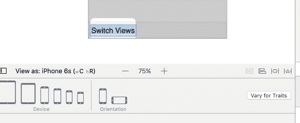

图 6-17. 将工具栏中的按钮标题更改为 Switch Views

在 Interface Builder 中选择工具栏按钮可能有些棘手。最简单的方法是，在文档大纲中展开 `Switching View Controller` 图标，直到你看到现在标记为 `Switch Views` 的按钮，然后单击它。选择好 `Switch Views` 按钮后，按住 Control 键从该按钮拖拽到场景顶部的黄色 `Switching View Controller` 图标，如图 6-18 所示。松开鼠标，从弹出窗口中选择 `switchViewsWithSender:` 动作。如果 `switchViewsWithSender:` 动作没有出现，而是显示了一个名为 `delegate` 的 outlet，那么你很可能是从工具栏而不是按钮进行的 Control-拖拽。要修复此问题，请确保选中了按钮而不是工具栏，然后重新进行 Control-拖拽。

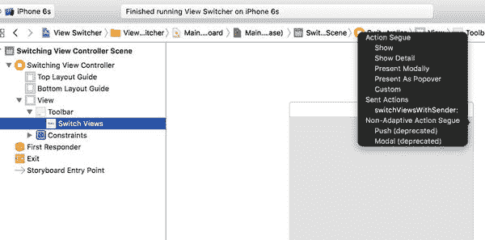

图 6-18. 将工具栏按钮连接到视图控制器类中的 `switchViewsWithSender:` 方法

**注意：** 你可能已经注意到，当我们之前手动输入函数时，我们称之为 `switchViews`，但由于这是一个 Action，无论我们是否决定使用该参数，系统都会自动为我们添加 `sender` 参数。

在这个场景中，我们还有一点需要指出，那就是 `SwitchingViewController` 的 `view` outlet。这个 outlet 已经连接到了场景中的视图。`view` outlet 继承自父类 `UIViewController`，使得控制器能够访问它控制的视图。当我们创建项目时，Xcode 同时创建了控制器及其视图，并为我们连接好了它们。这就是我们需要做的全部工作，所以请保存你的工作。接下来，让我们开始在 `SwitchingViewController` 中编写实现代码。


### 编写根视图控制器的实现

在项目导航器中，选择 `SwitchingViewController.swift`，并修改 `viewDidLoad()` 方法，通过添加清单 6-1 所示的代码行来进行一些初始化设置。

```
override func viewDidLoad() {
super.viewDidLoad()
// 视图加载后执行额外的设置
blueViewController =
storyboard?.instantiateViewController(withIdentifier: "Blue")
as! BlueViewController
blueViewController.view.frame = view.frame
switchViewController(from: nil, to: blueViewController)  // 辅助方法
}
清单 6-1.
根视图控制器的 viewDidLoad 方法代码
```

**注**：将清单 6-1 所示的代码输入到 Swift 文件时，包含 `switchViewController` 调用的那一行会出现错误。这是因为我们尚未编写该辅助方法，稍后我们将完成它。

我们对 `viewDidLoad()` 的实现覆写了一个 `UIViewController` 方法，该方法在故事板加载时被调用。我们如何得知这一点？按住 ⌥ 键（Option 键）并单击名为 `viewDidLoad()` 的方法，将会出现一个文档弹出窗口，如图 6-19 所示。此外，你也可以选择“视图”➤“工具”➤“显示快速帮助检查器”，在快速帮助面板中查看类似信息。`viewDidLoad()` 在我们的父类 `UIViewController` 中定义，旨在供那些需要在视图加载完成时收到通知的类进行覆写。

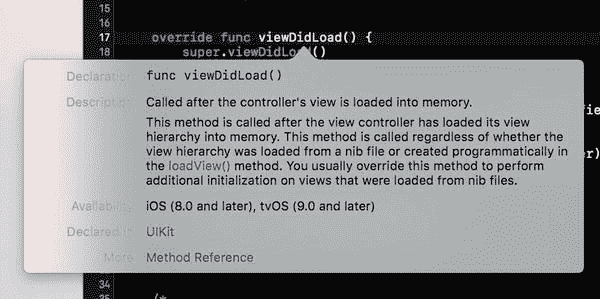

**图 6-19.** 当你在 Option 键加单击 `viewDidLoad()` 方法名时出现的文档窗口

此版本的 `viewDidLoad()` 创建了一个 `BlueViewController` 实例。我们使用 `instantiateViewController(withIdentifier:)` 方法，从包含我们根视图控制器的同一故事板中加载 `BlueViewController` 实例。要从故事板访问特定视图控制器，我们使用一个字符串作为标识符——在本例中是 `"Blue"`——稍后我们在配置故事板时进行设置。创建 `BlueViewController` 后，我们将此新实例分配给我们的 `blueViewController` 属性：

```
blueViewController =
storyboard?.instantiateViewController(withIdentifier: "Blue")
as! BlueViewController
```

接着，我们将蓝色视图控制器的视图框架设置为与开关视图控制器的内容视图相同，并切换到蓝色视图控制器，使其视图显示在屏幕上：

```
blueViewController.view.frame = view.frame
switchViewController(from: nil, to: blueViewController)
```

由于我们需要在多处执行视图控制器切换，实现此功能的代码位于辅助方法 `switchViewController(from:, to:)` 中，我们稍后将编写它。

现在，为什么我们不在此处也加载黄色视图控制器？我们迟早需要加载它，那么为什么不现在就加载呢？好问题。答案是用户可能永远不会点击“切换视图”按钮。用户可能只是使用应用程序启动时可见的视图，然后退出。在这种情况下，为什么要消耗资源来加载黄色视图及其控制器？相反，我们将在首次实际需要黄色视图时才加载它。这称为懒加载，是一种降低内存开销的标准方法。黄色视图的实际加载发生在 `switchViews()` 方法中。通过添加清单 6-2 所示的代码，填充你之前创建的此方法存根。

```
@IBAction func switchViews(sender: UIBarButtonItem) {
// 创建新的视图控制器（如果需要）
if yellowViewController?.view.superview == nil {
if yellowViewController == nil {
yellowViewController =
storyboard?.instantiateViewController(withIdentifier: "Yellow")
as! YellowViewController
}
} else if blueViewController?.view.superview == nil {
if blueViewController == nil {
blueViewController =
storyboard?.instantiateViewController(withIdentifier: "Blue")
as! BlueViewController
}
}
// 切换视图控制器
if blueViewController != nil
&& blueViewController!.view.superview != nil {
yellowViewController.view.frame = view.frame
switchViewController(from: blueViewController,
to: yellowViewController)
} else {
blueViewController.view.frame = view.frame
switchViewController(from: yellowViewController,
to: blueViewController)
}
}
清单 6-2.
我们的 switchViews 实现
```

`switchViews()` 首先通过检查 `yellowViewController` 的 `view` 的父视图是否为 `nil` 来判断正在交换进来的是哪个视图。如果以下两种情况之一成立，此检查结果将为 `true`：

- 如果 `yellowViewController` 存在，但其视图未显示给用户，则该视图将没有父视图，因为它当前不在视图层次结构中，因此表达式结果将为 `true`。
- 如果 `yellowViewController` 不存在（因为它尚未创建或已从内存中清除），表达式结果也将为 `true`。

然后，我们检查 `yellowViewController` 是否存在：

```
if yellowViewController?.view.superview == nil {
```

如果结果为 `nil`，意味着不存在 `yellowViewController` 实例，因此我们需要创建一个。这可能是因为按钮首次被按下，或者系统内存不足导致其被清除。在这种情况下，我们需要像在 `viewDidLoad()` 方法中为 `BlueViewController` 所做的那样，创建一个 `YellowViewController` 实例：

```
if yellowViewController == nil {
yellowViewController =
storyboard?.instantiateViewController(withIdentifier: "Yellow")
as! YellowViewController
}
```

如果我们要切换至蓝色控制器，我们需要执行相同的检查，看它是否仍然存在（因为它可能已从内存中清除），如果不存在则创建它。这同样是相同的代码，只是引用蓝色控制器：

```
} else if blueViewController?.view.superview == nil {
if blueViewController == nil {
blueViewController =
storyboard?.instantiateViewController(withIdentifier: "Blue")
as! BlueViewController
}
}
```

此时，我们知道已经有一个视图控制器实例，要么我们之前已有一个，要么我们刚刚创建了它。然后，我们将视图控制器的框架设置为与开关视图控制器的内容视图匹配，接着使用我们的 `switchViewController(from:, to:)` 方法来实际执行切换，如清单 6-3 所示。

```
// 切换视图控制器
if blueViewController != nil
&& blueViewController!.view.superview != nil {
yellowViewController.view.frame = view.frame
switchViewController(from: blueViewController,
to: yellowViewController)
} else {
blueViewController.view.frame = view.frame
switchViewController(from: yellowViewController,
to: blueViewController)
}
}
清单 6-3.
根据当前呈现的视图控制器切换视图控制器
```

`if` 语句的第一个分支在我们从蓝色视图控制器切换到黄色时执行，`else` 分支则相反。

除了在从未点击“切换视图”按钮时不为黄色视图和控制器消耗资源外，懒加载还使我们能够释放当前未显示的视图以释放其内存。当内存低于系统确定的水平时，iOS 会调用每个视图控制器继承自 `UIViewController` 的 `didReceiveMemoryWarning()` 方法。


既然我们知道无论是哪个视图，下次向用户展示时都会重新加载，因此只要当前没有显示，我们就可以安全地释放任何一个控制器。为此，我们可以在现有的 `didReceiveMemoryWarning()` 方法中添加几行代码，如代码清单 6-4 所示。

```
override func didReceiveMemoryWarning() {
super.didReceiveMemoryWarning()
// 释放任何可以重新创建的资源
if blueViewController != nil
&& blueViewController!.view.superview == nil {
blueViewController = nil
}
if yellowViewController != nil
&& yellowViewController!.view.superview == nil {
yellowViewController = nil
}
}
代码清单 6-4.
在低内存条件下安全释放不需要的控制器
```

这段新添加的代码会检查当前向用户显示的是哪个视图，然后通过将 `nil` 赋值给其属性来释放另一个视图对应的控制器。这将导致该控制器及其所控制的视图被解除分配，从而释放其内存。

**提示：** 懒加载是 iOS 资源管理的一个关键组成部分，你应当尽可能在任何地方实现它。在一个复杂的多视图应用中，负责任地清空内存中未使用的对象，可能成为应用表现良好与因内存不足而周期性崩溃之间的分水岭。

最终的难题是 `switchViewController(from:, to:)` 方法，它负责视图控制器的切换。切换视图控制器分为两步：首先，需要移除当前显示的控制器的视图；然后，需要添加新视图控制器的视图。但这还没完——我们还需要做一些清理工作。请添加该方法的实现，如代码清单 6-5 所示。

```
private func switchViewController(from fromVC:UIViewController?,
to toVC:UIViewController?) {
if fromVC != nil {
fromVC!.willMove(toParentViewController: nil)
fromVC!.view.removeFromSuperview()
fromVC!.removeFromParentViewController()
}
if toVC != nil {
self.addChildViewController(toVC!)
self.view.insertSubview(toVC!.view, at: 0)
toVC!.didMove(toParentViewController: self)
}
}
代码清单 6-5.
switchViewController 辅助方法
```

第一个代码块用于移除即将退出的视图控制器；但让我们先看第二个代码块，其中添加了即将进入的视图控制器。该代码块的第一行代码如下：

```
self.addChildViewController(toVC!)
```

这行代码使即将进入的视图控制器成为切换视图控制器的子控制器。像 `SwitchingViewController` 这样管理其他视图控制器的视图控制器被称为容器视图控制器。标准类 `UITabBarController` 和 `UINavigationController` 都是容器视图控制器，它们内部有代码执行与 `switchViewController(from:, to:)` 方法类似的操作。将新视图控制器设为 `SwitchingViewController` 的子控制器，可以确保某些传递给根视图控制器的事件在必要时正确传递给子控制器——例如，确保旋转被正确处理。

接下来，子视图控制器的视图被添加到 `SwitchingViewController` 的视图中：

```
self.view.insertSubview(toVC!.view, atIndex: 0)
```

请注意，该视图以索引零插入到 `SwitchingViewController` 的子视图列表中，这告诉 iOS 将此视图置于所有其他视图之后。将视图发送到底部，可以确保我们刚才在 Interface Builder 中创建的工具栏始终显示在屏幕上，因为我们将其内容视图插入到了它的后面。

最后，我们通知即将进入的视图控制器，它已被添加为另一个控制器的子控制器：

```
toVC!.didMoveToParentViewController(self)
```

这是必要的，以防子视图控制器重写此方法，以便在其成为另一个控制器的子控制器时采取某些行动。

既然你已经了解了如何添加视图控制器，那么移除视图控制器从其父控制器的代码就更容易理解了——我们只需反转添加时所执行的每一步操作：

```
if fromVC != nil {
fromVC!.willMoveToParentViewController(nil)
fromVC!.view.removeFromSuperview()
fromVC!.removeFromParentViewController()
}
```

### 实现内容视图

至此，代码已经完成，但我们还不能运行应用，因为故事板中还没有蓝色和黄色的内容控制器。这两个控制器非常简单，它们各自有一个由按钮触发的动作方法，并且都不需要任何输出口。这两个视图也几乎相同。事实上，它们非常相似，以至于本可以由同一个类来表示。我们选择将它们做成两个独立的类，因为大多数多视图应用都是这样构建的。

我们要实现的两个动作方法除了显示一个提醒框之外不做任何其他事情（就像我们在第 4 章的“Control Fun”应用中所做的那样），因此请继续向 `BlueViewController.swift` 添加代码清单 6-6 中的方法。

```
@IBAction func blueButtonPressed(sender: UIButton) {
let alert = UIAlertController(title: "蓝色视图按钮被按下",
message: "你按下了蓝色视图上的按钮",
preferredStyle: .alert)
let action = UIAlertAction(title: "是的，我按了", style: .default,
handler: nil)
alert.addAction(action)
present(alert, animated: true, completion: nil)
}
代码清单 6-6.
按下蓝色控制器上的按钮将显示一个提醒框
```

保存文件。接下来，切换到 `YellowViewController.swift`，将代码清单 6-7 中这个非常相似的方法添加到该文件，并同样保存。

```
@IBAction func yellowButtonPressed(sender: UIButton) {
let alert = UIAlertController(title: "黄色视图按钮被按下",
message: "你按下了黄色视图上的按钮",
preferredStyle: .alert)
let action = UIAlertAction(title: "是的，我按了", style: .default,
handler: nil)
alert.addAction(action)
present(alert, animated: true, completion: nil)
}
代码清单 6-7.
按下黄色控制器上的按钮也会显示一个提醒框
```

接下来，选择 `Main.storyboard` 在 Interface Builder 中将其打开，以便我们做一些修改。首先，我们需要为 `BlueViewController` 添加一个新的场景。到目前为止，我们处理的每个故事板都只包含一个控制器-视图配对，但故事板还有更多技巧，其中就包括容纳多个场景。从对象库中，拖出另一个视图控制器并将其放到现有控制器旁边的编辑区域。现在，你的故事板中有两个场景，每个场景都可以在应用运行时动态独立加载。在新场景顶部的一排图标中，单击黄色的视图控制器图标，然后按下 `⌥⌘3` 打开身份检查器。在自定义类部分，类菜单默认为 `UIViewController`；将其改为 `BlueViewController`，如图 6-20 所示。

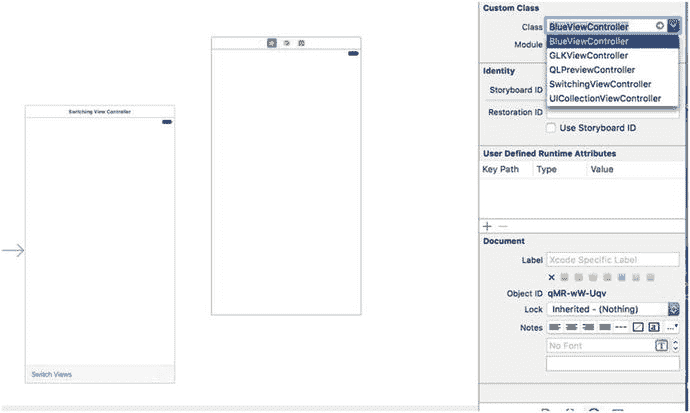

**图 6-20.** 添加我们的新视图控制器并将其与 `BlueViewController` 类文件关联

我们还需要为这个新视图控制器创建一个标识符，以便我们的代码能在故事板中找到它。在身份检查器中自定义类部分的正下方，你会看到一个故事板 ID 字段。点击该字段并输入 `Blue`，以匹配我们在代码中使用的值，如图 6-21 所示。

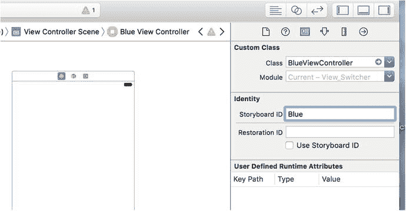

**图 6-21.** 将蓝色视图控制器故事板的故事板 ID 设置为 `Blue`


现在你拥有了两个场景。我们之前演示过如何配置应用在启动时加载这个故事板，但当时并未提及场景相关的内容。应用将如何决定显示这两个视图中的哪一个呢？答案在于指向第一个场景的大箭头，如图 6-22 所示。这个箭头指向了故事板的默认场景，也就是应用启动时显示的界面。如果你想选择不同的默认场景，只需拖动箭头指向你想要的场景即可。

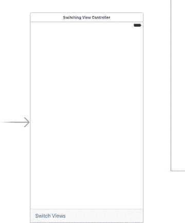

图 6-22. 我们刚刚向故事板添加了第二个场景。大箭头指向默认场景

在刚添加的新场景中，单击大正方形视图，然后按下 `⌥⌘4` 调出属性检查器。在检查器的视图部分，单击标注为“Background”的颜色选择器，使用弹出的颜色选择器将此视图的背景色更改为漂亮的蓝色调。对蓝色满意后，关闭颜色选择器。

从库中拖出一个按钮到视图上，使用参考线将其在视图内水平和垂直居中。我们希望确保按钮无论如何都能保持居中，因此为此添加两个约束。选中按钮后，单击 Storyboard 下方的“Align”图标。在弹出窗口中，勾选“Horizontally in Container”和“Vertically in Container”，将“Update Frames”改为“Items of New Constraints”，然后单击“Add 2 Constraints”（见图 6-23）。为了方便对齐，可能更适合将背景临时改回白色，完成后再改回蓝色。另外，由于蓝色背景，你可能想将按钮文本改为白色以更加醒目。

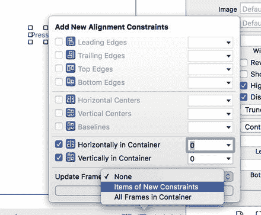

图 6-23. 将按钮对齐到视图中心

双击按钮，将其标题改为“Press Me”。接下来，在按钮仍被选中的状态下，切换到连接检查器（按 `⌥⌘6`），从“Touch Up Inside”事件拖拽到场景顶部的黄色“View Controller”图标，并连接到 `blueButtonPressedWithSender` 操作方法。

现在，轮到对 `YellowViewController` 执行几乎相同的操作集。从对象库中再拖出一个“View Controller”，放入编辑区域。不用担心场面变得拥挤；必要时你可以将这些场景堆叠在一起。在文档大纲中单击新场景的“View Controller”图标，使用身份检查器将其类更改为 `YellowViewController`，并将 Storyboard ID 更改为“Yellow”。

接下来，选择 `YellowViewController` 的视图，切换到属性检查器。在那里，单击“Background”颜色选择器，选择黄色，然后关闭选择器。

接着，从库中拖出一个“Button”，使用参考线使其在视图中居中。使用“Align”图标弹出窗口创建约束，使其水平和垂直居中，就像上一个按钮一样。现在将其标题改为“Press Me, Too”。在按钮仍被选中的状态下，使用连接检查器从“Touch Up Inside”事件拖拽到“View Controller”图标，并连接到 `yellowButtonPressedWithSender` 操作方法。

完成后，保存故事板，然后点击 Xcode 中的“Run”按钮启动应用，此时会显示全屏的蓝色视图。当你点击“Switch Views”按钮时，它会切换显示我们构建的黄色视图。再次点击它，则返回蓝色视图。如果你点击居中于蓝色或黄色视图上的按钮，将会出现一个带有消息的警告视图，指示哪个按钮被按下。这个警告表明，针对当前显示的视图，正确的控制器类已被调用。

两个视图之间的切换显得有些突兀，因此我们将为过渡添加动画效果，以给用户更好的视觉变化反馈。


## 动画过渡

`UIView` 提供了多个类方法，我们可以调用这些方法来指示视图之间的过渡应带有动画效果、指定应使用的过渡类型，以及设置过渡所需时长。

回到 `SwitchingViewController.swift` 文件中，修改 `switchViews()` 方法，如代码清单 6-8 所示。

```
@IBAction func switchViews(sender: UIBarButtonItem) {
    // 如果需要，创建新的视图控制器
    if yellowViewController?.view.superview == nil {
        if yellowViewController == nil {
            yellowViewController =
                storyboard?.instantiateViewController(withIdentifier: "Yellow")
                    as! YellowViewController
        }
    } else if blueViewController?.view.superview == nil {
        if blueViewController == nil {
            blueViewController =
                storyboard?.instantiateViewController(withIdentifier: "Blue")
                    as! BlueViewController
        }
    }
    UIView.beginAnimations("View Flip", context: nil)
    UIView.setAnimationDuration(0.4)
    UIView.setAnimationCurve(.easeInOut)
    // 切换视图控制器
    if blueViewController != nil
        && blueViewController!.view.superview != nil {
        UIView.setAnimationTransition(.flipFromRight,
                                      for: view, cache: true)
        yellowViewController.view.frame = view.frame
        switchViewController(from: blueViewController,
                             to: yellowViewController)
    } else {
        UIView.setAnimationTransition(.flipFromLeft,
                                      for: view, cache: true)
        blueViewController.view.frame = view.frame
        switchViewController(from: yellowViewController,
                             to: blueViewController)
    }
    UIView.commitAnimations()
}
```

构建并运行此版本。当你点击 Switch Views 按钮时，旧视图将翻转以显示新视图，而不是直接切换显示。

要告知 iOS 我们需要动画过渡，必须声明一个动画块并指定动画时长。动画块通过 `UIView` 的类方法 `presentViewController(_:animated:completion:)` 来声明，如下所示：

```
UIView.beginAnimations("View Flip", context: nil)
UIView.setAnimationDuration(0.4)
```

`presentViewController(_:animated:completion:)` 接受两个参数。第一个是动画块标题。只有当你更直接地利用 Core Animation（此动画背后的框架）时，这个标题才会发挥作用。对于我们的目的，也可以使用 `nil`。第二个参数是一个指针，用于指定一个对象（或任何其他 C 数据类型），其地址将与这个动画块关联。我们可以在过渡期间添加一些自己的代码来运行，但这里不需要，因此我们将此参数设为 `nil`。我们还设置了动画的持续时间，这将告诉 `UIView` 动画应持续多长时间（以秒为单位）。

之后，我们设置动画曲线，它决定了动画的时间节奏。默认的线性曲线会导致动画以恒定速度进行。我们在此设置的选项 `UIViewAnimationCurve.EaseInOut` 指定动画应开始缓慢，中间加速，最后再减速。这使动画看起来更自然，更少机械感：

```
UIView.setAnimationCurve(.easeInOut)
```

接下来，我们需要指定要使用的过渡。目前，有五种 iOS 视图过渡可供使用：

*   `UIViewAnimationTransition.flipFromLeft`
*   `UIViewAnimationTransition.flipFromRight`
*   `UIViewAnimationTransition.curlUp`
*   `UIViewAnimationTransition.curlDown`
*   `UIViewAnimationTransition.none`

根据切换的是哪个视图，我们选择了两种不同的效果。对一个过渡使用左翻转，对另一个过渡使用右翻转，可以使视图看起来来回翻转。值 `UIViewAnimationTransition.none` 会导致从一个视图控制器到另一个视图控制器的突然过渡。当然，如果你想要这种效果，就根本不需要费心创建动画块了。

缓存选项通过在动画开始时获取视图的快照来加速绘制，并使用该图像而不是在动画的每一步都重新绘制视图。除非视图的外观需要在动画过程中改变，否则应始终缓存动画：

```
UIView.setAnimationTransition(.flipFromRight,
                              forView: view, cache: true)
```

当我们完成动画更改的指定后，在 `UIView` 上调用 `commitAnimations()`。从动画块开始到调用 `commitAnimations()` 之间的所有内容都将一起进行动画处理。

得益于 Cocoa Touch 在底层对 Core Animation 的使用，我们只需少量代码就能实现相当复杂的动画。

## 小结

现在，既然你已从零构建了一个多视图应用，你应该对多视图应用的组织方式有了很好的理解。虽然 Xcode 包含了最常见类型的多视图应用的项目模板，但我们需要理解这些类型应用的总体结构，以便能够自行从头构建它们。标准容器控制器（`UITabBarController`、`UINavigationController` 和 `UIPageViewController`）是非常节省时间的工具，你应尽可能使用，但有时它们无法满足你的需求。

在接下来的几章中，我们将继续构建多视图应用，以强化本章的概念，并让你感受更复杂的应用是如何构建的。在第 7 章中，我们将构建一个标签栏应用。

