# 使用标签栏和选择器

在上一章中，你构建了第一个多视图应用。在本章中，我们将构建另一个——这次创建一个完整的标签栏应用，包含五个不同的标签和五个不同的内容视图。构建此应用将强化我们在第 6 章中涵盖的许多内容。我们将使用这五个内容视图来演示一种尚未涵盖的 iOS 控件类型：选择器视图，或简称为选择器。你可能对这个名称不熟悉，但如果你拥有 iPhone 或 iPod touch 超过 10 分钟，几乎肯定使用过选择器。选择器包含带有可旋转拨盘的控件。你可以在日历应用中输入日期，或在时钟应用中设置计时器时使用它们，如图 7-1 所示。在 iPad 上它并不那么常见，因为更大的显示屏允许你提供其他选择多个项目的方式，但即使在 iPad 上，日历应用也使用了它。

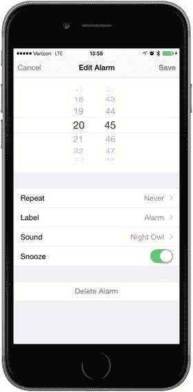

选择器比我们目前看到的 iOS 控件稍微复杂一些；因此，它们值得更多关注。选择器可以配置为显示一个或多个拨盘。默认情况下，选择器显示文本列表，但它们也可以显示图像。


## 选择器应用

本章的应用`Pickers`包含一个标签栏。在构建`Pickers`的过程中，你将修改默认的标签栏，使其拥有五个标签项，为每个标签项添加图标，然后创建一系列内容视图并将每个视图连接到一个标签。该应用的内容视图展示了五种不同的选择器：

*   **带图像的自定义选择器**：在第五个内容视图中，我将演示如何向选择器添加图像数据，我们将通过编写一个小游戏来实现，该游戏使用一个包含五个组件的选择器。Apple 的文档将选择器的外观描述为有点像老虎机。因此，我们将创建一个老虎机，如图 7-6 所示。对于这个选择器，用户无法手动更改组件的值，但可以点击`Spin`按钮，使五个滚轮旋转到新的、随机选择的值。如果连续出现三个相同的图像，用户就获胜。

    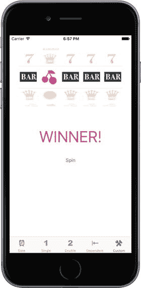

    图 7-6.  
    我们的第五个组件选择器将选择器用作老虎机

*   **带依赖组件的选择器**：在第四个内容视图中，我们将构建另一个包含两个组件的选择器。但这一次，右侧组件中显示的值会根据左侧组件中选择的值而变化。在我们的示例中，我们将在左侧组件中显示一个州列表，在右侧组件中显示该州的邮政编码列表，如图 7-5 所示。

    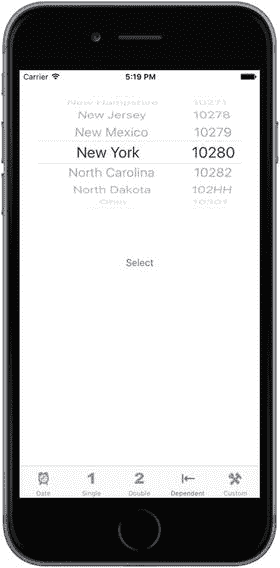

    图 7-5.  
    在此选择器中，一个组件依赖于另一个组件。当你在左侧组件中选择一个州时，右侧组件会变为该州的邮政编码列表

*   **多组件选择器**：在第三个标签中，我们将创建一个包含两个独立滚轮的选择器。技术术语是选择器组件。这里，我们创建一个包含两个组件的选择器。你将看到如何通过向选择器提供两个独立的列表数据来使用数据源和代理（参见图 7-4），每个列表都可以更改而不会影响另一个。

    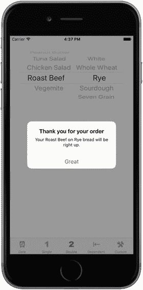

    图 7-4.  
    一个双组件选择器，显示反映我们选择的提示

*   **单组件选择器**：第二个标签包含一个具有单列值的选择器，如图 7-3 所示，其实现比日期选择器稍微复杂一些。你将学习如何通过使用代理和数据源来指定要在选择器中显示的值。

    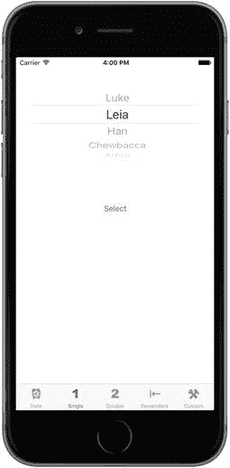

    图 7-3.  
    显示单列值的选择器

*   **日期选择器**：我们将构建的第一个内容视图使用日期选择器，这是最容易实现的选择器类型（参见图 7-2）。该视图还有一个按钮，点击它会显示一个提示，显示所选日期。

    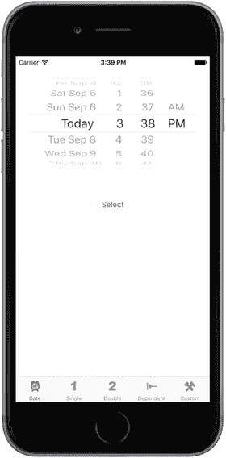

    图 7-2.  
    第一个标签显示一个日期选择器

### 代理和数据源

在开始构建应用之前，让我们看看是什么让选择器比我们目前使用的其他控件更复杂。除了日期选择器之外，你不能仅仅从对象库中抓取一个选择器，将其拖放到内容视图上并进行配置来使用它。你还需要为每个选择器提供代理和数据源。

我们已经使用过应用代理，其基本思想对于选择器来说是一样的。控件本身将几个任务委托给它的代理，其中最重要的是确定每个组件的每一行实际绘制什么。选择器会向代理请求一个字符串或一个视图，该视图将绘制在给定组件的指定位置上。选择器从代理那里获取数据。

除了代理之外，选择器还必须有一个数据源。数据源告诉选择器它将处理多少个组件，以及每个组件由多少行组成。数据源的工作方式与代理类似，其方法会在某些预定的时间被调用。没有数据源和代理，选择器就无法工作；事实上，它们甚至不会被绘制出来。

数据源和代理通常是同一个对象，并且存在于同一个实际的 Swift 文件中，通常是选择器所在视图的视图控制器。我们在本应用中采用了这种方法：我们应用中每个内容面板的视图控制器都将作为其选择器的数据源和代理。

**注意**

经常出现的一个问题是，选择器数据源属于应用程序的模型、视图还是控制器部分？数据源听起来像是模型的一部分，但它实际上是控制器的一部分。数据源通常不是一个设计用来保存数据的对象。在简单的应用程序中，数据源可能持有数据，但其真正的工作是从模型中检索数据并将其传递给选择器。

## 创建选择器应用

尽管 Xcode 为标签栏应用提供了模板，但我们将从头开始构建它。这不会增加太多额外工作，而且是很好的练习。

创建一个新项目，再次选择`Single View Application`模板，然后选择`Next`进入下一个屏幕。在`Product Name`字段中，输入`Pickers`。确保`Use Core Data`复选框未被选中，并将`Language`设置为`Swift`，`Devices`弹出菜单设置为`Universal`。然后再次选择`Next`。Xcode 会让你选择保存项目的文件夹。

我们将引导你完成构建整个应用的过程；但在任何步骤中，如果你觉得自己可以挑战一下，提前推进，请尽管去做。如果你遇到困难，随时可以回来查看。


### 创建视图控制器

在上一章中，我们创建了一个根视图控制器（简称“根控制器”）来管理应用其他视图的切换过程。这次我们将再次这样做，但无需创建自己的根视图控制器类。苹果提供了一个非常优秀的类来管理标签栏视图，因此我们只需使用 `UITabBarController` 的一个实例作为根控制器。首先，我们需要在 Xcode 中创建五个新类：根控制器将用来切换的五个视图控制器。展开项目导航器中的 `Pickers` 文件夹，你会看到 Xcode 为启动项目而创建的源代码文件。单击 `Pickers` 文件夹，然后按下 `⌘N` 或选择 **文件 ➤ 新建 ➤ 文件…**。

选择 **iOS**，然后在新建文件助手左侧面板中选择 **Source**。接着，选择 **Cocoa Touch Class** 图标，点击 **下一步** 继续。下一个屏幕允许你为新类命名。在“Class”字段中输入 `DatePickerViewController`。确保“Subclass of”字段包含 `UIViewController`。确保 **同时创建 XIB 文件** 复选框未被选中，将语言设置为 **Swift**，然后点击 **下一步**。

系统会显示一个文件夹选择窗口，让你选择类文件的保存位置。选择 `Pickers` 目录，该目录已包含 `AppDelegate` 类及其他几个文件。同时确保“Group”弹出菜单中已选中 `Pickers` 文件夹，并且“Pickers”的目标复选框已被勾选。点击 **创建** 按钮后，`DatePickerViewcontroller.swift` 文件将出现在 `Pickers` 文件夹中。

重复以上步骤四次，分别使用名称 `SingleComponentPickerViewController`、`DoubleComponentPickerViewController`、`DependentComponentPickerViewController` 和 `CustomPickerViewController`。完成所有这些操作后，`Pickers` 文件夹应包含所有视图控制器类文件，如图 7-7 所示。

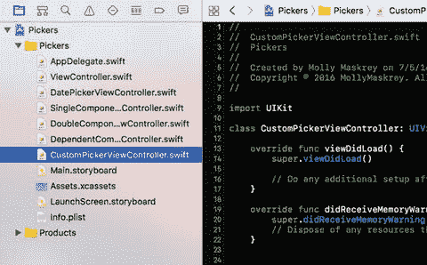

**图 7-7.**  
创建五个视图控制器类后，项目导航器中应包含所有这些文件

### 创建标签栏控制器

现在，让我们创建标签栏控制器。项目模板已经包含一个名为 `ViewController` 的视图控制器，它是 `UIViewController` 的子类。要将其转换为标签栏控制器，我们只需更改其基类。打开 `ViewController.swift` 并进行以下加粗显示的更改：

```swift
class ViewController: UITabBarController {
```

接下来，要在情节提要中设置标签栏控制器，请打开 `Main.storyboard`。模板添加了一个初始视图控制器，我们将替换它，因此在文档大纲或编辑区域中选中它，然后按 **Delete** 键将其删除。在对象库中，找到 **Tab Bar Controller** 并将其拖到编辑区域（见图 7-8）。

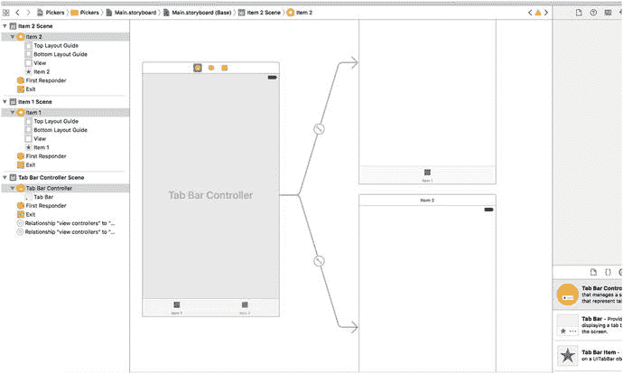

**图 7-8.**  
将标签栏控制器从库中拖到画布上

拖拽时，你会发现与之前要求你从对象库中拖出的其他控制器不同，这个控制器会一次性拉出三个完整的视图控制器对，它们之间都用曲线相互连接。这实际上不仅仅是一个标签栏控制器，它还包含了两个已经连接好并可直接使用的子控制器。

当你将标签栏控制器放到编辑区域后，情节提要中会添加三个新场景。如果展开左侧的文档视图，你将看到情节提要中所有场景的清晰概览（见图 7-8）。你还会看到连接标签栏控制器及其每个子控制器的曲线仍然存在。如果你移动场景，这些曲线会自动调整以保持连接，你可以随时自由移动。每个场景在情节提要中的屏幕位置不会影响应用运行时的外观。

这个标签栏控制器将成为我们的根控制器。提醒一下，根控制器控制着程序运行时用户首先看到的视图，并负责切换其他视图。由于我们将每个视图连接到标签栏中的一个标签，因此标签栏控制器作为根控制器是合乎逻辑的选择。我们需要告诉 iOS，当应用程序启动时，它应该从 `Main.storyboard` 中加载标签栏控制器。为此，在文档大纲中选择 **Tab Bar Controller** 图标，打开属性检查器；然后在“视图控制器”部分，勾选 **Is Initial View Controller** 复选框。在视图控制器仍处于选中状态时，切换到标识检查器，并将类更改为 `ViewController`。

标签栏可以使用图标来表示每个标签，因此我们应在编辑情节提要之前添加将要使用的图标。你可以在本书源代码归档的 `07 - ImageSets` 文件夹中找到一些合适的图标。`07 - ImageSets` 的每个子文件夹都包含三个图像（一个用于标准显示屏设备，两个用于 Retina 设备）。在 Xcode 项目导航器中，选择 `Assets.xcassets`，然后将 `07 - ImageSets` 文件夹中的每个子文件夹拖到编辑区域左侧列中 `AppIcon` 的下方，将它们全部复制到项目中（见图 7-9）。

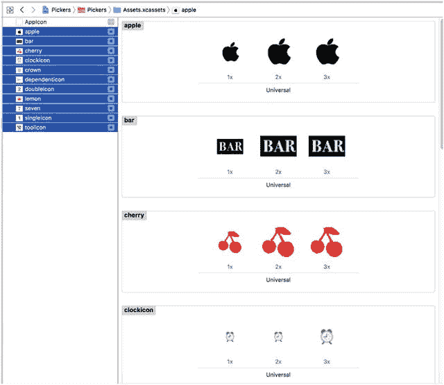

**图 7-9.**  
在 Xcode 中将图像拖到 `Assets.xcassets` 中的 `AppIcon` 下方

如果你想自己制作图标，可以参考以下创建指南。使用的图标应为 24 × 24 像素，并保存为 `.png` 格式。图标文件应具有透明背景。无需费心为图标着色以匹配标签栏的外观。与处理应用程序图标一样，iOS 会自动处理你的图像，使其看起来恰到好处。


24 × 24 像素的图像尺寸实际上适用于标准显示屏；对于 iPhone 4 及更高版本的 Retina 显示屏以及新款 iPad，你需要提供双倍尺寸的图像，否则图像会显得像素化。对于 iPhone 6/6s Plus，你需要提供原始尺寸三倍的图像。这非常简单：对于任意图像 `foo.png`，你还应提供名为 `foo@2x.png` 的双倍尺寸图像，以及名为 `foo@3x.png` 的三倍尺寸图像。调用 `UIImage(named:"foo")` 将自动返回适合当前设备的标准尺寸或双倍尺寸图像。

回到故事板中，你可以看到每个子视图控制器顶部显示类似“Item 1”的名称，并且在视图底部有一个单独的栏项目，其标签与标签栏中的内容匹配。我们最好从一开始就为这两个控制器设置正确的名称，因此选中 Item 1 视图控制器，然后在文档大纲中点击标记为 Item 1 的标签栏项目。打开属性检查器，你会看到一个用于设置栏项目标题的文本字段，当前包含文本 Item 1。将该文本替换为 `Date`，然后按下 Enter 键。这会立即更改此视图控制器底部栏项目的文本，以及标签栏控制器中对应的标签栏项目。当你仍在检查器中时，点击图像弹出菜单并选择 `clockicon` 来设置图标。现在，对第二个子视图控制器重复相同的步骤，但将其命名为 `Single`，并为其栏项目使用 `singleicon` 图像。

下一步是完善我们的标签栏控制器，使其包含图 7-2 所示的五个标签。这五个标签中的每一个都将包含我们的一个选择器。我们要实现的方法是，除了与标签栏控制器一起添加的两个视图控制器外，再向故事板中添加三个视图控制器，然后将它们全部连接起来，以便标签栏控制器能够激活它们。首先，从对象库拖出一个普通的视图控制器，放到故事板上。接下来，按住 Control 键从标签栏控制器拖拽到新的视图控制器，松开鼠标按钮，然后从弹出的小窗口中的“关系转场”部分选择 `view controllers`。这告诉标签栏控制器它有了一个新的子控制器需要管理，因此标签栏会立即获得一个新项目。与之前其他控制器一样，你的新视图控制器会在其视图底部和文档大纲中获得一个栏项目。现在，按照之前概述的相同步骤，将这个最新视图控制器的栏项目命名为 `Double`，并使用 `doubleicon` 作为其图像。

再拖出两个视图控制器，并按照前面所述的方式将它们连接到标签栏控制器。依次选中每个视图控制器的栏项目，将其中一个命名为 `Dependent`，并使用 `dependenticon` 作为其图像，将另一个命名为 `Custom`，并使用 `toolicon` 作为其图像。完成后，你应该有一个底部带有标签栏的视图控制器，以及五个已连接的视图控制器，如图 7-10 所示。

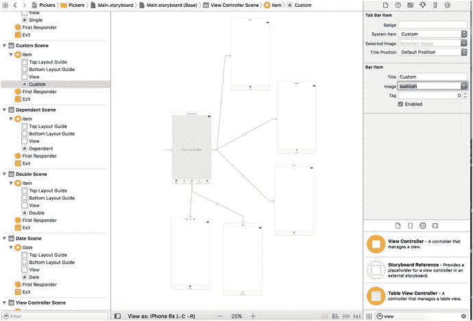

图 7-10. 添加我们将通过根视图控制器中的标签栏访问的五个视图控制器

现在，所有视图控制器都已就位，是时候从我们之前创建的集合中为每个视图控制器设置正确的控制器类了。这将使我们能够为每个控制器实现不同的功能。在文档大纲中，选中标记为 `Date` 的视图控制器，然后打开身份检查器。在检查器的“自定义类”部分，将类更改为 `DatePickerViewController`，然后按 Return 或 Tab 键完成（参见图 7-11）。

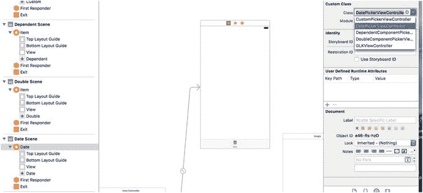

图 7-11. 将我们的日期视图连接到其视图控制器

对其余四个视图控制器重复相同的过程，顺序按照它们在标签栏控制器底部出现的顺序。你可以通过点击故事板中的每个视图控制器来依次选中它，确保点击控制器顶部包含控制器名称的栏。在每个视图控制器的身份检查器中，分别使用类名 `SingleComponentPickerViewController`、`DoubleComponentPickerViewController`、`DependentComponentPickerViewController` 和 `CustomPickerViewController`。在进行下一项 GUI 编辑之前，请保存你的故事板文件。

## 初始模拟器测试

此时，标签栏和内容视图应该都已连接并正常工作。编译并运行，你的应用程序应该会启动一个功能正常的标签栏，如图 7-12 所示。依次点击每个标签，每个标签都应该是可选的。

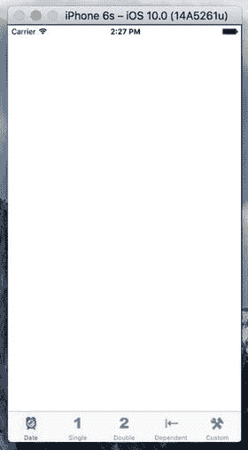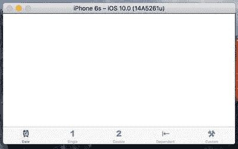

图 7-12. 包含五个空但可选的标签的应用程序

现在内容视图中没有任何内容，所以变化不会很明显。实际上，除了高亮的标签栏项目外，你不会看到任何区别。但如果一切顺利，你的多视图应用程序的基本框架现在就已经建立并可以工作了。我们可以开始设计各个内容视图了。

**提示：** 如果点击某个标签时模拟器崩溃，很可能是你漏掉了某个步骤或出现了拼写错误。返回并确保连接正确，类名也都设置正确。

如果你想加倍确认一切正常，可以在每个内容视图中添加不同的标签或其他对象，然后重新启动应用程序。在这种情况下，你应该会在选择不同标签时看到不同视图的内容发生变化。


### 实现日期选择器

要实现日期选择器，我们需要一个输出口（outlet）和一个操作（action）。输出口用于获取日期选择器中的值，操作则由按钮触发，并弹出一个警告框来显示从选择器中获取的日期值。我们将在编辑 `Main.storyboard` 文件时，通过 Interface Builder 添加这两项。因此，如果该文件尚未显示在前台，请在项目导航器中选择它。

首先，我们需要在对象库中找到日期选择器（Date Picker），并将其拖拽到编辑区域的日期场景（Date Scene）中。点击文档大纲中的日期图标，将正确的视图控制器调至前台，然后从对象库中拖出日期选择器，将其放置在视图顶部，紧贴显示区域的上边缘。它覆盖状态栏是没问题的，因为此控件顶部内置了充足的垂直内边距，没有人会注意到。

现在，我们需要应用自动布局约束，以确保日期选择器在任何类型的设备上运行时，都能正确调整大小并处于合适位置。我们希望选择器在水平方向上居中，并锚定在视图顶部。同时，我们希望其大小基于内容自适应，因此需要添加三个约束。选中日期选择器后，首先在 Xcode 菜单栏中选择 **Editor ➤ Size to Fit Content**。如果该选项不可用，请轻微移动选择器后重试。接下来，点击故事板下方的 **Align** 按钮，勾选 **Horizontally in Container** 复选框，然后点击 **Add 1 Constraint**。点击 **Pin** 按钮（位于 **Align** 按钮旁边）。在弹出的提示框中，使用顶部的四个距离框，将选择器与上方视图边缘的距离设为零：在顶部输入框中输入 0，使其下方的线条变为实线。在弹出框底部，将 **Update Frames** 设置为 **Items of New Constraints**，然后点击 **Add 1 Constraint**。日期选择器将调整大小并移动到正确位置，如图 7-13 所示。

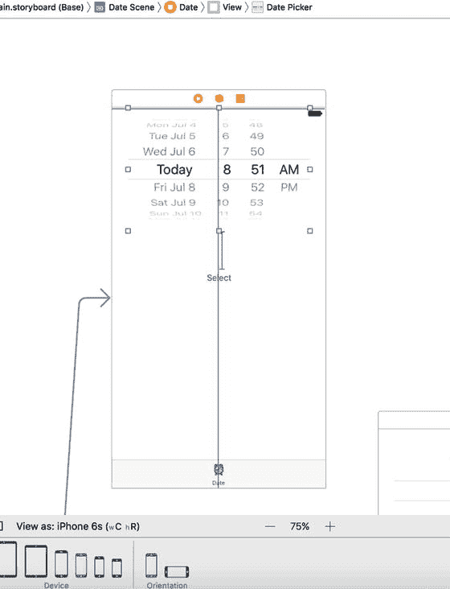

**图 7-13.** 日期选择器，已定位在其视图控制器视图的顶部

如果尚未选中，请单击日期选择器，然后返回属性检查器。如图 7-14 所示，可以为日期选择器配置多个属性。我们将保持大部分值为默认值（但完成后可以随意尝试其他选项，看看它们的效果）。我们要做的唯一一件事是限制选择器的日期范围为合理的日期。找到标题为 **Constraints** 的部分，并勾选 **Minimum Date** 复选框。将其值保持为默认的 `1/1/1970`。同时勾选 **Maximum Date** 复选框，并将该值设置为 `12/31/2200`。

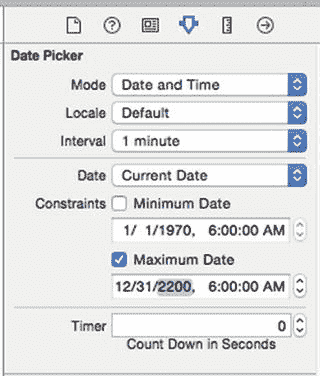

**图 7-14.** 日期选择器的属性检查器。设置最大日期，其余设置保持默认值

现在，让我们将这个选择器连接到它的控制器。按下 **⌥⌘Enter** 打开助理编辑器，并确保助理编辑器顶部的跳转栏设置为 **Automatic**。这样做应该会使 `DatePickerViewController.swift` 显示在那里。接下来，**按住 Control 键拖拽** 从选择器到类声明和 `viewDidLoad()` 方法之间的空行，当出现 **Insert Outlet, Action, or Outlet Collection** 提示时松开鼠标按钮。在松开后出现的弹出窗口中，确保 **Connection** 设置为 **Outlet**，在 **Name** 中输入 `datePicker`，然后按 **Enter** 创建输出口并将其连接到选择器。

接下来，从库中获取一个按钮（Button），并将其放置在日期选择器下方一小段距离处。双击按钮，将其标题设置为 **选择**。我们希望此按钮水平居中，并与日期选择器保持固定的垂直距离。选中按钮后，点击故事板底部的 **Align** 按钮，勾选 **Horizontally in Container** 复选框，然后点击 **Add 1 Constraint**。为了固定它们之间的距离，**按住 Control 键拖拽** 从按钮到日期选择器，然后松开鼠标。在出现的弹出窗口中，选择 **Vertical Spacing**。最后，点击故事板底部的 **Resolve Auto Layout Issues** 按钮，然后在弹出窗口的顶部区域点击 **Update Frames**（如果此选项不可用，则表示按钮已位于正确位置）。按钮应移动到正确位置，并且不再有任何自动布局警告。

确保助理编辑器中仍然显示 `DatePickerViewController.swift`；如果没有显示，请使用跳转栏中的 **Manual** 选项定位并打开它。现在，**按住 Control 键拖拽** 从按钮到助理视图中类末尾闭合花括号上方的行，直到看到 **Insert Outlet, Action, or Outlet Collection** 提示出现。将 **Connection** 类型更改为 **Action**，将新操作命名为 `onButtonPressed`，然后按 **Enter** 连接它。这样做会创建一个名为 `onButtonPressed()` 的空方法，您需要用代码清单 7-1 中的代码补全它。

```
@IBAction func onButtonPressed(_ sender: UIButton) {
    let date = datePicker.date
    let message = "您选择的日期和时间是 \(date)"
    let alert = UIAlertController(
        title: "已选择的日期和时间",
        message: message,
        preferredStyle: .alert)
    let action = UIAlertAction(
        title: "完全正确！",
        style: .default,
        handler: nil)
    alert.addAction(action)
    present(alert, animated: true, completion: nil)
}
```

**代码清单 7-1.** 我们的“选择”按钮操作代码

在 `viewDidLoad()` 方法中，我们创建一个新的 `NSDate` 对象。以这种方式创建的 `NSDate` 对象将保存当前日期和时间。然后，我们将 `datePicker` 设置为该日期，这确保了每次从故事板加载此视图时，选择器都会重置为当前日期和时间，参见代码清单 7-2。

```
override func viewDidLoad() {
    super.viewDidLoad()
    // 加载视图后执行任何其他设置。
    let date = NSDate()
    datePicker.setDate(date as Date, animated: false)
}
```

**代码清单 7-2.** 在 `viewDidLoad()` 方法中设置日期

仅此而已。继续构建并运行，以确保日期选择器正常工作。如果一切顺利，您的应用程序在执行时应如图 7-2 所示。如果您点击 **选择** 按钮，将弹出一个警告框，显示日期选择器中当前选定的日期和时间。

> **注意：** 日期选择器不允许您指定秒数或时区。警告框会以格林威治标准时间（GMT）并包含秒数的形式显示时间。我们本可以添加一些代码来简化警告框中显示的字符串，但本章内容还不够长吗？如果您对自定义日期格式感兴趣，可以查看 `NSDateFormatter` 类。


## 实现单组件选择器

接下来这个选择器允许用户从值列表中进行选择。在本示例中，我们将使用一个数组来存储希望在选择器中显示的值。选择器本身并不持有任何数据，而是通过调用其数据源和委托的方法来获取需要显示的数据。选择器并不关心底层数据存储在何处，它只在需要时请求数据，而数据源和委托（在实践中通常是同一个对象）则协同提供这些数据。因此，数据既可以像本节所做的那样来自静态列表，也可以从文件或 URL 加载，甚至可以实时生成或计算。

为了让选择器类能够向其控制器请求数据，我们必须确保该控制器实现了正确的方法。其中一项工作是在控制器的类定义中声明它将遵循两个协议。在项目导航器中，单击`SingleComponentPickerViewController.swift`文件。该控制器类将同时充当其选择器的数据源和委托，因此我们需要确保它符合这两个角色的协议。添加以下代码：

```swift
class SingleComponentPickerViewController: UIViewController,
UIPickerViewDelegate, UIPickerViewDataSource {
```

执行此操作后，你会在编辑器中看到一个错误提示。这是因为我们尚未实现所需的协议方法。稍后我们会完成这部分工作，所以暂时忽略这个错误。

### 构建视图

再次选择`Main.storyboard`，因为现在要编辑标签栏中第二个标签的内容视图。在文档大纲中，单击“Single”图标，将视图控制器置于编辑器区域的前台。接着，从库中拖出一个选择器视图（参见图 7-15），并将其添加到视图中，像之前处理日期选择器那样，紧贴视图顶部放置。

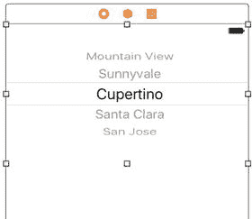

图 7-15. 将库中的选择器视图添加到第二个视图

现在我们需要应用自动布局约束，以便选择器在任何设备上运行时都能正确调整大小和位置。我们希望选择器水平居中并固定在视图顶部，同时希望其大小根据内容自适应，因此需要添加三个约束。选中选择器后，首先从 Xcode 菜单栏中选择 Editor ➤ Size to Fit Content。如果该选项未启用，请稍微移动选择器后重试。接着，点击故事板下方的“Align”按钮，勾选“Horizontally in Container”复选框，然后点击“Add 1 Constraint”。点击“Pin”按钮（位于“Align”按钮旁边）。在弹出的四个距离输入框中，将选择器与视图顶部边缘的距离设置为 0（在顶部框中输入 0），然后点击下方虚线红色线条使其变为实线。在弹出窗口底部，将“Update Frames”设置为“Items of New Constraints”，然后点击“Add 1 Constraint”。选择器将调整大小并移动到正确位置，如图 7-16 所示。

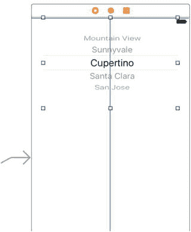

图 7-16. 选择器位于其视图控制器视图的顶部

现在，我们将这个选择器连接到其控制器。操作步骤与之前的选择器视图相同：打开助理编辑器，设置跳转栏以显示`SingleComponentPickerViewController.swift`文件，从选择器按住 Control 键拖拽到`SingleComponentPickerViewController`类的顶部，创建一个名为`singlePicker`的插座变量。

接着，选中选择器，按下⌥⌘6 打开连接检查器。查看选择器视图可用的连接，你会发现前两项是`dataSource`和`delegate`。如果看不到这些插座变量，请确保你选中了选择器而不是`UIView`。从`dataSource`旁边的圆圈拖拽到故事板或文档大纲中场景顶部的视图控制器图标（见图 7-17），然后从`delegate`旁边的圆圈拖拽到视图控制器图标。现在，选择器知道故事板中的`SingleComponentPickerViewController`类实例既是其数据源也是其委托，选择器将向该实例请求要显示的数据。换句话说，当选择器需要获取即将显示的数据信息时，它会向控制此视图的`SingleComponentPickerViewController`实例请求信息。

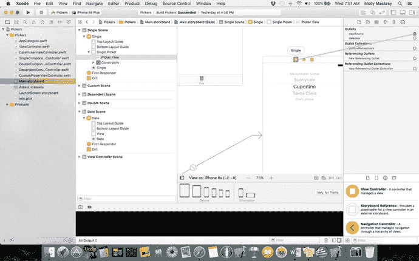

图 7-17. 将`dataSource`连接到视图控制器

拖拽一个按钮到视图中，将其放置在选择器正下方。双击按钮并将其命名为“Select”。按 Return 键确认更改。在连接检查器中，从“Touch Up Inside”旁边的圆圈拖拽到助理视图中的代码区域，在类定义的结束大括号上方松开，以创建新的操作方法。将此操作命名为`onButtonPressed`，你会看到 Xcode 自动填充了一个空方法。你刚刚看到了另一种向视图控制器添加操作方法并将其链接到源视图的方式。我们希望此按钮水平居中，并与日期选择器保持固定距离。选中按钮，点击故事板底部的“Align”按钮，勾选“Horizontally in Container”复选框，然后点击“Add 1 Constraint”（见图 7-18）。

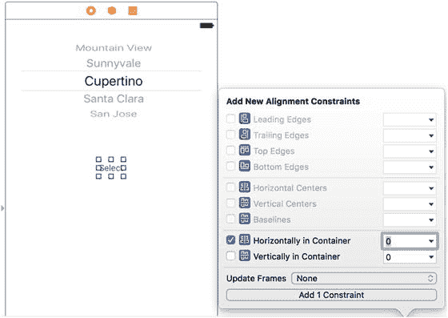

图 7-18. 将按钮水平居中于视图中

为固定它们之间的距离，按住 Control 键从按钮拖拽到选择器，然后松开鼠标。在弹出的菜单中，选择“Vertical Spacing”（见图 7-19）。最后，如果“问题检查器”中显示任何布局问题，请点击故事板底部的“Resolve Auto Layout Issues”按钮，然后点击弹出窗口顶部区域的“Update Frames”（如果该选项未启用，说明按钮已处于正确位置）。按钮应移动到正确位置，且不再有任何自动布局警告。

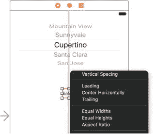

图 7-19. 设置按钮到选择器的垂直间距


### 实现数据源和代理

为了让我们的控制器能够正常作为选择器的数据源和代理，我们将从一些你应已熟悉的代码开始，然后添加几个你从未见过的方法。

在项目导航器中单击`SingleComponentPickerViewController.swift`，并在类定义的顶部添加以下属性。这将为我们提供一个包含几个知名电影角色名称的数组：

```
@IBOutlet weak var singlePicker: UIPickerView!
private let characterNames = [
"Luke", "Leia", "Han", "Chewbacca", "Artoo",
"Threepio", "Lando"]
```

然后将`onButtonPressed()`方法修改为代码清单 7-3 所示的内容。

```
@IBAction func onButtonPressed(_ sender: UIButton) {
let row = singlePicker.selectedRow(inComponent: 0)
let selected = characterNames[row]
let title = "You selected \(selected)!"
let alert = UIAlertController(
title: title,
message: "Thank you for choosing",
preferredStyle: .alert)
let action = UIAlertAction(
title: "You're welcome",
style: .default,
handler: nil)
alert.addAction(action)
present(alert, animated: true, completion: nil)
}
```

正如我们之前所见，日期选择器包含我们需要获取的数据，但在这里，我们的常规选择器将此任务委托给了代理和数据源。`onButtonPressed()`方法需要向选择器询问选择了哪一行，然后从你的`pickerData`数组中抓取相应的数据。以下是询问选中行的方法：

```
let row = singlePicker.selectedRow(inComponent: 0)
```

注意，我们需要指定想要了解的是哪个组件。这个选择器中只有一个组件（即一个旋转轮），所以我们只需传入 0，即第一个（也是唯一一个）组件的索引。

在类声明中，我们创建了一个角色名称数组，以便为选择器提供数据。通常，你的数据会来自其他来源，比如属性列表或网络服务查询。像我们这样在代码中直接嵌入数组，如果需要更新此列表或希望将应用翻译成其他语言，就会给自己增加很大难度。但就演示目的而言，这是将数据存入数组最快、最简单的方法。尽管你通常不会这样创建数组，但你几乎总会在`viewDidLoad()`方法中配置某种对应用模型对象的访问方式，这样就不会每次选择器请求数据时都去访问磁盘或网络。

**提示**

如果像我们刚才那样，不应该在代码中通过对象列表创建数组，那应该怎么做呢？将列表嵌入属性列表文件中，并将这些文件添加到你的项目中。属性列表文件可以在不重新编译源代码的情况下进行修改，这意味着这样做引入新 bug 的风险很小。你还可以为不同语言提供不同版本的列表，正如你将在第 22 章中看到的。我将在第 13 章中更详细地讨论属性列表。

最后，在文件底部插入代码清单 7-4 所示的代码。

```
// MARK:-
// MARK: Picker Data Source Methods
func numberOfComponents(in pickerView: UIPickerView) -> Int {
return 1
}
func pickerView(_ pickerView: UIPickerView,
numberOfRowsInComponent component: Int) -> Int {
return characterNames.count
}
// MARK: Picker Delegate Methods
func pickerView(_ pickerView: UIPickerView, titleForRow row: Int, forComponent component: Int) -> String? {
return characterNames[row]
}
```

实现选择器需要这三个方法。前两个方法来自`UIPickerViewDataSource`协议，并且是所有选择器（日期选择器除外）都必需的方法。这是第一个：

```
func numberOfComponents(in pickerView: UIPickerView) -> Int {
return 1
}
```

选择器可以有多个旋转轮（即组件），选择器通过这个方法询问它应该显示多少个组件。这次我们只想显示一个列表，所以返回值是 1。注意，一个`UIPickerView`作为参数传入。这个参数指向正在询问我们的选择器视图，这使得多个选择器可以由同一个数据源控制。在我们的例子中，我们知道只有一个选择器，因此可以安全地忽略这个参数，因为我们已经知道是哪个选择器在调用我们。

第二个数据源方法用于选择器询问某个给定组件有多少行数据：

```
func pickerView(_ pickerView: UIPickerView,
numberOfRowsInComponent component: Int) -> Int {
return characterNames.count
}
```

同样，我们被告知是哪个选择器视图在询问，以及该选择器询问的是哪个组件。由于我们知道只有一个选择器和一个组件，我们就不去理会这两个参数，直接返回唯一数据数组中的对象个数。

### // Mark: 这是什么？？

你有没有注意到`SingleComponentPickerViewController.swift`中的以下几行代码？

```
// MARK:-
// MARK: Picker Data Source Methods
```

任何以`//`开头的代码行都是注释。以`// MARK:`开头的注释会被 Xcode 特殊处理——它会告诉 Xcode 在编辑器窗格顶部的方法和属性弹出菜单中添加一个条目。第一个（带短横线的）会在菜单中添加一个分隔线。第二个会创建一个文本条目，包含该行剩余部分的内容，你可以将其用作源代码中方法组的一种描述性标题。

你的一些类，特别是某些控制器类，可能会变得相当长，而方法和函数弹出菜单能让你更轻松地在代码中导航。添加`// MARK:`注释并逻辑地组织代码，将使这个弹出菜单更高效地使用。

在两个数据源方法之后，我们实现了一个代理方法。与数据源方法不同，所有代理方法都是可选的。“可选”这个术语有点误导性，因为你确实需要实现至少一个代理方法。通常你会实现我们这里正在实现的方法。但是，如果你希望在选择器中显示文本以外的内容，则必须实现另一个不同的方法，正如你将在本章后面看到自定义选择器时那样：

```
func pickerView(_ pickerView: UIPickerView, titleForRow row: Int, forComponent component: Int) -> String? {
return characterNames[row]
}
```

在这个方法中，选择器要求我们为特定组件中的特定行提供数据。我们得到一个指向正在询问的选择器的指针，以及它正在询问的组件和行。由于我们的视图有一个带一个组件的选择器，我们除了`row`参数外忽略其他所有内容，并使用它从数据数组中返回相应的项。

构建并运行应用程序。当模拟器启动后，切换到第二个标签页——标记为“Single”的标签页——然后查看你的新自定义选择器，它应该看起来像图 7-3。

在下一节中，我们将实现一个带有两个组件的选择器。如果你觉得自己可以接受挑战，那么下一个内容视图实际上非常适合你自行尝试。你已经看到了实现这个选择器所需的所有方法，所以如果你愿意尝试，就大胆去做吧。你可能想先仔细看看图 7-4，以刷新记忆。完成后，继续往下读，你会看到我们是如何解决这个问题的。


## 实现多组件选择器

下一个标签页将有一个包含两个组件（或滚轮）的选择器，每个组件相互独立。左侧滚轮将显示三明治馅料列表，右侧滚轮则提供面包类型选择。我们将编写与单组件选择器相同的数据源和委托方法，只是需要在其中一些方法中添加额外代码，以确保为每个组件返回正确的值和行数。首先，单击`DoubleComponentPickerViewController.swift`，并添加以下代码：

```
class DoubleComponentPickerViewController: UIViewController,
UIPickerViewDelegate, UIPickerViewDataSource {
```

这里，我们简单地让控制器类同时遵守委托和数据源协议。保存该文件，然后点击`Main.storyboard`来设计 GUI。

### 构建视图

在文档大纲中选择“Double Scene”，然后点击 Double 图标将该视图控制器置于编辑器区域的前端。现在，向视图中添加一个选择器视图和一个按钮，将按钮标签改为“Select”，然后建立必要的连接。这次我们不会一步步引导你操作，但如果你需要逐步指南，可以参考上一节，因为这两个视图控制器在故事板中的连接方式完全相同。以下是需要完成的操作摘要：

1. 在`DoubleComponentPickerViewController`类的类扩展中创建一个名为`doublePicker`的插座，用于将视图控制器连接到选择器。
2. 将选择器视图上的`dataSource`和`delegate`连接连接到视图控制器（使用连接检查器）。
3. 将按钮的“Touch Up Inside”事件连接到视图控制器上一个名为`onButtonPressed`的新操作方法（使用连接检查器）。
4. 为选择器和按钮添加 Auto Layout 约束，以固定它们的位置。

在返回代码之前，请确保保存故事板。你可能想将此页加入书签，因为稍后可能还会用到。

### 实现控制器

选择`DoubleComponentPickerViewController.swift`，并在类定义顶部、选择器插座下方添加代码清单 7-5 中的代码。

```
@IBOutlet weak var doublePicker: UIPickerView!
private let fillingComponent = 0
private let breadComponent = 1
private let fillingTypes = [
"火腿", "火鸡", "花生酱", "金枪鱼沙拉",
"鸡肉沙拉", "烤牛肉", "Vegemite 酱"]
private let breadTypes = [
"白面包", "全麦面包", "黑麦面包", "酸面包",
"七种谷物面包"]
代码清单 7-5.
双组件选择器所需的参数
```

如你所见，我们首先定义了两个常量来表示两个组件的索引，这只是为了让代码更易读。选择器的组件通过数字引用，最左侧的组件被分配为 0，每向右移动一个组件，数字增加 1。接下来，我们声明了两个数组，用于存放两个选择器组件的数据。

现在实现`onButtonPressed()`方法，如代码清单 7-6 所示。

```
@IBAction func onButtonPressed(_ sender: UIButton) {
let fillingRow =
doublePicker.selectedRow(inComponent: fillingComponent)
let breadRow =
doublePicker.selectedRow(inComponent: breadComponent)
let filling = fillingTypes[fillingRow]
let bread = breadTypes[breadRow]
let message = "您的 \(filling) 配 \(bread) 马上就好。"
let alert = UIAlertController(
title: "感谢您的订单",
message: message,
preferredStyle: .alert)
let action = UIAlertAction(
title: "太好了",
style: .default,
handler: nil)
alert.addAction(action)
present(alert, animated: true, completion: nil)
}
代码清单 7-6.
按下“Select”按钮时的处理逻辑
```

同时，在类底部添加数据源和委托方法，如代码清单 7-7 所示。

```
// MARK:-
// MARK: 选择器数据源方法
func numberOfComponents(in pickerView: UIPickerView) -> Int {
return 2
}
func pickerView(_ pickerView: UIPickerView, numberOfRowsInComponent component: Int) -> Int {
if component == breadComponent {
return breadTypes.count
} else {
return fillingTypes.count
}
}
// MARK:-
// MARK: 选择器委托方法
func pickerView(_ pickerView: UIPickerView, titleForRow row: Int, forComponent component: Int) -> String? {
if component == breadComponent {
return breadTypes[row]
} else {
return fillingTypes[row]
}
}
代码清单 7-7.
dataSource 和 delegate 方法
```

这次`onButtonPressed()`方法稍微复杂一些，但对你来说几乎没有新内容。我们只需要在请求选中行时，使用之前定义的常量——`breadComponent`和`fillingComponent`——来指定当前谈论的是哪个组件：

```
let fillingRow =doublePicker.selectedRow(inComponent: fillingComponent)
let breadRow = doublePicker.selectedRow(inComponent: breadComponent)
```

你可以看到，使用这两个常量代替 0 和 1，使得代码的可读性大大提高。从这一点开始，`onButtonPressed()`方法与我们之前编写的方法基本相同。

当进入数据源方法时，情况开始有所变化。在第一个方法中，我们指定选择器应该有两个组件，而不是一个：

```
func numberOfComponents(in pickerView: UIPickerView) -> Int {
return 2
}
```

这次，当系统询问行数时，我们需要检查选择器询问的是哪个组件，并为相应的数组返回正确的行数：

```
func pickerView(_ pickerView: UIPickerView, numberOfRowsInComponent component: Int) -> Int {
if component == breadComponent {
return breadTypes.count
} else {
return fillingTypes.count
}
}
```

接下来，在我们的委托方法中，我们做同样的事情：检查组件，并使用正确的数组来获取并返回正确的值：

```
func pickerView(_ pickerView: UIPickerView, titleForRow row: Int, forComponent component: Int) -> String? {
if component == breadComponent {
return breadTypes[row]
} else {
return fillingTypes[row]
}
}
```

这并不难，对吧？编译并运行你的应用程序，确保 Double 内容窗格看起来像图 7-4。

请注意，这两个滚轮是完全独立的。转动一个滚轮不会影响另一个。在这种情况下这是合适的，但有时一个组件会依赖于另一个组件。一个很好的例子是日期选择器。当你改变月份时，显示当月天数的刻度盘可能需要改变，因为并非所有月份的天数都相同。一旦你掌握了方法，实现这一点并不难，但它不是最容易自己悟出来的，所以我们接下来就来处理这个问题。


### 实现关联组件

随着我们加快进度，对于已经介绍过的内容，我不会再手把手地指导了。相反，我们会专注于处理新功能。新的选择器将在左侧组件中显示美国各州列表，在右侧组件中显示对应的邮政编码列表。

我们需要为左侧组件中的每一项都准备一个独立的邮政编码值列表。像上次一样，我们将声明两个数组，一个用于每个组件。另外还需要一个字典。在字典中，我们会为每个州存储一个数组（见图 7-20）。稍后，我们将实现一个委托方法，当选择器的选项发生变化时，该方法会通知我们。如果左侧滚轮的值发生变化，我们将从字典中取出正确的数组，并将其赋值给右侧滚轮所使用的数组。如果没完全理解也没关系；我们会在深入到代码时进一步讨论。

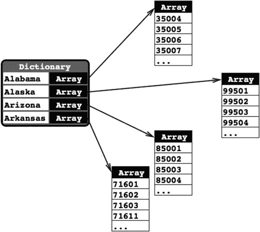

**图 7-20.** 应用程序的数据结构。每个州在字典中都有一条记录，以州名作为键。该键下存储的是一个 `Array<String>` 实例，包含该州的所有邮政编码

将以下代码添加到你的 `DependentComponentPickerViewController.swift` 文件中：

```swift
class DependentComponentPickerViewController: UIViewController,
UIPickerViewDelegate, UIPickerViewDataSource {
private let stateComponent = 0
private let zipComponent = 1
private var stateZips:[String : [String]]!
private var states:[String]!
private var zips:[String]!
```

现在我们来构建内容视图。这个过程与我们之前构建的两个组件视图完全相同。如果你遇到困难，可以翻回到创建单组件选择器的“构建视图”部分，并遵循其中的分步说明。这里有个提示：首先打开 `Main.storyboard`，找到 `DependentComponentPickerViewController` 类的视图控制器，然后重复你在本章中为其他所有内容视图所做的相同基本步骤。最终你应该得到一个名为 `dependentPicker` 的插座属性，它连接到选择器；一个连接到按钮的空的 `onButtonPressed:` 方法；以及选择器的 `delegate` 和 `dataSource` 属性都连接到视图控制器。别忘了给两个视图添加自动布局约束！完成后，保存故事板。

现在我们来实现这个控制器类。这个实现起初可能看起来有点复杂。为了让一个组件依赖于另一个组件，我们需要为控制器类增加一层全新的复杂度。尽管选择器一次只显示两个列表，但我们的控制器类必须了解并管理 51 个列表。我们这里使用的技术实际上简化了这个过程。数据源方法看起来几乎与我们在 `DoublePickerViewController` 中实现的方法相同。所有额外的复杂性都在其他地方处理，位于 `viewDidLoad` 和一个名为 `pickerView(_:didSelectRow:inComponent:)` 的新委托方法之间。

在编写代码之前，我们需要一些要显示的数据。到目前为止，我们都是通过在代码中指定字符串列表来创建数组。因为我们不想让你输入几千个值，我们将从一个属性列表文件中加载数据。`NSArray` 和 `NSDictionary` 对象都可以从属性列表创建。

所需的数据包含在项目归档文件 `07 – Picker Data` 文件夹下的一个名为 `statedictionary.plist` 的属性列表中。将该文件拖拽到 Xcode 项目的 `Pickers` 文件夹中。如果你在项目导航器中单击该 `.plist` 文件，可以查看甚至编辑其包含的数据（见图 7-21）。

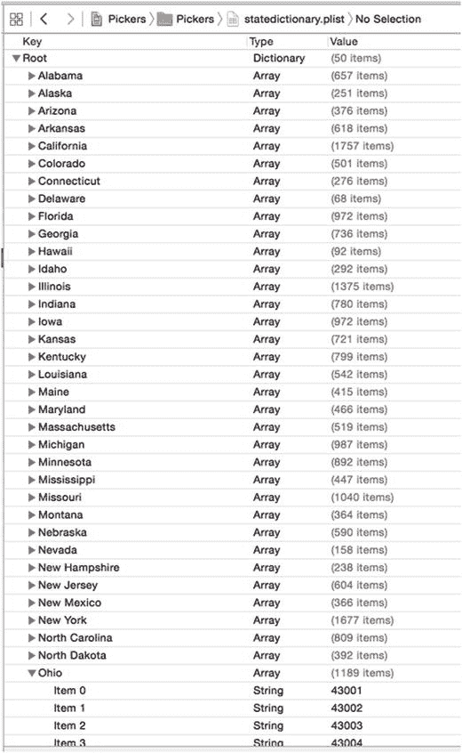

**图 7-21.** 文件 `statedictionary.plist`，显示了我们的州列表。在俄亥俄州下方，你可以看到邮政编码列表的开头

在 `DependentComponentPickerViewController.swift` 中，我们首先向你展示一些需要实现的完整方法，然后将其分解为更易于理解的部分。从实现 `onButtonPressed()` 开始，如代码清单 7-8 所示。

```swift
@IBAction func onButtonPressed(_ sender: UIButton) {
let stateRow =
dependentPicker.selectedRow(inComponent: stateComponent)
let zipRow =
dependentPicker.selectedRow(inComponent: zipComponent)
let state = states[stateRow]
let zip = zips[zipRow]
let title = "You selected zip code \(zip)"
let message = "\(zip) is in \(state)"
let alert = UIAlertController(
title: title,
message: message,
preferredStyle: .alert)
let action = UIAlertAction(
title: "OK",
style: .default,
handler: nil)
alert.addAction(action)
present(alert, animated: true, completion: nil)
}
```

**代码清单 7-8.** 邮政编码视图的 `onButtonPressed` 方法

接下来，在现有的 `viewDidLoad()` 方法中添加以下代码，如代码清单 7-9 所示。

```swift
override func viewDidLoad() {
super.viewDidLoad()
// Do any additional setup after loading the view.
let bundle = Bundle.main
let plistURL = bundle.urlForResource("statedictionary",
withExtension: "plist")
stateZips = NSDictionary.init(contentsOf: (plistURL)!) as! [String : [String]]
let allStates = stateZips.keys
states = allStates.sorted()
let selectedState = states[0]
zips = stateZips[selectedState]
}
```

**代码清单 7-9.** 在 `viewDidLoad()` 方法中添加的代码

最后，在文件底部添加数据源和委托方法，如代码清单 7-10 所示。

```swift
// MARK:-
// MARK: Picker Data Source Methods
func numberOfComponents(in pickerView: UIPickerView) -> Int {
return 2
}
func pickerView(_ pickerView: UIPickerView, numberOfRowsInComponent component: Int) -> Int {
if component == stateComponent {
return states.count
} else {
return zips.count
}
}
// MARK:-
// MARK: Picker Delegate Methods
func pickerView(_ pickerView: UIPickerView, titleForRow row: Int, forComponent component: Int) -> String? {
if component == stateComponent {
return states[row]
} else {
return zips[row]
}
}
func pickerView(_ pickerView: UIPickerView, didSelectRow row: Int, inComponent component: Int) {
if component == stateComponent {
let selectedState = states[row]
zips = stateZips[selectedState]
dependentPicker.reloadComponent(zipComponent)
dependentPicker.selectRow(0, inComponent: zipComponent,
animated: true)
}
}
```

**代码清单 7-10.** 用于显示各州邮政编码的 `dataSource` 和 `delegate` 方法

没有必要讨论 `onButtonPressed()` 方法，因为它与之前的基本相同。不过，我们应该谈谈 `viewDidLoad()` 方法。那里发生了一些你需要理解的事情，所以搬把椅子坐好，我们来聊聊。在这个新的 `viewDidLoad()` 方法中，我们做的第一件事是获取对应用程序 main bundle 的引用：

```swift
let bundle = Bundle.main
```

Bundle 只是一种特殊类型的文件夹，其内容遵循特定的结构。应用程序和框架都是 bundle，这个调用返回一个表示我们应用程序的 bundle 对象。

**注意：** 在最新版本的 Xcode 和 iOS 库中，Apple 提供了一种更用户友好的方式从 Swift 中引用诸如 `NSBundle` 之类的元素。不需要写类似 `let bundle = NSBundle.mainBundle()` 这样的代码，我们使用上面更简单易读的版本。

Bundle（`NSBundle`）的主要用途之一是访问你添加到项目中的资源。当你构建应用程序时，这些文件会被复制到应用程序的 bundle 中。如果我们要在代码中访问这些资源，通常需要使用 bundle。我们使用 main bundle 来获取感兴趣资源的 URL：


```swift
let plistURL = bundle.urlForResource("statedictionary",
withExtension: "plist")
```

这将返回一个包含 `statedictionary.plist` 文件位置的 URL。我们可以使用该 URL 加载字典。完成后，该属性列表的全部内容将被加载到新创建的 `Dictionary` 对象中，即赋值给 `stateZips`：

```swift
stateZips = NSDictionary.init(contentsOf: (plistURL)!) as! [String : [String]]
```

Swift 的 `Dictionary` 类型没有从外部源加载数据的便捷方法，但 Foundation 类 `NSDictionary` 提供了该方法。此代码利用这一特性，将 `statedictionary.plist` 文件的内容加载到 `NSDictionary` 中，然后将其强制转换为 Swift 类型 `[String : [String]]`——即一个字典，其中每个键是表示州名的字符串，对应的值是一个包含该州邮政编码（字符串形式）的数组。这反映了图 7-18 所示的结构。

为了填充选择器左侧组件（显示州名）的数组，我们从字典中获取所有键的列表，并将其赋值给 `states` 数组。在赋值之前，我们先按字母顺序排序：

```swift
let allStates = stateZips.keys
states = allStates.sorted()
```

除非我们特意将选择设置为其他值，否则选择器默认选中第一行（行 0）。为了获取与 `states` 数组第一行对应的 `zips` 数组，我们从 `states` 数组中取出索引为 0 的对象。这将返回启动时被选中的州名。然后我们使用该州名获取该州的邮政编码数组，并将其赋值给 `zips` 数组，用于为右侧组件提供数据：

```swift
let selectedState = states[0]
zips = stateZips[selectedState]
```

这两个数据源方法与前一个版本几乎完全相同。我们返回相应数组中的行数。我们实现的第一个委托方法也是如此。第二个委托方法是新增的，也是魔法发生的地方：

```swift
func pickerView(_ pickerView: UIPickerView, didSelectRow row: Int, inComponent component: Int) {
    if component == stateComponent {
        let selectedState = states[row]
        zips = stateZips[selectedState]
        dependentPicker.reloadComponent(zipComponent)
        dependentPicker.selectRow(0, inComponent: zipComponent, animated: true)
    }
}
```

在该方法中（每次选择器选择发生变化时调用），我们检查组件，看左侧组件是否发生了变化，这意味着用户选择了新的州。如果是，我们获取对应于新选择的数组并赋值给 `zips` 数组。接着，我们将右侧组件重置为第一行，并告诉它重新加载自身。通过在州变化时交换 `zips` 数组，其余代码与 `DoublePicker` 示例中的代码保持基本相同。

我们还没有完全完成。构建并运行应用程序，然后查看“Dependent”选项卡，如图 7-22 所示。两个组件大小相同。尽管邮政编码永远不会超过五个字符，但它却与州名获得了同等的显示宽度。由于像“Mississippi”和“Massachusetts”这样的州名在大多数 iPhone 屏幕的一半选择器中无法完全显示，这似乎不太理想。

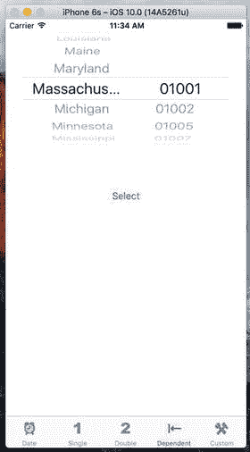

图 7-22. 我们真的希望两个组件大小相等吗？注意长州名的截断

幸运的是，还有另一个委托方法可以用来指示每个组件应该有多宽。将清单 7-11 中的方法添加到 `DependentComponentPickerViewController.swift` 的委托部分。你可以在图 7-23 中看到差异。

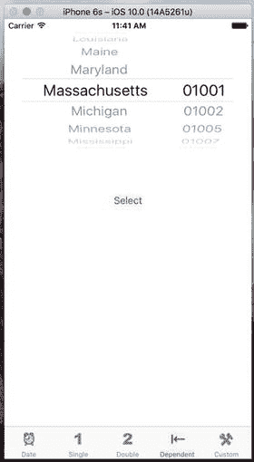

图 7-23. 调整选择器组件的宽度后，我们的 UI 在视觉上更加实用

```swift
func pickerView(_ pickerView: UIPickerView, widthForComponent component: Int) -> CGFloat {
    let pickerWidth = pickerView.bounds.size.width
    if component == zipComponent {
        return pickerWidth/3
    } else {
        return 2 * pickerWidth/3
    }
}
```
清单 7-11. 设置选择器组件的宽度

在该方法中，我们返回一个数值，表示每个组件应该有多少像素宽，选择器会尽力满足这个要求。我们选择将可用宽度的三分之二分配给州组件，其余部分给邮政编码组件。你可以尝试其他值，看看修改它们时组件之间的空间分布如何变化。保存、构建并运行；在“Dependent”选项卡上的选择器将看起来更像图 7-5 所示的那个。

至此，你应该对选择器和标签栏应用程序都比较熟悉了。关于选择器，我们还有一件事要做。

## 使用自定义选择器创建一个简单游戏

接下来，我们将创建一个模拟老虎机。在继续之前，请回顾图 7-6，了解我们将要构建的内容。

### 准备视图控制器

首先，将以下代码添加到 `CustomPickerViewController.swift` 中：

```swift
class CustomPickerViewController: UIViewController,
    UIPickerViewDelegate, UIPickerViewDataSource {
    private var images:[UIImage]!
}
```

至此，我们仅在类中添加了一个属性，用于保存老虎机转轮上符号的图片数组。其余部分将在稍后完成。


### 构建视图

尽管图 7-6 中的选择器看起来比我们之前构建的其他选择器要华丽得多，但我们在设计故事板时的实际差异非常小。所有额外工作都在控制器的委托方法中完成。

确保你已保存新源代码，然后在项目导航器中选择 `Main.storyboard`，并使用文档大纲选择自定义场景中的自定义图标来编辑 GUI。添加一个选择器视图，在其下方添加一个标签，再在标签下方添加一个按钮。将按钮命名为 `Spin`。

选中标签后，打开属性检查器。将对齐方式设置为居中。然后点击文本颜色，将其设置为亮色。接下来，让文本稍微大一些。在检查器中找到字体设置，并点击其中的图标（看起来像小方框里的字母 T）弹出字体选择器。如果你愿意，这个控件可以让你从设备的标准系统字体切换到其他字体，或者直接更改字号。现在，只需将字号改为 48，并删除单词 `Label`，因为我们希望用户第一次获胜后才显示文本。选中标签后，点击 编辑器 ➤ 适应内容大小，确保标签始终足够大以显示其内容。

现在添加自动布局约束，使选择器、标签和按钮在水平方向上居中，并固定它们之间的垂直间距，以及标签与选择器、选择器与视图顶部之间的间距。你可能会发现，在添加标签的自动布局约束时，从文档大纲中拖动标签是最简单的方法，因为故事板上的标签是空的，很难找到。

完成后，将所有连接指向出口和操作。创建一个名为 `picker` 的新出口，将视图控制器连接到选择器视图；再创建一个名为 `winLabel` 的出口，将视图控制器连接到标签。同样，你会发现使用文档大纲中的标签比使用故事板上的标签更简单。接下来，将按钮的“Touch Up Inside”事件连接到一个名为 `spin()` 的新操作方法。最后，确保连接选择器的委托和数据源。

还有一件额外的事情需要做。选择选择器并打开属性检查器。你需要在视图设置中取消选中标记为“`User Interaction Enabled`”的复选框，这样用户就无法手动更改转盘并作弊。完成所有这些操作后，保存你对故事板所做的更改。

#### iOS 设备支持的字体

在使用 Interface Builder 中的字体面板设计 iOS 界面时需谨慎。属性检查器的字体选择器允许你从大量字体中分配，但并非所有 iOS 设备都拥有相同的字体集。例如，在撰写本文时，有几种字体在 iPad 上可用，但在 iPhone 或 iPod touch 上则不可用。你应该将字体选择限制在目标 iOS 设备上可用的字体系列之一。Jeff LaMarche 的优秀 iOS 博客上的这篇文章展示了如何以编程方式获取此列表：[`iphonedevelopment.blogspot.com/2010/08/fonts-and-font-families.html`](http://iphonedevelopment.blogspot.com/2010/08/fonts-and-font-families.html)。

简而言之，创建一个基于视图的应用程序，并将以下代码添加到应用程序委托的 `application(_: didFinishLaunchingWithOptions:)` 方法中：

```
for family in UIFont.familyNames() as [String] {
    println(family)
    for font in UIFont.fontNamesForFamilyName(family) {
        println("\t\(font)")
    }
}
```

在相应的模拟器或设备上运行项目，可用的字体系列和字体将显示在项目控制台日志中。

### 实现控制器

在实现此控制器时，我们有很多新内容要介绍。选择 `CustomPickerViewController.swift` 文件，然后开始填写 `spin()` 方法的内容，如代码清单 7-12 所示。

```
@IBAction func spin(_ sender: UIButton) {
    var win = false
    var numInRow = -1
    var lastVal = -1
    for i in 0..<5 {
        let newValue = Int(arc4random_uniform(UInt32(images.count)))
        if newValue == lastVal {
            numInRow += 1
        } else {
            numInRow = 1
        }
        lastVal = newValue
        picker.selectRow(newValue, inComponent: i, animated: true)
        picker.reloadComponent(i)
        if numInRow >= 3 {
            win = true
        }
    }
    winLabel.text = win ? "WINNER!" : " "  // 注意引号间的空格
}
```

**代码清单 7-12.** `spin()` 方法

> **注意**  
> 一元递增（`foo++`）和递减（`foo--`）的常见用法在 Swift 3 中已被弃用，应分别使用 `+=` 和 `-=`。

将 `viewDidLoad()` 方法修改为代码清单 7-13 所示的内容。

```
override func viewDidLoad() {
    super.viewDidLoad()
    // 加载视图后的任何额外设置。
    images = [
        UIImage(named: "seven")!,
        UIImage(named: "bar")!,
        UIImage(named: "crown")!,
        UIImage(named: "cherry")!,
        UIImage(named: "lemon")!,
        UIImage(named: "apple")!
    ]
    winLabel.text = " " // 注意引号间的空格
    arc4random_stir()
}
```

**代码清单 7-13.** 修改 `viewDidLoad()` 以设置图像和标签

最后，将数据源和委托代码添加到类声明的末尾，位于结束花括号之前，如代码清单 7-14 所示。

```
// MARK:-
// MARK: 选择器数据源方法
func numberOfComponents(in pickerView: UIPickerView) -> Int {
    return 5
}
func pickerView(_ pickerView: UIPickerView, numberOfRowsInComponent component: Int) -> Int {
    return images.count
}
// MARK:-
// MARK: 选择器委托方法
func pickerView(_ pickerView: UIPickerView, viewForRow row: Int, forComponent component: Int, reusing view: UIView?) -> UIView {
    let image = images[row]
    let imageView = UIImageView(image: image)
    return imageView
}
func pickerView(_ pickerView: UIPickerView, rowHeightForComponent component: Int) -> CGFloat {
    return 64
}
```

**代码清单 7-14.** 我们的数据源和委托方法

#### `spin` 方法

当用户点击“Spin”按钮时，`spin()` 方法执行。在该方法中，我们首先声明一些变量，用于跟踪用户是否获胜。我们将使用 `win` 来记录是否找到了连续三个相同的值，如果找到则将其设置为 `true`。我们将使用 `numInRow` 来记录到目前为止连续相同值的数量。我们将使用 `lastVal` 记录前一个组件的值，以便将当前值与之前的值进行比较。我们将 `lastVal` 初始化为 -1，因为知道该值不会与任何真实值匹配：

```
var win = false
var numInRow = -1
var lastVal = -1
```

接下来，我们遍历所有五个组件，并将每个组件设置为一个新的、随机生成的行选择。我们通过 `images` 数组获取计数来实现这一点，这是一种快捷方式，因为我们知道所有五列都使用相同数量的图像：

```
for i in 0..<5 {
    let newValue = Int(arc4random_uniform(UInt32(images.count)))
```

我们将新值与之前的值进行比较，如果匹配，则递增 `numInRow`。如果值不匹配，则将 `numInRow` 重置为 1。然后，我们将新值赋给 `lastVal`，以便在下一次循环中进行比较：

```
if newValue == lastVal {
    numInRow += 1
} else {
    numInRow = 1
}
lastVal = newValue
```

之后，我们将相应的组件设置为新值，并告知其以动画方式显示更改；我们通知选择器重新加载该组件：

```
picker.selectRow(newValue, inComponent: i, animated: true)
picker.reloadComponent(i)
```

每次循环中做的最后一件事是检查是否有了三个连续相同的值，如果是，则将 `win` 设置为 `true`：

```
if numInRow >= 3 {
    win = true
}
```

循环完成后，我们设置标签，显示轮转是否获胜：

```
winLabel.text = win ? "WINNER!" : " "
// 注意引号间的空格
```


#### `viewDidLoad()` 方法

首先，我们加载了六张不同的图片，这些图片在章节开头就已经添加到`Images.xcassets`中。我们通过`UIImage`类的便捷方法`imageNamed()`来实现：

```
images = [
UIImage(named: "seven")!,
UIImage(named: "bar")!,
UIImage(named: "crown")!,
UIImage(named: "cherry")!,
UIImage(named: "lemon")!,
UIImage(named: "apple")!
]
```

接下来，在该方法中，我们确保标签（`label`）恰好包含一个空格。我们希望标签为空，但如果真的将其设为空，它会坍缩到零高度。通过包含一个空格，我们确保标签以正确的高度显示：

```
winLabel.text = " " // 注意引号之间的空格
```

最后，我们调用了`arc4random_stir()`函数来为随机数生成器播种，这样每次运行应用时就不会得到相同的随机数序列。

那么，这六张图片用来做什么呢？如果你向下滚动刚刚输入的代码，会发现两个数据源方法与之前几乎相同；然而，进一步查看委托方法，你会发现我们使用了完全不同的委托代码来为选择器提供数据。之前的代码返回的是一个字符串，而现在的代码返回的是一个`UIView`。

通过使用这种方法，我们可以向选择器提供任何可以绘制到`UIView`中的内容。当然，考虑到选择器的小尺寸，这里存在一些限制，并非所有内容都能正常工作且同时保持美观。但这种方法为我们提供了更大的自由度来展示内容，尽管需要稍多的工作量：

```
func pickerView(_ pickerView: UIPickerView, viewForRow row: Int, forComponent component: Int, reusing view: UIView?) -> UIView {
    let image = images[row]
    let imageView = UIImageView(image: image)
    return imageView
}
```

该方法返回一个`UIImageView`对象，该对象用符号对应的图片之一进行了初始化。为此，我们先获取当前行符号的图片，然后创建并返回一个包含该符号的图片视图。对于比单个图片更复杂的视图，可以预先创建所有需要的视图（例如在`viewDidLoad()`中），然后在请求时将这些预先创建好的视图返回给选择器视图。但对于我们的简单情况，动态创建所需视图已经足够。

你已顺利完成了所有工作，现在可以进行测试了。因此，构建并运行应用，观察其效果（见图 7-24）。

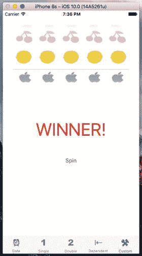

图 7-24.

虽然不是最漂亮的老虎机应用，但它让你领略到了选择器的多功能性。

### 游戏附加细节

我们的游戏运行良好，特别是考虑到构建它所需的工作量之少。现在让我们通过一些额外改进来优化它。目前游戏存在两个需要处理的问题：

*   游戏太安静了。真正的老虎机并不安静，因此我们的也不应该安静。
*   在转盘完成旋转之前，游戏就提示我们获胜了，这是一个小问题，但确实消除了期待感。要观察这一点，请再次运行应用。虽然很微妙，但标签确实在转盘停止旋转之前就出现了。

本书附带的项目存档中的`07 - Picker Sounds`文件夹包含两个声音文件：`crunch.wav`和`win.wav`。将这两个文件拖到项目的`Pickers`文件夹中。当用户点击“Spin”按钮时，我们将播放`crunch.wav`；当用户获胜时，播放`win.wav`。

要处理声音，我们需要访问 iOS 的 Audio Toolbox 类。在`CustomPickerViewController.swift`顶部现有`import`行的后面，插入以下`AudioToolbox`导入语句：

```
import UIKit
import AudioToolbox
```

接下来，我们需要添加一个指向按钮的出口（`outlet`）。在转盘旋转期间，我们将隐藏按钮。我们不希望在当前旋转完成之前用户再次点击按钮。将以下粗体代码行添加到`CustomPickerViewController.swift`中：

```
class CustomPickerViewController: UIViewController,
UIPickerViewDelegate, UIPickerViewDataSource {
    private var images:[UIImage]!
    @IBOutlet weak var picker: UIPickerView!
    @IBOutlet weak var winLabel: UILabel!
    @IBOutlet weak var button: UIButton!
```

输入上述代码并保存文件后，点击`Main.storyboard`来编辑图形界面。打开助理编辑器，确保它显示的是`CustomPickerViewController.swift`文件。从我们刚刚添加的`outlet`左侧的小圆点按住并拖动到 Storyboard 上的按钮，如图 7-25 所示。

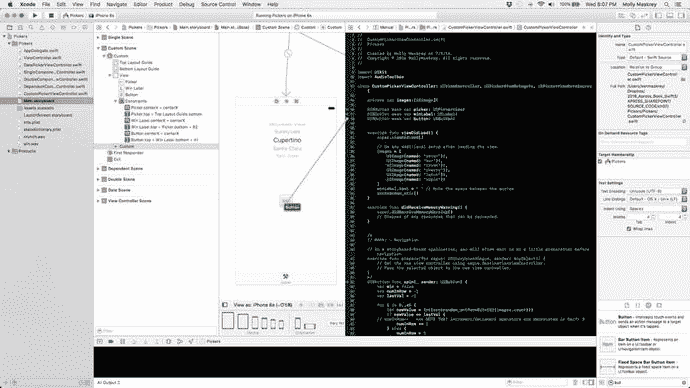

图 7-25.

将按钮`outlet`连接到 Storyboard 画布上的按钮

现在，我们需要在控制器类的实现中完成几件事。首先，我们需要一些实例变量来保存已加载声音的引用。再次打开`CustomPickerViewController.swift`，并添加以下新属性（以粗体显示）：

```
class CustomPickerViewController: UIViewController,
UIPickerViewDelegate, UIPickerViewDataSource {
    private var images:[UIImage]!
    @IBOutlet weak var picker: UIPickerView!
    @IBOutlet weak var winLabel: UILabel!
    @IBOutlet weak var button: UIButton!
    private var winSoundID: SystemSoundID = 0
    private var crunchSoundID: SystemSoundID = 0
```

我们还需要向控制器类添加两个方法。将清单 7-12 中的两个方法添加到`CustomPickerViewController.swift`文件中。

```
func showButton() {
    button.isHidden = false
}
func playWinSound() {
    if winSoundID == 0 {
        let soundURL = Bundle.main.urlForResource(
            "win", withExtension: "wav")! as CFURL
        AudioServicesCreateSystemSoundID(soundURL, &winSoundID)
    }
    AudioServicesPlaySystemSound(winSoundID)
    winLabel.text = "WINNER!"
    DispatchQueue.main.after(when: .now() + 1.5) {
        self.showButton()
    }
}
```
清单 7-12. 在老虎机游戏中隐藏旋转按钮并播放声音

我们使用第一个方法来显示按钮。如前所述，当用户点击按钮时，我们需要隐藏它，因为如果转盘已经在旋转，那么在它们停止之前，再次旋转是没有意义的。


## 排版后的内容

当用户获胜时，将调用第二个方法。首先，我们检查是否已经加载了胜利音效。`winSoundID` 和 `crunchSoundID` 属性初始化为零，而已加载音效的有效标识符不为零，因此我们可以通过比较该标识符与零来检查音效是否已加载。要加载音效，我们首先向主包（main bundle）请求音效文件的路径，此处为 `win.wav`，这与我们为 Dependent 选择器视图加载属性列表时的操作相同。获取该资源的路径后，接下来的三行代码负责加载并播放音效文件。接着，我们将标签设置为 `WINNER!` 并调用 `showButton()` 方法；不过，我们使用一个名为 `DispatchQueue.main.after(when:)` 的函数以特殊方式调用 `showButton()` 方法。这是一个非常便捷的函数，允许你在未来的某个时间点执行代码——在本例中，是一秒半之后，这将在通知用户结果之前，给转盘留出时间旋转到最终位置。该函数是一组实用函数中的一员，这组函数统称为 Grand Central Dispatch（简称 GCD），我将在第 15 章中讨论。

**注意**

你可能已经注意到我们调用 `AudioServicesCreateSystemSoundID()` 函数的方式有些特别。该函数将 URL 作为其第一个参数，但它需要的并非 `NSURL` 实例。相反，它需要一个 `CFURL`（以前是 `CFURLRef`），这是一个指向 C 语言 Core Foundation 框架中某个结构的指针。`NSURL` 是 Foundation 框架的一部分，而 Foundation 框架是用 Objective-C 编写的。幸运的是，Core Foundation 中的许多 C 组件都与 Foundation 框架中对应的 Objective-C 组件“桥接”了，因此 `CFURL` 在功能上等同于 `NSURL` 指针。这意味着在 Swift 或 Objective-C 中创建的某些类型的对象，只需使用 `as` 关键字将其转换为对应的 C 类型，即可与 C 的 API 一起使用。

我们还需要对 `spin()` 方法进行一些修改。我们将编写代码以播放音效，并在玩家获胜时调用 `playWinSound` 方法。请对 `spin()` 方法进行以下修改，如代码清单 7-14 所示。

```swift
@IBAction func spin(sender: AnyObject) {
    var win = false
    var numInRow = -1
    var lastVal = -1
    for i in 0..= 3 {
        win = true
    }
    if crunchSoundID == 0 {
        let soundURL = Bundle.main.urlForResource(
            "crunch", withExtension: "wav")! as CFURL
        AudioServicesCreateSystemSoundID(soundURL, &crunchSoundID)
    }
    AudioServicesPlaySystemSound(crunchSoundID)
    if win {
        DispatchQueue.main.after(when: .now() + 0.5) {
            self.playWinSound()
        }
    } else {
        DispatchQueue.main.after(when: .now() + 0.5) {
            self.showButton()
        }
    }
    button.isHidden = true
    winLabel.text = " " // 注意引号之间的空格
}
```

**代码清单 7-14.** 更新后的 `spin()` 方法以添加音效

首先，如有需要，我们加载“咔嚓”音效，就像之前处理胜利音效一样。现在播放“咔嚓”音效，让玩家知道转轮已经开始旋转。接着，我们不在一得知用户获胜就立即将标签设置为 `WINNER!`，而是采用一种巧妙的做法。我们调用刚刚创建的两个方法之一，但会在使用 `DispatchQueue.main.after(when:)` 延迟一段时间后调用。如果用户获胜，我们会在半秒后调用 `playWinSound()` 方法，这样就能为转盘留出旋转到位的时间；否则，我们只需等待半秒，然后重新启用“旋转”按钮。在等待结果的同时，我们隐藏按钮并清空标签的文本。

现在大功告成，构建并运行应用程序，然后点击最后一个标签页，即可观看并听到这台老虎机的运行效果。点击“旋转”按钮应播放一段轻微的“咔嚓”音效，而获胜则应播放胜利音效。

## 总结

到目前为止，你应该已经熟悉了标签栏应用程序和选择器视图的使用。在本章中，我们从零开始构建了一个功能完整的标签栏应用程序，它包含了五个不同的内容视图。我们练习了在不同配置下使用选择器视图，并创建了包含多个组件的选择器。我们甚至学会了如何让一个组件中的值依赖于另一个组件中所选的值。此外，我们还了解了如何让选择器显示图像而不仅仅是文本。

在此过程中，我们讨论了选择器视图的委托和数据源，并了解了如何加载图像、播放音效以及从属性列表创建字典。这一章内容较长，祝贺你顺利完成。在下一章中，我们将开始处理 iPhone 设备中最常见的元素之一：表视图。

