# 8. 表视图入门

在接下来的几章中，我们将构建一些基于层级导航的应用程序，类似于 iOS 设备上自带的“邮件”应用程序。这类应用程序通常称为主从应用程序，允许用户深入嵌套的数据列表并编辑数据。但在构建这些类型的应用程序之前，我们需要掌握表视图的概念。

表视图为 iOS 设备提供了向用户显示数据列表的最常用机制。它们是高度可配置的对象，几乎可以按照你的需求呈现任何外观。“邮件”使用表视图来显示账户、文件夹和消息列表；然而，表视图并不仅限于显示文本数据。“设置”、“音乐”和“时钟”应用程序也使用了表视图，尽管这些应用程序的外观差异很大，如图 8-1 所示。

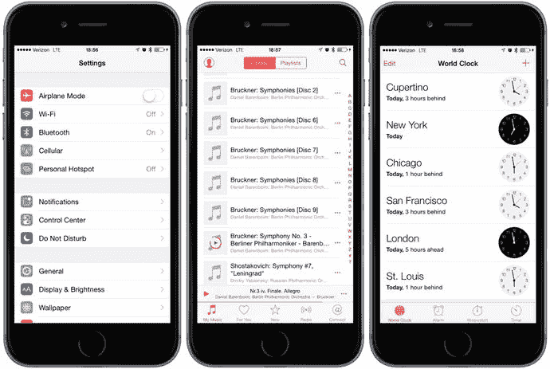

**图 8-1.** 尽管外观各异，但“设置”、“音乐”和“时钟”应用程序都使用表视图来显示数据

## 表视图基础

表格显示数据列表，表格列表中的每一项称为一个行。iOS 允许表格拥有无限数量的行，仅受可用内存量的限制，但表格仅有一列宽。

### 表视图和表视图单元格

表视图对象负责显示表格的数据，并作为 `UITableView` 类的实例运行；表格中的每个可见行由 `UITableViewCell` 类的实例实现，如图 8-2 所示。

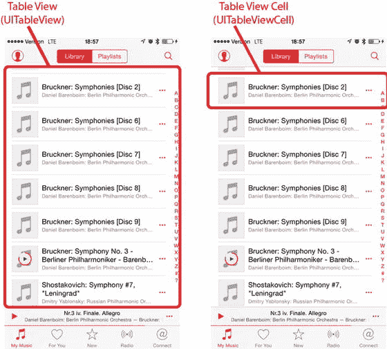

**图 8-2.** 每个表视图都是 `UITableView` 的一个实例，每个可见行都是 `UITableViewCell` 的一个实例

虽然表视图不负责存储所有表格数据，但它们只包含足以绘制当前可见行的数据。与选择器视图有些类似，表视图的配置数据来自遵循 `UITableViewDelegate` 协议的对象，而行数据来自遵循 `UITableViewDataSource` 协议的对象。我们将在本章稍后开发示例程序时看到这一切是如何运作的。

如前所述，所有表格都只包含单列。图 8-1 右侧显示的“时钟”应用程序，给人一种有两列的错觉，但实际情况并非如此——表中的每一行都由一个单一的 `UITableViewCell` 表示。默认情况下，`UITableViewCell` 对象可以配置图片、一些文本以及一个可选的辅助图标（位于右侧的小图标），我们将在第 9 章中详细讨论。

你可以通过向 `UITableViewCell` 添加子视图来增加单元格中的数据量，有两种基本技术：1）在创建单元格时以编程方式添加子视图，或者，2）从故事板或 nib 文件加载子视图。你可以根据需要布置表视图单元格，包括所需的任何子视图。这使得单列限制远没有最初听起来那么受限。在本章中，我们将探讨如何使用这两种技术。


### 分组表格与普通表格

表格视图有两种基本样式：

- **分组**：分组表格视图包含一个或多个行区块。在每个区块内，所有行紧密排列形成紧凑的分组；但区块之间有明显可见的间隔，如图 8-3 最左侧的图片所示。请注意，分组表格可以仅由一个分组构成。

  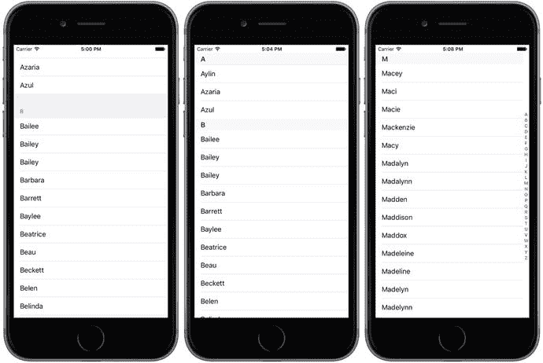

  图 8-3. 同一个表格视图以分组表格形式显示（左）；没有索引的普通表格（中）；以及带有索引的普通表格，也称为索引表格（右）

- **普通**：普通表格视图（参见图 8-3 中间）是默认样式，其区块之间略微更紧凑，每个区块的标题可按自定义样式进行修饰。当使用索引时，我们将此样式称为索引表格（参见图 8-3 右侧）。

如果你的数据源提供了必要信息，表格视图允许用户通过右侧显示的索引来浏览列表。

iOS 将表格划分为名为“区块”的分段。在分组表格中，每个区块在视觉上呈现为一个分组。在索引表格中，苹果将每个包含索引数据的分组称为一个区块。例如，在图 8-3 所示的索引表格中，所有以 A 开头的名称会构成一个区块，以 B 开头的构成另一个区块，以此类推。

> **注意**：尽管技术上可以为分组表格添加索引，但不应这样做。iOS 人机界面指南明确指出，分组表格不应提供索引。

## 实现一个简单的表格

让我们通过一个最简单的表格视图示例来了解其工作原理。在第一个示例中，我们只显示一个文本值列表。

在 Xcode 中创建一个新项目。本章我们将回到“单视图应用程序”模板，因此选择该模板。将项目命名为 `Simple Table`，语言设置为 Swift，设备字段设置为 Universal，并确保未勾选“使用 Core Data”。

### 设计视图

在项目导航器中，展开顶层 `Simple Table` 项目和 `Simple Table` 文件夹。由于这个应用程序非常简单，我们不需要任何插座或动作。接着选择 `Main.storyboard` 来编辑故事板。如果视图窗口在布局区域中不可见，请在文档大纲中单击其图标以打开它。接下来，在对象库中查找表格视图（见图 8-4），并将其拖拽到视图窗口中。

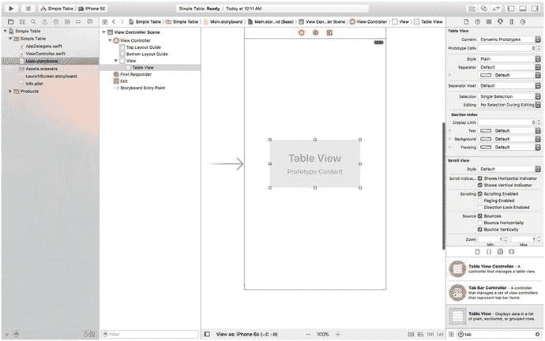

图 8-4. 将表格视图从库中拖拽到我们的主视图上

将表格视图放置到视图控制器上，并将其大致对齐到父视图的中心。现在让我们添加自动布局约束，以确保无论屏幕尺寸如何，表格视图都能正确定位和调整大小。在文档大纲中选择表格，然后点击故事板编辑器右下角的图钉图标（见图 8-5）。

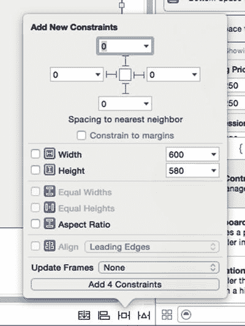

图 8-5. 固定表格视图，使其适应屏幕

在弹出的窗口顶部，取消勾选“约束到边距”复选框，点击所有四条虚线，并将四个输入字段中的距离设置为零。这将把表格视图的四条边固定到其父视图的对应边上。为了应用约束，将“更新帧”更改为“新约束的项”，然后点击“添加 4 个约束”按钮。表格应会调整大小以填满整个视图。

在文档检查器中再次选择表格视图，按下 `⌥⌘6` 打开连接检查器。你会注意到表格视图可用的前两个连接与上一章中使用的选择器视图的前两个连接相同：`dataSource` 和 `delegate`。从每个连接旁边的圆圈拖拽到文档大纲中的视图控制器图标，或故事板编辑器中视图控制器上方的图标。这将使我们的控制器类成为该表格的数据源和委托，如图 8-6 所示。

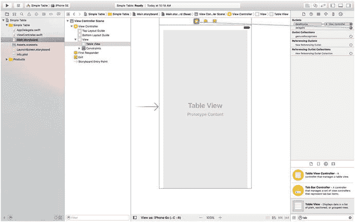

图 8-6. 连接表格视图的 `dataSource` 和 `delegate` 插座

接下来，我们将开始为表格视图编写 Swift 代码。


### 实现控制器

如果你已经读过前几章，这里的内容会显得熟悉，甚至有些乏味。不过，由于有些读者会跳着读，我至少会在这些基础的早期章节中保持一致的风格。单击 `ViewController.swift`，并将代码清单 8-1 中的代码添加到类声明中。

```
class ViewController: UIViewController,
UITableViewDataSource, UITableViewDelegate {
private let dwarves = [
"Sleepy", "Sneezy", "Bashful", "Happy",
"Doc", "Grumpy", "Dopey",
"Thorin", "Dorin", "Nori", "Ori",
"Balin", "Dwalin", "Fili", "Kili",
"Oin", "Gloin", "Bifur", "Bofur",
"Bombur"
]
let simpleTableIdentifier = "SimpleTableIdentifier"
代码清单 8-1. 添加到类声明顶部以创建元素数组
```

在代码清单 8-1 中，我们让类遵循两个协议，以便它能够作为表格视图的数据源和委托，声明了一个数组用于保存将要显示在表格中的数据，以及一个即将用到的标识符。在实际应用中，数据会来自其他来源，例如文本文件、属性列表或 Web 服务。

接下来，在文件末尾的闭合花括号上方添加代码清单 8-2 中的代码。

```
// MARK:-
// MARK: 表格视图数据源方法
func tableView(_ tableView: UITableView, numberOfRowsInSection section: Int) -> Int {
return dwarves.count
}
func tableView(_ tableView: UITableView, cellForRowAt indexPath: IndexPath) -> UITableViewCell {
var cell = tableView.dequeueReusableCell(withIdentifier: simpleTableIdentifier)
if (cell == nil) {
cell = UITableViewCell(
style: UITableViewCellStyle.default,
reuseIdentifier: simpleTableIdentifier)
}
cell?.textLabel?.text = dwarves[indexPath.row]
return cell!
}
代码清单 8-2. 表格视图的 dataSource 方法
```

这些方法属于 `UITableViewDataSource` 协议。第一个方法 `tableView(_ tableView: UITableView, numberOfRowsInSection section: Int) -> Int` 被表格用来询问某个分区中有多少行。正如你所料，默认分区数为 1，该方法会被调用来获取构成列表的单个分区中的行数。我们只需返回数组中元素的数量。

下一个方法可能需要一点解释，让我们更仔细地看一下：

```
func tableView(_ tableView: UITableView,
cellForRowAt indexPath: IndexPath) -> UITableViewCell {
```

当表格视图需要绘制某一行时，会调用这个方法。注意，该方法的第二个参数是一个 `NSIndexPath` 实例。`NSIndexPath` 是表格视图用来将分区索引和行索引封装到单个对象中的结构体。要从 `NSIndexPath` 中获取行索引或分区索引，只需访问其 `row` 属性或 `section` 属性，这两个属性都返回一个整型值。

第一个参数 `tableView` 是对正在构建的表格的引用。这允许我们创建能够作为多个表格数据源的类。

表格视图一次只显示少数几行，但表格本身可以容纳更多的行。请记住，表格中的每一行都由 `UITableViewCell` 的一个实例表示，它是 `UIView` 的子类，这意味着每一行都可以包含子视图。对于大型表格来说，如果表格试图为每一行都保留一个表格视图单元格实例，而不管该行当前是否正在显示，这会带来巨大的开销。幸运的是，表格并不是这样工作的。

相反，当表格视图单元格滚动出屏幕时，它们会被放入一个可重用单元格的队列中。如果系统内存不足，表格视图会丢弃队列中的单元格。但只要系统有足够的内存来容纳这些单元格，它就会保留它们，以备将来重用。

每当一个表格视图单元格滚出屏幕时，很可能另一个单元格正好从另一侧滚入屏幕。如果新行可以重用已经滚出屏幕的单元格之一，系统就可以避免不断创建和释放视图带来的开销。为了利用这种机制，我们将要求表格视图使用我们之前声明的标识符，提供给我们一个指定类型的、之前使用过的单元格。实际上，我们是在请求一个类型为 `simpleTableIdentifier` 的可重用单元格：

```
var cell = tableView.dequeueReusableCell(withIdentifier: simpleTableIdentifier)
```

在这个例子中，表格只使用了一种类型的单元格，但在更复杂的表格中，你可能需要根据单元格的内容或位置来格式化不同类型的单元格，在这种情况下，你需要为每种不同的单元格类型使用单独的表格单元格标识符。

现在，表格视图完全有可能没有任何备用单元格（例如，当它最初填充数据时），所以我们在调用后检查 `cell` 变量，看它是否为 `nil`。如果为 `nil`，我们手动创建一个新的表格视图单元格，使用相同的标识符字符串。在某个时刻，我们不可避免地会重用在这里创建的某个单元格，所以我们需要确保使用 `simpleTableIdentifier` 来创建它：

```
if (cell == nil) {
cell = UITableViewCell(
style: UITableViewCellStyle.default,
reuseIdentifier: simpleTableIdentifier)
}
```

对 `UITableViewCellStyle.default` 感到好奇？我们稍后会在研究表格视图单元格样式时详细了解它。

现在我们有了一个可以返回给表格视图使用的表格视图单元格。所以，我们只需将想要显示的信息放入这个单元格即可。在表格的行中显示文本是一项非常常见的任务，因此表格视图单元格提供了一个名为 `textLabel` 的 `UILabel` 属性，我们可以设置它来显示字符串。这只需要从我们的 `dwarves` 数组中获取正确的字符串，并用它来设置单元格的 `textLabel`。

然而，要获取正确的值，我们需要知道表格视图正在询问的是哪一行。我们从 `indexPath` 的 `row` 属性中获得这个信息。我们使用表格的行号从数组中获取对应的字符串，将其赋值给单元格的 `textLabel.text` 属性，然后返回该单元格：

```
cell?.textLabel?.text = dwarves[indexPath.row]
return cell!
```

编译并运行你的应用程序，你应该会看到数组值显示在表格视图中，如图 8-7 左侧所示。

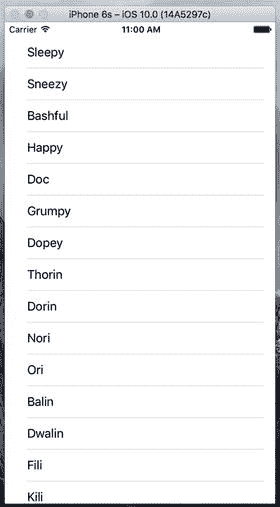

**图 8-7.** 显示 dwarves 数组的简单表格应用程序

你可能想知道为什么在这行代码中需要所有 `?` 运算符：

```
cell?.textLabel?.text = dwarves[indexPath.row]
```


好的，作为高级文档工程师和翻译员，我将严格遵循您的注意事项和示例格式，将给定的英文文本翻译成中文。

---


每个`?`运算符的使用都是 Swift 中可选链（optional chaining）的一个示例，它允许你编写紧凑的代码，即使必须调用可能为`nil`的对象引用的方法或访问其属性。第一个`?`运算符是必需的，因为对于编译器来说，`cell`可能是`nil`。原因是我们通过调用`dequeueReusableCellWithIdentifier()`方法获得它，该方法返回一个`UITableViewCell?`类型的值。当然，编译器没有考虑到我们显式检查了`nil`返回值，如果发现`nil`，则创建一个新的`UITableViewCell`对象，从而确保当我们到达这行代码时，`cell`实际上永远不会为`nil`。如果你查看`UITableViewCell`类的文档，会看到它的`textLabel`属性是`UILabel?`类型，因此它也可能为`nil`。同样，实际上不会出现这种情况，因为我们使用的是默认的`UITableViewCell`实例，它总是包含一个标签。自然，编译器不知道这一点，所以在解引用时我们使用了`?`运算符。这将是我们在 Swift 体验中经常遇到的情况。

### 添加图片

如果我们能在每一行添加一张图片，那将非常不错。你可能认为我们需要创建`UITableViewCell`的子类或添加子视图来实现。实际上，如果你能接受图片位于每行左侧，我们已经准备好了。默认的表格视图单元格完全可以处理这种情况。让我们看看它是如何工作的。

将示例源码归档中`08 - Star Image`文件夹中的`star.png`和`star2.png`文件拖拽到项目的`Assets.xcassets`中，如图 8-8 所示。

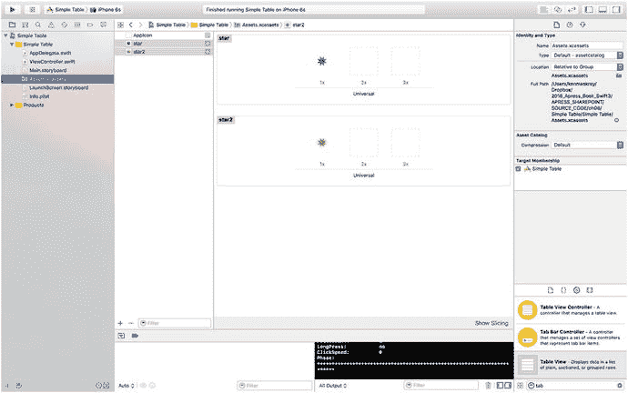

**图 8-8.** 将我们的图片添加到`Assets.xcassests`文件夹中

我们将安排这些图标出现在表格视图的每一行上。我们只需要为每个图标创建一个`UIImage`，并在表格视图向数据源请求每行的单元格时，将其赋值给`UITableViewCell`。为此，在`ViewController.swift`文件中，修改`tableView(_:cellForRowAtIndexPath:)`方法，如代码清单 8-3 所示。

```
func tableView(_ tableView: UITableView, cellForRowAt indexPath: IndexPath) -> UITableViewCell {
    var cell = tableView.dequeueReusableCell(withIdentifier: simpleTableIdentifier)
    if (cell == nil) {
        cell = UITableViewCell(
            style: UITableViewCellStyle.default,
            reuseIdentifier: simpleTableIdentifier)
    }
    let image = UIImage(named: "star")
    cell?.imageView?.image = image
    let highlightedImage = UIImage(named: "star2")
    cell?.imageView?.highlightedImage = highlightedImage
    cell?.textLabel?.text = dwarves[indexPath.row]
    return cell!
}
```

**代码清单 8-3.** 我们为每个单元格添加图片的修改

就是这样。每个单元格都有一个`UIImage`类型的`imageView`属性，它又具有名为`image`和`highlightedImage`的属性。`image`属性给出的图片出现在单元格文本的左侧，当单元格被选中时，如果提供了`highlightedImage`，则会被替换为该图片。你只需将单元格的`imageView.image`和`imageView.highlightedImage`属性设置为你想要显示的任何图片。

如果你现在编译并运行应用程序，应该会得到一个列表，每行左侧有一堆漂亮的蓝色小星星图标，如图 8-9 所示。如果你选择任何一行，会看到其图标从蓝色变为绿色，这是`star2.png`文件中图片的颜色。当然，我们可以为表格中的每一行包含不同的图片，或者，只需很少的精力，就可以为不同类别的小矮人使用不同的图标。

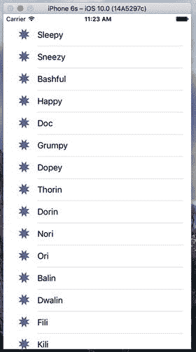

**图 8-9.** 我们使用了单元格的`imageView`属性为表格视图的每个单元格添加图片

> **注意：** `UIImage`使用基于文件名的缓存机制，因此每次调用`UIImage(named:)`时，它不会加载新的`image`属性。相反，它会使用已缓存的版本。

### 使用表格视图单元格样式

到目前为止，你对表格视图所做的操作都使用了默认的单元格样式，如图 8-9 所示，该样式由常量`UITableViewCellStyle.default`表示。但`UITableViewCell`类还包括其他几种预定义的单元格样式，让你可以轻松地为表格视图增加更多变化。这些单元格样式都使用了三种不同的单元格元素：

*   **图片：** 如果图片是指定样式的一部分，则图片显示在单元格文本的左侧。
*   **文本标签：** 这是单元格的主要文本。对于到目前为止我们一直在使用的`UITableViewCellStyle.Default`样式，文本标签是单元格中唯一显示的文本。
*   **详细文本标签：** 这是单元格的次要文本，通常用作说明性注释或标签。

要查看这些新样式添加的内容，在`ViewController.swift`中的`tableView(_:cellForRowAtIndexPath:)`方法里添加以下代码：

```
if indexPath.row < 7 {
    cell?.detailTextLabel?.text = "Mr Disney"
} else {
    cell?.detailTextLabel?.text = "Mr Tolkien"
}
```

将其放置在方法中`cell?.textLabel?.text = dwarves[indexPath.row]`这一行之前。

我们在这里所做的只是设置了单元格的详细文本。对于前七行，我们使用字符串`"Mr. Disney"`，其余行使用字符串`"Mr. Tolkien"`。当你运行此代码时，每个单元格看起来和之前一样（见图 8-10）。这是因为我们使用的是`UITableViewCellStyle.default`样式，它不使用详细文本。


**图 8-10.** 默认单元格样式在一行中显示图片和文本标签

现在像这样将`UITableViewCellStyle.default`改为`UITableViewCellStyle.subtitle`：

```
if (cell == nil) {
    cell = UITableViewCell(
        style: UITableViewCellStyle.subtitle,
        reuseIdentifier: simpleTableIdentifier)
}
```

再次运行应用程序。使用副标题样式后，两个文本元素会上下排列显示，如图 8-11 所示。

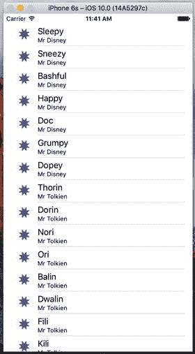

**图 8-11.** 副标题样式在文本标签下方以较小的字母显示详细文本

接下来，将`UITableViewCellStyle.subtitle`改为`UITableViewCellStyle.value1`，然后构建并再次运行。这种样式将文本标签和详细文本标签放在同一行，但位于单元格的相对两侧，如图 8-12 所示。

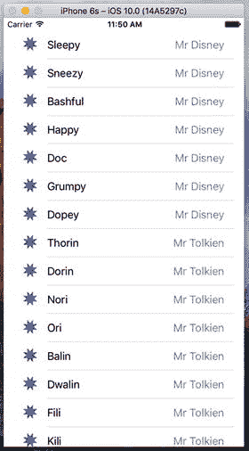

**图 8-12.** 样式`value1`将文本标签放在左侧（黑色字母），详细文本右对齐放在右侧

最后，将`UITableViewCellStyle.value1`改为`UITableViewCellStyle.value2`。这种格式通常用于显示信息以及描述性标签。它不显示单元格的图标，而是将详细文本标签放在文本标签的左侧，如图 8-13 所示。在此布局中，详细文本标签充当描述文本标签中数据类型的标签。

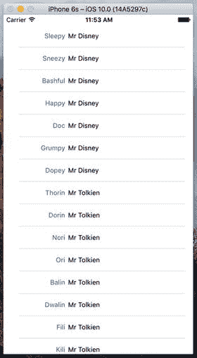

**图 8-13.** 样式`value2`不显示图片，并以蓝色字母将详细文本标签放在文本标签的左侧

既然你已经了解了可用的单元格样式，请继续操作，在继续之前改回`UITableViewCellStyle.default`样式。在本章后面，你将看到如何创建自定义的表格视图单元格。但在此之前，请确保你考虑过可用的单元格样式，看看其中是否有适合你需求的。


你可能已经注意到，我们将视图控制器同时设置为该表格视图的数据源和委托；但到目前为止，我们实际上还没有实现`UITableViewDelegate`协议中的任何方法。与选择器视图不同，较简单的表格视图不需要使用委托来执行其功能。数据源提供了绘制表格所需的全部数据。委托的目的是配置表格视图的外观并处理某些用户交互。现在我们来看看几个配置选项。在下一章中，我们还会讨论更多内容。

### 设置缩进级别

委托可用于指定某些行应进行缩进。在文件`ViewController.swift`中，将以下方法添加到你的代码中：

```
// MARK:-
// MARK: Table View delegate Methods
func tableView(_ tableView: UITableView, indentationLevelForRowAt indexPath: IndexPath) -> Int {
return indexPath.row % 4
}
```

该方法根据每行的行号设置其缩进级别；因此，第 0 行的缩进级别为 0，第 1 行的缩进级别为 1，依此类推。由于使用了 `%` 运算符，第 4 行将回到缩进级别 0，然后循环开始。缩进级别只是一个整数，它告诉表格视图将该行向右移动一点。数字越大，该行缩进得越靠右。例如，你可以使用这种技术来表示某一行从属于另一行，就像邮件应用在表示子文件夹时所做的那样。

当你再次运行应用程序时，你会看到这些行按四个一组进行缩进，如图 8-14 所示。

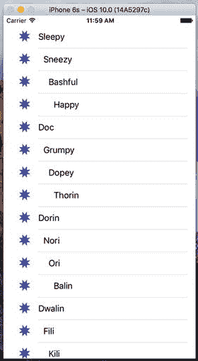

图 8-14. 缩进的表格行

### 处理行选择

表格的委托有两个方法，允许你处理行选择。一个方法在行被选中之前调用，可用于阻止行的选中，甚至改变具体哪一行被选中。让我们实现这个方法，并指定第一行不可选择。将以下方法添加到`ViewController.swift`的末尾：

```
func tableView(_ tableView: UITableView, willSelectRowAt indexPath: IndexPath) -> IndexPath? {
return indexPath.row == 0 ? nil : indexPath
}
```

该方法接收到一个表示即将被选中项的`indexPath`。我们的代码检查即将被选中的是哪一行。如果是第一行（其索引始终为零），则返回`nil`以表示实际上不应选中任何行。否则，返回未修改的`indexPath`，以此表示允许进行选择。

在编译并运行之前，我们还要实现行被选中后调用的委托方法，这通常是你实际处理选择的地方。在下一章中，我们将使用此方法在主从应用中处理下钻操作，但在此章中，我们只会弹出一个提示框来显示已选中某行。将列表 8-4 中的方法添加到`ViewController.swift`的末尾。

```
func tableView(_ tableView: UITableView, didSelectRowAt indexPath: IndexPath) {
let rowValue = dwarves[indexPath.row]
let message = "You selected \(rowValue)"
let controller = UIAlertController(title: "Row Selected",
message: message, preferredStyle: .alert)
let action = UIAlertAction(title: "Yes I Did",
style: .default, handler: nil)
controller.addAction(action)
present(controller, animated: true, completion: nil)
}
列表 8-4. 当用户点击某行时弹出警告框
```

添加此方法后，编译并运行应用，然后测试一下。例如，看看你是否能选中第一行（你应该无法选中），然后选择其他行之一。被选中的行应高亮显示。同时，你的警告框应该会弹出，告诉你选择了哪一行，而选中的行在背景中淡出，如图 8-15 所示。

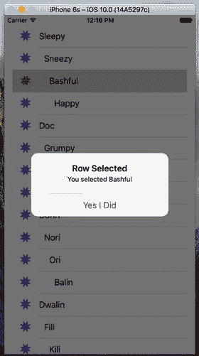

图 8-15. 在此示例中，第一行不可选择，当选择其他任何行时会显示警告框

请注意，你还可以在传回索引路径之前对其进行修改，这将导致不同的行和/或分区被选中。你不常会这样做，因为更改用户的选择需要有非常充分的理由。在绝大多数使用`tableView(_:willSelectRowAtIndexPath:)`方法的情况下，你要么返回未修改的`indexPath`以允许选择，要么返回`nil`来禁止选择。如果你确实想要更改选中的行和/或分区，请使用`NSIndexPath(forRow:, inSection:)`初始化器创建一个新的`NSIndexPath`对象并返回它。例如，列表 8-5 中的代码将确保如果你试图选中一个偶数行，实际上会选中紧随其后的下一行。

```
func tableView(tableView: UITableView,
willSelectRowAtIndexPath indexPath: NSIndexPath)
-> NSIndexPath? {
if indexPath.row == 0 {
return nil
} else if (indexPath.row % 2 == 0){
return NSIndexPath(row: indexPath.row + 1,
section: indexPath.section)
} else {
return indexPath
}
}
列表 8-5. 返回紧随其后的下一行
```


### 更改字号与行高

假设我们想要修改表格视图中使用的字号。大多数情况下，你不应覆盖默认字体，因为这是用户期望看到的。但有时确实有合理理由修改字体。请修改 `tableView(_:cellForRowAtIndexPath:)` 方法中的代码：

```
func tableView(_ tableView: UITableView, cellForRowAt indexPath: IndexPath) -> UITableViewCell {
    var cell = tableView.dequeueReusableCell(withIdentifier: simpleTableIdentifier)
    if (cell == nil) {
        cell = UITableViewCell(
            style: UITableViewCellStyle.default,
            reuseIdentifier: simpleTableIdentifier)
    }
    let image = UIImage(named: "star")
    cell?.imageView?.image = image
    let highlightedImage = UIImage(named: "star2")
    cell?.imageView?.highlightedImage = highlightedImage
    if indexPath.row < 7 {
        cell?.detailTextLabel?.text = "迪士尼先生"
    } else {
        cell?.detailTextLabel?.text = "托尔金先生"
    }
    cell?.textLabel?.text = dwarves[indexPath.row]
    cell?.textLabel?.font = UIFont.boldSystemFont(ofSize: 50) // <- 添加此行
    return cell!
}
```

现在运行应用，列表中的数值会以非常大的字号显示，但它们无法完全适配行高，如图 8-16 所示。

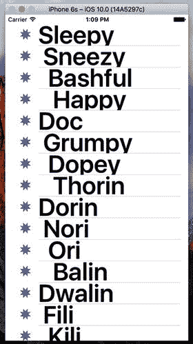

图 8-16. 更改绘制表格视图单元格使用的字体

有几种方法可以解决这个问题。首先，我们可以告知表格其所有行应具有固定的高度。为此，需要设置其 `rowHeight` 属性，如下所示：

```
tableView.rowHeight = 70
```

如果需要不同行具有不同高度，可以实现 `UITableViewDelegate` 的 `tableView(_:heightForRowAtIndexPath:)` 方法。现在将此方法添加到你的控制器类中：

```
func tableView(_ tableView: UITableView, heightForRowAt indexPath: IndexPath) -> CGFloat {
    return indexPath.row == 0 ? 120 : 70
}
```

我们刚刚告知表格视图将所有行的行高设置为 70 点，但第一行除外，它的高度会稍大一些。编译并运行，你的表格行现在应能更好地适配其内容，如图 8-17 所示。

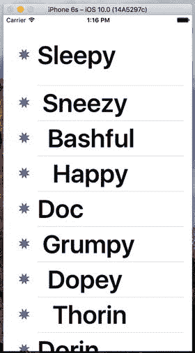

图 8-17. 使用委托更改行大小。注意第一行比其他行高得多

委托还能处理更多任务，但其余大部分任务在你开始处理分层数据时才会派上用场，这将在下一章中讨论。要了解更多信息，请使用文档浏览器探索 `UITableViewDelegate` 协议，查看还有哪些其他方法可用。

## 自定义表格视图单元格

开箱即用的表格视图可以完成许多操作；但通常你会希望以 `UITableViewCell` 直接不支持的方式来格式化每行的数据。在这些情况下，有三种基本方法：一种是在创建单元格时通过编程方式向 `UITableViewCell` 添加子视图；第二种是从 nib 文件加载单元格；第三种方法类似，但从故事板加载单元格。我们将在本章中介绍前两种技术，并在第 9 章中看到从故事板创建单元格的示例。

### 向表格视图单元格添加子视图

为了展示如何使用自定义单元格，我们将创建一个包含另一个表格视图的新应用。在每行中，我们将显示两行信息以及两个标签，如图 8-18 所示。我们的应用将显示一系列可能熟悉的计算机型号的名称和颜色。通过向表格视图单元格添加子视图，我们可以在同一行中同时显示这两类信息。

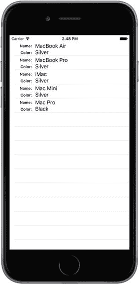

图 8-18. 向表格视图单元格添加子视图可实现多行显示

## 实现自定义表格视图应用

使用“单视图应用”模板创建一个新的 Xcode 项目。将项目命名为 `Table Cells`，并使用与上一个项目相同的设置。点击 `Main.storyboard` 以在 Interface Builder 中编辑 GUI。

向主视图添加一个表格视图，并使用“连接检查器”将其数据源设置为视图控制器，就像我们为“简单表格”应用所做的那样。然后，使用窗口底部的“固定”按钮为表格视图的边缘与其父视图及状态栏之间创建约束。实际上你可以使用与图 8-5 中相同的设置，因为默认情况下，弹出窗口顶部输入框中指定的值即为表格视图与其四个方向上最近邻居之间的距离。最后，保存故事板。

### 创建 `UITableViewCell` 子类

在此之前，我们使用的标准表格视图单元格已经为我们处理了单元格布局的所有细节。我们的控制器代码无需处理标签和图像放置位置等繁琐细节；我们只需将显示值传递给单元格即可。这使展示逻辑与控制器分离，是一种值得坚持的优秀设计。对于此项目，我们将创建一个自己的新单元格 `UITableViewCell` 子类，用于处理新布局的细节，从而使我们的控制器尽可能保持简单。


### 添加新单元格

在项目导航栏中选择`Table Cells`文件夹，然后按下`⌘N`创建新文件。在弹出的助手窗口中，从`iOS Source`部分选择`Cocoa Touch Class`，然后点击`Next`。在接下来的屏幕上，将新类命名为`NameAndColorCell`，在`Subclass of`下拉列表中选择`UITableViewCell`，保持`Also create XIB file`未选中状态，再次点击`Next`，在下一个屏幕上点击`Create`。

现在在项目导航栏中选择`NameAndColorCell.swift`，并添加以下代码：

```
class NameAndColorCell: UITableViewCell {
var name: String = ""
var color: String = ""
var nameLabel: UILabel!
var colorLabel: UILabel!
```

这里，我们在单元格的接口中添加了两个属性（`name`和`color`），控制器将使用它们向每个单元格传递值。我们还添加了一些其他属性，用于访问即将添加到单元格中的部分子视图。我们的单元格将包含四个子视图，其中两个是内容固定的标签，另外两个的内容将在每一行中变化。

这些就是我们需要添加的所有属性，接下来让我们继续代码部分。我们将重写表格视图单元格的`init(style:reuseIdentifier:)`初始化器，添加一些代码来创建显示所需的视图，如代码清单 8-6 所示。

```
override init(style: UITableViewCellStyle, reuseIdentifier: String?) {
super.init(style: style, reuseIdentifier: reuseIdentifier)
let nameLabelRect = CGRect(x: 0, y: 5, width: 70, height: 15)
let nameMarker = UILabel(frame: nameLabelRect)
nameMarker.textAlignment = NSTextAlignment.right
nameMarker.text = "Name:"
nameMarker.font = UIFont.boldSystemFont(ofSize: 12)
contentView.addSubview(nameMarker)
let colorLabelRect = CGRect(x: 0, y: 26, width: 70, height: 15)
let colorMarker = UILabel(frame: colorLabelRect)
colorMarker.textAlignment = NSTextAlignment.right
colorMarker.text = "Color:"
colorMarker.font = UIFont.boldSystemFont(ofSize: 12)
contentView.addSubview(colorMarker)
let nameValueRect = CGRect(x: 80, y: 5, width: 200, height: 15)
nameLabel = UILabel(frame: nameValueRect)
contentView.addSubview(nameLabel)
let colorValueRect = CGRect(x: 80, y: 25, width: 200, height: 15)
colorLabel = UILabel(frame: colorValueRect)
contentView.addSubview(colorLabel)
}
代码清单 8-6.
我们的表格视图单元格的 init() 方法
```

这应该相当直观。我们创建了四个`UILabel`并将它们添加到表格视图单元格中。表格视图单元格已经有一个名为`contentView`的`UIView`子视图，用于分组所有子视图。因此，我们不是直接将标签作为子视图添加到表格视图单元格，而是添加到它的`contentView`中。

其中两个标签包含静态文本。标签`nameMarker`包含文本`Name:`，标签`colorMarker`包含文本`Color:`。这些是我们不会更改的标签。这两个标签都使用`NSTextAlignment.right`实现了右对齐文本。

我们将使用另外两个标签来显示每行特定的数据。请记住，我们之后需要某种方式来检索这些字段，因此我们在之前声明的属性中保留了对它们的引用。

由于我们重写了表格视图单元格类的一个指定初始化器，Swift 要求我们也提供`init(coder:)`初始化器的实现。在我们的示例应用程序中，这个初始化器永远不会被调用，所以只需添加这三行代码：

```
required init?(coder aDecoder: NSCoder) {
fatalError("init(coder:) has not been implemented")
}
```

在第 13 章中，我们将讨论这个初始化器以及为什么有时需要它。

现在，让我们通过为`name`和`color`属性添加一些设置器逻辑来对`NameAndColorCell`类进行收尾工作。按如下方式更改这些属性的声明：

```
var name: String = "" {
didSet {
if (name != oldValue) {
nameLabel.text = name
}
}
}
var color: String = "" {
didSet {
if (color != oldValue) {
colorLabel.text = color
}
}
}
```

这里我们所做的一切就是添加代码，以确保当`name`或`color`属性的值发生变化时，同一个自定义表格视图单元格中对应标签的`text`属性也会被设置为相同的值。


```markdown
## 实现控制器代码

现在，我们来设置一个简单的控制器，以便在新单元格中显示值。首先选择 `ViewController.swift`，并添加代码清单 8-7 中的代码。

```
class ViewController: UIViewController, UITableViewDataSource {
let cellTableIdentifier = "CellTableIdentifier"
@IBOutlet var tableView:UITableView!
let computers = [
["Name" : "MacBook Air", "Color" : "Silver"],
["Name" : "MacBook Pro", "Color" : "Silver"],
["Name" : "iMac", "Color" : "Silver"],
["Name" : "Mac Mini", "Color" : "Silver"],
["Name" : "Mac Pro", "Color" : "Black"]
]
override func viewDidLoad() {
super.viewDidLoad()
// 加载视图后执行任何额外的设置（通常从 nib 文件加载）
tableView.register(NameAndColorCell.self,
forCellReuseIdentifier: cellTableIdentifier)
}
代码清单 8-7：在自定义单元格中显示值
```

我们让视图控制器遵循 `UITableViewDataSource` 协议，并添加了一个单元格标识名称和一个字典数组。每个字典包含表格中一行的名称和颜色信息。该行的名称存储在字典的键 `Name` 下，颜色存储在键 `Color` 下。我们还为表格视图添加了一个插座，因此需要在故事板中进行连接。选择 `Main.storyboard` 文件。在文档大纲中，从视图控制器图标按住 Control 键拖动到表格视图图标。松开鼠标，在弹出的菜单中选择 `tableView`，将表格视图链接到插座。

现在，将代码清单 8-8 中的代码添加到 `ViewController.swift` 文件的末尾。

```
// MARK: -
// MARK: 表格视图数据源方法
func tableView(_ tableView: UITableView, numberOfRowsInSection section: Int) -> Int {
return computers.count
}
func tableView(_ tableView: UITableView, cellForRowAt indexPath: IndexPath) -> UITableViewCell {
let cell = tableView.dequeueReusableCell(
withIdentifier: cellTableIdentifier, for: indexPath)
as! NameAndColorCell
let rowData = computers[indexPath.row]
cell.name = rowData["Name"]!
cell.color = rowData["Color"]!
return cell
}
代码清单 8-8：我们的表格视图数据源方法
```

在前面的示例中，您已经见过这些方法——它们属于 `UITableViewDataSource` 协议。我们重点看一下 `tableView(_ tableView: UITableView, cellForRowAt indexPath: IndexPath)`，因为这才是真正涉及新内容的地方。这里我们使用了一个有趣的特性：表格视图可以在需要时利用一种注册机制来创建新单元格。这意味着，只要我们已经注册了要在表格视图中使用的所有重用标识，就总能获取到可用的单元格。在前面的示例中，我们实现的出列方法也使用了注册机制，但如果传入的标识未注册，它会返回 `nil`。`nil` 返回值被用作一个信号，提示我们需要创建并填充一个新的 `UITableViewCell` 对象。而我们现在使用的方法永远不会返回 `nil`：

```
dequeueReusableCell(
withIdentifier: cellTableIdentifier, for: indexPath)
```

那么，它是如何获取表格单元格对象的呢？它使用传入的标识作为键，在注册表中查找。我们在 `viewDidLoad` 方法中向注册表添加了一个条目，该条目映射到我们的表格单元格标识：

```
tableView.register(NameAndColorCell.self,
forCellReuseIdentifier: cellTableIdentifier)
```

如果传入一个未注册的标识会怎样？在这种情况下，`dequeueReusableCell` 方法会崩溃。崩溃听起来很糟糕，但在这里，它会是开发过程中立即就能发现的 bug。因此，我们不需要包含检查 `nil` 返回值的代码，因为这种情况永远不会发生。

获取到新单元格后，我们使用传入的 `indexPath` 参数来确定表格请求的是哪一行的单元格，然后用该行值来获取对应行的正确字典。记住，字典有两个键/值对：一个用 `name`，另一个用 `color`：

```
let rowData = computers[indexPath.row]
```

现在，剩下要做的就是使用我们在子类中定义的属性，用所选行的数据填充单元格：

```
cell.name = rowData["Name"]!
cell.color = rowData["Color"]!
```

正如您之前看到的，设置这些属性会将值复制到表格视图单元格中的名称和颜色标签。

构建并运行您的应用程序。您应该会看到一个表格行，每行有两行数据，如图 8-19 所示。

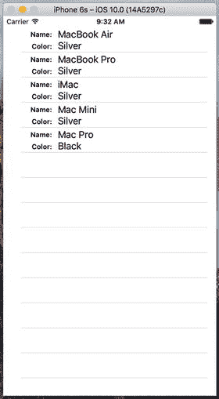

图 8-19：代码创建的自定义单元格的表格视图

能够向表格视图单元格添加视图，比单独使用标准表格视图单元格提供了更大的灵活性，但以编程方式创建、定位和添加所有子视图可能会有些繁琐。天哪，如果我们能通过 Xcode 的 GUI 编辑工具以图形方式设计表格视图单元格，那该多好啊。嗯，我们很幸运。如前所述，您可以使用 Interface Builder 设计表格视图单元格，然后在创建新单元格时直接从故事板或 XIB 文件加载视图。

### 从 XIB 文件加载 UITableViewCell

我们将使用 Xcode 在 Interface Builder 中提供的可视化布局功能，重新创建刚才用代码构建的相同双行界面。为此，我们将创建一个新的 XIB 文件，其中包含表格视图单元格，并使用 Interface Builder 布局其视图。然后，当我们需要一个表示行的表格视图单元格时，只需加载 XIB 文件，并使用我们已在单元格类中定义的属性来设置名称和颜色。除了使用 Interface Builder 的可视化布局外，我们还在其他几个地方简化了代码。在继续之前，您可能想复制一份 Table Cells 项目，以便在其中进行后续更改。像之前一样，退出 Xcode，然后压缩项目文件，并给它一个合适的名称以供参考。我将其命名为 `Table Cells Orig.zip`，表示它是最初的 Table Cells 项目（见图 8-20）。

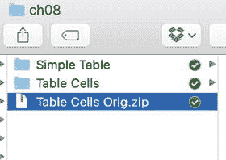

图 8-20：您可以压缩项目文件夹以创建版本基线，以便日后决定回溯时使用

首先，我们将在 `NameAndColorCell.swift` 中对 `NameAndColorCell` 类进行一些更改。第一步是将 `nameLabel` 和 `colorLabel` 属性标记为插座，以便我们能在 Interface Builder 中使用它们：

```
@IBOutlet var nameLabel: UILabel!
@IBOutlet var colorLabel: UILabel!
```

现在，还记得我们在 `init(style: UITableViewCellStyle, reuseIdentifier: String?)` 中创建标签的那些设置吗？所有这些都可以删除了。实际上，您应该直接删除整个方法，因为所有这些设置现在都将在 Interface Builder 中完成。而且，由于我们不再重写任何基类初始化方法，您也可以删除 `init(coder:)` 方法。

经过这些操作后，您得到的单元格类比之前更小巧、更简洁。它现在唯一真正的功能就是将数据传输到标签。现在，我们需要在 Interface Builder 中重新创建单元格及其标签。
```


### 在 Interface Builder 中设计表格视图单元格

在 Xcode 中右键点击 `Table Cells` 文件夹，从上下文菜单中选择 `New File…`。在新文件助手的左侧窗格中，点击 `User Interface`（确保选择的是 iOS 部分，而非 watchOS、tvOS 或 macOS 部分）。在上方窗格中选择 `User Interface` 和 `Empty`，然后点击 `Next`（见图 8-21）。在接下来的界面中，将文件名设为 `NameAndColorCell.xib`。确保文件浏览器中选中的是主项目目录，且“组”弹出菜单中选中的是 `Table Cells` 组。点击 `Create` 创建一个新的 XIB 文件。

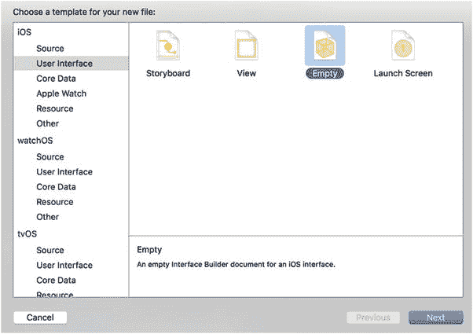

**图 8-21.** 创建一个空的界面文件，它将作为我们的自定义单元格 XIB

接下来，在项目导航器中选择 `NameAndColorCell.xib` 打开文件进行编辑。到目前为止，我们一直在故事板中进行所有 GUI 编辑，但现在我们改用 nib 文件。大多数操作是相似的，你也会觉得很眼熟，但有一些区别。其中一个主要区别在于：故事板文件以场景为中心，每个场景将视图控制器和视图配对；而在 nib 文件中，并没有这种强制配对。实际上，nib 文件通常根本不包含真实的控制器对象，只有一个名为 `File’s Owner` 的代理。如果你打开文档大纲，就能在 `First Responder` 上方看到它。

在库中查找 `Table View Cell`，然后将一个拖到 GUI 布局区域，如图 8-22 所示。

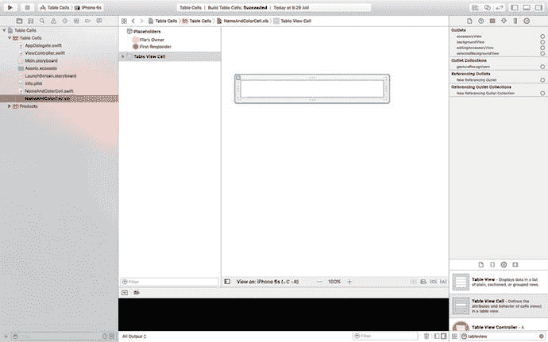

**图 8-22.** 从库中将一个表格视图单元格拖到画布上

接下来，按下 `⌥⌘4` 打开属性检查器（见图 8-23）。你会在那里看到的第一个字段之一是 `Identifier`。这就是我们在代码中一直使用的复用标识符。如果不熟悉，请回顾本章前面关于 `CellTableIdentifier` 的内容。将 `Identifier` 值设置为 `CellTableIdentifier`。

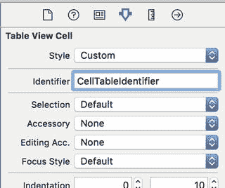

**图 8-23.** 表格视图单元格的属性检查器

这样做的思路是：当我们检索一个单元格以复用时（例如因为滚动而使新单元格进入视图），我们希望确保获取到正确的单元格类型。当这个特定单元格从 XIB 文件实例化时，其复用标识符实例变量将预先填入你在属性检查器的 `Identifier` 字段中输入的名称——本例中为 `CellTableIdentifier`。

想象这样一个场景：你创建了一个带有表头后跟一系列“中间”单元格的表格。如果将一个中间单元格滚动到视图中，那么获取一个中间单元格来复用（而不是表头单元格）就至关重要。`Identifier` 字段让你能够适当地标记这些单元格。

下一步是编辑表格单元格的内容视图。首先，在编辑区域中选择表格单元格，向下拖动其下边缘使单元格稍微高一些。一直拖动直到高度为 `65`。前往库，拖出四个 `Label` 控件，并将它们放置在内容视图中，以图 8-24 作为参考。标签可能离顶部和底部太近，这些参考线帮不上太大忙，但左侧参考线和对齐参考线应该能发挥作用。请注意，你可以拖出一个标签，然后按住 Option 键拖动来创建副本——如果这种方法对你来说更方便的话。

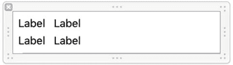

**图 8-24.** 拖入四个标签后的表格视图单元格内容视图

接下来，双击左上角的标签，将其标题改为 `Name:`，然后将左下角的标签改为 `Color:`。

现在，同时选中 `Name:` 和 `Color:` 标签，然后点击属性检查器 `Font` 字段中的小 `T` 按钮。这将打开一个小面板，其中包含一个 `Font` 弹出按钮。点击该按钮，选择 `Headline` 作为字体。如果需要，选中右侧两个未更改的标签字段，将其向右稍微拖动一点，为设计留出一些呼吸空间，然后调整另外两个标签的大小，以便你能看到刚刚设置的文本。接着，调整右侧两个标签的大小，使其一直延伸到右侧参考线。图 8-25 应该能让你了解最终的单元格内容视图。

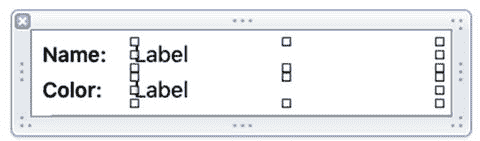

**图 8-25.** 左侧标签名称已更改并设置为 Headline 样式（即粗体），右侧标签已略微移动并调整大小的表格视图单元格内容视图

与往常创建新布局时一样，我们需要添加 Auto Layout 约束。总体思路是将左侧标签固定在单元格的左侧，将右侧标签固定在单元格的右侧。我们还需要确保标签与单元格顶部和底部之间、以及标签之间的垂直间距保持不变。我们将每个左侧标签与其右侧的标签关联起来。具体步骤如下：


1.  点击`Name:`标签，按住`Shift`键，然后点击`Color:`标签。点击笔尖编辑器下方的`Pin`图标，勾选`Equal Widths`复选框，然后点击`Add 1 Constraint`。执行此操作时，您会看到一些 Auto Layout 警告出现——不必担心，因为随着我们添加更多约束，我们会修复它们。
2.  在两个标签仍处于选中状态时，打开`Size Inspector`，找到标题为`Content Hugging Priority`的区域。如果您看不到它，请尝试取消选择并重新选择这两个标签。这些字段中的值决定了标签抵抗扩展到额外空间的程度。我们不希望这些标签在水平方向上发生任何扩展，因此将`Horizontal`字段的值从`251`改为`500`。任何大于`251`的值都可以——我们只需要它大于右侧两个标签的`Content Hugging Priority`，这样任何额外的水平空间都会分配给它们。
3.  按住 Control 键并从`Color:`标签拖到`Name:`标签，从弹出菜单中选择`Vertical Spacing`，然后按`Return`键。
4.  按住 Control 键并从`Name:`标签沿对角线向左上方向拖向单元格的左上角，直到单元格背景完全变为蓝色。在弹出菜单中，按住`Shift`键，选择`Leading Space to Container Margin`和`Top Space to Container Margin`，然后按`Return`键。
5.  按住 Control 键并从`Color:`标签沿对角线向左下方向拖向单元格的左下角，直到其背景变为蓝色。在弹出菜单中，按住`Shift`键，选择`Leading Space to Container Margin`和`Bottom Space to Container Margin`，然后按`Return`键。
6.  按住 Control 键并从`Name:`标签拖到其右侧的标签。在弹出菜单中，按住`Shift`键，选择`Horizontal Spacing`和`Baseline`，然后按`Return`键。按住 Control 键并从右侧的顶部标签拖向单元格的右边缘，直到单元格背景变为蓝色。在弹出菜单中，选择`Trailing Space to Container Margin`。
7.  类似地，按住 Control 键并从`Color:`标签拖到其右侧的标签。在弹出菜单中，按住`Shift`键，选择`Horizontal Spacing`和`Baseline`，然后按`Return`键。按住 Control 键并从右侧的底部标签拖向单元格的右边缘，直到单元格背景变为蓝色。在弹出菜单中，选择`Trailing Space to Container Margin`并按`Return`键。
8.  最后，选择`Document Outline`中的`Content View`图标，然后从菜单中选择`Editor ➤ Resolve Auto Layout Issues ➤ Update Frames`（如果该选项可用）。四个标签应该会移动到它们的最终位置，如图 8-26 所示。如果您看到不同的结果，请在`Document Outline`中删除所有约束并重试。

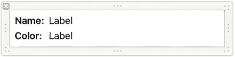

图 8-26.

我们自定义单元格中的最终标签定位

现在，我们需要让 Interface Builder 知道这个表格视图单元格不仅仅是一个普通单元格，而是我们特殊子类的一个实例。否则，我们将无法将我们的输出口连接到相关的标签。通过点击`Document Outline`中的`CellTableIdentifier`来选择表格视图单元格，按`⌥⌘3`打开`Identity Inspector`，并从`Class`控件中选择`NameAndColorCell`（见图 8-27）。

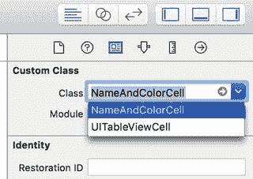

图 8-27.

设置为我们的自定义类

接下来，切换到`Connections Inspector`（`⌥⌘6`），您会看到`colorLabel`和`nameLabel`输出口（见图 8-28）。

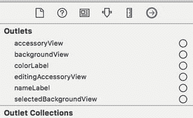

图 8-28.

我们的`colorLabel`和`nameLabel`输出口

将`nameLabel`输出口拖到表格单元格中右侧的顶部标签，并将`colorLabel`输出口拖到右侧的底部标签，如图 8-29 所示。

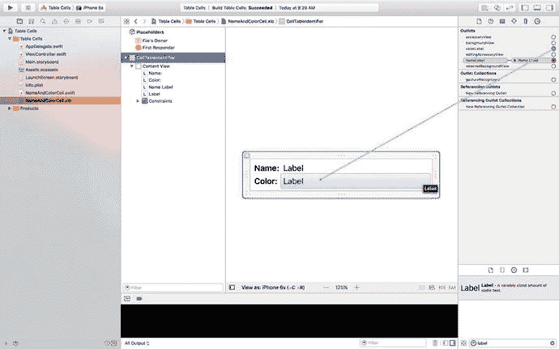

图 8-29.

连接我们的名称和颜色标签输出口

## 使用新的表格视图单元格

要使用我们设计的单元格，我们只需要对`ViewController.swift`中的`viewDidLoad()`方法进行一些相当简单的更改，如代码清单 8-9 所示。

```
override func viewDidLoad() {
super.viewDidLoad()
// Do any additional setup after loading the view, typically from a nib.
tableView.register(NameAndColorCell.self,
forCellReuseIdentifier: cellTableIdentifier)
let xib = UINib(nibName: "NameAndColorCell", bundle: nil)
tableView.register(xib,
forCellReuseIdentifier: cellTableIdentifier)
tableView.rowHeight = 65
}
```

代码清单 8-9.

修改 `viewDidLoad()` 以使用我们的新单元格

正如它可以将类与重用标识符关联起来（如您在前一个示例中所见），表格视图可以跟踪哪些 nib 文件旨在与特定的重用标识符关联。这允许您使用类或 nib 文件为每个行类型注册一次单元格，而`dequeueReusableCell(_:forIndexPath:)`将始终提供一个随时可用的单元格。

就是这样。构建并运行。现在，您的双行表格单元格基于您的 Interface Builder 设计技巧，如图 8-30 所示。

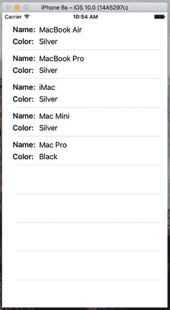

图 8-30.

使用我们自定义单元格的结果

## 分组和索引分区

我们的下一个项目将探索表格的另一个基本方面。我们仍将使用单个表格视图——暂时没有层级结构——但我们将数据划分为多个分区。再次使用`Single View Application`模板创建一个新的 Xcode 项目，这次将其命名为`Sections`。像往常一样，将`Language`设置为`Swift`，将`Devices`设置为`Universal`。

### 构建视图

打开`Sections`文件夹，点击`Main.storyboard`来编辑文件。将一个表格视图拖放到`View`窗口上，就像我们之前做的那样，并添加我们在“表格单元格”示例中使用过的相同 Auto Layout 约束。然后按`⌥⌘6`并将`dataSource`连线连接到`View Controller`图标。

接下来，确保表格视图被选中，并按`⌥⌘4`打开`Attributes Inspector`。将表格视图的`Style`从`Plain`更改为`Grouped`，如图 8-31 所示。保存故事板。

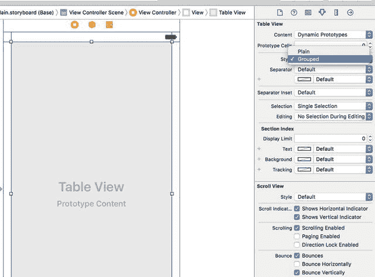

图 8-31.

表格视图的`Attributes Inspector`，显示已选中`Grouped`的`Style`弹出菜单

### 导入数据

这个项目需要相当多的数据。为了省去您几个小时的打字时间，我们提供了另一个属性列表供您制表之用。从本书示例源代码存档中的`08 - Sections Data`子文件夹中获取名为`sortednames.plist`的文件，并将其拖入 Xcode 中您的项目的`Sections`文件夹中。

一旦`sortednames.plist`被添加到您的项目中，单击它以大致了解其内容，如图 8-32 所示。它是一个包含字典的属性列表，字母表中的每个字母都有一个条目。每个字母下面是一个以该字母开头的名称列表。

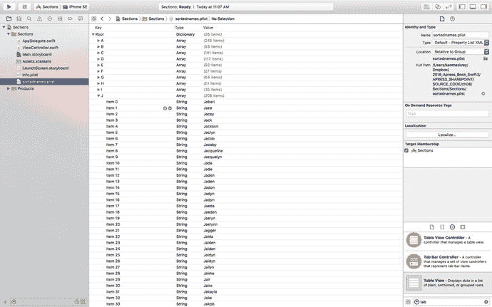

图 8-32.

`sortednames.plist` 属性列表文件。字母 J 已展开，以便您了解其中一个字典的结构

我们将使用这个属性列表中的数据来填充表格视图，为每个字母创建一个分区。


### 实现控制器

单击 `ViewController.swift` 文件。使该类遵循 `UITableViewDataSource` 协议，添加一个表格单元格标识名称，并通过添加以下**加粗**代码来创建几个属性：

```
class ViewController: UIViewController, UITableViewDataSource {
    let sectionsTableIdentifier = "SectionsTableIndentifier"
    var names: [String: [String]]!
    var keys: [String]!
```

再次选择 `Main.storyboard` 文件，然后调出助理编辑器。如果未显示，请使用跳转栏选择 `ViewController.swift` 文件。按住 Control 键从表格视图拖拽到助理编辑器，以在 `keys` 属性定义的**下方**为表格创建一个输出口：

```
@IBOutlet weak var tableView: UITableView!
```

现在修改 `viewDidLoad()` 方法，如代码清单 8-10 所示。

```
override func viewDidLoad() {
    super.viewDidLoad()
    // 加载视图后执行任何额外的设置，通常从 nib 文件加载。
    tableView.register(UITableViewCell.self,
        forCellReuseIdentifier: sectionsTableIdentifier)
    let path = Bundle.main.path(forResource:
        "sortednames", ofType: "plist")
    let namesDict = NSDictionary(contentsOfFile: path!)
    names = namesDict as! [String: [String]]
    keys = (namesDict!.allKeys as! [String]).sorted()
}
代码清单 8-10.
我们新建的 viewDidLoad 方法
```

这与您之前看到的大部分内容没有太大不同。之前，我们为一个字典和一个数组添加了属性声明。字典将保存所有数据，而数组将保存按字母顺序排序的区段。在 `viewDidLoad()` 方法中，我们首先使用声明的标识符注册了每行应显示的默认表格视图单元格类。之后，我们从添加到项目中的属性列表创建了一个 `NSDictionary` 实例，并将其赋值给 `names` 属性，同时将其转换为适当的 Swift 字典类型。接下来，我们从字典中获取所有键并排序，得到一个包含字典中所有键值的、按字母顺序排列的有序数组。请记住，我们的数据使用字母作为键，因此该数组将包含 26 个从 A 到 Z 排序的字母。我们将使用该数组来帮助我们跟踪各个区段。

接下来，将代码清单 8-11 中的代码添加到 `ViewController.swift` 文件的末尾。

```
// MARK: 表格视图数据源方法
func numberOfSections(in tableView: UITableView) -> Int {
    return keys.count
}
func tableView(_ tableView: UITableView, numberOfRowsInSection section: Int) -> Int {
    let key = keys[section]
    let nameSection = names[key]!
    return nameSection.count
}
func tableView(_ tableView: UITableView, titleForHeaderInSection section: Int) -> String? {
    return keys[section]
}
func tableView(_ tableView: UITableView, cellForRowAt indexPath: IndexPath) -> UITableViewCell {
    let cell = tableView.dequeueReusableCell(withIdentifier: sectionsTableIdentifier, for: indexPath)
        as UITableViewCell
    let key = keys[indexPath.section]
    let nameSection = names[key]!
    cell.textLabel?.text = nameSection[indexPath.row]
    return cell
}
代码清单 8-11.
表格视图的数据源方法
```

这些都是表格数据源方法。我们添加到类中的第一个方法指定了区段的数量。在之前的示例中我们没有实现这个方法，因为使用默认设置 1 就足够了。这次，我们告诉表格视图，字典中的每个键对应一个区段：

```
func numberOfSectionsInTableView(tableView: UITableView) -> Int {
    return keys.count
}
```

下一个方法计算特定区段中的行数。在之前的示例中，我们只有一个区段，因此直接返回数组中的行数即可。这次，我们需要按区段细分。这可以通过检索与当前区段对应的数组并返回该数组的计数来实现：

```
func tableView(_ tableView: UITableView, numberOfRowsInSection section: Int) -> Int {
    let key = keys[section]
    let nameSection = names[key]!
    return nameSection.count
}
```

方法 `tableView(_:titleForHeaderInSection:)` 允许您为每个区段指定一个可选的标题。我们直接返回该分组的字母，也就是该分组的键：

```
func tableView(_ tableView: UITableView, titleForHeaderInSection section: Int) -> String? {
    return keys[section]
}
```

在 `tableView(_:cellForRowAtIndexPath:)` 方法中，我们需要使用索引路径中的区段和行属性，分别提取区段键和名称数组，然后据此确定要使用的值。区段编号会告诉我们从 `names` 字典中取出哪个数组，然后我们可以使用行号来确定使用该数组中的哪个值。该方法中的其他内容与本章前面构建的“表格单元格”应用程序中的版本基本相同。

构建并运行项目，请记住我们已将表格的“样式”更改为“分组”，因此最终我们得到了一个包含 26 个区段的分组表格，应如图 8-33 所示。

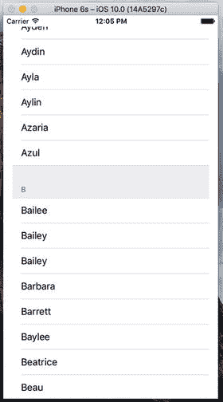

图 8-33. 包含多个区段的分组表格

作为对比，让我们将表格视图改回普通样式，看看包含多个区段的普通表格视图是什么样子。再次选择 `Main.storyboard` 在 Interface Builder 中编辑文件。选择表格视图，并使用属性检查器将视图切换为“普通”。保存项目，然后构建并运行它——数据相同，但外观不同，如图 8-34 所示。

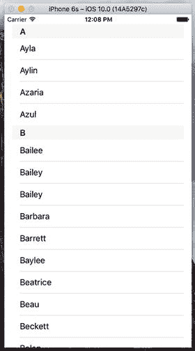

图 8-34. 包含区段的普通表格

### 添加索引

当前表格的一个问题是行数过多。列表中包含 2,000 个名字。您的食指在查找 Zachariah 或 Zayne 时会非常疲劳，更不用说 Zoie 了。

解决这个问题的一个方法是在表格视图的右侧添加一个索引。既然我们已经将表格视图样式改回了“普通”，那么实现起来就相对容易了，如图 8-35 所示。将以下方法添加到 `ViewController.swift` 的底部，然后构建并运行应用程序。

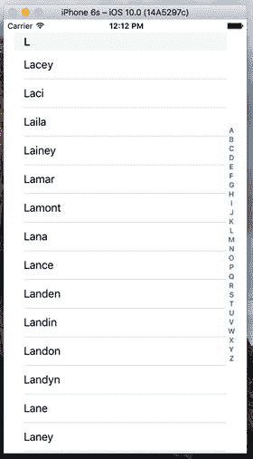

图 8-35. 为表格视图添加索引

```
func sectionIndexTitles(for tableView: UITableView) -> [String]? {
    return keys
}
```


### 添加搜索栏

索引很有用，但即便如此，我们的列表中仍有大量姓名。例如，如果我们想查看 Arabella 这个名字是否在列表中，即使使用了索引，我们也需要滚动一段时间。如果能允许用户通过指定搜索词来精简列表，使其更友好，那就太好了。嗯，这虽然需要多做一些工作，但也不算太多。我们将使用搜索控制器来实现一个标准的 iOS 搜索栏，如图 8-36 左侧所示。

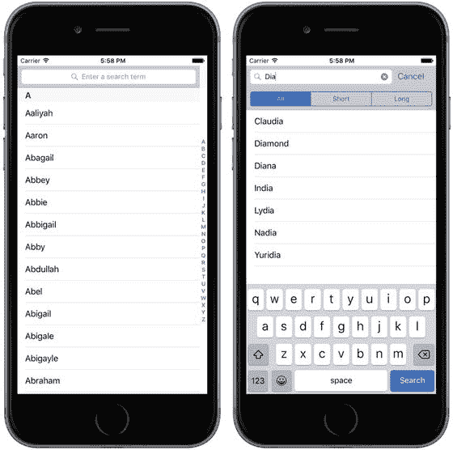

图 8-36. 在表格中添加了搜索栏的应用程序

当用户在搜索栏中输入时，姓名列表会缩减到仅包含输入文本作为子串的那些姓名。此外，搜索栏还允许你定义范围按钮，可以用它们以某种方式限定搜索。我们将为搜索栏添加三个范围按钮——Short 按钮将搜索限制为长度少于六个字符的姓名，Long 按钮将只考虑至少六个字符的姓名，而 All 按钮则包含搜索中的所有姓名。范围按钮仅在用户在搜索栏中输入时出现；你可以在图 8-36 的右侧看到它们的使用效果。

添加搜索功能相当简单。你只需要三样东西：

- 一些要搜索的数据。在我们的例子中，就是姓名列表。
- 一个用于显示搜索结果的视图控制器。这个视图控制器会临时替换提供数据的那个视图控制器。它可以以任何方式显示结果，但通常源数据是在表格中呈现的，而结果视图控制器会使用另一个看起来非常相似的表格，从而造成搜索只是过滤了原始表格的印象。不过，正如你将看到的，实际情况并非如此。
- 一个提供搜索栏并管理搜索结果在结果视图控制器中显示的 `UISearchController`。

让我们从创建结果视图控制器的框架开始。我们将在表格中显示搜索结果，因此我们的结果视图控制器需要包含一个表格。我们可以像本章前面的示例那样，将一个视图控制器拖到故事板上并向其添加一个表格视图，但这次让我们尝试不同的做法。我们将使用一个 `UITableViewController`，它是一个嵌入了 `UITableView` 的视图控制器，并且预先配置为既是其表格视图的数据源也是其代理。在项目导航器中，右键单击 Sections 组，然后从弹出菜单中选择 New File…。在文件模板选择器中，从 iOS Source 组中选择 Cocoa Touch Class，然后按 Next。将新类命名为 `SearchResultsController`，并使其成为 `UITableViewController` 的子类。按 Next，选择新文件的位置，然后让 Xcode 创建它。

在项目导航器中选择 `SearchResultsController.swift` 并对其进行如下修改：

```
class SearchResultsController: UITableViewController,
UISearchResultsUpdating {
```

我们将在这个视图控制器中实现搜索逻辑，因此我们使其遵循 `UISearchResultsUpdating` 协议，这允许我们将其指定为 `UISearchController` 类的代理。正如你稍后将看到的，当用户在搜索栏中输入时，会调用此协议定义的单一方法来更新搜索结果。

由于它将为我们实现搜索操作，`SearchResultsController` 需要访问主视图控制器正在显示的姓名列表，因此我们需要为其提供属性，以便我们可以将姓名字典和用于在主视图控制器中显示的键列表传递给它。现在让我们将这些属性添加到 `SearchResultsController.swift` 中。你可能已经注意到，此文件已经包含了一些不完整的代码，这些代码提供了 `UITableViewDataSource` 协议的部分实现，以及一些 `UITableViewController` 子类经常需要实现的其他方法的注释代码块。我们不会在这个示例中使用这些内容，因此请删除所有注释掉的代码和两个 `UITableViewDataSource` 方法，然后在文件顶部添加以下代码：

```
class SearchResultsController: UITableViewController, UISearchResultsUpdating  {
let sectionsTableIdentifier = "SectionsTableIdentifier"
var names:[String: [String]] = [String: [String]]()
var keys: [String] = []
var filteredNames: [String] = []
```

我们添加了 `sectionsTableIdentifier` 变量来保存此视图控制器中表格单元格的标识符。我们使用了与主视图控制器中相同的标识符，尽管我们可以使用任何名称。我们还添加了两个属性，它们将保存搜索时使用的姓名字典和键列表，以及另一个属性，该属性将保存对存储搜索结果的数组的引用。

接下来，在 `viewDidLoad()` 方法中添加一行代码，以将我们的表格单元格标识符注册到结果控制器的嵌入式表格视图中：

```
override func viewDidLoad() {
super.viewDidLoad()
tableView.register(UITableViewCell.self,
forCellReuseIdentifier: sectionsTableIdentifier)
}
```

目前我们在结果视图控制器中需要做的就这些了，所以让我们暂时切换回主视图控制器并向其添加搜索栏。在项目导航器中选择 `ViewController.swift`，并在文件顶部添加一个属性来保存对 `UISearchController` 实例的引用，该实例将在此示例中为我们完成大部分繁重的工作：

```
class ViewController: UIViewController, UITableViewDataSource  {
let sectionsTableIdentifier = "SectionsTableIndentifier"
var names: [String: [String]]!
var keys: [String]!
@IBOutlet weak var tableView: UITableView!
var searchController: UISearchController!   // ← 添加此行
```

接下来，修改 `viewDidLoad()` 方法来添加搜索控制器，如列表 8-12 所示。

```
override func viewDidLoad() {
super.viewDidLoad()
// 从 nib 加载视图后的任何其他设置。
tableView.register(UITableViewCell.self,
forCellReuseIdentifier: sectionsTableIdentifier)
let path = Bundle.main.pathForResource(
"sortednames", ofType: "plist")
let namesDict = NSDictionary(contentsOfFile: path!)
names = namesDict as! [String: [String]]
keys = (namesDict!.allKeys as! [String]).sorted()
let resultsController = SearchResultsController()
resultsController.names = names
resultsController.keys = keys
searchController =
UISearchController(searchResultsController: resultsController)
let searchBar = searchController.searchBar
searchBar.scopeButtonTitles = ["All", "Short", "Long"]
searchBar.placeholder = "Enter a search term"
searchBar.sizeToFit()
tableView.tableHeaderView = searchBar
searchController.searchResultsUpdater = resultsController
}
列表 8-12. 在 ViewController.swift 中的主 viewDidLoad 方法中添加搜索控制器
```

我们首先创建结果控制器并设置其 `names` 和 `keys` 属性。然后，我们创建 `UISearchController`，并向其传递对结果控制器的引用——当有搜索结果要显示时，`UISearchController` 会展示这个视图控制器。


```swift
let resultsController = SearchResultsController()
resultsController.names = names
resultsController.keys = keys
searchController =
UISearchController(searchResultsController: resultsController)
```

接下来的三行代码获取并配置了由 `UISearchController` 创建的 `UISearchBar`，我们可以通过其 `searchBar` 属性来获取它：

```swift
let searchBar = searchController.searchBar
searchBar.scopeButtonTitles = ["全部", "短", "长"]
searchBar.placeholder = "输入搜索词"
```

搜索栏的 `scopeButtonTitles` 属性包含了要分配给其作用域按钮的名称。默认情况下，没有作用域按钮，但这里我们设置了本节前面讨论过的三个按钮的名称。我们还设置了一些占位符文本，让用户了解搜索栏的用途。你可以在图 8-36 的左侧看到占位符文本。

到目前为止，我们已经创建了 `UISearchController`，但尚未将其连接到用户界面。为此，我们获取搜索栏并将其安装为主视图控制器中表格的头部视图：

```swift
searchBar.sizeToFit()
tableView.tableHeaderView = searchBar
```

表格的头部视图由表格视图自动管理。它始终出现在第一个表格分区第一行之前。请注意，我们使用了 `sizeToFit()` 方法，为搜索栏赋予适合其内容的大小。我们这样做是为了让它获得正确的高度——此方法设置的宽度并不重要，因为表格视图会确保它拉伸到整个表格的宽度，并会在表格大小改变时（通常是由于设备旋转）自动调整其大小。

对 `viewDidLoad` 的最终修改是为 `UISearchController` 的 `searchResultsUpdater` 属性赋值，该属性的类型为 `UISearchResultsUpdating`：

```swift
searchController.searchResultsUpdater = resultsController
```

每当用户在搜索栏中输入内容时，`UISearchController` 会使用存储在其 `searchResultsUpdater` 属性中的对象来更新搜索结果。如前所述，我们将在 `SearchResultsController` 类中处理搜索，这就是为什么我们需要让它遵守 `UISearchResultsUpdating` 协议。

这就是我们在主视图控制器中需要做的所有事情，以添加搜索栏并显示搜索结果。接下来，我们需要回到 `SearchResultsController.swift`，在那里有两个任务需要完成——添加实现搜索的代码以及为嵌入式表格视图添加 `UITableDataSource` 方法。

让我们从搜索的代码开始。当用户在搜索栏中输入时，`UISearchController` 会调用其搜索结果更新器的 `updateSearchResultsForSearchController()` 方法，该方法就是我们的 `SearchResultsController`。在此方法中，我们需要从搜索栏获取搜索文本，并用它来构建 `filteredNames` 数组中的过滤名称列表。我们还将使用作用域按钮来限制搜索中包含的名称。在 `SearchResultsController.swift` 顶部添加以下常量定义：

```swift
class SearchResultsController: UITableViewController, UISearchResultsUpdating {
    private static let longNameSize = 6
    private static let shortNamesButtonIndex = 1
    private static let longNamesButtonIndex = 2
```

现在，将清单 8-13 中的代码添加到文件末尾。

```swift
    // MARK: UISearchResultsUpdating 符合性
    func updateSearchResults(for searchController: UISearchController) {
        if let searchString = searchController.searchBar.text {
            let buttonIndex = searchController.searchBar.selectedScopeButtonIndex
            filteredNames.removeAll(keepingCapacity: true)
            if !searchString.isEmpty {
                let filter: (String) -> Bool = { name in
                    // 根据所选作用域按钮过滤长或短名称
                    let nameLength = name.characters.count
                    if (buttonIndex == SearchResultsController.shortNamesButtonIndex
                        && nameLength >= SearchResultsController.longNameSize)
                        || (buttonIndex == SearchResultsController.longNamesButtonIndex
                        && nameLength < SearchResultsController.longNameSize) {
                        return false
                    }
                    let range = name.range(of: searchString, options: NSString.CompareOptions.caseInsensitive, range: nil, locale: nil)
                    //                    let range = name.rangeOfString(searchString ,
                    //                                               options: NSString.CompareOptions.CaseInsensitiveSearch)
                    return range != nil
                }
                for key in keys {
                    let namesForKey = names[key]!
                    let matches = namesForKey.filter(filter)
                    filteredNames += matches
                }
            }
        }
        tableView.reloadData()
    }
}
清单 8-13.
我们的搜索结果代码
```

让我们逐段分析这段代码，看看它在做什么。首先，我们从搜索栏获取搜索字符串和所选作用域按钮的索引，然后清空过滤后的名称列表。我们仅在文本控件返回字符串时进行搜索；理论上，文本可能为 `nil`，因此我们将其余代码包裹在 `if let` 结构中：

```swift
if let searchString = searchController.searchBar.text {
    let buttonIndex = searchController.searchBar.selectedScopeButtonIndex
    filteredNames.removeAll(keepingCapacity: true)
```

接下来，我们检查搜索字符串是否不为空——对于空搜索字符串，我们不显示任何匹配结果：

```swift
if !searchString.isEmpty {
```

现在，我们定义一个闭包，用于将名称与搜索字符串进行匹配。该闭包将为 `names` 字典中的每个名称调用，接受一个名称（作为字符串），如果名称匹配则返回 `true`，不匹配则返回 `false`。我们首先检查名称长度是否与所选作用域按钮一致，如果不一致则返回 `false`：

```swift
let filter: (String) -> Bool = { name in
    // 根据所选作用域按钮过滤长或短名称
    let nameLength = name.characters.count
    if (buttonIndex == SearchResultsController.shortNamesButtonIndex
        && nameLength >= SearchResultsController.longNameSize)
        || (buttonIndex == SearchResultsController.longNamesButtonIndex
        && nameLength < SearchResultsController.longNameSize) {
        return false
    }
```

如果名称通过了此测试，我们就在名称中查找搜索字符串作为子字符串。如果找到，则说明匹配：

```swift
    let range = name.range(of: searchString, options:
        NSString.CompareOptions.caseInsensitive,
        range: nil, locale: nil)
    return range != nil
}
```

以上就是闭包中处理名称搜索所需的全部代码。接下来，我们遍历 `names` 字典中的所有键，每个键对应一个名称数组（例如键 A 映射到以字母 A 开头的名称，依此类推）。对于每个键，我们获取其名称数组，并使用闭包进行过滤。这样我们就得到了一个（可能为空的）匹配名称的过滤数组，并将其添加到 `filteredNames` 数组中：

```swift
for key in keys {
    let namesForKey = names[key]!
    let matches = namesForKey.filter(filter)
    filteredNames += matches
}
```

在这段代码中，`namesForKey` 的类型为 `[String]`，包含与我们正在处理的键值对应的名称。我们使用 `Array` 的 `filter()` 方法将闭包应用于 `namesToKey` 中的每个元素。结果是另一个仅包含匹配过滤条件的元素的数组——即仅包含与搜索文本和所选作用域按钮匹配的名称，然后将其添加到 `filteredNames` 中。


一旦所有名称数组处理完毕，我们便获得了`filteredNames`数组中的完整匹配名称集。现在需要做的就是将它们显示在`SearchResultsController`的表格中。首先，告知表格需要重新显示其内容：

```
tableView.reloadData()
```

我们需要表格视图在每一行显示`filteredNames`数组中的一个名称。为此，我们在`SearchResultsController`类中实现`UITableViewDataSource`协议的方法。回顾一下，`SearchResultsController`是`UITableViewController`的子类，因此它会自动充当其表格的数据源。将清单 8-14 中的代码添加到`SearchResultsController.swift`中，位于`updateSearchResults`方法之上。

```
// MARK: Table View Data Source Methods
override func tableView(_ tableView: UITableView, numberOfRowsInSection section: Int) -> Int {
    return filteredNames.count
}

override func tableView(_ tableView: UITableView, cellForRowAt indexPath: IndexPath) -> UITableViewCell {
    let cell = tableView.dequeueReusableCell(withIdentifier: sectionsTableIdentifier)
    cell!.textLabel?.text = filteredNames[indexPath.row]
    return cell!
}
```
*清单 8-14 我们的表格视图数据源方法*

你现在可以运行应用程序并尝试过滤名称列表，如图 8-37 所示。

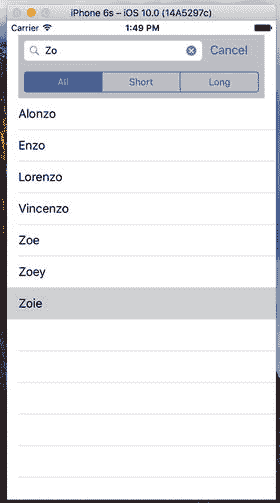

*图 8-37 添加了搜索栏的表格应用程序*

### 视图调试

`UISearchController`类在我们上一个示例中的两个表格之间切换做得很好——好到你可能很难相信这里竟然有切换发生。除了你已经看到的所有代码之外，还有几个视觉线索——搜索表格是普通表格，所以你不会看到像主表格中那样分组的名称。它也没有节索引。如果你想要更多证据，可以使用 Xcode 的一个巧妙功能：视图调试。它允许你拍摄运行中应用程序的视图层级快照，并在 Xcode 编辑器区域中检查它们。此功能在模拟器和真实设备上都可以使用。当你试图找出为什么某个视图似乎缺失或不在预期位置时，你可能会发现它非常有用。

让我们先来看看，当应用程序显示完整名称列表时，视图调试对我们应用程序的呈现。再次运行应用程序，在 Xcode 菜单栏中选择 **Debug** ➤ **View Debugging** ➤ **Capture View Hierarchy**。Xcode 从模拟器或设备中获取视图层级并显示出来，如图 8-38 所示。

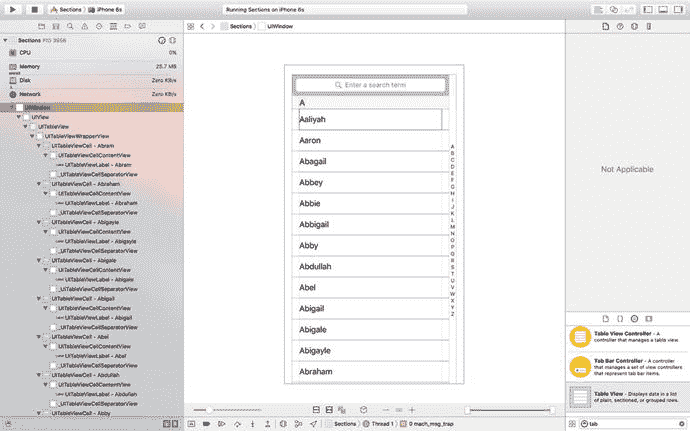

*图 8-38 Sections 应用程序的视图层级*

这看起来可能没什么用——我们看到的并不比在模拟器中多多少。要揭示视图层级，你需要旋转应用程序的图像，以便从侧面观察。为此，在编辑器区域中，在捕获图像左侧附近的位置点击鼠标，然后向右拖动。随着拖动，应用程序中的视图分层将显现出来。如果你旋转大约 45 度，你会看到类似图 8-39 的效果。

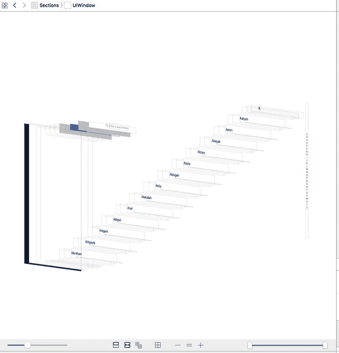

*图 8-39 检查应用程序的视图层级*

如果你点击堆栈中的各个视图，你会看到顶部的跳转栏会发生变化，显示你点击的视图的类名及其所有祖先视图的类名。从后到前依次点击每个视图，以熟悉表格的构建方式。你应该能够找到视图控制器的主视图、表格视图本身、一些表格视图单元格、搜索栏、搜索栏索引，以及作为表格实现一部分的其他各种视图。

现在让我们看看在搜索过程中视图层级是什么样子。Xcode 会暂停你的应用程序以便你检查视图快照，所以首先通过点击 **Debug** ➤ **Continue** 恢复执行。现在开始在应用程序的搜索栏中键入内容，并再次使用 **Debug** ➤ **View Debugging** ➤ **Capture View Hierarchy** 捕获视图层级。当视图层级出现时，稍微旋转一下，你会看到类似于图 8-40 所示的内容。

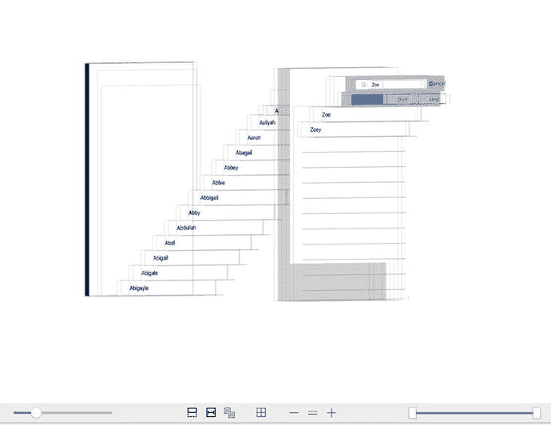

*图 8-40 搜索“Zoe”时的视图层级*

现在非常清楚，确实有两个表格在使用。你可以看到位于视图堆栈底部的原始表格，而在其上方（即右侧），你可以看到属于搜索结果视图控制器的表格视图。就在那后面，有一层半透明的灰色视图覆盖在原始表格上——这是当你开始在搜索栏中键入时使原始表格变暗的视图。

可以稍微尝试一下编辑器区域底部的按钮——你可以使用它们打开或关闭自动布局约束的显示、将视图重置为之前显示的俯视图、以及放大和缩小。你还可以使用左侧的滑块更改视图之间的间距，并使用右侧的滑块移除层级顶部或底部的图层，以便看到它们后面的内容。视图调试是一个非常强大的工具。

## 总结

这一章内容相当丰富，你学到了很多。你应该对平面表格的工作方式有了非常扎实的理解。你应该知道如何自定义表格和表格视图单元格，以及如何配置表格视图。你还了解了如何实现搜索栏，这是任何呈现大量数据的 iOS 应用程序中的关键工具。最后，你遇到了视图调试，这是 Xcode 一个非常有用的功能。请确保你完全理解我们在本章中做的所有事情，因为我们将在其基础上继续构建。

我们将在下一章继续研究表格视图。例如，你将学习如何使用它们来呈现分层数据。你还将看到如何创建内容视图，允许用户编辑在表格视图中选择的数据，以及如何在表格中呈现检查列表、在表格行中嵌入控件和删除行。

