# 9. 向表格视图添加导航控制器

在上一章中，我们学习了使用表格视图的基础知识。在本章中，我们将通过添加导航控制器来更进一步。

表格视图和导航控制器协同工作，但严格来说，导航控制器并不需要表格视图才能运行。然而，在实际应用中，使用导航控制器时，通常至少会包含一个或多个表格，因为导航控制器的强大之处在于它能够轻松处理复杂的分层数据。在 iPhone 的小屏幕上，分层数据最好通过一系列表格视图来呈现。

在本章中，我们将像在第 7 章中构建`Pickers`应用程序一样，逐步构建一个应用程序。当基本的导航控制器和根视图控制器工作正常后，我们将开始向层级中添加更多的控制器和层。我们创建的每个视图控制器都会强化表格使用或配置的某个方面：

*   如何从表格视图向下钻取到子表格视图
*   如何从表格视图向下钻取到内容视图，在其中可以查看甚至编辑详细数据
*   如何在表格视图中使用多个分区
*   如何使用编辑模式允许从表格视图中删除行
*   如何使用编辑模式让用户重新排列表格视图中的行


## 导航控制器基础

构建层级化应用的主要工具 `UINavigationController`，其功能与 `UITabBarController` 类似，都用于管理并切换多个内容视图。两者主要区别在于：`UINavigationController` 的子视图控制器以栈的形式组织，因此非常适合处理层级结构。

如果你有软件开发经验且理解栈的概念，可以跳过下一节或快速浏览。但如果你是栈的新手，请继续阅读。幸运的是，栈是一个很容易理解的概念。

### 栈

栈是一种常用的数据结构，遵循"后进先出"的原则。普通的 Pez 糖果盒（见图 9-1）就是栈的绝佳例子。你试过装填它吗？根据每个 Pez 糖果盒附带的小说明书，只需几个简单步骤：首先，拆开 Pez 糖果包装；其次，将糖果盒头部向后仰以打开它；第三，拿起糖果柱，用食指和拇指紧紧捏住，将其插入打开的糖果盒中。


图 9-1. Pez 糖果盒体现了栈的简单实现

还记得我们说过栈是后进先出吗？这也意味着先进后出。你第一个推入糖果盒的糖果将是最后一个弹出的。你最后一个推入的糖果则是第一个弹出的。计算机中的栈遵循相同规则：

- 向栈中添加对象称为"压入"（push）。你将一个对象压入栈中。
- 压入栈的第一个对象称为栈底。
- 最近压入栈的对象称为栈顶（在它被下一个压入的对象替换之前）。
- 从栈中移除对象称为"弹出"（pop）。当你从栈中弹出一个对象时，它总是最后压入的那个。反之，第一个压入栈的对象将总是最后一个被弹出的。

### 控制器栈

导航控制器维护着一个视图控制器栈。设计控制器时，必须指定用户最先看到的视图。如前所述，该视图的控制器称为根视图控制器（简称根控制器），它成为导航控制器栈的栈底。当用户选择显示新视图时，另一个控制器会被压入栈中，其视图随即出现。我们将这些新视图控制器称为子控制器。在本章的 Fonts 应用中，就包含一个导航控制器和多个子控制器。

在图 9-2 中，请注意导航栏居中显示的标题以及左侧的后退按钮。导航栏的标题会填充导航控制器栈中顶层视图控制器的 `title` 属性，而后退按钮的标题则显示上一个视图控制器的名称。后退按钮的功能类似于网页浏览器的后退按钮。当用户点击该按钮时，当前视图控制器会从栈中弹出，上一个视图变为当前视图。

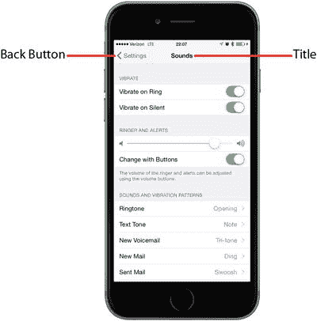

图 9-2. "设置"应用使用了导航控制器。左上角的后退按钮将当前视图控制器从栈中弹出，返回上一层级。同时显示当前内容视图控制器的标题

这种设计模式使我们能够迭代式地构建复杂的层级化应用，无需了解整个结构即可让一切正常运行。每个控制器只需知道其子控制器，这样当用户做出选择时，它就能将相应的新控制器对象压入栈中。通过这种方式，我们可以用许多小块构建大型应用，这正是本章将要实践的内容。

导航控制器是许多 iPhone 应用的核心；然而，对于 iPad 应用，导航控制器的角色则相对次要。Mail 应用就是一个典型例子，它使用层级化导航控制器让用户在各邮件服务器、文件夹和邮件之间导航。在 iPad 版的 Mail 中，导航控制器从不占据全屏，而是以侧边栏或覆盖主视图部分的临时视图形式出现。我们将在第 11 章中探讨这一点。

## 字体：一个简单的字体浏览器

我们将构建的应用展示了与显示层级数据相关的大多数常见任务。应用启动后，会呈现一个包含 iOS 所有字体家族的列表，如图 9-3 所示。字体家族将紧密相关的字体（即彼此风格变体的字体，如 Helvetica、Helvetica-Bold、Helvetica-Oblique 等所有包含在 Helvetica 字体家族中的变体）归为一组。

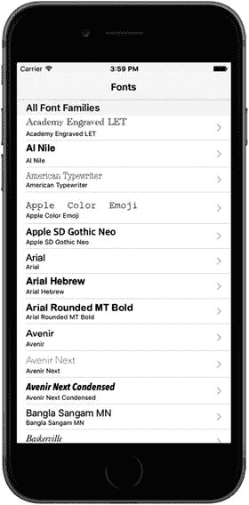

图 9-3. 在我们的项目中，根视图控制器在每行右侧显示辅助图标。这种特定类型的辅助图标称为"展开指示符"，提示用户触摸该行会深入到另一个视图

选择此顶层视图中的任意行，都会将一个新的视图控制器压入导航控制器的栈中。每行最右侧的小图标称为辅助图标。这个特定的辅助图标（灰色箭头）显示一个展开指示符，让用户知道触摸该行会深入到另一个视图。

### 字体应用的子控制器

在正式开始本章项目之前，让我们先了解将要使用的各个子控制器。

#### 字体列表控制器

触摸图 9-3 所示表格中的任意行，都会弹出图 9-4 所示的子视图。

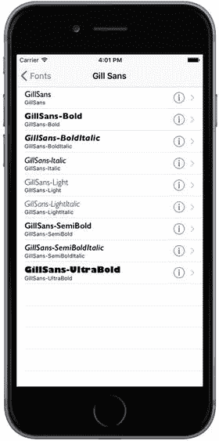

图 9-4. 字体应用的第一个子控制器实现了一个表格，其中每行包含一个详细展开按钮

图 9-4 中每行右侧的辅助图标称为"详细展开"，其功能与我们之前看到的箭头不同。与展开指示符不同，详细展开按钮不仅提供图标，还作为一个用户可以独立点击的控件。这意味着你可以为某一行提供两个不同选项：一个操作在用户选中该行时触发，另一个在用户点击图标时触发。点击此辅助图标内的小信息按钮，应允许用户查看（或许还能编辑）当前行的更详细信息。同时，向右的箭头应提示用户，点击行的其他区域可以找到更深层的导航。

#### 字体大小视图控制器

触摸图 9-4 所示表格中的任意行，都会弹出图 9-5 所示的子视图。

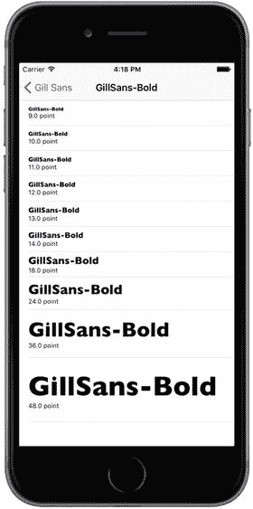

图 9-5. 字体大小视图控制器位于字体列表视图控制器下一层，每行以不同大小显示所选字体


#### 使用披露指示器和详细信息披露按钮

以下是一些何时使用这些按钮的指南：

-   若要为某行点击提供单一选择，如果点击该行只会跳转到更详细的视图，则不要使用附件图标。
-   如果点击某行会跳转到一个列出更多项目（而非详细视图）的新视图，请用披露指示器（右箭头）标记该行。
-   若要为某行提供两个选择，请用详细信息披露指示器或详细信息按钮标记该行。这允许用户点击该行以进入新视图，或点击披露按钮以获取更多详细信息。

#### 字体信息视图控制器

我们的最后一个应用子控制器——也是唯一一个不是表格视图的控制器——会出现在（见图 9-6），当你在图 9-2 所示的字体列表视图控制器中点击任一行的信息图标时。

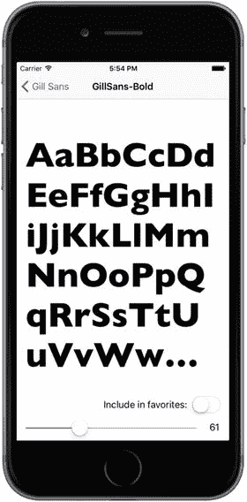

**图 9-6.** 字体应用中的最后一个视图控制器允许你以任意尺寸查看所选字体。

此视图允许用户拖动滑块来调整所显示字体的大小。它还包含一个开关，允许用户指定此字体是否应列入用户的收藏夹。如果有任何字体被设为收藏，它们会出现在根视图控制器的一个单独分组中。

### 字体应用的骨架

Xcode 提供了一个非常合适的模板来创建基于导航的应用，当你需要创建层级应用时，很可能大部分时间都会用到它。不过，我们今天不打算使用那个模板。相反，我们将从头构建我们的基于导航的应用，以便我们了解所有组件是如何组合在一起的。我们还将一步步地构建，这样应该很容易跟上。

在 Xcode 中，按 ⌘⇧N 来创建一个新项目。从 iOS 模板列表中选择“单视图应用”，然后点击“下一步”继续。将产品名称设为 `Fonts`，语言设为 `Swift`，设备选择 `Universal`。确保未勾选“使用 Core Data”，点击“下一步”，并选择保存项目的位置。

#### 设置导航控制器

我们现在将为我们的应用创建基本的导航结构。其核心将是一个 `UINavigationController`，用于管理用户可以在其间导航的视图控制器栈，以及一个显示我们将要展示的顶层列表行的 `UITableViewController`。事实证明，使用 Interface Builder 很容易创建这些。

选择 `Main.storyboard`。该模板已经为我们创建了一个基本的视图控制器，但我们需要改用 `UINavigationController`，因此在编辑器区域或文档大纲中选择该视图控制器，并将其删除，使故事板保持空白。现在，使用对象库搜索 `UINavigationController`，并将一个实例拖入编辑区域。你会看到实际上得到了两个场景，而不是一个，类似于你在第 7 章创建标签视图控制器时看到的情况。左侧是 `UINavigationController` 本身。选择此控制器，打开属性检查器，并在视图控制器部分勾选“初始视图控制器”，使其成为应用启动时显示的控制器。

`UINavigationController` 连接到了第二个场景，其中包含一个 `UITableViewController`。你会看到该表格的标题是 `Root View Controller`。点击文档大纲中的 `Root View Controller` 图标（位于表格视图下方的那一个，不是上方那一个），打开属性检查器，然后将标题设置为 `Fonts`。如果你在故事板中没有看到标题变化，说明你选错了 `Root View Controller` 图标。

通过这种方式设置，我们得到了由导航控制器创建的视图，这是一个组合视图，包含两部分内容：屏幕顶部的导航栏（通常包含某种标题，左侧常有一个某种类型的返回按钮），以及导航控制器当前视图控制器想要显示的内容。在我们的例子中，显示区域的下半部分将由与导航控制器一起创建的表格视图填充。

我们将在后续内容中进一步了解如何控制导航控制器在导航栏中显示的内容。你也会理解导航控制器如何将焦点从一个下级视图控制器转移到另一个。现在，我们已经打下了足够的基础，可以开始定义我们自定义视图控制器将要做的事情了。

至此，应用骨架基本完成。你会看到一个关于为原型表格单元格设置复用标识符的警告，但我们现在可以忽略它。保存所有文件，然后构建并运行应用。如果一切顺利，应用应该会启动，并显示一个标题为 `Fonts` 的导航栏。你尚未给表格视图任何关于显示内容的信息，因此此时不会显示任何行，如图 9-7 所示。

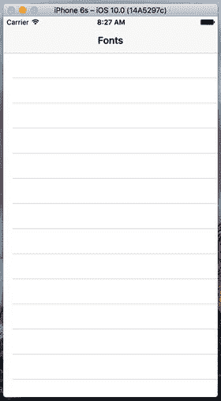

**图 9-7.** 不含任何数据的应用骨架。


## 追踪喜爱的字体

在本应用的几个地方，我们将让用户维护一个喜爱字体列表：允许他们添加所选字体、查看已选字体的完整列表，以及从列表中移除字体。为了以一致的方式管理这个列表，我们将创建一个新类来持有喜爱字体数组，并将其存储在用户对此应用的偏好设置中。你将在第 12 章了解更多关于用户偏好的内容，但这里我们只涉及一些基础知识。

首先创建一个新类。在项目导航栏中选择`Fonts`文件夹，然后按下⌘N 调出新建文件助手。从 iOS Source 部分选择`Swift File`，然后点击 Next。在接下来的界面中，将新文件命名为`FavoritesList.swift`，然后点击 Create。在项目导航栏中选择这个新文件，并添加代码清单 9-1 中所示的内容。

```
import Foundation
import UIKit
class FavoritesList {
static let sharedFavoritesList = FavoritesList()
private(set) var favorites:[String]
init() {
let defaults = UserDefaults.standard
let storedFavorites = defaults.object(forKey: "favorites") as? [String]
favorites = storedFavorites != nil ? storedFavorites! : []
}
func addFavorite(fontName: String) {
if !favorites.contains(fontName) {
favorites.append(fontName)
saveFavorites()
}
}
func removeFavorite(fontName: String) {
if let index = favorites.index(of: fontName) {
favorites.remove(at: index)
saveFavorites()
}
}
private func saveFavorites() {
let defaults = UserDefaults.standard
defaults.set(favorites, forKey: "favorites")
defaults.synchronize()
}
}
代码清单 9-1.
我们的 FavoritesList 类文件
```

在上述代码片段中，我们声明了新类的 API。首先，我们声明了一个名为`sharedFavoritesList`的类属性，它返回该类的一个实例。无论这个方法被调用多少次，总会返回同一个实例。其设计理念是让`FavoritesList`以单例模式工作——我们不使用多个实例，而是在整个应用中只使用一个实例。

接下来，我们声明了一个属性来存放喜爱字体的名称。请密切关注这个数组的定义：

```
private(set) var favorites:[String]
```

`private(set)`限定符意味着该数组可以被类外部的代码读取，但只有类实现中的代码才能修改它。这正是我们想要的，因为我们需要该类的用户能够读取喜爱列表：

```
let favorites = FavoritesList.sharedFavoritesList.favorites  // 读取访问是允许的
```

但我们不希望以下两种操作被允许：

```
FavoritesList.sharedFavoritesList.favorites = []    // 不允许
FavoritesList.sharedFavoritesList.favorites.append("Comic Sans MS")    // 不允许
```

类的初始化方法负责设置`favorites`数组的初始内容：

```
init() {
let defaults = UserDefaults.standard
let storedFavorites = defaults.object(forKey: "favorites") as? [String]
favorites = storedFavorites != nil ? storedFavorites! : []
}
```

稍后你将看到，每当我们向此数组添加或移除内容时，都会将其内容保存到应用的用户默认设置中（第 12 章将详细讨论），以便应用重启后列表内容得以保留。在初始化方法中，我们检查是否有存储的喜爱列表，如果有，则用它来初始化`favorites`属性；如果没有，则直接将其设为空。

其余三个方法处理对`favorites`数组的添加和移除操作。其实现在这里无需过多解释。请注意，前两个方法都调用了`saveFavorites()`，该方法将更新后的值保存到用户默认设置中，使用的键（`favorites`）与初始化方法读取时使用的键相同。你将在第 12 章了解更多关于其工作原理的内容；但现在，只需知道我们在这里使用的`UserDefaults (NSUserDefaults)`对象就像一种持久化的字典，我们放入其中的任何内容，下次查询时都会可用，即使应用已经停止并重启过。

**注意**

在 Xcode 8 中，Apple 使许多以前的 NS- 对象在 Swift 中更易用；例如 `NSUserDefaults` 现在变成了 `UserDefaults`。


### 创建根视图控制器

现在让我们开始开发第一个视图控制器。在上一章中，我们使用简单的字符串数组来填充表格行。这里我们将采用类似的做法，但这次会使用 `UIFont` 类来获取字体家族列表，然后用这些字体家族的名称填充每一行。我们还将使用字体本身来显示字体名称，这样每一行都能包含该字体家族的一个小预览。

是时候为这个应用创建第一个控制器类了。模板为我们创建了一个视图控制器，但其名称 `ViewController` 并不实用，因为这个应用中将包含多个视图控制器。因此，首先在项目导航器中选择 `ViewController.swift`，按 Delete 键将其删除并移入废纸篓。接着，在项目导航器中选择 `Fonts` 文件夹，按 ⌘N 调出新文件助手。在 iOS 来源部分选择 Cocoa Touch Class，然后点击 Next。在下一个界面中，将新类命名为 `RootViewController`，并在子类（Subclass of）中输入 `UITableViewController`。点击 Next，然后点击 Create 创建新类。在项目导航器中，选择 `RootViewController.swift`，并添加以下代码片段中的粗体行，以添加几个属性：

```swift
class RootViewController: UITableViewController {
    private var familyNames: [String]!
    private var cellPointSize: CGFloat!
    private var favoritesList: FavoritesList!
    private static let familyCell = "FamilyName"
    private static let favoritesCell = "Favorites"
}
```

我们将在开始时为前三个属性赋值，然后在该类使用过程中在不同时机调用它们。`familyNames` 数组将包含我们要显示的所有字体家族列表；`cellPointSize` 属性将包含我们希望在所有表格视图单元格中使用的字体大小；`favoritesList` 将包含指向 `FavoritesList` 单例的指针。最后两个是常量，代表该控制器中表格视图单元格的标识符。

通过将如代码清单 9-2 所示的粗体代码添加到 `viewDidLoad()` 中，来设置该类所有属性：

```swift
override func viewDidLoad() {
    super.viewDidLoad()
    familyNames = (UIFont.familyNames() as [String]).sorted()
    let preferredTableViewFont =
        UIFont.preferredFont(forTextStyle: UIFontTextStyleHeadline)
    cellPointSize = preferredTableViewFont.pointSize
    favoritesList = FavoritesList.sharedFavoritesList
    tableView.estimatedRowHeight = cellPointSize
}
```

代码清单 9-2. `RootViewController.swift` 文件中的 `viewDidLoad` 方法

在代码清单 9-2 中，我们通过向 `UIFont` 类查询所有已知字体家族并排序结果数组来填充 `familyNames`。随后再次使用 `UIFont` 获取用于标题的首选字体。这里我们使用了 iOS 7 新增的功能，该功能采用用户可在“设置”应用中配置的字体大小设置。这种动态字体大小允许用户为系统范围的使用设置整体字体缩放比例。在此，我们使用该字体的 `pointSize` 属性来建立一个基准字体大小，该基准将用于此视图控制器的其他部分。最后，我们获取了收藏列表的单例对象，并设置了表格视图的 `estimatedRowHeight` 属性，以大致指示表格行的高度。事实证明，只要设置了此属性，并将表格视图的 `rowHeight` 属性保留为其默认值 `UITableViewAutomaticDimension`，同时使用默认的表格视图单元格（或使用自动布局构建自定义表格视图单元格），表格就会根据单元格内容计算出每个单元格的正确大小。

在继续之前，让我们删除 `didReceiveMemoryWarning()` 方法，以及模板提供的所有表格视图委托或数据源方法——在该类中我们不会使用它们。

此视图控制器的设计思想是显示两个分区。第一个分区是所有可用字体家族的列表，每个家族都链接到该家族所有字体的列表。第二个分区用于收藏，仅包含一个条目，该条目将用户引导至其收藏字体的列表。但是，如果用户没有收藏（例如，首次启动应用时），我们宁愿完全不显示第二个分区，因为它只会将用户导向一个空列表。因此，我们需要在此类的剩余部分中做几件事来应对这种可能性。首先实现此方法，该方法在根视图控制器的视图显示在屏幕之前被调用：

```swift
override func viewWillAppear(_ animated: Bool) {
    super.viewWillAppear(animated)
    tableView.reloadData()
}
```

这样做的原因是，我们显示的内容集合可能在不同视图显示之间发生变化。例如，用户可能初始没有收藏，然后深入探索、查看某个字体并将其设为收藏，之后再返回根视图。此时，我们需要重新加载表格视图，以便第二个分区能够显示出来。

接下来，我们将实现一个在该类内部使用的实用方法。在通过数据源方法配置表格视图的几个环节中，我们需要能够确定要在单元格中显示哪个字体。我们将此功能放入一个独立的方法中，如代码清单 9-3 所示。

```swift
func fontForDisplay(atIndexPath indexPath: NSIndexPath) -> UIFont? {
    if indexPath.section == 0 {
        let familyName = familyNames[indexPath.row]
        let fontName = UIFont.fontNames(forFamilyName: familyName).first
        return fontName != nil ?
            UIFont(name: fontName!, size: cellPointSize) : nil
    } else {
        return nil
    }
}
```

代码清单 9-3. 确定要显示的字体

此方法使用 `UIFont` 类查找指定字体家族的所有字体名称，然后获取该家族中的第一个字体名称。我们并不确定家族中第一个命名的字体是否最能代表整个家族，但这与其他猜测同样合理。如果该家族没有字体名称，则返回 `nil`。

现在，让我们进入该视图控制器的核心代码：表格视图数据源方法。首先，来看分区的数量：

```swift
override func numberOfSections(in tableView: UITableView) -> Int {
    return favoritesList.favorites.isEmpty ? 1 : 2
}
```

我们根据收藏列表来决定是否显示第二个分区。接下来，处理每个分区中的行数：

```swift
override func tableView(_ tableView: UITableView, numberOfRowsInSection section: Int) -> Int {
    // 返回分区中的行数。
    return section == 0 ? familyNames.count : 1
}
```

这也非常简单。我们只需根据分区编号来确定该分区是显示所有字体家族，还是显示一个指向收藏列表的链接单元格。现在我们再定义另一个方法，这是 `UITableViewDataSource` 协议中的一个可选方法，用于指定每个分区的标题：

```swift
override func tableView(_ tableView: UITableView, titleForHeaderInSection section: Int) -> String? {
    return section == 0 ? "所有字体家族" : "我的收藏字体"
}
```

这同样是一个直接的方法。它根据分区编号来确定使用哪个标题。每个表格视图数据源都必须实现的最后一个核心方法是配置每个单元格的方法，我们的实现如代码清单 9-4 所示。


```swift
override func tableView(_ tableView: UITableView, cellForRowAt indexPath: IndexPath) -> UITableViewCell {
    if indexPath.section == 0 {
        // 字体名称列表
        let cell = tableView.dequeueReusableCell(withIdentifier: RootViewController.familyCell, for: indexPath)
        cell.textLabel?.font = fontForDisplay(atIndexPath: indexPath)
        cell.textLabel?.text = familyNames[indexPath.row]
        cell.detailTextLabel?.text = familyNames[indexPath.row]
        return cell
    } else {
        // 收藏列表
        return tableView.dequeueReusableCell(withIdentifier: RootViewController.favoritesCell, for: indexPath)
    }
}
```

**列表 9-4.** `cellForRow(atIndexPath:)` 函数

创建这个类时，我们定义了两个不同的单元格标识符，用于从故事板加载两种不同的单元格原型（就像第 8 章中从 nib 文件加载表格单元格一样）。我们还没有配置这些单元格原型，但很快就会配置。接下来，我们使用分区编号来决定当前 `indexPath` 应显示哪个单元格。如果单元格用于显示字体系列名称，则将系列名称同时放入 `textLabel` 和 `detailTextLabel`。我们还使用该系列中的一种字体（来自之前添加的 `fontForDisplay(atIndexPath:)` 方法返回的字体）设置在文本标签中，这样字体系列名称会以字体本身显示，同时用标准系统字体显示较小的版本。

### 初始故事板设置

现在我们已经有一个应该能显示内容的视图控制器，接下来配置故事板使其生效。在项目导航器中选择 `Main.storyboard`。你会看到之前添加的导航控制器和表格视图控制器。首先需要配置的是表格视图控制器。默认情况下，控制器的类设置为 `UITableViewController`。我们需要将其改为根视图控制器类。在文档大纲的字体场景中，选择标有“字体”的黄色图标，然后使用身份检查器将视图控制器的类改为 `RootViewController`。

现在需要做的其他配置是设置一对原型单元格，使其与代码中使用的单元格标识符匹配。起初，表格视图只有一个原型单元格。选中它并按 ⌘D 复制，你会看到现在有两个单元格。选择第一个，然后使用属性检查器将其样式设置为副标题（Subtitle），标识符设置为 `FamilyName`，辅助功能设置为披露指示器（Disclosure Indicator）。接下来，选择第二个原型单元格，将其样式设置为基本（Basic），标识符设置为 `Favorites`，辅助功能设置为披露指示器。另外，双击单元格中显示的标题，将文本从“标题”改为“收藏”。

**提示：** 本示例中使用的原型单元格都是标准表格视图单元格样式。如果将样式设置为自定义（Custom），可以直接在单元格原型中设计单元格布局，就像第 8 章在 nib 文件中创建单元格时那样。

现在构建并运行这个应用，你应该会看到一个漂亮的字体列表。稍微滚动一下，你会发现并非所有字体生成的文本高度都相同，如图 9-8 所示。所有单元格的高度都足够容纳其内容。如果你忘记为什么这样会起作用，请回顾本节前面我们添加到 `viewDidLoad()` 方法中的代码讨论。

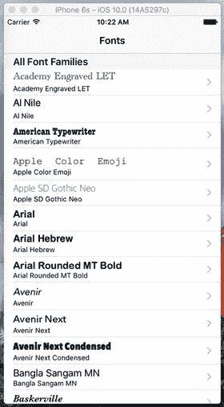

**图 9-8.** 根视图控制器显示已安装的字体系列

### 第一个子控制器：字体列表视图

我们的应用目前只显示字体系列列表，没有更多功能。我们希望用户能够点击某个字体系列，查看其中包含的所有字体。因此，让我们创建一个新的视图控制器来管理字体列表。创建一个名为 `FontListViewController` 的新 Cocoa Touch 类，作为 `UITableViewController` 的子类。在项目导航器中，选择 `FontListViewController.swift`，并添加以下属性：

```swift
class FontListViewController: UITableViewController {
    var fontNames: [String] = []
    var showsFavorites: Bool = false
    private var cellPointSize: CGFloat!
    private static let cellIdentifier = "FontName"
}
```

`fontNames` 属性用于告诉此视图控制器要显示什么内容。我们还创建了一个 `showsFavorites` 属性，用于让此视图控制器知道它是否在显示收藏列表（而不是仅显示某个系列中的字体列表），这在后面会用到。我们将使用 `cellPointSize` 属性来保存显示每种字体的首选显示尺寸，再次使用 `UIFont` 来查找首选尺寸。最后，`cellIdentifier` 是该控制器中表格视图单元格使用的标识符。

要初始化 `cellPointSize` 属性并设置表格视图的估算行高，请将列表 9-5 中的代码添加到 `viewDidLoad()` 方法中。

```swift
override func viewDidLoad() {
    super.viewDidLoad()
    let preferredTableViewFont = UIFont.preferredFont(forTextStyle: UIFontTextStyleHeadline)
    cellPointSize = preferredTableViewFont.pointSize
    tableView.estimatedRowHeight = cellPointSize
}
```

**列表 9-5.** `FontListViewController.swift` 的 `viewDidLoad` 方法

接下来我们要做的是创建一个小的实用方法，用于选择每行要显示的字体，类似于 `RootViewController` 中的方法。不过这里有点不同。在这个视图控制器中，我们不是保存字体系列列表，而是在 `fontNames` 属性中保存字体名称列表。我们将使用 `UIFont` 类来获取每种命名字体，如下所示：

```swift
func fontForDisplay(atIndexPath indexPath: NSIndexPath) -> UIFont {
    let fontName = fontNames[indexPath.row]
    return UIFont(name: fontName, size: cellPointSize)!
}
```

现在该以 `viewWillAppear()` 实现的形式进行一个小补充了。在 `RootViewController` 中，我们实现了这个方法，以防收藏列表发生变化需要刷新。这里同样适用。这个视图控制器可能正在显示收藏列表，用户可能会切换到另一个视图控制器，更改收藏项（我们稍后会实现），然后返回这里。此时我们需要重新加载表格视图，这个方法的代码实现了这一功能，如列表 9-6 所示。

```swift
override func viewWillAppear(_ animated: Bool) {
    super.viewWillAppear(animated)
    if showsFavorites {
        fontNames = FavoritesList.sharedFavoritesList.favorites
        tableView.reloadData()
    }
}
```

**列表 9-6.** 在内容可能变化时刷新视图

基本思路是：在正常操作中，此视图控制器在显示之前会接收到一个字体名称列表，并且在该视图控制器存在的整个过程中，该列表保持不变。在一种特定情况下（我们稍后会看到），此视图控制器需要重新加载其字体列表。

继续往下，我们可以完全删除 `numberOfSectionsInTableView()` 方法。这里我们只有一个分区，省略该方法就相当于实现它并返回 1。接下来，我们实现另外两个主要的数据源方法，如列表 9-7 所示。


```swift
override func tableView(_ tableView: UITableView, numberOfRowsInSection section: Int) -> Int {
    // 返回该分区中的行数。
    return fontNames.count
}
override func tableView(_ tableView: UITableView, cellForRowAt indexPath: IndexPath) -> UITableViewCell {
    let cell =  tableView.dequeueReusableCell(
        withIdentifier: FontListViewController.cellIdentifier,
        for: indexPath)
    cell.textLabel?.font = fontForDisplay(atIndexPath: indexPath)
    cell.textLabel?.text = fontNames[indexPath.row]
    cell.detailTextLabel?.text = fontNames[indexPath.row]
    return cell
}
```

代码清单 9-7：我们的数据源方法

这两个方法实际上都不需要任何解释，因为它们与我们在`RootViewController`中使用的方法类似，但甚至更简单。

稍后我们将为该类添加更多内容，但首先我们想看看它的实际效果。为此，我们需要进一步配置故事板，然后对`RootViewController`进行一些修改。切换到`Main.storyboard`开始操作。

## 创建字体列表故事板

当前故事板包含一个表视图控制器，用于显示字体家族列表，该控制器嵌入在导航控制器内。我们需要增加一层新的层级，以融入用于显示给定家族字体的视图控制器。在对象库中找到**表视图控制器**，将其拖出一个到编辑区域中，位于现有表视图控制器的右侧。选中新的表视图控制器，并使用标识检查器将其类设置为`FontListViewController`。选中表格中的原型单元格，打开属性检查器进行一些调整。将其样式改为副标题，标识符改为`FontName`，附件改为详细信息展开。使用详细信息展开附件将使该类型的行能够响应两种点击，从而用户可以根据点击附件还是行的其他部分来触发两种不同的操作。

要让一个视图控制器中的用户操作实例化并显示另一个视图控制器，一种方法是创建连接两者的**segue**。这对很多人来说可能是个陌生的词，所以我们先来解释一下：segue 本质上意味着“过渡”。它有时被作家和电影制作人用来描述从一个段落或场景平滑过渡到下一个。苹果本可以直截了当地称之为过渡；但由于这个词在 UIKit API 中其他地方已经出现，也许苹果决定使用一个不同的术语以避免混淆。这里我还应当提一下，“segue”这个词的发音与赛格威个人交通工具产品的名称完全相同（现在你知道为什么赛格威叫这个名字了）。

通常，segue 完全在 Interface Builder 中创建。其思路是，一个场景中的某个动作可以触发一个 segue 来加载并显示另一个场景。如果你使用导航控制器，segue 可以自动将下一个控制器推送到导航堆栈上。我们将立即在我们的应用程序中使用这个功能。

为了让根视图控制器中的单元格能够显示字体列表视图控制器，你需要创建几个连接这两个场景的 segue。只需从字体场景中两个原型单元格中的第一个开始，按住 Control 键拖动到新场景即可完成；当你拖动到新场景上方时，整个场景会高亮显示，表示它已准备好连接，如图 9-9 所示。

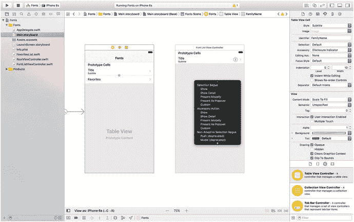

图 9-9. 从字体列表控制器到字体名称控制器创建一个显示 segue

松开鼠标按钮，在弹出的菜单中的“选择 Segue”部分选择“显示”。现在对另一个原型单元格执行相同操作。创建这些 segue 意味着，一旦用户点击这些单元格中的任何一个，连接另一端的视图控制器就会被分配并准备就绪。

### 让根视图控制器为 Segue 做好准备

保存你的更改并切换回`RootViewController.swift`。注意，我们讨论的不是最新的类`FontListViewController`，而是它的“父”控制器。你需要在这里通过准备新的`FontListViewController`（由你刚刚创建的某个 segue 指定）进行显示，并向其传递需要显示的值，来响应用户在根表视图中的触摸操作。

实际准备新视图控制器的工作是通过`prepareForSegue(_:sender:)`方法完成的。添加该方法的实现，如代码清单 9-8 所示。

```swift
// MARK: - 导航
override func prepare(for segue: UIStoryboardSegue, sender: AnyObject?) {
    // 使用 [segue destinationViewController] 获取新视图控制器。
    // 将选中的对象传递给新视图控制器。
    let indexPath = tableView.indexPath(for: sender as! UITableViewCell)!
    let listVC = segue.destinationViewController as! FontListViewController
    if indexPath.section == 0 {
        // 字体名称列表
        let familyName = familyNames[indexPath.row]
        listVC.fontNames = (UIFont.fontNames(forFamilyName: familyName) as [String]).sorted()
        listVC.navigationItem.title = familyName
        listVC.showsFavorites = false
    } else {
        // 收藏列表
        listVC.fontNames = favoritesList.favorites
        listVC.navigationItem.title = "收藏"
        listVC.showsFavorites = true
    }
}
```

代码清单 9-8：准备显示新视图控制器

该方法使用`sender`（被点击的`UITableViewCell`）来确定点击的是哪一行，并向 segue 请求其`destinationViewController`，即即将显示的`FontListViewController`实例。然后我们根据用户点击的是字体家族（分区 0）还是收藏单元格（分区 1），向新视图控制器传递一些值。除了设置目标视图控制器的自定义属性外，我们还访问控制器的`navigationItem`属性来设置其标题。`navigationItem`属性是`UINavigationItem`的一个实例，这是一个 UIKit 类，包含有关任何给定视图控制器应在导航栏中显示什么内容的信息。

现在运行应用程序。你会看到，点击任何字体家族的名称都会显示其包含的所有单个字体列表（见图 9-10）。此外，你可以点击字体列表导航控制器标题中的“字体”标签，返回到其父控制器以选择其他字体。

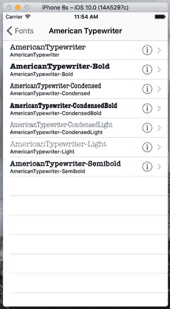

图 9-10. 显示字体家族中包含的单个字体


## 创建字体大小视图控制器

然而，你会发现目前应用程序无法让你进一步操作。图 9-4 和图 9-5 展示了额外的屏幕，让你能够以多种方式查看所选字体；目前我们尚未实现这些功能。但很快，我们就能做到了！让我们创建图 9-4 所示的视图，该视图可以同时显示多种字体大小。使用与创建 `FontListViewController` 相同的步骤，添加一个继承自 `UITableViewController` 的新视图控制器，并将其命名为 `FontSizesViewController`。该类从其父控制器所需获取的唯一参数是一个字体。我们还需要几个私有属性。

首先，切换到 `FontSizesViewController.swift`，然后删除 `didReceiveMemoryWarning` 和 `numberOfSectionsInTableView:` 方法，以及底部所有被注释掉的方法。重申一遍，你不需要这些方法。现在，在类定义的顶部添加以下属性：

```
import UIKit
class FontSizesViewController: UITableViewController {
var font: UIFont!
private static let pointSizes: [CGFloat] = [
9, 10, 11, 12, 13, 14, 18, 24, 36, 48, 64, 72, 96, 144
]
private static let cellIdentifier = "FontNameAndSize"
```

`font` 属性将由 `FontListViewController` 在将此视图控制器推送到导航控制器堆栈之前进行设置。`pointSizes` 属性是一个字体点大小的数组，字体将按这些大小显示。我们还需要以下实用方法，该方法根据表格行索引获取指定大小的字体版本：

```
func fontForDisplay(atIndexPath indexPath: NSIndexPath) -> UIFont {
let pointSize = FontSizesViewController.pointSizes[indexPath.row]
return font.withSize(pointSize)
}
```

我们还需要设置表格视图的 `estimatedRowHeight` 属性，以便表格根据每一行的内容自动计算正确的行高。为此，请在 `viewDidLoad()` 方法中添加以下行：

```
tableView.estimatedRowHeight = FontSizesViewController.pointSizes[0]
```

实际上，我们给这个属性赋什么值并不重要，因此我们任意选择了表格需要显示的最小字体点大小。

对于此视图控制器，我们将跳过允许我们指定要显示的分区数量的方法，因为我们打算只使用默认数量（1）。但是，我们必须实现用于指定行数和每个单元格内容的方法。这两个方法如代码清单 9-9 所示。

```
// MARK: - 表格视图数据源
override func tableView(_ tableView: UITableView, numberOfRowsInSection section: Int) -> Int {
return FontSizesViewController.pointSizes.count
}
override func tableView(_ tableView: UITableView, cellForRowAt indexPath: IndexPath) -> UITableViewCell {
let cell = tableView.dequeueReusableCell(
withIdentifier: FontSizesViewController.cellIdentifier,
for: indexPath)
cell.textLabel?.font = fontForDisplay(atIndexPath: indexPath)
cell.textLabel?.text = font.fontName
cell.detailTextLabel?.text =
"\(FontSizesViewController.pointSizes[indexPath.row]) 点"
return cell
}
代码清单 9-9.
FontSizeViewController 表格视图的 dataSource 方法
```

这些方法中没有任何我们之前没见过的东西，所以让我们继续设置用户界面的 Storyboard。

### 创建字体大小视图控制器的 Storyboard

回到 `Main.storyboard`，将另一个表格视图控制器拖入编辑区域。使用身份检查器将其类设置为 `FontSizesViewController`。你需要从其父控制器 `FontListViewController` 建立 segue 连接。因此，找到该控制器，按住 Control 键并从其原型单元格拖动到最新的视图控制器，然后在出现的弹出菜单的“选择 Segue”部分中选择“显示”。接下来，选择你刚刚添加的新场景中的原型单元格，然后使用属性检查器将其样式设置为“副标题”，并将其标识符设置为 `FontNameAndSize`。

### 实现字体大小视图控制器的 Prepare for Segue

现在，就像上次我们扩展 Storyboard 的导航层次结构一样，我们需要跳转到父控制器，以便它能够配置其子控制器。这意味着我们需要转到 `FontListViewController.swift` 并实现 `prepareForSegue(_:sender:)` 方法，如代码清单 9-10 所示。

```
// MARK: - 导航
override func prepare(for segue: UIStoryboardSegue, sender: AnyObject?) {
// 使用 [segue destinationViewController] 获取新的视图控制器。
// 将选中的对象传递给新的视图控制器。
let tableViewCell = sender as! UITableViewCell
let indexPath = tableView.indexPath(for: tableViewCell)!
let font = fontForDisplay(atIndexPath: indexPath)
let sizesVC =  segue.destinationViewController as! FontSizesViewController
sizesVC.title = font.fontName
sizesVC.font = font
}
代码清单 9-10.
FontListViewsController 的 preparedForSeque 方法
```

这些代码现在看起来可能相当熟悉，所以我们不再赘述。

运行应用程序，选择一个字体族，然后选择一个字体（通过点击任意行，但不要点击右侧的附件按钮），你现在将看到图 9-11 所示的多尺寸列表。

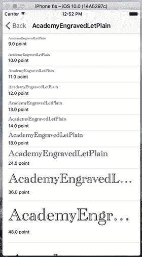

图 9-11. 我们的多尺寸表格视图列表


### 创建字体信息视图控制器

我们即将创建的最后一个视图控制器如图 9-5 所示。它不是基于表格视图的，而是包含一个大的文本标签、一个用于设置字体大小的滑块，以及一个用于切换是否将当前使用的字体加入收藏列表的开关。在项目中以 `UIViewController` 为父类创建一个新的 Cocoa Touch 类，并将其命名为 `FontInfoViewController`。与本应用中大多数其他控制器一样，该控制器也需要由父控制器传入几个参数。通过在 `FontInfoViewController.swift` 中定义以下属性和四个输出口（用于构建用户界面）来实现这一点：

```
class FontInfoViewController: UIViewController {
    var font: UIFont!
    var favorite: Bool = false
    @IBOutlet weak var fontSampleLabel: UILabel!
    @IBOutlet weak var fontSizeSlider: UISlider!
    @IBOutlet weak var fontSizeLabel: UILabel!
    @IBOutlet weak var favoriteSwitch: UISwitch!
```

接下来，实现 `viewDidLoad()` 方法以及两个分别由滑块和开关触发的操作方法，如列表 9-10 所示。

```
override func viewDidLoad() {
    super.viewDidLoad()
    // 在此处进行加载后的其他设置。
    fontSampleLabel.font = font
    fontSampleLabel.text =
        "AaBbCcDdEeFfGgHhIiJjKkLlMmNnOoPpQqRrSsTtUuVv"
        + "WwXxYyZz 0123456789"
    fontSizeSlider.value = Float(font.pointSize)
    fontSizeLabel.text = "\(Int(font.pointSize))"
    favoriteSwitch.isOn = favorite
}

@IBAction func slideFontSize(slider: UISlider) {
    let newSize = roundf(slider.value)
    fontSampleLabel.font = font.withSize(CGFloat(newSize))
    fontSizeLabel.text = "\(Int(newSize))"
}

@IBAction func toggleFavorite(sender: UISwitch) {
    let favoritesList = FavoritesList.sharedFavoritesList
    if sender.isOn {
        favoritesList.addFavorite(fontName: font.fontName)
    } else {
        preferencesList.removeFavorite(fontName: font.fontName)
    }
}
```

列表 9-10. 我们的 `viewDidLoad()`、`slider` 和 `switch` 方法

这些方法都非常直观。`viewDidLoad()` 方法根据所选字体设置显示内容；`slideFontSize()` 根据滑块的值更改 `fontSampleLabel` 标签中的字体大小；`toggleFavorite()` 则根据开关的值将当前字体添加到收藏列表或从中移除。

### 创建字体信息视图控制器的故事板

现在回到 `Main.storyboard`，为本应用的最后一个视图控制器构建图形用户界面。使用对象库找到一个普通的视图控制器，将其拖入编辑区域，然后使用身份检查器将其类设置为 `FontInfoViewController`。接着，使用对象库找到更多对象并将其拖入新场景中。你需要三个标签、一个开关和一个滑块。粗略地将它们排列好，如图 9-12 所示。暂时不必添加自动布局约束——我们稍后再做。

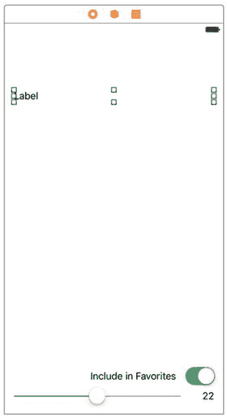

图 9-12. 标签、开关和滑块布局

请注意，我们在上方标签之上留出了一些空间，因为最终那里会有一个导航栏。同时，我们希望上方标签能够跨多行显示长文本，但默认情况下标签只显示一行。要更改此设置，请选中该标签，打开属性检查器，将“行数”字段的值设置为 0。

图 9-12 还显示了下方的两个标签中更改后的文本。请自行进行相同的更改。这里看不到的是，我们使用了属性检查器将这两个标签的文本设置为右对齐。你也应该这样做，因为它们都有布局约束，本质上会将它们固定在右侧边缘。另外，选中底部的滑块，然后使用属性检查器将其最小值设置为 1，最大值设置为 200。

现在需要连接此图形用户界面的所有连线。首先选中视图控制器并打开连接检查器。当需要建立这么多连接时，该检查器提供的概览非常方便。通过将 `favoriteSwitch`、`fontSampleLabel`、`fontSizeLabel` 和 `fontSizeSlider` 旁边的小圆圈拖拽到场景中相应的对象上，为每个输出口建立连接。为了避免混淆，`fontSampleLabel` 应连接到顶部的标签，`fontSizeLabel` 连接到右下角的标签，而 `favoriteSwitch` 和 `fontSizeSlider` 输出口则连接到它们唯一可去的地方。要连接操作方法与控件，可以继续使用连接检查器。在视图控制器的连接检查器的“已接收操作”部分，将 `slideFontSize:` 旁边的小圆圈拖拽到滑块上，松开鼠标按钮，然后在弹出的上下文菜单中选择“值已更改”。接下来，将 `toggleFavorite:` 旁边的小圆圈拖拽到开关上，同样选择“值已更改”。连接完成后的状态应如图 9-13 所示。

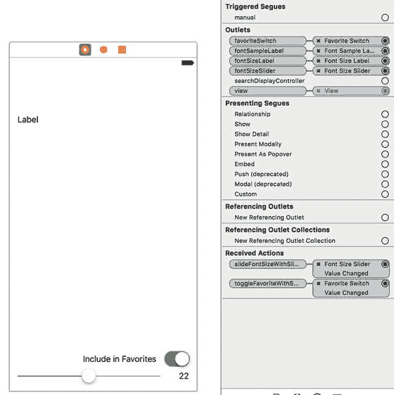

图 9-13. 字体信息视图控制器故事板的完整连线

这里还需要做一件事，就是创建一个转场，以便这个视图能够显示。请记住，当字体列表视图控制器显示时，用户点击详细信息附件（圆圈中的蓝色小“i”图标）就会显示此视图。因此，找到该控制器，按住 Control 键从其原型单元格拖拽到你正在编辑的新字体信息视图控制器上，并在弹出的上下文菜单的“附件操作”部分选择“显示”。注意，我们刚才说的是“附件操作”，而不是“选择转场”（见图 9-14）。附件操作是用户在点击详细信息附件时触发的转场，而选择转场则是点击行内其他任意位置时触发的转场。我们之前已经将该单元格的选择转场设置为打开 `FontSizesViewController`。

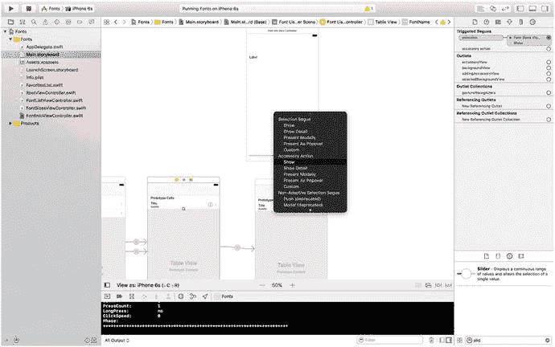

图 9-14. 设置附件操作显示转场

现在，通过点击行的不同部分可以触发两个不同的转场。由于这两个转场会呈现具有不同属性的不同视图控制器，我们需要一种方法来区分它们。幸运的是，代表转场的 `UIStoryboardSegue` 类提供了一种实现方法：我们可以像处理表格视图单元格一样使用标识符。

你只需在编辑区域中选中一个转场，然后使用属性检查器设置其标识符。你可能需要稍微移动一下场景，以便能够看到从字体列表视图控制器右侧蜿蜒伸出的两个转场。选中指向字体大小视图控制器的那个转场，并将其标识符设置为 `ShowFontSizes`。接着，选中指向字体信息视图控制器的那个转场，并将其标识符设置为 `ShowFontInfo`，如图 9-15 所示。

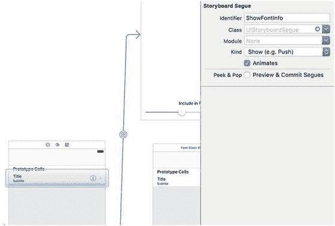

图 9-15. 标识转场


#### 设置约束

通过设置转场，Interface Builder 就能让我们的新场景像其他场景一样在导航控制器的上下文中使用，因此它会自动在顶部获得一个空白导航栏。现在视图的实际边界已就位，是时候设置约束了。这是一个相当复杂的视图，包含多个子视图，特别是靠近底部的位置，因此我们不能完全依赖系统的自动约束来为我们做正确的事情。我们将使用编辑区域底部的 `Pin` 按钮及其触发的弹出窗口来构建所需的大部分约束。

从最顶部的标签开始。如果你把它放得太靠近顶部，先将其向下拖动，直到与导航栏保持舒适的距离。点击 `Pin`，然后在弹出窗口中，选择小方块上方、左侧和右侧的红色条——但不要选择下方的。现在点击底部的 **添加 3 个约束** 按钮。

接下来，选择底部的滑块并点击 `Pin` 按钮。这次，选择小方块下方、左侧和右侧的红色条——但不要选择上方的。再次点击 **添加 3 个约束** 来放置它们。

对于剩余的两个标签和开关，请遵循以下步骤：选择对象，点击 `Pin`，选择小方块下方和右侧的红色条，勾选 **宽度** 和 **高度** 复选框，最后点击 **添加 4 个约束**。为这三个对象设置这些约束会将它们绑定到右下角。

只需再设置一个约束。我们希望顶部的标签能够扩展以容纳其文本，但绝不要扩展到与底部视图重叠的程度。我们可以通过一个约束来实现这一点。按住 Control 键从顶部标签拖拽到 **添加到收藏** 标签，松开鼠标，然后从出现的上下文菜单中选择 **垂直间距**。接下来，点击新约束以选中它（这是一条连接两个标签的蓝色垂直条），然后打开 **属性检查器**，你将看到该约束的一些可配置属性。将 **关系** 弹出菜单更改为 **大于或等于**，然后将 **常量** 值设置为 `10`。这确保了扩展的顶部标签不会推过底部的其他视图。

### 适应多个转场的字体列表视图控制器

现在回到咱们的老朋友 `FontListViewController.swift`。由于这个类现在能够触发到两个不同子视图控制器的转场，你需要调整 `prepareForSegue(_:sender:)` 方法，如代码清单 9-11 所示。

```
// MARK: - 导航
override func prepare(for segue: UIStoryboardSegue, sender: AnyObject?) {
    // 使用 [segue destinationViewController] 获取新视图控制器。
    // 将选中的对象传递给新视图控制器。
    let tableViewCell = sender as! UITableViewCell
    let indexPath = tableView.indexPath(for: tableViewCell)!
    let font = fontForDisplay(atIndexPath: indexPath)
    if segue.identifier == "ShowFontSizes" {
        let sizesVC = segue.destinationViewController as! FontSizesViewController
        sizesVC.title = font.fontName
        sizesVC.font = font
    } else {
        let infoVC = segue.destinationViewController as! FontInfoViewController
        infoVC.title = font.fontName
        infoVC.font = font
        infoVC.favorite = FavoritesList.sharedFavoritesList.favorites.contains(font.fontName)
    }
}
```

**代码清单 9-11.** 处理多个转场

构建并运行应用程序，看看效果如何。选择一个包含多种字体的字体族（例如 Gill Sans），然后点击任意一行字体的中间部分。你将看到之前见过的同一个列表，它以多种尺寸显示该字体。按下左上角的导航按钮（标记为 Gill Sans）返回，然后点击另一行；不过，这次要点击右侧显示详细附件的位置。这将调出最终的视图控制器，它显示该字体的一个示例，底部有一个滑块，可以让你选择任意大小。

此外，你现在可以使用 **添加到收藏** 开关将此字体标记为收藏。完成此操作后，点击左上角的导航按钮几次，返回根控制器视图。

### 我最喜欢的字体

滚动到根视图控制器的底部，你会看到一些新内容：**我最喜欢的字体** 部分现在出现了。选择它，你会看到目前为止已选中的所有收藏字体列表，如图 9-16 所示。

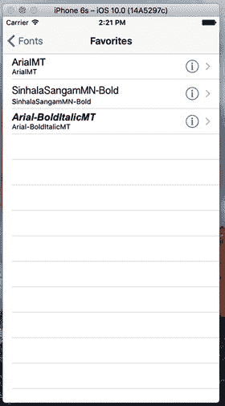

**图 9-16.** 目前为止选中的收藏字体列表

### 添加功能

现在我们的应用基本功能已经完成。但在真正收工之前，我们还需要实现几个功能。如果你使用 iOS 已经有一段时间了，你应该知道可以通过从右向左滑动来删除表格视图中的一行。例如，在邮件应用中，你可以使用此技术删除邮件列表中的一条消息。执行此手势会在表格视图行内部显示一个小型 GUI。这个 GUI 会要求你确认删除，然后该行消失，剩余的行向上滑动以填补空白。整个交互过程——包括处理滑动、显示确认 GUI 以及为任何受影响的行添加动画——都由表格视图本身处理。你只需要在控制器中实现两个方法即可实现。

此外，表格视图还提供了易于使用的功能，允许用户通过上下拖拽来重新排序表格视图中的行。与滑动删除一样，表格视图为我们处理了所有的用户交互。我们只需要一行设置代码（用于创建一个激活重新排序 GUI 的按钮），然后实现一个在用户完成拖拽时调用的方法即可。


### 实现滑动删除

在本应用中，`FontListViewController` 类是此功能应被应用的典型示例。每当应用显示收藏列表时，我们应该让用户通过滑动来删除一个收藏项，从而省去他们点击详情附件然后关闭开关的步骤。在 Xcode 中选择 `FontListViewController.swift` 开始操作。首先，添加 `tableView(_:canEditRowAt: indexPath:)` 方法的实现：

```
override func tableView(_ tableView: UITableView, canEditRowAt indexPath: IndexPath) -> Bool {
return showsFavorites
}
```

当显示收藏列表时，该方法将返回 `true`，否则返回 `false`。这意味着允许你删除行的编辑功能仅在显示收藏时启用。如果你尝试仅凭此更改运行应用并删除行，你将看不到任何区别。表格视图不会处理滑动手势，因为它检测到我们还没有实现完成删除所需的另一个方法。所以，我们也把它添加上。如表单 9-12 所示，为 `tableView(_:commitEditingStyle:forRowAtIndexPath:)` 方法添加实现。

```
override func tableView(_ tableView: UITableView, commit editingStyle: UITableViewCellEditingStyle, forRowAt indexPath: IndexPath) {
if !showsFavorites {
return
}
if editingStyle == UITableViewCellEditingStyle.delete {
// 从数据源中删除行
let favorite = fontNames[indexPath.row]
FavoritesList.sharedFavoritesList.removeFavorite(fontName: favorite)
fontNames = FavoritesList.sharedFavoritesList.favorites
tableView.deleteRows(at: [indexPath],
with: UITableViewRowAnimation.fade)
}
}
表单 9-12.
允许从我们的收藏列表中删除行
```

当表格中的编辑操作完成时，会调用此方法。它相当直接，但有一些微妙的细节。我们做的第一件事是检查确保正在显示收藏列表，如果不是，就直接退出。通常，这不应发生，因为我们在前面的方法中指定只有收藏列表是可编辑的。尽管如此，我们在这里做了一点防御性编程。之后，我们检查编辑样式，以确保我们要完成的特定编辑操作确实是删除。在表格视图中可以进行插入编辑，但如果没有我们这里没有做的额外设置，则无法实现，所以我们不需要担心这种情况。接下来，我们确定应删除哪个字体，将其从 `FavoritesList` 单例中移除，并更新本地的收藏列表副本。

最后，我们告诉表格视图删除该行，并通过视觉上的淡出动画使其消失。理解当你告诉表格视图删除一行时会发生什么很重要。直觉上，你可能会认为调用该方法会删除一些数据，但事实并非如此。实际上，我们已经删除了数据！这最后一个方法调用实际上是我们告诉表格视图的方式：“嘿，我已经做了更改，我希望你以动画方式移除这一行。如果你还需要什么，就来问我。” 当这种情况发生时，表格视图将通过向上移动被删除行下方的任何行来开始播放动画，这意味着一个或多个之前屏幕外的行现在将进入屏幕，此时它确实会通过常规方法向控制器请求单元格数据。因此，重要的是，我们在 `tableView(_:commitEditingStyle:forRowAtIndexPath:)` 方法的实现中，必须在告诉表格视图删除行之前，对数据模型（本例中为 `FavoritesList` 单例）进行必要的更改。

再次构建并运行应用，确保你设置了一些收藏字体，然后进入收藏列表，通过从右向左滑动来删除一行。该行会部分滑出屏幕，右侧会出现一个“删除”按钮（见图 9-17）。点击“删除”按钮，该行就会消失。

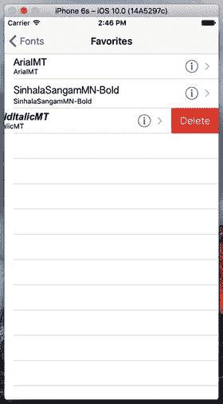

图 9-17. 显示“删除”按钮的收藏字体行

### 实现拖拽重新排序

我们要添加到字体列表的最后一个功能，是让用户只需上下拖拽即可重新排列他们的收藏。为了实现这一点，我们将向 `FavoritesList` 类添加一个方法，该方法允许我们按需对其项目进行重新排序。打开 `FavoritesList.swift` 并添加以下方法：

```
func moveItem(fromIndex from: Int, toIndex to: Int) {
let item = favorites[from]
favorites.remove(at: from)
favorites.insert(item, at: to)
saveFavorites()
}
```

这个新方法为我们将要做的操作提供了基础。现在选择 `FontListViewController.swift`，并在 `viewDidLoad` 方法的末尾添加以下行：

```
if showsFavorites {
navigationItem.rightBarButtonItem = editButtonItem()
}
```

我之前提到过导航项。它是一个对象，持有关于视图控制器的导航栏中应显示什么内容的信息。它有一个名为 `rightBarButtonItem` 的属性，可以持有 `UIBarButtonItem` 的一个实例，这是一种专门用于导航栏和工具栏的特殊按钮。这里，我们将它指向 `editButtonItem`，这是 `UIViewController` 的一个属性，它为我们提供了一个预先配置好的特殊按钮项，用于激活表格视图的编辑/重新排序 GUI。

完成这些后，尝试再次运行应用并进入收藏列表。你会看到右上角现在有一个“编辑”按钮。按下该按钮会切换表格视图的编辑 GUI，现在这意味着每行左侧会出现一个删除按钮，同时其内容会稍微向右滑动以腾出空间（见图 9-18）。这为用户提供了另一种删除行的方式，使用的是我们已经实现的相同方法。

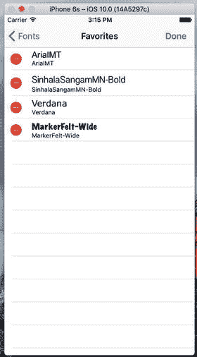

图 9-18. 我们在收藏表格中添加了编辑功能

但我们的主要兴趣在于添加重新排序功能。为此，我们只需要在 `FontListViewController.swift` 中添加以下方法：

```
override func tableView(_ tableView: UITableView, moveRowAt sourceIndexPath: IndexPath, to destinationIndexPath: IndexPath) {
FavoritesList.sharedFavoritesList.moveItem(fromIndex: sourceIndexPath.row,
toIndex: destinationIndexPath.row)
fontNames = FavoritesList.sharedFavoritesList.favorites
}
```

当用户完成拖动行时，会立即调用此方法。参数告诉我们哪一行被移动了以及它最终移动到了哪里。我们在这里所做的就是告诉 `FavoritesList` 单例对其内容进行相同的重新排序，然后刷新我们的字体名称列表，就像我们删除项目后所做的那样。要查看实际效果，运行应用，进入收藏列表，然后点击“编辑”按钮。你会看到编辑模式现在在每行的右侧包含了小的“拖拽”图标，你可以使用它们来重新排列项目。

## 总结

尽管本章我们大量使用了表格视图，但我们的重点实际上是导航控制器的使用，以及我们如何在大多数 iPhone 设备（尤其是在竖屏模式下）可能拥有的有限宽度空间内，深入浏览分层内容。

我们创建了一个字体列表查看应用，它不仅向我们展示了如何深入查看更详细的视图，还展示了如何处理从单个表格视图单元格发出的多个跳转，就像我们在查看字体大小或字体信息时所做的那样。

最后，我们探讨了如何略微调整我们的表格视图，以包含在视图内删除和移动行的功能。


