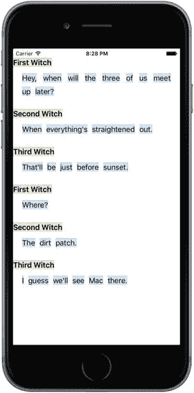
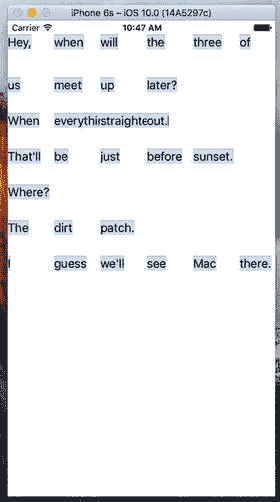
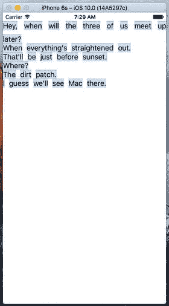
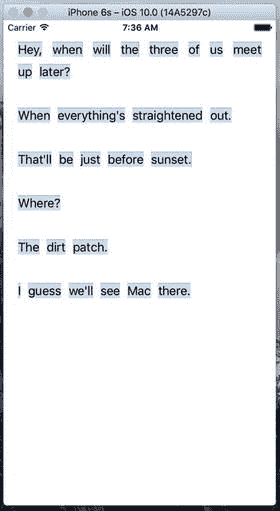
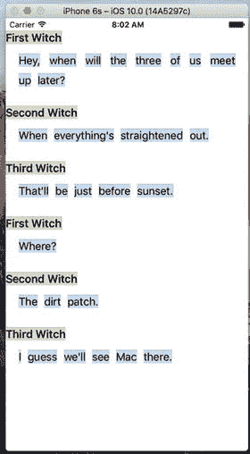

# 10. 集合视图

多年来，iOS 开发者一直使用 `UITableView` 组件来创建各种各样的界面。凭借其允许定义多种单元格类型、按需动态创建以及便捷垂直滚动的能力，`UITableView` 成为了成千上万应用的关键组件。尽管苹果在每次重大 iOS 版本更新中都增强了表格视图的功能，但它仍然不是处理所有大型数据集的终极解决方案。例如，如果你想以多列形式展示数据，就需要将每行数据的所有列合并到单个单元格中。而且，也无法让 `UITableView` 水平滚动其内容。总的来说，`UITableView` 的强大功能伴随着一个特定的权衡：开发者无法控制表格视图的整体布局。你可以定义每个单元格的外观，但这些单元格最终只是在一个大型滚动列表中彼此堆叠。

在 iOS 6 中，苹果引入了一个名为 `UICollectionView` 的新类来解决这些缺陷。与表格视图类似，`UICollectionView` 允许你显示一堆数据“单元格”，并处理诸如将未使用的单元格排队以备后用等功能。但与表格视图不同的是，`UICollectionView` 不会为你将这些单元格排列成垂直堆叠。实际上，`UICollectionView` 根本不进行布局。相反，`UICollectionView` 使用一个辅助类来完成布局。

## 创建 DialogViewer 项目

让我们先来谈谈 `UICollectionView`。为了展示它的一些能力，我们将用它来布局一些文本段落。每个单词将被放置在自己的单元格中，每个段落的所有单元格将聚集在一个分区中。每个分区还将有自己的页眉。考虑到 UIKit 已经包含了其他同样优秀的文本布局方式，这看起来可能并不令人兴奋。然而，这个过程仍然具有指导意义，因为你将感受到这个组件的灵活性。你绝对无法用表格视图做出像图 10-1 那样的效果。



图 10-1.

每个单词都是一个独立的单元格，除了页眉——它们就是页眉。所有这些都通过一个单独的 `UICollectionView` 进行布局，我们无需进行任何显式的几何计算

为了实现这一点，我们将定义几个自定义单元格类，使用 `UICollectionViewFlowLayout`（目前 UIKit 中唯一包含的布局辅助类），并且像往常一样，使用我们的视图控制器类将所有内容整合在一起。

使用 Xcode 创建一个新的 Single View Application，就像你之前多次做的那样。将你的项目命名为 DialogViewer，并使用本书中一直使用的标准设置（将语言设置为 Swift，设备选择通用）。打开 `ViewController.swift` 并将其父类更改为 `UICollectionView`：

```
class ViewController: UICollectionViewController {
```

打开 `Main.storyboard`。我们需要将视图控制器设置为我们刚刚在 `ViewController.swift` 中指定的内容。在文档大纲中选择唯一的视图控制器并删除它，留下一个空的故事板。现在使用对象库找到 Collection View Controller 并将其拖入编辑区域。如果你检查文档大纲，你会看到集合视图控制器带有一个嵌套的集合视图。它与集合视图的关系非常类似于 `UITableViewController` 与其嵌套的 `UITableView` 之间的关系。选择集合视图控制器的图标，并使用身份检查器将其类更改为 `ViewController`，我们刚刚将其设置为 `UICollectionViewController` 的子类。在属性检查器中，确保“是初始视图控制器”复选框被选中。接下来，在文档大纲中选择集合视图，并使用属性检查器将其背景颜色更改为白色。最后，你会看到集合视图有一个名为 Collection View Cell 的子项。这是一个原型单元格，你可以像处理表格视图单元格一样，在 Interface Builder 中用它来设计实际单元格的布局。我们在本章中不会这样做，所以选择该单元格并删除它。

### 定义自定义单元格

现在让我们定义一些单元格类。正如你在图 10-1 中看到的，我们展示了两种基本类型的单元格：一种包含单词的“普通”单元格，另一种用作某种页眉。你要在 `UICollectionView` 中使用的任何单元格都需要是系统提供的 `UICollectionViewCell` 类的子类，它提供了类似于 `UITableViewCell` 的基本功能。这些功能包括 `backgroundView`、`contentView` 等。因为我们的两种单元格类型将具有一些共享功能，我们实际上会让一个成为另一个的子类，并使用子类重写基类的一些功能。

首先在 Xcode 中创建一个新的 Cocoa Touch 类。将新类命名为 `ContentCell`，并将其设为 `UICollectionViewCell` 的子类。选择新类的源文件，并添加三个属性的声明和一个类方法的存根，如代码清单 10-1 所示。

```
class ContentCell: UICollectionViewCell {
var label: UILabel!
var text: String!
var maxWidth: CGFloat!
class func sizeForContentString(s: String,
forMaxWidth maxWidth: CGFloat) -> CGSize {
return CGSize.zero
}
}
```

**代码清单 10-1.** *我们的 `ContentCell` 类定义*

`label` 属性将指向一个 `UILabel`。我们将使用 `text` 属性告诉单元格要显示什么内容，使用 `maxWidth` 属性来控制单元格的最大宽度。我们将使用 `sizeForContentString(_:forMaxWidth:)` 方法（我们稍后会实现它）来询问显示给定字符串需要多大的单元格。这在创建和配置我们的单元格类实例时会很方便。

现在添加对 `UIView init(frame:)` 和 `init(coder:)` 方法的重写，如代码清单 10-2 所示。

```
override init(frame: CGRect) {
super.init(frame: frame)
label = UILabel(frame: self.contentView.bounds)
label.isOpaque = false
label.backgroundColor =
UIColor(red: 0.8, green: 0.9, blue: 1.0, alpha: 1.0)
label.textColor = UIColor.black()
label.textAlignment = .center
label.font = self.dynamicType.defaultFont()
contentView.addSubview(label)
}
required init?(coder aDecoder: NSCoder) {
super.init(coder: aDecoder)
}
```

**代码清单 10-2.** *我们单元格 `ContentCell` 类的初始化重写例程*

代码清单 10-2 中的代码非常简单。它创建了一个标签，设置其显示属性，并将该标签添加到单元格的 `contentView` 中。这里唯一神秘的地方是它使用了 `defaultFont()` 方法来获取字体，用于设置标签的字体。其思想是，这个类应该定义用于显示内容的字体，同时也允许任何子类通过重写 `defaultFont()` 方法来声明它们自己的显示字体。我们还没有创建 `defaultFont()` 方法，所以让我们来创建它：

```
class func defaultFont() -> UIFont {
return UIFont.preferredFontForTextStyle(UIFontTextStyleBody)
}
```

相当直接。这使用了 `UIFont` 类的 `preferredFontForTextStyle()` 方法来获取用户偏好的正文字体。用户可以通过“设置”应用更改此字体的大小。通过使用此方法而不是硬编码字体大小，我们使应用更加用户友好。注意这个方法是如何被调用的：

```
label.font = self.dynamicType.defaultFont()
```

`defaultFont()` 方法是 `ContentCell` 类的一个类型方法。通常，你会使用类的名称来调用它，像这样：

```
ContentCell.defaultFont()
```


## 排版后的内容

在这种情况下，这种方法行不通——如果这个调用来自 `ContentCell` 的子类（比如我们稍后将创建的 `HeaderCell` 类），我们希望实际调用子类对 `defaultFont()` 的重写。为此，我们需要一个对子类类型对象的引用，而 `self.dynamicType` 表达式恰恰能提供这个引用。如果该表达式是从 `ContentCell` 类的实例中执行的，它将解析为 `ContentCell` 的类型对象，并调用该类的 `defaultFont()` 方法；但在 `HeaderCell` 子类中，它解析为 `HeaderCell` 的类型对象，并调用 `HeaderCell` 的 `defaultFont()` 方法，这正是我们想要的结果。为了完成这个类，让我们实现之前添加了存根的方法，即计算单元格合适尺寸的方法，如代码清单 10-3 所示。

```
class func sizeForContentString(s: String,
forMaxWidth maxWidth: CGFloat) -> CGSize {
let maxSize = CGSize(width: maxWidth, height: 1000.0)
let opts = NSStringDrawingOptions.usesLineFragmentOrigin
let style = NSMutableParagraphStyle()
style.lineBreakMode = NSLineBreakMode.byCharWrapping
let attributes = [ NSFontAttributeName: defaultFont(),
NSParagraphStyleAttributeName: style]
let string = s as NSString
let rect = string.boundingRect(with: maxSize, options: opts,
attributes: attributes, context: nil)
return rect.size
}
代码清单 10-3. 计算近似的单元格尺寸
```

代码清单 10-3 中的方法做了很多事情，因此值得逐步解析。首先，我们声明一个最大尺寸，这样任何单词的宽度都不会超过 `maxWidth` 参数的值，该值将由 `UICollectionView` 的宽度设置。我们还创建了一个允许字符换行的段落样式，这样当字符串太大无法适应给定的最大宽度时，它会自动换行到下一行。我们还创建了一个属性字典，其中包含我们为此类定义的默认字体和刚刚创建的段落样式。最后，我们使用了 `UIKit` 提供的 `NSString` 功能来计算字符串的尺寸。我们传入一个绝对最大尺寸以及其他已设置的选项和属性，然后得到一个尺寸。

这个类剩下的工作就是对 `text` 属性进行一些特殊处理。我们不会像通常那样让它使用隐式实例变量，而是定义一些方法来根据我们之前创建的 `UILabel` 获取和设置值，基本上是将 `UILabel` 用作显示值的存储。通过这样做，我们还可以在文本发生变化时，使用 setter 来重新计算单元格的几何形状。用代码清单 10-4 中的代码替换 `ContentCell.swift` 中 `text` 属性的定义。

```
var label: UILabel!
var text: String! {
get {
return label.text
}
set(newText) {
label.text = newText
var newLabelFrame = label.frame
var newContentFrame = contentView.frame
let textSize = self.dynamicType.sizeForContentString(s: newText,
forMaxWidth: maxWidth)
newLabelFrame.size = textSize
newContentFrame.size = textSize
label.frame = newLabelFrame
contentView.frame = newContentFrame
}
}
代码清单 10-4. ContentCell.swift 文件中的文本属性定义
```

getter 没什么特别的；但 setter 做了额外的工作。基本上，它根据显示当前字符串所需的尺寸，修改了标签和内容视图的 frame。

这就是我们基础单元格类所需的全部内容。现在让我们创建一个用于标题的单元格类。使用 Xcode 再创建一个新的 Cocoa Touch 类，将其命名为 `HeaderCell`，并让它成为 `ContentCell` 的子类。打开 `HeaderCell.swift` 并进行一些修改。在这个类中，我们只需要重写 `ContentCell` 类的一些方法，以改变单元格的外观，使其看起来与普通内容单元格不同，如代码清单 10-5 所示。

```
class HeaderCell: ContentCell {
override init(frame: CGRect) {
super.init(frame: frame)
label.backgroundColor = UIColor(red: 0.9, green: 0.9,
blue: 0.8, alpha: 1.0)
label.textColor = UIColor.black()
}
required init?(coder aDecoder: NSCoder) {
super.init(coder: aDecoder)
}
override class func defaultFont() -> UIFont {
return UIFont.preferredFont(forTextStyle: UIFontTextStyleHeadline)
}
}
代码清单 10-5. HeaderCell 类
```

我们只需这样做，就能让标题单元格拥有独特的外观，包括其独特的颜色和字体。

### 配置视图控制器

选择 `ViewController.swift`，首先声明一个数组来存放我们想要显示的内容，如代码清单 10-6 所示。

```
private var sections = [
["header": "First Witch",
"content" : "Hey, when will the three of us meet up later?"],
["header" : "Second Witch",
"content" : "When everything's straightened out."],
["header" : "Third Witch",
"content" : "That'll be just before sunset."],
["header" : "First Witch",
"content" : "Where?"],
["header" : "Second Witch",
"content" : "The dirt patch."],
["header" : "Third Witch",
"content" : "I guess we'll see Mac there."]
]
代码清单 10-6. 我们要显示的内容——将此代码放在 ViewController.swift 文件中
```

`sections` 数组包含一个字典列表，每个字典有两个键：`header` 和 `content`。我们将使用与这些键关联的值来定义显示内容。

与 `UITableView` 非常相似，`UICollectionView` 允许我们根据标识符注册可重用单元格的类。这样做可以让我们稍后在提供单元格时调用出列方法。如果没有可用的单元格，集合视图会为我们创建一个——就像 `UITableView` 一样。将此行添加到 `viewDidLoad()` 方法的末尾以实现此功能：

```
self.collectionView?.register(ContentCell.self, forCellWithReuseIdentifier: "CONTENT")
```

由于此应用程序没有导航栏，主视图的内容会显示在状态栏下方。为防止这种情况，将以下行添加到 `viewDidLoad()` 的末尾：

```
var contentInset = collectionView!.contentInset
contentInset.top = 20
collectionView!.contentInset = contentInset
```

目前这些配置对 `viewDidLoad()` 来说已经足够。在编写填充集合视图的代码之前，我们需要编写一个小的辅助方法。我们所有的内容都包含在长字符串中，但我们需要逐个单词处理，以便将每个单词放入一个单元格中。因此，让我们创建一个内部方法来分割这些字符串。此方法接收一个分区编号，从分区数据中提取相关的内容字符串，并将其分割成单词：

```
func wordsInSection(section: Int) -> [String] {
let content = sections[section]["content"]
let spaces = NSCharacterSet.whitespacesAndNewlines
let words = content?.components(separatedBy: spaces)
return words!
}
```


### 提供内容单元格

现在我们来创建一组方法，这些方法将真正填充集合视图。接下来的三个方法均由 `UICollectionViewController` 类所采用的 `UICollectionViewDataSource` 协议定义。`UICollectionViewController` 会自动将其自身指定为其嵌套的 `UICollectionView` 的数据源，因此当 `UICollectionView` 需要了解其内容时，这些方法将被自动调用。

首先，我们需要一个方法来告知集合视图要显示多少个分区：

```
override func numberOfSections(in collectionView: UICollectionView) -> Int {
return sections.count
}
```

接下来，我们有一个方法用于告知集合视图每个分区应包含多少个项目。该方法使用了我们之前定义的 `wordsInSection()` 方法：

```
override func collectionView(_ collectionView: UICollectionView, numberOfItemsInSection section: Int) -> Int {
let words = wordsInSection(section: section)
return words.count
}
```

列表 10-7 展示了实际返回单个单元格的方法，该单元格配置为包含一个单词。此方法同样使用了我们的 `wordsInSection()` 方法。如您所见，它对 `UICollectionView` 使用了出队方法，这与 `UITableView` 中的方法类似。由于我们已经为正在使用的标识符注册了单元格类，因此我们知道出队方法总是会返回一个实例：

```
override func collectionView(_ collectionView: UICollectionView, cellForItemAt indexPath: IndexPath) -> UICollectionViewCell {
let words = wordsInSection(section: indexPath.section)
let cell = collectionView.dequeueReusableCell(
withReuseIdentifier: "CONTENT", for: indexPath) as! ContentCell
cell.maxWidth = collectionView.bounds.size.width
cell.text = words[indexPath.row]
return cell
}
```

列表 10-7. 设置集合视图单元格

根据 `UITableView` 的工作方式来判断，您可能会认为此时我们至少已经拥有一个能基本运行的方案了。构建并运行应用程序。您会发现我们尚未达到一个有用的阶段，如图 10-2 所示。



图 10-2. 还不是我们想要的效果……目前

我们可以看到一些单词，但这里并没有形成“行”的效果。每个单元格大小相同，所有内容都挤在一起。原因是我们需要处理一些集合视图的委托职责才能使一切正常运作。

### 创建布局流程

到目前为止，我们一直在处理 `UICollectionView`，但这个类有一个负责实际布局的搭档。`UICollectionViewFlowLayout` 是 `UICollectionView` 的默认布局助手，它包含自己的委托方法，这些方法会尝试从我们这里获取更多信息。我们现在就要实现其中一个方法。布局对象会为每个单元格调用此方法，以确定其应有的尺寸。这里我们再次使用 `wordsInSection()` 方法来获取相关的单词，然后使用我们在 `ContentCell` 类中定义的方法来查看它需要多大的尺寸。

当 `UICollectionViewController` 被初始化时，它会将其自身设置为 `UICollectionView` 的委托。如果视图控制器声明它遵循 `UICollectionViewDelegateFlowLayout` 协议，那么集合视图的 `UICollectionViewFlowLayout` 就会将其视为自己的委托。我们需要做的第一件事是在 `ViewController.swift` 中更改视图控制器的声明，以声明其遵循该协议：

```
class ViewController: UICollectionViewController,
UICollectionViewDelegateFlowLayout {
```

`UICollectionViewDelegateFlowLayout` 协议的所有方法都是可选的，我们只需要实现其中一个。将列表 10-8 中的方法添加到 `ViewController.swift` 中：

```
func collectionView(collectionView: UICollectionView,
layout collectionViewLayout: UICollectionViewLayout,
sizeForItemAtIndexPath indexPath: NSIndexPath) -> CGSize {
let words = wordsInSection(indexPath.section)
let size = ContentCell.sizeForContentString(words[indexPath.row],
forMaxWidth: collectionView.bounds.size.width)
return size
}
```

列表 10-8. 使用 `UICollectionViewDelegateFlowLayout` 协议调整单元格大小

现在再次构建并运行应用程序。您会发现我们向前迈进了一步，如图 10-3 所示。



图 10-3. 我们的段落流开始成形

您可以看到单元格现在正在流动并自动换行，使得文本可读，并且每个分区的开头会略微下沉。但是每个分区与其前后的分区都紧紧挤在一起。它们还一直延伸到两侧，看起来不太美观。让我们通过添加一些额外的配置来解决这个问题。将以下代码行添加到 `viewDidLoad()` 方法的末尾：

```
let layout = collectionView!.collectionViewLayout
let flow = layout as! UICollectionViewFlowLayout
flow.sectionInset = UIEdgeInsetsMake(10, 20, 30, 20)
```

这里我们从集合视图中获取布局对象。我们首先将其赋值给一个临时变量，该变量的类型会被推断为 `UICollectionViewLayout`。我们这样做主要是为了强调一点：`UICollectionView` 只知道这个通用布局类，但它实际上使用的是 `UICollectionViewLayout` 的子类 `UICollectionFlowLayout` 的实例。知道了布局对象的真实类型，我们可以使用类型转换将其赋值给另一个正确类型的变量，从而让我们能够访问仅该子类才拥有的属性。在本例中，我们使用 `sectionInset` 属性来告知 `UICollectionViewLayout` 在集合视图的每个项目周围留出一些空白空间。在我们的案例中，这意味着每个单词周围现在都会有一点空间，如果您再次运行示例就会看到（见图 10-4）。



图 10-4. 布局不再那么拥挤了


### 实现头部视图

现在唯一缺失的就是显示我们的头部对象了，所以是时候来解决这个问题了。你可能还记得，`UITableView` 有一个页眉和页脚视图的系统，它会为每个分区专门请求这些视图。`UICollectionView` 让这个概念变得更加通用，允许在布局方面有更大的灵活性。其工作方式是，除了从委托访问常规单元格的系统之外，还有一个并行的系统用于访问可以作为页眉、页脚或其他用途的附加视图。将这段代码添加到 `viewDidLoad()` 的末尾，让集合视图知道我们的头部单元格类：

```
self.collectionView?.register(HeaderCell.self,
forSupplementaryViewOfKind: UICollectionElementKindSectionHeader,
withReuseIdentifier: "HEADER")
```

如你所见，在这种情况下，我们不仅指定了单元格类和标识符，还指定了一种“类型”。其思路是，不同的布局可能会定义不同类型的补充视图，并可能要求委托为它们提供视图。`UICollectionFlowLayout` 会为集合视图中的每个分区请求一个分区头部，我们将提供这些头部，如代码清单 10-9 所示。

```
override func collectionView(_ collectionView: UICollectionView, viewForSupplementaryElementOfKind kind: String, at indexPath: IndexPath) -> UICollectionReusableView {
if (kind == UICollectionElementKindSectionHeader) {
let cell =
collectionView.dequeueReusableSupplementaryView(
ofKind: kind, withReuseIdentifier: "HEADER",
for: indexPath) as! HeaderCell
cell.maxWidth = collectionView.bounds.size.width
cell.text = sections[indexPath.section]["header"]
return cell
}
abort()
}
代码清单 10-9.
获取我们的头部单元格视图
```

请注意此方法末尾的 `abort()` 调用。该函数会导致应用程序立即终止。在生产代码中，你不应该频繁使用这种东西。在这里，我们只期望被调用来创建头部单元格，如果我们被要求创建不同类型的单元格，我们无能为力——我们甚至不能返回 `nil`，因为该方法的返回类型不允许这样做。如果我们被调用来创建不同类型的头部，那是我们这边的编程错误，或者是 UIKit 的一个 bug。

构建并运行。你会看到……等等！那些头部在哪里？事实证明，除非我们明确告诉 `UICollectionFlowLayout` 头部应该有多大，否则它不会在布局中给它们留出任何空间。所以，回到 `viewDidLoad()` 并在末尾添加以下代码行：

```
flow.headerReferenceSize = CGSize(width: 100, height: 25)
```

再次构建并运行。你会看到头部已经就位，如同图 10-1 先前显示以及图 10-5 再次展示的那样。



图 10-5.
完成后的 DialogViewer 应用

## 总结

在本章中，我们实际上只是浅尝了 `UICollectionView` 以及通过默认的 `UICollectionFlowLayout` 类可以实现的功能。你可以通过定义自己的布局类来让它变得更加炫酷，但这属于另一本书的范畴了。

在考虑使用集合视图的应用时，你还应该研究一下堆栈视图。它们可能提供一种替代方法，从而为你节省时间。随着本书因新的 Swift、Xcode 和 iOS 特性而变得越来越厚，我将把堆栈视图作为留给读者的练习。

