# 11. 适用于 iPad 应用的拆分视图和弹出框

在第 9 章中，我们花了很多时间处理基于表格视图选择的应用程序导航，每次选择都会导致填满整个屏幕的顶级视图向左滑动，并引入层级中的下一个视图。许多 iPhone 和 iPod touch 应用都是这样工作的，比如邮件应用，它让你可以逐层深入邮件账户和文件夹，直到找到邮件。虽然这种方法在 iPad 上也能用，但它会导致用户交互问题。

在 iPhone 或 iPod touch 的屏幕上，让一个屏幕大小的视图滑开，露出另一个屏幕大小的视图，效果很好。但在 iPad 上，同样的交互可能会显得不那么流畅，也许有点夸张，甚至有点让人不知所措。用一个单一的表格视图占用如此大的显示屏是在浪费空间。因此，你会看到内置的 iPad 应用并不会这样工作。相反，任何像邮件应用中那样的深入导航功能，都被限制在一个狭窄的列中，当用户深入或退出层级时，该列的内容会向左或向右滑动。在横屏模式的 iPad 上，导航列固定在左侧，所选项目的内容显示在右侧，这被称为拆分视图（见图 11-1），以这种方式构建的应用被称为主从应用。

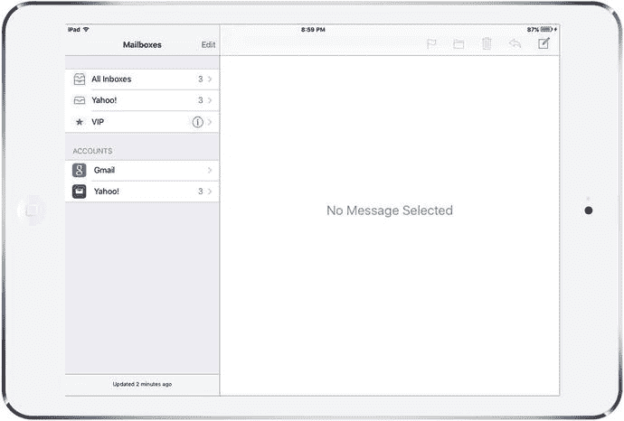

图 11-1.
这个横屏模式的 iPad 展示了一个拆分视图，导航列在左侧。点击导航列中的一个项目，该项目的内容会显示在右侧区域

拆分视图为开发像邮件这样的主从应用提供了完美的视觉效果。在 iOS 8 之前，拆分视图类 `UISplitViewController` 仅在 iPad 上可用，这意味着如果你想构建一个通用的主从应用，你必须在 iPad 上用一种方式实现，在 iPhone 上用另一种方式。现在，`UISplitViewController` 在所有设备上都可用，你不再需要编写特殊代码来处理 iPhone。

当在 iPad 上使用时，拆分视图的左侧默认提供 320 点的宽度。拆分视图本身，导航和内容并排显示，通常只在横屏模式下可见。如果你将设备旋转为竖屏方向，拆分视图仍然起作用，但它的显示方式不再相同。导航视图失去了其固定的位置。它只能通过从视图左侧滑动或按下一个工具栏按钮来激活，从而使其从一个浮动在屏幕上其他所有内容前面的视图中从左滑入，如图 11-2 所示。

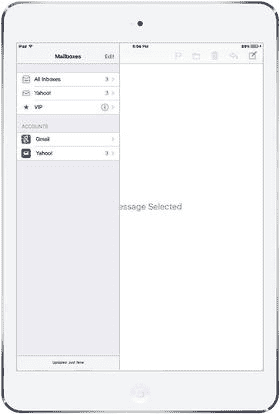

图 11-2.
竖屏模式 iPad 上的拆分视图与横屏模式显示不同，横屏模式下拆分视图左侧的信息仅在用户从左侧滑动或点击工具栏按钮时出现

有些应用并不严格遵守这条规则，比如 iPad 的“设置”应用，它使用的拆分视图始终可见。左侧既不会消失，也不会遮挡右侧的内容视图。但对于本章的项目，我们将遵循标准的使用模式。

我们将使用拆分视图控制器创建一个主从应用，然后在 iPad 模拟器上测试该应用。但当它完成后，我们会看到同样的代码在 iPhone 上也能工作，尽管外观不太一样。你将学习如何自定义拆分视图的外观和行为，并创建和显示一个弹出框，类似于我们在第 4 章讨论警告视图和操作表时看到的那个。与图 4-29 中包裹了操作表的弹出框不同，这个弹出框将包含特定于示例应用的内容——具体来说，是一个总统列表，如图 11-3 所示。

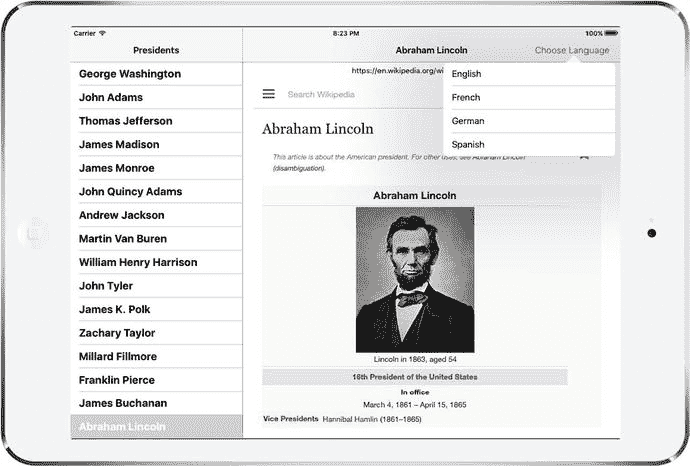

图 11-3.
弹出框在视觉上看起来是从触发它的按钮上“生长”出来的


## 使用 `UISplitViewController` 构建主从应用

我们将从一项简单的任务开始：利用 Xcode 预定义的模板创建一个分栏视图项目。我们将构建一个应用，列出历任美国总统，并显示您所选总统的维基百科条目。

打开 Xcode，选择 **文件** ➤ **新建** ➤ **项目...**。从 iOS 应用版块中，选择 **主从应用** 并点击 **下一步**。在下一个界面中，将新项目命名为 `Presidents`，语言设置为 `Swift`，设备设置为 `Universal`。确保所有复选框均未勾选。点击 **下一步**，选择项目的保存位置，然后点击 **创建**。Xcode 会按常规操作，为您创建若干个类和故事板文件，然后显示项目。如果 `Presidents` 文件夹尚未展开，请将其展开，查看其中包含的内容。

项目初始包含一个应用委托（如常）、一个名为 `MasterViewController` 的类和一个名为 `DetailViewController` 的类。这两个视图控制器分别代表横向分栏视图左右两侧显示的视图。`MasterViewController` 定义了导航结构的顶层，而 `DetailViewController` 则定义了在选择导航元素时，在较大区域中显示的内容。应用启动时，这两者都包含在一个分栏视图中，正如您可能记得的，该分栏视图会随着设备旋转而改变形态。

要了解此特定应用模板提供了哪些功能，请构建应用并在 iPad 模拟器中运行。如果应用以纵向模式启动，您将只会看到详情视图控制器，如图 11-4 左侧所示。点击工具栏上的 **Master** 按钮，或从视图左边缘向右滑动，即可在主视图控制器滑入时覆盖在详情视图之上，如图 11-4 右侧所示。

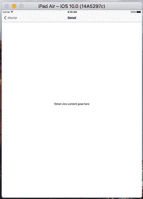
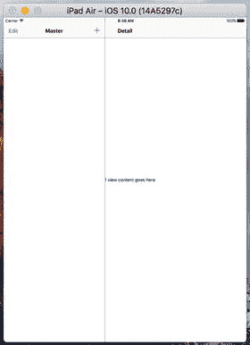

*图 11-4.* 纵向模式下的默认主从应用。右侧的布局与图 11-2 类似。

将模拟器向左或向右旋转，进入横向模式。在此模式下，分栏视图的工作方式是在左侧显示导航视图，在右侧显示详情视图，如图 11-5 所示。

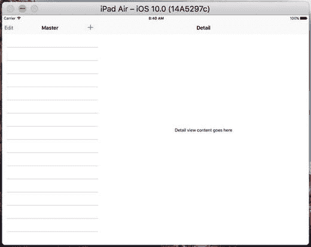

*图 11-5.* 横向模式下的默认主从应用。请注意此图与图 11-1 中显示的类似布局。

### 故事板定义结构

从一开始，您就会拥有一组相当复杂的视图控制器在运行：

- 一个分栏视图控制器，包含所有元素
- 一个导航控制器，处理分栏左侧的内容
- 一个主视图控制器（显示项目的主列表），位于导航控制器内部
- 一个详情视图控制器，位于右侧
- 另一个导航控制器，作为右侧详情视图控制器的容器

在我们使用的默认主从应用模板中，这些视图控制器是在主故事板文件中设置和互连的，而不是通过代码实现。除了进行 GUI 布局外，Interface Builder 还提供了一种连接不同组件的方式，而无需编写大量代码来建立关系。让我们查看项目的故事板，了解其设置方式。

选择 `Main.storyboard` 以在 Interface Builder 中打开它。这个故事板确实包含许多内容。为了获得最佳查看效果，您绝对需要打开文档大纲，如图 11-6 所示。缩小视图也有助于您概览全局。

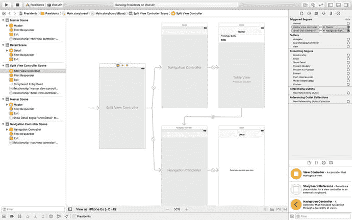

*图 11-6.* 在 Interface Builder 中打开的 `Main.storyboard`。可以使用左侧的文档大纲最佳地查看此复杂的对象层次结构。

为了更好地了解这些控制器之间的关系，请打开连接检查器，然后依次点击每个视图控制器。以下是快速总结，说明您会发现的内容：

- `UISplitViewController` 通过称为 *master view controller* 和 *detail view controller* 的关系转场连接到两个 `UINavigationController`。这些用于告诉 `UISplitViewController`，左侧显示的窄条（主视图控制器）和较大的显示区域（详情视图控制器）该使用什么。
- 通过主视图控制器转场链接的 `UINavigationController` 与其根视图控制器具有根视图控制器关系，该根视图控制器是由模板生成的 `MasterViewController` 类。主视图控制器是 `UITableViewController` 的子类，您应该从第 9 章就熟悉它了。
- 类似地，另一个 `UINavigationController` 与详情视图控制器具有根视图控制器关系，该详情视图控制器是模板的 `DetailVIewController` 类。由模板生成的详情视图控制器是一个普通的 `UIViewController` 子类，但您可以自由使用满足应用需求的任何视图控制器。
- 从主视图控制器中的单元格到详情视图控制器有一个类型为 `showDetail` 的故事板转场。此转场会导致被点击单元格中的项目显示在详情视图中。稍后当我们更详细地查看主视图控制器时，还会有更多介绍。

至此，`Main.storyboard` 的内容提供了应用各个控制器如何互连的定义。在大多数使用故事板的情况下，这消除了大量代码，这通常是一件好事。

### 代码定义功能

将视图控制器的互连保留在故事板中的主要原因之一是，它们不会用不必要的配置信息来使源代码变得杂乱。剩下的只是定义实际功能的代码。让我们看看我们作为起点的内容。创建项目时，Xcode 为我们定义了多个类。在我们开始进行任何更改之前，先来窥探一下每个类。


#### `AppDelegate`

首先是`AppDelegate.swift`，即应用委托。其源文件开头如代码清单 [11-1] 所示。

```
import UIKit
@UIApplicationMain
class AppDelegate: UIResponder, UIApplicationDelegate, UISplitViewControllerDelegate {
var window: UIWindow?
func application(_ application: UIApplication, didFinishLaunchingWithOptions launchOptions: [NSObject: AnyObject]?) -> Bool {
// Override point for customization after application launch.
let splitViewController = self.window!.rootViewController as! UISplitViewController
let navigationController = splitViewController.viewControllers[splitViewController.viewControllers.count-1] as! UINavigationController
navigationController.topViewController!.navigationItem.leftBarButtonItem = splitViewController.displayModeButtonItem()
splitViewController.delegate = self
return true
}
Listing 11-1.
AppDelegate.swift
```

先来看这段代码的最后一部分：

```
splitViewController.delegate = self;
```

这一行设置了`UISplitViewController`的`delegate`属性，使其指向应用委托本身。但为什么要在代码中建立这个连接，而不是直接在故事板中连接呢？毕竟，就在几段之前，你还被告知消除繁琐的代码（“将这个东西连接到那个东西”）是 XIB 和故事板的主要优势之一。而且我们已经在 Interface Builder 中多次连接过委托，为什么这里不行？

要理解为什么使用故事板进行连接在这里行不通，你需要考虑故事板与 XIB 文件的区别。XIB 文件本质上是一个冻结的对象图。当你在运行的应用中加载 XIB 时，其中包含的对象都会“解冻”并实例化，包括文件中指定的所有互连。系统会逐一创建文件中每个对象的新实例，并连接所有输出口和对象之间的连接。然而，故事板的意义远不止于此。可以说，故事板中的每个场景大致对应一个 XIB 文件。当你添加描述场景如何通过 Segue 连接的元数据时，就构成了一个故事板。但与单个 XIB 不同，复杂的故事板通常不会一次性全部加载。相反，任何导致新场景被激活的活动，都会从故事板中加载该场景的冻结对象图。这意味着你在故事板中看到的对象不一定同时存在。

由于 Interface Builder 无法预知哪些场景会共存，它实际上禁止你从一个场景中的对象向另一个场景中的对象建立任何输出口或目标/动作连接。事实上，Segue 是它允许你在场景之间建立的唯一连接。

你可以亲自尝试。首先，在故事板中选择“Split View Controller”（你可以在“Split View Controller Scene”的 Dock 中找到它）。然后打开“Connections Inspector”，尝试从`delegate`输出口拖拽连接到另一个视图控制器或对象。你可以在布局视图和列表视图中任意拖拽，但找不到任何会高亮显示的位置（高亮表示准备接受拖拽）。唯一建立这个连接的方式就是在代码中完成。总的来说，考虑到使用故事板消除了大量其他代码，这一点额外的代码只是很小的代价。

现在，让我们回到`application(_:didFinishLaunchingWithOptions:)`方法的开头部分：

```
let splitViewController = self.window!.rootViewController as! UISplitViewController
```

这行代码获取了窗口的`rootViewController`，也就是故事板中由自由浮动箭头指向的视图控制器。回顾图 [11-6]，你会看到箭头指向我们的`UISplitViewController`实例。接下来是这段代码：

```
let navigationController = splitViewController.viewControllers[splitViewController.viewControllers.count-1] as! UINavigationController
```

在这一行，我们深入`UISplitViewController`的`viewControllers`数组。当从故事板加载分割视图时，该数组包含对导航控制器的引用，这些导航控制器包裹了主视图控制器和详细视图控制器。我们获取数组中的最后一个元素，它指向用于详细视图的`UINavigationController`。最后，我们看到：

```
navigationController.topViewController!.navigationItem.leftBarButtonItem =
splitViewController.displayModeButtonItem()
```

这行代码将分割视图控制器的`displayModeButtonItem`分配给详细视图控制器的导航栏。`displayModeButtonItem`是一个由分割视图自身创建和管理的栏按钮。实际上，这段代码添加了你可以在图 [11-4] 左侧导航栏上看到的“Master”按钮。在 iPad 上，当设备处于竖屏模式且主视图控制器不可见时，分割视图会显示此按钮。当设备旋转为横屏或用户按下按钮使主视图控制器可见时，该按钮会被隐藏。

#### `MasterViewController`

现在，让我们来看看`MasterViewController`，它负责控制包含应用导航的表格视图的设置。代码清单 [11-2] 显示了`MasterViewController.swift`文件顶部的代码。

```
import UIKit
class MasterViewController: UITableViewController {
var detailViewController: DetailViewController? = nil
var objects = [AnyObject]()
override func viewDidLoad() {
super.viewDidLoad()
// Do any additional setup after loading the view, typically from a nib.
self.navigationItem.leftBarButtonItem = self.editButtonItem()
let addButton = UIBarButtonItem(barButtonSystemItem: .add, target: self, action: #selector(insertNewObject(_:)))
self.navigationItem.rightBarButtonItem = addButton
if let split = self.splitViewController {
let controllers = split.viewControllers
self.detailViewController = (controllers[controllers.count-1] as! UINavigationController).topViewController as? DetailViewController
}
}
Listing 11-2.
MasterViewController.swift
```

这里的主要关注点是`viewDidLoad()`方法。在前面的章节中，当你实现一个响应用户行选择的表格视图控制器时，通常会创建一个新的视图控制器并将其推入导航控制器的栈中。然而，在这个应用中，我们想要显示的视图控制器已经就位，并且每次用户在左侧做出选择时，它都会被重用。它就是故事板文件中包含的`DetailViewController`实例。在这里，我们获取了那个`DetailViewController`实例并将其保存在一个属性中，以备将来使用，尽管该属性在模板代码的其余部分并未使用。

`viewDidLoad()`方法还向工具栏添加了一个按钮。这就是你在图 [11-4] 和图 [11-5] 中看到的，位于主视图控制器导航栏右侧的“+”按钮。模板应用使用此按钮创建新条目并将其添加到主视图控制器的表格视图中。由于我们不需要在“Presidents”应用中使用这个按钮，我们稍后会删除这段代码。

该类模板中还包含几个其他方法，但目前无需担心。我们将在查看详细视图控制器之后，删除其中一些方法并重写其他方法。


#### 详情视图控制器

`Xcode`为我们创建的最后一个类是`DetailViewController`，它负责实际显示用户在主视图控制器表格中选择的项目。以下是`DetailViewController.swift`中的内容，如代码清单 11-3 所示。

```swift
import UIKit
class DetailViewController: UIViewController {
    @IBOutlet weak var detailDescriptionLabel: UILabel!
    func configureView() {
        // Update the user interface for the detail item.
        if let detail = self.detailItem {
            if let label = self.detailDescriptionLabel {
                label.text = detail.description
            }
        }
    }
    override func viewDidLoad() {
        super.viewDidLoad()
        // Do any additional setup after loading the view, typically from a nib.
        self.configureView()
    }
    override func didReceiveMemoryWarning() {
        super.didReceiveMemoryWarning()
        // Dispose of any resources that can be recreated.
    }
    var detailItem: NSDate? {
        didSet {
            // Update the view.
            self.configureView()
        }
    }
}
```
*代码清单 11-3. `DetailViewController.swift`*

`detailDescriptionLabel`属性是一个连接到故事板中标签的插座变量。在模板应用中，该标签仅显示`detailItem`属性中对象的描述。`detailItem`属性本身是视图控制器存储对用户在主视图控制器中选择的对象的引用的地方。其属性观察器（`didSet`块中的代码）在值更改后调用，它调用为我们生成的另一个方法`configureView()`。该方法仅调用详细对象的`description`方法，并使用结果设置故事板中标签的`text`属性：

```swift
func configureView() {
    // Update the user interface for the detail item.
    if let detail = self.detailItem {
        if let label = self.detailDescriptionLabel {
            label.text = detail.description
        }
    }
}
```

`description`方法由`NSObject`的每个子类实现。如果你的类未重写该方法，它会返回一个可能不太有用的默认值。但在模板代码中，详细对象都是`NSDate`类的实例，而`NSDate`对`description`方法的实现会以通用格式返回日期和时间。

### 主从模板应用的工作原理

现在你已经了解了模板应用的所有组成部分，但可能仍不清楚其工作原理，因此我们运行它并查看实际效果。在 iPad 模拟器上运行应用，将设备旋转到横屏模式，使主视图控制器显示出来。可以看到详情视图控制器中的标签当前显示故事板中分配给它的默认文本。本节将探讨在主视图控制器中选择一个项目如何导致该文本发生变化。主视图控制器中目前没有任何项目。要解决此问题，请按导航栏右上角的`+`按钮几次。每次点击都会在控制器的表格视图中添加一个新项目，如图 11-7 所示。

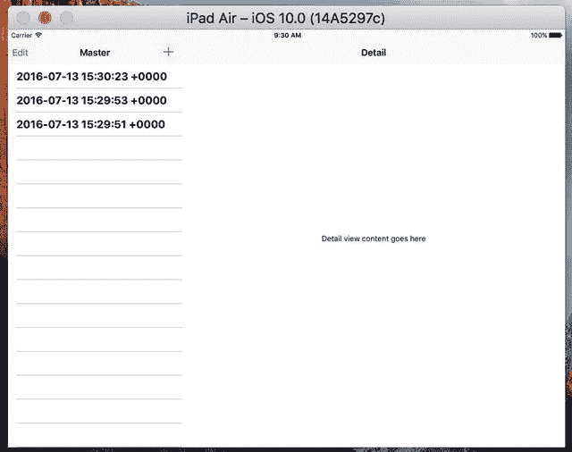

*图 11-7. 在主视图控制器中选择并在详情视图控制器中显示项目的模板应用*

主视图控制器表格中的所有项目都是日期。选择其中一个，详情视图中的标签会更新显示相同的日期。你已经看到了执行此操作的代码——它是`DetailViewController.swift`中的`configureView`方法，当详情视图控制器的`detailItem`属性存储新值时被调用。是什么导致`detailItem`属性被设置为新值？回顾图 11-6 中的故事板。有一条转场将主视图控制器表格中的原型表格单元格链接到详情视图控制器。如果你点击此转场并打开属性检查器，你会看到这是一个标识符为`showDetail`的显示详情转场，如图 11-8 所示。

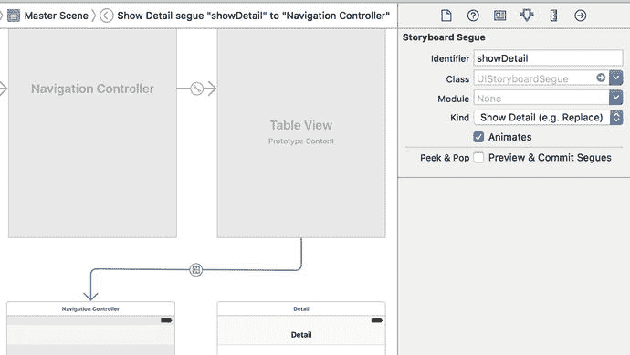

*图 11-8. 连接主视图控制器和详情视图控制器的显示详情转场*

如第 9 章所述，链接到表格视图单元格的转场在选中该单元格时触发。因此，当你选中主视图控制器表格视图中的一行时，iOS 会执行显示详情转场，并将导航控制器（包含详情视图控制器）作为转场目标。这会导致两件事发生：

* 创建一个新的详情视图控制器实例，并将其视图添加到视图层次结构中。
* 调用主视图控制器中的`prepareForSegue(_:sender:)`方法。

第一步确保详情视图控制器可见。在第二步中，主视图控制器需要以某种方式显示在主视图控制器中选择的对象。以下是`MasterViewController.swift`中的模板代码如何处理此问题，如代码清单 11-4 所示。

```swift
// MARK: - Segues
override func prepare(for segue: UIStoryboardSegue, sender: AnyObject?) {
    if segue.identifier == "showDetail" {
        if let indexPath = self.tableView.indexPathForSelectedRow {
            let object = objects[indexPath.row] as! NSDate
            let controller = (segue.destinationViewController as! UINavigationController).topViewController as! DetailViewController
            controller.detailItem = object
            controller.navigationItem.leftBarButtonItem = self.splitViewController?.displayModeButtonItem()
            controller.navigationItem.leftItemsSupplementBackButton = true
        }
    }
}
```
*代码清单 11-4. `MasterViewController.swift`文件的`prepare(forSegue:)`方法*

首先，检查转场标识符以确保是预期的转场，并获取视图控制器表格中选中对象的`NSDate`对象。接下来，主视图控制器从导致此方法被调用的转场的目标视图控制器的`topViewController`属性中找到`DetailViewController`实例。现在我们已经同时拥有了选中对象和详情视图控制器，只需设置详情视图控制器的`detailItem`属性即可更新详情视图。`prepare(forSegue:)`方法的最后两行将显示模式按钮添加到详情视图控制器的导航栏。当设备处于横屏模式时，这不起作用，因为显示模式按钮不可见，但如果旋转到竖屏方向，你会看到该按钮（即 Master 按钮）出现。

现在你了解了主视图控制器中选中的项目如何显示在详情视图控制器中。虽然看起来这里发生的事情不多，但实际上在底层发生了大量工作，以确保在 iPad 和 iPhone 上都能在横屏和竖屏方向正确工作。分视图控制器的美妙之处在于它处理了所有细节，让你可以专注于如何实现自定义的主视图控制器和详情视图控制器。

以上是对 Xcode 主从应用模板提供的功能的概述。起初可能难以理解，但希望逐个部分介绍能帮助你理解所有部分是如何组合在一起的。


## 添加总统数据

现在你已经了解了项目的基本布局，是时候填补空白，把模板应用变成你自己的作品了。首先打开本书的源代码归档文件夹，其中`11 – Presidents Data`文件夹内有一个名为`PresidentList.plist`的文件。将该文件拖入 Xcode 中项目的`Presidents`文件夹，以将其添加到项目中，并确保勾选“Copy items if needed”复选框让 Xcode 复制该文件。这个文件包含了迄今为止所有美国总统的信息，每位总统仅包含姓名和维基百科条目 URL。

现在，让我们看看主视图控制器，以及需要如何修改它以正确处理总统数据。这将是一个简单的过程：加载总统列表、在表格视图中展示它们，并将 URL 传递给详情视图以供显示。在`MasterViewController.swift`中，首先在类顶部添加以下粗体行，并删除划线行：

```
class MasterViewController: UITableViewController {
var detailViewController: DetailViewController? = nil
var objects = [AnyObject]()
var presidents: [[String: String]]!
```

接下来查看`viewDidLoad()`方法，这里的修改稍微复杂一些（但也不算太糟）。你需要添加几行代码来加载总统列表，然后删除设置工具栏中编辑和插入按钮的几行代码，如代码清单 11-5 所示。

```
override func viewDidLoad() {
super.viewDidLoad()
// 从 nib 加载后执行任何额外的设置
let path = Bundle.main.path(forResource: "PresidentList", ofType: "plist")
let presidentInfo = NSDictionary(contentsOfFile: path)!
presidents = presidentInfo["presidents"]! as! [[String: String]]
if let split = self.splitViewController {
let controllers = split.viewControllers
self.detailViewController = (controllers[controllers.count-1] as! UINavigationController).topViewController as? DetailViewController
}
}
代码清单 11-5.
MasterViewController.swift 中的 viewDidLoad 方法
```

这段代码起初可能有点令人困惑：

```
let path = Bundle.main.path(forResource:"PresidentList", ofType: "plist")!
let presidentInfo = NSDictionary(contentsOfFile: path)!
presidents = presidentInfo["presidents"]! as! [[String: String]]
```

`Bundle.main.path(forResource:_:ofType:)`方法会获取`PresidentList.plist`文件的路径，然后将其内容加载到`NSDictionary`中。这个字典包含一个条目，键为`"presidents"`。该条目的值是一个数组，每位总统对应一个`NSDictionary`；这些字典包含键值对，其中键和值都是字符串。我们将数组转换为正确的 Swift 类型`[[String: String]]`，并赋值给`presidents`变量。

这个模板生成的类还包含一个名为`insertNewObject()`的方法，用于向`objects`数组添加条目。但我们连这个数组都不再有了，所以删除整个方法。

另外，我们还有一些处理表格行编辑功能的数据源方法。在这个应用中我们不打算允许任何行编辑，所以直接删除`canEditRowAt`和`commit(editingStyle:)`方法。

现在该处理主要的表格视图数据源方法了，根据我们的需求进行调整。首先修改告诉表格视图显示多少行的方法：

```
override func tableView(_ tableView: UITableView, numberOfRowsInSection section: Int) -> Int {
return presidents.count
}
```

之后，修改`tableView(_:cellForRowAtIndexPath:)`方法，让每个单元格显示总统的姓名：

```
override func tableView(_ tableView: UITableView, cellForRowAt indexPath: IndexPath) -> UITableViewCell {
let cell = tableView.dequeueReusableCell(withIdentifier: "Cell", for: indexPath)
let president = presidents[indexPath.row]
cell.textLabel!.text = president["name"]
return cell
}
```

最后，修改`prepareForSegue(_:sender:)`方法，将选中总统的数据（如前所述，是一个`[String: String]`类型的字典）传递给详情视图控制器，如代码清单 11-6 所示。

```
// MARK: - Segues
override func prepare(for segue: UIStoryboardSegue, sender: AnyObject?) {
if segue.identifier == "showDetail" {
if let indexPath = self.tableView.indexPathForSelectedRow {
let object = presidents[indexPath.row]
let controller = (segue.destinationViewController
as! UINavigationController).topViewController as! DetailViewController
controller.detailItem = object
controller.navigationItem.leftBarButtonItem =
self.splitViewController?.displayModeButtonItem()
controller.navigationItem.leftItemsSupplementBackButton = true
}
}
}
代码清单 11-6.
prepare(forSegue:) 方法
```

> **注意**：如果`DetailViewController.swift`文件中模板生成的`detailItem`方法的类型是`NSDate`或类似类型，应将其改为`AnyObject?`以消除潜在错误。

主视图控制器的修改就到此为止。

接下来，选择`Main.storyboard`，在文档大纲中点击 Master Scene 中的 Master 图标以选中主视图控制器（它是故事板顶部行右侧的那个），然后双击其标题栏，将 Master 替换为 Presidents，并保存故事板。

此时，你可以构建并运行应用。切换到横屏模式以调出主视图控制器，显示总统列表，如图 11-9 所示。点击总统姓名将在详情视图中显示一个不太有用的字符串。

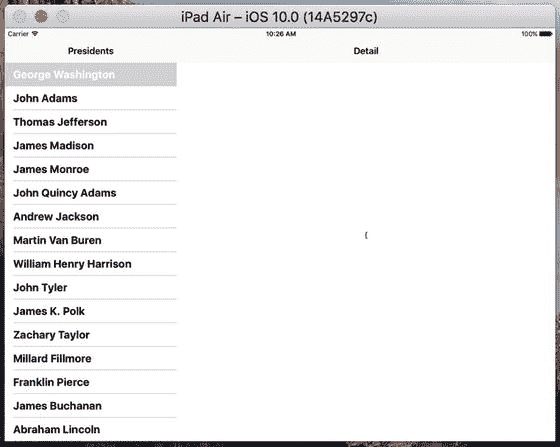

**图 11-9.** 应用的首次运行，主视图控制器中显示总统列表，但详情视图为空

让我们通过让详情视图对其接收的数据做一些更有用的处理来完成这个示例。在`DetailViewContoller.swift`中添加以下粗体行，以创建一个用于显示所选总统维基百科页面的`webView`插座变量：

```
class DetailViewController: UIViewController {
@IBOutlet weak var detailDescriptionLabel: UILabel!
@IBOutlet weak var webView: UIWebView!
```

接下来，向下滚动到`configureView()`方法，并将其替换为代码清单 11-7 中的代码。

```
func configureView() {
// 更新详情项的界面
if let detail = self.detailItem {
if let label = self.detailDescriptionLabel {
let dict = detail as! [String: String]
let urlString = dict["url"]!
label.text = urlString
let url = NSURL(string: urlString)!
let request = URLRequest(url: url as URL)
webView.loadRequest(request)
let name = dict["name"]!
title = name
}
}
}
代码清单 11-7.
configureView 方法
```

主视图控制器设置的`detailItem`是一个包含两个键值对的字典：键`name`存储总统姓名，键`url`提供总统维基百科页面的 URL。我们使用 URL 设置详情描述标签的文本，并构造一个`URLRequest`，供`UIWebView`加载页面。同时，我们使用姓名设置详情视图控制器的标题。当视图控制器作为`UINavigationController`中的容器时，其`title`属性值会显示在导航控制器的导航栏中。这样，我们的网页视图就能加载请求的页面了。


## 排版后的文档

我们最后需要修改的文件是 `Main.storyboard`。打开它进行编辑，在右下角找到详情视图。首先处理 GUI 中的标签（其文本显示为“Detail view content goes here”）。先选中该标签。你会发现，在文档大纲中“Detail Scene”部分选中该标签最为方便。选中标签后，将其拖动到窗口顶部。标签应该从左到右对齐蓝色参考线，并紧贴在导航栏下方（调整其大小以确保如此）。这个标签将被重新用于显示当前 URL。但在应用启动时，用户选择总统之前，我们希望这个字段能给用户一个操作提示。

双击标签，将其文本改为 `Select a President`。你还应使用尺寸检查器确保标签的位置相对于其父视图的左右两侧以及顶部边缘都有约束，如图 11-10 所示。如果需要调整这些约束，请使用前面描述的方法进行设置。通过选中标签，然后选择菜单中的 `Editor ➤ Resolve Auto Layout Issues ➤ Reset to Suggested Constraints`，你几乎可以精确得到你想要的效果。

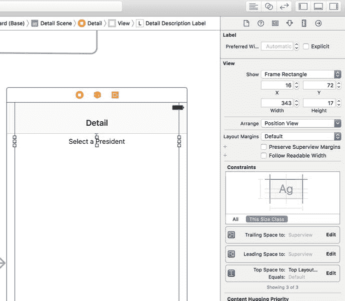

图 11-10. 尺寸检查器，显示“Select a President”标签的约束设置

接下来，在对象库中找到 `UIWebView`，将其拖入你刚刚移动的标签下方的空间。放置好网页视图后，使用调整手柄使其填满标签下方视图的剩余部分。让它从左边延伸到右边，从标签底部下方的蓝色参考线一直延伸到窗口的最底部。现在使用尺寸检查器将网页视图约束到父视图的左侧、底部和右侧边缘，以及顶部边缘的标签。同样，你可以通过选择菜单中的 `Editor ➤ Resolve Auto Layout Issues ➤ Reset to Suggested Constraints` 来精确获得所需效果。

现在在文档大纲中选择主视图控制器，并打开属性检查器。在“View Controller”部分，将标题从 `Master` 改为 `Presidents`。这将把详情视图控制器顶部的导航按钮标题改为更有用的内容。

我们还有最后一步要完成。为了连接你创建的网页视图的 outlet，请按住 Control 键从“Detail”图标（即文档大纲中“Detail Scene”图标正下方的那个）拖动到我们的新网页视图（文档大纲中标签下方的同一部分，或故事板中），并连接 `webView` outlet。保存你的更改。

现在你可以构建并运行应用了。它会让你看到每位总统的维基百科条目，如图 11-11 所示。在两种方向之间旋转显示。你会看到，在详情视图控制器的些许帮助下，分屏视图控制器是如何为你处理一切事务的。

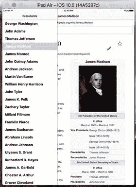

图 11-11. Presidents 应用，显示詹姆斯·麦迪逊的维基百科页面

## 创建你自己的弹出框

回到第 4 章，我们看到可以以类似卡通对话气泡的形式显示操作列表（见图 4-29）。那个对话气泡是弹出框控制器（简称弹出框）的可视化表示。当操作列表由 `UIPopoverPresentationController` 呈现时，你会获得与操作列表一起创建的弹出框。事实证明，你可以使用同一个控制器来创建你自己的弹出框。

为了了解其工作原理，我们将添加一个弹出框，它由一个永久的工具栏项目激活（不同于 `UISplitView` 中那种设计为时隐时现的弹出框）。这个弹出框将显示一个包含语言列表的表格视图。如果用户从列表中选择一种语言，网页视图将加载当前已显示的任何维基百科条目，并使用新语言。这做起来相当简单，因为在维基百科中切换语言只需更改 URL 中包含国家代码的一小部分即可。图 11-3 展示了我们的目标。

> **注意**  
> 在这个示例中，我们使用 `UIPopoverPresentationController` 来显示一个表格视图控制器，但不要因此产生误解——它也可以用来处理你想要的任何视图控制器内容的显示。我们在这个示例中坚持使用表格视图，因为它是一个常见的用例，易于用相对较少的代码展示，并且你应该已经相当熟悉它了。

首先，在 Xcode 中右键点击“Presidents”文件夹，从弹出菜单中选择 `New File…`。当助手出现时，从 iOS 源代码部分选择 `Cocoa Touch Class`，然后点击“Next”。在下一个屏幕上，将新类命名为 `LanguageListController`，并从“Subclass of”字段中选择 `UITableViewController`。点击“Next”，仔细检查文件保存的位置，然后点击“Create”。

`LanguageListController` 将是一个非常标准的表格视图控制器类。它将显示一个项目列表，并通过一个指向详情视图控制器的指针，在选择发生时通知详情视图控制器。编辑 `LanguageListController.swift`，在类名下方添加如下三行代码：

```
class LanguageListController: UITableViewController {
    weak var detailViewController: DetailViewController? = nil
    private let languageNames: [String] = ["英语", "法语", "德语", "西班牙语"]
    private let languageCodes: [String] = ["en", "fr", "de", "es"]
```

这些添加的内容定义了一个指向详情视图控制器的指针（我们将在详情视图控制器自身代码中，在即将显示语言列表时设置该指针），以及两个数组：一个包含要显示的值（英语、法语等），另一个包含用于根据所选语言构建 URL 的基础值（`en`、`fr` 等）。

如果你是从本书的源代码存档（或电子书）中复制粘贴此代码到你的项目，或者自己输入时有些粗心，你可能没有注意到之前声明 `detailViewController` 属性时的一个重要区别。与大多数引用对象指针的属性不同，我们在这里使用 `weak` 而不是 `strong` 来声明它。这样做是为了避免循环引用。


什么是循环引用？循环引用是指两个或多个对象相互引用，形成一个环状结构。每个对象都阻止其他对象的内存被释放。大多数潜在的循环引用可以通过仔细考虑对象的创建方式来避免，通常需要弄清楚哪个对象"拥有"另一个对象。从这个意义上说，`DetailViewController` 的实例拥有 `LanguageListController` 的实例，因为是 `DetailViewController` 实际创建了 `LanguageListController` 来完成某项工作。每当有一对对象需要相互引用时，通常我们会希望拥有者对象保留另一个对象，而另一个对象则明确不应保留其拥有者。由于我们使用苹果公司在 Xcode 4.2 中引入的 ARC 功能，编译器为我们完成了大部分工作。我们不需要关注释放和保留对象的细节，只需使用 `weak` 关键字（而非 `strong`）来声明一个指向我们不拥有的对象的属性即可。其余工作由 ARC 处理。

接下来，向下滚动到 `viewDidLoad()` 方法，并添加以下设置代码：

```
override func viewDidLoad() {
super.viewDidLoad()
clearsSelectionOnViewWillAppear = false
preferredContentSize = CGSize(width: 320, height: (languageCodes.count * 44))
tableView.register(UITableViewCell.self, forCellReuseIdentifier: "Cell")
}
```

这里，我们定义了视图控制器的视图在弹出窗口中显示时的大小（我们知道它确实会显示在弹出窗口中）。如果不定义该大小，弹出窗口会垂直拉伸，几乎填满整个屏幕，即使它完全可以用更小的视图显示。最后，我们注册了一个默认的表格视图单元格类，如第 8 章所述。

再往下看，有几个 Xcode 模板生成的方法，其中没有特别有用的代码——只是一个警告和一些占位文本。让我们用实际内容替换它们：

```
override func numberOfSections(in tableView: UITableView) -> Int {
return 1
}
override func tableView(_ tableView: UITableView, numberOfRowsInSection section: Int) -> Int {
return languageCodes.count
}
```

现在实现 `tableView(_:cellForRow atIndexPath:)` 方法，以获取一个单元格对象并将语言名称放入其中，如代码清单 11-8 所示。

```
override func tableView(_ tableView: UITableView, cellForRowAt indexPath: IndexPath) -> UITableViewCell {
let cell = tableView.dequeueReusableCell(withIdentifier: "Cell", for: indexPath)
// 配置单元格...
cell.textLabel!.text = languageNames[indexPath.row]
return cell
}
代码清单 11-8.
为表格视图获取我们的单元格
```

接下来，实现 `tableView(_:didSelectRowAtIndexPath:)`，以便通过将语言选择传回详细视图控制器，并调用其 `dismissViewControllerAnimated(_:completion:)` 方法来关闭呈现的 `LanguageListController`，从而响应用户的手势：

```
override func tableView(_ tableView: UITableView, didSelectRowAt indexPath: IndexPath) {
detailViewController?.languageString = languageCodes[indexPath.row]
dismiss(animated: true, completion: nil)
}
```

注意

`DetailViewController` 实际上还没有 `languageString` 属性，因此你会看到编译器报错。我们很快就会处理这个问题。

现在是时候对 `DetailViewController` 进行修改，以显示弹出窗口，并在用户更改显示语言或选择不同总统时生成正确的 URL。首先，在 `DetailViewController.swift` 中 `UIWebView` 声明的下方添加以下三行代码。

```
private var languageListController: LanguageListController?
private var languageButton: UIBarButtonItem?
var languageString = ""
```

我们添加了一些属性，用于跟踪弹出窗口所需的 GUI 组件和用户选择的语言。我们现在要做的就是修复 `DetailViewController.swift`，使其能够处理语言弹出窗口和 URL 构建。

首先添加一个函数，该函数接收一个指向 Wikipedia 页面的 URL 和一个两位字母的语言代码，然后返回一个将两者组合的 URL。稍后我们将在控制器代码的适当位置使用此函数，如代码清单 11-9 所示。

```
private func modifyUrlForLanguage(url: String, language lang: String?) -> String {
var newUrl = url
// 我们这里依赖于特定的 Wikipedia URL 格式。这
// 有点脆弱！
if let langStr = lang {
// URL 类似于 https://en.wikipedia...
let range = NSMakeRange(8, 2)
if !langStr.isEmpty && (url as NSString).substring(with: range) != langStr {
newUrl = (url as NSString).replacingCharacters(in: range,
with: langStr)
}
}
return newUrl
}
代码清单 11-9.
获取特定语言 URL 的函数
```

我们的下一步是更新 `configureView()` 方法。该方法将使用我们刚刚定义的函数，将传入的 URL 与选定的 `languageString` 组合，以生成正确的 URL，如代码清单 11-10 所示。

```
func configureView() {
// 为详细项更新用户界面。
if let detail = self.detailItem {
if let label = self.detailDescriptionLabel {
let dict = detail as! [String: String]
//                let urlString = dict["url"]!
let urlString = modifyUrlForLanguage(url: dict["url"]!, language: languageString)
label.text = urlString
let url = URL(string: urlString)!
let request = URLRequest(url: url )
webView.loadRequest(request)
let name = dict["name"]!
title = name
}
}
}
代码清单 11-10.
为特定语言的 URL 更新 configureView 方法
```

现在让我们更新 `viewDidLoad()` 方法。在这里，我们将创建一个 `UIBarButtonItem` 并将其放置到屏幕顶部的 `UINavigationItem` 中。该按钮在被点击时会调用控制器的 `showLanguagePopover()` 方法，我们将很快实现该方法，如代码清单 11-11 所示。

```
override func viewDidLoad() {
super.viewDidLoad()
// 从 nib 加载视图后进行任何其他设置。
self.configureView()
languageButton = UIBarButtonItem(title: "选择语言", style: .plain,
target: self, action:
#selector(DetailViewController.showLanguagePopover))
navigationItem.rightBarButtonItem = languageButton
}
代码清单 11-11.
修改后的 viewDidLoad 方法
```

接下来，我们为 `languageString` 属性实现一个属性观察器，当该属性的值发生改变时会被调用。该属性观察器调用 `configureView()`，以便重新生成包含所选语言的 URL 并加载新页面：

```
var languageString = "" {
didSet {
if languageString != oldValue {
configureView()
}
}
}
```

现在，让我们实现当用户点击“选择语言”按钮时调用的方法。简单来说，我们显示 `LanguageListController`，并在第一次显示时创建它。然后，我们获取其弹出窗口呈现控制器，并设置控制弹出窗口出现位置的属性。将此方法放置在 `viewDidLoad()` 方法之后，如代码清单 11-12 所示。

```
func showLanguagePopover() {
if languageListController == nil {
// 首次使用时惰性创建
languageListController = LanguageListController()
languageListController!.detailViewController = self
languageListController!.modalPresentationStyle = .popover
}
present(languageListController!, animated: true, completion: nil)
if let ppc = languageListController?.popoverPresentationController {
ppc.barButtonItem = languageButton
}
}
代码清单 11-12.
showLanguagePopover 方法
```


### 方法概述

在方法的第一部分，我们检查是否已经创建了 `LanguageListController`。如果尚未创建，则创建一个实例，然后将其 `detailViewController` 属性设置为指向自身。我们还将其 `modalPresentationStyle` 属性设置为 `.popover`。此属性决定了控制器以模态方式显示时的呈现方式。有几种可能的值，你可以在 `UIViewController` 类的文档页面中了解这些值。毫不奇怪，如果你希望控制器以弹出窗口形式呈现，则需要使用 `.popover` 值。

接下来，我们使用 `presentViewController(_:animated:completion:)` 方法使 `LanguageListController` 可见，就像在第 4 章显示警告时那样。调用此方法并不会立即使控制器可见——`UIKit` 会在处理完按钮点击事件后执行此操作——但它确实会创建 `UIPopoverPresentationController` 来管理控制器的弹出窗口。在弹出窗口出现之前，我们需要告诉 `UIKit` 它应该出现在哪里。在第 4 章中，我们通过设置 `UIPopoverPresentationController` 的 `sourceRect` 和 `sourceView` 属性，使用此技术将弹出窗口放置在特定视图附近。在此示例中，我们希望弹出窗口出现在语言按钮附近，可以通过将对按钮的引用赋值给控制器的 `barButtonItem` 属性来实现这一点。

现在，在 iPad 模拟器上运行示例，然后按下“选择语言”按钮。你将发现语言列表控制器以弹出窗口形式显示，如图 11-12 所示。你应该能够使用语言弹出菜单选择四种可用语言中的任何一种，并观察 Web 视图更新以显示该语言版本的总统页面。

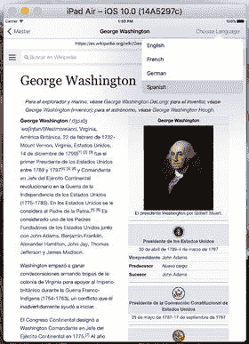

**图 11-12.** 选择以不同语言加载页面

从一种语言切换到另一种语言时，所选总统应保持不变。同样，从一个总统切换到另一个总统时，语言也应保持不变——但实际上并非如此。试试这个：选择一个总统，将语言更改为（例如）西班牙语，然后选择另一个总统。不幸的是，语言不再是西班牙语。

为什么会这样？“显示详情”转场每次被调用时都会创建一个新的详情视图控制器实例。这意味着语言设置（作为详情视图控制器的一个属性存储）每次选择新总统时都会丢失。为了解决这个问题，我们需要在主视图控制器中添加几行代码。打开 `MasterViewController.swift`，并对 `prepareForSegue` 方法进行列表 11-13 所示的更改。

```
override func prepare(for segue: UIStoryboardSegue, sender: AnyObject?) {
    if segue.identifier == "showDetail" {
        if let indexPath = self.tableView.indexPathForSelectedRow {
            let object = presidents[indexPath.row]
            let controller = (segue.destinationViewController as!
                UINavigationController).topViewController as! DetailViewController
            if let oldController = detailViewController {
                controller.languageString = oldController.languageString
            }
            controller.detailItem = object
            controller.navigationItem.leftBarButtonItem =
                self.splitViewController?.displayModeButtonItem()
            controller.navigationItem.leftItemsSupplementBackButton = true
            detailViewController = controller
        }
    }
}
```

**列表 11-13.** 更新后的 `prepareForSegue` 方法

## 本章小结

在本章中，你学习了分割视图控制器及其在创建主-从应用程序中的作用。你还了解到，一个包含多个相互关联视图控制器的复杂应用程序可以完全在 Interface Builder 中进行配置。尽管分割视图现在在所有设备上都可用，但在 iPhone 6/6s Plus 和 iPad 等更大屏幕空间上，它们可能仍然最有用。

