# 12. 使用设置和默认值进行应用自定义

除了最简单的应用之外，你可能会使用的应用通常都会包含一个偏好设置窗口，用户可以在其中设置应用特定的选项。在 macOS 上，你通常会在应用的菜单中找到“偏好设置…”菜单项。选择它会打开一个窗口，用户可以在其中输入和更改各种选项。iPhone 和 iPad 包含一个名为“设置”的专用应用程序，你可能之前使用过。在本章中，我们将向你展示如何为你的 iOS 应用向“设置”应用添加设置，以及如何从应用内部访问这些设置。

## 设置 Bundle

“设置”应用允许用户为任何包含设置 bundle 的应用程序输入和更改偏好设置。设置 bundle 包含一组内置于应用中的文件，这些文件告诉“设置”应用应用希望从用户那里收集哪些偏好设置，如图 12-1 所示。“设置”应用充当 iOS 用户默认值机制的通用用户界面。用户默认值存储和检索应用的偏好设置。

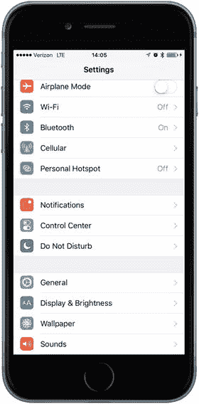

**图 12-1.** 典型 iPhone 屏幕上的“设置”应用

在 iOS 应用中，`NSUserDefaults` 类提供用户默认值服务。如果你在 macOS 上使用 Cocoa 编程过，你可能已经熟悉 `NSUserDefaults`，因为它是用于在 macOS 上存储和读取偏好设置的同一个类。你的应用使用 `NSUserDefaults` 通过键值对来读取和存储偏好设置数据，就像从字典中访问键控数据一样，不同之处在于 `NSUserDefaults` 数据会持久化到文件系统，而不是存储在内存中的对象实例中。在本章中，我们将创建一个应用，添加并配置一个设置 bundle，然后从“设置”应用以及从我们自己的应用内部访问和编辑这些偏好设置。

由于“设置”应用提供了标准界面，你无需为应用的偏好设置设计自己的 UI。你创建一个描述应用可用设置的属性列表，然后“设置”应用会为你创建界面。沉浸式应用（例如游戏）通常应提供自己的偏好设置视图，这样用户无需退出应用即可进行更改。即使是实用工具和生产力应用，有时也可能希望用户在不离开应用的情况下更改偏好设置。我们还将向你展示如何直接在应用中收集用户的偏好设置，并将其存储在 iOS 的用户默认值中。

iOS 允许用户从应用程序切换到“设置”应用，更改偏好设置，然后再切换回仍在运行的应用。我们将在本章末尾介绍如何实现这一点。


## 舰桥控制应用

在本章中，我们将构建一个简单的应用程序，用于管理模拟星舰舰桥的若干操作环节。首先，我们将创建一个设置束，当用户启动“设置”应用时，我们的“舰桥控制”应用会显示一个条目，如图 12-2 所示。

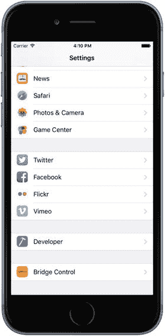

图 12-2. “设置”应用在模拟器中显示我们“舰桥控制”应用的条目

如果用户从图 12-2 的界面中选择我们的应用，“设置”应用将深入显示一个视图，其中包含与我们应用相关的偏好设置。“设置”应用使用文本字段、安全文本字段、开关和滑块来更新数值，如图 12-3 所示。

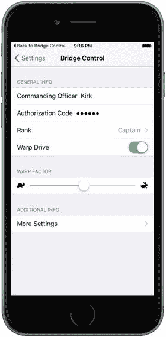

图 12-3. 我们应用的主设置视图

请注意，视图中有两个项目包含展开指示器。第一个是“级别”（Rank），它会将用户带到另一个显示该项目可用选项的表格视图。在该表格视图中，用户可以选择单个值，如图 12-4 所示。

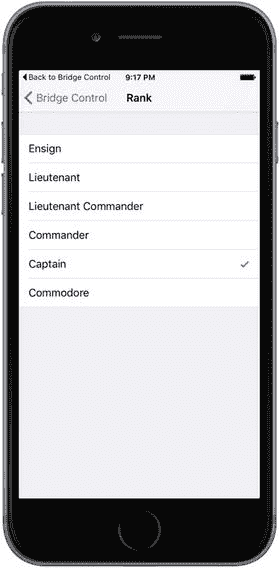

图 12-4. 从列表中选择单个偏好设置项

“更多设置”展开指示器允许用户深入查看另一组偏好设置，如图 12-5 所示。这个子视图可以包含与主设置视图相同的控件类型，甚至可以包含它自己的子视图。“设置”应用使用导航控制器，之所以需要它，是因为它支持构建层级化的偏好设置视图。

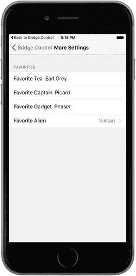

图 12-5. 我们“舰桥控制”应用的子设置视图

当用户启动“舰桥控制”时，它将显示在“设置”应用中收集的偏好设置列表，如图 12-6 所示。

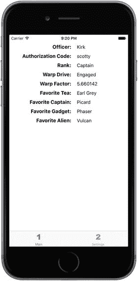

图 12-6. 应用主视图向用户展示偏好设置列表

为了演示如何从应用内部更新偏好设置，“舰桥控制”提供了第二个视图，用户可以直接在应用中更改其他偏好设置，如图 12-7 所示。

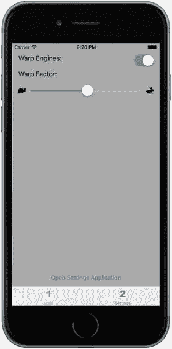

图 12-7. “舰桥控制”允许从应用内部设置部分偏好设置

### 创建舰桥控制项目

在 Xcode 中，按下 ⇧⌘N 或选择“文件”➤“新建”➤“项目...”。当新项目向导出现时，在左侧窗格的 iOS 标题下选择“应用程序”，点击“标签页应用程序”图标，然后点击“下一步”。在下一个屏幕上，将项目命名为“Bridge Control”。将“设备”设置为“通用”，然后点击“下一步”按钮。最后，为项目选择位置并点击“创建”。

“舰桥控制”应用基于我们在第 7 章中使用的 `UITabBarController` 类。模板创建了两个标签页，这正是我们所需要的。每个标签页都需要一个图标。这些图标位于示例源代码存档中的“12 - 图像”文件夹中。在 Xcode 中，选择 `Assets.xcassets`，然后删除 Xcode 模板添加的第一个和第二个图像。现在，通过将“12 - 图像”中的 `singleicon.imageset` 和 `doubleicon.imageset` 文件夹拖入编辑区域，来添加替换图像。

接下来，我们将图标分配给它们的标签栏项目。选择 `Main.storyboard`。你会看到标签栏控制器及其两个标签页的子控制器：一个标记为“第一视图”，另一个标记为“第二视图”。选择第一个子控制器，然后点击其标签栏项目（当前显示一个正方形和标题“First”）。在属性检查器的“栏项目”部分，将“标题”更改为“Main”，并将“图像”更改为 `singleicon`，如图 12-8 所示。现在，选择第二个子控制器的标签栏项目，将标题从“Second”更改为“Settings”，并将图像从“second”更改为 `doubleicon`。目前对应用本身的工作已经足够了——在进一步操作之前，让我们先创建它的设置束。

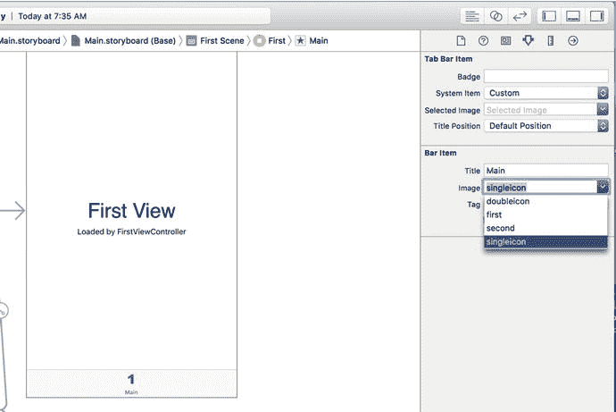

图 12-8. 为第一个标签栏项目设置图标

### 使用设置束

“设置”应用使用每个应用的设置束内容来为该应用构建设置视图。如果某个应用没有设置束，那么“设置”应用就不会为其显示任何内容。每个设置束必须包含一个名为 `Root.plist` 的属性列表，用于定义根级偏好设置视图。这个属性列表必须遵循非常精确的格式，我们将在为应用设置束设置属性列表时讨论这一点。

当“设置”应用启动时，它会检查每个应用的设置束，并为每个包含设置束的应用添加一个设置分组。如果我们希望偏好设置包含任何子视图，我们需要向设置束添加属性列表，并为每个子视图在 `Root.plist` 中添加一个条目。你将在本章中看到如何具体实现。


### 向项目添加设置捆绑包

在项目导航器中，点击 Bridge Control 文件夹，然后选择 文件 ➤ 新建 ➤ 文件… 或按下 `⌘N`。在左侧窗格中，选择 iOS 标题下的 资源，然后选择 设置捆绑包 图标（参见图 12-9）。点击 下一步 按钮，保持默认名称 `Settings.bundle`，然后点击 创建。

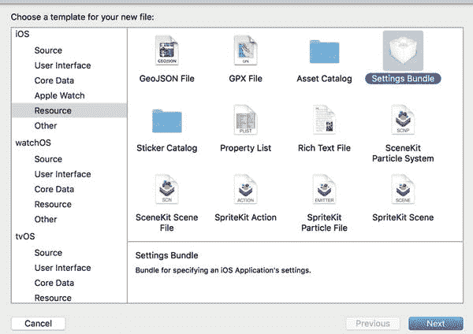

**图 12-9.** 向项目添加设置捆绑包

现在，你应该能在项目窗口中看到一个名为 `Settings.bundle` 的新项目。展开 `Settings.bundle` 项目。你应该会看到两个子项：一个名为 `en.lproj` 的文件夹，其中包含一个名为 `Root.strings` 的文件；另一个是 `Root.plist`。稍后在我们讨论将应用本地化为其他语言时，会再介绍 `en.lproj`。这里，我们将重点讨论 `Root.plist`。

选择 `Root.plist` 并查看编辑器窗格。你看到的是 Xcode 属性列表编辑器，如图 12-10 所示。

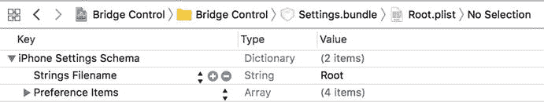

**图 12-10.** 属性列表编辑器窗格中的 `Root.plist`。如果你的编辑窗格看起来略有不同，不必惊慌。只需在编辑窗格中按住 Control 键并点击，然后从出现的上下文菜单中选择 **显示原始键/值**。

请注意属性列表中项目的组织结构。属性列表本质上是字典，它存储项目类型和值，并使用键来检索它们，就像 `Dictionary` 一样。属性列表中可以放入几种不同类型的节点。布尔型、数据型、日期型、数字型和字符串型节点用于存储单个数据，但也有一些处理整个节点集合的方法。除了允许存储其他字典的 `Dictionary` 节点类型外，还有 `Array` 节点，它类似于数组，用于存储其他节点的有序列表。`Dictionary` 和 `Array` 类型是唯一可以包含其他节点的属性列表节点类型。

> **注：** 尽管你可以在 `Dictionary` 节点类型中使用大多数类型的对象作为键，但属性列表字典节点中的键必须是字符串。不过，你可以自由地使用任何节点类型作为值。

创建设置属性列表时，你需要遵循一个非常具体的格式。幸运的是，`Root.plist`（即你刚刚添加到项目中的设置捆绑包自带的属性列表）完全遵循这种格式。让我们来看一下。

在 `Root.plist` 编辑器窗格中，键的名称既可以以真实的“原始”形式显示，也可以以更易读的形式显示。我们非常喜欢尽可能看到事物的真实面貌，因此在编辑器中任意位置右键点击，并确保上下文菜单中的 **显示原始键/值** 选项处于勾选状态，如图 12-11 所示。我们接下来的讨论将使用所有键的真实名称，因此这一步很重要。

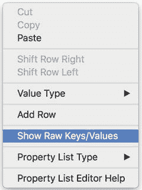

**图 12-11.** 在属性列表编辑窗格中的任意位置右键点击或按住 Control 键点击，并确保 **显示原始键/值** 选项已勾选。这将确保属性列表编辑器中使用真实名称，使你的编辑体验更精确。

> **警告：** 无论是通过编辑其他文件还是退出 Xcode 来离开属性列表，都可能导致 **显示原始键/值** 选项被取消勾选。如果你的文本突然看起来有点不同，请再查看一下该菜单项，确保它已被勾选。

字典中的项目之一是 `StringsTable`。字符串表用于将你的应用翻译成另一种语言。我们将在第 22 章讨论本地化时介绍字符串的翻译。本章不会用到它，但请随意将它保留在项目中，因为它不会造成任何损害。除了 `StringsTable`，属性列表还包含一个名为 `PreferenceSpecifiers` 的节点，它是一个数组。这个数组节点用于保存一组字典节点，每个节点要么代表用户可修改的单个偏好项，要么代表用户可以深入查看的单个子视图。

点击 `PreferenceSpecifiers` 左侧的展开三角形来展开该节点。你会注意到，Xcode 的模板友好地提供了四个子节点，如图 12-12 所示。这些节点并不反映我们此示例中需要的偏好设置，因此请删除项目 1、项目 2 和项目 3（依次选择每个项目并按下 **删除** 键），只保留项目 0。

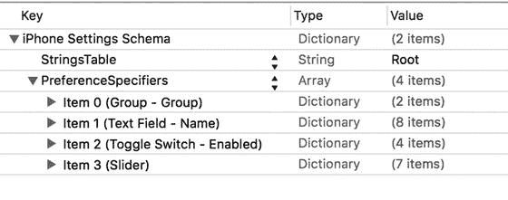

**图 12-12.** 编辑器窗格中的 `Root.plist`，这次展开了 `PreferenceSpecifiers`

> **注：** 要在属性列表中选择一个项目，最好点击 **键** 列的任一侧，以避免弹出 **键** 列的下拉菜单。

单击项目 0 但不要展开它。Xcode 属性列表编辑器允许你只需按下 **回车** 键即可添加行。当前的选中状态——包括选中了哪一行以及它是否展开——决定了新行将插入的位置。当选中一个未展开的数组或字典时，按下 **回车** 会在选中行之后添加一个同级节点。换句话说，它会在当前选择的同一层级添加另一个节点。如果你按下 **回车**（但现在不要这样做），你会在项目 0 之后立即得到一个新行，称为项目 1。图 12-13 展示了按下 **回车** 创建新行的示例。注意出现的下拉菜单，它允许你指定该项目所代表的偏好描述符类型——稍后会有更多说明。

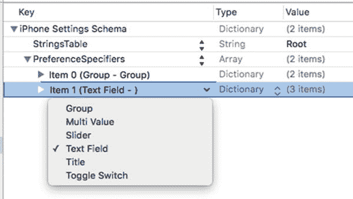

**图 12-13.** 我们选择了项目 0 并按下 **回车** 创建了一个新的同级行。注意出现的下拉菜单，它允许我们指定该项目所代表的偏好描述符类型

现在展开项目 0，查看其包含的内容，如图 12-14 所示。编辑器现在已准备好向选中的项目添加子节点。如果你在此刻按下 **回车**（同样，现在不要实际按下），你将在项目 0 内部得到一个新的第一个子行。

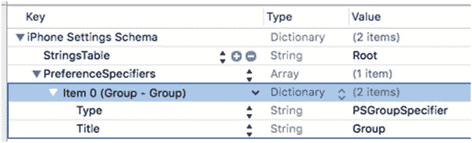

**图 12-14.** 当你展开项目 0 时，会发现一个键为 `Type` 的行和另一个键为 `Title` 的行。这表示一个标题为 `Group` 的组

项目 0 内部的一个项目的键为 `Type`。`PreferenceSpecifiers` 数组中的每个属性列表节点都必须有一个包含此键的条目。`Type` 键告诉“设置”应用与该项目关联的数据类型。在项目 0 中，`Type` 项目的值为 `PSGroupSpecifier`。这表示该项目代表一个新组的开始。之后的每个项目都将属于此组——直到下一个 `Type` 为 `PSGroupSpecifier` 的项目。如果你回头看图 12-3，你会看到“设置”应用以分组表格的形式呈现应用设置。设置捆绑包属性列表中的 `PreferenceSpecifiers` 数组中的项目 0 应始终是 `PSGroupSpecifier`，这样设置才会在一个新组中开始。这一点很重要，因为每个“设置”表格中至少需要一个组。


`Item 0` 中唯一的另一个条目键名为 `Title`，用于在正在启动的组上方设置一个可选的标题。现在仔细查看 `Item 0` 这一行本身，你会发现它实际显示为 `Item 0 (Group – Group)`。括号中的值分别代表 `Type` 项的值（第一个`Group`）和 `Title` 项的值（第二个 `Group`）。这是 Xcode 提供的一个便捷功能，让你能直观地扫描设置包的内容。

如图 12-3 所示，我们将第一个组命名为 `General Info`。双击 `Title` 旁边的值，将其从 `Group` 改为 `General Info`（见图 12-15）。输入新标题时，你可能会注意到 `Item 0` 发生轻微变化，现在显示为 `Item 0 (Group – General Info)` 以反映新标题。在“设置”应用中，标题会以大写形式显示，因此用户实际看到的是 `GENERAL INFO`。这一点你可以在图 12-3 中看到。

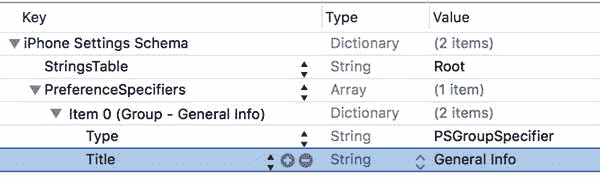

图 12-15.

我们将 `Item 0` 组的标题从 `Group` 改为 `General Info`

### 添加文本字段设置

现在我们需要在这个数组中添加第二个条目，它将代表第一个实际的偏好设置字段。我们从创建一个简单的文本字段开始。如果你在编辑窗格中单击 `PreferenceSpecifiers` 行（请不要真的操作，继续阅读）并按 Return 键添加子项，新行会插入到列表的开头，这不是我们想要的结果。我们希望在数组末尾添加一行。

要添加行，请单击 `Item 0` 左侧的展开三角形将其折叠，然后选中 `Item 0` 并按 Return 键。这会在当前行之后创建一个新的同级行，如图 12-16 所示。像往常一样，添加项目时会弹出一个下拉菜单，显示默认值为 `Text Field`。

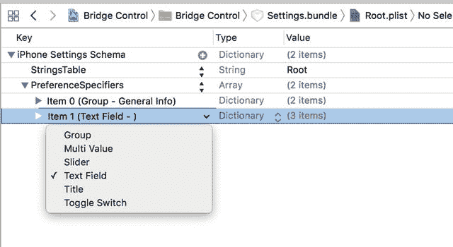

图 12-16.

为 `Item 0` 添加新的同级行

单击下拉菜单外的任意位置使其消失，然后展开 `Item 1` 旁边的展开三角形。你会看到它包含一个设置为 `PSTextFieldSpecifier` 的 `Type` 行。这个 `Type` 值用于告知“设置”应用，我们希望用户通过文本字段编辑此设置。它还包含 `Title` 和 `Key` 两个空行，如图 12-17 所示。

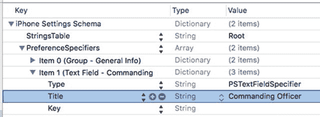

图 12-17.

展开后的文本字段项，显示了类型、标题和键

选中 `Title` 行，然后双击“值”列的空白区域。输入 `Commanding Officer` 设置 `Title` 值。这是显示在“设置”应用中的文字。

接下来对 `Key` 行执行相同操作（不，这不是笔误，你确实在操作一个名为 `Key` 的键）。在值字段中输入 `officer`（注意首字母小写）。这是在存储此文本字段输入值时使用的键。

还记得我们提到过的 `NSUserDefaults` 吗？它允许你使用类似 `Dictionary` 的键来存储值。实际上，“设置”应用在为你保存每个偏好设置时也会做同样的事情。如果你给它一个键值 `foo`，那么在你后续的应用中，你可以请求 `foo` 的值，它会返回用户为该偏好设置输入的值。稍后我们将在应用中使用键值 `officer` 从用户默认设置中检索此设置。

**注意**

我们的 `Title` 值为 `Commanding Officer`，而 `Key` 值为 `officer`。这种大小写差异很常见，这里我们甚至用多个单词作为显示标题，用单个单词作为键来加剧这种差异。`Title` 是屏幕显示的内容，因此首字母 C 和 O 大写，单词之间加空格，都是合理的。`Key` 是我们用来从用户默认设置中检索偏好设置的文本字符串，因此全小写同样合理。我们能对 `Title` 使用全小写吗？当然可以。我们也能对 `Key` 使用全大写。只要在保存和检索时大小写一致，偏好设置键使用哪种命名规则并不重要。

现在选中 `Item 1` 三个条目中的最后一个（键名为 `Key` 的那一行），按 Return 键向 `Item 1` 字典中添加另一个条目，设置其键名为 `AutocapitalizationType`。请注意，一旦你开始输入 `AutocapitalizationType`，Xcode 会给出匹配选项列表，你可以直接从列表中选择，无需完整输入。输入 `AutocapitalizationType` 后，按 Tab 键或单击“值”列右侧的上下箭头图标打开列表，选择可用选项。选择 `Words`。这表示文本字段会自动将用户在此字段中输入的每个单词首字母大写。

创建最后一个新行，设置键名为 `AutocorrectionType`，值为 `No`。这将告知“设置”应用不要自动更正此文本字段中输入的值。在任何你希望文本字段使用自动更正的情况下，你可以将此行的值设置为 `Yes`。同样，当你开始输入 `AutocorrectionType` 时，Xcode 会显示匹配选项列表，并通过弹出窗口展示有效选项。

完成上述操作后，你的属性列表应如图 12-18 所示。

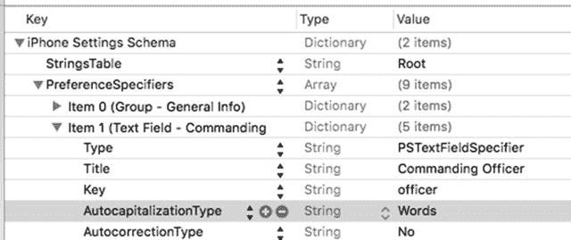

图 12-18.

`Root.plist` 中指定的已完成文本字段


### 添加应用程序图标

在尝试我们的新设置之前，先为项目添加一个应用程序图标。这一步你之前已经做过，所以步骤应该很熟悉。首先，保存你刚刚编辑的属性文件`Root.plist`。接下来，使用项目导航器选择`Assets.xcassets`条目，然后选择它包含的`AppIcon`条目。在那里，你会找到一组可以放置图标的拖放目标。

在访达中，首先导航到源代码存档，然后进入`12 - Images`文件夹。在 Xcode 的编辑器视图`Assets.xcassets`中，从上到下依次操作，将`12 - Images`文件夹中的文件拖放如下：

*   将`Settings-iPhone@2x.png`和`Settings-iPhone@3x.png`分别拖放到左上角组的`2x`和`3x`插槽中。
*   将`Spotlight-iPhone@2x.png`和`Spotlight-iPhone@3x.png`分别拖放到右上角组的`2x`和`3x`插槽中。
*   将`AppIcon-iPhone@2x.png`和`AppIcon-iPhone@3x.png`拖放到第二行组的`2x`和`3x`插槽中。
*   将`Settings-iPad.png`和`Settings-iPad@2x.png`拖放到第三行左侧组的`1x`和`2x`插槽中。
*   将`Spotlight-iPad.png`和`Spotlight-iPad@2x.png`拖放到第三行右侧组的`1x`和`2x`插槽中。
*   将`AppIcon-iPad.png`和`AppIcon-iPad@2x.png`拖放到底部行组的`1x`和`2x`插槽中。
*   将`AppIcon-iPadPro.png`拖放到右下角的`iPad Pro`插槽中。

执行这些操作时，请留意 Xcode 的活动视图：如果你将图像放错了插槽，会出现一个警告三角形。如果发生这种情况，请在继续之前修复问题。完成后，编辑器应如图 12-19 所示。

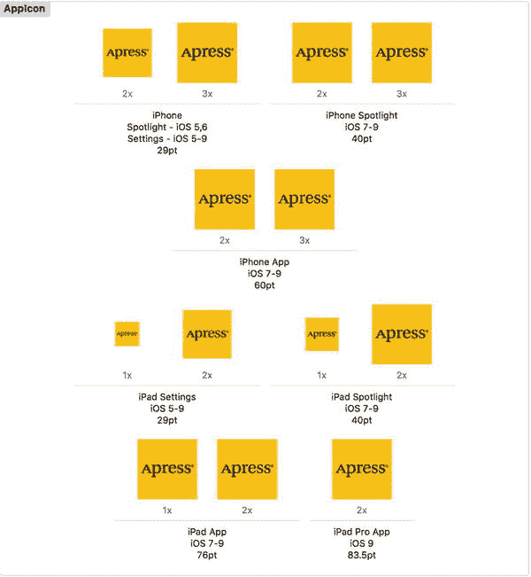

图 12-19. 为我们的应用程序添加设置和应用程序图标

就是这样。通过选择`Product` ➤ `Run`来构建并运行应用程序。你还没有为应用程序构建任何图形用户界面，因此只会看到标签栏控制器的第一个标签。按下主页按钮（或在模拟器上按下`⌘⇧H`），然后点击“设置”应用程序的图标。向下滚动，你会找到我们应用程序的条目，它使用了之前添加的图标（见图 12-2）。点击`Bridge Control`行。你将看到一个包含单个文本字段的简单设置视图，如图 12-20 所示。

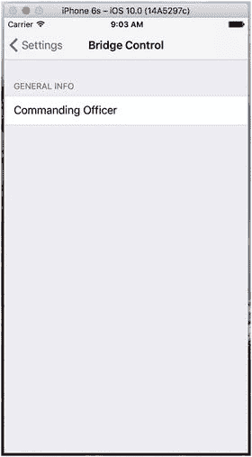

图 12-20. 添加一个组和一个文本字段后，“设置”应用程序中的根视图

我们还没有完成，但你现在应该已经意识到为应用程序添加偏好设置是多么容易。让我们为根设置视图添加其余字段。我们首先要添加的是一个用于用户授权码的安全文本字段。

### 添加安全文本字段设置

回到 Xcode，点击`Root.plist`返回到你的设置说明符（不要忘记开启“显示原始键/值”，假设 Xcode 的编辑区域已经重置了此设置）。折叠`Item 0`和`Item 1`，然后选择`Item 1`。按下`⌘C`将其复制到剪贴板，然后按下`⌘V`粘贴回来。这将创建一个与`Item 1`完全相同的新`Item 2`。展开新条目，将标题（`Title`）更改为`Authorization Code`，并将键（`Key`）更改为`authorizationCode`。请记住，`Title`是屏幕上标签显示的内容，而`Key`用于保存值。

接下来，给新条目再添加一个子项。请记住，项目的顺序无关紧要，因此可以将其直接放在你刚刚编辑的`Key`项下方。为此，选择`Key`/`authorizationCode`行，然后按回车键。

给新条目一个键（`Key`）`IsSecure`（注意大写开头的`I`），然后按`Tab`键。你会看到 Xcode 自动将类型（`Type`）更改为`Boolean`。现在将其值（`Value`）从`NO`更改为`YES`，这告诉“设置”应用程序该字段需要像密码字段一样隐藏用户的输入，而不是像普通文本字段那样。最后，将`AutocapitalizationType`更改为`None`。我们完成的`Item 2`如图 12-21 所示。

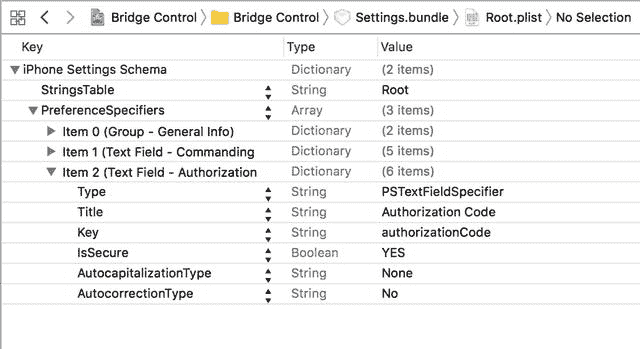

图 12-21. 我们完成的`Item 2`，一个设计用于接受`authorizationCode`的文本字段


## 添加多值字段

接下来我们要添加的是一个多值字段。这种字段类型会自动生成带有展开指示符的行。点击它，用户就可以向下钻取到另一个表格，并从中选择一行。折叠项目 2，选中该行，然后按回车键添加项目 3。使用附加在键（Key）字段上的弹出菜单选择“多值”（Multi Value），然后点击展开三角形展开项目 3。

展开后的项目 3 已经包含了几行。其中有一行是类型（Type）行，其值被设置为 `PSMultiValueSpecifier`。找到标题（Title）行，将其值设置为“军衔”（Rank）。接着找到键（Key）行，将其值设置为 `rank`。接下来的部分有点棘手，所以我们先讨论一下再操作。

我们将为项目 3 再添加两个子节点，但它们将是数组（Array）类型的节点，而不是字符串（String）类型的节点，具体如下：

-   一个名为“标题”（Titles）的数组，将保存用户可供选择的值列表。
-   另一个名为“值”（Values）的数组，将保存存储在用户默认设置（User Defaults）中的对应值列表。

因此，如果用户选择了列表中的第一项（对应于 Titles 数组中的第一项），设置应用实际上会存储 Values 数组中的第一个值。这种 Titles 和 Values 的配对方式让您可以为用户显示友好的文本，但实际上存储的是其他内容，例如数字、日期或不同的字符串。这两个数组都是必需的。如果您希望它们内容相同，可以先创建一个数组，复制它，再粘贴回去，然后修改键（Key）名称，这样就能得到两个内容相同、但存储在不同键名下的数组。我们接下来就要这样做。

选中项目 3（保持展开状态），然后按回车键添加一个新子节点。您会看到，Xcode 再次识别出我们正在编辑的文件类型，甚至似乎预判了我们要做什么：新的子行已经将“键”（Key）设置为 Titles，并且被配置为数组类型，这正是我们想要的！按回车键结束对键（Key）字段的编辑，然后展开 Titles 行，再按回车键添加一个子节点。重复此操作五次，这样您总共会有六个子节点。所有六个节点都应设置为字符串（String）类型，并赋予以下值：准尉（Ensign）、中尉（Lieutenant）、上尉（Lieutenant Commander）、少校（Commander）、上校（Captain）和准将（Commodore）。

创建完所有六个节点并输入值后，折叠 Titles 行并选中它。接着，按 ⌘C 复制它，再按 ⌘V 粘贴回来。这将创建一个键名为“Titles - 2”的新项目。双击键名“Titles - 2”，将其改为“Values”。

我们的多值字段就快完成了。字典里还有一个必需的值，那就是默认值。多值字段必须选中一行——且只能选中一行。因此，我们需要指定在未作任何选择时要使用的默认值；它必须对应于 Values 数组中的某一项（如果与 Titles 数组不同的话，则不要对应 Titles 数组的项）。在我们创建该项目时，Xcode 已经添加了一个“默认值”（`DefaultValue`）行，所以我们现在要做的只是将其值设置为“准尉”（Ensign）。现在就去操作吧。图 12-22 展示了项目 3 的最终版本。

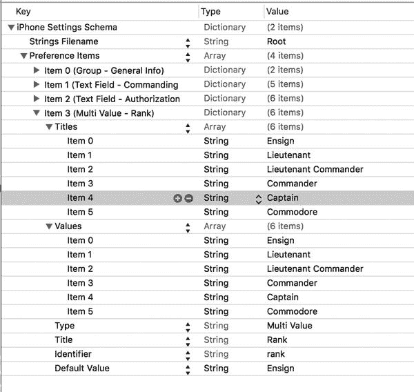

图 12-22. 我们完成后的项目 3，这是一个多值字段，旨在让用户从六个可选值中选择一个

让我们检查一下工作成果。保存属性列表，再次构建并运行应用程序。当您的应用启动后，按下 Home 键并启动“设置”应用。当您选择“Bridge Control”时，应该在根级视图上看到三个字段，如图 12-23 所示。随意操作一番，然后我们继续。

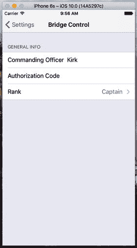

图 12-23. 我们的三个字段已经实现完成

## 添加开关切换设置

接下来需要从用户那里获取的是一个布尔值，用于指示我们的曲速引擎是否应该开启。为了在偏好设置中捕获布尔值，我们将通过在 `PreferenceSpecifiers` 数组中再添加一个类型为 `PSToggleSwitchSpecifier` 的项目，来告诉“设置”应用使用 `UISwitch`。

如果项目 3 当前是展开的，则折叠它，然后单击选中它。按回车键创建项目 4。使用下拉菜单选择“开关”（Toggle Switch），然后点击展开三角形展开项目 4。您会看到已经有一个键为 Type、值为 `PSToggleSwitchSpecifier` 的子行。将空的 Title 行值设置为“曲速引擎”（Warp Drive），并将 Key 行值设置为 `warp`。

这个字典中还有一个必需项，即默认值。与多值设置类似，Xcode 已经为我们创建了一个“默认值”（`DefaultValue`）行。让我们默认开启曲速引擎，将 `DefaultValue` 行的值设置为 YES。图 12-24 展示了完成后的项目 4。

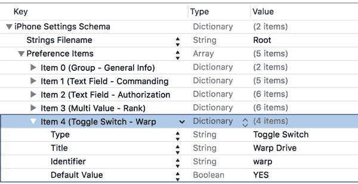

图 12-24. 我们完成后的项目 4，一个用于开关曲速引擎的切换开关

## 添加滑块设置

接下来需要实现的是滑块。在“设置”应用中，滑块两端可以带小图片，但不能带标签。让我们把滑块放在一个带有标题头（header）的独立分组中，这样用户就能知道滑块的作用。首先折叠项目 4。现在单击项目 4，然后按回车键创建新行。使用弹出菜单将新项目转换为“分组”（Group），然后点击该项目的展开三角形将其展开。您会看到 Type 已经设置为 `PSGroupSpecifier`。这将会告诉“设置”应用在此位置开始一个新的分组。双击 Title 行中的值，将其改为“曲速系数”（Warp Factor）。

折叠项目 5 并选中它，然后按回车键添加一个同级新行。使用弹出菜单将新项目改为“滑块”（Slider），这将指示“设置”应用使用 `UISlider` 来获取用户输入的该信息。展开项目 6，将 Key 行的值设置为 `warpFactor`，以便“设置”应用知道存储此值时使用哪个键。

我们将允许用户输入从 1 到 10 的值。我们将默认值设置为曲速 5。滑块需要有最小值、最大值和起始值（即默认值）；所有这些值在属性列表中都必须存储为数字，而不是字符串。幸运的是，Xcode 已经为所有这些值创建了行。将 `DefaultValue` 行的值设置为 5，`MinimumValue` 行的值设置为 1，`MaximumValue` 行的值设置为 10。

如果您想测试滑块，现在就可以进行。我们将再进行一些自定义设置。如前所述，您可以在滑块两端各放置一张图片。让我们提供一些小图标，以表明将滑块向左移动会减速，向右移动会加速。


#### 向设置捆绑包添加图标

在本节附带的项目归档的`12 - Images`文件夹中，你将找到名为`rabbit.png`和`turtle.png`的两个图标。我们需要将这两个图标都添加到设置捆绑包中。由于这些图像需要被“设置”应用使用，我们不能仅仅将它们放在`Bridge Control`文件夹中；我们需要把它们放入设置捆绑包，这样“设置”应用才能访问它们。为此，我们需要在访达中打开设置捆绑包。在项目导航器中按住 Control 键点击`Settings.bundle`图标，当上下文菜单出现时，选择`Show in Finder`（如图 12-25 所示），以在访达中显示该捆绑包。

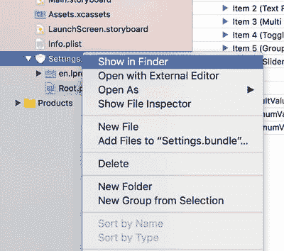

图 12-25. `Settings.bundle` 上下文菜单

请记住，捆绑包在访达中看起来像文件，但它们实际上是文件夹。当访达窗口打开显示`Settings.bundle`文件时，按住 Control 键点击该文件，并从出现的上下文菜单中选择`Show Package Contents`。这将在新的访达窗口中打开设置捆绑包。你应该会看到与 Xcode 中`Settings.bundle`里相同的两个项目。将`rabbit.png`和`turtle.png`这两个图标文件，从`12 - Images`文件夹复制到访达窗口中`Settings.bundle`包的内容里，放在`en.proj`和`Root.plist`旁边。你可以让这个窗口在访达中保持打开状态，因为我们很快还需要复制另一个文件。现在我们将回到 Xcode，并告诉滑块使用这两个图像。

回到 Xcode，返回`Root.plist`，在`Item 6`下再添加两个子行。其中一个将键（Key）设为`MinimumValueImage`，值（Value）设为`turtle`。另一个将键设为`MaximumValueImage`，值设为`rabbit`。图 12-26 显示了我们完成的`Item 6`。

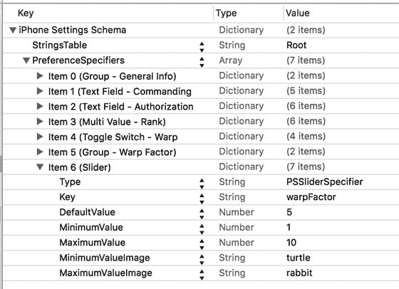

图 12-26. 完成的`Item 6`：一个带有乌龟和兔子图标的滑块，分别表示慢速和快速

保存属性列表，然后构建并运行应用，确保一切按预期工作。你应该能够导航到“设置”应用，并找到等待你的滑块，其两端分别是困倦的乌龟和欢快的兔子，如图 12-27 所示。

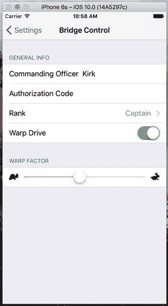

图 12-27. 我们有文本字段、多值字段、一个切换开关和一个滑块

#### 添加子设置视图

我们将添加另一个偏好设置说明符，以告知“设置”应用我们想要显示一个子设置视图。此说明符会呈现一个带有展开指示符的行，当点击时，会将用户带到包含大量偏好设置的全新视图。

由于我们不希望这个新的偏好设置与滑块分在同一组，我们首先复制`Item 0`中的组说明符，并将其粘贴到`PreferenceSpecifiers`数组的末尾，为我们的子设置视图创建一个新组。在`Root.plist`中，折叠所有展开的项目，然后单击`Item 0`选中它，并按`⌘C`将其复制到剪贴板。接下来，选择`Item 6`，然后按`⌘V`粘贴出一个新的`Item 7`。展开`Item 7`，双击键`Title`旁边的`Value`列，将其从`General Info`更改为`Additional Info`。

现在再次折叠`Item 7`。选中它并按`Return`键添加`Item 8`，这将是我们的实际子视图。点击展开三角形将其展开。找到`Type`行，将其值设为`PSChildPaneSpecifier`，然后将`Title`行的值设为`More Settings`。我们需要为`Item 8`添加最后一行，这将告诉“设置”应用为`More Settings`视图加载哪个属性列表。添加另一个子行，将其键设为`File`（你可以通过将该组中最后一行的键从`Key`更改为`File`来实现），值设为`More`（见图 12-28）。文件扩展名`.plist`是默认的，不得包含在内（如果包含了，“设置”应用将找不到`.plist`文件）。

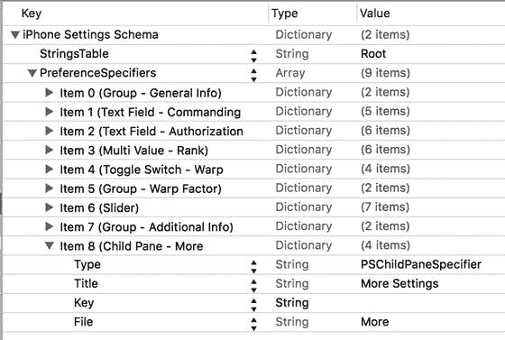

图 12-28. 完成的`Items 7`和`8`，设置了新的`Additional Info`设置组，并提供了指向文件`More.plist`的子窗格链接

我们正在向主偏好设置视图添加一个子视图。我们已配置设置捆绑包，以指示该子视图中的设置是在`More.plist`文件中指定的，因此我们需要将一个名为`More.plist`的文件添加到设置捆绑包中。我们无法在 Xcode 中向捆绑包添加新文件，并且属性列表编辑器的“保存”对话框也不允许我们保存到捆绑包中，因此我们需要创建一个新的属性列表，将其保存在别处，然后使用访达将其拖入`Settings.bundle`窗口。当你创建自己的子设置视图时，最简单的方法是复制一份`Root.plist`并为其命名，然后删除除第一个之外的所有现有偏好设置说明符，并为该新文件添加你需要的任何偏好设置说明符。为了省去这些麻烦，你可以从本书附带项目归档的`12 - Images`文件夹中获取`More.plist`文件，然后将其拖入我们之前打开的`Settings.bundle`窗口中，放在`Root.plist`旁边。

现在，我们的设置捆绑包已全部完成。请随意构建、运行和测试“设置”应用。你应该能够进入子视图并为所有其他字段设置值。请尽情尝试，如果想的话，还可以对属性列表进行更改。

**提示**

我们已经介绍了几乎所有可用的配置选项（至少在撰写本文时）。你可以在 iOS 开发中心名为`Settings Application Schema Reference`的文档中找到设置属性列表格式的完整文档。你可以从以下页面获取该文档以及大量其他有用的参考文档：[`http://developer.apple.com/library/ios/navigation/`](http://developer.apple.com/library/ios/navigation/)。

在继续之前，在 Xcode 的项目导航器中选择`Assets.xcassets`项目，然后将项目归档中`12 - Images`文件夹里的`rabbit.png`和`turtle.png`图标复制到编辑器区域的左侧。这将把这些图标作为新的图像资源添加到项目中，可供使用。我们将在应用程序中使用它们来显示当前设置的值。

你可能已经注意到，你刚刚添加的两个图标与之前添加到设置捆绑包中的完全相同。你可能想知道为什么我们将它们两次添加到 Xcode 项目中。请记住，iOS 应用程序无法读取其他应用程序沙盒中的文件。设置捆绑包不会成为我们应用沙盒的一部分——它会成为“设置”应用沙盒的一部分。由于我们还想在应用中使用这些图标，我们需要单独将它们添加到`Assets.xcassets`中，这样它们也会被复制到我们应用的沙盒中。

### 在应用程序中读取设置

现在我们已经解决了问题的一半。用户可以使用“设置”应用声明他们的偏好设置，但我们如何从应用程序内部获取这些设置呢？事实证明，这是简单的一步。在我们编写代码检索设置之前，请打开“设置”应用，找到我们应用的设置，并为每个设置设置一个值，以便应用程序在我们即将创建的用户界面中有内容可以显示。


好的，作为高级文档工程师和翻译员，我将根据您提供的注意事项和示例，将给定的英文文本翻译成中文。


### 检索用户设置

我们将使用一个名为 `UserDefaults (NSUserDefaults)` 的类来访问用户的设置。`UserDefaults` 以单例模式实现，这意味着只有一个 `UserDefaults` 实例来保存我们应用程序的设置。要访问该唯一实例，我们调用类方法 `standard`，如下所示：

```
let defaults = UserDefaults.standard
```

一旦我们获得了标准用户默认项的指针，就可以像使用 `Dictionary` 一样使用它。要从其中获取一个值，我们可以调用 `object( forKey: )`，该方法会返回一个对象，一个 `String` 或一个 `Foundation` 对象，例如 `Date (NSDate)` 或 `NSNumber`。如果我们想以标量形式（如 `int`、`float` 或 Boolean）检索该值，我们可以使用其他方法，例如 `int( forKey: )`、`float( forKey: )` 或 `bool( forKey: )`。

在您为此应用程序创建属性列表时，实际上是在一个 `.plist` 文件内部创建了一个 `PreferenceSpecifiers` 数组。在“设置”应用程序中，其中一些说明符用于创建组，而另一些则用于创建供用户交互的界面对象。这些才是我们真正感兴趣的说明符，因为它们保存着真实设置数据的键。每个与用户设置绑定的说明符都有一个名为 `Key` 的 `Key`。花点时间回去检查一下。例如，我们滑块的 `Key` 的值为 `warpFactor`，而授权代码字段的 `Key` 为 `authorizationCode`。我们将使用这些键来检索用户设置。

我们不会在方法中直接使用字符串作为每个键，而是为这些值定义一些常量。这样，我们就可以在代码中使用这些常量，而不是内联字符串，从而避免因输入错误而带来的风险。我们将在单独的 Swift 文件中设置这些常量，因为稍后我们会在多个类中使用其中的一些常量。所以，在 Xcode 中，按下 `⌘N`，然后在文件创建窗口的 iOS 部分，选择 Source，然后选择 Swift File。按下 Next，将文件命名为 `Constants.swift` 并点击 Create。打开新创建的文件，并添加代码清单 12-1 中的代码。

```
let officerKey = "officer"
let authorizationCodeKey = "authorizationCode"
let rankKey = "rank"
let warpDriveKey = "warp"
let warpFactorKey = "warpFactor"
let favoriteTeaKey = "favoriteTea"
let favoriteCaptainKey = "favoriteCaptain"
let favoriteGadgetKey = "favoriteGadget"
let favoriteAlienKey = "favoriteAlien"
代码清单 12-1.
我们的常量
```

这些常量是我们为不同偏好字段在 `.plist` 文件中使用的键。现在我们已经有了一个显示设置的位置，让我们快速用一组标签来设置主视图。在转到 Interface Builder 之前，让我们先为我们需要的所有标签创建插座。单击 `FirstViewController.swift`，并按照代码清单 12-2 进行修改。

```
class FirstViewController: UIViewController {
@IBOutlet var officerLabel:UILabel!
@IBOutlet var authorizationCodeLabel:UILabel!
@IBOutlet var rankLabel:UILabel!
@IBOutlet var warpDriveLabel:UILabel!
@IBOutlet var warpFactorLabel:UILabel!
@IBOutlet var favoriteTeaLabel:UILabel!
@IBOutlet var favoriteCaptainLabel:UILabel!
@IBOutlet var favoriteGadgetLabel:UILabel!
@IBOutlet var favoriteAlienLabel:UILabel!
代码清单 12-2.
将插座添加到 FirstViewController.swift 文件
```

这里没有任何新内容——我们声明了九个属性，全部都是带有 `@IBOutlet` 关键字的标签，以便在 Interface Builder 中连接它们。保存您的更改。现在我们已经声明了插座，让我们前往故事板文件来创建用户界面。

### 创建主视图

选择 `Main.storyboard` 在 Interface Builder 中进行编辑。打开后，您会看到左侧的标签栏视图控制器以及右侧两个选项卡的视图控制器，一个在另一个上方。上面的那个是第一个选项卡，对应于 `FirstViewController` 类，下面的那个是第二个选项卡，将在 `SecondViewController` 类中实现。

我们将从向 `FirstViewController` 的视图添加一组标签开始，使其看起来像图 12-29 所示。我们总共需要 18 个标签。其中一半，在屏幕左侧，将右对齐并加粗；另一半，在屏幕右侧，将用于显示从用户默认项中检索到的实际值，并且将有指向它们的插座。我们在此进行的所有更改都将应用于第一个选项卡的视图控制器，即故事板右侧上方的那个。

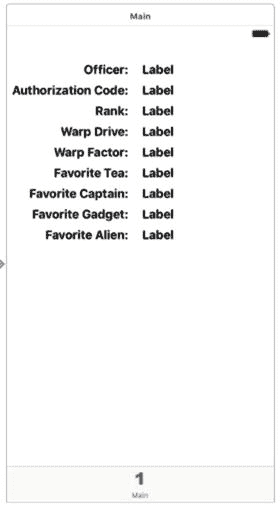

图 12-29.

Interface Builder 中第一个选项卡的视图控制器，显示了我们添加的 18 个标签

首先，在文档大纲中展开 Main Scene 节点，然后展开 View 项。你会发现已经有两个子视图——将它们都删除。现在，从对象库中拖拽一个 Label 放到故事板中视图的左上角附近。将其一直拖拽到窗口的左侧（或至少到左侧的蓝色参考线），然后通过将其右边缘向视图中心拖拽来加宽它，就像图 12-29 中的 Officer 标签一样。在属性检查器中，将文本设置为右对齐，并将字体更改为 System Bold 17。现在，按住 Option 键向下拖拽该标签以创建另外八个副本，并将它们整齐排列以形成左列。更改标签文本，使其与图 12-29 中的文本匹配。

构建右列稍微容易一些。将另一个标签拖拽到视图上，并将其放置在 Officer 标签的右侧，两者之间留一个小间隙。在属性检查器中，将字体设置为 System 17。按住 Option 键向下拖拽此标签以创建另外八个副本，每个副本都与左列中相应的标签对齐。

现在我们需要设置自动布局约束。让我们先从链接顶部两个标签开始。按住 Control 键从 Officer 标签拖拽到其右侧的标签。松开鼠标，然后按住 Shift 键。在弹出的菜单中，选择 Horizontal Spacing 和 Baseline，然后点击弹出菜单外部。对其他八行重复相同操作，以链接每对标签。

接下来，我们将固定左列标签相对于视图左侧和顶部的位置。在文档大纲中，按住 Control 键从 Officer 标签拖拽到其父视图。松开鼠标，按住 Shift 键并选择 Leading Space to Container Margin 和 Vertical Spacing to Top Layout Guide，然后按 Return 应用约束。对左列中的其他八个标签重复相同操作。

最后，我们需要固定左列标签的宽度。选择 Officer 标签，然后点击故事板编辑器下方的 Pin 按钮。在弹出窗口中，选中 Width 复选框，然后点击 Add 1 Constraint。对左列中的所有标签重复此过程。

现在，所有标签应该都已正确约束，因此在文档大纲中选择视图控制器 Main，然后点击 Xcode 菜单中的 Editor ➤ Resolve Auto Layout Issues ➤ Update Frames。（如果此选项未启用，则表明所有标签已经在故事板中处于正确位置）。如果一切顺利，标签将移动到其最终位置。

接下来我们需要做的是将右列中的标签连接到它们的插座。在助理编辑器中打开 `FirstViewController.swift`，然后按住 Control 键从右列的顶部标签拖拽到 `officerLabel` 插座以连接它们。按住 Control 键从右列的第二个标签拖拽到 `authorizationLabel`，并重复此操作，直到右列中的所有九个标签都连接到它们的插座。保存 `Main.storyboard` 文件。


#### 更新第一个视图控制器

在 Xcode 中，选择 `FirstViewController.swift`，并在类的底部添加代码清单 12-3 中的代码。

```
func refreshFields() {
    let defaults = UserDefaults.standard
    officerLabel.text = defaults.string(forKey: officerKey)
    authorizationCodeLabel.text = defaults.string(forKey: authorizationCodeKey)
    rankLabel.text = defaults.string(forKey: rankKey)
    warpDriveLabel.text = defaults.bool(forKey: warpDriveKey)
    ? "已启动" : "已禁用"
    warpFactorLabel.text = defaults.object(forKey: warpFactorKey)?.stringValue
    favoriteTeaLabel.text = defaults.string(forKey: favoriteTeaKey)
    favoriteCaptainLabel.text = defaults.string(forKey: favoriteCaptainKey)
    favoriteGadgetLabel.text = defaults.string(forKey: favoriteGadgetKey)
    favoriteAlienLabel.text = defaults.string(forKey: favoriteAlienKey)
}

override func viewWillAppear(_ animated: Bool) {
    super.viewWillAppear(animated)
    refreshFields()
}
```

这里的内容其实并不复杂，不会让你感到困惑。`refreshFields()` 方法做了两件事：首先，它获取标准用户默认设置；其次，它使用我们在 `.plist` 文件中使用的相同键值，从用户默认设置中获取对应的对象，并设置所有标签的文本属性。请注意，对于 `warpFactorLabel`，我们在返回的对象上调用了 `string` 方法。我们的其他偏好设置大多是字符串，它们从用户默认设置中以 `String` 对象的形式返回。然而，滑杆存储的偏好设置以 `NSNumber` 形式返回，但为了显示，我们需要字符串，因此我们对其调用了 `string` 方法，以获取它所包含值的字符串表示形式。

之后，我们重写了父类的 `viewWillAppear()` 方法，并在其中调用了 `refreshFields()` 方法。这会导致每当视图出现时——包括应用启动时以及用户从第二个标签页切换到第一个标签页时——显示的值都会更新。

现在运行应用程序。你应该会看到为第一个标签页构建的用户界面，其中大部分字段都填充了你之前在“设置”应用中输入的值。不过，有些字段会是空的。别担心，这不是一个 bug。信不信由你，这是正确的行为。你将在接下来的“注册默认值”部分看到原因以及如何修复它。

### 从我们的应用中更改默认值

既然主视图已经正常运行，现在我们来构建第二个标签页。如图 12-30 所示，第二个标签页包含我们的曲速引擎开关以及曲速因子滑杆。我们将使用与“设置”应用相同的控件来处理这两个项目：一个开关和一个滑杆。除了声明输出口之外，我们还会像在 `FirstViewController` 中那样声明一个名为 `refreshFields()` 的方法，以及两个动作方法，它们将在用户操作控件时被触发。

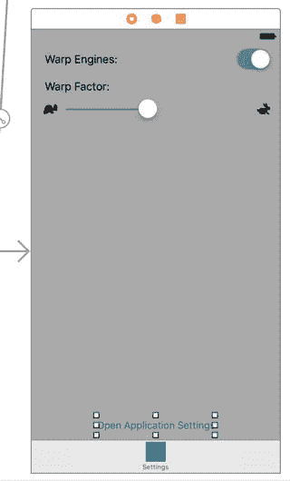

选择 `SecondViewController.swift`，并进行以下更改：

```
class SecondViewController: UIViewController {
    @IBOutlet var engineSwitch:UISwitch!
    @IBOutlet var warpFactorSlider:UISlider!
```

现在，保存你的更改，并选择 `Main.storyboard` 在 Interface Builder 中编辑 GUI，这次重点关注文档大纲中的“设置场景”。按住 Option 键，点击展开三角形以展开“设置场景”及其下的所有内容。找到“视图”节点，删除它的两个子节点。接着，选择“视图”节点，然后调出属性检查器。使用“背景”弹出菜单选择“浅灰色”，以更改背景颜色。

接下来，从库中拖出两个标签，并将它们放置在故事板的视图上。确保将它们拖到“设置场景”控制器上，即故事板右下角的那一个。双击其中一个标签，将其文本改为“曲速引擎：”。双击另一个标签，将其文本改为“曲速因子：”。将两个标签都靠左对齐，一上一下放置。你可以参考图 12-30 作为放置指南。

接着，从库中拖出一个开关，将其放置在视图的右侧，与显示“曲速引擎”的标签相对。按住 Control 键，从“设置场景”顶部的视图控制器图标（黄色图标）拖到新开关上，并将其连接到 `engineSwitch` 输出口。接下来，在助理编辑器中打开 `SecondViewController`，按住 Control 键从开关拖到文件底部闭合花括号的上方。释放鼠标，创建一个名为 `onEngineSwitchTapped` 的动作，保持弹出窗口中其他所有选项的默认值不变。

从库中拖出一个滑杆，将其放置在显示“曲速因子：”的标签下方。调整滑杆的大小，使其从左边缘的蓝色参考线延伸到右边缘的蓝色参考线。现在，按住 Control 键从“设置场景”顶部的视图控制器图标拖到滑杆上，并将其连接到 `warpFactorSlider` 输出口。接着，按住 Control 键从滑杆拖到 `SecondViewController` 类的末尾，创建一个名为 `onWarpSliderDragged` 的动作，保持弹出窗口中其他所有选项的默认值不变。

如果滑杆尚未被选中，请单击选中它，然后调出属性检查器。将最小值设置为 `1.00`，最大值设置为 `10.00`，当前值设置为 `5.00`。接着，为“最小图像”选择“乌龟”，为“最大图像”选择“兔子”。如果这些选项没有出现在弹出按钮中，请确保已将图像拖入 `Assets.xcassets` 资源目录中。

为了完成用户界面的搭建，从对象库中拖出一个按钮，将其放置在视图底部，并将其名称改为“打开设置应用”。按住 Control 键从按钮拖到 `SecondViewController` 中 `onWarpSliderDragged` 方法的下方，创建一个名为 `onSettingsButtonTapped` 的动作。我们将在本章末尾使用此按钮。


现在是时候添加自动布局约束了。首先，选择 `Main.storyboard`。在文档大纲中，按住 Control 键从 Warp Engines 标签拖拽到其父视图，然后释放鼠标。按住 Shift 键，选择“Leading Space to Container Margin”和“Vertical Spacing to Top Layout Guide”，然后按回车键应用约束。对 Warp Factor 标签重复此操作。

接下来，按住 Control 键从开关拖拽到 Main View，然后释放鼠标。按住 Shift 键，选择“Trailing Space to Container Margin”和“Vertical Spacing to Top Layout Guide”，然后按回车键。按住 Control 键从滑块拖拽到 Main View，然后释放鼠标。按住 Shift 键，这次选择“Leading Space to Container Margin”、“Trailing Space to Container Margin”和“Vertical Spacing to Top Layout Guide”，然后按回车键。

最后，我们需要固定视图底部按钮的位置。按住 Control 键从按钮拖拽到 Main View，释放鼠标，然后在按住 Shift 键的同时选择“Vertical Spacing to Bottom Layout Guide”和“Center Horizontally in Container”，然后按回车键。这样就完成了自动布局约束。接着，在文档大纲中选择视图控制器 Main，然后点击 Xcode 菜单中的 Editor ➤ Resolve Auto Layout Issues ➤ Update Frames。确保视图中的所有元素都处于正确的位置。

现在，让我们完成设置视图控制器。选择 `SecondViewController.swift`，在类底部添加代码清单 12-4 中的代码。

```
override func viewWillAppear(_ animated: Bool) {
super.viewWillAppear(animated)
refreshFields()
}
func refreshFields() {
let defaults = UserDefaults.standard
engineSwitch.isOn = defaults.bool(forKey: warpDriveKey)
warpFactorSlider.value = defaults.float(forKey: warpFactorKey)
}
Listing 12-4.
针对 SecondViewController 的 refreshFields 和 viewWillAppear 方法
```

接下来，在 `onEngineSwitchTapped()` 和 `onWarpSliderDragged()` 方法中添加以下代码：

```
@IBAction func onEngineSwitchTapped(_ sender: AnyObject) {
let defaults = UserDefaults.standard
defaults.set(engineSwitch.isOn, forKey: warpDriveKey)
}
@IBAction func onWarpSliderDragged(_ sender: AnyObject) {
let defaults = UserDefaults.standard
defaults.set(warpFactorSlider.value, forKey: warpFactorKey)
}
```

当视图控制器的视图出现时（例如，当选中某个标签页时），我们会调用 `refreshFields()` 方法。该方法的三行代码先获取标准用户默认设置的引用，然后使用开关和滑块的输出口，使其显示存储在用户默认设置中的值。我们还实现了 `onEngineSwitchTapped()` 和 `onWarpSliderDragged()` 行为方法，以便当用户更改这些值时，能够将控件中的值重新存入用户默认设置。

现在，你应该可以运行应用，切换到第二个标签页，编辑显示的值，然后切换回第一个标签页，看到这些值已反映在第一个标签页中。

### 注册默认值

我们已经创建了一个设置包，其中包含一些值的默认设置，以便让“设置”应用能够访问我们应用的偏好设置。我们还设置了自己的应用来访问相同的信息，并提供了一个图形用户界面让用户查看和编辑这些值。但是，还缺少一点：我们的应用完全不知道我们在设置包中指定的默认值。你可以通过从 iOS 模拟器或你正在运行的设备上删除 Bridge Control 应用（从而删除为该应用存储的偏好设置），然后从 Xcode 重新运行它来亲自验证这一点。在全新启动时，应用会显示大多数设置为空值。甚至我们在设置包中定义的曲速引擎设置的默认值也不见踪影。如果你随后切换到“设置”应用，你会看到默认值；但是，除非你实际更改了那里的值，否则你永远不会在 Bridge Control 应用中看到这些默认值。

我们的默认设置消失的原因在于，我们的应用对其包含的设置包一无所知。因此，当它尝试从 `UserDefaults` 中读取 `warpFactor` 的值，却发现在该键下没有保存任何内容时，就没什么可显示的。幸运的是，`UserDefaults` 包含一个名为 `register()` 的方法，它允许我们指定默认值，以便在尝试查找尚未设置的键/值对时能够找到。为了在整个应用中实现这一点，最好在应用启动的早期调用此方法。选择 `AppDelegate.swift` 并修改 `application(_:didFinishLaunchingWithOptions:)` 方法：

```
func application(application: UIApplication,
didFinishLaunchingWithOptions launchOptions: [NSObject: AnyObject]?) -> Bool {
// Override point for customization after application launch.
let defaults = [warpDriveKey: true, warpFactorKey: 5, favoriteAlienKey: "Vulcan"]
UserDefaults.standard.register(defaults)
return true
}
```

我们在这里做的第一件事是创建一个包含三个键/值对的字典，对应需要在设置中提供默认值的每个键。我们使用之前定义的相同键名，以减少键名拼写错误的风险。我们将整个字典传递给标准 `NSUserDefaults` 实例的 `registerDefaults()` 方法。从那时起，只要我们在应用中或“设置”应用中还没有设置不同的值，`NSUserDefaults` 就会返回我们在这里指定的值。

这个类已经完成。删除 Bridge Control 应用并再次运行。它将类似于图 12-6 所示，当然，你的应用会显示你在“设置”应用中输入的任何值。

注意

要删除应用，请从设备主屏幕点击应用图标并按住，直到图标开始晃动。然后，释放鼠标并点击要删除的应用上的 X。


### 保持实时同步

现在，你应该能够运行你的应用，查看设置界面，然后按下 Home 键并打开“设置”应用来调整一些数值。再次按下 Home 键，从主屏幕重新启动你的应用。你可能会大吃一惊。当你回到应用时，将看不到设置的变化。它们会保持原样，显示旧的数值。

在 iOS 中，当应用运行时按下 Home 键实际上并不会退出应用。相反，操作系统会将应用挂起到后台，使其随时可以快速重新启动。这对于在应用之间来回切换非常有用，因为唤醒一个挂起应用所需的时间远少于从头启动它所花费的时间。然而，在我们的案例中，我们需要做一些额外的工作，以便当我们的应用被唤醒时，它能有效地“挨一记耳光”，重新加载用户偏好设置，并重新显示它们所包含的数值。

你将在第 15 章中了解更多关于后台应用的知识，但我们会先让你初步了解如何让你的应用注意到自己已被重新激活的基本原理。为此，我们将让每个控制器类注册接收一个通知，该通知由应用在从挂起执行状态唤醒时发送。

通知是一种轻量级的机制，对象可以用它来相互通信。任何对象都可以定义一个或多个通知，并将其发布到应用的**通知中心**。通知中心是一个单例对象，其唯一存在目的就是在对象之间传递这些通知。通知通常表示某个事件已发生，而发布通知的对象会在其文档中包含一个通知列表。`UIApplication` 类会发布许多通知（你可以在 Xcode 文档查看器中，`UIApplication` 页面的底部找到它们）。大多数通知的用途通常从其名称就能一目了然，但如果你对某个特定通知的用途不清楚，文档中会包含进一步的信息。

我们的应用需要在即将进入前台时刷新其显示，因此我们感兴趣的通知叫做 `UIApplicationWillEnterForeground`。我们将修改视图控制器的 `viewWillAppear()` 方法来订阅该通知，并告诉通知中心在发生该通知时调用另一个方法。将以下代码添加到 `FirstViewController.swift` 和 `SecondViewController.swift` 中：

```
func applicationWillEnterForeground(notification:NSNotification) {
    let defaults = UserDefaults.standard
    defaults.synchronize()
    refreshFields()
}
```

这个方法本身非常简单。首先，它获取对标准用户默认设置对象的引用，并调用其 `synchronize()` 方法，这会强制用户默认设置系统保存任何未保存的更改，并从存储中重新加载所有未修改的偏好设置。实际上，我们是在强制它重新读取存储的偏好设置，以便能够获取在“设置”应用中所做的更改。接下来，`applicationWillEnterForeground()` 方法调用 `refreshFields()` 方法，每个类都使用该方法来更新其显示。

现在，我们需要让每个控制器都订阅该通知。将以下两行代码添加到 `FirstViewController.swift` 和 `SecondViewController.swift` 的 `viewWillAppear:` 方法中：

```
let app = UIApplication.shared()
NotificationCenter.default.addObserver(self, selector: #selector(self.applicationWillEnterForeground(notification:)), name: Notification.Name.UIApplicationWillEnterForeground, object: app)
```

我们首先获取对应用实例的引用，然后使用默认的 `NotificationCenter` 实例和一个名为 `addObserver(_:selector:name:object:)` 的方法来订阅 `applicationWillEnterForeground` 通知。接着，我们向该方法传递以下参数：

- 对于观察者，我们传递 `self`，这意味着我们的控制器类（每个单独的类，因为这段代码将被添加到两者中）是需要被通知的对象。
- 对于 `selector`，我们传递一个指向我们刚刚编写的 `applicationWillEnterForeground()` 方法的 **选择器**，告诉通知中心在发布通知时调用该方法。
- 第三个参数 `applicationWillEnterForeground` 是我们感兴趣接收的通知的名称。
- 最后一个参数 `app` 是我们希望从中获取通知的对象。我们使用对自身应用的引用。如果我们改为传递 `nil` 作为最后一个参数，那么任何应用发布 `UIApplicationWillEnterForeground` 通知时，我们都会收到通知。

这样就处理了更新显示的问题，但我们还需要考虑当用户在应用中操作控件时，放入用户默认设置中的数值会发生什么。我们需要确保在控制权移交给另一个应用之前，这些数值已被保存到存储中。最简单的方法是在设置发生更改时立即调用 `synchronize`，方法是在 `SecondViewController.swift` 的前两个操作方法中各添加一行代码：

```
@IBAction func onEngineSwitchTapped(_ sender: AnyObject) {
    let defaults = UserDefaults.standard
    defaults.set(engineSwitch.isOn, forKey: warpDriveKey)
    defaults.synchronize()
}
@IBAction func onWarpSliderDragged(_ sender: AnyObject) {
    let defaults = UserDefaults.standard
    defaults.set(warpFactorSlider.value, forKey: warpFactorKey)
    defaults.synchronize()
}
```

**注意：** 调用 `synchronize()` 方法可能是一个代价高昂的操作，因为它需要将内存中用户默认设置的整个内容与存储中的内容进行比较。当你一次性处理大量用户默认设置并希望确保一切同步时，最好尽量减少对 `synchronize()` 的调用，以免反复进行这种整体比较。然而，像我们在这里所做的那样，针对每次用户操作调用一次，并不会引起明显的性能问题。

还有一件事需要处理，以使这一切尽可能干净地运行。你已经知道，必须通过将不再使用的属性设置为 `nil` 来清理内存，并执行其他清理任务。通知系统是另一个需要你进行清理的地方，你需要告诉默认的 `NotificationCenter` 你不再想监听任何通知。在我们的案例中，我们在每个视图控制器的 `viewWillAppear()` 方法中注册了它们来观察此通知，因此我们应该在与之对应的 `viewDidDisappear()` 方法中取消注册。所以，在 `FirstViewController.swift` 和 `SecondViewController.swift` 中，都添加以下方法：

```
override func viewDidDisappear(_ animated: Bool) {
    super.viewDidDisappear(animated)
    NotificationCenter.default.removeObserver(self)
}
```

请注意，可以使用 `removeObserver(_:name:object:)` 方法，通过传递与最初注册观察者时相同的值来取消注册特定的通知。无论如何，上面这一行代码是一种便捷的方式，可以确保通知中心完全忘记我们的观察者，无论它注册了多少个通知。

完成这些设置后，是时候构建并运行应用，看看在应用和“设置”应用之间切换时会发生什么。当你在“设置”应用中所做的更改，现在应该在你切换回应用时立即反映出来。


### 切换到“设置”应用

若要从`Bridge Control`应用切换到其设置，你需要先返回主屏幕，启动`Settings`应用，找到`Bridge Control`条目，再点选它。步骤相当繁琐。正因如此麻烦，许多应用都选择内置自己的设置界面，而不是让用户经历这些操作。如果能直接将用户带到`Settings`应用中你应用的专属设置界面，岂不是方便得多？事实证明，这是完全可以实现的。还记得我们在图 12-30 中为`SecondViewController`添加的`Open Settings Application`按钮吗？我们将其连接到了视图控制器中的`onSettingsButtonTapped()`方法，但当时并未在该方法中编写任何代码。现在就来补全它。请将以下代码添加到`onSettingsButtonTapped()`方法中：

```
@IBAction func onSettingsButtonTapped(_ sender: AnyObject) {
let application = UIApplication.shared()
let url = URL(string: UIApplicationOpenSettingsURLString)! as URL
if application.canOpenURL(url) {
application.open(url, options:["":""] , completionHandler: nil)
}
}
```

这段代码使用一个系统预定义的 URL（存储在外部常量`UIApplicationOpenSettingsURLString`中，实际值为`app-settings:`）直接从我们的视图控制器启动`Settings`应用。运行应用，切换到第二个标签页，点击`Open Settings Application`按钮——你会被直接带到我们应用的设置界面，即图 12-3 所示。这无疑是一个巨大的改进。更棒的是，从 iOS 9 开始，在`Settings`界面的顶部会出现一个小按钮，让你能直接返回我们的应用（见图 12-31）。现在，你可以在`Bridge Control`和`Settings`应用之间轻松来回切换，修改值并观察它们对我们应用用户界面的影响。

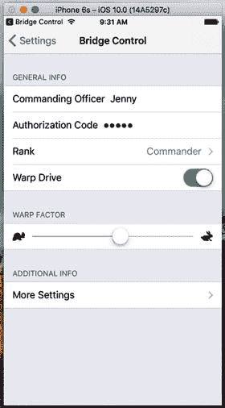

图 12-31. 当从`Bridge Control`打开`Settings`应用时，状态栏中会出现一个按钮，让我们能直接返回我们的应用

## 小结

至此，你应该对`Settings`应用和`User Defaults`机制有了非常扎实的理解。你知道了如何向应用添加设置 bundle，以及如何为应用的偏好设置构建视图层级。你还学会了如何使用`UserDefaults`读写偏好设置，以及如何让用户在应用内部更改偏好设置。你甚至有机会在 Xcode 中使用了一个新的项目模板。现在，应用偏好设置方面应该不会有什么是你无法处理的了。

