# 13. 数据持久化：在应用启动间保存数据

到目前为止，我们主要关注了 MVC 模式中的控制器和视图方面。虽然我们有几个应用从自己的应用 bundle 中读取数据，但只有第 12 章中的`Bridge Control`示例将数据存储到了持久化存储中。我们其他应用在启动时，呈现的数据都与首次启动时完全相同。这种方法在前面的章节中可行，但在实际应用中，你的应用需要持久化数据。当用户做出更改时，他们希望在下次启动程序时看到这些更改。

在 iOS 设备上，存在多种不同的数据持久化机制。如果你曾在 macOS 的 Cocoa 环境中编程，可能已经使用过其中一些或全部技术。在本章中，我们将介绍四种不同的机制，用于将数据持久化到 iOS 文件系统：

- 属性列表
- 对象归档（或序列化）
- SQLite3（iOS 嵌入式关系数据库）
- Core Data（Apple 提供的持久化工具）

> **注**：属性列表、对象归档、SQLite3 和 Core Data 并非在 iOS 上持久化数据的唯一方式；它们只是最常用且最简单的方法。你始终可以选择使用传统的 C 语言 I/O 调用（如`fopen()`）来读写数据。你也可以使用 Cocoa 的底层文件管理工具。但几乎在所有情况下，这样做都会导致大量额外的编码工作，并且通常没有必要——当然，如果你需要，这些工具也是可用的。


## 应用程序沙盒

本章介绍的四种数据持久化机制都有一个重要的共同元素：应用程序的 `Documents` 文件夹。每个应用都有自己的 `Documents` 文件夹，并且应用程序被允许读写自己 `Documents` 目录下的内容。

首先，让我们通过检查 iPhone 模拟器使用的文件夹布局，来看看应用程序在 iOS 中是如何组织的。为此，你需要查看主目录中的 `Library` 目录。在 OS X 10.6 及更早版本中，这没有问题；然而，自 OS X 10.7 起，苹果默认将 `Library` 文件夹隐藏，因此需要多一步操作。打开一个 Finder 窗口并导航到你的主目录。如果你能看到 `Library` 文件夹，那就太好了。如果没有，请按住 Option 键 (⌥) 并选择“前往” ➤ “资源库”。只有按住 Option 键时，`Library` 选项才会显示。

在 `Library` 文件夹内，逐级进入 `Developer/CoreSimulator/Devices/`。在该目录中，你会看到当前 Xcode 安装中每个模拟器对应的一个子目录。这些子目录的名称是 Xcode 自动生成的全局唯一标识符（GUID），因此仅通过查看无法知道哪个目录对应哪个模拟器。要查明这一点，请在任意模拟器目录中查找名为 `device.plist` 的文件并打开它。你会找到一个键，它映射到模拟设备的名称。图 13-1 显示了 iPad Pro 模拟器的 `device.plist` 文件。

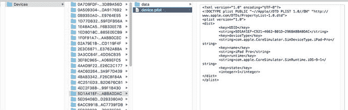

图 13-1. 使用 `device.plist` 文件将目录映射到模拟器

选择一个设备，然后逐级进入其 `data` 目录，直到到达 `data/Containers/Data/Application` 子目录。在这里，你又会看到名称是 GUID 的子目录。在这种情况下，每个子目录代表预安装的应用程序或者你在该模拟器上运行过的应用程序。选择其中一个目录并打开它，你会看到类似图 13-2 的内容。

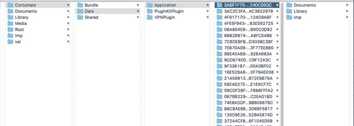

图 13-2. 模拟器上应用程序的沙盒

**注意：** 从图 13-1 中的 Devices 开始，可能需要一些搜索才能找到 `Containers` 子目录。如果一开始没有看到，请继续向下浏览设备 GUID 列表，最终应该能找到 `Containers` 子目录。

尽管上述列表展示的是模拟器，但文件结构的功能与实际设备上的类似。要查看设备上应用程序的沙盒，请将其连接到 Mac，然后打开 Xcode 的“设备和模拟器”窗口（“窗口” ➤ “设备和模拟器”）。你应该会在窗口侧边栏中看到你的设备。选中它，然后从“已安装的 App”列表中选择一个应用程序。在窗口右侧靠近底部的位置，你会看到一个名为“已安装的 App”的区域（你可能需要点击窗口底部附近的向下箭头才能看到该区域），其中包含一个表格，表格中的每一行对应你从 Xcode 安装的一个应用。在表格下方，有一个看起来像齿轮的图标。点击它，并从弹出菜单中选择“显示容器”，即可查看你在表格中选择的应用程序的沙盒内容（见图 13-3）。你也可以将沙盒中的所有内容下载到你的 Mac。图 13-4 显示了一个名为 `townslot2` 的应用程序的沙盒，该应用来自我的书 *App Development Recipes for iOS and watchOS* (Apress, 2016)。

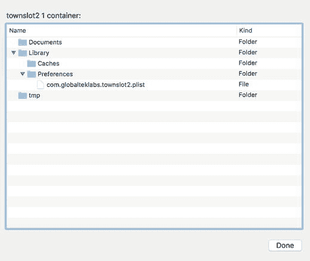

图 13-4. iPhone 6s 上 `townslot2` 应用程序的沙盒

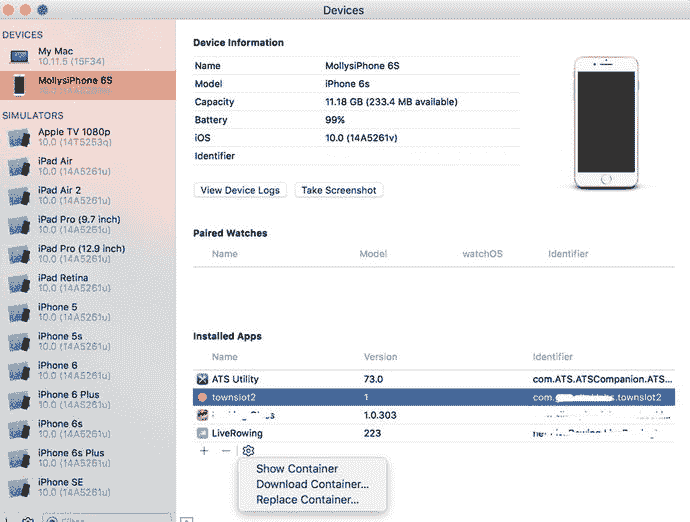

图 13-3. 显示 `townslot2` 应用的实际设备的配置和内容

每个应用程序沙盒都包含以下三个目录：

- **`Documents`**：你的应用程序将数据存储在此 `Documents` 目录中。如果为应用程序启用了 iTunes 文件共享，用户可以在 iTunes 中看到此目录（以及你的应用程序创建的任何子目录）的内容，并且可以向其中上传文件。

    **提示：** 要为你的应用程序启用文件共享，请打开其 `Info.plist` 文件，并添加键 `Application supports iTunes file sharing`，将其值设置为 `YES`。

- **`Library`**：这为你的应用程序提供了另一个存储数据的地方。用于存放你不想与用户共享的文件。如果需要，你可以创建自己的子目录。如图 13-4 所示，系统会创建名为 `Cache` 和 `Preferences` 的子目录，其中包含存储应用程序偏好设置和配置的 `.plist` 文件，这些设置使用我们在第 12 章中讨论过的 `UserDefaults` 类。

- **`tmp`**：`tmp` 目录为你的应用程序提供了一个存储临时文件的地方。当你的 iOS 设备同步时，写入 `tmp` 的文件不会被 iTunes 备份；但为了避免填满文件系统，你的应用程序需要负责在不再需要时删除 `tmp` 中的文件。


### 获取文档与库目录

尽管我们的应用程序位于一个名称看似随机的文件夹中，但获取`Documents`目录的完整路径相当简单，这样我们就可以使用此方法读写文件。`FileManager`类的`urls(for:in:)`方法可以为你定位各种目录。`FileManager`是一个 Foundation 类，因此它与 OS X 的`Cocoa`共享。它的许多可用选项是为 macOS 设计的，iOS 上的一些返回值并不十分有用，因为由于 iOS 的沙盒机制，你的应用程序没有访问该目录的权限。清单 13-1 展示了一段用 Swift 3 编写的示例代码片段，用于访问 iOS 的`Documents`目录。

```
let urls = FileManager.default.urls(for:
.documentDirectory, ins: .userDomainMask)
if let documentUrl = urls.first {
print(documentUrl)
清单 13-1.
获取指向 Documents 目录的 NSURL 的代码
```

`urlsForDirectory(_:in:)`方法的第一个参数指定了我们正在查找的目录。`searchPathDirectory`枚举定义了可能的值；这里，我们使用值`SearchPathDirectory.documentDirectory`（简写为`.documentDirectory`）表示我们正在查找`Documents`目录。第二个参数指定用于搜索的一个或多个域（在 Apple 文档中称为`domainMask`）。可能的域都是`SearchPathDomainMask`枚举的值，这里我们指定了`.userDomainMask`。在 iOS 上，这个域映射到运行应用程序的沙盒。`urls(for: in:)`方法返回一个数组，其中包含一个或多个映射到指定域中所请求目录的 URL。在 iOS 上，每个应用程序始终只有一个`Documents`目录，因此我们可以安全地假设恰好会返回一个`NSURL`对象，但为了安全起见，我们使用`if let`结构来安全地访问`NSURL`数组的第一个元素，以防它恰好是空的。在真实的 iOS 设备上，`Documents`目录的 URL 类似于 `file:///var/mobile/Containers/Data/Application/69BFDDB0-E4A8-4359-8382-F6DDDF031481/Documents/`。

我们可以通过在我们刚刚获取的 URL 末尾附加另一个组件，来为`Documents`目录中的文件创建一个 URL。我们将使用一个名为`appendingPathComponent()`的`NSURL`方法，它正是为此目的而设计的：

```
let fileUrl = try documentUrl.appendingPathComponent("theFile.txt")
```

注意

Swift 3 中的错误处理与其他使用 `try`、`catch`、`throw` 关键字的语言类似。

此调用之后，`fileUrl`应包含我们应用程序`Documents`目录中名为`theFile.txt`的文件的完整 URL（参见清单 13-2），我们可以使用此 URL 来创建、读取和写入该文件。需要注意的是，文件不必存在，你就能为其获取一个`NSURL`对象。

```
let urls = FileManager.default.urls(for:
.libraryDirectory, in: .userDomainMask)
if let libraryUrl = urls.first {
print(libraryUrl)
}
清单 13-2.
你可以使用相同的方法，将第一个参数设为 .libraryDirectory 来定位应用程序的 Library 目录。
```

这段代码会返回类似这样的 URL：

```
file:///var/mobile/Containers/Data/Application/69BFDDB0-E4A8-4359-8382-F6DDDF031481/Library/.
```

可以指定多个搜索域。当这样做时，`FileManager`会在所有域中查找目录，并可能返回多个`NSURL`。出于已经解释过的原因，这在 iOS 上实际上并不是很有用，但为了完整性，请考虑清单 13-3 中的示例。

```
let urls = FileManager.default.urls(for:
.libraryDirectory,in: [.userDomainMask, .systemDomainMask])
print(urls)
清单 13-3.
获取多个 URL
```

这里，我们要求`FileManager`在用户域和系统域中查找`Library`目录，结果我们得到了一个包含两个`NSURLs`的数组：

*   `file:///var/mobile/Containers/Data/Application/69BFDDB0-E4A8-4359-8382-F6DDDF031481/Library/`
*   `file:///System/Library/`

第二个 URL 指的是系统的`Library`目录，我们当然无法访问它。当返回多个 URL 时，它们在返回数组中的顺序是未定义的。

注意我们在清单 13-3 中是如何编写`inDomains`参数的值的：

```
[.userDomainMask, .systemDomainMask]
```

这看起来像一个数组的初始化器，但实际上它是在创建一个集合——在 Swift 中，初始化数组和集合的语法是相同的。

### 获取 tmp 目录

获取应用程序临时目录的引用甚至比获取`Documents`目录的引用更容易。名为`NSTemporaryDirectory()`的 Foundation 函数会返回一个字符串，其中包含应用程序临时目录的完整路径。要为存储在临时目录中的文件创建一个`NSURL`，首先找到临时目录：

```
let tempDirPath = NSTemporaryDirectory()
```

接下来，将路径转换为 URL，并像之前一样通过附加一个路径组件来创建临时目录中文件的路径，如清单 13-4 所示。

```
let tempDirUrl = NSURL(fileURLWithPath: tempDirPath)
let tempFileUrl = tempDirUrl.appendingPathComponent("tempFile.txt")
清单 13-4.
向 URL 附加路径组件
```

生成的 URL 将类似于：

```
file:///private/var/mobile/Containers/Data/Application/29233884-23EB-4267-8CC9-86DCD507D84C/tmp/tempFile.txt
```

## 文件保存策略

我们在本章中将要探讨的所有四种持久化方法都使用了 iOS 文件系统。对于`SQLite3`，我们将创建一个单一的`SQLite3`数据库文件，让`SQLite3`负责存储和检索你的数据。在最简单的形式中，Core Data 会为你处理所有文件系统管理工作。对于另外两种持久化机制——属性列表和归档——你需要考虑是将数据存储在一个文件中还是多个文件中。

### 单文件持久化

使用单个文件进行数据存储提供了最简单的方法，并且对于许多应用程序来说，这是一种完全可以接受的方法。首先，你创建一个根对象，通常是一个`Array`或`Dictionary`（在使用归档时，你的根对象也可以基于自定义类）。然后，你用所有需要持久化的程序数据填充你的根对象。每当需要保存时，你的代码会将该根对象的全部内容重写到一个文件中。当你的应用程序启动时，它会将该文件的全部内容读入内存。当它退出时，它会写出全部内容。这就是我们将要采用的方法。

使用单个文件的缺点是你需要将应用程序的所有数据加载到内存中，并且即使是最小的更改，你也必须将全部数据写入文件系统。但是，如果你的应用程序不太可能管理超过几兆字节的数据，这种方法效果很好，而且它的简单性无疑会使事情更容易。


### 多文件持久化

使用多个文件进行持久化提供了另一种方法。例如，电子邮件应用可以将每封邮件存储在其独立的文件中。

这种方法有明显的优势。它允许应用仅加载用户请求的数据（另一种形式的懒加载）；当用户进行更改时，只需保存已更改的文件。当收到内存不足通知时，该方法还让你有机会释放内存。用于存储用户当前未查看数据的任何内存都可以被清空，然后在下次需要时直接从文件系统重新加载。多文件持久化的缺点在于，它会为你的应用增加相当的复杂性。目前，我们将采用单文件持久化。

接下来，我们将深入探讨每种持久化方法的具体细节：属性列表、对象归档、`SQLite3`和 Core Data。我们将依次探索每一种方法，并构建一个应用，利用每种机制将一些数据保存到设备的文件系统中。我们先从属性列表开始。

## 使用属性列表

我们的一些示例应用已经使用过属性列表，最近一次是在第 12 章中，我们创建了一个属性列表来指定应用设置和偏好。属性列表的便利之处在于，你可以使用 Xcode 或属性列表编辑器应用手动编辑它们。此外，只要`Dictionary`和`Array`实例仅包含特定的可序列化对象，就可以将它们写入属性列表，或从属性列表创建。

### 属性列表序列化

序列化对象是指已被转换为字节流的对象，以便它可以存储在文件中或通过网络传输。尽管任何对象都可以被设为可序列化，但只有某些对象可以放入集合类（如`NSDictionary`或`NSArray`）中，然后使用集合类的`writeToURL(_:atomically:)`或`writeToFile(_:atomically:)`方法存储到属性列表。以下类可以通过这种方式序列化：

-   `Array`或`NSArray`
-   `NSMutableArray`
-   `Dictionary`或`NSDictionary`
-   `NSMutableDictionary`
-   `NSData`
-   `NSMutableData`
-   `String`或`NSString`
-   `NSMutableString`
-   `NSNumber`
-   `Date`或`NSDate`

如果你能仅用这些对象来构建数据模型，就可以使用属性列表来保存和加载数据。

**注意**

`writeToURL(_:atomically:)`和`writeToFile(_:atomically:)`方法功能相同，但前者要求你将文件位置指定为`NSURL`，后者则指定为`String`。以前，文件位置总是以字符串路径的形式给出，但最近 Apple 开始倾向于使用`NSURL`，因此本书中的示例也采用相同的方式，除非有 API 仅接受路径参数。你可以轻松地从基于文件的`NSURL`的`path`属性获取其路径，你将在本章的第一个示例中看到这一点。

如果你打算使用属性列表来持久化应用数据，请使用`Array`或`Dictionary`来保存需要持久化的数据。假设你放入`Array`或`Dictionary`的所有对象都是前述列表中的可序列化对象，那么你就可以通过在字典或数组实例上调用`write(to url: URL, atomically: Bool) -> Bool`方法来写出属性列表，如代码清单 13-5 所示。

```
let array: NSArray = [1,2,3]
let tempDirPath = NSTemporaryDirectory()
let tempDirUrl = NSURL(fileURLWithPath: tempDirPath)
let tempFileUrl = tempDirUrl.appendingPathComponent("tempFile.txt")
array.write(to: tempFileUrl!, atomically:true)
代码清单 13-5.
写入属性列表
```

**注意**

`atomically`参数会使该方法先将数据写入一个辅助文件，而非指定位置，并在成功写入该文件后，再复制一份到第一个参数指定的位置。这提供了一种更安全的文件写入方式，因为如果在保存过程中应用崩溃，现有文件（如果存在）不会被损坏。这会增加一些开销，但在大多数情况下，这个代价是值得的。

属性列表方法的一个问题是，自定义对象无法序列化到属性列表中。你也不能使用 Cocoa Touch 中的其他类，这意味着像`NSURL`、`UIImage`和`UIColor`这样的类无法直接使用。

除了序列化问题之外，将所有模型数据以属性列表形式维护意味着你不能轻易创建派生或计算属性（例如，一个值是其他两个属性之和的属性），并且一些本应包含在模型类中的代码必须移到控制器类中。再次强调，这些限制适用于简单的数据模型和应用。但在大多数情况下，通过创建专用的模型类，你的应用会更容易维护。

简单的属性列表在复杂的应用中仍然有用，因为它们是向应用中包含静态数据的好方法。例如，当你的应用包含一个选择器时，为其提供列表项的最佳方法通常是创建一个`.plist`文件，将该文件放入项目的 Resources 文件夹，使其被编译到你的应用中。

现在我们将构建一个简单的应用，使用属性列表来存储其数据。

### 创建持久化应用的第一个版本

我们将构建一个程序，允许你在四个文本字段中输入数据，在应用退出时将这些字段保存到`.plist`文件中，然后在应用下次启动时，从该`.plist`文件中重新加载数据（见图 13-5）。

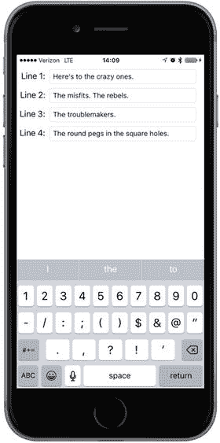

图 13-5. 我们的持久化应用

**注意**

在本章的应用中，我们不会花时间设置我们在前几个示例中添加的所有用户界面细节。例如，按下 Return 键既不会取消键盘，也不会将你带到下一个字段。如果你想为应用添加此类优化，这将是不错的练习，因此我们鼓励你自行完成。

在 Xcode 中，使用 Single View Application 模板创建一个新项目，并将其命名为`Persistence`。在构建包含四个文本字段的视图之前，我们先创建所需的唯一输出口。在项目导航器中，单击`ViewController.swift`文件，并添加以下输出口：

```
class ViewController: UIViewController {
@IBOutlet var lineFields:[UITextField]!
```


## 设计持久化应用程序视图

现在选择 `Main.storyboard` 来编辑图形用户界面。Xcode 切换到 Interface Builder 模式后，您将在编辑窗格中看到视图控制器场景。从控件库中拖拽一个文本字段，并将其放置于顶部和右侧的蓝色参考线处。调出属性检查器。确保取消勾选“开始编辑时清除”复选框。

接着，将一个标签拖拽到窗口中，并使用左侧蓝色参考线将其放置在文本字段的左边，然后利用水平蓝色参考线让标签的垂直中心与文本字段对齐。双击标签，将其内容改为“第 1 行：”。最后，使用左侧的调整手柄缩小文本字段，使其靠近标签。以图 13-6 作为参考。接下来，同时选中标签和文本字段，按住 Option 键并向下拖拽，在第一组下方复制一份。使用蓝色参考线引导放置位置。然后同时选中两个标签和两个文本字段，再次按住 Option 键向下拖拽。此时您应该有四个标签对应四个文本字段。依次双击剩余的标签，将其名称改为“第 2 行：”、“第 3 行：”和“第 4 行：”。再次将您的结果与图 13-6 进行对比。

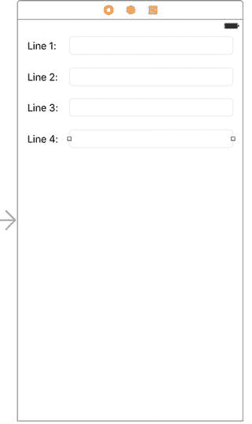

**图 13-6.** 设计持久化应用程序的视图

放置好所有四个文本字段和标签后，从文档大纲中的视图控制器图标向每个文本字段按住 Control 键拖拽。将它们全部连接到 `lineFields` 输出口集合，并确保按从上到下的顺序连接。保存对 `Main.storyboard` 所做的更改。

现在让我们添加 Auto Layout 约束，以确保设计在所有设备上都能正常显示。首先从“第 1 行：”标签按住 Control 键拖拽到其右侧的文本字段，然后松开鼠标。按住 Shift 键并选择“水平间距”和“基线”，然后按 Return 键。对其他三个标签和文本字段执行相同操作。

接下来，我们将固定文本字段的位置。在文档大纲中，从顶部文本字段按住 Control 键拖拽到其父视图图标，松开鼠标，按住 Shift 键并选择“尾随空间到容器边距”和“垂直间距到顶部布局参考线”。对其他三个文本字段执行相同操作。

我们需要固定标签的宽度，这样即使用户输入的内容超过文本字段的容纳范围，标签也不会调整大小。选择顶部标签，点击故事板编辑器下方的“固定”按钮。在弹出的窗口中，选中“宽度”复选框，然后点击“添加 1 个约束”。对所有标签执行相同操作。

最后，回到文档大纲，从“第 1 行：”标签按住 Control 键拖拽到视图图标，松开鼠标，并选择“前导空间到容器边距”。对所有标签执行相同操作，这样就完成了——所有必需的 Auto Layout 约束都已设置完毕。在文档大纲中选择视图控制器图标，接着在菜单中选择**编辑器** ➤ **解决 Auto Layout 问题** ➤ **更新帧**，以消除 Xcode 活动视图中的警告。现在构建并运行应用程序，将结果与图 13-6 进行比较。

## 编辑持久化类

在项目导航器中，选择 `ViewController.swift` 并添加代码清单 13-6 中的代码。

```
func dataFileURL() -> NSURL {
    let urls = FileManager.default.urls(for:
        .documentDirectory, in: .userDomainMask)
    var url:NSURL?
    url = URL(fileURLWithPath: "")      // 创建一个空白路径
    do {
        try url = urls.first!.appendingPathComponent("data.plist")
    } catch  {
        print("错误是 \(error)")
    }
    return url!
}
```

**代码清单 13-6.** 获取我们的 `data.plist` 文件的 URL

`dataFileURL()` 方法通过查找 Documents 目录并在其后追加文件名，返回本例中将要创建的数据文件的 URL。这个方法将由任何需要加载或保存数据的代码调用。我们对 `url` 的处理稍显随意。请注意，我们将 `appendingPathComponent` 方法封装在一个 Swift 的 `do-catch` 块中。这样做是因为该追加方法会抛出一个需要捕获的错误。但由于我们知道应用程序包必定包含一个文档目录，并且我们自行创建了 `data.plist` 文件，只要代码编写正确，就不会看到这个错误。通常情况下，我们希望更安全地处理问题，以免用户看到崩溃，但为了简洁起见，此处不深入讨论，因为这不是我们讨论的主题。

> **注意：** 在 Swift 中，我们使用 `do-catch` 块（可在 Xcode 代码片段库中找到）来尝试一个会抛出异常（错误）的方法调用，然后“捕获”该异常并以某种方式处理，防止应用程序崩溃。

找到 `viewDidLoad()` 方法，并为其添加以下代码，同时在其下方添加一个用于接收通知的新方法 `applicationWillResignActive()`，如代码清单 13-7 所示。

```
override func viewDidLoad() {
    super.viewDidLoad()
    // 加载视图后的任何额外设置，通常来自 nib 文件。
    let fileURL = self.dataFileURL()
    if (FileManager.default.fileExists(atPath: fileURL.path!)) {
        if let array = NSArray(contentsOf: fileURL as URL) as? [String] {
            for i in 0..<array.count {
                lineFields[i].text = array[i]
            }
        }
    }
    let app = UIApplication.shared()
    NotificationCenter.default.addObserver(self, selector: #selector(self.applicationWillResignActive(notification:)), name: Notification.Name.UIApplicationWillResignActive, object: app)
}

func applicationWillResignActive(notification:NSNotification) {
    let fileURL = self.dataFileURL()
    let array = (self.lineFields as NSArray).value(forKey: "text") as! NSArray
    array.write(to: fileURL as URL, atomically: true)
}
```

**代码清单 13-7.** `ViewController.swift` 文件中的 `viewDidLoad` 方法和 `applicationWillResignActive` 方法。

在 `viewDidLoad()` 方法中，我们做了几件事。首先，使用 `FileManager` 类的 `fileExists(atPath:)` 方法检查数据文件是否已存在——如果应用程序至少运行过一次，该文件就会存在。这个方法需要文件的路径名，我们通过 URL 的 `path` 属性获取（遗憾的是，该方法没有接受 `URL` 参数的变体）。如果文件不存在，我们就不尝试加载它。如果文件存在，我们就用该文件的内容实例化一个数组，然后将数组中的对象复制到四个文本字段中。由于数组是有序列表，我们按照保存时的相同顺序进行复制。

为了读取文件，我们使用一个 `Array` 初始化器，它根据给定 URL 的文件内容创建一个 `NSArray` 对象。该 `Array` 初始化器要求文件内容采用属性列表格式，这没问题，因为在即将编写的代码中，数据正是以这种格式保存的。


我们的应用程序需要在被终止或进入后台前保存数据，因此我们需要关注名为 `applicationWillResignActive` 的通知。每当应用不再是用户正在交互的对象时，就会发布此通知。当用户按下 Home 键，或应用因其他事件（如接到电话）被推入后台时，就会发生这种情况。我们可以通过向 iOS 的通知中心注册通知来获知这一事件。通知中心通过调用你注册的方法来传递通知，该方法会接收一个包含事件详细信息的 `Notification` 类型参数。为了注册此通知，我们获取应用实例的引用，并使用默认的 `NotificationCenter` 实例和名为 `addObserver(_:selector:name:object:)` 的方法，订阅 `UIApplicationWillResignActive`。我们将 `self` 作为第一个参数传入，指定我们的 `ViewController` 实例作为应被通知的观察者。第二个参数，我们传入一个指向 `applicationWillResignActive()` 方法的选择器，告诉通知中心在发布该通知时调用此方法。第三个参数 `UIApplicationWillResignActive` 是我们希望接收的通知名称。这是一个由 `UIApplication` 类定义的字符串常量。

最后，我们添加了 `applicationWillResignActive()` 方法的实现，通知中心将调用此方法：

```
func applicationWillResignActive(notification:NSNotification) {
let fileURL = self.dataFileURL()
let array = (self.lineFields as NSArray).value(forKey: "text") as! NSArray
array.write(to: fileURL as URL, atomically: true)
}
```

这个方法相当简短，但仅通过几个方法调用就完成了大量工作。我们通过对 `lineFields` 数组中的每个文本字段调用 `text` 方法来构造一个字符串数组。为此，我们使用了一个巧妙的捷径：不是显式遍历文本字段数组、逐个询问其 `text` 值再添加到新数组中，而是将 Swift 的 `lineFields` 数组（包含 `UITextField` 对象）转换为 `NSArray`，并对它调用 `value(forKey:)`，传入 `"text"` 作为参数。`NSArray` 对 `valueForKey()` 的实现会替我们完成遍历，询问其中每个 `UITextField` 实例的 `text` 值，并返回一个包含所有值的新 `NSArray`。之后，我们使用 `write(_ to:atomically:)` 方法，以属性列表格式将该数组的内容写入我们的 .plist 文件。这就是使用属性列表保存数据的全部过程。

我们来总结一下这是如何工作的。当主视图加载完成后，我们查找一个 .plist 文件。如果它存在，我们将数据从该文件复制到文本字段中。接着，我们注册以在应用进入非活跃状态（无论是退出还是被推入后台）时接收通知。当这种情况发生时，我们从四个文本字段收集值，将它们放入一个可变数组，并将该可变数组写入一个属性列表。

构建并运行该应用。它应该能够构建，然后在模拟器中启动。启动后，你应该能够在四个文本字段中的任意一个中输入内容。当你输入一些内容后，按下 ⌘⇧H（Command-Shift-H）返回主屏幕。这一步非常重要。如果你直接退出模拟器，这相当于强制退出你的应用。在这种情况下，视图控制器永远不会收到应用即将进入非活跃状态的通知，你的数据也不会被保存。返回主屏幕后，你可以退出模拟器，或从 Xcode 停止应用并再次运行。你的文本会被恢复，并在下次启动应用时出现在文本字段中。

**注意**  
需要理解的是，返回主屏幕通常并不会退出应用——至少一开始不会。应用被置于后台状态，随时准备在用户切回时立即重新激活。我们将在第 15 章详细探讨这些状态及其对运行和退出应用的影响。

属性列表序列化既酷又易于使用。然而，它有些局限，因为只有少数几种对象可以存储到属性列表中。让我们来看看一种更健壮的方法。

## 归档模型对象

在 Cocoa 领域中，“归档”一词指的是另一种序列化形式，但它是一种更通用的类型，任何对象都可以实现。专门为保存数据而编写的任何模型对象都应支持归档。对模型对象进行归档的技术，让你能够轻松地将复杂对象写入文件，然后再读回。只要你在类中实现的每个属性要么是标量类型（例如 `Int` 或 `Float`），要么是符合 `NSCoding` 协议的类的实例，你就可以完全归档你的对象。由于大多数能够存储数据的 Foundation 和 Cocoa Touch 类确实符合 `NSCoding`（尽管有一些值得注意的例外，例如 `UIImage`），因此对大多数类来说，归档相对容易实现。

虽然并非严格必要，但除了 `NSCoding` 之外，通常还应实现另一个协议：`NSCopying` 协议，它允许你的对象被复制。在使用数据模型对象时，能够复制对象会带来更大的灵活性。


### 符合 `NSCoding` 协议

`NSCoding` 协议声明了两个必需的方法。一个方法将你的对象编码到归档中；另一个方法通过解码归档来创建一个新对象。这两个方法都会接收一个 `NSCoder` 实例，你使用它的方式与上一章介绍的 `NSUserDefaults` 非常相似。你可以使用键值编码来编解码对象以及 `Int` 和 `Float` 值等原生数据类型。

要在对象中支持归档，我们需要让它成为 `NSObject`（或任何继承自 `NSObject` 的类）的子类，并且需要使用适当的编码方法将每个实例变量编码到 `encoder` 中。让我们看看这是如何工作的。假设我们创建一个简单的容器类，如下所示：

```
class MyObject : NSObject, NSCoding, NSCopying {
    var number = 0;
    var string = ""
    var child: MyObject?
    override init() {
    }
}
```

这个类包含一个整型属性、一个字符串属性和一个指向同类另一个实例的引用。它继承自 `NSObject` 并遵循 `NSCoding` 和 `NSCopying` 协议。用于编码 `MyObject` 类型对象的 `NSCoding` 协议方法可能如下所示：

```
func encode(with aCoder: NSCoder) {
    aCoder.encode(string, forKey: "stringKey")
    aCoder.encode(32, forKey: "intKey")
    if let myChild = child {
        aCoder.encode(myChild, forKey: "childKey")
    }
}
```

如果 `MyObject` 是一个同样遵循 `NSCoding` 协议的类的子类，我们需要确保在其父类上也调用了 `encodeWithCoder()`，以保证父类编码其数据。在这种情况下，该方法将如下所示：

```
func encode(with aCoder: NSCoder) {
    super.encode(with: aCoder)
    aCoder.encode(string, forKey: "stringKey")
    aCoder.encode(32, forKey: "intKey")
    if let myChild = child {
        aCoder.encode(myChild, forKey: "childKey")
    }
}
```

`NSCoding` 协议还要求我们实现一个初始化器，该初始化器通过 `NSCoder` 初始化的对象，让我们能够恢复之前归档的对象。实现此方法与实现 `encodeWithCoder()` 非常相似。如果你的对象没有基类，或者你继承的是某个不遵循 `NSCoding` 的类，你的初始化器会像下面这样：

```
required init?(coder aDecoder: NSCoder) {
    string = aDecoder.decodeObject(forKey: "stringKey") as! String
    number = aDecoder.decodeInteger(forKey: "intKey")
    child = aDecoder.decodeObject(forKey: "childKey") as? MyObject
}
```

该初始化器通过从传入的 `NSCoder` 实例中解码值来设置正在初始化的对象的属性。由于我们允许原始对象的 `child` 属性为 `nil`，因此在将值赋给解码后对象的 `child` 属性时，需要使用条件类型转换，因为归档对象可能没有存储子对象。

当为具有也遵循 `NSCoding` 协议的父类的类实现 `NSCoding` 时，你需要添加额外一行代码以允许父类初始化其自身状态：

```
required init?(coder aDecoder: NSCoder) {
    string = aDecoder.decodeObject(forKey: "stringKey") as! String
    number = aDecoder.decodeInteger(forKey: "intKey")
    child = aDecoder.decodeObject(forKey: "childKey") as? MyObject
    super.init(coder: aDecoder)
}
```

基本上就是这样。只要你实现了这两个方法来编码和解码对象的所有属性，你的对象就是可归档的，并且可以被写入归档或从归档中读取。

### 实现 `NSCopying`

如前所述，对于任何数据模型对象来说，遵循 `NSCopying` 是一个非常好的做法。`NSCopying` 有一个名为 `copyWithZone()` 的方法，该方法允许复制对象。实现 `NSCopying` 类似于实现 `init(coder:)`。你只需要创建同一个类的新实例，然后将该新实例的所有属性设置为与当前对象属性相同的值。尽管你实现的是 `copy(with zone:)` 方法，但应用代码实际调用的是一个名为 `copy()` 的方法，该方法会将操作转发给 `copy(with zone:)`：

```
let anObject = MyObject()
let objectCopy = anObject.copy() as! MyObject
```

以下是 `MyObject` 类的 `copy(with zone:)` 方法：

```
func copy(with zone: NSZone? = nil) -> AnyObject {
    let copy = MyObject()
    copy.number = number
    copy.string = string
    copy.child = child?.copy() as? MyObject
    return copy
}
```

请注意，使用此实现时，如果存在引用子对象的属性（例如本例中的 `child` 属性），新对象将拥有该子对象的副本，而不是原始对象。如果子对象是不可变类型，或者你只需要提供对象的浅拷贝，那么你只需将原始子对象的引用赋给新对象即可。

> **注意：**  
> 不必过分担心 `NSZone` 参数。这个指针指向一个用于系统管理内存的 `struct`。开发者过去仅会在极少数情况下才需要担心区域或创建自己的区域，而如今，拥有多个区域几乎闻所未闻。在对象上调用 `copy` 等同于使用默认区域调用 `copy(with zone:)`，这始终是你想要的结果。实际上，在现在的 iOS 中，区域已经被完全忽略了。`NSCopying` 使用区域仅仅是出于向后兼容的历史原因。

### 归档和解档数据对象

从遵循 `NSCoding` 的一个（或多个）对象创建归档相对容易。首先，我们创建一个 Foundation 类 `NSMutableData` 的实例来保存编码后的数据，然后创建一个 `NSKeyedArchiver` 实例，用于将对象归档到那个 `NSMutableData` 实例中：

```
let data = NSMutableData()
let archiver = NSKeyedArchiver(forWritingWith: data)
```

创建这两者之后，我们使用键值编码将任何我们想包含在归档中的对象归档，如下所示：

```
archiver.encode(anObject, forKey: "keyValueString")
```

一旦我们编码了所有想要包含的对象，我们只需通知归档器我们已完成，然后将 `NSMutableData` 实例写入文件系统：

```
archiver.finishEncoding()
let success = data.write(to: archiveUrl as URL, atomically: true)
```

如果你对归档感到有些不知所措，别担心。实际上它相当直接。我们将改造我们的 Persistence 应用程序以使用归档，这样你就能看到它的实际应用。一旦你实践过几次，归档就会变得得心应手，因为你真正要做的只是使用键值编码来存储和检索对象的属性。

### 归档应用

让我们重做 Persistence 应用程序，使其使用归档而不是属性列表。我们将对 Persistence 源代码进行一些相当重大的更改，所以在继续之前，你应该复制整个项目文件夹。我已经在做出任何更改之前——使用属性列表技术——将其压缩为 `PersistencePL.zip`。


#### 实现 `FourLines` 类

当你准备好继续操作，并在 Xcode 中打开了你的 `Persistence` 项目副本后，按下 ⌘N 或选择 **文件** ➤ **新建** ➤ **文件...**。当新建文件助手出现时，从 iOS 部分选择 **Swift 文件**，然后点击 **下一步**。在下一个屏幕中，将文件命名为 `FourLines.swift`，选择 `Persistence` 文件夹保存，然后点击 **创建**。这个类将成为我们的数据模型。它将保存我们当前在属性列表应用中用字典存储的数据。

单击 `FourLines.swift`，添加代码清单 13-8 中的代码。

```
class FourLines : NSObject, NSCoding, NSCopying {
    private static let linesKey = "linesKey"
    var lines:[String]?
    override init() {
    }
    required init?(coder aDecoder: NSCoder) {
        lines = aDecoder.decodeObject(forKey: FourLines.linesKey) as? [String]
    }
    func encode(with aCoder: NSCoder) {
        if let saveLines = lines {
            aCoder.encode(saveLines, forKey: FourLines.linesKey)
        }
    }
    func copy(with zone: NSZone? = nil) -> AnyObject {
        let copy = FourLines()
        if let linesToCopy = lines {
            var newLines = Array()
            for line in linesToCopy {
                newLines.append(line)
            }
            copy.lines = newLines
        }
        return copy
    }
}
```

我们刚刚实现了遵守 `NSCoding` 和 `NSCopying` 协议所需的所有方法。我们在 `encode(with aCoder:)` 中对 `lines` 属性进行了编码，并在 `init(with aCoder:)` 中使用相同的键值对它进行了解码。在 `copy(with zone:)` 中，我们创建了一个新的 `FourLines` 对象，并将字符串数组复制给它，谨慎地进行了深拷贝，这样对原对象的修改就不会影响新对象。看到了吗？这一点都不难；只是如果你做了大量的复制粘贴，一定要确保没有忘记修改任何内容。

#### 实现 `ViewController` 类

现在我们有了一个可归档的数据对象，让我们用它来持久化应用数据。选择 `ViewController.swift`，并进行代码清单 13-9 中的修改。

```
override func viewDidLoad() {
    super.viewDidLoad()
    // Do any additional setup after loading the view, typically from a nib.
    let fileURL = self.dataFileURL()
    if (FileManager.default.fileExists(atPath: fileURL.path!)) {
        if let array = NSArray(contentsOf: fileURL as URL) as? [String] {
            for i in 0..<4 {
                let field = textFields[i]
                field.text = array[i]
            }
        }
    }
    let app = UIApplication.shared
    NotificationCenter.default.addObserver(self,
        selector: #selector(UIApplicationDelegate.applicationWillResignActive(_:)),
        name: NSNotification.Name.UIApplicationWillResignActive,
        object: app)
}

func dataFileURL() -> NSURL {
    let urls = FileManager.default.urls(for: .documentDirectory, in: .userDomainMask)
    var url:NSURL?
    url = URL(fileURLWithPath: "")      // create a blank path
    do {
        try url = urls.first!.appendingPathComponent("data.archive")
    } catch {
        print("Error is \(error)")
    }
    return url!
}
```

保存你的修改，然后构建并运行这个版本的应用程序。实际上变化并不大。我们首先在 `dataFileURL()` 方法中指定了一个新文件名，这样我们的程序就不会试图将旧的属性列表作为归档文件加载。我们还定义了一个新的常量，它将作为我们对对象进行编码和解码时使用的键值。接着，我们重新定义了加载和保存的方式，使用 `FourLines` 来保存数据，并使用它的 `NSCoding` 方法来执行实际的加载和保存。图形用户界面与之前的版本完全相同。

这个新版本的实现代码比属性列表序列化要多写几行，所以你可能会想，使用归档相对于仅仅序列化属性列表到底有没有优势？对于这个应用来说，答案很简单：不，确实没有任何优势。但想象一下，如果我们有一个可归档对象的数组，比如我们刚刚构建的 `FourLines` 类，我们可以通过归档数组实例本身来归档整个数组。像 `Array` 这样的集合类，在归档时，会归档它们包含的所有对象。只要你放入数组或字典中的每个对象都遵守 `NSCoding` 协议，你就可以归档该数组或字典，并在恢复后使得所有在归档时存在于其中的对象都会在恢复的数组或字典中。属性列表持久化则不然，它只适用于一小部分 Foundation 对象类型——除非你编写额外的代码将这些类的实例与一个 `Dictionary` 进行转换，其中每个对象属性对应一个键，否则你无法用它来持久化自定义类。

换句话说，`NSCoding` 方法具有很好的可扩展性（至少就代码量而言）。无论你添加多少对象，将这些对象写入磁盘的工作量（假设你使用单文件持久化）都是完全相同的。而对于属性列表，工作量会随着你添加的每个对象而增加。

### 使用 iOS 内嵌的 SQLite3

我们要讨论的第三种持久化选项是使用 iOS 内嵌的 SQL 数据库，称为 SQLite3。SQLite3 在存储和检索大量数据方面非常高效。它还能够对数据执行复杂的聚合操作，其速度远比使用对象进行相同操作要快得多。考虑几个场景。如果你需要计算应用中所有对象的某个特定字段的总和，该怎么办？或者，如果你只需要满足某些条件的对象的总和呢？SQLite3 允许你在不将每个对象加载到内存中的情况下获取这些信息。从 SQLite3 获取聚合结果比将所有对象加载到内存并累加它们的值要快好几个数量级。作为一个功能完整的嵌入式数据库，SQLite3 包含了一些工具来使其速度更快，例如，创建可以加速查询的表索引。

SQLite3 使用结构化查询语言（SQL），这是一种用于与关系型数据库交互的标准语言。关于 SQL 语法（实际上有成百上千本）以及 SQLite 本身都有整本书籍进行讲解。因此，如果你还不会 SQL，并且想在应用中使用 SQLite3，那你还需要做一些学习。我将向你展示如何从你的 iOS 应用中设置和与 SQLite 数据库进行交互。我还会在本章中介绍一些基本的语法。但要真正充分利用 SQLite3，你还需要进行一些额外的研究和探索。两个不错的起点是“SQLite3 C/C++ 接口简介”（`www.sqlite.org/cintro.html`）和“SQLite 理解的 SQL”（`www.sqlite.org/lang.html`）。

关系型数据库（包括 SQLite3）和面向对象编程语言在存储和组织数据方面采用根本不同的方法。这些方法差异巨大，以至于已经开发出了许多用于在两者之间进行转换的技术、库和工具。这些不同的技术统称为对象关系映射（ORM）。目前 Cocoa Touch 中有几种可用的 ORM 工具。事实上，我们将在本章后面研究一种由 Apple 提供的 ORM 解决方案，名为 Core Data。

但在此之前，我们将专注于 SQLite3 的基础知识，包括设置它、创建一个表来保存数据，以及在一个应用中使用该数据库。显然，在现实世界中，像我们正在处理的这样一个简单的应用并不值得投入 SQLite3。但正是这个应用的简单性使其成为一个好的学习示例。


### 创建或打开数据库

在使用 SQLite3 之前，必须先打开数据库。用于执行此操作的函数 `sqlite3_open()` 会打开一个已有的数据库；如果指定位置不存在数据库，该函数则会创建一个新的。打开数据库的代码示例如下：

```
var database:OpaquePointer? = nil
let result = sqlite3_open("/path/to/database/file", &database)
```

如果 `result` 等于常量 `SQLITE_OK`，则表示数据库已成功打开。请注意 `database` 变量的类型。在 SQLite3 API 中，此变量是类型为 `sqlite3` 的 C 语言结构体。当此 C API 被导入到 Swift 时，此变量会被映射为 `UnsafeMutablePointer<COpaquePointer>`，这是 Swift 表达 C 指针类型 `void *` 的方式。这意味着我们必须将其视为不透明指针。这没问题，因为我们不需要在 Swift 代码中访问此结构体的内部细节——我们只需将该指针传递给其他 SQLite3 函数，例如 `sqlite3_close()`。

```
sqlite3_close(database)
```

数据库将其所有数据存储在表中。您可以通过编写 SQL `CREATE` 语句，并使用 `sqlite3_exec` 函数将其传递到打开的数据库中，来创建一个新表，如下所示：

```
let createSQL = "CREATE TABLE IF NOT EXISTS PEOPLE" +
"(ID INTEGER PRIMARY KEY AUTOINCREMENT, FIELD_DATA TEXT)"
var errMsg:UnsafeMutablePointer = nil
result = sqlite3_exec(database, createSQL, nil, nil, &errMsg)
```

`sqlite3_exec` 函数用于针对 SQLite3 运行任何不返回数据的命令，包括更新、插入和删除。从数据库中检索数据则稍微复杂一些。您首先需要通过提供 SQL `SELECT` 命令来准备语句：

```
let createSQL = "SELECT ID, FIELD_DATA FROM FIELDS ORDER BY ROW"
var statement: OpaquePointer? = nil
result = sqlite3_prepare_v2(database, createSQL, -1, &statement, nil)
```

如果 `result` 等于 `SQLITE_OK`，则您的语句已成功准备就绪，您可以开始逐步遍历结果集。这段代码展示了另一个我们必须将 SQLite3 结构体视为不透明指针的实例——在 SQLite3 API 中，`statement` 变量的类型本应是 `sqlite3_stmt`。

以下是逐步遍历结果集并从数据库中检索一个 `Int` 和一个 `String` 的示例：

```
while sqlite3_step(statement) == SQLITE_ROW {
let row = Int(sqlite3_column_int(statement, 0))
let rowData = sqlite3_column_text(statement, 1)
let fieldValue = String.init(cString: UnsafePointer(rowData!))
lineFields[row].text = fieldValue!
}
sqlite3_finalize(statement)
```

再次强调，我们必须小心地在 C 语言 API 的需求和 Swift 的支持之间进行桥接。在这种情况下，`sqlite3_column_text()` 函数返回一个类型为 `const unsigned char *` 的值，Swift 将其转换为 `UnsafePointer<UInt8>`。我们需要根据返回的字符数据创建一个 `String`，为此我们可以使用 `String.init(cString:) (UnsafePointer<CChar>)` 方法。我们拥有的是 `UnsafePointer<UInt8>` 而不是 `UnsafePointer<CChar>`，但幸运的是，存在一个初始化器允许我们从前者创建后者。一旦我们获得了 `String`，就将其赋值给 `UITextField` 的 `text` 属性。

### 使用绑定变量

虽然可以通过构建 SQL 字符串来插入值，但实践中更常见的做法是使用称为绑定变量的机制。正确处理字符串——确保它们没有无效字符并且引号正确插入——可能相当繁琐。使用绑定变量，这些问题就为我们处理好了。

要使用绑定变量插入值，您可以像往常一样创建 SQL 语句，但在 SQL 字符串中放入一个问号（`?`）。每个问号代表一个变量，必须先进行绑定，然后才能执行该语句。接下来，准备 SQL 语句，为每个变量绑定一个值，然后执行该命令。

以下是一个示例，它准备了一个包含两个绑定变量的 SQL 语句，将一个 `Int` 绑定到第一个变量，将一个字符串绑定到第二个变量，然后执行并完成该语句：

```
var statement:OpaquePointer? = nil
let sql = "INSERT INTO FOO VALUES (?, ?);"
if sqlite3_prepare_v2(database, sql, -1, &statement, nil)
== SQLITE_OK {
sqlite3_bind_int(statement, 1, 235)
sqlite3_bind_text(statement, 2, "Bar", -1, nil)
}
if sqlite3_step(statement) != SQLITE_DONE {
print("This should be real error checking!")
}
sqlite3_finalize(statement);
```

根据您希望使用的数据类型，有多种可用的绑定语句。大多数绑定函数只接受三个参数：

*   无论数据类型如何，任何绑定函数的第一个参数都是一个指向 `sqlite3_stmt` 的指针，该指针先前已在 `sqlite3_prepare_v2()` 调用中使用过。
*   第二个参数是您正在绑定的变量的索引。这是一个从 1 开始的值，这意味着 SQL 语句中的第一个问号索引为 1，其后的每个问号索引都比左边的高一位。
*   第三个参数始终是要替换问号的值。

一些绑定函数，例如用于绑定文本和二进制数据的函数，还有两个额外的参数：

*   第一个额外参数是第三个参数中传入的数据长度。对于 C 字符串，您可以传递 -1 来代替字符串长度，函数将使用整个字符串。在所有其他情况下，您需要告诉它传入数据的长度。最后一个参数是一个可选的函数回调，以防您需要在语句执行后执行任何内存清理。通常，此类函数用于释放使用 `malloc()` 分配的内存。

由于我们在执行插入操作，绑定语句之后的语法可能看起来有点奇怪。使用绑定变量时，查询和更新使用相同的语法。如果 SQL 字符串是一个 SQL 查询而不是更新，我们需要多次调用 `sqlite3_step()` 直到它返回 `SQLITE_DONE`。由于这是一个更新，我们只调用它一次。

## 创建 SQLite3 应用

在 Xcode 中，使用“单视图应用”模板创建一个新项目，并将其命名为 **SQLite Persistence**。该项目初始状态将与上一个项目完全相同，因此首先打开 ViewController.swift 文件，并添加一个输出口：

```
class ViewController: UIViewController {
@IBOutlet var lineFields:[UITextField]!
```

接下来，选择 Main.storyboard。按照本章前面“设计持久化应用视图”部分的说明设计视图并连接输出口集合。设计完成后，保存故事板文件。

我们已经介绍了基础知识，现在来看看它在实践中是如何运作的。我们将再次修改我们的持久化应用，这次使用 SQLite3 来存储其数据。我们将使用一个单一的表，并将字段值存储在该表的四个不同行中。我们还将为每一行分配一个与其字段对应的行号。例如，第一行的值将以行号 0 存储在表中，下一行将是行号 1，依此类推。让我们开始吧。


### 链接 SQLite3 库

SQLite 3 通过一套过程化 API 进行访问，该 API 提供了对多个 C 函数调用的接口。要使用此 API，我们需要将应用程序链接到一个名为 `libsqlite3.dylib` 的动态库。从项目导航器列表（最左侧窗格）的最顶部选择 `SQLite Persistence` 项，然后在主区域（见图 13-7 中间窗格）的 `TARGETS` 部分中选择 `SQLite Persistence`。（请注意，您是从 `TARGETS` 部分中选择 `SQLite Persistence`，而不是从 `PROJECT` 部分中选择。）

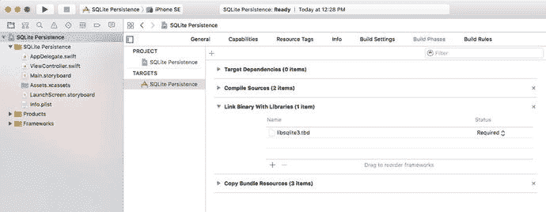

图 13-7. 在项目导航器中选择 `SQLite Persistence` 项目；选择 `SQLite Persistence` 目标；最后，选择 Build Phases 选项卡

选中 `SQLite Persistence` 目标后，在最右侧窗格中单击 `Build Phases` 选项卡。您将看到一个项目列表，初始状态下全部折叠，这些项目代表了 Xcode 构建应用程序所经历的各个步骤。展开标记为 `Link Binary With Libraries` 的项。此部分包含 Xcode 与您的应用程序链接的库和框架。默认情况下，它是空的，因为编译器会自动链接您的应用程序使用的任何 iOS 框架，但编译器对 SQLite3 库一无所知，因此我们需要在此处添加它。

单击链接框架列表底部的 `+` 按钮，您将看到一个列出了所有可用框架和库的表单。在列表中找到 `libsqlite3.tbd`（或使用方便的搜索字段），然后单击 `Add` 按钮。请注意，该目录中可能还有其他几个以 `libsqlite3` 开头的条目。请确保您选择的是 `libsqlite3.tbd`。它是一个始终指向 SQLite3 库最新版本的别名。

#### 修改持久化视图控制器

接下来，我们需要将 SQLite3 的头文件导入到视图控制器中，以便编译器能够看到组成 API 的函数和其他定义。无法直接将头文件导入到 Swift 代码中，因为 SQLite3 库并未打包为框架。处理此问题最简单的方法是向项目添加一个桥接头文件。一旦有了桥接头文件，您可以向其中添加其他头文件，这些头文件将被 Swift 编译器读取。有几种方法可以添加桥接文件。我们将使用两者中更简单的一种，即临时向项目添加一个 Objective-C 类。现在让我们开始操作。

按下 `⌘N` 或选择 `File` ➤ `New` ➤ `File...`。在对话框的 iOS Source 部分中，选择 `Cocoa Touch Class` 并按下 `Next`。将类命名为 `Temporary`，使其成为 `NSObject` 的子类，将语言更改为 `Objective-C`，然后按下 `Next`。在下一个屏幕中，按下 `Create` 按钮。执行此操作时，Xcode 会弹出一个窗口询问您是否要创建桥接头文件。单击 `Create Bridging Header`。现在，在项目导航器中，您将看到新类的文件（`Temporary.m` 和 `Temporary.h`）以及桥接头文件，其名称为 `SQLite Persistence-Bridging-Header.h`。删除 `Temporary.m` 和 `Temporary.h` 文件——您不再需要它们。选择桥接头文件在编辑器中将其打开，然后向其中添加以下行：

```
#import 
```

既然编译器能够看到 SQLite3 库和头文件，我们可以编写更多代码了。选择 `ViewController.swift` 并进行清单 13-10 中所示的更改。

```
override func viewDidLoad() {
super.viewDidLoad()
// 加载视图后执行任何额外设置，通常从 nib 文件加载。
var database:OpaquePointer? = nil
var result = sqlite3_open(dataFilePath(), &database)
if result != SQLITE_OK {
sqlite3_close(database)
print("打开数据库失败")
return
}
let createSQL = "CREATE TABLE IF NOT EXISTS FIELDS " +
"(ROW INTEGER PRIMARY KEY, FIELD_DATA TEXT);"
var errMsg:UnsafeMutablePointer? = nil
result = sqlite3_exec(database, createSQL, nil, nil, &errMsg)
if (result != SQLITE_OK) {
sqlite3_close(database)
print("创建表失败")
return
}
let query = "SELECT ROW, FIELD_DATA FROM FIELDS ORDER BY ROW"
var statement:OpaquePointer? = nil
if sqlite3_prepare_v2(database, query, -1, &statement, nil) == SQLITE_OK {
while sqlite3_step(statement) == SQLITE_ROW {
let row = Int(sqlite3_column_int(statement, 0))
let rowData = sqlite3_column_text(statement, 1)
let fieldValue = String.init(cString: UnsafePointer(rowData!))
lineFields[row].text = fieldValue
}
sqlite3_finalize(statement)
}
sqlite3_close(database)
let app = UIApplication.shared()
NotificationCenter.default.addObserver(self, selector: #selector(self.applicationWillResignActive(notification:)), name: Notification.Name.UIApplicationWillResignActive, object: app)
}
func dataFilePath() -> String {
let urls = FileManager.default.urls(for:
.documentDirectory, in: .userDomainMask)
var url:String?
url = ""      // 创建一个空白路径
do {
try url = urls.first?.appendingPathComponent("data.plist").path!
} catch  {
print("错误是 \(error)")
}
return url!
}
func applicationWillResignActive(notification:NSNotification) {
var database:OpaquePointer? = nil
let result = sqlite3_open(dataFilePath(), &database)
if result != SQLITE_OK {
sqlite3_close(database)
print("打开数据库失败")
return
}
for i in 0..<lineFields.count  {
let field = lineFields[i]
let update = "INSERT OR REPLACE INTO FIELDS (ROW, FIELD_DATA) " +
"VALUES (?, ?);"
var statement:OpaquePointer? = nil
if sqlite3_prepare_v2(database, update, -1, &statement, nil) == SQLITE_OK {
let text = field.text
sqlite3_bind_int(statement, 1, Int32(i))
sqlite3_bind_text(statement, 2, text!, -1, nil)
}
if sqlite3_step(statement) != SQLITE_DONE {
print("更新表时出错")
sqlite3_close(database)
return
}
sqlite3_finalize(statement)
}
sqlite3_close(database)
}
清单 13-10. 使用 SQLite3 保存和检索信息
```

第一段新代码位于 `viewDidLoad()` 方法中。我们首先使用我们添加的 `dataFilePath()` 方法获取数据库文件的路径。这类似于我们之前示例中添加的 `dataFileURL()` 方法，不同之处在于它返回的是文件的路径而不是其 URL。这是因为与文件一起使用的 SQLite3 API 要求的是路径，而不是 URL。接下来，我们使用该路径打开数据库，如果数据库不存在则创建它。如果在打开数据库时遇到问题，我们将其关闭，打印一条错误消息，然后返回：

```
var database:OpaquePointer? = nil
var result = sqlite3_open(dataFilePath(), &database)
if result != SQLITE_OK {
sqlite3_close(database)
print("打开数据库失败")
return
}
```

接下来，我们需要确保有一个表来保存数据。我们使用 `SQL CREATE TABLE` 语句来执行此操作。通过指定 `IF NOT EXISTS`，我们防止数据库覆盖现有数据——如果已经存在同名表，此命令将静默完成而不执行任何操作。这意味着每次应用程序启动时都可以安全地使用它，而无需显式检查表是否存在：

```
let createSQL = "CREATE TABLE IF NOT EXISTS FIELDS " +
"(ROW INTEGER PRIMARY KEY, FIELD_DATA TEXT);"
var errMsg:UnsafeMutablePointer? = nil
result = sqlite3_exec(database, createSQL, nil, nil, &errMsg)
if (result != SQLITE_OK) {
sqlite3_close(database)
print("创建表失败")
return
}
```


### 使用 Core Data 实现持久化

数据库表中的每一行都包含一个整数和一个字符串。整数是获取数据的 GUI 中的行号（从零开始），字符串是该行文本字段的内容。最后，我们需要加载数据。我们使用一个 SQL `SELECT` 语句来完成此操作。在这个简单示例中，我们创建了一个请求数据库中所有行的 SQL `SELECT` 语句，然后要求 SQLite3 准备我们的 `SELECT` 语句。我们还告诉 SQLite3 按行号对行进行排序，这样我们总能以相同的顺序获取它们。如果不这样做，SQLite3 将按其内部存储的顺序返回行。

```sql
let query = "SELECT ROW, FIELD_DATA FROM FIELDS ORDER BY ROW"
var statement:OpaquePointer? = nil
if sqlite3_prepare_v2(database, query, -1, &statement, nil) == SQLITE_OK {
```

接下来，我们使用 `sqlite3_step()` 函数执行 `SELECT` 语句并逐步遍历每个返回的行：

```swift
while sqlite3_step(statement) == SQLITE_ROW {
```

现在，我们获取行号，将其存储在一个 `int` 中，然后以 C 字符串形式获取字段数据，然后按照本章前面的描述将其转换为 Swift `String`：

```swift
let row = Int(sqlite3_column_int(statement, 0))
let rowData = sqlite3_column_text(statement, 1)
let fieldValue = String.init(cString: UnsafePointer(rowData!))
```

接下来，我们使用从数据库检索到的值设置相应的字段：

```swift
lineFields[row].text = fieldValue
```

最后，我们关闭数据库连接，就完成了：

```swift
}
sqlite3_finalize(statement)
}
sqlite3_close(database)
```

请注意，我们在完成创建表和加载其包含的任何数据后立即关闭数据库连接，而不是在应用程序运行的整个过程中保持其打开状态。这是管理连接的最简单方法；在这个小应用中，我们只需要在需要的时候打开连接几次。在一个数据库操作更密集的应用中，你可能希望始终保持连接打开。

我们进行的其他更改在 `applicationWillResignActive()` 方法中，我们需要在此处保存应用程序数据。

`applicationWillResignActive()` 方法首先再次打开数据库。为了保存数据，我们遍历所有四个字段并为更新数据库中的每一行发出单独的命令：

```swift
for i in 0..<lineFields.count  {
let field = lineFields[i]
```

我们编写一个带有两个绑定变量的 `INSERT OR REPLACE` SQL 语句。第一个变量表示要存储的行；第二个变量用于要存储的实际字符串值。通过使用 `INSERT OR REPLACE` 而不是更标准的 `INSERT`，我们无需担心行是否已存在：

```sql
let update = "INSERT OR REPLACE INTO FIELDS (ROW, FIELD_DATA) " +
"VALUES (?, ?);"
```

接下来，我们声明一个指向语句的指针，使用绑定变量准备我们的语句，并将值绑定到这两个绑定变量：

```swift
var statement:OpaquePointer? = nil
if sqlite3_prepare_v2(database, update, -1, &statement, nil) == SQLITE_OK {
let text = field.text
sqlite3_bind_int(statement, 1, Int32(i))
sqlite3_bind_text(statement, 2, text!, -1, nil)
}
```

现在我们调用 `sqlite3_step` 来执行更新，检查确保其成功，然后结束循环并最终确定该语句：

```swift
if sqlite3_step(statement) != SQLITE_DONE {
print("Error updating table")
sqlite3_close(database)
return
}
sqlite3_finalize(statement)
```

请注意，如果出现任何问题，我们只是在这里打印一条错误消息。在真实应用中，如果错误条件是用户可能合理遇到的，则应使用其他形式的错误报告，例如弹出警告框。

```swift
sqlite3_close(database)
```

**注意**

在前面 SQLite 代码中，有一种情况可能会导致发生错误，而该错误并非程序员错误。如果设备的存储空间已满——以至于 SQLite 无法将其更改保存到数据库——那么此处也会发生错误。但是，这种情况相当罕见，并且可能会给用户带来更深层次的问题，这超出了我们应用数据的范围。如果系统处于那种状态，我们的应用甚至可能无法成功启动。因此，我们打算完全回避这个问题。

构建并运行应用。输入一些数据，然后按下 iPhone 模拟器的 Home 按钮。退出模拟器（以强制应用实际退出），然后重新启动 SQLite Persistence 应用。这些数据应该还在您离开时的位置。对用户而言，此应用的不同版本之间绝对没有区别；但是，每个版本都使用了不同的持久化机制。

### 使用 Core Data

本章演示的最后一种技术是如何使用 Apple 的 Core Data 框架实现持久化。Core Data 是一个功能强大、功能齐全的持久化工具。在这里，我将向您展示如何使用 Core Data 重新创建您在 Persistence 应用中看到的那种持久化。

**注意**

有关 Core Data 的更全面介绍，请查看 Michael Privet 和 Robert Warner 编写的 *Pro iOS Persistence: Using Core Data*（Apress，2014 年）。

在 Xcode 中，创建一个新项目。从 iOS 部分选择 Single View Application 模板，然后点击 Next。将产品命名为 `Core Data Persistence`，确保选择 Swift 作为语言，并在 Devices 控件中选择 Universal，但先不要点击 Next 按钮。如果您查看 Devices 控件的正下方，您会看到一个标有 `Use Core Data` 的复选框。将 Core Data 添加到现有项目涉及一定的复杂性，因此 Apple 提供了一个应用程序项目模板来为您完成大部分工作。勾选 `Use Core Data` 复选框（参见图 [13-8]），然后点击 Next 按钮。出现提示时，选择一个目录来存储您的项目，然后点击 Create。

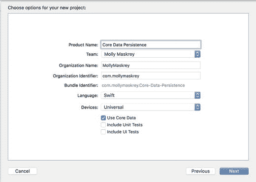

**图 13-8.** 选择 Single View Application 和使用 Core Data 进行持久化的选项

在我们继续编写代码之前，让我们看一下项目窗口，它包含一些新项目。如果 `Core Data Persistence` 文件夹已关闭，请将其展开（参见图 [13-9]）。

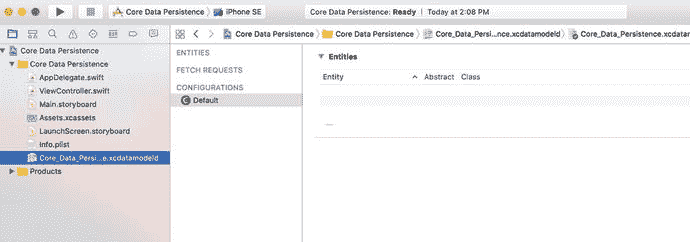

**图 13-9.** 我们的项目模板，包含 Core Data 所需的文件。Core Data 模型已被选中，数据模型编辑器显示在编辑窗格中


### 实体与管理对象

你在项目导航器中看到的大部分内容应该都很熟悉：应用程序委托、视图控制器、两个故事板以及资源目录。此外，你还会找到一个名为 `Core_Data_Persistence.xcdatamodeld` 的文件，其中包含我们的数据模型。在 Xcode 中，Core Data 让我们能够以可视化的方式设计数据模型，无需编写代码，并将该数据模型存储在 `.xcdatamodeld` 文件中。

现在，单击该 `.xcdatamodeld` 文件，你将看到数据模型编辑器（参见图 13-9 的右侧）。数据模型编辑器提供了两种不同的视图来查看数据模型，具体取决于项目窗口右下角的编辑器样式控件设置。在表格模式下（即图 13-9 所示的模式），构成数据模型的元素将显示在一系列可编辑的表格中。而在图形模式下，你会看到这些元素的图形化表示。目前，两种视图反映的都是同一个空的数据模型。

在 Core Data 出现之前，创建数据模型的传统方式是创建 `NSObject` 的子类，并使其遵循 `NSCoding` 和 `NSCopying` 协议，以便它们能够被归档，就像本章前面所做的那样。Core Data 采用了一种根本不同的方法。它不再是使用类，而是先在数据模型编辑器中创建实体，然后在代码中根据这些实体创建托管对象。

**注意**

*实体*和*托管对象*这两个术语可能会让人有些混淆，因为它们都指数据模型对象。*实体*指的是对象的描述。*托管对象*指的是该实体在运行时创建的实际具体实例。因此，在数据模型编辑器中，你创建的是实体；而在代码中，你创建并检索的是托管对象。实体与托管对象之间的区别，类似于类与类实例之间的区别。

实体由属性构成。属性有以下三种类型：

- **属性 (Attributes)**：在 Core Data 实体中，属性的作用与 Swift 类中的属性相同。两者都用于保存数据。
- **关系 (Relationships)**：顾名思义，关系定义了实体之间的关联。例如，要创建一个 `Person` 实体，你可能首先定义一些属性，比如 `hairColor`、`eyeColor`、`height` 和 `weight`。你可能还会定义地址属性，例如 `state` 和 `zipCode`，或者将它们嵌入到一个独立的 `HomeAddress` 实体中。如果采用后一种方法，你需要在 `Person` 和 `HomeAddress` 之间创建关系。关系可以是一对一或一对多。从 `Person` 到 `HomeAddress` 的关系可能是一对一，因为大多数人通常只有一个家庭地址。而从 `HomeAddress` 到 `Person` 的关系可能是一对多，因为可能有多个 `Person` 居住在同一个 `HomeAddress`。
- **获取属性 (Fetched properties)**：获取属性是关系的一种替代方案。获取属性允许你创建一个查询，该查询在获取时进行评估，以确定哪些对象属于该关系。为了扩展前面的例子，`Person` 对象可以有一个名为 `Neighbors` 的获取属性，用于查找数据存储中所有与 `Person` 自己的 `HomeAddress` 具有相同邮政编码的 `HomeAddress` 对象。由于获取属性的构建和使用方式，它们始终是单向关系。获取属性也是唯一一种允许你跨多个数据存储进行遍历的关系类型。

通常，属性、关系和获取属性是使用 Xcode 的数据模型编辑器来定义的。在我们的 Core Data 持久化应用程序中，我们将构建一个简单的实体，以便让你了解这一切是如何协同工作的。

### 键值编码

在代码中，你将使用键值编码来设置属性或获取其现有值，而不是使用访问器和修改器。键值编码听起来可能很吓人，但你在本书中已经多次使用过它。例如，每次我们使用 `Dictionary` 时，其实就是在使用一种键值编码形式，因为字典中的每个对象都存储在一个唯一的键值下。Core Data 使用的键值编码比 `Dictionary` 使用的要复杂一些，但其基本概念是相同的。当处理托管对象时，用于设置或获取属性值的键就是你想要设置的属性名称。因此，以下是如何从托管对象中检索名为 `name` 的属性所存储的值：

```
let name = myManagedObject.valueForKey("name")
```

类似地，要为托管对象的属性设置新值，请执行以下操作：

```
myManagedObject.setValue("Gregor Overlander", forKey:"name")
```


### 将一切置于上下文中

那么，这些托管对象究竟存在于何处？它们存在于所谓的持久化存储中，也称为后备存储。持久化存储可以有几种不同的形式。默认情况下，Core Data 应用程序将后备存储实现为存储在应用程序 Documents 目录中的 SQLite 数据库。尽管你的数据是通过 SQLite 存储的，但 Core Data 框架中的类负责加载和保存数据的所有工作。如果你使用 Core Data，则无需编写任何 SQL 语句，就像你在 SQLite 持久化应用程序中看到的那样。你只需处理对象，Core Data 会自动处理后台需要完成的工作。

SQLite 并不是 Core Data 唯一的存储选项。后备存储也可以实现为二进制平面文件，甚至以 XML 格式存储。另一种选择是创建内存存储，如果你正在编写缓存机制，可能会用到它；但是，它不会在本次会话结束后保存数据。在几乎所有情况下，你只需保留默认设置，使用 SQLite 作为持久化存储。

虽然大多数应用程序只有一个持久化存储，但同一个应用程序中可能有多个持久化存储。如果你对后备存储的创建和配置方式感到好奇，请查看 Xcode 项目中的 `AppDelegate.swift` 文件。我们选择的 Xcode 项目模板提供了为应用程序设置单个持久化存储所需的所有代码。

除了创建它之外，你通常不会直接与持久化存储打交道。相反，你会使用一个称为托管对象上下文（通常简称为上下文）的东西。上下文管理对持久化存储的访问，并维护自上次保存对象以来哪些属性发生了更改的信息。上下文还会将所有更改注册到撤销管理器，这意味着你始终能够撤销单个更改，或一直回滚到上次保存数据时的状态。

> **注意**
>
> 你可以有多个上下文指向同一个持久化存储，不过大多数 iOS 应用程序只会使用一个。

许多 Core Data 方法调用都需要 `NSManagedObjectContext` 作为参数，或者必须针对上下文执行。除了更复杂的多线程 iOS 应用程序外，你只需使用应用程序委托提供的 `managedObjectContext` 属性，这是一个为你自动创建的默认上下文，同样得益于 Xcode 项目模板。

你可能还会注意到，除了托管对象上下文和持久化存储协调器之外，提供的应用程序委托还包含一个 `NSManagedObjectModel` 的实例。该类负责在运行时加载和表示你将使用 Xcode 中的数据模型编辑器创建的数据模型。你通常不需要直接与此类交互。它在后台被其他 Core Data 类使用，以便它们能够识别你在数据模型中定义的实体和属性。只要你使用提供的文件创建数据模型，就完全无需担心此类。

### 创建新的托管对象

创建托管对象的新实例相当简单，尽管不像创建普通对象实例那样直接。相反，你使用名为 `NSEntityDescription` 的类中的 `insertNewObject(forEntityName: into:)` 工厂方法。`NSEntityDescription` 的工作是跟踪应用程序数据模型中定义的所有实体，并让你能够创建这些实体的实例。此方法创建并返回一个代表内存中单个实体的实例。它返回一个 `NSManagedObject` 实例，该实例已为该特定实体设置了正确的属性；或者，如果你已将实体配置为使用 `NSManagedObject` 的特定子类来实现，则返回该子类的一个实例。请记住，实体类似于类。一个实体是对一个对象的描述，并定义了特定实体拥有哪些属性。

要创建一个新对象，请执行以下操作：

```swift
let thing = NSEntityDescription.insertNewObject(forEntityName: "Thing",
into:managedObjectContext)
```

该方法名为 `insertNewObject(forEntityName: into:)`，因为除了创建对象之外，它还会将新创建的对象插入到上下文中，然后返回该对象。在此调用之后，对象存在于上下文中，但尚未成为持久化存储的一部分。下次调用托管对象上下文的 `save()` 方法时，该对象将被添加到持久化存储中。

### 检索托管对象

要从持久化存储中检索托管对象，你将使用获取请求，这是 Core Data 处理预定义查询的方式。例如，你可以说：“给我所有 `eyeColor` 为 `blue` 的 `Person`。”要创建获取请求，你需要提供一个 `NSEntityDescription`，用于指定你希望检索的一个或多个对象的实体。这是一个创建获取请求的示例：

```swift
let context = appDelegate.managedObjectContext
let request: NSFetchRequest = NSFetchRequest(entityName:"Thing")
```

你使用 `NSManagedObjectContext` 上的一个实例方法来执行获取请求：

```swift
do {
    let objects = try context.fetch(request)
    // 没有错误 - 使用 "objects"
} catch {
    // 发生错误 - "error" 变量包含一个 NSError 对象
    print(error)
}
```

`fetch()` 会从持久化存储中加载指定的对象，并以可选数组的形式返回它们。如果遇到错误，`fetch()` 会抛出一个描述具体问题的 `NSError` 对象。你需要捕获此错误并尽可能处理它，或者让它传播到包含此代码的函数的调用者。此处，我们只是将错误写入控制台。如果你不熟悉 Swift 的错误处理机制，请参考附录中的“错误处理”一节。如果没有发生错误，你将得到一个有效的数组，尽管其中可能没有任何对象，因为有可能没有对象满足指定的条件。从此时起，你对返回的该数组中的托管对象所做的任何更改，都将由你执行请求时所针对的托管对象上下文进行跟踪，并在你向该上下文发送 `save:` 消息时进行保存。

### Core Data 应用程序

在深入代码之前，我们将先创建数据模型。


### 设计数据模型

选择 `Core_Data_Persistence.xcdatamodel` 以打开 Xcode 的数据模型编辑器。数据模型编辑窗格会显示数据模型中包含的所有实体、获取请求和配置。

**注意：** Core Data 中的配置概念允许你定义数据模型中所包含实体的一个或多个命名子集，这在某些场景下非常实用。例如，如果你想创建一套共享同一数据模型的应用程序，但有些应用不应访问所有内容（比如为普通用户和管理员分别设计不同的应用），这种方法就能实现。你也可以在单个应用内切换不同操作模式时使用多个配置。在本书中，我们完全不涉及配置；但由于配置列表（包括包含模型中所有内容的默认配置）就显示在实体和获取请求下方，我们认为有必要在此提一下。

如图 13-9 所示，这些列表目前为空，因为我们尚未创建任何内容。点击编辑器窗格左下角标有“添加实体”的加号图标即可解决。这将创建一个名为 `Entity` 的全新实体，如图 13-10 所示。

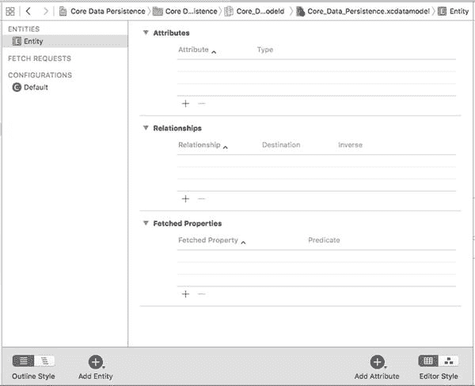

**图 13-10.** 数据模型编辑器，显示了新添加的实体。

在构建数据模型时，你可能会经常使用编辑区域右下角的“编辑器样式”控件在“表格视图”和“图形视图”之间切换。现在请切换到图形视图。图形视图会显示一个代表实体的小方框，其中包含用于展示实体属性和关系的区域，目前这些区域也都是空的（见图 13-11）。如果模型中包含多个实体，图形视图会非常有用，因为它能以图形方式展示所有实体之间的关系。

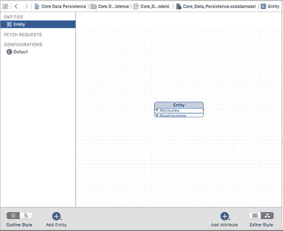

**图 13-11.** 使用右下角的控件，我们将数据模型编辑器切换到了图形模式。请注意，图形模式显示与表格模式相同的实体，只是以图形形式呈现。如果存在多个实体以及它们之间的关系，这种模式会非常有用。

**注意：** 如果你偏好图形化操作，实际上可以在图形视图中构建整个模型。本章我们仍将使用表格视图，因为这样更容易解释。在创建自己的数据模型时，如果图形视图更适合你，请随意使用。

无论你是使用表格视图还是图形视图来设计数据模型，通常都需要调出 Core Data 数据模型检查器。该检查器允许你查看和编辑数据模型编辑器中选中项的相关详细信息——无论是实体、属性、关系还是其他任何内容。你可以在没有数据模型检查器的情况下浏览现有模型；但要真正操作模型，你必然需要使用这个检查器，就像编辑 nib 文件时频繁使用属性检查器一样。

按下 `⌥⌘3` 打开数据模型检查器。目前，检查器显示的是刚刚添加的实体的信息。模型中唯一的实体包含 GUI 中一行的数据，因此我们将其命名为 `Line`。将“名称”字段从 `Entity` 更改为 `Line`，如图 13-12 所示。

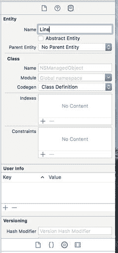

**图 13-12.** 使用数据模型检查器将实体名称更改为 `Line`。

如果你当前在图形视图中，请使用“编辑器样式”控件切换回表格视图。表格视图会显示我们正在处理的实体的每个部分的更多详细信息，因此在创建新实体时，它通常比图形视图更有用。在表格视图中，数据模型编辑器的大部分区域都被用于展示实体的属性、关系和获取属性的表格。这就是我们将要设置实体的地方。

请注意，在编辑区域的右下角，紧邻“编辑器样式”控件的地方，有一个带加号的图标，标记为“添加属性”。如果你选中实体并按住此控件上的鼠标按钮，将出现一个弹出菜单，允许你为实体添加属性、关系或获取属性（见图 13-13）。或者，如果你只想添加属性，可以直接点击加号图标。

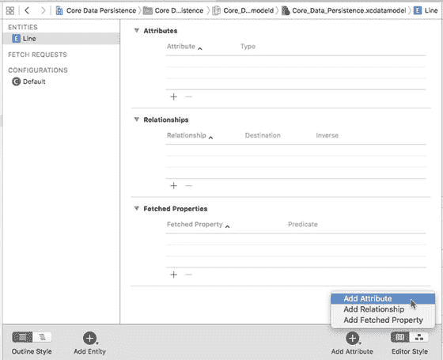

**图 13-13.** 选中一个实体后，按住右侧的加号图标可以为实体添加属性、关系或获取属性。

继续使用此方法为你的 `Line` 实体添加一个属性。一个新属性（被巧妙命名为 `attribute`）会添加到表格的“属性”部分并被选中。在表格中，你不仅可以看到行被选中，属性的名称也被选中了。这意味着点击加号后，你可以立即开始输入新属性的名称，无需再次点击。将新属性的名称从 `attribute` 更改为 `lineNumber`，然后点击名称旁边的弹出菜单，将其类型从 `Undefined` 更改为 `Integer 16`。这样，这个属性就变成了一个用于存储整数值的属性。我们将使用此属性来标识托管对象的四个字段中哪个包含数据。由于我们只有四个选项，因此选择了可用的最小整数类型。

现在，将注意力转向右侧编辑器窗格中的数据模型检查器。在这里可以配置更多详细信息。检查器应该显示你刚添加的属性的属性。如果它仍显示 `Line` 实体的详细信息，请点击编辑器中的属性行将其选中，检查器应将焦点切换到该属性。名称字段下方的复选框 `Optional`（可选）默认处于选中状态。点击取消勾选。我们不希望这个属性是可选的——不对应界面标签的行是没有用的。

选中 `Transient`（瞬态）复选框会创建一个瞬态属性。此属性用于指定应用程序运行期间由托管对象持有的值，但永远不会保存到数据存储中。我们希望行号保存到数据存储中，因此保持 `Transient` 复选框未选中状态。选中 `Indexed`（已索引）复选框将在底层 SQL 数据库中创建索引，该索引位于保存此属性数据的列上。保持 `Indexed` 复选框未选中状态。数据量很小，并且我们不会为用户提供搜索功能；因此，不需要索引。

下面还有更多设置，允许我们通过为整数指定最小值和最大值、默认值等来进行简单的数据验证。在本例中，我们不会使用这些设置中的任何一个。

现在确保 `Line` 实体被选中，然后点击“添加属性”控件来添加第二个属性。将新属性的名称更改为 `lineText`，并将其类型更改为 `String`。此属性将保存文本字段中的实际数据。对于此属性，保持 `Optional` 复选框处于选中状态；用户完全有可能不为某个字段输入值。


当将类型更改为`String`时，你会注意到检查器显示了一组略有不同的选项，用于设置默认值或限制字符串长度。虽然在本应用中不会用到这些选项，但了解它们的存在是件好事。

我们的数据模型已经完成。就是这样。Core Data 允许你通过点击方式来构建应用数据模型。让我们完成应用的构建，以便了解如何从代码中使用我们的数据模型。

### 修改`AppDelegate.swift`文件

在`AppDelegate.swift`文件中找到以下行：

```
// MARK: - Core Data stack
```

在此行下方，你应该会看到两段代码。第一段创建了一个`NSPersistentContainer`，这是一个新特性，本质上提供了对大量 Core Data 结构的封装。本示例中不会使用它，因此请删除这段代码。

> **注意**  
> 新的容器特性是一个好东西，最终会使 Core Data 应用的开发更加轻松。然而在撰写本书时，我发现它并不稳定，因此我们将沿用本书先前版本中创建项目的方法。我们采用的方法完全可行。

另外，删除模板中的`saveContext`方法，并将其替换为代码清单 13-11 所示的内容。这是我们所有“数据”被保存的地方。当应用准备退出活跃状态时，我们会从视图控制器中调用它。

```
func saveContext () {
if managedObjectContext.hasChanges {
do {
try managedObjectContext.save()
} catch {
// Replace this implementation with code to handle the error appropriately.
// abort() causes the application to generate a crash log and terminate. You should not use this function in a shipping application, although it may be useful during development.
let nserror = error as NSError
NSLog("Unresolved error \(nserror), \(nserror.userInfo)")
abort()
}
}
}
```
**代码清单 13-11** `AppDelegate.swift`文件中的`saveContext`方法

接下来，在`AppDelegate.swift`文件中，将代码清单 13-12 中的方法添加到以下行下方：

```
// MARK: - Core Data stack
```

```
// MARK: - Core Data stack
lazy var applicationDocumentsDirectory: URL = {
// The directory the application uses to store the Core Data store file. This code uses a directory in the application's documents Application Support directory.
let urls = FileManager.default.urls(for: .documentDirectory, in: .userDomainMask)
return urls[urls.count-1]
}()
lazy var managedObjectModel: NSManagedObjectModel = {
// The managed object model for the application. This property is not optional. It is a fatal error for the application not to be able to find and load its model.
let modelURL = Bundle.main.url(forResource: "Core_Data_Persistence", withExtension: "momd")!
return NSManagedObjectModel(contentsOf: modelURL)!
}()
lazy var persistentStoreCoordinator: NSPersistentStoreCoordinator = {
// The persistent store coordinator for the application. This implementation creates and returns a coordinator, having added the store for the application to it. This property is optional since there are legitimate error conditions that could cause the creation of the store to fail.
// Create the coordinator and store
let coordinator = NSPersistentStoreCoordinator(managedObjectModel: self.managedObjectModel)
let url = try! self.applicationDocumentsDirectory.appendingPathComponent("SingleViewCoreData.sqlite")
var failureReason = "There was an error creating or loading the application's saved data."
do {
try coordinator.addPersistentStore(ofType: NSSQLiteStoreType, configurationName: nil, at: url, options: nil)
} catch {
// Report any error we got.
var dict = [String: AnyObject]()
dict[NSLocalizedDescriptionKey] = "Failed to initialize the application's saved data"
dict[NSLocalizedFailureReasonErrorKey] = failureReason
dict[NSUnderlyingErrorKey] = error as NSError
let wrappedError = NSError(domain: "YOUR_ERROR_DOMAIN", code: 9999, userInfo: dict)
// Replace this with code to handle the error appropriately.
// abort() causes the application to generate a crash log and terminate. You should not use this function in a shipping application, although it may be useful during development.
NSLog("Unresolved error \(wrappedError), \(wrappedError.userInfo)")
abort()
}
return coordinator
}()
lazy var managedObjectContext: NSManagedObjectContext = {
// Returns the managed object context for the application (which is already bound to the persistent store coordinator for the application.) This property is optional since there are legitimate error conditions that could cause the creation of the context to fail.
let coordinator = self.persistentStoreCoordinator
var managedObjectContext = NSManagedObjectContext(concurrencyType: .mainQueueConcurrencyType)
managedObjectContext.persistentStoreCoordinator = coordinator
return managedObjectContext
}()
```
**代码清单 13-12** 我们的 Core Data 栈

> **注意**  
> 在先前版本的 Xcode 中，单视图模板会生成大部分此类代码。无论是变更还是缺陷，我们发现 Xcode 的测试版中，单视图模板并未生成大部分此类代码。不过，如果你选择主从视图模板来创建项目，会发现 Xcode 提供了更多此类代码。

以下行定义了 Core Data 存储文件的路径：

```
lazy var applicationDocumentsDirectory: URL = {
```

这个变量表示我们的托管对象模型：

```
lazy var managedObjectModel: NSManagedObjectModel = {
// The managed object model for the application.
// This property is not optional. It is a fatal error for
//the application not to be able to find and load its model.
let modelURL = Bundle.main.url(forResource: "Core_Data_Persistence", withExtension: "momd")!
return NSManagedObjectModel(contentsOf: modelURL)!
}()
```

类似地，以下代码部分提供了对持久化存储协调器的引用：


```content
lazy var persistentStoreCoordinator: NSPersistentStoreCoordinator = {
    // 应用程序的持久化存储协调器。此实现创建并返回一个协调器，并将应用的存储添加至其中。此属性为可选属性，因为存在合理的错误条件可能导致存储创建失败。
    // 创建协调器和存储
    let coordinator = NSPersistentStoreCoordinator(managedObjectModel: self.managedObjectModel)
    let url = try! self.applicationDocumentsDirectory.appendingPathComponent("SingleViewCoreData.sqlite")
    var failureReason = "创建或加载应用程序保存的数据时出错。"
    do {
        try coordinator.addPersistentStore(ofType: NSSQLiteStoreType, configurationName: nil, at: url, options: nil)
    } catch {
        // 报告所有出现的错误。
        var dict = [String: AnyObject]()
        dict[NSLocalizedDescriptionKey] = "无法初始化应用程序的保存数据"
        dict[NSLocalizedFailureReasonErrorKey] = failureReason
        dict[NSUnderlyingErrorKey] = error as NSError
        let wrappedError = NSError(domain: "YOUR_ERROR_DOMAIN", code: 9999, userInfo: dict)
        // 替换此处的代码，以妥善处理错误。
        // abort() 会导致应用程序生成崩溃日志并终止。虽然此函数可能在开发过程中有用，但不应在正式发布的应用程序中使用。
        NSLog("未解决的错误 \(wrappedError), \(wrappedError.userInfo)")
        abort()
    }
    return coordinator
}()
```

最后，剩下的最后一部分是我们的托管对象上下文，如下所示：

lazy var managedObjectContext: NSManagedObjectContext = {
    // 返回应用程序的托管对象上下文（该上下文已绑定到应用程序的持久化存储协调器）。此属性为可选属性，因为存在合理的错误条件可能导致上下文创建失败。
    let coordinator = self.persistentStoreCoordinator
    var managedObjectContext = NSManagedObjectContext(concurrencyType: .mainQueueConcurrencyType)
    managedObjectContext.persistentStoreCoordinator = coordinator
    return managedObjectContext
}()

这就是我们应用程序委托所需的所有内容。我们创建了所需的各种片段，以便应用程序的其他部分能够访问 Core Data 功能。

#### 创建持久化视图

选择 `ViewController.swift` 并做出以下以粗体显示的更改：

```
class ViewController: UIViewController {
    @IBOutlet var lineFields:[UITextField]!
```

保存此文件。接下来，选择 `Main.storyboard` 在 Interface Builder 中编辑 GUI。通过按照本章前面“设计持久化应用程序视图”部分中的说明来设计视图并连接 Outlet 集合。您可能还会发现参考图 13-6 很有用。设计完成后，保存故事板文件。

现在回到 `ViewController.swift`，并进行清单 13-13 中的更改。

```
import UIKit
import CoreData
class ViewController: UIViewController {
    private static let lineEntityName = "Line"
    private static let lineNumberKey = "lineNumber"
    private static let lineTextKey = "lineText"
    @IBOutlet var lineFields:[UITextField]!
    override func viewDidLoad() {
        super.viewDidLoad()
        // 加载视图后执行任何其他设置，通常从 nib 文件加载。
        let appDelegate =
        UIApplication.shared().delegate as! AppDelegate
        let context = appDelegate.managedObjectContext
        let request: NSFetchRequest = NSFetchRequest(entityName: ViewController.lineEntityName)
        do {
            let objects = try context.fetch(request)
            for object in objects {
                let lineNum: Int = object.value(forKey: ViewController.lineNumberKey)! as! Int
                let lineText = object.value(forKey: ViewController.lineTextKey) as? String ?? ""
                let textField = lineFields[lineNum]
                textField.text = lineText
            }
            let app = UIApplication.shared()
            NotificationCenter.default.addObserver(self,
                                                   selector: #selector(UIApplicationDelegate.applicationWillResignActive(_:)),
                                                   name: NSNotification.Name.UIApplicationWillResignActive,
                                                   object: app)
        } catch {
            // 从 executeFetchRequest() 抛出的错误
            print("executeFetchRequest() 中出现错误：\(error)")
        }
    }
    func applicationWillResignActive(_ notification:Notification) {
        let appDelegate =
        UIApplication.shared().delegate as! AppDelegate
        let context = appDelegate.managedObjectContext
        for i in 0 ..< lineFields.count {
            let textField = lineFields[i]
            let request: NSFetchRequest = NSFetchRequest(entityName: ViewController.lineEntityName)
            let pred = Predicate(format: "%K = %d", ViewController.lineNumberKey, i)
            request.predicate = pred
            do {
                let objects = try context.fetch(request)
                var theLine:NSManagedObject! = objects.first as? NSManagedObject
                if theLine == nil {
                    // 没有该行的现有数据 – 为其插入一个新的托管对象
                    theLine =
                    NSEntityDescription.insertNewObject(
                        forEntityName: ViewController.lineEntityName,
                        into: context)
                        as NSManagedObject
                }
                theLine.setValue(i, forKey: ViewController.lineNumberKey)
                theLine.setValue(textField.text, forKey: ViewController.lineTextKey)
            } catch {
                print("executeFetchRequest() 中出现错误：\(error)")
            }
        }
        appDelegate.saveContext()
    }
}
```

**清单 13-13.** 修改我们的 `ViewController.swift` 文件以使用 Core Data

为了能够使用 Core Data，我们导入了 Core Data 框架。接下来，我们修改了 `viewDidLoad()` 方法，该方法需要检查持久化存储中是否存在任何现有数据。如果存在，则应加载数据并用数据填充文本字段。在该方法中，我们首先要做的是获取对应用程序委托的引用，然后使用该引用来获取为我们创建的托管对象上下文（类型为 `NSManagedObjectContext`）：

```
let appDelegate =
UIApplication.shared().delegate as! AppDelegate
let context = appDelegate.managedObjectContext
```

接下来要做的是创建一个获取请求，并向其传递实体名称，以便它知道要检索哪种类型的对象：

```
let request: NSFetchRequest =
NSFetchRequest(entityName: ViewController.lineEntityName)
```
```


由于我们需要从持久化存储中检索所有`Line`对象，因此不创建谓词。执行没有谓词的请求时，我们是在告诉上下文返回存储中的每一个`Line`对象。创建好获取请求后，我们使用托管对象上下文的`fetch()`方法来执行它。由于`fetch()`可能会抛出错误，我们将调用及其结果使用的代码放在`do`-`catch`块中，这样如果有错误，我们就可以记录它：

```
do {
    let objects = try context.fetch(request)
```

接下来，我们遍历检索到的托管对象数组，从每个托管对象中提取`lineNum`和`lineText`值，并使用这些信息更新用户界面中的一个文本字段：

```
for object in objects {
    let lineNum: Int = object.value(forKey: ViewController.lineNumberKey)! as! Int
    let lineText = object.value(forKey: ViewController.lineTextKey) as? String ?? ""
    let textField = lineFields[lineNum]
    textField.text = lineText
}
```

当然，第一次执行这段代码时，数据存储中还没有保存任何内容，因此对象列表将是空的。

接下来，与本章中的所有其他应用程序一样，我们注册以在应用程序即将离开活动状态时（无论是被移到后台还是完全退出）收到通知，这样我们就可以保存用户对数据所做的任何更改：

```
let app = UIApplication.shared()
NotificationCenter.default.addObserver(self,
    selector: #selector(UIApplicationDelegate.applicationWillResignActive(_:)),
    name: NSNotification.Name.UIApplicationWillResignActive,
    object: app)
```

最后，catch 子句会打印从`fetch()`方法中抛出的任何错误：

```
} catch {
    // Error thrown from executeFetchRequest()
    print("There was an error in executeFetchRequest(): \(error)")
}
```

现在让我们看看`applicationWillResignActive()`。我们以与上一个方法相同的方式开始：获取应用程序委托的引用，并使用它来获取指向我们应用程序默认托管对象上下文的指针：

```
let appDelegate =
    UIApplication.shared().delegate as! AppDelegate
let context = appDelegate.managedObjectContext
```

之后，我们进入一个循环，该循环对每个文本字段执行一次，然后获取正确字段的引用：

```
for i in 0 ..< lineFields.count {
    let textField = lineFields[i]
```

接下来，我们为`Line`条目创建获取请求。我们需要找出持久化存储中是否已经存在对应于该字段的托管对象，因此我们创建一个谓词，通过使用文本字段的索引作为记录键来标识该字段的正确对象：

```
let request: NSFetchRequest =
let pred = Predicate(format: "%K = %d", ViewController.lineNumberKey, i)
request.predicate = pred
```

现在我们针对上下文执行获取请求。和之前一样，我们将这段代码包装在`do`-`catch`块中，以便能够报告 Core Data 报告的任何错误：

```
do {
    let objects = try context.fetch(request)
```

之后，我们声明一个类型为`NSManagedObject`的变量`theLine`，它将引用此行数据的托管对象。我们之前可能没有为此行存储任何数据，所以此时，我们不知道是否会从持久化存储中获取到它的托管对象。因此，`theLine`需要声明为可选项。但为了方便起见，我们会将其声明为强制解包类型，因为如果我们没有获取到，我们将使用`insertNewObject(forEntityName:inManagedObjectContext:)`方法在持久化存储中为此行创建一个新的托管对象。在这种情况下，我们将使用该托管对象来初始化`theLine`：

```
var theLine:NSManagedObject! = objects.first as? NSManagedObject
if theLine == nil {
    // No existing data for this row – insert a new managed object for it
    theLine =
        NSEntityDescription.insertNewObject(
            forEntityName: ViewController.lineEntityName,
            into: context)
        as NSManagedObject
```

接下来，我们使用键值编码来设置此托管对象的行号和文本。我们记录在`catch`子句中捕获到的任何错误：

```
theLine.setValue(i, forKey: ViewController.lineNumberKey)
theLine.setValue(textField.text, forKey: ViewController.lineTextKey)
```

最后，循环结束后，我们告诉上下文保存其更改：

```
appDelegate.saveContext()
```

就是这样。构建并运行应用程序以确保其正常工作。你的应用程序的 Core Data 版本的行为应与之前的版本完全相同。

## 总结

现在，你应该已经扎实掌握了在会话之间保留应用程序数据的四种不同方法——如果算上你在上一章中学到的用户默认设置，就是五种方法。我们构建了一个使用属性列表持久化数据的应用程序，并修改了该应用程序以使用对象归档保存其数据。然后我们进行了更改，并使用 iOS 内置的 SQLite3 机制来保存应用程序数据。最后，我们使用 Core Data 重新构建了相同的应用程序。这些机制几乎是所有 iOS 应用程序中保存和加载数据的基本构建块。

# 14. 文档与 iCloud

苹果随 iOS 5 推出的 iCloud 服务（见图 14-1）为 iOS 设备以及运行 macOS 的电脑提供云存储。大多数 iOS 用户可能在设置新设备或将旧设备升级到更新版本的 iOS 时，会立即遇到 iCloud 设备备份选项，并很快发现无需使用电脑即可自动备份的优势。

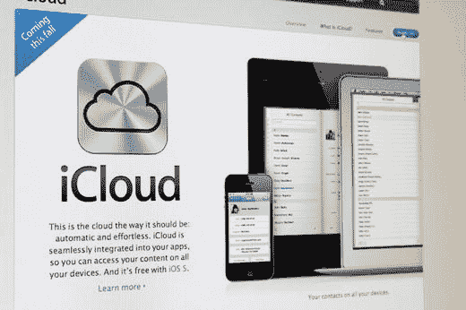

**图 14-1.** 苹果的 iCloud 首次随 iOS 5 推出，为 iOS 和 macOS 应用程序提供了易于使用的服务器存储

免电脑备份提供了很棒的功能，但这只是 iCloud 功能的一小部分。更重要的是，iCloud 为应用程序开发人员提供了一种机制，可以毫不费力地将数据透明地保存到苹果的云服务器上。你可以配置你的应用程序将信息保存到 iCloud，并让这些数据自动传输到注册了同一 iCloud 用户的任何其他设备。用户可以在 iPad 上创建文档，稍后无需任何中间步骤即可在 iPhone 或 Mac 上查看同一文档——文档会自动出现。

由系统进程负责确保用户拥有有效的 iCloud 登录信息并管理文件传输，因此你无需担心网络或身份验证问题。除了少量的应用程序配置外，只需对保存文件和定位可用文件的方法进行少量更改，即可进入 iCloud 领域。

`UIDocument`类提供了 iCloud 文件系统的一个组件。`UIDocument`通过处理读写文件的一些常见方面，减轻了创建基于文档的应用程序的部分工作。这样，你可以将更多时间花在应用程序的独特功能上，而不是为每个创建的应用程序构建相同的底层框架。

无论你是否使用 iCloud，`UIDocument`都为 iOS 中文档文件的管理提供了一些强大的工具。为了演示这些功能，本章的第一部分专门用于创建`TinyPix`，这是一个简单的基于文档的应用程序，将文件保存到本地存储。这种方法适用于各种基于 iOS 的应用程序，最近苹果已经允许在物理设备上执行之前在模拟器内测试 iCloud 同步。

本章将向你展示如何为`TinyPix`应用程序启用 iCloud 功能。


## 使用 UIDocument 管理文档存储

任何允许处理多个数据集合并将每个集合保存到独立文件的软件，都可被视为基于文档的应用程序。通常情况下，屏幕上的窗口与其包含的文档之间存在一一对应关系；但有时（例如 Xcode），单个窗口可以显示多个以某种方式相互关联的文档。

在 iOS 设备上，应用程序通常不会使用多个窗口，但仍有大量应用能受益于基于文档的方法。得益于 `UIDocument` 类，它负责处理文档文件存储中最常见的方面，因此你无需直接处理文件（只需处理 URL），所有必要的读写操作都在后台线程中进行，这样即使在文件访问期间，你的应用也能保持响应。`UIDocument` 会自动定期保存已编辑的文档，并在应用被挂起时（例如设备关机、按下 Home 键等）自动保存，因此无需任何保存按钮。所有这些都有助于使应用程序的行为符合用户对 iOS 应用的预期。

### 创建 TinyPix 应用程序

我们将构建一个名为 TinyPix 的应用，它允许用户编辑简单的 8×8 单色图像（1 位色彩），如图 14-2 所示。为了方便用户，每张图片都会被放大至全屏尺寸进行编辑。我们将使用 `UIDocument` 来表示每张图片的数据。


图 14-2. 在 TinyPix 中编辑一个极低分辨率的图标

首先在 Xcode 中创建一个新项目。从 iOS 应用部分选择 Master-Detail Application 模板，然后点击 Next。将此新应用命名为 TinyPix，并将 Devices 弹出菜单设置为 Universal。确保未勾选 Use Core Data 复选框。再次点击 Next，选择保存项目的位置。

在 Xcode 的项目导航器中，你会看到项目包含 `AppDelegate`、`MasterViewController`、`DetailViewController` 以及 `Main.storyboard` 文件。我们将对这些文件进行修改，并在此过程中创建几个新的类。

### 创建 TinyPixDocument

我们要创建的第一个新类是文档类，它将包含从文件存储加载的每个 TinyPix 图像的数据。在 Xcode 中选择 TinyPix 文件夹，然后按 ⌘N 创建新文件。从 iOS 源部分选择 Cocoa Touch Class，点击 Next。在 Class 字段中输入 `TinyPixDocument`，在 Subclass of 字段中输入 `UIDocument`，然后点击 Next。最后点击 Create 创建文件。

在深入实现细节之前，我们先思考一下这个类的公共 API。这个类将表示一个 8×8 的像素网格，每个像素由开或关的单一值组成。因此，我们将提供一个方法，它接收行和列的索引对，并返回一个 `Bool` 值。我们还将提供一个方法来设置在指定行和列的特定状态，并且为了方便，提供另一个方法，用于切换特定位置的状态。

切换到 `TinyPixDocument.swift` 文件，我们将在其中实现 8×8 网格的存储、公共 API 所需的方法，以及启用文档加载和保存的必要 `UIDocument` 方法。

首先，定义 8×8 位图数据的存储。我们将这些数据保存在一个 `UInt8` 数组中。将以下属性添加到 `TinyPixDocument` 类中：

```
class TinyPixDocument: UIDocument {
    private var bitmap: [UInt8]
```

`UIDocument` 类有一个所有子类都应使用的指定初始化器。我们将在此处创建初始位图。按照真正的位图风格，我们将通过使用单个字节来包含每一行，从而最大限度地减少内存使用。字节中的每一位代表该行中某一列索引的开/关值。总共，我们的文档只包含 8 个字节。

**注意：** 本节包含少量位运算操作，以及一些 C 指针和数组操作。对于 C 开发者来说，这些都很普通；但如果你没有太多 C 语言经验，可能会感到困惑甚至难以理解。如果是这样，你只需直接复制并使用提供的代码即可（功能完全正常）。如果你真想理解其中的原理，可能需要更深入地研究 C 语言本身。

将以下初始化器添加到文档的实现中：

```
override init(fileURL: URL) {
    bitmap = [0x01, 0x02, 0x04, 0x08, 0x10, 0x20, 0x40, 0x80]
    super.init(fileURL: fileURL as URL)
}
```

这将位图初始化为从一角延伸到另一角的简单对角线图案。现在，是时候实现组成公共 API 的方法了。首先创建一个从位图中读取单个位状态的方法。添加清单 14-1 中的方法。

```
func stateAt(row: Int, column: Int) -> Bool {
    let rowByte = bitmap[row]
    let result = UInt8(1 << column) & rowByte
    return result != 0
}
```

清单 14-1. 读取单个位的状态

这段代码简单地从字节数组中获取相关字节，然后进行位移和 `AND` 操作，以确定指定位是否被设置，并相应返回 `true` 或 `false`。接下来是逆操作：一个在指定行和列设置值的方法。这里，我们再次获取指定行的字节并进行位移。但这一次，我们不是用位移后的位来检查行的内容，而是用它来设置或取消设置行中的位。将清单 14-2 中的方法添加到类定义的末尾。

```
func setState(state: Bool, atRow row: Int, column: Int) {
    var rowByte = bitmap[row]
    if state {
        rowByte |= UInt8(1 << column)
    } else {
        rowByte &= ∼UInt8(1 << column)
    }
    bitmap[row] = rowByte
}
```

清单 14-2. 在行中设置或取消设置位

现在，添加一个便捷方法，让外部代码可以简单地切换单个单元格：

```
func toggleStateAt(row: Int, column: Int) {
    let state = stateAt(row: row, column: column)
    setState(state: !state, atRow: row, column: column)
}
```


我们的文档类需要最后两个部分才能融入基于文档的应用程序拼图：读取和写入方法。如前所述，你无需直接处理文件，甚至不必关心之前传入 `init(fileURL:)` 初始化器的 URL。你需要做的只是实现一个方法，将文档的内部数据结构（在本例中即 `bitmap` 字节数组）转换为可供保存的 `NSData` 对象，以及另一个方法，接收新加载的 `NSData` 对象并从中提取对象的数据结构。添加清单 14-3 中的两个方法，以履行所需的 `UIDocument` 合约。

```
override func contents(forType typeName: String) throws -> AnyObject {
    print("Saving document to URL \(fileURL)")
    let bitmapData = NSData(bytes: bitmap, length: bitmap.count)
    return bitmapData
}

override func load(fromContents contents: AnyObject, ofType typeName: String?) throws {
    print("Loading document from URL \(fileURL)")
    if let bitmapData = contents as? NSData {
        bitmapData.getBytes(UnsafeMutablePointer(bitmap), length: bitmap.count)
    }
}
```

**清单 14-3.** 与 `NSData` 对象的相互转换

第一个方法 `contents(forType:typeName:)` 在文档即将保存到存储时被调用。它简单地返回一个封装在 `NSData` 对象中的位图副本，系统会负责后续的存储。第二个方法 `load(fromContents:contents:)` 在系统刚加载完存储中的数据并希望将其提供给文档类实例时被调用。这里，我们直接从传入的 `NSData` 对象中获取字节副本。我们在两个方法中都添加了一些日志语句，以便稍后你可以在 Xcode 日志中看到发生了什么。

每个方法都允许你做一些我们在此应用中忽略的操作。它们都提供了一个 `typeName` 参数，你可以用它来区分文档可以加载或保存的不同数据存储类型。它们还声明在出现问题时可以抛出错误。但对我们而言，操作非常简单，没有需要检查的错误情况。

这就是文档类所需做的全部工作。遵循 MVC 原则，我们的文档完全属于模型层，不关心如何显示。而且得益于 `UIDocument` 父类，文档甚至不必了解存储机制的绝大多数细节。

### 主控制器

现在我们已经准备好文档类，是时候处理用户运行应用时看到的第一个视图了：现有 TinyPix 文档的列表，这由 `MasterViewController` 类负责。我们需要让这个类知道如何获取可用文档列表，允许用户选择现有文档进行查看或编辑，以及创建并命名新文档。当文档被创建或选择后，它会被传递给详细控制器进行显示。

首先选择 `MasterViewController.swift`。这个文件作为主-详细应用模板的一部分生成，包含用于显示项目数组的起始代码。我们不打算使用这些代码，而是完全自己实现。因此，删除文件中除了 `UIKit` 框架导入和类声明之外的所有内容。完成后，你应该得到一个干净的空文件，如下所示：

```
import UIKit

class MasterViewController: UITableViewController {
}
```

我们还会在图形用户界面中添加一个分段控件，允许用户选择一种色调颜色，用作 TinyPix 图形用户界面部分区域的高亮色。虽然这本身并不是一个特别有用的功能，但它将有助于演示 iCloud 机制，因为高亮颜色设置会从你设置它的设备传播到运行相同应用的其他已连接设备。应用的第一版会在每台设备上将颜色作为本地设置。本章后面，我们将添加代码，使颜色设置通过 iCloud 传播到用户的其他设备。

为了实现颜色选择控件，我们还需要在代码中添加一个插座变量和一个操作方法。同时，我们还将添加属性来保存文档文件名的列表，以及指向用户所选文档的指针。对 `MasterViewController.swift` 进行这些修改：

```
class MasterViewController: UITableViewController {
    @IBOutlet var colorControl: UISegmentedControl!
    private var documentFileURLs: [URL] = []
    private var chosenDocument: TinyPixDocument?
```

在实现我们需要处理的表格视图方法和其他标准方法之前，我们先编写几个私有工具方法。第一个方法接收一个文件名，将其与应用的文档目录 URL 拼接，并返回指向该特定文件的 URL。如第 13 章所述，文档目录是 iOS 为每个已安装应用预留的特殊位置。你可以用它存储应用创建的文档，并且放心，当用户备份 iOS 设备（无论是备份到 iTunes 还是 iCloud）时，这些文档都会自动包含在内。

将此方法添加到 `MasterViewController.swift` 中：

```
private func urlForFileName(fileName: String) -> URL {
    let urls = FileManager.default.urls(for: .documentDirectory, inDomains: .userDomainMask)
    var url: URL = URL(fileURLWithPath: "")      // 创建空白路径
    do {
        try url = urls.first!.appendingPathComponent(fileName)
    } catch {
        print("Error is \(error)")
    }
    return url
}
```

第二个私有方法稍长一些。它同样使用文档目录，这次是为了搜索表示现有文档的文件。该方法将找到的文件按创建日期排序，以便用户看到的文档列表像“博客风格”一样，最新项目排在最前面。文档文件的 URL 被存储在 `documentFileURLs` 属性中，然后表格视图（我们尚未处理）会被重新加载。将清单 14-4 中的代码添加到类定义中。


```swift
private func reloadFiles() {
    let fm = FileManager.default
    let documentsURL = fm.urls(for:
        .documentDirectory, inDomains: .userDomainMask).first!
    do {
        let fileURLs = try fm.contentsOfDirectory(at: documentsURL,
            includingPropertiesForKeys: nil, options: [])
        let sortedFileURLs = fileURLs.sorted(isOrderedBefore: { (file1URL, file2URL) -> Bool in
            let attr1 = try! fm.attributesOfItem(atPath: file1URL.path!)
            let attr2 = try! fm.attributesOfItem(atPath: file2URL.path!)
            let file1Date = attr1[FileAttributeKey.creationDate] as! NSDate
            let file2Date = attr2[FileAttributeKey.creationDate] as! NSDate
            let result = file1Date.compare(file2Date as Date)
            return result == ComparisonResult.orderedAscending
        })
        documentFileURLs = sortedFileURLs
        tableView.reloadData()
    } catch {
        print("列出目录 \(documentsURL.path!) 中的文件时出错: \(error)")
    }
}
```

**代码清单 14-4. 重新加载文件方法**

现在，我们来添加表格视图的数据源方法。到目前为止，你应该对这些方法相当熟悉了。将代码清单 14-5 中所示的方法添加到 `MasterViewController.swift` 文件中。

```swift
override func numberOfSections(in tableView: UITableView) -> Int {
    return 1
}
override func tableView(_ tableView: UITableView, numberOfRowsInSection section: Int) -> Int {
    return documentFileURLs.count
}
override func tableView(_ tableView: UITableView, cellForRowAt indexPath: IndexPath) -> UITableViewCell {
    let cell = tableView.dequeueReusableCell(withIdentifier: "FileCell")!
    let fileURL = documentFileURLs[indexPath.row]
    do {
        try cell.textLabel!.text = fileURL.deletingPathExtension().lastPathComponent
    } catch {
        print("错误: \(error)")
    }
    return cell
}
```

**代码清单 14-5. 表格视图数据源方法**

这些方法基于存储在 `documentFileURLs` 属性中的数组内容，该属性在我们之前创建的 `reloadFiles()` 方法中设置。这个数组包含 Documents 目录中每个文件的 `NSURL`，按创建时间排序，最早的文件排在前面。调用 `tableView(_:cellForForAtIndexPath:)` 方法获取 `UITableViewCell` 实例时，依赖于表格视图中已附加且标识符设为 `"FileCell"` 的单元格，因此我们稍后必须确保在故事板中设置好这一点。

如果不是因为我们尚未接触故事板，现有的代码几乎已经可以运行并看到效果了；然而，由于没有预先存在的 TinyPix 文档，表格视图中将没有任何内容可显示。到目前为止，我们也没有任何创建新文档的方法。此外，我们尚未处理将要添加的颜色选择控件。因此，在尝试运行应用之前，我们还需要做更多工作。

用户选择的高亮颜色将立即用于设置分段控件的色调颜色。`UIView` 类有一个 `tintColor` 属性。当为任何视图设置该属性时，该值会应用于该视图，并向下传递到其所有子视图。当我们设置分段控件的色调颜色时，还会将其存储到 `NSUserDefaults` 中以便后续检索。将这两个方法添加到类定义的末尾：

```swift
@IBAction func chooseColor(sender: UISegmentedControl) {
    let selectedColorIndex = sender.selectedSegmentIndex
    setTintColorForIndex(colorIndex: selectedColorIndex)
    let prefs = UserDefaults.standard
    prefs.set(selectedColorIndex, forKey: "selectedColorIndex")
    prefs.synchronize()
}
private func setTintColorForIndex(colorIndex: Int) {
    colorControl.tintColor = TinyPixUtils.getTintColorForIndex(index: colorIndex)
}
```

当用户在分段控件中更改选择时，第一个方法会触发。它将所选索引保存到用户默认设置中，并将其传递给第二个方法，第二个方法将索引转换为颜色并将其作为色调颜色应用到分段控件，从而使控件呈现用户选择的颜色。我们还需要在详情视图控制器中使用将索引转换为颜色的代码，因此它被实现在一个单独的类中。要创建该类，请按 `⌘N` 打开新建文件对话框。在 iOS Source 部分，选择 Swift File 并点击 Next。输入 `TinyPixUtils.swift` 作为文件名，然后点击 Create 创建文件。

现在切换到 `TinyPixUtils.swift` 来实现我们所需的方法：

```swift
import UIKit
class TinyPixUtils {
    class func getTintColorForIndex(index: Int) -> UIColor {
        let color: UIColor
        switch index {
        case 0:
            color = UIColor .red
        case 1:
            color = UIColor(red: 0, green: 0.6, blue: 0, alpha: 1)
        case 2:
            color = UIColor.blue
        default:
            color = UIColor.red
        }
        return color
    }
}
```

我们意识到尚未在故事板中进行任何设置。首先，我们还需要在 `MasterViewController.swift` 中做一些工作。让我们从 `viewDidLoad` 方法开始。在调用父类的实现之后，我们需要在导航栏右侧添加一个按钮。用户将按下此按钮来创建新的 TinyPix 文档。我们还将从用户默认设置中加载保存的色调颜色，并用它来设置分段控件的色调颜色。最后，调用之前实现的 `reloadFiles()` 方法来获取用户已创建的 TinyPix 文档列表。添加以下代码来实现 `viewDidLoad()`：

```swift
override func viewDidLoad() {
    super.viewDidLoad()
    let addButton = UIBarButtonItem(
        barButtonSystemItem: UIBarButtonSystemItem.add,
        target: self, action: #selector(MasterViewController.insertNewObject))
    navigationItem.rightBarButtonItem = addButton
    let prefs = UserDefaults.standard
    let selectedColorIndex = prefs.integer(forKey: "selectedColorIndex")
    setTintColorForIndex(colorIndex: selectedColorIndex)
    colorControl.selectedSegmentIndex = selectedColorIndex
    reloadFiles()
}
```

**代码清单 14-6. 我们的 `MasterViewController.swift` 文件中的 `viewDidLoad` 方法**

当你首次运行应用时，你会看到分段控件的色调颜色初始为红色。这是因为用户默认设置中尚未存储任何内容，所以 `integerForKey()` 方法返回 0，而 `setTintColorForIndex()` 方法将其解释为红色。

你可能已经注意到，在创建 `UIBarButtonItem` 时，我们告诉它在按钮按下时调用 `insertNewObject()` 方法。我们还没有编写该方法，所以现在开始编写。添加这个方法定义：

```swift
func insertNewObject() {
    let alert = UIAlertController(title: "选择文件名",
        message: "为你的新 TinyPix 文档输入一个名称",
        preferredStyle: .alert)
    alert.addTextField(configurationHandler: nil)
    let cancelAction = UIAlertAction(title: "取消", style: .cancel, handler: nil)
    let createAction = UIAlertAction(title: "创建", style: .default) { action in
        let textField = alert.textFields![0] as UITextField
        self.createFileNamed(textField.text!)
    };
    alert.addAction(cancelAction)
    alert.addAction(createAction)
    present(alert, animated: true, completion: nil)
}
```

此方法使用 `UIAlertController` 类来显示一个包含文本输入字段、创建按钮和取消按钮的提示框。如果按下创建按钮，创建新项目的责任将转交给按钮处理程序块完成后调用的方法，我们也将立即添加该方法。添加这个方法：
```


```swift
private func createFileNamed(fileName: String) {
let trimmedFileName = fileName.trimmingCharacters(in: NSCharacterSet.whitespaces)
if !trimmedFileName.isEmpty {
let targetName = trimmedFileName + ".tinypix"
let saveUrl = urlForFileName(fileName: targetName)
chosenDocument = TinyPixDocument(fileURL: saveUrl)
chosenDocument?.save(to: saveUrl,
for: UIDocumentSaveOperation.forCreating,
completionHandler: { success in
if success {
print("Save OK")
self.reloadFiles()
self.performSegue(withIdentifier: "masterToDetail", sender: self)
} else {
print("Failed to save!")
}
})
}
}
```

这个方法一开始很简单。它去除传入名称的首尾空白字符。如果结果不为空，则基于用户输入创建一个文件名，基于该文件名创建一个 URL（使用我们之前编写的`urlForFilename()`方法），并使用该 URL 创建一个新的`TinyPixDocument`实例。

接下来的内容稍微微妙一些。需要理解的是，仅仅用给定 URL 创建一个新文档并不会创建文件。实际上，在调用`init(fileURL:)`时，文档还不知道给定的 URL 是指向一个现有文件还是需要创建的新文件。我们需要告诉它该做什么。在这个例子中，我们告诉它用以下代码在给定的 URL 保存一个新文件：

```swift
chosenDocument?.save(to: saveUrl,
for: UIDocumentSaveOperation.forCreating,
completionHandler: { success in
.
.
.
})
```

值得关注的是作为最后一个参数传入的闭包的用途和用法。我们调用的方法`save(to: saveUrl  )`没有返回值来告诉我们它执行的结果。实际上，该方法在调用后会立即返回，远在文件实际保存完成之前。相反，它开始执行文件保存工作，在完成后调用我们提供的闭包，并使用`success`参数告知我们是否成功。为了让一切尽可能顺畅，文件保存工作实际上是在后台线程上执行的。而我们传入的闭包则在最初调用`save(to: saveUrl  )`的线程上执行。在这个特定情况下，这意味着闭包在主线程上执行，因此我们可以安全地使用任何需要主线程的功能，例如 UIKit。记住这一点，再看一下闭包内部发生了什么：

```swift
if success {
print("Save OK")
self.reloadFiles()
self.performSegue(withIdentifier: "masterToDetail", sender: self)
} else {
print("Failed to save!")
}
```

这是我们传入文件保存方法的闭包内容，它会在文件操作完成后被调用。我们检查是否成功；如果成功，则立即重新加载文件，然后启动到一个另一个视图控制器的转场。这是我们在第 9 章中没有涉及的转场的一个方面，但它相当直观。其思想是，故事板文件中的转场可以有一个标识符，就像表格视图单元格一样，你可以使用该标识符以编程方式触发转场。在这个例子中，我们只需要记住在后续配置故事板中的那个转场。但在做那件事之前，让我们添加这个类所需的最后一个方法，来处理那个转场。将以下方法添加到`MasterViewController.swift`中，如代码清单 14-7 所示。

```swift
override func prepare(for segue: UIStoryboardSegue, sender: AnyObject?) {
let destination =
segue.destinationViewController as! UINavigationController
let detailVC =
destination.topViewController as! DetailViewController
if sender === self {
// 如果 sender === self，则表示刚刚创建了一个新文档，
// 并且 chosenDocument 已设置。
detailVC.detailItem = chosenDocument
} else {
// 从表格视图中找到选择的文档
if let indexPath = tableView.indexPathForSelectedRow {
let docURL = documentFileURLs[(indexPath as NSIndexPath).row]
chosenDocument = TinyPixDocument(fileURL: docURL)
chosenDocument?.open() { success in
if success {
print("Load OK")
detailVC.detailItem = self.chosenDocument
} else {
print("Failed to load!")
}
}
}
}
}
```
代码清单 14-7. `MasterViewController.swift`文件中的`prepareForSeque`方法

这个方法有两条清晰的执行路径，由顶部的条件决定。还记得我们在第 9 章讨论故事板时提到，每当一个转场即将从该视图控制器执行时，这个方法会在该视图控制器上被调用。`sender`参数指代启动转场的对象，我们用它来确定具体要做什么。如果转场是由我们在警告视图委托方法中以编程方式调用的方法触发的，那么`sender`将等于`self`，因为那正是`createFileNamed()`方法中`performSegue(withIdentifier:)`调用的`sender`参数的值。在这种情况下，我们知道`chosenDocument`属性已经设置，只需将其值传递给目标视图控制器。

否则，我们知道这是在响应用户触摸表格视图中的某一行，这时事情会稍微复杂一些。这时需要创建文档类的一个新实例，并尝试打开用户选择的文件。你会看到，我们用来打开文件的方法`open()`与我们之前使用的保存方法类似。我们向它传递一个闭包，它会保存该闭包以供稍后执行。与文件保存方法一样，加载在后台进行，完成时该闭包会在主线程上执行。此时，如果加载成功，我们就将文档传递给详情视图控制器。

注意，这两个方法都使用了我们之前多次使用过的键值编码技术，允许我们设置转场目标控制器的`detailItem`属性，尽管我们没有包含它的头文件。这对我们来说没有问题，因为作为 Xcode 项目一部分创建的详情视图控制器类`DetailViewController`恰好自带了一个名为`detailItem`的属性，但我们可能需要将它从`NSDate`转换为`AnyObject?`，如下所示：

```swift
var detailItem: AnyObject? {
```

现在我们已经有了足够的代码，接下来将设置故事板，以便运行应用并看到实际效果。保存代码并继续。


### 设置故事板

在 Xcode 项目导航器中选择 `Main.storyboard`，查看已有内容。你会看到拆分视图控制器、两个导航控制器、主视图控制器以及明细视图控制器的场景（见图 14-3）。我们的所有工作都将围绕主视图控制器和明细视图控制器展开。

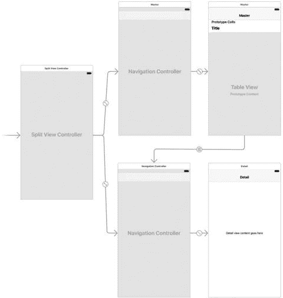

图 14-3. TinyPix 故事板，显示了拆分视图控制器、导航控制器、主视图控制器和明细视图控制器

我们先从主视图控制器场景入手，即图 14-3 中右上角的场景。这里配置了显示所有 TinyPix 文档列表的表格视图。默认情况下，该场景的表格视图配置为使用动态单元格而非静态单元格。我们希望表格视图通过实现的数据源方法获取内容，因此这个默认设置正是我们所需的。不过我们需要配置单元格原型，选择它并打开属性检查器。将单元格的标识符从 `Cell` 改为 `FileCell`。这样，我们之前编写的数据源代码就能访问这个表格视图单元格。

我们还需要创建代码中触发的转场。方法是从主视图控制器的图标（场景顶部的黄色圆圈，或文档大纲中“主场景”下的“主”图标）按住 Control 键拖拽到明细视图的导航控制器（图 14-3 左下角的控制器，也可以在文档大纲中展开“导航控制器场景”找到它），然后从故事板转场菜单中选择“显示明细”。

现在你会看到两个转场似乎连接着这两个场景。通过分别选择它们，可以判断源自哪里。选择第一个转场会高亮整个主场景；选择第二个转场则只会高亮表格视图单元格。选择高亮整个场景的那个转场（即你刚创建的转场），使用属性检查器将其目前为空的标识符设置为 `masterToDetail`。

主视图控制器场景的最后一步是让用户选择在明细视图中表示“开”点的颜色。我们不实现复杂的取色器，而是添加一个分段控件，让用户从一组预定义颜色中进行选择。

在对象库中找到分段控件，拖拽出来，将其放置在主视图顶部的导航栏中（见图 14-4）。

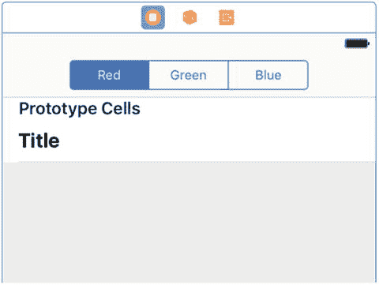

图 14-4. TinyPix 故事板，显示了主视图控制器，其导航栏上带有一个分段控件

确保分段控件已被选中，然后打开属性检查器。在检查器顶部的“分段控件”部分，使用步进器控件将分段数量从 2 改为 3。接着，依次双击每个分段的标题，分别改为 `Red`、`Green` 和 `Blue`。设置完标题后，点击分段控件的某个调整大小手柄，将其拉宽到能舒适显示所有三个标题。

接下来，从分段控件按住 Control 键拖拽到代表主控制器的图标（故事板中控制器上方的黄色“主”标签圆圈，或文档大纲中“主场景”下的“主”标签图标），然后选择 `chooseColor()` 方法。然后再从主控制器按住 Control 键拖拽回分段控件，选择 `colorControl` 插座。现在，我们已经将分段控件连接到了主控制器中的插座，以及当某个分段被选中时调用的操作方法。

终于，我们到了可以构建并运行应用的阶段。你会看到应用启动，显示一个空的表格视图，顶部有一个分段控件，右上角有一个加号（`+`）按钮，如图 14-5 所示。

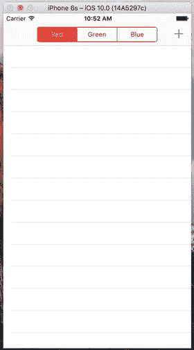

图 14-5. TinyPix 应用首次启动时的界面。点击加号图标可添加新文档。系统会提示你为新 TinyPix 文档命名。目前，明细视图只是在标签中显示文档名称

点击返回按钮回到主列表，你会看到刚添加的项目。继续再创建一两个项目，确认它们能正确添加到列表中。最后，返回 Xcode，因为我们还有更多工作要做。


### 创建 TinyPix 视图

接下来我们要创建一个视图类，用来显示网格并让用户进行编辑。在项目导航栏中选择 `TinyPix` 文件夹，按下 `⌘N` 创建新文件。在 iOS 源文件部分，选择 Cocoa Touch Class，然后点击 Next。将新类命名为 `TinyPixView`，并在 Subclass of 弹出菜单中选择 `UIView`。点击 Next，确认保存位置无误后，点击 Create。

**注意**  
本视图类的实现包含了一些尚未讲解的绘图和触摸处理内容。为了避免本章在这些主题上花费过多细节，我将快速向您展示代码。关于 Core Graphics 绘图的详细内容，我将在第 16 章中介绍。关于如何响应触摸和拖动手势，我将在第 18 章中讨论。

选择 `TinyPixView.swift`，在文件顶部、类定义之前添加以下结构体定义：

```
struct GridIndex {
var row: Int
var column: Int
}
```

每当我们需要在网格中引用某个 `(行, 列)` 组合时，都会使用这个结构体。现在，向类中添加以下属性定义，这些属性我们很快会用到：

```
var document: TinyPixDocument!
var lastSize: CGSize = CGSize.zero
var gridRect: CGRect!
var blockSize: CGSize!
var gap: CGFloat = 0
var selectedBlockIndex: GridIndex = GridIndex(row: NSNotFound, column: NSNotFound)
```

`UIView` 子类通常通过调用其默认初始化方法 `init(frame:)` 来进行初始化。然而，由于这个类将从故事板中加载，它将改为使用 `init(coder:)` 方法进行初始化。我们将同时实现这两个初始化方法，让它们都调用第三个方法来初始化我们的属性。将代码清单 14-8 中的代码添加到 `TinyPixView.swift` 中。

```
override init(frame: CGRect) {
super.init(frame: frame)
commonInit()
}
required init?(coder aDecoder: NSCoder) {
super.init(coder: aDecoder)
commonInit()
}
private func commonInit() {
calculateGridForSize(bounds.size)
}
```

**代码清单 14-8.** `TinyPixView.swift` 的初始化方法

`calculateGridForSize()` 方法根据 `TinyPixView` 的尺寸来计算颜色网格中每个单元格的大小。计算网格大小使我们能够将同一个应用程序用于不同尺寸的屏幕，并且还能处理设备旋转时视图尺寸变化的情况。将 `calculateGridForSize()` 方法的实现代码添加到 `TinyPixView.swift` 中：

```
private func calculateGridForSize(_ size: CGSize) {
let space = min(size.width, size.height)
gap = space/57
let cellSide = gap * 6
blockSize = CGSize(width: cellSide, height: cellSide)
gridRect = CGRect(x: (size.width - space)/2, y: (size.height - space)/2,
width: space, height: space)
}
```

这个方法背后的思路是让网格填满视图宽度和高度中较小的那个维度，并在较长的维度上居中显示。为此，我们通过将视图的较小维度除以 57 来计算每个单元格的大小以及单元格之间的间隙。为什么是 57？嗯，我们需要为 8 个单元格留出空间，并且希望每个单元格的大小是单元格间隙的 6 倍。考虑到每对单元格之间都需要间隙，再加上每行或每列的首尾也需要间隙，这实际上意味着我们需要 `(6 × 8) + 9 = 57` 个间隙的空间。一旦确定了间隙大小，我们就可以得到每个单元格的大小（乘以 6）。我们利用这些信息来设置 `blockSize` 属性（表示每个单元格的大小）和 `gridRect` 属性（对应于视图中实际绘制网格单元格的区域）。

现在让我们来看一下绘图例程。我们重写了标准的 `UIView` 的 `drawRect()` 方法，用它来遍历网格中的所有块，然后调用另一个方法来绘制每个单元格块。添加以下加粗代码，并记得删除 `drawRect()` 方法周围的注释标记：

```
override func draw(_ rect: CGRect) {
if document != nil {
let size = bounds.size
if !size.equalTo(lastSize) {
lastSize = size
calculateGridForSize(size)
}
for row in 0 ..< 8 {
for column in 0 ..< 8 {
drawBlockAt(row: row, column: column)
}
}
}
}
```

在绘制单元格之前，我们将视图的当前尺寸与 `lastSize` 属性中的值进行比较，如果不同，则调用 `calculateGridForSize()`。这种情况会在视图首次绘制时以及视图尺寸发生任何变化时发生，最可能的情况是设备旋转时。

现在，添加绘制网格中每个单元格块的代码：

```
private func drawBlockAt(row: Int, column: Int) {
let startX = gridRect.origin.x + gap
+ (blockSize.width + gap) * (7 - CGFloat(column)) + 1
let startY = gridRect.origin.y + gap
+ (blockSize.height + gap) * CGFloat(row) + 1
let blockFrame = CGRect(x: startX, y: startY,
width: blockSize.width, height: blockSize.height)
let color = document.stateAt(row: row, column: column)
? UIColor.black() : UIColor.white()
color.setFill()
tintColor.setStroke()
let path = UIBezierPath(rect:blockFrame)
path.fill()
path.stroke()
}
```

这段代码使用由 `calculateGridForSize()` 方法设置的网格原点、单元格大小和间隙值来确定每个单元格的位置，然后使用当前色调颜色绘制轮廓，并根据单元格是否应被填充，使用黑色或白色进行内部填充。我们将在第 16 章讨论这些绘图方法。

最后，我们添加一组方法来响应用户的触摸事件。`touchesBegan(_:withEvent:)` 和 `touchesMoved(_:withEvent:)` 都是标准方法，每个 `UIView` 子类都可以通过实现它们来捕获视图框架内发生的触摸事件。我们将在第 19 章详细讨论这些方法。我们的实现使用在这里添加的另外两个方法，它们根据触摸位置计算网格位置，并在文档中切换特定的值。同样，这些方法使用由 `calculateGridForSize()` 方法设置的值来判断触摸是否落在网格单元格内。将这四种方法添加到文件底部，紧接在闭合大括号之前，如代码清单 14-9 所示。

```
private func touchedGridIndexFromTouches(_ touches: Set) -> GridIndex {
var result = GridIndex(row: -1, column: -1)
let touch = touches.first!
var location = touch.location(in: self)
if gridRect.contains(location) {
location.x -= gridRect.origin.x
location.y -= gridRect.origin.y
result.column = Int(8 - (location.x * 8.0 / gridRect.size.width))
result.row = Int(location.y * 8.0 / gridRect.size.height)
}
return result
}
private func toggleSelectedBlock() {
if selectedBlockIndex.row != -1
&& selectedBlockIndex.column != -1 {
document.toggleStateAt(row: selectedBlockIndex.row,
column: selectedBlockIndex.column)
document.undoManager?.prepare(withInvocationTarget: document)
.toggleStateAt(row: selectedBlockIndex.row,
column: selectedBlockIndex.column)
setNeedsDisplay()
}
}
override func touchesBegan(_ touches: Set, with event: UIEvent?) {
selectedBlockIndex = touchedGridIndexFromTouches(touches)
toggleSelectedBlock()
}
override func touchesMoved(_ touches: Set, with event: UIEvent?) {
let touched = touchedGridIndexFromTouches(touches)
if touched.row != selectedBlockIndex.row
&& touched.column != selectedBlockIndex.column {
selectedBlockIndex = touched
toggleSelectedBlock()
}
}
```

**代码清单 14-9.** 需要添加到 `TinyPixView.swift` 中的触摸事件方法


敏锐的读者可能已经注意到，`toggleSelectedBlock()`方法做了一些特别的事情。在调用文档的`toggleStateAt(row:column:)`方法更改特定网格点的值之后，它还做了更多操作。让我们再看一下：

```
private func toggleSelectedBlock() {
if selectedBlockIndex.row != -1
&& selectedBlockIndex.column != -1 {
document.toggleStateAt(row: selectedBlockIndex.row,
column: selectedBlockIndex.column)
document.undoManager?.prepare(withInvocationTarget: document)
.toggleStateAt(row: selectedBlockIndex.row,
column: selectedBlockIndex.column)
setNeedsDisplay()
}
}
```

对`document.undoManager`的调用返回了一个`NSUndoManager`实例。我们在本书其他地方没有直接处理过这个问题，但`NSUndoManager`是 iOS 和 macOS 中撤销/重做功能的结构基础。其思路是，每当用户在 GUI 中执行操作时，你使用`NSUndoManager`通过“记录”一个将撤销用户刚才所做操作的方法调用来留下某种痕迹。`NSUndoManager`会将该方法调用存储在一个特殊的撤销栈上，当用户激活系统的撤销功能时，可以通过该栈回溯文档的状态。

其工作方式是，`prepare(withInvocationTarget:)`方法返回一个代理对象，你可以向该对象发送任何消息，该消息将与目标一起被打包并推送到撤销栈上。因此，虽然看起来你连续调用了两次`toggleStateAt(row:column:)`，但第二次实际上并未被调用，而只是被排队以备将来可能使用。

那么，我们为什么要这样做呢？到目前为止，我们一直没有考虑撤销/重做的问题，为什么现在要考虑？原因在于，向文档的`NSUndoManager`注册一个可撤销的操作会将文档标记为“脏”（dirty），并确保它将在接下来的几秒钟内自动保存。用户的操作也是可撤销的这一点只是锦上添花，至少在这个应用中是这样，因为我们不打算在用户界面中添加任何控件让用户使用它。然而，在具有更复杂文档结构的应用中，支持文档级别的撤销功能可能会非常有益。

保存更改。现在我们的视图类已经准备好了，我们将回到故事板来配置详细视图。

### 故事板中的详细视图

选择`Main.storyboard`，找到详细场景（位于左下角），看看现在那里有什么。所有 GUI 只包含一个标签（“Detail view content goes here”），即你之前运行应用时包含文档描述的那个。这个标签没什么用，所以在故事板或文档大纲中选择它，然后按 Delete 键将其删除。接下来，使用对象库找到一个`UIView`，并将其拖到详细视图中。调整其位置和大小，使其填充标题栏下方的整个区域，如图 14-6 所示。

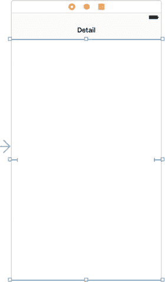

图 14-6. 将详细视图中的标签替换为另一个视图，该视图在其包含视图中居中。放置后，调整其大小以填充标题栏下方的整个区域

切换到标识检查器，以便将此`UIView`实例改为我们自定义类的实例。在检查器顶部的“Custom Class”部分，选择“Class”弹出列表，并选择`TinyPixView`。现在打开属性检查器，将“Mode”设置改为“Redraw”。这会使`TinyPixView`在其大小改变时重新绘制自身。这是必要的，因为视图内网格的位置取决于视图本身的大小，而视图大小会在设备旋转时改变。此时，详细场景的视图层次应如图 14-7 所示。

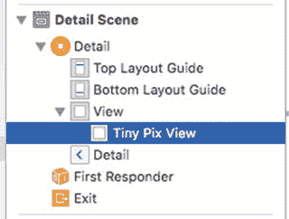

图 14-7. 详细视图场景的视图层次

在继续之前，我们需要调整新视图的自动布局约束。我们希望它填充详细视图中的可用区域。因此，在文档大纲中，按住 Control 键从`TinyPixView`拖到其父视图并释放鼠标。按住 Shift 键，在弹出的菜单中选择“Leading Space to Container Margin”、“Trailing Space to Container Margin”、“Vertical Spacing to Top Layout Guide”和“Vertical Spacing to Bottom Layout Guide”，然后点击 Return 以应用约束。

现在我们需要将自定义视图连接到我们的详细视图控制器。我们还没有为自定义视图准备一个插座（outlet），但这没关系，因为 Xcode 的拖拽生成代码功能会为我们做这件事。激活助理编辑器。文本编辑器应与 GUI 编辑器并排出现，显示`DetailViewController.swift`的内容。如果显示的是其他内容，请使用文本编辑器顶部的跳转栏，让`DetailViewController.swift`显示出来。为了建立连接，按住 Control 键从文档大纲中的`TinyPixView`图标拖到代码上，在文件顶部现有的`@IBOutlet`下方释放拖拽。在弹出的窗口中，确保“Connection”设置为“Outlet”，将新插座命名为`pixView`，然后点击“Connect”按钮。趁现在，删除`detailDescriptionLabel`插座，因为我们不会用到它。

你应该会看到，建立连接后在`DetailViewController.swift`中添加了以下行：

```
@IBOutlet weak var pixView: TinyPixView!
```

现在让我们修改`configureView()`方法。这不是标准的`UIViewController`方法。它只是项目模板中包含在此类中的一个私有方法，作为一个方便的位置，用于放置需要在任何内容更改后更新详细视图的代码。由于我们不再使用描述标签，我们删除引用它的代码。接下来，我们添加一些代码，将选定的文档传递给我们的自定义视图，并通过调用`setNeedsDisplay()`告诉它重新绘制自身：

```
func configureView() {
// Update the user interface for the detail item.
if detailItem != nil && isViewLoaded() {
pixView.document = detailItem! as! TinyPixDocument
pixView.setNeedsDisplay()
}
}
```


### TinyPixView 的配置与状态同步

请注意，在更新`TinyPixView`对象中的文档之前，需要先调用`isViewLoaded()`。这是必要的，因为`configureView()`可能在详情视图控制器加载其视图之前就被调用。在这种情况下，`pixView`属性仍然是`nil`，如果我们尝试使用它，应用将会崩溃。在这种情况下，我们可以安全地推迟文档的更新，因为当视图实际加载时，`viewDidLoad`会再次调用`configureView()`。

接下来，我们需要安排将分段控件中选中的色调颜色应用到`TinyPixView`。我们需要在视图首次加载时以及色调颜色发生变化时都执行此操作。我们知道可以从用户默认设置中获取初始色调颜色，因为我们在连接到分段控件的操作方法中，将用户选择的颜色索引保存到了那里。因此，让我们添加一个方法来获取该值，将其转换为`UIColor`并应用到`TinyPixView`。将此方法添加到类的正文中：

```swift
private func updateTintColor() {
    let prefs = UserDefaults.standard
    let selectedColorIndex = prefs.integer(forKey: "selectedColorIndex")
    let tintColor = TinyPixUtils.getTintColorForIndex(selectedColorIndex)
    pixView.tintColor = tintColor
    pixView.setNeedsDisplay()
}
```

我们需要调用此方法来在视图首次加载时设置初始色调颜色。当色调发生变化时，我们也需要调用它。我们如何知道色调发生了变化——分段控件归属于主视图控制器，所以我们与它没有任何连接？事实证明，我们不需要直接连接：我们可以判断色调颜色已更改，因为新值被存储在了用户默认设置中，并且您可以通过在默认通知中心注册一个`NSUserDefaultsDidChangeNotification`通知的观察者，来发现用户默认设置中的某些内容发生了变化。将以下代码添加到`viewDidLoad`方法的底部：

```swift
updateTintColor()
NotificationCenter.default.addObserver(self,
    selector: #selector(DetailViewController.onSettingsChanged(_:)),
    name: UserDefaults.didChangeNotification, object: nil)
```

现在，当用户默认设置中的任何内容发生变化时，`onSettingsChanged()`方法就会被调用。当这种情况发生时，我们需要设置新的色调颜色，以防它发生了变化。将此方法的实现添加到类中：

```swift
func onSettingsChanged(notification: NSNotification) {
    updateTintColor()
}
```

添加了通知观察者后，我们必须在类被释放之前移除它。我们可以通过实现类的反初始化器来完成此操作：

```swift
deinit {
    NotificationCenter.default.removeObserver(self,
        name: UserDefaults.didChangeNotification, object: nil)
}
```

这个类的工作已接近完成，但我们还需要再做一处修改。还记得我之前提到过，当通过注册一个可撤销操作来通知文档发生了某些编辑时，自动保存会执行吗？保存通常会在编辑发生后的大约 10 秒内进行。就像本章前面描述的其他保存和加载过程一样，它是在后台线程中进行的，因此用户通常不会注意到。然而，这仅在文档仍然存在时才有效。

使用我们当前的设置，存在一个风险：当用户点击“返回”按钮回到主列表时，文档实例可能会在没有任何保存操作的情况下被释放，导致用户最新的更改丢失。为确保不会发生这种情况，我们需要在`viewWillDisappear()`方法中添加一些代码，以便在用户离开详情视图时立即关闭文档。关闭文档会触发其自动保存，并且保存过程同样发生在后台线程中。在这种特定情况下，保存完成后我们不需要做任何事情，所以我们传递`nil`而不是一个代码块：

```swift
override func viewWillDisappear(_ animated: Bool) {
    super.viewWillDisappear(animated)
    if let doc = detailItem as? UIDocument {
        doc.close(completionHandler: nil)
    }
}
```

至此，我们第一个真正基于文档的应用的这个版本已经准备好进行测试了。构建并运行该应用。您可以创建新文档、编辑它们、返回到列表，然后选择另一个文档（或同一个文档），一切都将正常工作。尝试更改色调颜色，并验证在停止并重新启动应用后，颜色能被正确保存和恢复。如果您在执行此操作时打开 Xcode 控制台，您会在每次加载或保存文档时看到一些输出。使用自动保存系统，您无法直接控制保存的具体发生时间（关闭文档除外），但观察日志可以了解它们何时发生，这很有趣。

### 添加 iCloud 支持

您现在有了一个功能完善的基于文档的应用，但我们不会止步于此。将 TinyPix 修改为使用 iCloud 非常简单。考虑到幕后发生的所有事情，这只需要相当少的修改。我们需要修改加载可用文件列表的方法以及指定加载新文件 URL 的方法，但仅此而已。

除了代码更改，我们还需要处理一些额外的管理细节。Apple 只允许应用在其包含的嵌入式配置文件配置为允许使用 iCloud 时，才能保存到 iCloud。这意味着要为我们的应用添加 iCloud 支持，您必须拥有付费的 iOS 开发者会员资格并已安装您的开发者证书。它也只能在实际设备上运行，不能在模拟器上运行，因此您至少需要一台注册了 iCloud 的 iOS 设备来运行新的支持 iCloud 的 TinyPix。如果您有两台设备，将会更有趣，因为您可以看到在一台设备上所做的更改如何传播到另一台设备。首先，使用 Finder 复制一份 TinyPix 项目，以便我们进行这些修改而不会影响我们正在运行的应用。在 Xcode 中打开您刚刚复制的项目副本，然后开始为它启用 iCloud 功能。


### 创建配置文件（Provisioning Profile）

首先，你需要为 `TinyPix` 创建一个启用了 iCloud 的配置文件。这在过去需要在苹果开发者网站上完成一系列复杂的步骤，但现在 Xcode 让这一切变得简单。在项目导航器中，选中顶部的 `TinyPix` 条目，然后在编辑区域点击“Capabilities”标签。你应该会看到类似图 14-8 所示的内容。

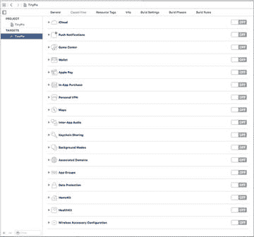

图 14-8. Xcode 中可轻松配置的应用技术和服务的界面

如果你没有使用付费开发者账户，你会看到一个不包含 iCloud 的较短的功能列表。如果是这种情况，请前往苹果网站注册一个开发者账户，然后重试。如果你的开发者账户名称与你目前在设备上运行应用时所用的免费账户名称不同，你需要在 Xcode 中添加它。为此，请点击菜单栏中的 `Xcode ➤ Preferences…` 打开偏好设置对话框，然后选择“Accounts”标签，它应该类似于图 14-9 所示。

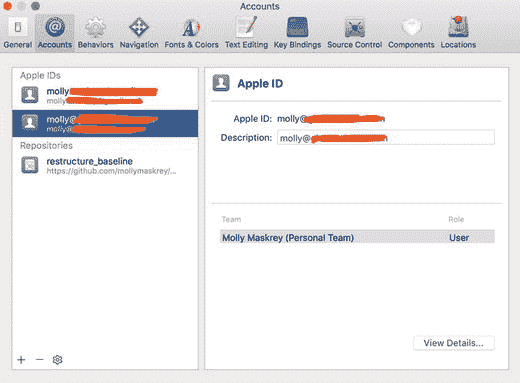

图 14-9. “Accounts”标签显示了你的可用开发者账户

点击左下角的 `+` 图标，从弹出的菜单中选择 `Add Apple ID…`。然后，输入你的付费开发者账户的名称和密码，该账户将被添加到“Accounts”标签的可用账户列表中。现在关闭偏好设置对话框，回到 Xcode 编辑器的“General”标签。在“Identity”部分，你会看到一个“Team”选择器，如图 14-10 所示。

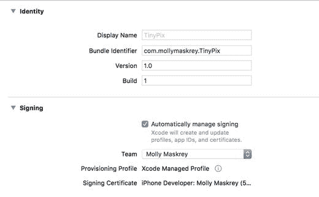

图 14-10. 使用“Team”选择器在 Xcode 项目中启用你的付费开发者账户

选择你的付费开发者账户，然后切回“Capabilities”标签。如果一切顺利，你现在应该能看到图 14-8 所示的完整功能列表了。

图 14-7 所示的功能可以直接在 Xcode 中配置，完全无需访问网站、创建并下载配置文件等操作。在此之前，你需要为你的应用设置一个唯一的 App ID。例如，若要更改 App ID 为 `co.myCo`，你可以像图 14-11 所示那样设置 Bundle Identifier。

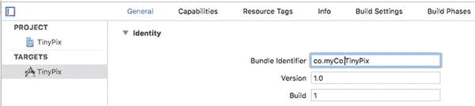

图 14-11. 更改应用的 Bundle ID

当然，你应该使用一个对你来说唯一的标识，而不是 `co.myCo`。现在切回“Capabilities”标签。对于 `TinyPix`，我们想要启用列表中的第一个功能 iCloud，因此点击云图标旁边的展开三角形。在这里你会看到一些关于该功能用途的信息。点击右侧的开关将其打开。Xcode 随后会与苹果服务器通信，为该应用配置配置文件。如果你之前选择的 Bundle ID 已被占用，你会在 iCloud 部分底部看到一个红色图标和错误信息。切回“General”标签，选择一个不同的 Bundle ID，然后重试。接下来，勾选 **Key-value storage** 和 **iCloud Documents** 复选框，如图 14-12 所示。

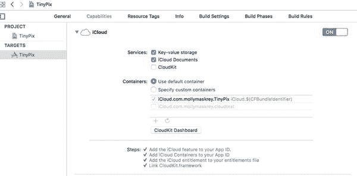

图 14-12. 应用现在已配置为使用 iCloud

我们的应用现在拥有了从代码中访问 iCloud 所需的权限。剩下的就是简单的编程工作了。

### 如何进行查询

选中 `MasterViewController.swift`，这样我们就可以开始为 iCloud 进行更改。最大的变化将是我们查找可用文档的方式。在 `TinyPix` 的第一个版本中，我们使用了 `FileManager` 来查看本地文件系统上有什么内容。这一次，我们的做法会略有不同。我们将启动一种特殊类型的查询来查找文档。

首先，在该类中添加一个属性，用于保存指向当前进行中的查询的指针：

```swift
@IBOutlet var colorControl: UISegmentedControl!
private var documentFileURLs: [URL] = []
private var chosenDocument: TinyPixDocument?
private var query: NSMetadataQuery!
```

现在，让我们看看新的文件列出方法。移除整个 `reloadFiles()` 方法，并将其替换为清单 14-10 中的代码。

```swift
private func reloadFiles() {
    let fileManager = FileManager.default
    // 传入 nil 是可以的，与第一个授权匹配
    let cloudURL = fileManager.urlForUbiquityContainerIdentifier(nil)
    print("Got cloudURL \(cloudURL)")
    if (cloudURL != nil) {
        query = NSMetadataQuery()
        query.predicate = Predicate(format: "%K like '*.tinypix'",
            NSMetadataItemFSNameKey)
        query.searchScopes = [NSMetadataQueryUbiquitousDocumentsScope]
        NotificationCenter.default.addObserver(self,
            selector: #selector(MasterViewController.updateUbiquitousDocuments(_:)),
            name: NSNotification.Name.NSMetadataQueryDidFinishGathering,
            object: nil)
        NotificationCenter.default.addObserver(self,
            selector: #selector(MasterViewController.updateUbiquitousDocuments(_:)),
            name: NSNotification.Name.NSMetadataQueryDidUpdate,
            object: nil)
        query.start()
    }
}
```

清单 14-10. iCloud 的 `reloadFiles` 方法

这里有一些新的内容值得提一下。首先看这一行：

```swift
let cloudURL = fileManager.urlForUbiquityContainerIdentifier(nil)
```

无处不在（Ubiquity）？我们在这里谈论什么？当涉及 iCloud 时，苹果在标识 iCloud 存储中的资源时，大量使用了诸如“ubiquity”和“ubiquitous”之类的词，以表示某事物是无所不在的——可以使用相同的 iCloud 登录凭证从任何设备访问。

在这种情况下，我们要求文件管理器提供一个基础 URL，以便我们能够访问与特定容器标识符相关联的 iCloud 目录。一个容器标识符通常是一个包含你公司唯一 Bundle Seed ID 和应用标识符的字符串。该容器标识符用于选择你的应用所包含的某个 iCloud 授权。这里传入 `nil` 是一种快捷方式，表示“给我列表中的第一个”。由于我们的应用只勾选了该列表中的一个项目（你可以在图 14-12 底部的“Containers”下方看到它），因此这个快捷方式完全符合我们的需求。

之后，我们创建并配置了一个 `NSMetadataQuery` 实例：

```swift
query = NSMetadataQuery()
query.predicate = Predicate(format: "%K like '*.tinypix'",
    NSMetadataItemFSNameKey)
query.searchScopes = [NSMetadataQueryUbiquitousDocumentsScope]
```

`NSMetaDataQuery` 类最初是为在 OS X (macOS) 上配合 Spotlight 搜索功能而编写的，但现在它额外承担了让 iOS 应用搜索 iCloud 目录的任务。我们为查询设置了一个谓词，将其搜索结果限制为仅包含文件名符合特定格式的文件。我们还为其设置了一个搜索范围，将其限定为仅在应用 iCloud 存储的 Documents 文件夹内进行查找。接下来，我们设置了一些通知，以便在查询完成时得到通知，然后启动查询。


`NotificationCenter.default.addObserver(self, selector: #selector(MasterViewController.updateUbiquitousDocuments(_:)), name: NSNotification.Name.NSMetadataQueryDidFinishGathering, object: nil)`
`NotificationCenter.default.addObserver(self, selector: #selector(MasterViewController.updateUbiquitousDocuments(_:)), name: NSNotification.Name.NSMetadataQueryDidUpdate, object: nil)`
`query.start()`

现在，我们需要实现查询完成时那些通知所调用的方法。在 `reloadFiles()` 方法下方添加此方法，如代码清单 14-11 所示。

```
func updateUbiquitousDocuments(_ notification: Notification) {
    documentFileURLs = []
    print("updateUbiquitousDocuments, results = \(query.results)")
    let results = query.results.sorted() { obj1, obj2 in
        let item1 = obj1 as! NSMetadataItem
        let item2 = obj2 as! NSMetadataItem
        let item1Date = item1.value(forAttribute: NSMetadataItemFSCreationDateKey) as! Date
        let item2Date = item2.value(forAttribute: NSMetadataItemFSCreationDateKey) as! Date
        let result = item1Date.compare(item2Date)
        return result == ComparisonResult.orderedAscending
    }
    for item in results as! [NSMetadataItem] {
        let url = item.value(forAttribute: NSMetadataItemURLKey) as! URL
        documentFileURLs.append(url)
    }
    tableView.reloadData()
}
```

查询结果包含一个 `NSMetadataItem` 对象列表，我们可以从中获取文件 URL 和创建日期等信息。我们利用这些信息按日期对项目进行排序，然后获取所有 URL 并保存到现有的 `documentFileURLs` 属性中，供后续使用。

### 保存位置

下一个改动是针对 `urlForFilename:` 方法，该方法再次被完全重写。这里，我们使用一个 ubiquitous URL 来为给定的文件名创建完整的路径 URL。我们还在生成的路径中插入了 `"Documents"`，以确保使用应用在 iCloud 中的 Documents 目录。删除旧方法，用这个新方法替换：

```
private func urlForFileName(_ fileName: String) -> URL {
    // 确保在路径中插入 "Documents"
    let fm = FileManager.default
    let baseURL = fm.urlForUbiquityContainerIdentifier(nil)
    let pathURL = try! baseURL?.appendingPathComponent("Documents")
    let destinationURL = try! pathURL?.appendingPathComponent(fileName)
    return destinationURL!
}
```

现在，在真实的 iOS 设备上构建并运行你的应用（不要用模拟器）。如果你在该设备上运行过之前版本的应用，你会发现之前创建的所有 TinyPix 杰作都消失了。这个新版本会忽略应用的本地 Documents 目录，完全依赖 iCloud。不过，你应该能够创建新文档，并且在退出并重新启动应用后，这些文档依然存在。此外，你甚至可以从设备上完全删除 TinyPix 应用，然后通过 Xcode 再次运行它，会发现所有 iCloud 保存的文档立即可用。如果你还有其他配置了相同 iCloud 账户的 iOS 设备，用 Xcode 在该设备上运行此应用，你会发现同样的文档也会出现在那里！这非常棒。你还可以在 iOS 设备“设置”应用的 iCloud 部分（查看“存储”➤“管理存储”➤“TinyPix”），以及（如果你运行的是 OS X 10.8 或更高版本）Mac 系统偏好设置应用的 iCloud 部分找到这些文档。

## 总结

现在，我们已经初步构建并运行了一个基于文档的、支持 iCloud 的应用的基本框架，但还有一些你可能需要考虑的问题。本书不打算深入探讨这些主题，但如果你认真想要开发一个优秀的 iCloud 应用，就需要思考以下几个方面：

-   存储在 iCloud 中的文档容易产生冲突。如果你同时在多台设备上编辑同一个 TinyPix 文件会发生什么？幸运的是，苹果已经考虑到了这一点，并在你的应用中提供了一些处理这些冲突的方法。你需要决定是想忽略冲突、尝试自动修复，还是让用户帮忙解决。有关完整细节，请在 Xcode 文档查看器中搜索标题为“解决文档版本冲突”的文档。
-   苹果建议你将应用设计为完全离线模式，以防用户因某些原因未使用 iCloud。它还建议你提供一种方式，让用户能够在 iCloud 存储和本地存储之间移动文件。遗憾的是，苹果并未提供或建议任何标准 GUI 来帮助用户管理这一点，而当前提供此功能的应用（例如苹果的 iWork 应用）似乎也没有以特别用户友好的方式处理它。有关更多信息，请参阅 Xcode 文档中苹果的“管理文档的生命周期”。
-   苹果支持使用 iCloud 存储 Core Data，甚至提供了一个名为 `UIManagedDocument` 的类，你可以对其进行子类化以实现这一功能。有关更多信息，请参阅 `UIManagedDocument` 类参考。这种架构比普通的 iCloud 文档存储复杂得多，问题也更多。苹果在最近的 iOS 版本中已经采取措施进行了改进，但它仍然不是完美无瑕的，所以在使用前请三思而后行。

