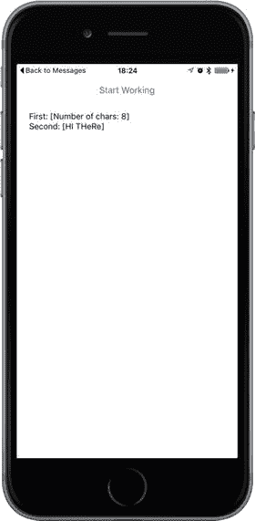
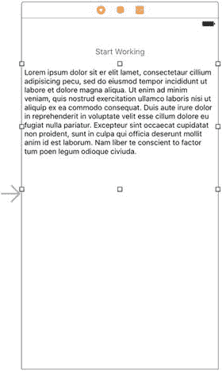
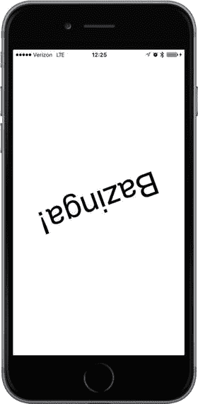
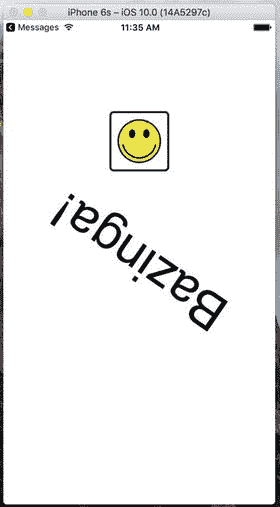

# 15. 使用 Grand Central Dispatch 进行多线程编程

虽然在任何环境中对多线程函数进行编程的想法最初可能看起来令人生畏（见图 15-1），但苹果提出了一种新方法，使多线程编程变得容易得多。Grand Central Dispatch 包含语言特性、运行时库和系统增强功能，在 iOS 和 macOS 的多核硬件上为并发代码执行提供了系统性、全面的改进。


当今开发者面临的一个巨大挑战是，编写能够响应用户输入执行复杂操作，同时保持响应迅速的软件，这样用户就不会因为处理器在后台执行某些任务而一直等待。这个挑战一直伴随着我们；尽管计算技术的进步带来了更快的 CPU，但问题依然存在。看看最近的电脑屏幕；很可能你上一次坐下来在电脑前工作时，某个时候你的工作流程会被某种旋转的鼠标光标打断。

这之所以成为大问题的原因之一，在于软件的典型编写方式：作为一系列要按顺序执行的事件。此类软件可以随着 CPU 速度的提升而扩展，但仅限于一定程度。一旦程序因为等待外部资源（如文件或网络连接）而卡住，整个事件序列就会有效暂停。所有现代操作系统现在都允许在程序中使用多个执行线程，这样即使单个线程因等待特定事件而卡住，其他线程也能继续运行。即便如此，许多开发者仍将多线程编程视为神秘之事而避之不及。

> **注意**：线程是由操作系统独立管理的一系列指令。

苹果提供了 Grand Central Dispatch (GCD)，为开发者提供了一种全新的 API，用于将应用需要完成的工作拆分成更小的块，这些块可以分布在多个线程上，并且在合适的硬件上，可以分布在多个 CPU 上。

我们使用 Swift 闭包来访问这个 API，提供了一种便捷的方式来构建不同对象之间的交互，同时将相关代码在我们的方法中保持得更紧密。


## 创建 SlowWorker 应用

作为演示 GCD 工作原理的平台，我们将创建一个 `SlowWorker` 应用，其界面由一个按钮和一个文本视图驱动。点击按钮后，立即启动一个同步任务，应用会卡住约十秒钟。任务完成后，文本视图中会显示一些文字，如图 15-2 所示。



图 15-2. `SlowWorker` 应用将其界面隐藏在一个按钮之后。点击按钮，界面会卡住约十秒钟，此时应用正在执行其工作任务

首先，与之前多次操作一样，使用"单视图应用"模板在 Xcode 中创建一个新应用。将其命名为 `SlowWorker`，设置 Devices 为 Universal，点击 Next 保存项目，以此类推。接着，对 `ViewController.swift` 文件进行修改，如代码清单 15-1 所示。

```
@IBOutlet var startButton: UIButton!
@IBOutlet var resultsTextView: UITextView!
func fetchSomethingFromServer() -> String {
    Thread.sleep(forTimeInterval: 1)
    return "Hi there"
}
func processData(_ data: String) -> String {
    Thread.sleep(forTimeInterval: 2)
    return data.uppercased()
}
func calculateFirstResult(_ data: String) -> String {
    Thread.sleep(forTimeInterval: 3)
    return "Number of chars: \(data.characters.count)"
}
func calculateSecondResult(_ data: String) -> String {
    Thread.sleep(forTimeInterval: 4)
    return data.replacingOccurrences(of: "E", with: "e")
}
@IBAction func doWork(_ sender: AnyObject) {
    let startTime = NSDate()
    self.resultsTextView.text = ""
    let fetchedData = self.fetchSomethingFromServer()
    let processedData = self.processData(fetchedData)
    let firstResult = self.calculateFirstResult(processedData)
    let secondResult = self.calculateSecondResult(processedData)
    let resultsSummary =
        "First: [\(firstResult)]\nSecond: [\(secondResult)]"
    self.resultsTextView.text = resultsSummary
    let endTime = NSDate()
    print("Completed in \(endTime.timeIntervalSince(startTime as Date)) seconds")
}
代码清单 15-1. 将这些方法添加到 ViewController.swift 文件中
```

如你所见，该类的工作被拆分为多个小部分。这段代码模拟了一些耗时操作，但实际上这些方法本身并不执行任何繁重任务。为了增加趣味性，每个方法都调用了 `Thread` 中的 `sleep(forTimeInterval:)` 类方法，这会使程序（具体来说，是调用该方法的线程）在指定秒数内暂停并闲置。`doWork()` 方法在开头和结尾还包含了计算所有工作完成所需时间的代码。

现在打开 `Main.storyboard`，将按钮和文本视图拖入空白的视图窗口中。按图 15-3 所示放置控件。你会看到一些默认文本。清除文本视图中的内容，并将按钮标题改为"Start Working"。要设置自动布局约束，首先选中"Start Working"按钮，然后点击编辑器区域右下角的"Align"按钮。在弹出的窗口中，勾选"Horizontally in Container"，并点击"Add 1 Constraint"。接着，按住 Control 键从按钮拖拽到视图窗口顶部，松开鼠标并选择"Vertical Spacing to Top Layout Guide"。为了完成此按钮的约束设置，再次按住 Control 键从按钮向下拖拽到文本视图，松开鼠标并选择"Vertical Spacing"。要固定文本视图的位置和大小，展开文档大纲中的"View Controller Scene"，然后按住 Control 键从故事板中的文本视图拖拽到文档大纲中的"View"图标。松开鼠标，当弹出窗口出现时，按住 Shift 键并选择"Leading Space to Container Margin"、"Trailing Space to Container Margin"和"Vertical Spacing to Bottom Layout Guide"，然后按回车应用约束。这样就完成了该应用的自动布局约束设置。



图 15-3. `SlowWorker` 界面由一个按钮和一个文本视图组成

按住 Control 键从文档大纲中的"View Controller"图标拖拽，将视图控制器的两个输出口（即 `startButton` 和 `resultsTextView` 实例变量）分别连接到按钮和文本视图。

接下来，按住 Control 键从按钮拖拽到"View Controller"，松开鼠标，在弹出的菜单中选择 `doWork()` 方法，以便按下按钮时调用该方法。最后，选中文本视图，使用属性检查器取消勾选"Editable"复选框（位于右上角），并删除文本视图中的默认文本。

保存工作，然后选择"Run"。应用启动后，按下按钮将使其工作约十秒钟（所有休眠时间之和），然后显示结果。在等待期间，你会看到"Start Working"按钮明显变暗，直到"工作"完成后才恢复为正常颜色。此外，在工作完成之前，应用的视图无法响应。点击屏幕上的任何位置或旋转设备均无效果。事实上，在此期间与应用的唯一交互方式就是点击 Home 按钮切换到其他应用。这正是我们想要避免的状态。


### 线程基础

在开始实现解决方案之前，我们先回顾一些并发基础。这远非 iOS 线程或通用线程的完整描述，我只想解释足够让你理解本章内容的知识点。大多数现代操作系统（当然包括 iOS）都支持执行线程的概念。每个进程可以包含多个并发运行的线程。如果只有一个处理器核心，操作系统会在所有执行线程之间切换，就像它在所有执行进程之间切换一样。如果有多个核心可用，线程就会像进程一样分布在这些核心上。

一个进程中的所有线程共享相同的可执行程序代码和相同的全局数据。每个线程还可以拥有一些专属数据。线程可以利用一种称为 `mutex`（互斥锁的简称）或锁的特殊结构，它可以确保特定的代码块不会被多个线程同时运行。当多个线程同时访问同一数据时，通过在一个线程更新值（即代码的临界区）时锁定其他线程，这对于确保正确的结果非常有用。

处理线程时的一个常见问题是代码的线程安全性。有些软件库在设计时就考虑了线程并发，并且它们的所有临界区都使用 `mutex` 得到了妥善保护。有些代码库则不是线程安全的。例如，在 Cocoa Touch 中，Foundation 框架通常被认为是线程安全的。然而，UIKit 框架（包含用于构建 GUI 应用程序的特定类，如 `UIApplication`、`UIView` 及其所有子类等）在很大程度上是**不**线程安全的。（不过，某些 UIKit 功能（如绘图）被认为是线程安全的。）这意味着在运行的 iOS 应用程序中，所有涉及 `UIKit` 对象的方法调用都应在同一个线程（即通常所说的主线程）中执行。如果你从另一个线程访问 `UIKit` 对象，后果自负。你很可能会遇到看似无法解释的 bug（或者更糟，你本人都没遇到任何问题，但在你发布应用后，一些用户却会因此受到困扰）。

**提示**

关于线程安全的文章已经很多了。非常值得你花时间去深入研究并尽量消化。一个很好的起点就是 Apple 自己的文档。花几分钟阅读这个页面（它一定会有所帮助）：

[`https://developer.apple.com/library/ios/documentation/Cocoa/Conceptual/Multithreading/ThreadSafetySummary/ThreadSafetySummary.html`](https://developer.apple.com/library/ios/documentation/Cocoa/Conceptual/Multithreading/ThreadSafetySummary/ThreadSafetySummary.html)

### 工作单元

前面描述的线程模型的问题在于，对于普通程序员来说，编写无错误的多线程代码几乎是不可能的。这并非是对我们行业或普通程序员能力的批评；这只是一个观察结果。在跨多个线程同步数据和操作时，你的代码必须考虑到的复杂交互，对大多数人来说确实过于沉重。想象一下，只有 5% 的人具备编写软件的能力。而在这 5% 的人中，只有一小部分真正能够胜任编写高强度的多线程应用程序。即使是那些成功做到这一点的人，也常常会建议他人不要效仿他们的做法。

幸运的是，还有其他选择。我们可以在不进行过多底层细节工作的情况下实现一些并发。就像我们能够将数据显示在屏幕上而无需直接操作显存，或者从磁盘读取数据而无需直接与磁盘控制器交互一样，我们也可以利用软件抽象，让我们的代码在多个线程上运行，而无需我们直接对线程做太多操作。

Apple 鼓励我们使用的解决方案围绕这样一个理念：将长时间运行的任务拆分成工作单元，并将这些单元放入队列中等待执行。系统为我们管理队列，在多个线程上执行工作单元。我们不需要直接启动或管理后台线程，并且从通常涉及实现多线程应用程序的大量簿记工作中解放出来；系统为我们处理这些工作。

### GCD：底层队列

这种将工作单元放入可在后台执行的队列，并由系统为你管理线程的思路，功能强大，并且极大地简化了许多需要并发的开发场景。GCD 几年前首次出现在 OS X（现为 macOS）上，提供了实现这一点的基础架构。几年后，这项技术也引入了 iOS 平台。GCD 将一些伟大的概念——工作单元、无痛后台处理和自动线程管理——融入到 C 语言接口中，不仅可以在 Objective-C 中使用，还可以在 C、C++ 以及当然包括 Swift 中使用。更棒的是，Apple 已经将其 GCD 的实现开源，因此它也可以移植到其他类 Unix 操作系统上。

GCD 的一个关键概念是队列。系统提供了许多预定义的队列，包括一个保证始终在主线程上执行工作的队列。这对于非线程安全的 UIKit 来说非常完美。你也可以创建自己的队列——数量不限。GCD 队列严格遵循先进先出（FIFO）原则。添加到 GCD 队列的工作单元将始终按照它们放入队列的顺序开始执行。也就是说，它们可能不会以相同的顺序结束，因为 GCD 队列在可能的情况下会自动将其工作分布到多个线程上。

GCD 访问一个在应用程序生命周期内重复使用的线程池。它会尝试维护与机器架构相适应的线程数量。当有工作要做时，它会通过利用更多的处理器核心自动利用更强大的机器。直到几年前，iOS 设备都是单核的，所以这还不是什么大问题。但现在，随着过去几年发布的所有 iOS 设备都配备了多核处理器，GCD 变得真正实用了。

GCD 使用闭包来封装要添加到队列的代码。在 Swift 中，闭包是语言中的一等公民——你可以将闭包赋值给变量、将其作为参数传递给方法，或者将其作为方法调用的结果返回。闭包相当于 Objective-C 的 blocks 和其他编程语言（如 Python）中有时称为 lambda 的类似特性。与方法或函数非常相似，闭包可以接受一个或多个参数并指定返回值，尽管与 GCD 一起使用的闭包既不能接受参数，也不能返回值。要声明一个闭包变量，你只需将一些包裹在大括号中的代码赋值给它，并可选地带参数：

```
// 声明一个无参数、无返回值的闭包变量 "loggerClosure"
let loggerClosure = {
print("I'm just glad they didn't call it a lambda")
}
```

你可以像调用函数一样执行这个闭包：

```
// 执行闭包，在控制台中产生一些输出。
loggerClosure()
```


### 改进 SlowWorker

为了理解如何将闭包与 GCD 结合使用，让我们重新审视 SlowWorker 的 `doWork()` 方法。它当前看起来是这样的：

```
@IBAction func doWork(_ sender: AnyObject) {
let startTime = NSDate()
self.resultsTextView.text = ""
let fetchedData = self.fetchSomethingFromServer()
let processedData = self.processData(fetchedData)
let firstResult = self.calculateFirstResult(processedData)
let secondResult = self.calculateSecondResult(processedData)
let resultsSummary =
"First: [\(firstResult)]\nSecond: [\(secondResult)]"
self.resultsTextView.text = resultsSummary
let endTime = NSDate()
print("Completed in \(endTime.timeIntervalSince(startTime as Date)) seconds")
}
```

我们可以通过将所有代码封装到一个闭包中，并将其传递给一个名为 `DispatchQueue` 的 GCD 函数，让这个方法完全在后台运行。这个函数接受两个参数：一个 GCD 队列和要分配给该队列的闭包。请按照清单 15-2 中的更改，修改你本地的 `doWork()` 副本。

```
@IBAction func doWork(sender: AnyObject) {
let startTime = NSDate()
resultsTextView.text = ""
let queue = DispatchQueue.global(qos: .default)
queue.async {
let fetchedData = self.fetchSomethingFromServer()
let processedData = self.processData(fetchedData)
let firstResult = self.calculateFirstResult(processedData)
let secondResult = self.calculateSecondResult(processedData)
let resultsSummary =
"First: [\(firstResult)]\nSecond: [\(secondResult)]"
self.resultsTextView.text = resultsSummary
let endTime = NSDate()
print("Completed in \(endTime.timeIntervalSince(startTime as Date)) seconds")
}
}
清单 15-2.
使用 GCD 对 doWork 方法进行的修改
```

第一处更改的代码行通过使用 `DispatchQueue.global()` 函数，获取了一个始终可用的预存全局队列。该函数接受一个参数，让你指定优先级。如果你在参数中指定了不同的优先级，实际上会得到一个不同的全局队列，系统会以不同的方式对其进行优先级排序。目前，我们将坚持使用默认的全局队列。

然后，该队列连同闭包一起被传递给 `queue.async()` 函数。GCD 接收闭包并将其放入队列中，系统会安排它在后台线程上运行，并且与在主线程上运行时一样，一次执行一步。

请注意，我们在创建闭包之前定义了一个名为 `startTime` 的变量，然后在闭包末尾使用它的值。直觉上，这似乎说不通，因为当闭包被执行时，`doWork()` 方法已经返回，因此 `startTime` 变量所指向的 `NSDate` 实例应该已经被释放了！这是理解闭包的一个关键点：如果闭包在执行过程中访问了“外部”的任何变量，那么在闭包创建时就会进行一些特殊设置，使其能够继续访问这些变量。这一切都由 Swift 编译器和运行时自动完成——你无需做任何特殊操作就能实现这一点。

#### 别忘了那个主线程

回到我们手头的项目，这里有一个问题：UIKit 的线程安全性。请记住，从后台线程向任何 GUI 对象（包括我们的 `resultsTextView`）发送消息是不允许的。实际上，如果你现在运行这个示例，大约十秒后，当闭包尝试更新文本视图时，你会在 Xcode 控制台中看到一个异常。幸运的是，GCD 也提供了一种处理方式。在闭包内部，我们可以调用另一个分派函数，将任务传回主线程。按照清单 15-3 所示，对你的 `doWork()` 版本再做一处修改。

```
@IBAction func doWork(sender: AnyObject) {
let startTime = NSDate()
resultsTextView.text = ""
let queue = DispatchQueue.global(attributes: DispatchQueue.GlobalAttributes.qosDefault)
queue.async {
let fetchedData = self.fetchSomethingFromServer()
let processedData = self.processData(fetchedData)
let firstResult = self.calculateFirstResult(processedData)
let secondResult = self.calculateSecondResult(processedData)
let resultsSummary =
"First: [\(firstResult)]\nSecond: [\(secondResult)]"
DispatchQueue.main.async {
self.resultsTextView.text = resultsSummary
}
let endTime = NSDate()
print("Completed in \(endTime.timeIntervalSince(startTime as Date)) seconds")
}
}
清单 15-3.
修改后的 doWork 方法
```


## 提供一些反馈

如果你现在构建并运行应用，会发现它在某种程度上运行得更流畅了。按钮不再会在触摸后卡在突出显示状态，这或许能避免你反复点击。查看 Xcode 控制台日志，你会看到每次点击的结果，但只有最后一次点击的结果会显示在文本视图中。我们真正想做的，是增强图形用户界面，使用户按下按钮后，界面能立即更新以指示操作正在进行中。我们还希望在工作进行时禁用按钮，防止用户持续点击，从而在主线程之外产生越来越多的后台任务。为此，我们将在显示界面中添加一个 `UIActivityIndicatorView`。这个类提供了许多应用和网站中常见的旋转指示器。首先，在 `ViewController.swift` 文件顶部为其添加一个输出口：

```
@IBOutlet var spinner : UIActivityIndicatorView!
```

接下来，打开 `Main.Storyboard`，在资源库中找到活动指示器视图，将其拖拽到按钮旁边的视图界面中。你需要添加布局约束来固定活动指示器相对于按钮的位置。一种方法是按住 Control 键从按钮拖拽到活动指示器，然后从弹出菜单中选择水平间距，以固定两者之间的水平距离；接着再次按住 Control 键拖拽并选择垂直居中，确保它们的中心垂直对齐。

选中活动指示器后，使用属性检查器勾选“停止时隐藏”复选框，这样旋转指示器只会在我们让它开始旋转时出现（没人希望界面上展示一个停转的指示器）。然后，按住 Control 键从视图控制器图标拖拽到旋转指示器，连接输出口。保存修改。

现在打开 `ViewController.swift`。我们首先要修改 `doWork()` 方法，添加几行代码来管理用户点击按钮时以及工作完成时按钮和旋转指示器的显示状态。首先将按钮的 `enabled` 属性设为 `false`，这能阻止它响应任何点击，同时通过将按钮文本变灰并半透明来显示其禁用状态。接着，调用旋转指示器的 `startAnimating()` 方法让它开始旋转。在闭包末尾，我们重新启用按钮并停止旋转指示器，使其再次消失，如代码清单 15-4 所示。

```
@IBAction func doWork(sender: AnyObject) {
    let startTime = NSDate()
    resultsTextView.text = ""
    startButton.isEnabled = false
    spinner.startAnimating()
    let queue = DispatchQueue.global(qos: .default)
    queue.async {
        let fetchedData = self.fetchSomethingFromServer()
        let processedData = self.processData(fetchedData)
        let firstResult = self.calculateFirstResult(processedData)
        let secondResult = self.calculateSecondResult(processedData)
        let resultsSummary =
            "First: [\(firstResult)]\nSecond: [\(secondResult)]"
        DispatchQueue.main.async {
            self.resultsTextView.text = resultsSummary
            self.startButton.isEnabled = true
            self.spinner.stopAnimating()
        }
        let endTime = NSDate()
        print("Completed in \(endTime.timeIntervalSince(startTime as Date)) seconds")
    }
}
```
**代码清单 15-4.** 为 `doWork` 方法添加旋转指示器功能

构建并运行应用，点击按钮。尽管处理工作需要几秒钟，但用户不会感到无所适从。按钮已禁用，外观也符合禁用的状态。同时，动画旋转指示器让用户知道应用并没有真正卡住，并且预计会在某个时刻恢复正常。

## 并发闭包

眼尖的人可能会注意到，经过这些调整后，我们实际上并没有改变算法基本顺序执行的布局（如果能把这一系列简单步骤称为算法的话）。我们所做的只是将方法中的一部分代码移到后台线程，然后在主线程中完成收尾工作。Xcode 控制台的输出证明了这一点：这项工作仍然需要十秒才能完成，与开始时完全相同。问题在于 `calculateFirstResult()` 和 `calculateSecondResult()` 方法彼此并不依赖，因此不需要按顺序调用。并发执行它们可以显著提升速度。

幸运的是，GCD 提供了一种通过所谓的调度组来实现这一目标的方法。所有在组上下文内通过 `dispatch_group_async()` 函数异步调度的闭包，都会以最快速度被释放执行，如果可能的话，还会被分配到多个线程并发执行。我们还可以使用 `dispatch_group_notify()` 指定一个额外的闭包，该闭包会在组内所有闭包执行完毕后运行。

对 `doWork` 方法进行最终修改，如代码清单 15-5 所示。

```
@IBAction func doWork(_ sender: AnyObject) {
    let startTime = Date()
    self.resultsTextView.text = ""
    startButton.isEnabled = false
    spinner.startAnimating()
    let queue = DispatchQueue.global(qos: .default)
    queue.async {
        let fetchedData = self.fetchSomethingFromServer()
        let processedData = self.processData(fetchedData)
        var firstResult: String!
        var secondResult: String!
        let group = DispatchGroup()
        queue.async(group: group) {
            firstResult = self.calculateFirstResult(processedData)
        }
        queue.async(group: group) {
            secondResult = self.calculateSecondResult(processedData)
        }
        group.notify(queue: queue) {
            let resultsSummary = "First: [\(firstResult!)]\nSecond: [\(secondResult!)]"
            DispatchQueue.main.async {
                self.resultsTextView.text = resultsSummary
                self.startButton.isEnabled = true
                self.spinner.stopAnimating()
            }
            let endTime = Date()
            print("Completed in \(endTime.timeIntervalSince(startTime)) seconds")
        }
    }
}
```
**代码清单 15-5.** `doWork` 方法的最终版本

这里的一个复杂之处在于，每个 `calculate` 方法都会返回一个我们需要获取的值，所以必须确保变量 `firstResult` 和 `secondResult` 能够从闭包中被赋值。为此，我们使用 `var` 而不是 `let` 来声明它们。然而，Swift 要求闭包中引用的变量必须被初始化，因此以下声明是无效的：

```
var firstResult: String
var secondResult: String
```

当然，你可以通过为两个变量都赋予任意值来解决这个问题，但更方便的做法是在声明中添加 `!`，将它们声明为隐式解包可选值：

```
var firstResult: String!
var secondResult: String!
```

现在，Swift 不再要求初始化，但我们需要确保两个变量在被最终读取时都有值。在这个例子中，我们可以确定这一点，因为变量在异步组的完成闭包中被读取，而到那时它们肯定已经被赋值了。完成这些修改后，再次构建并运行应用。你会发现努力没有白费。得益于同时运行两个计算操作，原本需要十秒的操作现在只需七秒。


显然，我们这个精心设计的示例效果最佳，因为这两个“计算”实际上除了让它们所在的线程休眠外，什么也不做。在真实的应用程序中，加速效果取决于正在执行的工作类型以及可用的资源。CPU 密集型计算的性能仅在有多个 CPU 核心可用时才会受益于这种技术。随着未来 iOS 设备增加更多核心，这种性能提升几乎会自动实现。其他用途，例如同时从多个网络连接获取数据，即使只有一个 CPU 也能看到速度提升。

如你所见，GCD 并非万能药。使用 GCD 并不会自动加速每个应用程序。但是，通过在应用程序中对速度至关重要的地方，或者在你发现应用程序对用户操作的响应存在延迟的地方，谨慎应用这些技术，你可以轻松地提供更好的用户体验，即使是在你无法改善实际性能的情况下。

## 后台处理

处理并发的另一项重要技术是后台处理。这允许你的应用程序在后台运行——在某些情况下，甚至在用户按下 Home 键之后也能运行。

此功能不应与现代桌面操作系统的真正多任务处理混淆。在那些系统中，你启动的所有程序都会保留在系统 RAM 中，直到你明确退出它们（或直到操作系统需要释放一些空间并将其交换到磁盘）。iOS 设备的内存仍然太小，无法很好地实现这一点。相反，这种后台处理旨在允许需要特定类型系统功能的应用程序在后台时以受限的方式继续运行。例如，如果你有一个播放网络电台音频流的应用程序，即使用户切换到另一个应用程序，iOS 也会让该应用程序继续运行。除此之外，当你的应用程序正在播放音频时，它甚至会在 iOS 控制中心（从屏幕底部向上滑动时出现的半透明控制面板）中提供标准的暂停和音量控制。

假设你正在创建一个执行以下操作之一的应用程序：即使用户正在运行另一个应用程序也播放音频、请求连续的位置更新、响应一种特殊的推送请求以从服务器加载新数据，或者实现 IP 语音（VoIP）以让用户通过互联网发送和接收电话。在这每一种情况下，你都可以在你的应用程序的`Info.plist`文件中声明这种情况，系统将以特殊方式对待你的应用程序。这种用法虽然有趣，但可能不是本书大多数读者会立即着手处理的内容，因此我们在此不做深入探讨。

除了在后台运行应用程序，iOS 还包含在用户按下 Home 键后将应用程序置于挂起状态的能力。这种挂起执行状态在概念上类似于将你的 Mac 置于睡眠模式。应用程序的整个工作内存都保存在 RAM 中；只是在挂起状态下不执行。因此，切换回这样的应用程序是闪电般快速的。这并不限于特殊的应用程序。事实上，这是你用 Xcode 构建的任何应用程序的默认行为（尽管可以通过`Info.plist`文件中的另一个设置来禁用此功能）。要查看实际效果，请打开设备的“邮件”应用程序并深入查看一条消息。接下来，按下 Home 键，打开“备忘录”应用程序并选择一条笔记。现在双击 Home 键切换回“邮件”。你会发现没有任何可察觉的延迟；它就像一直在运行一样直接滑入到位。

对于大多数应用程序而言，这种自动挂起和恢复可能就是你所需要的一切。然而，在某些情况下，你的应用程序可能需要知道它即将被挂起以及刚刚被唤醒。系统通过`UIApplication`类提供了通知应用程序其执行状态变化的方式，该类为此目的提供了许多委托方法和通知。我将在本章后面向你展示如何使用它们。

当你的应用程序即将被挂起时，无论它是否属于特殊的后台应用类型，它都可以做一件事，即请求一点额外的后台运行时间。其目的是确保你的应用程序有足够的时间关闭任何打开的文件、网络资源等。我们很快就会看到一个这样的例子。

## 应用程序生命周期

在我们深入探讨如何处理应用程序执行状态变化的具体细节之前，让我们先谈谈其生命周期中的各种状态：

*   **未运行**：这是所有应用在刚刚重启的设备上的状态。在设备开机后任何时刻启动的应用程序，仅在特定条件下才会回到此状态：
    *   如果其`Info.plist`包含`UIApplicationExitsOnSuspend`键（且其值设置为`YES`）
    *   如果它之前处于挂起状态，而系统需要清理一些内存
    *   如果在运行时崩溃
*   **活跃**：这是应用程序显示在屏幕上时的正常运行状态。它可以接收用户输入并更新显示。
*   **后台**：在此状态下，应用程序被给予一些时间来执行代码，但它不能直接访问屏幕或获取任何用户输入。当用户按下 Home 键时，所有应用程序都会短暂进入此状态；它们中的大多数会快速过渡到挂起状态。想要进行任何后台处理的应用程序会保持在此状态，直到它们再次变为活跃状态。
*   **挂起**：挂起的应用程序被冻结。这就是普通应用程序在后台状态短暂停留后发生的情况。应用程序在活跃时使用的所有内存都保持原样。如果用户将应用程序带回活跃状态，它将从上次中断的地方继续。另一方面，如果系统需要更多内存给当前活跃的应用程序，任何挂起的应用程序都可能被终止（并放回未运行状态），其内存被释放供其他用途。
*   **非活跃**：应用程序仅作为其他两个状态之间的临时休息站进入非活跃状态。应用程序能在非活跃状态停留一段时间的唯一情况是，用户正在处理系统提示（例如来电或短信提示）或用户已锁定屏幕。此状态基本上是一种不确定的状态。


### 状态变更通知

为了管理这些状态之间的切换，`UIApplication` 定义了一些可由其委托实现的方法。除了委托方法之外，`UIApplication` 还定义了一组配套的通知名称（见表 15-1）。这使得应用委托之外的其他对象也可以在应用状态发生变化时注册并接收通知。

**表 15-1** 跟踪应用执行状态的委托方法及其对应的通知名称

| 委托方法 | 通知名称 |
| --- | --- |
| `application(_:didFinishLaunchingWithOptions:)` | `UIApplicationDidFinishLaunching` |
| `applicationWillResignActive()` | `UIApplicationWillResignActive` |
| `applicationDidBecomeActive()` | `UIApplicationDidBecomeActive` |
| `applicationDidEnterBackground()` | `UIApplicationDidEnterBackground` |
| `applicationWillEnterForeground()` | `UIApplicationWillEnterForeground` |
| `applicationWillTerminate()` | `UIApplicationWillTerminate` |

请注意，每个方法都直接对应一个运行状态：活跃、非活跃和后台。每个委托方法（以及每个通知）仅在这些状态之一中被调用。最重要的状态切换发生在活跃状态与其他状态之间。某些切换，例如从后台切换到挂起状态，是完全没有通知的。下面我们来逐一讲解这些方法，并讨论它们的预期用途。

第一个方法 `application(_:didFinishLaunchingWithOptions:)` 我们在本书中已经见过多次。它是应用启动后直接执行应用级代码的主要方式。还有一个名为 `application(_:willFinishLaunchingWithOptions:)` 的类似方法，它会被首先调用，旨在用于那些使用了基于视图控制器的状态保存与恢复功能（这超出了本书的范围）的应用。该方法未在此表中列出，因为它不与状态变更相关联。

接下来的两个方法 `applicationWillResignActive()` 和 `applicationDidBecomeActive()` 在多种情况下都会被使用。如果用户按下主屏幕按钮，则会调用 `applicationWillResignActive()`。如果用户随后将应用重新调回前台，则会调用 `applicationDidBecomeActive()`。当用户接到电话时，也会发生相同顺序的事件。当应用首次启动时，也会调用 `applicationDidBecomeActive()`。总的来说，这一对方法标志着应用从活跃状态向非活跃状态的转换。它们是启用和禁用任何动画、应用内音频或与应用呈现给用户相关的其他项目的好地方。由于 `applicationDidBecomeActive()` 会在多种情况下被调用，您可能需要将一些初始化代码放在这里，而不是放在 `application(_:didFinishLaunchingWithOptions:)` 中。请注意，不应在 `applicationWillResignActive()` 中假设应用即将被发送到后台；它可能只是一个暂时性的变化，最终会回到活跃状态。

在这些方法之后，我们看到了 `applicationDidEnterBackground()` 和 `applicationWillEnterForeground()`，它们的用法略有不同：用于处理确定要被发送到后台的应用。`applicationDidEnterBackground()` 是您的应用应该释放所有以后可以重新创建的资源、保存所有用户数据、关闭网络连接等的地方。这也是如果您需要更多后台运行时间可以在此请求的地方，稍后我们会看到。如果您在 `applicationDidEnterBackground()` 中花费太多时间（超过大约五秒钟），系统会判断您的应用行为异常并终止它。您应该实现 `applicationWillEnterForeground()` 来重新创建在 `applicationDidEnterBackground()` 中被拆除的内容，例如重新加载用户数据、重新建立网络连接等。请注意，当调用 `applicationDidEnterBackground()` 时，可以安全地假设 `applicationWillResignActive()` 也刚刚被调用过。同样，当调用 `applicationWillEnterForeground()` 时，可以假设 `applicationDidBecomeActive()` 也很快会被调用。

最后是 `applicationWillTerminate()`，您可能很少会用到它（甚至可能永远不会用到）。它仅当您的应用已经在后台，而系统因为某种原因决定跳过挂起状态直接终止应用时，才会被调用。

现在，您已经对应用状态切换有了基本的理论理解，让我们用一个简单的应用来验证这些知识，该应用所做的只是在每次调用这些方法时向 Xcode 的控制台日志写入一条消息。然后，我们将像用户那样以各种方式操作运行中的应用，观察发生了哪些状态切换。为了从这个示例中获得最佳效果，您需要一个 iOS 设备。如果没有，您可以使用模拟器并跳过那些需要设备的部分。

## 创建 State Lab

在 Xcode 中，基于 Single View Application 模板创建一个新项目，并将其命名为 State Lab。至少在最初阶段，这个应用除了显示默认的白屏外，不会做任何其他事情。稍后，我们会让它做一些更有趣的事情，但目前，它生成的所有输出都将出现在 Xcode 控制台中。`AppDelegate.swift` 文件已经包含了我们感兴趣的所有方法。我们只需要添加一些日志记录，如粗体所示。请注意，为了简洁起见，我们也删除了这些方法中的注释，如代码清单 15-6 所示。

```
func application(_ application: UIApplication,
didFinishLaunchingWithOptions launchOptions: [NSObject: AnyObject]?) -> Bool {
print(#function)
return true
}
func applicationWillResignActive(_ application: UIApplication) {
print(#function)
}
func applicationDidEnterBackground(_ application: UIApplication) {
print(#function)
}
func applicationWillEnterForeground(_ application: UIApplication) {
print(#function)
}
func applicationDidBecomeActive(_ application: UIApplication) {
print(#function)
}
func applicationWillTerminate(_ application: UIApplication) {
print(#function)
}
```

**代码清单 15-6** `AppDelegate.swift` 中的日志记录方法

您可能会好奇，在这些方法中传递给 `print()` 函数的是什么值：字面量表达式 `#function` 会被求值为它出现所在的方法名称。这里，我们用它来获取当前方法名，而无需重新输入或将其复制粘贴到每个生命周期方法中。


### 探索执行状态

现在构建并运行应用程序，查看控制台（`View ➤ Debug Area ➤ Activate Console`），你应该会看到类似如下的输出：

```
application(_:didFinishLaunchingWithOptions:)
applicationDidBecomeActive
```

以及其他大量消息。你可以使用控制台输出下方的搜索字段来筛选观察到的内容。

这里可以看到，应用程序已成功启动并进入了活跃（Active）状态。现在按下 Home 键（如果使用模拟器，则需要通过模拟器菜单选择 `Hardware ➤ Home` 或按键盘上的 `⇧⌘H`）。你应在控制台中看到以下内容：

```
applicationWillResignActive
applicationDidEnterBackground
```

这两行显示了应用程序在两个状态间的实际转换：它首先变为非活跃（Inactive），然后进入后台（Background）。这里你无法看到的是，应用程序还会切换到第三种状态：挂起（Suspended）。请记住，你不会收到任何关于此状态变更的通知；这完全不受你控制。请注意，从某种意义上说，应用程序仍然存活，并且 Xcode 仍然与其连接，尽管它实际上并未获取任何 CPU 时间。通过点击应用图标重新启动来验证这一点，这应产生如下输出：

```
applicationWillEnterForeground
applicationDidBecomeActive
```

就这样，应用恢复运行。应用程序先前处于挂起（Suspended）状态，被唤醒至非活跃（Inactive）状态，然后最终再次变为活跃（Active）。那么，当应用程序真正被终止时会发生什么？再次按下 Home 键，你将看到：

```
applicationWillResignActive
applicationDidEnterBackground
```

现在双击 Home 键（在模拟器中，按 `⇧⌘HH`——需要按两次 H 键）。应该会显示横向滚动的应用屏幕。在“状态实验室”的截图上向上滑动，直到它飞出屏幕，从而终止应用程序。你应该会看到类似如下的内容：

```
2016-07-21 10:15:40.201746 temp[2825:864732] [Common] : Received exit event
applicationDidEnterBackground
applicationWillTerminate
```

**提示**

不要依赖 `applicationWillTerminate()` 方法来保存应用程序的状态——而应在 `applicationDidEnterBackground()` 中执行此操作。

这里还有一个值得探讨的有趣交互。即当系统显示一个警告对话框时，它会临时接管来自应用程序的输入流，并将其置于非活跃（Inactive）状态。只有在真实设备上（而非模拟器）运行时，才能使用内置的“信息”应用轻松触发此状态。像许多其他应用一样，“信息”应用可以从外部接收消息并以多种方式显示它们。

要了解这些是如何设置的，请在您的设备上运行“设置”应用，从列表中选择“通知”，然后从应用列表中选择“信息”应用。在 iOS 5 中首次亮相的热门“新”消息显示方式称为“横幅”。它的工作原理是在屏幕顶部显示一个小横幅，不会中断任何当前正在运行的应用。我们想要展示的是早已过时的“提醒”方法，它会在当前应用前显示一个模态面板，需要用户操作。在 **解锁时提醒样式** 标题下，选择“提醒”，以便“信息”应用恢复到 iOS 4 及更早版本的用户必须应对的那种令人讨厌的推送方式。

现在回到您的电脑。在 Xcode 中，使用左上角的下拉菜单从模拟器切换到您的设备，然后点击“运行”按钮在您的设备上构建并运行应用程序。现在您需要做的就是从外部向您的设备发送一条消息。如果您的设备是 iPhone，您可以从另一部手机向其发送 SMS 短信。如果是 iPod touch 或 iPad，则仅限于 Apple 自己的 iMessage 通信，它适用于所有 iOS 设备以及 OS X 中的“信息”应用。找出适合您设置的方式，并通过 SMS 短信或 iMessage 向您的设备发送一条消息。当您的设备显示系统提醒（显示收到消息时），这将在 Xcode 控制台中显示：

```
applicationWillResignActive
```

请注意，我们的应用程序并未被发送到后台。它处于非活跃（Inactive）状态，并且仍然可以在系统提醒后面看到。如果该应用程序是游戏或正在运行任何视频、音频或动画，我们可能希望在此处暂停它们。

点击提醒上的 **关闭** 按钮，您将看到：

```
applicationDidBecomeActive
```

现在，让我们看看如果您决定回复消息会发生什么。向您的设备再发送一条消息，生成：

```
applicationWillResignActive
```

这次，点击 **回复**，这会将您切换到“信息”应用。您应该会看到如下一系列活动：

```
applicationDidBecomeActive
applicationWillResignActive
applicationDidEnterBackground
```

我们的应用程序迅速变为活跃（Active），再次变为非活跃（Inactive），最后进入后台（Background）（然后，悄悄地，变为挂起（Suspended））。

### 利用执行状态变化

那么，我们应该从中得出什么结论？根据刚才的演示，在处理这些状态变化时，似乎有一个清晰的策略可以遵循：

#### 活跃 ➤ 非活跃

使用 `applicationWillResignActive()` / `UIApplicationWillResignActive` 通知来“暂停”应用的显示。如果您的应用是游戏，您可能已经有办法以某种方式暂停游戏进程。对于其他类型的应用，请确保没有正在进行的要求用户输入的对时间敏感的任务，因为您的应用将在一段时间内无法接收任何用户输入。

#### 非活跃 ➤ 后台

使用 `applicationDidEnterBackground()` / `UIApplicationDidEnterBackground` 通知来释放那些在应用进入后台后无需保留的资源（例如缓存的图像或其他易于重新加载的数据），或者那些可能无法在后台状态下存活的资源（例如活跃的网络连接）。在这里清除多余的内存占用将使应用最终的挂起（Suspended）快照更小，从而降低应用被完全从 RAM 中清除的风险。您还应利用此机会保存任何有助于用户在下次应用重新启动时从上次离开的地方继续进行的应用数据。如果您的应用回到活跃（Active）状态，通常这并不重要；然而，如果它被清除并且必须重新启动，用户会感激能从相同的地方开始。

#### 后台 ➤ 非活跃

使用 `applicationWillEnterForeground()` / `UIApplicationWillEnterForeground` 通知来撤销您在从非活跃（Inactive）切换到后台（Background）时所做的一切。例如，您可以在此处重新建立持久的网络连接。


#### 非活跃 ➤ 活跃

使用 `applicationDidBecomeActive()`/`UIApplicationDidBecomeActive` 通知来撤销从活跃状态切换到非活跃状态时所做的一切。请注意，如果你的应用是游戏，这通常并不意味着直接从暂停状态跳转到游戏；你应该让用户自行决定。同时请记住，当应用被全新启动时，也会使用此方法和通知，因此你在此处执行的操作也必须适用于该场景。

对于非活跃 ➤ 后台状态转换，有一个特殊注意事项。它不仅在上文列表中拥有最长的描述，而且很可能是应用程序中代码量最大且耗时最多的状态转换，因为你的应用可能需要进行大量的账务记录工作。当此转换正在进行时，系统不会无限期地等待你保存数据。它只给你几秒钟时间。如果你的应用返回委托方法（并处理你已注册的任何通知）所需时间超过这个时限，那么你的应用将被强制从内存中清除，并进入"未运行"状态。如果这看起来不公平，别担心，因为有解决方案。在处理委托方法或通知时，你可以请求系统在后台队列中为你执行一些额外工作，这能为你争取一些额外时间。

### 处理非活跃状态

你的应用可能遇到的最简单的状态变化是从活跃状态切换到非活跃状态，然后再回到活跃状态。你可能还记得，当你的 iPhone 在运行应用时收到一条短信并显示给用户时，就会发生这种情况。在本节中，我们将让 State Lab 做一些视觉效果上引人注意的事，以便你能看到忽略这种状态变化会发生什么。接下来，我将展示如何修复它。

我们还将向视图添加一个 `UILabel`，并使用 Core Animation 使其移动，这是在 iOS 中实现对象动画的一种非常巧妙的方式。

首先在 `ViewController.swift` 中添加一个 `UILabel`：

```
class ViewController: UIViewController {
private var label:UILabel!
```

现在，当视图加载时设置标签。如下方代码清单 15-7 所示，修改 `viewDidLoad()` 方法。

```
override func viewDidLoad() {
super.viewDidLoad()
// 加载视图后的其他设置，通常来自 nib 文件
let bounds = view.bounds
let labelFrame = CGRect(origin: CGPoint(x: bounds.origin.x, y: bounds.midY - 50) , size: CGSize(width:  bounds.size.width, height: 100))
label = UILabel(frame: labelFrame)
label.font = UIFont(name: "Helvetica", size:70)
label.text = "Bazinga!"
label.textAlignment = NSTextAlignment.center
label.backgroundColor = UIColor.clear()
view.addSubview(label)
}
代码清单 15-7
我们修改后的 viewDidLoad 方法
```

这会将标签垂直居中于其父视图，并使其横向铺满父视图的整个宽度。接下来，让我们设置一些动画。我们将定义两个方法：一个用于将标签旋转到倒置位置：

```
func rotateLabelDown() {
UIView.animate(withDuration: 0.5, animations: {
self.label.transform = CGAffineTransform(rotationAngle: CGFloat(M_PI))
},
completion: {(Bool) -> Void in
self.rotateLabelUp()
}
)
}
```

另一个方法将其旋转回正常位置：

```
func rotateLabelUp() {
UIView.animate(withDuration: 0.5, animations: {
self.label.transform = CGAffineTransform(rotationAngle: 0)
},
completion: {(Bool) -> Void in
self.rotateLabelDown()
}
)
}
```

这值得稍作解释。`UIView` 定义了一个名为 `animate(withDuration: completion:)` 的类方法，用于设置动画。我们在动画闭包中设置的可动画属性不会立即作用于接收者。相反，Core Animation 会平滑地将该属性从当前值过渡到我们指定的新值。这就是所谓的隐式动画，是 Core Animation 的主要特性之一。完成闭包让我们可以指定动画完成后会发生什么。请仔细注意此闭包的语法：

```
completion: {(Bool) -> Void in
if self.animate {
self.rotateLabelDown()
}
}
```

粗体代码是闭包的签名——它表示该闭包接收一个布尔参数，且不返回任何值。如果动画正常完成，该参数值为 `true`；如果动画被取消，则为 `false`。在此示例中，我们没有使用这个参数。

因此，每个方法都将标签的 `transform` 属性设置为以弧度表示的特定旋转角度，并使用完成闭包来调用另一个方法，从而使文本无限期地来回动画显示。

最后，我们需要设置一种启动动画的方式。目前，我们将在 `viewDidLoad()` 末尾添加以下代码行来完成：

```
rotateLabelDown();
```

构建并运行应用。你应该会看到 "Bazinga!" 标签来回旋转，如图 15-4 所示。



图 15-4. State Lab 应用正在旋转标签


为了测试从“活跃”到“非活跃”的转换，你确实需要再次在真机上运行应用，并从其他地方向它发送一条短信。在 iPhone 上构建并运行应用，你会看到动画在持续运行。现在向设备发送一条短信。当系统弹出消息提示时，你会看到动画依然在运行。这可能有点滑稽，但对用户来说可能很烦人。我们将使用应用程序状态转换通知，在这种情况下停止我们的动画。

我们的控制器类需要有一些内部状态来追踪在任何给定时间是否应该运行动画。为此，让我们向`ViewController`类添加一个属性：

```
class ViewController: UIViewController {
private var label:UILabel!
private var animate = false
```

如你所见，应用程序状态的变化会通知给应用程序委托，但由于我们的类不是应用程序委托，我们不能仅仅实现委托方法并期望它们生效。相反，我们注册以在应用程序执行状态变化时接收通知。通过在`ViewController.swift`文件的`viewDidLoad`方法末尾添加以下代码来实现：

```
let center = NotificationCenter.default
center.addObserver(self, selector: #selector(ViewController.applicationWillResignActive),
name: Notification.Name.UIApplicationWillResignActive, object: nil)
center.addObserver(self, selector: #selector(ViewController.applicationDidBecomeActive),
name: NSNotification.Name.UIApplicationDidBecomeActive, object: nil)
```

这样设置后，通知会在适当时间调用我们类中的方法。向`ViewController`类添加以下方法：

```
func applicationWillResignActive() {
print("VC: \(#function)")
animate = false
}
func applicationDidBecomeActive() {
print("VC: \(#function)")
animate = true
rotateLabelDown()
}
```

这些方法包含了与之前相同的方法日志记录，只是为了让你在 Xcode 控制台中看到这些方法的触发位置。我们添加了前缀`"VC: "`，以区分此调用与委托中的类似调用（`VC`代表视图控制器）。第一个方法只是关闭了`animate`标志。第二个方法重新打开该标志，然后实际重新启动动画。为了使第一个方法生效，我们需要添加一些代码来检查`animate`标志，并且仅在启用时才继续运行动画：

```
func rotateLabelUp() {
UIView.animate(withDuration: 0.5, animations: {
self.label.transform = CGAffineTransform(rotationAngle: 0)
},
completion: {(Bool) -> Void in
if self.animate {
self.rotateLabelDown()
}
}
)
}
```

我们将此代码添加到了`rotateLabelUp()`的完成块中（并且仅在那里），这样我们的动画只会在文本正立时停止。最后，由于我们现在在应用程序变为活跃时开始动画，并且这发生在启动之后，我们不再需要在`viewDidLoad()`中调用`rotateLabelDown()`，因此删除它：

```
override func viewDidLoad() {
rotateLabelDown();
let center = NSNotificationCenter.default
```

现在再次构建并运行应用，你应该会看到它像以前一样在动画。再次向你的 iPhone 发送一条短信。这次，当系统提示出现时，你会看到背景中的动画在文本正立时立即停止。点击“关闭”按钮，动画将重新开始。

现在你已经看到了从“活跃”切换到“非活跃”再切换回来的简单情况处理方法。更大的任务，也许是更重要的任务，是处理切换到后台然后再返回前台的情况。

### 处理后台状态

如前所述，切换到后台状态对于确保尽可能最佳的用户体验非常重要。这是你想释放任何可以轻松重新获取的资源（或者在你的应用静默时无论如何都会丢失的资源）并保存有关应用当前状态的信息的地方，所有这些都不应占用主线程超过五秒钟。

为了演示其中一些行为，我们将在几个方面扩展`State Lab`。首先，我们将在显示中添加一张图片，以便稍后我可以向你展示如何释放内存中的图片。然后，我将向你展示如何保存一些关于应用状态的信息，以便我们稍后可以轻松恢复它。最后，我将向你展示如何通过将所有这项工作放入后台队列来确保这些活动不会占用太多主线程时间。


### 进入后台时释放资源

首先，将本书源码资源中“15 - Image”文件夹里的 `smiley.png` 添加到项目的 State Lab 文件夹中。请务必勾选告知 Xcode 将文件复制到项目目录的复选框。不要将其添加到 `Assets.xcassets` 资源目录中，因为那会提供自动缓存功能，从而干扰我们将要实现的特定资源管理逻辑。

现在，让我们在 `ViewController.swift` 中为图片和图片视图添加属性：

```
class ViewController: UIViewController {
private var label:UILabel!
private var smiley:UIImage!
private var smileyView:UIImageView!
private var animate = false
```

接下来，通过修改 `viewDidLoad()` 方法来设置图片视图并将其显示在屏幕上，如代码清单 15-7 所示。

```
override func viewDidLoad() {
super.viewDidLoad()
// 在此处添加任何视图加载后的额外设置，通常来自 nib 文件。
let bounds = view.bounds
let labelFrame = CGRect(origin: CGPoint(x: bounds.origin.x, y: bounds.midY - 50) , size: CGSize(width:  bounds.size.width, height: 100))
label = UILabel(frame:labelFrame)
label.font = UIFont(name:"Helvetica", size:70)
label.text = "Bazinga!"
label.textAlignment = NSTextAlignment.center
label.backgroundColor = UIColor.clear()
// smiley.png 尺寸为 84 x 84
let smileyFrame = CGRect(x: bounds.midX - 42,
y: bounds.midY/2 - 42, width: 84, height: 84)
smileyView = UIImageView(frame:smileyFrame)
smileyView.contentMode = UIViewContentMode.center
let smileyPath =
Bundle.main.pathForResource("smiley", ofType: "png")!
smiley = UIImage(contentsOfFile: smileyPath)
smileyView.image = smiley
view.addSubview(smileyView)
view.addSubview(label)
let center = NotificationCenter.default
center.addObserver(self, selector: #selector(ViewController.applicationWillResignActive),
name: NSNotification.Name.UIApplicationWillResignActive, object: nil)
center.addObserver(self, selector: #selector(ViewController.applicationDidBecomeActive),
name: NSNotification.Name.UIApplicationDidBecomeActive, object: nil)
}
代码清单 15-7.
修改后的 viewDidLoad 方法
```

构建并运行应用程序。你会看到屏幕顶部显示一个看起来非常开心的笑脸，如图 15-5 所示。



图 15-5.
State Lab 应用程序在添加笑脸图标后旋转标签

接下来，按下 Home 键将应用程序切换到后台，然后点击其图标再次启动它。你会看到，当应用程序恢复时，标签会按预期重新开始旋转。一切看似正常，但实际上我们并未像预期那样优化系统资源。请记住，当应用程序被挂起时，我们使用的资源越少，iOS 完全终止我们应用的风险就越低。通过在我们有能力时从内存中清除任何易于重新创建的资源，我们就能增加应用驻留的机会，从而使重新启动时速度极快。

让我们看看能对那个笑脸做些什么。我们非常希望在进入后台状态时释放该图片，并在从后台状态返回时重新创建它。为此，我们需要在 `viewDidLoad()` 内添加另外两个通知注册：

```
center.addObserver(self, selector: #selector(ViewController.applicationDidEnterBackground),
name: NSNotification.Name.UIApplicationDidEnterBackground, object: nil)
center.addObserver(self, selector: #selector(ViewController.applicationWillEnterForeground),
name: NSNotification.Name.UIApplicationWillEnterForeground, object: nil)
```

并且我们需要实现这两个新方法：

```
func applicationDidEnterBackground() {
print("VC: \(#function)")
self.smiley = nil;
self.smileyView.image = nil;
}
func applicationWillEnterForeground() {
print("VC: \(__FUNCTION__)")
let smileyPath =
Bundle.main.path(forResource:"smiley", ofType:"png")!
smiley = UIImage(contentsOfFile: smileyPath)
smileyView.image = smiley
}
```

构建并运行应用程序，重复同样的步骤：将应用置于后台，再切换回前台。从用户的角度来看，行为应该大致相同。如果你想亲自验证这一过程是否真的发生，请注释掉 `applicationWillEnterForeground()` 方法中的内容，然后再次构建并运行应用。你会看到图片确实消失了。


### 进入后台时保存状态

你已经了解了如何在进入后台状态时释放部分资源的示例，现在该考虑保存状态了。请记住，其核心理念是保存与用户当前操作相关的信息，这样即使你的应用随后从内存中清除，用户下次返回时仍能精准地接续之前的进度。

这里所讨论的状态类型实际上是针对应用整体而言的，而非特定视图。请不要将这与保存和恢复视图位置，或用户上次活跃时正在查看的应用界面屏幕相混淆——对此，iOS 提供了状态保存与恢复机制，你可以在苹果网站上的《iOS 应用编程指南》（[`https://developer.apple.com/library/ios/documentation/iPhone/Conceptual/iPhoneOSProgrammingGuide/StrategiesforImplementingYourApp/StrategiesforImplementingYourApp.html`](https://developer.apple.com/library/ios/documentation/iPhone/Conceptual/iPhoneOSProgrammingGuide/StrategiesforImplementingYourApp/StrategiesforImplementingYourApp.html)）中了解详情。在此，我们考虑的是应用中那些你不想为其实现独立设置包的用户偏好。使用我们在第 12 章中介绍的同一个`UserDefaults`API，你可以快速便捷地在应用内保存偏好设置，并在之后读取回来。当然，如果你的应用在视觉上并不复杂，或者你不想使用状态保存与恢复机制，你也可以将用于恢复其视觉状态的信息保存在用户偏好中。

《状态实验室》示例过于简单，没有实际的用户偏好设置，因此我们采取一个捷径，将一些应用特定的状态添加到其唯一的视图控制器中。在`ViewController.swift`中添加一个名为`index`的属性，以及一个分段控件：

```
class ViewController: UIViewController {
    private var label:UILabel!
    private var smiley:UIImage!
    private var smileyView:UIImageView!
    private var segmentedControl:UISegmentedControl!
    private var index = 0
    private var animate = false
```

我们将允许用户通过分段控件设置此属性的值，并将其保存到用户默认设置中。然后，我们将终止并重新启动应用，以演示我们可以恢复该属性的值。

接下来，转到`viewDidLoad()`方法的中间部分，在此处创建分段控件，并将其添加到视图中：

```
smileyView.image = smiley
segmentedControl =
    UISegmentedControl(items: ["One","Two", "Three", "Four"])
segmentedControl.frame = CGRect(x: bounds.origin.x + 20, y: 50,
                                width: bounds.size.width - 40, height: 30)
segmentedControl.addTarget(self, action: #selector(ViewController.selectionChanged(_:)),
                           for: UIControlEvents.valueChanged)
view.addSubview(segmentedControl)
view.addSubview(smileyView)
```

我们还使用了`addTarget(_:action:forControlEvents)`方法将分段控件连接到`selectionChanged()`方法上，这样当选中段发生改变时，该方法就会被调用。在`ViewController`类的实现中任意位置添加此方法的实现：

```
func selectionChanged(_ sender:UISegmentedControl) {
    index = segmentedControl.selectedSegmentIndex;
}
```

现在，每当用户更改选中的段时，`index`属性的值就会更新。

构建并运行应用。你应该能看到分段控件，并能依次点击其段来选中它们。在此过程中，`index`属性的值会发生变化，尽管你实际上看不到这一过程。再次点击主页按钮将应用置于后台，调出任务管理器（双击主页按钮），杀死你的应用，然后重新启动它。当应用重新启动时，`index`属性将再次为零，并且没有选中的段。这就是我们接下来需要修复的问题。

保存`index`属性的值相当简单；我们只需要在`ViewController.swift`中的`applicationDidEnterBackground()`方法末尾添加一行代码即可：

```
func applicationDidEnterBackground() {
    print("VC: \(#function)")
    self.smiley = nil;
    self.smileyView.image = nil;
    UserDefaults.standard.set(self.index,
                              forKey:"index")
}
```

但是，我们应该在哪里恢复该属性的值并用它来配置分段控件呢？此方法的逆方法`applicationWillEnterForeground()`并不是我们想要的。当该方法被调用时，应用已经在运行，设置仍然保持不变。相反，我们需要在新启动后进行设置时访问此值，这让我们回到了`viewDidLoad()`方法。将此处显示的粗体代码行添加到该方法中：

```
view.addSubview(label)
index = UserDefaults.standard.integer(forKey: "index")
segmentedControl.selectedSegmentIndex = index;
```

当应用首次启动时，用户默认设置中将不会保存任何值。在这种情况下，`integerForKey()`方法返回值零，这恰好是`index`属性的正确初始值。如果你想使用不同的初始值，可以将其注册为`index`键的默认值，如第 12 章“注册默认值”中所述。

现在构建并运行应用。你会立即发现一个区别——分段控件中的第一个段已被预选，因为其选中段索引已在`viewDidLoad()`方法中设置好了。现在触摸一个段，然后执行完整的后台-杀死-重启流程。瞧——索引值已经被恢复，因此分段控件中正确的段现在被选中了。

显然，我们在此展示的内容非常简单，但这一概念可以扩展到所有类型的应用状态。为了维持用户一种错觉——你的应用始终存在，只是在等待他们回来——你可以决定将这个方案实施到何种程度。


### 请求更多后台时间

之前，我提到如果应用进入后台状态耗时过长，可能会被从内存中清除。例如，你的应用可能正在进行文件传输，中断它实在可惜；然而，试图劫持 `applicationDidEnterBackground()` 方法，让它在应用真正进入后台前完成工作，并非明智之举。相反，你应该将 `applicationDidEnterBackground()` 作为向系统表明你还有额外工作需要完成的节点，然后启动一个代码块来实际执行该工作。假设系统有足够的可用 RAM，能在用户执行其他操作时将你的应用保留在内存中，那么系统会满足你的请求，并让应用继续运行一段时间。

我们通过一个简单的睡眠调用来演示这一点，而非实际的文件传输。我们再次使用新认识的好帮手 GCD，让 `applicationDidEnterBackground()` 方法中的内容在一个独立的队列中执行。

在 `ViewController.swift` 中，将 `applicationDidEnterBackground()` 方法修改为如代码清单 15-8 所示。

```
func applicationDidEnterBackground() {
    print("VC: \(#function)")
    UserDefaults.standard.set(self.index, forKey: "index")
    let app = UIApplication.shared()
    var taskId = UIBackgroundTaskInvalid
    let id = app.beginBackgroundTask() {
        print("后台任务超时，已被终止。")
        app.endBackgroundTask(taskId)
    }
    taskId = id
    if taskId == UIBackgroundTaskInvalid {
        print("未能启动后台任务！")
        return
    }
    DispatchQueue.global(qos: .default).async {
        print("启动后台任务，剩余" +
              "\(app.backgroundTimeRemaining) 秒")
        self.smiley = nil;
        self.smileyView.image = nil;
        // 模拟一个耗时过程（25 秒）
        Thread.sleep(forTimeInterval: 25)
        print("结束后台任务，剩余" +
              "\(app.backgroundTimeRemaining) 秒")
        app.endBackgroundTask(taskId)
    });
}
*代码清单 15-8.* 更新后的 `applicationDidEnterBackground` 方法
```

我们逐段分析这段代码。首先，我们获取共享的 `UIApplication` 实例，因为在此方法中会多次用到它。接着是以下部分：

```
var taskId = UIBackgroundTaskInvalid
let id = app.beginBackgroundTask() {
    print("后台任务超时，已被终止。")
    app.endBackgroundTask(taskId)
}
taskId = id
```

通过调用 `app.beginBackgroundTask()`，我们基本上是在告诉系统，我们需要更多时间来完成某些任务，并承诺完成后会通知系统。如果系统认为我们已经运行了太久并决定停止我们的后台任务，它可能会调用作为参数传入的闭包。调用 `app.beginBackgroundTask()` 会返回一个标识符，我们将其保存在局部变量 `taskId` 中（如果这对你的类设计更合适，你也可以将此值存储在视图控制器类的属性中）。

请注意，闭包以调用 `endBackgroundTask()` 结束，并传入了 `taskId`。这告诉系统，我们已经完成了之前请求额外时间的工作。务必平衡每次对 `app.beginBackgroundTask()` 的调用与相应的 `endBackgroundTask()` 调用，以便系统知道我们何时完成了工作。

> **注意:** 根据你的计算机背景知识，此处"任务"一词可能会让你联想到通常所说的"进程"，即一个包含多个线程的运行程序等。在这种情况下，请尽量忽略这种联想。此上下文中的"任务"实际上仅指"需要完成的事情"。你在此处创建的任何任务都在仍在执行的应用内运行。

接下来，我们执行以下操作：

```
if taskId == UIBackgroundTaskInvalid {
    print("未能启动后台任务！")
    return
}
```

如果之前对 `app.beginBackgroundTask()` 的调用返回了特殊值 `UIBackgroundTaskInvalid`，这意味着系统拒绝授予我们任何额外时间。在这种情况下，你可以尝试执行需要完成的任务中最快速的部分，并希望它能足够快地完成，以便应用在结束前不被终止。在较老设备（如不支持多任务的 iPhone 3G）上运行时，这更可能成为问题。不过在此示例中，我们只是简单地放行。接下来是实际执行工作的有趣部分：

```
DispatchQueue.global(qos: .default).async {
    print("启动后台任务，剩余" +
          "\(app.backgroundTimeRemaining) 秒")
    self.smiley = nil;
    self.smileyView.image = nil;
    // 模拟一个耗时过程（25 秒）
    Thread.sleep(forTimeInterval: 25)
    print("结束后台任务，剩余" +
          "\(app.backgroundTimeRemaining) 秒")
    app.endBackgroundTask(taskId)
});
```

这段代码只是将原本方法中执行的工作放入后台队列中。但请注意，使用 `UserDefaults` 保存状态的代码并未移入此闭包中。这是因为无论 iOS 是否在应用进入后台时授予额外运行时间，保存该状态都非常重要。在闭包末尾，我们调用 `endBackgroundTask()` 来告知系统工作已完成。

完成这些设置后，构建并运行应用，然后按下 Home 键将应用置于后台。观察 Xcode 控制台，25 秒后，你将在输出中看到最终日志。此时应用的完整运行应产生如下控制台输出：

```
application(_:didFinishLaunchingWithOptions:)
applicationDidBecomeActive
VC: applicationDidBecomeActive()
applicationWillResignActive
VC: applicationWillResignActive()
applicationDidEnterBackground
VC: applicationDidEnterBackground()
启动后台任务，剩余 179.808078499991 秒
结束后台任务，剩余 154.796897583336 秒
```

如你所见，系统在后台执行任务时给予的时间比在主线程中慷慨得多——在此示例中，它会给你几分钟时间来完成后台需要做的事情。如果你有任何正在进行的任务要处理，遵循此流程确实能帮上大忙。

请注意，我们仅使用了一个后台任务，但实际上你可以根据需要启用任意多个。例如，如果在后台时间有多个网络传输正在进行且需要完成，你可以为每个传输创建一个后台任务，并让它们在后台队列中继续运行。因此，你可以在可用时间内轻松让多个操作并行执行。

## 总结

本章内容相当丰富，向你抛出了许多新概念。你发现了一个处理并发问题的新概念范式，无需再担心线程问题。还演示了如何确保你的应用在 iOS 多任务环境中良好运行。既然我们已经解决了一些棘手问题，接下来请进入下一章，重点讲解绘图相关内容。


