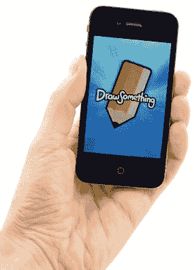
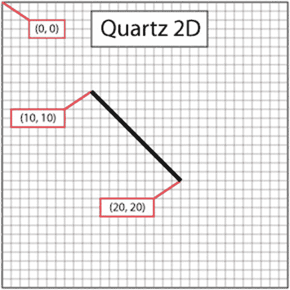
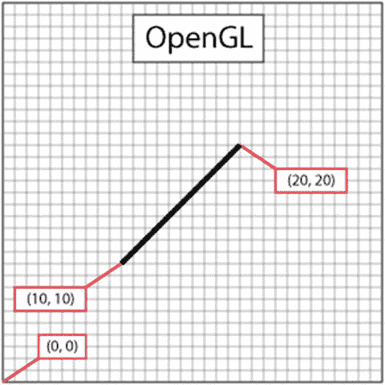
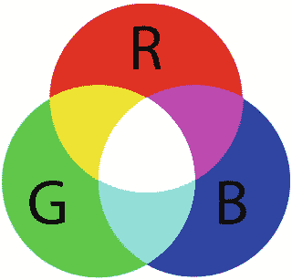
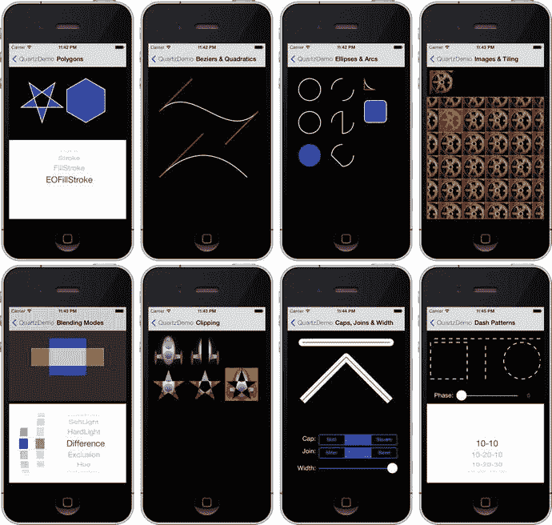
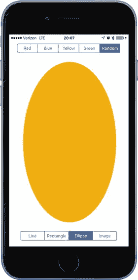
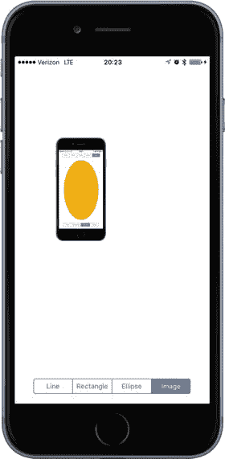
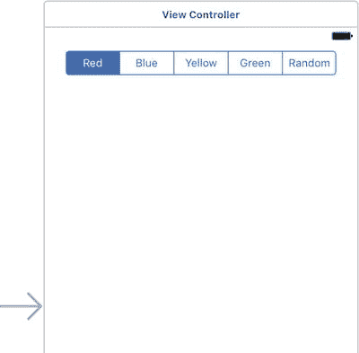
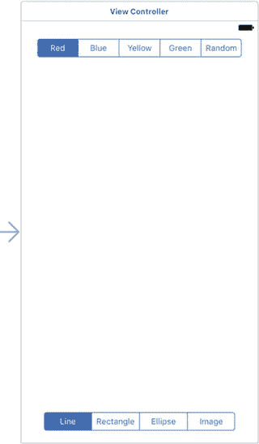
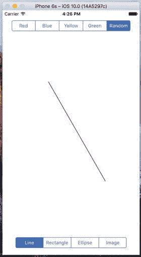

# 16. 图形与绘图

到目前为止，我们构建的所有应用界面都使用了 UIKit 框架中的视图和控件。利用 UIKit 可以完成许多工作，大量应用程序仅使用其预定义对象即可构建。然而，某些视觉元素（参见图 16-1）需要超越 UIKit 标准组件提供的功能才能完整实现。



**图 16-1.** 图形密集型应用可能需要比 UIKit 提供的更强大的绘图控制

例如，有时应用需要具备自定义绘图能力。iOS 包含了 Core Graphics 框架，使我们能够执行各种绘图任务。在本章中，我们将探索这个强大图形环境的一小部分。我们还将构建示例应用来演示 Core Graphics 的关键特性，并解释其主要概念。

## Quartz 2D

Core Graphics 包含一套名为 Quartz 2D 的主要 API，它是一系列函数、数据类型和对象的集合，旨在让你直接在视图或内存中的图像上进行绘制。Quartz 2D 将正在绘制的视图或图像作为虚拟画布。它遵循所谓的“画家模型”，这意味着绘图命令的施加方式与在画布上涂抹颜料非常相似。

如果一位画家将整张画布涂成红色，然后将画布的下半部分涂成蓝色，那么画布将呈现为：如果蓝色颜料不透明，则上半红下半蓝；如果蓝色颜料半透明，则上半红下半紫。Quartz 2D 的虚拟画布工作原理与此相同。如果你将整个视图绘成红色，然后将视图下半部分绘成蓝色，最终视图将呈现为上半红，下半要么是蓝色要么是紫色，具体取决于第二个绘图动作是完全不透明还是部分透明。每个绘图动作都会在之前所有绘图动作之上应用于画布。

Quartz 2D 提供多种线条、形状和图像绘制函数。虽然易于使用，但 Quartz 2D 仅限于二维绘图。我们将从 Quartz 2D 的基本工作原理开始，然后使用它构建一个简单的绘图应用。

## Quartz 2D 的绘图方法

使用 Quartz 2D（简称 Quartz）时，我们通常会将 Swift 图形代码添加到执行绘图的视图中。例如，我们可以创建一个 `UIView` 的子类，并将 Quartz 函数调用添加到该类的 `draw(_ rect:)` 方法中。`draw(_ rect:)` 方法是 `UIView` 类定义的一部分，每当视图需要重绘时，该方法都会被调用。如果你将 Quartz 代码插入 `draw(_ rect:)` 中，这些代码就会被执行，然后视图会进行重绘。

### Quartz 2D 的图形上下文

在 Quartz 以及整个 Core Graphics 中，绘图发生在图形上下文中，通常简称为上下文。每个视图都包含一个关联的上下文。你可以获取当前上下文，使用该上下文进行各种 Quartz 绘图调用，然后让上下文将绘图渲染到视图上。你可以将这个上下文想象成一种画布。系统会为你提供一个默认上下文，其内容将显示在屏幕上。然而，你也可以创建自己的上下文，用于绘制那些不需要立即显示，而是保存起来供以后使用或用于其他目的的内容。我们将重点介绍使用默认上下文，我们可以通过在 `draw(_ rect:)` 中编写 `let context = UIGraphicsGetCurrentContext()` 来获取它。

图形上下文的类型是 `CGContext`。这是 C 语言指针类型 `CGContextRef`（Core Graphics 中上下文的原生表示）的 Swift 映射。在前述代码中，上下文变量的实际推断类型是 `CGContext!`。它是可选类型，因为 C 语言调用理论上可能返回 `NULL`（虽然如果你只在保证存在当前上下文的地方使用 `UIGraphicsGetCurrentContext()`，它不会返回 `NULL`），并且它是隐式解包的，这样你就不必对上下文的每次引用都进行解包。

注意

Core Graphics 是一个 C 语言 API。你在本章中看到的所有以 `CG` 开头的函数都是 C 函数，而不是 Swift 函数。

一旦你获得了图形上下文，就可以通过将该上下文传递给各种 Core Graphics 绘图函数来在其中进行绘制。例如，代码清单 16-1 中的序列创建了一个描述简单线条的路径，然后绘制了该路径。

```
context?.setLineWidth(4.0)
context?.setStrokeColor(UIColor.red.cgColor)
context?.moveTo(x: 10.0, y: 10.0)
context?.addLineTo(x: 20.0, y: 20.0)
context?.strokePath()
代码清单 16-1.
在图形上下文中进行绘制
```

第一次调用指定，后续任何创建当前路径的绘图命令都应使用宽度为 4 点的画笔来执行。可以把这个理解为选择你即将用来绘画的画笔尺寸。在你使用不同数值再次调用此函数之前，在此上下文中绘制的所有线条宽度都将为 4 点。接着，你指定描边颜色应为红色。在 Core Graphics 中，有两种颜色与绘图动作相关联：

*   **描边颜色**用于绘制线条和形状的轮廓。
*   **填充颜色**用于填充形状。

上下文关联了一支用于绘制线条的“隐形笔”。当执行绘图命令时，这支笔的移动会形成一条路径。当你调用 `.moveTo(x: , y:)` 时，你会抬起这支虚拟笔，移动到指定位置，而实际上不绘制任何东西。接下来的任何操作，都将相对于你上次移动笔到的位置来执行。例如，在前面的例子中，我们首先将笔移动到 (10, 10)。下一个函数调用从当前笔的位置 (10, 10) 添加了一条线到指定位置 (20, 20)，而 (20, 20) 成为了笔的新位置。

在 Core Graphics 中绘图时，你并非在绘制实际可以看到的东西——至少不是立即可见。你是在创建一条路径，它可以是一个形状、一条线段或其他一些对象；然而，它本身不包含颜色或其他特征使其可见。这就像用隐形墨水写字。在你采取行动使其可见之前，你的路径是看不见的。因此，下一步是调用 `.strokePath()` 函数，它告诉 Quartz 绘制你已经构建好的路径。这个函数会使用我们之前设置的线宽和描边颜色，实际为路径着色（或“描绘”）并使其可见。


### 坐标系

在代码清单 16-1 中，我们向`context!.moveTo(x:, y:)`和`context!.addLineTo(x:, y:)`传递了一对浮点数作为参数。这些数字代表了 Core Graphics 坐标系中的位置。该坐标系中的位置通过其`x`和`y`坐标来表示，我们通常记作 (`x`, `y`)。上下文的左上角是 (0, 0)。向下移动时，`y`值增大。向右移动时，`x`值增大。这段代码的作用是从 (10, 10) 到 (20, 20) 绘制一条对角线，效果将如图 16-2 所示。



图 16-2. 使用 Quartz 2D 坐标系绘制一条线

Quartz 坐标系在 iOS 上可能有点令人困惑，因为它的垂直分量与许多图形库以及传统的笛卡尔坐标系是相反的。在其他系统中，例如 OpenGL 或 macOS 版本的 Quartz，(0, 0) 位于左下角；随着`y`坐标增加，你会向上下文或视图的顶部移动，如图 16-3 所示。



图 16-3. 在许多图形库中，包括 OpenGL，从 (10, 10) 到 (20, 20) 绘制会生成如下所示的线条，而非图 16-2 中的线条

为了指定坐标系中的一个点，一些 Quartz 函数需要两个浮点数作为参数。其他一些 Quartz 函数则要求将点嵌入到一个`CGPoint`中，这是一个包含两个浮点值`x`和`y`的结构体。为了描述视图或其他对象的大小，Quartz 使用`CGSize`，这是一个同样包含两个浮点值的结构体：宽度和高度。Quartz 还声明了一种名为`CGRect`的数据类型，用于在坐标系中定义一个矩形。一个`CGRect`包含两个元素：一个名为`origin`的`CGPoint`，其`x`和`y`值用于标识矩形的左上角；以及一个名为`size`的`CGSize`，用于标识矩形的宽度和高度，如代码清单 16-2 所示。

```
var startingPoint = CGPoint(x: 1.0, y: 1.0)
var sizeOfrect = CGSize(width: 10.0, height: 10.0)
var rectangle = CGRect(origin: startingPoint, size: sizeOfrect)
代码清单 16-2. 创建矩形
```

### 指定颜色

绘图中一个重要的部分是颜色，因此理解颜色在 iOS 中的运作方式至关重要。UIKit 提供了一个表示颜色的类：`UIColor`。你不能直接在 Core Graphics 调用中使用`UIColor`对象。然而，`UIColor`只是 Core Graphics 中一个名为`cgColor`的结构体的封装（这正是 Core Graphics 函数所需要的）。你可以通过使用`UIColor`实例的`cgColor`属性来获取`cgColor`引用，正如我们之前展示的那样：`context!.setStrokeColor(UIColor.red.cgColor)`。

我们通过一个名为`red`的类型方法获取了一个预定义`UIColor`实例的引用，然后获取了它的`cgColor`属性并将其传递给函数。如果你查阅`UIColor`类的文档，你会发现有几个便捷方法，比如`redColor()`，可以用来获取一些常用颜色的`UIColor`对象。

#### 关于 iOS 设备显示屏的一点色彩理论

在现代计算机图形学中，屏幕上显示的任何颜色都基于一种称为**色彩模型**的东西以某种方式存储其数据。色彩模型（有时也称为**色彩空间**）只是一种将现实世界中的颜色表示为计算机可以使用的数字值的方法。一种常见的表示颜色的方法是使用四个分量：红色、绿色、蓝色和 Alpha。在 Quartz 中，这些值中的每一个都用`CGFloat`表示。这些值应始终介于 0.0 和 1.0 之间。

> **注意：** 在 32 位系统上，`CGFloat`是一个 32 位浮点数，因此直接映射到 Swift 的`Float`类型。然而，在 64 位系统上，它是一个 64 位值，对应于 Swift 的`Double`类型。在 Swift 代码中操作`CGFloat`值时要小心。

红色、绿色和蓝色分量相对容易理解，因为它们代表了加色三原色，即 RGB 色彩模型，如图 16-4 所示。如果将这三种颜色的光以相等的比例混合，结果在人眼看来是白色或不同深浅的灰色，具体取决于混合光的强度。以不同比例组合这三种加色原色，可以得到各种不同的颜色，这被称为**色域**。



图 16-4. 构成 RGB 色彩模型的加色三原色的简单表示

你可能学过三原色是红、黄、蓝，这被称为历史减色三原色，即 RYB 色彩模型。它在现代色彩理论中应用极少，几乎从未在计算机图形学中使用。RYB 色彩模型的色域比 RGB 色彩模型有限得多，并且也不容易进行数学定义。就我们的目的而言，三原色是红、绿、蓝，而不是红、黄、蓝。

除了红、绿、蓝之外，Quartz 还使用了另一个颜色分量，称为 Alpha，它表示一种颜色的透明度。当一种颜色绘制在另一种颜色之上时，会使用 Alpha 来确定最终绘制的颜色。当 Alpha 为 1.0 时，绘制的颜色是 100% 不透明的，会遮盖其下方的所有颜色。当 Alpha 值小于 1.0 时，下方的颜色会透出来并与上方的颜色混合。如果 Alpha 为 0.0，则该颜色将完全不可见，其后面的任何内容都将完全显现出来。当使用 Alpha 分量时，色彩模型有时被称为 RGBA 色彩模型，尽管从技术上讲，Alpha 并非颜色的真正组成部分；它只是定义了颜色在绘制时如何与其他颜色相互作用。

#### 其他色彩模型

尽管 RGB 模型是计算机图形学中最常用的，但它并非唯一的色彩模型。还有其他几种模型在使用，包括：

*   色调、饱和度、明度 (HSV)
*   色调、饱和度、亮度 (HSL)
*   青色、品红、黄色、黑色 (CMYK)，用于四色胶印
*   灰度

其中一些模型还有不同版本，包括 RGB 色彩空间的几种变体。幸运的是，对于大多数操作，我们不需要担心所使用的颜色模型。我们只需在`UIColor`对象上调用`cgColor`，在大多数情况下，Core Graphics 会处理任何必要的转换。

### 在上下文中绘制图像

Quartz 允许你直接将图像绘制到上下文中。这是另一个 UIKit 类 (`UIImage`) 的例子，你可以使用它作为处理 Core Graphics 数据结构 (`cgImage`) 的替代方案。`UIImage`类包含了将其图像绘制到当前上下文中的方法。你需要使用以下任一技术来标识图像在上下文中的显示位置：

*   通过指定一个`CGPoint`来标识图像的左上角
*   通过指定一个`CGRect`来限定图像的框架，必要时会调整图像大小以适应框架

你可以像代码清单 16-3 所示，将`UIImage`绘制到当前上下文中。

```
var image:UIImage  = UIImage() // 假设此对象存在并指向一个 UIImage 实例
let drawPoint = CGPoint(x: 100.0, y: 100.0)
image.draw(at: drawPoint)
代码清单 16-3. 将 UIImage 绘制到当前上下文
```


### 绘制形状：多边形、线条和曲线

Quartz 提供了许多函数，让创建复杂形状变得更加容易。要绘制矩形或多边形，您无需计算角度、绘制线条或进行任何数学运算。只需调用一个 Quartz 函数即可为您完成工作。例如，要绘制椭圆，您只需定义椭圆需要适配的矩形，然后让 Core Graphics 来完成绘制，如代码清单 16-4 所示。

```
let startingPoint = CGPoint(x: 1.0, y: 1.0)
let sizeOfrect = CGSize(width: 10.0, height: 10.0)
let theRect = CGRect(origin: startingPoint, size:sizeOfrect)
context!.addEllipse(inRect: theRect)
context!.addRect(theRect)
```

**代码清单 16-4.** 在当前图形上下文中绘制矩形

矩形的绘制也使用类似的方法。Quartz 还提供了让您能够创建更复杂形状的方法，例如弧线和贝塞尔路径。

**注意：** 本章示例中不会涉及复杂形状。要了解更多关于 Quartz 中弧线和贝塞尔路径的信息，请查看 iOS 开发者中心 `http://developer.apple.com/documentation/GraphicsImaging/Conceptual/drawingwithquartz2d/` 中的《Quartz 2D 编程指南》，或 Xcode 的在线文档。

### Quartz 2D 工具集锦：图案、渐变和虚线模式

Quartz 提供了相当令人印象深刻的一系列工具。例如，Quartz 不仅支持用纯色填充多边形，还支持用渐变填充。此外，除了绘制实线外，它还可以使用各种虚线模式。请查看图 16-5 中的屏幕截图（来自 Apple 的 QuartzDemo 示例代码），了解 Quartz 能为您做些什么。



**图 16-5.** 来自 Apple 提供的 QuartzDemo 示例项目，展示了 Quartz 2D 的一些功能示例

现在您已经基本了解了 Quartz 的工作原理及其功能，让我们来尝试一下。

## QuartzFun 应用程序

在我们的下一个应用中，我们将构建一个简单的绘图程序（见图 16-6），使用 Quartz 来让您感受我们之前讨论的概念是如何结合在一起的。



**图 16-6.** 运行中的 QuartzFun 应用程序

### 创建 QuartzFun 应用程序

在 Xcode 中，使用“单视图应用程序”模板创建一个新项目，并将其命名为 `QuartzFun`。该模板已经为我们提供了一个应用程序委托和一个视图控制器。我们将在自定义视图中执行自定义绘制，因此还需要创建一个 `UIView` 的子类，并通过重写 `draw(_ rect:)` 方法在其中进行绘制。选中 `QuartzFun` 文件夹（当前包含应用委托和视图控制器文件的文件夹），按 ⌘N 调出新建文件助手，然后从 iOS 源部分选择“Cocoa Touch Class”。将新类命名为 `QuartzFunView`，并使其成为 `UIView` 的子类。

我们将添加两个枚举——一个用于表示可以绘制的形状类型，另一个用于表示可用的颜色。此外，由于其中一种颜色选项是“随机”，我们还需要一个每次调用时都能返回随机颜色的方法。让我们从创建该方法和两个枚举开始。

#### 创建随机颜色

我们可以定义一个返回随机颜色的全局函数，但更好的做法是将此函数作为 `UIColor` 类的扩展添加进来。打开 `QuartzFunView.swift` 文件，并在顶部附近添加以下代码：

```
// Random color extension of UIColor
extension UIColor {
class func randomColor() -> UIColor {
let red = CGFloat(Double(arc4random_uniform(255))/255)
let green = CGFloat(Double(arc4random_uniform(255))/255)
let blue = CGFloat(Double(arc4random_uniform(255))/255)
return UIColor(red: red, green: green, blue: blue, alpha:1.0)
}
}
```

这段代码相当直接。对于每个颜色分量，我们使用 `arc4random_uniform()` 函数生成一个范围在 0 到 255 之间的随机浮点数。颜色的每个分量都需要在 0.0 到 1.0 之间，因此我们简单地将结果除以 255。为什么是 255？iOS 上的 Quartz 2D 为每个颜色分量支持 256 种不同的强度，所以使用数字 255 可以确保我们有机会随机选择其中任何一种。最后，我们使用这三个随机分量来创建一种新颜色。我们将 alpha 值设置为 1.0，以确保所有生成的颜色都是不透明的。

#### 定义形状和颜色枚举

可能的形状和绘图颜色由枚举表示。将以下定义添加到 `QuartzFunView.swift` 文件中：

```
enum Shape : Int {
case line = 0, rect, ellipse, image
}
// The color tab indices
enum DrawingColor : Int {
case red = 0, blue, yellow, green, random
}
```

这两个枚举都派生自 `UInt`，因为稍后您将看到，我们需要使用原始枚举值来建立形状或颜色与分段控件中选中分段之间的映射关系。


### 实现 `QuartzFunView` 骨架

由于我们将在 `UIView` 的子类中进行绘图操作，因此先为该类配置好所有必需的元素，但先不包含具体的绘图代码（这部分后续会添加）。首先，在 `QuartzFunView` 类中添加以下六个属性：

```
// 应用可设置的属性
var shape = Shape.line
var currentColor = UIColor.red
var useRandomColor = false
// 内部属性
private let image = UIImage(named:"iphone")
private var firstTouchLocation = CGPoint.zero
private var lastTouchLocation = CGPoint.zero
```

`shape` 属性用于跟踪用户想要绘制的形状，`currentColor` 属性是用户选择的绘图颜色，而 `useRandomColor` 属性在用户选择随机颜色绘图时将被设置为 `true`。这些属性都旨在供类外部使用（实际上，它们将由视图控制器使用）。

接下来的三个属性仅由类的内部实现所需，因此被标记为 `private`。前两个属性将跟踪用户手指在屏幕上拖动时的位置。我们会将用户首次触摸屏幕时的位置存储在 `firstTouchLocation` 中，并将手指拖动期间以及拖动结束时的位置存储在 `lastTouchLocation` 中。我们的绘图代码将使用这两个变量来确定在何处绘制所需形状。`image` 属性保存了当用户选择底部工具栏最右侧的工具栏项时要在屏幕上绘制的图像，如图 16-7 所示。



图 16-7. 使用 QuartzFun 绘制 UIImage

接下来进入具体的实现部分。首先添加几个方法，以响应用户的触摸操作。在属性声明之后，插入清单 16-5 中的三个方法。

```
override func touchesBegan(_ touches: Set, with event: UIEvent?) {
if let touch = touches.first {
if useRandomColor {
currentColor = UIColor.randomColor()
}
firstTouchLocation = touch.location(in: self)
lastTouchLocation = firstTouchLocation
setNeedsDisplay()
}
}
override func touchesMoved(_ touches: Set, with event: UIEvent?) {
if let touch = touches.first {
lastTouchLocation = touch.location(in: self)
setNeedsDisplay()
}
}
override func touchesEnded(_ touches: Set, with event: UIEvent?) {
if let touch = touches.first {
lastTouchLocation = touch.location(in: self)
setNeedsDisplay()
}
}
```

清单 16-5. `QuartFunView.swift` 文件中的触摸方法

这三个方法继承自 `UIView`，而 `UIView` 又继承自其父类 `UIResponder`。通过重写它们，我们可以获知用户触摸屏幕的位置。它们的工作方式如下：

- `touchesBegan(_:withEvent:)` 在用户手指首次触摸屏幕时被调用。在该方法中，如果用户选择了随机颜色，我们会使用之前添加到 `UIColor` 中的新 `randomColor` 方法来更改颜色。随后，我们存储当前触摸位置，以便知道用户首次触摸屏幕的位置，并通过在 `self` 上调用 `setNeedsDisplay()` 来表明视图需要重绘。
- `touchesMoved(_:withEvent:)` 在用户手指在屏幕上拖动期间被持续调用。这里我们只做一件事：将新位置存储到 `lastTouchLocation` 中，并告知屏幕需要重绘。
- `touchesEnded(_:withEvent:)` 在用户手指离开屏幕时被调用。与 `touchesMoved(_:withEvent:)` 方法类似，我们只将最终位置存储到 `lastTouchLocation` 变量中，并表明视图需要重绘。

如果此处其余代码你尚未完全理解，不必担心。我们将在第 18 章详细讨论处理触摸操作的具体细节，以及 `touchesBegan(_:withEvent:)`、`touchesMoved(_:withEvent:)` 和 `touchesEnded(_:withEvent:)` 方法的特定用途。

等应用骨架搭建完成并运行后，我们会再回到这个类。目前被注释掉的 `draw(_ rect:)` 方法，正是我们将要完成应用实际绘图工作的地方，不过这部分代码我们还没编写。在添加绘图代码之前，让我们先完成应用的设置。


#### 创建并连接输出口与操作

在开始绘图之前，我们需要将分段控件添加到图形用户界面中，然后连接操作与输出口。单击 `Main.storyboard` 进行设置。首要任务是更改视图的类。在文档大纲中，展开场景及其包含的视图控制器项目，然后单击“View”项。按下 `⇧⌘3` 调出身份检查器，并将类从 `UIView` 更改为 `QuartzFunView`。

现在，使用对象库查找一个分段控件，并将其拖到视图顶部、状态栏下方。将其放置在靠近中心的位置。不必过于精确，因为我们稍后会添加一个布局约束来使其居中。

选中分段控件后，调出属性检查器，将分段数从 2 更改为 5。依次双击每个分段，按从左到右的顺序将其标签改为“红色”、“蓝色”、“黄色”、“绿色”和“随机”。接下来应用布局约束。在文档大纲中，按住 Control 键从分段控件项拖到“Quartz Fun View”项，松开鼠标，按住 Shift 键，选择“垂直间距到顶部布局指南”和“容器中水平居中”，然后按 Return 键。在文档大纲中，选择视图控制器图标，然后返回故事板编辑器，点击“解析自动布局问题”按钮（位于“固定”按钮右侧），并选择“更新帧”。如果此选项未启用，请确保已在文档大纲中选中了视图控制器。现在分段控件应该已正确调整大小并定位，如图 16-8 所示。



图 16-8. 已正确标注并定位的颜色分段控件

如果助理编辑器尚未打开，请将其打开，并从跳转栏中选择 `ViewController.swift`。现在，按住 Control 键从文档大纲中的分段控件拖到右侧的 `ViewController.swift` 文件中，位于类声明下方的那一行，松开鼠标创建一个新的输出口。将新输出口命名为 `colorControl`，其余选项保留默认值。您的类现在应如下所示：

```
class ViewController: UIViewController {
@IBOutlet weak var colorControl: UISegmentedControl!
```

接下来，添加一个操作。在助理编辑器中打开 `ViewController.swift`，再次选择 `Main.storyboard`，然后按住 Control 键从分段控件拖到视图控制器文件中类定义的底部，直接位于右花括号上方。在弹出的窗口中，将连接类型更改为“Action”，名称设为 `changeColor`。该弹出窗口应默认使用“Value Changed”事件，这正是我们需要的。同时，将类型设置为 `UISegmentedControl`。

现在添加第二个分段控件，它将用于选择绘制的形状。从对象库中拖出一个分段控件，放到视图底部附近。在文档大纲中选中该分段控件，调出属性检查器，将分段数从 2 更改为 4。然后依次双击每个分段，将四个分段的标题按顺序改为“线条”、“矩形”、“椭圆”和“图片”。接下来，我们需要添加布局约束来固定控件的大小和位置，就像我们对颜色选择控件所做的那样。以下是所需步骤：

1.  在文档大纲中，按住 Control 键从新分段控件项拖到“Quartz Fun View”项，松开鼠标。按住 Shift 键，选择“垂直间距到底部布局指南”和“容器中水平居中”，然后按 Return 键。
2.  在文档大纲中，选择视图控制器图标，然后返回编辑器，点击“解析自动布局问题”按钮，并选择“更新帧”。

完成后，再次在助理编辑器中打开 `ViewController.swift`，然后按住 Control 键从新分段控件拖到 `ViewController.swift` 的底部，创建另一个操作。将连接类型更改为“Action”，命名操作为 `changeShape`，类型更改为 `UISegmentedControl`，然后点击“Connect”。故事板现在应如图 16-9 所示。下一步，我们将实现操作方法。



图 16-9. 两个分段控件均已就位的故事板

#### 实现操作方法

保存故事板，然后可以关闭助理编辑器。现在选择 `ViewController.swift`，找到 Xcode 为您创建的 `changeColor()` 方法的存根实现，并添加列表 16-6 中的代码。

```
@IBAction func changeColor(_ sender: UISegmentedControl) {
let drawingColorSelection =
DrawingColor(rawValue: UInt(sender.selectedSegmentIndex))
if let drawingColor = drawingColorSelection {
let funView = view as! QuartzFunView
switch drawingColor {
case .red:
funView.currentColor = UIColor.red
funView.useRandomColor = false
case .blue:
funView.currentColor = UIColor.blue
funView.useRandomColor = false
case .yellow:
funView.currentColor = UIColor.yellow
funView.useRandomColor = false
case .green:
funView.currentColor = UIColor.green
funView.useRandomColor = false
case .random:
funView.useRandomColor = true
}
}
}
列表 16-6. changeColor 方法位于 ViewController.swift 文件中

```

这段代码相当直接。我们只需查看选择了哪个分段，并根据该选择创建一种新颜色作为当前绘图颜色。为了将分段控件的选中索引映射到对应颜色的枚举值，我们使用了接受原始值的枚举构造器：

```
let drawingColorSelection =
DrawingColor(rawValue: UInt(sender.selectedSegmentIndex))
```

之后，我们设置 `currentColor` 属性，以便类知道绘图时应使用哪种颜色——除非选择了随机颜色。在这种情况下，我们将 `useRandomColor` 属性设置为 `true`，这样用户每次开始新的绘图操作时都会选择一种新颜色（您可以在 `touchesBegan(_:withEvent:)` 方法中找到此代码，该方法我们在几页前已添加）。由于所有绘图代码都将位于视图本身中，因此该方法中无需执行其他操作。

接下来，找到现有的 `changeShape()` 方法实现，并添加以下代码：

```
@IBAction func changeShape(_ sender: UISegmentedControl) {
let shapeSelection = Shape(rawValue: UInt(sender.selectedSegmentIndex))
if let shape = shapeSelection {
let funView = view as! QuartzFunView
funView.shape = shape
colorControl.isHidden = shape == Shape.image
}
}
```

在该方法中，我们仅根据控件的选中分段设置形状类型。`Shape` 枚举的四个元素对应于应用程序视图底部的四个工具栏分段。我们将形状设为与当前选中的分段相同，并根据是否选中“图片”分段来隐藏或显示颜色选择控件。

通过编译并运行应用程序，确保一切正常。目前您还无法在屏幕上绘制形状，但分段控件应该能正常工作；当您点击底部控件中的“图片”分段时，颜色控件应会消失。

现在一切就绪，让我们开始绘图。

### 添加 Quartz 2D 绘图代码

我们已准备好添加执行绘图的代码。我们将绘制线条、一些形状和一张图片。我们将逐步进行，每次添加少量代码，然后运行应用程序查看代码效果。


#### 绘制线条

首先执行最简单的绘制操作：绘制一条单独的线。选择 `QuartzFunView.swift`，并用列表 16-7 中所示的方法替换被注释掉的 `draw(_ rect: CGRect)` 方法。

```
override func draw(_ rect: CGRect) {
let context = UIGraphicsGetCurrentContext()
context!.setLineWidth(2.0)
context!.setStrokeColor(currentColor.cgColor)
switch shape {
case .line:
context?.moveTo(x: firstTouchLocation.x,
y: firstTouchLocation.y)
context?.addLineTo(x: lastTouchLocation.x,
y: lastTouchLocation.y)
context?.strokePath()
case .rect:
break
case .ellipse:
break
case .image:
break
}
}
```

首先，我们获取当前图形上下文的引用，这将允许我们在 `QuartzFunView` 上进行绘制：

```
let context = UIGraphicsGetCurrentContext()
```

接下来，我们将线宽设置为 2.0，这意味着我们描边的任何线条宽度都是 2 点：

```
context!.setLineWidth(2.0)
```

之后，我们设置描边线条的颜色。由于 `UIColor` 具有此函数所需的 `CGColor` 属性，因此我们使用 `currentColor` 属性的该属性来将正确的颜色传递给此函数。

```
context!.setStrokeColor(currentColor.cgColor)
```

我们使用 `switch` 语句跳转到每种形状类型对应的合适代码中。如前所述，我们将从处理绘制线条的代码开始，使其正常工作，然后在逐步完成此示例的过程中，依次为每种形状添加代码：

```
switch shape {
case .line:
```

为了绘制一条线，我们告诉图形上下文从用户首次触摸的位置开始创建一个路径。请记住，我们在 `touchesBegan(_:withEvent:)` 方法中存储了该值，因此它始终反映最近一次触摸或拖动的起始点：

```
context?.moveTo(x: firstTouchLocation.x,
y: firstTouchLocation.y)
```

接下来，我们从该位置向用户最后一次触摸的位置绘制一条线。如果用户的手指仍与屏幕接触，`lastTouchLocation` 包含手指的当前位置。如果用户不再触摸屏幕，`lastTouchLocation` 包含用户手指离开屏幕时的位置：

```
context?.addLineTo(x: lastTouchLocation.x,
y: lastTouchLocation.y)
```

此函数实际上并不绘制线条——它只是将该线条添加到上下文的当前路径中。为了使线条显示在屏幕上，我们需要对路径进行描边。此函数将使用我们先前设置的颜色和宽度对我们刚刚绘制的线条进行描边：

```
context?.strokePath()
```

目前就是这样。至此，你应该能够再次编译并运行该应用。矩形、椭圆和图像形状选项无法工作，但你应该能够使用任意颜色选项正常绘制线条（参见图 16-10）。



我们应用中的线条绘制部分现已完成。此处，我们使用随机颜色进行绘制。

#### 绘制矩形和椭圆

让我们同时编写绘制矩形和椭圆的代码，因为 Quartz 基本上以相同的方式实现这两个对象。按列表 16-8 所示修改现有的 `draw(_ rect:)` 方法。

```
override func draw(_ rect: CGRect) {
let context = UIGraphicsGetCurrentContext()
context?.setLineWidth(2.0)
context?.setStrokeColor(currentColor.cgColor)
context?.setFillColor(currentColor.cgColor)
let currentRect = CGRect(x: firstTouchLocation.x,
y: firstTouchLocation.y,
width: lastTouchLocation.x - firstTouchLocation.x,
height: lastTouchLocation.y - firstTouchLocation.y)
switch shape {
case .line:
context?.moveTo(x: firstTouchLocation.x,
y: firstTouchLocation.y)
context?.addLineTo(x: lastTouchLocation.x,
y: lastTouchLocation.y)
context?.strokePath()
case .rect:
context?.addRect(currentRect)
context?.drawPath(using: .fillStroke)
case .ellipse:
context?.addEllipse(inRect: currentRect)
context?.drawPath(using: .fillStroke)
case .image:
break
}
}
```

因为我们希望同时绘制椭圆和矩形的轮廓并填充其内部，所以我们添加了一个调用，以使用 `currentColor` 设置填充颜色：

```
context?.setFillColor(currentColor.cgColor)
```

接下来，我们声明一个 `CGRect` 变量。我们在此处这样做是因为矩形和椭圆都是基于一个矩形绘制的。我们将使用 `currentRect` 来保存由用户拖拽所描述的矩形。请记住，一个 `CGRect` 有两个成员：`size` 和 `origin`。一个名为 `CGRect(x: y: width: height:)` 的函数允许我们通过指定构建矩形所需的值来创建一个 `CGRect`。创建矩形的代码相当直接。我们使用存储在 `firstTouchLocation` 中的点来创建原点。接着，我们通过计算两个 `x` 值之间和两个 `y` 值之间的差值来得出尺寸。请注意，根据拖拽的方向，一个或两个尺寸值可能最终为负数，但这没关系。一个具有负尺寸的 `CGRect` 将简单地在其原点的相反方向上渲染（负宽度向左；负高度向上）：

```
let currentRect = CGRect(x: firstTouchLocation.x,
y: firstTouchLocation.y,
width: lastTouchLocation.x - firstTouchLocation.x,
height: lastTouchLocation.y - firstTouchLocation.y)
```

一旦我们定义了这个矩形，绘制矩形或椭圆就变得非常简单，只需调用两个函数：一个在我们定义的 `CGRect` 中绘制矩形或椭圆，另一个对其进行描边和填充：

```
case .rect:
context?.addRect(currentRect)
context?.drawPath(using: .fillStroke)
case .ellipse:
context?.addEllipse(inRect: currentRect)
context?.drawPath(using: .fillStroke)
```

构建并运行你的应用。尝试使用矩形和椭圆工具，看看你是否喜欢它们。别忘了更改颜色，包括使用随机颜色。


#### 绘制图像

作为最后一个技巧，我们来绘制一张图像。16-Image 文件夹中包含三张图片，分别命名为 `iphone.png`、`iphone@2x.png` 和 `iphone@3x.png`，你可以将它们添加到项目的资源目录中。在项目导航器中选择 `Assets.xcassets` 在编辑器中打开，然后在访达中选中这三张图片，将它们拖拽到编辑器区域，即可在资源目录中创建一个名为 `iphone` 的新图片组。现在按照清单 16-9 所示，修改 `draw(_ rect: )` 方法。

```
override func draw(_ rect: CGRect) {
let context = UIGraphicsGetCurrentContext()
context?.setLineWidth(2.0)
context?.setStrokeColor(currentColor.cgColor)
context?.setFillColor(currentColor.cgColor)
let currentRect = CGRect(x: firstTouchLocation.x,
y: firstTouchLocation.y,
width: lastTouchLocation.x - firstTouchLocation.x,
height: lastTouchLocation.y - firstTouchLocation.y)
switch shape {
case .line:
context?.moveTo(x: firstTouchLocation.x,
y: firstTouchLocation.y)
context?.addLineTo(x: lastTouchLocation.x,
y: lastTouchLocation.y)
context?.strokePath()
case .rect:
context?.addRect(currentRect)
context?.drawPath(using: .fillStroke)
case .ellipse:
context?.addEllipse(inRect: currentRect)
context?.drawPath(using: .fillStroke)
case .image:
let horizontalOffset = image!.size.width / 2
let verticalOffset = image!.size.height / 2
let drawPoint =
CGPoint(x: lastTouchLocation.x - horizontalOffset,
y: lastTouchLocation.y - verticalOffset)
image!.draw(at: drawPoint)
}
}
清单 16-9.
我们修改后的用于处理图像的 `draw(_ rect: )` 方法
```

首先，我们需要计算图像的中心点，因为我们希望图像绘制在用户最后一次触摸点的中心位置。如果不进行此调整，图像的左上角将位于用户手指的位置，这同样也是一个可选方案。然后，我们通过从 `lastTouchLocation` 的 `x` 和 `y` 值中减去这些偏移量，来创建一个新的 `CGPoint`：

```
let horizontalOffset = image!.size.width / 2
let verticalOffset = image!.size.height / 2
let drawPoint =
CGPoint(x: lastTouchLocation.x - horizontalOffset,
y: lastTouchLocation.y - verticalOffset)
```

现在，我们让图像自行绘制。实现这一功能的代码行如下：

```
image!.draw(at: drawPoint)
```

构建并运行应用程序，从分段控件中选择 Image，然后检查是否可以将图像放置到绘图画布上。为了增加一点趣味性，你可以用手指在屏幕上移动，观察图像是否跟随手指移动。

### 优化 QuartzFun 应用程序

我们的应用程序已经实现了预期功能，但仍需考虑一些优化。在我们的这个小应用中，你可能不会察觉到性能下降；但在运行于较慢处理器上的更复杂应用中，你可能会发现一些卡顿。问题出现在 `QuartzFunView.swift` 文件中的 `touchesMoved(_:withEvent:)` 和 `touchesEnded(_:withEvent:)` 方法里，这两个方法都包含以下代码行：

```
setNeedsDisplay()
```

显然，这就是我们通知视图发生改变并需要重绘自身的方式。虽然这段代码可以工作，但即使只有微小变化，它也会导致整个视图被擦除并重绘。当我们准备拖拽出一个新形状时，确实需要擦除屏幕，但在拖拽过程中，我们并不希望每秒多次清空屏幕。

与其在拖拽过程中强制整个视图多次重绘，不如使用 `setNeedsDisplayInRect()` 方法。`setNeedsDisplayInRect()` 是一个 `UIView` 方法，它仅标记视图区域中的一个矩形部分需要重新显示。通过使用此方法，我们可以只标记受当前绘图操作影响的视图部分需要重绘，从而更加高效。

我们需要重绘的不仅仅是 `firstTouchLocation` 与 `lastTouchLocation` 之间的矩形，还包括当前拖拽操作所覆盖的屏幕任何部分。如果用户触摸屏幕后胡乱涂画，但我们只重绘 `firstTouchLocation` 与 `lastTouchLocation` 之间的部分，那么屏幕上就会残留之前重绘时留下的许多我们不想保留的内容。

解决方案是在一个 `CGRect` 实例变量中跟踪特定拖拽操作所影响的整个区域。在 `touchesBegan(_:withEvent:)` 中，我们会将该实例变量重置为用户触摸的触点。然后，在 `touchesMoved(_:withEvent:)` 和 `touchesEnded(_:withEvent:)` 中，我们会使用一个 Core Graphics 函数来获取当前矩形与已存储矩形的并集，并存储此结果矩形。接着，我们用它来指定视图中需要重绘的部分。这种方法可以让我们持续累加当前拖拽操作影响的区域。

目前，我们在 `draw(_ rect: )` 方法中计算当前矩形，用于绘制椭圆和矩形形状。我们将把这个计算移到新的方法中，以便在没有重复代码的情况下，在三个地方都能使用它。让我们来尝试一下。

为 `QuartzFunView` 类添加一个名为 `redrawRect` 的新属性：

```
// 内部属性
private let image = UIImage(named:"iphone")
private var firstTouchLocation = CGPoint.zero
private var lastTouchLocation = CGPoint.zero
private var redrawRect = CGRect.zero
```

我们将使用这个属性来跟踪需要重绘的区域。我们还需要将当前重绘矩形的计算移到一个独立的方法中，你应该在 `QuartzFunView` 类的末尾添加此方法：

```
func currentRect() -> CGRect {
return CGRect(x: firstTouchLocation.x,
y: firstTouchLocation.y,
width: lastTouchLocation.x - firstTouchLocation.x,
height: lastTouchLocation.y - firstTouchLocation.y)
}
```

现在，在 `draw(_ rect: )` 方法中，将所有对 `currentRect` 的引用改为 `currentRect()`，以便代码使用我们刚刚创建的新方法。接下来，按照清单 16-10 所示，删除我们计算 `currentRect` 的代码行。


```swift
override func draw(_ rect: CGRect) {
    let context = UIGraphicsGetCurrentContext()
    context?.setLineWidth(2.0)
    context?.setStrokeColor(currentColor.cgColor)
    context?.setFillColor(currentColor.cgColor)
    switch shape {
    case .line:
        context?.moveTo(x: firstTouchLocation.x,
                        y: firstTouchLocation.y)
        context?.addLineTo(x: lastTouchLocation.x,
                           y: lastTouchLocation.y)
        context?.strokePath()
    case .rect:
        context?.addRect(currentRect())
        context?.drawPath(using: .fillStroke)
    case .ellipse:
        context?.addEllipse(inRect: currentRect())
        context?.drawPath(using: .fillStroke)
    case .image:
        let horizontalOffset = image!.size.width / 2
        let verticalOffset = image!.size.height / 2
        let drawPoint =
            CGPoint(x: lastTouchLocation.x - horizontalOffset,
                    y: lastTouchLocation.y - verticalOffset)
        image!.draw(at: drawPoint)
    }
}
```
**代码清单 16-10** 对 `draw(_ rect:)` 的最终修改

我们还需要对 `touchesBegan(_:withEvent:)`、`touchesEnded(_:withEvent:)` 和 `touchesMoved(_:withEvent:)` 进行一些修改。我们将重新计算当前操作所影响的空间，并以此标记只需重绘视图的某一部分。请将现有的 `touchesEnded(_:withEvent:)` 和 `touchesMoved(_:withEvent:)` 方法替换为**代码清单 16-11** 所示的新版本。

```swift
override func touchesBegan(_ touches: Set, with event: UIEvent?) {
    if let touch = touches.first {
        if useRandomColor {
            currentColor = UIColor.randomColor()
        }
        firstTouchLocation = touch.location(in: self)
        lastTouchLocation = firstTouchLocation
        redrawRect = CGRect.zero
        setNeedsDisplay()
    }
}
override func touchesMoved(_ touches: Set, with event: UIEvent?) {
    if let touch = touches.first {
        lastTouchLocation = touch.location(in: self)
        if shape == .image {
            let horizontalOffset = image!.size.width / 2
            let verticalOffset = image!.size.height / 2
            redrawRect = redrawRect.union(CGRect(x: lastTouchLocation.x - horizontalOffset,
                                                  y: lastTouchLocation.y - verticalOffset,
                                                  width: image!.size.width, height: image!.size.height))
        } else {
            redrawRect = redrawRect.union(currentRect())
        }
        setNeedsDisplay(redrawRect)
    }
}
override func touchesEnded(_ touches: Set, with event: UIEvent?) {
    if let touch = touches.first {
        lastTouchLocation = touch.location(in: self)
        if shape == .image {
            let horizontalOffset = image!.size.width / 2
            let verticalOffset = image!.size.height / 2
            redrawRect = redrawRect.union(CGRect(x: lastTouchLocation.x - horizontalOffset,
                                                  y: lastTouchLocation.y - verticalOffset,
                                                  width: image!.size.width, height: image!.size.height))
        } else {
            redrawRect = redrawRect.union(currentRect())
        }
        setNeedsDisplay(redrawRect)
    }
}
```
**代码清单 16-11** 更新后的触摸事件处理函数

再次构建并运行应用程序，查看最终效果。你很可能看不出任何差别，但通过仅增加几行代码，我们减少了重绘视图所需的工作量——无需擦除和重绘当前拖拽未影响的视图部分。像这样善待 iOS 设备宝贵的处理器周期，可以显著提升应用程序的性能，尤其是当应用变得愈发复杂时。

> **注意：** 如果你想更深入地探索 Quartz 2D 主题，不妨阅读杰克·纳廷、戴夫·伍尔德里奇和大卫·马克合著的《iPhone 开发者的 iPad 开发入门：掌握 iPad SDK》（Apress, 2010）。这本书涵盖了大量的 Quartz 2D 绘图知识。书中所有的绘图代码和解释也同时适用于 iPhone 和 iPad。

## 本章小结

在本章中，我们仅仅触及了 iOS 绘图功能的皮毛。现在你应该对 Quartz 2D 相当熟悉了，只需偶尔查阅苹果文档，就能应对大部分绘图需求。

现在，是时候进一步提升你的图形技能了，因为第 17 章将向你介绍 Sprite Kit 框架——该框架在 iOS 7 中引入，能让你实现超高速的位图渲染，用于创建游戏或其他需要快速运动交互的内容。

