# 17. 使用 SpriteKit 开发简单游戏

在 iOS 7 中，苹果推出了 SpriteKit，这是一个用于高性能 2D 图形渲染的框架。与 Core Graphics（专注于使用画家模型绘制图形）或 Core Animation（专注于 GUI 元素属性的动画）不同，SpriteKit 专注于一个完全不同的领域——视频游戏——这是苹果在 iOS 时代首次涉足游戏编程的图形领域。它同时面向 iOS 7 和 OS X 10.9（Mavericks）发布，在这两个平台上提供相同的 API，因此为其中一个平台编写的应用程序可以轻松移植到另一个平台。尽管苹果此前从未提供过像 SpriteKit 这样的框架，但它与 Cocos2D 等各类开源库有着明显的相似之处。如果你过去使用过 Cocos2D 或类似工具，那么你会感到得心应手。

SpriteKit 并没有实现像 Core Graphics 那样灵活、通用的绘图系统——它没有绘制路径、渐变或填充颜色的方法。相反，它提供的是一个场景图（类似于 UIKit 的视图层级结构），能够变换每个图节点的位置、缩放和旋转，并且每个节点都能绘制自身。大部分绘制工作发生在 `SKSprite` 类（或其子类）的实例中，该类代表一个准备好显示在屏幕上的单一图形图像。

在本章中，我们将使用 SpriteKit 构建一个名为 TextShooter 的简单射击游戏。我们不使用预制图形，而是用文本片段来构建游戏对象，并通过一个专用于此目的的 `SKSprite` 子类来实现。采用这种方法，你无需从项目库或其他地方提取图形。我们将制作的应用程序在外观上很简单，但易于修改和使用。


## 创建 TextShooter 应用

在 Xcode 中，按下 `⌘N` 或选择 File ➤ New ➤ Project…，然后从 iOS 部分选择 Game 模板。点击 Next，将项目命名为 `TextShooter`，设置 Devices 为 Universal，Game Technology 为 `SpriteKit`，然后创建项目。趁此机会，不妨简要了解一下其他可用的技术选项。`OpenGL ES` 和 `Metal`（后者是 iOS 8 新增的技术）属于底层图形 API，能让你对图形硬件拥有近乎完全的控制，但使用起来比 `SpriteKit` 困难得多。另外，不要选择 Integrate `GamePlayKit`，因为我们这里不会用到这个功能。`SpriteKit` 是一个 2D API，而 `SceneKit`（同样在 iOS 8 中引入）是一个可用于构建 3D 图形应用的工具包。阅读完本章后，如果你对 3D 游戏编程感兴趣，不妨查阅位于 [`https://developer.apple.com/library/prerelease/ios/documentation/SceneKit/Reference/SceneKit_Framework/index.html`](https://developer.apple.com/library/prerelease/ios/documentation/SceneKit/Reference/SceneKit_Framework/index.html) 的 `SceneKit` 文档。

如果现在运行 `TextShooter` 项目，你会看到默认的 `SpriteKit` 应用，如图 17-1 所示。初始时，你只会看到“Hello, World”文本。如果你点击屏幕上的任意位置，文本会淡出，并出现一个旋转的图形，持续几秒钟。在本章中，我们将替换模板中的所有内容，逐步构建一个我们自己的简单应用。

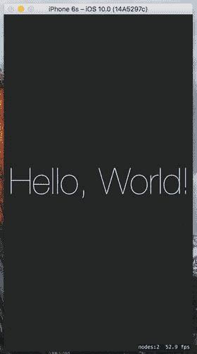

**图 17-1.** 默认 SpriteKit 应用运行效果，屏幕中央显示了一些文本

现在，让我们看看 Xcode 创建的项目。你会看到它包含一个标准的 `AppDelegate` 类和一个名为 `GameViewController` 的小型视图控制器类，该类负责对 `SKView` 对象进行一些初始配置。这个从应用故事板加载的对象，将是显示我们所有 `SpriteKit` 内容的视图。以下是 `GameViewController viewDidLoad()` 方法中初始化 `SKView` 的代码：

```
override func viewDidLoad() {
    super.viewDidLoad()
    if let view = self.view as! SKView? {
        // 从 'GameScene.sks' 加载 SKScene
        if let scene = SKScene(fileNamed: "GameScene") {
            // 设置缩放模式为适应窗口缩放
            scene.scaleMode = .aspectFill
            // 呈现场景
            view.presentScene(scene)
        }
        view.ignoresSiblingOrder = true
        view.showsFPS = true
        view.showsNodeCount = true
    }
}
```

这段代码从故事板中获取 `SKView` 实例，并进行配置，使其在游戏运行时显示一些与性能相关的数值。`SpriteKit` 应用由一组场景构成，这些场景由 `SKScene` 类表示。在使用 `SpriteKit` 开发时，你可能会为应用中每个视觉上独立的部分创建一个新的 `SKScene` 子类。一个场景既可以代表一个快节奏的游戏显示界面，包含几十个在屏幕上来回动画的对象，也可以简单到只是一个开始菜单。在本章中，我们将看到 `SKScene` 的多种用途。该模板生成了一个初始为空的场景，其类名为 `GameScene`。

`SKView` 和 `SKScene` 之间的关系与我们在本书中一直使用的 `UIViewController` 类有一些相似之处。`SKView` 类的行为有点像 `UINavigationController`，从某种意义上说，它就像一块空白画布，仅为其他控制器管理对显示器的访问。不过，从这里开始，情况就有所不同了。与 `UINavigationController` 不同，`SKView` 管理的顶层对象并非 `UIViewController` 的子类，而是 `SKScene` 的子类。`SKScene` 知道如何管理一个对象图，这些对象可以被显示、被物理引擎作用，等等。

这个方法创建了初始场景：

```
if let scene = SKScene(fileNamed: "GameScene") {
```

创建场景有两种方式——你可以以编程方式分配和初始化一个实例，也可以从 `SpriteKit` 场景文件中加载一个。Xcode 模板采用了后一种方法——它生成一个名为 `GameScene.sks` 的 `SpriteKit` 场景文件，其中包含一个 `SKScene` 对象的归档副本。与大多数其他 `SpriteKit` 类一样，`SKScene` 遵循我们在第 13 章讨论过的 `NSCoder` 协议。`GameScene.sks` 文件只是一个标准归档，你可以使用 `NSKeyedUnarchiver` 和 `NSKeyedArchiver` 类对其进行读写。不过，通常你会使用 `SKScene(fileNamed:)` 初始化方法，它会自动从归档中加载 `SKScene`，并将其初始化为调用它的具体子类的实例——在这个例子中，归档的 `SKScene` 数据被用来初始化 `GameScene` 对象。

你可能会想，既然可以直接创建一个空的场景对象，为什么模板代码还要费劲从场景文件中加载呢？原因是 Xcode 的 `SpriteKit` 关卡设计器，它让你设计场景的方式，就像在 Interface Builder 中构建用户界面一样。设计好场景后，将其保存到场景文件，然后再次运行你的应用。这次，场景自然不再是空的，你应该能看到你在关卡设计器中创建的设计。加载初始场景后，你可以自由地以编程方式向其中添加其他元素。本章中我们将大量进行这种操作。或者，如果你觉得关卡设计器不好用，你也可以完全通过代码来构建所有场景。

如果你在项目导航器中选中 `GameScene.sks` 文件，Xcode 会在关卡设计器中打开它，如图 17-2 所示。

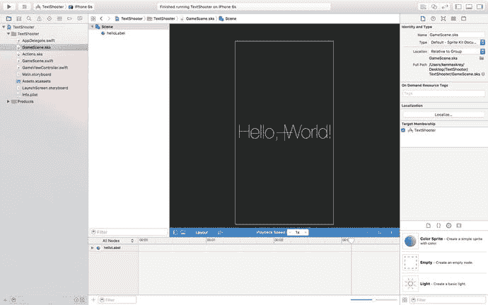

**图 17-2.** Xcode SpriteKit 关卡设计器，显示了包含标签的初始 GameScene

场景显示在编辑器区域中。其右侧是 SKNode 检查器，你可以用它来设置在编辑器中选中的节点的属性。`SpriteKit` 场景元素都是节点——即 `SKNode` 类的实例。`SKScene` 本身是 `SKNode` 的子类。这里，选中了 `SKScene` 节点，因此 SKNode 检查器显示的是其属性。检查器下方，在右下角，是通常的 Xcode 对象库，它会被自动过滤，只显示你可以添加到 `SpriteKit` 场景中的对象类型。你可以通过将对象从库中拖放到编辑器上来设计场景。

现在，让我们回到 `viewDidLoad` 方法的讨论上，并完成它。

```
// 设置缩放模式为适应窗口缩放
scene.scaleMode = .aspectFill
```

这是场景的 `scaleMode` 属性，我们将其设置为 `.aspectFill`，即缩放每个维度，使得两个维度（宽、高）中较大的那个被选为基准。我们还可以选择 `.fill`、`.aspectFit` 和 `.resizeFill`。它们具有以下特性：


* `SKSceneScaleMode.aspectFill` 会缩放场景以填充屏幕，同时保持其宽高比。此模式确保`SKView`的每个像素都被覆盖，但会丢失场景的一部分——在本例中，场景的左右两侧被裁剪。场景的内容也会缩放，因此文字比原始场景中更小，但其相对于场景的位置得以保留。
* `SKSceneScaleMode.aspectFit` 也会保持场景的宽高比，但确保整个场景可见。结果是一个信箱视图，`SKView`的部分可见区域出现在场景内容的上方和下方。
* `SKSceneScaleMode.fill` 会沿两个轴缩放场景，使其恰好适应视图。这会确保场景中所有内容可见，但由于原始场景的宽高比未保留，可能会导致内容出现不可接受的扭曲。在这里，可以看到文字被水平压缩了。
* 最后，`SKSceneScaleMode.resizeFill` 将场景的左下角放置在视图的左下角，并保持其原始大小。

这告诉我们的渲染系统，在显示场景时，我们并不关心父级与子级场景的关系：

```
view.ignoresSiblingOrder = true
```

根据游戏的工作方式，你可能需要设置此项，以便遵循元素的适当堆叠顺序。此行代码用于运行动画场景切换：

```
view.presentScene(scene)
```

当已有已呈现的场景时调用此方法，会导致新场景立即替换旧场景。本章稍后你将看到相关示例。在本例中，由于我们正在使初始场景可见，因此不存在过渡，所以使用`presentScene()`方法是可行的。

```
view.showsFPS = true
view.showsNodeCount = true
```

最后两行仅用于显示关于动画的一些信息，这些信息会显示在屏幕底部，如图 17-3 所示。

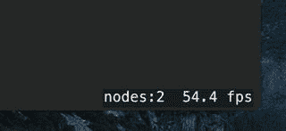

**图 17-3.** 视图中显示的动画附加信息

### 初始场景自定义

选择`GameScene`类。我们不需要 Xcode 模板生成的大部分代码，因此将其移除。首先，删除整个`didMoveToView()`方法。每当场景在`SKView`中呈现时，都会调用此方法，通常用于在场景可见之前进行最后的修改。接下来，修改`touchesBegan(_:withEvent:)`方法，只保留`for`循环和第一行代码。

```
override func touchesBegan(_ touches: Set, with event: UIEvent?) {
/* Called when a touch begins */
for touch in touches {
let location = touch.location(in: self)
}
}
```

由于我们不打算从`GameScene.sks`加载场景，因此需要一个方法来创建一个包含初始内容的场景。我们还需要添加当前游戏关卡编号、玩家剩余生命数以及一个用于标识关卡是否完成的标志。修改`GameScene.swift`文件，如代码清单 17-1 所示。

```
class GameScene: SKScene {
private var levelNumber: Int
private var playerLives: Int
private var finished = false
class func scene(size:CGSize, levelNumber:Int) -> GameScene {
return GameScene(size: size, levelNumber: levelNumber)
}
override convenience init(size:CGSize) {
self.init(size: size, levelNumber: 1)
}
init(size:CGSize, levelNumber:Int) {
self.levelNumber = levelNumber
self.playerLives = 5
super.init(size: size)
backgroundColor = SKColor.lightGray()
let lives = SKLabelNode(fontNamed: "Courier")
lives.fontSize = 16
lives.fontColor = SKColor.black()
lives.name = "LivesLabel"
lives.text = "Lives: \(playerLives)"
lives.verticalAlignmentMode = .top
lives.horizontalAlignmentMode = .right
lives.position = CGPoint(x: frame.size.width,
y: frame.size.height)
addChild(lives)
let level = SKLabelNode(fontNamed: "Courier")
level.fontSize = 16
level.fontColor = SKColor.black()
level.name = "LevelLabel"
level.text = "Level \(levelNumber)"
level.verticalAlignmentMode = .top
level.horizontalAlignmentMode = .left
level.position = CGPoint(x: 0, y: frame.height)
addChild(level)
}
required init?(coder aDecoder: NSCoder) {
levelNumber = aDecoder.decodeInteger(forKey: "level")
playerLives = aDecoder.decodeInteger(forKey: "playerLives")
super.init(coder: aDecoder)
}
override func encode(with aCoder: NSCoder) {
aCoder.encode(Int(levelNumber), forKey: "level")
aCoder.encode(playerLives, forKey: "playerLives")
}
}
```
**代码清单 17-1.** 对`GameScene.swift`的首次修改

第一个方法`scene(size:levelNumber:)`提供了一个工厂方法，作为一步创建关卡并设置其关卡编号的简写。第二个方法`init()`覆盖了类的默认初始化器，将控制权传递给第三个方法（并传递一个关卡编号的默认值）。第三个方法在设置`levelNumber`和`playerLives`属性的初始值后，调用其超类实现中的指定初始化器。这可能看起来有点绕，但在你想向类添加新初始化器，同时仍使用类的指定初始化器时，这是一种常见模式。调用超类初始化器后，我们设置了场景的背景颜色。注意，这里我们使用的是名为`SKColor`的类，而不是`UIColor`。事实上，`SKColor`并不是一个真正的类；它是一个类型别名，在 iOS 应用中映射为`UIColor`，在 OS X 应用中映射为`NSColor`。这让我们能更轻松地在 iOS 和 OS X 之间移植游戏。


之后，我们创建了一个名为 `SKLabelNode` 类的两个实例。这是一个便捷类，其功能类似于 `UILabel`，允许我们在场景中添加文本，并让我们选择字体、设置文本值以及指定某些对齐方式。我们创建了一个标签用于在屏幕右上角显示生命数量，另一个标签则用于在屏幕左上角显示关卡编号。请仔细观察我们用于定位这些标签的代码。以下是设置生命值标签位置的代码：

```
lives.position = CGPoint(x: frame.size.width,
y: frame.size.height)
```

如果你思考一下我们作为该标签位置传入的点，你可能会惊讶地发现我们传入了场景的高度。在 `UIKit` 中，将任何元素定位在 `UIView` 的高度处会将其置于该视图的底部；但在 Scene Kit 中，y 轴是翻转的——坐标原点位于场景的左下角，y 轴向上指。因此，场景高度的最大值反而对应于屏幕顶部的位置。那么标签的 x 坐标呢？我们将其设置为视图的宽度。如果你用 `UIView` 这样做，视图将会恰好位于屏幕右侧之外。这里没有发生这种情况，因为我们还做了以下操作：

```
lives.horizontalAlignmentMode = .right
```

将 `SKLabelNode` 的 `horizontalAlignmentMode` 属性设置为 `SKLabelHorizontalAlignmentMode.right`，会将用于定位标签节点（实际上是名为 `position` 的属性）的基准点移动到文本的右侧。由于我们希望文本在屏幕上右对齐，因此我们需要将 `position` 属性的 x 坐标设置为场景的宽度。相比之下，`level` 标签中的文本是左对齐的，我们通过将其 x 坐标设置为零来将其定位在场景的左边缘：

```
level.horizontalAlignmentMode = .left
level.position = CGPoint(x: 0, y: frame.height)
```

你还会看到我们给每个标签都赋予了一个名称。其工作方式类似于 `UIKit` 其他部分中的标签或标识符，这将使我们以后能够通过名称来检索这些标签。

我们添加了 `init(coder:)` 和 `encode(with aCoder:)` 方法，因为所有 SpriteKit 节点（包括 `SKScene`）都遵循 `NSCoding` 协议。这要求我们重写 `init(coder:)`，因此为了保持一致性，我们也实现了 `encode(with aCoder:)`，尽管在本应用程序中我们不会对场景对象进行归档。在我们创建的所有 `SKNode` 子类中，你都会看到相同的模式，尽管当子类没有自己的附加状态时，我们不会实现 `encode(with aCoder:)` 方法，因为基类版本已经完成了我们在此情况下所需的所有操作。

现在选择 `GameViewController.swift` 并对 `viewDidLoad` 方法进行以下修改：

```
override func viewDidLoad() {
super.viewDidLoad()
let scene = GameScene(size: view.frame.size, levelNumber: 1)
// 配置视图。
let skView = self.view as! SKView
skView.showsFPS = true
skView.showsNodeCount = true
/* Sprite Kit 应用额外的优化以提高渲染性能 */
skView.ignoresSiblingOrder = true
/* 将缩放模式设置为按比例缩放以适应窗口 */
scene.scaleMode = .aspectFill
skView.presentScene(scene)
}
```

我们不再从场景文件中加载场景，而是使用刚才添加到 `GameScene` 中的 `scene(size:levelNumber:)` 方法来创建并初始化场景，并使其与 `SKView` 大小相同。由于视图和场景大小相同，不再需要设置场景的 `scaleMode` 属性，因此你可以继续删除执行此操作的代码行。在 `GameViewController.swift` 文件的末尾附近，你会找到以下方法：

```
override func prefersStatusBarHidden() -> Bool {
return true
}
```

这段代码会在我们的游戏运行时隐藏 iOS 状态栏。Xcode 模板包含此方法，因为隐藏状态栏通常是像这样的动作游戏所需要的。现在运行游戏。你会看到我们已有非常基础的结构，如图 17-4 所示。

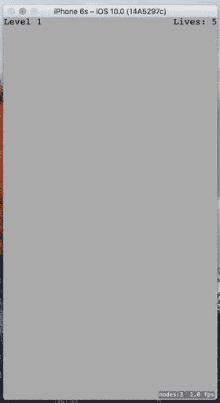

图 17-4.

我们的游戏目前还没有多少趣味性，但至少它拥有高帧率。提示

场景右下角的节点计数和帧率对于调试很有用，但你不会希望在发布游戏时它们还留在那里。你可以通过在 `GameViewController` 的 `viewDidLoad` 方法中将 `SKView` 的 `showsFPS` 和 `showsNodeCount` 属性设置为 `false` 来关闭它们。还有一些其他 `SKView` 属性可以让你获取更多调试信息——有关详细信息，请参阅 API 文档。

### 玩家移动

现在是时候添加一点交互性了。我们将创建一个代表玩家的新类。它将知道如何绘制自身，以及如何通过优美的动画移动到一个新位置。接下来，我们将把这个新类的一个实例插入到场景中，并编写一些代码，让玩家通过触摸屏幕来移动该对象。每个将要成为我们场景一部分的对象都必须继承自 `SKNode`，因此使用 Xcode 的“文件”菜单创建一个名为 `PlayerNode` 的新 Cocoa Touch 类，作为 `SKNode` 的子类。在创建的近乎空的 `PlayerNode.swift` 文件中，导入 `SpriteKit` 框架并添加以下代码：

```
import SpriteKit
class PlayerNode: SKNode {
override init() {
super.init()
name = "Player \(self)"
initNodeGraph()
}
required init?(coder aDecoder: NSCoder) {
super.init(coder: aDecoder)
}
private func initNodeGraph() {
let label = SKLabelNode(fontNamed: "Courier")
label.fontColor = SKColor.darkGray()
label.fontSize = 40
label.text = "v"
label.zRotation = CGFloat(M_PI)
label.name = "label"
self.addChild(label)
}
}
```

我们的 `PlayerNode` 本身不显示任何内容，因为普通的 `SKNode` 无法自行绘制。相反，`init()` 方法设置了一个将执行实际绘制的子节点。这个子节点是 `SKLabelNode` 的另一个实例，就像我们为显示关卡编号和剩余生命数量而创建的那个一样。`SKLabelNode` 是 `SKNode` 的一个子类，它知道如何绘制自身。另一个这样的子类是 `SKSpriteNode`。我们没有为标签设置位置，这意味着其位置是坐标 (0, 0)。就像视图一样，每个 `SKNode` 都存在于一个从其父对象继承而来的坐标系中。将此节点的位置设为零意味着它将出现在屏幕上 `PlayerNode` 实例所在的位置。非零值实际上就是相对于该点的偏移量。

我们还为标签设置了一个旋转值，这样它包含的小写字母 `"v"` 将以倒置的方式显示。旋转属性的名称 `zRotation` 可能看起来有些令人惊讶；然而，它只是指 SpriteKit 所使用的坐标系中的 z 轴。你在屏幕上只能看到 x 轴和 y 轴，但 z 轴对于按显示顺序排列对象以及围绕其旋转非常有用。分配给 `zRotation` 的值需要以弧度为单位，而不是度数，因此我们给其赋值 `M_PI`，这是一个约等于 π 的常量。由于 π 弧度等于 180°，这正是我们所需要的。


## 将玩家角色添加到场景中

现在切换回 `GameScene.swift`。这里，我们要向场景中添加一个 `PlayerNode` 实例。首先添加一个属性来表示玩家节点：

```
private let playerNode: PlayerNode = PlayerNode()
```

接着，在 `init(size:levelNumber:)` 方法的末尾添加以下加粗代码：

```
level.position = CGPoint(x: 0, y: frame.height)
addChild(level)
playerNode.position = CGPoint(x: frame.midX,
y: frame.height * 0.1)
addChild(playerNode)
```

如果你现在构建并运行应用，应该会看到玩家角色出现在屏幕底部中间附近，如图 17-5 所示。

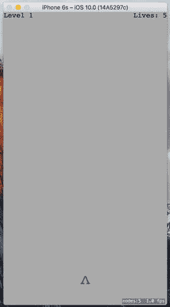

图 17-5. 添加了一个倒 V 形作为我们的玩家角色

## 处理触摸：玩家移动

接下来，我们要向 `touchesBegan(_:withEvent:)` 方法中重新加入一些逻辑，这个方法之前我们几乎留空了。在 `GameScene.swift` 中插入如下所示的加粗代码行（添加此代码时会出现编译器错误，我们稍后会修复）：

```
override func touchesBegan(_ touches: Set, with event: UIEvent?) {
/* 当触摸开始时调用 */
for touch in touches {
let location = touch.location(in: self)
if location.y < frame.height * 0.2 {
let target = CGPoint(x: location.x, y: playerNode.position.y)
playerNode.moveToward(target)
}
}
}
```

上述代码段将屏幕底部五分之一区域内的任意触摸位置，作为玩家节点移动目标位置的依据，并指示玩家节点向该位置移动。编译器会报错，因为我们还没有定义玩家节点的 `moveToward()` 方法。所以，切换到 `PlayerNode.swift` 并添加该方法的实现：

```
func moveToward(_ location: CGPoint) {
removeAction(forKey: "movement")
let distance = pointDistance(position, location)
let screenWidth = UIScreen.main.bounds.size.width
let duration = TimeInterval(2 * distance/screenWidth)
run(SKAction.move(to: location, duration: duration),
withKey:"movement")
}
```

我们先跳过第一行，稍后再回来解释。这个方法比较新位置与当前位置，计算出距离和要移动的像素数量。接着，它利用一个数值常量来确定整体移动的速度，从而计算出移动所需的时间。最后，它创建一个 `SKAction` 来执行移动操作。`SKAction` 是 SpriteKit 的一部分，能够随时间对节点进行更改，让你轻松地让节点的位置、大小、旋转、透明度等属性产生动画效果。在此例中，我们创建了一个在特定时长内执行简单移动动画的动作，然后通过键 `"movement"` 将该动作分配给玩家节点。如你所见，这个键与该方法第一行中用于移除动作的键相同。我们通过移除任何已有相同键的动作来开始该方法，这样用户就能快速连续点击多个位置，而不会产生大量试图以不同方式移动的冲突动作。

## 几何计算

现在你会注意到，我们引入了另一个问题，因为 Xcode 找不到名为 `pointDistance()` 的函数。这是我们的应用将用于执行点、向量和浮点数计算的几个简单几何函数之一。现在就来实现它。使用 Xcode 创建一个名为 `Geometry.swift` 的新 Swift 文件，并添加以下内容：

```
import UIKit
// 接收一个 CGVector 和一个 CGFloat。
// 返回一个新的 CGFloat，其中 v 的每个分量都乘以了 m。
func vectorMultiply(_ v: CGVector, _ m: CGFloat) -> CGVector {
return CGVector(dx: v.dx * m, dy: v.dy * m)
}
// 接收两个 CGPoint。
// 返回表示从 p1 到 p2 方向的 CGVector。
func vectorBetweenPoints(_ p1: CGPoint, _ p2: CGPoint) -> CGVector {
return CGVector(dx: p2.x - p1.x, dy: p2.y - p1.y)
}
// 接收一个 CGVector。
// 返回一个包含向量长度的 CGFloat，使用勾股定理计算。
func vectorLength(_ v: CGVector) -> CGFloat {
return CGFloat(sqrtf(powf(Float(v.dx), 2) + powf(Float(v.dy), 2)))
}
// 接收两个 CGPoint。返回它们之间的距离（CGFloat），使用勾股定理计算。
func pointDistance(_ p1: CGPoint, _ p2: CGPoint) -> CGFloat {
return CGFloat(
sqrtf(powf(Float(p2.x - p1.x), 2) + powf(Float(p2.y - p1.y), 2)))
}
```

这些是一些在众多游戏中常用的基本操作的简单实现：向量乘法、创建从一个点指向另一个点的向量，以及计算距离。现在构建并运行应用。当玩家的“飞船”出现后，点击屏幕底部任意位置，你会看到飞船向左或向右滑动到你点击的点。你可以在飞船到达目标之前再次点击，它会立即开始新的动画，移向新的位置。这很好，但如果玩家的飞船在运动时能更活泼一点，岂不是更好？

## 让飞船摇摆起来

让我们通过添加另一个动画，让飞船在移动时产生一点摇摆。在 `PlayerNode` 的 `moveToward:` 方法中添加加粗代码行：

```
func moveToward(_ location: CGPoint) {
removeAction(forKey: "movement")
removeAction(forKey: "wobbling")
let distance = pointDistance(position, location)
let screenWidth = UIScreen.main.bounds.size.width
let duration = TimeInterval(2 * distance/screenWidth)
run(SKAction.move(to: location, duration: duration),
withKey:"movement")
let wobbleTime = 0.3
let halfWobbleTime = wobbleTime/2
let wobbling = SKAction.sequence([
SKAction.scaleX(to: 0.2, duration: halfWobbleTime),
SKAction.scaleX(to: 1.0, duration: halfWobbleTime)
])
let wobbleCount = Int(duration/wobbleTime)
run(SKAction.repeat(wobbling, count: wobbleCount),
withKey:"wobbling")
}
```

我们刚才所做的与之前创建的移动动画类似，但在一些重要方面有所不同。对于基本移动，我们简单地计算了移动持续时间，然后一步到位地创建并运行了一个移动动作。这次则稍微复杂一些。首先，我们定义了一次“摇摆”的时间（飞船在移动过程中可能会摇摆多次，但整个过程中的摇摆频率保持一致）。摇摆本身包括首先将飞船沿 x 轴（即其宽度）缩放至正常大小的 2/10，然后再缩放回完整大小。每个步骤都是一个单独的动作，它们被打包在一起，构成另一种称为序列的动作，该动作会依次执行其中包含的所有动作。接下来，我们计算出在飞船移动的持续时间内，这个摇摆可以发生多少次，并将 `wobbling` 序列包裹在重复动作中，告诉它应该执行多少个完整的摇摆周期。并且，和之前一样，我们通过取消任何先前的摇摆动作来开始该方法，因为我们不希望出现冲突的摇摆动画。

现在运行应用。你会看到飞船在来回移动时愉快地摇摆着。看起来有点像在走路。


### 创建你的敌人

目前进展顺利，但这款游戏需要一些敌人让玩家射击。使用 Xcode 创建一个名为 `EnemyNode` 的新 Cocoa Touch 类，并将 `SKNode` 作为父类。我们暂时不会赋予敌人任何实际行为，但会为其添加外观。我们将使用与玩家相同的技术，用文字构建敌人的身体。显然，没有比字母 X 更具威慑力的字符了，所以我们的敌人将是一个由小写字母 x 组成的字母 X。请将以下代码添加到 `EnemyNode.swift` 中：

```
import SpriteKit
class EnemyNode: SKNode {
    override init() {
        super.init()
        name = "Enemy \(self)"
        initNodeGraph()
    }
    
    required init?(coder aDecoder: NSCoder) {
        super.init(coder: aDecoder)
    }
    
    private func initNodeGraph() {
        let topRow = SKLabelNode(fontNamed: "Courier-Bold")
        topRow.fontColor = SKColor.brown()
        topRow.fontSize = 20
        topRow.text = "x x"
        topRow.position = CGPoint(x: 0, y: 15)
        addChild(topRow)
        
        let middleRow = SKLabelNode(fontNamed: "Courier-Bold")
        middleRow.fontColor = SKColor.brown()
        middleRow.fontSize = 20
        middleRow.text = "x"
        addChild(middleRow)
        
        let bottomRow = SKLabelNode(fontNamed: "Courier-Bold")
        bottomRow.fontColor = SKColor.brown()
        bottomRow.fontSize = 20
        bottomRow.text = "x x"
        bottomRow.position = CGPoint(x: 0, y: -15)
        addChild(bottomRow)
    }
}
```

这里没有太多新内容；我们只是通过调整每个文字行位置的 y 值来添加多个“行”的文本。

### 将敌人放入场景

现在，让我们通过修改 `GameScene.swift` 使一些敌人在场景中出现。首先，添加一个新属性来保存将加入当前关卡的敌人：

```
private let enemies = SKNode()
```

你可能认为我们会使用 `Array<SKNode>` 来实现，但实际上直接用普通的 `SKNode` 就非常适合。`SKNode` 可以容纳任意数量的子节点。而且由于我们需要将所有敌人添加到场景中，不如将它们全部存放在一个 `SKNode` 中以便访问。下一步是添加 `spawnEnemies()` 方法，如下所示：

```
private func spawnEnemies() {
    let count = Int(log(Float(levelNumber))) + levelNumber
    for _ in 0..<count {
        let enemy = EnemyNode()
        let size = frame.size;
        let x = arc4random_uniform(UInt32(size.width * 0.8))
            + UInt32(size.width * 0.1)
        let y = arc4random_uniform(UInt32(size.height * 0.5))
            + UInt32(size.height * 0.5)
        enemy.position = CGPoint(x: CGFloat(x), y: CGFloat(y))
        enemies.addChild(enemy)
    }
}
```

在 `init(size:levelNumber:)` 方法的末尾附近添加以下几行，将 `enemies` 节点添加到场景中，然后调用 `spawnEnemies` 方法：

```
addChild(playerNode)
addChild(enemies)
spawnEnemies()
```

由于我们将 `enemies` 节点添加到了场景中，任何添加到 `enemies` 节点的子敌人节点也会出现在场景中。注意，我们使用了 `arc4random_uniform()` 函数来获取敌人节点的 `x` 和 `y` 坐标的随机值。如果在使用随机数生成器之前先对其进行“搅动”，就能获得更不可预测的随机数。为此，打开 `AppDelegate.swift`，并在 `application(_:didFinishLaunchingWithOptions:)` 方法中添加以下加粗的行：

```
func application(application: UIApplication,
    didFinishLaunchingWithOptions launchOptions: [NSObject: AnyObject]?) -> Bool {
    // Override point for customization after application launch.
    arc4random_stir()
    return true
}
```

现在构建并运行应用。你会看到一个可怕的敌人随机出现在屏幕的上半部分，如图 17-6 所示。你是否希望自己能开枪射击它？

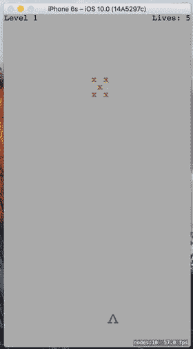

图 17-6. 我相信你也会同意，这个由 X 组成的 X 实在是太该被射击了

### 开始射击

是时候实现游戏开发的下一步逻辑了：让玩家攻击敌人。我们希望玩家能够点击屏幕上方 80% 的任意位置，向敌人发射子弹。我们将使用 SpriteKit 自带的物理引擎来移动玩家的子弹，并检测子弹与敌人何时发生碰撞。

但首先，我们所说的物理引擎究竟是什么？简单来说，物理引擎是一个软件组件，它跟踪世界中多个物理对象（通常称为物理实体）及其所受到的作用力。它还能确保所有物体的运动方式符合现实物理规律。它可以考虑重力的影响、处理物体之间的碰撞（防止物体同时占据同一空间），甚至可以模拟摩擦力和弹性等物理特性。重要的是要理解，物理引擎通常与图形引擎是分开的。Apple 提供了便捷的 API 让我们同时使用这两者，但它们在本质上是独立的。常见的做法是，显示中的某些对象（例如显示当前关卡编号和剩余生命值的标签）完全独立于物理引擎。同时，也可以创建具有物理实体但完全不显示任何内容的对象。

#### 定义物理类别

SpriteKit 物理引擎允许我们做的事情之一，就是将对象分配到几个不同的物理类别中。物理类别是一种对相关对象进行分组的方式，以便物理引擎能以不同方式处理它们之间的碰撞。例如，在这个游戏中，我们将创建三个类别：一个用于敌人，一个用于玩家，一个用于玩家发射的导弹。我们当然希望物理引擎关注敌人与玩家导弹之间的碰撞，但可能希望它忽略玩家导弹与玩家自身之间的碰撞。使用物理类别可以轻松实现这一点。那么，让我们来创建所需的类别。按下 ⌘N 调出新建文件助手，在 iOS 来源部分选择 Swift 文件，然后点击下一步。将新文件命名为 `PhysicsCategories.swift` 并保存，然后将以下代码添加到其中：

```
import Foundation
let PlayerCategory: UInt32 = 1 << 1
let EnemyCategory: UInt32 = 1 << 2
let PlayerMissileCategory: UInt32 = 1 << 3
```

这里我们声明了三个类别常量。注意，这些类别以位掩码形式工作，因此每个类别都必须是 2 的幂。通过位移运算，我们可以轻松实现这一点。将它们设置为位掩码是为了简化物理引擎的 API。使用位掩码，我们可以通过逻辑“或”操作将多个值组合在一起。这使得我们可以通过一次 API 调用来告诉物理引擎如何处理多对不同节点之间的碰撞。我们很快就能看到实际效果。


#### 创建 `BulletNode` 类

打好基础之后，我们来创建一些子弹，这样就可以开始射击了。新建一个名为 `BulletNode` 的 Cocoa Touch 类，同样以 `SKNode` 作为其父类。首先导入 SpriteKit 框架，并添加一个属性来保存子弹的推力向量：

```swift
import SpriteKit
class BulletNode: SKNode {
var thrust: CGVector = CGVector(dx: 0, dy: 0)
}
```

接下来，我们实现 `init()` 方法。与本应用中其他 `init()` 方法一样，这里我们将为子弹创建对象图。它由一个单独的点组成。同时，我们通过创建并配置一个 `SKPhysicsBody` 实例并将其附着到 `self` 上，来为这个类配置物理属性。在这个过程中，我们告诉这个新 body 它属于哪个类别，以及应该检查哪些类别与这个对象的碰撞：

```swift
override init() {
super.init()
let dot = SKLabelNode(fontNamed: "Courier")
dot.fontColor = SKColor.black()
dot.fontSize = 40
dot.text = "."
addChild(dot)

let body = SKPhysicsBody(circleOfRadius: 1)
body.isDynamic = true
body.categoryBitMask = PlayerMissileCategory
body.contactTestBitMask = EnemyCategory
body.collisionBitMask = EnemyCategory
body.fieldBitMask = GravityFieldCategory
body.mass = 0.01

physicsBody = body
name = "Bullet \(self)"
}
```

我们还要添加 `init(coder aDecoder:)` 和 `encode(with aCoder:)` 方法：

```swift
required init?(coder aDecoder: NSCoder) {
super.init(coder: aDecoder)
let dx = aDecoder.decodeFloat(forKey: "thrustX")
let dy = aDecoder.decodeFloat(forKey: "thrustY")
thrust = CGVector(dx: CGFloat(dx), dy: CGFloat(dy))
}

override func encode(with aCoder: NSCoder) {
super.encode(with: aCoder)
aCoder.encode(Float(thrust.dx), forKey: "thrustX")
aCoder.encode(Float(thrust.dy), forKey: "thrustY")
}
```

#### 应用物理效果

接下来，我们添加工厂方法，该方法创建一颗新子弹并赋予它一个推力向量，物理引擎将使用该向量将子弹推向目标：

```swift
class func bullet(from start: CGPoint, toward destination: CGPoint) -> BulletNode {
let bullet = BulletNode()
bullet.position = start

let movement = vectorBetweenPoints(start, destination)
let magnitude = vectorLength(movement)
let scaledMovement = vectorMultiply(movement, 1/magnitude)

let thrustMagnitude = CGFloat(100.0)
bullet.thrust = vectorMultiply(scaledMovement, thrustMagnitude)

bullet.run(SKAction.playSoundFileNamed("shoot.wav",
waitForCompletion: false))
return bullet
}
```

基本的计算相当简单。我们首先确定一个从起点位置指向目标位置的 `movement` 向量，然后确定它的 `magnitude`（长度）。将 `movement` 向量除以其 `magnitude` 会得到一个归一化的单位向量，这个向量指向与原始向量相同的方向，但长度恰好为一个单位（在这里的一个单位相当于屏幕上的一个“点”——例如，在 Retina 设备上是两个像素，在旧设备上是一个像素）。创建单位向量非常有用，因为我们可以将其乘以一个固定大小（此处为 100），从而确定一个均匀的强力推力向量，无论用户在屏幕上点击的位置有多远。

我们需要添加到此类的最后一段代码是以下方法，它将推力应用到物理体上。我们将在场景中每帧调用一次：

```swift
func applyRecurringForce() {
physicsBody!.applyForce(thrust)
}
```

#### 在场景中添加子弹

现在切换到 `GameScene.swift`，将子弹添加到场景本身中。首先，添加另一个属性，将所有子弹包含在一个 `SKNode` 中，就像之前为敌人所做的那样：

```swift
private let playerBullets = SKNode()
```

找到 `init(size:levelNumber:)` 方法中之前添加敌人的部分。那里也是设置 `playerBullets` 节点的位置。

```swift
addChild(enemies)
spawnEnemies()
addChild(playerBullets)
}
```

现在我们可以编写实际的导弹发射代码了。在 `touchesBegan(_:withEvent:)` 方法中添加这个 `else` 子句，这样屏幕上半部分的所有点击都会发射子弹，而不是移动飞船：

```swift
} else {
let bullet = BulletNode.bullet(from: playerNode.position, toward: location)
playerBullets.addChild(bullet)
}
```

这样就添加了子弹，但除非我们通过每帧施加推力来告诉它们移动，否则我们添加的子弹都不会真正移动。我们的场景中已经包含一个名为 `update()` 的空方法，它是作为项目模板的一部分添加的。如果 `update()` 方法不存在，请按如下所示添加。SpriteKit 每帧都会调用此方法，它是处理每帧所需游戏逻辑的理想位置。然而，我们并没有直接在该方法中更新所有子弹，而是将代码放在一个单独的方法中，然后从 `update()` 方法中调用它：

```swift
override func update(_ currentTime: TimeInterval) {
/* 在每帧渲染前调用 */
updateBullets()
}

private func updateBullets() {
var bulletsToRemove:[BulletNode] = []

for bullet in playerBullets.children as! [BulletNode] {
// 移除任何移出屏幕的子弹
if !frame.contains(bullet.position) {
// 标记子弹以待移除
bulletsToRemove.append(bullet)
continue
}
// 对剩余子弹施加推力
bullet.applyRecurringForce()
}
playerBullets.removeChildren(in: bulletsToRemove)
}
```

在告诉每颗子弹施加其持续力之前，我们还会检查它是否仍在屏幕上。任何离开屏幕的子弹都会被放入一个临时数组中；随后，这些子弹会从 `playerBullets` 节点中被清除。请注意，这个两步过程是必要的，因为此方法中运行的 `for` 循环正在遍历 `playerBullets` 节点中的所有子节点。在遍历集合的同时对其进行修改绝不是一个好主意，这很容易导致崩溃。

现在构建并运行应用程序。你会看到，除了移动玩家的飞船，你还可以通过点击屏幕使其向上发射导弹（见图 17-7）。

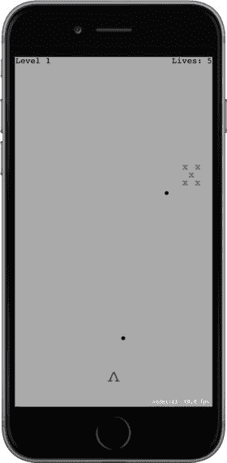

图 17-7. 发射子弹


### 利用物理引擎攻击敌人

我们的游戏仍缺少几个重要的游戏机制：敌人从未攻击我们，我们也无法通过射击消灭敌人。现在就来解决后者。我们要设计这样一个机制：射击敌人时，会将其从屏幕上的固定位置击飞。这一功能将主要借助物理引擎实现，并需要对`PlayerNode`、`EnemyNode`和`GameScene`进行修改。

首先，为尚未添加物理体的节点添加物理体。从`EnemyNode.swift`开始，在`init()`方法中添加以下代码行：

```
initPhysicsBody()
```

现在添加实际设置物理体的代码。这与之前为`PlayerBullet`类编写的代码非常相似：

```
private func initPhysicsBody() {
let body = SKPhysicsBody(rectangleOf: CGSize(width: 40, height: 40))
body.affectedByGravity = false
body.categoryBitMask = EnemyCategory
body.contactTestBitMask = PlayerCategory | EnemyCategory
body.mass = 0.2
body.angularDamping = 0
body.linearDamping = 0
body.fieldBitMask = 0
physicsBody = body
}
```

然后选择`PlayerNode.swift`，在该文件中也执行类似的操作。首先，在`init()`方法中添加以下代码行：

```
initPhysicsBody()
```

最后，添加新的`initPhysicsBody()`方法：

```
private func initPhysicsBody() {
let body = SKPhysicsBody(rectangleOf: CGSize(width: 20, height: 20))
body.affectedByGravity = false
body.categoryBitMask = PlayerCategory
body.contactTestBitMask = EnemyCategory
body.collisionBitMask = 0
body.fieldBitMask = 0
physicsBody = body
}
```

至此，你可以运行应用，发现子弹现在能够将敌人击飞至太空中。但你会发现这里存在一个问题：当游戏开始后，你将孤零零的敌人击飞到太空中，游戏就会陷入僵局。因此，现在是为游戏添加关卡管理功能的好时机。

### 完成关卡

首先，在`GameScene.swift`中添加`updateEnemies()`方法。它的工作原理与之前添加的`updateBullets()`方法非常相似：

```
private func updateEnemies() {
var enemiesToRemove:[EnemyNode] = []
for node in enemies.children as! [EnemyNode] {
if !frame.contains(node.position) {
// 标记需要移除的敌人
enemiesToRemove.append(node)
}
}
enemies.removeChildren(in: enemiesToRemove)
}
```

这段代码负责在敌人离开屏幕时，将其从关卡的`enemies`数组中移除。接下来修改`update()`方法，让它调用`updateEnemies()`以及一个尚未实现的新方法：

```
override func update(currentTime: CFTimeInterval) {
if finished {
return
}
updateBullets()
updateEnemies()
checkForNextLevel()
}
```

我们在该方法开始时检查了`finished`属性。由于即将添加能够正式结束关卡的代码，我们需要确保在关卡完成后不再继续执行后续处理。然后，就像每帧检查是否有子弹或敌人离开屏幕一样，我们将在每帧调用`checkForNextLevel()`来检查当前关卡是否完成。接下来添加这个方法：

```
private func checkForNextLevel() {
if enemies.children.isEmpty {
goToNextLevel()
}
}
```

#### 过渡到下一关

`checkForNextLevel()`方法接着调用另一个尚未实现的方法。`goToNextLevel()`方法将当前关卡标记为已完成，在屏幕上显示一些文本告知玩家，然后启动下一关：

```
private func goToNextLevel() {
finished = true
let label = SKLabelNode(fontNamed: "Courier")
label.text = "Level Complete!"
label.fontColor = SKColor.blue()
label.fontSize = 32
label.position = CGPoint(x: frame.size.width * 0.5,
y: frame.size.height * 0.5)
addChild(label)
let nextLevel = GameScene(size: frame.size, levelNumber: levelNumber + 1)
nextLevel.playerLives = playerLives
view!.presentScene(nextLevel, transition:
SKTransition.flipHorizontal(withDuration: 1.0))
}
```

`goToNextLevel()`方法的后半部分会创建一个新的`GameScene`实例，并为其提供所需的所有初始值。然后，它告诉视图呈现新的场景，并使用过渡动画使切换更平滑。`SKTransition`类让我们可以从多种过渡样式中选择。运行应用并完成一个关卡，即可看到如图 17-8 所示的效果。

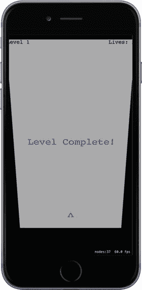

图 17-8. 关卡结束时的屏幕翻转过渡效果

这里使用的过渡效果看起来就像是在水平翻转一张卡片，但还有许多其他过渡效果可供选择。有关更多可能性，请参阅`SKTransition`的文档。


## 自定义碰撞效果

现在我们有了一个真正可玩的游戏。你可以通过将敌人向上击飞出屏幕来一关接一关地通关。这还不错，但确实没什么挑战性。我之前提到过，让敌人攻击玩家是缺失的游戏玩法之一，现在是时候实现它了。我们要让事情变得稍微困难一些：当敌人被撞到（无论是被子弹击中还是被其他敌人碰到）时会向下坠落。同时，我们希望被下落的敌人击中会扣除玩家一条命。你可能还注意到，子弹击中敌人后会蜿蜒绕过敌人并继续向上飞行，这看起来相当怪异。我们将通过在 `GameScene.swift` 中实现碰撞处理方法来解决所有这些问题。

处理已检测碰撞的方法是 `SKPhysicsWorld` 类的一个委托方法。我们的场景默认拥有一个物理世界，但我们需要对其进行一些设置，它才会向我们报告任何信息。首先，最好让编译器知道我们将要实现一个委托协议，因此我们在 `GameScene` 类中添加如下声明：

```
class GameScene: SKScene, SKPhysicsContactDelegate {
```

我们还需要对物理世界进行一些配置（将重力设置得稍微温和一些），并告诉它谁是它的委托对象。为此，在 `init(size:levelNumber:)` 方法的末尾添加以下粗体行：

```
physicsWorld.gravity = CGVector(dx: 0, dy: -1)
physicsWorld.contactDelegate = self
```

现在，我们已经将物理世界的 `contactDelegate` 设置为 `GameScene`，接下来可以实现相关的委托方法了。该方法的核心里程碑如下所示：

```
func didBegin(_ contact: SKPhysicsContact) {
    if contact.bodyA.categoryBitMask == contact.bodyB.categoryBitMask {
        // 两个物体属于同一类别
        let nodeA = contact.bodyA.node!
        let nodeB = contact.bodyB.node!
        // 我们该如何处理这些节点？
    } else {
        var attacker: SKNode
        var attackee: SKNode
        if contact.bodyA.categoryBitMask > contact.bodyB.categoryBitMask {
            // 物体 A 正在攻击物体 B
            attacker = contact.bodyA.node!
            attackee = contact.bodyB.node!
        } else {
            // 物体 B 正在攻击物体 A
            attacker = contact.bodyB.node!
            attackee = contact.bodyA.node!
        }
        if attackee is PlayerNode {
            playerLives -= 1
        }
        // 我们该如何处理攻击者和被攻击者？
    }
}
```

请继续添加这个方法，但如果你现在查看它，会发现它并没有做太多实际工作。事实上，该方法唯一具体的成果是，每当一个下落的敌人击中玩家的飞船时，减少玩家的生命数。但敌人还没有开始下落。

这个实现背后的思路是：查看两个碰撞的物体，判断它们是属于同一类别（这种情况下，它们彼此是“友军”）还是属于不同类别。如果属于不同类别，我们必须确定谁在攻击谁。如果你查看 `PhysicsCategories.swift` 中声明的类别顺序，会发现它们按照“攻击性”递增的顺序排列：`Player` 节点可以被 `Enemy` 节点攻击，而 `Enemy` 节点又可以被具有 `PlayerMissile` 类别的节点（即 `BulletNode`）攻击。这意味着我们可以使用简单的大于比较来判断谁是这个场景中的“攻击者”。

为了简单和模块化，我们并不希望场景来决定每个物体应该如何应对被敌人攻击或被其他物体碰撞。更好的做法是将这些细节构建到受影响的节点类本身中。但是，正如你在这个方法中看到的，我们唯一确定的是每一方都有一个 `SKNode` 实例。与其编写一大串 `if`-`else` 语句来询问每个节点属于哪个 `SKNode` 子类，我们可以使用常规的多态性，让每个节点类以自己的方式处理问题。为了使其正常工作，我们必须在 `SKNode` 上添加一些方法，这些方法具有默认实现（不执行任何操作），并让我们的子类在适当的地方重写它们。这就需要用到类扩展。

### 为 `SKNode` 添加类扩展

要为 `SKNode` 添加扩展，请右键单击 Xcode 项目导航器中的 TextShooter 文件夹，然后从弹出菜单中选择新建文件…。在助手中的 iOS 源代码部分，选择 Swift 文件，然后点击下一步。将文件命名为 `SKNode+Extra.swift`，然后点击创建。在编辑器中打开该文件并添加如下代码：

```
import SpriteKit
extension SKNode {
    func receiveAttacker(_ attacker: SKNode, contact: SKPhysicsContact) {
        // 默认实现不执行任何操作
    }
    func friendlyBumpFrom(_ node: SKNode) {
        // 默认实现不执行任何操作
    }
}
```

现在回到 `GameScene.swift`，完成它在碰撞处理中的部分。回到 `didBegin(_ contact: )` 方法，添加实际执行工作的部分：

```
func didBegin(_ contact: SKPhysicsContact) {
    if contact.bodyA.categoryBitMask == contact.bodyB.categoryBitMask {
        // 两个物体属于同一类别
        let nodeA = contact.bodyA.node!
        let nodeB = contact.bodyB.node!
        // 我们该如何处理这些节点？
        nodeA.friendlyBumpFrom(nodeB)
        nodeB.friendlyBumpFrom(nodeA)
    } else {
        var attacker: SKNode
        var attackee: SKNode
        if contact.bodyA.categoryBitMask > contact.bodyB.categoryBitMask {
            // 物体 A 正在攻击物体 B
            attacker = contact.bodyA.node!
            attackee = contact.bodyB.node!
        } else {
            // 物体 B 正在攻击物体 A
            attacker = contact.bodyB.node!
            attackee = contact.bodyA.node!
        }
        if attackee is PlayerNode {
            playerLives -= 1
        }
        // 我们该如何处理攻击者和被攻击者？
        attackee.receiveAttacker(attacker, contact: contact)
        playerBullets.removeChildren(in: [attacker])
        enemies.removeChildren(in: [attacker])
    }
}
```

我们在这里只添加了几行对新方法的调用。如果碰撞是“友军误伤”，比如两个敌人互相碰撞，我们会告诉每个敌人它受到了另一个敌人的友好碰撞。否则，在确定谁攻击了谁之后，我们告诉被攻击者它受到了另一个物体的攻击。最后，我们将攻击者从 `playerBullets` 节点和 `enemies` 节点中移除。我们告诉每个节点移除攻击者，尽管它只可能存在于其中之一，但这没关系。告诉一个节点移除它没有的子节点并不是错误——它只是没有任何效果。

### 为敌人添加自定义碰撞行为

现在所有设置都已就绪，我们可以通过重写我们为 `SKNode` 添加的扩展方法，为节点实现一些具体的行为。选择 `EnemyNode.swift` 并添加以下两个重写方法：

```
override func friendlyBumpFrom(_ node: SKNode) {
    physicsBody!.affectedByGravity = true
}
override func receiveAttacker(_ attacker: SKNode, contact: SKPhysicsContact) {
    physicsBody!.affectedByGravity = true
    let force = vectorMultiply(attacker.physicsBody!.velocity, contact.collisionImpulse)
    let myContact = scene!.convert(contact.contactPoint, to: self)
    physicsBody!.applyForce(force, at: myContact)
}
```

其中第一个方法 `friendlyBumpFrom()` 仅仅为受影响的敌人启用了重力。因此，如果一个敌人在运动中撞到了另一个敌人，第二个敌人会突然受到重力影响并开始向下坠落。

第二个方法 `receiveAttacker(_:contact:)` 在敌人被子弹击中时被调用。它首先为敌人启用重力。此外，它还利用传入的碰撞数据来确定碰撞发生的位置，并对该点施加一个力，从而在子弹发射的方向上给敌人一个额外的推力。


#### 显示玩家生命值

再次运行游戏。你会发现可以射击敌人将其击倒。同时也会看到，任何被倒下的敌人撞到的其他敌人也会跟着倒下。

> **注意**
>
> 在每个关卡开始时，游戏世界会执行一步物理模拟，以确保没有物理体重叠。这在更高关卡中会产生一个有趣的副作用，因为随机放置的多个敌人重叠的概率会逐渐增加。一旦发生重叠，敌人会被立即移开以消除重叠，此时我们的碰撞处理代码会被触发，进而开启重力让它们坠落！这种表现并非我们最初设计游戏时有意为之，但它意外地让更高难度关卡逐渐变得更具挑战性，因此我们决定顺其自然。

如果玩家被坠落的敌人击中，生命值会减少，但……等等，它始终显示为 5！生命值显示仅在关卡创建时设置，之后从未更新。幸运的是，我们可以通过在`GameScene.swift`中为`playerLives`属性添加属性观察器来轻松修复，如下所示：

```swift
private var playerLives: Int {
didSet {
let lives = childNode(withName: "LivesLabel") as! SKLabelNode
lives.text = "Lives: \(playerLives)"
}
}
```

上述代码使用我们之前在`init(size:levelNumber:)`方法中为标签指定的名称来查找该标签并设置新的文本值。再次运行游戏，你会发现当敌人不断砸向玩家时，生命值会逐渐减少至零。但游戏并未结束。经过多次被击中后，生命值会变为负数，如图 17-9 所示。

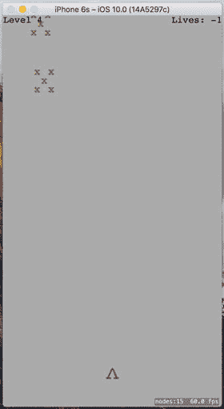
**图 17-9.** 由于没有游戏结束机制，生命值最终会变为负数

出现这个问题的原因是我们还没有编写任何检测游戏结束的代码，即在玩家生命值归零时触发的逻辑。我们很快就会实现这一点，但首先让我们让屏幕上的碰撞效果更刺激一些。

### 用粒子效果增添趣味

SpriteKit 的一大特色是内置了粒子系统。粒子系统在游戏中用于创建模拟烟雾、火焰、爆炸等视觉效果。目前，当我们的子弹击中敌人或敌人撞到玩家时，攻击对象只是简单地消失。让我们创建几个粒子系统来改善这一情况。

首先，按`⌘N`调出新建文件助手。在左侧选择 iOS 资源部分，然后在右侧选择 SpriteKit 粒子文件。点击下一步，在接下来的屏幕中选择`SparkKit`粒子模板。再次点击下一步，将该文件命名为`MissileExplosion.sks`。

#### 你的第一个粒子效果

你会看到 Xcode 创建了粒子文件，并同时向项目中添加了一个名为`spark.png`的新资源。与此同时，整个 Xcode 编辑区域会切换到新的粒子文件，并显示一个巨大的、带有动画效果的爆炸效果。我们不希望子弹击中敌人时出现如此夸张巨大的效果，因此需要重新配置它。定义该粒子动画的所有属性都可以在 SKNode 检查器中找到，按`Opt-Cmd-7`即可打开。图 17-10 展示了巨大的爆炸效果及其检查器。

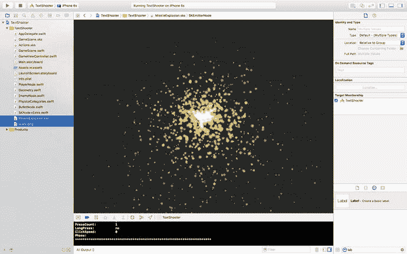
**图 17-10.** 右侧显示的参数定义了默认粒子的外观

现在，针对子弹命中效果，我们将其设置为更小的爆炸。它将使用一套完全不同的参数，所有参数都可以在检查器中配置。首先，点击底部颜色渐变中的小色块并将其设置为黑色，以匹配游戏画面颜色。然后，将背景色改为白色，并将混合模式改为 Alpha。这时你会看到火焰喷泉变成了墨黑色。其余参数均为数值型。逐一修改它们，按照图 17-11 所示进行设置。在每一步调整中，你都会看到粒子效果随之变化，直到最终达到目标外观。

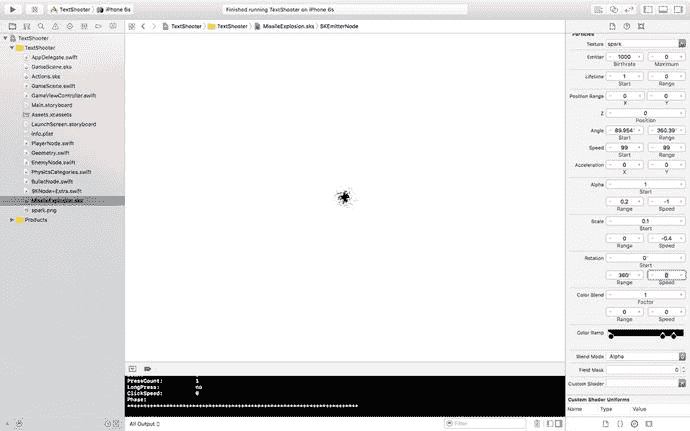
**图 17-11.** 这是我们想要的最终导弹爆炸粒子效果

现在创建另一个粒子系统，同样使用 Spark 模板。将其命名为`EnemyExplosion.sks`，并按照图 17-12 所示设置参数。

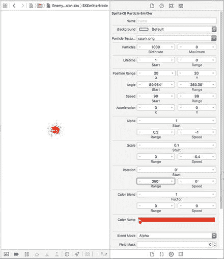
**图 17-12.** 这是我们要创建的敌人爆炸效果。若你看到的本书是黑白版本，底部颜色渐变中选择的颜色是深红色

### 在场景中添加粒子效果

现在让我们开始使用这些粒子。切换到`EnemyNode.swift`，并在`receiveAttacker(_:contact:)`方法底部添加如下粗体显示的代码：

```swift
override func receiveAttacker(_ attacker: SKNode, contact: SKPhysicsContact) {
physicsBody!.affectedByGravity = true
let force = vectorMultiply(attacker.physicsBody!.velocity,
contact.collisionImpulse)
let myContact =
scene!.convert(contact.contactPoint, to: self)
physicsBody!.applyForce(force, at: myContact)
let path = Bundle.main.path(forResource: "MissileExplosion",
ofType: "sks")
let explosion = NSKeyedUnarchiver.unarchiveObject(withFile: path!)
as! SKEmitterNode
explosion.numParticlesToEmit = 20
explosion.position = contact.contactPoint
scene!.addChild(explosion)
}
```

运行游戏并射击一些敌人。你会看到每颗子弹击中敌人时都会产生漂亮的爆炸效果，如图 17-13 所示。

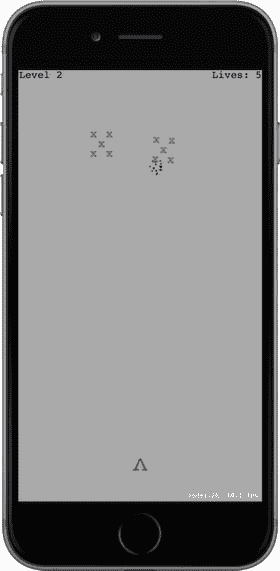
**图 17-13.** 子弹击中后的爆炸效果

现在我们来处理敌人撞上玩家飞船的情况。选择`PlayerNode.swift`并添加以下方法：

```swift
override func receiveAttacker(_ attacker: SKNode, contact: SKPhysicsContact) {
let path = Bundle.main.path (forResource: "EnemyExplosion",
ofType: "sks")
let explosion = NSKeyedUnarchiver.unarchiveObject(withFile: path!)
as! SKEmitterNode
explosion.numParticlesToEmit = 50
explosion.position = contact.contactPoint
scene!.addChild(explosion)
}
```

再次运行游戏。你会发现每次敌人撞到玩家时都会产生红色的爆炸效果，如图 17-14 所示。

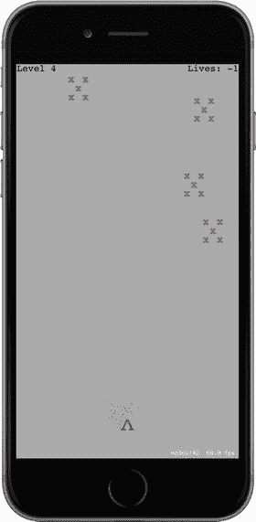
**图 17-14.** 敌机撞击玩家时的爆炸效果

这些修改虽然简单，但显著提升了游戏的手感。现在当物体发生碰撞时，你会看到视觉反馈，并能直观地感受到事件的发生。


### 结束游戏

如前所述，游戏中目前存在一个小问题。当生命值归零时，我们需要结束游戏。我们要做的是创建一个新的场景类，在游戏结束时进行切换。之前你见过我们在从一个关卡切换到下一个关卡时如何进行场景切换。这次类似，但使用了一个新类。因此，创建一个新的 iOS/Cocoa Touch 类。使用 `SKScene` 作为父类，并将新类命名为 `GameOverScene`。我们将从一个非常简单的实现开始，仅显示“游戏结束”文本，不做其他事情。通过将以下代码添加到 `GameOverScene.swift` 中来实现：

```
import SpriteKit
class GameOverScene: SKScene {
    override init(size: CGSize) {
        super.init(size: size)
        backgroundColor = SKColor.purple
        let text = SKLabelNode(fontNamed: "Courier")
        text.text = "Game Over"
        text.fontColor = SKColor.white
        text.fontSize = 50
        text.position = CGPoint(x: frame.size.width/2, y: frame.size.height/2)
        addChild(text)
    }
    required init?(coder aDecoder: NSCoder) {
        super.init(coder: aDecoder)
    }
}
```

现在，切换回 `GameScene.swift`。游戏结束时执行的基本操作由一个名为 `triggerGameOver()` 的新方法定义。这个方法中，我们会显示一个额外的爆炸效果，并触发现创建的另一个场景的切换：

```
private func triggerGameOver() {
    finished = true
    let path = Bundle.main.path(forResource:"EnemyExplosion", ofType: "sks")
    let explosion = NSKeyedUnarchiver.unarchiveObject(withFile: path!) as! SKEmitterNode
    explosion.numParticlesToEmit = 200
    explosion.position = playerNode.position
    scene!.addChild(explosion)
    playerNode.removeFromParent()
    let transition = SKTransition.doorsOpenVertical(withDuration: 1)
    let gameOver = GameOverScene(size: frame.size)
    view!.presentScene(gameOver, transition: transition)
}
```

接下来，创建这个新方法，它将检查游戏是否结束，如果结束则调用 `triggerGameOver()`，并返回 `true` 表示游戏结束，返回 `false` 表示游戏仍在进行：

```
private func checkForGameOver() -> Bool {
    if playerLives == 0 {
        triggerGameOver()
        return true
    }
    return false
}
```

最后，对现有的 `update()` 方法进行如下加粗所示的修改。它检查游戏结束状态，并且仅当游戏仍在进行时，才寻找可能的下一个关卡切换。否则，一个关卡中的最后一个敌人可能会消耗掉玩家的最后一条命，并同时触发两次场景切换。

```
override func update(_ currentTime: TimeInterval) {
    /* Called before each frame is rendered */
    if finished {
        return
    }
    updateBullets()
    updateEnemies()
    if (!checkForGameOver()) {
        checkForNextLevel()
    }
}
```

现在再次运行游戏，让下方的敌人五次损坏你的飞船。你将看到游戏结束画面，如图 17-15 所示。

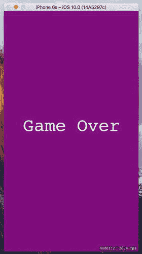

图 17-15. 游戏结束画面

### 创建 StartScene

这就引出了另一个问题：游戏结束后我们能做什么？我们可以允许玩家点击屏幕重新开始游戏；但在考虑这个问题时，我突然想到一个想法：这个游戏难道不应该有一个某种形式的开始画面吗？这样玩家就不会在启动时立刻被扔进游戏中。而且游戏结束画面是否应该带你回到那里呢？当然，这两个问题的答案都是“是”。请继续创建另一个新的 iOS/Cocoa Touch 类，同样使用 `SKScene` 作为父类，这次将其命名为 `StartScene`。我们将制作一个超级简单的开始场景。它所做的全部事情就是显示一些文本，并在用户点击任意位置时开始游戏。将此处显示的所有代码添加到 `StartScene.swift` 中以完成此类：

```
import SpriteKit
class StartScene: SKScene {
    override init(size: CGSize) {
        super.init(size: size)
        backgroundColor = SKColor.green()
        let topLabel = SKLabelNode(fontNamed: "Courier")
        topLabel.text = "TextShooter"
        topLabel.fontColor = SKColor.black()
        topLabel.fontSize = 48
        topLabel.position = CGPoint(x: frame.size.width/2, y: frame.size.height * 0.7)
        addChild(topLabel)
        let bottomLabel = SKLabelNode(fontNamed: "Courier")
        bottomLabel.text = "Touch anywhere to start"
        bottomLabel.fontColor = SKColor.black()
        bottomLabel.fontSize = 20
        bottomLabel.position = CGPoint(x: frame.size.width/2, y: frame.size.height * 0.3)
        addChild(bottomLabel)
    }
    required init?(coder aDecoder: NSCoder) {
        super.init(coder: aDecoder)
    }
    override func touchesBegan(_ touches: Set, with event: UIEvent?) {
        let transition = SKTransition.doorway(withDuration: 1.0)
        let game = GameScene(size:frame.size)
        view!.presentScene(game, transition: transition)
    }
}
```

现在回到 `GameOverScene.swift`，以便让游戏结束场景切换至开始场景。添加以下代码：

```
override func didMove(to view: SKView) {
    DispatchQueue.main.after(
        when: DispatchTime.now() + Double(3 * Int64(NSEC_PER_SEC)) / Double(NSEC_PER_SEC)) {
        let transition = SKTransition.flipVertical(withDuration: 1)
        let start = StartScene(size: self.frame.size)
        view.presentScene(start, transition: transition)
    }
}
```

正如你之前所见，`didMoveToView()` 方法会在任何场景被放置到视图中后被调用。这里，我们简单地触发一个三秒的暂停，然后切换回开始场景。为了让所有场景能够正确地进行相互切换，还差最后一块拼图。我们需要修改应用程序的启动流程，使其不再直接跳入游戏，而是显示开始画面。这让我们回到 `GameViewController.swift`。在 `viewDidLoad()` 方法中，我们只需将创建一个场景类的代码替换为另一个即可：

```
/* Pick a size for the scene */
let scene = GameScene(size: view.frame.size, levelNumber: 1)
// Replace with:
let scene = StartScene(size: view.frame.size)
```

现在试一下。启动应用程序，你将看到开始画面。触摸屏幕，开始游戏，多次阵亡，最终你会来到游戏结束画面。等待几秒钟，你就会回到开始画面，如图 17-16 所示。

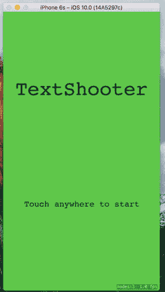

图 17-16. 游戏的开始画面


### 添加音效

我们一直在制作一款电子游戏，而电子游戏以嘈杂著称，但我们的游戏却完全静音。幸运的是，SpriteKit 包含了极为易用的音频播放代码。在本章源代码的 `17 – Sound Effects` 文件夹中，你会发现预先准备好的音频文件：`enemyHit.wav`、`gameOver.wav`、`gameStart.wav`、`playerHit.wav` 和 `shoot.wav`。将它们全部拖到 Xcode 的项目导航器中。

现在，我们来为每种音效实现简单的播放功能。首先打开 `BulletNode.swift`，在 `bullet(from:toward:)` 方法的末尾，`return` 语句之前，添加以下加粗显示的代码：

```
bullet.run(SKAction.playSoundFileNamed("shoot.wav",
waitForCompletion: false))
```

接下来，切换到 `EnemyNode.swift`，在 `receiveAttacker(_:contact:)` 方法的末尾添加以下几行代码：

```
run(SKAction.playSoundFileNamed("enemyHit.wav",
waitForCompletion: false))
```

现在，在 `PlayerNode.swift` 中进行非常类似的操作，在 `receiveAttacker(_:contact:)` 方法的末尾添加：

```
run(SKAction.playSoundFileNamed("playerHit.wav",
waitForCompletion: false))
```

这些游戏内的音效目前已经足够了。现在可以运行游戏试试效果。我们相信你会同意，仅仅添加粒子和音效就能让游戏感觉好得多。

现在，让我们添加一些游戏开始和结束时的效果。在 `StartScene.swift` 中，在 `touchesBegan(_:withEvent:)` 方法的末尾添加以下代码：

```
run(SKAction.playSoundFileNamed("gameStart.wav",
waitForCompletion: false))
```

最后，在 `GameScene.swift` 的 `triggerGameOver()` 方法末尾添加以下几行：

```
run(SKAction.playSoundFileNamed("gameOver.wav",
waitForCompletion: false))
```

### 让游戏更难一点：力场

SpriteKit 最有趣的特性之一是在场景中放置力场的能力。一个力场具有类型、位置、作用区域以及若干其他指定其行为的属性。其理念是，当物体穿过由其 `region` 属性定义的力场影响范围时，该场会扰动物体的运动。你可以使用各种标准力场，只需创建并配置一个实例，然后将其添加到场景中即可。如果你雄心勃勃，甚至可以创建自定义力场。有关标准力场及其行为（包括重力场、电场、磁场和湍流）的列表，请查看 `SKFieldNode` 类的 API 文档。

为了让游戏更有挑战性，我们将添加一些径向重力场到场景中。径向重力场的作用类似于一个集中在一点的大质量物体。当一个物体穿过径向重力场区域时，它会被偏转朝向（或离开，如果你想这样配置）该点，很像一颗足够靠近地球的流星飞过时所受的影响。我们将安排重力场作用于导弹，这样你就无法总是直接瞄准敌人并确保击中它了。让我们开始吧。

首先，我们需要在 `PhysicsCategories.swift` 中添加一个新类别。对该文件进行以下修改：

```
let GravityFieldCategory: UInt32 = 1 << 4
```

如果节点物理体中的 `fieldBitMask` 与力场的 `categoryBitMask` 存在任何共同类别，则该力场会作用于这个节点。默认情况下，物理体的 `fieldBitMask` 设置了所有类别，这意味着它将受到其范围内任何力场的影响。我们不希望玩家或敌人受到重力场的影响，因此需要通过添加以下代码来清除它们的 `fieldBitMask`，在 `EnemyNode.swift` 中：

```
private func initPhysicsBody() {
let body = SKPhysicsBody(rectangleOf: CGSize(width: 40, height: 40))
body.affectedByGravity = false
body.categoryBitMask = EnemyCategory
body.contactTestBitMask = PlayerCategory | EnemyCategory
body.mass = 0.2
body.angularDamping = 0
body.linearDamping = 0
body.fieldBitMask = 0
physicsBody = body
}
```

在 `PlayerNode.swift` 中进行类似的更改：

```
private func initPhysicsBody() {
let body = SKPhysicsBody(rectangleOf: CGSize(width: 20, height: 20))
body.affectedByGravity = false
body.categoryBitMask = PlayerCategory
body.contactTestBitMask = EnemyCategory
body.collisionBitMask = 0
body.fieldBitMask = 0
physicsBody = body
}
```

即使我们不做任何操作，导弹节点也会响应重力场，因为它们的物理节点默认设置了所有力场类别，但显式设置会更清晰，因此对 `BulletNode.swift` 进行如下更改：

```
override init() {
super.init()
let dot = SKLabelNode(fontNamed: "Courier")
dot.fontColor = SKColor.black()
dot.fontSize = 40
dot.text = "."
addChild(dot)
let body = SKPhysicsBody(circleOfRadius: 1)
body.isDynamic = true
body.categoryBitMask = PlayerMissileCategory
body.contactTestBitMask = EnemyCategory
body.collisionBitMask = EnemyCategory
body.fieldBitMask = GravityFieldCategory
body.mass = 0.01
physicsBody = body
name = "Bullet \(self)"
}
```

其余更改将在 `GameScene.swift` 文件中进行。我们将添加三个重力场，其中心点位于场景中心下方随机位置。就像我们处理导弹和敌人一样，我们将力场节点添加到一个父节点中，然后将该父节点添加到场景中。将父节点的定义添加为新的属性。


```swift
class GameScene: SKScene, SKPhysicsContactDelegate  {
private var levelNumber: Int
private var playerLives: Int {
didSet {
let lives = childNode(withName: "LivesLabel") as! SKLabelNode
lives.text = "Lives: \(playerLives)"
}
}
private var finished = false
private let playerNode: PlayerNode = PlayerNode()
private let enemies = SKNode()
private let playerBullets = SKNode()
private let forceFields = SKNode()
```

在`init(size:levelNumber:)`方法末尾，添加代码将`forceFields`节点添加到场景中，并创建实际的力场节点：

```swift
addChild(forceFields)
createForceFields()
physicsWorld.gravity = CGVector(dx: 0, dy: -1)
physicsWorld.contactDelegate = self
}
```

最后，添加`createForceFields()`方法的实现：

```swift
private func createForceFields() {
let fieldCount = 3
let size = frame.size
let sectionWidth = Int(size.width)/fieldCount
for i in 0..<fieldCount {
let x = CGFloat(UInt32(i * sectionWidth) +
arc4random_uniform(UInt32(sectionWidth)))
let y = CGFloat(arc4random_uniform(UInt32(size.height * 0.25))
+ UInt32(size.height * 0.25))
let gravityField = SKFieldNode.radialGravityField()
gravityField.position = CGPoint(x: x, y: y)
gravityField.categoryBitMask = GravityFieldCategory
gravityField.strength = 4
gravityField.falloff = 2
gravityField.region = SKRegion(size: CGSize(width: size.width * 0.3,
height: size.height * 0.1))
forceFields.addChild(gravityField)
let fieldLocationNode = SKLabelNode(fontNamed: "Courier")
fieldLocationNode.fontSize = 16
fieldLocationNode.fontColor = SKColor.red()
fieldLocationNode.name = "GravityField"
fieldLocationNode.text = "*"
fieldLocationNode.position = CGPoint(x: x, y: y)
forceFields.addChild(fieldLocationNode)
}
}
```

所有力场均由`SKFieldNode`类的实例表示。对于每种类型的场，`SKFieldNode`类都有一个工厂方法，用于创建该场类型的节点。这里，我们使用`radialGravityField()`方法创建了三个径向重力场实例。我们将它们放置在场景中心稍下方的一个带状区域内。`strength`和`falloff`属性控制重力场的强度以及随距离衰减的速度。`falloff`值为 2 使得力与场节点到受物体距离的平方成反比，就像现实世界中一样。正值使场节点吸引其他物体。尝试不同的`strength`值（包括负值），观察效果的变化。我们还在与重力力场相同的位置创建了三个`SKLabelNode`，以便玩家可以看到它们的位置。这就是我们需要做的全部工作。构建并运行应用，观察当你的子弹飞近场景中的一个红色星号时会发生什么。

## 总结

尽管`TextShooter`表面简单，但本章介绍的技术构成了使用 SpriteKit 进行各种游戏开发的基础。你学会了如何在多个节点类之间组织代码、使用节点图将对象分组等。你也初步体验了如何一次一个功能地构建这类游戏，并在此过程中探索每个步骤。当然，我们并未展示自己一路走来犯下的所有错误——即便如此，这本书已经超过 800 页了——但即使算上这些错误，这个应用确实是从头开始构建的，大致按照本章所示的顺序，在短短几个小时内完成。

一旦上手，SpriteKit 能让你在短时间内构建大量结构。如你所见，如果没有现成的图像，你可以使用基于文本的精灵。如果你想以后用真正的图形替换它们，也没有问题。一位早期读者甚至指出了一条中间路径：“与其在源代码的字符串中使用简单的 ASCII 文本，你可以通过 Apple 的字符查看器输入源插入表情符号字符。”将其实现作为留给读者的练习。

