# 18. 点按、触摸与手势

iPhone、iPod touch 和 iPad 的屏幕——清晰、明亮、触敏——是工程学的杰作。所有 iOS 设备通用的多点触控屏幕是该平台卓越可用性的关键因素之一。由于屏幕可以同时检测多个触摸并独立跟踪它们，应用程序能够检测到各种手势，赋予用户超越界面的强大能力。

假设你正在 Mail 应用中盯着要删除的一长串垃圾邮件。你可以逐一点击阅读，点击垃圾桶图标删除，然后等待下一封邮件下载，依次删除每一封。如果你想在删除前阅读每封邮件，这种方法最好。如果你有 iPhone 6s 或 iPhone 6s Plus，你甚至可以利用其 3D Touch 功能在不实际打开邮件的情况下预览。或者，在邮件列表中，你可以点击右上角的编辑按钮，点击每封邮件行进行标记，然后点击垃圾按钮删除所有标记的邮件。如果你不需要在删除前阅读每封邮件，这种方法最好。另一种方法是在列表中从右向左滑动某封邮件。该手势会为该邮件显示一个“更多”按钮和一个“删除”按钮。点击“删除”按钮，邮件即被删除。

这个例子只是多点触控屏幕所实现的众多手势之一。你可以在查看图片时捏合手指以缩小，或反向捏合以放大。在主屏幕上，长按图标可以进入“抖动模式”，从而从 iOS 设备上删除应用；在 iPhone 6s 和 iPhone 6s 上，你可以调出一个支持 3D Touch 的应用的快捷方式列表。在本章中，我们将研究用于检测手势的底层架构。你将学习如何检测最常见的手势，以及如何创建和检测一个全新的手势。


## 多点触控术语

在深入探讨架构之前，我们先介绍一些基本词汇。首先，手势是指从你用一个或多个手指触摸屏幕开始，直到手指离开屏幕为止所发生的任何一系列事件。无论耗时多久，只要有一根或多根手指保持接触屏幕，你就仍处于一个手势之中（除非有系统事件，例如来电，将其中断）。从某种意义上说，手势是一个动词，正在运行的应用程序可以监控用户的输入流，以判断是否有手势发生。手势通过一系列事件在系统中传递。当你与设备的多点触控屏幕交互时，便会生成事件。这些事件包含了有关所发生触摸或多次触摸的信息。

“触摸”一词指的是将手指放在屏幕上、在屏幕上拖动或从屏幕抬起手指。一个手势所涉及的触摸次数，等于同时放在屏幕上的手指数量。你实际上可以将全部五根手指都放在屏幕上，只要它们彼此之间不太靠近，iOS 就能识别并追踪它们。实验表明，iPad 最多可同时处理 11 次触摸！这或许看起来有些夸张，但如果你正在开发一款多人游戏，多名玩家同时与屏幕交互时，这就很有用了。最新的 iOS 设备能够报告用户按压屏幕的力度，使得你可以实现依赖该信息的手势。

当你用一根手指触摸屏幕然后立即抬起，且不移动手指时，就会发生一次点击。iOS 设备会追踪点击的次数，并能告诉你用户是进行了双击、三击，甚至是二十次点击。例如，它处理了区分两次单击和一次双击所需的所有计时及其他工作。

一个手势识别器对象知道如何监控用户生成的事件流，并识别出用户何时以匹配预定义手势的方式进行触摸和拖动。`UIGestureRecognizer` 类及其各种子类可以帮助你在需要监控常见手势时，省去大量工作。该类封装了查找手势的工作，并且可以轻松应用于应用程序中的任何视图。

在本章的第一部分，我们将了解当用户用一根或多根手指触摸屏幕时所报告的事件，以及如何追踪手指在屏幕上的移动。我们可以利用这些事件在自定义视图或应用程序委托中处理手势。接下来，我们将介绍 iOS SDK 自带的一些手势识别器，最后，你将看到如何构建自己的手势识别器。

### 响应者链

由于手势是通过事件在系统中传递，而事件又是通过响应者链传递，因此你需要了解响应者链的工作原理，才能妥善处理手势。如果你使用过 Cocoa for macOS（或之前的 OS X），你可能对响应者链的概念很熟悉，因为 Cocoa 和 Cocoa Touch 中使用了相同的基本机制。如果这是新知识，不用担心；我们将解释其工作原理。

#### 响应事件

本书中多次提到过第一响应者，它通常是用户当前正在交互的对象。第一响应者是响应者链的起点，但它并非孤立存在。链中始终存在其他响应者。在正在运行的应用程序中，响应者链是一个能够响应用户事件的可变对象集合。任何以 `UIResponder` 作为其父类的类都是响应者。`UIView` 是 `UIResponder` 的子类，而 `UIControl` 是 `UIView` 的子类，因此所有的视图和所有的控件都是响应者。`UIViewController` 也是 `UIResponder` 的子类，这意味着它是一个响应者，其所有子类，如 `UINavigationController` 和 `UITabBarController`，也都是响应者。因此，响应者之所以得名，是因为它们能够响应诸如屏幕触摸之类的系统生成事件。

如果一个响应者不处理某个特定事件（例如手势），它通常会将该事件向上传递给响应者链。如果链中的下一个对象响应了该特定事件，它通常会消耗该事件，从而阻止事件在响应者链中继续传递。在某些情况下，如果一个响应者只部分处理了一个事件，该响应者会执行某个操作，并将事件转发给链中的下一个响应者。不过，这并非通常情况。通常，当一个对象响应一个事件时，这就意味着该事件的终点。如果事件遍历了整个响应者链，且没有对象处理该事件，那么该事件就会被丢弃。

让我们更具体地看一下响应者链。一个事件首先会传递给 `UIApplication` 对象，该对象再将其传递给应用程序的 `UIWindow`。`UIWindow` 通过选择一个初始响应者来处理事件。初始响应者的选择方式如下：

*   对于触摸事件，`UIWindow` 对象会确定用户触摸的视图，然后将事件提供给为该视图或视图层次结构中任何更高级别视图注册的任何手势识别器。如果有任何手势识别器处理了该事件，事件便不再继续传递。如果没有，则初始响应者就是被触摸的视图，并且事件将被传递给它。
*   对于用户晃动设备（我们将在第 20 章中进一步介绍）或遥控设备生成的事件，该事件会传递给第一响应者。

如果初始响应者不处理该事件，它会将事件传递给其父视图（如果有的话），或者如果该视图是视图控制器的视图，则传递给视图控制器。如果视图控制器不处理该事件，则它会通过视图层次结构向上传递到其父视图控制器（如果有的话）的响应者链中。

如果事件一路向上经过视图层次结构，却未被任何视图或控制器处理，则该事件会传递给应用程序的窗口。如果窗口不处理该事件，`UIApplication` 对象会将其传递给应用程序委托，前提是该委托是 `UIResponder` 的子类（如果你是从 Apple 的某个应用程序模板创建项目，通常情况就是如此）。最后，如果应用程序委托不是 `UIResponder` 的子类或不处理该事件，那么该事件就会就此终结。

这个过程之所以重要，原因有很多。首先，它控制了手势的处理方式。假设用户正在查看一个表格，并用手指在表格的一行上滑动。哪个对象来处理这个手势？如果滑动发生在作为表格视图单元格子视图的某个视图或控件内，那么该视图或控件将获得响应的机会。如果它不响应，则表格视图单元格有机会响应。在像 Mail 这样的应用程序中，滑动可用于删除邮件，表格视图单元格可能需要查看该事件以判断是否包含滑动手势。然而，大多数表格视图单元格并不响应手势。如果它们不响应，事件会向上传递到表格视图，然后继续向上传递到响应者链的其余部分，直到有对象响应该事件，或到达链的末端。


#### 转发事件：保持响应者链活跃

让我们考虑一下邮件应用程序中的那个表格视图单元格。我们不知道 Apple 邮件应用的内部细节；不过，我们假设该表格视图单元格处理删除滑动操作，并且仅处理删除滑动。该表格视图单元格必须实现与接收触摸事件相关的方法（稍后讨论），以便它能检查该事件是否可以被解释为滑动手势的一部分。如果该事件与表格视图正在寻找的滑动操作匹配，那么表格视图单元格就会执行相应动作，事情就此结束；事件不再进一步传递。

如果该事件与表格视图单元格的滑动手势不匹配，那么表格视图单元格就有责任将该事件转发给响应者链中的下一个对象。如果它没有履行转发职责，那么表格视图以及链中更上层的其他对象将永远没有机会响应，应用程序也可能无法按用户预期的方式运行。该表格视图单元格可能会阻止其他视图识别手势。

每当你响应一个触摸事件时，都需要记住，你的代码并非在真空中运行。如果某个对象拦截了一个它不处理的事件，它需要手动将该事件传递下去。实现这一点的一种方法是在下一个响应者上调用相同的方法。我们在代码清单 18-1 中看到了这样一个例子。

```swift
func respondToFictionalEvent(event: UIEvent) {
    if shouldHandleEvent(event) {
        handleEvent(event)
    } else {
        nextResponder().respondToFictionalEvent(event)
    }
}
```

*代码清单 18-1. 将手势传递给其他地方处理*

请注意，我们在下一个响应者上调用了相同的方法。这就是实现良好响应者链过程的方式。幸运的是，大多数时候，响应事件的方法也会消费该事件。然而，重要的是要知道，如果不是这种情况，你需要确保该事件被传递给响应者链中的下一个环节。

#### 多点触控架构

既然我们已经简单讨论了响应者链，接下来让我们看看处理触摸的过程。正如我们之前指出的，触摸操作被嵌入在事件中，沿着响应者链传递。这意味着处理与多点触控屏幕任何交互的代码都需要包含在响应者链的某个对象中。通常，这意味着我们可以选择将代码嵌入到 `UIView` 的子类中，或者将代码嵌入到 `UIViewController` 中。那么，这段代码是属于视图还是视图控制器呢？

如果视图需要根据用户的触摸对自己执行某些操作，那么代码很可能属于定义该视图的类。例如，许多控件类，如 `UISwitch` 和 `UISlider`，都会响应与触摸相关的事件。一个 `UISwitch` 可能想要根据触摸来打开或关闭自身。创建 `UISwitch` 类的人将手势处理代码嵌入到类中，以便 `UISwitch` 能够响应触摸。然而，当被处理的手势影响的不仅仅是所触摸的对象时，手势代码通常应归属于相关的视图控制器类。例如，如果用户做一个手势触摸某一行，表示所有行都应该被删除，那么这个手势应该由视图控制器中的代码来处理。无论在哪种情况下，你响应触摸和手势的方式都是完全相同的，与代码所属的类无关。

#### 四种触摸通知方法

有四种方法用于向响应者通知触摸事件。当用户首次触摸屏幕时，系统会寻找一个包含名为 `touchesBegan(_:withEvent:)` 方法的响应者。为了获知用户何时开始一个手势或点击屏幕，可以在你的视图或视图控制器中实现这个方法。代码清单 18-2 展示了该方法可能的样子。

```swift
override func touchesBegan(touches: Set, withEvent event: UIEvent?) {
    if let touch = touches.first {
        let numTaps = touch.tapCount
        let numTouches = event?.allTouches()?.count
    }
    // 在这里做一些事情
}
```

*代码清单 18-2. 发现手势或点击何时开始*

每当一根手指首次触摸屏幕时，就会分配一个新的 `UITouch` 对象来表示这根手指，并将其添加到与每个 `UIEvent` 一起传递的集合中，可以通过调用该事件的 `allTouches()` 方法来检索。所有后续报告同一手指活动的事件，在 `allTouches()` 集合中都将包含相同的 `UITouch` 实例（并且如果对应手指有新的活动需要报告，它也会出现在 `touches` 集合中），直到该手指从屏幕上移开。因此，要追踪任何特定手指的活动，你需要监控它的 `UITouch` 对象。

你可以通过获取 `allTouches()` 返回的对象数量，来确定当前按在屏幕上的手指数量。如果事件报告的触摸是某根手指一系列点击的一部分，你可以从该手指的 `UITouch` 对象的 `tapCount` 属性获取点击次数。如果只有一根手指触摸屏幕，或者你不关心询问哪根手指，可以通过使用 `Set` 结构的 `first` 属性快速获取一个 `UITouch` 对象进行查询。在前面的例子中，`numTaps` 值为 2 表示屏幕被至少一根手指快速连续点击了两次。类似地，`numTouches` 值为 2 表示用户有两根手指触摸屏幕。

并非 `touches` 或 `allTouches()` 集合中的所有对象都与实现此方法的视图或视图控制器相关。例如，一个表格视图单元格可能不关心其他行或导航栏中的触摸。你可以使用 `let myTouches = event?.touchesForView(self.view)` 从事件中获取落在特定视图内的触摸集合。

每个 `UITouch` 代表一根不同的手指，并且每根手指在屏幕上都位于不同的位置。你可以使用 `UITouch` 对象找出特定手指的位置。它甚至可以使用 `let point = touch.locationInView(self.view) // point 的类型为 CGPoint` 将该点转换为视图的局部坐标系。

当用户的手指在屏幕上移动时，你可以通过实现 `touchesMoved(_:withEvent:)` 来获得通知。在长时间的拖拽过程中，这个方法会被多次调用，每次你都会得到另一组触摸和另一个事件。除了能够从 `UITouch` 对象中获知每根手指的当前位置外，你还可以发现该触摸的先前位置，即上次调用 `touchesMoved(_:withEvent:)` 或 `touchesBegan(_:withEvent:)` 时手指的位置。

当用户任何一根手指从屏幕上移开时，会调用另一个方法 `touchesEnded(_:withEvent:)`。当此方法被调用时，你就知道用户已完成了涉及该手指的某些交互。

响应者可能实现的最后一个与触摸相关的方法是：`touchesCancelled(_:withEvent:)`。当用户正在执行一系列操作，但中途发生某些事情中断了它（例如电话铃响）时，会调用此方法。在这里你可以进行任何必要的清理工作，以便可以重新开始一个新的手势。当此方法被调用时，对于当前这组触摸，`touchesEnded(_:withEvent:)` 将不会被调用。


## 创建 TouchExplorer 应用

我们将构建一个小型应用，帮助您更直观地了解四个触摸相关响应方法的调用时机。在 Xcode 中，使用“单视图应用”模板创建一个新项目。将产品名称设置为 `TouchExplorer`，并在设备弹出菜单中选择 `Universal`。`TouchExplorer` 会在每次调用触摸相关方法时，在屏幕上显示消息，指示触摸次数和点击次数。在支持 3D Touch 的设备上，它还会显示最近一次触摸事件中手指施加的压力，如图 18-1 所示。

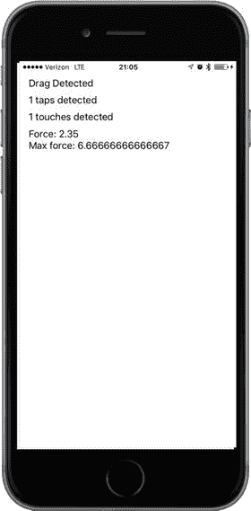

图 18-1.

`TouchExplorer` 应用

> **注意：** 尽管本章中的应用可以在模拟器上运行，但除非您在真实的 iOS 设备上运行，否则无法体验全部的多点触控或 3D Touch 功能。3D Touch 需要 iPhone 6s 或 iPhone 6s Plus。

本应用需要四个标签：一个用于指示最后调用的方法，一个用于报告当前的点击次数，一个用于报告触摸数量，最后一个用于 3D Touch 压力值。单击 `ViewController.swift` 文件，并为视图控制器类添加四个输出口：

```
class ViewController: UIViewController {
    @IBOutlet var messageLabel: UILabel!
    @IBOutlet var tapsLabel: UILabel!
    @IBOutlet var touchesLabel: UILabel!
    @IBOutlet var forceLabel: UILabel!
}
```

现在选择 `Main.storyboard` 来创建用户界面。您会看到所有此类新项目包含的常规空白视图。将一个标签拖到视图上，使用蓝色参考线将其放置在视图的左上角。按住 Option 键，从原始标签再拖出三个标签，将它们上下排列。这样您就获得了四个标签（参见图 18-1）。如果您想发挥创意，可以自由调整字体和颜色。完成后，选择最下方的标签，在属性检查器中将 `Lines` 属性设为 0，因为我们打算用它显示多行文本。

接下来需要为标签设置自动布局约束。在文档大纲中，按住 Control 键从第一个标签拖拽到主视图并松开鼠标。按住 Shift 键选择 `Vertical Spacing to Top Layout Guide` 和 `Leading Space to Container Margin`，然后按 Return 键。对另外三个标签重复相同操作。下一步是连接标签与输出口。按住 Control 键从“视图控制器”图标分别拖拽到四个标签，将最上面的标签连接到 `messageLabel` 输出口，第二个连接到 `tapsLabel`，第三个连接到 `touchesLabel`，最下面的连接到 `forceLabel`。最后，双击每个标签并按 Delete 键清除其文本。

接下来，单击主视图背景或文档大纲中的“视图”图标，然后打开属性检查器（参见图 18-2）。在检查器的“视图”部分，确保“用户交互已启用”和“多点触控”都已勾选。如果“多点触控”未勾选，无论实际有多少根手指触摸屏幕，控制器类的触摸方法始终只会接收到一个触摸事件。

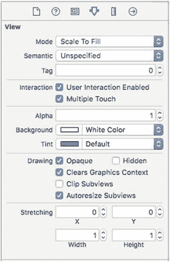

图 18-2.

在视图属性中，“用户交互已启用”和“多点触控”都已勾选。

完成后，切回 `ViewController.swift` 并做出修改，如代码清单 18-3 所示。

```
override func viewDidLoad() {
    super.viewDidLoad()
    // 加载视图后的其他初始设置（通常从 nib 文件加载）
}

private func updateLabelsFromTouches(_ touch: UITouch?, allTouches: Set<UITouch>?) {
    let numTaps = touch?.tapCount ?? 0
    let tapsMessage = "检测到 \(numTaps) 次点击"
    tapsLabel.text = tapsMessage

    let numTouches = allTouches?.count ?? 0
    let touchMsg = "检测到 \(numTouches) 次触摸"
    touchesLabel.text = touchMsg

    if traitCollection.forceTouchCapability == .available {
        forceLabel.text = "压力：\(touch?.force ?? 0)\n 最大压力：\(touch?.maximumPossibleForce ?? 0)"
    } else {
        forceLabel.text = "3D Touch 不可用"
    }
}

override func touchesBegan(_ touches: Set<UITouch>, with event: UIEvent?) {
    messageLabel.text = "触摸开始"
    updateLabelsFromTouches(touches.first, allTouches: event?.allTouches())
}

override func touchesCancelled(_ touches: Set<UITouch>, with event: UIEvent?) {
    messageLabel.text = "触摸取消"
    updateLabelsFromTouches(touches.first, allTouches: event?.allTouches())
}

override func touchesEnded(_ touches: Set<UITouch>, with event: UIEvent?) {
    messageLabel.text = "触摸结束"
    updateLabelsFromTouches(touches.first, allTouches: event?.allTouches())
}

override func touchesMoved(_ touches: Set<UITouch>, with event: UIEvent?) {
    messageLabel.text = "检测到拖拽"
    updateLabelsFromTouches(touches.first, allTouches: event?.allTouches())
}
```

代码清单 18-3. 支持 `TouchExplorer` 的 `ViewController.swift` 文件

在这个控制器类中，我们实现了之前讨论的四个触摸相关方法。每个方法都会设置 `messageLabel`，让用户知道每个方法被调用的情况。接着，四个方法都调用 `updateLabelsFromTouches()` 来更新其他三个标签。`updateLabelsFromTouches()` 方法从当前触摸事件获取点击次数，通过检查接收到的触摸集合（取自 `UIEvent` 对象）的计数属性来确定触摸屏幕的手指数量，并用这些信息更新标签。它还获取并显示压力信息。让我们仔细看看这部分代码：

```
if traitCollection.forceTouchCapability == .available {
    forceLabel.text = "压力：\(touch?.force ?? 0)\n 最大压力：
\(touch?.maximumPossibleForce ?? 0)"
} else {
    forceLabel.text = "3D Touch 不可用"
}
```

3D Touch 并非在所有设备上都可用，因此代码第一行使用 `UITraitCollection` 类的 `forceTouchCapability` 属性进行检查。每个视图控制器都有一个特征集合，这里我们使用应用中唯一视图控制器的特征集合进行检查。如果支持 3D Touch，我们使用 `UITouch` 的 `force` 属性来了解用户当前按压屏幕的力度，并使用 `maximumPossibleForce` 属性获取最大可能的压力值。如果 3D Touch 不可用，则直接显示提示信息。

构建并运行应用。如果在模拟器中运行，请尝试反复点击屏幕以增加点击次数。您还可以尝试按住鼠标按钮并在视图中拖拽，以模拟触摸和拖拽操作。如果拥有支持 3D Touch 的设备，请尝试以不同的力度按压，查看显示的压力数值。

在 iOS 模拟器中，您可以按住 Option 键的同时点击并拖拽鼠标，来模拟双指捏合操作。您还可以模拟双指滑动：首先按住 Option 键模拟捏合，移动鼠标使代表虚拟手指的两个点相邻，然后同时按住 Shift 键（同时仍按住 Option 键）。按下 Shift 键会锁定两根手指的相对位置，使您能够执行滑动和其他双指手势。虽然无法执行需要三指或更多手指的手势，但通过 Option 和 Shift 键的组合，您可以在模拟器上完成大多数双指手势。


如果你能在设备上运行这个程序，可以试试看同时能识别多少根手指的触摸。试着分别用一根、两根和三根手指拖动屏幕，再用单指或双指双击/三击屏幕，看看用两根手指点击时能否让点击计数增加。

请随意体验 `TouchExplorer` 应用，直到你对触控机制以及四种触摸方法的工作方式感到得心应手。准备好后，继续了解如何检测最常用的手势之一：滑动。

## 创建滑动检测应用

我们将构建的应用功能很简单——仅检测水平和垂直方向的滑动。当你用手指从左向右、从右向左、从上向下或从下向上划过屏幕时，应用会在屏幕顶部显示一条持续数秒的提示信息（参见图 18-3）。

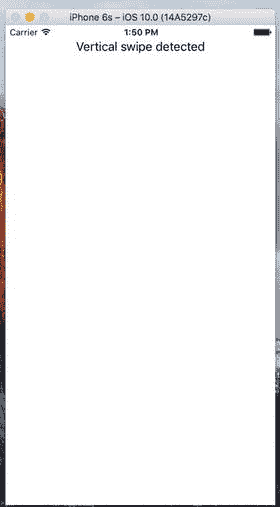

图 18-3. 滑动检测应用可同时检测垂直和水平滑动

## 使用触摸事件检测滑动

检测滑动相对简单。我们将定义一个最小手势长度（以像素为单位），即用户滑动超过该距离才被视为有效滑动。同时定义一个允许偏差范围，即用户在滑动过程中偏离直线的最大距离仍能被识别为水平或垂直滑动。对角线通常不被视为滑动，但略微偏离水平或垂直方向的滑动仍会被识别。

当用户触摸屏幕时，我们会在变量中保存首次触摸的位置。随后在用户手指移动过程中，持续检测是否达到足够远的距离且足够笔直，从而判定为滑动。实际上，系统内置的手势识别器已能完美实现此功能，但我们将运用所学的触摸事件知识自行构建一个。现在开始动手吧。在 Xcode 中使用`Single View Application`模板创建新项目，将`Devices`设为`Universal`，项目名称命名为`Swipes`。单击`ViewController.swift`，在类中添加以下代码：

```
class ViewController: UIViewController {
@IBOutlet var label: UILabel!
private var gestureStartPoint: CGPoint!
```

这段代码声明了一个标签插座变量，以及一个用于存储用户首次触摸位置的变量。

选择`Main.storyboard`打开进行编辑。确保视图控制器的视图已设置好——通过属性检查器勾选`User Interaction Enabled`和`Multiple Touch`两个选项。从库中拖拽一个标签放到视图窗口的上部区域。将文本对齐方式设置为居中，并可根据需要调整其他文本属性以便于阅读。在文档大纲中，按住 Control 键从标签拖拽到其父视图，松开鼠标后按住`Shift`键选择`Vertical Spacing to Top Layout Guide`和`Center Horizontally in Container`，然后按`Return`。从`View Controller`图标拖拽连线到标签，连接到`label`插座变量。最后，双击标签并删除其文本内容。现在切换回`ViewController.swift`，更新代码为清单 18-4 所示内容。

```
class ViewController: UIViewController {
@IBOutlet var label: UILabel!
private var gestureStartPoint: CGPoint!
private static let minimumGestureLength = Float(25.0)
private static let maximumVariance = Float(5)
override func viewDidLoad() {
super.viewDidLoad()
// 视图加载后的其他设置（通常来自 xib 文件）
}
override func touchesBegan(_ touches: Set, with event: UIEvent?) {
if let touch = touches.first {
gestureStartPoint = touch.location(in: self.view)
}
}
override func touchesMoved(_ touches: Set, with event: UIEvent?) {
if let touch = touches.first, gestureStartPoint = self.gestureStartPoint {
let currentPosition = touch.location(in: self.view)
let deltaX = fabsf(Float(gestureStartPoint.x - currentPosition.x))
let deltaY = fabsf(Float(gestureStartPoint.y - currentPosition.y))
if deltaX >= ViewController.minimumGestureLength
&& deltaY = ViewController.minimumGestureLength
&& deltaX <= ViewController.maximumVariance {
label.text = "检测到垂直滑动"
DispatchQueue.main.after(when: DispatchTime.now() + Double(Int64(2 * NSEC_PER_SEC)) / Double(NSEC_PER_SEC)) {
self.label.text = ""
}
}
}
}
}
清单 18-4. 触摸应用中 ViewController.swift 文件的更新内容

我们先从`touchesBegan(_:withEvent:)`方法开始。这里只从`touches`集合中获取一个触摸对象并存储其触摸点。当前我们主要关注单指滑动，因此无需关心触摸的数量，直接获取集合中的第一个触摸点：

```
if let touch = touches.first {
gestureStartPoint = touch.location(in: self.view)
}
```

我们使用`touches`参数中的`UITouch`对象而非`UIEvent`中的对象，因为我们要跟踪触摸发生时的实时变化，而非所有活跃触摸的整体状态。在下一个方法`touchesMoved(_:withEvent:)`中，我们完成实际工作。首先获取用户手指的当前位置：

```
if let touch = touches.first, gestureStartPoint = self.gestureStartPoint {
let currentPosition = touch.location(in: self.view)
```

这里使用了`if let`语句的复合条件形式——同时确保当前存在触摸对象，且之前已存储手势起始点。实际应用中这两个条件通常都满足，但由于`touches.first`属性返回的是可选值（我们在本方法和`touchesBegan(_:withEvent:)`中都使用了该属性），我们必须进行这些检查，以防意外情况导致试图展开`nil`可选值而造成应用崩溃。

接下来，我们计算用户手指在水平和垂直方向上从起始点移动的距离。`fabsf()`是标准 C 数学库中的函数，用于返回浮点数的绝对值。这样我们可以直接计算差值而无需关心哪个值更大：

```
let deltaX = fabsf(Float(gestureStartPoint.x - currentPosition.x))
let deltaY = fabsf(Float(gestureStartPoint.y - currentPosition.y))
```

得到两个差值后，我们检查用户是否在一个方向移动足够远，同时另一个方向移动未超过允许偏差。如果条件满足，则在标签中显示检测到水平或垂直滑动的提示。同时使用 GCD 的`DispatchQueue.main.after()`函数，在标签显示 2 秒后清除文本。这样用户可以多次练习滑动，无需担心标签显示的是之前的操作还是最新操作：

```
if deltaX >= ViewController.minimumGestureLength
&& deltaY = ViewController.minimumGestureLength
&& deltaX <= ViewController.maximumVariance {
label.text = "检测到垂直滑动"
DispatchQueue.main.after(when: DispatchTime.now() +
Double(Int64(2 * NSEC_PER_SEC)) / Double(NSEC_PER_SEC)) {
self.label.text = ""
}
}
```

构建并运行应用。如果发现点击拖动后没有可见效果，请耐心等待。尝试直接向下或水平直线拖动，直到掌握正确的滑动姿势。


### 自动手势识别

我们刚刚用来检测滑动手势的操作并不算太差。所有复杂性都集中在 `touchesMoved(_:withEvent:)` 方法中，但即使是那个方法也不算特别复杂。然而，有一种更简单的方法可以实现这一点。iOS 包含一个名为 `UIGestureRecognizer` 的类，它省去了监听所有事件来观察手指移动的麻烦。你无需直接使用 `UIGestureRecognizer`，而是创建其某个子类的实例，每个子类都设计用于识别特定类型的手势，例如轻扫、捏合、双击、三击等等。让我们看看如何修改 Swipes 应用，使其使用手势识别器，而不是我们手动编写的处理逻辑。和往常一样，你可能需要先复制一份 Swipes 项目文件夹，并以此为基础进行操作。在示例源代码归档文件中，你可以在 Swipes 2 文件夹中找到本应用的完整版本。

首先，选中 `ViewController.swift`，删除 `touchesBegan(_:withEvent:)` 和 `touchesMoved(_:withEvent:)` 这两个方法，因为不再需要它们，并在原位置添加几个新方法：

```
func reportHorizontalSwipe(_ recognizer:UIGestureRecognizer) {
    label.text = "Horizontal swipe detected"
    DispatchQueue.main.after(when: DispatchTime.now() +
        Double(Int64(2 * NSEC_PER_SEC)) / Double(NSEC_PER_SEC)) {
        self.label.text = ""
    }
}
func reportVerticalSwipe(_ recognizer:UIGestureRecognizer) {
    label.text = "Vertical swipe detected"
    DispatchQueue.main.after(when: DispatchTime.now() +
        Double(Int64(2 * NSEC_PER_SEC)) / Double(NSEC_PER_SEC)) {
        self.label.text = ""
    }
}
```

这些方法实现了轻扫手势提供的实际功能（如果可以这么称呼的话），就像之前的 `touchesMoved(_:withEvent:)` 方法一样，不同之处在于这里不再有任何检测实际滑动的代码。现在，将下面展示的新代码添加到 `viewDidLoad` 方法中：

```
super.viewDidLoad()
// Do any additional setup after loading the view, typically from a nib.
let vertical = UISwipeGestureRecognizer(target: self, action: "reportVerticalSwipe:")
vertical.direction = [.up, .down]
view.addGestureRecognizer(vertical)
let horizontal = UISwipeGestureRecognizer(target: self,
    action: "reportHorizontalSwipe:")
horizontal.direction = [.left, .right]
view.addGestureRecognizer(horizontal)
```

我们在这里所做的就是创建两个手势识别器——一个用于检测垂直方向的移动，另一个用于检测水平方向的移动。当其中任何一个识别到其配置的手势时，它就会调用 `reportVerticalSwipe()` 或 `reportHorizontalSwipe()` 方法，并相应地设置标签的文本。为了进一步清理代码，你还可以从 `ViewController.swift` 中删除 `gestureStartPoint` 属性的声明以及两个常量值。现在构建并运行应用，试试新的手势识别器。

从代码总行数来看，对于像这样的简单情况，这两种方法差别不大。但使用手势识别器的代码无疑更易于理解和编写。你完全不需要考虑计算手指随时间移动的问题，因为 `UISwipeGestureRecognizer` 已经为你完成了这些。更棒的是，Apple 的手势识别系统是可扩展的，这意味着如果你的应用需要识别 Apple 识别器未涵盖的非常复杂的手势，你可以创建自己的识别器，并将复杂的代码（类似于我们之前看到的逻辑）封装在识别器类中，而不是污染你的视图控制器代码。本章稍后我们将构建一个这样的示例。与此同时，运行应用，你会看到它的行为与之前的版本完全相同。

### 实现多指轻扫

在 Swipes 应用中，我们只关注单指轻扫，因此我们只获取了 `touches` 集合中的第一个对象来判断用户手指在滑动时的位置。如果你只对单指轻扫（最常用的轻扫类型）感兴趣，这种方法没问题。但如果你想处理双指或三指轻扫呢？在本书的早期版本中，我们用了大约 50 行代码和相当的篇幅来解释如何通过跟踪多次触摸事件中的多个 `UITouch` 实例来实现这一点。现在有了手势识别器，这个问题已经解决了。`UISwipeGestureRecognizer` 可以配置为识别任意数量的同时触摸。默认情况下，每个实例期望识别一根手指，但你可以对其进行配置，使其识别同时按压屏幕的任意数量的手指。每个实例只响应你指定的确切触摸次数，因此我们要做的就是在循环中创建一大堆手势识别器。

再复制一份 Swipes 项目文件夹来尝试这个功能——你可以在示例源代码归档文件的 Swipes 3 文件夹中找到完整版本。编辑 `ViewController.swift`，修改 `viewDidLoad` 方法，将其替换为下面所示的代码：

```
override func viewDidLoad() {
    super.viewDidLoad()
    // Do any additional setup after loading the view, typically from a nib.
    for touchCount in 0..<5 {
        let vertical = UISwipeGestureRecognizer(target: self,
            action: #selector(ViewController.reportVerticalSwipe(_:)))
        vertical.direction = [.up, .down]
        vertical.numberOfTouchesRequired = touchCount
        view.addGestureRecognizer(vertical)
        let horizontal = UISwipeGestureRecognizer(target: self,
            action: #selector(ViewController.reportHorizontalSwipe(_:)))
        horizontal.direction = [.left, .right]
        horizontal.numberOfTouchesRequired = touchCount
        view.addGestureRecognizer(horizontal)
    }
}
```

我们在这里所做的，是向视图添加 10 个不同的手势识别器——第一个识别单指垂直轻扫，第二个识别双指垂直轻扫，以此类推。当它们识别到各自的手势时，都会调用 `reportVerticalSwipe()` 方法。第二组识别器处理水平轻扫，并调用 `reportHorizontalSwipe()` 方法。请注意，在真实应用中，你可能希望不同数量的手指在屏幕上滑动时触发不同的行为。使用手势识别器，你可以轻松做到这一点，只需让每个识别器调用不同的操作方法即可。

现在，我们只需通过添加一个方法来提供方便描述触摸次数的方式，然后在报告方法中使用它，如下所示，以更改日志输出。在 `ViewController` 类的底部，两个轻扫报告方法的上方，添加这个方法：

```
func descriptionForTouchCount(_ touchCount:Int) -> String {
    switch touchCount {
    case 1:
        return "单指"
    case 2:
        return "双指"
    case 3:
        return "三指"
    case 4:
        return "四指"
    case 5:
        return "五指"
    default:
        return ""
    }
}
```

接下来，按如下方式修改两个轻扫报告方法：

```
func reportHorizontalSwipe(_ recognizer:UIGestureRecognizer) {
    label.text = "Horizontal swipe detected"
    let count = descriptionForTouchCount(recognizer.numberOfTouches())
    label.text = "检测到\(count)水平轻扫"
    DispatchQueue.main.after(when: DispatchTime.now() +
        Double(Int64(2 * NSEC_PER_SEC)) / Double(NSEC_PER_SEC)) {
        self.label.text = ""
    }
}
func reportVerticalSwipe(_ recognizer:UIGestureRecognizer) {
    label.text = "Vertical swipe detected"
    let count = descriptionForTouchCount(recognizer.numberOfTouches())
    label.text = "检测到\(count)垂直轻扫"
    DispatchQueue.main.after(when: DispatchTime.now() +
        Double(Int64(2 * NSEC_PER_SEC)) / Double(NSEC_PER_SEC)) {
        self.label.text = ""
    }
}
```


构建并运行应用。你应该能够触发双指和三指滑动（两种方向均可），同时仍能触发单指滑动。如果你的手指较小，甚至可能触发四指或五指滑动。

**提示**

在模拟器中，如果按住`Option`键，会出现一对代表两根手指的圆点。让它们靠近彼此，然后按住`Shift`键。这样会保持这两个圆点之间的相对位置不变，使你能够将这对“手指”在屏幕上移动。然后，点击并向下拖动屏幕，即可模拟双指滑动。

在使用多指滑动时，需要注意一点：你的手指不能靠得太近。如果两根手指非常接近，它们可能会被识别为单次触摸。正因如此，你不应该将四指或五指滑动用于任何重要的手势，因为很多人的手指较粗，无法有效地完成这些滑动操作。此外，在 iPad 上，系统层级默认开启了某些四指和五指手势，用于切换应用或返回主屏幕。这些手势可以在“设置”应用中关闭，但你最好还是不要在自己的应用中使用此类手势。

### 检测多次点击

在`TouchExplorer`应用中，我们将点击次数打印到了屏幕上，因此你已经知道检测多次点击是多么简单。然而，实际情况并非看起来那么简单，因为你通常希望根据点击次数执行不同的操作。如果用户三次点击，你会分别收到三次通知：依次是单次点击、双击，最后是三次点击。如果你希望在双击时执行某个操作，而在三次点击时执行完全不同的操作，那么收到三次独立的通知可能会引发问题，因为你将首先收到双击通知，然后才收到三次点击通知。除非你编写巧妙的代码来应对这种情况，否则最终两个操作都会执行。幸运的是，苹果公司预见到了这种情况，并提供了一种机制，让多个手势识别器能够良好地协同工作，即使它们面对的是可能看似能触发其中任何一个的模糊输入。其基本思路是，你对某个手势识别器施加限制，告知它除非其他某个手势识别器未能触发其自身方法，否则不要触发其关联的方法。

这听起来有点抽象，我们把它具体化。点击手势由`UITapGestureRecognizer`类识别。可以配置一个点击识别器，使其在发生特定次数的点击时执行操作。假设我们有一个视图，希望为其定义当用户单击或双击时发生的不同操作。你可能从如下代码开始：

```
let singleTap = UITapGestureRecognizer(target: self,
action: #selector(ViewController.singleTap))
singleTap.numberOfTapsRequired = 1
singleTap.numberOfTouchesRequired = 1
view.addGestureRecognizer(singleTap)
let doubleTap = UITapGestureRecognizer(target: self,
action: #selector(ViewController.doubleTap))
doubleTap.numberOfTapsRequired = 2
doubleTap.numberOfTouchesRequired = 1
view.addGestureRecognizer(doubleTap)
```

这段代码的问题在于，两个识别器彼此不知道对方的存在，也无法知道用户的交互可能更适合另一个识别器。如果用户在上述代码的视图中双击，会调用`doDoubleTap()`方法，但同时也会调用`doSingleMethod()`方法——而且会调用两次！每次点击都会调用一次。

解决方法是创建一个失败要求。我们告诉`singleTap`，只有当`doubleTap`未能识别并响应用户输入时，它才应触发其操作，添加如下一行代码即可：

```
singleTap.require(toFail: doubleTap)
```

这意味着，当用户点击一次时，`singleTap`不会立即执行其工作。相反，`singleTap`会等待，直到它确定`doubleTap`已决定不再关注当前手势（例如，用户没有进行第二次点击）。我们将在下一个项目中进一步扩展这个概念。

在 Xcode 中，使用“Single View Application”模板创建一个新项目。将此项目命名为`Taps`，并使用“Devices”弹出菜单选择“Universal”。此应用将包含四个标签，分别用于告知我们何时检测到单击、双击、三击和四击（参见图 18-4）。

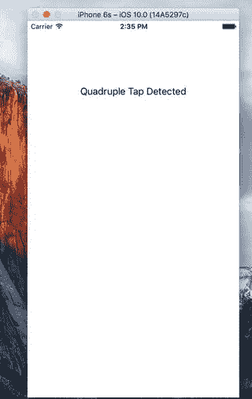

**图 18-4.** `Taps`应用能够检测最多连续四次点击

我们需要这四个标签的插座变量，还需要为每种点击场景准备独立的方法，以模拟真实应用中的情况。我们还将包含一个用于清除文本字段的方法。打开`ViewController.swift`并将标签插座变量添加到类中：

```
class ViewController: UIViewController {
@IBOutlet var singleLabel:UILabel!
@IBOutlet var doubleLabel:UILabel!
@IBOutlet var tripleLabel:UILabel!
@IBOutlet var quadrupleLabel:UILabel!
```


保存文件并选择`Main.storyboard`来编辑 GUI。进入后，从库中添加四个标签到视图中，并将它们上下排列。在属性检查器中，将每个标签的文本对齐方式设置为居中。在文档结构中，按住 Control 键从顶部标签拖拽到其父视图并释放鼠标。按住 Shift 键并选择`Vertical Spacing to Top Layout Guide`和`Center Horizontally in Container`，然后按回车键。对其余三个标签重复相同操作，以设置它们的自动布局约束。完成后，按住 Control 键从视图控制器图标拖拽到每个标签，并分别连接到`singleLabel`、`doubleLabel`、`tripleLabel`和`quadrupleLabel`。最后，确保双击每个标签并按删除键清除所有文本。现在选择`ViewController.swift`，并进行如列表 18-5 所示的代码更改。

```
override func viewDidLoad() {
super.viewDidLoad()
// Do any additional setup after loading the view, typically from a nib.
let singleTap = UITapGestureRecognizer(target: self,
action: #selector(ViewController.singleTap))
singleTap.numberOfTapsRequired = 1
singleTap.numberOfTouchesRequired = 1
view.addGestureRecognizer(singleTap)
let doubleTap = UITapGestureRecognizer(target: self,
action: #selector(ViewController.doubleTap))
doubleTap.numberOfTapsRequired = 2
doubleTap.numberOfTouchesRequired = 1
view.addGestureRecognizer(doubleTap)
singleTap.require(toFail: doubleTap)
let tripleTap = UITapGestureRecognizer(target: self,
action: #selector(ViewController.tripleTap))
tripleTap.numberOfTapsRequired = 3
tripleTap.numberOfTouchesRequired = 1
view.addGestureRecognizer(tripleTap)
doubleTap.require(toFail: tripleTap)
let quadrupleTap = UITapGestureRecognizer(target: self,
action: #selector(ViewController.quadrupleTap))
quadrupleTap.numberOfTapsRequired = 4
quadrupleTap.numberOfTouchesRequired = 1
view.addGestureRecognizer(quadrupleTap)
tripleTap.require(toFail: quadrupleTap)
}
func singleTap() {
showText("Single Tap Detected", inLabel: singleLabel)
}
func doubleTap() {
showText("Double Tap Detected", inLabel: doubleLabel)
}
func tripleTap() {
showText("Triple Tap Detected", inLabel: tripleLabel)
}
func quadrupleTap() {
showText("Quadruple Tap Detected", inLabel: quadrupleLabel)
}
private func showText(_ text: String, inLabel label: UILabel) {
label.text = text
DispatchQueue.main.after(when: DispatchTime.now() +
Double(Int64(2 * NSEC_PER_SEC)) / Double(NSEC_PER_SEC)) {
label.text = ""
}
}
Listing 18-5.
The Taps App Changes to the ViewController.swift File
```

四个轻击方法在此应用中仅用于设置四个标签之一，并使用`DispatchQueue.main.after()`在 2 秒后清除该标签。有趣的部分在于`viewDidLoad`方法中的操作。我们从一个简单的手势识别器开始，并将其附加到视图上：

```
let singleTap = UITapGestureRecognizer(target: self,
action: #selector(ViewController.singleTap))
singleTap.numberOfTapsRequired = 1
singleTap.numberOfTouchesRequired = 1
view.addGestureRecognizer(singleTap)
```

请注意，我们同时设置了触发动作所需的轻击次数（在同一位置连续轻击）和触摸点数（同时触摸屏幕的手指数量）为 1。之后，我们设置了另一个轻击手势识别器来处理双击：

```
let doubleTap = UITapGestureRecognizer(target: self,
action: #selector(ViewController.doubleTap))
doubleTap.numberOfTapsRequired = 2
doubleTap.numberOfTouchesRequired = 1
view.addGestureRecognizer(doubleTap)
singleTap.require(toFail: doubleTap)
```

这段代码与之前的代码非常相似，直到最后一行，我们为`singleTap`提供了额外的上下文。我们实际上是在告诉`singleTap`，它应该仅在另一个手势识别器（本例中为`doubleTap`）确定当前用户输入不是它所寻找的情况下触发其动作。

让我们思考这意味着什么。有了这两个轻击手势识别器，视图中的一次轻击会立即让`singleTap`认为：“嘿，这看起来像是针对我的。”同时，`doubleTap`会认为：“嘿，这看起来可能也是针对我的，但我需要再等一次轻击。”由于`singleTap`被设置为等待`doubleTap`的“失败”，它不会立即触发其动作方法；而是等待观察`doubleTap`的情况。

在第一次轻击之后，如果紧接着发生另一次轻击，`doubleTap`会说：“嘿，这完全是针对我的，”并触发其动作。此时，`singleTap`会意识到发生了什么并放弃该手势。另一方面，如果经过了一段特定时间（系统认为双击中两次轻击之间的最大时间间隔），`doubleTap`会放弃，`singleTap`会看到失败并最终触发其事件。方法的其余部分继续定义了三连击和四连击的手势识别器，并在每个点配置一个手势依赖于下一个手势的失败：

```
let tripleTap = UITapGestureRecognizer(target: self,
action: #selector(ViewController.tripleTap))
tripleTap.numberOfTapsRequired = 3
tripleTap.numberOfTouchesRequired = 1
view.addGestureRecognizer(tripleTap)
doubleTap.require(toFail: tripleTap)
let quadrupleTap = UITapGestureRecognizer(target: self,
action: #selector(ViewController.quadrupleTap))
quadrupleTap.numberOfTapsRequired = 4
quadrupleTap.numberOfTouchesRequired = 1
view.addGestureRecognizer(quadrupleTap)
tripleTap.require(toFail: quadrupleTap)
```

请注意，我们不需要显式地配置每个手势都依赖于更高轻击次数手势的失败。这种多重依赖关系自然而然地源于代码中建立的失败链。由于`singleTap`需要`doubleTap`失败，`doubleTap`需要`tripleTap`失败，而`tripleTap`需要`quadrupleTap`失败。由此扩展，`singleTap`需要所有其他手势都失败。

构建并运行应用。无论你进行单次、两次、三次还是四次轻击，在序列结束时你应该只看到一个标签显示。大约一秒半后，标签会自行清除，你可以再次尝试。


### 检测捏合与旋转手势

另一种常见手势是双指捏合。它在许多应用（例如移动版 Safari、邮件和照片）中用于让你放大（双指张开）或缩小（双指合拢）。借助`UIPinchGestureRecognizer`，检测捏合变得非常简单。它被称为连续手势识别器，因为在捏合过程中会反复调用其动作方法。手势进行时，识别器会经历多个状态。当手势被识别时，识别器处于`UIGestureRecognizerState.began`状态，其`scale`属性会被设置为初始值`1.0`；在后续手势过程中，状态变为`UIGestureRecognizerState.changed`，`scale`值会根据用户手指从起始位置移动的距离上下变化。我们将使用`scale`值来调整图像大小。最后，状态会变为`UIGestureRecognizerState.ended`。

另一种常见手势是双指旋转。它也是一个连续手势识别器，名为`UIRotationGestureRecognizer`。它有一个`rotation`属性，手势开始时默认为`0.0`，然后随着用户旋转手指，该值从`0.0`变化到`2.0 * PI`。在下一个例子中，我们将同时使用捏合和旋转手势。在 Xcode 中创建一个新项目，同样使用单视图应用模板，并将其命名为 PinchMe。首先，将示例源代码归档中`18 - Image`文件夹里的漂亮图片`yosemite-meadows.png`（或你喜欢的其他照片）拖放到项目中的`Assets.xcassets`。然后，对`ViewController.swift`文件进行清单 18-6 所示的修改。

```
class ViewController: UIViewController, UIGestureRecognizerDelegate {
    private var imageView: UIImageView!
    private var scale = CGFloat(1)
    private var previousScale = CGFloat(1)
    private var rotation = CGFloat(0)
    private var previousRotation = CGFloat(0)

    override func viewDidLoad() {
        super.viewDidLoad()
        // Do any additional setup after loading the view, typically from a nib.
        let image = UIImage(named: "yosemite-meadows")
        imageView = UIImageView(image: image)
        imageView.isUserInteractionEnabled = true
        imageView.center = view.center
        view.addSubview(imageView)

        let pinchGesture = UIPinchGestureRecognizer(target: self,
            action: #selector(ViewController.doPinch(_:)))
        pinchGesture.delegate = self
        imageView.addGestureRecognizer(pinchGesture)

        let rotationGesture = UIRotationGestureRecognizer(target: self,
            action: #selector(ViewController.doRotate(_:)))
        rotationGesture.delegate = self
        imageView.addGestureRecognizer(rotationGesture)
    }

    func gestureRecognizer(_ gestureRecognizer: UIGestureRecognizer,
        shouldRecognizeSimultaneouslyWith
        otherGestureRecognizer: UIGestureRecognizer) -> Bool {
        return true
    }

    func transformImageView() {
        var t = CGAffineTransform(scaleX: scale * previousScale, y: scale * previousScale)
        t = t.rotate(rotation + previousRotation)
        imageView.transform = t
    }

    func doPinch(_ gesture: UIPinchGestureRecognizer) {
        scale = gesture.scale
        transformImageView()
        if gesture.state == .ended {
            previousScale = scale * previousScale
            scale = 1
        }
    }

    func doRotate(_ gesture: UIRotationGestureRecognizer) {
        rotation = gesture.rotation
        transformImageView()
        if gesture.state == .ended {
            previousRotation = rotation + previousRotation
            rotation = 0
        }
    }
}
```

首先，我们为当前和之前的缩放及旋转值定义了四个实例变量。之前的值是在之前触发并结束的手势识别器中获得的；我们还需要跟踪这些值，因为用于缩放的`UIPinchGestureRecognizer`和用于旋转的`UIRotationGestureRecognizer`总是从默认的`1.0`缩放和`0.0`旋转位置开始。接下来，在`viewDidLoad()`中，我们首先创建一个`UIImageView`用于捏合和旋转，将约塞米蒂图片加载到其中，并将其居中放置在主视图内。我们必须记得在图像视图上启用用户交互，因为`UIImageView`是少数默认禁用用户交互的 UIKit 类之一。

```
let image = UIImage(named: "yosemite-meadows")
imageView = UIImageView(image: image)
imageView.isUserInteractionEnabled = true
imageView.center = view.center
view.addSubview(imageView)
```

接着，我们设置一个捏合手势识别器和一个旋转手势识别器。我们分别通过`doPinch()`和`doRotate()`方法告知它们在其手势被识别时通知我们。我们让两者都使用`self`作为其代理：

```
let pinchGesture = UIPinchGestureRecognizer(target: self,
    action: #selector(ViewController.doPinch(_:)))
pinchGesture.delegate = self
imageView.addGestureRecognizer(pinchGesture)

let rotationGesture = UIRotationGestureRecognizer(target: self,
    action: #selector(ViewController.doRotate(_:)))
rotationGesture.delegate = self
imageView.addGestureRecognizer(rotationGesture)
```

在`gestureRecognizer(_:shouldRecognizeSimultaneouslyWith:)`方法（这是我们需要实现`UIGestureRecognizerDelegate`协议中的唯一方法）中，我们始终返回`true`，以允许我们的捏合和旋转手势协同工作；否则，先启动的手势识别器总是会阻止另一个：

```
func gestureRecognizer(_ gestureRecognizer: UIGestureRecognizer,
    shouldRecognizeSimultaneouslyWith
    otherGestureRecognizer: UIGestureRecognizer) -> Bool {
    return true
}
```

接下来，我们实现一个辅助方法，用于根据手势识别器的当前缩放和旋转值来变换图像视图。请注意，我们将当前缩放乘以之前的缩放，并将当前旋转加上之前的旋转。这样，当新手势从默认的`1.0`缩放和`0.0`旋转开始时，我们可以根据先前完成的捏合和旋转进行调整。

```
func transformImageView() {
    var t = CGAffineTransform(scaleX: scale * previousScale, y: scale * previousScale)
    t = t.rotate(rotation + previousRotation)
    imageView.transform = t
}
```

最后，我们实现动作方法，这些方法从手势识别器获取输入，并更新图像视图的变换。在`doPinch()`和`doRotate()`中，我们首先提取新的`scale`或`rotation`值。接着，更新图像视图的变换。最后，如果手势识别器报告其手势已结束（`state`等于`UIGestureRecognizerState.ended`），我们将存储当前正确的缩放或旋转值，然后将当前的缩放或旋转值重置为默认的`1.0`缩放或`0.0`旋转：

```
func doPinch(_ gesture: UIPinchGestureRecognizer) {
    scale = gesture.scale
    transformImageView()
    if gesture.state == .ended {
        previousScale = scale * previousScale
        scale = 1
    }
}

func doRotate(_ gesture: UIRotationGestureRecognizer) {
    rotation = gesture.rotation
    transformImageView()
    if gesture.state == .ended {
        previousRotation = rotation + previousRotation
        rotation = 0
    }
}
```

这就是捏合和旋转检测的全部内容。构建并运行应用程序试试看。当你进行捏合和旋转操作时，你会看到图像随之响应（见图 18-5）。如果你在模拟器上运行，请记住，你可以通过按住 Option 键，然后在模拟器窗口中用鼠标点击并拖拽来模拟捏合操作。

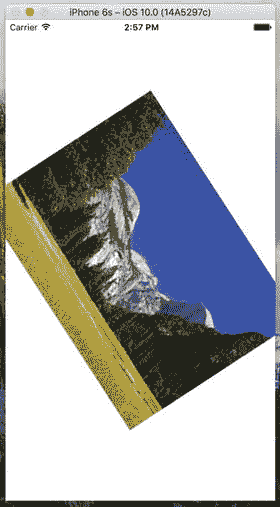

图 18-5. PinchMe 应用检测捏合和旋转手势。


## 总结

现在您应该已经了解了 iOS 用于向应用程序通知触摸、轻点和手势的机制。您还学习了如何检测最常用的 iOS 手势。我们还看到了几个使用全新 3D Touch 功能的基础示例。这方面的内容远不止我们在此所能涵盖——如需了解完整细节，请参考 Apple 关于该主题的文档，您可以在 [`developer.apple.com/library/ios/documentation/UserExperience/Conceptual/Adopting3DTouchOniPhone/`](https://developer.apple.com/library/ios/documentation/UserExperience/Conceptual/Adopting3DTouchOniPhone/) 找到它。

iOS 用户界面在很大程度上依赖手势来提供易用性，因此在大多数 iOS 开发中，您都需要准备好掌握这些技术。在下一章中，我们将告诉您如何通过 Core Location 来确定您在世界上的位置。

# 19. 确定位置

每台 iOS 设备都具备通过名为 Core Location 的框架来确定其全球位置的能力。iOS 还包含了 Map Kit 框架，它可以让您轻松创建一个实时交互式地图，显示您喜欢的任何位置，当然也包括用户的位置。在本章中，我们将使用这两个框架。实际上，Core Location 可以利用三种技术来实现这一功能：GPS、蜂窝基站 ID 定位和 Wi-Fi 定位服务（WPS）。在这三种技术中，GPS 提供最精确的定位，但它不适用于第一代 iPhone、iPod touch 或仅支持 Wi-Fi 的 iPad。简而言之，任何至少具有 3G 数据连接的设备也都包含 GPS 单元。GPS 通过读取来自多颗卫星的微波信号来确定当前位置。

**注意：** Apple 使用一种名为辅助 GPS（即 A-GPS）的 GPS 版本。A-GPS 利用网络资源来帮助提升独立 GPS 的性能。其基本思想是，电信运营商在其网络上部署服务，移动设备会自动发现这些服务并从中收集一些数据。这使得移动设备能够比仅依赖 GPS 卫星时更快地确定其起始位置。

蜂窝基站 ID 定位根据设备当前所连接蜂窝基站的实际物理位置，对当前位置进行粗略估算。由于每个基站可以覆盖相当大的区域，因此这里的误差范围相当大。蜂窝基站 ID 定位需要蜂窝无线电连接，因此仅适用于 iPhone（所有型号，包括初代）和任何具有 3G 数据连接的 iPad。WPS 选项利用附近 Wi-Fi 接入点的媒体访问控制（MAC）地址，通过引用已知服务提供商及其服务区域的大型数据库来猜测您的位置，但其误差可能达到一英里甚至更多。

这三种方法都会显著消耗电池电量，因此在使用 Core Location 时请牢记这一点。您的应用程序不应比绝对必要的频率更频繁地轮询位置。使用 Core Location 时，您可以选择指定所需的精度。通过仔细指定您所需的最低精度级别，可以避免不必要的电池消耗。Core Location 所依赖的技术对您的应用程序是隐藏的。我们无需告诉 Core Location 是使用 GPS、三角测量还是 WPS。我们只需告诉它我们期望的精度，它将根据可用的技术自行决定哪种最适合满足我们的请求。

## 位置管理器

Apple 提供了非常易于使用的 Core Location API。我们将使用的主要类是 `CLLocationManager`，通常称为位置管理器。要与 Core Location 交互，您需要创建一个位置管理器实例：

```
let locationManager = CLLocationManager()
```

这将创建一个位置管理器的实例，但它实际上并不会开始轮询您的位置。您必须创建一个符合 `CLLocationManagerDelegate` 协议的对象，并将其分配为位置管理器的委托。当位置信息可用或发生变化时，位置管理器将调用委托方法。确定位置的过程可能需要一些时间——甚至几秒钟。

### 设置所需精度

设置委托后，您还需要设置所需的精度。如前所述，请不要指定超出您绝对需要的精度级别。如果您正在编写的应用程序只需要知道手机所在的州或国家，请不要指定高精度。请记住，您对 Core Location 要求的精度越高，消耗的电量可能就越多。此外，请记住，无法保证您能获得所请求的精度级别。下面的示例展示了如何设置委托并请求特定的精度：

```
locationManager.delegate = self
locationManager.desiredAccuracy = kCLLocationAccuracyBest
```

精度使用 `CLLocationAccuracy` 值设置，该类型被定义为 `Double`。该值以米为单位，因此如果您指定 `desiredAccuracy` 为 10，则您是在告诉 Core Location 希望它尽可能尝试在 10 米内确定当前位置。指定 `kCLLocationAccuracyBest`（如前所述）或指定 `kCLLocationAccuracyBestForNavigation`（此时它还会使用其他传感器数据）会告诉 Core Location 使用当前可用的最精确方法。此外，您还可以使用：`kCLLocationAccuracyNearestTenMeters`、`kCLLocationAccuracyHundredMeters`、`kCLLocationAccuracyKilometer` 和 `kCLLocationAccuracyThreeKilometers`。

### 设置距离过滤器

默认情况下，位置管理器会通知委托设备位置的任何检测到的变化。通过指定距离过滤器，您是在告诉位置管理器不要通知您每一次变化，而是仅在位置变化超过一定数量时通知您。设置距离过滤器可以减少应用程序执行轮询的次数。距离过滤器同样以米为单位设置。指定距离过滤器为 1000 告诉位置管理器，只有当 iPhone 从其先前报告的位置移动至少 1,000 米时，才通知其委托，例如 `locationManager.distanceFilter = 1000`。

如果您想将位置管理器恢复为不应用任何过滤器的默认设置，可以使用常量 `kCLDistanceFilterNone`，如下所示：

```
locationManager.distanceFilter = kCLDistanceFilterNone
```

就像指定所需精度时一样，您应注意避免比实际需要更频繁地获取更新；否则会浪费电池电量。一个根据位置变化计算用户速度的速度表应用程序可能希望尽可能快地获得更新，但一个显示最近快餐店的应用程序则可以接受少得多的更新。

### 获取使用定位服务的权限

在您的应用程序可以使用定位服务之前，您需要获得用户的许可。Core Location 提供几种不同的服务，其中一些可以在应用程序处于后台时使用——实际上，您甚至可以请求在应用程序未运行且发生某些事件时启动您的应用程序。根据应用程序的功能，可能只需要请求在用户使用您的应用程序时才能访问定位服务的权限，或者可能需要始终能够使用该服务。在编写应用程序时，您需要决定需要哪种类型的权限，并在启动所需的服务之前提出请求。您将在本章创建示例应用程序的过程中看到如何做到这一点。


### 启动定位管理器

当你准备好开始轮询位置信息，并且已向用户请求访问定位服务后，你便告知定位管理器启动。它将自行运行，并在确定当前位置后调用委托方法。除非你告知其停止，否则每当它检测到超出当前距离过滤器的位置变化时，都会持续调用你的委托方法。以下是启动定位管理器的方法：

```
locationManager.startUpdatingLocation()
```

### 明智地使用定位管理器

如果你仅需确定当前位置，而不需要持续更新，可以使用 `requestLocation()` 方法代替 `startUpdatingLocation()`。该方法会在确定用户位置后自动停止位置轮询。另一方面，如果确实需要轮询，请确保尽可能早地停止轮询。请记住，只要你在从定位管理器获取更新，就会耗费用户的电池电量。要告知定位管理器停止向其委托发送更新，可调用 `stopUpdatingLocation()`，如下所示：

```
locationManager.stopUpdatingLocation()
```

如果你使用 `requestLocation()` 而非 `startUpdatingLocation()`，则无需调用此方法。

## 定位管理器委托

定位管理器的委托必须遵循 `CLLocationManagerDelegate` 协议，该协议定义了若干方法，且所有方法均为可选方法。当用户授权使用定位服务的可用性发生变化时，定位管理器会调用其中一个方法；当它确定当前位置或检测到位置变化时，会调用另一个方法。当定位管理器遇到错误时，还会调用另一个方法。在本章的项目中，我们将实现所有这些委托方法。

### 获取位置更新

当定位管理器想要将当前位置告知其委托时，它会调用 `locationManager(_:didUpdateLocations:)` 方法。该方法接受两个参数：

- 第一个参数引用调用该方法的定位管理器。
- 第二个参数包含一个 `CLLocation` 对象数组，代表设备的当前位置以及可能的一些先前位置。如果在短时间内发生多次位置更新，它们可能会通过一次对该方法的调用同时报告。无论如何，最近的位置始终是该数组中的最后一项。

### 使用 CLLocation 获取纬度和经度

位置信息通过 `CLLocation` 类的实例从定位管理器传递过来。该类提供了七个对你的应用可能有用的属性：

- `coordinate`
- `horizontalAccuracy`
- `altitude`
- `verticalAccuracy`
- `floor`
- `timestamp`
- `description`

纬度和经度存储在一个名为 `coordinate` 的属性中。要以度数形式获取纬度和经度，请使用代码清单 19-2 中的代码。

```
let latitude = theLocation.coordinate.latitude
let longitude = theLocation.coordinate.longitude
代码清单 19-2. 获取纬度和经度
```

`latitude` 和 `longitude` 变量将被推断为 `CLLocationDegrees` 类型。`CLLocation` 对象还可以告诉你定位管理器对其纬度和经度计算结果的置信度。`horizontalAccuracy` 属性描述了一个以 `coordinate` 为中心、以该值为半径的圆（以米为单位，与所有 Core Location 测量数据一致）。`horizontalAccuracy` 的值越大，Core Location 对位置的确定性越低。非常小的半径则表示对确定的位置具有很高的置信度。

你可以在“地图”应用中看到 `horizontalAccuracy` 的图形化表示，如图 19-1 所示。当地图检测到你的位置时，其显示的圆圈便以 `horizontalAccuracy` 为半径。定位管理器认为你位于该圆的中心；如果你不在中心，也几乎肯定在圆圈内的某个地方。`horizontalAccuracy` 为负值表示你由于某种原因无法信赖 `coordinate` 中的值。

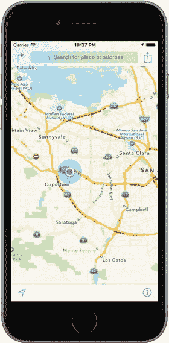

图 19-1. “地图”应用使用 Core Location 来确定你的当前位置。外圈是水平精度的直观表示。

`CLLocation` 对象还有一个名为 `altitude` 的属性，类型为 `CLLocationDistance`，它告诉你当前处于海平面以上（或以下）多少米：

```
let altitude = theLocation.altitude
```

每个 `CLLocation` 对象都维护着一个名为 `verticalAccuracy` 的属性，该属性表示 Core Location 对其海拔高度确定结果的置信度。`altitude` 中的值可能与实际值相差 `verticalAccuracy` 中的米数。如果 `verticalAccuracy` 值为负，则表明 Core Location 无法确定有效的海拔高度。

`floor` 属性提供用户所在建筑内的楼层号。该值仅在能够提供此信息的建筑中有效，因此你不应依赖其可用性。

`CLLocation` 对象包含一个 `timestamp`，用于告知定位管理器进行位置确定的时间。

除了这些属性外，`CLLocation` 还有一个有用的实例方法，可让你确定两个 `CLLocation` 对象之间的距离。该方法名为 `distanceFromLocation()`，返回值为 `CLLocationDistance` 类型（实质上是一个 `Double`），因此你可以在算术计算中使用它，正如你将在我们即将创建的应用中看到的那样。以下是此方法的使用方式：

```
let distance = fromLocation.distanceFromLocation(toLocation)
```

上述代码行返回两个 `CLLocation` 对象 `fromLocation` 和 `toLocation` 之间的距离。返回的 `distance` 值包含大圆距离计算的结果，该计算忽略 `altitude` 属性，并将两点的距离计算为仿佛它们都在海平面。对于大多数用途，大圆距离计算提供的信息已足够；但是，如果你希望在计算距离时考虑海拔高度，则需要自行编写代码。

**注**：如果你不确定大圆距离的含义，其概念是：地球表面任意两点之间的最短距离将沿着一条路径找到，若将该路径延伸，它将环绕地球一周：即一个“大圆”。最明显的大圆或许是你在地图上看到的那些：赤道和经线。然而，对于地球表面任意两点，都可以找到这样一个大圆。`CLLocation` 执行的计算会考虑地球的曲率，确定两点沿此类路径的距离。如果不考虑曲率，你将得到连接两点的直线长度，这没什么用，因为该直线必然会穿过地球内部一定距离。


### 错误通知

如果 Core Location 需要向你的应用程序报告错误，它会调用一个名为 `locationManager(_:didFailWithError:)` 的代理方法。错误的一个可能原因是用户拒绝了定位服务访问权限，在这种情况下，该方法会携带错误代码 `CLError.Denied` 被调用。定位管理器支持的另一个常见错误代码是 `CLError.LocationUnknown`，它表示 Core Location 无法确定位置，但会继续尝试。虽然 `CLError.LocationUnknown` 错误表明的问题可能只是暂时的，但 `CLError.Denied` 和其他错误可能意味着你的应用程序在当前会话的剩余时间内将无法访问 Core Location。

> **注意：** 模拟器无法确定你的当前位置，但你可以从模拟器的 **Debug➤ Location** 菜单中选一个位置（例如苹果总部，这是默认选项），或设置你自己的位置。

## 创建 WhereAmI 应用程序

我们来构建一个小型应用，用于检测设备的当前位置以及程序运行期间走过的总距离。你可以在图 19-2 中看到该应用程序第一个版本的效果。

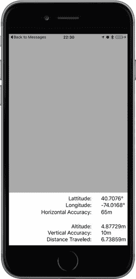

图 19-2. WhereAmI 应用程序运行界面

在 Xcode 中，使用 **单视图应用（Single View Application）** 模板创建一个新项目，并将其命名为 `WhereAmI`。当项目窗口打开后，选择 `ViewController.swift`，并进行以下修改：

```
import UIKit
import CoreLocation
import MapKit
class ViewController: UIViewController, CLLocationManagerDelegate {
```

首先，注意我们已经导入了 Core Location 框架。Core Location 并不属于 `UIKit` 或 `Foundation`，因此我们需要手动导入它。接下来，我们让此类遵循 `CLLocationManagerDelegate` 协议，以便能够从定位管理器接收位置信息。

现在添加以下属性声明：

```
private let locationManager = CLLocationManager()
private var previousPoint: CLLocation?
private var totalMovementDistance = CLLocationDistance(0)
@IBOutlet var latitudeLabel: UILabel!
@IBOutlet var longitudeLabel: UILabel!
@IBOutlet var horizontalAccuracyLabel: UILabel!
@IBOutlet var altitudeLabel: UILabel!
@IBOutlet var verticalAccuracyLabel: UILabel!
@IBOutlet var distanceTraveledLabel: UILabel!
@IBOutlet var mapView:MKMapView!
```

`locationManager` 属性保存了对我们将要使用的 `CLLocationManager` 实例的引用。`previousPoint` 属性将跟踪上一次从定位管理器接收到的更新位置。这样，每当用户移动距离足够触发更新时，我们就可以将最新的移动距离累加到 `totalMovementDistance` 属性中。其余属性是用于更新用户界面标签的插座变量。

现在选择 `Main.storyboard`，开始创建用户界面。首先，在文档大纲中展开视图控制器层次结构，选择 **View** 项，然后在属性检查器中将其背景颜色更改为浅灰色。接下来，从对象库中拖一个 `UIView` 放到现有视图上，调整其位置和大小，使其覆盖主视图的底部区域。确保该视图的底部、左侧和右侧与灰色视图完全对齐。目标是创建如图 19-2 所示的布局，其中你刚刚放置的视图是底部带有白色背景的那个。

在文档大纲中，选择你刚刚添加的视图，按住 Control 键从该视图拖拽到其父视图并释放鼠标。在出现的弹出菜单中，按住 Shift 键并依次点击 **Leading Space to Container Margin**、**Trailing Space to Container Margin** 和 **Vertical Spacing to Bottom Layout Guide**。这样可以将视图固定到位，但还没有设置其高度。要设置高度，在文档大纲中保持该视图被选中状态，点击 **Pin** 按钮。在弹出的菜单中，选中 **Height** 复选框，将高度设置为 **166**，将 **Update Frames** 设置为 **Items of New Constraint**，然后点击 **Add 1 Constraint** 来设置高度。这样就完成了。

接下来，我们要创建图 19-2 中最右侧的一列标签。从对象库中拖一个标签放到白色视图顶部略靠下的位置。将其宽度调整为大约 80 点，并移动到靠近视图右边缘的位置。按住 Option 键向下拖动该标签五次，复制出一组堆叠的标签，如图 19-2 所示。现在我们来固定这些标签相对于父视图的大小和位置。


从文档大纲中最顶层的标签开始，按住 Control 键并从该标签拖拽到其父视图。松开鼠标。按住 Shift 键，选择`Top Space to Container`和`Trailing Space to Container`，然后按下 Return。要设置标签的大小，点击 Pin 按钮以打开“添加新约束”弹出菜单，勾选`Width`和`Height`复选框，输入`80`作为宽度、`21`作为高度（如果尚未设置），然后点击`Add 2 Constraints`。现在你已经固定了顶部标签的大小和位置。对其余五个标签重复相同的过程。

接下来，我们将添加第二列标签。从对象库中拖拽一个标签，将其放置在顶部标签的左侧，两者之间留出一个小水平间隙。拖拽标签的左侧，使其几乎到达白色视图的左边缘，然后在属性检查器中设置对齐方式，使标签文本右对齐。通过按住 Option 键向下拖拽，复制此标签五次，使每个副本与右侧对应的标签对齐，以形成图 19-3 中的布局。

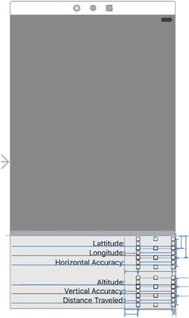

图 19-3. 我们的 UI 布局目标

选择左列顶部的标签，按住 Control 键并从其左侧拖拽到白色视图的左侧。松开鼠标，在上下文菜单中选择`Leading Space to Container`。接着，按住 Control 键从同一个标签拖拽到右列中对应的标签。松开鼠标打开上下文菜单，按住 Shift 键，选择`Horizontal Spacing`和`Baseline`，然后按下 Return。对左列中的其他五个标签执行相同操作。最后，在文档大纲中选择视图控制器图标，点击“解决自动布局问题”按钮，如果可用则选择`Update Frames`。

我们快要完成了。现在需要将右列中的标签连接到视图控制器的插座。按住 Control 键从文档大纲中的黄色视图控制器图标拖拽到右列的顶部标签，然后松开鼠标。在出现的弹出窗口中，选择`latitudeLabel`。按住 Control 键从视图控制器图标拖拽到第二个标签，将其连接到`longitudeLabel`插座；拖拽到第三个标签，连接到`horizontalAccuracyLabel`；拖拽到第四个标签，连接到`altitudeLabel`；拖拽到第五个标签，连接到`verticalAccuracyLabel`；拖拽到最底部的标签，连接到`distanceTraveledLabel`插座。现在你已经连接了所有六个插座。

最后，清除右列所有标签中的文本，并将左列标签的文本修改为与图 19-3 一致：顶部标签的文本应为`Latitude:`，其下方一个应为`Longitude:`，以此类推。

现在让我们编写代码，在这些标签中显示一些有用的信息。选择`ViewController.swift`并在`viewDidLoad()`中插入以下几行，以配置位置管理器：

```swift
override func viewDidLoad() {
    super.viewDidLoad()
    // Do any additional setup after loading the view, typically from a nib.
    locationManager.delegate = self
    locationManager.desiredAccuracy = kCLLocationAccuracyBest
    locationManager.requestWhenInUseAuthorization()
```

我们将控制器类指定为位置管理器的代理，将所需精度设置为最佳可用值，然后请求用户在使用应用程序时使用位置服务的权限。对于本示例的目的来说，这已经是足够的授权。要使用 Core Location 的一些更高级功能（这些功能超出了本书的范围），你可能需要通过调用`requestAlwaysAuthorization()`方法来请求随时使用 Core Location 的权限。

> **注意**
>
> 在这个简单的示例中，授权请求是在应用程序启动时发出的，但 Apple 建议，在实际应用程序中，你应该延迟发出请求，直到实际需要使用位置服务时。原因在于，如果基于用户已请求的操作，用户更有可能同意你访问设备位置的需求；而如果应用程序（很可能是用户刚刚安装的）在启动时立即请求权限，用户同意的可能性较小。

当此应用程序首次运行时，iOS 将显示一个警报，询问用户是否应允许你的应用程序使用其位置。你需要提供一段简短文本，iOS 会将其包含在警报弹出窗口中，解释你的应用程序为何需要知道用户的位置。打开`Info.plist`文件，并在键`NSLocationWhenInUseUsageDescription`下添加你希望显示的文本（如果你需要在应用程序未主动使用时请求使用位置服务的权限，则文本应添加到键`NSLocationAlwaysUsageDescription`下）。对于本示例，可以使用类似于“此应用程序需要知道您的位置，以便在地图上更新您的坐标”的文本。

> **警告**
>
> 在早期版本的 iOS 中，提供文本来限定权限请求是可选的。从 iOS 8 开始，这变成了强制性的。如果你不提供任何文本，权限请求将不会被发出。

如果现在运行应用程序，你会看到 iOS 在权限请求中使用了你的文本，如图 19-4 所示。如果提示不出现，请确保你在`Info.plist`中正确拼写了键的名称。由于我们目前尚未完成应用程序，你暂时还看不到背景中的地图。但图 19-4 会给你一个我们接下来要实现的效果的预览。

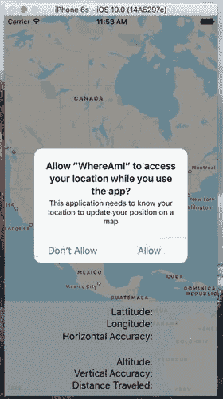

图 19-4. 提示用户允许使用位置服务

此提示仅在应用程序的生命周期中出现一次。无论用户是否允许你的应用程序使用位置服务，此请求都不会再重复出现，无论应用程序运行多少次。当然，这并不意味着用户无法改变主意。我们将在接下来的“更改位置服务权限”部分中对此进行更多说明。就测试而言，从 Xcode 重新运行应用程序不会影响用户已保存的响应——要获得干净的测试状态，你需要从模拟器或设备中删除应用程序。如果这样做，当你重新安装并重新启动应用程序时，iOS 会再次提示权限。现在，对提示回复“允许”，然后继续编写我们的应用程序。

你可能已经注意到，`viewDidLoad()`方法在调用`requestWhenInUseAuthorization()`之后并没有立即调用位置管理器的`startUpdatingLocation()`方法。事实上，这样做毫无意义，因为授权过程不会立即发生。在`viewDidLoad()`返回后的某个时刻，位置管理器代理的`locationManager(_:didChangeAuthorizationStatus:)`方法将被调用，并传入应用程序的授权状态。这可能是用户对权限请求弹出窗口的回复结果，也可能是应用程序上次执行时的已保存授权状态。无论如何，此方法是在你获得授权的情况下开始监听位置更新或请求用户位置的理想位置。将以下对该方法的实现添加到`ViewController.swift`文件中：


```swift
func locationManager(_ manager: CLLocationManager,
didChangeAuthorization status: CLAuthorizationStatus) {
print("授权状态已更改为 \(status.rawValue)")
switch status {
case .authorizedAlways, .authorizedWhenInUse:
locationManager.startUpdatingLocation()
default:
locationManager.stopUpdatingLocation()
}
}
```

这段代码的逻辑是：如果获得了授权，就开始监听位置更新；如果未获得授权，则停止监听。既然只有在获得授权的情况下才会开始监听，那么如果未获得权限，调用 `stopUpdatingLocation()` 有什么意义呢？这是个好问题。之所以需要这段代码，是因为用户可以先授予你的应用使用 Core Location 的权限，随后又撤销该权限。在这种情况下，我们就需要停止监听更新。有关更多信息，请参阅本章后面的“更改位置服务权限”。

如果你的应用在没有获得权限的情况下尝试使用位置服务，或者在任何时候发生错误，位置管理器都会调用其委托的 `locationManager(_:didFailWithError:)` 方法。让我们将该方法的实现添加到视图控制器中：

```swift
func locationManager(_ manager: CLLocationManager,
didFailWithError error: NSError) {
let errorType = error.code == CLError.denied.rawValue
? "访问被拒绝": "错误 \(error.code)"
let alertController = UIAlertController(title: "位置管理器错误",
message: errorType, preferredStyle: .alert)
let okAction = UIAlertAction(title: "确定", style: .cancel,
handler: { action in })
alertController.addAction(okAction)
present(alertController, animated: true,
completion: nil)
}
```

在本示例中，当发生错误时，我们只是向用户发出警告。在实际应用中，你应使用更有意义的错误信息，并根据需要清理应用程序状态。

## 使用位置管理器更新

现在，我们已经处理了获取使用用户位置权限的问题，接下来利用这些信息做点什么。在 `ViewController.swift` 中插入委托的 `locationManager(_:didUpdateLocations:)` 方法的实现（参见清单 19-3）。

```swift
func locationManager(_ manager: CLLocationManager, didUpdateLocations
locations: [CLLocation]) {
if let newLocation = locations.last {
let latitudeString = String(format: "%g\u{00B0}",
newLocation.coordinate.latitude)
latitudeLabel.text = latitudeString
let longitudeString = String(format: "%g\u{00B0}",
newLocation.coordinate.longitude)
longitudeLabel.text = longitudeString
let horizontalAccuracyString = String(format:"%gm",
newLocation.horizontalAccuracy)
horizontalAccuracyLabel.text = horizontalAccuracyString
let altitudeString = String(format:"%gm", newLocation.altitude)
altitudeLabel.text = altitudeString
let verticalAccuracyString = String(format:"%gm",
newLocation.verticalAccuracy)
verticalAccuracyLabel.text = verticalAccuracyString
if newLocation.horizontalAccuracy > 100 ||
newLocation.verticalAccuracy > 50 {
// 精度半径过大，我们不使用它
return
}
if previousPoint == nil {
totalMovementDistance = 0
} else {
print("移动距离: " +
"\(newLocation.distance(from: previousPoint!))")
totalMovementDistance +=
newLocation.distance(from: previousPoint!)
}
previousPoint = newLocation
let distanceString = String(format:"%gm", totalMovementDistance)
distanceTraveledLabel.text = distanceString
}
}
```

在这个委托方法中，我们首先用 `locations` 参数传入的 `CLLocation` 对象中的值，更新图 19-3 第二列中的前五个标签。该数组可能包含多次位置更新，但我们始终使用最后一项，它代表最新的信息。

**注意**：经度和纬度都显示在包含看似神秘的 `\u{00B0}` 的格式化字符串中。这是度数符号 (°) 的 Unicode 表示的十六进制值。将 ASCII 字符以外的任何内容直接放入源代码文件绝不是一个好主意，但在字符串中包含十六进制值则完全没问题，这也是我们在此处所做的。

接着，我们检查位置管理器给我们的数值的精度。高精度的数值表示位置管理器对位置不太确定，而负精度数值则表示该位置实际上是无效的。有些设备没有确定垂直位置所需的硬件。在这些设备以及模拟器上，`verticalAccuracy` 属性将始终为 –1，因此我们不会排除具有此值的位置报告。精度值以米为单位，表示从我们获得的位置点向外的一个圆的半径，这意味着真实位置可能在该圆内的任何地方。我们的代码会检查这些数值是否可接受；如果不可接受，则直接从该方法返回，而不是继续对垃圾数据进行任何操作：

```swift
if newLocation.horizontalAccuracy > 100 ||
newLocation.verticalAccuracy > 50 {
// 精度半径过大，我们不使用它
return
}
```

接下来，我们检查 `previousPoint` 是否为 `nil`。如果是，那么此次更新是我们在位置管理器中获得的第一个有效更新，因此我们将 `distanceFromStart` 属性归零。否则，我们将最新位置与上一个点的距离累加到总距离中。无论哪种情况，我们都会更新 `previousPoint` 以包含当前位置：

```swift
if previousPoint == nil {
totalMovementDistance = 0
} else {
print("移动距离: " +
"\(newLocation.distance(from: previousPoint!))")
totalMovementDistance +=
newLocation.distance(from: previousPoint!)
}
previousPoint = newLocation
```

之后，我们用从起点开始移动的总距离来填充最后一个标签。当此应用程序运行时，如果用户移动的距离足够远，以至于位置管理器能检测到变化，则**已移动距离：**字段将持续更新用户自应用程序启动以来所移动的距离：

```swift
let distanceString = String(format:"%gm", totalMovementDistance)
distanceTraveledLabel.text = distanceString
```

这就是全部内容了。Core Location 相当直观且易于使用。编译并运行应用程序，然后测试一下。如果你能在 iPhone 或 iPad 上运行该应用程序，不妨请其他人驾车，你带着运行中的应用程序兜一圈，观察随你移动而变化的数值。


### 在地图上可视化你的移动轨迹

到目前为止我们所做的工作相当有趣，但如果能在地图上直观地看到我们的旅行路线，岂不是更好？幸运的是，iOS 提供了 Map Kit 框架来帮助我们实现这一点。Map Kit 使用了与 Apple 地图应用相同的后端服务，这意味着它相当强大且不断改进。它包含一个用于显示地图的视图类，该视图能够响应用户手势，正如你对任何现代地图应用的期待一样。这个视图还允许我们为任何想要在地图上显示的坐标位置插入标注，默认情况下这些标注会显示为可触摸的“大头针”，点击后能显示更多信息。我们将扩展 WhereAmI 应用，使其能够在地图上显示用户的起始位置和当前位置。

选择 `ViewController.swift`，并添加以下代码行来导入 Map Kit 框架：

```
import UIKit
import CoreLocation
import MapKit
```

现在，为将显示用户位置的地图视图添加一个新的属性声明：

接下来选择 `Main.storyboard` 来编辑视图。从对象库中拖拽一个地图视图，并将其放置到用户界面的上半部分。调整地图视图的大小，使其覆盖整个屏幕，包括我们之前添加的视图及其所有标签，然后选择 **Editor** ➤ **Arrange** ➤ **Send to Back**，将地图视图移动到其他视图的后面。

> **提示**
> 如果 **Send to Back** 选项不可用，你可以通过在文档大纲中将地图视图向上拖动来达到相同效果，使其在父级子列表中出现在包含标签的视图之前。

在文档大纲中，按住 Control 键从地图视图拖拽到其父视图，在上下文菜单中，按住 Shift 键并选择 **Leading Space to Container Margin**、**Trailing Space to Container Margin**、**Vertical Spacing to Top Layout Guide** 和 **Vertical Spacing to Bottom Layout Guide**，然后按 Return 键。

现在地图视图已固定到位，但其底部部分被遮挡了。我们可以通过让底部的视图部分透明来解决这个问题。为此，在文档大纲中选择它，打开属性检查器，点击 **Background** 颜色编辑器，在弹出的选项中，选择 **Other…** 打开颜色选择器。选择白色背景，并将不透明度滑块移动到约 70%。最后，按住 Control 键从文档大纲中的视图控制器图标拖拽到地图视图，在弹出的选项中选择 `mapView`，将地图连接到其输出口。

现在这些准备工作已经就绪，是时候编写一些代码让地图为我们工作了。在处理视图控制器所需的代码之前，我们需要建立一个模型类来表示我们的起始点。`MKMapView` 是作为 MVC（模型-视图-控制器）架构中的视图部分构建的。如果我们有独立的类来表示地图上的标记，它的工作效果最佳。我们可以将模型对象传递给地图视图，地图视图将使用 Map Kit 框架中定义的协议查询它们的坐标、标题等信息。

按下 `⌘N` 调出新建文件助手，在 iOS 源文件部分，选择 **Cocoa Touch Class**。将类命名为 `Place`，并使其成为 `NSObject` 的子类。打开 `Place.swift` 并按下文所示进行修改。你需要导入 Map Kit 框架，指定新类要遵循的协议，并按照列表 19-4 所示指定属性。

```
import UIKit
import MapKit
class Place: NSObject, MKAnnotation {
    let title: String?
    let subtitle: String?
    var coordinate: CLLocationCoordinate2D
    init(title:String, subtitle:String, coordinate:CLLocationCoordinate2D) {
        self.title = title
        self.subtitle = subtitle
        self.coordinate = coordinate
    }
}
列表 19-4.
Place.swift 文件中的新 Place 类
```

这是一个相当“简单”的类，仅作为这些属性的容器。在实际例子中，你可能需要将真正的模型类作为标注显示在地图上，而 `MKAnnotation` 协议允许你将此功能添加到任何你自己的类中，而不会破坏任何现有的类层次结构。选择 `ViewController.swift`，并将以下两行粗体代码添加到 `locationManager(_:didChangeAuthorizationStatus:)` 方法中：

```
func locationManager(_ manager: CLLocationManager,
didChangeAuthorization status: CLAuthorizationStatus) {
    print("授权状态变更为 \(status.rawValue)")
    switch status {
    case .authorizedAlways, .authorizedWhenInUse:
        locationManager.startUpdatingLocation()
        mapView.showsUserLocation = true
    default:
        locationManager.stopUpdatingLocation()
        mapView.showsUserLocation = false
    }
}
```

地图视图的 `showsUserLocation` 属性正如你想象的那样：它省去了我们手动随用户移动而移动标记的麻烦，而是自动为我们绘制一个标记。它使用 Core Location 获取用户位置，并且仅在你的应用获得授权时才起作用；因此，我们在被告知拥有使用 Core Location 的权限时启用该属性，并在失去权限时再次禁用它。

现在让我们重新审视 `locationManager(_:didUpdateLocations:)` 方法。我们已经在其中添加了一些代码，用于检测接收到的第一个有效位置数据并建立我们的起始点。我们还将分配一个新的 `Place` 类实例。我们设置其属性并为其指定位置。我们还添加了当该位置标记显示时希望出现的标题和副标题。最后，我们将此对象传递给地图视图。我们还创建了一个 `MKCoordinateRegion` 实例，这是 Map Kit 中包含的一个结构体，用于告诉视图我们希望显示地图的哪个区域。`MKCoordinateRegion` 使用我们新位置的坐标和一对方形区域距离（以米为单位，这里是 100, 100），指定了显示的地图部分的宽度和高度。我们也将此传递给地图视图，并告诉它动画化这一变化。所有这些都通过添加如下所示的粗体代码行来完成：

```
if previousPoint == nil {
    totalMovementDistance = 0
    let start = Place(title:"起始点",
                      subtitle:"这是我们出发的地方",
                      coordinate:newLocation.coordinate)
    mapView.addAnnotation(start)
    let region = MKCoordinateRegionMakeWithDistance(newLocation.coordinate,
                                                    100, 100)
    mapView.setRegion(region, animated: true)
} else {
    print("移动距离: " +
          "\(newLocation.distance(from: previousPoint!))")
    totalMovementDistance +=
        newLocation.distance(from: previousPoint!)
}
```

现在，我们已经告诉地图视图有一个我们希望用户看到的标注（即一个可见的位置标记）。但它应该如何显示呢？地图视图通过询问其委托来决定每个标注应显示何种视图。在一个更复杂的应用中，委托机制会为我们工作。但在本例中，我们并没有设置委托，仅仅是因为对于我们的简单用例来说没有必要。与 `UITableView` 要求其数据源提供用于显示的单元格不同，`MKMapView` 采用了不同的策略：如果委托没有提供标注视图，它就会在地图上显示一个默认视图，即一个红色的“大头针”，点击它后会显示更多信息。


你还需要做最后一件事——让你的应用能够使用 Map Kit。为此，在项目导航器中选择项目，然后选择 WhereAmI 目标。在编辑器区域顶部，选择 Capabilities，找到 Maps 部分，并将右侧的选择开关从 OFF 拨到 ON。现在构建并运行你的应用，你会看到地图视图加载。一旦它获得有效的位置数据，你会看到它滚动到正确的位置，在你的起点放置一个图钉，并用一个发光的蓝点标记你的当前位置（参见图 19-5）。对于几十行代码来说，这已经很不错了。

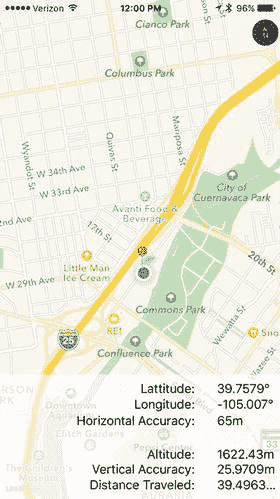

图 19-5。

红色图钉标记了我们的起始位置，蓝色圆点显示了我们已经移动了多远——在这个例子中，距离为零。

**提示：** 如果你正在使用真机，并且地图没有缩放以显示你的当前位置，那是因为 Core Location 无法在 100 米范围内确定你的位置。启用 Wi-Fi 可能会有所帮助，这有时能提高 Core Location 的精度。

### 更改位置服务权限

当你的应用首次运行时，你希望用户会授予它使用位置服务的权限。无论你是否获得权限，你都不能假设情况不会改变。用户可以通过“设置”应用授予或撤销位置权限。你可以在模拟器上测试这一点。启动应用并授予自己使用 Core Location 的权限（如果你之前拒绝过权限，需要先删除并重新安装应用）。你应该能看到地图上你的位置。现在进入“设置”应用，选择“隐私”➤“定位服务”。屏幕顶部有一个开关，用于打开或关闭定位服务。将开关拨到 OFF，然后返回你的应用。你会看到地图不再显示你的位置。这是因为位置管理器调用了 `locationManager(_:didChangeAuthorizationStatus:)` 方法，并传入了授权码 `CLAuthorizationStatus.denied`，作为响应，应用停止接收位置更新并告诉 Map Kit 停止跟踪用户的位置。现在返回“设置”应用，在“定位服务”中重新启用 Core Location，再回到你的应用；你会发现它又开始跟踪你的位置了。

关闭“定位服务”并不是用户更改你应用使用 Core Location 权限的唯一方式。返回“设置”应用。在启用定位服务的开关下方，你会看到所有使用它的应用列表，包括 WhereAmI，如图 19-6 左侧所示。点击应用名称会进入另一个页面，在那里你可以允许或拒绝访问你的应用，如图 19-6 右侧所示。目前，应用可以在用户使用应用时使用定位服务。如果你点击“永不”，该权限就会被撤销，你可以通过返回应用来验证这一点。这表明，编写应用以使其能够检测并正确响应授权状态的变化非常重要。

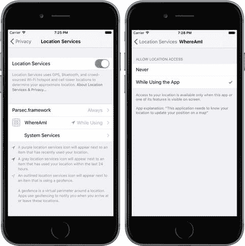

图 19-6。

更改 WhereAmI 应用的 Core Location 访问权限

## 总结

我们对 Core Location 和 Map Kit 的介绍到此结束。关于这两个框架，还有更多值得探索的内容。以下是一些重点：

* 对于不需要很高位置精度或更新频率的应用（如天气应用），可以使用显著位置变更服务，而不是通过 `startUpdatingLocation()` 方法紧密跟踪用户位置。如果可能，应尽量使用此服务，因为它可以显著降低功耗。
* 在带有磁力计的设备上，Core Location 可以报告用户的朝向。如果设备还有 GPS，它还可以报告用户移动的方向。
* Core Location 可以报告用户何时进入或离开应用定义的区域（定义为具有给定半径和圆心的圆），或者当应用处于 iBeacon 附近时。
* 你可以使用 Geocoding 服务，在 Core Location 报告的坐标和用户友好的地标对象之间进行双向转换。除此之外，Map Kit 还提供了一个 API，允许你按名称或地址搜索位置。
* Core Location 会监控用户的移动，并能判断用户何时在某地停留一段时间。发生这种情况时，系统会认为用户正在“访问”该位置。当用户到达和离开被访问的位置时，你的应用可以收到通知。

有关所有这些功能的最佳信息来源是苹果的 "Location and Maps Programming Guide"。

尽管底层技术相当复杂，但苹果提供了简单的接口来隐藏大部分复杂性，使得向你的应用添加与位置和地图相关的功能变得非常容易，这样你就可以知道用户在哪里，注意到他们何时移动，并在地图上标记他们的位置（以及任何其他位置）。说到移动，在下一章中，我们将探讨 iPhone 内置的加速度计。

# 20. 设备方向和运动

iPhone、iPad 和 iPod touch 都包含一个内置的加速度计——这个微小的设备让 iOS 知道设备是如何被握持的，以及它是否在移动。iOS 使用加速度计来处理自动旋转，许多游戏也将其用作控制机制。加速度计还可用于检测摇晃和其他突然移动。随着 iPhone 4 的推出，这一功能得到了进一步扩展，它是第一款包含内置陀螺仪的 iPhone，可以让开发者确定设备绕每个轴的角度。现在，陀螺仪和加速度计已成为所有新款 iPad 和 iPod touch 的标准配置。在本章中，我们将探讨如何使用 Core Motion 框架在你的应用中访问陀螺仪和加速度计的值。


## 加速度计物理学

加速度计通过感知特定方向上的惯性力大小，同时测量加速度和重力。iOS 设备中的加速度计是一个三轴组件，这意味着它能够检测三维空间中的运动或重力牵引。换句话说，你不仅可以利用加速度计判断设备当前如何被握持（就像自动旋转功能那样），还能知道它是否平放在桌面上，甚至判断屏幕是朝下还是朝上。加速度计以`g`力（`g`代表重力）为单位进行测量，因此加速度计返回`1.0`的值意味着在特定方向上感知到了`1g`的力，例如以下情况：

- 如果设备静止不动，地球引力将对其施加大约`1g`的力。
- 如果设备完全直立，呈竖屏方向，它将检测并报告`y`轴上施加了约`1g`的力。
- 如果设备以一定角度握持，这`1g`的力会根据握持方式分布在不同轴上。当设备呈 45 度角握持时，`1g`的力将大致平均分布在两个轴上。

通过寻找明显大于`1g`的加速度计数值，可以检测到突然的运动。在正常使用中，加速度计在任何轴上检测到的值通常不会显著超过`1g`。如果你摇晃、掉落或投掷设备，加速度计将检测到一个或多个轴上更大的力。

图 20-1 展示了加速度计所用三个轴的图形表示。请注意，加速度计对`y`坐标采用了更标准的约定：`y`值增加表示向上的力，这与 Quartz 2D 的坐标系（在第 16 章讨论）相反。当你将加速度计作为与 Quartz 2D 配合使用的控制机制时，需要转换`y`坐标。而在使用 Sprite Kit（更可能的情况是你利用加速度计控制动画）时，则无需进行转换。

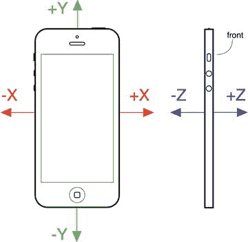

**图 20-1.** iPhone 加速度计的三维轴。左侧的 iPhone 正面视图显示了`x`和`y`轴，右侧的侧面视图显示了`z`轴

## 使用陀螺仪检测旋转

我之前提到，目前所有设备都包含陀螺仪传感器，允许你读取描述设备绕其轴旋转的值。如果你觉得陀螺仪与加速度计的区别还不清楚，可以想象一部 iPhone 平放在桌子上。当你开始水平转动手机时，加速度计的值不会改变。这是因为作用于移动手机的力——本案例中，仅仅是沿`z`轴垂直向下的重力——并未发生变化。（实际上，情况比这复杂一些，你手部触碰手机的动作肯定会触发微小的加速度计响应。）然而，在同一运动中，设备的旋转值会发生变化——特别是`z`轴的旋转值。顺时针转动设备会产生负值，逆时针转动则产生正值。停止转动后，`z`轴的旋转值会归零。陀螺仪并非记录绝对的旋转值，而是实时报告设备旋转的变化。你将在本章的第一个示例中了解其工作原理。

## Core Motion 与运动管理器

我们将使用 Core Motion 框架获取加速度计和陀螺仪的值。该框架除了其他功能外，还提供了`CMMotionManager`类，它充当了所有描述用户如何移动设备的数据的门户。应用程序创建一个`CMMotionManager`实例，然后以以下两种模式之一使用它：

- 它可以在发生运动时为你执行某些代码。
- 它可以保持一个持续更新的结构，让你随时访问最新的数值。

后一种方法为游戏和其他需要能够在游戏循环的每一轮中轮询设备当前状态的高度交互式应用程序提供了理想解决方案。我将向你展示如何实现这两种方法。请注意，`CMMotionManager`类实际上并不是单例，但你的应用程序应将其视为单例，并且每个应用只应创建一个此类实例。因此，如果你需要从应用的多个位置访问运动管理器，最好在应用程序委托中创建它，并从那里提供访问接口。

除了`CMMotionManager`类，Core Motion 还提供了其他几个类，例如`CMAccelerometerData`和`CMGyroData`，它们是简单的容器，应用程序可通过它们访问原始加速度计和陀螺仪信息；以及`CMDeviceMotion`类，它结合了加速度计和陀螺仪的测量值以及姿态信息——即设备是否平放、向上倾斜还是向左倾斜等等。在本章的示例中，我们将使用`CMDeviceMotion`类。


### 创建 MotionMonitor 应用程序

前面提到过，运动管理器可以在一种模式下运行，即每次运动数据发生变化时，它会为你执行一些代码。大多数其他 Cocoa Touch 类通过让你连接到一个委托（delegate），当时间到来时该委托会收到一条消息来提供此类功能，但 Core Motion 的做法略有不同。`CMMotionManager` 没有使用一组委托方法来通知我们发生了什么，而是允许你传入一个闭包（closure），以便在运动发生时执行。我们在本书中已经多次使用过闭包，现在你将看到该技术的另一种应用。

使用 Xcode 创建一个名为 MotionMonitor 的新 Single View Application 项目。这将是一个简单的应用程序，用于读取加速度计数据、陀螺仪数据（如果可用）以及姿态信息，然后将这些信息显示在屏幕上。

> **注意**  
> 本章中的应用程序在模拟器上无法运行，因为模拟器没有加速度计。

现在选择 `ViewController.swift` 文件并进行以下更改：

```
class ViewController: UIViewController {
    @IBOutlet var gyroscopeLabel: UILabel!
    @IBOutlet var accelerometerLabel: UILabel!
    @IBOutlet var attitudeLabel: UILabel!
}
```

这为我们提供了三个标签的插座，用于显示信息。这里不需要过多解释，只需保存更改即可。接下来，在 Interface Builder 中打开 `Main.storyboard`。从库中拖出一个 `Label` 到视图中。调整标签大小，使其从屏幕左侧延伸到右侧，高度约为整个视图的三分之一，然后将标签顶部与顶部蓝色对齐线对齐。现在打开属性检查器，将 `Lines` 字段从 1 改为 0。`Lines` 属性用于指定标签中可能出现的文本行数，并提供一个硬性上限。如果将其设置为 0，则不应用限制，标签可以包含任意多行。

接下来，从库中拖出第二个标签，直接放在第一个标签下方。将其顶部与第一个标签的底部对齐，并将其两侧与屏幕的左右边缘对齐。将其调整到与第一个标签大致相同的高度。这里不需要太精确，因为我们将使用自动布局来控制标签的最终高度。拖出第三个标签，将其顶部边缘与第二个标签的底部边缘对齐，然后将其调整大小，使其底部边缘与屏幕底部边缘对齐，并将其两侧与屏幕的左右边缘对齐。将两个标签的 `Lines` 属性都设置为 0。

现在让我们固定三个标签的位置和大小。在文档概览中，按住 Control 键从顶部标签拖到其父视图并释放鼠标。在弹出的菜单中，按住 Shift 键并选择 Leading Space to Container Margin、Vertical Spacing to Top Layout Guide 和 Trailing Space to Container Margin，然后按 Return。按住 Control 键从第二个标签拖到父视图。在弹出的菜单中，按住 Shift 键并选择 Leading Space to Container Margin 和 Trailing Space to Container Margin，然后按 Return。按住 Control 键从第三个标签拖到 Main View，这次按住 Shift 键，选择 Leading Space to Container Margin、Vertical Spacing to Bottom Layout Guide 和 Trailing Space to Container Margin。

现在所有三个标签都已固定到其父视图的边缘，让我们将它们相互连接起来。按住 Control 键从第二个标签拖到第一个标签，然后从弹出菜单中选择 Vertical Spacing。按住 Control 键从第二个标签拖到第三个标签，做同样的操作。最后，我们需要确保这些标签具有相同的高度。为此，按住 Shift 键并单击所有三个标签，使其全部被选中。单击 Pin 按钮。在弹出的窗口中，选中 Equal Heights 复选框，然后按 Add 2 Constraints。单击 Resolve Auto Layout Issues 按钮，然后单击 Update All Frames in View Controller。如果此选项不可用，请在文档大纲中选择 View Controller 图标并重试。

布局完成；现在让我们将标签连接到它们的插座。从文档大纲中的视图控制器图标按住 Control 键拖到顶部标签，释放鼠标，然后从弹出菜单中选择 `gyroscopeLabel`，将标签连接到其插座。对第二个标签做同样的操作，将其连接到 `accelerometerLabel`，第三个标签连接到 `attitudeLabel`。最后，双击每个标签并删除现有文本。这个简单的 GUI 就完成了，保存你的工作，准备编写一些代码。

接下来，选择 `ViewController.swift`。现在到了有趣的部分。将代码清单 20-1 中的代码添加到 `ViewController.swift` 文件中。

```
private let motionManager = CMMotionManager()
private let queue = OperationQueue()

override func viewDidLoad() {
    super.viewDidLoad()
    // 加载视图后的任何额外设置，通常从 nib 文件加载。
    if motionManager.isDeviceMotionAvailable {
        motionManager.deviceMotionUpdateInterval = 0.1
        motionManager.startDeviceMotionUpdates(to: queue) {
            (motion: CMDeviceMotion?, error: NSError?) -> Void in
            if let motion = motion {
                let rotationRate = motion.rotationRate
                let gravity = motion.gravity
                let userAcc = motion.userAcceleration
                let attitude = motion.attitude

                let gyroscopeText =
                    String(format: "旋转速率:\n-----------------\n" +
                        "x: %+.2f\ny: %+.2f\nz: %+.2f\n",
                        rotationRate.x, rotationRate.y, rotationRate.z)
                let acceleratorText =
                    String(format: "加速度:\n---------------\n" +
                        "重力 x: %+.2f\t\t 用户 x: %+.2f\n" +
                        "重力 y: %+.2f\t\t 用户 y: %+.2f\n" +
                        "重力 z: %+.2f\t\t 用户 z: %+.2f\n",
                        gravity.x, userAcc.x, gravity.y,
                        userAcc.y, gravity.z, userAcc.z)
                let attitudeText =
                    String(format: "姿态:\n----------\n" +
                        "滚转角: %+.2f\n 俯仰角: %+.2f\n 偏航角: %+.2f\n",
                        attitude.roll, attitude.pitch, attitude.yaw)

                DispatchQueue.main.async {
                    self.gyroscopeLabel.text = gyroscopeText
                    self.accelerometerLabel.text = acceleratorText
                    self.attitudeLabel.text = attitudeText
                }
            }
        }
    }
}
```

**代码清单 20-1.** 将以下代码添加到 `ViewController.swift` 文件

首先，我们导入 Core Motion 框架并向类中添加两个额外的属性：

```
import UIKit
import CoreMotion

class ViewController: UIViewController {
    @IBOutlet var gyroscopeLabel: UILabel!
    @IBOutlet var accelerometerLabel: UILabel!
    @IBOutlet var attitudeLabel: UILabel!

    private let motionManager = CMMotionManager()
    private let queue = OperationQueue()
```

这段代码首先创建了一个 `CMMotionManager` 的实例，我们将用它来监控运动事件。然后代码创建了一个操作队列，它只是一个用于容纳待完成工作的容器。

> **警告**  
> 运动管理器需要一个队列，每次事件发生时，它都会将你要完成的工作单元（由你提供的闭包指定）放入该队列中。人们可能会想使用系统的默认队列来实现此目的，但 `CMMotionManager` 的文档明确警告不要这样做。问题是，默认队列最终可能会被这些事件塞满，从而难以处理其他关键的系统事件。


```markdown
接下来，在`viewDidLoad`方法中，我们添加代码来请求设备运动更新，并在获取到陀螺仪、加速度计和姿态读数时更新标签。我们首先检查设备是否确实拥有提供运动信息所需的设备。到目前为止，所有已发布的手持 iOS 设备都具备此功能，但为了以防未来某些设备不具备，检查一下是值得的。接着，我们设置更新之间的时间间隔，以秒为单位指定。这里，我们要求十分之一秒的间隔。请注意，设置此值并不能保证我们能够以精确的速度接收更新。事实上，此设置实际上是一个上限，指定了运动管理器允许提供给我们的最佳速率。在实际中，它可能以更低的频率更新：

```
if motionManager.isDeviceMotionAvailable {
    motionManager.deviceMotionUpdateInterval = 0.1
}
```

接下来，我们告诉运动管理器开始报告设备运动更新。我们传入一个闭包，用于定义每次发生更新时将要执行的工作，以及该闭包将被排入执行队列的队列。在此例中，闭包接收一个`CMDeviceMotion`对象，该对象包含最新的运动数据，以及如果获取数据时发生错误则可能包含的`NSError`对象：

```
motionManager.startDeviceMotionUpdates(to: queue) {
    (motion: CMDeviceMotion?, error: NSError?) -> Void in
}
```

接下来是闭包本身。它根据当前的运动值创建字符串，并将它们推送到标签中。我们不能直接在此处这样做，因为像`UILabel`这样的 UIKit 类通常只有在从主线程访问时才能正常工作。由于此代码的执行方式（从`NSOperationQueue`内部执行），我们根本无法知道将在哪个特定线程中执行。因此，我们使用`DispatchQueue.main.async`函数，在设置标签的`text`属性之前将控制权传递给主线程。

陀螺仪值通过传入闭包的`CMDeviceMotion`对象的`rotationRate`属性访问。`rotationRate`属性的类型是`RotationRate`，它只是一个包含三个`Float`值的简单`struct`，分别表示绕 x、y 和 z 轴的旋转速率。加速度计数据稍微复杂一些，因为 Core Motion 报告两个不同的值——重力加速度和用户施加力引起的任何额外加速度。您可以从`gravity`和`userAcceleration`属性获取这些值，这两个属性的类型都是`CMAcceleration`。`CMAcceleration`是另一个简单的`struct`，用于保存沿 x、y 和 z 轴的加速度。最后，设备姿态在`attitude`属性中报告，其类型为`CMAttitude`。我们将在运行应用程序时进一步讨论这个问题。

在尝试运行应用程序之前，还有一件事要做。我们将以多种方式移动和旋转设备，以查看`CMDeviceMotion`结构中的值与设备实际发生的情况之间的关联。在此过程中，我们不希望自动旋转启动。为了防止这种情况，请在项目导航器中选择项目，选择`MotionMonitor`目标，然后选择“通用”标签。在“部署信息”下的“设备方向”部分中，选择“纵向”，并确保未选择其他三个方向。这将应用程序锁定为仅纵向方向。现在在您的 iOS 设备上构建并运行您的应用程序，然后尝试一下，如图 [20-2] 所示。

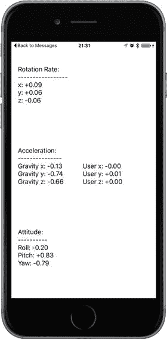

图 20-2. 在 iPhone 上运行的 MotionMonitor。不幸的是，如果您在模拟器中运行此应用程序，将无法获得任何有用的信息。

当您以不同方式倾斜设备时，您将看到旋转速率、加速度计和姿态值如何调整到每个新位置，并且只要您保持设备稳定，这些值也将保持稳定。每当设备静止时，无论其处于何种方向，旋转值都将徘徊在零附近。当您旋转设备时，您将看到旋转值根据您绕其各个轴转动设备的方式而变化。当您停止移动设备时，这些值将始终回到零。稍后我们将更仔细地查看所有结果。

### 主动运动访问

您已经了解了如何通过将`CMMotionManager`闭包传递给运动发生时被调用的方式来访问运动数据。这种事件驱动的运动处理对于普通的 Cocoa 应用程序来说已经足够好了，但有时它并不完全适合应用程序的特定需求。例如，交互式游戏通常有一个持续运行的循环，用于处理用户输入、更新游戏状态并重绘屏幕。在这种情况下，事件驱动的方法并不太合适，因为您需要实现一个对象，该对象等待运动事件，记住每个传感器报告的最新位置，并在必要时准备好将数据报告回主游戏循环。幸运的是，`CMMotionManager`有一个内置的解决方案。我们可以不使用传递闭包的方式，而是直接告诉它使用`startDeviceMotionUpdates()`方法激活传感器。一旦我们这样做，我们就可以随时直接从运动管理器读取值。

让我们更改我们的`MotionMonitor`应用程序以使用此方法，以便您了解其工作原理。首先，复制您的`MotionMonitor`项目文件夹，或者像我们在前面的示例中所做的那样将其压缩。

注意

您可以在示例源代码的`MonitorMotion2`文件夹中找到此项目的完整版本。

关闭打开的 Xcode 项目，然后打开新副本中的项目，直接进入`ViewController.swift`。第一步是删除`queue`属性，并添加一个新属性，即一个指向`NSTimer`的指针，该定时器将触发我们所有的显示更新：

```
class ViewController: UIViewController {
    @IBOutlet var gyroscopeLabel: UILabel!
    @IBOutlet var accelerometerLabel: UILabel!
    @IBOutlet var attitudeLabel: UILabel!
    private let motionManager = CMMotionManager()
    private var updateTimer: Timer!
}
```

接下来，删除`viewDidLoad()`方法，因为我们不再需要它。我们将使用定时器每十分之一秒直接从运动管理器收集运动数据，而不是将其传递到闭包中。我们希望我们的定时器——以及运动管理器本身——仅在应用程序的视图实际显示时才处于活动状态。这样，我们将主游戏循环的使用率降至最低。我们可以通过实现`viewWillAppear()`和`viewDidDisappear()`方法来实现这一点，如清单 [20-2] 所示。

```
override func viewWillAppear(_ animated: Bool) {
    super.viewWillAppear(animated)
    if motionManager.isDeviceMotionAvailable {
        motionManager.deviceMotionUpdateInterval = 0.1
        motionManager.startDeviceMotionUpdates()
        updateTimer =
            Timer.scheduledTimer(timeInterval: 0.1, target: self,
                                 selector: #selector(ViewController.updateDisplay), userInfo: nil, repeats: true)
    }
}

override func viewDidDisappear(_ animated: Bool) {
    super.viewDidDisappear(animated)
    if motionManager.isDeviceMotionAvailable {
        motionManager.stopDeviceMotionUpdates()
        updateTimer.invalidate()
        updateTimer = nil
    }
}
// 清单 20-2. 用于主动运动访问的 viewWillAppear 和 viewDidDisappear 方法
```

`viewWillAppear()`中的代码调用运动管理器的`startDeviceMotionUpdates()`方法来启动设备运动信息，然后创建一个新的定时器并将其安排为每十分之一秒触发一次，调用我们尚未创建的`updateDisplay()`方法。在`viewDidDisappear()`下方添加清单 [20-3] 中的方法。
```


## 排版后的内容

```swift
func updateDisplay() {
    if let motion = motionManager.deviceMotion {
        let rotationRate = motion.rotationRate
        let gravity = motion.gravity
        let userAcc = motion.userAcceleration
        let attitude = motion.attitude
        let gyroscopeText =
            String(format: "Rotation Rate:\n-----------------\n" +
                "x: %+.2f\ny: %+.2f\nz: %+.2f\n",
                rotationRate.x, rotationRate.y, rotationRate.z)
        let acceleratorText =
            String(format: "Acceleration:\n---------------\n" +
                "Gravity x: %+.2f\t\tUser x: %+.2f\n" +
                "Gravity y: %+.2f\t\tUser y: %+.2f\n" +
                "Gravity z: %+.2f\t\tUser z: %+.2f\n",
                gravity.x, userAcc.x, gravity.y,
                userAcc.y, gravity.z, userAcc.z)
        let attitudeText =
            String(format: "Attitude:\n----------\n" +
                "Roll: %+.2f\nPitch: %+.2f\nYaw: %+.2f\n",
                attitude.roll, attitude.pitch, attitude.yaw)
        DispatchQueue.main.async {
            self.gyroscopeLabel.text = gyroscopeText
            self.accelerometerLabel.text = acceleratorText
            self.attitudeLabel.text = attitudeText
        }
    }
}
```

**代码清单 20-3.** `updateDisplay()` 方法位于 `ViewController.swift` 文件中

这是之前版本示例中闭包代码的副本，不同之处在于`CMDeviceMotion`对象是直接从运动管理器获得的。注意`if let`表达式，它确保运动管理器返回的`CMDeviceMotion`值不是`nil`；这是必需的，因为定时器可能在运动管理器获取第一个数据样本之前触发。在你的设备上构建并运行该应用，你会看到它的行为与第一个版本完全相同。现在你已经了解了访问运动数据的两种方式。选择最适合你应用的方式。

### 陀螺仪与姿态结果

陀螺仪测量设备绕 x、y 和 z 轴旋转的速率。请参考图 20-1 了解这些轴如何与设备机身相关联。首先，将设备平放在桌子上。当设备不动时，所有三个旋转速率都接近于零，你会看到横滚角（`roll`）、俯仰角（`pitch`）和偏航角（`yaw`）的值也接近于零。现在轻轻顺时针旋转设备。当你这样做时，你会看到绕 z 轴的旋转速率变为负值。旋转设备越快，旋转速率的绝对值就越大。

当你停止旋转时，旋转速率将回到零，但偏航角不会。偏航角表示设备绕 z 轴从其初始静止位置旋转过的角度。如果你顺时针旋转设备，偏航角将通过负值减小，直到设备距其静止位置旋转 180°，此时其值将在 -3 左右。如果你继续顺时针旋转设备，偏航角将跳转到略大于 +3 的值，然后当你将其旋转回初始位置时减小到零。如果你从逆时针旋转开始，同样的情况会发生，只是偏航角最初是正值。偏航角实际上是以弧度为单位测量的，而不是度。旋转 180° 相当于旋转 π 弧度，这就是为什么偏航角的最大值约为 3（因为 π 略大于 3.14）。

再次将设备平放在桌子上，握住顶部边缘并将其向上旋转，底部边缘留在桌子上。这是绕 x 轴的旋转，因此你会看到 x 旋转速率通过正值增加，直到你稳住设备，此时它回到零。现在查看俯仰角的值。它增加的量取决于你抬起设备顶部边缘的角度。如果你将设备完全抬起到垂直位置，俯仰角的值将在 1.5 左右。与偏航角一样，俯仰角以弧度为单位测量，因此当设备垂直时，它旋转了 90°，即 π/2 弧度，略大于 1.5。如果你再次将设备放平并重复——但这次抬起底部边缘并将顶部留在桌子上——你正在执行绕 x 轴的逆时针旋转，你会看到负的旋转速率和负的俯仰角。

最后，再次将设备平放在桌子上，抬起其左侧边缘，右侧边缘留在桌子上。这是绕 y 轴的旋转，你会看到这反映在 y 轴旋转速率中。你可以从横滚角的值中获得任何时刻的总旋转角度。当设备在其右侧边缘直立时，该值约为 1.5（实际上是 π/2）弧度，如果你将其正面朝下翻转，它将一直增加到 π 弧度；当然，你需要一张玻璃桌子才能看到这一点。

总之，使用旋转速率来查看设备绕每个轴旋转的速度，使用偏航角、俯仰角和横滚角的值来获取设备相对于其起始方向绕这些轴的总旋转角度。

### 加速度计结果

我之前提到过，iPhone 的加速度计检测沿三个轴的加速度；它使用两个`CMAcceleration`结构体提供此信息。每个`CMAcceleration`都有一个 x、y 和 z 字段，每个字段都包含一个浮点值。值为`0`意味着加速度计检测到该特定轴没有运动。正值或负值表示某个方向上的力。例如，y 的负值表示检测到向下的拉力，这可能表明手机正以纵向方向直立拿着。y 的正值表示在相反方向上施加了某种力，这可能意味着手机倒着拿或手机正在向下移动。`CMDeviceMotion`对象分别报告由重力引起的沿每个轴的加速度以及由用户引起的任何附加力。

例如，如果你将设备平放，你会看到重力值沿 z 轴接近 -1，而用户加速度分量都接近于零。现在，如果你快速抬起设备，保持其水平，你会看到重力值大致保持不变，但沿 z 轴有正向的用户加速度。对于某些应用，区分重力和用户加速度值是有用的，而对于其他应用，你需要总加速度，你可以通过将`CMDeviceMotion`对象的`gravity`和`userAcceleration`属性的分量相加来获得。

牢记图 20-1 中的图示，让我们来看一下图 20-3 中的一些加速度计结果。该图显示了当设备处于给定姿态且不移动时，报告的重力加速度。请注意，在现实生活中，你几乎永远不会得到如此精确的值，因为加速度计足够灵敏，甚至可以感知到微小的运动，并且你通常会在所有三个轴上至少检测到一些微小的力。这是现实世界中的物理，而不是高中物理。

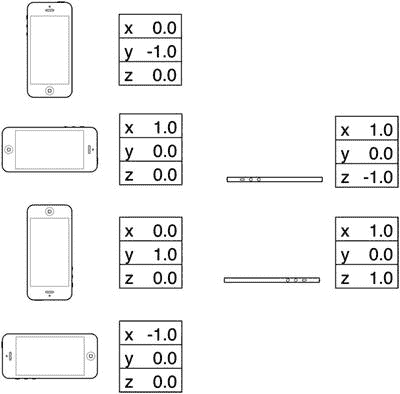

**图 20-3.** 不同设备方向下的理想化重力加速度值

在第三方应用中，加速度计最常见的用途可能是作为游戏控制器。我们将在本章稍后创建一个使用加速度计进行输入的程序，但首先我们将看另一个常见的加速度计用途：检测摇动。


## 检测摇晃

与手势类似，摇晃也可作为应用程序的一种输入形式。例如，苹果 iOS 示例代码项目中的绘图程序 GLPaint，允许用户通过摇晃 iOS 设备来擦除绘图，就像 Etch A Sketch 画板一样。检测摇晃相对简单，只需检查某一轴上的用户加速度绝对值是否超过设定阈值。在正常使用中，三个轴中有某个轴的值达到 1.3g 左右并不罕见，但要想获得远超此数值的值，通常需要使用刻意施加的力。加速度计似乎无法记录超过 2.3g 的值（至少在我们的经验中如此），因此你可能不想将阈值设置得比这个更高。

要检测摇晃，你可以通过检查绝对值是否大于 1.5（轻微摇晃）或 2.0（剧烈摇晃），在 MotionMonitor 示例的运动管理器闭包中添加如下代码：

```
let userAcc = motion.userAcceleration
if fabsf(Float(userAcc.x)) > 2.0
|| fabsf(Float(userAcc.y)) > 2.0
|| fabsf(Float(userAcc.z)) > 2.0 {
// 在此处执行相应操作…
}
```

这段代码将检测任何轴上超过 2 个 g 力的运动。

### 内置摇晃检测

实际上，还有一种更简单的检测摇晃的方法——这种方法直接内置于响应者链中。类似于第 [18] 章中我们实现 `touchesBegan(_:withEvent:)` 等方法来获取触摸事件，iOS 也提供了三个类似的响应者方法来检测运动：

*   运动开始时，`motionBegan(_:withEvent:)` 方法会在第一响应者上被调用，然后沿响应者链传递，如第 [18] 章所述。
*   运动结束时，会调用 `motionEnded(_:withEvent:)` 方法。
*   如果在摇晃过程中有来电或其他中断事件发生，则会调用 `motionCancelled(_:withEvent:)` 方法。

这些方法的第一个参数是一个事件子类型，其中之一是 `UIEventSubtype.motionShake`。这意味着你实际上无需直接使用 `CMMotionManager` 就能检测摇晃。你只需在视图或视图控制器中重写相应的运动感应方法，当用户摇晃手机时，这些方法就会被自动调用。除非你特别需要对摇晃手势进行更精细的控制，否则应使用内置的运动检测，而非前面描述的手动方法。不过，我认为我们应该向你展示手动方法的基础知识，以备你需要更精细的控制。

### Shake and Break 应用

在本项目中，我们将编写一个检测摇晃的应用程序，然后让你的手机看起来和听起来像是因为摇晃而损坏。启动应用程序时，程序将显示一张类似 iPhone 主屏幕的图片，如图 20-4 所示。然而，如果用力摇晃手机，可怜的手机就会发出你绝不想从消费电子设备中听到的声音。更重要的是，你的屏幕将变成如图 20-5 所示的样子。别担心，你只需触摸屏幕，即可将 iPhone 重置为之前完好无损的状态。

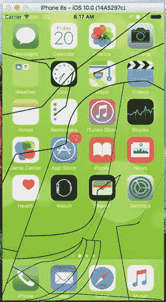

图 20-5. 摇晃它会模拟碎裂的 iPhone 屏幕

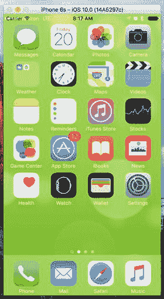

图 20-4. ShakeAndBreak 应用的初始界面看似无害

在 Xcode 中使用“单视图应用”模板创建一个新项目。确保设备类型设置为 iPhone——与本书中的大多数其他示例不同，此示例仅适用于 iPhone，因为图像尺寸适用于 iPhone 6/6s 屏幕（如果你拥有 iPhone 6/6s Plus，它们也能较好地缩放）。当然，如果你创建额外的图像，也可以很轻松地将此项目扩展到 iPad。将新项目命名为 `ShakeAndBreak`。在示例源代码的“Images and Sounds”文件夹中，我们提供了此应用所需的两张图像和一个声音文件。在项目导航器中选中 `Assets.xcassets`，然后将图像 `Home.png` 和 `BrokenHome.png` 拖入其中。将 `glass.wav` 拖入项目导航器。

现在开始创建我们的视图控制器。我们需要创建一个指向图像视图的插座，以便更改显示的图像。单击 `ViewController.swift`，并向其中添加以下属性：

```
class ViewController: UIViewController {
@IBOutlet var imageView: UIImageView!
```

保存文件。现在选择 `Main.storyboard`，在 Interface Builder 中编辑文件。将图像视图从库中拖到布局区域的视图上，并调整其大小以填充其父视图。在文档概览中，按住 Control 键从图像视图拖到其父视图，按住 Shift 键，在上下文菜单中选择“Leading Space to Container Margin”、“Trailing Space to Container Margin”、“Vertical Spacing to Top Layout Guide”和“Vertical Spacing to Bottom Layout Guide”，然后按 Return 键以锁定图像视图的大小和位置。最后，按住 Control 键从视图控制器图标拖到图像视图，并选择 `imageView` 插座，然后保存故事板。

接下来，回到 `ViewController.swift` 文件。我们将为要显示的两张图像添加一些额外的属性，以跟踪当前是否显示了破碎的图像。我们还会添加一个音频播放器对象，用于播放玻璃破碎的声音。以下粗体行位于文件顶部附近：

```
import UIKit
import AVFoundation
class ViewController: UIViewController {
@IBOutlet var imageView: UIImageView!
private var fixed: UIImage!
private var broken: UIImage!
private var brokenScreenShowing = false
private var crashPlayer: AVAudioPlayer?
```

将以下代码添加到 `viewDidLoad()` 方法中：

```
if let url = Bundle(for: type(of: self)).url(forResource:"glass", withExtension:"wav"){
do {
crashPlayer = try AVAudioPlayer(contentsOf: url, fileTypeHint: AVFileTypeWAVE)
} catch let error as NSError {
print("音频错误！\(error.localizedDescription)")
}
}
fixed = UIImage(named: "Home")
broken = UIImage(named: "HomeBroken")
imageView.image = fixed
```

至此，我们已将 `url` 变量初始化为指向声音文件，并初始化了一个 `AVAudioPlayer` 实例（该类将播放声音）。然后我们加载了需要使用的两张图像，并将第一张显示出来。接下来，添加以下新方法：


```swift
override func motionEnded(_ motion: UIEventSubtype, with event: UIEvent?) {
if !brokenScreenShowing && motion == .motionShake {
imageView.image = broken;
crashPlayer?.play()
brokenScreenShowing = true;
}
}
```

该方法重写了 `UIResponder` 的 `motionEnded(_:withEvent:)` 方法，每当发生摇动时该方法就会被调用。在确认碎屏画面未显示且当前事件确实是摇动事件后，该方法会显示破碎图像并播放碎裂音效。

最后一个方法你应该已经非常熟悉了。当屏幕被触摸时它会触发。我们只需在该方法中将图像恢复为未破碎的屏幕，并将 `brokenScreenShowing` 重置为 `false`：

```swift
override func touchesBegan(_ touches: Set, with event: UIEvent?) {
imageView.image = fixed
brokenScreenShowing = false
}
```

构建并运行应用程序，尝试摇动你的设备。对于那些无法在 iOS 设备上运行该应用的用户，依然可以尝试。模拟器虽然不能模拟加速计硬件，但包含了模拟摇动事件的菜单项，因此同样可以在模拟器中运行。去尽情体验吧。完成之后，我们将学习如何将加速计用作游戏及其他程序的控制器。

## 加速计作为方向控制器

开发者们常常使用加速计替代按钮来控制游戏中角色或物体的移动。例如在赛车游戏中，像转动方向盘一样旋转 iOS 设备可控制转向，前倾设备可加速，后倾设备可刹车。将加速计用作控制器的具体方式会因游戏机制的不同而差异很大。在最简单的场景中，你可能只需获取某个轴的值，乘以系数后加到被控物体的坐标上。而在物理模拟更逼真的复杂游戏中，则需要根据加速计返回的值来调整被控物体的速度。

将加速计用作控制器的一个棘手之处在于：委托方法并不能保证按照你指定的时间间隔回调。如果你让运动管理器每秒读取加速计 60 次，唯一能确定的是它每秒不会更新超过 60 次。你无法保证每秒能获得 60 次均匀间隔的更新。因此，如果基于加速计输入进行动画处理，必须跟踪更新之间的时间间隔，并将其纳入方程中以计算物体的移动距离。

## 弹球应用

在下一个项目中，我们将通过倾斜手机来在 iPhone 屏幕上移动精灵。这是一个使用加速计接收输入的极简示例。我们将使用 Quartz 2D 来处理动画。

注意

通常来说，在处理需要流畅动画的游戏及其他程序时，建议使用 Sprite Kit、OpenGL ES 或 Metal。本应用之所以使用 Quartz 2D，是为了简化代码并减少与加速计使用无关的内容。

在该应用中，当你倾斜 iPhone 时，弹珠会像在桌面上一样滚动，如图 20-6 所示。向左倾斜，弹珠会向左滚动；倾斜幅度越大，移动速度越快；倾斜回来时，它会减速并开始向反方向移动。

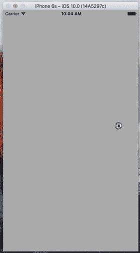

图 20-6. Ball 应用让你在屏幕上滚动弹珠

在 Xcode 中，使用单视图应用模板创建新项目。将设备类型设为 Universal，并将项目命名为 Ball。在示例源代码的 Images and Sounds 文件夹中，你可以找到名为 `ball.png` 的图像。使用项目导航器将 `ball.png` 拖入 `Assets.xcassets`。

接着，在项目导航器中选择 Ball 项目，然后选择 Ball target 的 General 标签页。在 Deployment Info 下的 Device Orientation 部分，选择 Portrait 并取消选中其他所有复选框（与本章前面为 `MotionMonitor` 应用所做的操作相同）。这将禁用默认的界面方向切换；我们希望滚动弹珠时，移动设备不会改变界面方向。

现在，单击 Ball 文件夹，选择 File ➤ New ➤ File... 从 iOS Source 部分选择 Cocoa Touch Class，然后点击 Next。将新类设为 `UIView` 的子类，命名为 `BallView`，然后点击 Create。稍后我们会回来编辑这个类。选择 `Main.storyboard` 在 Interface Builder 中编辑文件。单击文档大纲中的 View 图标，使用身份检查器将视图的类从 `UIView` 改为 `BallView`。接着切换到属性检查器，将视图的 Background 设为浅灰色。最后，保存故事板。

现在开始编辑 `ViewController.swift`。将代码清单 20-4 中的行添加到文件顶部。

```swift
import UIKit
import CoreMotion
class ViewController: UIViewController {
    private static let updateInterval = 1.0/60.0
    private let motionManager = CMMotionManager()
    private let queue = OperationQueue()
    
    override func viewDidLoad() {
        super.viewDidLoad()
        // Do any additional setup after loading the view, typically from a nib.
        
        motionManager.startDeviceMotionUpdates(to: queue) {
            (motionData: CMDeviceMotion?, error: NSError?) -> Void in
            let ballView = self.view as! BallView
            ballView.acceleration = motionData!.gravity
            
            DispatchQueue.main.async {
                ballView.update()
            }
        }
    }
}
```

代码清单 20-4. 按所示内容修改 `ViewController.swift` 和其中的 `viewDidLoad` 方法

注意

输入此代码后，由于 `BallView` 尚未完成，你会看到编译错误。我们的大部分工作将在 `BallView` 类中完成。

这里的 `viewDidLoad()` 方法与本章前面某些示例类似。主要区别在于我们使用了更高的更新间隔——每秒 60 次。在告知运动管理器在有加速计更新时执行的回调闭包中，我们将加速度对象传递给视图。然后调用名为 `update` 的方法，该方法会根据加速度和自上次更新以来的时间间隔更新视图中弹珠的位置。由于该闭包可能在任意线程上执行，而 UIKit 对象（包括 `UIView`）的方法只能在主线程安全使用，因此我们再次强制 `update` 方法在主线程中调用。


### 编写 Ball View

选择 `BallView.swift` 文件。在这里，我们需要导入 `Core Motion` 框架，并添加控制器用来传递加速度值的属性，以及类实现中会用到的另外五个属性：

```
import UIKit
import CoreMotion

class BallView: UIView {
    var acceleration = CMAcceleration(x: 0, y: 0, z: 0)
    private let image = UIImage(named: "ball")!
    private var currentPoint: CGPoint = CGPoint.zero
    private var ballXVelocity = 0.0
    private var ballYVelocity = 0.0
    private var lastUpdateTime = Date()
```

让我们逐一审视这些属性，并说明各自的作用。`acceleration` 属性将保存最新的加速度值，这些值由控制器从设备运动更新中获取。接下来是一个 `UIImage`，它指向我们将在屏幕上移动的精灵图：

```
private let image = UIImage(named: "ball")!
```

`currentPoint` 属性将保存球的当前位置。我们将使用这个值以及它的上一个值（Swift 会自动为我们保留），来构建一个包含球新旧位置的更新矩形，从而使球在新位置绘制，并在旧位置擦除：

```
private var currentPoint: CGPoint = CGPoint.zero
```

我们还有两个变量用来追踪球在当前二维空间中的速度。虽然这不是一个非常复杂的模拟，但我们希望球的移动方式能类似于真实球体。我们将在下一节计算球的运动。通过这些变量，我们将从加速度计获取加速度，并持续追踪球在两个轴上的速度。

```
private var ballXVelocity = 0.0
private var ballYVelocity = 0.0
```

最后，`lastUpdateTime` 属性会在每次更新球的位置时被设置。我们将用它来根据两次更新之间的时间间隔和球的加速度计算速度变化。

现在，让我们编写代码来绘制球并使其在屏幕上移动。首先，将清单 20-5 所示的方法添加到 `BallView.swift` 文件中。

```
override init(frame: CGRect) {
    super.init(frame: frame)
    commonInit()
}

required init?(coder aDecoder: NSCoder) {
    super.init(coder: aDecoder)
    commonInit()
}

private func commonInit() -> Void {
    currentPoint = CGPoint(x: (bounds.size.width / 2.0) +
        (image.size.width / 2.0),
        y: (bounds.size.height / 2.0) +
        (image.size.height / 2.0))
}
```

清单 20-5. 为 BallView 类添加 init 方法

`init?(coder:)` 和 `init(frame:)` 方法都会调用我们的 `commonInit()` 方法。在 storyboard 文件中创建的视图将通过 `initWithCoder()` 方法进行初始化。我们从两个初始化方法中都调用 `commonInit()` 方法，以确保我们的视图类既能通过代码安全创建，也能从 nib 文件中安全创建。对于任何可能被复用的视图类（比如这个炫酷的球滚动视图）来说，这样做都是很好的实践。现在，取消注释掉 `drawRect:` 方法，并给出这个简单的实现，以便在 `currentPoint` 处绘制球图像：

```
override func draw(_ rect: CGRect) {
    // Drawing code
    image.draw(at: currentPoint)
}
```

接下来，将我们的 `update()` 方法添加到类末尾，如清单 20-6 所示。

```
func update() -> Void {
    let now = Date()
    let secondsSinceLastDraw = now.timeIntervalSince(lastUpdateTime)
    ballXVelocity =
        ballXVelocity + (acceleration.x * secondsSinceLastDraw)
    ballYVelocity =
        ballYVelocity - (acceleration.y * secondsSinceLastDraw)
    
    let xDelta = secondsSinceLastDraw * ballXVelocity * 500
    let yDelta = secondsSinceLastDraw * ballYVelocity * 500
    currentPoint = CGPoint(x: currentPoint.x + CGFloat(xDelta),
                           y: currentPoint.y + CGFloat(yDelta))
    lastUpdateTime = now
}
```

清单 20-6. BallClass 类的 Update 方法

最后，将清单 20-7 中的属性观察器添加到 `currentPoint` 属性中。

```
var currentPoint: CGPoint = CGPoint.zero {
    didSet {
        var newX = currentPoint.x
        var newY = currentPoint.y
        
        if newX < 0 {
            newX = 0
            ballXVelocity = 0
        } else if newX > bounds.size.width - image.size.width {
            newX = bounds.size.width - image.size.width
            ballXVelocity = 0
        }
        
        if newY < 0 {
            newY = 0
            ballYVelocity = 0
        } else if newY > bounds.size.height - image.size.height {
            newY = bounds.size.height - image.size.height
            ballYVelocity = 0
        }
        
        currentPoint = CGPoint(x: newX, y: newY)
        let currentRect = CGRect(x: newX, y: newY,
                                width: newX + image.size.width,
                                height: newY + image.size.height)
        let prevRect = CGRect(x: oldValue.x, y: oldValue.y,
                            width: oldValue.x + image.size.width,
                            height: oldValue.y + image.size.height)
        setNeedsDisplay(currentRect.union(prevRect))
    }
}
```

清单 20-7. currentProperty 属性观察器


#### 计算球的运动

我们的 `drawRect()` 方法再简单不过了。我们只需在 `currentPoint` 中存储的位置上绘制球体图像。然而，`currentPoint` 的属性观察器是另一回事。当设置新位置时（来自稍后你会看到的 `update()` 方法），我们需要检查球体是否撞到了屏幕边缘，如果是，则停止其沿 x 轴或 y 轴的运动。我们通过实现一个属性观察器来实现这一点，从中我们可以访问属性的新值并修改它，而不会导致属性观察器被再次调用（否则会导致无限递归）。

我们首先获取球体的当前 x 和 y 坐标，并进行边界检查。如果球体的 `x` 或 `y` 位置小于 `0` 或大于屏幕的宽度或高度（考虑到图像的宽度和高度），则停止该方向上的加速度，并更改球体的坐标，使其出现在屏幕边缘：

```
var newX = currentPoint.x
var newY = currentPoint.y
if newX < 0 {
    newX = 0
    ballXVelocity = 0
} else if newX > bounds.size.width - image.size.width {
    newX = bounds.size.width - image.size.width
    ballXVelocity = 0
}
if newY < 0 {
    newY = 0
    ballYVelocity = 0
} else if newY > bounds.size.height - image.size.height {
    newY = bounds.size.height - image.size.height
    ballYVelocity = 0
}
```

**提示：** 你是否希望球体更自然地撞击墙壁弹回，而不是直接停止？这很容易做到。只需将 `setCurrentPoint:` 中当前读取的 `ballXVelocity = 0` 的两行改为 `ballXVelocity = -(ballXVelocity / 2.0)`。并将当前读取的 `ballYVelocity = 0` 的两行改为 `ballYVelocity = -(ballYVelocity / 2.0)`。通过这些更改，我们不是消除球体的速度，而是将其减半并设置为反方向。现在球体以一半的速度向相反方向移动。

在整个代码中，我们将球体的坐标保存在名为 `newX` 和 `newY` 的局部变量中。一旦我们在必要时修改了它的位置，我们就使用这些值来创建更新后的值并存储回属性中：

```
currentPoint = CGPoint(x: newX, y: newY)
```

之后，我们根据图像大小计算两个 `CGRect`。一个矩形包含新图像将绘制的区域，另一个包含它上次绘制的区域。我们使用球体位置的先前值来计算第二个矩形，Swift 会将其存储在一个名为 `oldValue` 的常量变量中。我们将使用这两个矩形来确保旧球体被擦除，同时新球体被绘制：

```
let currentRect = CGRect(x: newX, y: newY,
                         width: newX + image.size.width,
                         height: newY + image.size.height)
let prevRect = CGRect(x: oldValue.x, y: oldValue.y,
                      width: oldValue.x + image.size.width,
                      height: oldValue.y + image.size.height)
```

最后，我们创建一个新矩形，它是我们刚计算的两个矩形的并集，并将其传递给 `setNeedsDisplay(currentRect:)`，以指示需要重绘的视图部分：

```
setNeedsDisplay(currentRect.union(prevRect))
```

我们类中的最后一个实质性方法是 `update()`，它用于计算球体的正确新位置。该方法在其控制器类的加速度计方法将新的加速度对象传递给视图后被调用。首先，我们计算距离上次调用此方法已经过去了多长时间。`Date()` 返回的 `NSDate` 实例表示当前时间。通过询问它与 `lastUpdateTime` 的时间间隔，我们得到一个数字，表示从现在到上次调用此方法之间的秒数：

```
let now = Date()
let secondsSinceLastDraw = now.timeIntervalSince(lastUpdateTime)
```

接下来，我们通过将当前加速度添加到当前速度来计算两个方向上的新速度。我们将加速度乘以 `secondsSinceLastDraw`，以使我们的加速度在不同时间保持一致。以相同角度倾斜手机将始终产生相同的加速度：

```
ballXVelocity = ballXVelocity + (acceleration.x * secondsSinceLastDraw)
ballYVelocity = ballYVelocity - (acceleration.y * secondsSinceLastDraw)
```

之后，我们根据速度计算出上次调用该方法以来的实际像素变化。速度与经过时间的乘积乘以 500，以产生看起来自然的运动。如果我们不将其乘以某个值，加速度将会极其缓慢，仿佛球体陷在糖浆中一样：

```
let xDelta = secondsSinceLastDraw * ballXVelocity * 500
let yDelta = secondsSinceLastDraw * ballYVelocity * 500
```

一旦我们知道像素变化，我们通过将当前位置添加到计算出的加速度来创建一个新点，并将其赋值给 `currentPoint`：

```
currentPoint = CGPoint(x: currentPoint.x + CGFloat(xDelta),
                       y: currentPoint.y + CGFloat(yDelta))
```

至此计算结束，剩下的就是用当前时间更新 `lastUpdateTime`：

```
lastUpdateTime = now
```

现在构建并运行应用程序。如果一切顺利，应用程序将会启动，你应该能够通过倾斜手机来控制球体的运动。当球体到达屏幕边缘时，它应该停止。将手机向另一方向倾斜，它应该开始向另一方向滚动。

## 总结

在本章中，我们确实通过物理引擎以及 iOS 的加速度计和陀螺仪看到了一些有趣的内容。我们创建了一个恶作剧应用来“弄坏”手机，并且了解了将加速度计作为控制设备的基础知识。加速度计和陀螺仪的应用可能性广泛且多样。在下一节中，我们将使用另一种 iOS 硬件：内置摄像头。

# 21. 使用相机与访问照片

iPhone、iPad 和 iPod touch 都内置了摄像头，并配备“照片”应用帮助你管理拍摄的照片和视频（见图 21-1），这应该不足为奇。你可能不知道的是，你的程序也可以使用内置摄像头拍照。你的应用程序还可以允许用户选择并查看设备上已存储的媒体。本章我们将探讨这两种能力。


**图 21-1.** 在本章中，我们将探索在自己的应用程序中访问 iPhone 摄像头和照片库

### 使用图像选择器和 UIImagePickerController

由于 iOS 应用程序的沙箱机制，它们通常无法访问其沙箱之外的照片或其他数据。幸运的是，摄像头和媒体库都可以通过图像选择器供你的应用程序使用。


### 使用图像选取器控制器

顾名思义，图像选取器提供了一种机制，允许你从指定来源选择图像。当这个类首次在 iOS 中出现时，它仅用于图像。如今，你也可以用它来拍摄视频。通常，图像选取器会以图像和/或视频列表作为其来源，如图 21-2（左侧）所示。不过，你也可以指定选取器将相机作为其来源，如图 21-2（右侧）所示。

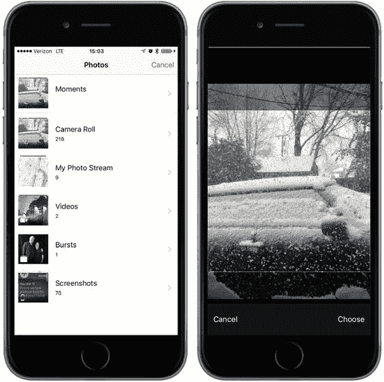

图 21-2. 图像选取器向用户展示其图片列表（左侧），允许用户在选取后对图片进行移动和缩放（右侧）

我们通过一个名为 `UIImagePickerController` 的控制器类来实现图像选取器界面。我们创建该类的一个实例，指定一个委托，指定其图像来源以及你是希望用户选取图像还是视频，然后将其呈现出来。图像选取器会控制设备，允许用户从现有媒体库中选择图片或视频。或者，用户也可以使用相机拍摄新的图片或视频。一旦用户做出选择，我们可以给她一个机会进行一些基本编辑，例如缩放或裁剪图像，或者修剪掉视频片段的一部分。所有这些行为都由 `UIImagePickerController` 实现，因此我们的工作量被最小化了。

假设用户没有按下“取消”按钮，那么用户拍摄或从库中选择的图像或视频会传递给你的委托。无论用户是选择了媒体文件还是取消操作，你的委托都负责关闭 `UIImagePickerController`，以便用户能够返回到你的应用程序。

创建 `UIImagePickerController` 极其简单。就像使用大多数类一样，你只需创建一个实例即可。不过，有一个注意事项：并非所有 iOS 设备都有相机，因此在创建 `UIImagePickerController` 实例之前，你需要检查你应用当前运行的设备是否支持你想要使用的图像来源。例如，在允许用户使用相机拍照之前，你应该确保程序运行在带有相机的设备上。你可以通过 `UIImagePickerController` 上的一个类方法来检查，如下所示：

```swift
if UIImagePickerController.isSourceTypeAvailable(.Camera) {
```

在这个例子中，我们传递了 `UIImagePickerControllerSourceType.Camera` 来表示我们希望允许用户使用内置相机拍照或拍摄视频。如果指定的来源当前可用，方法 `isSourceTypeAvailable()` 会返回 `true`。除了 `UIImagePickerControllerSourceType.camera` 之外，我们还可以指定另外两个值：

* `UIImagePickerControllerSourceType.PhotoLibrary` 指定用户应从现有媒体库中选取图像或视频。该图像将被返回给你的委托。
* `UIImagePickerControllerSourceType.SavedPhotosAlbum` 指定用户将从现有照片库中选择图像，但选择范围将被限制在相机胶卷内。此选项可以在没有相机的设备上运行，尽管在这种设备上用处不大，但它仍然允许你选择拍摄过的任何屏幕截图。

在确保你程序运行的设备支持你想要使用的图像来源后，启动图像选取器的代码如清单 21-1 所示。

```swift
let picker = UIImagePickerController()
picker.delegate = self
picker.sourceType = UIImagePickerControllerSourceType.camera
picker.cameraDevice = UIImagePickerControllerCameraDevice.front
self.present (picker, animated:true, completion: nil)
清单 21-1. 在视图控制器内部启动图像选取器
```

**提示：** 在拥有多个相机的设备上，你可以通过将 `cameraDevice` 属性设置为 `UIImagePickerControllerCameraDevice.front` 或 `UIImagePickerControllerCameraDevice.rear` 来选择使用哪一个。要查明前置或后置相机是否可用，请结合使用相同的常量调用 `isCameraDeviceAvailable()` 方法。

在创建并配置好 `UIImagePickerController` 之后，我们会使用类从 `UIView` 继承而来的方法 `self.present(_:animated:completion:)` 来向用户呈现图像选取器，该方法作为视图控制器的方法被调用，这里我们使用 `self` 来引用该视图控制器。


### 实现图像选择控制器代理

为了获知用户何时完成图像选择器的使用，你需要实现 `UIImagePickerControllerDelegate` 协议。该协议定义了两个方法：`imagePickerController(_:didFinishPickingMediaWithInfo:)` 和 `imagePickerControllerDidCancel()`。

当用户成功拍摄照片或视频，或从媒体库中选择项目时，会调用 `imagePickerController(_:didFinishPickingMediaWithInfo:)` 方法。第一个参数是指向你之前创建的 `UIImagePickerController` 的指针。第二个参数返回一个字典，其中包含选中的照片或选中视频的 URL，以及可选的编辑信息（如果你在图像选择控制器中启用了编辑功能，并且用户确实进行了编辑）。该字典包含在键 `UIImagePickerControllerOriginalImage` 下存储的原始未编辑图像。代码清单 21-2 展示了一个获取原始图像的代理方法示例。

```
func imagePickerController(picker: UIImagePickerController,
didFinishPickingMediaWithInfo info: [String : AnyObject]) {
let selectedImage: UIImage? =
info[UIImagePickerControllerEditedImage] as? UIImage
let originalImage: UIImage? =
info[UIImagePickerControllerOriginalImage] as? UIImage
// 对 selectedImage 和 originalImage 进行处理
picker.dismiss(animated: true, completion:nil)
}
代码清单 21-2.
用于获取图像的代理方法
```

`editingInfo` 字典还会告知你在编辑过程中选择了整个图像的哪个部分，这通过存储在键 `UIImagePickerControllerCropRect` 下的 `NSValue` 对象来实现。你可以将这个 `NSValue` 实例转换为 `CGRect`，如代码清单 21-3 所示。

```
let cropValue:NSValue? = info[UIImagePickerControllerCropRect] as? NSValue
let cropRect:CGRect? = cropValue?.cgRectValue()
代码清单 21-3.
将 NSValue 转换为 CGRect
```

完成此转换后，`cropRect` 指定了编辑过程中选中的原始图像部分。如果你不需要此信息，忽略即可。

**注意**

如果返回给代理的图像来自相机，则该图像不会自动存储在照片库中。如有必要，你的应用程序有责任保存该图像。

另一个代理方法 `imagePickerControllerDidCancel()` 会在用户决定取消流程（不拍摄或选择任何媒体）时被调用。当图像选择器调用此代理方法时，它只是通知你用户已完成选择器操作且未选择任何内容。

`UIImagePickerControllerDelegate` 协议中的这两个方法都被标记为可选，但实际上并非如此，原因如下：必须告知模态视图（如图像选择器）自行关闭。因此，即使你不需要在用户取消图像选择器时执行任何特定于应用程序的操作，你仍然需要关闭选择器。为了使程序正常运行，你的 `imagePickerControllerDidCancel()` 方法至少需要如下所示：

```
func imagePickerControllerDidCancel(picker: UIImagePickerController) {
picker.dismiss(true, completion:nil)
}
```

在本章中，我们将构建一个应用程序，允许用户使用相机拍摄照片或视频。或者，用户可以从照片库中选择内容，然后将所选内容显示在屏幕上，如图 21-3 所示。如果用户使用的设备没有相机，我们将隐藏“新照片或视频”按钮，并仅允许从照片库中选择。

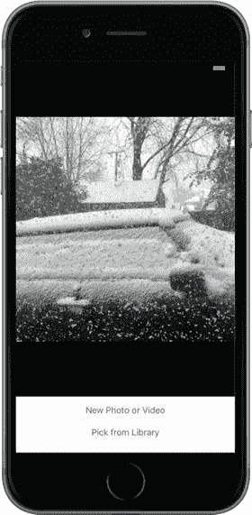

图 21-3. 我们的相机应用程序运行效果

## 创建相机界面

在 Xcode 中使用“单视图应用程序”模板创建一个新项目，并将应用程序命名为 `Camera`。首要任务是为该应用程序的视图控制器添加几个输出口。我们需要一个指向图像视图的输出口，以便用图像选择器返回的图像更新它。我们还需要一个指向“新照片或视频”按钮的输出口，以便在设备没有相机时隐藏该按钮。我们还需要两个动作方法：一个用于“新照片或视频”按钮，另一个让用户从照片库中选择现有图片。

```
class ViewController: UIViewController, UIImagePickerControllerDelegate,
UINavigationControllerDelegate {
@IBOutlet var imageView: UIImageView!
@IBOutlet var takePictureButton: UIButton!
```

你可能首先注意到，我们实际上让类遵循了两个不同的协议：`UIImagePickerControllerDelegate` 和 `UINavigationControllerDelegate`。由于 `UIImagePickerController` 是 `UINavigationController` 的子类，我们必须让类遵循这两个协议。`UINavigationControllerDelegate` 中的方法是可选的。我们不需要其中任何一个来使用图像选择器；但是，我们必须遵循该协议，否则编译器稍后会报错。

你可能注意到的另一件事是，虽然我们添加了一个 `UIImageView` 类型的属性来显示选中的图像，但我们没有添加类似的属性来显示选中的视频。`UIKit` 不包含任何像 `UIImageView` 这样可用于显示视频内容的公开类，因此我们将改用其他技术来显示视频。当我们讲到这一点时，我们将使用 `AVPlayerViewController` 的实例，获取其 `view` 属性并将其插入到我们的视图层次结构中。这是一种非常不常见的视图控制器使用方法，但实际上是 Apple 认可的、在视图层次结构中显示视频的技术。

我们还将添加两个动作方法，用于连接我们的按钮。目前，我们仅创建空实现，以便 Interface Builder 能够看到它们。稍后我们将填充实际代码：

```
@IBAction func shootPictureOrVideo(sender: UIButton) {
}
@IBAction func selectExistingPictureOrVideo(sender: UIButton) {
}
```

我们要为此应用程序构建的布局非常简单——只是一个图像视图和两个按钮。完成的布局如图 21-4 所示。请以此作为工作指南。

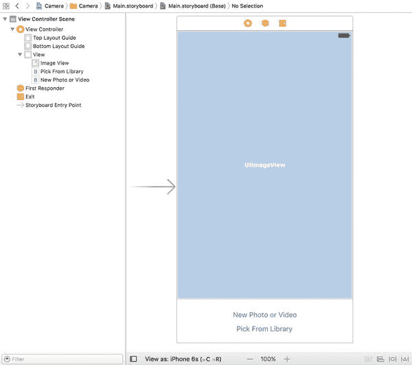

图 21-4. 我们的相机应用程序的故事板布局

从库中拖拽两个按钮到故事板中的视图上。将它们上下放置，使底部按钮与底部蓝色参考线对齐。双击顶部按钮，将其标题设置为“新照片或视频”。现在双击底部按钮，将其标题设置为“从库中选取”。接下来，从库中拖拽一个图像视图，并将其放置在按钮上方。将图像视图展开，占据按钮上方视图的整个空间，如图 21-3 之前所示。在属性检查器中，将图像视图的背景改为黑色，并将其模式设置为“宽高比适配”，这将使其能够调整图像大小以适合其边界，同时保持原始宽高比。


现在从 View Controller 图标按住 Control 键拖拽到图像视图，选择 `imageView` 插座变量。再次从 View Controller 拖拽到 New Photo or Video 按钮，选择 `takePictureButton` 插座变量。接下来，选择 New Photo or Video 按钮并打开连接检查器。从 Touch Up Inside 事件拖拽到 View Controller 图标，然后选择 `shootPictureOrVideo`: 操作。现在点击 Pick from Library 按钮，从连接检查器的 Touch Up Inside 事件拖拽到 View Controller 图标，并选择 `selectExistingPictureOrVideo`: 操作。

最后一步，照例是添加自动布局约束。首先在文档大纲中展开视图控制器，然后按如下方式添加约束：

1. 在文档大纲中，从 Pick from Library 按钮按住 Control 键拖拽到其父视图，然后松开鼠标。弹出窗口出现时，按住 Shift 键并选择 Container 中水平居中 和 底部布局指引垂直间距。
2. 从 New Photo or Video 按钮按住 Control 键拖拽到 Pick from Library 按钮，松开鼠标，选择垂直间距。
3. 从 New Photo or Video 按钮按住 Control 键拖拽到其父视图，松开鼠标，按住 Shift 键，选择 Container 中水平居中。
4. 从 New Photo or Video 按钮按住 Control 键拖拽到图像视图，选择垂直间距。
5. 从图像视图按住 Control 键拖拽到其父视图，使用 Shift 键选择 容器边距前导空间、容器边距尾随空间 和 顶部布局指引垂直间距。

所有布局约束现在应该已就位，因此保存您的更改。

### 隐私选项

由于我们计划使用摄像头，而该硬件受 iOS 保护，因此我们必须请求用户的许可才能使用。同样，由于我们计划拍摄视频，我们需要访问麦克风……除非我们只对无声电影感兴趣。此外，我们还需要访问照片库。幸运的是，只要我们正确地请求所需的权限，iOS 会为我们处理大部分工作。为此，需要在 `Info.plist` 文件中添加几行内容。

由于我们之前已经访问过属性列表几次，只需添加如图 21-5 所示的三个底部条目。最右侧列中的文本将作为请求使用特定资源的附加信息显示给用户。因此，表述清晰简洁会有所帮助。

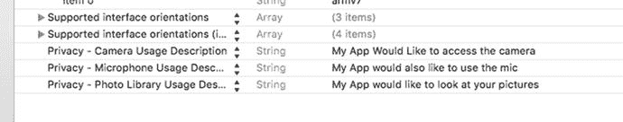

图 21-5. 向 `Info.plist` 文件添加摄像头和麦克风的隐私选项

当应用需要访问这三个资源之一时，会向用户显示一条类似图 21-6 所示的消息。

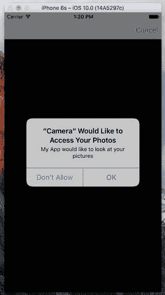

图 21-6. iOS 会负责向用户发起请求，但您需要明确说明您的应用为何需要特定资源。

### 实现摄像头视图控制器

选择 `ViewController.swift`，我们还需要做一些更改。由于我们将允许用户选择性地拍摄视频，因此需要一个 `AVPlayerViewController` 实例的属性。另外两个属性用于跟踪最后选择的图像和视频，以及一个用于确定最后选择的是视频还是图像的字符串。我们还需要导入一些额外的框架来实现这一切。添加如下所示的粗体行：

```
import UIKit
import AVKit
import AVFoundation
import MobileCoreServices
class ViewController: UIViewController, UIImagePickerControllerDelegate,
UINavigationControllerDelegate {
@IBOutlet var imageView: UIImageView!
@IBOutlet var takePictureButton: UIButton!
var avPlayerViewController: AVPlayerViewController!
var image: UIImage?
var movieURL: URL?
var lastChosenMediaType: String?
```

现在我们来增强 `viewDidLoad()` 方法，如果我们运行的设备没有摄像头，则隐藏 New Photo or Video 按钮。我们还要实现 `viewDidAppear()` 方法，让它调用 `updateDisplay()` 方法，我们稍后将实现该方法。首先，按清单 21-4 所示，更改 `ViewController.swift` 文件中的 `viewDidLoad` 和 `viewDidAppear` 方法。

```
override func viewDidLoad() {
super.viewDidLoad()
// Do any additional setup after loading the view, typically from a nib.
if !UIImagePickerController.isSourceTypeAvailable(
UIImagePickerControllerSourceType.camera) {
takePictureButton.isHidden = true
}
}
override func viewDidAppear(_ animated: Bool) {
super.viewDidAppear(animated)
updateDisplay()
}
```
清单 21-4. 更新后的 `viewDidLoad` 和 `viewDidAppear` 方法

理解 `viewDidLoad()` 和 `viewDidAppear()` 方法之间的区别很重要。前者仅在视图刚刚加载到内存时被调用。后者则在每次视图显示时被调用，这发生在启动时以及当我们显示另一个全屏视图（如图像选择器）后返回到控制器时。

接下来是三个实用方法，第一个是 `updateDisplay()` 方法。它由 `viewDidAppear()` 方法调用，该方法在视图首次创建时以及用户选择图像或视频并关闭图像选择器后被调用。由于这种双重用途，它需要进行一些检查以确定当前状态并相应地设置 GUI。将清单 21-5 中的代码添加到 `ViewController.swift` 文件的底部附近。

```
func updateDisplay() {
if let mediaType = lastChosenMediaType {
if mediaType == kUTTypeImage as NSString {
imageView.image = image!
imageView.isHidden = false
if avPlayerViewController != nil {
avPlayerViewController!.view.isHidden = true
}
} else if mediaType == kUTTypeMovie as NSString {
if avPlayerViewController == nil {
avPlayerViewController = AVPlayerViewController()
let avPlayerView = avPlayerViewController!.view
avPlayerView?.frame = imageView.frame
avPlayerView?.clipsToBounds = true
view.addSubview(avPlayerView!)
setAVPlayerViewLayoutConstraints()
}
if let url = movieURL {
imageView.isHidden = true
avPlayerViewController.player = AVPlayer(url: url)
avPlayerViewController!.view.isHidden = false
avPlayerViewController!.player!.play()
}
}
}
}
```
清单 21-5. `updateDisplay` 方法

此方法根据用户选择的媒体类型显示正确的视图——照片显示图像视图，电影显示 AV 播放器。图像视图始终存在，但 AV 播放器仅在用户首次选择电影时创建并添加到用户界面中。每次选择电影时，我们都会创建一个使用电影文件 URL 初始化的 `AVPlayer` 实例，通过其 `player` 属性将其附加到 `AVPlayerViewController`，然后使用播放器的 `play()` 方法开始播放。


当添加 AV 播放器时，我们需要确保它占据与图像视图相同的空间，并且需要添加布局约束，以确保即使设备旋转时也能保持这种情况。以下是添加布局约束的代码，如清单 21-6 所示。

```
func setAVPlayerViewLayoutConstraints() {
    let avPlayerView = avPlayerViewController!.view
    avPlayerView?.translatesAutoresizingMaskIntoConstraints = false
    let views = ["avPlayerView": avPlayerView!,
                 "takePictureButton": takePictureButton!]
    view.addConstraints(NSLayoutConstraint.constraints(
        withVisualFormat: "H:|[avPlayerView]|", options: .alignAllLeft,
        metrics:nil, views:views))
    view.addConstraints(NSLayoutConstraint.constraints(
        withVisualFormat: "V:|[avPlayerView]-0-[takePictureButton]",
        options: .alignAllLeft, metrics:nil, views:views))
}
```

水平约束将视频播放器绑定到主视图的左右两侧，垂直约束将其链接到主视图顶部和“新照片或视频”按钮的顶部。

最后一个实用方法**`pickMediaFromSource()`**是我们两个操作方法都调用的方法。这个方法非常简单。它只是创建并配置一个图像选择器，使用传入的**`sourceType`**来确定是调出相机还是媒体库。我们通过将清单 21-7 中的代码添加到**`ViewController.swift`**文件底部来实现这一点。

```
func pickMediaFromSource(_ sourceType: UIImagePickerControllerSourceType) {
    let mediaTypes =
        UIImagePickerController.availableMediaTypes(for: sourceType)!
    if UIImagePickerController.isSourceTypeAvailable(sourceType)
        && mediaTypes.count > 0 {
        let picker = UIImagePickerController()
        picker.mediaTypes = mediaTypes
        picker.delegate = self
        picker.allowsEditing = true
        picker.sourceType = sourceType
        present(picker, animated: true, completion: nil)
    } else {
        let alertController = UIAlertController(title:"Error accessing media",
                                                message: "Unsupported media source.",
                                                preferredStyle: UIAlertControllerStyle.alert)
        let okAction = UIAlertAction(title: "OK",
                                     style: UIAlertActionStyle.cancel, handler: nil)
        alertController.addAction(okAction)
        present(alertController, animated: true, completion: nil)
    }
}
```

接下来，实现与按钮链接的操作方法：

```
@IBAction func shootPictureOrVideo(_ sender: UIButton) {
    pickMediaFromSource(UIImagePickerControllerSourceType.camera)
}
@IBAction func selectExistingPictureOrVideo(_ sender: UIButton) {
    pickMediaFromSource(UIImagePickerControllerSourceType.photoLibrary)
}
```

每个方法都简单地调用了**`pickMediaFromSource()`**方法，并传入由**`UIImagePickerController`**定义的常量，以指定图片或视频的来源。

现在，终于到了实现选择器视图的委托方法的时候了，如清单 21-8 所示。

```
func imagePickerController(_ picker: UIImagePickerController,
                           didFinishPickingMediaWithInfo info: [String : AnyObject]) {
    lastChosenMediaType = info[UIImagePickerControllerMediaType] as? String
    if let mediaType = lastChosenMediaType {
        if mediaType == kUTTypeImage as NSString {
            image = info[UIImagePickerControllerEditedImage] as? UIImage
        } else if mediaType == kUTTypeMovie as NSString {
            movieURL = info[UIImagePickerControllerMediaURL] as? URL
        }
    }
    picker.dismiss(animated: true, completion: nil)
}
func imagePickerControllerDidCancel(_ picker: UIImagePickerController) {
    picker.dismiss(animated: true, completion:nil)
}
```

第一个委托方法使用传入**`info`**字典中的值来检查是选择了图片还是视频，记录选择内容，然后关闭模态图像选择器。如果图像大于屏幕上的可用空间，在显示时它将被图像视图调整大小，因为我们在创建图像视图时将其内容模式设置为**`Aspect Fit`**。第二个委托方法在用户取消图像选择过程时被调用，仅关闭图像选择器。

这就是你需要做的全部工作。编译并运行应用程序。如果在模拟器上运行，你将无法拍摄新照片，只能从照片库中选择——就好像模拟器的照片库中有照片一样！如果有机会在真实设备上运行应用程序，尽管尝试一下。你应该能够拍摄新照片或视频，并使用捏合手势放大和缩小图片。在 iOS 上，应用程序首次需要访问用户照片时，用户将被要求允许此访问；这是 iOS 6 中新增的一项隐私功能，用于确保应用程序不会在未经用户同意的情况下偷偷抓取照片。

选择或拍摄照片后，如果在点击“使用照片”按钮之前进行放大和平移，裁剪后的图像将作为委托方法中的返回值返回给应用程序。

## 总结

信不信由你，这就是让用户使用相机拍照以便应用程序使用这些照片所需的全部内容。你甚至可以让用户对图像进行少量编辑（如果你愿意的话）。

在下一章中，我们将通过使 iOS 应用程序易于翻译成其他语言，来探讨如何扩大其受众范围。

# 22. 使用本地化翻译应用程序

在撰写本文时，你会发现 iOS 设备在全球约一半的国家有售，并且这个数字还在不断增加（见图 22-1）。iPad 和 iPod touch 在除南极洲以外的各大洲均有销售，并且几乎像 iPhone 一样无处不在。如果你计划通过 App Store 发布应用程序，请不仅考虑本国说母语的人。幸运的是，iOS 提供了强大的本地化架构，让你能够轻松地将应用程序翻译（或让他人翻译）成多种语言，甚至同一语言的多种方言。为英国的英语使用者提供与美国不同的术语不再是一个问题。


由于 iOS 设备在全球超过一半的国家有售，为多种语言开发应用程序将使你的应用更有可能获得你期望的成功。

如果你正确编写了代码，本地化带来的问题微乎其微，而改造现有应用程序以支持本地化则会增加所需的工作量。在本章中，我将向你展示如何编写易于本地化的代码，然后我们将对示例应用程序进行本地化。


## 本地化架构

当一款尚未配置本地化的应用执行时，其所有文本都会以开发者自身的语言显示，这被称为开发基准语言。当开发者决定对其应用进行本地化时，他们会为每种受支持的语言在应用包中创建一个子目录。每种语言的子目录都包含该应用资源中已翻译为该语言的一个子集。每个子目录被称为一个本地化项目，或本地化文件夹。本地化文件夹的名称始终以`.lproj`扩展名结尾。

在 iOS 的“设置”应用中，用户可以设置设备的首选语言和区域格式。例如，如果用户的语言是英语，可选的区域可能包括美国、澳大利亚和香港——所有讲英语的地区。

当一个经过本地化的应用需要加载资源（例如图片、属性列表或 nib 文件）时，应用会检查用户的语言和区域，然后查找与之匹配的本地化文件夹。如果找到，它会加载该资源的本地化版本，而不是基准版本。对于选择法语作为 iOS 语言、瑞士作为区域的用户，应用将首先查找名为`fr-CH.lproj`的本地化文件夹。文件夹名称的前两个字母是代表法语的 ISO 国家代码。连字符后面的两个字母是代表瑞士的 ISO 代码。

如果应用无法使用两位代码找到匹配项，它会使用语言的三位 ISO 代码继续查找。在我们的例子中，如果应用找不到名为`fr-CH.lproj`的文件夹，它会查找名为`fre-CH`或`fra-CH`的文件夹。

所有语言都至少有一个三位代码。有些语言有两种三位代码：一种对应语言的英文拼写，另一种对应本地拼写。某些语言只有两位代码，但当一种语言同时拥有两位代码和三位代码时，优先使用两位代码。

**注意**

你可以在 ISO 网站[`www.iso.org/iso/country_codes.htm`](http://www.iso.org/iso/country_codes.htm)上找到当前 ISO 国家代码的列表。两位和三位代码都是 ISO 3166 标准的一部分。

如果应用找不到完全匹配的文件夹，它会在应用包中查找仅匹配语言代码而不包含区域代码的本地化文件夹。因此，以法语为例，应用接下来会查找名为`fr.lproj`的本地化文件夹。如果找不到该名称的语言文件夹，它会继续查找`fre.lproj`，然后是`fra.lproj`。如果这些都没有找到，它会检查`French.lproj`。最后这种结构是为了支持旧版 Mac OS X 应用程序而存在的；通常来说，你应该避免使用它。

如果应用既找不到语言/区域组合的匹配文件夹，也找不到仅语言匹配的文件夹，它会使用开发基准语言的资源。如果它找到了合适的本地化文件夹，则会始终优先在该文件夹中查找所需的任何资源。例如，如果你使用`imageNamed()`加载一个`UIImage`，应用会首先在本地化文件夹中查找指定名称的图片。如果找到，它将使用该图片。如果没有找到，它将回退到使用基准语言的资源。

如果一个应用有多个匹配的本地化文件夹——例如，一个名为`fr-CH.lproj`的文件夹和一个名为`fr.lproj`的文件夹——并且用户选择了瑞士法语作为其首选语言，它会在更具体的匹配项`fr-CH.lproj`中优先搜索。如果在那里找不到资源，它会在`fr.lproj`中查找。这使你可以将某语言所有使用者通用的资源放在一个文件夹中，仅本地化那些受方言或地理区域差异影响的资源。

你应该只选择本地化那些受语言或国家影响的资源。例如，如果应用中的某个图片没有文字且含义是全球通用的，那就没有必要本地化该图片。

### 字符串文件

对于源代码中的字符串字面量和字符串常量，你应该如何处理呢？请参考第 19 章中的源代码，如列表 22-1 所示。

```
let alertController = UIAlertController(title: "Location Manager Error",
message: errorType, preferredStyle: .alert)
let okAction = UIAlertAction(title: "OK", style: .cancel,
handler: nil)
alertController.addAction(okAction)
self.presentViewController(alertController, animated: true,
completion: nil)
列表 22-1.
字符串字面量和常量的示例
```

如果你已经付出了努力为特定的用户群体本地化了你的应用，你当然不希望显示用开发基准语言编写的警告。解决方案是将这些字符串存储在称为字符串文件的特殊文本文件中。

### 字符串文件

字符串文件不过是包含一系列字符串对的 Unicode 文本文件，每个字符串对都由一条注释标识。列表 22-2 展示了一个示例，说明了字符串文件在你的应用中可能是什么样子。

```
/* 用于询问用户的姓名 */
"LABEL_FIRST_NAME" = "First Name";
/* 用于获取用户的姓氏 */
"LABEL_LAST_NAME" = "Last Name";
/* 用于询问用户的出生日期 */
"LABEL_BIRTHDAY" = "Birthday";
列表 22-2.
字符串文件示例
```

`/*` 和 `*/` 字符之间的值是给翻译人员的注释。它们不会在应用程序中使用；你可以省略它们，尽管添加它们是一个好做法。这些注释提供了上下文，显示了特定字符串在应用程序中的使用方式。你会注意到每一行都由等号分隔成两部分。等号左侧的字符串充当键，无论使用何种语言，它都将始终包含相同的值。等号右侧的值是翻译成当地语言的部分。因此，上述字符串文件若本地化为法语，可能看起来像列表 22-3 所示。

```
/* 用于询问用户的姓名 */
"LABEL_FIRST_NAME " = "Prénom";
/* 用于获取用户的姓氏 */
"LABEL_LAST_NAME" = "Nom de famille";
/* 用于询问用户的出生日期 */
"LABEL_BIRTHDAY" = "Anniversaire";
列表 22-3.
字符串文件的法语版本
```


### 本地化字符串函数

在运行时，你将通过使用 `NSLocalizedString()` 函数来获取所需的字符串本地化版本。一旦你的源代码最终确定并准备好进行本地化，Xcode 会搜索所有代码文件中此函数的出现位置，提取所有唯一的字符串，并将它们嵌入到一个文件中。你可以将该文件发送给翻译人员，或者自行添加翻译。完成后，让 Xcode 导入更新后的文件，并利用其内容为你提供翻译的语言创建本地化字符串文件。让我们看看这个过程的第一部分是如何工作的。首先，这是一个传统的字符串声明：`let myString = "First Name"`。

要使此字符串可本地化：

```
let myString = NSLocalizedString("LABEL_FIRST_NAME",
comment: "用于询问用户的名字")
```

`NSLocalizedString()` 宏接受五个参数，但其中三个有默认值，在大多数情况下已经足够，因此通常你只需要提供两个：

- 第一个参数是一个键，用于查找本地化字符串。如果本地化文件中没有包含该键的文本，应用程序将使用该键本身作为本地化文本。
- 第二个参数用作注释，解释该文本的使用方式。该注释将出现在发送给翻译人员的文件中，以及导入后的本地化字符串文件中。

`NSLocalizedString()` 会在应用程序包中合适的本地化文件夹内搜索名为 `Localizable.strings` 的字符串文件。如果找不到该文件，它将返回其第一个参数，即所需文本的键。如果 `NSLocalizedString()` 找到了字符串文件，它会在文件中搜索与第一个参数匹配的行。在前面的示例中，`NSLocalizedString()` 将在字符串文件中搜索字符串 `"LABEL_FIRST_NAME"`。如果在与用户语言设置匹配的本地化文件夹中未找到匹配项，它将转而查找基础语言中的字符串文件并使用其中的值。如果没有字符串文件，它将直接使用你传递给 `NSLocalizedString()` 函数的第一个参数。

你可以将基础语言文本用作 `NSLocalizedString()` 函数的键，因为如果找不到匹配的本地化文本，该函数会返回这个键。这将使前面的示例变为：

```
let myString = NSLocalizedString("First Name",
comment: "用于询问用户的名字")
```

我们不推荐这种方法，原因有二。首先，你很可能在首次尝试时无法想出完美的键，之后不得不返回去在字符串文件中修改它们，这是一项繁琐且容易出错的工作，最终得到的键仍可能与应用程序中使用的键不匹配。第二个原因是，通过明确使用大写键，你可以在运行应用程序时立即通过观察界面发现是否忘记对某些文本进行本地化。

现在你已经了解了本地化架构和字符串文件的工作原理，让我们来看看本地化的实际应用。

## 创建 LocalizeMe 应用

我们将创建一个显示用户当前区域设置的小型应用程序。区域设置（`NSLocale` 的实例）代表用户的语言和地区。系统使用区域设置在用户交互时确定使用哪种语言，以及如何显示日期、货币和时间信息等。创建应用程序后，我们将把它本地化为其他语言，学习如何本地化故事板文件、字符串文件、图片，甚至是应用程序的显示名称。

图 22-2 描绘了我们的应用在顶部显示来自用户区域设置的名称时的样子。视图左侧的序数词是静态标签，它们的值将通过本地化故事板文件来设置。右侧的单词以及屏幕底部的旗帜图片，都将在应用代码中根据用户的首选语言在运行时选择。

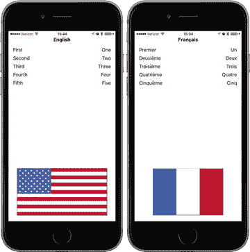

图 22-2. LocalizeMe 应用程序在两种不同语言设置下的显示效果

在 Xcode 中使用 Single View Application 模板创建一个新项目，并将其命名为 `LocalizeMe`。在示例源代码的 `22 - Images` 文件夹中，你会找到名为 `flag_usa.png` 和 `flag_france.png` 的两张图片。在 Xcode 中，选择 `Assets.xcassets` 项，然后将 `flag_usa.png` 和 `flag_france.png` 都拖入其中。现在，让我们在项目的视图控制器中添加一些标签输出口。我们需要为视图顶部的标签创建一个输出口，为将显示旗帜的图像视图创建一个输出口，并为右侧的所有单词创建一个输出口集合（见图 22-2）。选择 `ViewController.swift` 并做出以下修改：

```
class ViewController: UIViewController {
@IBOutlet var localeLabel : UILabel!
@IBOutlet var flagImageView : UIImageView!
@IBOutlet var labels : [UILabel]!
```

选择 `Main.storyboard` 在 Interface Builder 中编辑图形用户界面。从库中拖出一个标签，将其放置在主视图顶部，与顶部蓝色参考线对齐。调整标签大小，使其占据视图的整个宽度，从左侧边距参考线到右侧边距参考线。选中标签后，打开属性检查器。找到字体控件，点击其中包含的小 T 图标以弹出一个小字体选择弹出窗口。点击样式选择器并将其更改为粗体，使标题标签与其他部分略有区分。接着，使用属性检查器将文本对齐方式设置为居中。如果需要，你也可以使用字体选择器将字号调大。只要在对象属性检查器中将自动缩小设置为最小字体大小，文本在过长无法适应时就会被自动调整大小。标签放置好后，按住 Control 键从文档大纲（或故事板中的）视图控制器图标拖到该新标签，然后选择 `localeLabel` 输出口。

接下来，从库中再拖出五个标签，使用蓝色参考线将它们沿左边距放置，一个在另一个上方（同样参见图 22-2）。双击顶部的标签，将其文本从 Label 改为 First。对其余四个标签重复此步骤，将文本分别改为 Second、Third、Fourth 和 Fifth。确保所有五个标签都沿左边距参考线对齐。

再从库中拖出五个标签，这次将它们沿右边距放置。使用对象属性检查器将文本对齐方式更改为右对齐。按住 Control 键从视图控制器拖到每个新标签，将每个标签连接到 `labels` 输出口集合，并确保按从上到下的正确顺序连接。


从库中拖拽一个`Image View`到视图的底部，使其触碰底部和左侧的蓝色参考线。在属性检查器中，为视图的`Image`属性选择`flag_usa`，并将图片水平拉伸以填满两条蓝色参考线之间的空间，垂直方向则设置为用户界面高度的大约三分之一。在属性检查器中，将`Mode`属性从当前值更改为`Aspect Fit`。并非所有国旗都有相同的宽高比，我们需要确保本地化版本的图片显示正常。选择此选项将使`image view`调整其显示的所有图片以适应视图，同时保持正确的宽高比（高度与宽度之比）。现在，从视图控制器按住 Control 键拖拽至该`image view`，并选择`flagImageView`插座变量。

为了完成用户界面，我们需要设置自动布局约束。从顶部的标签开始，按住 Control 键从它拖拽到文档大纲中的父视图，按住 Shift 键，依次选择`Leading Space to Container Margin`、`Trailing Space to Container Margin`和`Vertical Spacing to Top Layout Guide`，然后按 Return 键。

接下来，我们将固定五排标签的位置。从文本为`First`的标签按住 Control 键拖拽到文档大纲中的父视图，选择`Leading Space to Container Margin`和`Vertical Spacing to Top Layout Guide`，然后按 Return 键。从该标签按住 Control 键拖拽到同一行右侧的标签，选择`Baseline`，然后从右侧的标签按住 Control 键拖拽到文档大纲中的父视图，选择`Trailing Space to Container Margin`。

现在我们已经定位了第一排标签。对另外四排标签执行完全相同的操作。接下来，按住 Shift 键并用鼠标点击右侧的所有五个标签来选中它们，然后选择 Editor ➤ Size to Fit Content。最后，清空所有这些标签的文本，因为我们将在代码中设置它们。

为了固定国旗的位置和大小，从国旗标签按住 Control 键拖拽到文档大纲中的父视图，选择`Leading Space to Container Margin`、`Trailing Space to Container Margin`和`Vertical Spacing to Bottom Layout Guide`，然后按 Return 键。在国旗标签仍处于选中状态时，点击`Pin`按钮，在弹出的窗口中勾选`Height`复选框，然后按`Add 1 Constraint`。现在你已经添加了所有需要的自动布局约束。

保存你的故事板，然后切换到`ViewController.swift`，并将清单 22-4 中的代码添加到`viewDidLoad()`方法中。

```
override func viewDidLoad() {
    super.viewDidLoad()
    // Do any additional setup after loading the view, typically from a nib.
    let locale = Locale.current
    let currentLangID = Locale.preferredLanguages[0]
    let displayLang = locale.displayName(forKey: Locale.Key.languageCode, value: currentLangID)
    let capitalized = displayLang?.capitalized(with: locale)
    localeLabel.text = capitalized
    labels[0].text = NSLocalizedString("LABEL_ONE", comment: "The number 1")
    labels[1].text = NSLocalizedString("LABEL_TWO", comment: "The number 2")
    labels[2].text = NSLocalizedString("LABEL_THREE", comment: "The number 3")
    labels[3].text = NSLocalizedString("LABEL_FOUR", comment: "The number 4")
    labels[4].text = NSLocalizedString("LABEL_FIVE", comment: "The number 5")
    let flagFile = NSLocalizedString("FLAG_FILE", comment: "Name of the flag")
    flagImageView.image = UIImage(named: flagFile)
}
清单 22-4.
按所示修改 viewDidLoad 方法
```

在这段代码中，我们首先获取一个`NSLocale`实例（请记住，新版本的 Xcode 和 Swift 支持更友好的名称，如`Locale`，尽管技术上它仍然是`NSLocale`），该实例代表用户当前的区域设置。此实例告诉我们用户的语言和区域偏好，这些偏好是在设备的“设置”应用中设置的：

```
let locale = Locale.current
```

接着，我们获取用户偏好的语言。这将返回一个双字符代码，例如`"en"`或`"fr"`，或者像`"fr_CH"`这样的区域语言变体字符串：

```
let currentLangID = Locale.preferredLanguages[0]
```

下一行代码可能需要一些解释：

```
let displayLang = locale.displayName(forKey: Locale.Key.languageCode, value: currentLangID)
```

`NSLocale`的工作方式有点像字典。它可以提供关于当前用户区域设置的许多信息，包括货币名称和预期的日期格式。你可以在`NSLocale` API 参考中找到可以检索的完整信息列表。这里，我们使用一个名为`displayName(forKey value:)`的方法来获取所选语言的实际名称，该名称被翻译成了当前区域设置本身的语言。此方法的目的是以特定语言返回我们请求的项的值。

例如，法语的显示名称在法语中是“français”，但在英语中是“French”。此方法使你能检索任何区域设置的数据，以便为所有用户正确显示。在这种情况下，我们希望以当前正在使用的语言显示用户偏好语言的显示名称，这就是我们传递`currentLangID`作为第二个参数的原因。这个字符串是一个两位字母的语言代码，类似于我们之前创建语言项目时使用的代码。对于英语使用者，它将是`en`；对于法语使用者，它将是`fr`。

从这个调用返回的名称将是类似“English”或“français”的内容——并且只有在用户偏好语言中语言名称总是大写时它才会大写。英语中是这样，但法语中不是。然而，我们希望这个名称大写以便作为标题显示。幸运的是，`NSString`有用于大写字符串的方法，包括一个可以根据给定区域设置的规则来大写字符串的方法！让我们使用它来将“français”转换为“Français”：

```
let capitalized = displayLang?.capitalized(with: locale)
```

这里，我们利用了 Objective-C 类`NSString`和 Swift 的`String`透明桥接的特性，在我们的`String`实例上调用了`NSString`的`capitalizedStringWithLocale()`方法。一旦我们有了显示名称，就用它来设置视图中的顶部标签：

```
localeLabel.text = capitalized
```

接下来，我们将另外五个标签设置为以我们的开发基础语言拼写出的数字 1 到 5。我们使用`NSLocalizedString()`函数来获取这些标签的文本，传递键和一条注释来指示每个单词是什么。如果单词含义明显（就像这里），你也可以为注释传递一个空字符串；然而，你在第二个参数中传递的任何字符串都会变成字符串文件中的注释，因此你可以使用此注释与翻译人员沟通：

```
labels[0].text = NSLocalizedString("LABEL_ONE", comment: "The number 1")
labels[1].text = NSLocalizedString("LABEL_TWO", comment: "The number 2")
labels[2].text = NSLocalizedString("LABEL_THREE", comment: "The number 3")
labels[3].text = NSLocalizedString("LABEL_FOUR", comment: "The number 4")
labels[4].text = NSLocalizedString("LABEL_FIVE", comment: "The number 5")
```

最后，我们执行另一个字符串查找来获取要使用的国旗图片的名称，并用该名称的图片填充我们的`image view`：

```
let flagFile = NSLocalizedString("FLAG_FILE", comment: "Name of the flag")
flagImageView.image = UIImage(named: flagFile)
```

构建并运行应用程序，如果你的基础语言是英语，它应该类似于图 22-3 所示。

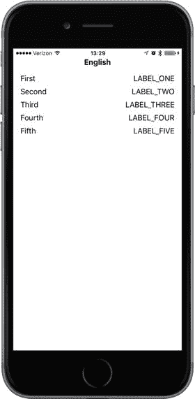

图 22-3. 在作者基础语言下运行的应用程序。该应用已设置为本地化，但尚未进行本地化。


因为我们使用了`NSLocalizedString()`函数而不是静态字符串，现在我们已准备好进行本地化。然而，我们尚未完成本地化，这从右侧列中的大写标签以及底部缺少标志图片即可明显看出。如果你在模拟器或 iOS 设备上使用“设置”应用切换到其他语言或区域，除了视图顶部的标签外，结果看起来基本相同，如图 22-4 所示。如果你不确定如何更改语言，请先稍等，我们很快就会讲到。

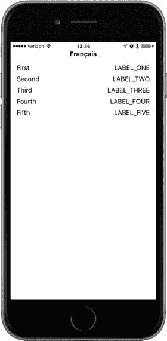

**图 22-4.** 在设置为使用法语的 iPhone 上运行的非本地化应用

### 本地化项目

现在让我们对项目进行本地化。在 Xcode 的项目导航器中，单击`LocalizeMe`，在编辑区域单击`LocalizeMe`项目（不是其中一个目标），然后选择项目的 Info 标签。找到 Info 标签中的 Localizations 部分。你会看到它显示了一个本地化，即针对你的开发语言——在我的例子中，是英语。这个本地化通常被称为**基础本地化**，并且在 Xcode 创建项目时会自动添加。我们想要添加法语，因此点击 Localizations 部分底部的加号（+）按钮，并从出现的弹出列表中选择法语（fr）（见图 22-5）。

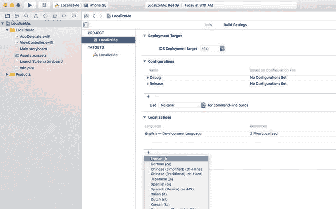

**图 22-5.** 显示本地化和其他信息的项目信息设置

接下来，系统会要求你选择所有希望本地化的现有本地化文件，以及你希望新的法语本地化从哪个现有本地化开始（见图 22-6）。有时，在添加新语言时，基于已有本地化的文件开始新语言的本地化会更有优势；例如，在一个已经翻译成法语的项目中创建瑞士法语本地化时（我们将在本章后面进行此操作），你几乎肯定会更倾向于使用现有的法语本地化作为起点，而不是使用你的基础语言。你可以通过在添加瑞士法语本地化时选择法语作为参考语言来实现。不过目前，只有两个文件需要本地化，并且只有一种起始语言可供选择（你的基础语言），因此只需保持默认设置并点击**完成**即可。

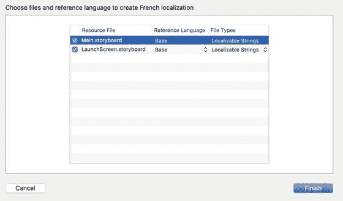

**图 22-6.** 选择本地化的文件

现在你已经添加了法语本地化，请查看项目导航器。注意，`Main.storyboard`和`Launch.storyboard`文件旁边现在有一个展开三角形，就像它们是一个组或文件夹一样。展开它们并查看，如图 22-7 所示。

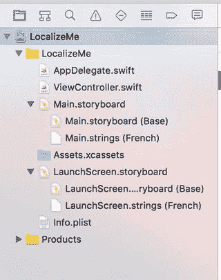

**图 22-7.** 可本地化文件有一个展开三角形，并且每添加一种语言或区域，就会有一个对应的子项

在我们的项目中，`Main.storyboard`现在显示为一个包含两个子项的组。第一个名为`Main.Storyboard`，标记为**Base**；第二个名为`Main.strings`，标记为**法语**。基础版本是在你创建项目时自动创建的，它代表你的开发基础语言。`LaunchScreen.storyboard`文件也是如此。这些文件实际上位于两个不同的文件夹中：一个名为`Base.lproj`，另一个名为`fr.lproj`。前往访达并打开`LocalizeMe`项目文件夹中的`LocalizeMe`文件夹。除了你所有的项目文件之外，你应该会看到名为`Base.lproj`和`fr.lproj`的文件夹，如图 22-8 所示。

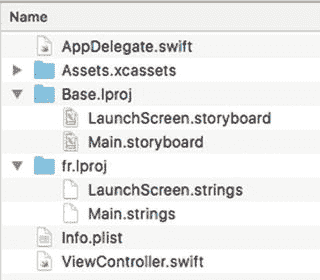

**图 22-8.** 从一开始，我们的 Xcode 项目就包含一个基础语言项目文件夹（`Base.lproj`）。当我们选择使一个文件可本地化时，Xcode 为我们选择的语言创建了一个语言文件夹（`fr.lproj`）。

请注意，`Base.lproj`文件夹一直存在，其中包含`Main.storyboard`和`LaunchScreen.storyboard`的副本。当 Xcode 发现某个资源恰好只有一个本地化版本时，它会将其显示为单个项目。一旦一个文件有两个或更多本地化版本，Xcode 就会将它们显示为一个组。当你要求 Xcode 创建法语本地化时，它在你的项目中创建了一个名为`fr.lproj`的新本地化文件夹，并在其中放置了包含从`Base.lproj/Main.storyboard`和`Base.lproj/LaunchScreen.storyboard`中提取的值的字符串文件。Xcode 并没有复制这两个文件，而是从中提取了所有文本字符串，并创建了可供本地化的字符串文件。当应用程序构建并运行时，本地化字符串文件中的值会被引入，以替换故事板和启动屏幕中的值。


### 本地化故事板

在 Xcode 的项目导航器中，选择 `Main.strings`（法语）以打开法语的 strings 文件，该文件的内容将注入到面向法语用户的故事板中。你会看到类似下面的文本：

```
/* Class = "UILabel"; text = "Fifth"; ObjectID = "5tN-O9-txB"; */
"5tN-O9-txB.text" = "Fifth";
/* Class = "UILabel"; text = "Third"; ObjectID = "GO5-hd-zou"; */
"GO5-hd-zou.text" = "Third";
/* Class = "UILabel"; text = "Second"; ObjectID = "NCJ-hT-XgS"; */
"NCJ-hT-XgS.text" = "Second";
/* Class = "UILabel"; text = "Fourth"; ObjectID = "Z6w-b0-U06"; */
"Z6w-b0-U06.text" = "Fourth";
/* Class = "UILabel"; text = "First"; ObjectID = "kS9-Wx-xgy"; */
"kS9-Wx-xgy.text" = "First";
/* Class = "UILabel"; text = "Label"; ObjectID = "yGf-tY-SVz"; */
"yGf-tY-SVz.text" = "Label";
```

每一对行都代表故事板中找到的一个字符串。注释告诉你包含该字符串的对象的类、原始字符串本身，以及每个对象的唯一标识符（在你自己的文件副本中可能不同）。注释之后的那一行正是你需要将翻译后的字符串添加到等号右侧的地方。你会看到其中一些是序数词，例如 First；这些来自图 22-4 左侧的标签，所有这些标签都在故事板中被赋予了名称。名称为 Label 的条目对应的是标题标签，它是我们通过编程方式设置的，因此你不需要对其进行本地化。

在 iOS 8 之前，通常的做法是通过直接编辑这个文件来本地化故事板。使用 iOS 8 时，你仍然可以选择这样做，但如果你打算聘请专业翻译人员，让他们同时翻译故事板文本和代码中的字符串可能会更方便。为此，Apple 使得将所有需要翻译的字符串按每种语言收集到一个文件中成为可能，你可以将这个文件发送给你的翻译人员。如果你打算使用这种方法，你可以保持故事板字符串文件不变，然后进入下一步，下一步将在下一节描述。修改故事板字符串文件仍然是可行的，如果这样做，即使你需要让翻译人员修改或本地化额外的文本，这些更改也不会丢失。所以，就这次而言，让我们以传统方式本地化故事板字符串。为此，找到 First、Second、Third、Fourth 和 Fifth 标签的文本，然后将等号右侧的字符串分别改为 Premier、Deuxième、Troisième、Quatrième 和 Cinquième（类似于）：

```
/* Class = "UILabel"; text = "Fifth"; ObjectID = "5tN-O9-txB"; */
"5tN-O9-txB.text" = "Cinquième";
/* Class = "UILabel"; text = "Third"; ObjectID = "GO5-hd-zou"; */
"GO5-hd-zou.text" = "Troisième";
/* Class = "UILabel"; text = "Second"; ObjectID = "NCJ-hT-XgS"; */
"NCJ-hT-XgS.text" = "Deuxième";
/* Class = "UILabel"; text = "Fourth"; ObjectID = "Z6w-b0-U06"; */
"Z6w-b0-U06.text" = "Quatrième";
/* Class = "UILabel"; text = "First"; ObjectID = "kS9-Wx-xgy"; */
"kS9-Wx-xgy.text" = "Premier";
/* Class = "UILabel"; text = "Label"; ObjectID = "yGf-tY-SVz"; */
"yGf-tY-SVz.text" = "Label";
```

最后，保存文件。我们的故事板现在已本地化为法语。有三种方法可以查看此本地化对应用程序的影响——你可以在 Xcode 中预览它，使用自定义的 scheme 启动它，或者更改模拟器或真实设备上的活动语言。让我们依次查看这些选项，从获取预览开始。

#### 使用助手编辑器预览本地化

在项目导航器中选择 `Main.storyboard`，然后打开助手编辑器。在助手编辑器的跳转栏中，选择 Preview ➤ `Main.storyboard`，你将看到应用程序在基础开发语言中的显示效果，如图 22-9 左侧所示。

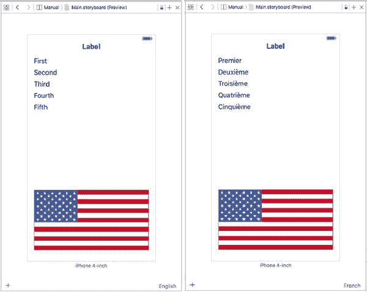

图 22-9. 以基础语言和法语预览应用程序

在助手编辑器的右下角，你会看到当前语言（英语）已显示。点击此处可打开一个弹出菜单，列出项目中的所有本地化语言，然后选择法语。预览将更新以显示应用程序在法语用户眼中的外观，如图 22-9 右侧所示，只是旗帜不正确。这是因为预览只考虑故事板本地化版本中的内容，而实际上我们是在代码中设置旗帜图像的。如果你使用代码来安装本地化资源，则需要选择其他选项之一以获得准确的视图。

#### 使用自定义 Scheme 更改语言和区域设置

创建自定义 scheme 可以让你快速查看本地化版本的应用程序在模拟器或真实设备上运行的情况。与预览不同，此选项允许你查看在代码中和故事板中进行的本地化。首先，点击 Xcode 中 Scheme 选择器的左侧——你可以在顶部栏中找到它，位于“运行”和“停止”按钮旁边。当前，选择器应显示文本 `LocalizeMe`，这是当前 Scheme 的名称以及当前选中的设备或模拟器。当你点击 `LocalizeMe` 时，Xcode 会打开一个包含多个选项的弹出菜单。选择 `Manage Schemes…` 打开 Scheme 对话框，如图 22-10 所示。

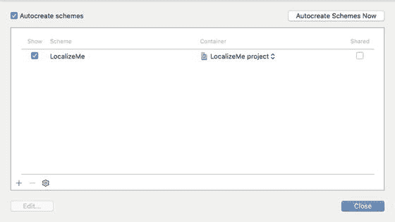

图 22-10. Scheme 对话框允许你查看、添加和移除 scheme

目前，只有一个 scheme。点击 scheme 列表下方的 + 图标，打开另一个窗口，你可以为你的新 scheme 选择名称。将其命名为 `LocalizeMe_fr` 并按下 OK。回到 Scheme 对话框，选择你新创建的 scheme，然后点击 `Edit…` 打开 Scheme 编辑器（见图 22-11）。

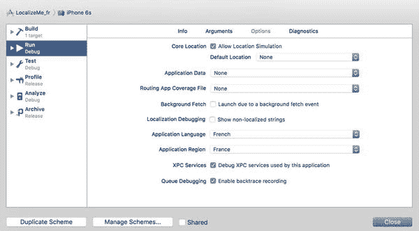

图 22-11. Scheme 编辑器，其中选择了法语作为应用语言，法国作为应用区域

确保左侧列中选中了 Run，然后将注意力转向编辑器主体中的 Application Language 和 Application Region 选择器。在这里，你可以选择使用自定义 scheme 启动应用程序时要使用的语言和区域。选择法语作为语言，法国作为区域，然后点击 `Close`。回到 Xcode 主窗口，你会看到你的新 scheme 现在已被选中。继续运行应用程序，你将看到法语本地化已生效，如图 22-12 所示。

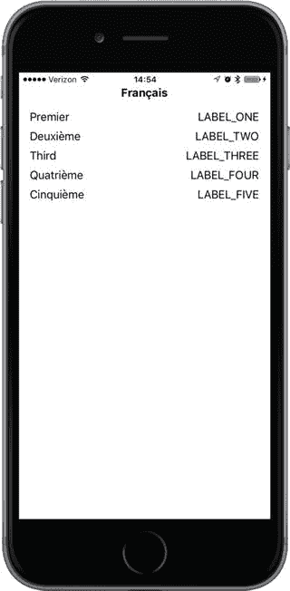

图 22-12. 查看应用程序当前的法语状态

如你所见，旗帜缺失了。当然，这是因为我们在代码中安装旗帜图像，并且尚未完成法语本地化。要恢复到基础语言视图，只需切换回原始的 `LocalizeMe` scheme 并再次运行应用程序即可。


#### 在设备或模拟器上切换语言和区域设置

查看应用在另一种语言或不同区域设置下显示效果的最终方法，是在模拟器或设备上切换相关设置。这比前两种方法花费的时间稍长，因此最好只在测试周期接近尾声、基本确认一切正常时才这样做。以下是将法语设为设备（或模拟器）主要语言的方法。

前往`设置`应用，选择`通用`行，然后选择`语言与地区`行。在此处，你便可以更改语言和区域偏好设置，如图 22-13 所示。

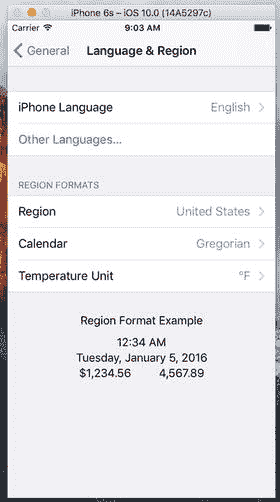

图 22-13. 更改语言或区域设置

轻点`iPhone 语言`，即可显示 iOS 已本地化的语言列表，然后找到并选择法语条目（其显示为法语原文`Français`）。你还可以将`区域`更改为法国以获得完全的地道效果，不过在本示例中并非必需，因为我们的代码中没有使用数字、日期或时间。按下`完成`，然后确认你要更改设备语言。此操作将使设备执行部分重启，耗时数秒。现在重新运行应用，你会再次看到左侧的标签显示的是本地化后的法语文本（见图 22-12）。然而，与之前一样，国旗仍然缺失，右侧的文本列也依然不正确。我们将在下一部分处理这些问题。

### 生成并本地化字符串文件

在图 22-12 中，视图右侧的文字仍为`全大写`样式，因为我们尚未对其进行翻译；你所看到的是`NSLocalizedString()`用于查找本地化文本的键。为了本地化这些文本，我们首先需要从代码中提取键和注释字符串。幸运的是，Xcode 可以轻松地从项目中提取需要本地化的文本，并将其放入每种语言对应的独立文件中。让我们来看看具体如何操作。

在`项目导航器`中，选择你的项目。在编辑器中，选择项目或其某个目标。然后从菜单中依次选择`编辑器` ➤ `导出本地化…`。这将打开一个对话框，供你选择要本地化的语言以及每种语言文件的写入位置。为文件选择一个合适的位置（例如，在项目根目录下新建一个名为`XLIFF`的文件夹），确保`现有翻译`和`法语`两个复选框均已选中，然后按`存储`。Xcode 会在你选择的文件夹内，于名为`LocalizeMe`的文件夹中创建一个名为`fr.xliff`的文件。如果你打算使用第三方服务来翻译应用的文本，他们很可能能够处理 XLIFF 文件——你只需将此文件发送给他们，让他们用翻译后的字符串更新该文件，再重新导入 Xcode 即可。不过，现在我们打算自己进行翻译。

打开`fr.xliff`文件。你会看到其中包含大量 XML。它分为三个不同的部分，分别包含来自故事板的字符串、Xcode 在源代码中找到的字符串，以及来自应用`信息属性列表`文件中的一些可本地化值。我们将在本章后面讨论为什么需要本地化`Info.plist`中的条目。现在，我们先来翻译来自应用代码的文本。浏览文件，你会找到嵌入在如下 XML 中的文本：

```
<file>
  <trans-unit>
    <source>FLAG_FILE</source>
    <note>国旗名称</note>
  </trans-unit>
  <trans-unit>
    <source>LABEL_FIVE</source>
    <note>数字 5</note>
  </trans-unit>
  <trans-unit>
    <source>LABEL_FOUR</source>
    <note>数字 4</note>
  </trans-unit>
  <trans-unit>
    <source>LABEL_ONE</source>
    <note>数字 1</note>
  </trans-unit>
  <trans-unit>
    <source>LABEL_THREE</source>
    <note>数字 3</note>
  </trans-unit>
  <trans-unit>
    <source>LABEL_TWO</source>
    <note>数字 2</note>
  </trans-unit>
</file>
```

请注意，`<file>`元素有一个`target-language`属性，指明了文本需要翻译成的语言，并且每个需要翻译的字符串都有一个嵌套的`<trans-unit>`元素。每个元素都包含一个包含原始文本的`<source>`元素，以及一个包含源代码中`NSLocalizedString()`调用注释的`<note>`元素。专业翻译人员拥有软件工具，可以展示该文件中的信息并允许他们输入翻译内容。而我们将通过添加包含法语文本的`<target>`元素来手动完成，如下所示：

```
<file>
  <trans-unit>
    <source>FLAG_FILE</source>
    <note>国旗名称</note>
    <target>flag_france</target>
  </trans-unit>
  <trans-unit>
    <source>LABEL_FIVE</source>
    <note>数字 5</note>
    <target>Cinq</target>
  </trans-unit>
  <trans-unit>
    <source>LABEL_FOUR</source>
    <note>数字 4</note>
    <target>Quatre</target>
  </trans-unit>
  <trans-unit>
    <source>LABEL_ONE</source>
    <note>数字 1</note>
    <target>Un</target>
  </trans-unit>
  <trans-unit>
    <source>LABEL_THREE</source>
    <note>数字 3</note>
    <target>Trois</target>
  </trans-unit>
  <trans-unit>
    <source>LABEL_TWO</source>
    <note>数字 2</note>
    <target>Deux</target>
  </trans-unit>
</file>
```

如果你还没有翻译故事板字符串，现在也可以一并处理。它们位于一个独立的`<trans-unit>`元素块中，由于注释中包含了来源标签的链接，因此很容易找到。另一方面，如果你已经完成了翻译，你会发现 Xcode 已将其包含在 XLIFF 文件中，如下所示：

```
<trans-unit>
  <source>Third</source>
  <target>Troisième</target>
  <note>Class = "UILabel"; text = "Third"; ObjectID = "GO5-hd-zou";</note>
</trans-unit>
<trans-unit>
  <source>Second</source>
  <target>Deuxième</target>
  <note>Class = "UILabel"; text = "Second"; ObjectID = "NCJ-hT-XgS";</note>
</trans-unit>
```


保存您的翻译。下一步是将结果导回 Xcode。确保在项目导航器中选中了项目。然后，在菜单栏中选择 **Editor** ➤ **Import Localizations**，导航到您的文件并打开它。Xcode 会显示一个已翻译的键及其翻译列表。按下 **Import** 完成导入过程。如果您查看项目导航器，会看到已添加了两个文件——`InfoPlist.strings` 和 `Localizable.strings`。打开 `Localizable.strings`，您会看到它包含 Xcode 从 `ViewController.swift` 中提取的字符串的法语翻译：

```
/* 国旗的名称 */
"FLAG_FILE" = "flag_france";
/* 数字 5 */
"LABEL_FIVE" = "Cinq";
/* 数字 4 */
"LABEL_FOUR" = "Quatre";
/* 数字 1 */
"LABEL_ONE" = "Un";
/* 数字 3 */
"LABEL_THREE" = "Trois";
/* 数字 2 */
"LABEL_TWO" = "Deux";
```

现在，以法语作为活动语言构建并运行应用。您应该会看到右侧的标签已翻译成法语，并且在屏幕底部，您应该会看到法国国旗，如图 22-14 所示。

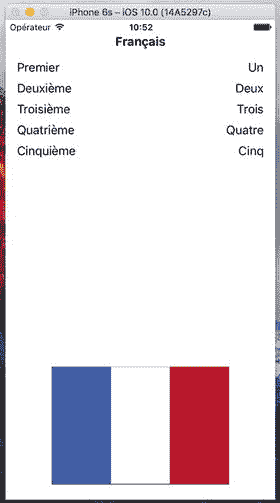

图 22-14. 我们已正确本地化的应用（法语版），包含正确的国旗

那么，我们完成了吗？还没有。以英语作为活动语言重新运行应用。您会看到未本地化的应用版本，如图 22-3 所示。要使应用在英语下正常工作，我们需要为其进行英语本地化。为此，在项目导航器中选择项目，然后从菜单中选择 **Editor** ➤ **Export for Localization…** 以再次导出用于本地化的字符串；但这次，选择 **Development Language Only**，然后按 **Save**。这将创建一个名为 `en.xliff` 的文件，我们将在其中添加英语本地化。编辑该文件并进行以下更改：

```
FLAG_FILE
国旗的名称
flag_usa

LABEL_FIVE
数字 5
Five

LABEL_FOUR
数字 4
Four

LABEL_ONE
数字 1
One

LABEL_THREE
数字 3
Three

LABEL_TWO
数字 2
Two
```

使用 **Editor** ➤ **Import Localizations** 将这些更改导回 Xcode。

Xcode 会创建一个名为 `en.lproj` 的文件夹，并向其中添加包含英语本地化的文件 `InfoPlist.strings`、`Localizable.strings` 和 `Main.strings`。您添加的是对国旗图像文件的引用以及用于替换代码中 `NSLocalizedString()` 函数调用中使用的键的文本。现在，如果您以英语作为所选语言运行应用，将看到正确的英语文本和美国国旗。

之所以需要为基础本地化提供国旗图像文件名和文本字符串，是因为我们在调用 `NSLocalizedString()` 时选择不使用本地化文本作为键。如果我们做了类似以下的操作，那么英语文本将出现在任何没有本地化的语言的用户界面中，即使我们没有提供基础本地化：

```
labels[0].text = NSLocalizedString("One", comment: "数字 1")
labels[1].text = NSLocalizedString("Two", comment: "数字 2")
labels[2].text = NSLocalizedString("Three", comment: "数字 3")
labels[3].text = NSLocalizedString("Four", comment: "数字 4")
labels[4].text = NSLocalizedString("Five", comment: "数字 5")
let flagFile = NSLocalizedString("flag_usa", comment: "国旗的名称")
```

虽然这完全合法，但缺点是，如果您需要更改任何英语文本字符串，您也在更改用于查找所有其他语言字符串的键，因此您需要手动更新所有本地化的 `.strings` 文件，以便它们使用新的键。

### 本地化应用显示名称

我们想探索最后一个常用的本地化部分：本地化在主屏幕和其他地方可见的应用名称。Apple 为其多个内置应用做了这项工作，您可能也想这样做。用于显示的应用名称存储在您应用的 `Info.plist` 文件中，您可以在项目导航器中找到该文件。选择此文件进行编辑，您会看到它包含的一个项 **Bundle name** 当前设置为 `${PRODUCT_NAME}`。在 `Info.plist` 文件使用的语法中，任何以美元符号开头的内容都受变量替换的影响。在这种情况下，这意味着当 Xcode 编译应用时，此项的值将被替换为此 Xcode 项目中产品的名称，即应用本身的名称。这正是我们想要进行本地化的地方，将 `${PRODUCT_NAME}` 替换为每种语言的本地化名称。然而，事实证明，这并不像您想象的那么简单。

`Info.plist` 文件算是一个特殊情况，它本身并非设计为可本地化的。相反，如果您想要本地化 `Info.plist` 的内容，您需要创建名为 `InfoPlist.strings` 的文件的本地化版本。在此之前，您需要创建该文件的基础版本。如果您按照上一节的步骤本地化了应用，您应该已经有此文件的英文和法文版本，且它们都是空的。如果您没有这些文件，可以按如下方式添加一个：

1.  选择 **File** ➤ **New** ➤ **File…**。在 iOS 部分，选择 **Resource**，然后选择 **Strings File**（见图 22-15）。按 **Next**，将文件命名为 `InfoPlist.strings`，将其分配给 `LocalizeMe` 项目中的 **Supporting Files** 组，然后创建它。

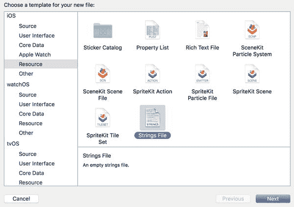

图 22-15. iOS 资源文件类型选择下的 Strings File 选项  

2.  选择新文件，在文件检查器中按 **Localize**。在出现的对话框中，将该文件移至英语本地化。返回文件检查器，在 **Localizations** 下勾选法语的复选框。您现在应该在项目导航器中看到此文件的法语和英语副本。

我们需要在每个本地化副本中添加一行，以定义应用的显示名称。在 `Info.plist` 文件中，我们看到显示名称与一个名为 **Bundle name** 的字典键关联；然而，这并不是真正的键名。它只是 Xcode 的一个贴心设计，试图为我们提供一个更友好且可读的名称。真正的名称是 `CFBundleName`，您可以通过选择 `Info.plist`，在视图中的任意位置右键单击，然后选择 **Show Raw Keys/Values** 来验证。这会显示所用键的真实名称。因此，选择 `InfoPlist.strings` 的英语本地化文件，并添加或修改以下行：

```
"CFBundleName" = "Localize Me";
```

如果您按照英语本地化步骤操作，此键可能已经存在，因为它是导入 XLIFF 文件过程的一部分。实际上，另一种本地化应用名称的方法是将翻译添加到 XLIFF 文件中，方式与处理其他需要翻译的文本相同——只需查找 `CFBundleName` 的条目，并添加一个包含翻译名称的 `<trans>` 元素。类似地，选择 `InfoPlist.strings` 文件的法语本地化文件，并编辑它，为应用提供一个合适的法语名称：

```
"CFBundleName" = "Localisez Moi";
```


### 构建并运行应用  
构建并运行应用，然后返回启动屏幕。当然，如果当前设备或模拟器运行的是英文，请将其切换为法语。你应该能看到应用图标正下方显示的本地化名称，但有时它可能不会立即出现。iOS 似乎会在添加新应用时缓存此信息，但当现有应用被新版本替换时（至少当 Xcode 执行替换时），它不一定会更新。因此，如果你在法语环境下运行且未看到新名称，请不要担心。只需从启动屏幕中删除应用，返回 Xcode，然后再次构建并运行应用即可。

### 警告  
如果你通过自定义方案运行应用，将无法看到本地化的应用名称。唯一的方法是切换设备或模拟器的语言为法语。

现在，我们的应用已完全本地化为法语和英语。

### 添加另一种本地化  
最后，我们将为应用添加另一种本地化。这次，我们将其本地化为瑞士法语，这是法语的一种区域变体，语言代码为 `fr-CH`。

基本原理与之前相同——实际上，既然你已经完成过一次，这次应该会快得多。首先在项目导航器中选择项目，然后在编辑器中选择项目本身，接着选择 `Info` 标签页。在 `Localizations` 部分，点击 `+` 添加新语言。菜单中不会看到瑞士法语，因此向下滚动并选择 `Other`。这将打开一个包含大量语言的子菜单（幸运的是，它们按字母顺序排列）。向下滚动，找到 `French (Switzerland)` 并选择它。在出现的对话框中（如图 22-6 所示），将所有列出的文件的 `Reference Language` 更改为 `French`，以便 Xcode 使用现有的法语翻译作为瑞士法语本地化的基础，然后点击 `Finish`。现在，如果你查看项目导航器，会看到故事板、本地化字符串和 `InfoPlist.strings` 文件的瑞士法语版本。为了演示此本地化与法语本地化的区别，请打开瑞士法语版本的 `InfoPlist.strings`，并将包名称更改为以下内容：

```
"CFBundleName" = "Swiss Localisez Moi";
```

现在构建并运行应用。切换到“设置”应用并进入“语言与地区”。你可能不会在 iPhone 语言列表中找到瑞士法语。相反，请点击“添加语言…”并向下滚动（或搜索），找到 `French (Switzerland)`，然后选择它并点击“完成”。这将弹出一个操作表，询问你更喜欢瑞士法语还是当前语言。选择瑞士法语，让 iOS 自行重置。转到主屏幕，现在你应该看到我们的应用名称为 `Swiss Localisez Moi`（实际上，你可能看不到完整名称，因为它太长，但你明白意思）。如果你打开应用，会看到所有文本都是法语的。遗憾的是，国旗仍然是法国国旗，而不是瑞士国旗。到现在，你应该能够通过编辑瑞士本地化文件来解决这个问题。因此，作为练习，尝试从互联网下载瑞士国旗图片，看看能否使其出现在瑞士版本的应用中。

### 总结  
为了最大化 iOS 应用的销量，你可能希望尽可能地进行本地化。幸运的是，iOS 本地化架构使应用内支持多种语言，甚至同一种语言的多种方言变得轻而易举。正如本章所见，添加到应用中的几乎所有类型的文件都可以进行本地化。

即使你不打算本地化应用，也应养成使用 `NSLocalizedString()` 的习惯，而不是在代码中直接使用静态字符串。借助 Xcode IDE 的代码补全功能，输入时间的差异几乎可以忽略不计。而且，如果你将来希望翻译应用，生活将变得轻松得多。在项目后期才回头查找所有应本地化的文本字符串，是一个既枯燥又容易出错的过程，而通过一点前期努力即可避免。

### 书籍总结  
我们在这本书中接触的编程语言和框架，是超过 25 年演进的最终成果。苹果工程师们正夜以继日地工作，构思下一个酷炫的新事物。iOS 平台刚刚开始绽放，未来还有更多精彩。通过读完本书，你已经为自己打下了坚实的基础。你已扎实掌握了 Swift、Cocoa Touch，以及将这些技术融合起来创建令人惊叹的 iPhone、iPod touch 和 iPad 应用的工具。你理解了 iOS 软件架构——那些让 Cocoa Touch 绽放光彩的设计模式。简言之，你已准备好规划自己的道路。祝你好运。

# Swift 简介  
直到最近，编写 iPhone 或 iPad 应用意味着需要与 Objective-C 打交道。由于其不寻常的语法，Objective-C 是最具两极分化的编程语言之一——人们要么爱它，要么恨它。在 2014 年的全球开发者大会上，苹果通过推出一门名为 Swift 的新语言改变了这一切。Swift 的语法设计旨在让习惯了 C++ 和 Java 等更流行的面向对象编程语言的程序员能够轻松识别，从而使他们更容易开始为 iOS（以及 Mac，因为 Swift 在 macOS 上也完全被支持作为开发语言）编写应用。本附录涵盖了理解本书示例代码所需了解的 Swift 部分。我们假设你已经具备一些编程经验，并且知道变量、函数、方法和类是什么。本附录既不是语言参考，也不是详尽指南——如需更全面的资料，请参考其他众多资源，其中一些列在第 1 章中。

## Swift 基础  
Xcode 6 中与 Swift 一同推出的最有用的新特性之一是`playground`（游乐场）。顾名思义，游乐场是一个你可以自由尝试代码的地方，无需创建运行环境——只需打开一个游乐场，输入一些代码，然后查看结果。游乐场是原型开发新功能的好地方，也是学习新语言的理想起点，因此我们将在本附录中一直使用它们。

让我们从创建一个新的游乐场开始。启动 Xcode，进入 `File` ➤ `New` ➤ `Playground…`。在打开的对话框中，为你的游乐场命名（例如 `SwiftBasics`），确保 Platform 为 `iOS`，然后点击 `Next`。选择保存游乐场的文件夹，然后点击 `Create`。Xcode 会创建游乐场并在新窗口中打开，如图 A-1 所示。在阅读本附录中的示例时，请随意在游乐场中添加自己的代码或修改示例，看看会发生什么。

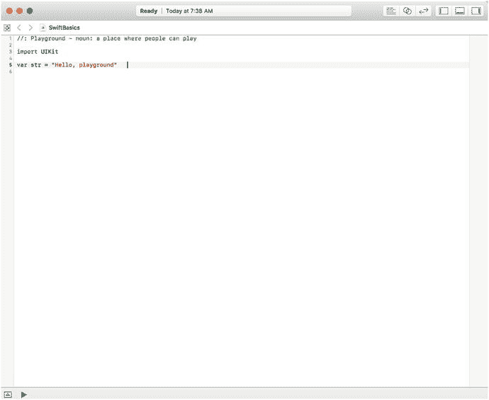

**图 A-1.** 新创建的游乐场


### 游乐场、注释、变量与常量

我们先花点时间看看游乐场（Playground）的布局。它被划分为两个区域——代码位于左侧，结果显示在右侧。当你输入代码时，Swift 编译器会立即编译并执行这些代码，并近乎实时地向你展示结果。图 A-1 中的代码声明了一个名为 `str` 的新变量，并用字符串 `"Hello, playground"` 对其进行了初始化。你可以在右侧的结果栏中看到这个字符串。尝试修改该值，你会注意到一旦停止输入，结果就会随之更新。

图 A-1 中第 1 行代码是一个注释。编译器会忽略字符序列 `//` 之后直到行尾的所有内容。在这里，注释占据了整行，但这并非唯一的选择。我们也可以将注释添加到一行代码的末尾，如下所示：

```
var str = "Hello, playground"   // 我对这一行的注释
```

要编写跨越多行的注释，请以 `/*` 开头，以 `*/` 结尾，就像这样：

```
/*
这是一个注释，它占据了
不止一行。
*/
```

编写多行注释有多种不同方式。有些人喜欢通过在每行开头加上 `*` 字符来明确表明该行是注释的一部分：

```
/*
* 这是一个注释，它占据了
* 不止一行。
*/
```

另一些人则喜欢这样编写单行注释：

```
/* 这是编写单行注释的另一种方式。 */
```

图 A-1 中第 3 行的 `import` 语句使得 Apple 的 UIKit 框架可在游乐场中使用：

```
import UIKit
```

iOS 包含许多框架，其中一些你会在本书中读到。UIKit 是用户界面框架，我们将在所有代码示例中使用它。另一个你会经常用到的框架是 Foundation，它包含提供基本功能的类，如日期和时间处理、集合、文件管理、网络等。要访问这个框架，你需要像这样导入它：

```
import Foundation
```

但是，UIKit 会自动导入 Foundation，因此任何导入了 UIKit 的游乐场都会自动获得 Foundation 的访问权限，而无需显式地为其添加 import 语句。

第 5 行是这个游乐场中第一行（也是唯一一行）可执行代码：

```
var str = "Hello, playground"
```

`var` 关键字声明了一个带有给定名称的新变量。在这里，该变量名为 `str`，这很合适，因为它是一个字符串。Swift 对变量名非常宽容：在名称中你几乎可以使用任何你喜欢的字符，但首字符有一些限制。你可以在 Apple 的文档 [`developer.apple.com/library/ios/documentation/Swift/Conceptual/Swift_Programming_Language`](https://developer.apple.com/library/ios/documentation/Swift/Conceptual/Swift_Programming_Language) 中找到具体规则。

在变量声明之后，是一个为其分配初始值的表达式。你不必在声明变量时就初始化它，但必须在*使用*它之前（即，在执行任何读取其值的代码之前）进行初始化。然而，如果你选择赋值，那么 Swift 可以推断出变量的类型，省去你显式声明类型的麻烦。在这个例子中，Swift 推断 `str` 是一个字符串变量，因为它被一个字符串字面量初始化了。如果你选择不提供初始化器（可能因为没有固定的初始值），你必须通过在变量名后附加其类型，并用冒号分隔来声明变量的类型，就像这样：

```
var str2: String            // 一个未初始化的变量
```

尝试将游乐场中第 5 行的代码修改为：

```
var str: String
str = "Hello, playground"
```

这与原始代码完全等效，但现在你不得不显式声明 `str` 是一个字符串变量（`String` 是 Swift 中表示字符串的类型）。在大多数情况下，将声明和初始化结合起来，并让编译器推断变量的类型会更简单。

另一个利用 Swift 类型推断特性的例子如下：

```
var count = 2
```

这里，编译器推断 `count` 变量是一个整数。它的实际类型是 `Int`（我们将在下一节介绍 Swift 提供的数值类型）。你怎么能确定情况确实如此呢？很简单。让 Swift 告诉你。将上述代码输入游乐场，将鼠标悬停在 `count` 上，然后按住 ⌥（Option）键。光标会变成一个问号。现在点击鼠标，Swift 会通过一个弹出窗口向你展示它为该变量推断出的类型，如图 A-2 所示。

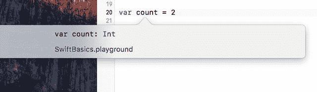

**图 A-2.** 获取变量的推断类型

你没有显式声明变量的类型并不意味着它没有类型，或者你可以随意对待它。Swift 在变量声明时分配一个类型，之后你必须坚持使用该类型。与 JavaScript 这样的动态语言不同，你不能仅仅通过给变量赋一个新值来改变它的类型。尝试这样做：

```
var count = 2
count = "Two"
```

尝试将一个字符串值赋给一个整数变量会导致错误；你会在游乐场左侧的空白处看到一个红色标记。点击它，Swift 会显示一条消息来解释问题（见图 A-3）。

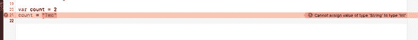

**图 A-3.** Swift 不是动态语言。你不能改变变量的类型

如果你之前有编程经验，可能会注意到我们没有费心在语句末尾添加分号。这是 Swift 众多好用的特性之一：几乎从未必要用分号结束一条语句。如果你习惯用 C、C++、Objective-C 或 Java 编写代码，一开始可能会觉得有点奇怪，但一段时间后，你就会习惯了。当然，如果你想的话，也可以输入分号，但很可能最后你就不这么做了。唯一必须使用分号的情况是，如果你想在同一行编写两条语句。以下代码是无效的：

```
var count = 2 count = 3
```

加上一个分号，编译器就又会满意了：

```
var count = 2; count = 3
```

正如上面的代码所示，你可以改变一个变量的值。毕竟，这就是它被称为变量的原因。如果你只想给一个固定值取个名字呢？换句话说，你想创建一个常量并给它命名。为此，Swift 提供了 `let` 语句，它和 `var` 很像，只是你必须提供一个初始值：

```
let pi = 3.14159265
```

与变量一样，Swift 可以推断常量的类型（或者你也可以显式声明它），但是你不能重新赋值一个常量的值，这当然是将其设为常量的目的所在：

```
pi = 42       // 错误 – 无法赋值给 ‘pi’：'pi' 是一个 ‘let’ 常量
```

当然，你可以用一个常量来初始化一个变量的值：

```
let pi = 3.14159265
var value = pi
```

如你所见，Swift 会将可执行语句的结果打印到对应代码的右侧。你也可以使用 Swift 标准库中的 `print()` 函数来创建输出。例如，尝试一下：

```
print("Hello, world")
```


好的，作为一名高级文档工程师和翻译员，我将严格按照您的要求，将给定的英文文本翻译成中文。


字符串`"Hello, world"`后跟一个换行符会像往常一样出现在 Playground 的输出区域中，但你也可以让它与代码内联显示。为此，将鼠标悬停在结果区域上，你会看到出现几个圆形控件。点击右侧的控件，结果就会直接显示在`print()`语句下方，如图 A-4 所示。此外，请注意底部还有一个调试区域，输出也会显示在其中。你可以通过点击 Playground 底部左侧的三角形展开按钮来打开或关闭调试区域。

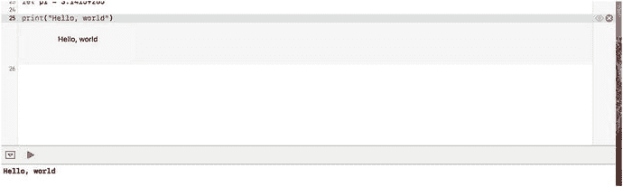

**图 A-4.** 在代码中内联显示输出以及在调试区域中显示输出

如果你不想让换行符自动附加到字符串上，可以使用一个稍有不同的`print()`版本（它接受一个额外参数）来去除或替换它。试试这个：

```
print("Hello, world", terminator: "")
```

这段代码将换行符替换为空字符串。如果你在结果区域中查看，会发现换行符不再存在了。

**提示**

`print()`是 Swift 标准库中的一个函数。你可以在[`https://developer.apple.com/library/ios/documentation/General/`](https://developer.apple.com/library/ios/documentation/General/) `Reference/SwiftStandardLibraryReference`找到该库的文档。另一种查看标准库内容的方法是，在你的 Playground 中添加一行`import Swift`，然后按住`⌘`（Cmd）键并点击`Swift`这个词。Playground 会切换到标准库内容的列表。这里包含大量信息，你需要了解更多 Swift 知识才能完全理解，但浏览一下以了解有什么可用内容是值得的。

### 预定义类型、运算符和控制语句

Swift 带有一组基本的预定义类型。在后面的章节中，你将看到可以通过定义自己的类、结构体和枚举来扩展这些类型。你甚至可以通过创建类型的扩展来为现有类型添加功能。Swift 还提供了运算符和控制语句，这些对你来说很可能在其他语言中已经很熟悉。让我们从基本类型的快速概览开始。

#### 数值类型

Swift 有四种基本的数值类型——`Int`、`UInt`、`Float`、`Double`——以及一组更专门的整数类型。完整的整数类型集，包括其大小（以位为单位）以及它们可以表示的值范围，列在表 A-1 中。

**表 A-1.** 整数类型

| 类型 | 大小（位） | 最大值 | 最小值 |
| --- | --- | --- | --- |
| `Int` | 32 或 64 | 与`Int32`或`Int64`相同 | 与`Int32`或`Int64`相同 |
| `UInt` | 32 或 64 | 与`UInt32`或`UInt64`相同 | 0 |
| `Int64` | 64 | 9,223,372,036,854,775,807 | –9,223,372,036,854,775,808 |
| `UInt64` | 64 | 18,446,744,073,709,551,615 | 0 |
| `Int32` | 32 | 2,147,483,647 | –2,147,483,648 |
| `UInt32` | 32 | 4,294,967,295 | 0 |
| `Int16` | 16 | 32767 | –32768 |
| `UInt16` | 16 | 65535 | 0 |
| `Int8` | 8 | 127 | –128 |
| `UInt8` | 8 | 255 | 0 |

`Int`及其衍生类型是有符号值，而与`UInt`相关的类型是无符号的。整数值的默认类型（即当你编写类似`var count = 3`时推断的类型）是`Int`，并且除非你有特定理由使用其他类型，否则这是推荐使用的类型。

从表中可以看出，`Int`和`UInt`可以表示的值范围取决于平台。在 32 位系统上（例如某些 iPad、所有 iPhone 4s 之前的 iPhone 以及 iPhone 5c），这些都是 32 位值，而在 64 位系统上，它们是 64 位宽。如果你需要一个明确是 32 位或明确是 64 位的值，那么请使用`Int32`或`Int64`。`Int8`和`UInt8`类型可用于表示字节。

你可以通过使用它们的`max`和`min`属性以编程方式发现每种类型的最大值和最小值。例如，尝试在你的 Playground 中输入以下代码行（不包含注释，注释显示了结果）：

```
print(Int8.max)       // 127
print(Int8.min)       //  -128
print(Int32.max)     // 2,147,483,647
print(Int32.min)     // -2,147,483,648
print(UInt32.max)     // 4,294,967,295
```

整数字面量可以用十进制、十六进制、八进制或二进制数基书写。尝试以下示例：

```
let decimal = 123         // 值为 123
let octal = 0o77          // 八进制 77 = 十进制 63
let hex = 0x1234          // 十六进制 1234 = 十进制 4660
let binary = 0b1010       // 二进制 1010 = 十进制 10
```

前缀`0o`表示八进制，`0x`表示十六进制，`0b`表示二进制。为了可读性，你还可以在任何位置使用下划线字符（`_`）来分隔数字组：

```
let v = -1_234           // 等同于 -1234
let w = 12_34_56         // 等同于 123456
```

注意，你不必遵循按三位数字一组分组的常规规则。

`Float`和`Double`类型分别是 32 位和 64 位浮点数。你可以通过使用浮点字面量给浮点变量赋值。除非另有指定，Swift 会推断类型为`Double`：

```
let a = 1.23             // 被推断为 Double
let b: Float = 1.23      // 强制为 Float
```

你还可以使用指数（或科学）表示法，这对大数字很方便：

```
let c = 1.23e2         // 计算结果为 123.0
let d = 1.23e-1        // 计算结果为 0.123
let e = 1.23E-1        // 等同于 1.23e-1
```

就其本质而言，浮点数并不是完全精确的。原因之一是，小数值无法在二进制浮点形式中精确表示。如果你在 Playground 中输入以下内容，可以看到这一点（和之前一样，注释显示了结果）：

```
let f: Float = 0.123456789123        // 0.1234568
let g: Double = 0.123456789123       // 0.123456789123
```

你可以看到，该值的`Float`表示不如`Double`表示精确。如果你使小数部分更长，也会超出`Double`格式的精度。


```swift
let g: Double = 0.12345678912345678  // 0.1234567891234568
```

当数值很大时，浮点数同样会丢失精度：

```swift
let f: Float = 123456789123456        // 不精确：1.234568e+14
let g: Double = 123456789123456       // 精确：123,456,789,123,456.0
let h: Double = 123456789123456789    // 不精确：1.234567891234568e+17
```

与其他语言不同，当你将一种数值类型的变量（或表达式）赋值给另一种数值类型的变量时，Swift 不会提供隐式类型转换。例如，如图 A-5 所示，以下代码无法编译通过。

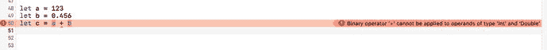

**图 A-5.** Swift 不允许组合不同类型的变量

```swift
let a = 123
let b = 0.456
let c = a + b
```

变量 `a` 是 `Int` 类型，而 `b` 是 `Double` 类型。Swift 本可以将 `Int` 转换为 `Double` 并执行加法，但它不会这样做。你必须自己执行转换：

```swift
let a = 123
let b = 0.456
let c = Double(a) + b
```

表达式 `Double(a)` 调用了 `Double` 类型的一个初始化器，该初始化器接收一个整数参数。所有的数值类型都提供了这种初始化器，让你能够执行此类转换。

另一个常见例子涉及 `CGFloat` 类型。`CGFloat` 是由 Core Graphics 框架定义的一种浮点类型。它用于表示坐标和尺寸等属性。根据应用程序运行在 32 位还是 64 位平台，它等同于 `Float` 或 `Double`。要执行涉及 `CGFloat` 和其他类型混合的操作，你需要显式地将一种类型转换为另一种。例如，以下代码将一个 `Double` 和一个 `CGFloat` 相加，通过将 `Double` 转换为 `CGFloat` 来生成一个 `CGFloat` 类型的结果：

在 32 位平台上，`CGFloat` 的精度低于 `Double`，因此此操作可能会丢失信息，但如果你需要得到一个 `CGFloat` 类型的值，这是不可避免的。如果你需要 `Double` 类型的结果，可以将 `CGFloat` 转换为 `Double`，且不会损失精度：

```swift
let a: CGFloat = 123
let b: Double = 456
let c = Double(a) + b    // 结果为 Double 类型
```

需要注意的是，当所有涉及的值都是字面量时，Swift 允许你混合使用数值类型。例如：

```swift
1 + 0.5      // 计算结果为 1.5
```

你在 Swift 中能找到所有常见的二元算术运算符。你可以用它们来组合相同类型的数值；如你刚刚所见，如果显式转换其中一个操作数，也可以将它们应用于不同类型的数值。表 A-2 列出了可用的算术运算符。运算符按优先级递减的顺序列出。

**表 A-2.** 预定义的二元算术运算符

| 运算符 | 含义 |
| --- | --- |
| `<<` | 按位左移 |
| `>>` | 按位右移 |
| `*`, `&*` | 乘法 |
| `/`, `&/` | 除法 |
| `%`, `&%` | 取余 |
| `&` | 按位与 |
| `+`, `&+` | 加法 |
| `-`, `&-` | 减法 |
| `&#124;` | 按位或 |
| `^` | 按位异或 |

算术运算 `+`、`-`、`*`、`/` 和 `%` 会检测溢出。如果你希望忽略溢出，请改用 `&+`、`&-`、`&*`、`&/` 或 `&%`。例如，在 playground 中输入以下代码：

```swift
let a = Int.max
let b = 1
let c = Int.max + b
```

我们将 1 加到最大可表示整数值上，这将触发溢出。在 playground 中，你会看到赋值给变量 `c` 的那一行出现错误信息；但如果你在应用程序中执行相同的代码，程序将会崩溃。若要允许操作继续并忽略溢出，请改用 `&+`：

```swift
let a = Int.max
let b = 1
let c = a &+ b
```

`<<` 和 `>>` 运算符将左操作数按右操作数指定的数量进行左移和右移。这相当于乘以或除以 2 的幂。例如：

```swift
let a = 4
let b = a << 1   // 结果为 8
```

当左操作数为负数时，结果的符号保持不变：

```swift
let a = -4
let b = a << 1   // 结果为 -8
```

`&`、`|` 和 `^` 运算对其操作数执行按位与、或和异或操作。不要将它们与 `&&` 和 `||` 运算符混淆，后者是返回布尔结果的逻辑运算符（参见本附录后面的“布尔值”部分）。以下是一些例子：

```swift
let a = 7          // 值 0b111
let b = 3          // 值 0b011
let c = a & b      // 结果为 0b011 = 3

let a = 7          // 值 0b111
let b = 3          // 值 0b011
let c = a | b      // 结果为 0b111 = 7

let a = 7          // 值 0b111
let b = 3          // 值 0b011
let c = a ^ b      // 结果为 0b100 = 4
```

这些运算符还有复合变体，它们先执行运算，然后进行赋值，赋值目标作为运算的左操作数。例如：

```swift
var a = 10
a += 20       // 简写形式为 a = a + 20，结果为 30

var b = 7
b &= 3        // 简写形式为 b = b & 3，结果为 3
```

**注意：** 在 Swift 3 中，一元运算符 `++` 和 `--` 已不再可用。你需要使用一种格式来替换类似 `a++` 这样的写法，例如 `a += 1`。这也意味着，在转换包含这些一元运算符的代码时，需要注意运算符的顺序（即 `++a` 与 `a++` 等）。

`~` 一元运算符对其整数操作数的各位执行按位取反：

```swift
let a = 0b1001
let b = ~a
```

在 32 位下，此运算的结果是 `0b11111111111111111111111111110110`，等同于 –10。


### 字符串

字符串由 `String` 类型表示，是 Unicode 字符的序列。Swift 在字符串中使用 Unicode，使得无需编写特殊代码即可构建支持多种不同字符集的应用程序。然而，这也会带来一些复杂性，此处将提及部分内容。关于使用 Unicode 影响的完整讨论，请参阅《The Swift Programming Language》，你可以在 Apple 开发者网站（网址如前所述）或 iBooks 中找到它。

字符串字面量是用双引号括起来的字符序列，就像你已经见过的这个示例：

```
let str = "Hello, playground"
```

如果需要在字符串中包含 `"` 字符，请使用 `\` 字符对其进行转义，如下所示：

```
let quoted = "Contains \"quotes\""      // 包含 "quotes"
```

要得到 `\`，请用另一个 `\` 对其进行转义：

```
let backslash = "\\"     // 结果是 \
```

任何 Unicode 字符都可以通过给出其十六进制表示（或码点），并用 `\u{}` 括起来，从而嵌入到字符串中。例如，`@` 符号的码点是 `0x40`，因此以下示例展示了在 Swift 字符串中表示 `@` 的两种方式：

```
let atSigns = "@\u{40}"     // 结果是 @@
```

某些字符具有特殊的转义表示形式。例如，`\n` 和 `\t` 分别表示换行符和制表符：

```
let specialChars = "Line1\nLine2\tTabbed"
```

字符串具备一项有用的能力，即对包含在转义序列 `\()` 中的表达式进行插值。例如：

```
print("The value of pi is \(M_PI)")   // 打印 "The value of pi is 3.14159265358979\n"
```

这段代码将预定义常量 `M_PI` 的值插入到字符串中，然后打印结果。被插值的值也可以是一个表达式，并且可以有多个这样的表达式：

```
// 这段代码打印："Area of a circle of radius 3.0 is 28.2743338823081\n"
let r = 3.0
print("Area of a circle of radius \(r) is \(M_PI * r * r)")
```

`+` 运算符可用于连接字符串。这是组合那些你需要跨源代码文件多行拆分的字符串的唯一方式：

```
let s = "That's one small step for man, " +
"one giant leap for mankind"
print(s)   // "That's one small step for man, one giant leap for mankind\n"
```

你可以使用 `==` 和 `!=` 运算符（参见“布尔值”部分）比较两个字符串，这些运算符会对其操作数进行逐字符比较。例如：

```
let s1 = "String one"
let s2 = "String two"
let s3 = "String " + "one"
s1 == s2     // false：字符串不相同
s1 != s2     // true：字符串不同
s1 == s3     // true：字符串包含相同字符。
```

获取字符串长度这一看似简单的任务，因字符串由 Unicode 字符组成而变得复杂，因为并非每个 Unicode 字符都由单个码点表示。我们将跳过此主题的详细讨论，但有两件事需要注意。首先，如果你想要准确计算字符串中字符的数量（在所有情况下均有效），请使用字符串的 `characters` 属性，然后获取其长度：

```
s3.characters.count    // 10
```

如果你知道字符串仅包含由单个 Unicode 码点表示的字符，你可以改用字符串的 UTF-16 视图进行计数，这在某些情况下可能更快：

```
s3.utf16.count      // 10
```

`String` 类型本身提供了相当多有用的字符串操作，你可以在此附录前面引用的 Swift 库参考文档中找到相关说明。你还可以利用这样一个事实：Swift 会自动将 `String` 类型桥接到 Foundation 框架中的 `NSString` 类，这意味着 `NSString` 定义的方法可以像在 `String` 本身上定义一样使用。

`Character` 类型可用于保存字符串中的单个字符。这允许通过字符串的 `characters` 属性对其各个字符进行迭代：

```
let s = "Hello"
for c in s.characters {
print(c)
}
```

在此示例中，`for` 循环的主体（其语法稍后讨论）针对字符串中的每个字符执行一次，字符被赋值给变量 `c`，其类型被推断为 `Character`。在 Playground 中，你无法直接在结果列中看到此循环的结果——只能看到它被执行了五次。不过，你可以将鼠标悬停在结果列的结果上，点击出现的两个控件中最左侧的那个（看起来像眼睛的控件）以弹出窗口，然后右键单击该弹出窗口，从出现的菜单中选择“值历史记录”以查看所有字符，如图 A-6 所示。至少在撰写本文时，点击结果中出现的任何滚动条都不起作用——你必须使用键盘上的上/下箭头键进行滚动。

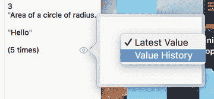

**图 A-6.** 值历史记录弹出窗口

提示

如果你没有看到结果列，请将鼠标悬停在右侧边缘，直到看到列宽拖动条，然后用它来加宽结果面板的宽度。

你可以像创建 `String` 一样创建和初始化 `Character`，但需要显式声明类型以避免被推断为 `String`，并且初始化器必须恰好包含一个字符：

```
let c: Character = "s"
```

你不能对 `Character` 做太多操作，除了与其他 `Character` 进行比较。你不能将它们相互追加，也不能直接将它们添加到 `String`。你必须使用 `String` 的 `append()` 方法：

```
let c: Character = "s"
var s = "Book"  // 使用 "var" 因为我们想要修改它
s += c                // 错误 – 非法
s.append(c)       // "Books"
```

Swift 中的字符串并非不可变，但它们是值对象，这意味着每当你将字符串赋值给变量，或将其用作函数参数或返回值时，该字符串都会被复制。对副本所做的修改不会影响原始字符串：

```
var s1 = "Book"
var s2 = s1             // s2 现在是 s1 的一个副本
s2 += "s"               // 追加到 s2；s1 保持不变
s1                          // "Book"
s2                          // "Books"
```

注意

为了提高效率，字符串内容的实际复制不会在赋值后立即发生。在前面的示例中，`s1` 和 `s2` 在赋值 `s1 = s2` 后共享其字符内容的同一个副本，直到执行语句 `s2 += "s"`。此时，在将字符 `"s"` 追加到 `s2` 之前，会创建共享内容的一个副本并安装到 `s2` 中。所有这一切都是自动发生的。


#### 布尔值

布尔值由 `Bool` 类型表示，其可能值为 `true` 或 `false`：

```
var b = true              // 推断类型为 Bool
var b1: Bool
b1 = false
```

Swift 拥有一系列常用的比较运算符（`==`、`!=`、`>`、`<`、`>=`、`<=`），当应用于数值时，这些运算符会返回一个 `Bool` 值：

```
var a = 100
var b = 200
var c = a
a == c       // true
a == b      // false
a != b       // true
a > b        // false
a = c      // true
```

顺便一提，这些运算符也可以应用于字符串：

```
let a = "AB"
let b = "C"
let c = "CA"
let d = "AB"
a == b     // false – 字符串内容不同
a == d     // true – 字符串内容相同
a != c      // true – 字符串内容不同
a > b       // false: 使用排序顺序
a < c        // true: 两者都以 C 开头，但字符串 c 比 a 长
```

你可以使用一元运算符 `!` 来否定一个布尔值：

```
var a = 100
var b = 200
a == b           // false
!(a == b)        // !false == true
```

布尔表达式可以使用运算符 `==`、`!=`、`&&` 和 `||` 进行组合。`&&` 和 `||` 运算符具有短路特性，这意味着它们仅在第一个操作数的值无法确定结果时，才会对第二个操作数进行求值。具体来说，如果第一个操作数为 `true`，则 `||` 运算符的第二个操作数无需求值；如果第一个操作数为 `false`，则 `&&` 的第二个操作数不会被求值：

```
var a = 100
var b = 200
var c = 300
a  b   // true；两个表达式都被求值
a  b      //  true：第二个表达式未求值
a > b && c > b   // false：第二个表达式未求值
```

#### 枚举

枚举让你能够为那些值集合固定且已知的类型赋予有意义的名称。要定义一个枚举，你需要为其命名，并将所有可能的值列为 case：

```
enum DaysOfWeek {
case Sunday, Monday, Tuesday, Wednesday,
Thursday, Friday, Saturday
}
```

你也可以单独定义每个 case：

```
enum DaysOfWeek {
case Sunday
case Monday
case Tuesday
case Wednesday
case Thursday
case Friday
case Saturday
}
```

要引用一个枚举值，请使用枚举名称和 case 名称，并用句点分隔：

```
var day = DaysOfWeek.Sunday     // "day" 被推断为 "DaysOfWeek" 类型
```

当上下文清晰时，你可以省略枚举名称。在以下示例中，编译器已经知道变量 `day` 是 `DaysOfWeek` 类型，因此赋值时无需显式说明：

```
day = .Friday      // 注意：句点 "." 是必需的
```

在 Swift 中，你还可以为枚举 case 赋予关联值。在你的 Playground 中尝试这个例子：

```
enum Status {
case OK
case ERROR(String)
}
let status = Status.OK
let failed = Status.ERROR("That does not compute")
```

在这里，`ERROR` case 有一个关联值——一个描述错误的字符串。你可以在 `switch` 语句中提取这个关联值，正如你将在接下来的“控制语句”部分中看到的那样。

在某些情况下，将每个枚举 case 映射到一个值（称为原始值）是很有用的。为此，需要在枚举名称旁边指定值的类型，然后在定义每个 case 时为其分配单独的值。下面是 `DaysOfWeek` 枚举的一个变体，它为每个 case 分配了一个整数值：

```
enum DaysOfWeek : Int {
case Sunday = 0
case Monday
case Tuesday
case Wednesday
case Thursday
case Friday
case Saturday
}
```

原始值可以是字符串或任何数值类型。当原始值类型是整数时，你不需要为每个 case 显式赋值；未赋值的 case 会通过将上一个原始值加 1 来推断得出。在前面的例子中，`Sunday` 被赋予了原始值 0，因此 `Monday` 自动获得原始值 1，`Tuesday` 获得原始值 2，依此类推。只要每个 case 的值唯一，你也可以覆盖默认的赋值：

```
enum DaysOfWeek : Int {
case Sunday = 0
case Monday          // 1
case Tuesday         // 2
case Wednesday       // 3
case Thursday        // 4
case Friday = 20     // 20
case Saturday        // 21
}
```

你可以通过访问 case 的 `rawValue` 属性来获取其原始值：

```
var day = DaysOfWeek.Saturday
let rawValue = day.rawValue           // 21。DaysOfWeek.Saturday.rawValue 同样有效
```

这是另一个使用 `String` 作为原始值类型的例子：

```
enum ResultType : String {
case SUCCESS = "Success"
case WARNING = "Warning"
case ERROR = "Error"
}
let s = ResultType.WARNING.rawValue    // s = "Warning"
```

给定一个原始值，你可以通过将其传递给初始化器来构建相应的 case 值：

```
let result = ResultType(rawValue: "Error")
```

在这个例子中，变量 `result` 的类型不是 `ResultType`，而是 `ResultType?`，这是一个可选类型的例子。由于可能将无效的原始值传递给初始化器，因此需要某种方式来表示没有对应此值的有效 case。Swift 通过返回特殊值 `nil` 来实现这一点；但 `nil` 不能赋值给普通变量，只能赋值给可选类型。可选类型通过尾部的 `?` 表示，操作它们时需要小心。我们稍后会更详细地讨论可选类型。

在 Objective-C 中，通常使用枚举来定义位掩码。每个单独的枚举值都是一个包含一个位的掩码，通常可以通过对两个或更多枚举 case 进行 OR（按位或）操作来组合值。你将在第 14 章看到一个例子，其中我们研究了 Foundation 框架中 `NSFileManager` 类的方法，这些方法让你能够定位众所周知的目录，例如应用程序的 Documents 目录。这些方法所需的参数之一指定了要执行搜索的域或域集合。在 Objective-C 中，可能的域由一个类似下面的枚举定义：

```
enum {
NSUserDomainMask = 1,
NSLocalDomainMask = 2,
NSNetworkDomainMask = 4,
NSSystemDomainMask = 8,
NSAllDomainsMask = 0x0ffff,
};
typedef NSUInteger NSSearchPathDomainMask;
```

如你所见，每个单独的值都是 2 的幂，这使得它们可以通过 OR 操作组合，同时仍然能够恢复原始值。

### 数组、区间和字典

Swift 提供了三种基本的集合类型（数组、字典和集合）以及一种区间语法，它提供了一种便捷的方式来表示（可能很大的）值的范围。区间在访问数组时特别有用。


### 数组与区间

Swift 支持使用语法 `[类型]` 创建值数组，其中 `类型` 是数组值的类型。以下代码创建并初始化了一个整数数组和一个字符串数组：

```
var integers = [1, 2, 3]
var days = ["Sunday", "Monday", "Tuesday", "Wednesday",
"Thursday", "Friday", "Saturday"]
```

当然，你也可以将数组的声明和初始化分开，只要在使用前完成初始化即可。这需要显式指定数组类型：

```
var integers: [Int]        // [Int] 表示 "整数数组"
integers = [1, 2, 3]
```

使用 `[]` 初始化一个空数组：

```
var empty: [String] = []
```

要访问数组中的元素，请使用数字下标作为索引。数组的第一个元素的索引为 0：

```
integers[0]        // 1
integers[2]        // 3
days[3]            // "Wednesday"
```

使用相同的语法为数组元素赋新值：

```
integers[0] = 4                           // [4, 2, 3]
days[3] = "WEDNESDAY"         // 将 "Wednesday" 替换为 "WEDNESDAY"
```

要提取或修改数组的一部分，请使用 Swift 的区间语法。这可能导致数组中元素数量的变化：

```
var integers = [1, 2, 3]
integers[1..<3]               // 获取元素 1 和 2 作为数组。结果为 [2, 3]
integers[1..<3] = [4]         // 将元素 1 和 2 替换为 [4]。结果为 [1, 4]
integers = [1, 2, 3]
integers[0…1] = [5, 4]     // 将元素 0 和 1 替换为 [5, 4]。结果为 [5, 4, 3]
```

注意：如果在结果列中查看，你不会看到正确的答案；你需要像我们之前展示的那样展开结果，或者在底部的调试面板中查看。

区间语法 `a..<b` 表示从 `a` 到 `b` 的所有值，但不包括 `b`；因此 `1..<5` 等同于 `1, 2, 3, 4`。语法 `a…b`（注意这里有三个连续的点）将 `b` 包含在区间内，因此 `1…5` 表示 `1, 2, 3, 4, 5`。区间 `a..<a` 始终为空，而区间 `a…a` 恰好包含一个元素（即 `a` 本身）。`b` 的值必须大于或等于 `a` 的值，并且隐含有步长 1。

要获取数组中的元素数量，请使用它的 `count` 属性：

```
var integers = [1, 2, 3]
integers.count                   // 3
integers[1..<3] = [4]
integers.count                   // 2
```

要向数组添加元素，请使用 `append()` 方法或 `insert(_:atIndex:)` 方法：

```
var integers = [1, 2, 3]
integers.append(4)                // 结果为 [1, 2, 3, 4]
integers.insert(-1, atIndex: 0)   // 结果为 [-1, 1, 2, 3, 4]
```

你也可以使用 `+` 运算符来连接两个数组，以及使用 `+=` 运算符将一个数组追加到另一个数组：

```
var integers = [1, 2, 3]
let a = integers + [4, 5]  // a = [1, 2, 3, 4, 5]；integers 数组不变
integers += [4, 5]                 // 现在 integers = [1, 2, 3, 4, 5]
```

使用 `remove()`、`removeSubrange()` 和 `removeAll()` 方法来移除数组的全部或部分元素：

```
var days = ["Sunday", "Monday", "Tuesday", "Wednesday",
"Thursday", "Friday", "Saturday"]
days.remove(at: 3)        // 移除 "Wednesday" 并将其返回给调用者
days.removeSubrange(0..<4)                      // 留下 ["Friday", "Saturday"]
days.removeAll(keepingCapacity: false)    // 留下一个空数组
```

传递给 `removeAll()` 的 `keepingCapacity` 参数指示是为数组元素分配的空间应保留（值为 `true`）还是释放（值为 `false`）。

你可以使用 `for` 语句遍历整个数组或数组的一部分，这将在“控制语句”部分讨论。

如果使用 `let` 语句创建了数组，则无论是数组本身还是其内容都不能以任何方式修改：

```
let integers = [1, 2, 3]     // 常量数组
integers = [4, 5, 6]         // 错误：不能替换数组
integers[0] = 2              // 错误：不能重新赋值元素
integers.removeAll(keepingCapacity: false)  // 错误：不能修改内容
```

与字符串一样，数组是值对象，因此赋值或将其传递给函数或从函数返回都会创建一份副本：

```
var integers = [1, 2, 3]
var integersCopy = integers   // 创建 "integers" 的副本
integersCopy[0] = 4           // 不会改变 "integers"
integers                      // [1, 2, 3]
integersCopy                  // [4, 2, 3]
```

你可以使用 `contains()` 方法来查找数组中是否包含某个元素：

```
let integers = [1, 2, 3]
integers.contains(2)     // true
integers.contains(4)     // false
```

要获取数组中元素的索引，请使用 `index(of:)` 方法：

```
let integers = [1, 2, 3]
integers.index(of: 3)        // 结果为 2
```

如果未在数组中找到该元素，则结果为 `nil`：

```
let integers = [1, 2, 3]
integers.index(of: 5)        // 结果为 nil
```

### 字典

你可以创建一个字典，这是一种将键实例映射到相应值的数据结构，使用的语法与数组类似。有时你可能会看到字典被称为映射。以下代码创建一个字典，其中键是字符串，值是整数：

```
var dict = ["Red": 0,
"Green": 1,
"Blue": 2]
```

此字典的形式化类型是 `[String: Int]`。你也可能会看到使用泛型语法将其称为 `Dictionary<String, Int>`，本附录中不涉及泛型语法。类似地，你可能会看到类型为 `[Int]` 的数组被称为 `Array<Int>`。

如果不使用初始化器，则需要在声明字典时显式声明其类型：

```
var dict: [String: Int]
dict = ["Red": 0, "Green": 1, "Blue": 2]
```

要根据键获取字典条目的值，请使用下标表示法，如下所示：

```
let value = dict["Red"]  // 结果为 0，即映射到键 "Red" 的值
```

你可以使用与修改数组非常相似的方式来修改字典：

```
dict["Yellow"] = 3    // 添加键为 "Yellow" 的新值
dict["Red"] = 4       // 更新键为 "Red" 的值
```

要从字典中移除元素，请使用 `removeValue(forKey:)` 方法；要移除所有值，请使用 `removeAll()`：

```
var dict = ["Red": 0, "Green": 1, "Blue": 2]
dict.removeValue(forKey: "Red")   // 移除键为 "Red" 的值
dict.removeAll()                  // 清空字典
```

使用 `let` 语句创建的字典无法被修改：

```
let fixedDict = ["Red": 0, "Green": 1, "Blue": 2]
fixedDict["Yellow"] = 3              // 非法
fixedDict["Red"] = 4                 // 非法
fixedDict = ["Blue", 7]              // 非法
fixedDict.removeValue(forKey:"Red")  // 非法
```

你可以使用 `for` 语句遍历字典的键，这将在“控制语句”部分看到。要获取字典中键值对的数量，请使用 `count` 属性：

```
var dict = ["Red": 0, "Green": 1, "Blue": 2]
dict.count      // 3
```

与数组一样，字典是值类型，在赋值或传递给函数以及从函数返回时会进行复制。对副本的修改不会影响原始字典：

```
var dict = ["Red": 0, "Green": 1, "Blue": 2]
var dictCopy = dict
dictCopy["Red"] = 4   // 不影响 "dict"
dict                  // "Red":0, "Green": 1, "Blue": 2
dictCopy              // "Red":4, "Green": 1, "Blue": 2
```


### 集合  

第三种也是最后一种 Swift 集合类型是 `Set`。`Set` 是一个元素集合，其中元素没有定义的顺序，并且每个元素只能出现一次。添加已存在元素的另一个实例不会改变集合的内容。在其他大多数方面，集合与数组非常相似。  

初始化集合的语法与数组相同。为了消除歧义，你需要明确声明正在创建一个 `Set`。以下是两种（等效）做法：  

```  
let s1 = Set([1, 2, 3])  
let s2: Set = [1, 2, 3]  
```  

`contains()` 方法返回一个 `Bool` 值，表示集合是否包含某个给定元素，而 `count` 属性保存集合中的元素数量：  

```  
s1.contains(1)    // true  
s2.contains(4)    // false  
s1.count          // 3  
```  

稍后你会看到，可以使用 `for` 循环来枚举集合中的元素。  

要向集合中添加或移除元素，请使用 `insert()` 和 `remove()` 方法：  

```  
var s1 = Set([1, 2, 3])   // [2, 3, 1]（注意在集合中顺序无关紧要）  
s1.insert(4)              // [2, 3, 1, 4]  
s1.remove(1)              // [2, 3, 4]  
s1.removeAll()            // []（空集）  
```  

### NSArray、NSDictionary 和 NSSet  

Foundation 框架提供了表示数组、字典和集合的 Objective-C 类——`NSArray`、`NSDictionary` 和 `NSSet`。这些类与它们对应的 Swift 类型之间的关系类似于 `NSString` 和 `String`：通常，你可以将 Swift 数组视为 `NSArray`，将 Swift 字典视为 `NSDictionary`，将 Swift 集合视为 `NSSet`。  

例如，假设你有这样一个 `NSString`：  

```  
let s: NSString  = "Red,Green,Blue"  
```  

再假设你想将它分割成三个独立的部分，每个部分包含一种颜色名称。`NSString` 有一个名为 `components(separatedBy: )` 的方法，能够完全实现你的需求（`String` 也有此方法，但这里我们用的是 `NSString`，而不是 `String`）。该方法将分隔字符串作为参数，并返回一个包含各个组件的 `NSArray`：  

```  
let s: NSString = "Red,Green,Blue"  
let components = s.components(separatedBy: ",")// 调用 NSString 方法  
components      // ["Red", "Green", "Blue"]  
```  

尽管这个方法返回的是 `NSArray`，但 Swift 足够智能，会将其映射到对应的 Swift 集合——一个 `String` 类型的数组——因此 `components` 的推断类型是 `[String]`，而不是 `[NSString]`。你可以通过将鼠标悬停在变量名上并按住 ⌥（Option）键点击来确认这一点。  

在 Swift 代码中，你可以直接创建 `NSDictionary`、`NSSet` 和 `NSArray` 实例。例如：  

```  
let d = NSDictionary()  
```  

变量 `d` 的推断类型当然是 `NSDictionary`。你可以使用 `as` 关键字（稍后会详细说明）将 `NSDictionary`（无论你是直接创建的，还是从 Foundation 框架或其他框架的方法中获得的）显式转换为 Swift 的 `Dictionary` 类型：  

```  
let e = d as Dictionary  
```  

现在，如果你 ⌥-点击名称 `e`，你会看到 Swift 为此变量推断出的类型是 `Dictionary<NSObject, AnyObject>`，这相当于说它的类型是 `[NSObject: AnyObject]`。这些键和值类型是什么，它们又从何而来？在上述 Swift 代码中创建的 `NSDictionary` 是无类型的：编译器不知道可能添加到其中的键和值的类型（`NSSet` 和 `NSArray` 也是如此）。编译器别无选择，只能推断出一些通用类型：`NSObject` 是所有 Foundation 对象的基类，而 `AnyObject` 是一个 Swift 协议（将在后面讨论），对应于任何 Swift 类类型——类型签名 `[NSObject: AnyObject]` 表示“我几乎不知道这个字典包含什么”。  

当你在 Swift 中从 `NSDictionary` 或 `NSArray` 中检索元素时，通常必须使用 `as!` 运算符（稍后会详细介绍）将它们显式转换为正确的类型，或者将 `NSDictionary` 本身转换为你知道它必须是的那种类型。例如，如果你知道一个 `NSDictionary` 实例将字符串映射到字符串，你可以这样做：  

```  
let d = NSDictionary()  
let e = d as! [String: String]  
```  

这里，我们将 `NSDictionary` 转换成了 `[String: String]`。即使字典实际包含的是 `NSString` 而不是 `String`，这段代码也能正常工作，因为 Swift 会自动在 `String` 和 `NSString` 之间进行映射。但是要注意：如果 `NSDictionary` 的键和值类型并非如你所声明的，你的应用程序将会崩溃。你可能已经注意到，在这个示例中，我们使用 `as!` 而不是 `as` 来执行转换。稍后我会解释这两个运算符之间的区别。  

有一种更安全的方式来处理所有这些情况，这涉及可选类型，而这正是下一节的主题。


## 可选类型

让我们回顾一下上一节字典部分使用过的示例：

```
var dict: [String: Int]
dict = ["Red": 0, "Green": 1,  "Blue": 2]
let value = dict["Red"]
```

尽管此字典中的所有值都是 `Int` 类型，但 `value` 的推断类型并非 `Int`，而是 `Int?`——一个可选整数。`?` 符号表明了该类型的可选性质。可选是什么意思？为什么在这里使用它？要回答这个问题，请思考一下：如果使用一个没有对应值的键来访问字典，会发生什么：

```
let yellowValue = dict["Yellow"]
```

应该给 `yellowValue` 赋什么值？大多数语言通过设定一个特殊值来解决这个问题，按照惯例，这个值代表“无值”。在 Objective-C 中，该值被称为 `nil`（实际上只是 0 的重新定义）；在 C 和 C++ 中它是 `NULL`（同样是对 0 的重新定义）；而在 Java 中则是 `null`。这种做法的问题在于，使用 `nil`（或等价）值可能很危险。例如，在 Java 中，使用 `null` 引用会导致异常；在 C 和 C++ 中，应用程序可能会崩溃。更糟糕的是，无法通过变量的声明来判断它是否可能包含 `null`（或 `nil`、`NULL`）值。Swift 以一种巧妙的方式解决了这个问题：它也有 `nil` 值，但一个变量（或常量）只有在被声明为可选类型，或其类型被推断为可选时，才能被设置为 `nil`。因此，你可以通过检查变量或常量的类型立即判断它是否可能为 `nil`：如果不是可选类型，它就不能是 `nil`。此外，Swift 还要求你在使用该值时明确地考虑到这一点。

让我们通过一些例子来更清楚地说明这一点。假设我们定义一个名为 `color` 的变量，如下所示：

```
var color = "Red"
```

根据定义方式，其推断类型为 `String`，这不是可选类型。因此，尝试给这个变量赋值为 `nil` 是非法的：

```
color = nil   // 非法：color 不是可选类型。
```

正因如此，我们可以确信永远无需担心 `color` 会包含 `nil` 值。这也意味着我们不能用这个变量来保存从字典返回的值，即使我们知道该值不会是 `nil`：

```
let dict = [0: "Red", 1: "Green", 2: "Blue"]
color = dict[0]!    // 非法：dict[0] 的值是可选字符串，而 color 不是可选类型。
```

为了使赋值合法，我们必须将 `color` 的类型从 `String` 改为可选 `String`：

```
let dict = [0: "Red", 1: "Green", 2: "Blue"]
var color: String?     // "String?" 表示可选 String
color = dict[0]        // 合法
print(color)           // 这会打印什么？
```

我们该如何使用赋给 `color` 变量的值？将上述代码输入 playground，你会看到打印出的不是 "Red"，而是 `Optional("Red")`。字典访问返回的不是实际值，而是“包装”成可选类型的值。要获取字符串值，我们需要使用 `!` 运算符来“解包”可选类型，如下所示：

```
let actualColor = color!   // "color!" 表示解包可选类型
```

`actualColor` 的推断类型是 `String`，赋给它的值是 "Red"。由此可见，每当你从字典中检索一个值时，它都将是可选类型，你必须解包才能获得所需的值。但请记住，我们之前说过 `nil` 引用是危险的；在 Swift 中，这意味着解包可选类型也可能是危险的。将你的 playground 代码修改为：

```
let dict = [0: "Red", 1: "Green", 2: "Blue"]
let color = dict[4]
let actualColor = color!
```

Swift 正确地推断出 `color` 的类型是 `String?`，但是当你解包字典访问的结果以将值赋给 `actualColor` 时，会出现错误。在 playground 中，这个错误只是被报告给你；在应用程序中，它会导致崩溃。为什么会这样？因为字典中没有键为 4 的条目，所以 `color` 变量被赋值为 `nil`。如果你尝试解包 `nil`，就会崩溃。你可能会想，这跟其他语言相比并没有什么改进，但事实并非如此。首先，`color` 是可选类型这一事实告诉你，你必须预料到它可能是 `nil`——反之亦然（这也同样有价值）。其次，Swift 提供了一种处理可选值为 `nil` 情况的方法。实际上，它提供了多种方法。

你可以做的第一件事是检查字典访问是否返回了 `nil`，并且只在没有返回 `nil` 时才解包该值：

```
if color != nil {
let actualColor = color!
}
```

这种结构非常常见，以至于 Swift 为其提供了简写形式。以下是处理可选解包的第二种方法：

```
if let actualColor = color {
// 仅当 color 不为 nil 时执行
print(actualColor)
}
```

与 `if` 语句关联的代码块仅在 `color` 不为 `nil` 时执行，并且解包后的值被赋给常量 `actualColor`。你甚至可以通过将 `let` 改为 `var` 来使 `actualColor` 成为一个变量：

```
if var actualColor = color {
// 仅当 color 不为 nil 时执行。actualColor 可以被修改
print(actualColor)
}
```

在这些例子中，我们定义了新变量 `actualColor` 来接收解包后的值，这要求我们给它一个新的名字。有时，对于本质相同的东西却要使用不同的名称可能会显得不自然，事实上，这并非必需——我们实际上可以给新变量起一个与正在解包的可选变量相同的名字，如下所示：

```
if var color = color {
// 仅当原始 color 变量的值不为 nil 时执行
print(color)    // 引用新变量，持有解包后的值
}
```

重要的是要认识到，新的 `color` 变量与现有的变量无关，实际上，它具有不同的类型（`String` 而不是 `String?`）。在 `if` 语句的主体中，名称 `color` 引用的是新的、解包后的变量，而不是原始的变量。

```
let dict = [0: "Red", 1: "Green", 2: "Blue"]
let color = dict[0]
if var color = color {
// 仅当 color 不为 nil 时执行
print(color)                            // "Red"
color = "Green"                         // 重新赋值给局部变量
}                                           // 新的 color 变量现在超出作用域
color                                       // 引用原始值："Red"
```

如果我们想为字典中不存在的键使用一个默认值，该怎么办？Swift 也提供了一种便捷的方式。以下是处理可选解包的第三种方法：

```
let dict = [0: "Red", 1: "Green", 2: "Blue"]
let color = dict[4]
let actualColor = color ?? "Blue"
```

`??` 运算符（称为空合并运算符）会解包其左操作数，如果它不为 `nil`，则返回其值；否则，返回其第二个操作数。在这种情况下，因为 `color` 是 `nil`，所以 `actualColor` 会被赋值为 "Blue"。当然，你可以将上述代码压缩为两个语句，使其更易于阅读：

```
let dict = [0: "Red", 1: "Green", 2: "Blue"]
let actualColor = dict[4] ?? "Blue"
```

字典并非使用可选类型的唯一场景。如果你查阅 Swift API 文档，会看到许多返回可选值的方法。甚至类型初始化器也有可能返回可选值。我们已经见过一个这样的例子；如果你尝试使用无效的原始值来初始化一个枚举实例，结果会是 `nil`。


```swift
enum ResultType : String {
case SUCCESS = "Success"
case WARNING = "Warning"
case ERROR = "Error"
}
let result = ResultType(rawValue: "Invalid")
```

`result`的推断类型是`ResultType?`，在此例中其值为`nil`，因为没有枚举实例包含原始值`"Invalid"`。

你已经了解到解包可选值时必须谨慎，但有时这样做既不方便也无必要。正如你在本书示例中将会看到的，在类初始化时定义一个无法赋予有效值的变量，但在代码需要使用前已知其会拥有有效值，这种情况很常见。此时，你可以将变量定义为可选类型，并在每次使用时解包。这能让编译器满意，但意味着你必须到处添加`!`运算符，或者将访问包装在`if let`结构中——即使你知道解包总会成功。

幸运的是，Swift 让你能避开这一点。你只需告诉 Swift：每次访问该可选值时自动解包。下面是在字典示例中实现该操作的方法：

```swift
let dict = [0: "Red", 1: "Green", 2: "Blue"]
var color: String!    // 注意这里的 !
color = dict[0]       // 赋值 Optional("Red")
print(color)          // 自动解包可选值
```

这段代码的关键在于`color`变量被声明为`String!`类型，而非`String?`。这样声明的变量称为隐式解包可选值。`!`告诉 Swift：你希望它假定该变量在每次使用时都拥有非`nil`值，并直接进行解包。这意味着你可以写`print(color)`而不是`print(color!)`。虽然此处节省的篇幅不多，但如果需要多次访问结果，使用这一特性就能减少字符输入。

不过请注意：你已告知 Swift`color`永远不会是`nil`。如果在你尝试使用时它恰好为`nil`，Swift 会将其解包，导致应用崩溃。

我们可以利用可选值解决讨论字典时出现的另一个问题：如何处理从`NSDictionary`获取的值。我们先通过创建带有初始值的 Foundation 字典来设定问题：

```swift
let d = NSDictionary(objects: ["Red", "Green", "Blue"], forKeys: [0 as NSCopying, 1 as NSCopying, 2 as NSCopying])
```

这段代码初始化了一个`NSDictionary`，包含从`Int`到`String`的映射。当然在实际开发中你不会这样创建`NSDictionary`并强制转换，而是直接创建 Swift 字典。但假设该字典来自对 Foundation 方法的调用（例如从文件内容填充），只要字典确实映射了`Int`到`String`，这段代码就能正常工作，你可以按常规方式访问其内容：

```swift
let color = d[1]    // 获取一个可选值，内包含 "Green"
```

但请注意：Swift 并不真正知道从字典获取的值的类型；它推断为`AnyObject?`，这是一个包裹着某种对象的可选值。你可以通过将结果显式转换为正确类型来改进：

```swift
let color = d[1] as! String
```

但如果字典类型弄错了呢？也许实际得到的是`[Int: Int]`。要查看会发生什么，将第一行中的键类型从数字改为字符串，如下所示：

```swift
let d = NSDictionary(objects: [ 0, 1, 2], forKeys: [0 as NSCopying, 1 as NSCopying, 2 as NSCopying])
let value = d[1] as! String
```

这段代码在将从字典获取的值强制转换为`String`时会崩溃。这有些过于激烈了。我们真正想要的是能够检测到这种情况并采取纠正措施，而不是崩溃。我们可以使用`as?`运算符代替`as`来实现这一点。`as?`运算符返回可选值：如果第一个操作数不是第二个操作数指定的类型，它会返回`nil`而不是崩溃。因此现在我们可以这样做：

```swift
let d = NSDictionary(objects: [ 0, 1, 2], forKeys: [0 as NSCopying, 1 as NSCopying, 2 as NSCopying])
if let value = d[1] as? String {  // 如果 d 不是 String? 类型，as? 返回 nil
    print("OK")                         // 符合预期——正常使用 value
} else {
    print("类型不正确")     // 如果 d 不是 [Int: String] 类型，则执行
}
```

还有另一种实现相同效果的方法。你可以在使用字典前使用`is`关键字检查它是否属于预期类型：

```swift
if d is [Int: String] {   // 如果 d 映射 Int 到 String，则求值为 true
    print("属于 [Int: String]")
} else {
    print("类型不正确")
}
```

你可能已经注意到，我们在类型转换时同时使用了`as`和`as!`运算符。有什么区别？粗略来说，当转换保证成功时使用`as`，否则使用`as!`——`!`表示你正在强制编译器接受通常会报错的代码，例如向下转换时。下面是一个安全转换的例子，我们可以使用`as`：

```swift
let s = "Fred"
let n = s as NSString
```

`s`的推断类型是`String`，我们尝试将其转换为`NSString`。Swift 会自动执行这个桥接操作，因此本例中可以使用`as`。同样，任何向上转换都可以用`as`运算符完成：

```swift
let label = UILabel()
let view = label as UIView
```

这里`label`类型为`UILabel`，这是一个代表标签的 UIKit 类（用于显示文本的用户界面组件）。每个 UIKit 用户界面组件都是`UIView`的子类，因此我们可以用`as`运算符将标签自由向上转换为其基类`UIView`。但反过来则不行：

```swift
let view: UIView = UILabel()
let label = view as! UILabel    // 向下转换需要 !
```

这次我们创建了一个`UILabel`，但将其赋值给类型为`UIView`的变量。要将此变量转换回`UILabel`类型，需要使用`as!`运算符，因为无法保证`UIView`类型的变量指向的是`UILabel`——它可能引用其他 UIKit 组件类型，例如`UIButton`。下面是另一个你已见过的例子：

```swift
let d = NSDictionary(objects: ["Red", "Green", "Blue"], forKeys: [0 as NSCopying, 1 as NSCopying, 2 as NSCopying])
let color = d[1] as! String
```

如你之前所见，从`NSDictionary`获取值时，其类型被推断为`AnyObject?`，可能指向任何 Swift 对象类型。要将值转换为`String`，需要使用`as!`运算符。

关于可选值目前就介绍到这里。在后续“属性”和“方法”章节讨论调用方法时，我们还会进一步探讨这个主题。

### 控制语句

你已经了解了 Swift 的数据类型以及如何初始化并操作它们。现在让我们看看 Swift 的控制语句。Swift 支持大多数语言中常见的所有控制语句，并为其中一些添加了有趣的新特性。


### if 语句

Swift 的 `if` 语句的运作方式与大多数其他语言类似：你测试一个布尔条件，并且仅当条件求值为 `true` 时，才执行某些代码。你还可以选择性地包含一个 `else` 代码块，当条件为 `false` 时执行。例如：

```
let random = arc4random_uniform(10)
if random < 5 {
    print("Hi")
} else {
    print("Ho")
}
```

`arc4random_uniform()` 函数返回一个介于 0（包含）和其参数值（不包含）之间的随机整数，因此在此例中，是 0 到 9 之间的任意整数。我们测试返回的值，如果它小于 5 则输出“Hi”，否则输出“Ho”。注意，Swift 不要求将测试条件放在括号中，因此以下两种写法都是可行的：

```
if random < 5 {  // 不要求括号
}
if (random < 5) { // 但也可以使用
}
```

与其他语言相比，要执行的代码必须放在大括号内，即使只有一行代码也是如此。这意味着以下代码在 Swift 中是无效的：

```
if random < 5
    print("Hi")         // 无效：必须放在大括号内
else
    print("Ho")         // 无效：必须放在大括号内
```

Swift 也有三元运算符 `?:`，你可能对它很熟悉，而且可能要么喜欢它，要么讨厌它。该运算符会求值 `?` 前面的布尔表达式，如果结果为 `true`，则执行 `?` 和 `:` 之间的语句；如果结果为 `false`，则执行 `:` 之后的语句。我们可以用它来编写如下所示的代码：

```
let random = arc4random_uniform(10)
random < 5 ? print("Hi") : print("Ho")
```

在这种情况下，通过观察我们只是输出其中一个字符串，我们可以进一步缩短代码，改写为：

```
let random = arc4random_uniform(10)
print(random < 5 ? "Hi" : "Ho")
```

取决于你的观点，这要么比我们开始的代码清晰得多，要么是无法阅读。

你已经看到有一种特殊形式的 `if` 语句，用于简化对可选类型的处理：

```
let dict = [0: "Red", 1: "Green", 2: "Blue"]
let color = dict[0]
if let color = color {
    // 仅当 color 不为 nil 时执行
    print(color)                            // "Red"
}
```

实际上，你可以在一个 `if let` 或 `if var` 语句中解包多个可选类型：

```
let dict = [0: "Red", 1: "Green", 2: "Blue", 3: "Green", 4: "Yellow"]
let color1 = dict[Int(arc4random_uniform(6))]
let color2 = dict[Int(arc4random_uniform(6))]
if let color1 = color1, color2 = color2 {
    // 仅当两个颜色都不为 nil 时执行
    print("color1: \(color1), color2: \(color2)")
}
```

这段代码生成一对范围在 0 到 5 之间的随机键，并用它们从字典中获取颜色字符串。由于没有键为 5 的条目，我们获取到的值中任意一个（或两者）都可能是 `nil`。复合的 `if let` 语句允许你安全地解包这两个值，并且仅当两者都不为 `nil` 时才执行其主体。你还可以通过添加 `where` 子句来包含一个测试条件：

```
let dict = [0: "Red", 1: "Green", 2: "Blue", 3: "Green", 4: "Yellow"]
let color1 = dict[Int(arc4random_uniform(6))]
let color2 = dict[Int(arc4random_uniform(6))]
if let color1 = color1, color2 = color2 where color1 == color2 {
    // 仅当两个颜色相同时执行
    print("color1: \(color1), color2: \(color2)")
}
```

你甚至可以在解包可选类型之前包含一个测试：

```
let dict = [0: "Red", 1: "Green", 2: "Blue", 3: "Green", 4: "Yellow"]
let color1 = dict[Int(arc4random_uniform(6))]
let color2 = dict[Int(arc4random_uniform(6))]
if dict.count > 3, let color1 = color1, color2 = color2 where color1 == color2 {
    print("color1: \(color1), color2: \(color2)")
}
```

### for 语句

Swift 曾经包含两种形式的 `for` 语句。第一种，与任何使用过基于 C 语言的人所熟悉的形式非常相似，已在 Swift 3 中弃用，不再有效：

```
for var i = 0; i < 10; i += 1 {
    print(i)
}
```

当前可接受的形式允许你遍历一个值的序列，例如一个范围或一个集合。以下代码产生的结果与前面展示的 `for` 循环相同：

```
for i in 0..<10 {
    print(i)
}
```

注意，使用这种形式时，你不需要使用 `var` 来引入变量。通过使用 `stride()` 方法，你可以创建并遍历一个更通用的范围。这是一个示例，从 10 向下到 0（包含两端）打印偶数整数：

```
for i in stride(from: 10, through: 0, by: -2) {
    print(i)
}
```

遍历数组元素非常简单，并且代码的意图比使用索引循环更加明显：

```
let strings = ["A", "B", "C"]
for string in strings {
    print(string)
}
```

同样的结构也适用于集合，尽管遍历顺序是未定义的，因为集合不提供任何顺序：

```
let strings = Set(["A", "B", "C"])
for string in strings {
    print(string)
}
```

你可以通过使用字典的 `keys` 属性来遍历它的键。与集合一样，遍历顺序是未定义的：

```
let d = [ 0: "Red", 1: "Green", 2: "Blue"]
for key in d.keys {
    print("\(key) -> \(d[key])")
}
```

你可以通过将字典作为一组键值对进行遍历来更直接地完成同样的操作：

```
for (key, value) in d {
    print("\(key) -> \(value)")
}
```

每个键值对作为一个带有两个元素的元组返回，其中名称 `key` 链接到元组的第一个元素，名称 `value` 链接到第二个元素。关于元组的更多讨论，请参考《Swift 编程语言》一书。

### repeat 和 while 语句

`repeat` 和 `while` 语句与 C、C++、Java 和 Objective-C 中的 `do` 和 `while` 语句相同。它们都执行一段代码体直到满足某个条件；不同之处在于 `while` 语句在每次循环之前测试条件，而 `repeat` 在每次循环结束时测试条件：

```
var i = 10
while i > 0 {
    print(i)
    i -= 1
}
var j = 10
repeat {
    print(j)
    j -= 1
} while j > 0
```


### `switch` 语句

Swift 的 `switch` 语句非常强大。我们这里没有足够的篇幅讨论它的所有特性，但你应该在苹果的《Swift 编程语言》一书中详细阅读相关内容。我们将通过几个示例来说明它最重要的特性。

你可以使用 `switch` 语句根据变量或表达式的多个可能值之一选择代码路径。例如，以下代码根据 `value` 变量的值打印不同的内容：

```
let value = 11
switch value {
case 2, 3, 5, 7, 11, 13, 17, 19:
print("计数是质数且小于 20")
case 20…30:
print("计数在 20 到 30 之间")
default:
print("大于 30")
}
```

关于这段代码有几点需要注意。首先，一个 `case` 可以有多个可能的值，用逗号分隔。如果 `switch` 表达式等于所列出的任何一个值，该 `case` 就会执行。其次，`case` 的值可以是一个范围。事实上，`switch` 语句能够进行一些非常强大的模式匹配，其细节在苹果的文档中有详细说明。第三，与大多数其他语言不同，控制流不会从一个 `case` 穿透到另一个 `case`。这意味着上面的例子只会执行一个 `case` 并只打印一次；在 switch 的各个 `case` 之间不需要包含 `break` 语句。如果你确实希望从一个 `case` 继续执行到下一个 `case`，可以在第一个 `case` 的末尾添加一个 `fallthrough` 语句。

`case` 列表必须是穷尽的：如果上面的代码中没有包含 `default` 分支，编译器会报错。此外，每个 `case` 必须至少有一行可执行的代码。这意味着以下代码是不合法的（并且具有误导性）：

```
switch (value) {
case 2:
case 3:  // 非法 – 前一个 case 是空的。
print("值是 2 或 3")
default:
print("值既不是 2 也不是 3")
}
```

正确的写法是将 2 和 3 包含在同一个 `case` 中：

```
switch (value) {
case 2, 3:   // 正确：捕获值为 2 和值为 3 的情况
print("值是 2 或 3")
default:
print("值既不是 2 也不是 3")
}
```

或者，你可以使用 `fallthrough`：

```
switch (value) {
case 2: fallthrough
case 3:  // 非法 – 前一个 case 是空的。
print("值是 2 或 3")
default:
print("值既不是 2 也不是 3")
}
```

`switch` 表达式不一定是数值类型。下面是一个基于字符串值进行 switch 的例子：

```
let s = "Hello"
switch s {
case "Hello":
print("也向你问好")
case "Goodbye":
print("明天见")
default:
print("我不明白")
}
```

下一个例子使用了我们之前定义的 `Status` 枚举，并展示了如何访问带有关联值的枚举 case 的关联值：

```
enum Status {
case OK
case ERROR(String)
}
let result = Status.ERROR("网络连接被拒绝")
switch (result) {
case .OK:
print("成功！")
case .ERROR(let message):
print("哎呀：\(message)")
}
```

由于编译器知道 `switch` 表达式的类型是 `Status`，因此无需使用完全限定名称来写 `case` 的值；我们可以写成 `case .OK` 而非 `case Status.OK`。编译器还知道该枚举只有两个可能的值，并且这两个值都已作为 `case` 列出，因此无需添加 `default` 分支。注意 `.ERROR` case 的形式；`.ERROR(let message)` 会让编译器提取 `ERROR` 的关联值，并将其赋值给一个名为 `message` 的常量，该常量仅在当前 case 的作用域内有效。如果枚举有多个关联值，你可以为每个值包含一个 `let` 语句，用逗号分隔，从而获取所有值。

### 函数与闭包

与许多其他语言不同，Swift 使用一个关键字 (`func`) 来表示函数。要定义一个函数，你需要给出它的名称、参数列表和返回类型。以下函数根据矩形的边长计算并返回其面积：

```
func areaOfRectangle(width: Double, height: Double) -> Double {
return width * height
}
```

函数参数放在圆括号内，用逗号分隔，其书写方式与变量声明相同——即名称后跟类型。然而，与变量声明不同的是，指定参数的类型是必不可少的。如果函数没有参数，圆括号必须为空：

```
func hello() {
print("你好，世界")
}
```

如果函数有返回值，则必须给出返回值的类型，并在其前面加上符号 `->`。在这个例子中，参数都是 `Double` 类型，返回值也是。如果函数不返回任何内容，你可以省略返回类型（如前面 `hello()` 函数的定义所示），也可以将其写为 `-> Void`。下面是一个根据 `debug` 变量的值要么什么都不做，要么打印其参数，并且不返回任何内容的函数：

```
let debug = true   // 启用调试
func debugPrint(value: Double) {
if debug {
print(value)
}
}
```

这个函数的定义也可以写得更详细一些，如下所示：

```
func debugPrint(value: Double) -> Void {  // "-> Void" 是可选的
```

要调用函数，请通过名称引用它并提供相应的参数：

```
let area = areaOfRectangle(width: 20, height: 10)
```

在 Swift 3 之前，可以省略第一个参数的名称，如下：

```
let area = areaOfRectangle(20, height: 10)   // 在 Swift 3 中不再有效
```

Swift 的另一个特性是函数参数可以有两个名称——外部名称（由函数调用者使用的名称）和内部名称（在函数体内部使用的名称）。是否提供外部名称是可选的。如果你不提供，外部名称将被视为与内部名称相同。这里是编写 `areaOfRectangle()` 函数的另一种方式，这次同时使用了外部和内部参数名称：

```
func areaOfRectangle(width w: Double, height h: Double) -> Double {
return w * h
}
```

当你同时指定了外部和内部参数名称时，外部名称在前；如果你只提供一个参数名称，那么它就是内部参数名称，并且没有外部名称。注意，函数体内部使用的是内部参数名称（`w` 和 `h`），而不是外部名称（`width` 和 `height`）。那么，为什么要使用外部参数名称呢？这个特性部分是为了适应 Objective-C 方法的命名约定，编译器需要映射这些方法以便能从 Swift 中调用它们。当我们在本附录后面研究 Swift 类时，会更详细地讨论这一点。在这个例子中，添加外部名称的唯一好处是，如果存在外部名称，调用者在调用函数时必须提供它们，这使代码更具可读性：

```
let area = areaOfRectangle(width: 20, height: 10)   // 现在 "width" 和 "height" 是强制性的
```

你可以通过在参数列表中包含默认值来为函数参数提供默认值。以下函数按给定的分隔符将输入的字符串拆分为组件，如果未给出分隔符，则默认使用空格：

```
func separateWords(str: String, delimiter: String = " ") -> [String] {
return str.components(separatedBy: delimiter)
}
```

你可以在不提供显式分隔符的情况下调用此函数，在这种情况下，将使用单个空格作为分隔符：

```
let result = separateWords(str:"一小步")
print(result)    // [一, 小步]
```


Swift 会自动为带默认值的参数提供外部名称，使其与内部名称相同（不过你可以通过提供自己的外部名称来覆盖这一行为）。这意味着，如果参数值不是默认值，则必须使用该参数名称：

```
let result = separateWords(str: "One. Two. Three", delimiter: ". ")  // “delimiter”是必需的
print(result)    // [One, Two, Three]
```

如果你真的不想强制用户包含参数名称，可以将外部名称写为 `_`，不过不建议这样做，因为它会降低可读性：

```
func separateWords(str: String, _ delimiter: String = " ") -> [String] {
return str.components(separatedBy: delimiter)
}
let result = separateWords(str: "One. Two. Three",  ". ")  // “delimiter”是必需的
print(result)    // [One, Two, Three]
```

你可以利用这一点修改 `areaOfRectangle()` 函数，使其两个参数名称都不需要提供：

```
func areaOfRectangle(_ w: Double, _ h: Double) -> Double {
return w * h
}
let area = areaOfRectangle(20, 10)
```

请注意，如果想要首先使用一个未命名的参数，则必须在其前面加上 `_`。

```
func areaOfRectangle(_ w: Double, _ h: Double) -> Double {
return w * h
}
```

在 Swift 中，函数是类型，因此你可以创建函数类型的变量，将函数的引用赋值给它，然后使用该变量来调用函数。类似地，你可以将函数作为参数传递给另一个函数，或者从一个函数中返回另一个函数。

要声明一个函数变量，你需要将函数的签名指定为变量的类型。该签名由括号中的函数参数类型组成（除非只有一个参数，此时可以省略括号），后跟 `->`，再后跟返回类型。以下代码创建了一个变量，它可以持有对某个函数的引用，该函数对 `Double` 执行未指定的操作并返回另一个 `Double`：

```
var operation: (Double) -> Double
```

对于单个函数参数，旧版 Swift 允许省略括号，但这已不再有效：

```
var operation: Double -> Double                   // 在 Swift 3 中已不再有效
```

你可以编写一些对 `Double` 进行操作的函数，并将其中任意一个函数赋值给该变量。例如：

```
func doubleMe(number: Double) -> Double {
return 2 * number
}
operation = doubleMe
```

现在你可以使用函数变量来调用该函数，就像直接调用函数一样提供参数：

```
operation(2)    // 结果为 4
```

你可以让 `operation` 变量引用另一个不同的函数，并使用相同的调用表达式执行不同的操作：

```
func quadrupleMe(number: Double) -> Double {
return 4 * number
}
operation = quadrupleMe
operation(2)    // 结果为 8
```

以这种方式传递函数的能力非常强大。Swift 中有几种方法接受函数参数。其中之一是 `sorted()` 方法，它根据作为参数传递的函数所提供的排序规则来对有序集合进行排序。排序函数需要接受两个参数，这两个参数是要排序集合中的元素，如果第一个参数小于第二个参数，则返回 `Bool` 值 `true`，否则返回 `false`。下面是一个比较两个 `Int` 的此类函数示例：

```
func compareInts(_ first: Int, _ second: Int) -> Bool {
return first < second
}
```

现在你可以创建一个 `Int` 数组，并使用 `sort()` 和 `compareInts()` 函数对其排序。为此，将 `compareInts()` 函数作为参数传递给 `sort()`，如下所示：

```
var values = [12, 3, 5, -4, 16, 18]
let sortedValues = values.sorted(isOrderedBefore: compareInts)
sortedValues   // 结果： [-4, 3, 5, 12, 16, 18]
```

`sorted()` 函数返回数组的一个已排序副本。有一个类似的方法叫做 `sort()`，它对原始集合进行原地升序排序。

```
var values = [12, 3, 5, -4, 16, 18]
values.sort(compareInts)
values   // 结果： [-4, 3, 5, 12, 16, 18]
```

Swift 更进一步，允许你直接在 `sorted()` 调用的参数列表中编写比较函数。这意味着你无需单独定义一个函数并给它起一个别处用不到的名字。下面是如何使用该技术对 `values` 数组进行排序：

```
var values = [12, 3, 5, -4, 16, 18]
let sortedValues = values.sorted(isOrderedBefore: {(first: Int, second: Int) -> Bool in
return first < second
})
```

这乍看起来很复杂，所以让我们拆解一下。比较函数必须用花括号括起来。之后，定义的第一部分只是它的参数列表和返回类型，后跟关键字 `in`，它将参数和返回类型与函数体分隔开：

```
{(first: Int, second: Int) -> Bool in
```

接下来，我们有函数体，它与 `compareInts()` 函数的原始代码相同，后跟右花括号和用于闭合 `sorted()` 方法参数列表的右括号：

```
return first < second
})
```

这种就地编写的匿名函数有一个名称：它被称为闭包。一旦你习惯了它的工作方式，你可能会发现自己会大量使用闭包。其他语言也支持这种能力，例如 Python 中它被称为 lambda。

如果闭包是函数的最后一个参数，Swift 允许你通过将其放在函数参数列表之外来稍微清理语法，如下所示：

```
let sortedValues = values.sorted() {   // 闭包现在位于括号之外
(first: Int, second: Int) -> Bool in
return first < second
}
```

代码仍然不少。幸运的是，我们可以进一步简化。Swift 可以推断出闭包需要两个 `Int` 参数并且必须返回一个 `Bool`。它之所以知道这一点，是因为 `sort()` 方法在标准库中的定义方式。因此，我们可以省略参数类型、参数名称周围的括号以及返回类型，只剩下这些：

```
let sortedValues = values.sorted() {
first, second in   // Swift 推断出参数类型和返回类型！
return first < second
}
```

这样好多了。但我们还可以更进一步，连参数名称也省略掉。Swift 知道有两个参数，如果你不命名它们，它会称它们为 `$0` 和 `$1`（如果有更多参数，则为 `$2`、`$3` 等）。这样我们可以将闭包缩减为一行代码：

```
let sortedValues = values.sorted() { return $0 < $1 }
```

这还不是终点。Swift 还允许你省略 `return` 关键字。所以最终我们得到这样的结果：

```
let sortedValues = values.sorted() { $0 < $1 }
}

我们想你会同意，这比我们开始时的表达性强多了。或者，至少一旦你习惯了阅读这种略显简洁的语法后，就会觉得如此。在 playground 中尝试一下，尝试一些变体，看看哪些可行，哪些不可行。

如果你想知道为什么闭包被称为闭包，那是因为它们会“捕获”创建时在其作用域内的变量。这意味着它们可以读取甚至写入这些变量。如果没有正确的上下文，很难理解这有多大用处。你将在本书的其余部分看到说明这一点的示例。现在，让我们先演示一下如何编写一个使用其外部定义值的闭包。看看下面的代码：

```
func getInterestCalculator(rate: Double) -> (Double, Int) -> Double {
let calculator = {
(amount: Double, years: Int) -> Double in rate * amount * Double(years)
}
return calculator
}
```


函数签名告诉我们，`getInterestCalculator()`函数需要一个`Double`类型的参数，并返回一个函数。返回的函数需要两个参数——一个`Double`和一个`Int`——并返回一个`Double`。

实际上，我们在这里做的是将利率传递给`getInterestCalculator()`函数，它会返回给我们一个函数，该函数将以该利率计算单利。

在`getInterestCalculator()`函数内部，我们创建了一个闭包，并将其赋值给`calculator`变量：

```
let calculator = {
(amount: Double, years: Int) -> Double in rate * amount * Double(years)
}
```

如您所见，闭包函数需要金额`amount`作为`Double`，以及计算利息的周期（以年为单位）作为`Int`。最需要注意的一点是，闭包体使用了传递给`getInterestCalculator()`函数的`rate`参数。最后，闭包被返回给`getInterestCalculator()`的调用者。

现在让我们编写一些代码来调用此函数，并使用它返回的函数：

```
let calculator = getInterestCalculator(rate: 0.05)
calculator(100.0, 2)   // 结果为 10：利率 5%，100 美元，2 年的利息。
```

返回的函数被赋值给`calculator`常量，然后它被调用来计算 100 美元在两年内、利率为 5% 的利息。这有什么有趣的呢？好吧，想想这里发生了什么。返回的闭包引用了`getInterestCalculator()`函数的`rate`参数的值，但这是在函数已经返回之后发生的。这怎么可能？之所以有效，是因为闭包通过引用来捕获函数参数。当闭包被创建时，它会捕获一个变量，该变量的值会被复制一份，并在闭包执行时使用该副本。这就是传递给`getInterestCalculator()`的利率值在参数本身不再存在后，仍能供闭包使用的方式。

### 错误处理

如果您浏览 Xcode 文档中`NSString`类的页面，您会看到几个包含`throws`子句的方法声明，例如：

```
init(contentsOfFile path: String, encoding enc: UInt) throws
```

每当您看到`throws`子句时，这意味着该方法会报告一个错误，您可以选择忽略它，或者通过捕获它来处理。我们首先看看如何忽略它，然后看看如何捕获并处理错误。让我们尝试忽略它，假装`throws`子句不存在：

```
let s = String(contentsOfFile: "XX", encoding: String.Encoding.utf8)
```

如果您在 playground 中输入这段代码，您会看到错误“Call can throw but is not marked with ‘try’”。为了让编译器接受这个调用，我们必须添加一个`try`子句。`try`有三种变体，其中两种允许您忽略错误，第三种用于您打算捕获错误时使用。让我们继续忽略潜在的错误：

```
let s = try? String(contentsOfFile: "XX", encoding: String.Encoding.utf8)
```

这样就消除了编译错误。现在 playground 执行该语句，并显示结果`nil`。当您使用`try?`时，您正在将所调用方法的返回类型转换为可选类型。由于此方法实际上是`String`类（`String`实际继承自`NSString`）的初始化器，因此返回类型被转换为`String?`，这就是变量`s`的推断类型。在这种情况下，值为`nil`，因为文件“`XX`”实际上并不存在。

我们可以在`if`语句中使用`try?`子句，仅在文件存在且其内容成功加载时才执行某些操作：

```
if let s = try? String(contentsOfFile: "XX", encoding: String.Encoding.utf8) {
print("Content loaded")
} else {
print("Failed to load contents of file")
}
```

如果您确定要读取的文件存在且其内容可以读取，您可以将`try?`替换为`try!`，如下所示：

```
let s = try! String(contentsOfFile: "XX", encoding: String.Encoding.utf8)
```

虽然这是合法的语法，但这并不是好的做法，因为如果出现任何问题，您的应用程序就会崩溃——您可以通过在 playground 中尝试此语句来看到这点。

#### 捕获错误

您已经看到，如果在`if let`语句中使用`try?`，您可以判断操作是否成功完成，并在操作未成功时采取一些不同的措施。`try?`语句通过返回`nil`值隐式地告诉您发生了错误，但无法查明该错误是什么。为此，您必须使用`try`语句，并将其包装在`do`-`catch`块中，如下所示：

```
do {
let s = try String(contentsOfFile: "XX", encoding: String.Encoding.utf8)
print("Loaded content \(s)")
} catch {
print(error)
}
```

`do`块内的语句会一直执行到完成，或者直到其中一条语句抛出错误，此时控制权转移到`catch`块。`init(contentsOfFile:encoding:)`初始化器抛出一个`NSError`类型的值，这是 Foundation 框架的通用错误类型。在`catch`块内部，您可以从`error`变量中获取错误的值，如前面的示例所示。


### 抛出错误

任何函数或方法都可以抛出错误，前提是它在定义中通过包含`throws`子句来声明。抛出的值可以是任何遵循`ErrorType`协议的类型，就像`NSError`那样——事实上，如果你检查前面示例中`error`变量的推断类型，你会发现它是`ErrorType`。Foundation 框架（以及其他 Apple 框架）中的方法抛出的错误类型为`NSError`，但你可以在自己的代码中自由定义自定义错误类型。通常使用枚举来实现这一目的，因为它可以方便地表示一个或多个错误情况，甚至可以包含关于错误的额外信息。

举个例子，我们来编写一个函数，根据三角形的两边长度及其夹角计算第三边的长度。我们坚持要求对应边长度的参数值必须为正数，且夹角必须在 0 到π弧度之间。首先，我们编写不包含任何错误检查的函数：

```
func calcThirdSide(_ side1: Double, side2: Double, angle: Double) -> Double {
    return sqrt(side1 * side1 + side2 * side2 - 2 * side1 * side2 * cos(angle))
}
```

我们使用余弦定理来计算第三边的长度。为了检查实现是否正确，让我们在一个边长为 3 和 4 的直角三角形上测试：

```
let side3 = calcThirdSide(3, side2: 4, angle: M_PI/2)
print(side3)
```

勾股定理告诉我们，这种情况下第三边的长度应为 5，如果你运行这段代码，在 Playground 中会看到这个结果。现在开始添加错误检查。我们需要检查两种不同类型的条件——边长和角度值。这天然适合使用枚举，所以让我们定义一个：

```
enum TriangleError : ErrorProtocol {
    case SideInvalid(reason: String)
    case AngleInvalid(reason: String)
}
```

由于我们将抛出此枚举的实例，因此它需要遵循`ErrorProtocol`。我们为每种需要检查的错误类型定义了 case，并可以提供错误消息，因此两个 case 都关联了一个字符串值。

在将错误检查添加到函数之前，我们必须告诉编译器它可能抛出错误。为此，我们在函数定义中添加`throws`关键字。该关键字必须放在函数的参数列表之后、返回类型（如果有）之前：

```
func calcThirdSide(_ side1: Double, side2: Double, angle: Double) throws -> Double {
    return sqrt(side1 * side1 + side2 * side2 - 2 * side1 * side2 * cos(angle))
}
```

一旦你添加了`throws`关键字，编译器就会开始报错，提示函数调用未在`try`语句中进行。让我们通过添加一些代码来捕获错误以解决这个问题：

```
do {
    let side3 = try calcThirdSide(3, side2: 4, angle: M_PI/2)
    print(side3)
} catch {
    print(error)
}
```

现在我们可以开始向`calcThirdSide(side1:side2:angle:)`函数添加错误检查。将函数定义修改为：

```
func calcThirdSide(_ side1: Double, side2: Double, angle: Double) throws -> Double {
    if side1 <= 0 {
        throw TriangleError.SideInvalid(reason: "Side 1 must be >= 0, not \(side1)")
    }
    return sqrt(side1 * side1 + side2 * side2 - 2 * side1 * side2 * cos(angle))
}
```

`if`语句检查`side1`参数的值是否为零或负数，如果是，则使用`throw`关键字抛出一个带有适当消息的`TriangleError`枚举实例。为了测试是否有效，将测试代码中`side1`参数的值从 3 改为-1：

```
let side3 = try calcThirdSide(-1, side2: 4, angle: M_PI/2)
```

你应该会在 Playground 的结果区域看到文本`SideInvalid("Side 1 must be >= 0, not -1.0")`，表明正确的错误被抛出并捕获了。

现在让我们将另外三个错误检查添加到`calcThirdSide(side1:side2:angle:)`函数中：

```
func calcThirdSide(_ side1: Double, side2: Double, angle: Double) throws -> Double {
    if side1 <= 0 {
        throw TriangleError.SideInvalid(reason: "Side 1 must be >= 0, not \(side1)")
    }
    if side2 <= 0 {
        throw TriangleError.SideInvalid(reason: "Side 2 must be >= 0, not \(side2)")
    }
    if angle < 0 {
        throw TriangleError.AngleInvalid(reason: "Angle must be >= 0, not \(angle)")
    }
    if angle >= M_PI {
        throw TriangleError.AngleInvalid(reason: "Angle must be <= π, not \(angle)")
    }
    return sqrt(side1 * side1 + side2 * side2 - 2 * side1 * side2 * cos(angle))
}
```

尝试向`calcThirdSide(side1:side2:angle:)`函数传递不同的参数，以验证这些检查是否有效。

### guard 语句

在函数开头编写这样的参数检查代码非常常见。Swift 提供了另一种表达这些错误测试的方式——你可以使用`guard`语句代替`if`语句。下面是使用`guard`（而非`if`）重写`calcThirdSide(side1:side2:angle:)`函数的方法：

```
func calcThirdSide(_ side1: Double, side2: Double, angle: Double) throws -> Double {
    guard side1 > 0 else {
        throw TriangleError.SideInvalid(reason: "Side 1 must be >= 0, not \(side1)")
    }
    guard side2 > 0 else {
        throw TriangleError.SideInvalid(reason: "Side 2 must be >= 0, not \(side2)")
    }
    guard angle >= 0 else {
        throw TriangleError.AngleInvalid(reason: "Angle must be >= 0, not \(angle)")
    }
    guard angle < M_PI else {
        throw TriangleError.AngleInvalid(reason: "Angle must be <= π, not \(angle)")
    }
    return sqrt(side1 * side1 + side2 * side2 - 2 * side1 * side2 * cos(angle))
}
```

`guard`语句的主体必须前面加上`else`关键字，并且仅当测试的条件不满足时才会执行。你可以将`guard`的含义理解为“除非满足此条件，否则执行语句主体”。因此，测试的逻辑必须与`if`语句测试的逻辑相反——例如，第一个`if`语句测试的条件是`side1 <= 0`，而等效的`guard`语句的条件是`side1 > 0`。起初这可能看起来很奇怪，但一旦你习惯了，就会看到`guard`版本的代码更清晰，因为我们在陈述为了继续执行而需要满足的条件，而不是相反的条件。

`guard`语句的一般形式是：

```
guard expression else {
    // Guard body statements
    // Transfer of control outside the scope containing the guard
}
// Control must not reach here if the guard body was executed
```

`guard`主体可以包含任意数量的独立语句，前提是满足一个条件：在语句主体结束时，控制流必须转移到`guard`语句的当前作用域之外。在前面的例子中，`guard`语句位于`calcThirdSide(side1:side2:angle:)`函数的作用域内，因此在 guard 块结束时，控制流必须转移出该函数。在这里，我们通过抛出错误来实现，但我们也可以从函数中返回。如果 guard 块包含在`for`语句中，那么当前作用域就是`for`语句，你可以使用`continue`语句或`break`语句来满足`guard`语句的要求。同样的规则适用于`repeat`和`while`语句。如果你允许控制流从`guard`块末尾继续执行到其后的语句，则会出现编译错误。


### 关于错误捕获的更多内容

到目前为止，我们只使用了一个通用的 `catch` 块来捕获并打印从 `calcThirdSide(side1:side2:angle:)` 函数中抛出的任何错误。更普遍的情况是，一个 `do`-`catch` 语句可以包含多个 `catch` 块，并且每个 `catch` 块都可以有一个表达式，通过与抛出的错误进行匹配，以选择应执行的代码块。如果没有 `catch` 块的表达式与错误匹配，则会使用没有表达式的那个块；如果不存在这样的块，则错误会被抛给包含该 `do`-`catch` 语句的函数或方法的调用方，并且该函数或方法必须在其定义中包含 `throws` 子句来声明可能发生此情况。让我们来看一些示例。

将 playground 中的 `do`-`catch` 块修改如下：

```
do {
let side3 = try calcThirdSide( -1, side2: 4, angle: M_PI/2)
print(side3)
} catch let e as TriangleError {
print(e)
}
```

这里，我们为 `catch` 块添加了一个表达式，使其仅捕获类型为 `TriangleError` 的错误。该错误本身被赋值给变量 `e`，该变量仅在 `catch` 块的作用域内有效。由于 `calcThirdSide(side1:side2:angle:)` 函数只会抛出此类型的错误，我们不需要再添加其他的 `catch` 块。如果我们想以不同的方式处理特定类型的错误，只需添加更多的 case 即可。示例如下：

```
do {
let side3 = try calcThirdSide( -1, side2: 4, angle: M_PI/2)
print(side3)
} catch TriangleError.SideInvalid(let reason) {
print("捕获到无效边长：\(reason)")
} catch {
print("捕获到 \(error)")
}
```

第一个 `catch` 块处理 `SideInvalid` 情况，并将枚举值中的错误信息赋值给变量 `reason`，以便在 `catch` 块的主体中使用。第二个 `catch` 块没有表达式，因此它会捕获未被前面块处理的任何错误。在此例中，这对应的是 `AngleInvalid` 情况。当存在像最后一个这样的全捕获（catch-all）块时，它必须是最终的 `catch` 块，因此下面的写法是无效的：

```
do {
let side3 = try calcThirdSide(-1, side2: 4, angle: M_PI/2)
print(side3)
} catch {  // 无效——这必须是最后一个 catch 块
print(“捕获到：\(error)”)
} catch TriangleError.SideInvalid(let reason) {
print("捕获到无效边长：\(reason)")
}
```

要单独处理每种情况，只需为每种情况提供各自的 `catch` 块：

```
do {
let side3 = try calcThirdSide(-1, side2: 4, angle: -M_PI/2)
print(side3)
} catch TriangleError.AngleInvalid(let reason) {
print("捕获到无效角度：\(reason)")
} catch TriangleError.SideInvalid(let reason) {
print("捕获到无效边长：\(reason)")
}
```

由于我们已经显式处理了 `calcThirdSide(side1:side2:angle:)` 函数可能抛出的两种错误，因此无需再添加全捕获的 `catch` 块。

### 类和结构体

Swift 提供了两种创建自定义类型的不同方式——类和结构体。两者都可以包含属性、初始化方法和方法。属性是在类或结构体内部定义的变量；方法是在类或结构体中定义的函数；而初始化方法是一种特殊类型的方法，用于在创建类或结构体实例时建立其初始状态。

### 结构体

以下是一个表示具有给定半径的圆的结构体示例：

```
struct CircleStruct {
var radius: Double
func getArea() -> Double {
return M_PI * radius * radius
}
func getCircumference() -> Double {
return 2 * M_PI * radius
}
}
```

该圆有一个保存其半径的属性，以及两个分别返回其面积和周长的*方法*。

Swift 会自动为结构体创建一个初始化方法，该初始化方法使用其参数为属性赋值。以下是使用该初始化方法创建 `CircleStruct` 实例的方法：

```
var circleStruct = CircleStruct(radius: 10)
```

结构体的合成初始化方法为每个属性提供了一个参数。参数名称与属性名称相同，并且它们出现的顺序与属性在结构体中定义的顺序一致。请注意，在使用初始化方法时必须使用参数名称，因为初始化方法的参数同时具有外部名称和内部名称。

创建结构体实例后，你可以直接通过属性名称读取和修改属性。以下代码会读取圆的半径，然后将其加倍：

```
var circleStruct = CircleStruct(radius: 10)
let r = circleStruct.radius          // 读取 radius 属性——结果 = 10
circleStruct.radius = 2 * r          // 将半径加倍。
```

结构体是值对象，因此以下代码会创建原始 `CircleStruct` 对象的一个副本，并将其赋值给 `newCircleStruct` 变量。通过 `newCircleStruct` 变量对 `radius` 属性所做的更改不会影响原始对象，反之亦然：

```
var newCircleStruct = circleStruct   // 复制结构体
newCircleStruct.radius = 32          // 仅影响副本
newCircleStruct.radius               // 新值：32
circleStruct.radius                  // 旧值：20
```

如果使用 `let` 语句将结构体赋值给常量，则其所有属性都将变为只读：

```
let constantCircleStruct = CircleStruct(radius: 5)
constantCircleStruct.radius = 10    // 无效：constantCircleStruct 是常量
```

Swift 要求结构体（或类）的所有属性在初始化方法完成执行之前必须被初始化。你可以选择在初始化方法本身中设置属性值，或者作为属性定义的一部分。以下是 `CircleStruct` 结构体的一个略微不同的实现，它在定义时将 `radius` 初始化为默认值 1：

```
struct CircleStruct {
var radius: Double = 1
init() {
}
init(radius: Double) {
self.radius = radius
}
func getArea() -> Double {
return M_PI * radius * radius
}
func getCircumference() -> Double {
return 2 * M_PI * radius
}
}
```

请注意，该结构体现在有两个初始化方法（初始化方法总是被称为 `init`）：一个不带参数，另一个以半径作为其参数。第一个初始化方法让你可以使用 `radius` 属性定义中设置的默认半径来创建结构体实例：

```
let circleStructDefault = CircleStruct()
circleStructDefault.radius    // 结果为 1
```

第二个初始化方法将其参数赋值给 `radius` 属性：

```
init(radius: Double) {
self.radius = radius
}
```

在我们添加无参数初始化方法之前，我们不需要编写这种带参数的初始化方法，因为 Swift 会自动为我们创建；但如果你自己添加了初始化方法，它就不会再自动生成了。请注意，对属性的赋值使用了 `self.radius` 这种形式。`self` 变量表示正在被初始化的结构体实例。在方法调用中，它表示调用该方法的实例。通常，你不需要使用 `self` 来限定属性访问，但在此例中我们需要这样做，因为初始化方法的参数与属性同名。


如前所述，默认情况下，Swift 要求你在创建结构体实例时使用初始化器参数名称（你很快会看到，这同样适用于类）。当你定义自己的初始化器时，可以通过使用`_`作为外部参数名称来取消这一要求，如下面对第二个`CircleStruct`初始化器的修改所示：

```
init(_ radius: Double) {
    self.radius = radius
}
```

经过这一更改，你必须像这样使用初始化器：

```
var circleStruct = CircleStruct(10)   // 必须省略参数名称
```

`getArea()`和`getCircumference()`方法的实现没有引入任何新内容；它们只是使用`radius`属性的值进行简单计算。请注意，我们在读取属性值时没有使用`self`，尽管我们可以使用。这个版本的`getArea()`方法等同于之前展示的版本：

```
func getArea() -> Double {
    return M_PI * self.radius * self.radius  // 显式使用"self"——不推荐
}
```

这些方法的调用方式与任何其他函数相同，只是需要一个结构体的实例：

```
let circleStructDefault = CircleStruct()
circleStructDefault.getArea()            // 返回面积
circleStructDefault.getCircumference()   // 返回周长
```

### 类

创建类在语法上与创建结构体非常相似，但有几个需要注意的差异。下面是一个将圆形实现为类的示例：

```
class CircleClass {
    var radius: Double = 1
    init() {
    }
    init(radius: Double) {
        self.radius = radius
    }
    func getArea() -> Double {
        return M_PI * radius * radius
    }
    func getCircumference() -> Double {
        return 2 * M_PI * radius
    }
}
```

这与结构体版本之间唯一的语法差异是关键字`class`而不是`struct`，但在 Swift 处理类和结构体初始化器的方式上存在一些差异：

*   Swift 不会为类创建一个设置其属性初始值的初始化器。相反，它会创建一个空的`init()`初始化器。
*   与结构体一样，如果你添加了自己的初始化器，你将不再获得免费的`init()`初始化器。

在`CircleClass`的情况下，`init(radius: Double)`初始化器的存在意味着 Swift 不会生成`init()`版本，因此我们必须自己添加它。

你可以根据是否要设置半径，使用任意一个初始化器来创建`CircleClass`实例：

```
var circleClassDefault = CircleClass()        // 设置默认半径
circleClassDefault.radius                     // 结果为 1
var circleClass = CircleClass(radius: 10)     // 显式设置半径
circleClass.radius                            // 结果为 10
```

类不是值对象，因此将类实例赋值给变量或将其传递给函数不会创建副本，如下代码所示：

```
var newCircleClass = circleClass    // 不会复制
newCircleClass.radius = 32          // 只有一个副本，因此此更改是可见的…
newCircleClass.radius               // …通过两个引用。结果为 32
circleClass.radius                  // 结果为 32
```

### 属性

我们圆形的`radius`属性被称为存储属性，因为该值与类或结构体一起存储。还可以有计算属性，它们没有自己的存储空间。相反，每次读取属性时都会计算其值。圆的面积和周长可以被视为属性，因此我们可以合理地将它们重新实现为计算属性。以下是你对`CircleClass`进行此操作的方法（`CircleStruct`的实现相同）：

```
class CircleClass {
    var radius: Double = 1
    var area: Double {
        return M_PI * radius * radius
    }
    var circumference: Double {
        return 2 * M_PI * radius
    }
    init() {
    }
    init(radius: Double) {
        self.radius = radius
    }
}
```

语法非常简单：你声明属性名称及其类型（对于计算属性是强制性的），后跟一个包含计算属性值所需代码的代码块。将`area`和`circumference`作为属性，我们可以用比使用方法更少的按键来获取它们的值：

```
let circleClass = CircleClass(radius: 10)
circleClass.area
circleClass.circumference
```

我们实际上在这些属性的实现中使用了一种快捷方式；例如，`area`属性的完整形式应该是：

```
var area: Double {
    get {
        return M_PI * radius * radius
    }
}
```

区别在于`get`关键字和围绕计算属性值代码的额外花括号对。由于`area`是一个只读属性，我们没有实现设置器，因此 Swift 允许我们省略这个额外的样板代码。

将`area`视为一个可设置属性是完全可能的。如果设置了新的面积，我们可以计算并存储对应的半径——`circumference`也是如此。要使属性可设置，你需要添加`set`块，并补回如果你省略了的`get`样板代码。以下是你如何为`area`和`circumference`实现设置器：

```
var area: Double {
    get {
        return M_PI * radius * radius
    }
    set {
        radius = sqrt(newValue / M_PI)
    }
}
var circumference: Double {
    get {
        return 2 * M_PI * radius
    }
    set {
        radius = newValue / (2 * M_PI)
    }
}
```

在设置器的实现中，你从一个名为`newValue`的变量中获取正在设置的值。如果你不喜欢这个名称，可以在`set`关键字后声明一个你选择的名称：

```
set (value) {
    radius = value / (2 * M_PI)
}
```

现在这些属性是可设置的，我们可以用它们来找出给定周长或面积对应的半径：

```
circleClass.area = 314
circleClass.radius       // 面积 314 对应的半径是 9.997
circleClass.circumference = 100
circleClass.radius       // 周长 100 对应的半径是 15.915
```

Swift 支持添加代码来观察存储属性（而非计算属性）的更改。为此，你需要在属性定义中添加`willSet`或`didSet`块（或两者）。每当属性值被设置时，这些块都会被调用，即使新值和旧值相同，但在属性被初始化时除外。`willSet`块在新值被赋给属性之前调用，`didSet`块在赋值之后调用。属性观察器的一个典型用法是确保属性只能被赋予有效值。以下是你如何修改`CircleClass`中的`radius`属性，以确保只能分配非负值：

```
class CircleClass {
    var radius: Double = 1 {
        didSet {
            if (radius < 0) {
                radius = oldValue
            }
        }
    }
```

当调用`didSet`块时，新值已经存储在`radius`属性中。如果它是负数，我们将其设置回先前的值，我们可以从`oldValue`变量获取该值。与属性设置器块一样，如果你愿意，可以更改此变量的名称。从`didSet`块内部设置属性值不会导致属性观察器块再次被调用。经过这一更改，尝试设置负半径的操作将被忽略：

```
circleClass.radius = 10    // 有效：半径被设置为 10
circleClass.radius         // 结果：10.0
circleClass.radius = -1    // 无效——被 didSet 块捕获
circleClass.radius         // 结果：10.0
```


### 方法

如你所见，类和结构体都可以拥有方法。方法的行为与函数类似，区别在于方法可以访问一个隐式定义的值`self`，该值指向调用该方法的类或结构体实例。在类中定义的方法可以修改其属性值，但结构体的方法默认不具备此能力。下面我们通过为`CircleClass`添加一个名为`adjustRadiusByAmount(_:times:)`的新方法，来看看具体是如何实现的。该方法将圆的半径按指定次数增加给定的数值。方法定义如下：

```
func adjustRadiusByAmount(amount: Double, times: Int = 1) {
    radius += amount * Double(times)
}
```

有了这个定义，你可以按如下方式调用该方法：

```
var circleClass = CircleClass(radius: 10)
circleClass.radius                       // 结果: 10
circleClass.adjustRadiusByAmount(5, times: 3)
circleClass.radius                      // 结果 = 10 + 3 * 5 = 25
circleClass.adjustRadiusByAmount(5)     // "times" 参数默认为 1
circleClass.radius                      // 结果 = 30
```

现在尝试为`CircleStruct`结构体添加同样的方法：

```
struct CircleStruct {
    var radius: Double = 1
    init() {
    }
    init(radius: Double) {
        self.radius = radius
    }
    func getArea() -> Double {
        return M_PI * radius * radius
    }
    func getCircumference() -> Double {
        return 2 * M_PI * radius
    }
    func adjustRadiusByAmount(amount: Double, times: Int = 1) {
        radius += amount * Double(times)
    }
}
```

遗憾的是，这段代码无法编译通过。默认情况下，结构体方法不能修改结构体的状态。这是因为我们被鼓励尽可能让值对象不可变。如果你确实想要添加像这样的可变方法，则需在其定义中添加`mutating`关键字：

```
mutating func adjustRadiusBy(amount: Double, times: Int = 1) {
    radius += amount * Double(times)
}
```

### 可选链

如何调用可选类型的方法或访问其属性？你首先需要解包该可选值。操作时需非常小心，因为正如你所知，解包一个值为`nil`的可选类型会导致应用崩溃。假设我们有如下变量，并希望获取其指向圆的半径：

```
var optionalCircle: CircleClass?
```

由于`optionalCircle`的值可能为`nil`（并且在本例中确实为`nil`），我们不能直接这样操作：

```
optionalCircle!.radius      // 崩溃！
```

相反，我们需要在解包前检查`optionalCircle`是否为`nil`，如下所示：

```
if optionalCircle != nil {
    optionalCircle!.radius
}
```

这样是安全的，但代码量确实太多。有一种更好的方法，称为可选链。不同于使用`!`来解包可选值，你可以使用`?`。借助可选链，你可以回到仅需编写一行代码的方式：

```
var optionalCircle: CircleClass?
var radius = optionalCircle?.radius
```

当使用可选链时，仅当`optionalCircle`不为`nil`时才会进行属性访问，并且由于可能没有值赋给`radius`变量，Swift 会将其类型推断为`Double?`而非`Double`。通常会将此技术与`if let`结构结合使用，如下所示：

```
var optionalCircle: CircleClass?
if let radius = optionalCircle?.radius {
    print("radius = \(radius)")
}
```

该技术的真正价值体现在当你拥有嵌套在其他对象中的对象，且对嵌入对象的引用是可选类型时。要沿着对象链追踪到你想要的值，之前你需要对每个引用进行`nil`检查。而使用可选链，你可以通过如下表达式让 Swift 为你完成繁重工作：

```
outerObject?.innerObject?.property
```

可选链同样适用于方法调用：

```
var optionalCircle: CircleClass?
optionalCircle?.adjustRadiusByAmount(5, times: 3)
```

仅当`optionalCircle`不为`nil`时，方法调用才会发生；如果为`nil`，则跳过该调用。

### 子类化与继承

至此我们有了一个相当实用的表示圆的类。如果我们想为其添加新内容呢？例如，假设我们要添加一个颜色属性。很简单，我们只需在现有类定义中添加该属性即可。但如果我们不拥有`CircleClass`类呢？它可能是某个第三方框架的一部分。我们无法修改源代码。在许多类似情况下，我们或许可以为该类添加扩展。扩展允许你为任何类添加功能——即使是你并不拥有的类，有时这样做是正确的选择。不过在本例中，这样做并不合适，因为我们想要添加一个存储属性。因此，我们将通过创建子类来扩展该类。子类会继承其派生自的类（即它们的基类）的属性和方法。如果子类提供的内容不完全符合要求，你可以重写其行为，保留所需部分并修改需要更改的部分（当然，前提是基类设计得当）。

在本节中，我们将扩展`CircleClass`并创建`ColoredCircleClass`。`ColoredCircleClass`将拥有与`CircleClass`相同的特性——它仍有`radius`、`area`和`circumference`属性——并且会新增一个`color`属性。在开始之前，我们先为`CircleClass`添加更多内容，以便你能看到如何在派生类中重写它们。

清空你的游乐场，输入下面修改后的`CircleClass`定义：

```
class CircleClass {
    var radius: Double = 1 {
        didSet {
            if (radius < 0) {
                radius = oldValue
            }
        }
    }
    var area: Double {
        get {
            return M_PI * radius * radius
        }
        set {
            radius = sqrt(newValue / M_PI)
        }
    }
    var circumference: Double {
        get {
            return 2 * M_PI * radius
        }
        set {
            radius = newValue / (2 * M_PI)
        }
    }
    var description: String {
        return "Circle of radius \(radius)"
    }
    required init() {
    }
    init(radius: Double) {
        self.radius = radius
    }
    func adjustRadiusByAmount(amount: Double, times: Int = 1) {
        radius += amount * Double(times)
    }
    func reset() {
        radius = 1;
    }
}
```

首先，我们添加了一个计算属性`description`，它以字符串形式返回类的描述信息。这是一个计算属性，因为我们希望返回值包含当前半径，而半径是可变的。在`ColoredCircleClass`中，我们希望在描述中添加圆的颜色，正如你将看到的，我们会通过重写该属性来实现。

接着，我们在无参初始化器前添加了关键字`required`。拥有这样一个将所有属性设为默认值的初始化器非常有用。该类的设计者认为它如此重要，以至于希望确保任何由此创建的子类也提供这样的初始化器。在初始化器前添加`required`可以实现这一点，因为 Swift 编译器会确保子类也实现`init()`初始化器；此外，它还会确保该初始化器也被标记为`required`，以使子类的子类也承担同样的义务。在`ColoredCircleClass`中，我们将在该初始化器的版本中设置一个默认的`color`属性值。

最后，我们添加了一个`reset()`方法，将半径属性恢复为其默认值。我们需要在子类中重写此方法，以便同时重置圆的新的`color`属性。

我们清楚需要做什么了。开始动手吧。在阅读以下内容时，请将新代码添加到你的游乐场中。过程中你可能会遇到错误和警告，不用担心，我们会随着进度逐一修复。

首先，我们需要创建子类，并告知 Swift 编译器其基类是`CircleClass`。操作如下：

```
class ColoredCircleClass : CircleClass {
}
```


这是定义类的一种常规方式，它告诉 Swift，`ColoredCircleClass` 以 `CircleClass` 作为其基类。每个类只能有一个基类，且必须以此方式进行声明。正如你很快会看到的，它还可以声明遵守一个或多个 `协议`，这些协议也会在此列出。

接下来，我们添加新的存储属性：

```
class ColoredCircleClass : CircleClass {
var color: UIColor = UIColor.black
}
```

我们的属性类型是 `UIColor`——这是 UIKit 框架中的一个类，用于表示颜色。我们将该属性初始化为一个代表黑色的 `UIColor` 实例。接下来，让我们覆写 `description` 属性，将颜色信息添加到返回的字符串中。实现方法如下：

```
class ColoredCircleClass : CircleClass {
var color: UIColor = UIColor.black
override var description: String {
return super.description + ", color \(color)"
}
}
```

首先要注意的是 `override` 关键字，它告诉编译器，我们知道基类中已经有一个 `description` 属性的定义，并且我们是有意覆写它的。在某些语言中，很容易无意中创建与基类中同名的属性或方法而不自知。这可能导致难以发现的错误。

属性的这个新实现首先通过表达式 `super.description` 调用基类版本。关键字 `super` 告诉编译器，我们想要引用超类（即我们派生而来的那个类）的 `description` 属性，而不是我们自己的。完成后，它会添加我们 `color` 属性的字符串表示。最终结果显示，`description` 将同时包含半径（来自超类）和颜色（来自本类）。

接下来，我们需要添加对 `init()` 初始化器的 `required` 覆写。代码如下：

```
required init() {
super.init()
}
```

每个初始化器都必须确保自身类的所有属性都已初始化，然后确保基类也执行同样的操作。我们只有 `color` 这个属性，而且它已在声明点被初始化。因此，我们所要做的就是给基类一个初始化自身状态的机会，即通过调用 `super.init()` 来实现。如果我们还有其他需要初始化的属性，编译器要求我们在调用 `super.init()` 之前设置它们。另外，请注意 `required` 关键字，这是必需的，因为基类 `init()` 已被标记为 `required`。

**注意**

我们之前提到，将基类 `init()` 初始化器标记为 `required` 会强制任何子类实现相同的初始化器。在此之前，我们的 `ColoredCircleClass` 并没有显式的 `init()` 初始化器，但却没有报错。这是为什么？原因在于，由于 `ColoredCircleClass` 没有其他初始化器，编译器自动为我们创建了 `init()` 初始化器，这满足了基类的要求。

接下来，我们需要一个初始化器来设置非默认的 `radius` 和 `color` 值。将以下代码添加到类中：

```
init(radius: Double, color: UIColor) {
self.color = color
super.init(radius: radius)
}
```

我们首先根据初始化器参数设置 `color` 属性的值，然后将 `radius` 值传递给基类的初始化器。这就是我们需要做的全部事情。

最后需要做的是覆写 `reset()` 方法，将 `color` 属性重置为黑色。现在，你应该已经熟悉所需的内容了：

```
override func reset() {
super.reset()
color = UIColor.black
}
```

和之前一样，`override` 关键字告诉编译器，我们正在覆写基类的一个方法（顺便提一下，如果我们输错方法名，比如写成了 "resets"，编译器会报错，指出基类中没有这个方法；这是 `override` 关键字带来的另一个好处）。该方法的其余部分遵循你之前见过的模式：先完成自己负责的部分——然后通过 `super` 关键字调用基类方法，让基类完成其部分工作。在这里，先做自己的部分还是先调用基类方法并不重要——换句话说，以下版本同样有效：

```
override func reset() {
color = UIColor.black
super.reset()
}
```

就这样。我们来试试默认初始化器：

```
var coloredCircle = ColoredCircleClass()
coloredCircle.radius          // 结果: 1
coloredCircle.color           // 结果: black
coloredCircle.description
// 结果: "Circle of radius 1.0, color UIDeviceWhiteColorSpace 0 1"
```

现在试试另一个初始化器：

```
coloredCircle = ColoredCircleClass(radius: 20, color: UIColor.red())
coloredCircle.radius    // 结果: 20
coloredCircle.color      // 结果: red
coloredCircle.description
// 结果: "Circle of radius 20.0, color UIDeviceRGBColorSpace 1 0 0 1"
```

子类化是一种非常有用的技术。你在本书中看到的每个示例至少都会使用一个子类！值得花时间回顾 Apple 的《Swift 编程语言》一书中的 "初始化" 和 "继承" 部分。这里有很多我们没有时间涵盖的微妙细节。

## 协议

协议是一组方法、初始化器和属性的声明，类、结构体或枚举可以通过提供这些实现的途径来遵守该协议。正如你将在本书中看到的，协议常用于定义被称为委托的对象，这些对象提供了钩子，让你可以自定义框架类的行为、响应事件等。

以下是一个名为 `Resizable` 的协议定义：

```
protocol Resizable {
var width: Float { get set }
var height: Float { get set }
init(width: Float, height: Float)
func resizeBy( wFactor: Float, hFactor: Float) -> Void
}
```

`Resizable` 协议要求任何声明遵守该协议的类型必须提供它所声明的两个属性、一个初始化器和一个函数。请注意，协议本身并未定义任何内容；它只是规定了遵守协议的类型必须做什么。以下是一个名为 `Rectangle` 的类，它遵守 `Resizable` 协议：

```
class Rectangle : Resizable, CustomStringConvertible {
var width: Float
var height: Float
var description: String {
return "Rectangle, width \(width), height \(height)"
}
required init(width: Float, height: Float) {
self.width = width
self.height = height
}
func resizeBy( wFactor: Float, hFactor: Float) -> Void {
width *= wFactor
height *= hFactor
}
}
```

类型在其声明中，通过在基类名称（如果有的话）后面加上协议名称来声明其遵守该协议。该类同时遵守 `Resizable` 协议和 Swift 标准库中定义的 `CustomStringConvertible` 协议。

正如你所见，该类提供了 `Resizable` 协议所要求的功能的实际实现。如果协议要求实现一个初始化器，那么该初始化器必须被标记为 `required`，如这里所示。遵守某个协议的类型的实例可以分配给该协议类型的变量，如下所示：

```
let r: Resizable = Rectangle(width: 10, height: 20)
```

遵守 `CustomStringConvertible` 协议要求类型提供一个名为 `description` 的 `String` 属性，该属性在需要类型的可读表示时使用。特别是，当遵守该协议的实例作为参数传递给 `print()` 函数时，会使用该属性：

```
let rect = Rectangle(width: 10, height: 20)
print(rect)    // 输出 "Rectangle, width 10.0, height 20.0"
```


### 扩展

扩展是 Swift 与 Objective-C 共享的一项强大特性。通过扩展，你可以为任何类、结构体或枚举添加功能，包括标准 Swift 库或系统框架中的类型。扩展定义的语法与类和结构体类似。扩展由关键字 `extension` 引入，后跟被扩展类型的名称，然后是扩展本身。你可以为被扩展的类型添加计算属性（但不能添加存储属性）、方法、构造器、嵌套类型以及协议遵循。

在第 16 章中，我们使用扩展为 `UIColor` 类（来自 UIKit 框架）添加了一个返回随机颜色的方法。扩展定义如下：

```
extension UIColor {
class func randomColor() -> UIColor {
let red = CGFloat(Double((arc4random() % 256))/255)
let green = CGFloat(Double(arc4random() % 256)/255)
let blue = CGFloat(Double(arc4random() % 256)/255)
return UIColor(red: red, green: green, blue: blue, alpha:1.0)
}
}
```

使用方法如下：

```
let randomColor = UIColor.randomColor()
```

## 总结

至此，你已经初步了解了 Swift 最重要的几个特性。这里展示的远非全部内容。我们省略了相当多的内容（并简化了其余部分），当你有时间时，应该阅读官方文档（或第 1 章列出的书籍之一）来扩展你的知识。与此同时，请回到第 3 章（或你在本书主体部分中断的地方），开始用 Swift 编写你的第一个 iOS 应用。


