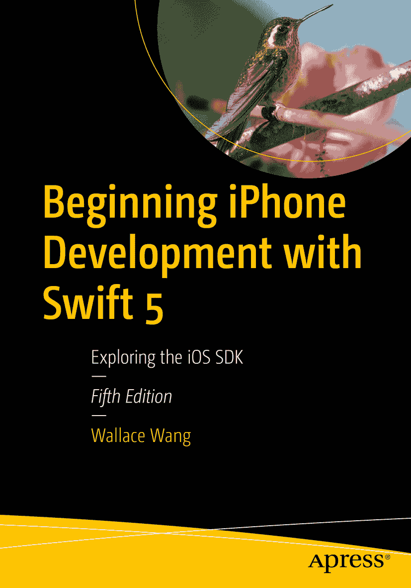

ISBN 978-1-4842-4864-5 e-ISBN 978-1-4842-4865-2 [`doi.org/10.1007/978-1-4842-4865-2`](https://doi.org/10.1007/978-1-4842-4865-2) © Wallace Wang 2019 本作品受版权保护。出版商保留所有权利，涉及材料的全部或部分内容，特别是翻译权、重印权、插图复用权、朗诵权、广播权、微缩胶片或其他任何物理形式的复制权，以及传输或信息存储与检索、电子改编、计算机软件，或现在已知或将来开发的任何类似或不同方法的权利。本书中可能出现商标名称、标识和图像。对于出现的商标名称、标识或图像，我们不以每次使用都添加商标符号的方式，而是仅以编辑性方式使用这些名称、标识和图像，以利于商标所有者，无意侵犯商标权。本出版物中对商品名称、商标、服务标记及类似术语的使用，即使未标明为商标，也不应被视为就这些术语是否受所有权保护发表意见。尽管本书中的建议和信息在出版时被认为是真实准确的，但作者、编辑和出版商均不对可能出现的任何错误或遗漏承担法律责任。出版商对本书所包含的材料不作任何明示或暗示的担保。本书由 Springer Science+Business Media New York 在全球范围内发行，地址：233 Spring Street, 6th Floor, New York, NY 10013。电话：1-800-SPRINGER，传真：(201) 348-4505，电子邮箱：orders-ny@springer-sbm.com，或访问 www.springeronline.com。Apress Media, LLC 是加利福尼亚州的一家有限责任公司，其唯一成员（所有者）是 Springer Science + Business Media Finance Inc (SSBM Finance Inc)。SSBM Finance Inc 是一家特拉华州公司。

*本书献给每一位有应用创意却不知从何入手或如何起步的人。首先，相信你的创意。其次，相信即使你不知道如何实现梦想，你也有智慧去成就它。第三，持续学习，不断提升你的技能。第四，保持专注。只要你坚持不懈，永不放弃，成功终会到来。*

