# 1. 理解 iOS 编程

所有编程都涉及编写计算机要执行的指令这一相同任务。要学习 iOS 编程，你需要掌握三种不同的技能：

- 如何用 Swift 编程语言编写指令
- 如何使用 Apple 的软件框架
- 如何在 Xcode 中创建用户界面

虽然完全使用 Swift 代码来创建整个 iOS 应用是可行的，但这是一种繁琐、耗时且容易出错的方法。尝试用 Swift 编写整个 iOS 应用意味着你需要编写代码来创建用户界面，编写更多代码来与 iOS 设备（如 iPhone 或 iPad）的硬件进行交互，然后再编写第三套代码来让应用实际工作。

与其完全通过代码创建用户界面，不如在 Xcode 中以可视化的方式设计用户界面。这不仅能让创建用户界面更简单、更快速，并且与其他 iOS 应用的用户界面更一致，还能使你的代码不依赖于任何特定的用户界面设计。通过使用 Xcode，你可以保持用户界面与使应用工作的代码相分离。这让你可以灵活地修改用户界面，而无需同时修改代码。

每个 iOS 应用都需要与 iOS 设备的不同硬件特性（如摄像头或触摸屏）进行通信。Apple 并非强迫你编写代码与硬件交互，而是提供了多个软件库或框架，为你封装了这些代码。现在，无需编写自己的代码来访问摄像头或触摸屏，您可以直接使用 Apple 经过验证的框架，从一开始就让应用正确工作。

本质上，每个 iOS 应用都由三个部分组成，如图 1-1 所示：

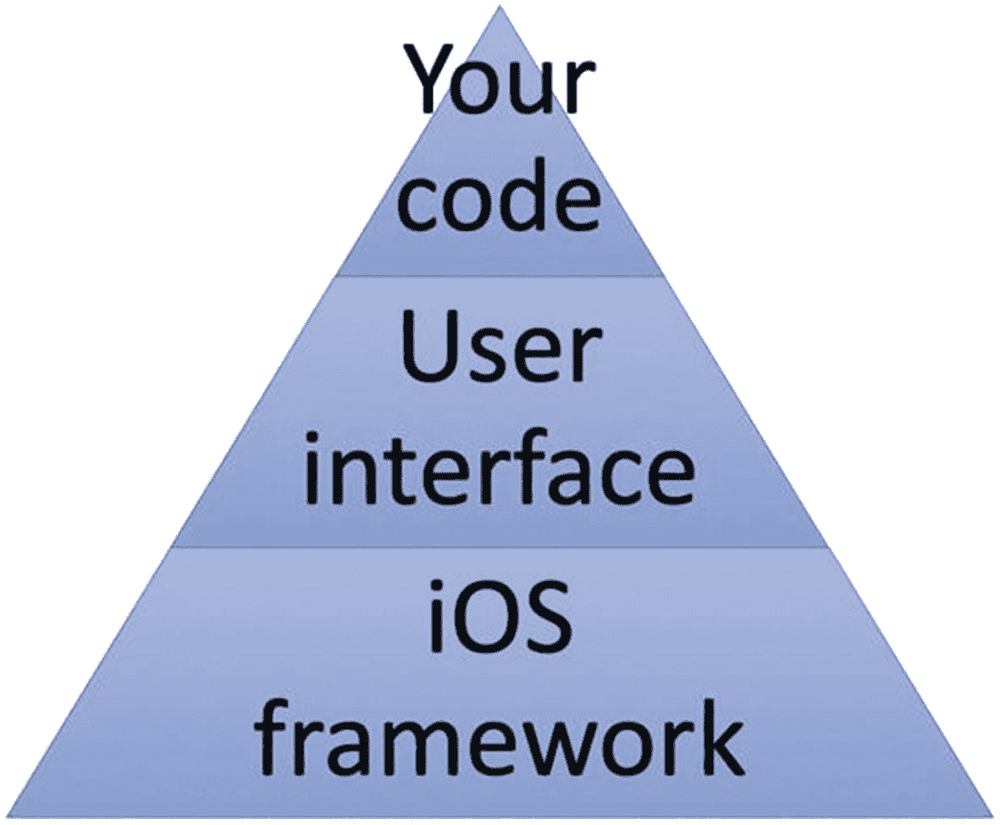

**图 1-1** iOS 应用的三个组成部分

- 你的代码，用于使应用执行有用功能
- 可以在 Xcode 中可视化设计的用户界面
- 通过一个或多个 Apple iOS 框架访问 iOS 设备硬件特性

Apple 为 iOS（以及其他操作系统，如 macOS、watchOS 和 tvOS）提供了数十个框架。只需使用 Apple 的框架，你就能通过编写很少的代码来完成常见任务。Apple 提供的一些框架包括：

- `UIKit` – iOS 用户界面和触摸屏支持
- `ARKit` – 增强现实特性
- `Core Animation` – 显示动画
- `GameKit` – 创建多人互动应用
- `Contacts` – 访问 iOS 设备上的通讯录数据
- `SiriKit` – 允许通过 Siri 使用语音命令
- `AVKit` – 允许播放音频和视频文件
- `MediaLibrary` – 允许访问存储在 iOS 设备上的图像、音频和视频
- `CallKit` – 提供语音通话功能

Apple 的框架本质上包含可重用的代码。这使得应用更可靠、更一致，同时通过使用经过验证且能正常工作的代码，节省了开发者的时间。要查看 Apple 可用软件框架的完整列表，请访问 Apple 的开发者文档网站（[`https://developer.apple.com/documentation`](https://developer.apple.com/documentation)）。

Apple 的框架可以让你在创建 iOS 应用时占据巨大先机，但你仍然需要提供一个用户界面，以便用户与你的应用交互。虽然你可以从头开始创建用户界面，但这同样繁琐、耗时且容易出错。更糟糕的是，如果每个应用开发者都从头创建用户界面，那么不同的 iOS 应用在外观和操作上就无法统一，从而让用户感到困惑。

这就是为什么苹果的`Xcode`编译器能帮助你设计用户界面，这些界面使用了大多数应用中的标准功能，例如视图（屏幕上的窗口）、按钮、标签、文本框、开关和滑块。在`Xcode`中，用户界面的每个窗口被称为一个视图。虽然简单的 iOS 应用可能只包含单个视图（比如 iPhone 上的计算器应用），但更复杂的 iOS 应用则包含多个视图。

为了帮助你创建和组织用户界面，`Xcode`将 iOS 应用的用户界面存储在一个称为`storyboard`的文件中，这个名字来源于电影行业。制作电影时，导演经常使用故事板来直观地展示他们想要拍摄的每个场景。通过按特定顺序浏览这些故事板图像，导演可以在实际拍摄前了解如何讲述一个故事。

在 iOS 应用开发中，故事板包含视图（`views`）和转场（`segues`）。视图以矩形形式出现，代表不同 iOS 设备（如`iPhone 8`或`iPad Pro`）的屏幕尺寸；而转场则以箭头形式出现，显示视图向用户呈现的顺序，如图 1-2 所示。

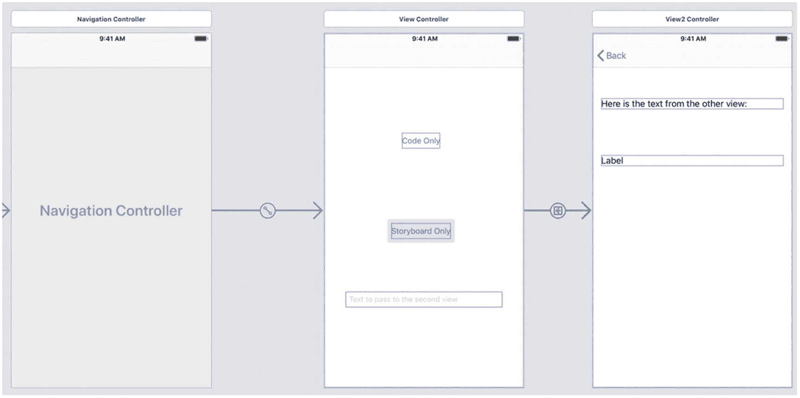

图 1-2  
故事板帮助你设计 iOS 应用的用户界面

`Xcode`将故事板与你的代码完全分开。这样一来，你就可以轻松更改用户界面，而无需重新测试代码。有些开发者会先创建用户界面来设计应用的结构，然后再编写一行代码。另一些开发者则先编写代码，之后再为用户界面附加代码。

大多数开发者同时编写代码和创建用户界面，以便在开发过程中随时测试应用。无论你选择哪种方法，你都可以针对各种不同的 iOS 设备屏幕尺寸和方向，直观地设计用户界面。

任何 iOS 应用的核心都是你编写的独特代码，这些代码让应用能够实现有用的功能。编写代码时，你可以将其全部存储在一个文件中，但这就像把整本小说打印在一长卷纸上——虽然可行，但后续编辑和修改会非常麻烦。

因此，大多数 iOS 应用都由多个文件组成。即使是一个简单的 iOS 应用也会包含几个文件，而复杂的应用可能包含数百甚至数千个独立的文件。通过将代码存储在单独的文件中，你可以快速定位需要编辑和修改的文件，同时安全地忽略存储在其他文件中的代码。

当你创建文件来存储`Swift`命令时，这些文件的后缀名将是`.swift`，这有助于你将它们与可能包含其他编程语言（如`Objective-C`，苹果最初的编程语言）代码的文件区分开来。

为了帮助你组织文件，你可以将它们存储在单独的文件夹中。这些文件夹的存在仅仅是为了方便你组织代码。图 1-3 展示了`Xcode`如何将应用划分为文件夹和文件。

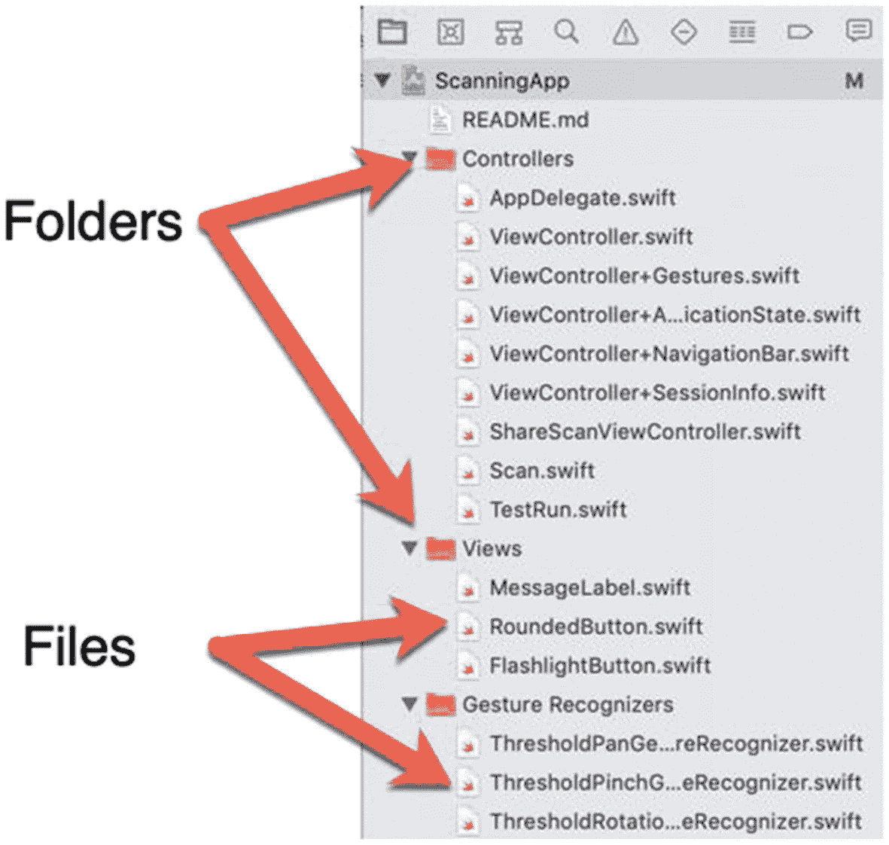

图 1-3  
`Xcode`将你的代码存储在文件中，你可以将它们组织到文件夹中

## 了解 Xcode

学习 iOS 开发不仅仅是学习如何用`Swift`编程语言编写代码。除了掌握`Swift`，你还必须知道如何查找和使用苹果不同的软件框架，如何使用`Xcode`通过故事板设计用户界面，以及如何组织、创建和删除包含`Swift`代码的文件。此外，你还必须学习如何使用`Xcode`的编辑器来编写代码。

为了熟悉 iOS 应用开发，让我们从一个简单的项目开始，它将教会你：

1.  启动`Xcode`。屏幕上会出现一个欢迎窗口，让你选择最近使用的项目，或者选择创建新项目的选项，如图 1-4 所示。（你可以随时在`Xcode`中通过选择 `Windows` ➤ `Welcome to Xcode` 或按 `Shift + Command + 1` 来打开此欢迎窗口。）

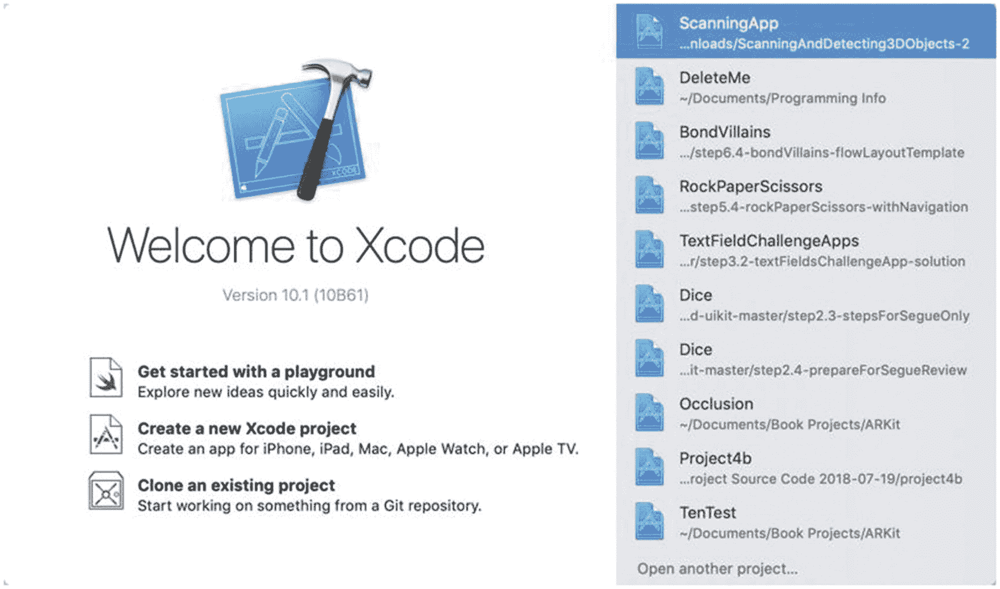

图 1-4  
`Xcode`欢迎窗口

2.  点击 **Create a new Xcode project** 选项。`Xcode`会显示用于设计不同类型应用的模板，如图 1-5 所示。请注意，模板窗口顶部显示了你可以为其开发应用的不同操作系统，例如`iOS`、`watchOS`、`tvOS`和`macOS`。通过选择不同的操作系统，你可以创建专为运行该特定操作系统的设备设计的项目。

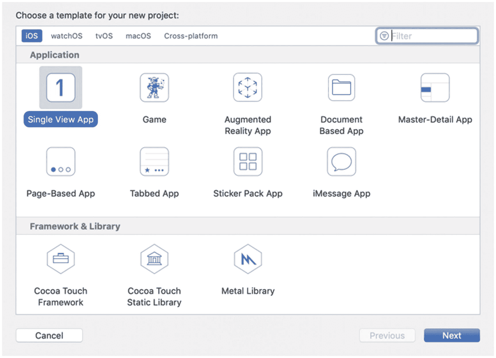

图 1-5  
选择项目模板

3.  点击 **iOS**，然后点击 **Single View App**。`Single View App`代表了最简单的 iOS 项目。

4.  点击 **Next** 按钮。会出现另一个窗口，要求你输入项目名称以及组织名称和组织标识符，如图 1-6 所示。你必须填写所有三个文本框，但项目名称、组织名称和组织标识符可以是任何你想要的描述性文本。

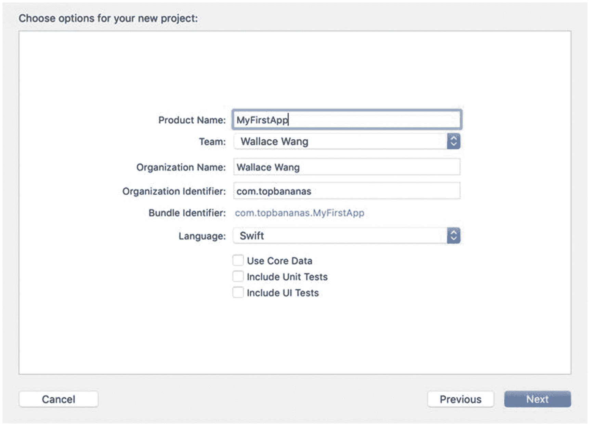

图 1-6  
定义项目名称、组织名称和组织标识符

5.  点击 Project Name 文本框，并输入你的项目名称，例如 `MyFirstApp`。

6.  点击 Organization Name 文本框，并输入你的名字或公司名称。

7.  点击 Organization Identifier 文本框，并输入任何你想要的标识文本。通常，这个标识符是你的网站名称倒过来拼写，例如 `com.microsoft`。

8.  确保 Language 弹出菜单显示为 `Swift`，并且所有复选框都已清除。然后点击 **Next** 按钮。`Xcode`会弹出一个对话框，让你选择存储项目的驱动器和文件夹。

9.  选择一个驱动器和文件夹，然后点击 **Create** 按钮。`Xcode`会显示关于你新创建项目的信息，如图 1-7 所示。

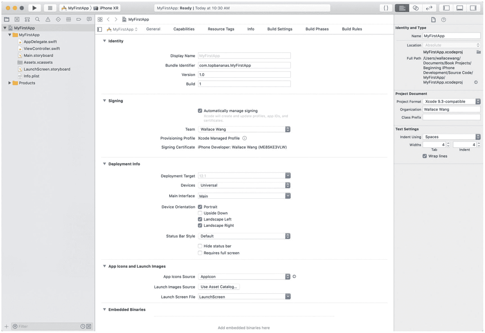

图 1-7  
查看新创建的 iOS 项目的详细信息

*   如何理解项目的各个部分
*   如何查看不同的文件
*   `Xcode`的不同部分如何工作

起初，`Xcode`窗口可能看起来令人困惑，因为它同时显示了太多信息，但`Xcode`将这些信息组织在几个窗格中。

最左边的窗格称为导航器窗格。通过点击导航器窗格顶部的图标，你可以查看项目的不同部分，如图 1-8 所示。

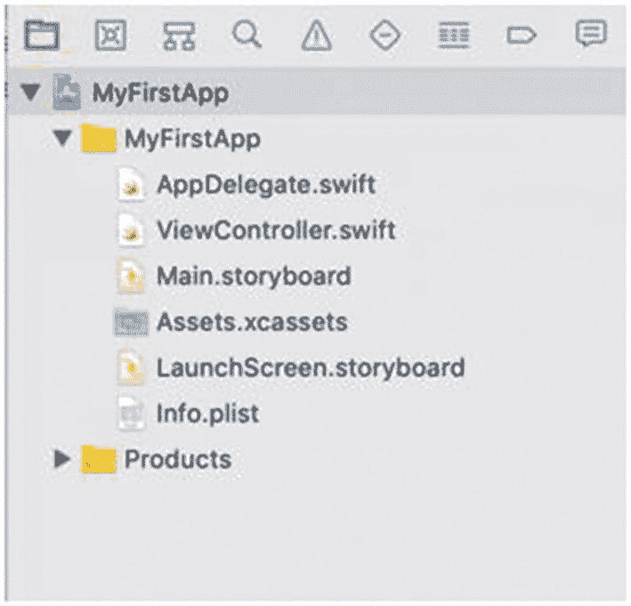

图 1-8  
导航器窗格出现在`Xcode`窗口的最左侧

最简单的 iOS 应用包含三个文件：

*   `AppDelegate.swift` – 包含用于监控应用行为的 Swift 代码
*   `ViewController.swift` – 包含用于控制单个视图用户界面的 Swift 代码
*   `Main.storyboard` – 包含定义应用用户界面的故事板

在我们的简单应用中，只有一个视图（窗口），因此只有一个`ViewController.swift`文件。在包含多个视图（窗口）的更复杂的应用中，你需要为每个视图准备单独的`ViewController.swift`文件（通常使用独特的名称）。

导航器面板最常见的用途是将项目显示为文件夹和文件。文件夹仅用于帮助你组织文件。通过点击文件夹图标左侧的灰色展开三角形，你可以展开或隐藏文件夹的内容。

要了解导航器面板的工作方式，请按以下步骤操作：

1.  选择以下任一方式，使项目导航器显示在导航器面板中：
    *   点击导航器面板左上角的项目导航器图标。
    *   选择“视图”➤“导航器”➤“显示导航器”。
    *   按`Command + 1`。

就像在任何计算机上一样，你可以在文件夹中存储文件夹。在每个文件夹中，你可以存储一个或多个文件。在我们的简单 iOS 应用中，导航器面板中显示的两类文件以`.swift`和`.storyboard`扩展名结尾。

`.swift`扩展名标识包含 Swift 代码的文件。`.storyboard`扩展名标识包含用户界面的文件。

1.  点击`AppDelegate.swift`文件。Xcode 会在中间面板中显示该文件的内容，如图 1-9 所示。

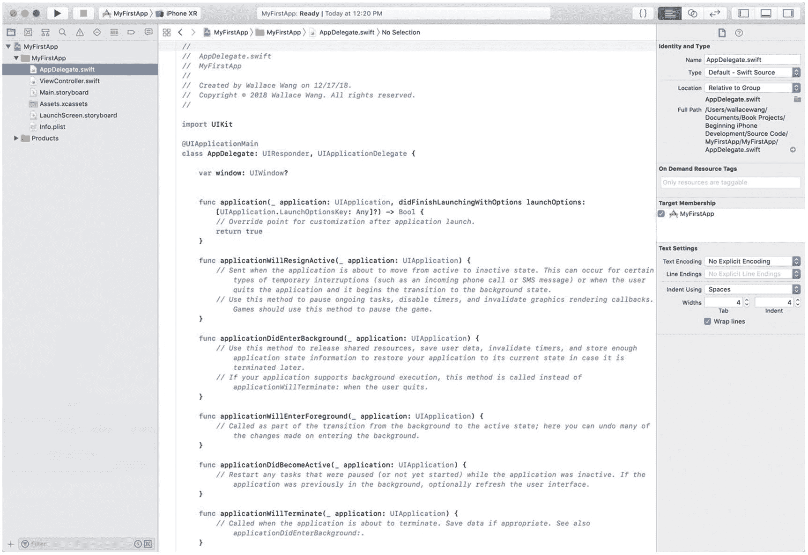

图 1-9：在导航器面板中点击文件会在中间 Xcode 面板中显示其内容

当你点击`.swift`文件时，中间 Xcode 面板会显示一个编辑器，你可以在其中编写和编辑 Swift 代码。

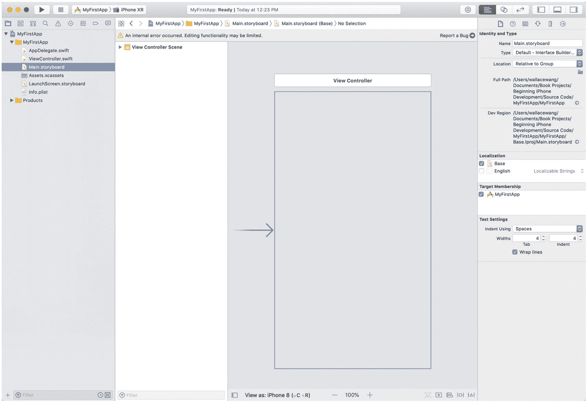

图 1-10：在导航器面板中点击`.storyboard`文件会在中间 Xcode 面板中显示其内容

1.  点击`Main.storyboard`文件。中间 Xcode 面板会显示故事板，使你能够看到用户界面，如图 1-10 所示。

通常，你在导航器面板中选择的内容会以更详细的形式显示在中间 Xcode 面板中。你可以通过点击导航器面板顶部的图标，或者选择“视图”➤“导航器”菜单选项（如图 1-11 所示），来选择要在导航器面板中显示的不同信息。

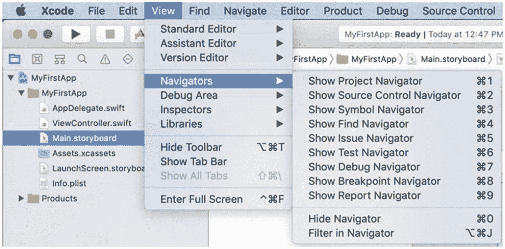

图 1-11：“视图”➤“导航器”菜单允许你选择在导航器面板中显示的内容

1.  将鼠标指针移到右边界上，直到鼠标指针变为双向箭头。然后拖动鼠标以加宽或缩窄导航器面板的宽度。这可以让你看到导航器面板的更多或更少内容。
2.  选择“视图”➤“导航器”➤“隐藏/显示导航器”，或按`Command + 0`（零）。这可以在隐藏导航器面板和再次显示它之间切换。你可能想隐藏导航器面板以腾出更多空间，但当你想要切换到另一个文件时，就需要再次显示导航器面板。

最右侧的 Xcode 面板称为检查器面板，用于显示信息或允许你自定义中间面板中显示的项目。要了解检查器面板的工作方式，请按以下步骤操作：

1.  在导航器面板中点击`ViewController.swift`文件。中间面板会显示`ViewController.swift`文件的内容。
2.  选择以下任一方式，在检查器面板中显示快速帮助：
    *   点击快速帮助图标。
    *   选择“视图”➤“检查器”➤“显示快速帮助检查器”。
    *   按`Option + Command + 2`。
3.  将光标移到单词“`UIViewController`”上。检查器面板会显示关于`UIViewController`的信息，如图 1-12 所示。通过使用快速帮助，你可以获取存储在`.swift`文件中不同命令的信息。

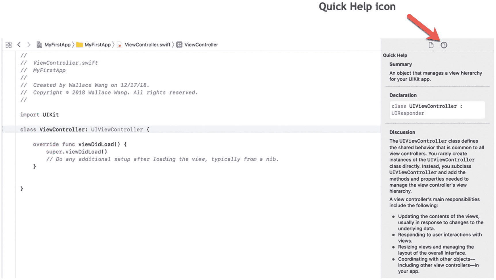

图 1-12：快速帮助在检查器面板中显示关于代码的附加信息

4.  在导航器面板中点击`Main.storyboard`文件。中间 Xcode 面板现在会显示文档大纲和故事板，如图 1-13 所示。文档大纲以大纲形式列出用户界面上的所有项目，而故事板则显示用户界面项目在用户眼中的位置。

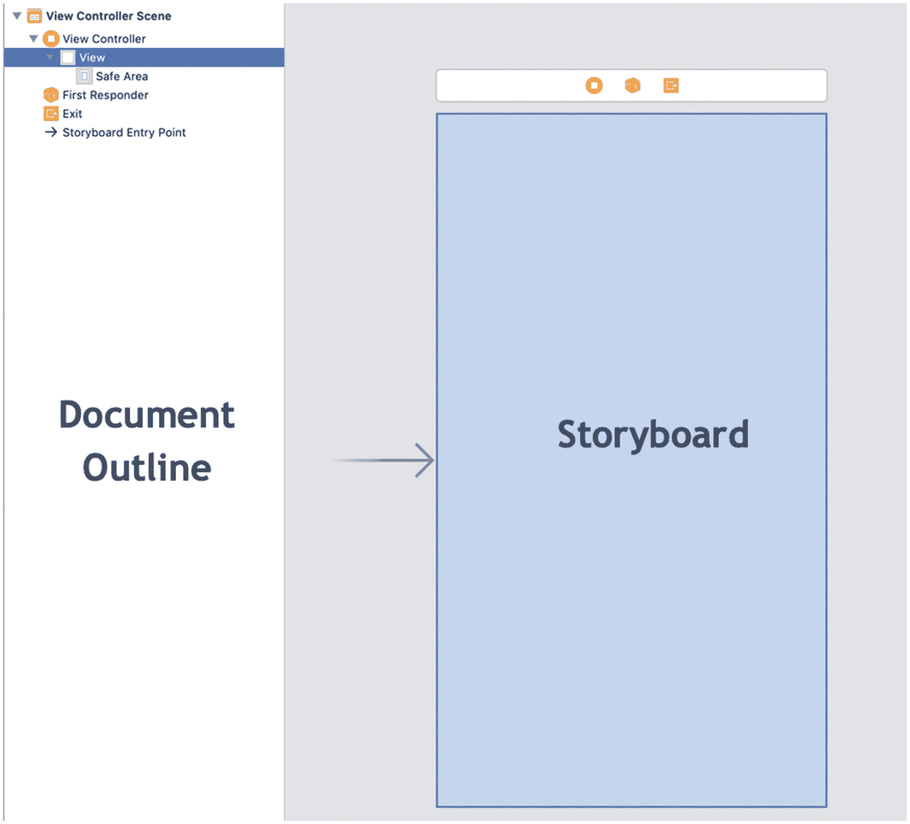

图 1-13：文档大纲和故事板显示用户界面

5.  你可以通过两种方式在隐藏和显示文档大纲之间切换，如图 1-14 所示：

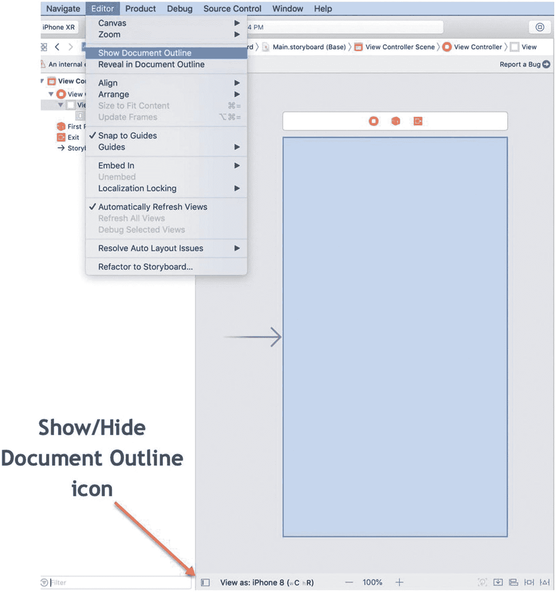

图 1-14：如何显示或隐藏文档大纲

*   选择“编辑器”➤“显示文档大纲”。
*   点击“显示/隐藏文档大纲”图标。

6.  确保文档大纲已打开，然后点击文档大纲中“视图控制器”图标正下方出现的“视图”图标。
7.  选择“视图”➤“检查器”➤“显示快速帮助检查器”。检查器面板会显示关于该视图的帮助，该视图显示一个窗口，如图 1-15 所示。

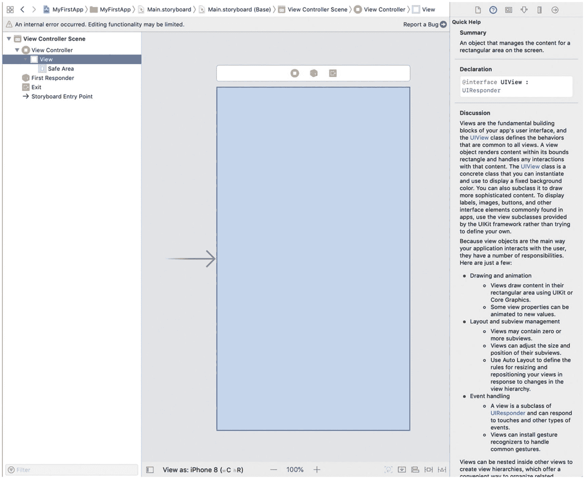

图 1-15：查看用户界面中某个视图的快速帮助

当你在导航器面板中点击`.storyboard`文件时，中间 Xcode 面板会显示应用的用户界面。Xcode 一次只能显示单个 iOS 设备（例如 iPhone 8）的应用用户界面。但是，你可以更改应用用户界面的外观，以查看它在各种不同 iOS 设备（例如 iPad Pro 或 iPhone XR）上的显示效果。

要更改显示的 iOS 设备类型，请按以下步骤操作：

1.  在导航器面板中点击`.storyboard`文件。
2.  点击屏幕底部的“视图为：”文本。在图 1-15 中，该文本显示为“视图为：iPhone 8”。一个新的底部面板会弹出，让你选择要使用的不同设备和方向，如图 1-16 所示。

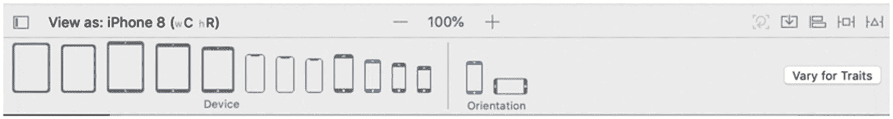

图 1-16：点击“视图为：”会显示设备和方向图标

3.  点击一个不同的方向图标，例如横向。注意中间 Xcode 面板如何以新的方向显示用户界面，如图 1-17 所示。

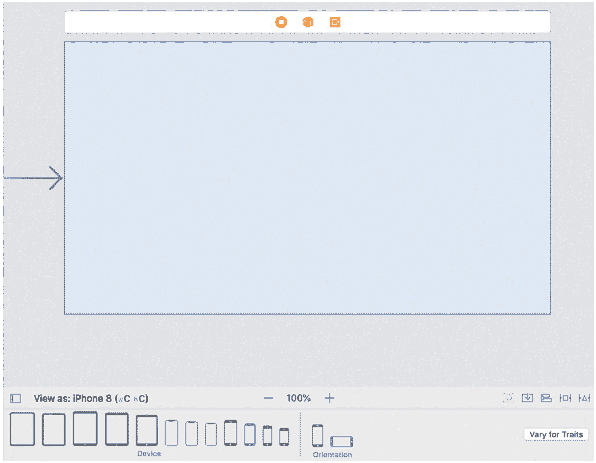

图 1-17：以横向显示的 iPhone 用户界面

4.  点击一个不同的设备图标，例如 iPad。注意 Xcode 现在以更大的 iPad 格式显示用户界面。为了帮助你在更大的 iPad 屏幕上查看用户界面，你还可以更改中间 Xcode 面板的放大倍率。注意中间底部栏显示“视图为：”文本以及减号、100% 和加号。100% 告诉你当前的倍率，减号和加号让你可以增大或减小倍率。

1.  单击减号以缩小放大倍率（例如 50%），从而更轻松地查看 iPad 用户界面，如图 1-18 所示。

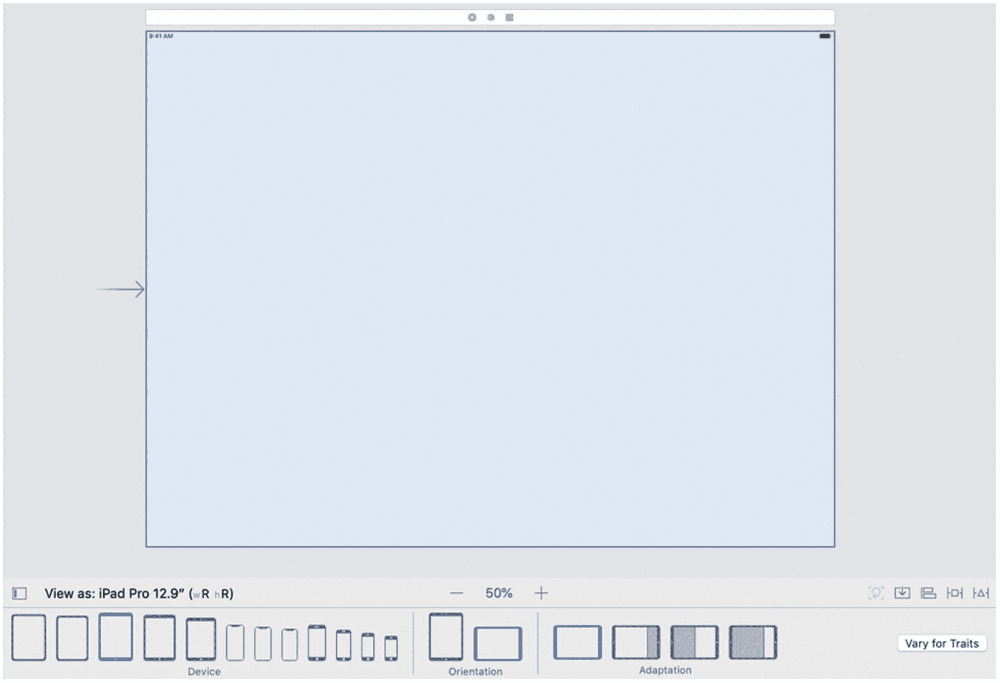

*图 1-18* 以 50% 放大倍率显示 iPad Pro 用户界面

2.  单击“View as:”文本，使设备和方向窗格消失。
3.  选择 `File` ➤ `Save` 保存你的项目。

如你所见，Xcode 的三个窗格协同工作，向你展示项目的不同信息。导航器窗格（最左侧）让你可以概览项目。单击导航器窗格中的特定项目，会在中间 Xcode 窗格中显示该项目。检查器窗格（最右侧）显示中间窗格中选中内容的附加信息。

如果你探索 Xcode，会发现数十个功能，但不必一下子理解所有内容才能开始使用 Xcode。只需专注于使用你需要的那些功能，其他功能可以暂时忽略，直到需要时再用。

## 总结

创建 iOS 应用不仅涉及编写代码。为了帮助你的应用访问不同 iOS 设备的硬件功能，你可以使用 Apple 提供的软件框架，这些框架允许访问摄像头或 Siri 的自然语言界面。通过将你的代码与 Apple 现有的软件框架结合，你可以专注于编写使应用运行的代码，并利用 Apple 的软件框架来实现在大多数 iOS 设备上常见的功能。

除了编写代码，每个 iOS 应用还需要一个用户界面。这个用户界面需要适应不同 iOS 设备（如 iPhone XR 或 iPad Pro）的不同方向和屏幕尺寸。

创建 iOS 应用的主要工具是 Apple 免费的 Xcode 程序，它允许你创建项目、组织项目的各个文件，以及查看和编辑每个文件的内容。Xcode 让你可以在一个程序中完成设计、编辑和测试你的应用。尽管 Xcode 提供了数十种功能，但你只需要使用其中一部分即可开始创建你自己的 iOS 应用。

学习 iOS 编程涉及学习如何使用 Swift 编程语言编写命令、学习如何查找和使用 Apple 的各种软件框架、学习如何设计用户界面，以及学习如何使用 Xcode。虽然这看起来很多，但本书将带你一步步完成，让你在不久的将来能够舒适地使用 Xcode 并创建你自己的 iOS 应用。

