# 2. 设计用户界面

每个应用都需要一个用户界面。与 Windows 或 macOS 等桌面操作系统可以在屏幕上同时显示多个窗口的用户界面不同，iOS 应用通常一次只显示一个填充整个屏幕的窗口（称为视图）。同样，与用户可以使用键盘或鼠标操作的 Windows 或 macOS 用户界面不同，用户必须仅通过触摸屏操作 iOS 应用，尽管也可以通过可选的键盘进行控制。在 iOS 应用中，图 2-1 显示了一个用户界面由以下部分组成：

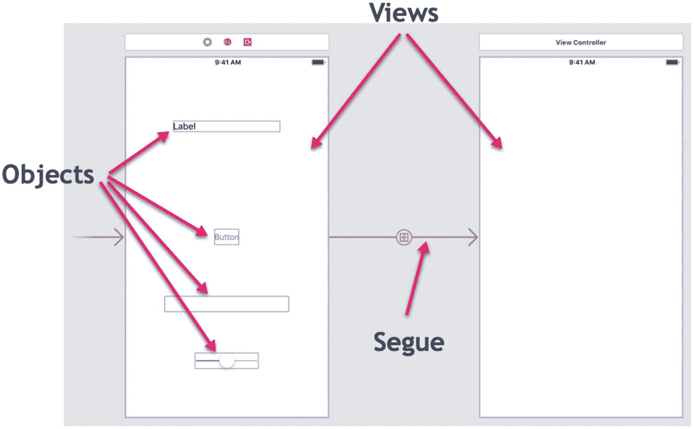

*图 2-1.* iOS 应用用户界面的三个部分

*   **视图**
*   **对象**，如按钮、标签、文本框和开关
*   **转场**

我们用于在第一章 1 中创建应用的“单视图应用”模板由一个视图组成，并且没有对象。由于只有一个视图，因此也没有转场，因为转场用于连接两个视图，以显示应用运行时每个视图出现的顺序。

就其本身而言，一个没有对象的视图不过是一个空白屏幕。要使视图有用，它需要包含一个或多个对象。使用 Xcode，通常有两种方法可以完成完全相同的任务：

*   **编程方式**
*   **可视化方式**

编程方式意味着编写代码来完成所有操作。在创建出现在视图上的对象时，这意味着编写 Swift 代码来定义要显示的对象、其大小、在视图上的位置以及任何其他自定义设置（如颜色）。

可视化方式意味着使用鼠标将对象拖放到视图上。将对象放置在视图上后，你可以修改其大小、位置或任何其他属性，而无需编写任何代码。

你可以使用其中一种或两种方法，但为了保持一致性，通常最好使用一种方法。此外，虽然你可以通过编写代码（编程方式）来创建整个用户界面，但通常不建议这样做，因为编写的代码越少，修改和调试程序就越容易。编程的目标是用尽可能少的代码完成尽可能多的功能。

首先，让我们看看如何以编程方式创建对象，以便你了解其工作原理。让我们在视图上创建一个标签和一个按钮。

1.  打开你的 `MyFirstApp` 项目（或创建一个新的单视图应用 iOS 项目）。
2.  在导航器窗格中单击 `ViewController.swift` 文件。中间的 Xcode 窗格会显示 `ViewController.swift` 文件的内容。
3.  修改 `ViewController.swift` 文件中的代码，使其如下所示：

```
    import UIKit
    class ViewController: UIViewController {
    override func viewDidLoad() {
    super.viewDidLoad()
    let label = UILabel()
    label.frame = CGRect(x: 125, y: 125, width: 200, height: 80)
    label.text = "This is a label"
    view.addSubview(label)
    let button = UIButton()
    button.frame = CGRect(x: 125, y: 300, width: 80, height: 80)
    button.setTitle("Button", for: .normal)
    button.setTitleColor(UIColor.blue, for: .normal)
    view.addSubview(button)
    }
    }
    ```

4.  选择 `Project` ➤ `Run` 或按下 `Command + R`。Xcode 会加载模拟器程序，让你可以模拟 iOS 设备。当你的应用在模拟器中加载时，它将显示一个标签和一个按钮，如图 2-2 所示。

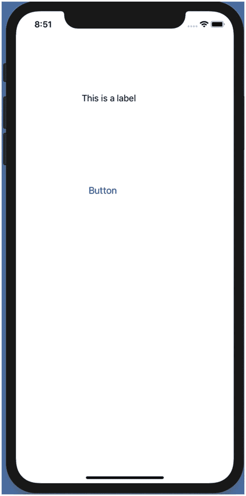

*图 2-2.* 以编程方式创建的用户界面，显示一个标签和一个按钮

5.  选择 `Simulator` ➤ `Quit Simulator` 或按下 `Command + Q`。Xcode 窗口会再次出现。

让我们回顾一下这段代码，以便你理解它是如何工作的。首先，我们必须定义要创建的对象类型，例如 `UILabel` 或 `UIButton`：

```
let label = UILabel()
let button = UIButton()
```


接下来，我们需要定义对象的位置、宽度和高度。请记住，原点 `(0, 0)` 被定义为屏幕的左上角：

```
label.frame = CGRect(x: 125, y: 125, width: 200, height: 21)
button.frame = CGRect(x: 125, y: 300, width: 80, height: 30)
```

第一行代码将 `label` 定义为距离屏幕左侧 125 点、距离屏幕顶部 125 点的位置。同时，该代码还定义了 `label` 的宽度为 200，高度为 21。

第二行代码将 `button` 定义为距离屏幕左侧 125 点、距离屏幕顶部 300 点的位置。同时，该代码还定义了 `button` 的宽度为 80，高度为 30。

定义好对象的大小和位置后，下一步是自定义对象的外观。`label` 包含文本 “This is a label”，基于以下代码：

```
label.text = "This is a label"
```

`button` 通过两种不同方式进行自定义。首先，按钮标题设置为 “Button”，并将文字颜色设置为蓝色：

```
button.setTitle("Button", for: .normal)
button.setTitleColor(UIColor.blue, for: .normal)
```

在定义了要显示的对象类型、其大小和位置，并进行自定义之后，最后一步是将其放置到视图上：

```
view.addSubview(label)
view.addSubview(button)
```

如果以上步骤看起来只是为了在用户界面上创建一个对象而大费周章，那你是对的。这就是为什么大多数开发者选择以可视化的方式设计用户界面。让我们看看这是如何操作的。

1.  在导航器面板中点击 `ViewController.swift` 文件。Xcode 中间的面板会显示 `ViewController.swift` 文件的内容。

2.  修改 `ViewController.swift` 文件，使其看起来像这样：

    ```
    import UIKit
    class ViewController: UIViewController {
    override func viewDidLoad() {
    super.viewDidLoad()
    }
    }
    ```

3.  在导航器面板中点击 `Main.storyboard` 文件。Xcode 会显示包含用户界面的故事板，其中只有一个空白视图。

4.  点击库图标。对象库窗口出现，列出了所有可以添加到用户界面中的不同对象，如图 2-3 所示。

    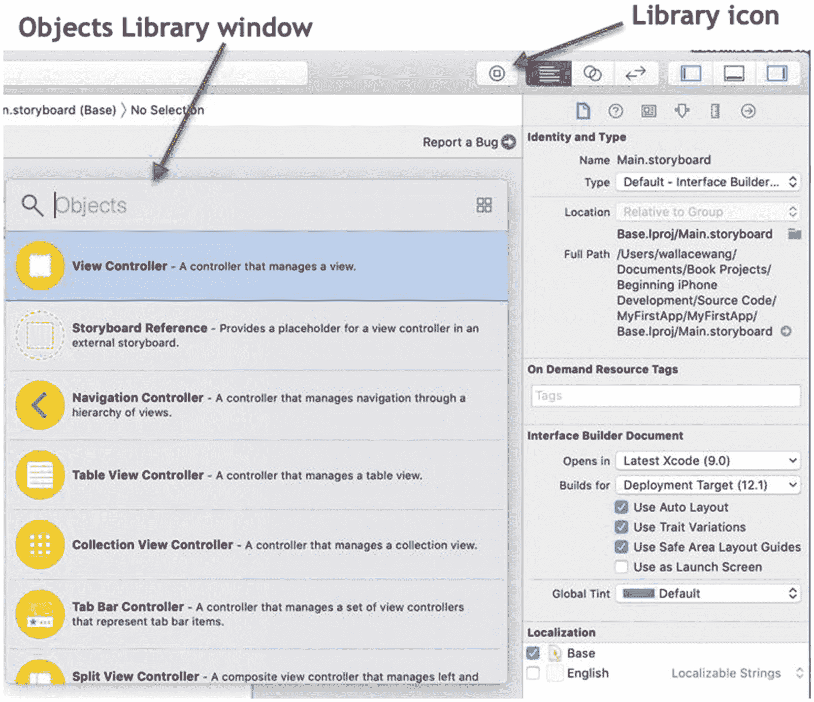

    图 2-3. 对象库让你可以选择要放置在视图上的对象。

5.  在对象库列表中滚动，直到找到标签，或者直接在对象库窗口顶部的搜索字段中点击，输入 `label`，然后按回车键。对象库窗口会显示标签对象，如图 2-4 所示。

    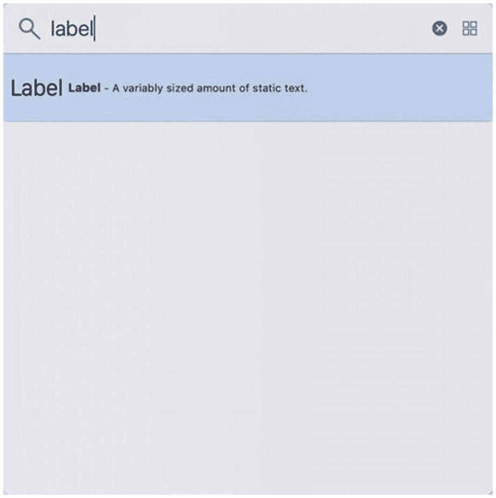

    图 2-4. 在对象库窗口中搜索标签对象。

6.  将标签对象从对象库窗口拖放到视图上。拖动标签时，对象库窗口会消失。松开鼠标左键时，标签会出现在视图上。我们可以调整标签的大小和位置，但如果要定义精确的值，则需要使用检查器面板。

7.  点击标签以将其选中。标签周围会出现控制柄，表示它已被选中。

8.  选择 视图 ➤ 检查器 ➤ 显示属性检查器（或点击检查器面板顶部的显示属性检查器图标）。

9.  点击颜色弹出菜单上方的文本字段，输入 `This is a label`，然后按回车键，如图 2-5 所示。属性检查器面板允许我们自定义标签中的文本。现在让我们定义标签的大小和位置。

    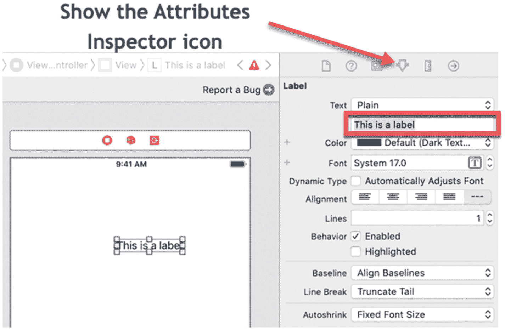

    图 2-5. 使用属性检查器面板自定义标签上显示的文本。

10. 选择 视图 ➤ 检查器 ➤ 显示大小检查器（或点击显示大小检查器图标）。大小检查器面板随即出现。

11. 点击 X 文本字段，输入 `125`。然后点击 Y 文本字段，输入 `125`。

12. 点击宽度文本字段，输入 `200`。然后点击高度文本字段，输入 `21`。按回车键。这将定义标签的大小和位置，如图 2-6 所示。

    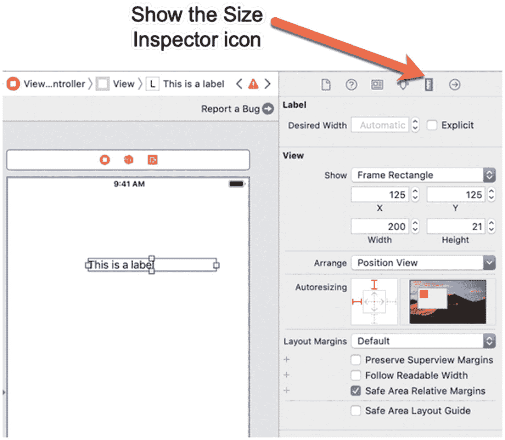

    图 2-6. 使用大小检查器面板定义标签的大小和位置。

13. 点击库图标。对象库窗口出现，列出了所有可以添加到用户界面中的不同对象（参见图 2-3）。

14. 在对象库列表中滚动，直到找到按钮，或者直接在对象库窗口顶部的搜索字段中点击，输入 `button`，然后按回车键。对象库会显示按钮对象，如图 2-7 所示。

    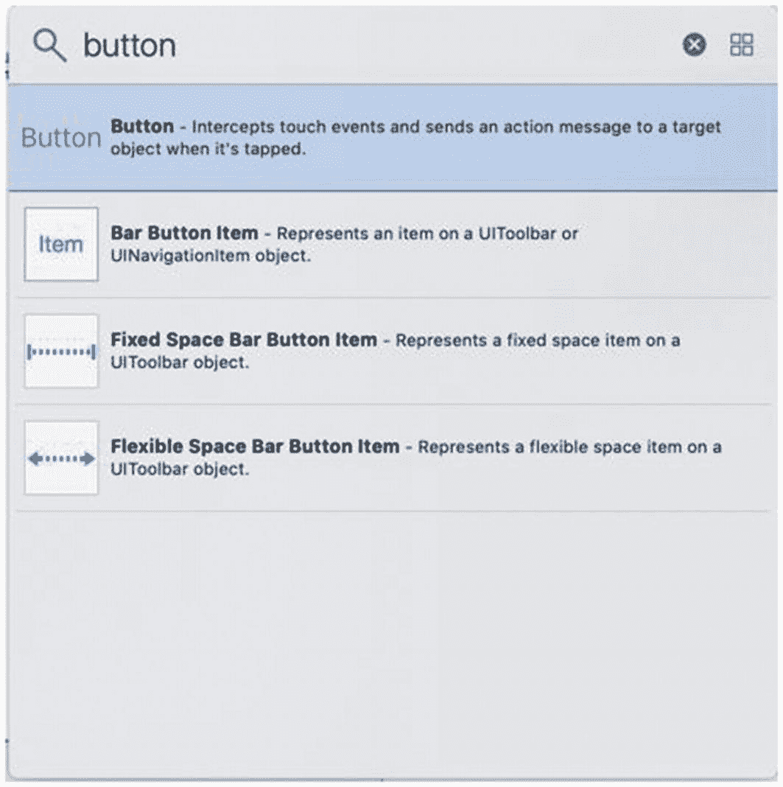

    图 2-7. 在对象库窗口中搜索按钮对象。

15. 将按钮对象从对象库窗口拖放到视图上。拖动按钮时，对象库窗口会消失。松开鼠标左键时，按钮会出现在视图上。

16. 点击按钮以将其选中。按钮周围会出现控制柄，表示它已被选中。

17. 选择 视图 ➤ 检查器 ➤ 显示属性检查器（或点击检查器面板顶部的显示属性检查器图标）。注意，属性检查器面板中已经显示按钮上的文字 “Button”，且颜色为蓝色，如图 2-8 中的文本颜色弹出菜单所示。

    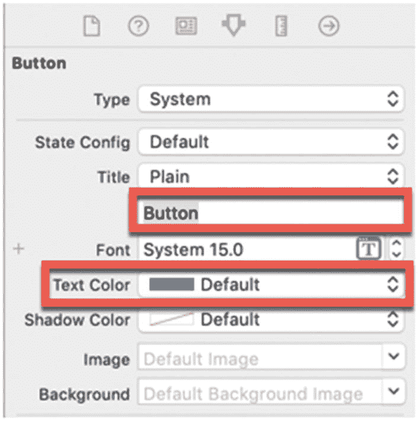

    图 2-8. 使用属性检查器面板自定义按钮上显示的文本和颜色。

18. 选择 视图 ➤ 检查器 ➤ 显示大小检查器（或点击显示大小检查器图标）。大小检查器面板随即出现。

19. 点击 X 文本字段，输入 `125`。然后点击 Y 文本字段，输入 `300`。

20. 点击宽度文本字段，输入 `80`。然后点击高度文本字段，输入 `30`。按回车键。这将定义按钮的大小和位置。

21. 选择 项目 ➤ 运行，或按 Command + R。Xcode 会加载模拟器程序，让你可以模拟 iOS 设备。当你的应用在模拟器中加载时，它会显示一个标签和一个按钮。

22. 选择 模拟器 ➤ 退出模拟器，或按 Command + Q。Xcode 窗口会再次出现。

23. 选择 文件 ➤ 保存以保存你的项目。

注意，当你以编程方式在用户界面上创建对象时，你需要编写代码来完成从创建对象、定义其大小和位置，到将其放置到视图上的所有步骤。另一方面，以可视化方式设计用户界面意味着将对象拖放到视图上，然后使用鼠标调整其大小或移动它们。然后，要定义对象的外观、精确大小和位置，你可以打开属性检查器和大小检查器来选择合适的值。

许多 Xcode 项目会结合两种方法来创建用户界面。虽然通常以可视化方式创建用户界面更容易，但你也需要熟悉编写代码以编程方式创建用户界面，因为你可能会在他人创建的项目中看到这种做法。


## 了解视图与类文件

任何应用用户界面最重要的组成部分都是视图，它负责在 iOS 设备屏幕上显示信息。最简单的应用只包含一个视图，但大多数应用会包含多个视图。你可以轻松地在项目中添加或删除视图。既然视图包含按钮和文本字段等用户界面对象，你可能会好奇视图是如何存储用户在界面上输入的数据的。答案是每个视图都需要一个类文件，其中包含能够存储数据和响应用户交互（例如点击按钮）的 Swift 代码。

在继续之前，请注意 Xcode 使用了一些容易混淆的术语来描述用户界面的各个部分。用户界面存储在故事板中，屏幕上显示的每个独立窗口被称为场景。大多数应用包含多个场景，因此文档大纲允许你有选择地隐藏或显示每个场景的详细信息，如图 2-9 所示。通过点击文档大纲中的每个场景，你可以快速查看构成用户界面的不同场景。

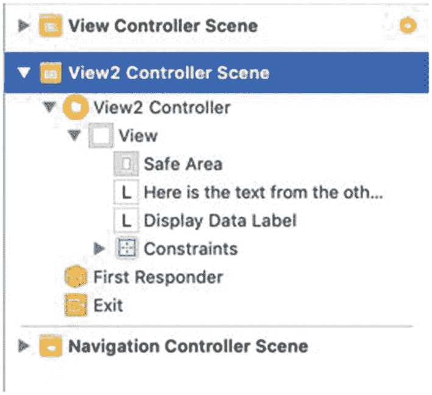

图 2-9。 文档大纲能让您轻松查找和查看场景

每个场景内部都有一个控制器。控制器定义了该场景在屏幕上的显示方式。你可以通过点击文档大纲中的控制器名称，或者点击故事板中的控制器图标来选择控制器，如图 2-10 所示。

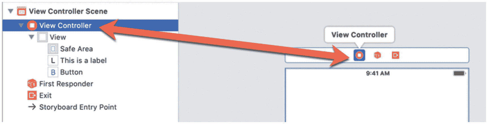

图 2-10。 您可以在文档大纲或故事板中选择控制器

每个控制器内部通常包含一个视图，它定义了应用运行时屏幕上的显示内容。按钮或标签等对象出现在视图上，因此如果你删除了一个视图，你也将删除该视图上存储的所有对象。

让我们看看我们已创建的“单视图应用”项目中的两个 `.swift` 文件，并了解文档大纲的层级结构是如何运作的：

1.  在导航器面板中点击 `AppDelegate.swift` 文件。Xcode 的中间面板会显示 `AppDelegate.swift` 文件的内容。你会注意到，已经为你创建了几个不包含代码的函数。这些函数让你可以处理应用运行时的不同情况：
    *   `didFinishLaunchingWithOptions` – 在应用启动后运行
    *   `applicationWillResignActive` – 在应用不再是屏幕上处于活跃状态的应用之前运行
    *   `applicationDidEnterBackground` – 在应用被推入后台时立即运行，以便用户使用其他应用
    *   `applicationWillEnterForeground` – 在应用即将再次成为屏幕上的活跃应用之前运行
    *   `applicationDidBecomeActive` – 在应用成为屏幕上活跃的应用之后运行
    *   `applicationWillTerminate` – 在应用即将关闭之前运行

在许多情况下，你不需要为所有这些函数编写代码。例如，你可能希望在应用关闭前保存数据（`applicationWillTerminate`），然后在应用首次启动时重新加载这些数据（`didFinishLaunchingWithOptions`）。`AppDelegate.swift` 文件就是你编写 Swift 代码来控制应用行为的地方。

2.  在导航器面板中点击 `Main.storyboard` 文件。Xcode 会显示你的用户界面。确保文档大纲可见。（你可以通过选择“编辑器”➤“显示/隐藏文档大纲”或点击文档大纲图标来切换显示或隐藏文档大纲。）

3.  在文档大纲或故事板中点击控制器图标（参见图 2-10）。

4.  选择“视图”➤“检查器”➤“显示身份检查器”，或者点击检查器面板顶部的“显示身份检查器”图标。注意，“类”文本字段显示为 `ViewController`，如图 2-11 所示。此名称指向导航器面板中的 `ViewController.swift` 文件，并将控制器与名为 `ViewController.swift` 的文件关联起来。你可以随时更改文件名，但如果更改了文件名，则必须确保所有控制器都使用正确的文件名。

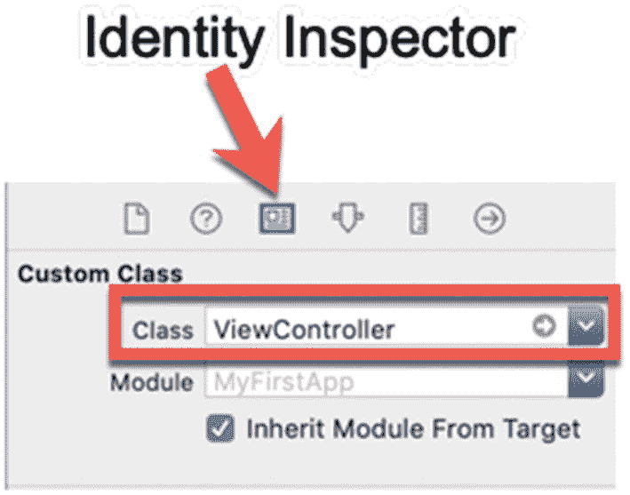

图 2-11。 身份检查器允许您将 `.swift` 文件链接到控制器

5.  选择“视图”➤“检查器”➤“显示属性检查器”，或者点击“显示属性检查器”图标，如图 2-12 所示。

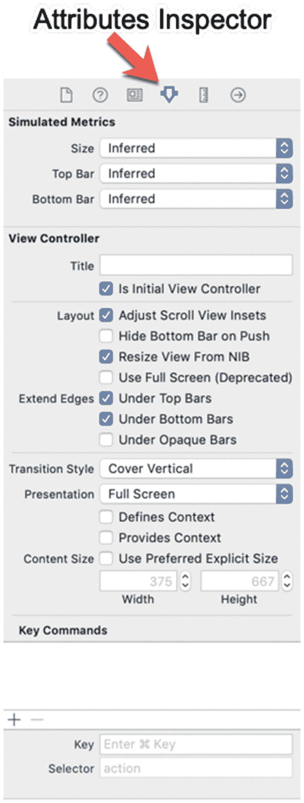

图 2-12。 属性检查器允许您自定义场景的外观

6.  在文档大纲中点击 `View`。注意，属性检查器面板现在会显示用于自定义视图的不同选项，如图 2-13 所示。

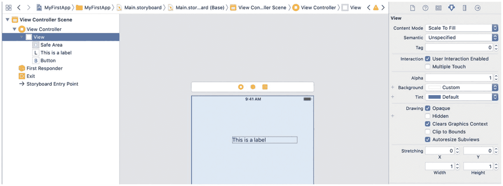

图 2-13。 属性检查器允许您自定义视图的外观

7.  在文档大纲中点击标签。（你也可以直接在故事板中点击标签进行选择。）注意，属性检查器面板现在会显示用于自定义标签的选项，如图 2-14 所示。

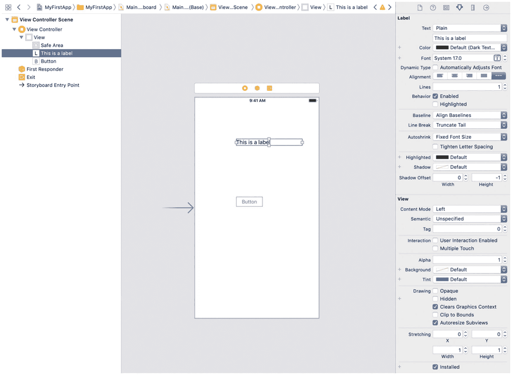

图 2-14。 为标签显示属性检查器

8.  在文档大纲中点击按钮。（你也可以直接在故事板中点击按钮进行选择。）注意，属性检查器面板现在会显示用于自定义按钮的选项，如图 2-15 所示。

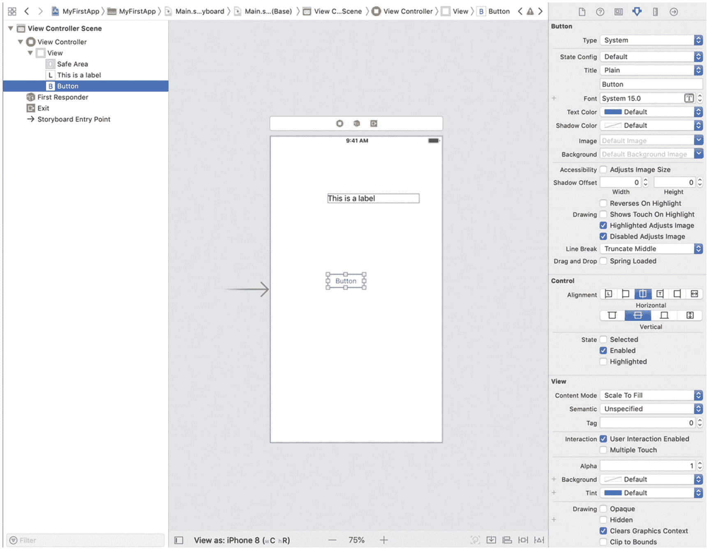

图 2-15。 为按钮显示属性检查器

至此，你已经了解了如何使用文档大纲和不同的检查器面板。关键点在于，每个故事板场景都有一个控制器，并且每个控制器都需要链接到一个 `.swift` 文件。在我们的单视图应用中，我们只有一个场景。

该控制器被赋予一个通用名称“视图控制器”，并链接到一个名为 `ViewController.swift` 的 `.swift` 文件。在创建你自己的应用时，你很可能希望为控制器及其关联的 `.swift` 文件赋予一个更具描述性的名称。

若要更改文档大纲中显示的任何控制器的名称，请遵循以下步骤：

1.  在导航器面板中点击 `Main.storyboard` 文件。

2.  通过选择“编辑器”➤“显示文档大纲”或点击文档大纲图标，确保文档大纲可见。

3.  点击文档大纲中显示的一个控制器，然后按 ENTER 键。Xcode 会高亮显示控制器名称，如图 2-16 所示。现在你可以使用箭头键或退格键和删除键来编辑控制器名称。

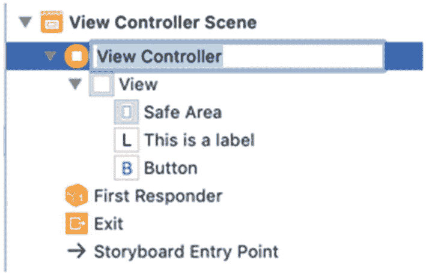

图 2-16。 您可以通过按 ENTER 键在文档大纲中编辑控制器名称

选中项目并按 ENTER 键也同样允许你更改导航器面板或 macOS 访达中显示的文件名。


## 适配不同屏幕尺寸

在设计用户界面时，你需要选择 iOS 设备的屏幕和方向，例如竖屏模式的 iPhone 8 或横屏模式的 iPad。由于你的 iOS 应用可能会在不同 iOS 设备上运行，因此需要在所有不同的屏幕尺寸和方向下对应用进行测试。

`Xcode` 提供了三种不同的方式，让你能够在不同的 iOS 设备屏幕尺寸和方向下查看应用的用户界面：

*   点击 `Xcode` 窗口底部的“视图为：”文本，然后选择不同的 iOS 设备屏幕尺寸和方向。
*   为模拟器选择不同的 iOS 设备和方向进行模拟。
*   在 `Xcode` 中预览你的视图。

第一种方式（点击“视图为：”文本）可让你在不同 iOS 屏幕尺寸和方向之间快速切换。第二种方式（使用模拟器）则能让你测试应用，就像它在真实 iOS 设备上运行一样。

你可能会在设计用户界面时使用第一种方式，然后用第二种方式来验证一切是否正常。接下来，让我们看看如何在我们的单视图应用项目中测试不同的屏幕尺寸和方向：

1.  确保你已在 `Xcode` 中加载了 `MyFirstApp` 项目。
2.  在导航区域中点击 `Main.storyboard` 文件。`Xcode` 会显示项目的故事板。
3.  点击 `Xcode` 窗口底部的“视图为：”文本，显示不同的 iOS 设备和方向选项，如图 2-17 所示。

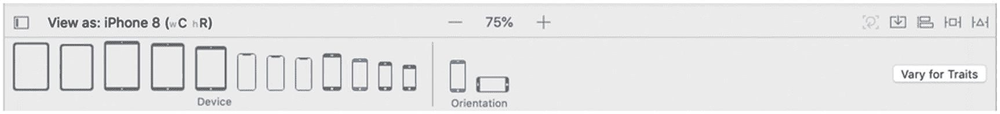

图 2-17. 选择不同的 iOS 设备屏幕尺寸和方向

4.  点击一个 iPad Pro 图标。请注意，`Xcode` 会更改故事板以匹配 iPad Pro 屏幕的尺寸，如图 2-18 所示。（你可能需要点击减号图标来降低放大比例，以便看到整个 iPad Pro 屏幕。）

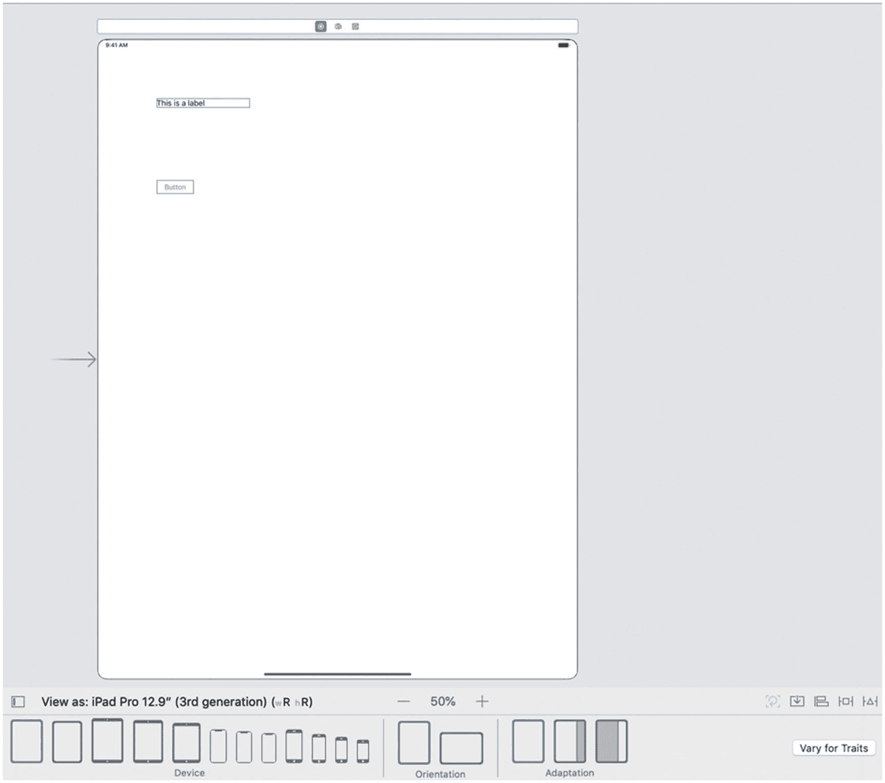

图 2-18. 在 iPad Pro 屏幕上查看应用用户界面

5.  点击较小的 iPhone SE 图标。请注意 `Xcode` 现在如何显示你的用户界面，以展示它在较小的 iPhone SE 屏幕上的效果，如图 2-19 所示。

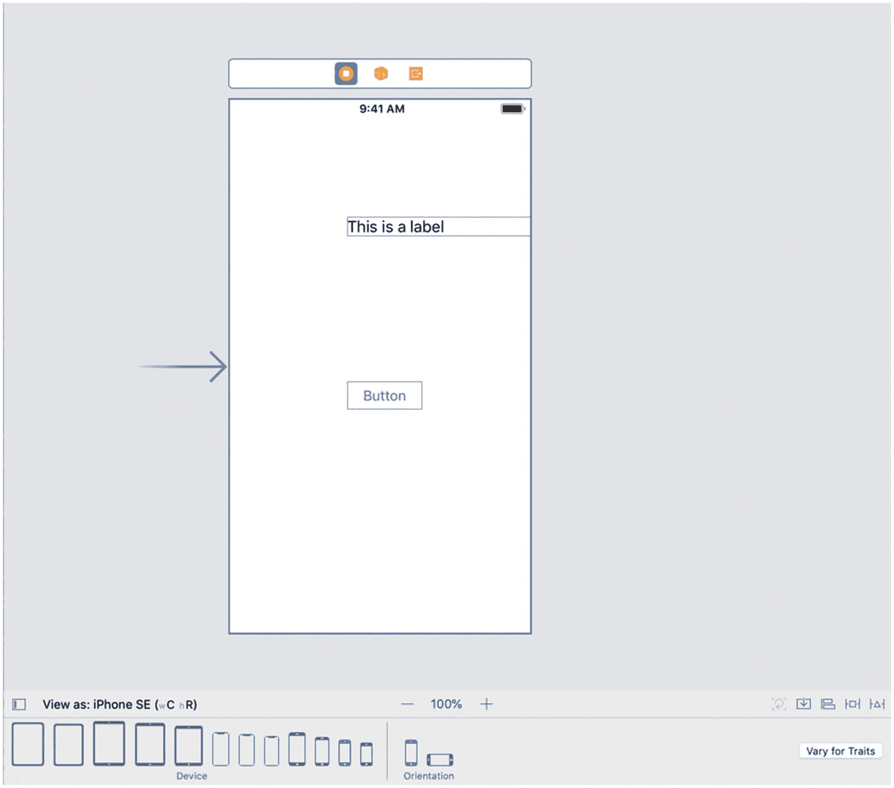

图 2-19. 在较小的 iPhone SE 屏幕上查看应用用户界面

6.  在 `Xcode` 窗口的左上角找到项目名称（`MyFirstApp`），其后跟着 iOS 设备名称，例如 iPhone XR，如图 2-20 所示。

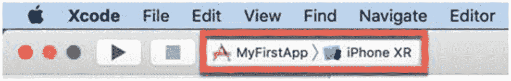

图 2-20. 识别模拟器将要模拟的 iOS 设备类型

7.  点击 `Xcode` 窗口左上角当前显示的 iOS 设备名称。此时会出现一个显示不同 iOS 设备的菜单，如图 2-21 所示。

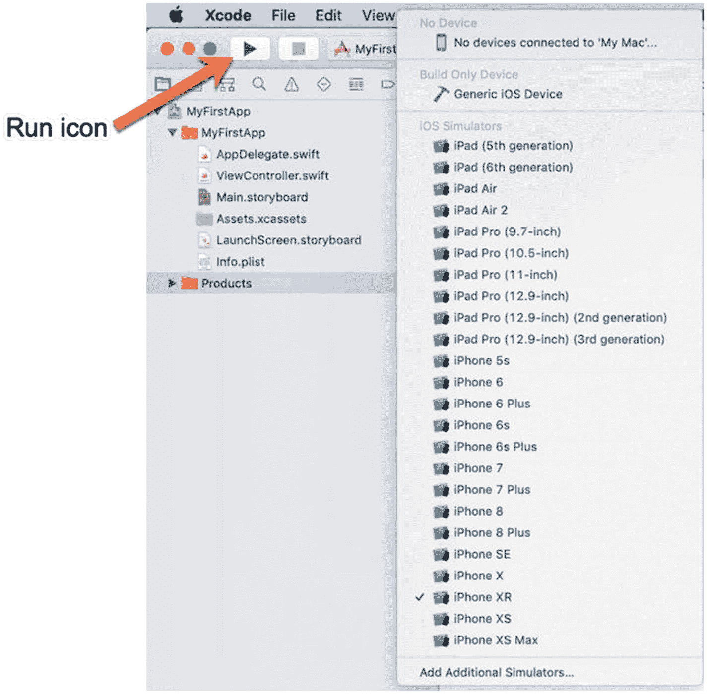

图 2-21. 查看模拟器可模拟的不同 iOS 设备

8.  点击一个与 `Xcode` 窗口左上角当前显示的 iOS 设备不同的设备，例如 iPad Air 或 iPhone 8 Plus。一旦你为模拟器选择了一个 iOS 设备，就需要运行模拟器。
9.  选择 `Product ➤ Run`，按下 `Command + R`，或点击运行图标。模拟器窗口出现，并模拟你选择的 iOS 设备。
10. 点击硬件菜单，你会看到更改 iOS 设备方向的选项，例如向左旋转或向右旋转，如图 2-22 所示。

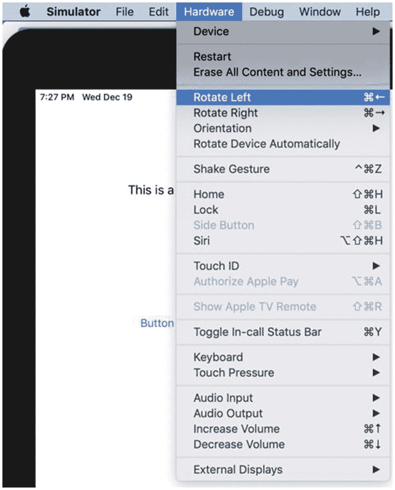

图 2-22. 模拟器程序的硬件菜单

11. 选择 `Simulator ➤ Quit Simulator`。`Xcode` 窗口再次出现。

通过在不同的 iOS 设备屏幕尺寸和方向下查看用户界面，你可以确保你的应用显示正确。由于你很可能无法拥有所有可能的 iOS 设备来测试应用，你将需要依赖 `Xcode` 和模拟器程序来帮助验证你的应用在任何屏幕尺寸和方向上都能呈现出应有的效果。

## 预览用户界面

另一种查看应用在不同 iOS 设备屏幕尺寸上显示效果的方法是使用预览功能。这允许你在故事板中选择一个控制器，然后查看该控制器在不同类型 iOS 设备上的显示效果。

要了解如何预览控制器，请按照以下步骤操作：

1.  确保你已在 `Xcode` 中加载了 `MyFirstApp` 项目。
2.  在导航区域中点击 `Main.storyboard` 文件。
3.  选择 `View ➤ Assistant Editor ➤ Show Assistant Editor` 或点击助理编辑器图标。`Xcode` 会将 `Main.storyboard` 文件与 `ViewController.swift` 文件并排显示，如图 2-23 所示。

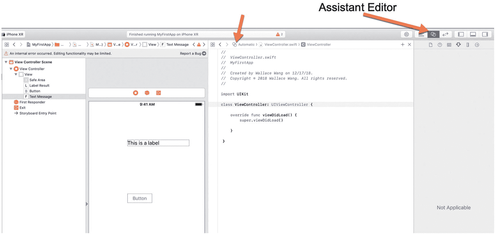

图 2-23. 打开助理编辑器

4.  点击 `.swift` 文件顶部出现的双圆圈图标。此时会弹出一个菜单，如图 2-24 所示。

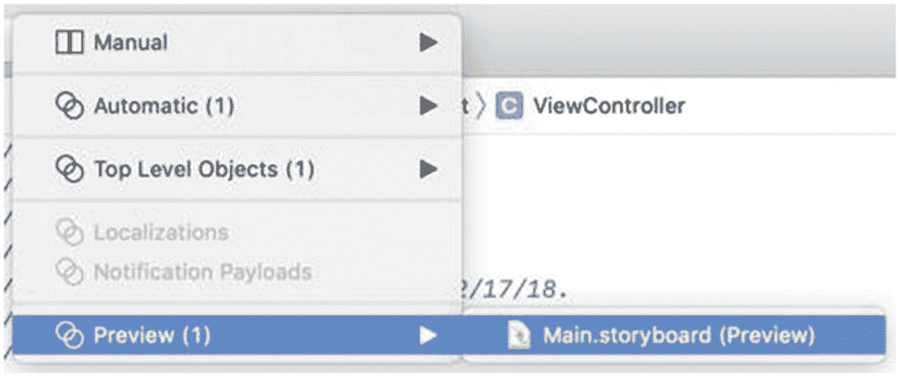

图 2-24. 显示双圆圈菜单

5.  选择 `Preview ➤ Main.storyboard (Preview)`。`Xcode` 会在你当前选择的 iOS 设备上显示你的用户界面，如图 2-25 所示。

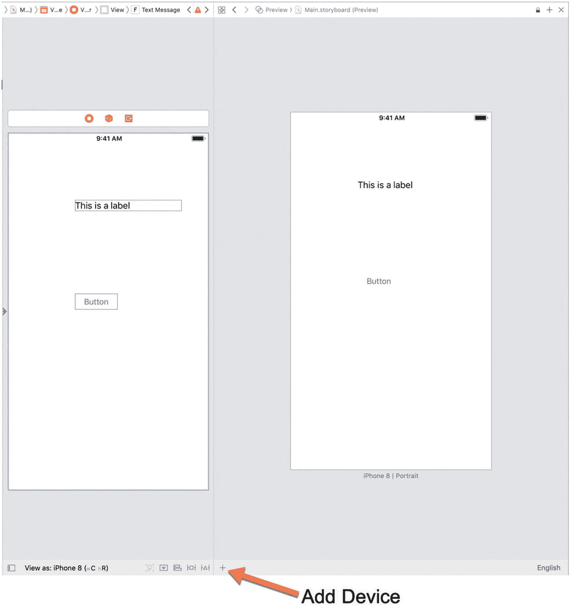

图 2-25. 预览用户界面

6.  点击添加设备图标（`+`）。此时会弹出一个菜单，列出所有可供选择的 iOS 设备，如图 2-26 所示。

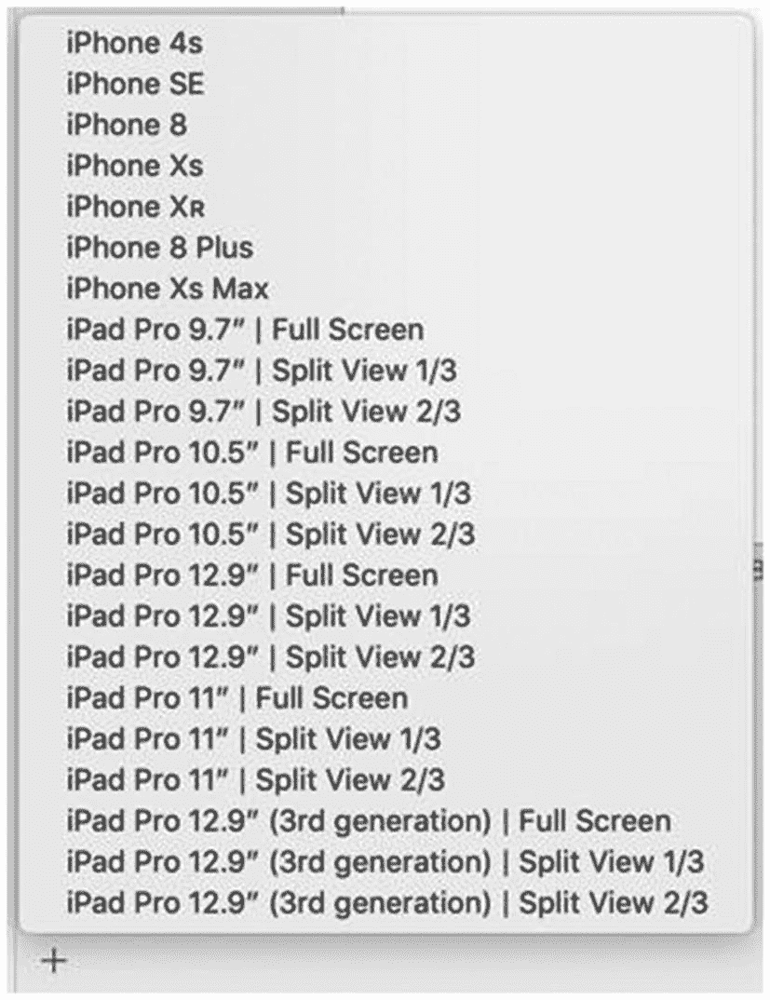

图 2-26. 添加设备图标显示一个列出不同 iOS 设备的菜单，用于预览用户界面

7.  点击一个 iOS 设备，例如 iPad Pro。预览面板会显示你的用户界面在你所选设备上的效果，如图 2-27 所示。

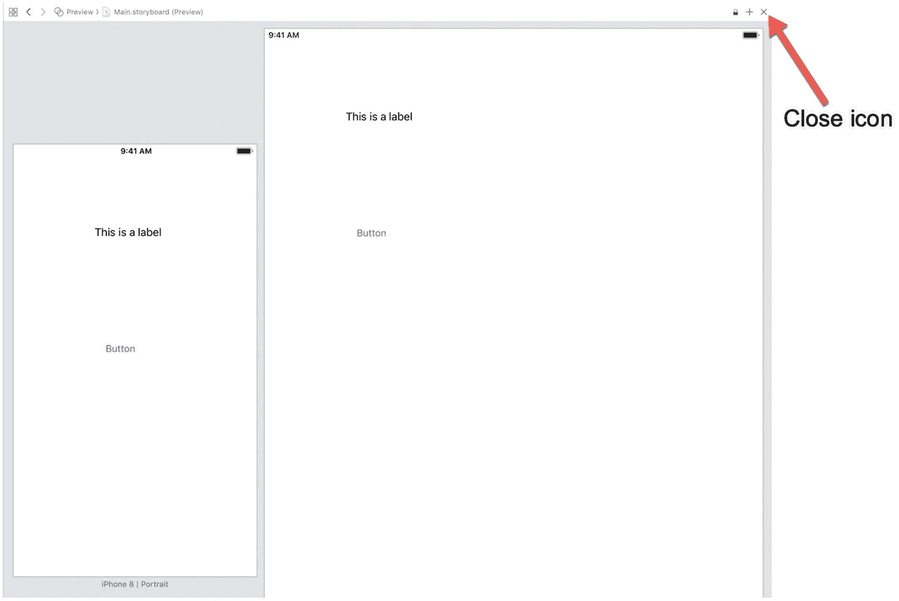

图 2-27. 在多个 iOS 设备上显示预览

8.  点击某个预览，然后按 `BACKSPACE` 或 `DELETE` 键将其移除。
9.  点击预览面板右上角的关闭图标，使预览面板消失。

通过使用预览面板，你可以看到用户界面在不同尺寸 iOS 设备上的显示效果。更棒的是，你还可以对不同尺寸的屏幕进行并排比较。


## 摘要

每个应用都需要一个用户界面。这个用户界面会被存储在故事板中，而故事板由一个或多个视图组成，其中每个视图代表在单个屏幕上显示的信息。你可以在视图上添加按钮、文本字段、标签和滑块等对象。如果你有两个或更多视图，还需要使用转场（segues）来连接这些视图，以显示它们呈现给用户的顺序。

你可以通过编程（编写代码）或可视化方式向视图添加对象。程序员通常结合使用这两种方法来设计他们的用户界面。你可以通过代码或检查器面板来自定义对象（按钮、标签、文本字段等）。故事板中的每个视图都需要链接到一个`.swift`文件。

由于 iOS 应用可以在不同类型的设备上运行，你需要确保你的应用无论屏幕尺寸或方向如何都能看起来美观。为了帮助你查看应用在不同屏幕尺寸和方向下的用户界面，你可以更改 Xcode 用于显示故事板的 iOS 设备屏幕尺寸。

在不同屏幕尺寸下测试应用用户界面的另一种方法是运行模拟器程序，并将其设置为模仿不同的 iOS 设备，例如 iPad Pro 或 iPhone 8。如果你想要比较应用在不同 iOS 设备屏幕上的显示效果，可以使用预览功能。

用户界面代表了用户所看到的内容，所以无论用户运行的是哪种 iOS 设备，你的用户界面始终保持美观这一点非常重要。

