# 3. 编写 Swift 代码

每个 iOS 应用都需要一个用户界面，但除非你编写 Swift 代码让它工作，否则这个用户界面不会起任何作用。虽然你可以将所有代码写在一个文件中，但更好的做法是将代码划分到不同的文件中，让每个文件包含相关的代码。一个简单的应用可能只包含少数几个文件，但一个更复杂的应用可能包含数十个甚至数百个包含相关 Swift 代码的独立文件。在每个文件中，你可以进一步将 Swift 代码组织成不同的函数。

编写 Swift 代码是必要的，用于：

- 从用户界面检索数据
- 根据检索到的数据计算结果
- 将该结果显示回用户界面

要从用户界面检索数据，你需要定义称为`IBOutlets`的特殊变量。`IBOutlet`是一个代表用户界面上显示的对象的变量。通过`IBOutlet`，你的其余 Swift 代码可以以某种方式访问和操作这些数据。

要根据检索到的数据计算结果，你可以编写 Swift 代码来操作数据，但更常见的是同时使用苹果的框架。苹果的框架包含数十个函数，你可以用它们来执行常见任务。这样你就可以使用经过测试的代码，从而花更多时间编写能让你的应用实现有用且独特功能的代码。

要让你的应用执行某些操作，你可以创建称为`IBActions`的特殊函数。`IBAction`使一个用户界面对象具有交互性，例如响应用户点击按钮、在文本字段中输入文本或操作滑块等操作。

一旦你的应用完成计算某些结果，最后一步是将结果显示回用户界面。为此，你将数据存储回`IBOutlet`变量中，以便数据可以出现在用户界面上。

`IBOutlet`变量和`IBAction`函数存储在链接到视图控制器的`.swift`文件中，该视图控制器显示与`IBOutlet`变量或`IBAction`函数连接的用户界面对象。请记住，每个视图控制器都链接到一个`.swift`文件。

要了解`IBOutlets`和`IBAction`函数如何工作，请遵循以下步骤：

1. 打开你的`MyFirstApp`项目（或创建一个新的单视图应用 iOS 项目）。
2. 在导航器面板中点击`Main.storyboard`文件。中间的 Xcode 面板会显示你的应用用户界面的内容。它应该显示一个按钮和一个标签。
3. 点击库图标打开对象库窗口。然后输入`text field`。
4. 将文本字段从对象库窗口拖到用户界面，如图 3-1 所示。

   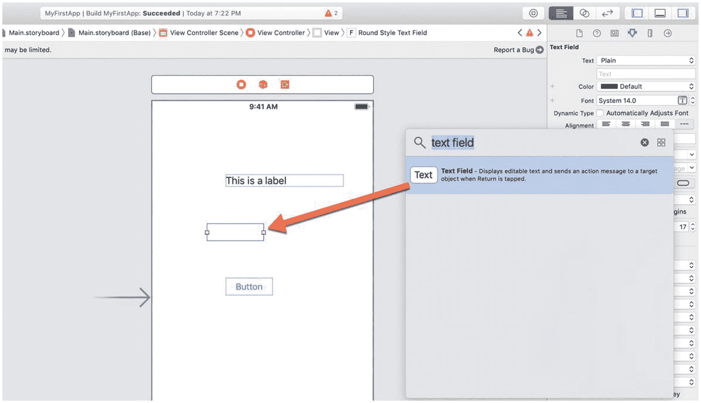

   图 3-1. 向视图添加文本字段

5. 调整文本字段的宽度使其更宽。确切的宽度并不重要。此时，你的用户界面应该由一个标签、一个文本字段和一个按钮组成。如果我们运行这个应用，用户可以点击按钮或在文本字段中输入，但什么都不会发生。这是因为我们还没有编写任何 Swift 代码来让任何功能生效。

## 创建 IBOutlet 变量

`IBOutlet` 无非是一个将你的 Swift 代码连接到用户界面对象（如文本字段或标签）的变量。通过使用 `IBOutlet`，你可以从用户界面对象检索数据，或者将信息放入该用户界面对象中以供显示。

在 Swift 中创建变量时，你通常需要声明一个变量名及其可以持有的数据类型，例如：

```
var age : Int
```

上述代码声明了一个名为 `age` 的变量，它可以持有整型 (`Int`) 值。当你创建 `IBOutlets` 时，你也必须声明一个变量名。两个不同之处在于，你还必须将该变量标识为 `IBOutlet`，并且必须将其类型声明为用户界面对象，例如：

```
@IBOutlet var age: UITextField!
```

要标识一个 `IBOutlet`，你必须在 `var` 前使用 `@IBOutlet`。接下来，你必须定义该 `IBOutlet` 连接到的用户界面对象的类型。在前面的示例中，`age` `IBOutlet` 连接到了一个文本字段 (`UITextField`)。`IBOutlet` 可以连接到的其他一些常见的用户界面对象类型包括 `UILabel`、`UIButton` 或 `UISlider`。


#### 注意

任何需要检索或显示数据的用户界面对象，都必须连接到一个唯一的`IBOutlet`变量。不过，如果某些用户界面对象不用于检索或显示数据，则无需连接到`IBOutlet`。

创建`IBOutlet`的一种方法是手动编写代码。之后，你需要将代码中的`IBOutlet`与故事板上的用户界面对象进行链接。第二种方法是，先从用户界面对象创建一条到你的`.swift`文件的链接，然后只输入`IBOutlet`变量名，由 Xcode 替你完成其余代码的编写。

要将代码链接到故事板，我们需要使用一个名为“助理编辑器”的功能，将 Xcode 的中间窗格一分为二。这样，故事板就会与一个`.swift`文件并排显示。下面来看看具体操作。

1.  打开在视图上显示了一个标签、按钮和文本字段的 `MyFirstApp` 项目（见图 3-1）。首先，我们查看一下这个应用程序的用户界面。

2.  在导航器窗格中，点击 `Main.storyboard` 文件。Xcode 的中间窗格会显示包含用户界面的应用程序故事板。

3.  点击控制器图标（一个内含白色矩形的黄色圆圈），它位于文档大纲中，或视图顶部（如图 3-2 所示）。这样会选中包含要链接的用户界面对象的控制器。在我们这个简单的应用程序中，只有一个控制器；但在更复杂的应用程序中，会有多个控制器，因此你需要告诉 Xcode 你要使用哪一个。

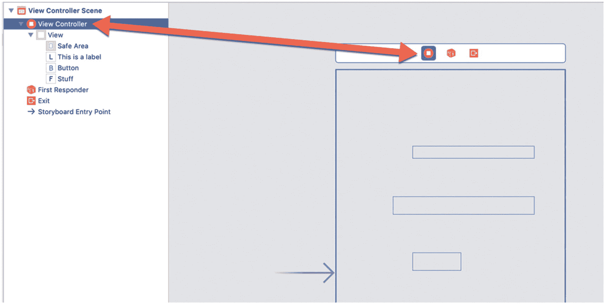

**图 3-2.** 选择一个控制器

4.  选择 **视图 ➜ 助理编辑器 ➜ 显示助理编辑器**，或点击助理编辑器图标。Xcode 会显示该控制器及其链接到的`.swift`文件，如图 3-3 所示。

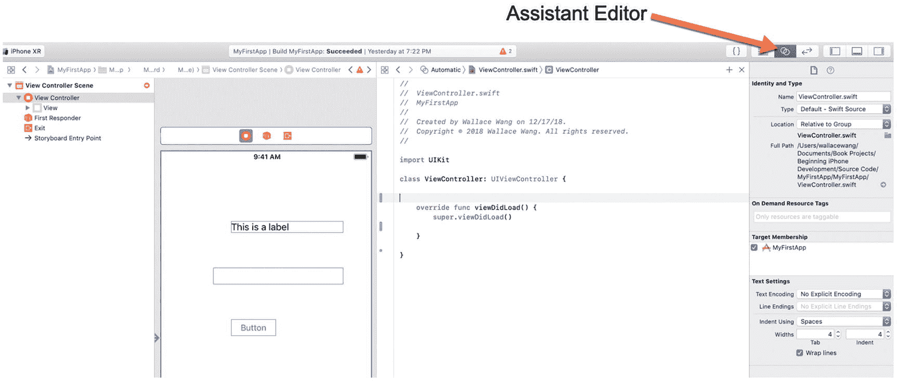

**图 3-3.** 打开助理编辑器

5.  在 `ViewController.swift` 文件中点击，然后输入 `@IBOutlet var labelResult: UILabel!`。因此，`ViewController.swift` 文件中的全部代码应该是这样的：

```
import UIKit
class ViewController: UIViewController {
    @IBOutlet var labelResult: UILabel!
    override func viewDidLoad() {
        super.viewDidLoad()
    }
}
```

请注意，在你新建的 `IBOutlet` 左侧会出现一个空心圆圈，如图 3-4 所示。这个空心圆圈代表指向你用户界面对象的链接。因为它是空心的，所以意味着这个 `IBOutlet` 尚未链接到任何用户界面对象。

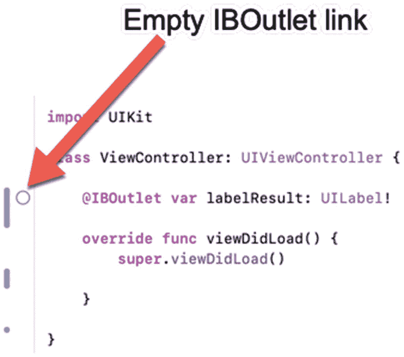

**图 3-4.** 一个尚未链接到用户界面对象的 `IBOutlet`

6.  将鼠标指针移到这个空心圆圈上，按住鼠标左键，然后拖动鼠标，直到它出现在故事板或文档大纲中的标签上方，如图 3-5 所示。

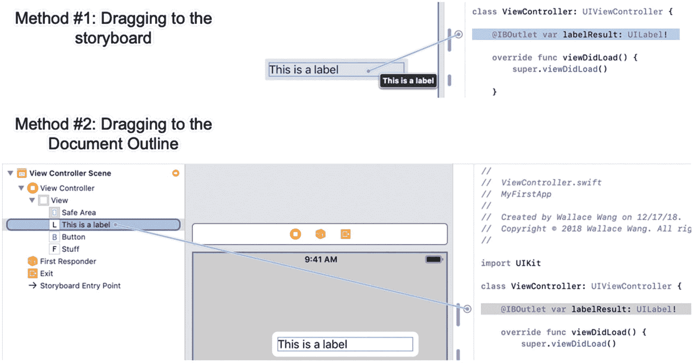

**图 3-5.** 将 `IBOutlet` 链接到用户界面对象

7.  松开鼠标左键。将鼠标指针移到 `IBOutlet` 左侧的圆圈上（此时圆圈应该不再是空心的）。Xcode 会高亮显示链接到该 `IBOutlet` 的用户界面对象，并在其下方显示该 `IBOutlet` 的名称，如图 3-6 所示。

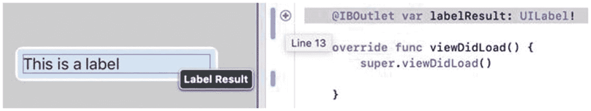

**图 3-6.** 验证 `IBOutlet` 与用户界面对象之间的连接

8.  点击故事板或文档大纲中的标签以将其选中。然后选择 **视图 ➜ 检查器 ➜ 显示连接检查器**，或点击**显示连接检查器**图标。Xcode 会显示 `labelResult` 这个 `IBOutlet` 已连接到 `ViewController.swift` 文件，如图 3-7 所示。

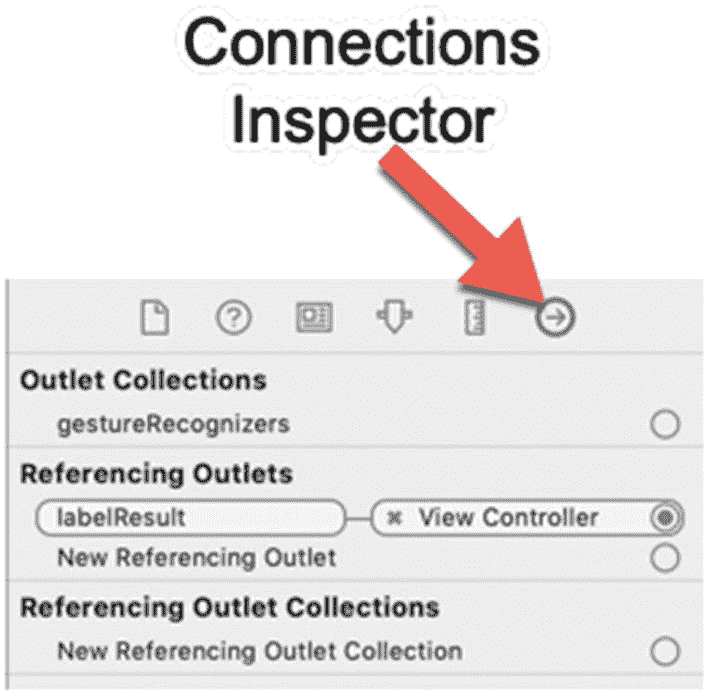

**图 3-7.** 在连接检查器中验证 `IBOutlet` 已连接到用户界面对象

编写代码是创建 `IBOutlet` 的一种方式，但你需要知道你要连接的是何种类型的用户界面对象，例如 `UITextField` 或 `UILabel`。一种更快更简单的创建 `IBOutlet` 的方法是，按住 Control 键，从用户界面对象（比如文本字段或标签）拖拽到 `.swift` 文件中。我们将对文本字段使用这种方法。

1.  将鼠标移到故事板或文档大纲中的文本字段上，按住 Control 键，然后按住 Control 键从文本字段拖拽到 `ViewController.swift` 文件中现有 `IBOutlet` 下方的区域，如图 3-8 所示。

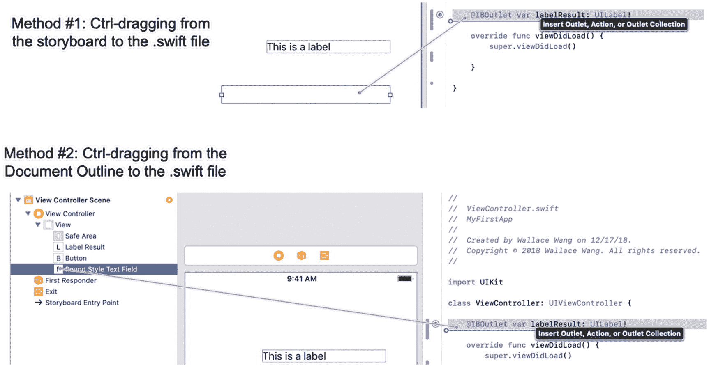

**图 3-8.** 按住 Control 键从用户界面对象拖拽到 `.swift` 文件

2.  当一条水平线出现在 `.swift` 文件内部时，松开 Control 键和鼠标左键。会弹出一个窗口，如图 3-9 所示。

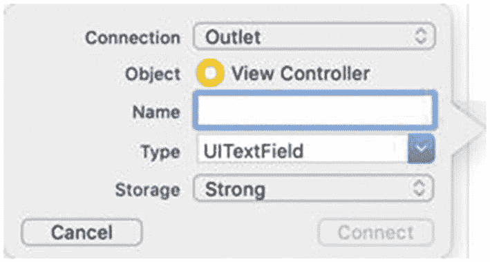

**图 3-9.** 使用属性检查器窗格自定义标签上显示的文本

3.  点击**名称**文本字段，输入 `textMessage`。你为这个 `IBOutlet` 起的名称可以任意。

4.  点击**连接**按钮。Xcode 会在你的 `.swift` 文件中创建一个 `IBOutlet`：

```
@IBOutlet var textMessage: UITextField!
```

请注意，当你按住 Control 键从故事板或文档大纲中的用户界面对象拖拽时，Xcode 会自动输入大部分必要的代码。你只需要为你的 `IBOutlet` 输入一个描述性的名称即可。由于这种方法减少了输入量（从而降低了出错的可能性），因此使用这种 Ctrl-拖拽方法创建 `IBOutlet` 通常更简单、更可靠。

1.  右键点击文本字段。Xcode 会显示一个弹出菜单，展示连接检查器，如图 3-10 所示。右键点击对象可能比打开连接检查器窗格更快。

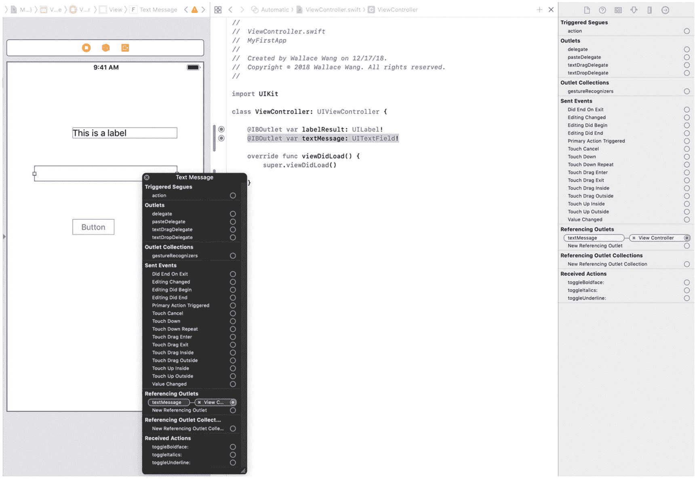

**图 3-10.** 右键点击用户界面对象会显示连接检查器

2.  点击弹出菜单左上角的**关闭 (X)** 图标使其消失。

3.  选择 **视图 ➜ 标准编辑器 ➜ 显示标准编辑器**，或点击**标准编辑器**图标，如图 3-11 所示。标准编辑器会出现，在 Xcode 的中间窗格中仅显示一个文件的内容。

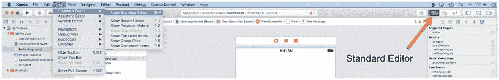

**图 3-11.** 返回标准编辑器

至此，我们已经将标签和文本字段连接到了两个不同的 `IBOutlet`。这使得我们能够从用户界面检索数据，并在用户界面上显示新信息。当然，`IBOutlet` 仅仅代表用户界面对象，但要使应用程序真正具有交互性，我们需要创建名为 `IBAction` 的方法。


#### 注意

在开发 iOS 应用时，忘记将 `IBOutlets` 连接到用户界面对象（或将 `IBOutlets` 连接到错误的对象）是常见的错误来源。每当你感觉用户界面工作不正常时，请打开连接检查器面板，检查你的 `IBOutlets` 是否已正确连接。

## 创建 IBAction 方法

如果我们现在运行应用，用户会在屏幕上看到一个按钮，但该按钮不会执行任何操作。要使用户界面的任何部分真正工作，我们需要创建 `IBAction` 方法。

`IBAction` 方法包含 Swift 代码，每当用户与用户界面上的对象（如按钮、滑块或开关）交互时，这些代码就会运行。`IBAction` 方法让用户能够使应用执行有用的操作。

要创建一个 `IBAction` 方法，你需要使用助理编辑器，将故事板与链接到特定控制器的 `.swift` 文件并排显示。让我们看看这是如何工作的。

1. 在导航窗格中点击 `Main.storyboard` 文件。Xcode 的中间窗格会显示包含应用用户界面的故事板。

2. 在文档大纲中或视图顶部（见图 3‑2）点击控制器图标（一个内含白色方块的黄色圆圈）。这将选中包含要链接的用户界面对象的控制器。

3. 选择 视图 ➤ 助理编辑器 ➤ 显示助理编辑器，或点击助理编辑器图标。Xcode 会显示该控制器及其所链接的 `.swift` 文件（见图 3‑3）。

4. 点击按钮以选中它。

5. 按住 Control 键，并从该按钮向 `ViewController.swift` 文件中最后一个花括号上方的区域进行 Ctrl‑拖拽，如图 3‑12 所示。

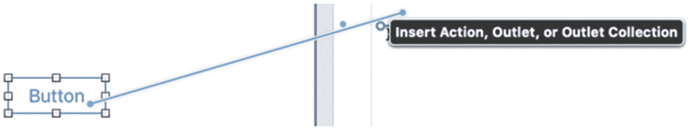

图 3-12. 从按钮向 `.swift` 文件进行 Ctrl‑拖拽

6. 松开 Control 键和鼠标左键。会弹出一个窗口。确保“连接”弹出菜单显示为“Action”。

**注意** 一个常见的错误是创建了 `IBOutlet` 变量（当“连接”弹出菜单显示为“Outlet”时），而不是 `IBAction` 方法（当“连接”弹出菜单显示为“Action”时）。务必检查“连接”弹出菜单，确保它根据你想要创建的内容显示为“Outlet”或“Action”。

7. 点击“名称”文本框，并输入 `changeButton`。

8. 点击“类型”弹出菜单，并选择 `UIButton`，如图 3‑13 所示。

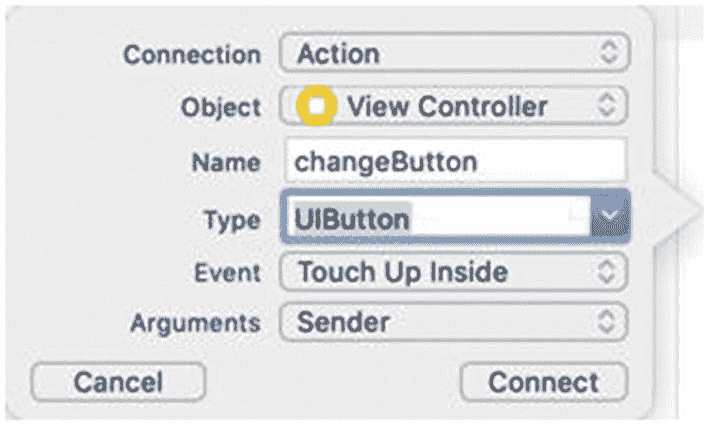

图 3-13. 属性检查器允许你自定义场景的显示方式

9. 点击“连接”按钮。Xcode 会创建一个 `IBAction` 方法：

```swift
@IBAction func changeButton(_ sender: UIButton) {
}
```

每当用户点击该按钮时，此 `IBAction` 方法就会运行。现在我们需要在此 `IBAction` 方法内部编写 Swift 代码，使其真正执行某些操作。

10. 按如下方式修改此 `IBAction` 方法：

```swift
@IBAction func changeButton(_ sender: UIButton) {
    labelResult.text = textMessage.text
}
```

请注意，在你输入时，Xcode 会显示一个命令列表，它认为你想要输入这些命令，如图 3‑14 所示。你无需输入完整的命令，只需选择所需的命令并按回车键，即可让 Xcode 自动为你输入该命令。

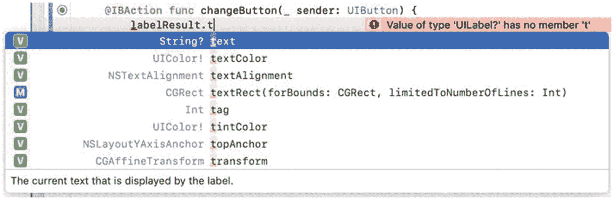

图 3-14. Xcode 的自动补全功能会尝试猜测你想要输入的命令

上述 `IBAction` 方法的代码只是获取 `textMessage` `IBOutlet`（已连接到文本字段）中存储的文本，并将其显示在 `labelResult` `IBOutlet`（已连接到标签）中。让我们看看它实际是如何工作的。

1. 选择 产品 ➤ 运行，或点击运行按钮。模拟器会出现。

2. 点击文本字段，并输入 `Hello there!`。

3. 点击按钮。请注意，现在标签显示了 `Hello there!`，如图 3‑15 所示。

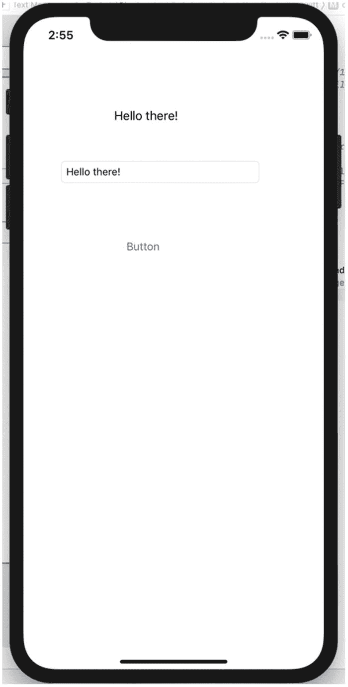

图 3-15. 在模拟器中运行应用

4. 选择 模拟器 ➤ 退出模拟器。Xcode 窗口会再次出现。

5. 选择 视图 ➤ 标准编辑器 ➤ 显示标准编辑器，或点击标准编辑器图标（见图 3‑11）。标准编辑器会显示，并在 Xcode 中间窗格中仅显示一个文件的内容。

此示例演示了编写 Swift 代码的几个关键原则：

* 每个需要检索或显示数据的用户界面对象都必须连接到一个 `IBOutlet` 变量。

* 每个用户与之交互的用户界面对象都必须连接到一个 `IBAction` 方法。

* 助理编辑器可帮助你创建 `IBOutlet` 变量和 `IBAction` 方法。

* 在你输入 Swift 代码时，Xcode 会显示它认为你想要输入的命令列表。


## 使用 Apple 框架

虽然可以编写 Swift 代码来执行各种任务，但通常使用 Apple 的框架会更简单。Apple 提供了许多常用功能，因此你无需重新发明轮子，重写 Apple 已经为你写好的代码。这让你可以使用 Apple 经过验证和测试的代码，从而使你的应用程序更可靠。

在我们的示例中，应用程序只是将文本字段中输入的任何文本显示在标签中。现在让它变得更酷一些：让标签获取文本字段中输入的任何文本，并以大写形式显示相同的文本。

为此，我们可以编写 Swift 代码来替换每个字母，并将其替换为大写字母，但这需要时间编写，甚至需要更多时间测试。更简单的替代方案是，我们可以直接使用 Apple 框架提供的一个名为 `uppercased()` 的特殊函数。

这个 `uppercased()` 函数已经可以工作，并且不需要我们编写自己的代码来将小写字母替换为大写字母，因此它将节省我们的时间并提高应用程序的可靠性。作为一般规则，尽可能依赖 Apple 的框架，只有在 Apple 框架无法帮助你时才编写代码。

要使用 Apple 框架，你必须将其导入到你的 `.swift` 文件中。如果你查看 `AppDelegate.swift` 或 `ViewController.swift` 文件，你会看到以下一行：

```swift
import UIKit
```

上面这一行允许该特定文件使用存储在 `UIKit` 框架中的任何代码。更复杂的应用程序通常会使用多个框架，例如：

```swift
import UIKit
import SceneKit
import ARKit
```

上面的代码允许访问存储在 `UIKit`、`SceneKit` 和 `ARKit` 框架中的代码。每当你需要使用存储在不同框架中的代码时，只需在 `.swift` 文件顶部添加一行 `import` 即可将其添加到你的 `.swift` 文件中。

让我们看看如何在我们的代码中使用 `uppercased()` 函数：

1.  在 Xcode 中打开 MyFirstApp 项目。
2.  在导航窗格中点击 `ViewController.swift` 文件。
3.  如下修改 `IBAction` 方法：

    ```swift
    @IBAction func changeButton(_ sender: UIButton) {
        labelResult.text = textMessage.text?.uppercased()
    }
    ```

    只需使用 `uppercased()` 函数，我们就可以将小写字母改为大写，而无需浪费时间编写自己的代码来执行此操作。

4.  选择 **产品** ➤ **运行**，或点击运行按钮。模拟器出现。
5.  点击文本字段并输入 `Hello there!`。
6.  点击按钮。请注意，标签现在显示 `HELLO THERE!`，如图 3-16 所示。

    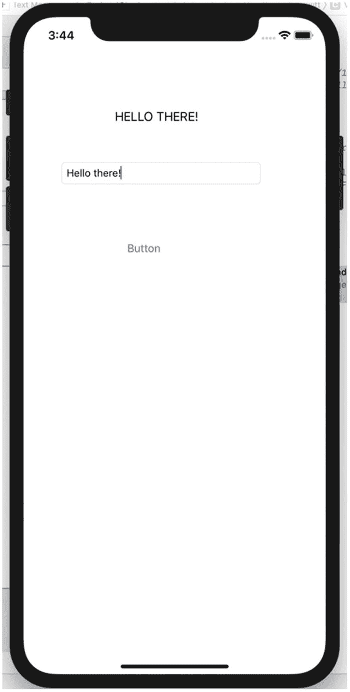

    图 3-16. 在模拟器中使用 `uppercased()` 函数运行应用

7.  选择 **模拟器** ➤ **退出模拟器**。Xcode 窗口再次出现。

## 使用 Xcode 编辑器

当你键入和编辑 Swift 代码时，Xcode 会以不同的颜色显示某些文本，以帮助你理解命令的不同部分。这些不同颜色突出显示以下内容：

*   **黑色** – 用户键入的任意命令
*   **品红色** – Swift 关键字，例如 `func`（函数）或 `@IBOutlet`
*   **紫色** – 类、属性或方法，例如 `UIButton`、`text` 或 `uppercased`
*   **绿色** – 变量名
*   **红色** – 字符串

用户始终可以自定义 Xcode 如何使用不同颜色来标识 Swift 代码的各个部分。要查看可能分配了哪些颜色来显示不同的 Swift 代码，请按照以下步骤操作：

1.  选择 **Xcode** ➤ **偏好设置**。出现一个偏好设置窗口。
2.  点击 **字体与颜色** 图标。左侧窗格中会显示一个不同的主题列表。
3.  点击 Xcode 当前使用的主题，查看使用了哪些颜色来标识不同的 Swift 命令，如图 3-17 所示。（如果你选择 **编辑器** ➤ **主题**，即可识别 Xcode 当前使用的主题。）

    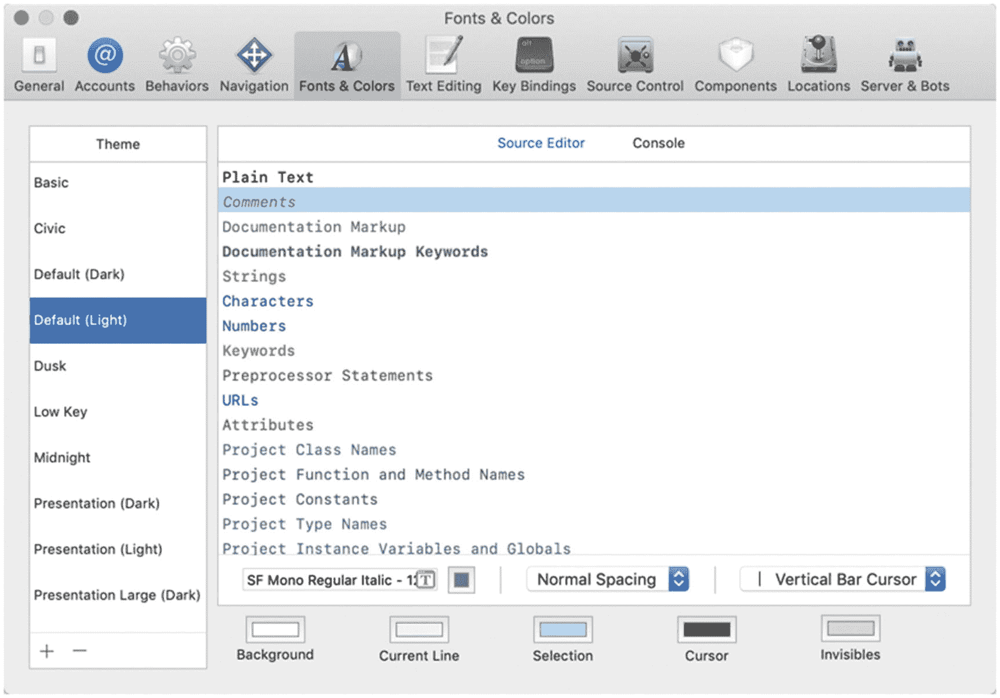

    图 3-17. 偏好设置窗口让你查看 Xcode 如何使用不同颜色来标识 Swift 代码

4.  点击偏好设置窗口左上角的红色关闭按钮将其关闭。

### 获取 Swift 命令的帮助

典型应用程序的代码将包含你自己的代码以及方法和属性。为了帮助你理解各种代码可能意味着什么，你可以通过按住 Option 键并单击特定命令来获取特定命令的帮助。要了解其工作原理，请执行以下步骤：

1.  在 Xcode 中加载 MyFirstApp 项目。
2.  在导航窗格中点击 `ViewController.swift` 文件。
3.  按住 Option 键，将鼠标指针移到 `ViewController.swift` 文件底部附近的 `uppercased()` 函数上。鼠标指针会变成一个问号。
4.  按住 Option 键的同时单击 `uppercased()` 函数。Xcode 会显示一个窗口，解释 `uppercased()` 函数的工作原理，如图 3-18 所示。

    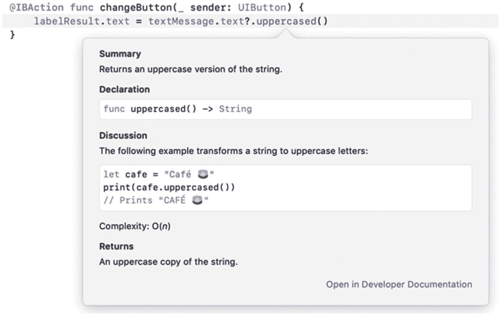

    图 3-18. 按住 Option 键并单击命令获取帮助

5.  按住 Option 键并单击 `UITextField`！Xcode 会显示另一个窗口，进一步解释 `UITextField` 命令，如图 3-19 所示。

    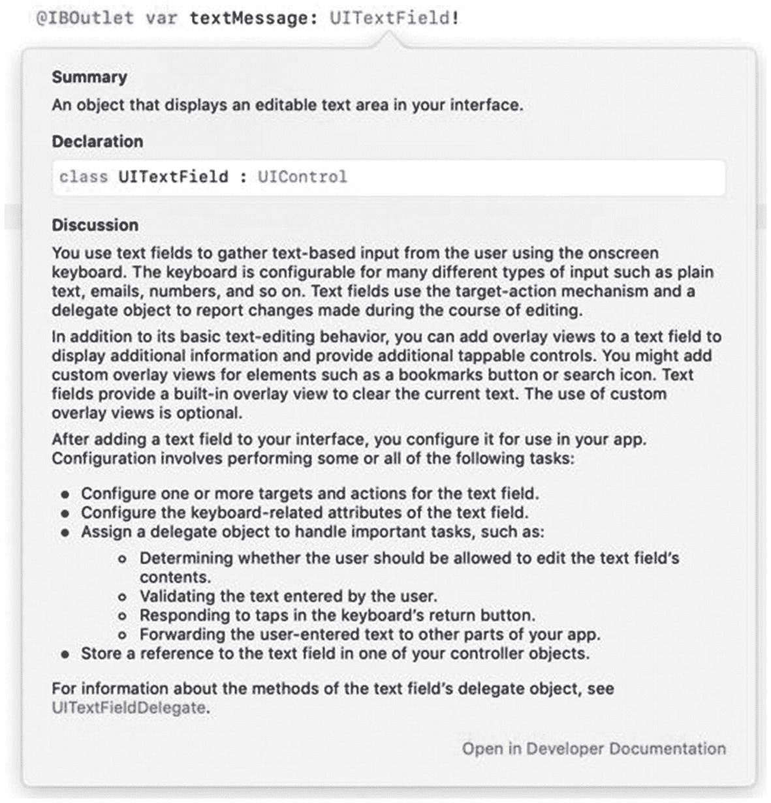

    图 3-19. 显示关于 `UITextField` 的帮助

6.  按住 Option 键并单击 `IBAction` 方法内部的 `labelResult`。Xcode 会显示一个窗口，显示 `labelResult` `IBOutlet` 的声明位置，如图 3-20 所示。

    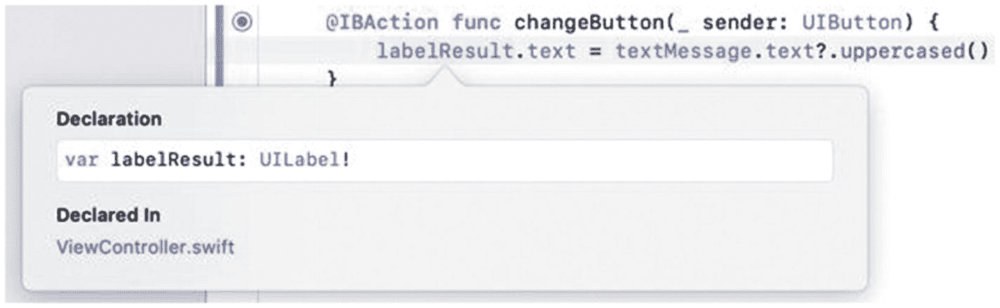

    图 3-20. 显示关于 `labelResult` `IBOutlet` 的附加信息

通过按住 Option 键并单击不同的 Swift 命令，你可以在 Xcode 编辑器内快速获取该命令的帮助。

### 折叠和展开函数

在复杂的应用程序中，单个 `.swift` 文件可能包含多个函数。这可能会使查找特定代码行变得困难。为了暂时隐藏函数中存储的代码，Xcode 可以折叠和展开函数。折叠会将函数收拢，这样你只能看到它的名字，但看不到内部存储的任何代码。展开则会展开一个函数，使你可以看到它的所有代码。

要了解如何在 `.swift` 文件中折叠和展开函数，请执行以下步骤：

1.  在 Xcode 中加载 MyFirstApp 项目。
2.  在导航窗格中点击 `ViewController.swift` 文件。
3.  选择 **编辑器** ➤ **代码折叠** ➤ **折叠方法和函数**。Xcode 现在只显示所有函数名，而不显示每个函数内部的任何代码，如图 3-21 所示。请注意，每个折叠的函数都会显示一个省略号 (…) 以表示它隐藏了代码。

    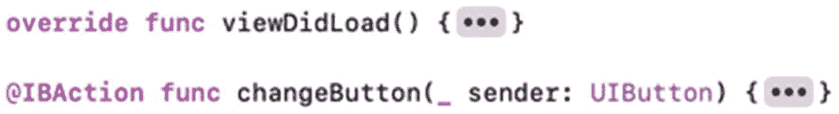

    图 3-21. 折叠的函数

4.  双击折叠的 `viewDidLoad` 函数末尾的省略号。Xcode 现在会显示该函数的代码。

通过折叠函数，你可以隐藏不想看到的代码，并仅专注于你确实想看到的代码。代码折叠是 Xcode 让查看和编辑代码变得更简单的一个简单方法。


## 摘要

Swift 代码决定了应用的运行方式。要在用户界面上检索或显示数据，你需要创建 `IBOutlet` 变量，并将它们与文本字段和标签等不同的用户界面对象关联起来。如果某个用户界面对象不用于检索或显示数据，那么你就不需要为该对象创建 `IBOutlet` 变量。

为了使按钮等特定用户界面对象具有交互性，你需要编写 `IBAction` 方法。在创建 `IBAction` 方法时，你还需要编写能实现特定功能的 Swift 代码。`IBOutlet` 变量和 `IBAction` 方法都存储在连接到特定控制器的 `.swift` 文件中。

为了避免重复编写常用代码，Apple 提供了包含各种可调用函数的框架。这些框架函数已经过测试，因此你可以直接使用它们，通过专注于编写让应用实现其独特功能的核心代码，来更快地开发应用。Apple 提供了数十种不同的框架供你的应用使用，但不太可能在单个应用中用到或需要所有这些框架。

为了帮助你编写和理解 Swift 代码，Xcode 允许你按住 Option 键并点击不同的命令。这会显示一个窗口，提供有关特定命令如何工作的进一步说明。由于许多 `.swift` 文件包含大量代码，Xcode 允许你临时隐藏函数中的代码，以便只专注于查看你需要的代码。

Swift 代码让你的应用实现实用功能，因此你会花费大量时间编写、重写和研究代码。了解如何使用 Swift 只是创建 iOS 应用的第一步。你还需要知道如何使用 Xcode。

