# 4. 使用 Xcode

在开始编写 Swift 代码和设计用户界面之前，请花点时间熟悉一下 Xcode，这是 Apple 提供的免费应用开发工具。Xcode 提供了众多功能，旨在满足你从头到尾创建应用的所有需求。幸运的是，你无需学习 Xcode 的每一个功能就能开始创建应用。相反，你可以只专注于学习你需要的那些功能，然后逐步掌握 Xcode 的其他功能。Xcode 提供了以下功能来帮助你为所有 Apple 产品创建应用：

- 编写和编辑 Swift 代码
- 设计用户界面
- 调试应用程序以查找和修复问题
- 运行和测试你的应用

Xcode 既是编辑器，也是编译器。编辑器允许你编写和修改 Swift 代码，同时设计和自定义用户界面。完成用户界面和 Swift 代码的创建后，你可以使用 Xcode 来编译和运行你的应用，以确保其正常工作。

## 更改 Xcode 的外观

无论你是在小型笔记本电脑屏幕还是更大的台式显示器上工作，很可能你并不总是有足够的空间来查看 Xcode 中的所有内容。因此，Xcode 提供了多种隐藏或显示信息的方式。这样你就可以专注于你想看的内容，避免被多余的信息干扰。

Xcode 可以隐藏或显示的不同部分包括：

- 导航器面板
- 工具栏
- 标签栏
- 调试区
- 检查器面板
- 文档大纲
- 对象库

### 导航器面板

导航器面板位于 Xcode 窗口的左侧。你可以通过选择以下任一命令来切换隐藏或显示导航器面板：

- 选择 “显示” ➤ “导航器” ➤ “显示/隐藏导航器”。
- 按下 Command + 0（零）。

你也可以将鼠标指针移到导航器面板的边框上，然后向左或向右拖动鼠标，来调整导航器面板的宽度。将导航器面板变得太窄，可以将其完全隐藏。

**注意：** 向左拖动鼠标可以隐藏导航器面板，但之后你需要选择 “显示” ➤ “导航器” ➤ “显示导航器” 或按下 Command + 0（零）才能使导航器面板再次出现。

尽管导航器面板可以显示不同的信息，但最常用的三种信息类型包括：

- **项目导航器 (Command + 1)** – 显示构成项目的所有文件夹和文件，包括你的 `.swift` 文件和 `.storyboard` 用户界面。
- **符号导航器 (Command + 3)** – 列出每个 `.swift` 文件中存储的所有函数。
- **问题导航器 (Command + 5)** – 显示项目可能存在的问题。

要了解这三种不同类型的导航器如何工作，请按照以下步骤操作：

1.  打开 `MyFirstApp` 项目，该项目在视图上显示一个标签、一个按钮和一个文本字段。

2.  选择 “显示” ➤ “导航器” ➤ “显示项目导航器”，按下 Command + 1，或点击项目导航器图标。Xcode 会显示构成项目的文件夹和文件列表，如图 4-1 所示。当你想在 Xcode 中间窗格中查看不同文件时，可以使用项目导航器。

    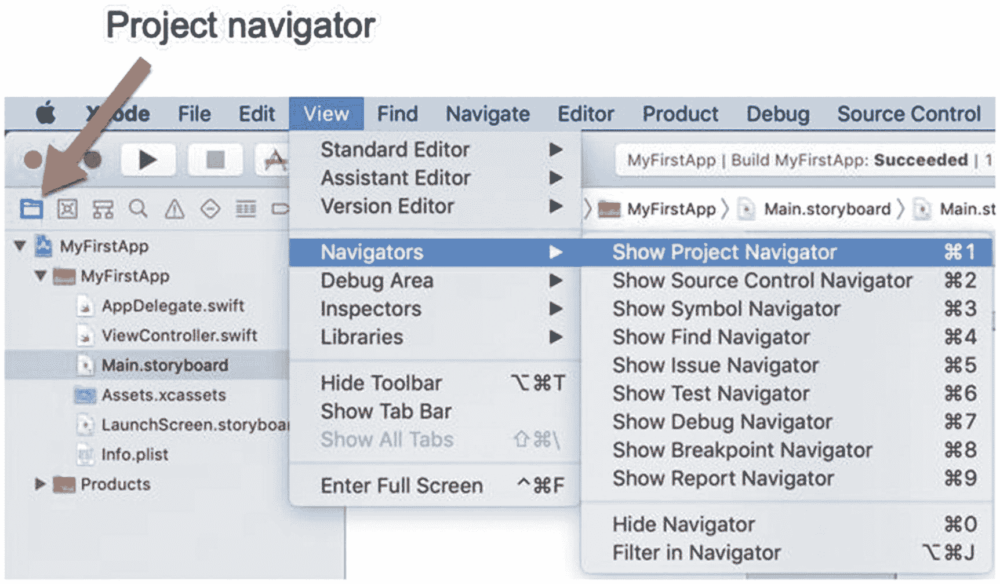

    **图 4-1.** 选择项目导航器

3.  在导航器面板中点击 `ViewController.swift` 文件。Xcode 的中间窗格会显示 `ViewController.swift` 文件的内容，这样你就可以在该文件中编写和编辑 Swift 代码。

4.  在导航器面板中点击 `Main.storyboard` 文件。Xcode 的中间窗格会显示应用的用户界面，这样你就可以设计和编辑用户界面，例如添加按钮或标签。

5.  选择 “显示” ➤ “导航器” ➤ “显示符号导航器”，按下 Command + 3，或点击符号导航器图标。Xcode 会显示构成项目的 `.swift` 文件列表。通过点击每个 `.swift` 文件名左侧的灰色展开三角形，你可以展开或折叠每个 `.swift` 文件中使用的函数和变量列表，如图 4-2 所示。

    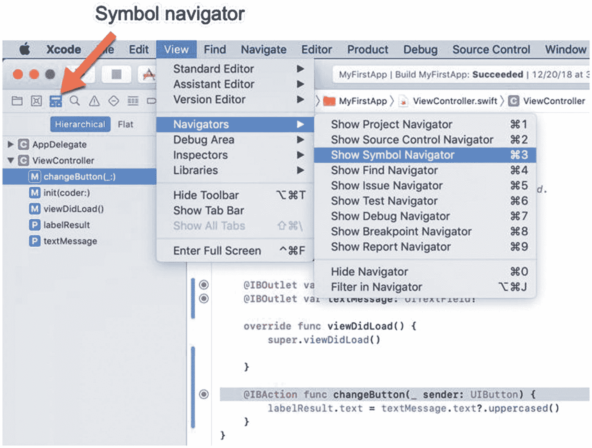

    **图 4-2.** 符号导航器允许你快速查找存储在 `.swift` 文件中的函数或变量

6.  点击 `ViewController` 文件左侧的灰色展开三角形，显示该文件中的函数（也称为方法，由大写字母 M 图标标识）和变量（也称为属性，由大写字母 P 图标标识）列表。

7.  点击 `changeButton` 方法。Xcode 会在 `ViewController.swift` 文件中高亮显示 `changeButton` 方法（参见图 4-2）。

8.  点击 `labelResult` 属性。Xcode 会在 `ViewController.swift` 文件中高亮显示 `labelResult` 属性。符号导航器可以帮助你快速跳转到项目中的特定属性或方法。

9.  选择 “显示” ➤ “导航器” ➤ “显示项目导航器”，按下 Command + 1，或点击项目导航器图标。然后点击 `Main.storyboard` 文件查看应用的用户界面。

10. 选择 “显示” ➤ “导航器” ➤ “显示问题导航器”，按下 Command + 5，或点击问题导航器图标。问题导航器会显示有关项目的警告，如图 4-3 所示。黄色图标代表允许应用继续运行但可能导致用户界面外观问题或代码运行不完全安全的问题。红色图标代表会导致应用完全无法运行的问题。

    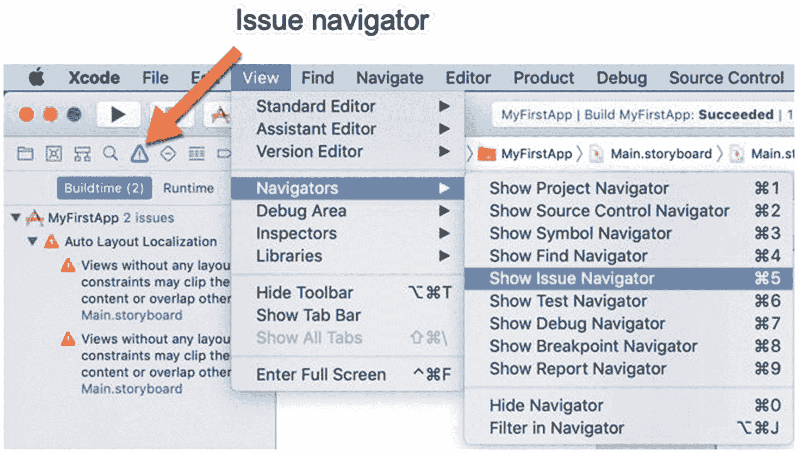

    **图 4-3.** 问题导航器允许你查看项目可能存在的问题


### 工具栏

工具栏 位于 Xcode 窗口顶部，显示了一些图标，让您能一键访问常用命令，如图 4-4 所示：

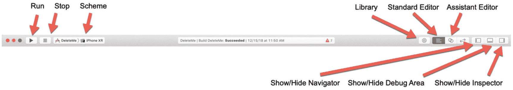

**图 4-4.** Xcode 窗口顶部的工具栏

-   `Run` – 运行您的 iOS 项目，以便在模拟器（模拟 iOS 设备）或连接到 Macintosh 的实际 iOS 设备上进行测试
-   `Stop` – 停止运行您的 iOS 项目
-   `Scheme` – 让您选择在模拟器中模拟哪个 iOS 设备，或选择已连接到 Macintosh 的哪个 iOS 设备
-   `Library` – 打开对象库以设计用户界面（当在 Xcode 中间窗格中查看 `.storyboard` 文件时），或打开代码库（当在 Xcode 中间窗格中查看 `.swift` 文件时）
-   `Standard Editor` – 在 Xcode 的中间窗格中显示标准编辑器
-   `Assistant Editor` – 在 Xcode 的中间窗格中并排显示两个编辑器
-   `Show/Hide Navigator pane` – 切换 Xcode 窗口左侧导航器面板的隐藏与显示
-   `Show/Hide Debug area` – 切换 Xcode 窗口底部调试区域的隐藏与显示
-   `Show/Hide Inspector pane` – 切换 Xcode 窗口右侧检查器面板的隐藏与显示

您可以通过以下任一方式切换工具栏的隐藏与显示：

-   选择 **View** ➤ **Show/Hide Toolbar**。
-   按下 **Option + Command + T**。

当您想要测试应用时，可以点击 `Scheme` 弹出菜单选择一个 iOS 设备。然后点击工具栏上的 `Run` 和 `Stop` 图标来启动或停止您在所选 iOS 设备上运行的应用。

当您想要编辑 `.swift` 或 `.storyboard` 文件时，可以点击工具栏上的 `Standard Editor` 图标。当您需要并排查看两个文件（例如 `.swift` 和 `.storyboard` 文件）时，可以点击 `Assistant Editor` 图标。编辑 `.storyboard` 文件时，可以点击 `Library` 图标来获取不同的对象并将其放置到用户界面上。

最后，您可以选择隐藏或显示导航器面板、调试区域或检查器面板。隐藏这些区域中的任何一个，都能为中间窗格在 Xcode 中提供更多显示空间。

要了解这些常用图标在 Xcode 中的工作方式，请遵循以下步骤：

1.  确保您的 `MyFirstApp` 项目已在 Xcode 中加载。
2.  选择 **View** ➤ **Hide Toolbar**。工具栏会从 Xcode 窗口顶部消失。
3.  选择 **View** ➤ **Show Toolbar**。工具栏会再次出现在 Xcode 窗口顶部。
4.  点击工具栏最右侧的 `Show/Hide Navigator pane` 图标。注意导航器面板消失了。
5.  再次点击 `Show/Hide Navigator pane` 图标使导航器面板重新出现。
6.  点击 `Show/Hide Inspector` 图标。注意检查器面板消失了。
7.  再次点击 `Show/Hide Inspector pane` 图标使检查器面板重新出现。
8.  点击工具栏最左侧的 `Scheme` 弹出菜单。会出现一个菜单，列出可以供模拟器模拟的不同 iOS 设备，如图 4-5 所示。

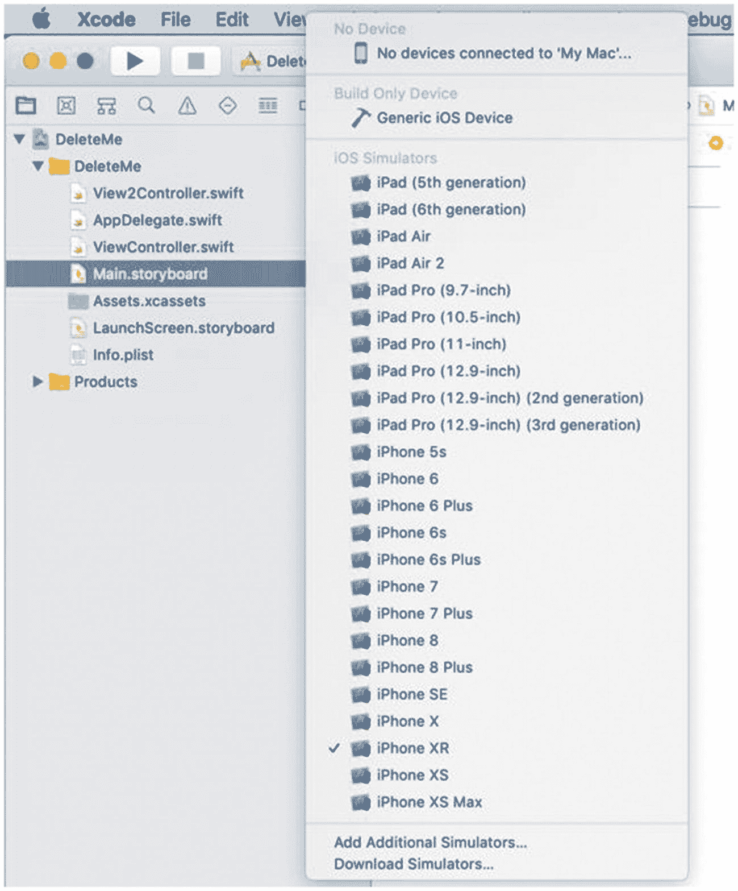

**图 4-5.** `Scheme` 弹出菜单显示了您可以在其上测试应用的不同 iOS 设备

9.  选择一个 iOS 设备，例如 iPhone 8 或 iPhone XR。
10. 在导航器面板中点击 `ViewController.swift` 文件。
11. 编辑 `ViewController.swift` 文件，使 `changeButton` 方法如下所示：

```
@IBAction func changeButton(_ sender: UIButton) {
    labelResult.text = textMessage.text?.uppercased()
    print (labelResult.text!)
}
```

12. 点击工具栏上的 `Run` 图标。模拟器会出现，显示 `MyFirstApp` 的用户界面。
13. 点击用户界面上的文本字段，输入 **Hello, world!**
14. 点击用户界面上的按钮。标签会显示 **HELLO, WORLD!**
15. 点击 Xcode 窗口中工具栏上的 `Stop` 图标。注意这会停止应用在模拟器上运行，但模拟器窗口仍然保留在屏幕上。
16. 选择 **Simulator** ➤ **Quit Simulator** 来关闭模拟器窗口。注意 Xcode 窗口底部会显示调试区域，因为 `print (labelResult.text!)` 命令会在调试区域打印出 **HELLO, WORLD!**，如图 4-6 所示。

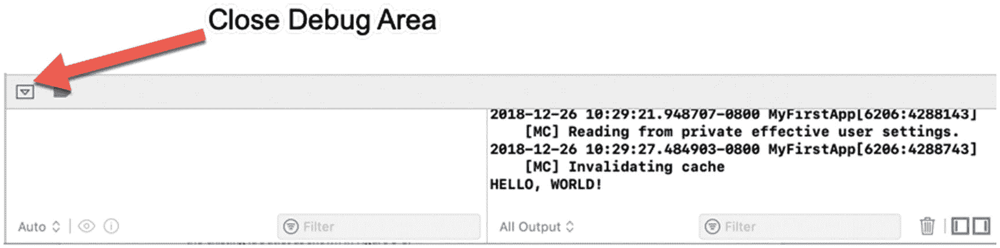

**图 4-6.** 调试区域出现在 Xcode 窗格底部

17. 点击工具栏最右侧的 `Show/Hide Debug Area` 图标，或点击调试区域窗格左上角的 **Close Debug Area**。注意调试区域消失了。


### 标签栏（Tab Bar）

Xcode 的一个问题是，通常每次只能通过点击导航区中的文件来查看一个文件。助理编辑器可以让你并排查看两个文件，但每个文件都会显得很窄。为了帮助你快速在文件之间来回切换，可以使用标签栏。

默认情况下，标签栏是隐藏的。要切换显示或隐藏标签栏，请选择 `View ➤ Show/Hide Tab Bar`。

标签栏的主要用途是显示代表不同 `.swift` 或 `.storyboard` 文件的选项卡。通过点击选项卡，你可以在文件之间快速切换，而无需先在导航区点击文件名。

要了解如何使用标签栏，请按照以下步骤操作：

1.  确保 `MyFirstApp` 项目已在 Xcode 中加载。

2.  在导航区点击 `Main.storyboard` 文件。Xcode 会在中间面板显示 `.storyboard` 文件。

3.  选择 `View ➤ Show Tab Bar`。标签栏会出现在 Xcode 窗口中。最初只有一个选项卡，显示 `Main.storyboard` 文件的名称，如图 4-7 所示。

    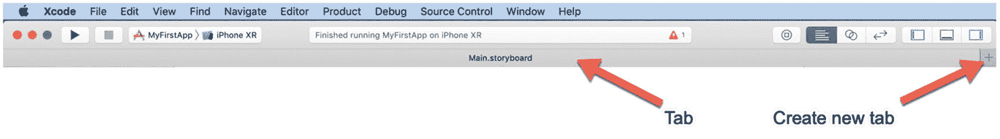
    
    *图 4-7. 每个选项卡显示其所代表的文件名称*

4.  点击标签栏最右侧的新建选项卡图标（`+`）。Xcode 会显示第二个选项卡。

5.  在导航区点击 `ViewController.swift` 文件。注意，标签栏现在显示两个选项卡：一个代表 `Main.storyboard` 文件，另一个代表 `ViewController.swift` 文件。

6.  点击 `Main.storyboard` 选项卡。Xcode 会显示 `.storyboard` 文件。

7.  点击 `ViewController.swift` 选项卡。Xcode 会显示 `.swift` 文件。通过使用选项卡，你可以加载最常编辑的文件，并在它们之间来回切换。

8.  选择 `View ➤ Show All Tabs`，或按下 `Shift + Command + \`。Xcode 会显示所有打开选项卡的缩略图。这让你可以快速浏览所有当前打开的文件，如图 4-8 所示。（你可以通过点击 `+` 缩略图来创建一个新选项卡。）

    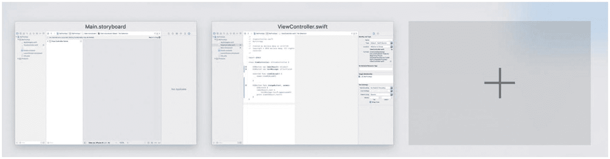
    
    *图 4-8. 以缩略图形式显示的选项卡*

9.  选择 `View ➤ Show All Tabs` 或按下 `Shift + Command + \` 以隐藏选项卡的缩略图。

10. 将鼠标指针移动到 `ViewController.swift` 选项卡的左侧。会出现一个关闭图标（`X`），如图 4-9 所示。

    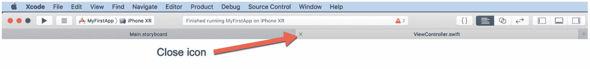
    
    *图 4-9. 关闭图标出现在每个选项卡的最左侧*

11. 点击 `ViewController.swift` 选项卡上的关闭图标。该选项卡会消失。请注意，标签栏中必须始终至少有一个选项卡。

12. 选择 `View ➤ Hide Tab Bar`。Xcode 会隐藏标签栏。

#### 注意

当且仅当只有一个选项卡打开时，你才能隐藏标签栏。如果同时打开了多个选项卡，“Hide Tab Bar” 命令会显示为灰色不可用状态。

## 标记 Swift 代码（Marking Swift Code）

通过使用符号导航器，你可以查看项目中所有的 `.swift` 文件，并跳转到每个文件中存储的属性和方法。但是，如果你想将 `.swift` 文件划分为任意部分，你可以创建一个特殊的 `MARK` 注释，用以定义一组相关的代码。`MARK` 命令如下所示：

```
// MARK:
```

两个 `//` 符号定义了这行是一个注释。

`MARK:` 命令定义了这是一个标记部分。

`<description>` 文本代表你希望定义该部分名称的任意文本。如果你想把部分命名为 `All Properties`，那么标记行应该如下所示：

```
// MARK: All Properties
```

通过使用 `MARK` 注释来划分你的 Swift 代码，你可以快速跳转到任何 `.swift` 文件的不同部分。要了解其如何工作，请按照以下步骤操作：

1.  在 Xcode 中打开 `MyFirstApp` 项目。

2.  在导航区点击 `ViewController.swift` 文件。

3.  修改 `ViewController.swift` 文件，在 `IBOutlet` 属性和 `IBAction` 方法上方添加两个 `// MARK:` 注释，使其看起来像这样：

    ```
    import UIKit
    class ViewController: UIViewController {
    // MARK: Properties
    @IBOutlet var labelResult: UILabel!
    @IBOutlet var textMessage: UITextField!
    override func viewDidLoad() {
    super.viewDidLoad()
    }
    // MARK: Methods
    @IBAction func changeButton(_ sender: UIButton) {
    labelResult.text = textMessage.text?.uppercased()
    print (labelResult.text!)
    }
    }
    ```

    注意，Xcode 中间面板的顶部会显示一个层级，例如 `MyFirstApp ➤ MyFirstApp ➤ ViewController.swift`，如图 4-10 所示。

    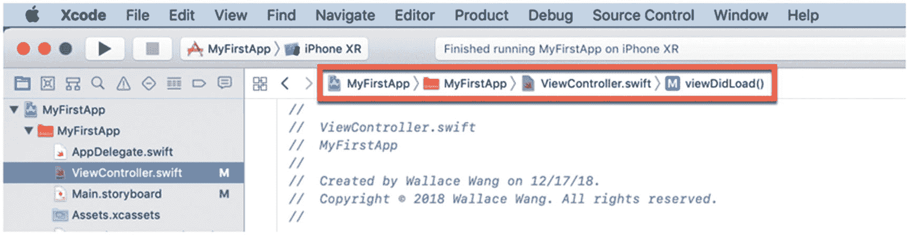
    
    *图 4-10. 项目、文件夹和文件的层级列表*

4.  点击出现在 `ViewController.swift >` 之后的最后一个项（在图 4-10 中，该项是 `viewDidLoad()`）。会弹出一个菜单，如图 4-11 所示。

    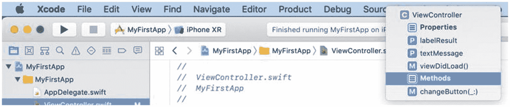
    
    *图 4-11. 用于跳转到当前打开的 `.swift` 文件中不同部分的弹出菜单*

5.  点击 `Properties`。Xcode 会高亮 `// MARK: Properties` 这一行。

6.  再次点击出现在 `ViewController.swift >` 之后的最后一个项，以显示弹出菜单。

7.  点击 `Methods`。Xcode 会高亮 `// MARK: Methods` 这一行。

在我们当前这个简短的 `ViewController.swift` 文件中，使用 `// MARK:` 注释可能并非必需，但在一个包含大量 Swift 代码的大文件中，你可以看到，将一个大文件划分为命名部分，会使查找和跳转到 `.swift` 文件的特定部分变得更快、更容易。

即使你没有在任何一个 `.swift` 文件中添加 `// MARK:` 注释，你仍然可以点击层级列表中的项来跳转到 `.swift` 文件的不同部分。在图 4-11 中，不用点击（由 `// MARK:` 注释定义的） `Properties` 或 `Methods`，你可以轻松点击不同的属性（`labelResult` 或 `textMessage`）或不同的方法（`viewDidLoad` 或 `changeButton`）来跳转到 `.swift` 文件中的相应位置。


## 重命名和删除 IBOutlet 变量

当需要将 Swift 代码链接到用户界面对象时，你需要创建一个代表该用户界面对象的 `IBOutlet` 变量，例如：

```
@IBOutlet var petLabel: UILabel!
```

如果你想重命名一个 `IBOutlet`，你可能会认为只需编辑 `IBOutlet` 变量名即可，但如果这样做，运行项目时就会报错。问题在于，如果你在 `.swift` 文件中重命名了 `IBOutlet`，Connections Inspector（连接检查器）仍然在寻找与之前 `IBOutlet` 名称的连接。

要重命名 `IBOutlet` 变量，你必须让 Xcode 使用 Refactor（重构）命令，同时在 `.swift` 文件和 Connections Inspector 面板中更改 `IBOutlet` 名称。

要了解 Refactor 命令如何重命名 `IBOutlet`，请按照以下步骤操作：

1. 在 Xcode 中打开 `MyFirstApp` 项目。
2. 在导航面板中点击 `ViewController.swift` 文件。
3. 选中 `textMessage` 这个 `IBOutlet`。你可以手动选中整个 "textMessage" 名称，或者直接双击它来选中。确保整个 "textMessage" 处于被选中状态。
4. 选择 Editor（编辑器）➤ Refactor（重构）➤ Rename（重命名），如图 4-12 所示。Xcode 会高亮显示项目中所有找到选中文本（如 "textMessage"）的区域，如图 4-13 所示。

   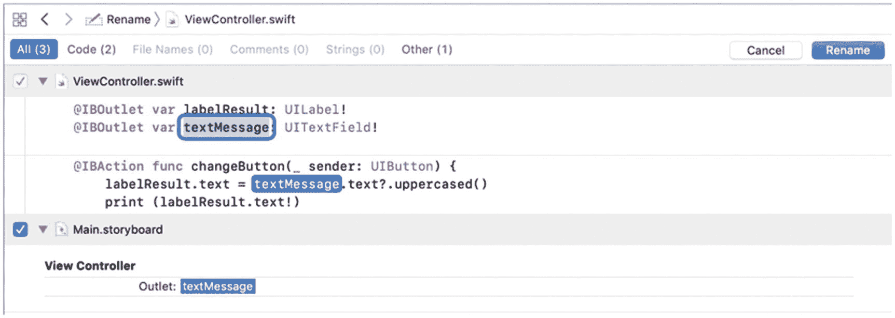

   **图 4-13.** Refactor 命令让 Xcode 在整个项目中重命名文本

   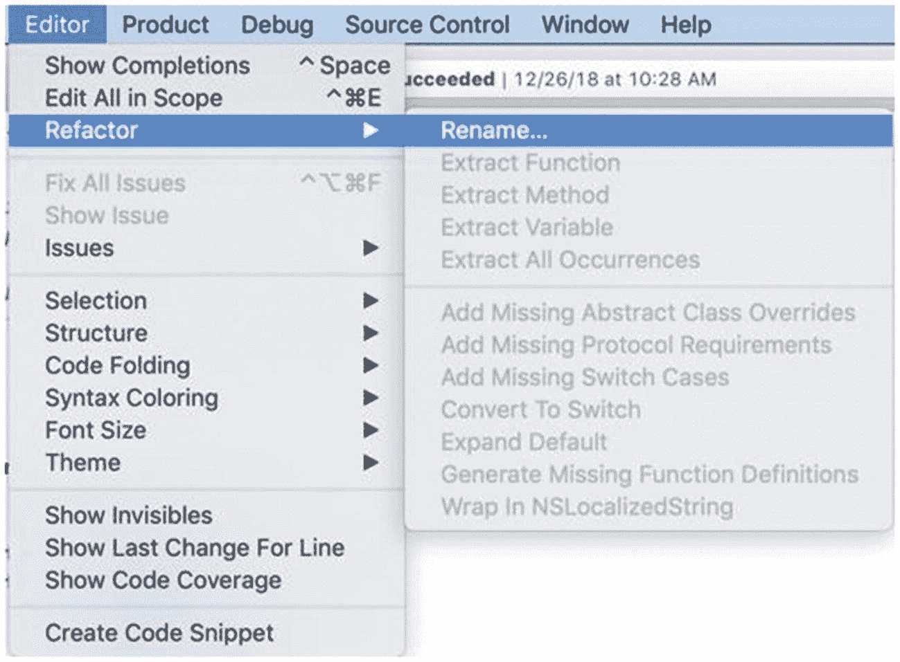

   **图 4-12.** Refactor 命令出现在 Editor 菜单中

5. 编辑 `textMessage` 这个 `IBOutlet`，将其名称改为 `textDisplay`。
6. 点击中间 Xcode 面板右上角的 Rename（重命名）按钮。Xcode 会自动重命名你的 `IBOutlet`，并将项目中所有 "textMessage" 改为 "textDisplay"。
7. 在导航面板中点击 `Main.storyboard`，然后点击文本字段（该字段已链接到现名为 "textDisplay" 的 `IBOutlet` 变量）。
8. 选择 View（视图）➤ Inspectors（检查器）➤ Show Connections Inspector（显示连接检查器），或点击 Xcode 窗口右上角的 Connections Inspector 图标。注意，Connections Inspector 现在显示的是连接到名为 "textDisplay" 的 `IBOutlet`，如图 4-14 所示。

   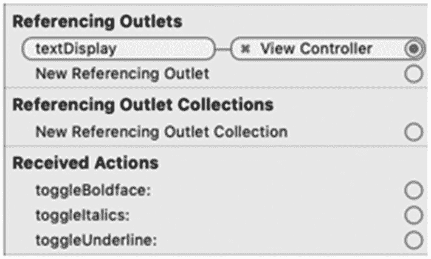

   **图 4-14.** Connections Inspector 显示更新后的 `IBOutlet` `textDisplay`

如果你想要删除一个可能拼写错误或不再需要的 `IBOutlet`，会发生什么？你可能会认为只需从 `.swift` 文件中删除该 `IBOutlet` 即可，但如果这样做并尝试运行项目，就会报错。

要删除 `IBOutlet` 变量，你必须遵循两个步骤：

- 首先，你必须在 `.swift` 文件中删除 `IBOutlet` 变量。
- 其次，你必须在 Connections Inspector 面板中断开该 `IBOutlet` 的连接。

要断开用户界面对象与其 `IBOutlet` 变量之间的连接，请按照以下步骤操作：

1. 点击包含要删除的 `IBOutlet` 的 `.swift` 文件。
2. 选中该 `IBOutlet` 并按 BACKSPACE 或 DELETE 键。这会从 `.swift` 文件中删除该 `IBOutlet`，但我们仍然需要断开它与用户界面对象的连接。
3. 在导航面板中点击 `Main.storyboard`。
4. 点击链接到该 `IBOutlet` 的用户界面对象。
5. 选择 View（视图）➤ Inspectors（检查器）➤ Show Connections Inspector（显示连接检查器），或点击 Xcode 窗口右上角的 Connections Inspector 图标。Connections Inspector 面板会显示 `IBOutlet` 名称及其所连接的 `.swift` 文件，如图 4-15 所示。

   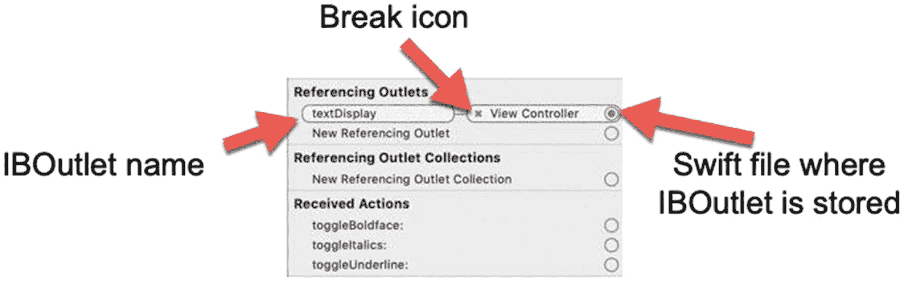

   **图 4-15.** Connections Inspector 显示 `IBOutlet` 名称及其所连接的 `.swift` 文件

6. 点击 X 图标来断开连接。

## 总结

Xcode 是你编辑 Swift 代码、设计用户界面以及测试应用是否正常运行所需的唯一工具。通过熟悉 Xcode，你可以学会如何利用其不同功能，让查看文件和编辑 Swift 代码变得更加轻松便捷。

调整 Xcode 外观最简单的方法是临时隐藏导航面板、检查器面板或调试区域。Xcode 提供了多种隐藏和显示这些不同区域的方式，因此你可以选择自己最喜欢的方法。

与其一直依赖 Xcode 的下拉菜单，你可能会发现使用工具栏上的图标更方便，只需单击即可访问常用命令，例如 Run（运行应用）、Stop（退出应用）、Assistant Editor（打开助理编辑器）或显示/隐藏导航面板/调试区域/检查器面板。

如果你发现自己经常在文件之间来回切换，可能需要显示标签栏。这样你就可以打开两个或多个标签页来代表不同的文件，从而无需反复通过导航面板即可点击并打开每个文件。

如果项目因错误信息而无法运行，但你的 Swift 代码看起来没问题，请检查所有用户界面对象之间的连接。如果连接过多（或不足），你可能需要断开一些现有连接，然后重新链接或重命名你的 `IBOutlet`，使 `.swift` 文件中的名称与 Connections Inspector 面板中显示的名称完全一致。

Xcode 是一个功能强大、专业的编程工具，所以请花些时间熟悉 Xcode 更常用的功能，对于你不理解或不需要的功能，可以随意忽略。随着你对 Xcode 越来越熟悉，你会逐渐了解并需要它的一些更高级的功能。请记住，很少有人需要用到 Xcode 的所有功能。你使用 Xcode 越多，久而久之，用起来就会越得心应手。

