# 5. 使用控制器

俗话说，第一印象只有一次机会。在应用开发领域，第一印象总是通过应用的用户界面来传达。如果用户界面凌乱、设计拙劣或令人困惑，那么你的应用无论多么实用、有趣和富有创意都无关紧要。如果用户不喜欢你应用的界面，其他一切都不再重要。

设计用户界面既是一门艺术，也是一门科学。一般来说，最佳的用户界面是那种似乎无形的界面。始终记住，完成同一项任务会有多种方法，因此要创建并测试截然不同的用户界面设计，看看哪一种最适合你的特定应用。

例如，考虑放大图片的任务。在桌面电脑的传统用户界面中，用户界面可以显示一个菜单列表供用户选择。然后，在选择了正确的菜单后，用户可以选择一个命令来放大图片。接着，可能会弹出一个对话框，让用户选择放大图片的比例。

虽然这种类型的用户界面可能有效，但它显然比在屏幕上捏合手指并分开指尖来放大图片更加笨拙且不够直观。最佳的用户界面通常是那种只需最少的步骤就能完成所需任务的界面。

## 理解控制器

任何应用的视觉部分就是其用户界面，它是通过使用一个或多个控制器来创建的。每个控制器包含两个部分：

- 作为用户界面一部分显示的实际视图
- 一个 `.swift` 文件，其中包含用于向用户界面检索和显示数据的 Swift 代码（`IBOutlet`），或用于运行 Swift 代码以响应用户操作的函数（`IBAction` 函数）

视图会填满 iOS 设备的整个屏幕。要创建用户界面，你需要在视图中添加按钮、文本框和标签等对象。要控制这些用户界面对象，你需要使用存储在与该视图关联的 `.swift` 文件中的 Swift 代码。

Xcode 提供了几种不同类型的控制器，你可以用它们来创建应用的用户界面，如图 5-1 所示：

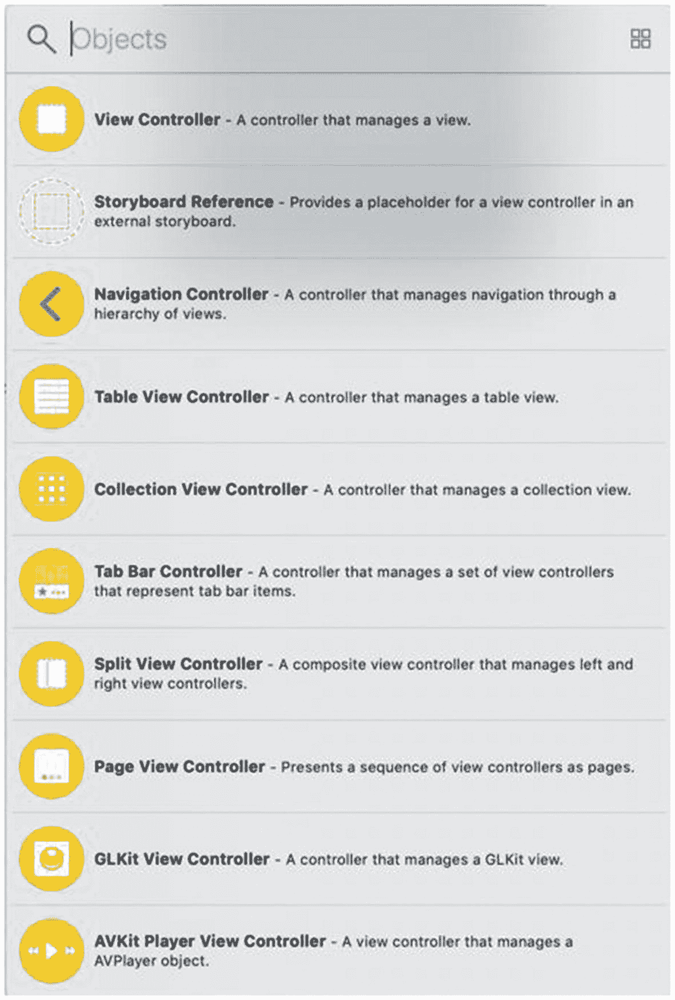

图 5-1. 可用于创建用户界面的不同类型控制器

- **视图控制器（View Controller）** – 显示一个空白屏幕
- **导航控制器（Navigation Controller）** – 在屏幕上显示其他视图，并在左上角自动显示返回按钮
- **表格视图控制器（Table View Controller）** – 在屏幕上显示一个表格视图
- **集合视图控制器（Collection View Controller）** – 在屏幕上显示一个集合视图
- **标签栏控制器（Tab Bar Controller）** – 在屏幕上显示其他视图，可通过屏幕底部的标签页进行访问
- **分栏视图控制器（Split View Controller）** – 同时在屏幕上显示两个视图
- **页面视图控制器（Page View Controller）** – 像书本中的页面一样显示其他视图
- **GLKit 视图控制器（GLKit View Controller）** – 显示一个用于展示基于 OpenGL 跨平台图形库的图形的视图（Apple 已基本转向自家 Metal 图形库，因此 OpenGL 已基本过时，仅为仍在使用 OpenGL 的旧应用提供向后兼容性。）
- **AVKit 播放器视图控制器（AVKit Player View Controller）** – 显示一个用于在屏幕上播放视频的视图

对象库中显示了所有可用的控制器，你可以添加它们来创建用户界面，不过你可能不需要所有这些不同类型的控制器。你可以随时修改任何控制器来显示标签栏、表格或其他项目，因此既可以使用基本的视图控制器并对其进行修改，也可以使用**分栏视图控制器**或**表格视图控制器**等专用控制器来设计完全相同的用户界面。从专用控制器入手，能让你立刻获得特定功能。

要了解如何添加（和删除）控制器来创建用户界面，请按以下步骤操作：

1.  使用**单视图应用（Single View App）**模板创建一个新的 iOS 项目（参见第 1 章），并将这个新项目命名为 `MySecondApp`。这将为用户界面创建一个单独的视图。

2.  在导航面板中点击 `Main.storyboard` 文件。Xcode 会显示这个单独的视图。

3.  如果文档大纲未显示，请选择 **编辑器（Editor）➤ 显示文档大纲（Show Document Outline）**，或点击文档大纲图标。

4.  如图 5-2 所示，在文档大纲中点击 **视图控制器（View Controller）**。

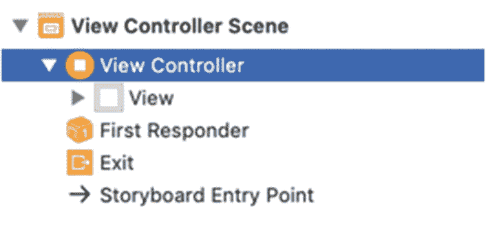

图 5-2. 选择一个视图控制器

5.  按下 `BACKSPACE` 或 `DELETE` 键。Xcode 会从故事板中删除整个视图控制器。此时，你的应用就没有用户界面了。

6.  点击**库（Library）**图标以打开对象库窗口（见图 5-1）。

7.  如图 5-3 所示，将一个**视图控制器**从库窗口拖放到 Xcode 中。Xcode 会在故事板中显示新的视图控制器。如果你现在运行应用，这个视图不会出现在屏幕上，因为我们需要让这个视图成为第一个显示的视图，也称为**初始视图控制器（Initial View Controller）**。

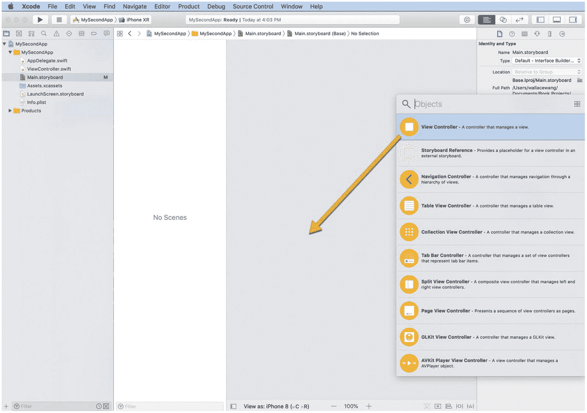

图 5-3. 将一个视图控制器拖入 `Main.storyboard` 文件

8.  在文档大纲中点击**视图控制器**以将其选中，然后选择 **视图（View）➤ 检查器（Inspectors）➤ 显示属性检查器（Show Attributes Inspector）**，或点击检查器面板顶部的**显示属性检查器**图标。

9.  如图 5-4 所示，勾选**是初始视图控制器（Is Initial View Controller）**复选框。当**是初始视图控制器**复选框被选中时，会有一个箭头指向视图控制器的左侧，以显示哪个视图是初始视图控制器，也就是应用运行时首先出现的视图。下一步是将此视图控制器连接到现有的 `ViewController.swift` 文件。

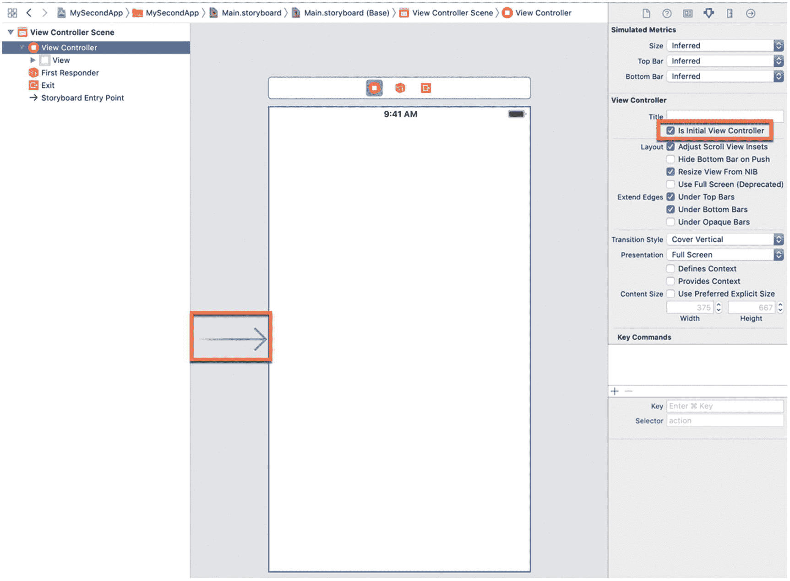

图 5-4. **是初始视图控制器**复选框

> **注意** 任何时候，只能有一个视图控制器作为初始视图控制器。

10. 在文档大纲中点击**视图控制器**以将其选中。

11. 选择 **视图（View）➤ 检查器（Inspectors）➤ 显示身份检查器（Show Identity Inspector）**，或点击检查器面板顶部的**显示身份检查器**图标。

12. 点击**类（Class）**文本框右侧出现的向下箭头。会弹出一个菜单。向下滚动此菜单，直到找到 `ViewController`，如图 5-5 所示。

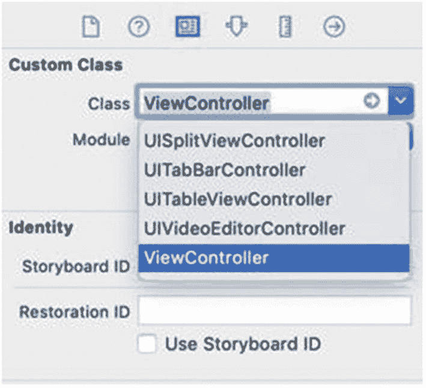

图 5-5. 选择连接到视图控制器的 `.swift` 类文件

至此，你已经删除了一个视图控制器，添加了一个新的控制器，将其设置为初始视图，并将其连接到了 `ViewController.swift` 文件。

## 使用多个控制器

一个简单的 iOS 应用可能只包含单个视图，比如计算器应用。然而，大多数应用会包含两个或更多控制器，用于在屏幕上显示不同的视图。这意味着你需要了解如何在构成 iOS 应用用户界面的故事板中处理多个控制器。

当故事板包含两个或更多控制器时，你需要定义一个作为初始视图控制器，这是应用运行时显示的第一个屏幕。要了解其工作原理，请按以下步骤操作：

1.  确保你的 `MySecondApp` 项目已加载到 `Xcode` 中。
2.  在导航器面板中点击 `Main.storyboard` 文件。
3.  点击资料库图标以显示对象库。
4.  将一个第二个视图控制器拖放到故事板上，如图 5-6 所示。
   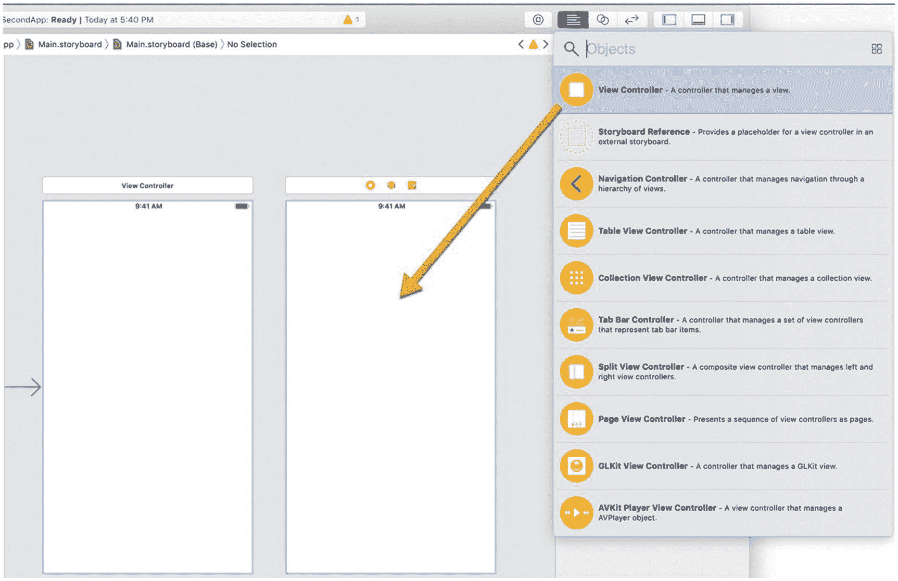
   *图 5-6. 向故事板添加第二个视图控制器*
5.  在文档大纲中，点击你刚刚添加的第二个视图控制器下方的视图。
6.  选择“视图”➤“检查器”➤“显示属性检查器”，或点击检查器面板顶部的属性检查器图标。
7.  点击背景弹出菜单以显示调色板，如图 5-7 所示。
   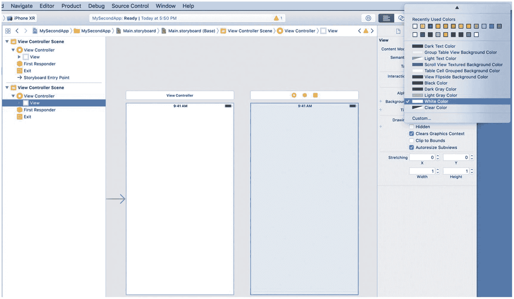
   *图 5-7. 更改视图控制器的背景颜色*
8.  点击一种颜色，例如蓝色或黄色。目标是选择一种不同于白色的背景颜色，以便在运行应用时轻松看出哪个控制器出现。`Xcode` 会将你选择的颜色显示在视图中。现在，让这个彩色视图作为初始视图控制器，以便应用首次运行时显示它。
9.  点击第二个视图控制器，它包含你在步骤 8 中选择的带有彩色背景的视图。
10. 将箭头从第一个控制器拖到第二个控制器。（你也可以选择“视图”➤“检查器”➤“显示属性检查器”，然后选中“是初始视图控制器”复选框。）初始视图控制器箭头现在应指向背景非白色的视图控制器，如图 5-8 所示。
    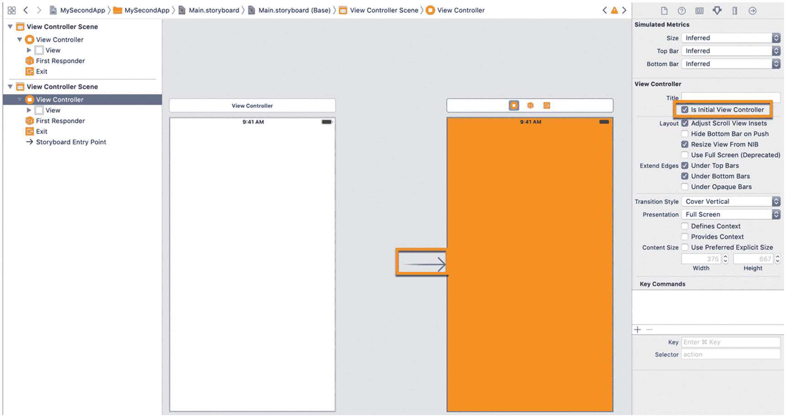
    *图 5-8. 更改初始视图控制器*
11. 点击“运行”按钮或选择“产品”➤“运行”。模拟器会运行你的应用。注意，彩色视图出现了。
12. 选择“模拟器”➤“退出模拟器”以返回 `Xcode`。
13. 将箭头从第二个（彩色）控制器拖到第一个（白色背景）控制器。
14. 点击“运行”按钮或选择“产品”➤“运行”。模拟器会出现。注意，白色背景出现了。
15. 选择“模拟器”➤“退出模拟器”以返回 `Xcode`。

## 在控制器之间切换

目前我们的应用有两个控制器，但任意时刻只能有一个显示（即定义为初始视图控制器的那个）。要让应用在运行时显示多个视图，你有几种选择。首先，你可以手动在两个控制器之间创建链接。其次，你可以将两个或更多控制器放置在导航控制器或标签栏控制器内。

要了解如何手动连接控制器，请按以下步骤操作：

1.  确保 `MySecondApp` 项目已加载到 `Xcode` 中。
2.  在导航器面板中点击 `Main.storyboard` 文件。`Xcode` 会显示两个现有视图，其中一个为白色背景，另一个为彩色背景。应有一个箭头指向白色视图，表明这是应用运行时出现的初始视图控制器。
3.  点击资料库图标以显示对象库窗口。然后将一个按钮拖放到第一个（白色背景）控制器的视图上。（按钮的具体位置无关紧要。）
4.  将鼠标指针移到这个按钮上，按住 Control 键，然后按住 Ctrl 键将鼠标拖到第二个视图上，`Xcode` 会高亮显示该视图，如图 5-9 所示。（另一种做法是，你也可以从按钮按住 Ctrl 键拖到文档大纲中的第二个视图控制器，如图 5-10 所示。）
   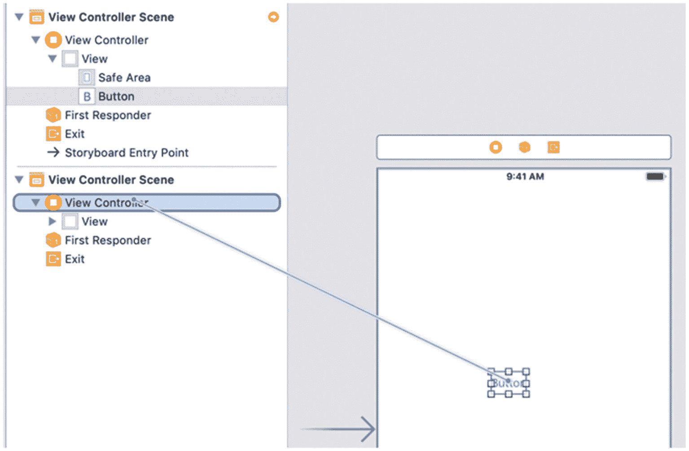
   *图 5-10. 从按钮按住 Ctrl 键拖到文档大纲中的另一个视图控制器，同样会创建 segue 链接*
   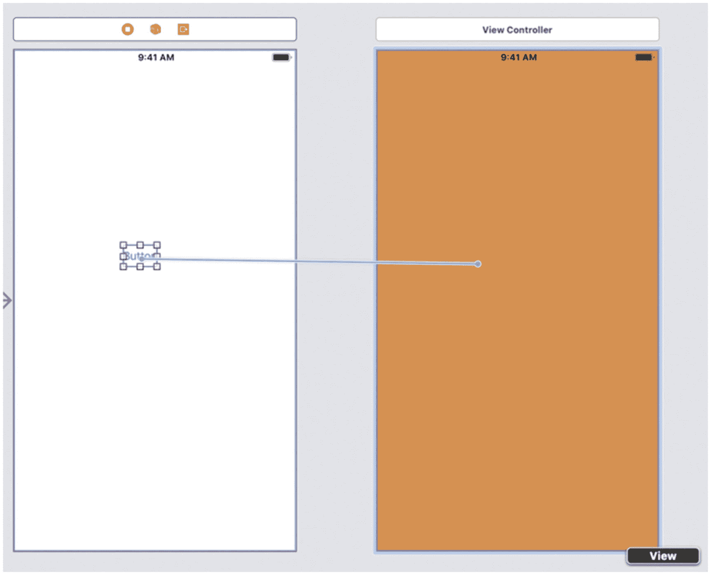
   *图 5-9. 从按钮按住 Ctrl 键拖到另一个视图会创建 segue 链接*
5.  松开鼠标左键和 Control 键。会出现一个弹出菜单，如图 5-11 所示。
   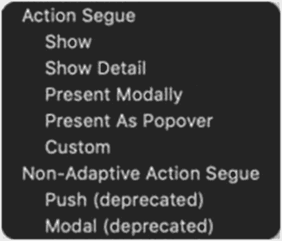
   *图 5-11. 按住 Ctrl 键拖动后，会出现一个菜单用于定义如何显示下一个控制器*
6.  选择 `Show`。`Xcode` 会在两个控制器之间创建一个 segue。
7.  点击该 segue 以选中它。然后选择“视图”➤“检查器”➤“显示属性检查器”，或点击检查器面板顶部的属性检查器图标。注意，“种类”弹出菜单允许你定义 segue，如图 5-12 所示。
   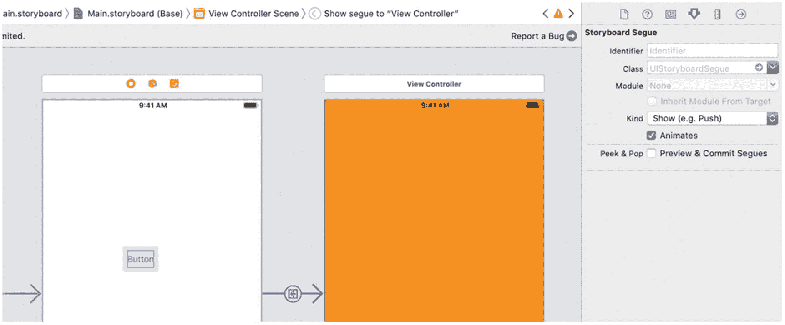
   *图 5-12. segue 的属性检查器可让你更改 segue 的类型*
8.  再次点击资料库图标以显示对象库窗口。然后将一个按钮拖放到第二个（彩色）视图上的任意位置。
9.  从彩色视图上的这个按钮按住 Ctrl 键拖到第一个（白色）控制器。松开 Control 键和鼠标左键以显示弹出菜单（参见图 5-11）。
10. 选择 `Show`。`Xcode` 会创建第二个 segue，将两个控制器连接在一起，如图 5-13 所示。在运行此应用之前，我们需要确保故事板选择的 iOS 设备与模拟器选择的 iOS 设备一致。
    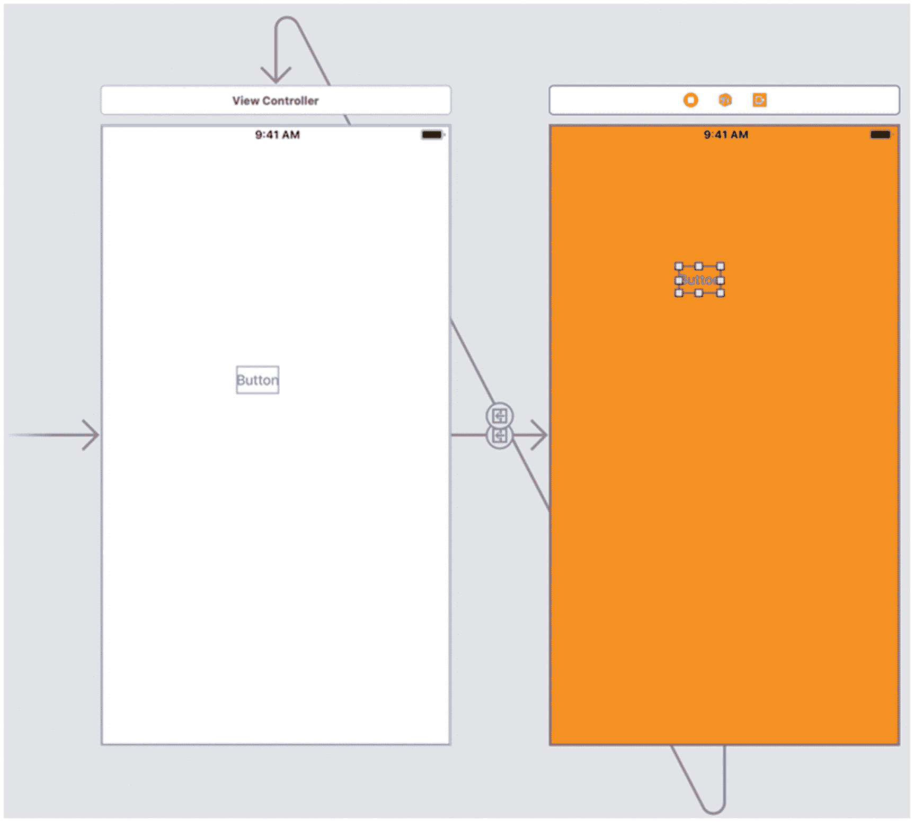
    *图 5-13. 故事板中通过两个 segue 连接在一起的两个控制器*
11. 查看中间 Xcode 面板底部，了解你的故事板当前模拟的是哪种 iOS 设备。在图 5-14 中，故事板模拟的是 iPhone 8。你可以点击此“视图为：”文本，显示不同的 iOS 设备进行模拟。
    

图 5-14. 识别 Storyboard 模拟的 iOS 设备

12.  查看 Xcode 窗口左上角，找到模拟器将模拟的 iOS 设备，如图 5-15 所示。

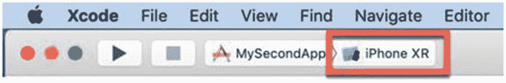
图 5-15. 识别模拟器模拟的 iOS 设备

13.  确保模拟器的 iOS 设备与 storyboard 的 iOS 设备匹配。如果不匹配，请点击模拟器当前模拟的 iOS 设备，弹出菜单。然后点击与 storyboard iOS 设备匹配的 iOS 设备（例如图 5-14 中的 iPhone 8）。
14.  点击 `Run` 按钮或选择 `Product` ➤ `Run`。模拟器出现，显示白色控制器及其按钮。
15.  点击白色视图中的按钮。彩色控制器视图出现。
16.  点击彩色视图中的按钮。白色控制器视图再次出现。重复步骤 15 和 16，查看按钮和 Segue 如何让您从一个视图切换到另一个视图。
17.  选择 `Simulator` ➤ `Quit Simulator` 返回 Xcode。

### 嵌入导航控制器

手动将两个控制器连接起来是可行的，但创建起来可能比较笨拙。作为替代方案，您可以使用导航控制器。导航控制器包含其他控制器，并负责让用户在两个控制器之间来回导航。这样，您无需在两个控制器上都添加按钮来让用户来回切换。

如果您已经在 storyboard 中有两个或更多控制器，可以将它们嵌入到导航控制器中。要了解如何将现有控制器嵌入到导航控制器中，请按照以下步骤操作：

1.  确保 MySecondApp 项目已在 Xcode 中加载。
2.  在导航器窗格中点击 `Main.storyboard` 文件。
3.  在文档大纲中点击第一个视图控制器场景（背景为白色的那个）以将其选中，如图 5-16 所示。

    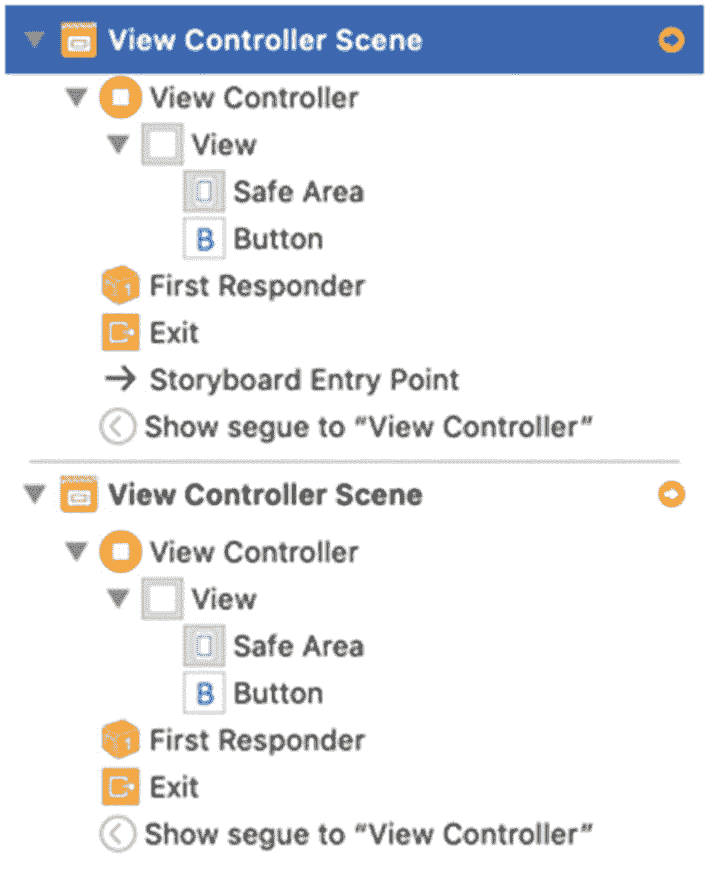
    图 5-16. 在文档大纲中选择第一个视图控制器

4.  选择 `Editor` ➤ `Embed In` ➤ `Navigation Controller`。Xcode 在 storyboard 中显示一个导航控制器，如图 5-17 所示。

    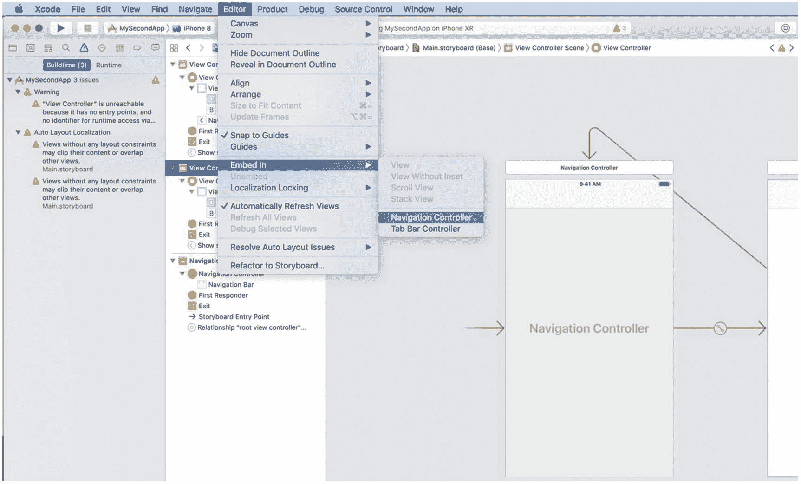
    图 5-17. 将现有控制器嵌入到导航控制器中

5.  点击 `Run` 按钮或选择 `Product` ➤ `Run`。模拟器出现，显示带有按钮的第一个（白色）控制器。
6.  点击按钮。注意，第二个（彩色）控制器滑入视图，并在左上角显示一个 `< Back` 按钮，如图 5-18 所示。

    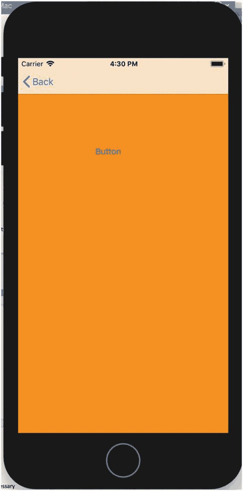
    图 5-18. 导航控制器显示一个 `< Back` 按钮，用于返回上一个视图

7.  点击左上角的 `< Back` 按钮。注意，第一个（白色）控制器再次出现。重复步骤 6 和 7，查看导航控制器如何让您前进到彩色控制器，再返回到白色控制器。
8.  选择 `Simulator` ➤ `Quit Simulator` 返回 Xcode。

## 使用导航控制器

从 Editor 菜单中选择 `Embed In` 命令是向 storyboard 添加导航控制器的一种方法。第二种方法是从对象库窗口中添加导航控制器。当您从对象库添加导航控制器时，还会添加一个表视图控制器，您需要将其删除。然后，您需要将导航控制器连接到现有控制器，并确保导航控制器是初始视图控制器。

要了解如何从对象库添加导航控制器，请按照以下步骤操作：

1.  确保 MySecondApp 项目已在 Xcode 中加载。
2.  在导航器窗格中点击 `Main.storyboard` 文件。
3.  在文档大纲中点击导航控制器场景，然后按 `BACKSPACE` 或 `DELETE` 键，从 storyboard 中删除现有的导航控制器。
4.  点击库图标以打开对象库窗口。
5.  将一个导航控制器拖放到 storyboard 上。这将会包含一个导航控制器和一个表视图控制器，如图 5-19 所示。

    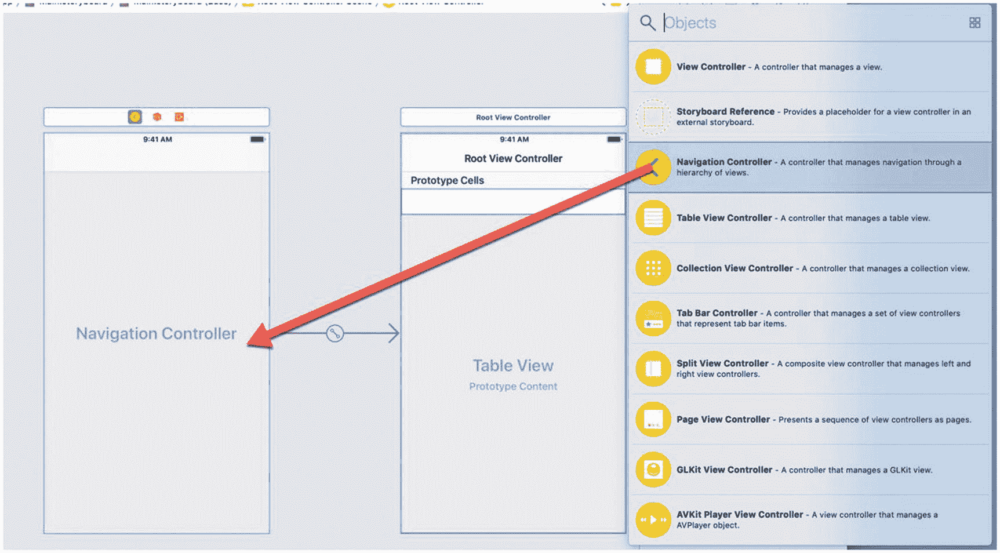
    图 5-19. 从对象库窗口添加导航控制器

6.  在文档大纲中点击根视图控制器场景，然后按 `BACKSPACE` 或 `DELETE` 删除当前链接到导航控制器的控制器。
7.  在文档大纲中点击导航控制器场景以将其选中。
8.  选择 `View` ➤ `Inspectors` ➤ `Show Attributes Inspector`，或点击检查器窗格顶部的属性检查器图标。
9.  选中 `Is Initial View Controller` 复选框。这会使导航控制器成为应用运行时首先出现的控制器。
10. 将鼠标指针移动到导航控制器的中间，按住 `Control` 键，然后 Ctrl-拖拽到背景为白色的控制器中间，如图 5-20 所示。

    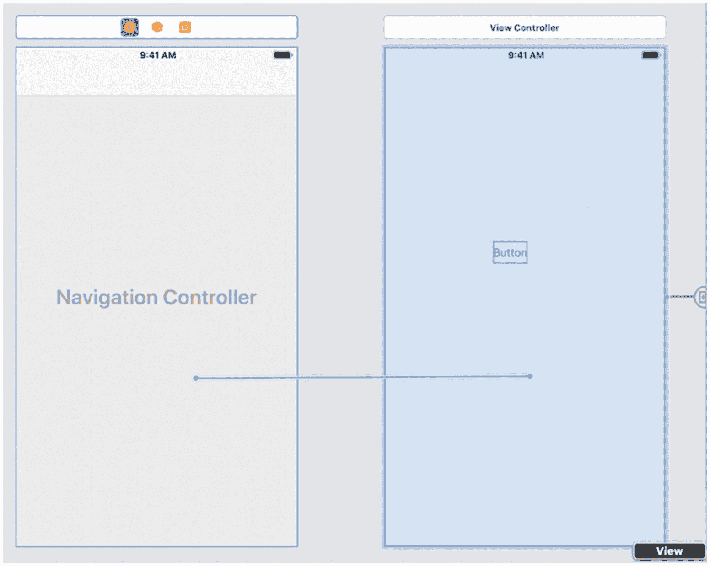
    图 5-20. 将导航控制器连接到现有控制器

11. 松开 `Control` 键和鼠标左键。出现一个弹出菜单，如图 5-21 所示。

    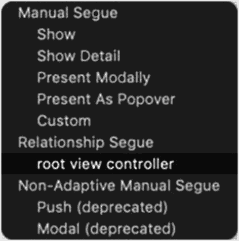
    图 5-21. 出现一个弹出菜单，用于定义导航控制器与其他控制器之间的 Segue

12. 在 `Relationship Segue` 分类下选择 `root View Controller`。
13. 点击 `Run` 按钮或选择 `Product` ➤ `Run`。第一个视图（白色背景）出现在模拟器中。
14. 点击视图上的按钮。第二个控制器（彩色背景）出现。注意，导航控制器现在在左上角显示 `< Back` 按钮。
15. 点击 `< Back` 按钮返回第一个控制器。重复步骤 14 和 15，查看如何在两个不同视图之间来回移动。
16. 选择 `Simulator` ➤ `Quit Simulator`。

## 总结

最简单的 iOS 应用仅包含单个视图，但大多数应用可能需要多个视图。当 storyboard 中有多个控制器时，必须指定一个控制器作为初始视图控制器，这是应用运行时最先出现的控制器。一次只能有一个控制器作为初始视图控制器。

要更改在任意给定时间显示哪个控制器，可以在控制器之间创建称为 Segue 的链接。要创建 Segue，您可以按住 `Control` 键从按钮等对象拖拽鼠标到另一个控制器。但是，手动创建 Segue 可能很繁琐，因此另一种替代方案是使用导航控制器。

导航控制器包含或嵌入其他控制器。这样，其他控制器可以专注于显示信息，而导航控制器则专注于为用户提供返回上一个控制器的方式。

