# 6. 添加用户界面对象

控制器包含出现在 iOS 屏幕上的用户界面。在最简单的层面上，一个控制器可以包含一个视图，该视图代表一个 iOS 屏幕。默认情况下，这个视图是空白的，因此要让它显示信息或为用户提供交互，您可以添加各种用户界面对象，例如按钮、文本字段、标签或滑块。

用户界面对象通常执行两种不同的任务。其一，它们要么显示信息，要么允许用户输入信息。用于显示或允许输入的常见用户界面对象类型包括文本字段和标签。

其二，它们为用户提供一种与用户界面交互以发出指令的方式。交互式用户界面对象的示例包括按钮、滑块和开关。

要将对象放置在用户界面上，您必须打开“对象库”窗口并拖放一个对象。然后，您需要通过 `IBOutlet` 属性或 `IBAction` 方法将大多数对象连接到一个 `.swift` 文件。无论您向用户界面添加什么类型的对象，都需要调整以下内容：

-   大小
-   位置
-   其他属性，例如颜色、显示的文本等。

每个用户界面对象都提供多个可修改的属性，但您可能不需要修改所有属性。您可以通过“检查器”面板或 Swift 代码来修改对象的属性。

## 更改对象的大小和位置

将对象放置在用户界面上后，您可以使用鼠标更改其大小或位置，或者通过为其高度和宽度或从视图左上角测量的 X 和 Y 值（如图 6-1 所示）定义特定值来更改。

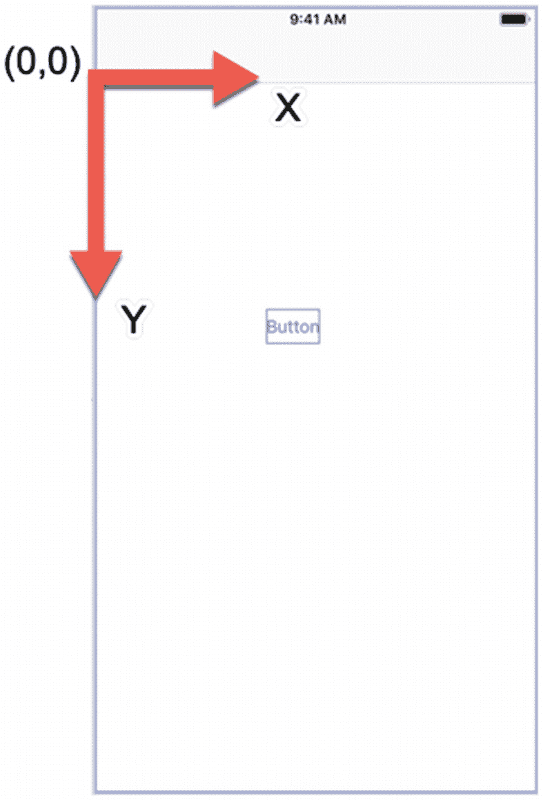

图 6-1 从左上角测量对象的 X 和 Y 位置

通过使用鼠标，您可以轻松更改对象的大小或位置，但为对象的高度、宽度、X 和 Y 值定义特定值可以让您精确控制该对象的大小和位置。

要了解如何更改用户界面上对象的大小和位置，请按照以下步骤操作：

1.  使用“单视图应用”模板（参见第 1 章）创建一个新的 iOS 项目，并将此新项目命名为 `ObjectApp`。这会为用户界面创建一个单独的视图。

2.  在导航器面板中单击 `Main.storyboard` 文件。Xcode 会显示该单一视图。

3.  确保 Xcode 中间面板底部的“视图方式：”文本显示为 iPhone 8，如图 6-2 所示。

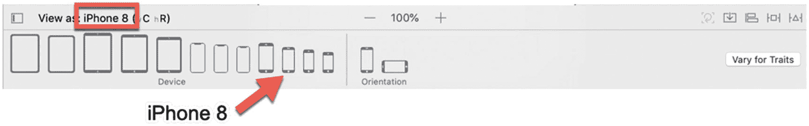

图 6-2 定义您的故事板用户界面以模拟 iPhone 8 屏幕

4.  单击“库”图标以打开“对象库”窗口。

5.  将一个按钮拖放到视图上的任意位置。按钮周围会出现手柄，如图 6-3 所示。任何时候您选择一个对象，手柄都会出现以显示您选择了哪些对象。

图 6-3 手柄出现在选中的对象周围

6.  将鼠标指针移到按钮周围的手柄上，直到鼠标指针变成双向箭头。

7.  拖动鼠标以调整按钮大小，使其变得更宽或更窄、更高或更短。当您更改对象的大小时，Xcode 会在该对象的左上角显示其当前宽度和高度，如图 6-4 所示。

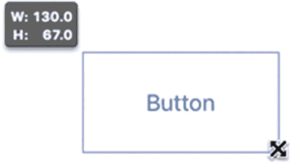

图 6-4 拖动鼠标时查看对象的高度和宽度

8.  确保手柄仍然出现在按钮周围。（如果没有，请单击按钮以将其选中。）

9.  选择“视图”➤“检查器”➤“大小检查器”，或单击“检查器”面板顶部的“大小检查器”图标。“大小检查器”面板中的“视图”类别会显示用于指定所选对象的高度、宽度、X 和 Y 值的文本字段，如图 6-5 所示。

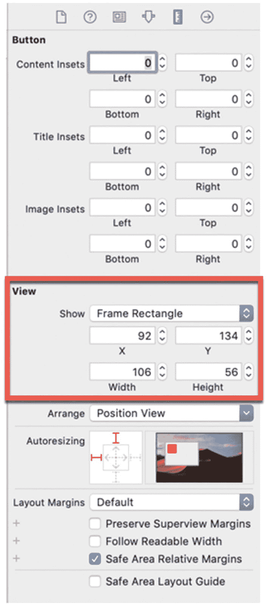

图 6-5 “视图”类别允许您在“大小检查器”面板中定义大小和位置值

10. 在“宽度”文本字段中单击，输入 `80`，然后按 ENTER 键。

11. 在“高度”文本字段中单击，输入 `30`，然后按 ENTER 键。

12. 将鼠标指针移到按钮上。当鼠标指针变成手形图标时，将按钮拖动到视图的左上角，直到看到两条蓝色参考线出现，如图 6-6 所示。

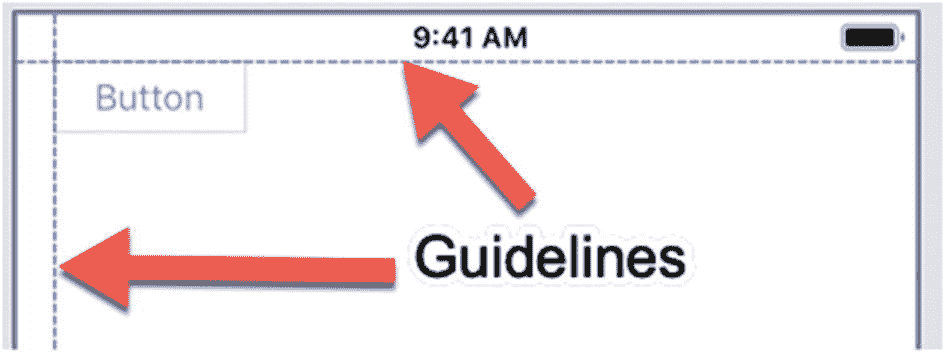

图 6-6 出现参考线以帮助您使用鼠标对齐对象

13. 松开鼠标按钮。注意，停止移动鼠标后，蓝色参考线会消失。

14. 单击 X 文本字段中的上/下箭头以更改其中显示的值。注意，当您增加 X 值时，按钮会向右移动；当您减小 X 值时，按钮会向左移动。

15. 确保 X 文本字段中显示值为 16，然后单击 Y 文本字段。

16. 单击 Y 文本字段中的上/下箭头。注意，当您增加 Y 值时，按钮会向下移动；当您减小 Y 值时，按钮会向上移动。

17. 确保 Y 文本字段中显示值为 20。注意，当您定义特定的 X 或 Y 值来定义按钮在视图上的位置时，不会出现蓝色参考线，因为只有在使用鼠标移动对象时才会显示它们。

### 更改对象的属性

每个对象都允许您定义其大小和位置，但您也可以根据对象类型修改其他属性。例如，按钮允许您更改定义按钮上显示文本的 `Title` 属性，而文本字段则具有定义文本字段内显示文本的 `Text` 属性。

若要查看不同对象如何提供不同类型的属性，请按照以下步骤操作：

1. 确保你的 `ObjectApp` 项目已在 `Xcode` 中加载。
2. 在导航器窗格中点击 `Main.storyboard` 文件。
3. 点击库图标以显示对象库。
4. 将文本字段拖放至故事板的任意位置。
5. 将鼠标指针移到文本字段上。当鼠标指针变成手形图标时，将鼠标拖动到视图左上角按钮的下方。请注意，当两个对象靠近时，会出现参考线帮助你将一个对象与另一个对象对齐，如图 6-7 所示。

   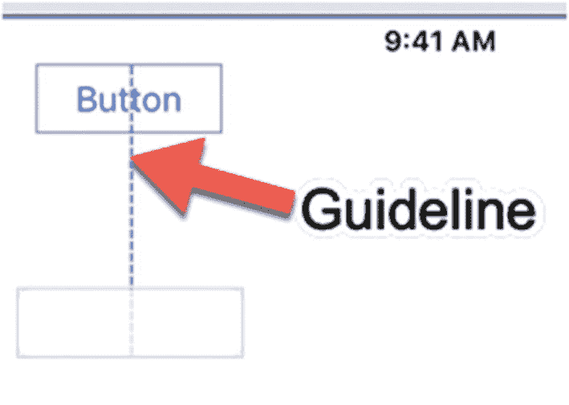

   图 6-7  
   将对象拖到另一对象附近时出现的参考线

6. 点击文本字段将其选中，使其周围出现控制柄。
7. 选择 `View ➤ Inspectors ➤ Show Attributes Inspector`，或点击检查器窗格顶部的属性检查器图标。
8. 点击 `Text` 文本字段，输入 `Hello` 并按 `ENTER` 键。请注意，文本会显示在 `Text` 文本字段以及用户界面上的文本字段中，如图 6-8 所示。

   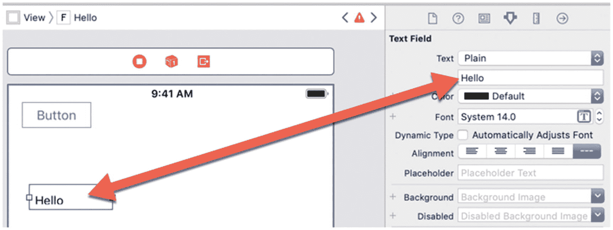

   图 6-8  
   更改文本字段的 `Text` 属性

9. 点击按钮，使其周围出现控制柄。请注意，属性检查器窗格会发生变化，以显示所选按钮的属性。
10. 点击 `Title` 文本字段，输入 `OK` 并按 `ENTER` 键。请注意，`OK` 现在也会显示在按钮上，如图 6-9 所示。

    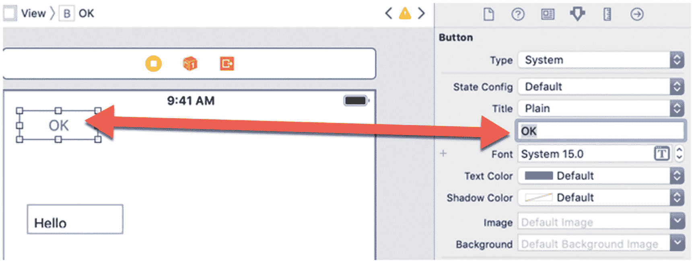

    图 6-9  
    更改按钮的 `Title` 属性

11. 点击文本字段将其选中。
12. 选择 `View ➤ Inspectors ➤ Show Size Inspector`，或点击检查器窗格顶部的大小检查器图标。
13. 点击 `X` 文本字段，输入 16，然后按 `ENTER` 键。请注意，文本字段会向左移动，靠近视图的左边界。
14. 点击 `Y` 文本字段，输入 115，然后按 `ENTER` 键。请注意，文本字段会出现在按钮下方。

### 了解安全区域

目前，你的 `ObjectApp` 用户界面在左上角包含一个按钮，其下方有一个文本字段。由于我们现在使用的故事板模仿的是 iPhone 8，因此只要在 iPhone 8 上运行，或者在模拟器中模拟 iPhone 8 时运行，用户界面看起来都会很完美。但是，如果我们将故事板切换为模仿 iPhone XR，按钮的位置突然就看起来不对劲了，如图 6-10 所示。

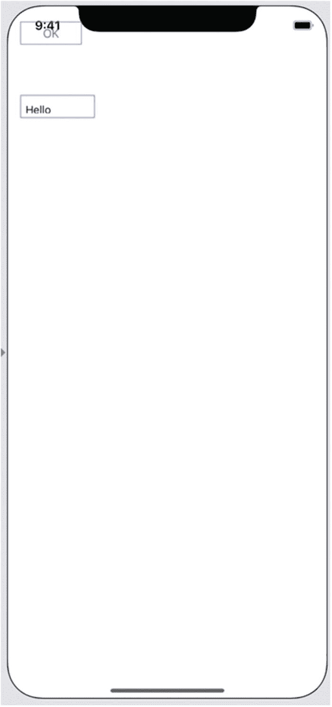

图 6-10  
在 iPhone XR 屏幕上查看 `ObjectApp` 用户界面

问题在于，我们根据 iPhone 8 的屏幕尺寸放置了按钮，但 iPhone XR 的屏幕尺寸略有不同。在设计 iOS 应用时，你永远无法预知用户会在哪种 iOS 设备上运行你的应用，可能是屏幕较小的 iPhone SE，也可能是屏幕较大的 iPad Pro。苹果每年都会推出不同尺寸的 iPhone 和 iPad，所以你永远无法预测未来的屏幕尺寸会如何变化。

为了帮助你设计出在当前及未来任何 iOS 设备上都能良好显示的 iOS 应用，`Xcode` 提供了两个功能：

- 安全区域
- 自动布局

安全区域定义了应放置用户界面对象的区域，这样它们就能在任何 iOS 设备屏幕上正确显示。要查看任何 iOS 设备的安全区域，请按照以下步骤操作：

1. 确保 `ObjectApp` 项目已在 `Xcode` 中加载。
2. 在导航器窗格中点击 `Main.storyboard` 文件以查看应用的用户界面。
3. 在文档大纲中点击 `Safe Area`。（如果文档大纲不可见，请选择 `Editor ➤ Show Document Outline`，或点击 `Xcode` 窗口底部附近的文档大纲图标。）`Xcode` 会为安全区域添加阴影，以便你查看需要放置用户界面对象的位置，如图 6-11 所示。请注意，图 6-11 中的按钮显示在安全区域之外，这就解释了它为什么看起来不对劲。

   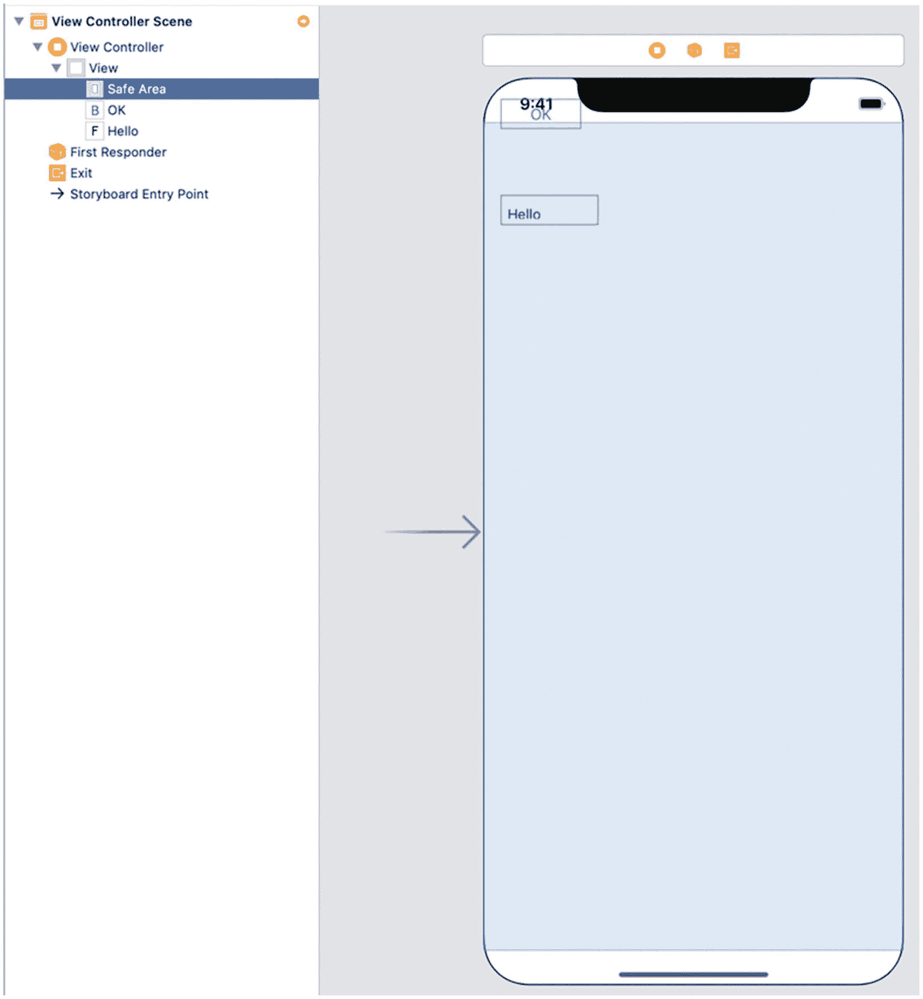

   图 6-11  
   查看 iOS 设备的安全区域

4. 点击 `Xcode` 窗口底部的“View as:”按钮，为故事板选择另一个模仿的 iOS 设备，例如 iPhone 8 Plus。请注意，之前在一个 iOS 设备上显示不正确的按钮，现在在另一个 iOS 设备上却显示正确了，如图 6-12 所示。

   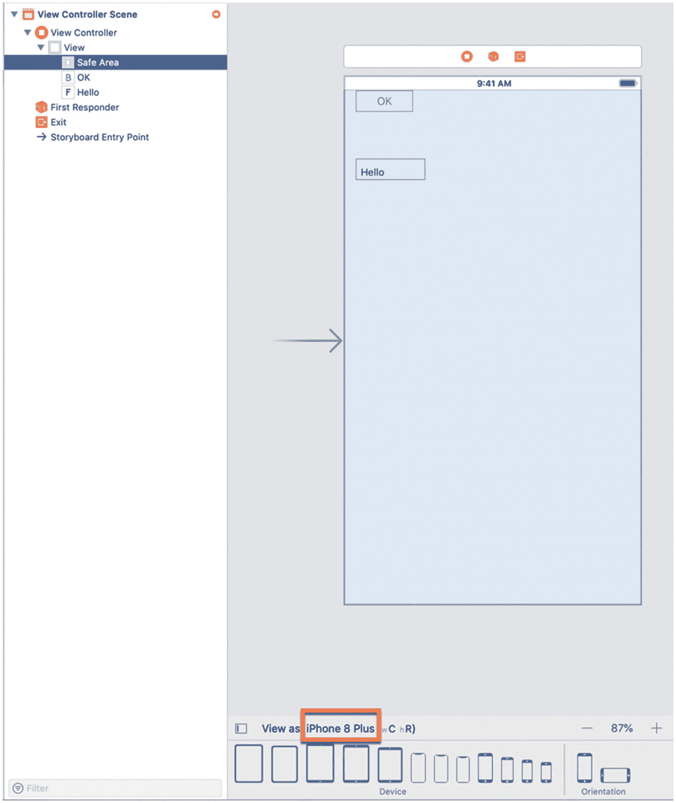

   图 6-12  
   将故事板查看为 iPhone 8 Plus

## 定义约束

由于不同的 iOS 设备具有不同的屏幕尺寸（和安全区域），正确设计用户界面的方法是使用一种名为 Auto Layout 的功能。Auto Layout 的核心思想是，你在安全区域内将对象定位在用户界面上，然后定义这些对象距离安全区域边界应该有多远。

你为用户界面对象定义的这些距离被称为**约束**。约束告诉 Auto Layout 如何在用户界面上定位对象，无论应用当时运行在什么 iOS 设备屏幕上。

约束通过定义对象之间的距离或定义对象的尺寸（宽度/高度）来工作。定义约束的不同方式包括以下这些：

- 定义一个对象与另一个对象或安全区域边界之间的特定距离，或者一个对象的特定高度或宽度。
- 定义对象可以出现在另一个对象或安全区域边界的最小或最大距离，或者对象的最小/最大高度或宽度。
- 定义一个对象的相对位置，例如在视图中垂直或水平居中。
- 定义哪些约束比其他约束具有更高的优先级。

固定约束定义了两个对象（或一个对象与安全区域边界）之间的特定尺寸或距离。这样一来，无论应用在什么 iOS 设备上运行，该对象始终与另一个对象或安全区域边界保持固定的距离。固定距离约束是使用最普遍的约束类型。

定义两个对象（或安全区域边界）之间最小或最大距离的约束允许对象根据应用运行的 iOS 设备来变化其距离。这使得用户界面能够针对更大的 iPad Pro 屏幕调整其外观，并在更小的 iPhone SE 屏幕上缩小尺寸。定义最小或最大距离的约束通常与固定距离约束一起使用。

在设计简单的用户界面时，你可能只需要设计固定距离约束。在设计更复杂的用户界面时，你可能还需要能改变对象间距离的约束。然而，你在不同的用户界面对象上放置的约束越多，产生矛盾约束的风险就越大。

当你使用两个或更多固定距离约束时，矛盾约束经常发生。例如，你可能希望一个按钮具有固定的宽度，并且距离屏幕左侧和右侧都是固定的距离。然而，在大屏和小屏 iOS 设备上，要使一个对象保持固定宽度且同时距离屏幕左右两侧固定距离是不可能的。

解决方案是为不同的约束分配优先级，让一个约束比另一个更重要。这样一来，当你的应用在不同的 iOS 设备屏幕上运行时，优先级最高的约束会先定义用户界面，然后优先级较低的约束再接着定义用户界面。

### 自动定义约束

定义约束最简单的方法是让 Xcode 自动为你完成。这种方法的缺点是 Xcode 可能并不总是按照你期望的方式为用户界面创建约束，但如果有必要，你之后总可以删除或修改它的约束。

要了解如何自动定义约束，请按照以下步骤操作：

1. 确保 Xcode 中已加载 ObjectApp 项目。
2. 在导航窗格中点击 `Main.storyboard` 文件。
3. 选择 `Editor` ➤ `Resolve Auto Layout Issues`。此时会显示一个菜单，如图 [6-13] 所示。该子菜单的上半部分适用于任何选中的对象。下半部分适用于所有对象，无论你是否选中它们。

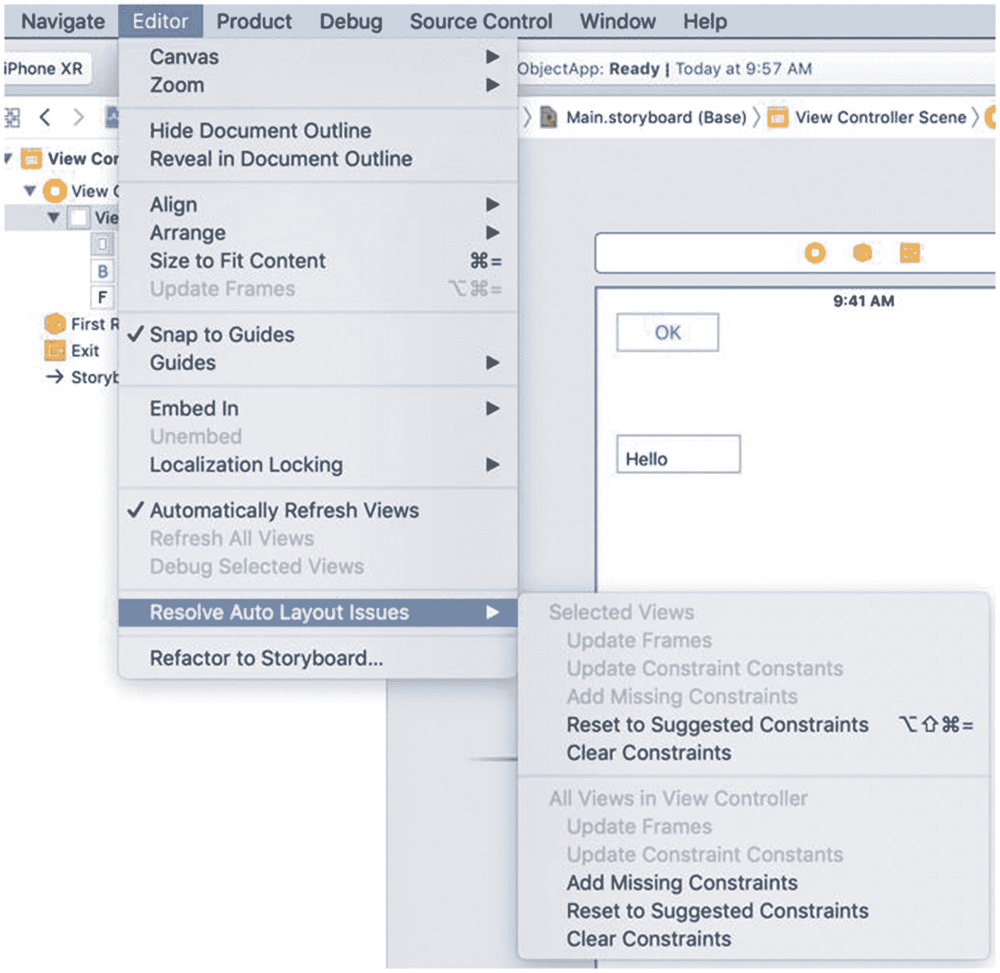

图 6-13  
`Resolve Auto Layout Issues` 子菜单

4. 在子菜单的下半部分选择 `Add Missing Constraints`。
5. 按住 SHIFT 键并点击按钮和文本字段，使两个对象周围出现手柄。注意 Xcode 会将约束显示为线，用于定义对象之间的距离或安全区域边界，如图 [6-14] 所示。

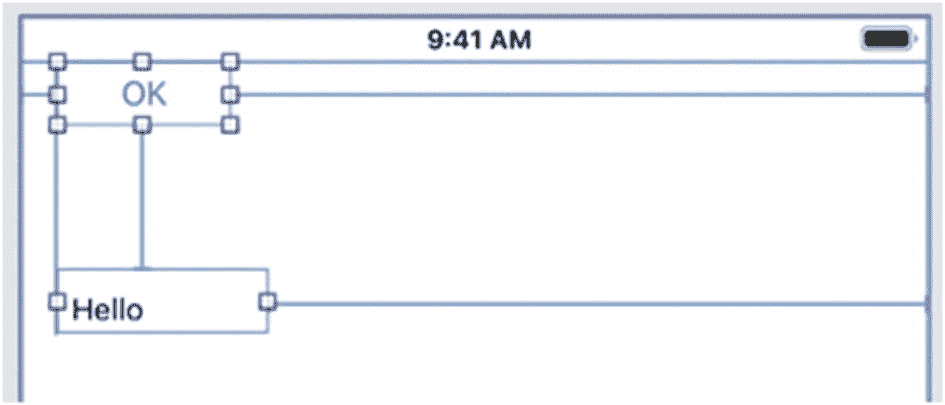

图 6-14  
查看选中对象的约束

6. 点击 Xcode 窗口底部的 `View as:` 按钮，选择 iPhone XR，使 storyboard 模拟 iPhone XR 的屏幕。注意，在我们定义了约束后，Xcode 正确地将按钮显示在 iPhone XR 屏幕的左上角，如图 [6-15] 所示。

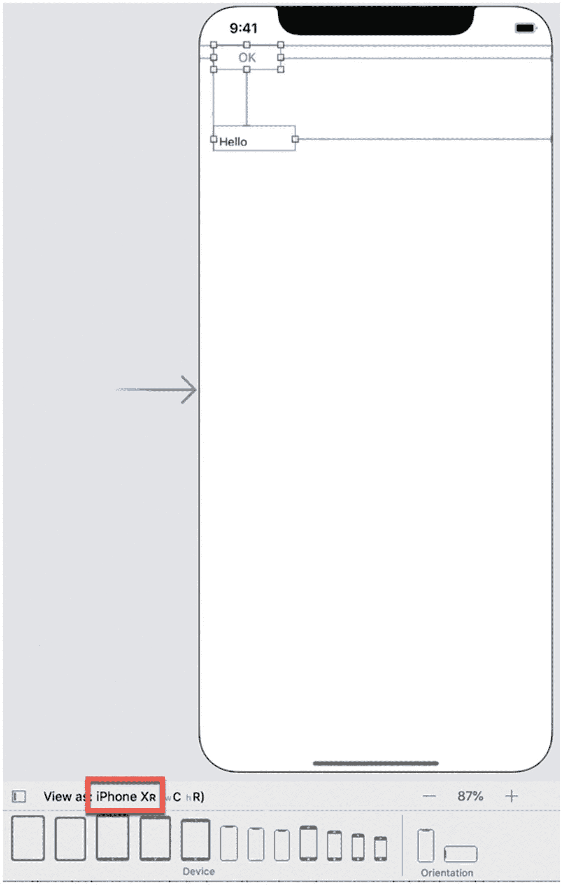

图 6-15  
这些约束在任何尺寸的 iOS 屏幕上都能正确定义对象的位置

Xcode 会用不同的颜色显示约束，以帮助你发现潜在的问题。Xcode 可能会显示的不同颜色约束包括：

- **蓝色** – 你的约束足以在不同尺寸的 iOS 屏幕上定义用户界面对象的位置。
- **橙色** – 你没有足够的约束来正确定义用户界面对象在不同尺寸 iOS 屏幕上的位置。
- **红色** – 你的约束互相矛盾或不足，将无法正确显示用户界面对象的位置。

### 查看和删除约束

一旦定义了约束，你之后可以随时查看或删除它们。查看约束让你有机会修改它们的行为。删除约束则允许你移除任何不需要的约束。

要了解如何查看和删除约束，请按照以下步骤操作：

1. 确保 Xcode 中已加载 ObjectApp 项目。
2. 在导航窗格中点击 `Main.storyboard` 文件。
3. 如果文档大纲不可见，请选择 `Editor` ➤ `Show Document Outline`，或点击 Xcode 窗口底部的文档大纲图标。
4. 点击灰色展开三角形的层级结构（`View Controller Scene` ➤ `View Controller` ➤ `View` ➤ `Constraints`）以查看当前定义的所有约束列表，如图 [6-16] 所示。

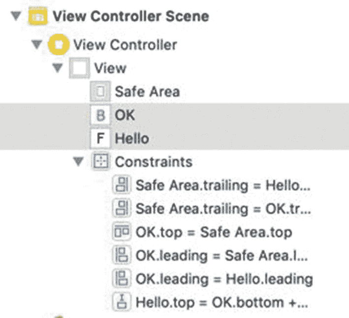

图 6-16  
在文档大纲中查看约束

5. 点击任意约束以将其选中。注意，该约束的详细信息会出现在检查器窗格中，如图 [6-17] 所示。

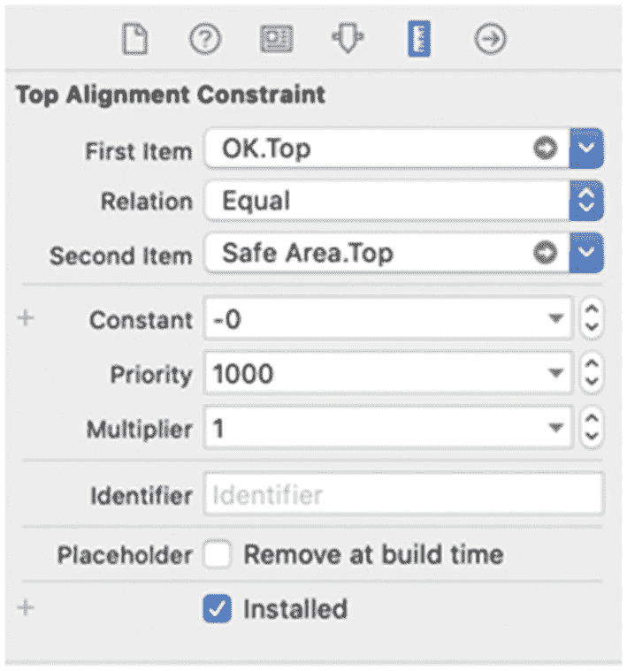

图 6-17  
检查器窗格允许你修改约束的不同部分

6. 点击你想要删除的约束，然后按 BACKSPACE 或 DELETE 键。重复此步骤直到你删除了所有约束。注意，当你删除约束时，Xcode 可能会改变任何剩余约束的颜色，以表明你没有足够的约束来正确定义对象在用户界面上的位置。（你也可以通过选择 `Editor` ➤ `Resolve Auto Layout Issues` ➤ `Clear Constraints` 来移除约束。如果你选择子菜单的上半部分，将只清除选中对象的约束。如果你选择子菜单的下半部分，将清除所有对象的约束，无论你是否选中了它们。）

### 手动添加约束

你可以让 `Xcode` 自动定义约束，但也可能需要手动添加约束。要手动添加约束，需要遵循两步流程。首先，选择一个或多个对象。其次，点击 `Xcode` 窗口底部的某个图标，选择所需的约束类型，如图 6-18 所示：

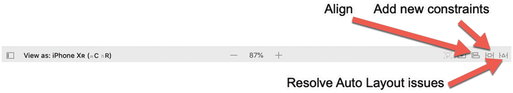

图 6-18 – 手动添加约束的图标

- `Align`（对齐）
- `Add new constraints`（添加新约束）
- `Resolve Auto Layout Issues`（解决自动布局问题，等同于选择 `Editor` ➤ `Resolve Auto Layout Issues`）

`Align`（对齐）图标允许你根据其他对象来定位某个对象，例如按底部或左侧对齐两个对象。此外，`Align`（对齐）图标还允许你将对象定位在视图内的水平或垂直中心位置，如图 6-19 所示。

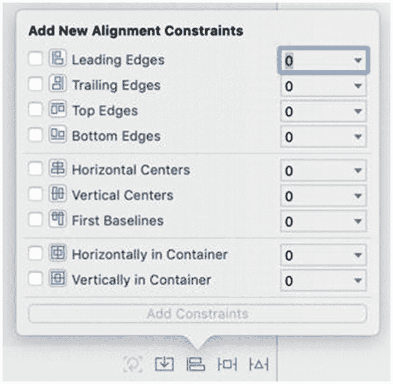

图 6-19 – `Align`（对齐）弹出菜单选项

`Add new constraints`（添加新约束）图标允许你定义尺寸约束，或到附近对象或安全区域边界的距离约束，如图 6-20 所示。灰色选项仅在选中两个或更多对象时才可见，这样你可以为所有选中对象定义相同的宽度或高度。

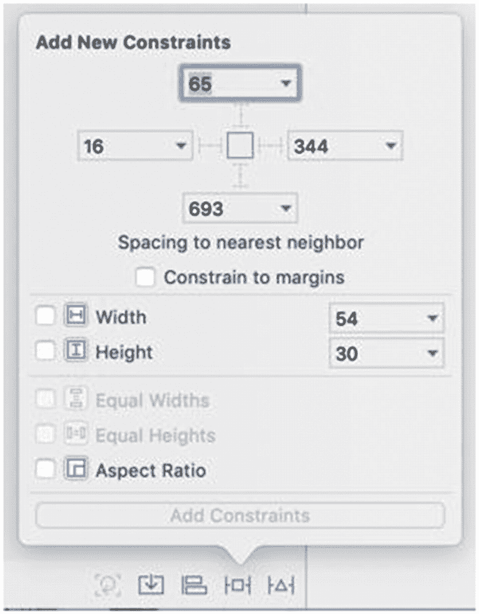

图 6-20 – `Add new constraints`（添加新约束）弹出菜单选项

`Resolve Auto Layout Issues`（解决自动布局问题）图标显示的子菜单与选择 `Editor` ➤ `Resolve Auto Layout Issues` 相同，如图 6-21 所示。`Reset to Suggested Constraints`（重置为建议的约束）会移除选中对象上的所有现有约束，并添加 `Xcode` 认为你的对象需要的新约束。如果你已经向某个对象添加了约束，那么 `Add Missing Constraints`（添加缺失的约束）仅会添加 `Xcode` 认为你的对象需要的约束。

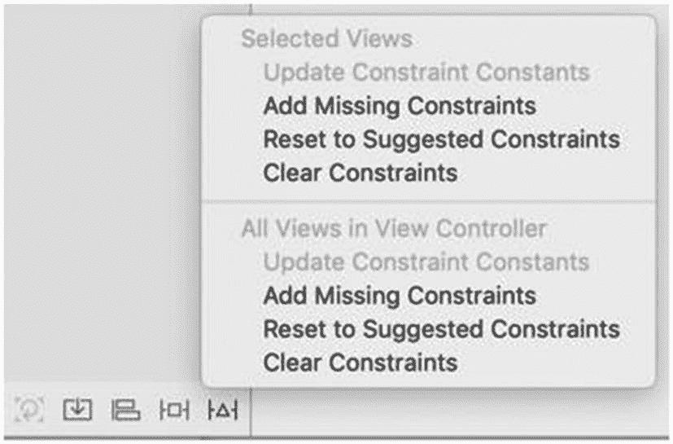

图 6-21 – `Resolve Auto Layout`（解决自动布局）图标菜单

要了解如何手动定义约束，请遵循以下步骤：

1.  确保 `ObjectApp` 项目已加载到 `Xcode` 中。
2.  在导航面板中点击 `Main.storyboard` 文件。
3.  点击按钮以选中它，使其出现控制手柄。
4.  点击 `Align`（对齐）图标。将出现一个弹出菜单（见图 6-19）。
5.  选中 `Horizontally in Container`（在容器中水平居中）复选框，然后点击 `Add 1 Constraint`（添加 1 个约束）按钮，如图 6-22 所示。`Xcode` 会将按钮移动到屏幕顶部中间。

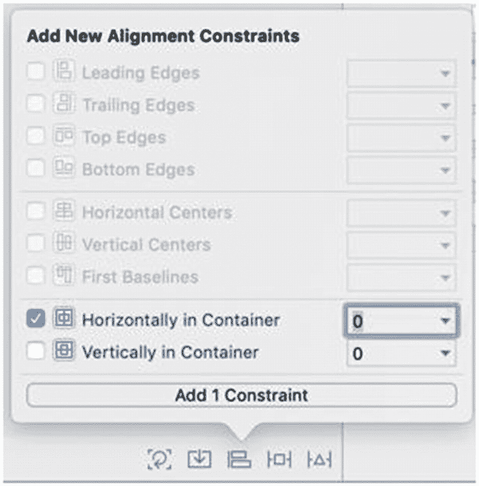

图 6-22 – 添加约束以将对象水平放置在视图中

6.  按住 `SHIFT` 键并点击文本字段。此时按钮和文本字段周围都应出现控制手柄，表示两者均被选中。
7.  点击 `Align`（对齐）图标，弹出菜单出现后，选中 `Horizontal Centers`（水平中心对齐）复选框，然后点击 `Add 1 Constraint`（添加 1 个约束）按钮，如图 6-23 所示。`Xcode` 会将文本字段移动到按钮下方居中位置。

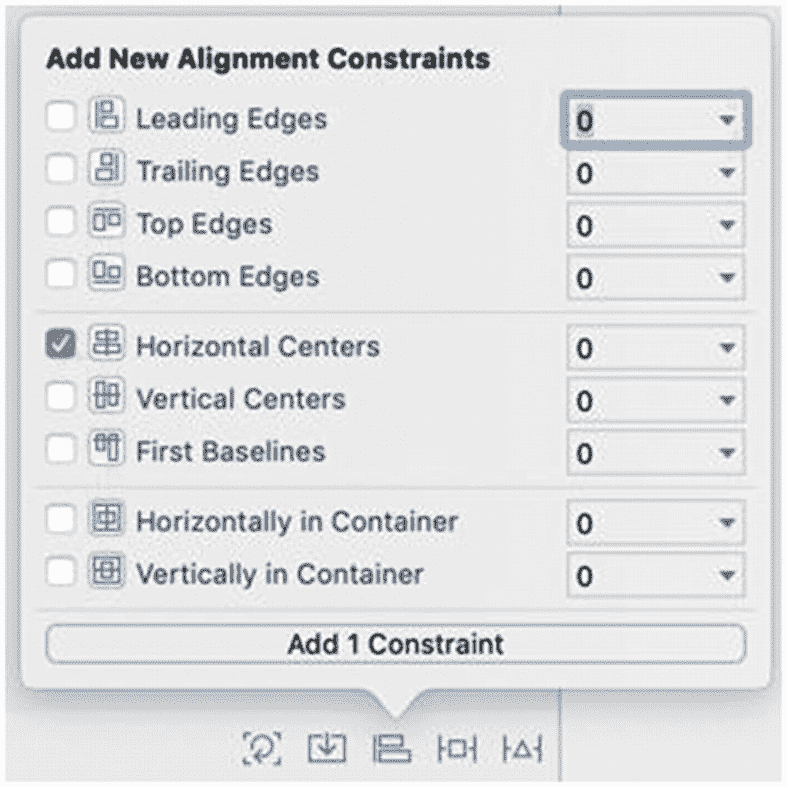

图 6-23 – 通过中心将两个对象垂直对齐

8.  点击文本字段以选中它（其周围出现控制手柄），并取消选中按钮。然后点击 `Xcode` 窗口底部的 `Add new constraints`（添加新约束）图标。将出现一个弹出菜单。
9.  点击顶部线条，定义文本字段距离最近对象或边框的距离。这将定义一个固定距离约束，如图 6-24 所示。

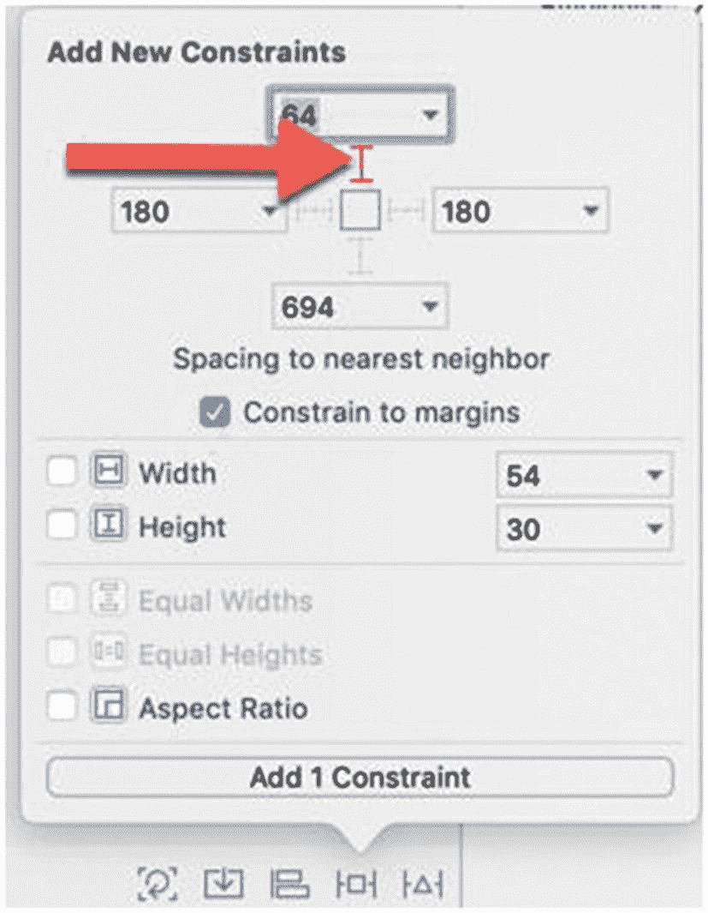

图 6-24 – 定义从对象顶部到其最近邻居的固定距离

10. 点击 `Add 1 Constraint`（添加 1 个约束）按钮。`Xcode` 会在文本字段顶部和按钮底部之间显示一个约束。然而，此约束显示为橙色，这表示约束不足，无法使文本字段在不同尺寸的 iOS 屏幕上正确显示。
11. 再次点击文本字段以选中它，然后点击 `Xcode` 窗口底部的 `Add new constraints`（添加新约束）图标。将再次出现一个弹出菜单。
12. 点击靠近顶部的线条以选中它。
13. 点击 `Xcode` 窗口底部的 `Add new constraints`（添加新约束）图标。将出现一个弹出菜单。
14. 点击顶部线条，定义按钮距离屏幕顶部的距离，如图 6-25 所示。

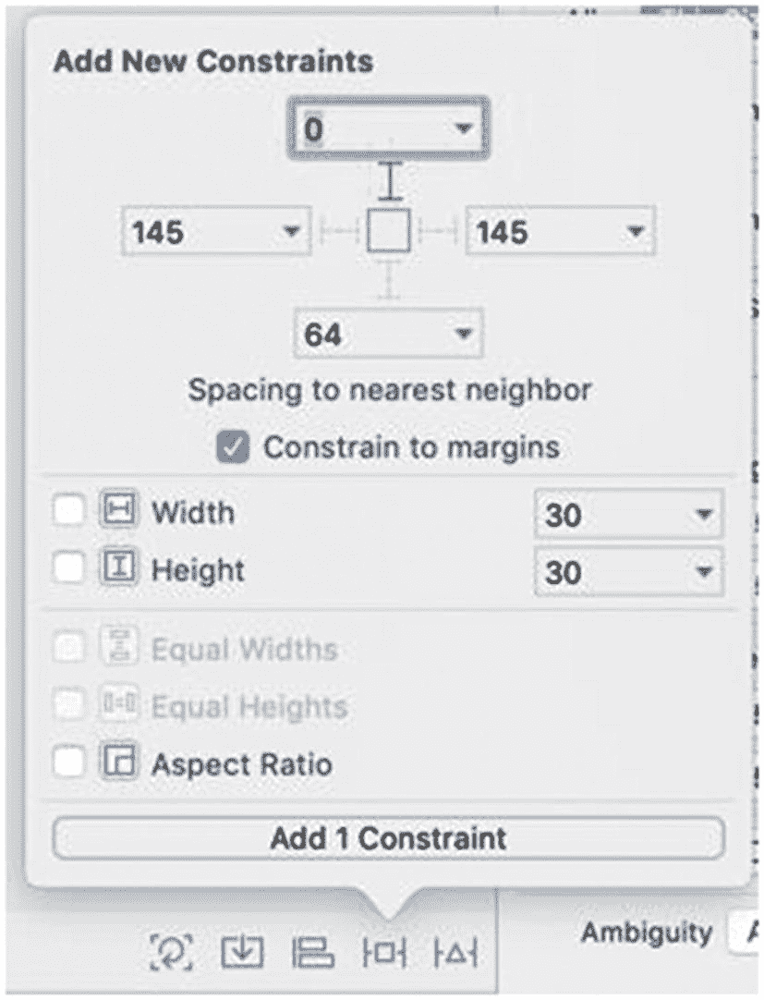

图 6-25 – 为按钮定义顶部约束

15. 点击 `Add 1 Constraint`（添加 1 个约束）按钮。`Xcode` 会向按钮添加一个顶部约束。请注意，`Xcode` 不再显示任何橙色约束，因为您已经定义了足够的约束来定义所有用户界面对象的显示。
16. 点击 `Xcode` 窗口底部的“View as:”（视图为：）按钮，然后选择不同的 iOS 设备进行模拟，例如 iPhone SE 或 iPhone 8 Plus。请注意，无论您选择哪种 iOS 设备，按钮和文本字段都会在屏幕上正确居中并保持间距。

如您所见，`Auto Layout`（自动布局）和约束允许您定义对象在用户界面上的显示位置。在此示例中，我们定义了一个固定距离约束（在文本字段顶部和按钮底部之间），以及一个定义按钮和文本字段水平居中的相对约束。

固定距离约束定义了确切的距离，无论屏幕尺寸如何，而相对约束则根据 iOS 设备屏幕的尺寸自动将按钮和文本字段水平居中。以下是使用约束的一些通用规则：

- 尽可能使用最少的约束。添加的约束越多，在不同尺寸的 iOS 设备屏幕上约束之间相互矛盾的可能性就越大。
- 避免使用固定距离约束。在极大或极小的 iOS 设备屏幕上，固定距离约束会增加扭曲用户界面外观的可能性。

为了避免使用固定值，`Xcode` 提供了两个选项。首先，当您为约束定义一个常量值时，您可以选择输入一个数字，或在 `Standard Value`（标准值）和 `Canvas Value`（画布值）之间进行选择，如图 6-26 所示。

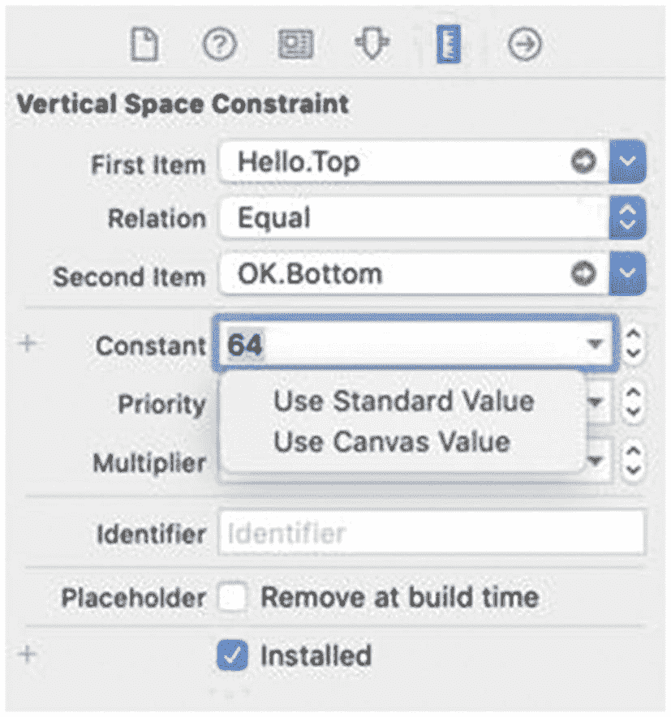

图 6-26 – 您可以选择使用 `Standard`（标准）或 `Canvas Value`（画布值）作为约束

除了使用特定值，您还可以选择使用 `Canvas Value`（画布值）来定义约束，该值使用当前故事板大小的距离；或者使用 `Standard Value`（标准值），该值让 `Xcode` 决定针对不同 iOS 屏幕尺寸使用的最佳值。大多数情况下，请先尝试使用 `Standard Value`（标准值），如果不行，再尝试使用 `Canvas Value`（画布值）。

特定值定义了一个固定距离，但您可以使用该固定值来定义最小或最大距离。这允许两个对象之间（或对象与屏幕边缘之间）的距离根据 iOS 屏幕尺寸在最小值和最大值范围内变化。

## 更改约束的固定值

要了解如何将约束的固定值更改为标准值或画布值，或定义最小或最大距离，请按以下步骤操作：

1.  确保 `ObjectApp` 项目已在 Xcode 中加载。
2.  在导航器窗格中点击 `Main.storyboard` 文件。
3.  如果文档大纲不可见，请选择 **编辑器** ➤ **显示文档大纲**，或点击 Xcode 窗口底部的“文档大纲”图标。
4.  点击灰色展开三角形的层级（`视图控制器场景` ➤ `视图控制器` ➤ `视图` ➤ `约束`）以查看当前定义的所有约束列表。
5.  点击 `Hello.top = OK.bottom + 64` 约束。检查器窗格会显示图 6-27 中该约束的值。
6.  点击“常量”弹出菜单。会出现一个菜单，让您选择标准值或画布值（见图 6-26）。
7.  点击“关系”弹出菜单，显示不同的选项，例如“小于或等于”、“等于”或“大于或等于”，如图 6-28 所示。“小于或等于”表示距离可以缩小到由常量值定义的最小值。“等于”表示距离必须始终严格等于常量值。“大于或等于”表示距离可以等于常量值或增大到更大的值。

## 使用栈视图

许多应用程序的用户界面会使用多个对象。问题源于为所有这些众多对象定义约束。将某个对象移动到新位置或调整其大小，也需要修改附近对象的所有约束。由于这可能既繁琐又乏味，Xcode 提供了一种名为栈视图的解决方案。

栈视图背后的思想是将多个对象分组在一起，并将其视为单个对象。栈视图定义了对象之间的相对位置，而约束则定义了栈视图与屏幕边缘之间的相对关系。栈视图让您可以移动多个对象，而无需担心修改它们之间的各个约束。

要了解栈视图如何工作，请按以下步骤操作：

1.  确保 `ObjectApp` 项目已在 Xcode 中加载。
2.  在导航器窗格中点击 `Main.storyboard` 文件。
3.  按住 Shift 键并点击按钮和文本字段以同时选中它们。
4.  选择 **编辑器** ➤ **嵌入于** ➤ **栈视图**，或点击 Xcode 窗口底部的“栈视图”图标，出现菜单时选择“栈视图”，如图 6-29 所示。Xcode 会在按钮和文本字段周围显示操作手柄。
5.  点击 Xcode 窗口底部的“对齐”图标，并选中**水平居中于容器**复选框。然后点击**添加 1 个约束**按钮，如图 6-30 所示。
6.  点击 Xco​​de 窗口底部的“添加新约束”图标。出现弹出菜单时，点击定义从栈顶部到屏幕顶部距离的线条，如图 6-31 所示。
7.  点击**添加 1 个约束**按钮。Xcode 会添加一个约束。现在您的用户界面应只有两个约束，一个定义栈到屏幕顶部的距离，另一个将栈水平居中于屏幕，如图 6-32 所示。
8.  点击 Xcode 窗口底部的**视图为:** 按钮，并选择一个不同的 iOS 设备供故事板模拟，例如 iPhone XR 或 iPhone SE。无论您选择哪个 iOS 设备，栈和约束都能确保按钮和文本字段在每个屏幕上正确显示。
9.  确保已选中栈（按钮和文本字段）。然后选择 **编辑器** ➤ **取消嵌入**，或点击 Xcode 窗口底部的“栈视图”图标，出现菜单时选择“取消嵌入”，如图 6-33 所示。Xcode 现在会将按钮和文本字段分离，以便您可以再次单独操作和选择它们。

## 总结

当您在用户界面上放置对象时，需要定义每个对象的大小（宽度和高度）和位置（从屏幕左上角测量的 X 和 Y 值）。每个用户界面对象都需要定义其大小和位置。每个用户界面对象可能提供额外的属性用于自定义，例如要显示的文本或背景颜色。通过更改对象的不同属性，您可以自定义其在用户界面上的外观。

由于应用程序可能在具有不同屏幕尺寸的 iOS 设备上运行，因此您必须使用约束来定义对象之间或对象与屏幕边框之间的距离。

每台 iOS 设备都提供一个安全区域来放置对象。只要对象出现在此安全区域内，它们就不会有在不同 iOS 屏幕上被截断的风险。您需要使用约束来定义希望对象靠近此安全区域边框或邻近对象之间的距离。

约束可以定义对象之间的距离或对象的大小（宽度和高度）。约束可以使用固定值，但通常更好的做法是将对象彼此靠近放置，然后改用标准值或画布值，这有助于在不同尺寸的 iOS 屏幕上更好地调整用户界面对象的位置。

使用固定值时，可以定义一个严格等于该固定值的距离。为了获得更大的灵活性，您可能希望使用固定值来定义最小值或最大值。这允许对象之间或屏幕边框之间的距离有所变化，仅受最小值或最大值的限制。

如果您有多个对象，可以将它们分组到一个栈视图中。栈视图将对象锁定在其当前的相对位置，并允许您移动整个栈视图并为整个栈视图添加约束，而不是为每个单独的对象进行操作。

