# 使用常见的用户界面对象

用户界面必须向用户展示信息。此外，用户界面还必须允许用户输入文本或数字等数据。最后，用户界面必须允许用户控制应用程序。显示数据、接收数据和接收命令构成了任何用户界面的核心。

三种最常见的用户界面对象类型包括：

- 标签
- 文本框
- 按钮

标签仅用于显示文本。文本框可以显示文本，但最常用于允许用户输入文本。按钮也可以显示文本（通常是该按钮所代表命令的名称），但最常用于让用户控制应用程序。

尽管 Xcode 提供了数十种不同的用户界面对象，但它们的目的无非是显示信息、允许用户输入数据，或为用户提供向应用程序下达命令的方式。这些其他的用户界面对象之所以存在，是为了提供不同的方式来展示信息、允许输入，或提供选择命令的途径。

例如，标签可以将数据显示为文本，但进度视图对象则以条形图的形式直观地展示数据，该条形图会随时间变化，以显示任务已完成多少。标签可以将完全相同的信息显示为数字，但进度视图让用户一眼就能看清进度，同时还能直观地显示任务还剩多少才能完成，如图 7-1 所示。

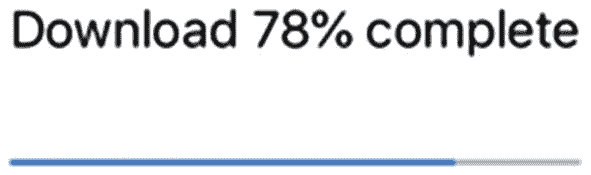

*图 7-1：以文本和可视进度条形式显示信息*

文本框允许用户输入文本作为数据，但在输入数字作为数据时，键入数字可能比较笨拙。作为使用文本框输入数字的替代方案，你可以改用滑块。通过拖动滑块，用户可以快速选择一个数值，而无需费心键入数字或误将字母输成数字，如图 7-2 所示。

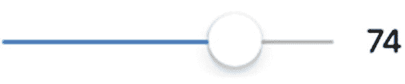

*图 7-2：滑块让用户无需任何键入即可选择数值*

按钮代表单个命令，但如果需要显示多个命令，显示多个按钮会使屏幕变得杂乱。作为用按钮选择不同命令而让屏幕杂乱的替代方案，应用程序可以提供手势识别器，其中每种手势执行不同的命令，例如缩小或移动某个项目。手势消除了在屏幕上显示命令的需要，并允许用户以不同方式直接用手指操控对象，如图 7-3 所示。

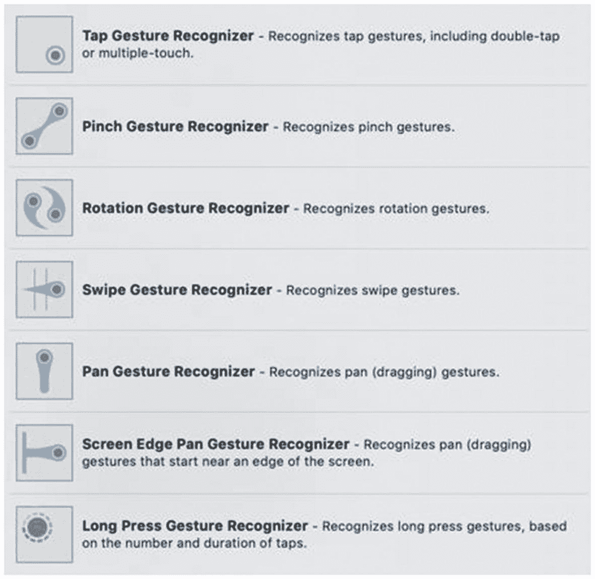

*图 7-3：滑块让用户无需任何键入即可选择数值*

通过使用常见的用户界面对象，你可以快速设计一个应用，然后添加 Swift 代码使其真正运行。只需记住尝试不同的用户界面设计，直到找到最适合你应用的那一款。

## 使用标签

标签的主要目的是在屏幕上显示文本。有时，这些文本用于描述相邻对象（例如开关）的用途；有时，这些文本旨在向用户提供更详细的信息，如图 7-4 所示。

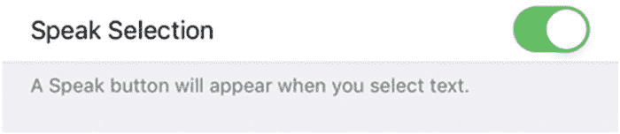

*图 7-4：标签显示文本以向用户提供信息*

对于所有用户界面对象，有两种自定义方式。其一，你可以在检查器面板中修改属性。其二，你可以使用 Swift 代码修改属性。Swift 代码允许你在应用运行时动态更改对象的属性。每个用户界面对象都提供数十种可修改的属性，但你很少需要修改所有属性。

由于标签旨在显示文本，因此最常见的可修改属性是那些影响文本外观的属性，例如颜色、字体或对齐方式。

要了解如何在检查器面板和 Swift 代码中修改标签的更常见属性，请按照以下步骤操作：

1.  使用单视图应用模板创建一个新的 iOS 项目（见第 1 章），并将此新项目命名为 `LabelApp`。这将为用户界面创建一个单一视图。
2.  在导航器面板中单击 `Main.storyboard` 文件。Xcode 会显示该单一视图。
3.  单击库图标以打开对象库窗口。
4.  将标签拖放到用户界面上的任意位置。
5.  选择 **View** ➤ **Inspectors** ➤ **Show Attributes Inspector**，或单击检查器面板顶部的属性检查器图标。检查器面板会显示标签可用的所有属性。
6.  单击文本弹出菜单下方的文本字段。默认情况下，每个标签都会显示“Label”，如图 7-5 所示。

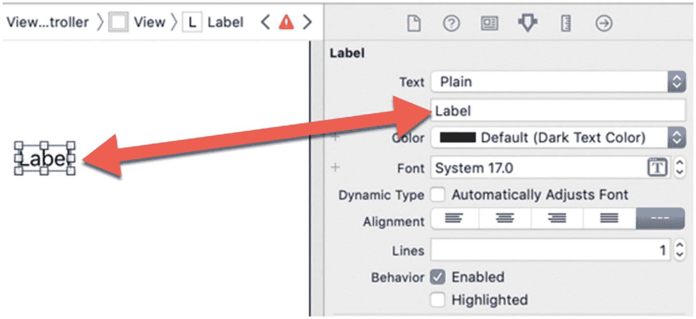

*图 7-5：用于修改标签中显示文本的属性*

7.  使用 BACKSPACE 或 DELETE 键删除该文本，键入**This is a label**，然后按 ENTER 键。Xcode 会在用户界面上的标签中显示“This is a label”。（你也可以双击标签直接在其上编辑文本。）
8.  单击字体文本字段最右侧显示内含 T 的方形图标。会弹出一个菜单，允许你选择不同的字体和字号，如图 7-6 所示。

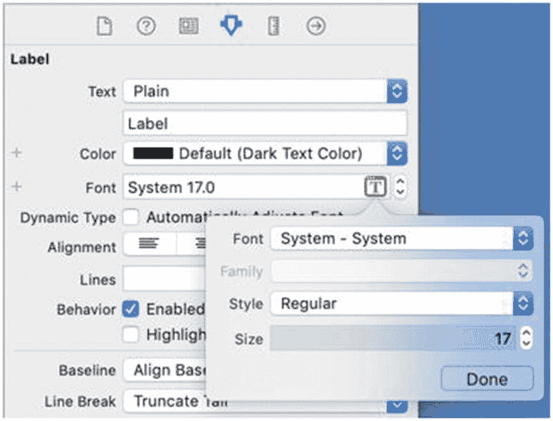

*图 7-6：为标签中显示的文本定义字体和字号*

9.  单击字体弹出菜单。当另一个菜单出现时，选择 Custom，如图 7-7 所示。

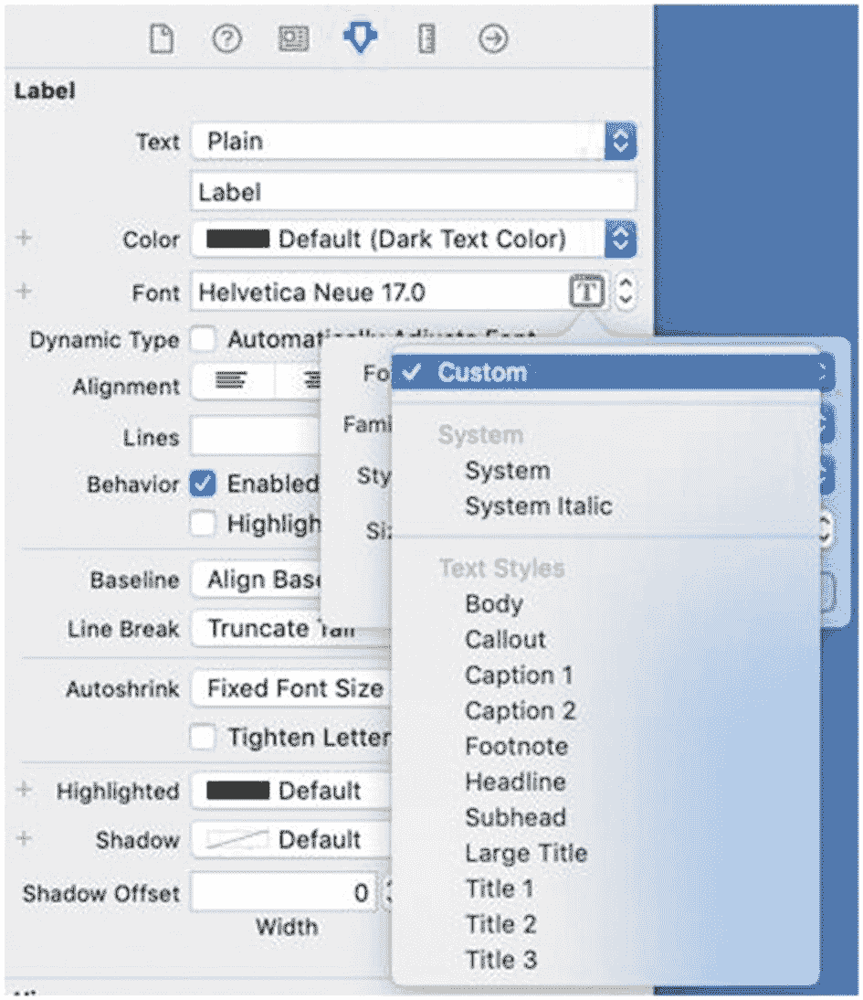

*图 7-7：选择 Custom 可以为标签中的文本定义字体*

10.  单击 Family 弹出菜单。会显示所有可用字体的列表。
11.  点击你想要使用的字体，例如 Helvetica。
12.  在 Size 文本字段中单击并键入一个新值（例如 24），或者点击文本字段最右侧的上/下箭头来增加/减少显示的值。
13.  单击 Done 按钮。Xcode 会以你选择的字体和字号显示标签文本。

更改文本、字体和字号是修改标签最常见的方式。自定义标签的其他方式包括更改其背景、标签可以显示的行数，以及文本是显示为启用状态（深色）还是禁用状态（灰色）。要了解如何更改标签的这些属性，请按照以下步骤操作：


1. 选择（或清除）`Enabled`复选框。如果`Enabled`复选框被选中，文本将正常显示；但如果`Enabled`复选框被清除，文本将显示为灰色，如图 7-8 所示。

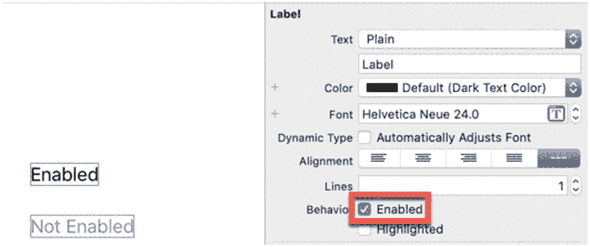

图 7-8 — `Enabled`复选框定义了文本的外观

2. 点击`Background`弹出菜单。将出现一个包含不同颜色的菜单，如图 7-9 所示。

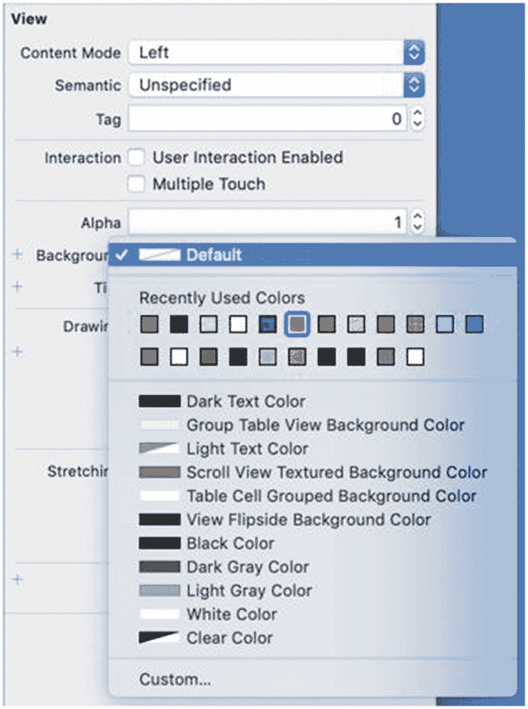

图 7-9 — 为标签选择背景颜色

3. 将鼠标指针移到标签最右边的手柄上，向左下方拖动鼠标以缩小标签的宽度并增加其高度。请注意，标签内的文本显示被截断，如图 7-10 所示。这是因为`Lines`文本字段包含的值为`1`，这意味着标签只能显示一行文本。

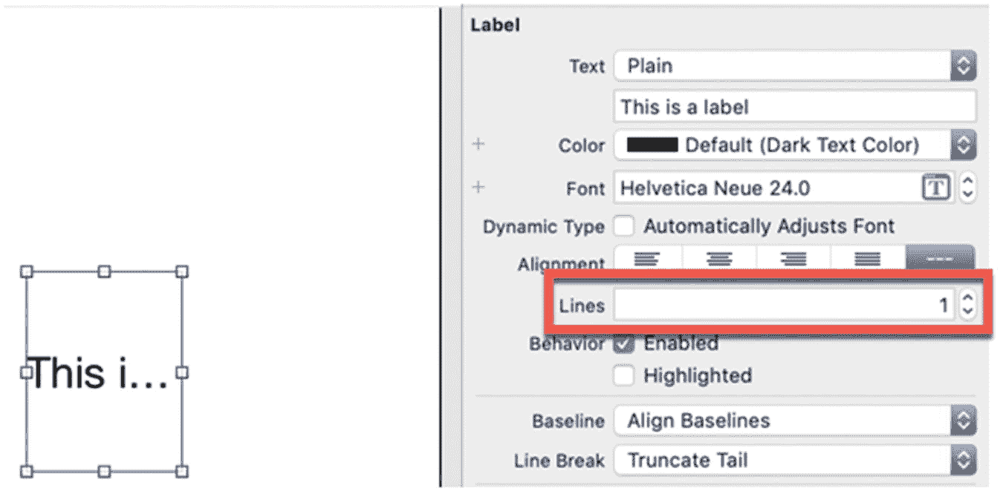

图 7-10 — 调整标签大小

4. 点击`Lines`文本字段并输入`2`，或者点击`Lines`文本字段最右侧的上/下箭头直到数字`2`出现。这允许标签最多显示两行文本。请注意，当您将`Lines`属性增加到`2`时，标签现在会显示两行文本，如图 7-11 所示。

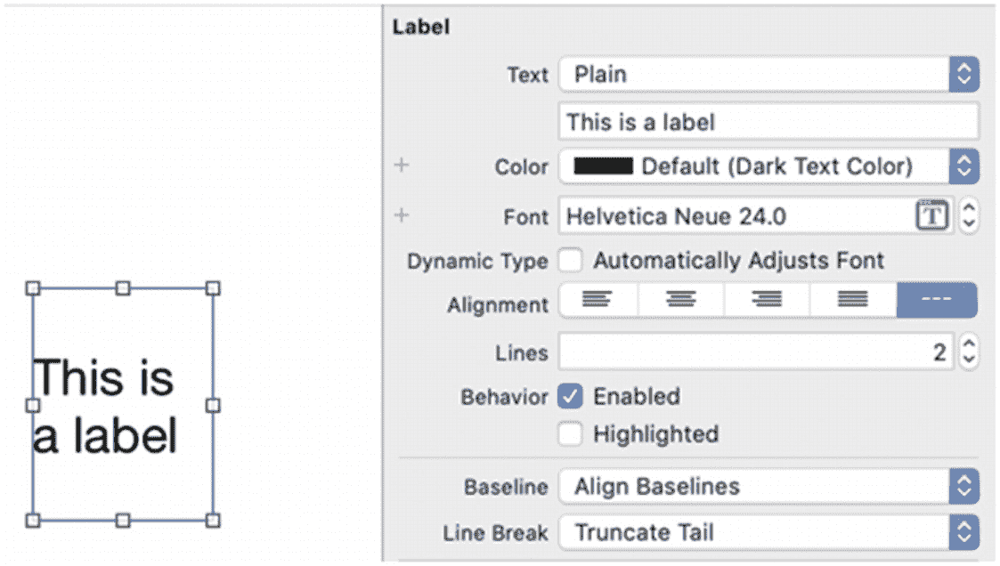

图 7-11 — 在标签中显示两行文本

#### 注意

如果您需要标签显示多行文本，请增加`Lines`文本字段中的值。如果您在`Lines`文本字段中指定的值为`0`（零），则标签将能够容纳无限行数的文本。

在您知道应用运行前文本应如何显示的情况下，在 Inspector 面板中修改标签的属性是可行的。但在某些情况下，您可能需要在应用运行时更改标签的属性。最常见的更改属性是`Text`属性，它定义了标签内显示的文本，但 Inspector 面板中显示的任何属性都可以使用 Swift 代码进行修改。要修改任何用户界面对象，您必须首先为您想要使用 Swift 代码修改的每个用户界面对象定义一个`IBOutlet`变量。

要了解如何使用 Swift 代码更改标签的属性，请遵循以下步骤：

1. 在 Xcode 中打开`LabelApp`的`Main.storyboard`文件，点击库图标打开`Object Library`窗口。

2. 拖放一个按钮到视图的任意位置。

3. 选择 `Editor` ➤ `Resolve Auto Layout Issues` ➤ `Reset to Suggested Constraints`（位于菜单底部）。Xcode 会为按钮和标签添加约束。

4. 选择 `View` ➤ `Assistant Editor` ➤ `Show Assistant Editor`，或点击 Xcode 窗口右上角的`Assistant Editor`图标。Xcode 会将`Main.storyboard`文件与`ViewController.swift`文件并排显示。

5. 将鼠标指针移到标签上，按住`Control`键，从标签`Ctrl`-拖拽到`ViewController.swift`文件中“`class ViewController`”行下方的空白区域，如图 7-12 所示。

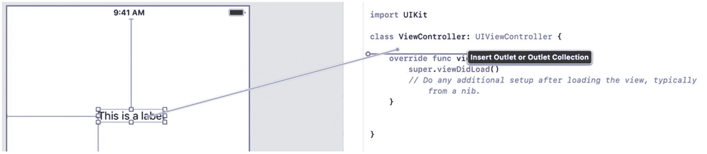

图 7-12 — 从标签`Ctrl`-拖拽到`ViewController.swift`文件

6. 松开`Control`键和鼠标左键。将出现一个窗口，如图 7-13 所示。

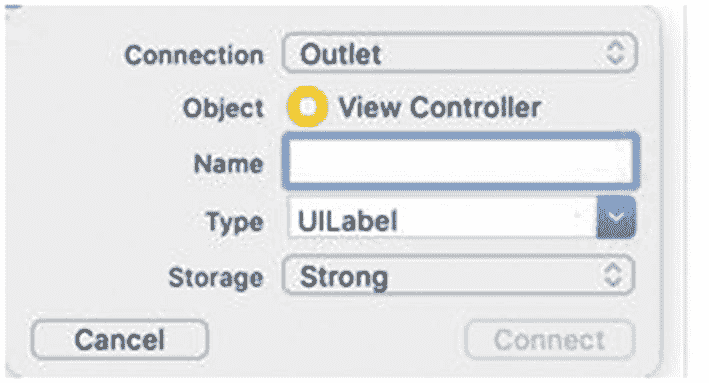

图 7-13 — 出现一个窗口，允许您为标签定义一个`IBOutlet`变量

7. 点击`Name`文本字段，输入一个描述性名称，例如`myLabel`。

8. 点击`Connect`按钮。Xcode 会创建一个`IBOutlet`变量，如下所示：

```
@IBOutlet var myLabel: UILabel!
```

9. 将鼠标指针移到按钮上，按住`Control`键，从按钮`Ctrl`-拖拽到`ViewController.swift`文件中最后一个大括号上方的区域，如图 7-14 所示。

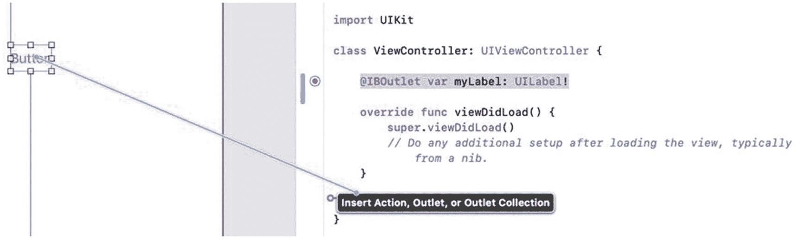

图 7-14 — 从按钮`Ctrl`-拖拽到`ViewController.swift`文件

10. 松开`Control`键和鼠标左键。将出现一个窗口，如图 7-15 所示。

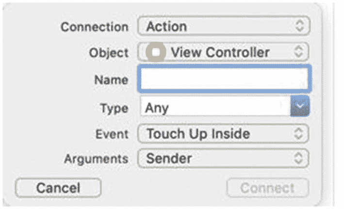

图 7-15 — 从按钮`Ctrl`-拖拽到`ViewController.swift`文件

11. 确保`Connection`弹出菜单显示为`Action`，然后点击`Name`文本字段并输入`changeLabel`。

12. 点击`Type`弹出菜单并选择`UIButton`。

13. 点击`Connect`按钮。Xcode 会显示一个`IBAction`方法，如下所示：

```
@IBAction func changeLabel(_ sender: UIButton) {
}
```

14. 编辑这个`changeLabel`方法，如下所示：

```
@IBAction func changeLabel(_ sender: UIButton) {
    myLabel.text = "Text created by Swift \ncode using Xcode"
    myLabel.numberOfLines = 2
    myLabel.font = UIFont(name: "Courier", size: 14)
    myLabel.backgroundColor = UIColor.yellow
    myLabel.isEnabled = false
}
```

**注意**  在上述 Swift 代码中，`\n`符号代表换行。这将强制文本在下一行显示。

15. 点击`Run`按钮或选择`Product` ➤ `Run`。模拟器将在一个模拟的 iOS 设备中显示您的应用。

16. 点击用户界面上的按钮。Swift 代码会通过更改文本、标签中显示的行数、字体和字号、背景颜色以及禁用它来修改文本，如图 7-16 所示。

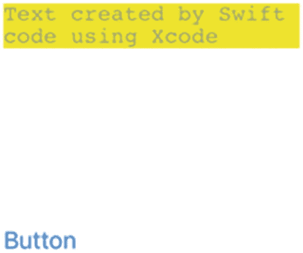

图 7-16 — 使用 Swift 代码在标签中显示修改后的文本

17. 选择`Simulator` ➤ `Quit Simulator`以返回 Xcode。

请注意，Swift 代码可以修改标签的每个属性。要了解要使用的确切 Swift 命令，您需要查阅 Apple 的文档。由于我们需要访问标签的属性，因此需要查找标签有哪些可用属性。在 iOS 中，标签对象被称为`UILabel`。

要在 Xcode 中查看 Apple 的文档，请选择`Help` ➤ `Developer Documentation`以打开文档窗口。然后输入您要查找的单词或短语。在这种情况下，我们想要关于标签的信息，因此我们在文档窗口中输入`UILabel`。这将显示有关您可以在标签中访问和修改的所有属性的信息，如图 7-17 所示。

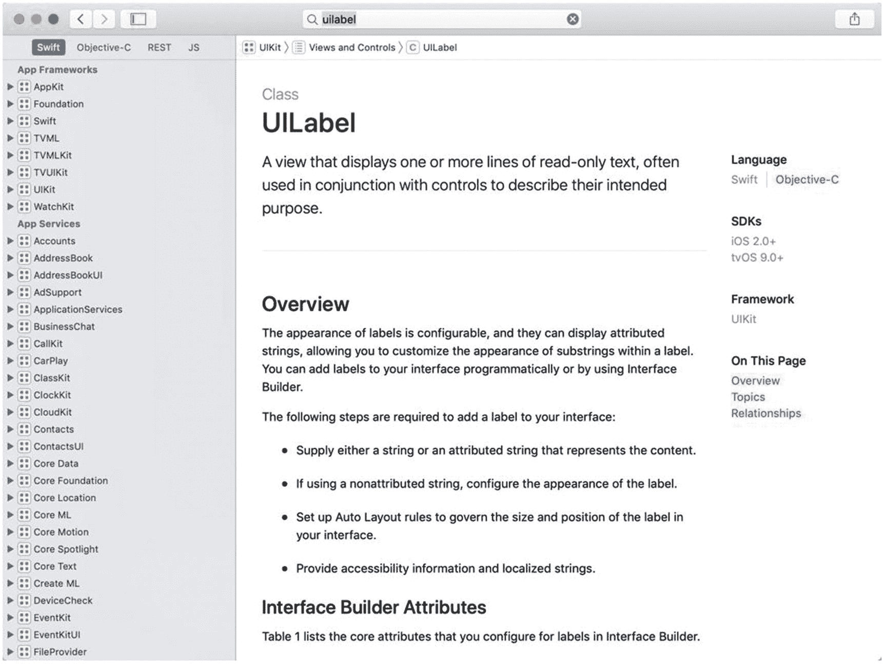

图 7-17 — 在文档窗口中查看可用属性


## 使用文本字段

若只需显示文本，请使用标签。若要用户输入文本，则需使用文本字段。使用文本字段的关键在于，应用必须在屏幕上显示虚拟键盘。使用虚拟键盘时，需要注意其在屏幕上的位置以及文本字段的位置。

如果文本字段靠近屏幕顶部，虚拟键盘可以向上滑动而不会遮挡文本字段。但如果文本字段过于靠近屏幕底部，虚拟键盘向上滑动时会遮盖用户要输入的文本字段。

若出现这种情况，应用需要将视图向上滑动，保持文本字段可见，同时让虚拟键盘占据屏幕底部。当用户完成文本字段的输入后，虚拟键盘需要消失，文本字段也需要回到原位。

为了让屏幕随虚拟键盘的出现而上下滑动，每个应用都需要使用 iOS 通知中心，它能检测事件何时发生。当用户点击文本字段时，会发送一条通知，表明虚拟键盘需要出现。当用户完成文本字段的编辑时，会发送另一条通知，表明虚拟键盘需要消失。

要接收通知，应用需要使用 `addObserver` 方法，该方法定义一个对象（即视图）来接收通知，并指定接收到特定通知时要运行的方法。为了检测虚拟键盘何时应出现和消失，我们需要检测两个通知：

- `keyboardWillShowNotification`
- `keyboardWillHideNotification`

接下来，我们需要编写两个函数来显示和隐藏虚拟键盘。要显示虚拟键盘，我们需要根据虚拟键盘的高度将视图向上滑动，这个高度取决于运行设备的类型，例如 iPhone SE 这样的小屏幕，或 iPad Pro 这样的大屏幕。

要隐藏虚拟键盘，我们需要将视图恢复到其原始 Y 坐标位置，该位置决定了其在屏幕上的垂直位置。不过，只要光标出现在文本字段中，虚拟键盘就不会消失。

为了让应用关闭虚拟键盘，我们还需要检测用户是否点击了文本字段之外的任何区域。点击视图会告知应用结束文本字段的编辑，进而发送通知以移除虚拟键盘。当视图收到虚拟键盘需要消失的通知时（即用户点击了文本字段外部），我们需要一个函数将视图移回原位。

所有这些都需要编写代码来接收两个通知（`keyboardWillShowNotification` 和 `keyboardWillHideNotification`）。此外，我们还需要检测文本字段外部的点击手势。

最后，我们需要编写三个函数。第一个函数通过计算屏幕高度和宽度，然后根据虚拟键盘的高度将视图向上滑动来显示虚拟键盘。第二个函数结束文本字段的编辑，触发 `keyboardWillHideNotification`。第三个函数在虚拟键盘消失后将视图移回原位。

要了解如何让虚拟键盘随文本字段的出现和消失而动作，请按照以下步骤操作：

1.  使用单视图应用模板创建一个新的 iOS 项目（参见第 1 章），并将此新项目命名为 `TextFieldApp`。这将为用户界面创建一个单一视图。

2.  在导航窗格中点击 `Main.storyboard` 文件。Xcode 会显示这个单一视图。

3.  点击库图标以显示对象库。

4.  将两个文本字段拖放到视图底部三分之一处，这样当虚拟键盘从底部滑出时，它就会覆盖这些文本字段，如图 7-18 所示。

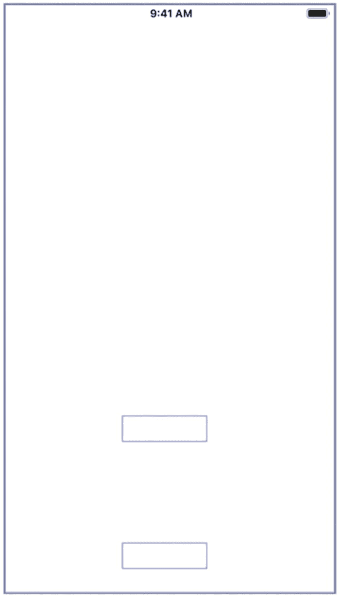

图 7-18 — 将两个文本字段放置在视图底部三分之一处

5.  选择 Editor ➤ Resolve Auto Layout Issues ➤ Reset to Suggested Constraints （位于子菜单的下半部分）。这将对两个文本字段应用约束。

6.  在导航窗格中点击 `ViewController.swift` 文件。

7.  在 `viewDidLoad` 方法内部添加以下代码：

```
NotificationCenter.default.addObserver(self, selector: #selector(keyboardWillShow), name: UIResponder.keyboardWillShowNotification, object: nil)
NotificationCenter.default.addObserver(self, selector: #selector(keyboardWillHide), name: UIResponder.keyboardWillHideNotification, object: nil)
```

第一行将视图定义为观察者，用于接收 `keyboardWillShowNotification`。当此通知出现时，应用需要运行名为 `keyboardWillShow` 的函数。第二行将视图定义为观察者，用于接收 `keyboardWillHideNotification`。当此通知出现时，应用需要运行名为 `keyboardWillHide` 的函数。

8.  在 `viewDidLoad` 方法内部添加以下代码：

```
let tap: UITapGestureRecognizer = UITapGestureRecognizer(target: self, action: #selector(self.dismissKeyboard))
view.addGestureRecognizer(tap)
```

这段代码允许视图检测点击手势（即用户点击文本字段外部时）。当这种情况发生时，此行代码会运行一个名为 `dismissKeyboard` 的函数。完整的 `viewDidLoad` 函数应如下所示：

```
override func viewDidLoad() {
    super.viewDidLoad()
    NotificationCenter.default.addObserver(self, selector: #selector(keyboardWillShow), name: UIResponder.keyboardWillShowNotification, object: nil)
    NotificationCenter.default.addObserver(self, selector: #selector(keyboardWillHide), name: UIResponder.keyboardWillHideNotification, object: nil)
    let tap: UITapGestureRecognizer = UITapGestureRecognizer(target: self, action: #selector(self.dismissKeyboard))
    view.addGestureRecognizer(tap)
}
```

9.  在 `viewDidLoad` 函数下方输入以下代码：

```
@objc func dismissKeyboard() {
    view.endEditing(true)
}
```

当用户点击文本字段外部时，此函数运行，结束编辑并发送虚拟键盘需要消失的通知（`keyboardWillHideNotification`）。

10. 在 `dismissKeyboard` 函数下方输入以下代码：

```
@objc func keyboardWillShow(notification: NSNotification) {
    if let keyboardSize = (notification.userInfo?[UIResponder.keyboardFrameEndUserInfoKey] as? NSValue)?.cgRectValue {
        if self.view.frame.origin.y == 0 {
            self.view.frame.origin.y -= keyboardSize.height
        }
    }
}
```

此函数根据 iOS 屏幕尺寸定义键盘大小。（请记住，iPhone 屏幕比 iPad 屏幕窄。）然后，该函数使用虚拟键盘的高度来确定视图（及其所有用户界面对象）需要向上滑动多远，以便为虚拟键盘腾出空间。

11. 在 `keyboardWillShow` 函数下方输入以下代码：

```
@objc func keyboardWillHide(notification: NSNotification) {
    if ((notification.userInfo?[UIResponder.keyboardFrameEndUserInfoKey] as? NSValue)?.cgRectValue) != nil {
        if self.view.frame.origin.y != 0 {
            self.view.frame.origin.y = 0
        }
    }
}
```

此函数检查虚拟键盘是否可见。如果不可见，则不执行任何操作。如果虚拟键盘可见，则将视图向下移回原位以覆盖并隐藏虚拟键盘。完整的 `ViewController.swift` 文件应如下所示：


```swift
import UIKit
class ViewController: UIViewController {
    override func viewDidLoad() {
        super.viewDidLoad()
        NotificationCenter.default.addObserver(self, selector: #selector(keyboardWillShow), name: UIResponder.keyboardWillShowNotification, object: nil)
        NotificationCenter.default.addObserver(self, selector: #selector(keyboardWillHide), name: UIResponder.keyboardWillHideNotification, object: nil)
        let tap: UITapGestureRecognizer = UITapGestureRecognizer(target: self, action: #selector(self.dismissKeyboard))
        view.addGestureRecognizer(tap)
    }
    @objc func dismissKeyboard() {
        view.endEditing(true)
    }
    @objc func keyboardWillShow(notification: NSNotification) {
        if let keyboardSize = (notification.userInfo?[UIResponder.keyboardFrameEndUserInfoKey] as? NSValue)?.cgRectValue {
            if self.view.frame.origin.y == 0 {
                self.view.frame.origin.y -= keyboardSize.height
            }
        }
    }
    @objc func keyboardWillHide(notification: NSNotification) {
        if ((notification.userInfo?[UIResponder.keyboardFrameEndUserInfoKey] as? NSValue)?.cgRectValue) != nil {
            if self.view.frame.origin.y != 0 {
                self.view.frame.origin.y = 0
            }
        }
    }
}
```

12. 点击`运行`按钮或选择`产品` ➤ `运行`。模拟器出现，屏幕底部附近显示你的两个文本字段。

13. 点击任意文本字段。请注意，虚拟键盘会向上滑动，并将视图（以及两个文本字段）向上移动，如图 7-19 所示。（如果虚拟键盘因任何原因未出现，你可以通过选择`硬件` ➤ `键盘` ➤ `切换软件键盘`，或按`Command + K`使其显示或消失。）

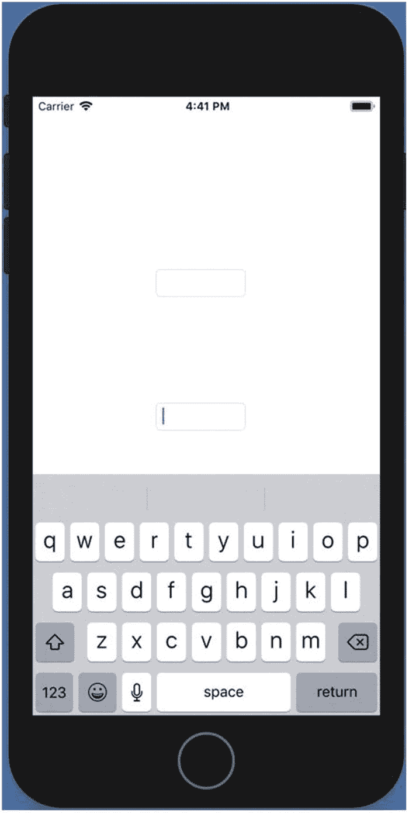

**图 7-19** 当用户点击文本字段时，虚拟键盘出现

14. 点击虚拟键盘上的按键，在文本字段中输入一个单词。

15. 点击第二个文本字段，并使用虚拟键盘输入另一个单词。

16. 点击文本字段之外的任意位置。请注意，虚拟键盘会消失。

17. 选择`模拟器` ➤ `退出模拟器`，返回 Xcode。

### 定义不同的键盘

了解如何让虚拟键盘出现和消失而不遮挡文本字段后，下一步是学习如何自定义当用户点击文本字段时出现的键盘类型。默认的虚拟键盘仅显示字母（见图 7-19）。但是，如果文本字段需要存储数字呢？此时，你可以显示一个数字虚拟键盘，如图 7-20 所示。

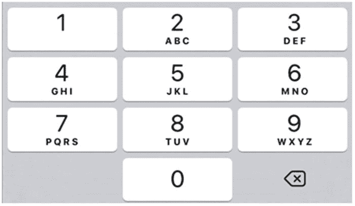

**图 7-20** 数字虚拟键盘

通过提供不同的键盘选项，Xcode 允许你为特定文本字段选择最合适的键盘。例如，如果你预期用户输入 URL（网站）地址，可以选择一个显示`.com`键的虚拟键盘，方便用户输入常见网址。如果文本字段需要输入电话号码，那么虚拟键盘可以显示典型的电话号码拨号盘（见图 7-20）。通过选择不同的虚拟键盘，你可以让用户在文本字段中输入特定数据变得更加便捷。

在我们的`TextFieldApp`项目中，有两个文本字段。要查看如何为每个文本字段选择并显示不同的虚拟键盘，请按照以下步骤操作：

1. 确保`TextFieldApp`项目已在 Xcode 中加载。

2. 点击导航窗格中的`Main.storyboard`文件，查看应用程序的用户界面。

3. 点击一个文本字段，然后选择`视图` ➤ `检查器` ➤ `显示属性检查器`，或点击检查器窗格顶部的`属性检查器`图标。

4. 点击`键盘类型`弹出菜单，显示弹出菜单，如图 7-21 所示。

   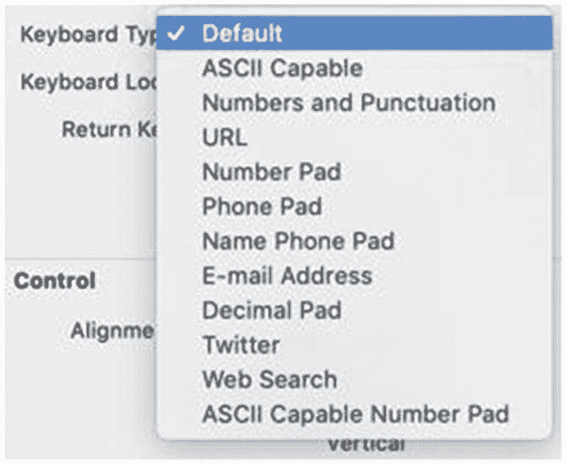

   **图 7-21** 选择要显示的不同虚拟键盘

5. 选择一种虚拟键盘，例如`URL`或`数字小键盘`。

6. 点击第二个文本字段，然后点击`键盘类型`弹出菜单，选择不同的虚拟键盘，例如`电子邮件地址`或`网页搜索`。

7. 点击`运行`按钮或选择`产品` ➤ `运行`。模拟器窗口出现。

8. 点击一个文本字段。注意你为该文本字段定义的虚拟键盘的外观。

9. 点击第二个文本字段。注意该文本字段的虚拟键盘与此不同，如图 7-22 所示。

   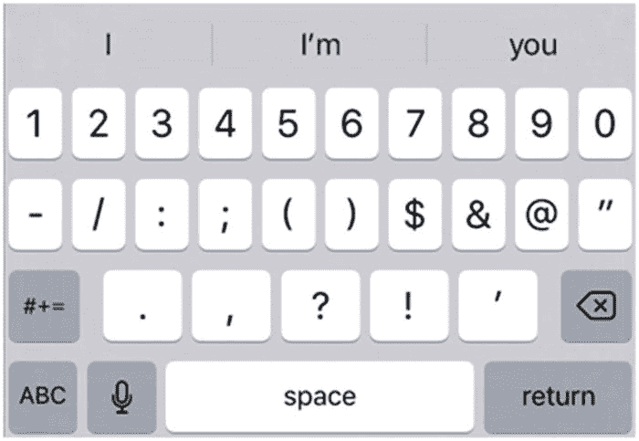

   **图 7-22** 数字和标点虚拟键盘

10. 选择`模拟器` ➤ `退出模拟器`，返回 Xcode。
```


### 定义文本字段的内容

文本字段用于捕获用户的文本输入，但每个文本字段都有不同的用途。一个文本字段可能用来捕获姓名，而另一个则可能用于捕获电话号码这样的数字数据。还有的文本字段可能需要用于输入密码。

为了定义文本字段接受数据的不同方式，`属性检查器`面板中显示了`文本输入特征`类别，其中包含多种可供选择的选项，如图 7-23 所示。

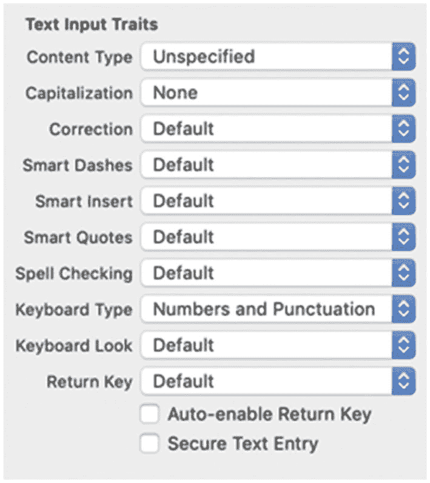

图 7-23

`属性检查器`面板上的`文本输入特征`类别

您可以自定义的一些不同选项包括：

- **内容类型** – 定义文本字段应预期的数据类型，例如电话号码或姓名
- **首字母大写** – 定义是否对每个单词、仅句首或每个字符进行大写
- **更正** – 定义自动更正功能的开启或关闭
- **键盘外观** – 定义深色或浅色外观
- **Return 键** – 定义 Return 键上显示的标题，例如`Return`、`Join`、`Next`、`Search`或`Done`

选中`安全文本输入`复选框，您可以配置文本字段隐藏用户实际输入的字符，这对于屏蔽密码非常有用。

要了解这些不同的文本字段选项如何工作，请按照以下步骤操作：

1.  确保`TextFieldApp`项目已在`Xcode`中加载。
2.  单击`导航器`面板中的`Main.storyboard`文件。
3.  单击一个文本字段，然后选择`视图 ➤ 检查器 ➤ 显示属性检查器`，或单击`检查器`面板顶部的`属性检查器`图标。
4.  单击`内容类型`弹出菜单，选择`Password`，如图 7-24 所示。
   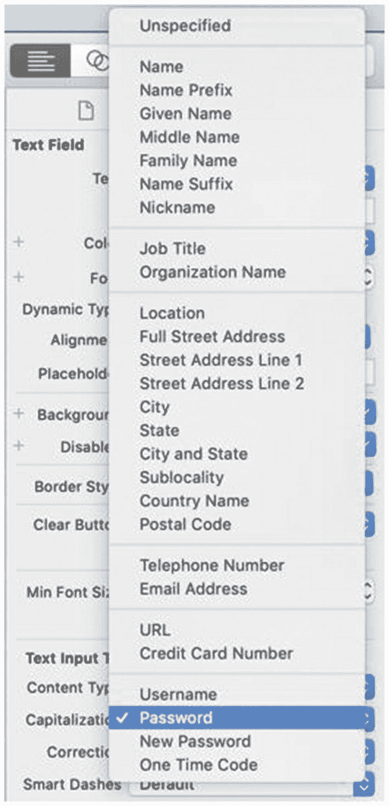
   图 7-24
   将文本字段的内容类型更改为`Password`
5.  单击`键盘类型`弹出菜单，选择`Default`。
6.  单击`Return 键`弹出菜单，选择`Done`。
7.  选中`安全文本输入`复选框。
8.  单击另一个文本字段。
9.  单击`内容类型`弹出菜单，选择`E-mail Address`。
10. 单击`键盘类型`弹出菜单，选择`E-Mail Address`。
11. 单击`Return 键`弹出菜单，选择`Send`。
12. 单击`运行`按钮，或选择`产品 ➤ 运行`。`模拟器`窗口将出现。
13. 单击定义为`Password`内容类型的文本字段。虚拟键盘将出现，并在右下角显示`Done`。
14. 单击虚拟键盘按键。注意，当您输入时，文本字段会隐藏实际字符，如图 7-25 所示。
    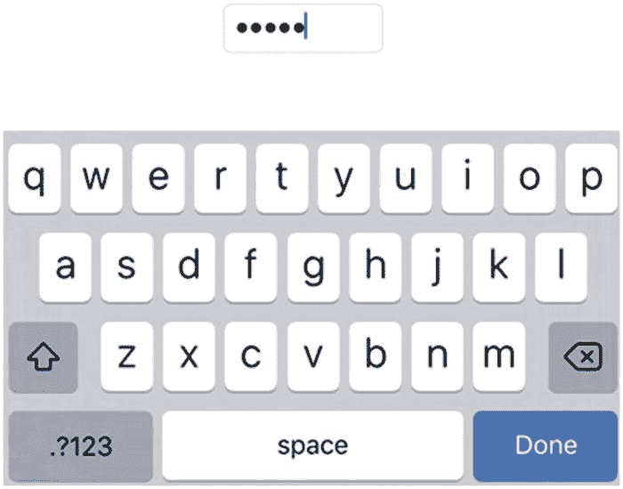
    图 7-25
    在文本字段中隐藏输入的字符
15. 单击另一个文本字段。注意，Web 搜索虚拟键盘将出现，并显示一个`@`键和右下角的`Send`按钮，如图 7-26 所示。
    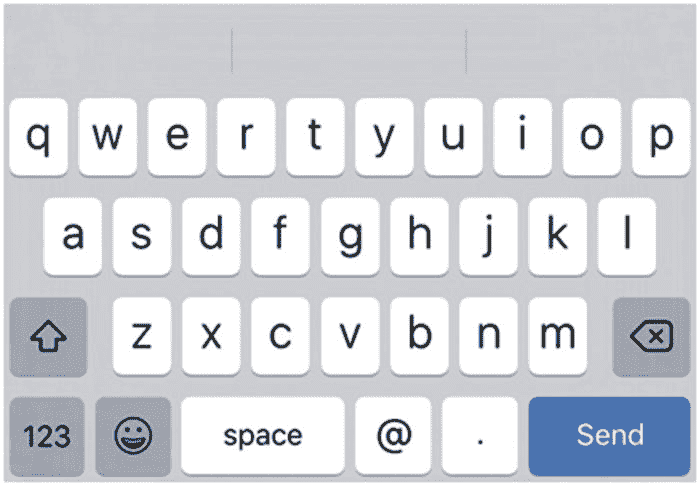
    图 7-26
    显示带有`Send` Return 键的虚拟键盘
16. 选择`模拟器 ➤ 退出模拟器`以返回`Xcode`。

通过配置文本字段及其显示的虚拟键盘，您可以自定义文本字段，以便用户使用针对特定任务优化的虚拟键盘输入特定类型的信息。

### 修改文本字段的外观

一旦确定文本字段将要保存的数据类型以及最适合该文本字段显示的虚拟键盘，最后一步就是修改文本字段的外观。修改文本字段外观的几种方式包括：

- **文本** – 存储文本字段中显示的文本
- **占位符** – 定义以浅灰色显示的文本，用于向用户说明文本字段期望输入的文本类型，例如密码或姓名
- **颜色** – 定义文本字段中文本的颜色
- **字体** – 定义文本字段中文本的字体和字号
- **清除按钮** – 定义文本字段中是否显示清除按钮，允许用户删除文本字段中的所有内容

虽然您可以在`检查器`面板中修改这些属性，但您也可以使用 Swift 代码来定义它们。首先，我们需要为要使用 Swift 代码修改的文本字段创建一个`IBOutlet`。然后，我们需要编写 Swift 代码来修改文本字段的每个属性。要查看文本字段中所有可以修改的属性，请选择`帮助 ➤ 开发者文档`并搜索`UITextField`。

要了解如何使用 Swift 代码自定义文本字段的外观，请按照以下步骤操作：

1.  确保`TextFieldApp`项目已在`Xcode`中加载。
2.  单击`导航器`面板中的`Main.storyboard`文件。
3.  选择`视图 ➤ 助理编辑器 ➤ 显示助理编辑器`，或单击`Xcode`窗口右上角的`助理编辑器`图标。`Xcode`将在`Main.storyboard`文件旁边显示`ViewController.swift`文件。
4.  将鼠标指针移到未选中`安全文本输入`复选框的文本字段上，按住`Control`键，然后从该文本字段`Ctrl-拖拽`到`class ViewController`行下方的`ViewController.swift`文件中。
5.  松开`Control`键和鼠标左键。将出现一个弹出菜单。
6.  单击`名称`文本字段，输入 **myTextField**。
7.  单击`连接`按钮。`Xcode`将创建一个`IBOutlet`，如下所示：

```
@IBOutlet var myTextField: UITextField!
```

8.  单击`导航器`面板中的`ViewController.swift`文件。
9.  选择`视图 ➤ 标准编辑器 ➤ 显示标准编辑器`，或单击`Xcode`窗口右上角的`标准编辑器`图标。`Xcode`将显示`ViewController.swift`文件。
10. 将以下代码添加到`viewDidLoad`函数中：

```
myTextField.placeholder = "Email address here"
myTextField.textColor = UIColor.red
myTextField.font = UIFont(name: "Courier", size: 16)
myTextField.clearButtonMode = .whileEditing
```

完整的`ViewController.swift`文件应如下所示：


```swift
import UIKit
class ViewController: UIViewController {
    @IBOutlet var myTextField: UITextField!
    override func viewDidLoad() {
        super.viewDidLoad()
        NotificationCenter.default.addObserver(self, selector: #selector(keyboardWillShow), name: UIResponder.keyboardWillShowNotification, object: nil)
        NotificationCenter.default.addObserver(self, selector: #selector(keyboardWillHide), name: UIResponder.keyboardWillHideNotification, object: nil)
        let tap: UITapGestureRecognizer = UITapGestureRecognizer(target: self, action: #selector(self.dismissKeyboard))
        view.addGestureRecognizer(tap)
        myTextField.placeholder = "Email address here"
        myTextField.textColor = UIColor.red
        myTextField.font = UIFont(name: "Courier", size: 16)
        myTextField.clearButtonMode = .whileEditing
    }
    @objc func dismissKeyboard() {
        view.endEditing(true)
    }
    @objc func keyboardWillShow(notification: NSNotification) {
        if let keyboardSize = (notification.userInfo?[UIResponder.keyboardFrameEndUserInfoKey] as? NSValue)?.cgRectValue {
            if self.view.frame.origin.y == 0 {
                self.view.frame.origin.y -= keyboardSize.height
            }
        }
    }
    @objc func keyboardWillHide(notification: NSNotification) {
        if ((notification.userInfo?[UIResponder.keyboardFrameEndUserInfoKey] as? NSValue)?.cgRectValue) != nil {
            if self.view.frame.origin.y != 0 {
                self.view.frame.origin.y = 0
            }
        }
    }
}
```

4.  点击**运行**按钮或选择**产品 ➤ 运行**。模拟器将会出现。

5.  点击你连接到`myTextField` IBOutlet 的文本字段。（该文本字段应以浅灰色显示“电子邮件地址”，此颜色由`placeholder`属性定义。）

6.  点击虚拟键盘。请注意，当你输入时，字母以红色和 Courier 字体显示。同时注意，一旦你输入一个字符，清除按钮就会出现在最右侧。

7.  选择**模拟器 ➤ 退出模拟器**以返回 Xcode。

在文本字段中定义清除按钮时，你有四种选择：

*   `.never` – 清除按钮永远不会出现在文本字段中。
*   `.whileEditing` – 清除按钮仅在用户开始在文本字段中编辑文本时出现。
*   `.unlessEditing` – 清除按钮仅在用户未编辑文本字段中的文本时出现。
*   `.always` – 清除按钮始终出现在文本字段中。

通过修改检查器面板中的属性或使用 Swift 代码，你可以自定义文本字段的外观和行为。

## 使用按钮

按钮代表用户可以点击的单个命令。按钮可以显示文本（通过更改**标题**属性）或图形图像（通过更改**图像**属性）。按钮的主要目的是允许用户选择一个命令，让应用执行某个操作。

与标签等并不总是需要链接到`.swift`文件的对象不同，你总是需要将按钮链接到`.swift`文件中的 IBAction 方法。IBAction 方法包含 Swift 代码，用于使按钮执行特定任务。

要了解如何为按钮创建 IBAction 方法，请按照以下步骤操作：

1.  确保 **TextFieldApp** 项目已在 Xcode 中加载。

2.  在导航器面板中点击 **Main.storyboard** 文件。

3.  点击**库**图标以打开对象库窗口。

4.  在视图上拖放一个按钮。

5.  选择**编辑器 ➤ 解决自动布局问题 ➤ 添加缺失的约束**（从子菜单的上半部分选择）。Xcode 会为按钮添加约束。

6.  选择**视图 ➤ 助理编辑器 ➤ 显示助理编辑器**，或点击 Xcode 窗口右上角的**助理编辑器**图标。Xcode 会在`Main.storyboard`文件旁边显示`ViewController.swift`文件。

7.  将鼠标指针移到选中了**安全文本输入**复选框的文本字段上。

8.  按住 **Control** 键，从该文本字段 **Ctrl-拖动** 到`ViewController.swift`文件中现有`IBOutlet`变量的下方。

9.  松开 **Control** 键和鼠标左键。会弹出一个菜单。

10. 在**名称**文本字段中点击，输入 **passwordTextField**，然后点击**连接**按钮。Xcode 会创建一个如下所示的`IBOutlet`变量：

    ```swift
    @IBOutlet var passwordTextField: UITextField!
    ```

11. 将鼠标指针移到按钮上，按住 **Control** 键，从按钮 **Ctrl-拖动** 到`ViewController.swift`文件中靠近底部最后一个大括号上方的位置，如图 7-27 所示。

    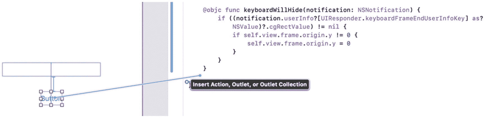
    
    **图 7-27** Ctrl-拖动以为按钮创建 IBAction 方法

12. 松开 **Control** 键和鼠标左键。会弹出一个菜单。

13. 在**名称**文本字段中点击，输入 **displayPassword**。

14. 点击**类型**弹出菜单，选择 **UIButton**。

15. 点击**连接**按钮。Xcode 会创建一个如下所示的 IBAction 方法：

    ```swift
    @IBAction func displayPassword(_ sender: UIButton) {
    }
    ```

16. 按如下方式编辑`displayPassword` IBAction 方法：

    ```swift
    @IBAction func displayPassword(_ sender: UIButton) {
        myTextField.text = passwordTextField.text?.uppercased()
    }
    ```

    每次用户点击按钮时，这个 IBAction 方法都会运行。它会获取`passwordTextField`中显示的任何文本，将其转换为大写，然后显示在`myTextField`中。

17. 点击**运行**按钮或选择**产品 ➤ 运行**。模拟器窗口将会出现。

18. 点击**密码**文本字段，使用虚拟键盘输入一个单词。

19. 点击按钮。请注意，你在**密码**文本字段中输入的文本现在会以全部大写的形式显示在另一个文本字段中。

20. 选择**模拟器 ➤ 退出模拟器**以返回 Xcode。

至此，你应该开始对理解用户界面的工作方式感到更加得心应手了。要访问对象中存储或显示的数据，你需要创建`IBOutlet`变量。要执行某种类型的操作，你需要创建一个`IBAction`方法。


## 摘要

任何用户界面的三个最常见功能包括：显示数据、允许用户输入数据以及允许用户下达命令。最常用的数据显示对象是`标签`。最常用的输入对象是`文本字段`。最常用的命令接收对象是`按钮`。

对于任何对象，你都可以通过`检查器`面板或 Swift 代码对其进行修改。当你需要定义对象的初始外观时，请使用`检查器`面板。在许多情况下，这些初始设置可能就是你所需要的全部内容。

然而，有时你可能需要在应用运行期间更改对象的属性。为此，你需要编写能够修改对象属性的 Swift 代码。要找到在编写 Swift 代码时应使用的属性名称，你需要阅读 Apple 针对不同对象（例如 `UIButton` 或 `UITextField`）的文档。你可以通过选择“帮助”➤“开发者文档”来访问 Apple 的文档。

在使用文本字段时，你可能需要在虚拟键盘出现时将其移开。为此，你需要使用 Swift 代码检测虚拟键盘何时会出现，以便你的 Swift 代码能将视图向上滑动。当不再需要虚拟键盘时，你的 Swift 代码必须使其滑回原处，同时将视图移回其初始位置。

由于文本字段可用于存储不同类型的数据，因此你可以为文本字段自定义其可容纳的常见数据类型，例如姓名、电话号码或电子邮件地址。除了定义文本字段能容纳的数据类型外，你还可以定义当用户想要在特定文本字段中输入时，会出现哪种类型的虚拟键盘。不同的虚拟键盘专门用于帮助用户输入不同类型的数据，例如文本、数字或电子邮件地址。

任何用户界面对象的基本目的都是显示信息、接受输入以及允许用户选择命令。标签、文本字段和按钮代表了任何用户界面中最常用的对象类型。所有其他类型的用户界面对象都执行这些功能中的一种或多种，只是以不同的方式实现。

在设计自己的用户界面时，请尝试寻找显示数据、接受用户输入以及提供命令供用户选择的最佳方式。一旦你掌握了标签、文本字段和按钮的基础知识，使用其他用户界面对象就不会有太大困难。

# 8. 步进器、滑块、进度视图和活动指示器视图

标签、文本字段和按钮是最常见的三种用户界面对象，但它们并非仅有的用于显示信息、接受输入和允许用户交互的对象。另外四种能以不同方式显示信息、接受输入并允许交互的用户界面对象包括：

- 步进器
- 滑块
- 进度视图
- 活动指示器视图

`步进器`显示一个减号/加号图标，用户可以点击该图标以固定增量向上或向下增加一个值。通过使用步进器，用户无需键入具体数字即可定义值。

`滑块`为用户提供了另一种无需任何键入即可输入特定值的方式。步进器和滑块都可以定义最小值和最大值，以限制用户只能选择有效的数值。对许多人来说，点击选择值比键入数字本身更容易。

`进度视图`直观地显示任务在完成前还需要进行多少。进度视图显示一个条形，并高亮显示该条形的部分内容，直到整个条形都被高亮显示。通过直观地显示任务的完成情况，进度视图可以让人轻松了解任务还需多少进度才能完成。

`活动指示器视图`提供动画显示，让用户知道某个任务正在处理中。尽管活动指示器视图不显示任务完成前还需多少进度，但它确实提供了动画效果，从而明确告知用户当前有任务正在执行中。

`步进器`和`滑块`使快速、准确地输入数值数据变得容易。`进度视图`让人轻松了解任务完成前还需多少进度，而`活动指示器视图`则只是让用户知道有事情正在发生。


## 使用步进器

`Steppers`（步进器）可以存储一个数值，用户能够以固定增量（例如 1 或 2.5）来递增该值。你可以定义步进器可表示的最小值和最大值，比如范围在 1 到 10 之间。此外，你还可以定义步进器是否循环。循环的意思是，如果你持续递增步进器超过其最大值，它会回到其最小值。同样，如果你持续递减步进器低于其最小值，它会跳转到其最大值。这可以让用户轻松选择不同的值，而不必从一个极端值费力地逐步走到另一个极端值。

要了解步进器的工作原理，请按以下步骤操作：

1. 使用“单视图应用”模板创建一个新的 iOS 项目（参见第 1 章），并将这个新项目命名为`StepperApp`。这会为用户界面创建一个单视图。
2. 在导航窗格中点击`Main.storyboard`文件。Xcode 会显示该单视图。
3. 点击“库”图标以打开“对象库”窗口。
4. 将步进器拖放到视图上的任意位置。
5. 选择“视图”➤“检查器”➤“显示属性检查器”，或者点击检查器窗格顶部的“属性检查器”图标。检查器窗格会显示步进器可用的所有属性，如图 8-1 所示。

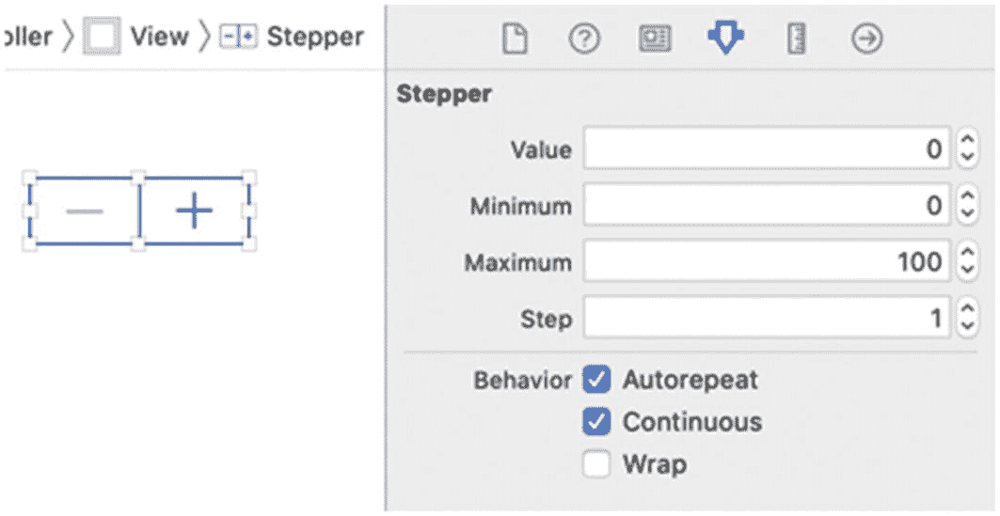

*图 8-1 在检查器窗格中修改步进器的属性*

步进器的默认设置将其当前值定义为 0，最小值定义为 0，最大值定义为 100，增量值定义为 1。

此外，其`Autorepeat`（自动重复）选项是选中的，这意味着用户无需每次都点击步进器来递增或递减其值。相反，用户只需在步进器上按住鼠标左键即可。

`Continuous`（连续）复选框也是选中的，这意味着步进器的值会不断变化以反映最新的数值。如果这个`Continuous` 复选框被清除，那么步进器的值只有在用户停止点击它时才会改变。

`Wrap`（循环）复选框是清除状态，这意味着一旦步进器达到其最小值或最大值，它就不会再递减或递增。如果`Wrap`复选框被选中，那么用户可以越过定义的最大值（100）并再次回到 0，或者低于定义的最小值（0）并再次回到 100。

1. 点击“库”图标以打开“对象库”窗口。
2. 在步进器附近拖放一个标签。
3. 点击“库”图标以打开“对象库”窗口，并在步进器和标签附近拖放一个按钮。此时，你的用户界面应包含一个步进器、一个标签和一个按钮，如图 8-2 所示。

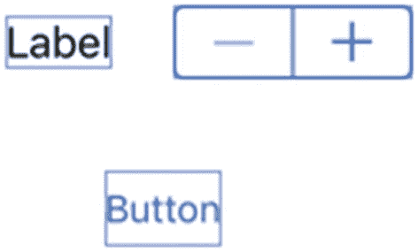

*图 8-2 用户界面上的步进器、标签和按钮*

4. 选择“编辑器”➤“解决自动布局问题”➤“重置为建议的约束”（位于子菜单的下半部分）。这会将约束添加到所有对象上。
5. 选择“视图”➤“助理编辑器”➤“显示助理编辑器”，或者点击“助理编辑器”图标。Xcode 会并排显示`Main.storyboard`和`ViewController.swift`文件。
6. 将鼠标指针移到标签上，按住 Control 键，然后从标签 Control-拖拽到`ViewController.swift`文件中`class ViewController`行的下方。
7. 松开 Control 键和鼠标左键。会弹出一个窗口。
8. 在“名称”文本框中点击，输入`labelValue`，然后点击“连接”按钮。Xcode 会创建一个`IBOutlet`变量，如下所示：

```
@IBOutlet var labelValue: UILabel!
```

1. 将鼠标指针移到步进器上，按住 Control 键，然后从步进器 Control-拖拽到`ViewController.swift`文件中`IBOutlet`行的下方。
2. 松开 Control 键和鼠标左键。会弹出一个窗口。
3. 在“名称”文本框中点击，输入`stepperValue`，然后点击“连接”按钮。Xcode 会创建一个`IBOutlet`变量，如下所示：

```
@IBOutlet var stepperValue: UIStepper!
```

4. 将鼠标指针移到步进器上，按住 Control 键，然后从步进器 Control-拖拽到`ViewController.swift`文件底部最后一个花括号的上方。
5. 松开 Control 键和鼠标左键。会弹出一个窗口。
6. 在“名称”文本框中点击，输入`stepperChanged`，在“类型”弹出菜单中点击并选择`UIStepper`，然后点击“连接”按钮。Xcode 会创建一个`IBAction`方法，如下所示：

```
@IBAction func stepperChanged(_ sender: UIStepper) {
}
```

7. 将鼠标指针移到按钮上，按住 Control 键，然后从按钮 Control-拖拽到`ViewController.swift`文件底部最后一个花括号的上方。
8. 松开 Control 键和鼠标左键。会弹出一个窗口。
9. 在“名称”文本框中点击，输入`changeStepper`，在“类型”弹出菜单中点击并选择`UIButton`，然后点击“连接”按钮。Xcode 会创建一个`IBAction`方法，如下所示：

```
@IBAction func changeStepper(_ sender: UIButton) {
}
```

10. 编辑`stepperChanged` IBAction 方法，如下所示：

```
@IBAction func stepperChanged(_ sender: UIStepper) {
    labelValue.text = "\(stepperValue.value)"
}
```

这个 IBAction 方法会检索步进器的当前值（这是一个数字），并将其显示为文本。然后将此文本放入标签中。

**注意** `\()`符号被称为字符串插值。你可以在括号内放置任何值，以将该值转换为字符串。

11. 选择“视图”➤“标准编辑器”➤“显示标准编辑器”，或者点击“标准编辑器”图标。
12. 点击“运行”按钮或选择“产品”➤“运行”。
13. 多次点击步进器上的`+`图标。请注意，每次点击步进器的`+`图标时，标签中的数值都会增加 1。
14. 多次点击步进器上的`–`图标。请注意，每次点击步进器的`–`图标时，标签中的数值都会减少 1。
15. 选择“模拟器”➤“退出模拟器”以返回 Xcode。

步进器的增量为 1，最小值为 0，最大值为 100，这是因为其在属性检查器窗格中显示的默认设置。我们可以在检查器窗格中更改这些设置，但这里我们改为使用 Swift 代码来更改它们。

要了解如何使用 Swift 代码更改步进器的属性，请按以下步骤操作：

1. 在导航窗格中点击`ViewController.swift`文件。
2. 编辑`changeStepper` IBAction 方法，如下所示：

```
@IBAction func changeStepper(_ sender: UIButton) {
    stepperValue.minimumValue = -10
    stepperValue.maximumValue = -5
    stepperValue.stepValue = 0.5
    stepperValue.isContinuous = true
    stepperValue.autorepeat = true
    stepperValue.wraps = true
}
```

将步进器的`isContinuous`、`autorepeat`和`wraps`属性设置为`true`，等同于在检查器窗格中选中`Continuous`、`Autorepeat`和`Wraps`复选框。

3. 点击“运行”按钮或选择“产品”➤“运行”。模拟器窗口会显示。
4. 点击步进器上的`+`图标。请注意，每次点击`+`图标时，标签中的值都会增加 1。
5. 点击按钮。这会运行`changeStepper` IBAction 方法中的 Swift 代码。
6. 点击步进器中的`–`和`+`图标。请注意，现在步进器以 0.5 为增量递增或递减，因为 Swift 代码将其`stepValue`属性定义为了 0.5。
7. 选择“模拟器”➤“退出模拟器”以返回 Xcode。

完整的`ViewController.swift`文件应如下所示：


```swift
import UIKit
class ViewController: UIViewController {
@IBOutlet var labelValue: UILabel!
@IBOutlet var stepperValue: UIStepper!
override func viewDidLoad() {
super.viewDidLoad()
// Do any additional setup after loading the view, typically from a nib.
}
@IBAction func stepperChanged(_ sender: UIStepper) {
labelValue.text = "\(stepperValue.value)"
}
@IBAction func changeStepper(_ sender: UIButton) {
stepperValue.minimumValue = -10
stepperValue.maximumValue = -5
stepperValue.stepValue = 0.5
stepperValue.isContinuous = true
stepperValue.autorepeat = true
stepperValue.wraps = true
}
}
```

## 使用滑块

与步进器类似，滑块允许用户在不输入具体数字的情况下选择数值。步进器强制用户以固定增量/减量更改数值，而滑块则让用户通过简单地改变滑块位置，快速在一系列数值之间进行选择。

滑块的一个缺点是比步进器占用更多空间。另一个缺点是步进器允许你定义固定的增量/减量值，而滑块则不能。

如图 8-3 所示，滑块由三部分组成：

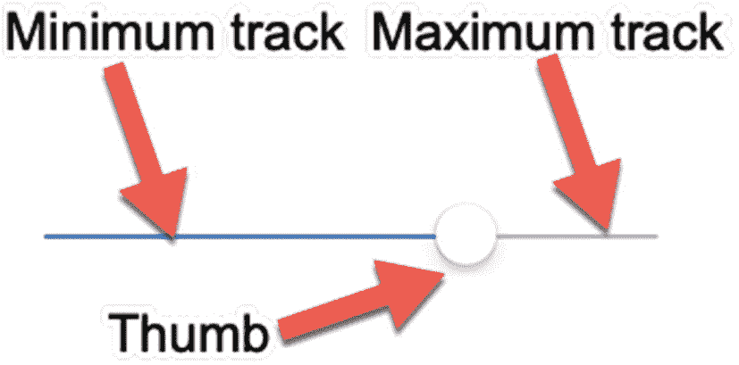

图 8-3

滑块的三个部分

*   拇指滑块
*   最小轨迹
*   最大轨迹

最小轨迹和最大轨迹通常以不同颜色显示，以便清晰显示拇指滑块的位置。不过，你可以为拇指滑块、最小轨迹和最大轨迹定义颜色，使其更加醒目。

要了解如何使用滑块，请按照以下步骤操作：

1.  使用“单视图应用”模板（见第 1 章）创建一个新的 iOS 项目，并将该项目命名为 `SliderApp`。这将为界面创建一个单视图。

2.  在导航面板中点击 `Main.storyboard` 文件。Xcode 会显示该单视图。

3.  点击库图标以显示对象库。

4.  将一个标签、一个按钮和一个滑块拖放至视图中。

5.  拉伸滑块的宽度，使其更长。

6.  选择“编辑器”➤“解决自动布局问题”➤“重置为建议的约束”（位于子菜单的下半部分）。这将为标签、按钮和滑块应用约束。

7.  选择“视图”➤“助理编辑器”➤“显示助理编辑器”，或点击助理编辑器图标。Xcode 会并排显示 `Main.storyboard` 和 `ViewController.swift` 文件。

8.  将鼠标指针移到标签上，按住 Control 键，然后从标签处按住 Control 键拖拽至 `ViewController.swift` 文件中 `class ViewController` 行的下方。

9.  松开 Control 键和鼠标左键。将出现一个弹出窗口。

10. 点击“名称”文本字段，输入 `labelValue`，然后点击“连接”按钮。Xcode 会按如下方式创建一个 `IBOutlet` 变量：

```swift
@IBOutlet var labelValue: UILabel!
```

11. 将鼠标指针移到滑块上，按住 Control 键，然后从滑块处按住 Control 键拖拽至 `ViewController.swift` 文件中 `IBOutlet` 行的下方。

12. 松开 Control 键和鼠标左键。将出现一个弹出窗口。

13. 点击“名称”文本字段，输入 `sliderValue`，然后点击“连接”按钮。Xcode 会按如下方式创建一个 `IBOutlet` 变量：

```swift
@IBOutlet var sliderValue: UISlider!
```

14. 将鼠标指针移到按钮上，按住 Control 键，然后从按钮处按住 Control 键拖拽至 `ViewController.swift` 文件底部最后一个花括号的上方。

15. 松开 Control 键和鼠标左键。将出现一个弹出窗口。

16. 点击“名称”文本字段，输入 `changeSlider`，点击“类型”弹出菜单并选择 `UIButton`，然后点击“连接”按钮。Xcode 会按如下方式创建一个 `IBAction` 方法：

```swift
@IBAction func changeSlider(_ sender: UIButton) {
}
```

17. 将鼠标指针移到滑块上，按住 Control 键，然后从滑块处按住 Control 键拖拽至 `ViewController.swift` 文件底部最后一个花括号的上方。

18. 松开 Control 键和鼠标左键。将出现一个弹出窗口。

19. 点击“名称”文本字段，输入 `sliderValueChanged`，点击“类型”弹出菜单并选择 `UISlider`，然后点击“连接”按钮。Xcode 会按如下方式创建一个 `IBAction` 方法：

```swift
@IBAction func sliderValueChanged(_ sender: UISlider) {
}
```

20. 选择“视图”➤“标准编辑器”➤“显示标准编辑器”，或点击 Xcode 窗口右上角的标准编辑器图标。

21. 在导航面板中点击 `ViewController.swift` 文件进行编辑。

22. 按如下方式修改 `sliderValueChanged` 方法：

```swift
@IBAction func sliderValueChanged(_ sender: UISlider) {
labelValue.text = "\(sliderValue.value)"
}
```

完整的 `ViewController.swift` 文件应如下所示：

```swift
import UIKit
class ViewController: UIViewController {
@IBOutlet var labelValue: UILabel!
@IBOutlet var sliderValue: UISlider!
override func viewDidLoad() {
super.viewDidLoad()
// Do any additional setup after loading the view, typically from a nib.
}
@IBAction func changeSlider(_ sender: UIButton) {
}
@IBAction func sliderValueChanged(_ sender: UISlider) {
labelValue.text = "\(sliderValue.value)"
}
}
```

23. 点击“运行”按钮，或选择“产品”➤“运行”。模拟器窗口会显示。

24. 左右拖动滑块。注意，如果将滑块拇指拖到最左侧，标签中会显示值 0（零）；如果将滑块拇指拖到最右侧，则会显示值 1.0。这是因为滑块的默认最小值和最大值分别为 0 和 1。

25. 选择“模拟器”➤“退出模拟器”返回 Xcode。


### 使用 Swift 代码修改滑块

就像你可以通过属性检查器面板自定义滑块一样，你也可以使用 Swift 代码来修改滑块。滑块上一些常见的可修改属性包括：

- `.value` – 定义滑块显示的初始值
- `.minimumValue` – 定义滑块可表示的最小值
- `.maximumValue` – 定义滑块可表示的最大值
- `.thumbTintColor` – 定义滑块上滑钮的颜色
- `.minimumTrackTintColor` – 定义最小值轨迹的颜色
- `.maximumTrackTintColor` – 定义最大值轨迹的颜色

要了解如何使用 Swift 代码修改滑块，请按照以下步骤操作：

1.  确保 SliderApp 项目已在 Xcode 中加载。
2.  单击导航面板中的 `ViewController.swift` 文件，编辑 `ViewController.swift` 文件。
3.  如下所示修改 `changeSlider` IBAction 方法：

```swift
@IBAction func changeSlider(_ sender: UIButton) {
    sliderValue.minimumValue = 1
    sliderValue.maximumValue = 25
    sliderValue.value = 7
    sliderValue.minimumTrackTintColor = UIColor.red
    sliderValue.maximumTrackTintColor = UIColor.green
    sliderValue.thumbTintColor = UIColor.black
}
```

完整的 `ViewController.swift` 文件应如下所示：

```swift
import UIKit
class ViewController: UIViewController {
    @IBOutlet var labelValue: UILabel!
    @IBOutlet var sliderValue: UISlider!
    override func viewDidLoad() {
        super.viewDidLoad()
        // 加载视图后进行任何额外的设置，通常来自 nib 文件。
    }
    @IBAction func changeSlider(_ sender: UIButton) {
        sliderValue.minimumValue = 1
        sliderValue.maximumValue = 25
        sliderValue.value = 7
        sliderValue.minimumTrackTintColor = UIColor.red
        sliderValue.maximumTrackTintColor = UIColor.green
        sliderValue.thumbTintColor = UIColor.black
    }
    @IBAction func sliderValueChanged(_ sender: UISlider) {
        labelValue.text = "\(sliderValue.value)"
    }
}
```

4.  单击“运行”按钮或选择“产品”➤“运行”。此时会出现模拟器窗口。
5.  左右拖动滑块。请注意，标签显示的值在 0 到 1 之间，这些是由属性检查器面板定义的最小值和最大值。
6.  单击按钮。这会运行 Swift 代码来修改滑块。
7.  左右拖动滑块。请注意，标签现在显示的值在 1 到 25 之间。此外，滑块会以不同的颜色显示滑钮、最小值轨迹和最大值轨迹。
8.  选择“模拟器”➤“退出模拟器”以返回 Xcode。

## 使用进度视图和活动指示器视图

进度视图显示一个水平条，该水平条会填充颜色以直观地显示任务的进度。当进度视图为空时，表示任务尚未开始。当进度视图完全被颜色填满时，表示任务已完成。当进度视图部分被填充时，则表示任务部分完成。

然而，有时无法确切知道任务何时会完成。在这种情况下，进度视图会显得停滞不前，给人一种什么都没发生或应用可能已崩溃的错觉。当无法确定任务何时完成时，最好使用活动指示器视图，它会显示一个动画旋转器，表明有事情正在发生。

进度视图和活动指示器视图的主要区别在于：

-   进度视图显示任务完成了多少，而活动指示器视图则不显示。
-   活动指示器视图持续显示有事情正在发生，而进度视图可能不会。

要了解如何使用进度视图和活动指示器视图，请按照以下步骤操作：

1.  使用“单视图应用”模板创建一个新的 iOS 项目（参见第 1 章），并将此新项目命名为 `ProgressApp`。这会为用户界面创建一个单视图。
2.  单击导航面板中的 `Main.storyboard` 文件。Xcode 将显示该单视图。
3.  单击“库”图标以显示对象库。
4.  将一个按钮和一个活动指示器视图拖放到用户界面上，如图 8-4 所示。

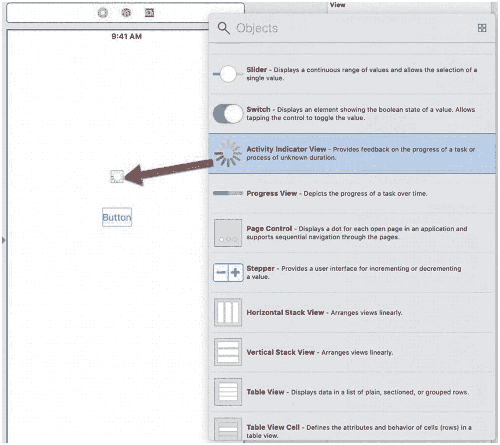

图 8-4 – 将活动指示器视图从对象库窗口拖到用户界面上

5.  选择“编辑器”➤“解决自动布局问题”➤“重置为建议的约束”（位于子菜单的下半部分）。这将为用户界面上的所有对象添加约束。
6.  单击导航面板中的 `Main.storyboard` 文件。
7.  选择“视图”➤“辅助编辑器”➤“显示辅助编辑器”，或单击 Xcode 窗口右上角的“辅助编辑器”图标。Xcode 会将 `Main.storyboard` 文件与 `ViewController.swift` 文件并排显示。
8.  将鼠标移到活动指示器视图上，按住 Control 键，然后 Control-拖动到 `ViewController.swift` 文件中 `IBOutlet` 行下方。
9.  松开 Control 键和鼠标左键。将出现一个弹出窗口。
10. 在“名称”文本字段中单击，输入 `activityView`，然后单击“连接”按钮。Xcode 会创建一个如下所示的 `IBOutlet`：

```swift
@IBOutlet var activityView: UIActivityIndicatorView!
```

11. 将鼠标移到按钮上，按住 Control 键，然后 Control-拖动到 `ViewController.swift` 文件中底部最后一个大括号上方。
12. 松开 Control 键和鼠标左键。将出现一个弹出窗口。
13. 在“名称”文本字段中单击，输入 `runButton`，单击“类型”弹出菜单并选择 `UIButton`，然后单击“连接”按钮。Xcode 会创建一个如下所示的 `IBAction` 方法：

```swift
@IBAction func runButton(_ sender: UIButton) {
}
```

14. 选择“视图”➤“标准编辑器”➤“显示标准编辑器”，或单击 Xcode 窗口右上角的“标准编辑器”图标。
15. 单击导航面板中的 `ViewController.swift` 文件。
16. 在 `IBOutlet` 变量上方添加此行：

```swift
var counter = 0
```

17. 在 `viewDidLoad` 函数内部添加此行：

```swift
activityView.hidesWhenStopped = true
```

18. 如下所示编辑这个 `runButton` IBAction 方法：

```swift
@IBAction func runButton(_ sender: UIButton) {
    Timer.scheduledTimer(withTimeInterval: 1.0, repeats: true) { timer in
        self.activityView.startAnimating()
        self.counter += 1
        if self.counter >= 5 {
            self.activityView.stopAnimating()
            timer.invalidate()
        }
    }
}
```


这段代码运行一个以 1 秒为增量计时的计时器。运行时，它会调用 `startAnimating` 方法，使活动指示器视图看起来在旋转。活动指示器视图一旦开始旋转，就会显示在屏幕上。

5 秒后，计时器停止运行，并调用 `stopAnimating` 方法，使活动指示器视图停止旋转。它一旦停止旋转，就会从屏幕上消失。完整的 `ViewController.swift` 文件应如下所示：

```swift
import UIKit
class ViewController: UIViewController {
    var counter = 0
    @IBOutlet var activityView: UIActivityIndicatorView!
    override func viewDidLoad() {
        super.viewDidLoad()
        activityView.hidesWhenStopped = true
        // Do any additional setup after loading the view, typically from a nib.
    }
    @IBAction func runButton(_ sender: UIButton) {
        Timer.scheduledTimer(withTimeInterval: 1.0, repeats: true) { timer in
            self.activityView.startAnimating()
            self.counter += 1
            if self.counter >= 5 {
                self.activityView.stopAnimating()
                timer.invalidate()
                self.counter = 0
            }
        }
    }
}
```

3.  点击“运行”按钮，或选择“产品” ➤ “运行”。模拟器屏幕会出现。
4.  点击该按钮。活动指示器视图会开始旋转，5 秒后，它会消失。
5.  选择“模拟器” ➤ “退出模拟器”以返回 Xcode。

### 使用进度视图

进度视图会逐渐填满，以显示任务的完成进度。这意味着你的应用程序需要知道任务何时完成。由于进度视图以视觉方式显示进度，最好确保进度视图以较快的速度填满，向用户反馈应用程序正在工作，并显示任务即将完成。如果进度视图填满得太慢，应用程序可能会显得卡顿。

要了解进度视图如何工作，请按照以下步骤操作：

1.  确保 `ProgressApp` 已加载到 Xcode 中。
2.  在导航窗格中点击 `Main.storyboard` 文件。Xcode 会显示单个视图。
3.  点击“库”图标以显示对象库。
4.  将标签、步进器和进度视图拖放到用户界面中，使标签位于进度视图上方，步进器位于进度视图下方，如图 8-5 所示。
5.  点击标签，并展开标签的宽度，使其拉伸到进度视图两端之外。
6.  按住 Shift 键，点击标签、进度视图和步进器，使这三个对象周围都出现控制手柄。
7.  选择“编辑器” ➤ “解决自动布局问题” ➤ “重置为建议的约束”（子菜单的下半部分）。这将为标签、进度视图和步进器设置约束。
8.  将鼠标移到标签上，按住 Control 键，然后 Control-拖动到 `@IBOutlet` 行下方的 `ViewController.swift` 文件中。
9.  松开 Control 键和鼠标左键。将出现一个弹出窗口。
10. 点击“名称”文本字段并输入 `labelProgress`，然后点击“连接”按钮。Xcode 会创建一个 `@IBOutlet`，如下所示：

```swift
@IBOutlet var labelProgress: UILabel!
```

11. 将鼠标移到进度视图上，按住 Control 键，然后 Control-拖动到 `class ViewController` 行下方的 `ViewController.swift` 文件中。
12. 松开 Control 键和鼠标左键。将出现一个弹出窗口。
13. 点击“名称”文本字段并输入 `progressView`，然后点击“连接”按钮。Xcode 会创建一个 `@IBOutlet`，如下所示：

```swift
@IBOutlet var progressView: UIProgressView!
```

14. 将鼠标移到步进器上，按住 Control 键，然后 Control-拖动到 `@IBOutlet` 行下方的 `ViewController.swift` 文件中。
15. 松开 Control 键和鼠标左键。将出现一个弹出窗口。
16. 点击“名称”文本字段并输入 `stepperObject`，然后点击“连接”按钮。Xcode 会创建一个 `@IBOutlet`，如下所示：

```swift
@IBOutlet var stepperObject: UIStepper!
```

17. 将鼠标移到步进器上，按住 Control 键，然后 Control-拖动到 `ViewController.swift` 文件底部最后一个大括号上方的位置。
18. 松开 Control 键和鼠标左键。将出现一个弹出窗口。
19. 点击“名称”文本字段，输入 `stepperChanged`，点击“类型”弹出菜单并选择 `UIStepper`，然后点击“连接”按钮。Xcode 会创建一个 `@IBAction` 方法，如下所示：

```swift
@IBAction func stepperChanged(_ sender: UIStepper) {
}
```

20. 选择“视图” ➤ “标准编辑器” ➤ “显示标准编辑器”，或点击 Xcode 窗口右上角的“标准编辑器”图标。
21. 在导航窗格中点击 `ViewController.swift` 文件。
22. 编辑 `stepperChanged` `IBAction` 方法，如下所示：

```swift
@IBAction func stepperChanged(_ sender: UIStepper) {
    labelProgress.text = "Completed \(Int(stepperObject.value * 10)) of 10 tasks"
    progressView.progress = Float(stepperObject.value)
}
```

第一行从步进器获取值，将其乘以 10，并将值转换为整数。第二行获取步进器的值，将其转换为 `Float` 值，并将此值存储在进度视图中，进度视图通过填充自身来显示该值。

23. 编辑 `viewDidLoad` 方法，添加以下三行代码：

```swift
progressView.progress = 0
stepperObject.stepValue = 0.1
stepperObject.maximumValue = 1.0
```

第一行将进度视图的值设置为 0，使其在用户界面上看起来是完全空的。第二行定义步进器增量为 0.1。第三行定义步进器最大值为 1.0。完整的 `ViewController.swift` 文件应如下所示：

```swift
import UIKit
class ViewController: UIViewController {
    var counter = 0
    @IBOutlet var labelProgress: UILabel!
    @IBOutlet var progressView: UIProgressView!
    @IBOutlet var stepperObject: UIStepper!
    @IBOutlet var activityView: UIActivityIndicatorView!
    override func viewDidLoad() {
        super.viewDidLoad()
        activityView.hidesWhenStopped = true
        progressView.progress = 0
        stepperObject.stepValue = 0.1
        stepperObject.maximumValue = 1.0
        // Do any additional setup after loading the view, typically from a nib.
    }
    @IBAction func runButton(_ sender: UIButton) {
        Timer.scheduledTimer(withTimeInterval: 1.0, repeats: true) { timer in
            self.activityView.startAnimating()
            self.counter += 1
            if self.counter >= 5 {
                self.activityView.stopAnimating()
                timer.invalidate()
                self.counter = 0
            }
        }
    }
    @IBAction func stepperChanged(_ sender: UIStepper) {
        labelProgress.text = "Completed \(Int(stepperObject.value * 10)) of 10 tasks"
        progressView.progress = Float(stepperObject.value)
    }
}
```

24. 点击“运行”按钮，或选择“产品” ➤ “运行”。模拟器窗口会出现。
25. 多次点击步进器上的 `+` 图标。请注意，每次点击步进器上的 `+` 图标时，进度视图看起来会更满，并且标签会显示进度，如图 8-6 所示。
26. 选择“模拟器” ➤ “退出模拟器”以返回 Xcode。


## 摘要

当你的应用需要用户输入数值数据时，文本框虽然可行，但使用起来可能不够便捷，尤其是当你只想接受一个有限范围的数值时。为了简化数值数据的输入，可以使用步进器或滑块。

步进器和滑块都可以定义最小值和最大值，这样用户就无法输入低于最小值或高于最大值的数值。步进器的额外优势在于，它可以让用户按固定值递增/递减数值。

步进器占用空间更小，但滑块通过简单拖拽滑块上的拇指（圆形）就能更轻松地将数值从一个极端更改为另一个极端。如果可接受的数值范围很大，步进器会强制用户逐次递增/递减，因此定义数值的速度可能会慢得多。

为了显示任务的进度，你的应用可以使用标签显示一条消息，但更简单的方法是使用`进度视图`或`活动指示器视图`。`进度视图`可以让用户了解任务完成的进度，而`活动指示器视图`则让用户知道有事情正在发生。

你可以单独或同时使用`进度视图`或`活动指示器视图`。`活动指示器视图`通常会显示动画，然后在任务完成时消失。

通过使用步进器和滑块，你可以让用户轻松输入数值数据。通过使用`进度视图`和`活动指示器视图`，你的应用可以轻松地让用户知道任务正在执行。

# 图像视图和文本视图

文本字段可以显示文本，并允许用户编辑或输入新文本。但是，如果需要显示大量文本，文本字段可能会显得过于局限。为了克服文本字段大小有限的问题，你可以改用文本视图。文本视图本质上是文本字段的放大版本，可以显示大量文本，或允许用户编辑和输入大量文本。

由于并非所有数据都是文本，你可以使用图像视图来显示图形图像。图像视图可以显示纯装饰性的图形，或为用户提供额外信息，例如根据用户正在执行的操作更改图像。文本视图和图像视图都可以让你在 iOS 用户界面上显示任意大小的信息。

## 使用图像视图

在最简单的情况下，图像视图可以显示图形图像，例如`.jpg`或`.png`图像。然而，图像视图也可以允许交互，从而能够响应用户的触摸或手势。这使得图像视图既能显示图形图像，又能识别用户的触摸输入。

要了解图像视图的工作原理，请遵循以下步骤：

1. 使用“单视图应用”模板创建一个新的 iOS 项目（参见第 1 章），并将此新项目命名为`ImageViewApp`。这将为用户界面创建一个单独的视图。

2. 在导航面板中点击`Main.storyboard`文件。Xcode 会显示该单独视图。

3. 点击库图标以打开对象库窗口。

4. 将图像视图拖放到视图上的任意位置。此时图像视图是空的，因此我们需要放些东西进去才能显示它。在你的 Macintosh 电脑上找一个`.jpg`或`.png`图像。你也可以从`www.pexels.com`、`free-images.com`或`www.nasa.gov`查找并下载大量免费图像。

5. 将`.jpg`或`.png`图像从“访达”窗口拖放到导航面板中，如图 9-1 所示。

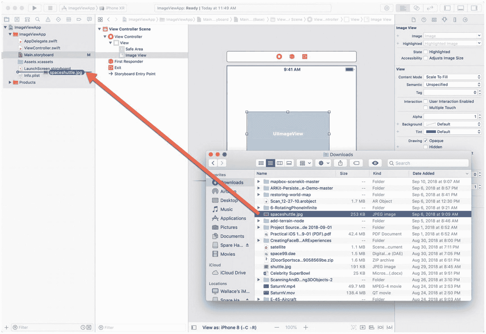

*图 9-1 — 将图像拖放到 Xcode 项目*

6. 当导航面板中出现一条水平线时，松开鼠标左键。Xcode 会显示一个对话框，以完成将图形图像复制到 Xcode 项目中的过程。

7. 选中“如果需要，拷贝项目”复选框，如图 9-2 所示。

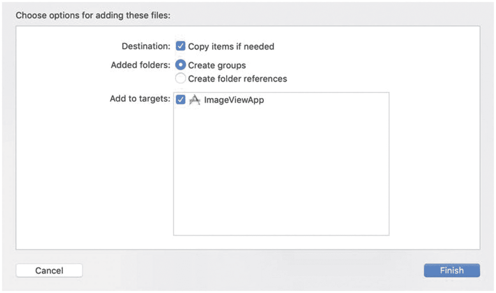

*图 9-2 — 在 Xcode 项目中存储图形图像*

8. 点击“完成”按钮。Xcode 会在导航面板中显示你的图形文件名称。

9. 在导航面板中点击图形图像名称。中间的 Xcode 面板会显示图形图像的内容。

10. 点击图像视图对象以将其选中。

11. 选择`视图` ➤ `检查器` ➤ `显示属性检查器`，或点击 Xcode 窗口右上角的“属性检查器”图标。

12. 点击“图像”弹出菜单，并选择你的图形图像名称，例如`spaceshuttle.jpg`，如图 9 -3 所示。Xcode 会将你的图形图像显示在图像视图内部。

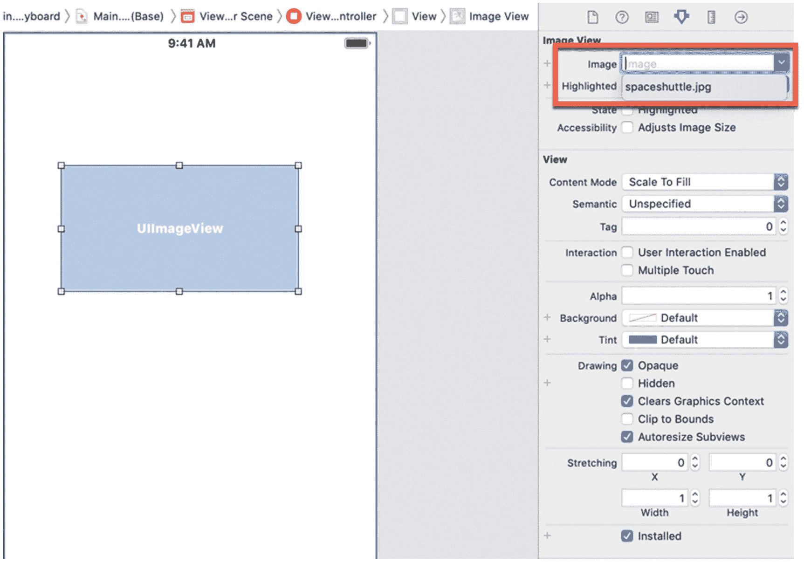

*图 9-3 — 选择要在图像视图中显示的图形图像*

“内容模式”弹出菜单提供了几种在图像视图中显示图像的选项：

-   **缩放填充** – 改变图像尺寸以填充图像视图，无论图像视图的高度或宽度如何。如果图像视图过高或过宽，这可能会导致图像变形。
-   **比例适配** – 在保留原始图像宽高比的情况下，使图像适配图像视图的宽度和高度。这意味着图像可能无法完全填满图像视图的高度或宽度，如图 9-4 所示。

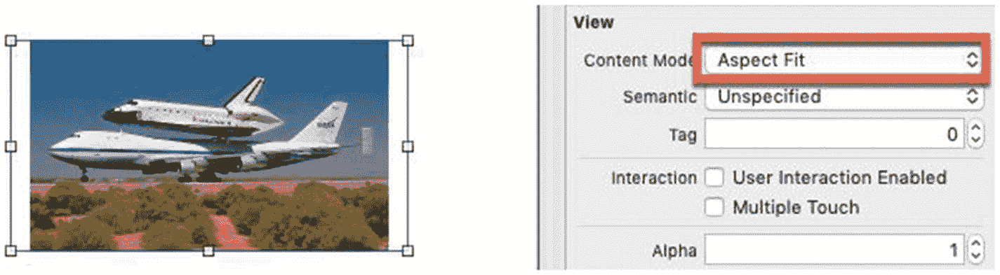

*图 9-4 — 比例适配可能会在图像视图内留下空白区域*

-   **比例填充** – 扩展图像以填充图像视图的宽度或高度。这意味着图像可能会超出图像视图的宽度或高度。
-   **重绘** – 拉伸图像以填充图像视图的宽度和高度。
-   **居中** – 在图像视图内居中显示图像。如果图像大于图像视图，则图像的其余部分会显示在图像视图之外。
-   **顶部** – 在图像视图内靠顶部显示图像。如果图像大于图像视图，则图像的其余部分会显示在图像视图之外。
-   **底部** – 在图像视图内靠底部显示图像。如果图像大于图像视图，则图像的其余部分会显示在图像视图之外。
-   **左侧** – 在图像视图内靠左居中显示图像。如果图像大于图像视图，则图像的其余部分会显示在图像视图之外。
-   **右侧** – 在图像视图内靠右居中显示图像。如果图像大于图像视图，则图像的其余部分会显示在图像视图之外。
-   **左上** – 在图像视图内显示图像的左上角。如果图像大于图像视图，则图像的其余部分会显示在图像视图之外。
-   **右上** – 在图像视图内显示图像的右上角。如果图像大于图像视图，则图像的其余部分会显示在图像视图之外。
-   **左下** – 在图像视图内显示图像的左下角。如果图像大于图像视图，则图像的其余部分会显示在图像视图之外。
-   **右下** – 在图像视图内显示图像的右下角。如果图像大于图像视图，则图像的其余部分会显示在图像视图之外。


### 让图像视图实现交互

默认情况下，图像视图会忽略所有触摸交互。要让图像视图响应触摸，可以通过以下两种方式之一启用用户交互，如图 9-5 所示：

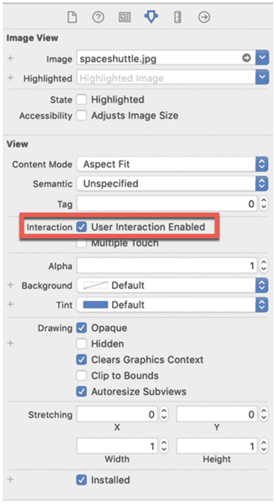

图 9-5  
允许图像视图响应触摸手势

*   选中**启用用户交互**复选框。
*   使用 Swift 代码将 `.isUserInteractionEnabled` 属性设置为 `true`。

要了解如何使图像视图响应触摸手势，请按照以下步骤操作：

1.  在 `ImageViewApp` 项目的导航器窗格中，点击 `Main.storyboard` 文件。
2.  选择“视图” ➤ “助理编辑器” ➤ “显示助理编辑器”，或点击助理编辑器图标。Xcode 会并排显示 `Main.storyboard` 和 `ViewController.swift` 文件。
3.  将鼠标指针移到图像视图上，按住 Control 键，然后从图像视图按住 Control 键拖拽到 `ViewController.swift` 文件中 `“class ViewController”` 行下方的位置。
4.  松开 Control 键和鼠标左键。会弹出一个窗口。
5.  在“名称”文本字段中点击，输入 **imageView**，然后点击“连接”按钮。Xcode 会创建一个 `IBOutlet` 变量，如下所示：

    ```
    @IBOutlet var imageView: UIImageView!
    ```

1.  选择“视图” ➤ “标准编辑器” ➤ “显示标准编辑器”，或点击标准编辑器图标。
2.  在导航器窗格中点击 `ViewController.swift` 文件。
3.  向 `viewDidLoad` 方法添加以下代码行：

    ```
    imageView.isUserInteractionEnabled = true
    ```

1.  在 `viewDidLoad` 方法下方键入以下代码：

    ```
    override func touchesBegan(_ touches: Set<UITouch>, with event: UIEvent?) {
    let touch = touches.first
    if touch?.view == imageView {
    print ("Touched")
    } else {
    print ("Nothing ")
    }
    }
    ```

每当用户点击屏幕时，上述 `touchesBegan` 方法都会运行。（在模拟器中，点击鼠标模拟手指点击。）`if-else` 语句会检查用户是否点击了图像视图。如果是，则输出“Touched”。如果用户点击了图像视图以外的区域，则输出“Nothing”。

整个 `ViewController.swift` 文件应如下所示：

```
import UIKit
class ViewController: UIViewController {
@IBOutlet var imageView: UIImageView!
override func viewDidLoad() {
super.viewDidLoad()
imageView.isUserInteractionEnabled = true
// 视图加载后执行任何其他设置，通常从 nib 文件加载。
}
override func touchesBegan(_ touches: Set<UITouch>, with event: UIEvent?) {
let touch = touches.first
if touch?.view == imageView {
print ("Touched")
} else {
print ("Nothing ")
}
}
}
```

1.  点击“运行”按钮或选择“产品” ➤ “运行”。模拟器屏幕出现。
2.  点击您存储在图像视图中的图形图像。注意，每次点击图像视图时，Xcode 窗口底部的“调试区域”都会显示“Touched”。
3.  点击模拟器屏幕上远离图像视图的任何其他位置。注意，每次点击图像视图以外的区域时，Xcode 窗口底部的“调试区域”都会显示“Nothing”。
4.  选择“模拟器” ➤ “退出模拟器”以返回 Xcode。

## 使用文本视图

文本视图的行为类似于文本字段。主要区别在于，文本视图可以更大，更像是一个微型文字处理器，允许用户移动光标并查看或编辑大量文本。由于文本视图既可以显示文本，也允许用户输入文本，因此需要修改的第一个属性是是否希望文本视图可编辑。

可编辑的文本视图意味着用户可以修改其中显示的文本。不可编辑的文本视图意味着用户无法修改文本，因此文本视图就像一个大的标签。修改文本视图可编辑属性的方法有两种：

*   在属性检查器中选中“可编辑”复选框（默认已选中），如图 9-6 所示。
*   使用 Swift 代码将文本视图的 `.editable` 属性设置为 `true`。

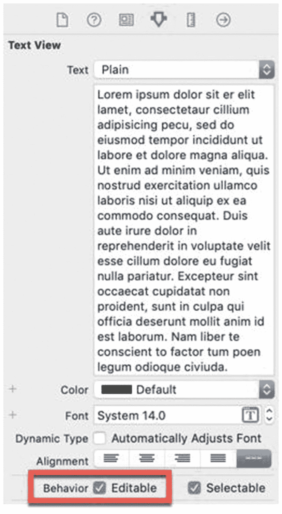

图 9-6  
使文本视图可编辑

要了解如何使用文本视图，请按照以下步骤操作：

1.  使用“单视图应用”模板创建一个新的 iOS 项目（参见第 1 章），并将此新项目命名为 `TextViewApp`。这会为用户界面创建一个单视图。
2.  在导航器窗格中点击 `Main.storyboard` 文件。Xcode 会显示该单视图。
3.  点击库图标以打开对象库窗口。
4.  在视图顶部附近拖放一个文本视图和一个按钮。
5.  选择“编辑器” ➤ “解决自动布局问题” ➤ “重置为建议的约束”（位于子菜单的下半部分）。这会为文本视图和按钮添加约束。
6.  选择“视图” ➤ “助理编辑器” ➤ “显示助理编辑器”，或点击助理编辑器图标。Xcode 会并排显示 `Main.storyboard` 和 `ViewController.swift` 文件。
7.  将鼠标指针移到文本视图上，按住 Control 键，然后从文本视图按住 Control 键拖拽到 `ViewController.swift` 文件中 `“class ViewController”` 行下方的位置。
8.  松开 Control 键和鼠标左键。会弹出一个窗口。
9.  在“名称”文本字段中点击，输入 **textView**，然后点击“连接”按钮。Xcode 会创建一个 `IBOutlet` 变量，如下所示：

    ```
    @IBOutlet var textView: UITextView!
    ```

1.  将鼠标指针移到按钮上，按住 Control 键，然后从按钮按住 Control 键拖拽到 `ViewController.swift` 文件中 `IBOutlet` 行下方的位置。
2.  松开 Control 键和鼠标左键。会弹出一个窗口。
3.  在“名称”文本字段中点击，输入 **buttonObject**，然后点击“连接”按钮。Xcode 会创建一个 `IBOutlet` 变量，如下所示：

    ```
    @IBOutlet var buttonObject: UIButton!
    ```

1.  将鼠标指针移到按钮上，按住 Control 键，然后按住 Control 键拖拽到 `ViewController.swift` 文件底部最后一个右花括号的上方。
2.  松开 Control 键和鼠标左键。会弹出一个窗口。
3.  在“名称”文本字段中点击，输入 **buttonTapped**，点击“类型”弹出菜单并选择 `UIButton`，然后点击“连接”按钮。Xcode 会创建一个 `IBAction` 方法，如下所示：

    ```
    @IBAction func buttonTapped(_ sender: UIButton) {
    }
    ```

4.  编辑 `buttonTapped` `IBAction` 方法，如下所示：

    ```
    @IBAction func buttonTapped(_ sender: UIButton) {
    if textView.isEditable == true {
    textView.isEditable = false
    } else {
    textView.isEditable = true
    }
    }
    ```


#### 注意

赋值变量时使用单个等号（`=`），而比较两个值时则使用双等号（`==`）。

这个 `IBAction` 方法用于切换文本视图的编辑状态。当文本视图可编辑时，可以修改文字；当文本视图不可编辑时，则无法修改文字。完整的 `ViewController.swift` 文件应如下所示：

1.  点击运行按钮，或选择“产品”➤“运行”。模拟器窗口随即出现。
2.  点击文本视图。按退格键和删除键删除文字。
3.  点击按钮。这将执行 `buttonTapped` IBAction 方法中的 Swift 代码，使文本视图变为不可编辑。
4.  点击文本视图。请注意，您已无法再编辑其中的文字。
5.  重复步骤 18–20，观察如何将文本视图在可编辑与不可编辑状态间切换。
6.  选择“模拟器”➤“退出模拟器”以返回 Xcode。

```
import UIKit
class ViewController: UIViewController {
@IBOutlet var textView: UITextView!
@IBOutlet var buttonObject: UIButton!
override func viewDidLoad() {
super.viewDidLoad()
// 加载视图后的其他设置，通常来自 nib 文件
}
@IBAction func buttonTapped(_ sender: UIButton) {
if textView.isEditable == true {
textView.isEditable = false
} else {
textView.isEditable = true
}
}
}
```

### 更改文本视图中的文字外观

与可以分别更改不同文字外观的文字处理软件不同，文本视图中的所有文字总是以相同的文字颜色、背景颜色、字体及字号显示。在 Swift 中，用于修改文字颜色、背景颜色、字体及字号的属性如下：

*   `.text` – 定义文本视图中显示的实际文字
*   `.backgroundColor` – 定义文本视图的背景
*   `.textColor` – 定义文字的颜色
*   `.font` – 定义文字的字体和字号

要了解如何使用 Swift 代码修改文字外观，请按照以下步骤操作：

1.  选择“视图”➤“标准编辑器”➤“显示标准编辑器”，或点击 Xcode 窗口右上角的“标准编辑器”图标。
2.  在导航窗格中点击 `ViewController.swift` 文件。Xcode 会显示该文件。
3.  按如下方式修改 `buttonTapped` IBAction 方法：

```
@IBAction func buttonTapped(_ sender: UIButton) {
if textView.isEditable == true {
textView.isEditable = false
textView.backgroundColor = UIColor.yellow
textView.textColor = UIColor.blue
textView.font = UIFont(name: "Courier", size: 24)
} else {
textView.isEditable = true
textView.backgroundColor = UIColor.blue
textView.textColor = UIColor.white
textView.font = UIFont(name: "Ariel", size: 10)
}
}
```

4.  点击运行按钮，或选择“产品”➤“运行”。模拟器窗口随即出现。
5.  点击按钮。注意文本视图中的文字外观如何变为黄色背景和蓝色文字。
6.  再次点击按钮。请注意，现在文字显示为蓝色背景和白色文字，且字号变小。
7.  选择“模拟器”➤“退出模拟器”以返回 Xcode。

### 在文本视图中创建可点击文字

如果您在“备忘录”或“信息”等 iOS 应用中输入文字，可能会注意到当输入电话号码、网站 URL 或日期时，这些文字会被高亮显示，以便您点击执行操作。例如，在“备忘录”应用中输入电话号码，该电话号码文字会高亮显示。点击此高亮文字，iPhone 即可拨打该号码。

要在文本视图中显示可点击文字，该文本视图必须不可编辑。文本视图可以高亮显示的不同可点击文字类型包括：

*   `.address` – 检测街道地址
*   `.calendarEvent` – 检测时间和日期
*   `.flightNumber` – 检测航班号
*   `.link` – 检测 URL
*   `.lookupSuggestion` – 检测词语或短语，如餐厅名称、电影名称、名人姓名等
*   `.phoneNumber` – 检测电话号码

您可以通过 Swift 代码定义可点击文字，也可以在“属性检查器”面板的“数据探测”类别中选择复选框来定义，如图 9-7 所示。

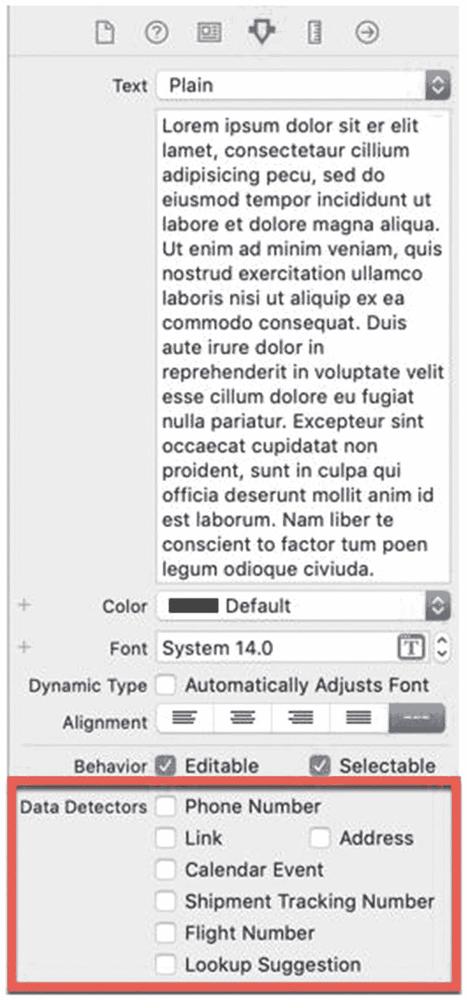

图 9-7

在“属性检查器”面板的“数据探测”类别中定义可点击文字

要了解如何在文本视图中使文字可点击，请按照以下步骤操作：

1.  确保 Xcode 中已加载 `TextViewApp` 项目。
2.  在导航窗格中点击 `ViewController.swift` 文件以编辑它。
3.  按如下方式编辑 `viewDidLoad` 方法：

```
override func viewDidLoad() {
super.viewDidLoad()
textView.dataDetectorTypes = UIDataDetectorTypes.link
textView.isEditable = false
textView.isSelectable = true
textView.text = "This is an example of clickable text www.yahoo.com"
// 加载视图后的其他设置，通常来自 nib 文件
}
```

完整的 `ViewController.swift` 文件应如下所示：

```
import UIKit
class ViewController: UIViewController {
@IBOutlet var textView: UITextView!
@IBOutlet var buttonObject: UIButton!
override func viewDidLoad() {
super.viewDidLoad()
textView.dataDetectorTypes = UIDataDetectorTypes.link
textView.isEditable = false
textView.isSelectable = true
textView.text = "This is an example of clickable text www.yahoo.com"
// 加载视图后的其他设置，通常来自 nib 文件
}
@IBAction func buttonTapped(_ sender: UIButton) {
if textView.isEditable == true {
textView.isEditable = false
textView.backgroundColor = UIColor.yellow
textView.textColor = UIColor.blue
textView.font = UIFont(name: "Courier", size: 24)
} else {
textView.isEditable = true
textView.backgroundColor = UIColor.blue
textView.textColor = UIColor.white
textView.font = UIFont(name: "Ariel", size: 10)
}
}
}
```

4.  点击运行按钮，或选择“产品”➤“运行”。模拟器窗口出现。请注意，URL `www.yahoo.com` 以蓝色超链接形式高亮显示。
5.  点击 `www.yahoo.com` 超链接。模拟器会显示 Safari 浏览器以及 `www.yahoo.com` 网站，这正是在真实 iPhone 或 iPad 上运行该应用时会发生的情况。
6.  选择“模拟器”➤“退出模拟器”以返回 Xcode。


### 使用文本视图显示虚拟键盘

为了让用户能够在文本视图中输入，你需要显示（和隐藏）虚拟键盘。当用户点击文本视图进行编辑时，虚拟键盘应出现，如有必要，还需将文本视图上移。当用户在文本视图中完成文本编辑后，虚拟键盘则需要消失。

首先，你需要让视图控制器监听两个事件：`keyboardWillShowNotification` 和 `keyboardWillHideNotification`。其次，你需要创建 `keyboardWillShow` 和 `keyboardWillHide` 函数，用于显示虚拟键盘（并将视图上移），以及在不再需要时隐藏虚拟键盘。最后，如果用户点击了文本视图以外的区域，你需要关闭虚拟键盘。

要添加显示和隐藏虚拟键盘的代码，请遵循以下步骤：

1.  在 `TextViewApp` 项目的导航器窗格中点击 `Main.storyboard` 文件。
2.  点击库图标以显示对象库。
3.  将一个文本视图拖放到用户界面的底部附近。
4.  选择 **编辑器** ➤ **自动布局问题解决方案** ➤ **重置为建议的约束**（位于子菜单的上半部分）。这将为界面中的新文本视图添加约束。
5.  将以下代码添加到 `viewDidLoad` 方法中：

```swift
NotificationCenter.default.addObserver(self, selector: #selector(keyboardWillShow), name: UIResponder.keyboardWillShowNotification, object: nil)
NotificationCenter.default.addObserver(self, selector: #selector(keyboardWillHide), name: UIResponder.keyboardWillHideNotification, object: nil)
let tap: UITapGestureRecognizer = UITapGestureRecognizer(target: self, action: #selector(self.dismissKeyboard))
view.addGestureRecognizer(tap)
```

6.  在 `buttonTapped` IBAction 方法上方添加如下代码：

```swift
@objc func dismissKeyboard() {
    view.endEditing(true)
}
@objc func keyboardWillShow(notification: NSNotification) {
    if let keyboardSize = (notification.userInfo?[UIResponder.keyboardFrameEndUserInfoKey] as? NSValue)?.cgRectValue {
        if self.view.frame.origin.y == 0 {
            self.view.frame.origin.y -= keyboardSize.height
        }
    }
}
@objc func keyboardWillHide(notification: NSNotification) {
    if ((notification.userInfo?[UIResponder.keyboardFrameEndUserInfoKey] as? NSValue)?.cgRectValue) != nil {
        if self.view.frame.origin.y != 0 {
            self.view.frame.origin.y = 0
        }
    }
}
```

整个 `ViewController.swift` 文件应如下所示：

```swift
import UIKit
class ViewController: UIViewController {
    @IBOutlet var textView: UITextView!
    @IBOutlet var buttonObject: UIButton!
    override func viewDidLoad() {
        super.viewDidLoad()
        textView.dataDetectorTypes = UIDataDetectorTypes.link
        textView.isEditable = false
        textView.isSelectable = true
        textView.text = "This is an example of clickable text www.yahoo.com"
        NotificationCenter.default.addObserver(self, selector: #selector(keyboardWillShow), name: UIResponder.keyboardWillShowNotification, object: nil)
        NotificationCenter.default.addObserver(self, selector: #selector(keyboardWillHide), name: UIResponder.keyboardWillHideNotification, object: nil)
        let tap: UITapGestureRecognizer = UITapGestureRecognizer(target: self, action: #selector(self.dismissKeyboard))
        view.addGestureRecognizer(tap)
        // Do any additional setup after loading the view, typically from a nib.
    }
    @objc func dismissKeyboard() {
        view.endEditing(true)
    }
    @objc func keyboardWillShow(notification: NSNotification) {
        if let keyboardSize = (notification.userInfo?[UIResponder.keyboardFrameEndUserInfoKey] as? NSValue)?.cgRectValue {
            if self.view.frame.origin.y == 0 {
                self.view.frame.origin.y -= keyboardSize.height
            }
        }
    }
    @objc func keyboardWillHide(notification: NSNotification) {
        if ((notification.userInfo?[UIResponder.keyboardFrameEndUserInfoKey] as? NSValue)?.cgRectValue) != nil {
            if self.view.frame.origin.y != 0 {
                self.view.frame.origin.y = 0
            }
        }
    }
    @IBAction func buttonTapped(_ sender: UIButton) {
        if textView.isEditable == true {
            textView.isEditable = false
            textView.backgroundColor = UIColor.yellow
            textView.textColor = UIColor.blue
            textView.font = UIFont(name: "Courier", size: 24)
        } else {
            textView.isEditable = true
            textView.backgroundColor = UIColor.blue
            textView.textColor = UIColor.white
            textView.font = UIFont(name: "Ariel", size: 10)
        }
    }
}
```

7.  点击**运行**按钮或选择**产品** ➤ **运行**。模拟器屏幕出现。
8.  点击底部的文本视图。（如果虚拟键盘没有出现，请按 **Command + K** 或选择**硬件** ➤ **键盘** ➤ **切换虚拟键盘**。）
9.  使用虚拟键盘在文本视图中添加和删除文本。
10. 点击文本视图之外的任何位置。虚拟键盘消失。
11. 选择**模拟器** ➤ **退出模拟器**以返回 Xcode。

## 总结

图像视图和文本视图让你的应用能够在用户界面上显示数据。图像视图以图像的形式直观地展示信息。这些图像可以是静态的，仅用于装饰目的，也可以显示有用的信息，比如图表。图像视图也可以是交互式的，能够响应点击。

文本视图既可以显示文本，也允许用户编辑和输入文本。文本视图的行为与文本字段非常相似，但它能一次显示大量文本，就像一个微型文字处理器。你可以修改文本的外观，但任何更改都会影响文本视图中的所有文本。

如果你将文本视图设置为不可编辑，那么你还可以创建可点击的文本，文本视图可以识别常见的词和短语类型，例如电话号码、街道地址、URL 以及日期和时间等日历事件。

文本视图可以简单地向用户显示信息，也可以允许输入。图像视图可以显示视觉数据，或者允许交互，以便你的应用能在用户点击图像视图时做出响应。通过同时使用文本视图和图像视图，你便拥有了展示数据、允许输入以及接受用户交互的另一种方式。

# 按钮、开关和分段控件

除了显示数据或让用户输入数据外，用户界面的第二个最重要的目的是允许用户控制应用。在最简单的层面上，用户可以使用按钮，每个按钮代表一个命令。当然，如果你想要显示多个选项，那么屏幕上显示多个按钮可能会显得拥挤。

作为发出命令的两种替代方案，Xcode 提供了开关和分段控件。开关让用户可以选择打开或关闭某个设置。分段控件就像一个浓缩区域内的多个按钮，用户可以点击以选择不同的选项。图 10-1 显示了按钮、开关和分段控件的视觉外观。

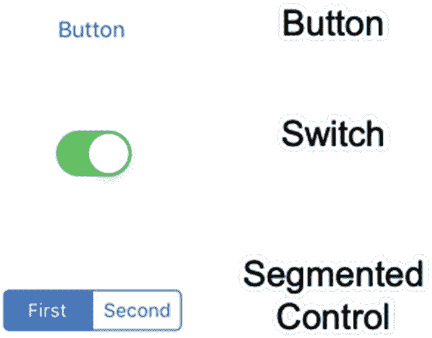

**图 10-1** 比较按钮、开关和分段控件的视觉外观


## 理解事件

代表命令的用户界面对象（如按钮、开关和分段控件）会响应事件。最简单的事件发生在用户轻点或触摸对象内部时。更复杂的事件可能发生在用户手指在对象内部拖拽或滑动时。

所有类型的用户界面对象都可以响应事件，例如用户轻点按钮等对象时。对象与事件的组合定义了一个 `IBAction` 方法。如果你希望一个对象响应两个不同的事件，则需要为该特定对象创建两个不同的 `IBAction` 方法。

对象可以响应的不同事件类型包括：

- **Touch Up Inside** – 在对象边界内轻点并抬起手指
- **Touch Up Outside** – 在对象边界外轻点
- **Touch Down** – 在对象边界内按下
- **Touch Down Repeat** – 在对象边界内连续轻点两次或更多次
- **Touch Drag Enter** – 手指在对象外部触摸并滑入对象内部
- **Touch Drag Exit** – 手指在对象内部触摸并滑出对象外部
- **Touch Drag Inside** – 手指在对象内部滑动
- **Touch Drag Outside** – 手指在对象外部边缘滑动
- **Value Changed** – 操作对象（如滑块）改变其存储值时触发
- **Editing Changed** – 文本字段中的文本发生变化时触发
- **Editing Did Begin** – 手指轻点文本字段内部时触发
- **Editing Did End** – 手指轻点文本字段外部时触发

通过选择特定对象能够响应的事件，你可以让用户以不同且独特的方式与用户界面对象交互。在大多数情况下，用户界面对象只需响应最可能的事件，例如 **Touch Up Inside**（检测用户何时轻点对象）。

## 使用按钮

按钮通常响应 **Touch Up Inside** 事件，并显示其代表的命令，如“确定”、“取消”或“完成”。按钮上显示的文本可以通过三种方式修改：

- 在**属性检查器**面板中
- 通过双击按钮
- 通过 Swift 代码

要了解如何在按钮上定义标题，请按照以下步骤操作：

1. 使用“单视图应用”模板创建一个新的 iOS 项目（参见第 1 章），并将这个新项目命名为 `ControlApp`。这会为用户界面创建一个单视图。

2. 在导航面板中点击 `Main.storyboard` 文件。Xcode 会显示该单视图。

3. 点击库图标打开**对象库**窗口。

4. 将一个按钮拖放到视图上的任意位置。默认情况下，按钮上显示的标题为“Title”。

5. 选择**视图** ➤ **检查器** ➤ **显示属性检查器**。

6. 如图 10-2 所示，点击**标题**文本字段，删除现有文本（“Title”），然后输入 **Cancel**。按 ENTER 键。注意，Xcode 现在会在按钮上显示单词“Cancel”。

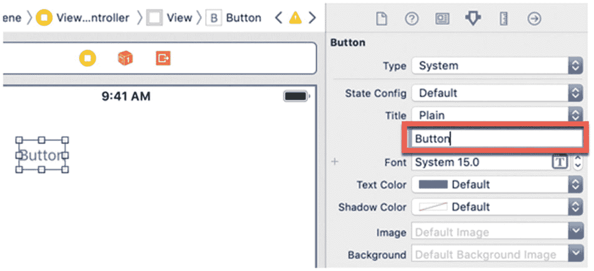

**图 10-2** 在属性检查器中更改按钮的标题

7. 双击按钮以选中标题。

8. 输入 **Done** 并按 ENTER 键。注意，现在按钮显示的是 **Done**。

9. 选择**编辑器** ➤ **解决自动布局问题** ➤ **设置为建议的约束**。Xcode 会给你的按钮添加约束。

10. 选择**视图** ➤ **助理编辑器** ➤ **显示助理编辑器**。Xcode 会将 `Main.storyboard` 和 `ViewController.swift` 文件并排显示。

11. 将鼠标指针移到按钮上，按住 Control 键，从图像视图拖拽到 `ViewController.swift` 文件中 `class ViewController` 行下方。

12. 松开 Control 键和鼠标左键。会出现一个弹出窗口。

13. 点击**名称**文本字段，输入 `buttonObject`，然后点击**连接**按钮。Xcode 会创建一个 `IBOutlet` 变量，如下所示：

```swift
@IBOutlet var buttonObject: UIButton!
```

14. 将鼠标指针移到按钮上，按住 Control 键，从图像视图拖拽到 `ViewController.swift` 文件中底部最后一个花括号上方。

15. 松开 Control 键和鼠标左键。会出现一个弹出窗口。注意，如图 10-3 所示，**事件**弹出菜单默认已选择了 **Touch Up Inside** 事件。

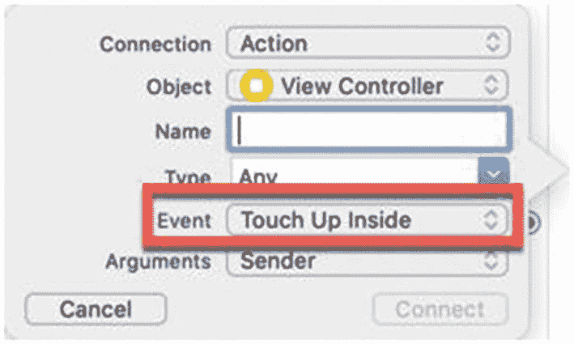

**图 10-3** 事件弹出菜单默认显示 Touch Up Inside（针对按钮）

16. 点击**名称**文本字段，输入 `touchInside`，点击**类型**弹出菜单并选择 `UIButton`，然后点击**连接**按钮。Xcode 会创建一个 `IBAction` 方法。

17. 按如下方式编辑这个 `touchInside` `IBAction` 方法：

```swift
@IBAction func touchInside(_ sender: UIButton) {
    buttonObject.setTitle("New", for: UIControl.State.normal)
}
```

每当用户轻点该按钮时，此 `IBAction` 都会运行，并且 Swift 代码会将按钮标题更改为“New”。通过使用 `setTitle`，你的 Swift 代码可以在应用程序运行时更改按钮的标题。

整个 `ViewController.swift` 文件应如下所示：

```swift
import UIKit
class ViewController: UIViewController {
    @IBOutlet var buttonObject: UIButton!
    override func viewDidLoad() {
        super.viewDidLoad()
        // Do any additional setup after loading the view, typically from a nib.
    }
    @IBAction func touchInside(_ sender: UIButton) {
        buttonObject.setTitle("New", for: UIControl.State.normal)
    }
}
```

18. 点击**运行**按钮或选择**产品** ➤ **运行**。模拟器屏幕会出现。注意，按钮标题当前显示的是 **Done**。

19. 点击该按钮。注意，按钮标题现在会变为“New”。

20. 选择**模拟器** ➤ **退出模拟器**以返回 Xcode。


## 使用开关

在许多应用中，用户可以通过开关来开启或关闭某些功能。当用户需要在两个确切的选项之间进行选择时，这正是使用开关的绝佳时机。顾名思义，开关可以向左或向右滑动，分别表示“开”或“关”的状态。当开关打开时，会显示一种颜色，并且开关滑块位于右侧。当开关关闭时，会显示另一种颜色，并且开关滑块位于左侧，如图 10-4 所示。

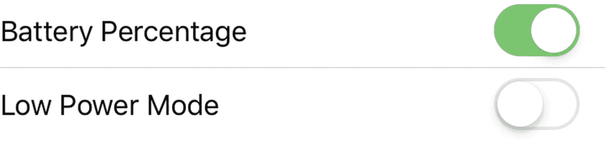

图 10-4

开关常用来切换设置的开启或关闭状态

开关中可修改的三个常见属性包括：

- `isOn` – 决定开关的值是 `true`（开）还是 `false`（关）
- `onTintColor` – 决定当开关的 `isOn` 属性为 `true`（开）时显示的颜色
- `tintColor` – 决定当开关的 `isOn` 属性为 `false`（关）时显示的颜色

要了解如何使用开关，请遵循以下步骤：

1. 确保你的 `ControlApp` 项目已在 Xcode 中加载。

2. 在导航器面板中点击 `Main.storyboard` 文件。Xcode 会显示该单一视图。

3. 点击库图标以打开对象库窗口。

4. 在视图上拖放一个标签和一个开关。

5. 按住 Shift 键，同时点击开关和标签以选中这两个元素。

6. 选择 编辑器 ➤ 解决自动布局问题 ➤ 重置为建议的约束（位于子菜单的上半部分）。这将为开关和标签添加约束。

7. 选择 视图 ➤ 辅助编辑器 ➤ 显示辅助编辑器，或点击辅助编辑器图标。Xcode 会并排显示 `Main.storyboard` 和 `ViewController.swift` 文件。

8. 将鼠标指针移到标签上，按住 Control 键，然后从标签拖拽到 `ViewController.swift` 文件中 `IBOutlet` 行的下方。

9. 松开 Control 键和鼠标左键。会弹出一个窗口。

10. 在“名称”文本框中点击，输入 `labelSwitch`，然后点击“连接”按钮。Xcode 会创建一个如下的 `IBOutlet` 变量：

```
    @IBOutlet var labelSwitch: UILabel!
```

11. 将鼠标指针移到开关上，按住 Control 键，然后从开关拖拽到 `ViewController.swift` 文件中 `IBOutlet` 行的下方。

12. 松开 Control 键和鼠标左键。会弹出一个窗口。

13. 在“名称”文本框中点击，输入 `switchObject`，然后点击“连接”按钮。Xcode 会创建一个如下的 `IBOutlet` 变量：

```
    @IBOutlet var switchObject: UISwitch!
```

14. 将鼠标指针移到开关上，按住 Control 键，然后从开关拖拽到 `ViewController.swift` 文件底部最后一个大括号的上方。

15. 松开 Control 键和鼠标左键。会弹出一个窗口。

16. 在“名称”文本框中点击，输入 `switchChanged`，在“类型”弹出菜单中点击并选择 `UISwitch`，然后点击“连接”按钮。Xcode 会创建一个如下的 `IBAction` 方法：

```
    @IBAction func switchChanged(_ sender: UISwitch) {
    }
```

17. 按如下方式编辑 `switchChanged` 这个 `IBAction` 方法：

```
    @IBAction func switchChanged(_ sender: UISwitch) {
    if switchObject.isOn {
    labelSwitch.text = "On"
    } else {
    labelSwitch.text = "Off"
    }
    }
```

18. 按如下方式编辑 `touchInside` 这个 `IBAction` 方法：

```
    @IBAction func touchInside(_ sender: UIButton) {
    buttonObject.setTitle("New", for: UIControl.State.normal)
    switchObject.onTintColor = UIColor.red
    switchObject.tintColor = UIColor.blue
    }
```

`touchInside` 这个 `IBAction` 会改变开关的颜色。每次点击开关，它都会在开与关之间切换，在 `labelSwitch` 对象中显示“On”或“Off”文本，并显示不同的开、关状态颜色。完整的 `ViewController.swift` 文件应如下所示：

```
    import UIKit
    class ViewController: UIViewController {
    @IBOutlet var buttonObject: UIButton!
    @IBOutlet var labelSwitch: UILabel!
    @IBOutlet var switchObject: UISwitch!
    override func viewDidLoad() {
    super.viewDidLoad()
    // Do any additional setup after loading the view, typically from a nib.
    }
    @IBAction func touchInside(_ sender: UIButton) {
    buttonObject.setTitle("New", for: UIControl.State.normal)
    switchObject.onTintColor = UIColor.red
    switchObject.tintColor = UIColor.blue
    }
    @IBAction func switchChanged(_ sender: UISwitch) {
    if switchObject.isOn {
    labelSwitch.text = "On"
    } else {
    labelSwitch.text = "Off"
    }
    }
    }
```

19. 选择 视图 ➤ 标准编辑器 ➤ 显示标准编辑器，或点击 Xcode 窗口右上角的标准编辑器图标。

20. 点击“运行”按钮，或选择 产品 ➤ 运行。模拟器窗口会打开。

21. 点击开关。注意，每次点击开关，它的外观都会在打开和关闭之间切换，并在附近的标签中显示“On”或“Off”，如图 10-5 所示。


图 10-5

标签显示开关是打开还是关闭

22. 点击按钮。这会运行 `touchInside` 这个 `IBAction` 方法中的 Swift 代码，从而改变开关的颜色。

23. 点击开关。注意，每次点击开关，你都会看到红色和蓝色替代了默认颜色。

24. 选择 模拟器 ➤ 退出模拟器，以返回到 Xcode。


好的，这是根据您的要求和示例格式翻译的文档。


## 使用分段控件

按钮适合显示单个命令，但当您需要显示多个命令时，多个按钮可能会使用户界面显得杂乱。当您需要在有限的空间内显示多个按钮时，可以使用分段控件。

一个分段控件可以包含两个或更多个分段，每个分段就像一个独立的按钮。您可以通过属性检查器面板定义分段的数量，但之后也可以使用 Swift 代码添加更多分段。

在属性检查器中，您可以按图 10-6 所示的方式自定义分段控件：

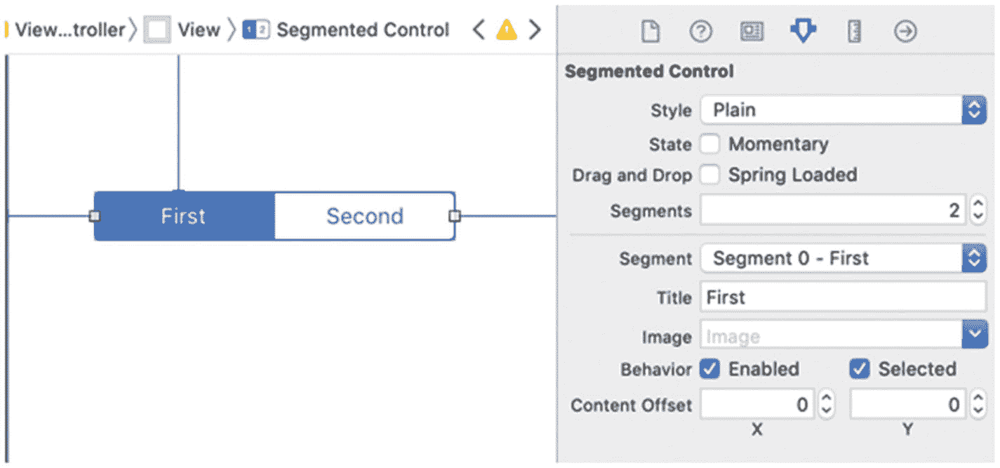

*图 10-6* 在属性检查器中修改分段控件

-   **Segments（分段）** – 定义分段控件中的分段（按钮）数量
-   **Segment（分段）** – 一个弹出菜单，允许您选择要修改的分段
-   **Title（标题）** – 定义显示在由“Segment”（分段）弹出菜单所定义的分段上的文本
-   **Image（图像）** – 定义要显示在由“Segment”（分段）弹出菜单所定义的分段上的图像
-   **Selected（已选中）** – 一个复选框，用于定义哪个分段显示为已选中（高亮），整个分段控件中只能选择一个分段

每个分段控件都通过索引号来标识其不同的分段，最左侧的分段索引为 0，其右侧的下一个分段索引为 1，依此类推。Xcode 会根据每个分段的位置自动为其分配索引号。您可以使用分段索引号来识别用户点击了哪个分段。

一旦您将分段控件添加到视图，就可以使用 Swift 代码添加或移除分段。要了解如何修改分段控件，请遵循以下步骤：

1.  在导航器面板中点击 `Main.storyboard` 文件。Xcode 将显示故事板用户界面。
2.  点击库图标以显示对象库窗口。
3.  将一个分段控件拖放到视图上的任意位置。
4.  选择 Editor ➤ Resolve Auto Layout Issues ➤ Reset to Suggested Constraints（编辑器 ➤ 解析自动布局问题 ➤ 重置为建议的约束）子菜单的上半部分。Xcode 会向分段控件添加约束。
5.  双击分段控件左侧标记为“First”的分段。Xcode 会高亮该分段上的标题，如图 10-7 所示。

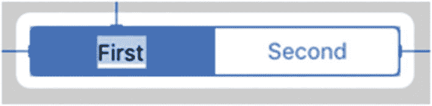

*图 10-7* 直接双击分段控件标题可编辑该标题

6.  输入 `One` 并按 ENTER 键替换“First”标签。直接双击显示文本的对象是修改文本的一种方法。第二种方法是使用属性检查器面板。
7.  选择 View ➤ Inspectors ➤ Show Attributes Inspector（视图 ➤ 检查器 ➤ 显示属性检查器），或点击 Xcode 窗口右上角的属性检查器图标。
8.  点击“Segment”（分段）弹出菜单，然后选择“Segment 1 – Second”。标题文本字段会显示所选分段的当前标题，如图 10-8 所示。

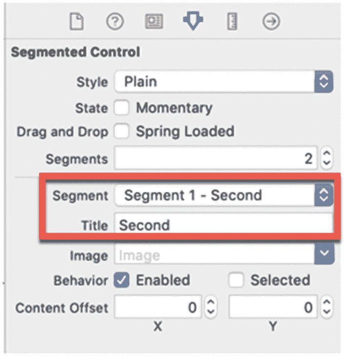

*图 10-8* 在属性检查器面板中更改分段标题

9.  点击标题文本字段，将文本更改为 `Two`。然后按 ENTER 键。请注意，您可以通过直接双击标题或更改分段的“Title”（标题）文本字段来更改每个分段的标题。
10. 选择 View ➤ Assistant Editor ➤ Show Assistant Editor（视图 ➤ 助理编辑器 ➤ 显示助理编辑器），或点击助理编辑器图标。Xcode 会并排显示 `Main.storyboard` 和 `ViewController.swift` 文件。
11. 将鼠标指针移到分段控件上，按住 Control 键，然后从分段控件按住 Ctrl 键拖动到 `ViewController.swift` 文件中 `IBOutlet` 行的下方。
12. 松开 Control 键和鼠标左键。将出现一个弹出窗口。
13. 点击“Name”（名称）文本字段，输入 `segmentedControl`，然后点击“Connect”（连接）按钮。Xcode 会创建一个 `IBOutlet` 变量，如下所示：

```swift
@IBOutlet var segmentedControl: UISegmentedControl!
```

14. 将鼠标指针移到分段控件上，按住 Control 键，然后从分段控件按住 Ctrl 键拖动到 `ViewController.swift` 文件中文件底部最后一个花括号的上方。
15. 松开 Control 键和鼠标左键。将出现一个弹出窗口。
16. 点击“Name”（名称）文本字段，输入 `segmentedControlTapped`，然后点击“Connect”（连接）按钮。Xcode 会创建一个 `IBAction` 方法。
17. 按如下方式修改此 `segmentedControlTapped` IBAction 方法：

```swift
@IBAction func segmentedControlTapped(_ sender: UISegmentedControl) {
    switch segmentedControl.selectedSegmentIndex {
    case 0:
        labelSwitch.text = "One"
    case 1:
        labelSwitch.text = "Two"
    default:
        labelSwitch.text = "Three"
    }
}
```

此 `segmentedControlTapped` IBAction 方法使用 `.selectedSegmentIndex` 属性来识别用户点击了哪个分段。然后，一个 `switch` 语句（基于其索引号）确定用户点击了哪个分段，并在标签中显示 `One`、`Two` 或 `Three`，以标识用户点击的分段。

18. 按如下方式编辑 `viewDidLoad` 方法：

```swift
override func viewDidLoad() {
    super.viewDidLoad()
    segmentedControl.insertSegment(withTitle: "Three", at: 2, animated: true)
    segmentedControl.setWidth(50, forSegmentAt: 0)
    segmentedControl.setWidth(50, forSegmentAt: 1)
    segmentedControl.setWidth(50, forSegmentAt: 2)
    // Do any additional setup after loading the view, typically from a nib.
}
```

此 Swift 代码向现有分段控件添加了第三个分段，并设置了分段控件中每个分段的宽度。整个 `ViewController.swift` 文件应如下所示：

```swift
import UIKit
class ViewController: UIViewController {
    @IBOutlet var buttonObject: UIButton!
    @IBOutlet var labelSwitch: UILabel!
    @IBOutlet var switchObject: UISwitch!
    @IBOutlet var segmentedControl: UISegmentedControl!
    override func viewDidLoad() {
        super.viewDidLoad()
        segmentedControl.insertSegment(withTitle: "Three", at: 2, animated: true)
        segmentedControl.setWidth(50, forSegmentAt: 0)
        segmentedControl.setWidth(50, forSegmentAt: 1)
        segmentedControl.setWidth(50, forSegmentAt: 2)
        // Do any additional setup after loading the view, typically from a nib.
    }
    @IBAction func touchInside(_ sender: UIButton) {
        buttonObject.setTitle("New", for: UIControl.State.normal)
        switchObject.onTintColor = UIColor.red
        switchObject.tintColor = UIColor.blue
    }
    @IBAction func switchChanged(_ sender: UISwitch) {
        if switchObject.isOn {
            labelSwitch.text = "On"
        } else {
            labelSwitch.text = "Off"
        }
    }
    @IBAction func segmentedControlTapped(_ sender: UISegmentedControl) {
        switch segmentedControl.selectedSegmentIndex {
        case 0:
            labelSwitch.text = "One"
        case 1:
            labelSwitch.text = "Two"
        default:
            labelSwitch.text = "Three"
        }
    }
}
```

19. 点击运行按钮或选择 Product ➤ Run（产品 ➤ 运行）。模拟器窗口将出现。
20. 点击分段控件中的第二个或第三个分段。请注意，您点击的分段现在会高亮显示，并且标签会显示您点击的分段名称，例如“Two”或“Three”。
21. 点击任意分段。请注意，每次您点击不同的分段时，该分段都会高亮显示，并且标签会显示不同的文本。
22. 选择 Simulator ➤ Quit Simulator（模拟器 ➤ 退出模拟器）返回 Xcode。


## 将多个对象连接到同一个 `IBAction` 方法

大多数情况下，当你使用按钮、开关或分段控件等对象与用户交互时，你会为每个对象创建一个独立的 `IBAction` 方法。然而，也可以将两个或多个对象连接到同一个 `IBAction` 方法。

首先，你需要用一个对象（例如一个按钮）创建一个 `IBAction` 方法。然后，你可以将另一个对象连接到那个已有的 `IBAction` 方法。这样，两个对象都能响应同一个 `IBAction` 方法。这很有用，因为你无需编写两个或多个功能大致相同的独立 `IBAction` 方法，只需编写一个单一的 `IBAction` 方法，它能根据用户点击的是哪个对象而做出略有不同的响应。

当将两个或多个对象连接到同一个 `IBAction` 方法时，你需要决定是只允许相同类型的对象（如按钮）连接到同一个 `IBAction` 方法，还是允许不同类型的对象（如一个按钮和一个图像视图）连接到同一个 `IBAction` 方法。

每当你创建一个 `IBAction` 方法时，你可以定义该 `IBAction` 方法将响应哪种类型的对象。默认情况下，类型设置为 `Any`，这意味着不同类型的对象可以连接到同一个 `IBAction` 方法，但你也可以选择只允许同一类型的对象连接到该 `IBAction` 方法，例如 `UIButton`，如图 10-9 所示。

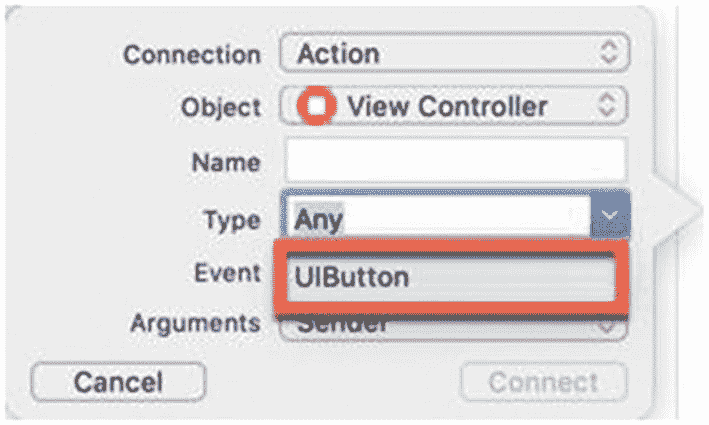

**图 10-9** – 选择 `IBAction` 方法可以响应的对象类型

如果你将 `类型` 定义为特定对象（如 `UIButton`），则你的 `IBAction` 方法会将 `sender`（调用该 `IBAction` 方法的对象）定义为该特定对象，例如：

```
@IBAction func buttonTapped(_ sender: UIButton) {
}
```

上述 `IBAction` 方法只能由 `UIButton` 对象调用。如果在创建 `IBAction` 方法时接受 `类型` 的默认值 `Any`，那么你的 `IBAction` 方法会将 `sender` 定义为 `Any`，例如：

```
@IBAction func buttonTapped(_ sender: Any) {
}
```

任何类型的对象都可以连接到一个 `sender` 被定义为 `Any` 的 `IBAction` 方法。

当两个或多个对象连接到同一个 `IBAction` 方法时，你需要一种方法来识别是哪个对象调用了该 `IBAction` 方法。识别不同用户界面对象的一种方法是在属性检查器面板中为每个对象分配一个唯一的 `Tag` 编号，如图 10-10 所示。

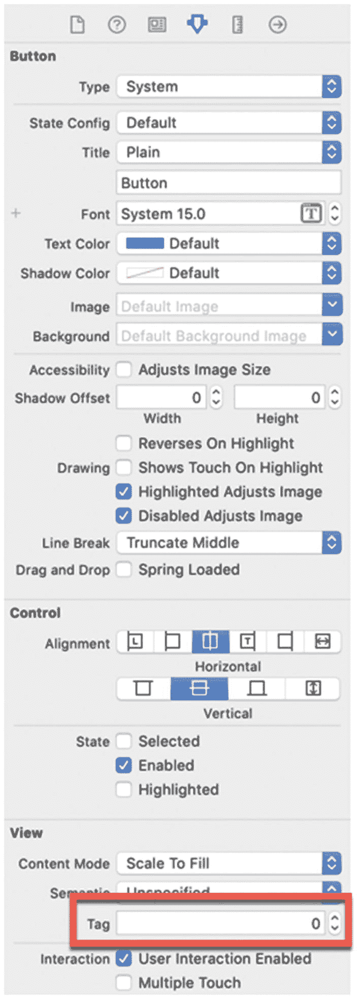

**图 10-10** – `Tag` 属性可以在属性检查器面板中修改

默认情况下，每个对象的 `Tag` 值都为 0，但你可以更改此值，使每个对象拥有不同的值，例如 1、24 或 894。通过识别 `Tag` 值，`IBAction` 方法可以确定要响应哪个对象。

为了演示如何将多个对象链接到一个 `IBAction` 方法并检测要响应的对象，请遵循以下步骤：

1. 使用单视图应用模板（见第 1 章）创建一个新的 iOS 项目，并将此新项目命名为 `IBActionApp`。这将为用户界面创建一个单视图。

2. 在导航器面板中点击 `Main.storyboard` 文件。Xcode 会显示该单视图。

3. 点击库图标以打开对象库窗口。

4. 在视图上的任意位置拖放两个按钮和一个标签。

5. 选择 **编辑器** ➤ **解决自动布局问题** ➤ **重置为建议的约束**（在子菜单的下半部分）。这将为两个按钮和标签添加约束到用户界面。

6. 点击一个按钮以选中它。

7. 选择 **视图** ➤ **检查器** ➤ **显示属性检查器**，或点击 Xcode 窗口右上角的属性检查器图标。

8. 点击标题文本字段，输入 **First**，然后按回车键。

9. 点击标签文本字段，输入 **1**，然后按回车键。

10. 点击第二个按钮以选中它。

11. 点击标题文本字段，输入 **Second**，然后按回车键。

12. 点击标签文本字段，输入 **2**，然后按回车键。

13. 选择 **视图** ➤ **助理编辑器** ➤ **显示助理编辑器**，或点击助理编辑器图标。Xcode 会并排显示 `Main.storyboard` 和 `ViewController.swift` 文件。

14. 将鼠标指针移到标签上，按住 Control 键，并从标签拖拽到 `ViewController.swift` 文件中 `IBOutlet` 行的下方。

15. 松开 Control 键和鼠标左键。会弹出一个窗口。

16. 点击名称文本字段，输入 `labelResult`，然后点击连接按钮。Xcode 会创建一个 `IBOutlet` 变量，如下所示：

```
    @IBOutlet var labelResult: UILabel!
```

17. 将鼠标指针移到标题为 "First" 的按钮上，按住 Control 键，并从该按钮拖拽到 `ViewController.swift` 文件中最后一个花括号上方的位置。

18. 松开 Control 键和鼠标左键。会弹出一个窗口。

19. 点击名称文本字段，输入 `buttonTapped`，确保 `类型` 弹出菜单显示为 `Any`，然后点击连接按钮。Xcode 会创建一个 `IBAction` 方法，如下所示：

```
    @IBAction func buttonTapped(_ sender: Any) {
    }
```

20. 将鼠标指针移到标题为 "Second" 的按钮上，按住 Control 键，并从该按钮拖拽到 `buttonTapped` `IBAction` 方法，直到整个 `IBAction` 方法高亮显示，如图 10-11 所示。

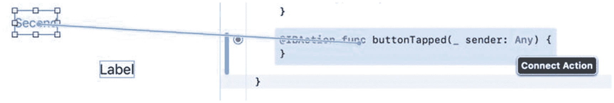

**图 10-11** – 将第二个对象连接到现有的 `IBAction` 方法

21. 松开 Control 键和鼠标左键。

22. 将鼠标指针移到 `buttonTapped` `IBAction` 方法左侧边距中的圆点上。Xcode 会高亮显示这两个按钮，以验证两个按钮都已连接到 `buttonTapped` `IBAction` 方法，如图 10-12 所示。

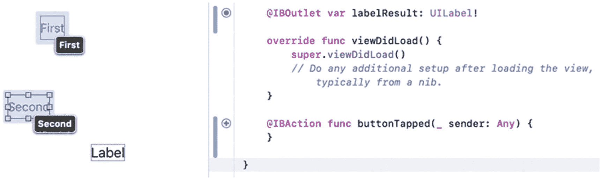

**图 10-12** – 验证所有连接到单个 `IBAction` 方法的对象

23. 按如下方式修改 `buttonTapped` `IBAction` 方法：

```
    @IBAction func buttonTapped(_ sender: Any) {
    switch (sender as AnyObject).tag {
    case 1:
    labelResult.text = "Button 1"
    case 2:
    labelResult.text = "Button 2"
    default:
    labelResult.text = "Default"
    }
    }
```

24. 按如下方式修改 `viewDidLoad` 方法：

```
    override func viewDidLoad() {
    super.viewDidLoad()
    labelResult.frame.size.width = 120
    // 加载视图后执行任何额外的设置，通常从 nib 文件加载。
    }
```

整个 `ViewController.swift` 文件应如下所示：

```
    import UIKit
    class ViewController: UIViewController {
    @IBOutlet var labelResult: UILabel!
    override func viewDidLoad() {
    super.viewDidLoad()
    labelResult.frame.size.width = 120
    // 加载视图后执行任何额外的设置，通常从 nib 文件加载。
    }
    @IBAction func buttonTapped(_ sender: Any) {
    switch (sender as AnyObject).tag {
    case 1:
    labelResult.text = "Button 1"
    case 2:
    labelResult.text = "Button 2"
    default:
    labelResult.text = "Default"
    }
    }
    }
```

25. 点击运行按钮或选择 **产品** ➤ **运行**。模拟器屏幕出现。

26. 点击标题为 "First" 的按钮。注意标签显示 "Button 1"。

27. 点击标题为 "Second" 的按钮。注意标签显示 "Button 2"。

28. 选择 **模拟器** ➤ **退出模拟器** 以返回 Xcode。


在前面的示例中，两个按钮连接到同一个 `IBAction` 方法，但由于 `IBAction` 的类型是 `Any`，你可以将任何对象连接到这个 `IBAction` 方法。在大多数情况下，最好将 `IBAction` 方法限制为特定类型的对象，例如 `UIButton`。

除了降低非预期对象连接到 `IBAction` 方法的风险外，将 `IBAction` 方法限制为特定对象类型还能让你访问该特定对象的属性。例如，一个仅链接到 `UIButton` 的 `IBAction` 方法将能访问 `UIButton` 对象包含的所有属性，例如 `titleLabel.text`。

在我们把现有的两个按钮链接到新的 `IBAction` 方法之前，需要先断开它们在连接检查器面板中与当前 `IBAction` 方法的连接。断开 `IBOutlet` 与 `IBAction` 方法的连接后，我们可以删除 `.swift` 文件中实际的 `IBOutlet` 或 `IBAction` 方法。

#### 注意

仅仅删除 `IBOutlet` 变量或 `IBAction` 方法并不会断开它与用户界面对象的链接。你必须在连接检查器面板中实际断开链接。如果未能在连接检查器面板中断开链接，运行你的应用将不会正常工作，并且 Xcode 会显示一条错误信息。

要了解如何断开现有 `IBAction` 方法与用户界面对象的连接，并仅为特定类型的对象创建一个 `IBAction` 方法，请遵循以下步骤：

1.  确保 `IBActionApp` 项目已在 Xcode 中加载。

2.  在导航器面板中点击 `Main.storyboard` 文件。

3.  点击标题为“First”的按钮以选中它。

4.  选择“视图”➤“检查器”➤“显示连接检查器”，或者点击 Xcode 窗口右上角的连接检查器图标。此时会出现连接检查器面板，显示链接到所选对象的所有 `IBOutlet` 和 `IBAction` 方法。在图 10-13 中，选中的按钮链接到一个名为 `buttonTapped` 的 `IBAction` 方法，该方法响应“Touch Up Inside”事件。

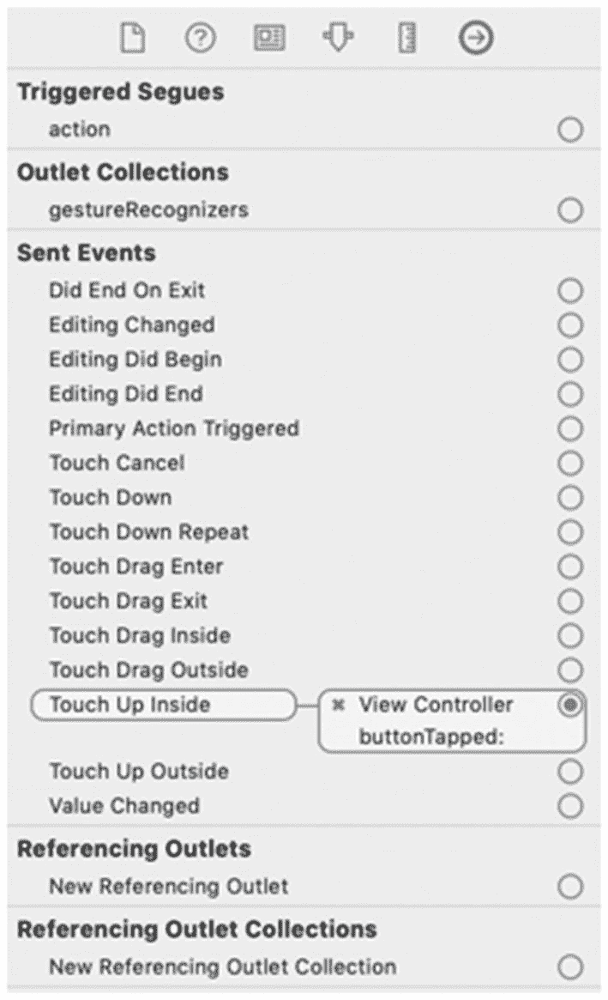

图 10-13

连接检查器面板显示所有与 `IBOutlet` 和 `IBAction` 方法的链接

5.  点击视图控制器 `buttonTapped` 左侧出现的关闭图标 (X)。这将断开所选按钮与存储在 `ViewController.swift` 文件中的 `buttonTapped` `IBAction` 方法之间的链接。

6.  点击标题为“Second”的按钮以选中它。

7.  点击视图控制器 `buttonTapped` 左侧出现的关闭图标 (X)。这将断开第二个按钮与存储在 `ViewController.swift` 文件中的 `buttonTapped` `IBAction` 方法之间的链接。

8.  选择“视图”➤“辅助编辑器”➤“显示辅助编辑器”，或者点击辅助编辑器图标。Xcode 会并排显示 `Main.storyboard` 和 `ViewController.swift` 文件。

9.  将鼠标指针移到标题为“First”的按钮上，按住 Control 键，然后按住 Control 键将鼠标拖拽到 `ViewController.swift` 文件底部最后一个大括号的上方。

10. 松开 Control 键和鼠标左键。此时会弹出一个窗口。

11. 点击“名称”文本字段，输入 `buttonRespond`，点击“类型”弹出菜单并选择 `UIButton`，然后点击“连接”按钮。Xcode 会创建一个如下的 `IBAction` 方法：

```
    @IBAction func buttonRespond(_ sender: UIButton) {
    }
    ```

12. 将鼠标指针移到标题为“First”的按钮上，按住 Control 键，然后按住 Control 键将鼠标拖拽到 `buttonRespond` `IBAction` 方法上并将其高亮显示，如图 10-14 所示。

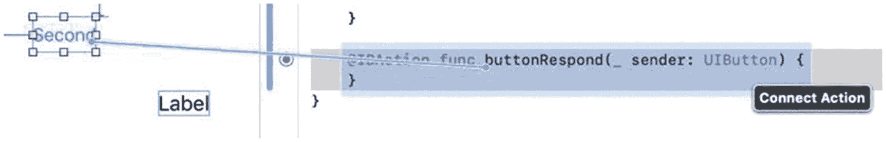

图 10-14

将按钮连接到现有的 `IBAction` 方法

13. 松开 Control 键和鼠标左键。

14. 将 `buttonRespond` `IBAction` 方法编辑如下：

```
    @IBAction func buttonRespond(_ sender: UIButton) {
    switch sender.tag {
    case 1:
    labelResult.text = sender.titleLabel?.text
    case 2:
    labelResult.text = sender.titleLabel?.text
    default:
    labelResult.text = "Default"
    }
    }
    ```

整个 `ViewController.swift` 文件应如下所示：

```
    import UIKit
    class ViewController: UIViewController {
    @IBOutlet var labelResult: UILabel!
    override func viewDidLoad() {
    super.viewDidLoad()
    labelResult.frame.size.width = 120
    // 加载视图后的任何额外设置（通常来自 nib 文件）
    }
    @IBAction func buttonTapped(_ sender: Any) {
    switch (sender as AnyObject).tag {
    case 1:
    labelResult.text = "Button 1"
    case 2:
    labelResult.text = "Button 2"
    default:
    labelResult.text = "Default"
    }
    }
    @IBAction func buttonRespond(_ sender: UIButton) {
    switch sender.tag {
    case 1:
    labelResult.text = sender.titleLabel?.text
    case 2:
    labelResult.text = sender.titleLabel?.text
    default:
    labelResult.text = "Default"
    }
    }
    }
    ```

15. 点击“运行”按钮或选择“产品”➤“运行”。模拟器屏幕会出现。

16. 点击标题为“First”的按钮。注意标签显示为“First”。

17. 点击标题为“Second”的按钮。注意标签显示为“Second”。

18. 选择“模拟器”➤“退出模拟器”以返回 Xcode。

## 总结

按钮、开关和分段控件为用户提供了控制应用的方式。通过使用检查器面板或 Swift 代码，你可以修改按钮、开关和分段控件，为你的特定应用进行自定义。

按钮代表单个命令。开关允许用户恰好选择两种设置：开（true）和关（false）。分段控件的作用类似于多个按钮，但比多个按钮占用更少的空间。

通常，你会将一个按钮、开关或分段控件链接到单个 `IBAction` 方法。但是，你可以将两个或更多对象连接到同一个 `IBAction` 方法。创建 `IBAction` 方法时，你可以允许任何类型的对象连接到它，也可以定义只有特定类型的对象（例如 `UIButton`）才能连接到该 `IBAction` 方法。如果定义只有特定类型的对象可以连接到 `IBAction` 方法，那么你将能够访问该对象的属性。

一旦将对象连接到 `IBOutlet` 或 `IBAction` 方法，你随时可以断开该连接。你必须在连接检查器面板中断开该连接。如果未能断开连接，并在之后删除了 `IBOutlet` 或 `IBAction` 方法，那么当你尝试运行应用时，Xcode 会显示一条错误信息。


# 11. 触摸手势

允许用户通过按钮、开关或分段控件来控制应用确实很方便，但所有这些控件都会占用屏幕空间。为了消除用户界面上额外对象的需求，你的应用还可以检测并响应触摸手势，从而允许用户直接操作屏幕上显示的项目。

iOS 应用可以检测和响应的不同类型的触摸手势包括：

* **轻点** – 指尖触碰屏幕后抬起。
* **捏合** – 两个指尖靠拢或分开。
* **旋转** – 两个指尖以圆形轨迹向左或向右旋转。
* **平移** – 指尖在屏幕上拖动滑行。
* **轻扫** – 指尖在屏幕上向上、向下、向左或向右滑行后抬起。
* **屏幕边缘平移** – 指尖从屏幕边缘附近开始拖动的滑行动作。
* **长按** – 指尖触碰并按压屏幕。

你可以完全通过 Swift 代码，或者通过从对象库中将手势识别器对象放置到视图上（如图 11-1 所示）来在应用的用户界面上创建触摸手势。

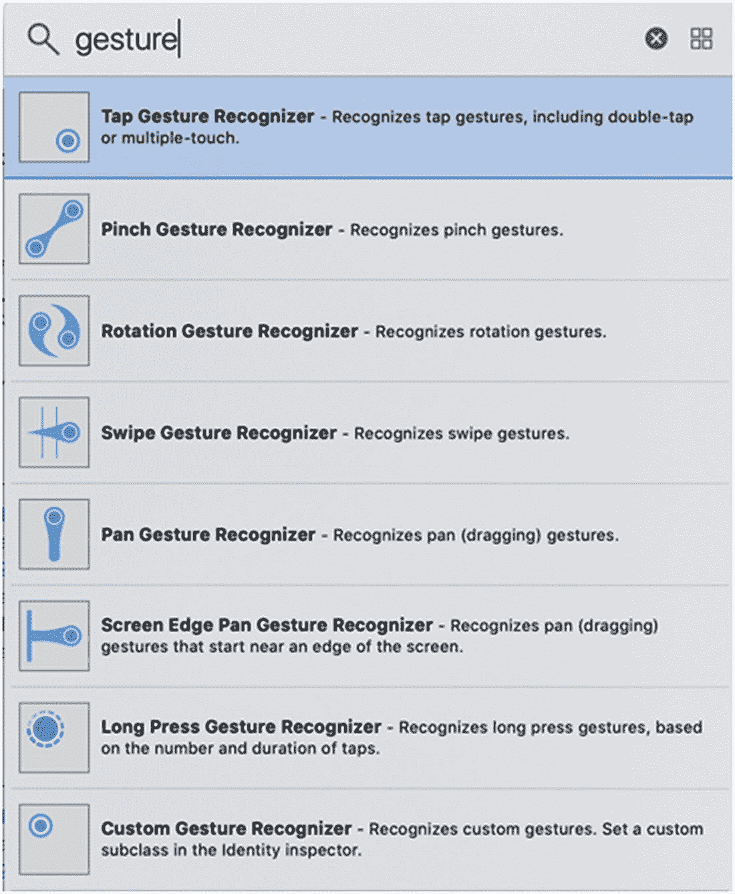

图 11-1. 对象库窗口中可用的手势列表

要在应用中检测手势，你需要执行以下操作：

* 向视图添加手势识别器。
* 创建一个 `IBAction` 方法来响应手势。
* 定义哪个对象需要响应手势。

## 检测轻点手势

轻点手势简单地检测用户何时轻点屏幕。默认情况下，轻点手势识别单指的一次轻点，但你可以定义使用两根或更多手指的多次轻点。

要了解如何检测轻点手势，请遵循以下步骤：

1.  使用单视图应用模板创建一个新的 iOS 项目（参见第 1 章），并将这个新项目命名为 `TapApp`。这会为用户界面创建一个单独的视图。
2.  在导航器窗格中点击 `Main.storyboard` 文件。Xcode 会显示该单独视图。
3.  点击库图标以打开对象库窗口，并查找轻点手势识别器，如图 11-2 所示。

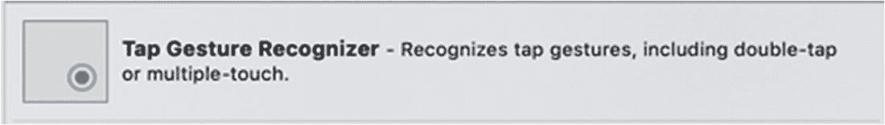

图 11-2. 对象库中的轻点手势识别器

4.  将轻点手势识别器拖放到视图上的任意位置。请注意，手势识别器不会直接显示在视图上，而是显示在视图的顶部以及文档大纲中，如图 11-3 所示。

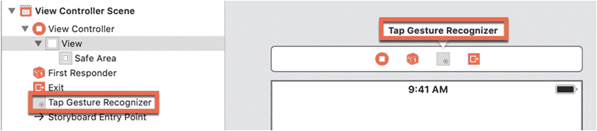

图 11-3. 轻点手势识别器出现在文档大纲和视图控制器的顶部

5.  在文档大纲或视图控制器顶部点击轻点手势识别器。
6.  选择“视图”➤“检查器”➤“显示属性检查器”，或点击 Xcode 窗口右上角的属性检查器图标。请注意，属性检查器允许你定义识别轻点手势所需的轻点次数和触摸次数（指尖数）。默认情况下，轻点手势只需要 1 次轻点和 1 次触摸（指尖），如图 11-4 所示。

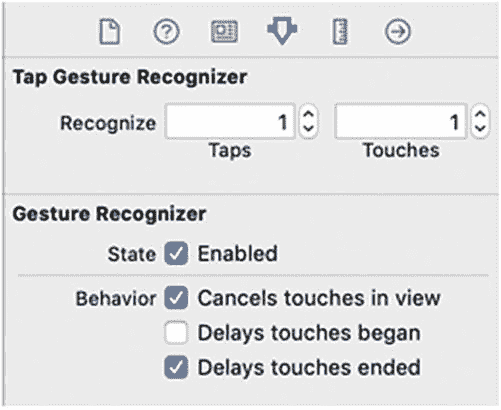

图 11-4. 轻点手势识别器出现在文档大纲和视图控制器的顶部

7.  点击库图标以打开对象库窗口，然后将两个标签拖放到视图上的任意位置。
8.  双击一个标签，输入**可视化解决方案**并按回车键。
9.  双击另一个标签，输入**编程解决方案**并按回车键。
10. 选择“编辑器”➤“解决自动布局问题”➤“重置为建议的约束”（位于子菜单的下半部分）。Xcode 会为两个标签添加约束。
11. 点击**可视化解决方案**标签，然后选择“视图”➤“检查器”➤“显示属性检查器”，或点击 Xcode 窗口右上角的属性检查器图标。
12. 选中**启用用户交互**复选框，如图 11-5 所示。选中**启用用户交互**后，标签可以响应用户的触摸。

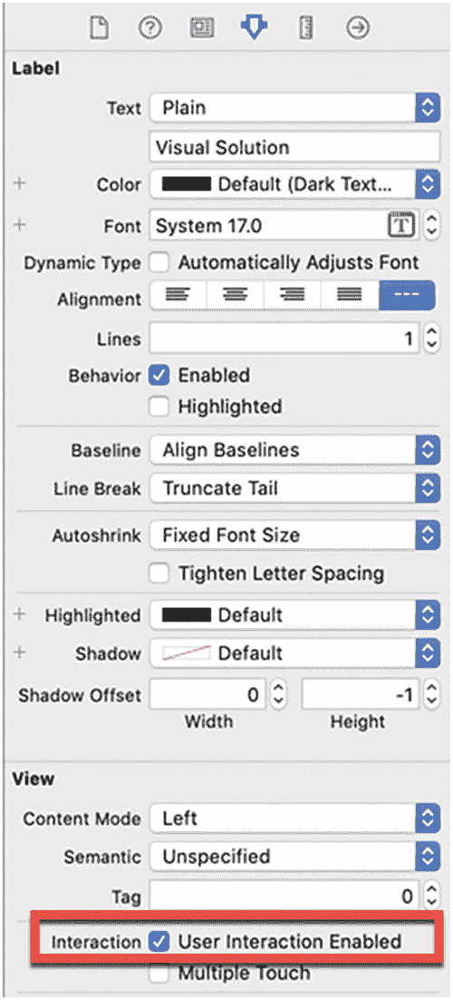

图 11-5. 选中**启用用户交互**复选框

13. 将鼠标指针移到**可视化解决方案**标签上，按住 Control 键，然后从标签 Ctrl-拖拽到文档大纲中或视图控制器上方的轻点手势识别器上，如图 11-6 所示。

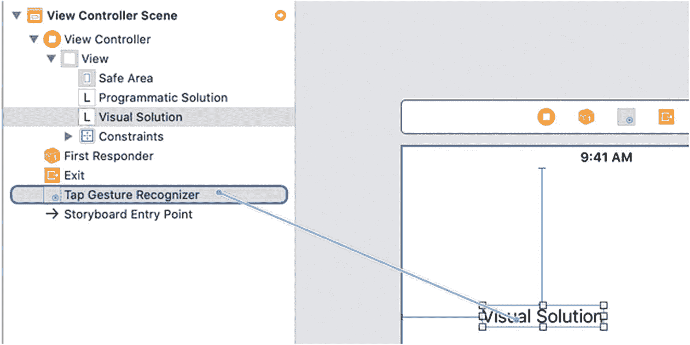

图 11-6. 从标签 Ctrl-拖拽到轻点手势识别器会将标签链接到轻点手势

14. 松开 Control 键和鼠标左键。会弹出一个弹出菜单，如图 11-7 所示。

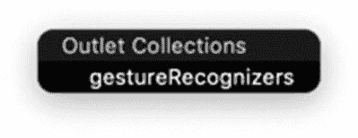

图 11-7. 弹出菜单让你选择要连接到标签的内容

15. 点击 `gestureRecognizers`。


16.  选择 View ➤ Inspectors ➤ Show Connections Inspector，或点击 Xcode 窗口右上角的 Connections Inspector 图标。Connections Inspector 窗格显示该标签已连接到 Tap Gesture Recognizer，如图 11-8 所示，这意味着只有该标签可以响应轻点手势。

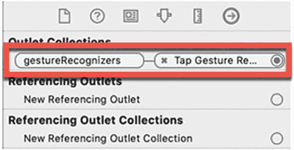

**图 11-8** Connections Inspector 确认标签已连接到 Tap Gesture Recognizer

17.  选择 View ➤ Assistant Editor ➤ Show Assistant Editor，或点击 Xcode 窗口右上角的 Assistant Editor 图标。

18.  将鼠标指针移至 Document Outline 或 View Controller 顶部的 Tap Gesture Recognizer 图标上，按住 Control 键，然后从该图标向 `ViewController.swift` 文件底部最后一个花括号上方拖拽。

19.  松开 Control 键和鼠标左键。此时会出现一个弹出窗口。

20.  在 Name 文本字段中点击，输入 `tapDetected`，点击 Type 弹出菜单并选择 `UITapGestureRecognizer`，然后点击 Connect 按钮。Xcode 会创建一个 `IBAction` 方法。

21.  修改此 `tapDetected` 的 `IBAction` 方法，如下所示：

```
@IBAction func tapDetected(_ sender: UITapGestureRecognizer) {
    print ("Tap detected")
}
```

完整的 `ViewController.swift` 文件应如下所示：

```
import UIKit
class ViewController: UIViewController {
    override func viewDidLoad() {
        super.viewDidLoad()
        // Do any additional setup after loading the view, typically from a nib.
    }
    @IBAction func tapDetected(_ sender: UITapGestureRecognizer) {
        print ("Tap detected")
    }
}
```

22.  点击 Run 按钮或选择 Product ➤ Run。模拟器屏幕将会出现。

23.  点击 Visual Solution 标签。请注意，在 Xcode 窗口底部的 Debug Area 中会出现消息 “Tap detected”。

24.  点击 Visual Solution 标签以外的任意位置。请注意，每次点击 Visual Solution 标签以外的位置或点击 Programmatic Solution 标签时，Xcode 窗口的 Debug Area 中不会显示其他内容。

25.  选择 Simulator ➤ Quit Simulator 以返回 Xcode。

上述步骤允许标签检测轻点手势，但我们唯一需要创建的代码是 `tapDetected` 的 `IBAction` 方法。我们也可以完全通过 Swift 代码定义手势识别器，接下来将对 Programmatic Solution 标签执行此操作。

1.  确保 `TapApp` 项目已在 Xcode 中加载。

2.  在 Navigator 窗格中点击 `Main.storyboard` 文件。Xcode 将显示单个视图。

3.  选择 View ➤ Assistant Editor ➤ Show Assistant Editor，或点击 Xcode 窗口右上角的 Assistant Editor 图标。Xcode 将并排显示 `Main.storyboard` 和 `ViewController.swift` 文件。

4.  将鼠标指针移至 Programmatic Solution 标签上，按住 Control 键，然后从该标签向 `ViewController.swift` 文件中的 `class ViewController` 行下方拖拽。

5.  松开 Control 键和鼠标左键。此时会出现一个弹出窗口。

6.  在 Name 文本字段中点击，输入 `labelCode`，然后点击 Connect 按钮。Xcode 会创建一个 `IBOutlet`，如下所示：

```
@IBOutlet var labelCode: UILabel!
```

7.  编辑 `viewDidLoad` 方法，如下所示：

```
override func viewDidLoad() {
    super.viewDidLoad()
    labelCode.isUserInteractionEnabled = true
    let tapGesture = UITapGestureRecognizer(target: self, action: #selector(handleTap))
    labelCode.addGestureRecognizer(tapGesture)
    // Do any additional setup after loading the view, typically from a nib.
}
```

我们可以不选中 Attributes Inspector 窗格中的 User Interaction Enabled 复选框，而是直接为第二个显示 “Programmatic Solution” 的标签将 `.isUserInteractionEnabled` 属性设置为 `true`。

我们可以不将 Tap Gesture Recognizer 从 Object Library 拖放到视图上，而是使用 Swift 代码创建 `UITapGestureRecognizer`。这意味着我们还需要定义一个函数来响应轻点手势，该函数由 `#selector(handleTap)` 定义。最后，我们需要将此轻点手势添加到标签，而不是通过 Connections Inspector 窗格进行连接。

8.  在 `viewDidLoad` 方法下方添加以下内容：

```
@objc func handleTap() {
    print ("Tap on second label detected")
}
```

完整的 `ViewController.swift` 文件应如下所示：

```
import UIKit
class ViewController: UIViewController {
    @IBOutlet var labelCode: UILabel!
    override func viewDidLoad() {
        super.viewDidLoad()
        labelCode.isUserInteractionEnabled = true
        let tapGesture = UITapGestureRecognizer(target: self, action: #selector(handleTap))
        labelCode.addGestureRecognizer(tapGesture)
        // Do any additional setup after loading the view, typically from a nib.
    }
    @objc func handleTap() {
        print ("Tap on second label detected")
    }
    @IBAction func tapDetected(_ sender: UITapGestureRecognizer) {
        print ("Tap detected")
    }
}
```

9.  点击 Run 按钮或选择 Product ➤ Run。模拟器屏幕将会出现。

10.  点击 Programmatic Solution 标签。请注意，在 Xcode 窗口底部的 Debug Area 中会出现消息 “Tap on second label detected”。

11.  点击 Visual Solution 标签。请注意，在 Xcode 窗口底部的 Debug Area 中会出现消息 “Tap detected”。

12.  点击两个标签以外的任意位置。请注意，即使你在屏幕上轻点，轻点手势也不会被识别，因为两个轻点手势都连接到了标签上。

13.  选择 Simulator ➤ Quit Simulator 以返回 Xcode。

使用手势识别器时，你可以通过 Object Library 和 Inspector 窗格可视地定义它们，也可以通过 Swift 代码创建手势识别器。两种方法本质相同，因此取决于你偏好编写 Swift 代码还是使用 Object Library。

使用 Swift 代码自定义轻点手势时，可以定义以下两个属性：

*   `.numberOfTapsRequired` – 定义识别轻点手势所需的点击次数，例如一次点击（默认值）
*   `.numberOfTouchesRequired` – 定义识别轻点手势所需的指尖（触摸）数量


## 检测捏合手势

当两个指尖相互靠近或相互远离时，就会发生捏合手势。在捏合手势过程中，应用可以识别缩放比例和速度。缩放比例定义了两个指尖的相对位置，而速度则检测捏合动作的快慢。

要了解如何检测捏合手势，请按照以下步骤操作：

1.  使用“单视图应用”模板创建一个新的 iOS 项目（参见第 1 章），并将此新项目命名为 `PinchApp`。这将为用户界面创建一个单视图。

2.  在导航器窗格中点击 `Main.storyboard` 文件。Xcode 将显示该单视图。

3.  点击“资源库”图标打开“对象库”窗口，查找“捏合手势识别器”，如图 11-9 所示。

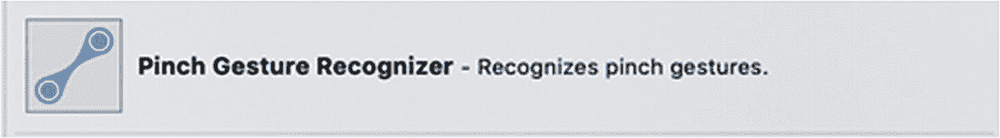
*图 11-9* — 对象库窗口中的“捏合手势识别器”

4.  将“捏合手势识别器”拖放到视图上。Xcode 会在文档大纲中和视图控制器上方显示“捏合手势识别器”。

5.  点击“资源库”图标打开“对象库”窗口，并将一个图像视图拖放到用户界面的中心位置。

6.  选择“视图”➤“检查器”➤“显示属性检查器”，或点击 Xcode 窗口右上角的“属性检查器”图标。

7.  点击“背景”弹出菜单，然后选择一种颜色，例如绿色或蓝色。这将使你在模拟器中运行应用时能轻松找到该图像视图。如果没有背景色，图像视图默认的白色背景会与视图的白色背景融为一体。

8.  选中“启用用户交互”复选框。这允许图像视图响应用户操作。

9.  点击 Xcode 中间窗格底部的“对齐”图标。将出现一个窗口。

10. 选中“容器中水平居中”和“容器中垂直居中”复选框，然后点击“添加 2 个约束”按钮，如图 11-10 所示。图像视图需要居中，以便在模拟器中轻松模拟捏合手势。

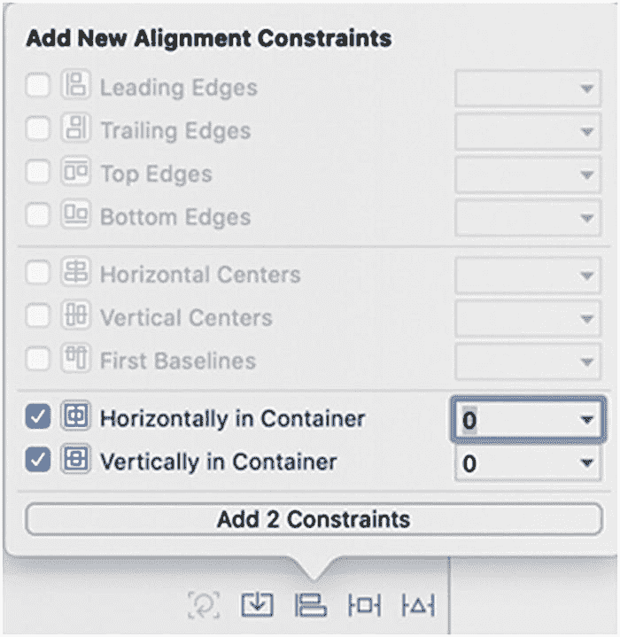
*图 11-10* — 将图像视图居中

11. 选择“编辑器”➤“解决自动布局问题”➤“添加缺少的约束”（在子菜单的上半部分）。Xcode 会为图像视图添加额外的约束。

12. 将鼠标指针移到图像视图上，按住 Control 键，然后从图像视图 Control-拖拽到文档大纲中或视图控制器顶部的“捏合手势识别器”图标上。

13. 松开 Control 键和鼠标左键。将出现一个窗口。

14. 选择 `gestureRecognizers`。此关联使图像视图能够检测捏合手势。

15. 选择“视图”➤“辅助编辑器”➤“显示辅助编辑器”，或点击“辅助编辑器”图标。Xcode 会并排显示 `Main.storyboard` 和 `ViewController.swift` 文件。

16. 将鼠标指针移到图像视图上，按住 Control 键，然后从图像视图 Control-拖拽到 `ViewController.swift` 文件中 `IBOutlet` 行的下方。

17. 松开 Control 键和鼠标左键。将出现一个弹出窗口。

18. 点击“名称”文本字段，输入 `topImageView`，然后点击“连接”按钮。Xcode 会创建一个 `IBOutlet` 变量，如下所示：

```
@IBOutlet var topImageView: UIImageView!
```

19. 将鼠标指针移到文档大纲中或视图控制器顶部的“捏合手势识别器”图标上，按住 Control 键，然后从“捏合手势识别器”Control-拖拽到 `ViewController.swift` 文件中最后一个花括号的上方。

20. 松开 Control 键和鼠标左键。将出现一个弹出窗口。

21. 点击“名称”文本字段，输入 `pinchDetected`，点击“类型”弹出菜单并选择 `UIPinchGestureRecognizer`，然后点击“连接”按钮。Xcode 会创建一个 `IBAction` 方法。

22. 按如下方式编辑 `pinchDetected` `IBAction` 方法：

```
@IBAction func pinchDetected(_ sender: UIPinchGestureRecognizer) {
    topImageView.transform = CGAffineTransform(scaleX: sender.scale, y: sender.scale)
}
```

`pinchDetected` `IBAction` 方法根据捏合手势的 scale 属性更改图像视图的大小，其中 scale 属性定义了捏合手势的距离。整个 `ViewController.swift` 文件应如下所示：

```
import UIKit
class ViewController: UIViewController {
    @IBOutlet var topImageView: UIImageView!
    override func viewDidLoad() {
        super.viewDidLoad()
        // Do any additional setup after loading the view, typically from a nib.
    }
    @IBAction func pinchDetected(_ sender: UIPinchGestureRecognizer) {
        topImageView.transform = CGAffineTransform(scaleX: sender.scale, y: sender.scale)
    }
}
```

23. 选择“视图”➤“标准编辑器”➤“显示标准编辑器”，或点击 Xcode 窗口右上角的“标准编辑器”图标。

24. 点击“运行”按钮，或选择“产品”➤“运行”。模拟器窗口将会出现。要模拟捏合手势，你需要使用鼠标并按住 Option 键。

25. 将鼠标指针移到图像视图上，然后按住 Option 键。屏幕上会出现两个灰色圆点，模拟两个指尖，如图 11-11 所示。


*图 11-11* — 在模拟器中，按住 Option 键的同时拖拽鼠标可模拟双指捏合手势

26. 按住鼠标左键和 Option 键，然后拖拽鼠标以模拟捏合手势。请注意，当捏合手势变化时，图像视图的大小也会随之改变。

27. 选择“模拟器”➤“退出模拟器”以返回 Xcode。

此示例通过从对象库拖拽“捏合手势识别器”来直观地定义捏合手势。现在让我们看看如何仅通过 Swift 代码来复制此过程。

1.  使用“单视图应用”模板创建一个新的 iOS 项目（参见第 1 章），并将此新项目命名为 `PinchCodeApp`。这将为用户界面创建一个单视图。

2.  在导航器窗格中点击 `Main.storyboard` 文件。Xcode 将显示该单视图。

3.  点击“资源库”图标打开“对象库”窗口，并将一个图像视图拖放到用户界面的中心位置。

4.  点击 Xcode 中间窗格底部的“对齐”图标。将出现一个窗口。

5.  选中“容器中水平居中”和“容器中垂直居中”复选框，然后点击“添加 2 个约束”按钮（参见图 11-10）。图像视图需要居中，以便在模拟器中轻松模拟捏合手势。

6.  选择“编辑器”➤“解决自动布局问题”➤“添加缺少的约束”（在子菜单的上半部分）。Xcode 会为图像视图添加额外的约束。

7.  选择“视图”➤“辅助编辑器”➤“显示辅助编辑器”，或点击“辅助编辑器”图标。Xcode 会并排显示 `Main.storyboard` 和 `ViewController.swift` 文件。

8.  将鼠标指针移到图像视图上，按住 Control 键，然后从图像视图 Control-拖拽到 `ViewController.swift` 文件中 `IBOutlet` 行的下方。

9.  松开 Control 键和鼠标左键。将出现一个弹出窗口。

10. 点击“名称”文本字段，输入 `topImageView`，然后点击“连接”按钮。Xcode 会创建一个 `IBOutlet` 变量，如下所示：

```
@IBOutlet var topImageView: UIImageView!
```

11. 选择“视图”➤“标准编辑器”➤“显示标准编辑器”，或点击 Xcode 窗口右上角的“标准编辑器”图标。


```markdown

## 12. 点击导航面板中的`ViewController.swift`文件。

## 13. 在`IBOutlet`下方添加以下代码行：

```swift
var pinchMe: UIPinchGestureRecognizer?
```

该代码定义了一个全局变量，用于表示捏合手势。

## 14. 按如下方式编辑`viewDidLoad`方法：

```swift
override func viewDidLoad() {
    super.viewDidLoad()
    topImageView.isUserInteractionEnabled = true
    topImageView.backgroundColor = UIColor.green
    let pinchGesture = UIPinchGestureRecognizer(target: self, action: #selector(handlePinch))
    topImageView.addGestureRecognizer(pinchGesture)
    pinchMe = pinchGesture
    // Do any additional setup after loading the view, typically from a nib.
}
```

这段代码开启了图像视图的用户交互启用设置，并将其背景颜色定义为绿色以便可见。接着，它定义了一个捏合手势识别器（而非从对象库窗口中拖放捏合手势识别器），定义了一个名为`handlePinch`的函数来响应捏合手势，并将捏合手势链接到图像视图，使得捏合操作仅影响该图像视图。最后，它将捏合手势识别器赋值给`pinchMe`变量。

## 15. 在`viewDidLoad`方法下方添加以下函数：

```swift
@objc func handlePinch() {
    topImageView.transform = CGAffineTransform(scaleX: pinchMe!.scale, y: pinchMe!.scale)
}
```

整个`ViewController.swift`文件应如下所示：

```swift
import UIKit
class ViewController: UIViewController {
    @IBOutlet var topImageView: UIImageView!
    var pinchMe: UIPinchGestureRecognizer?
    
    override func viewDidLoad() {
        super.viewDidLoad()
        topImageView.isUserInteractionEnabled = true
        topImageView.backgroundColor = UIColor.green
        let pinchGesture = UIPinchGestureRecognizer(target: self, action: #selector(handlePinch))
        topImageView.addGestureRecognizer(pinchGesture)
        pinchMe = pinchGesture
        // Do any additional setup after loading the view, typically from a nib.
    }
    
    @objc func handlePinch() {
        topImageView.transform = CGAffineTransform(scaleX: pinchMe!.scale, y: pinchMe!.scale)
    }
}
```

## 16. 点击运行按钮或选择“产品” ➤ “运行”。模拟器窗口将出现。要模拟捏合手势，您需要使用鼠标并按住 Option 键。

## 17. 将鼠标指针移到图像视图上，然后按住 Option 键。屏幕上会出现两个灰点，模拟两个指尖（见图 11-11）。

## 18. 按住鼠标左键和 Option 键，然后拖动鼠标模拟捏合手势。注意，当捏合手势变化时，图像视图的大小也会随之变化。

## 19. 选择“模拟器” ➤ “退出模拟器”以返回 Xcode。

## 检测旋转手势

旋转手势与捏合手势类似，因为它们都使用两个指尖。主要区别在于，旋转手势检测两个指尖以顺时针或逆时针方向做圆周运动的情况。在旋转手势期间，应用可以识别旋转（以弧度为单位）和速度（以弧度/秒为单位）。

要了解如何使用旋转手势，请按照以下步骤操作：

## 1. 使用“单一视图应用”模板（见第 1 章）创建一个新的 iOS 项目，并将此新项目命名为`RotateApp`。这将为用户界面创建一个单一视图。

## 2. 点击导航面板中的`Main.storyboard`文件。Xcode 显示该单一视图。

## 3. 点击库图标以打开“对象库”窗口，查找“旋转手势识别器”，如图 11-12 所示。

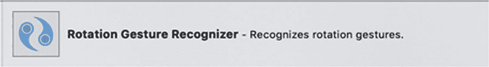

图 11-12 — 对象库窗口中的旋转手势识别器

## 4. 将旋转手势识别器拖放到视图上。Xcode 会在文档大纲和视图控制器上方显示旋转手势识别器。

## 5. 点击库图标以打开“对象库”窗口，并将一个图像视图拖放到用户界面上。

## 6. 选择“视图” ➤ “检查器” ➤ “显示属性检查器”，或点击 Xcode 窗口右上角的“属性检查器”图标。

## 7. 点击“背景”弹出菜单，选择一种颜色，例如绿色或蓝色。这将使图像视图在模拟器中运行应用时易于找到。若无背景颜色，图像视图默认的白色背景将与视图的白色背景融为一体。

## 8. 勾选“启用用户交互”复选框。这允许图像视图响应用户操作。

## 9. 点击 Xcode 中间面板底部的“对齐”图标。将出现一个窗口。

## 10. 勾选“水平居中于容器”和“垂直居中于容器”复选框，然后点击“添加 2 个约束”按钮（见图 11-10）。图像视图需要位于中心位置，以便在模拟器中轻松模拟捏合手势。

## 11. 选择“编辑器” ➤ “解决自动布局问题” ➤ 在子菜单的上半部分点击“添加缺失的约束”。Xcode 会为图像视图添加额外的约束。

## 12. 将鼠标指针移到图像视图上，按住 Control 键，然后从图像视图 Control-拖动到文档大纲或视图控制器顶部的“旋转手势识别器”图标上。

## 13. 松开 Control 键和鼠标左键。将出现一个窗口。

## 14. 选择`gestureRecognizers`。此链接使图像视图能够检测旋转手势。

## 15. 选择“视图” ➤ “辅助编辑器” ➤ “显示辅助编辑器”，或点击“辅助编辑器”图标。Xcode 并排显示`Main.storyboard`和`ViewController.swift`文件。

## 16. 将鼠标指针移到图像视图上，按住 Control 键，然后从图像视图 Control-拖动到`ViewController.swift`文件中`class ViewController`行下方。

## 17. 松开 Control 键和鼠标左键。将出现一个弹出窗口。

## 18. 在“名称”文本字段中点击，输入`topImageView`，然后点击“连接”按钮。Xcode 会创建一个`IBOutlet`变量，如下所示：

```swift
@IBOutlet var topImageView: UIImageView!
```

## 19. 将鼠标指针移到文档大纲或视图控制器顶部的“旋转手势识别器”图标上，按住 Control 键，然后从旋转手势识别器 Control-拖动到`ViewController.swift`文件中最后一个大括号上方。

## 20. 松开 Control 键和鼠标左键。将出现一个弹出窗口。

## 21. 在“名称”文本字段中点击，输入`rotationDetected`，在“类型”弹出菜单中选择`UIRotationGestureRecognizer`，然后点击“连接”按钮。Xcode 会创建一个`IBAction`方法。

```


22. 编辑 `rotationDetected` IBAction 方法，如下所示：

```
@IBAction func rotationDetected(_ sender: UIRotationGestureRecognizer) {
    topImageView.transform = CGAffineTransform(rotationAngle: sender.rotation)
}
```

`rotationDetected` IBAction 方法根据旋转手势的 `rotation` 属性旋转图像视图，其中 `scale` 属性定义了捏合手势的距离。完整的 `ViewController.swift` 文件应如下所示：

```
import UIKit
class ViewController: UIViewController {
    @IBOutlet var topImageView: UIImageView!
    override func viewDidLoad() {
        super.viewDidLoad()
        // Do any additional setup after loading the view, typically from a nib.
    }
    @IBAction func rotationDetected(_ sender: UIRotationGestureRecognizer) {
        topImageView.transform = CGAffineTransform(rotationAngle: sender.rotation)
    }
}
```

23. 选择 **View ➤ Standard Editor ➤ Show Standard Editor**，或点击 Xcode 窗口右上角的 Standard Editor 图标。

24. 点击 Run 按钮或选择 **Product ➤ Run**。模拟器窗口将出现。要模拟旋转手势，您需要使用鼠标并按住 Option 键。

25. 将鼠标指针移到图像视图上，然后按住 Option 键。两个灰色圆点会出现在屏幕上，模拟两个手指的指尖（见图 11-11）。

26. 按住鼠标左键和 Option 键，然后以圆周运动拖动鼠标，模拟旋转手势。请注意，随着旋转手势的变化，图像视图也会随之旋转。

27. 选择 **Simulator ➤ Quit Simulator** 返回 Xcode。

本示例通过从对象库中拖拽 Rotation Gesture Recognizer 来可视化地定义旋转手势。现在，让我们看看如何仅通过 Swift 代码来复制这一过程。

1.  使用 Single View App 模板创建一个新的 iOS 项目（见第 1 章），并将此新项目命名为 `RotateCodeApp`。这将为用户界面创建一个单视图。

2.  点击导航器面板中的 `Main.storyboard` 文件。Xcode 将显示该单视图。

3.  点击库图标打开对象库窗口，将一个图像视图拖放到用户界面的中心。

4.  点击 Xcode 中间面板底部的对齐图标。将出现一个窗口。

5.  选中 **Horizontally in Container** 和 **Vertically in Container** 复选框，然后点击 **Add 2 Constraints** 按钮（见图 11-10）。图像视图需要位于中心，以便在模拟器中轻松模拟捏合手势。

6.  选择 **Editor ➤ Resolve Auto Layout Issues ➤ Add Missing Constraints**（子菜单的上半部分）。Xcode 会为图像视图添加额外的约束。

7.  选择 **View ➤ Assistant Editor ➤ Show Assistant Editor**，或点击 Assistant Editor 图标。Xcode 将并排显示 `Main.storyboard` 和 `ViewController.swift` 文件。

8.  将鼠标指针移到图像视图上，按住 Control 键，然后从图像视图 Control-拖动到 `ViewController.swift` 文件中 "class ViewController" 行的下方。

9.  松开 Control 键和鼠标左键。将出现一个弹出窗口。

10. 点击 Name 文本字段，输入 **topImageView**，然后点击 **Connect** 按钮。Xcode 将创建一个 `IBOutlet` 变量，如下所示：

```
@IBOutlet var topImageView: UIImageView!
```

11. 选择 **View ➤ Standard Editor ➤ Show Standard Editor**，或点击 Xcode 窗口右上角的 Standard Editor 图标。

12. 点击导航器面板中的 `ViewController.swift` 文件。

13. 在 `IBOutlet` 下方添加以下代码行：

```
var rotateMe: UIRotationGestureRecognizer?
```

这定义了一个代表旋转手势的全局变量。

14. 编辑 `viewDidLoad` 方法，如下所示：

```
override func viewDidLoad() {
    super.viewDidLoad()
    topImageView.isUserInteractionEnabled = true
    topImageView.backgroundColor = UIColor.green
    let rotationGesture = UIRotationGestureRecognizer(target: self, action: #selector(handleRotation))
    topImageView.addGestureRecognizer(rotationGesture)
    rotateMe = rotationGesture
    // Do any additional setup after loading the view, typically from a nib.
}
```

此代码开启了图像视图的 User Interaction Enabled 设置，并将其背景颜色定义为绿色以使其可见。接着，它定义了一个旋转手势识别器（而不是从对象库窗口中拖放一个 Rotation Gesture Recognizer），定义了一个名为 `handleRotation` 的函数来响应旋转手势，并将该旋转手势链接到图像视图，以便旋转只影响图像视图。最后，它将旋转手势识别器赋值给 `rotateMe` 变量。

15. 在 `viewDidLoad` 方法下方添加以下函数：

```
@objc func handleRotation() {
    topImageView.transform = CGAffineTransform(rotationAngle: rotateMe!.rotation)
}
```

完整的 `ViewController.swift` 文件应如下所示：

```
import UIKit
class ViewController: UIViewController {
    @IBOutlet var topImageView: UIImageView!
    var rotateMe: UIRotationGestureRecognizer?
    override func viewDidLoad() {
        super.viewDidLoad()
        topImageView.isUserInteractionEnabled = true
        topImageView.backgroundColor = UIColor.green
        let rotationGesture = UIRotationGestureRecognizer(target: self, action: #selector(handleRotation))
        topImageView.addGestureRecognizer(rotationGesture)
        rotateMe = rotationGesture
        // Do any additional setup after loading the view, typically from a nib.
    }
    @objc func handleRotation() {
        topImageView.transform = CGAffineTransform(rotationAngle: rotateMe!.rotation)
    }
}
```

16. 点击 Run 按钮或选择 **Product ➤ Run**。模拟器窗口将出现。要模拟捏合手势，您需要使用鼠标并按住 Option 键。

17. 将鼠标指针移到图像视图上，然后按住 Option 键。两个灰色圆点会出现在屏幕上，模拟两个手指的指尖（见图 11-11）。

18. 按住鼠标左键和 Option 键，然后以圆周运动拖动鼠标，模拟旋转手势。请注意，随着旋转手势的旋转，图像视图也会随之旋转。

19. 选择 **Simulator ➤ Quit Simulator** 返回 Xcode。


### 检测平移手势

当用户将手指按在屏幕上并保持按下状态进行移动时，即触发平移手势。这种操作类似于在 Macintosh 电脑上拖动鼠标，你可以定义触发平移手势所需的最小和最大手指数量，例如至少两根手指但不超过四根。

平移手势会追踪**速度**和**位移**两个参数：速度用于衡量平移的快慢，而位移则衡量手指移动的距离。

要了解如何使用平移手势，请按照以下步骤操作：

1.  使用单视图应用模板创建一个新的 iOS 项目（参见第 1 章），并将新项目命名为 `PanApp`。这将为用户界面创建一个单视图。

2.  在导航面板中点击 `Main.storyboard` 文件，Xcode 将显示该单视图。

3.  点击库图标以打开对象库窗口，并找到如图 11-13 所示的平移手势识别器。

    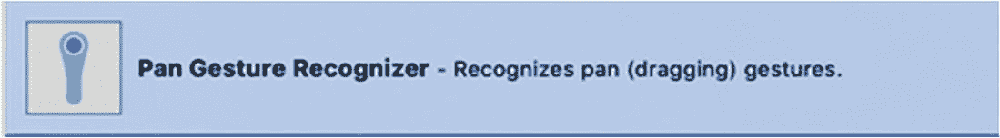

    图 11-13

    对象库窗口中的平移手势识别器

4.  将平移手势识别器拖放到视图上。Xcode 会在文档大纲中和视图控制器上方显示该手势识别器。

5.  点击库图标打开对象库窗口，将一个图像视图拖放到用户界面的中心位置。

6.  选择“视图” ➤ “检查器” ➤ “显示属性检查器”，或点击 Xcode 窗口右上角的属性检查器图标。

7.  点击“背景”弹出菜单，选择一种颜色，例如绿色或蓝色。这将使你在模拟器中运行应用时更容易找到该图像视图。如果没有设置背景色，图像视图默认的白色背景会与视图的白色背景融为一体。

8.  勾选“启用用户交互”复选框。这允许图像视图响应用户操作。

9.  点击 Xcode 中间面板底部的“对齐”图标。将出现一个窗口。

10. 勾选“水平居中在容器中”和“垂直居中在容器中”复选框，然后点击“添加 2 个约束”按钮（见图 11-10）。图像视图需要居中放置，以便在模拟器中更容易模拟捏合手势。

11. 选择“编辑器” ➤ “解决自动布局问题” ➤ 在子菜单的上半部分点击“添加缺少的约束”。Xcode 会为图像视图添加额外的约束。

12. 将鼠标指针移到图像视图上，按住 Control 键，然后从图像视图向文档大纲或视图控制器顶部的平移手势识别器图标进行 Ctrl-拖拽。

13. 松开 Control 键和鼠标左键。会出现一个窗口。

14. 选择 `gestureRecognizers`。这个连接可以让图像视图检测平移手势。

15. 选择“视图” ➤ “辅助编辑器” ➤ “显示辅助编辑器”，或点击辅助编辑器图标。Xcode 会并排显示 `Main.storyboard` 和 `ViewController.swift` 文件。

16. 将鼠标指针移到图像视图上，按住 Control 键，然后从图像视图向 `ViewController.swift` 文件中 `class ViewController` 行下方进行 Ctrl-拖拽。

17. 松开 Control 键和鼠标左键。会弹出一个窗口。

18. 点击“名称 (Name)”文本字段，输入 `topImageView`，然后点击“连接 (Connect)”按钮。Xcode 会创建一个如下所示的 IBOutlet 变量：

    ```swift
    @IBOutlet var topImageView: UIImageView!
    ```

19. 在 IBOutlet 下方添加以下两行代码：

    ```swift
    var xOrigin:CGFloat = 0
    var yOrigin:CGFloat = 0
    ```

    请注意，这两个变量被定义为 `CGFloat` 数据类型，该类型用于测量距离。如果没有显式将两个变量定义为 `CGFloat`，Xcode 会假定这两个变量仅用于存储整数。

20. 按如下方式编辑 `viewDidLoad` 方法：


```swift
override func viewDidLoad() {
    super.viewDidLoad()
    xOrigin = topImageView.center.x
    yOrigin = topImageView.center.y
    // 视图加载完成后进行额外的设置，通常从 nib 文件加载
}
```

21. 将鼠标指针移到文档大纲或视图控制器顶部的“平移手势识别器”图标上，按住 Control 键，从该平移手势识别器按住 Ctrl 键拖拽到 `ViewController.swift` 文件中最后一个花括号的上方。
22. 松开 Control 键和鼠标左键。此时会弹出一个窗口。
23. 点击“名称”文本字段，输入 `panDetected`，点击“类型”弹出菜单并选择 `UIPanGestureRecognizer`，然后点击“连接”按钮。Xcode 会创建一个 IBAction 方法。
24. 按如下方式编辑 `panDetected` IBAction 方法：

```swift
@IBAction func panDetected(_ sender: UIPanGestureRecognizer) {
    let translation = sender.translation(in: view)
    topImageView.center = CGPoint(x: xOrigin + translation.x, y: yOrigin + translation.y)
}
```

`panDetected` IBAction 方法捕获了用户指尖移动的平移距离。然后将这些距离累加到图像视图的中心点上。完整的 `ViewController.swift` 文件应如下所示：

```swift
import UIKit
class ViewController: UIViewController {
    @IBOutlet var topImageView: UIImageView!
    var xOrigin:CGFloat = 0
    var yOrigin:CGFloat = 0
    override func viewDidLoad() {
        super.viewDidLoad()
        xOrigin = topImageView.center.x
        yOrigin = topImageView.center.y
        // 视图加载完成后进行额外的设置，通常从 nib 文件加载
    }
    @IBAction func panDetected(_ sender: UIPanGestureRecognizer) {
        let translation = sender.translation(in: view)
        topImageView.center = CGPoint(x: xOrigin + translation.x, y: yOrigin + translation.y)
    }
}
```

25. 选择“视图”➤“标准编辑器”➤“显示标准编辑器”，或点击 Xcode 窗口右上角的“标准编辑器”图标。
26. 点击“运行”按钮，或选择“产品”➤“运行”。此时会显示模拟器窗口。
27. 按住鼠标左键并移动鼠标来模拟平移手势。注意，当平移手势变化时，图像视图也会随之移动。
28. 选择“模拟器”➤“退出模拟器”返回 Xcode。

这个示例通过从对象库拖拽“平移手势识别器”来可视化地定义平移手势。现在让我们看看如何仅通过 Swift 代码来重复此过程。

1. 使用“单视图应用”模板创建一个新的 iOS 项目（参见第 1 章），并将这个新项目命名为 `PanCodeApp`。这会为用户界面创建一个单一的视图。
2. 在导航窗格中点击 `Main.storyboard` 文件。Xcode 会显示这个单视图。
3. 点击“库”图标打开对象库窗口，将一个图像视图拖放至用户界面的中央。
4. 点击 Xcode 中间窗格底部的“对齐”图标。此时会弹出一个窗口。
5. 勾选“在容器中水平居中”和“在容器中垂直居中”复选框，然后点击“添加 2 个约束”按钮（见图 11-10）。图像视图需要位于中心，以便在模拟器中轻松模拟捏合手势。
6. 选择“编辑器”➤“解决自动布局问题”➤ 在子菜单的上半部分选择“添加缺失的约束”。Xcode 会为图像视图添加额外的约束。
7. 选择“视图”➤“助理编辑器”➤“显示助理编辑器”，或点击“助理编辑器”图标。Xcode 会并排显示 `Main.storyboard` 和 `ViewController.swift` 文件。
8. 将鼠标指针移到图像视图上，按住 Control 键，从图像视图按住 Ctrl 键拖拽到 `class ViewController` 行下方的 `ViewController.swift` 文件中。
9. 松开 Control 键和鼠标左键。此时会弹出一个窗口。
10. 点击“名称”文本字段，输入 `topImageView`，然后点击“连接”按钮。Xcode 会创建一个 IBOutlet 变量，如下所示：

```swift
@IBOutlet var topImageView: UIImageView!
```

1. 选择“视图”➤“标准编辑器”➤“显示标准编辑器”，或点击 Xcode 窗口右上角的“标准编辑器”图标。
2. 在导航窗格中点击 `ViewController.swift` 文件。
3. 在 IBOutlet 下方添加以下几行代码：

```swift
var panMe: UIPanGestureRecognizer?
var xOrigin:CGFloat = 0
var yOrigin:CGFloat = 0
```

这定义了一个表示旋转手势的全局变量，同时定义了两个 `CGFloat` 变量。

4. 按如下方式编辑 `viewDidLoad` 方法：

```swift
override func viewDidLoad() {
    super.viewDidLoad()
    xOrigin = topImageView.center.x
    yOrigin = topImageView.center.y
    topImageView.isUserInteractionEnabled = true
    topImageView.backgroundColor = UIColor.green
    let panGesture = UIPanGestureRecognizer(target: self, action: #selector(handlePan))
    topImageView.addGestureRecognizer(panGesture)
    panMe = panGesture
    // 视图加载完成后进行额外的设置，通常从 nib 文件加载
}
```

这段代码将图像视图的中心点坐标存储到 `xOrigin` 和 `yOrigin` 变量中。然后启用了图像视图的“用户交互已启用”设置，并将其背景色定义为绿色以便可见。接着，它定义了一个平移手势识别器（而不是从对象库窗口拖放一个平移手势识别器），定义了一个名为 `handlePan` 的函数来响应平移手势，并将该平移手势链接到图像视图上，使得平移操作仅影响该图像视图。最后，它将平移手势识别器赋值给 `panMe` 变量。

5. 在 `viewDidLoad` 方法下方添加以下函数：

```swift
@objc func handleRotation() {
    topImageView.transform = CGAffineTransform(rotationAngle: rotateMe!.rotation)
}
```

完整的 `ViewController.swift` 文件应如下所示：

```swift
import UIKit
class ViewController: UIViewController {
    @IBOutlet var topImageView: UIImageView!
    var rotateMe: UIRotationGestureRecognizer?
    override func viewDidLoad() {
        super.viewDidLoad()
        topImageView.isUserInteractionEnabled = true
        topImageView.backgroundColor = UIColor.green
        let rotationGesture = UIRotationGestureRecognizer(target: self, action: #selector(handleRotation))
        topImageView.addGestureRecognizer(rotationGesture)
        rotateMe = rotationGesture
        // 视图加载完成后进行额外的设置，通常从 nib 文件加载
    }
    @objc func handleRotation() {
        topImageView.transform = CGAffineTransform(rotationAngle: rotateMe!.rotation)
    }
}
```

6. 点击“运行”按钮，或选择“产品”➤“运行”。此时会显示模拟器窗口。
7. 按住鼠标左键并拖动鼠标来模拟平移手势。注意，当平移手势移动时，图像视图也会随之移动。
8. 选择“模拟器”➤“退出模拟器”返回 Xcode。


## 检测屏幕边缘滑动手势

应用可以检测的一种独特手势称为屏幕边缘滑动。当用户从屏幕的上、下、左、右边缘滑动指尖时，就会触发此手势。默认情况下，iOS 使用上边缘滑动来显示通知，使用下边缘滑动来显示控制中心。如果你希望自己的应用检测上边缘或下边缘滑动，则需要覆盖 iOS 的这些默认边缘滑动。

在创建屏幕边缘滑动手势时，你需要为每个要检测的边缘单独创建一个屏幕边缘滑动手势识别器。因此，如果你希望应用检测下边缘和左边缘滑动，就需要创建两个独立的手势识别器：一个用于检测下边缘滑动，另一个用于检测左边缘滑动。

要了解如何使用屏幕边缘滑动手势，请按照以下步骤操作：

1.  使用“单视图应用”模板（参见第 1 章）创建一个新的 iOS 项目，并将该项目命名为 `EdgePanApp`。这将为用户界面创建一个单一视图。

2.  在导航窗格中点击 `Main.storyboard` 文件。Xcode 会显示该单一视图。

3.  点击“库”图标打开“对象库”窗口，并找到如图 11-14 所示的“屏幕边缘滑动手势识别器”。

    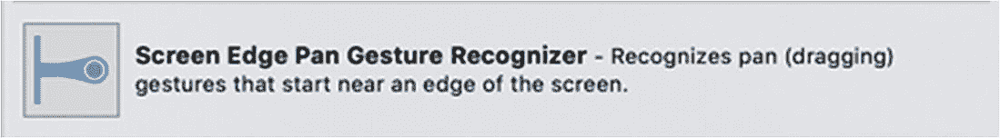

    **图 11-14** 对象库窗口中的屏幕边缘滑动手势识别器

4.  将“屏幕边缘滑动手势识别器”拖放到视图上。Xcode 会在文档大纲中以及视图控制器上方显示该识别器。

5.  选择“视图”➤“检查器”➤“显示属性检查器”，或点击 Xcode 窗口右上角的“属性检查器”图标。此时会显示如图 11-15 所示的属性检查器窗格。

    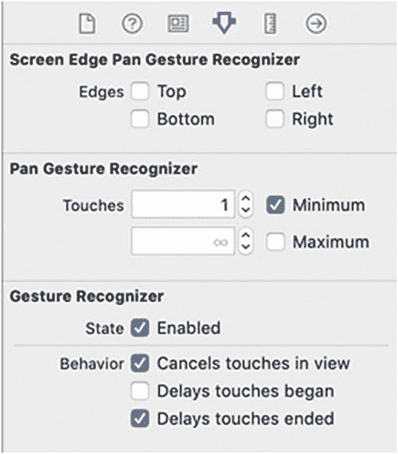

    **图 11-15** 屏幕边缘滑动手势识别器的属性检查器窗格

6.  选中“底部”复选框，以识别屏幕下边缘的滑动手势。

    **注意：** 尽管看起来你可以选择两个或更多复选框，但实际上你只能选择一个复选框来定义一个屏幕边缘。

7.  选择“视图”➤“辅助编辑器”➤“显示辅助编辑器”，或点击“辅助编辑器”图标。Xcode 会并排显示 `Main.storyboard` 和 `ViewController.swift` 文件。

8.  将鼠标指针移动到视图控制器顶部或文档大纲中的“屏幕边缘滑动手势识别器”上，按住 Control 键，然后将其 Control-拖拽到 `ViewController.swift` 文件底部最后一个花括号的上方。

9.  松开 Control 键和鼠标左键。此时会弹出一个窗口。

10. 在“名称”文本框中点击，输入 `bottomEdgeDetected`，在“类型”弹出菜单中选择 `UIScreenEdgePanGestureRecognizer`，然后点击“连接”按钮。

11. 如下所示编辑这个 `bottomEdgeDetected` IBAction 方法：

    ```swift
    @IBAction func bottomEdgeDetected(_ sender: UIScreenEdgePanGestureRecognizer) {
        print ("检测到下滑动手势")
    }
    ```

12. 在文档大纲中点击“屏幕边缘滑动手势识别器”，然后按回车键。Xcode 会高亮显示整个名称。

13. 输入 `下滑动手势` 并按回车键，重新命名你的手势识别器。

14. 在 `viewDidLoad` 方法下方添加以下方法：

    ```swift
    override var preferredScreenEdgesDeferringSystemGestures: UIRectEdge {
        return UIRectEdge.bottom
    }
    ```

    此方法会覆盖 iOS 的默认行为（即当用户从屏幕下边缘向上滑动时显示控制中心）。如果你只想检测左边缘或右边缘的滑动手势，则不需要上述代码。

15. 在导航窗格中点击 `Main.storyboard` 文件。

16. 点击“库”图标打开“对象库”窗口。

17. 将另一个“屏幕边缘滑动手势识别器”拖放到视图上。Xcode 会在文档大纲中以及视图控制器上方显示第二个识别器。

18. 在文档大纲中点击该“屏幕边缘滑动手势识别器”，按回车键高亮显示整个名称。然后输入 `左边缘手势` 并按回车键。

19. 在文档大纲中点击这个“左边缘手势”，选择“视图”➤“检查器”➤“显示属性检查器”，或点击 Xcode 窗口右上角的“属性检查器”图标。

20. 选中“左侧”复选框，将其定义为检测屏幕左边缘的滑动手势。

21. 将鼠标指针移动到文档大纲中的“左边缘手势”上，按住 Control 键，然后将其 Control-拖拽到 `ViewController.swift` 文件底部最后一个花括号的上方。

22. 松开 Control 键和鼠标左键。此时会弹出一个窗口。

23. 在“名称”文本框中点击，输入 `leftEdgeDetected`，在“类型”弹出菜单中选择 `UIScreenEdgePanGestureRecognizer`，然后点击“连接”按钮。

24. 如下所示编辑这个 `leftEdgeDetected` IBAction 方法：

    ```swift
    @IBAction func leftEdgeDetected(_ sender: UIScreenEdgePanGestureRecognizer) {
        print ("检测到左滑动手势")
    }
    ```

25. 点击“运行”按钮，或选择“产品”➤“运行”。模拟器窗口会显示。

26. 将鼠标指针移动到视图底部边缘稍下方，按住鼠标左键，然后向上拖拽。注意，Xcode 窗口的调试区域会显示多行“检测到下滑动手势”，表明应用已识别到屏幕下边缘的滑动手势。

27. 将鼠标指针移动到视图左侧边缘稍左，按住鼠标左键，然后向右拖拽。注意，Xcode 窗口的调试区域会显示多行“检测到左滑动手势”，表明应用已识别到屏幕左边缘的滑动手势。

28. 选择“模拟器”➤“退出模拟器”返回 Xcode。

此示例通过从对象库拖拽“屏幕边缘滑动手势识别器”直观地定义了屏幕边缘滑动手势。现在让我们看看如何仅通过 Swift 代码来复制此过程。

1.  使用“单视图应用”模板（参见第 1 章）创建一个新的 iOS 项目，并将该项目命名为 `EdgePanCodeApp`。这将为用户界面创建一个单一视图。

2.  在导航窗格中点击 `Main.storyboard` 文件。

3.  选择“视图”➤“辅助编辑器”➤“显示辅助编辑器”，或点击“辅助编辑器”图标。Xcode 会并排显示 `Main.storyboard` 和 `ViewController.swift` 文件。

4.  将鼠标指针移动到视图（模拟 iOS 设备的整个屏幕）上，按住 Control 键，然后将其 Control-拖拽到 `ViewController.swift` 文件中的 `class ViewController` 行下方。

5.  松开 Control 键和鼠标左键。此时会弹出一个窗口。

6.  在“名称”文本框中点击，输入 `myView`，然后点击“连接”按钮。Xcode 会创建一个 `IBOutlet`，如下所示：

    ```swift
    @IBOutlet var myView: UIView!
    ```

7.  选择“视图”➤“标准编辑器”➤“显示标准编辑器”，或点击“标准编辑器”图标。

8.  在导航窗格中点击 `ViewController.swift` 文件。

9.  如下所示修改 `viewDidLoad` 方法：

    ```swift
    override func viewDidLoad() {
        super.viewDidLoad()
        let bottomEdgeGesture = UIScreenEdgePanGestureRecognizer(target: self, action: #selector(handleBottomEdge))
        myView.addGestureRecognizer(bottomEdgeGesture)
        bottomEdgeGesture.edges = .bottom
        let leftEdgeGesture = UIScreenEdgePanGestureRecognizer(target: self, action: #selector(handleLeftEdge))
        myView.addGestureRecognizer(leftEdgeGesture)
        leftEdgeGesture.edges = .left
        // 在此处添加任何额外的视图加载后设置，通常来自于 nib 文件。
    }
    ```


这段代码创建了两个屏幕边缘平移手势识别器，分别命名为 `bottomEdgeGesture` 和 `leftEdgeGesture`。接着，它将这两个手势都关联到视图（`myView`）上，并设定 `bottomEdgeGesture` 识别屏幕底部边缘的平移操作，`leftEdgeGesture` 识别屏幕左侧边缘的平移操作。

最后，它调用了名为 `handleBottomEdge` 和 `handleLeftEdge` 的两个函数，来响应各自的屏幕边缘平移手势。

10. 在 `viewDidLoad` 方法下方添加以下代码：

```swift
override var preferredScreenEdgesDeferringSystemGestures: UIRectEdge {
return UIRectEdge.bottom
}
@objc func handleBottomEdge() {
print ("底部边缘平移手势")
}
@objc func handleLeftEdge() {
print ("左侧边缘平移手势")
}
```

11. 点击“运行”按钮，或者选择 **Product** ➤ **Run**。模拟器窗口将会出现。

12. 将鼠标指针移动到视图底部正下方，按住鼠标左键，并向上拖动鼠标。注意，Xcode 窗口中的调试区域会显示多行 "底部边缘平移手势"，表明应用已识别到屏幕底部边缘的平移手势。

13. 将鼠标指针移动到视图左侧，按住鼠标左键，并向右拖动鼠标。注意，Xcode 窗口中的调试区域会显示多行 "左侧边缘平移手势"，表明应用已识别到屏幕左侧边缘的平移手势。

14. 选择 **Simulator** ➤ **Quit Simulator** 返回 Xcode。

## 检测轻扫手势

当用户在屏幕上沿四个方向（上、下、左、右）之一进行轻扫时，就会触发轻扫手势。你可以定义轻扫所需的手指数量，以及希望手势识别器检测的方向。

每个轻扫手势识别器只能检测单一方向的轻扫。这意味着，如果你想同时检测向上和向下的轻扫，你需要定义两个独立的轻扫手势识别器，其中一个只识别向上轻扫，另一个只识别向下轻扫。

要了解如何使用轻扫手势，请按照以下步骤操作：

1. 使用“单视图应用”模板创建一个新的 iOS 项目（参见第 1 章），并将此新项目命名为 `SwipeApp`。这将为用户界面创建一个单一视图。

2. 在导航面板中点击 `Main.storyboard` 文件。Xcode 会显示该单一视图。

3. 点击“库”图标以打开“对象库”窗口，并查找“平移手势识别器”，如图 11-16 所示。

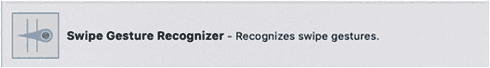

**图 11-16**  
对象库窗口中的“轻扫手势识别器”

4. 将“轻扫手势识别器”拖放到视图上。Xcode 会在“文档大纲”以及“视图控制器”上方显示该“轻扫手势识别器”。

5. 在“文档大纲”中点击“轻扫手势识别器”，然后按 **ENTER** 键。接着输入 **右侧轻扫手势** 并再次按 **ENTER** 键。

6. 将第二个“轻扫手势识别器”拖放到视图上。Xcode 会在“文档大纲”以及“视图控制器”上方显示该“轻扫手势识别器”。

7. 在“文档大纲”中点击“轻扫手势识别器”，然后按 **ENTER** 键。接着输入 **向上轻扫手势** 并再次按 **ENTER** 键。

8. 点击“库”图标以打开“对象库”窗口，然后将一个“图像视图”拖放到用户界面的中央位置。

9. 选择 **View** ➤ **Inspectors** ➤ **Show Attributes Inspector**，或者点击 Xcode 窗口右上角的“属性检查器”图标。

10. 点击“背景”弹出菜单，然后选择一种颜色，例如绿色或蓝色。这会使图像视图在模拟器中运行应用时容易被找到。如果没有背景色，图像视图默认的白色背景会与视图的白色背景融为一体。

11. 选中 **User Interaction Enabled**（用户交互已启用）复选框。这允许图像视图响应用户操作。

12. 点击 Xcode 中间窗格底部的“对齐”图标。将会出现一个窗口。

13. 选中 **Horizontally in Container**（容器中水平居中）和 **Vertically in Container**（容器中垂直居中）复选框，然后点击 **Add 2 Constraints**（添加 2 个约束）按钮（见图 11-10）。图像视图需要位于中央，以便在模拟器中更容易模拟捏合手势。

14. 选择 **Editor** ➤ **Resolve Auto Layout Issues** ➤ **Add Missing Constraints**（位于子菜单的上半部分）。Xcode 会为图像视图添加额外的约束。

15. 将鼠标指针移到图像视图上，按住 **Control** 键，然后从图像视图按住 Control 键拖拽到“文档大纲”或“视图控制器”顶部的 **Right Swipe Gesture**（右侧轻扫手势）图标上。

16. 松开 **Control** 键和鼠标左键。将会出现一个窗口。

17. 选择 `gestureRecognizers`。此连接允许图像视图检测右侧轻扫手势。

18. 将鼠标指针移到图像视图上，按住 **Control** 键，然后从图像视图按住 Control 键拖拽到“文档大纲”或“视图控制器”顶部的 **Up Swipe Gesture**（向上轻扫手势）图标上。

19. 松开 **Control** 键和鼠标左键。将会出现一个窗口。

20. 选择 `gestureRecognizers`。此连接允许图像视图检测向上轻扫手势。

21. 在“文档大纲”中点击 **Up Swipe Gesture**（向上轻扫手势），然后选择 **View** ➤ **Inspectors** ➤ **Show Attributes Inspector**，或者点击 Xcode 窗口右上角的“属性检查器”图标。


22. 在弹出的“滑动”菜单中点击，然后选择`向上`，如图 11-17 所示。（默认情况下，除非另行定义，每个轻扫手势识别器只识别向右轻扫。）

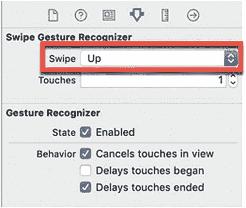

23. 选择`视图` ➤ `助理编辑器` ➤ `显示助理编辑器`，或点击助理编辑器图标。Xcode 会并排显示`Main.storyboard`和`ViewController.swift`文件。

24. 将鼠标指针移到图像视图上，按住 Control 键，然后从图像视图拖拽到`class ViewController`行下方的`ViewController.swift`文件中。

25. 松开 Control 键和鼠标左键。此时会弹出一个窗口。

26. 在“名称”文本字段中点击，输入`topImageView`，然后点击“连接”按钮。Xcode 会创建一个`IBOutlet`变量，如下所示：

```swift
@IBOutlet var topImageView: UIImageView!
```

27. 将鼠标指针移到文档大纲或视图控制器顶部的“向右轻扫手势”图标上，按住 Control 键，然后从“向右轻扫手势”拖拽到`ViewController.swift`文件中最后一个花括号的上方。

28. 松开 Control 键和鼠标左键。此时会弹出一个窗口。

29. 在“名称”文本字段中点击，输入`rightSwipeDetected`，在“类型”弹出菜单中点击并选择`UISwipeGestureRecognizer`，然后点击“连接”按钮。Xcode 会创建一个`IBAction`方法。

30. 按如下方式编辑`rightSwipeDetected` IBAction 方法：

```swift
@IBAction func rightSwipeDetected(_ sender: UISwipeGestureRecognizer) {
    topImageView.center = CGPoint(x: topImageView.center.x + topImageView.frame.width, y: topImageView.center.y)
}
```

31. 将鼠标指针移到文档大纲或视图控制器顶部的“向上轻扫手势”图标上，按住 Control 键，然后从“向右轻扫手势”拖拽到`ViewController.swift`文件中最后一个花括号的上方。

32. 松开 Control 键和鼠标左键。此时会弹出一个窗口。

33. 在“名称”文本字段中点击，输入`upSwipeDetected`，在“类型”弹出菜单中点击并选择`UISwipeGestureRecognizer`，然后点击“连接”按钮。Xcode 会创建一个`IBAction`方法。

34. 按如下方式编辑`upSwipeDetected` IBAction 方法：

```swift
@IBAction func upSwipeDetected(_ sender: UISwipeGestureRecognizer) {
    topImageView.center = CGPoint(x: topImageView.center.x, y: topImageView.center.y - topImageView.frame.height)
}
```

**注意：** 注意这段代码对图像视图的中心进行了减法运算，这是因为对于 y 轴来说，由于原点位于视图的左上角，正值向下增加，向上则减少。

整个`ViewController.swift`文件应如下所示：

```swift
import UIKit
class ViewController: UIViewController {
    @IBOutlet var topImageView: UIImageView!
    override func viewDidLoad() {
        super.viewDidLoad()
        // 加载视图后执行任何额外的设置，通常来自 nib 文件。
    }
    @IBAction func rightSwipeDetected(_ sender: UISwipeGestureRecognizer) {
        topImageView.center = CGPoint(x: topImageView.center.x + topImageView.frame.width, y: topImageView.center.y)
    }
    @IBAction func upSwipeDetected(_ sender: UISwipeGestureRecognizer) {
        topImageView.center = CGPoint(x: topImageView.center.x, y: topImageView.center.y - topImageView.frame.height)
    }
}
```

1.  点击“运行”按钮或选择`产品` ➤ `运行`。模拟器窗口将出现。

2.  将鼠标指针移到图像视图上，按住鼠标左键，向右移动鼠标，然后松开鼠标左键，模拟向右轻扫手势。注意图像视图会向右移动。

3.  将鼠标指针移到图像视图上，按住鼠标左键，向上移动鼠标，然后松开鼠标左键，模拟向上轻扫手势。注意图像视图会向上移动。

4.  重复步骤 36 和 37，直到图像视图从视野中消失。

5.  选择`模拟器` ➤ `退出模拟器`以返回 Xcode。

此示例通过从对象库拖拽“轻扫手势识别器”来直观地定义轻扫手势。现在让我们看看如何仅通过 Swift 代码来复制此过程。

1.  使用“单视图应用”模板创建一个新的 iOS 项目（参见第 1 章），并将这个新项目命名为`SwipeCodeApp`。这会为用户界面创建一个单独的视图。

2.  在导航器面板中点击`Main.storyboard`文件。Xcode 会显示该单视图。

3.  点击“库”图标打开对象库窗口，然后将一个图像视图拖放到用户界面的中央。

4.  点击 Xcode 中间面板底部的“对齐”图标。此时会弹出一个窗口。

5.  选中“在容器中水平居中”和“在容器中垂直居中”复选框，然后点击“添加 2 个约束”按钮（见图 11-10）。图像视图需要居中，以便于在模拟器中模拟捏合手势。

6.  选择`编辑器` ➤ `解决自动布局问题` ➤ `添加缺失的约束`（位于子菜单的上半部分）。Xcode 会为图像视图添加额外的约束。

7.  选择`视图` ➤ `助理编辑器` ➤ `显示助理编辑器`，或点击助理编辑器图标。Xcode 会并排显示`Main.storyboard`和`ViewController.swift`文件。

8.  将鼠标指针移到图像视图上，按住 Control 键，然后从图像视图拖拽到`class ViewController`行下方的`ViewController.swift`文件中。

9.  松开 Control 键和鼠标左键。此时会弹出一个窗口。

10. 在“名称”文本字段中点击，输入`topImageView`，然后点击“连接”按钮。Xcode 会创建一个`IBOutlet`变量，如下所示：

```swift
@IBOutlet var topImageView: UIImageView!
```

11. 选择`视图` ➤ `标准编辑器` ➤ `显示标准编辑器`，或点击 Xcode 窗口右上角的标准编辑器图标。

12. 在导航器面板中点击`ViewController.swift`文件。

13. 按如下方式编辑`viewDidLoad`方法：

```swift
override func viewDidLoad() {
    super.viewDidLoad()
    topImageView.isUserInteractionEnabled = true
    topImageView.backgroundColor = UIColor.green
    let downSwipeGesture = UISwipeGestureRecognizer(target: self, action: #selector(handleDownSwipe))
    topImageView.addGestureRecognizer(downSwipeGesture)
    downSwipeGesture.direction = .down
    let leftSwipeGesture = UISwipeGestureRecognizer(target: self, action: #selector(handleLeftSwipe))
    topImageView.addGestureRecognizer(leftSwipeGesture)
    leftSwipeGesture.direction = .left
    // 加载视图后执行任何额外的设置，通常来自 nib 文件。
}
```

这段代码开启了图像视图的“允许用户交互”设置，并将其背景色定义为绿色以便可见。接着，它定义了两个轻扫手势识别器（而不是从对象库窗口拖放一个轻扫手势识别器），定义了名为`handleDownSwipe`和`handleLeftSwipe`的函数来响应这两个轻扫手势，并将轻扫手势链接到图像视图。此外，它还定义了每个轻扫手势可以识别的方向，例如向下和向左。

14. 在`viewDidLoad`方法下方添加以下函数：

```swift
@objc func handleDownSwipe() {
    topImageView.center = CGPoint(x: topImageView.center.x, y: topImageView.center.y + topImageView.frame.height)
}
@objc func handleLeftSwipe() {
    topImageView.center = CGPoint(x: topImageView.center.x - topImageView.frame.width, y: topImageView.center.y)
}
```

整个`ViewController.swift`文件应如下所示。


```
import UIKit
class ViewController: UIViewController {
    @IBOutlet var topImageView: UIImageView!
    override func viewDidLoad() {
        super.viewDidLoad()
        topImageView.isUserInteractionEnabled = true
        topImageView.backgroundColor = UIColor.green
        let downSwipeGesture = UISwipeGestureRecognizer(target: self, action: #selector(handleDownSwipe))
        topImageView.addGestureRecognizer(downSwipeGesture)
        downSwipeGesture.direction = .down
        let leftSwipeGesture = UISwipeGestureRecognizer(target: self, action: #selector(handleLeftSwipe))
        topImageView.addGestureRecognizer(leftSwipeGesture)
        leftSwipeGesture.direction = .left
        // 在这里进行视图加载后的额外设置，通常来自 nib 文件
    }
    @objc func handleDownSwipe() {
        topImageView.center = CGPoint(x: topImageView.center.x, y: topImageView.center.y + topImageView.frame.height)
    }
    @objc func handleLeftSwipe() {
        topImageView.center = CGPoint(x: topImageView.center.x - topImageView.frame.width, y: topImageView.center.y)
    }
}
```

15. 点击 `Run` 按钮或选择 **Product ➤ Run**。模拟器窗口将出现。

16. 将鼠标指针移动到图像视图上，按住鼠标左键，向左移动鼠标，然后松开鼠标左键，模拟左滑手势。注意图像视图会向左移动。

17. 将鼠标指针移动到图像视图上，按住鼠标左键，向下移动鼠标，然后松开鼠标左键，模拟下滑手势。注意图像视图会向下移动。

18. 重复步骤 16 和 17，直到图像视图移出视线。

19. 选择 **Simulator ➤ Quit Simulator** 返回 Xcode。

## 检测长按手势

当用户将一根或多根手指按在屏幕上固定一段时间，且手指没有大幅度移动时，便触发了长按手势。要定义长按手势，你可以修改以下属性：

* `.minimumPressDuration` – 定义一根或多根手指必须在屏幕上按压多久，长按手势才能被识别
* `.numberOfTouchesRequired` – 定义必须有多少根手指按在屏幕上，长按手势才能被识别
* `.allowableMovement` – 定义在长按手势失败前，手指可以移动的最大距离

要了解如何使用长按手势，请按照以下步骤操作：

1. 使用 **Single View App** 模板创建一个新的 iOS 项目（请参见第 1 章），并将此新项目命名为 `LongPressApp`。这将为用户界面创建一个单一视图。

2. 点击导航窗格中的 `Main.storyboard` 文件。Xcode 会显示该单一视图。

3. 点击库图标打开对象库窗口，并查找 **Long Press Gesture Recognizer**，如图 11-18 所示。

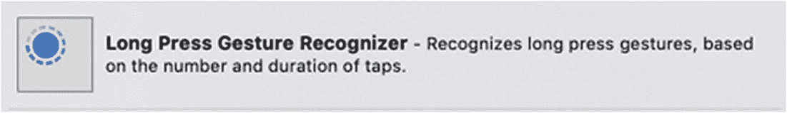

**图 11-18** — 对象库窗口中的长按手势识别器

4. 将 **Long Press Gesture Recognizer** 拖放到视图上。Xcode 会在文档大纲和视图控制器上方显示该长按手势识别器。

5. 点击库图标打开对象库窗口，然后将一个图像视图拖放到用户界面上。

6. 选择 **View ➤ Inspectors ➤ Show Attributes Inspector**，或点击 Xcode 窗口右上角的 **Attributes Inspector** 图标。

7. 点击 **Background** 弹出菜单，选择绿色或蓝色等颜色。这会使你运行模拟器中的应用时，图像视图更容易被找到。如果没有设置背景颜色，图像视图默认的白色背景将与视图的白色背景融为一体。

8. 选中 **User Interaction Enabled** 复选框。这允许图像视图响应用户操作。

9. 点击 Xcode 中间窗格底部的 **Align** 图标。会弹出一个窗口。

10. 选中 **Horizontally in Container** 和 **Vertically in Container** 复选框，然后点击 **Add 2 Constraints** 按钮（见图 11-10）。图像视图需要居中放置，以便在模拟器中更容易模拟捏合手势。

11. 选择子菜单上半部分的 **Editor ➤ Resolve Auto Layout Issues ➤ Add Missing Constraints**。Xcode 会为图像视图添加额外的约束。

12. 将鼠标指针移动到图像视图上，按住 **Control** 键，从图像视图拖拽到文档大纲或视图控制器顶部的 **Long Press Gesture Recognizer** 图标上。

13. 松开 **Control** 键和鼠标左键。会弹出一个窗口。

14. 选择 `gestureRecognizers`。这个链接能让图像视图检测长按手势。

15. 选择 **View ➤ Assistant Editor ➤ Show Assistant Editor**，或点击 **Assistant Editor** 图标。Xcode 会并排显示 `Main.storyboard` 和 `ViewController.swift` 文件。

16. 将鼠标指针移动到图像视图上，按住 **Control** 键，从图像视图拖拽到 `ViewController.swift` 文件中 `class ViewController` 行的下方。

17. 松开 **Control** 键和鼠标左键。会弹出一个弹出窗口。

18. 点击 **Name** 文本字段，输入 `topImageView`，然后点击 **Connect** 按钮。Xcode 会创建如下所示的 `IBOutlet` 变量：

```
@IBOutlet var topImageView: UIImageView!
```

19. 将鼠标指针移动到文档大纲或视图控制器顶部的 **Long Press Gesture Recognizer** 图标上，按住 **Control** 键，从 **Long Press Gesture Recognizer** 拖拽到 `ViewController.swift` 文件中最后一个花括号的上方。


20.  松开 `Control` 键和鼠标左键。此时会出现一个弹出窗口。

21.  点击 `Name` 文本字段，输入 `longPressDetected`，点击 `Type` 弹出菜单并选择 `UILongPressGestureRecognizer`，然后点击 `Connect` 按钮。Xcode 会创建一个 `IBAction` 方法。

22.  按如下方式编辑 `longPressDetected` `IBAction` 方法：

```swift
@IBAction func longPressDetected(_ sender: UILongPressGestureRecognizer) {
    topImageView.backgroundColor = UIColor.red
}
```

当识别到长按手势时，`longPressDetected` `IBAction` 方法会将图像视图的背景颜色更改为红色。完整的 `ViewController.swift` 文件应如下所示：

```swift
import UIKit
class ViewController: UIViewController {
    @IBOutlet var topImageView: UIImageView!
    override func viewDidLoad() {
        super.viewDidLoad()
        // Do any additional setup after loading the view, typically from a nib.
    }
    @IBAction func longPressDetected(_ sender: UILongPressGestureRecognizer) {
        topImageView.backgroundColor = UIColor.red
    }
}
```

23.  点击 `Run` 按钮或选择 `Product ➤ Run`。模拟器窗口将会出现。

24.  将鼠标指针移至图像视图上，然后按住鼠标左键。当图像视图检测到长按手势时，它会将图像视图的背景颜色变为红色。

25.  选择 `Simulator ➤ Quit Simulator` 返回 Xcode。

此示例通过从对象库中拖拽 `Long Press Gesture Recognizer` 以可视化的方式定义了长按手势。现在，我们来看看如何仅通过 Swift 代码来复现这个过程。

1.  使用 `Single View App` 模板（参见第 1 章）创建一个新的 iOS 项目，并将该项目命名为 `LongPressCodeApp`。这会为用户界面创建一个单一视图。

2.  在导航器面板中点击 `Main.storyboard` 文件。Xcode 会显示该单一视图。

3.  点击 `Library` 图标以打开对象库窗口，然后将一个图像视图拖放到用户界面的中心位置。

4.  点击 Xcode 中间面板底部的 `Align` 图标。此时会出现一个窗口。

5.  选中 `Horizontally in Container` 和 `Vertically in Container` 复选框，然后点击 `Add 2 Constraints` 按钮（见图 11-10）。图像视图需要位于中心位置，以便在模拟器中更容易模拟捏合手势。

6.  在子菜单的上半部分选择 `Editor ➤ Resolve Auto Layout Issues ➤ Add Missing Constraints`。Xcode 会为图像视图添加额外的约束。

7.  选择 `View ➤ Assistant Editor ➤ Show Assistant Editor`，或点击 `Assistant Editor` 图标。Xcode 会并排显示 `Main.storyboard` 和 `ViewController.swift` 文件。

8.  将鼠标指针移到图像视图上，按住 `Control` 键，并从图像视图 Ctrl-拖拽到 `class ViewController` 行下方的 `ViewController.swift` 文件中。

9.  松开 `Control` 键和鼠标左键。此时会出现一个弹出窗口。

10. 点击 `Name` 文本字段，输入 `topImageView`，然后点击 `Connect` 按钮。Xcode 会创建一个 `IBOutlet` 变量，如下所示：

```swift
@IBOutlet var topImageView: UIImageView!
```

1.  选择 `View ➤ Standard Editor ➤ Show Standard Editor`，或点击 Xcode 窗口右上角的 `Standard Editor` 图标。

2.  在导航器面板中点击 `ViewController.swift` 文件。

3.  按如下方式编辑 `viewDidLoad` 方法：

```swift
override func viewDidLoad() {
    super.viewDidLoad()
    topImageView.isUserInteractionEnabled = true
    topImageView.backgroundColor = UIColor.green
    let longPressGesture = UILongPressGestureRecognizer(target: self, action: #selector(handleLongPress))
    topImageView.addGestureRecognizer(longPressGesture)
    // Do any additional setup after loading the view, typically from a nib.
}
```

这段代码开启了图像视图的“用户交互已启用”设置，并将其背景颜色定义为绿色以便显示。接着，它定义了一个长按手势识别器（而不是从对象库窗口中拖放一个 `Long Press Gesture Recognizer`），定义了一个名为 `handleLongPress` 的函数来响应长按手势，并将该长按手势与图像视图关联起来。

4.  在 `viewDidLoad` 方法下方添加以下函数：

```swift
@objc func handleLongPress() {
    topImageView.backgroundColor = UIColor.red
}
```

完整的 `ViewController.swift` 文件应如下所示：

```swift
import UIKit
class ViewController: UIViewController {
    @IBOutlet var topImageView: UIImageView!
    override func viewDidLoad() {
        super.viewDidLoad()
        topImageView.isUserInteractionEnabled = true
        topImageView.backgroundColor = UIColor.green
        let longPressGesture = UILongPressGestureRecognizer(target: self, action: #selector(handleLongPress))
        topImageView.addGestureRecognizer(longPressGesture)
        // Do any additional setup after loading the view, typically from a nib.
    }
    @objc func handleLongPress() {
        topImageView.backgroundColor = UIColor.red
    }
}
```

5.  点击 `Run` 按钮或选择 `Product ➤ Run`。模拟器窗口将会出现。

6.  将鼠标指针移到图像视图上，然后按住鼠标左键以模拟长按操作。请注意，图像视图的颜色会从绿色变为红色。

7.  选择 `Simulator ➤ Quit Simulator` 返回 Xcode。

## 总结

触摸手势的作用是在用户界面上不放置按钮等对象的情况下，向应用程序发出命令。手势通常可以用一个或多个指尖来操作，你可以通过 `Attributes Inspector` 面板或 Swift 代码来定义这些手势。

向应用程序添加手势识别器有两种方法。首先，你可以通过对象库将手势识别器添加到故事板中。将手势识别器添加到项目后，你需要从一个对象 Ctrl-拖拽到这个手势识别器，以使该对象能够识别特定的手势。接下来，你需要创建一个 `IBAction` 方法，以便在手势被识别时做出响应。

第二种方法涉及编写 Swift 代码来创建一个手势识别器，将这个手势识别器添加到一个 `IBOutlet` 对象上，然后编写一个函数来处理手势被识别时的操作。两种方法的效果完全相同，因此你可以根据个人偏好来选择使用哪种方法。

向应用程序添加手势可以让用户界面更简洁、更直观，因为用户可以直接操作屏幕上的对象。


# 12. 使用警告控制器和选择器

几乎每个应用都需要向用户展示数据并接受用户输入。展示数据最简单的方式是使用标签，但有时你需要展示数据并让用户能够做出响应。在这种情况下，你需要使用警告控制器。

警告控制器可以显示一个弹出屏幕的表格，让用户有机会做出响应。警告控制器会出现在用户界面之上，强制用户通过点击按钮做出选择来响应，或者关闭警告控制器，如图 12-1 所示。

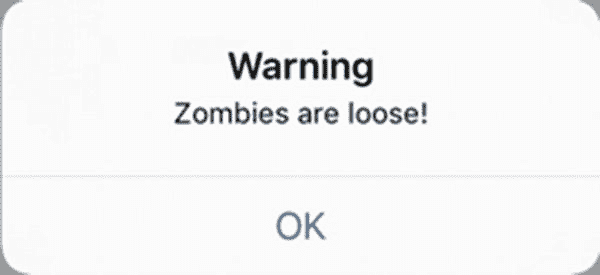

图 12-1

警告控制器通常显示一条消息和一个或多个按钮

除了显示数据，用户界面还需要让人们输入数据。如果数据是文本，那么你可以使用文本字段让用户在该文本字段中输入任意内容，例如姓名或电话号码。文本字段非常适合接受任何类型的数据，但当需要向用户提供有效选项列表时，你应该改用选择器。

Xcode 提供了两种不同类型的选择器：

-   日期选择器 – 显示日期和时间，如图 12-2 所示
-   选择器视图 – 显示一个包含不同选项的转轮

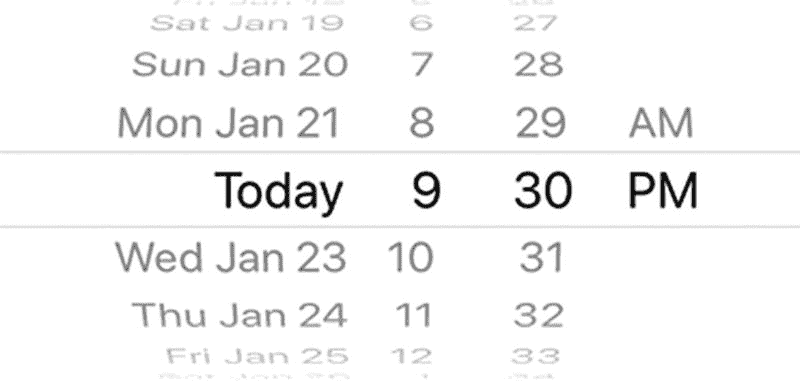

图 12-2

日期选择器让用户能够轻松选择日期和时间

选择器在一个或多个转轮上包含有限数量的选项，用户可以通过滚动转轮来选择特定选项。可用选项的数量可以少到两个（例如选择时间时的上午和下午选项），但通常可用选项多于两个。选择器确保用户永远不会选择无效选项，例如在姓名栏中输入数字或错误地输入城市名。

## 使用警告控制器

每个用户界面都需要向用户回显数据。在某些情况下，这些数据可以仅显示在标签中，但有时你需要确保用户看到特定信息。在这些情况下，你应该使用警告控制器。

警告控制器会出现在应用的用户界面之上，并可以通过更改以下属性进行自定义：

-   标题 – 出现在警告控制器顶部的文本，通常为粗体和大字体
-   消息 – 出现在标题下方的文本，字体较小
-   首选样式 – 定义警告控制器的外观，可以是出现在屏幕底部的操作列表（如图 12-3 所示），也可以是出现在屏幕中央的警告框（见图 12-1）

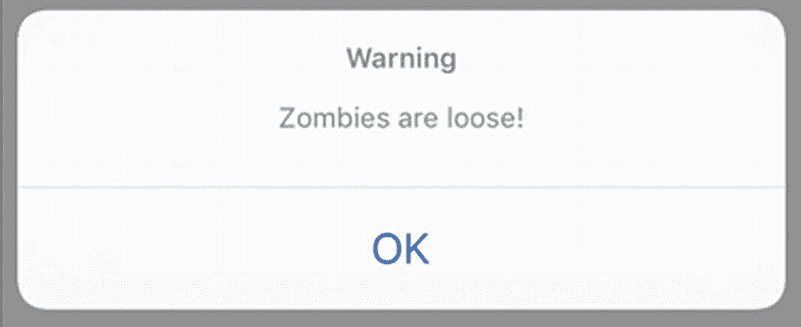

图 12-3

操作列表出现在屏幕底部

标题通常由一个单词或短语组成，用于解释警告控制器的用途，例如显示“警告”或“登录”。

要关闭警告控制器，警告控制器始终需要至少一个按钮。然而，警告控制器可以显示两个或多个按钮以给用户选择。除了显示按钮，警告控制器还可以包含文本字段，允许用户输入数据。

你完全可以只通过编写 Swift 代码来创建警告控制器。首先，你必须创建警告控制器，并定义其标题、消息和样式。其次，你必须为想要在警告控制器上显示的每个按钮或文本字段定义一个警告动作。第三，你必须在用户界面上实际呈现该警告控制器。

要了解如何创建一个仅显示标题、消息和关闭按钮的简单警告控制器，请按以下步骤操作：

1.  使用“单视图应用”模板（见第 1 章）创建一个新的 iOS 项目，并将这个新项目命名为 `AlertControllerApp`。这会为用户界面创建一个单一视图。

2.  在导航面板中点击 `Main.storyboard` 文件。Xcode 会显示该单一视图。

3.  点击库图标打开对象库窗口。

4.  将一个按钮拖放到视图上的任意位置。

5.  选择“编辑器”➤“解决自动布局问题”➤“重置为建议的约束”。Xcode 会为该按钮添加约束。

6.  选择“视图”➤“辅助编辑器”➤“显示辅助编辑器”。Xcode 会并排显示 `Main.storyboard` 和 `ViewController.swift` 文件。

7.  将鼠标指针移到按钮上，按住 Control 键，然后从按钮 Control-拖动到文件底部最后一个花括号上方的 `ViewController.swift` 文件中。

8.  松开 Control 键和鼠标左键。会弹出一个窗口。

9.  在“名称”文本框中点击，输入 `buttonTapped`，点击“类型”弹出菜单并选择 `UIButton`，然后点击“连接”按钮。Xcode 会创建一个 IBAction 方法。

10. 按如下方式编辑这个 `buttonTapped` IBAction 方法：

    ```
    @IBAction func buttonTapped(_ sender: UIButton) {
        let alert = UIAlertController(title: "警告", message: "僵尸出没！", preferredStyle: .alert)
        let okAction = UIAlertAction(title: "确定", style: .default, handler: { action -> Void in
            // 只是关闭操作列表
        })
        alert.addAction(okAction)
        self.present(alert, animated: true, completion: nil)
    }
    ```

11. 点击“运行”按钮或选择“产品”➤“运行”。模拟器屏幕会出现。

12. 点击按钮。注意，警告控制器会出现在屏幕中央，因为 `preferredStyle` 设置为 `.alert`。（如果 `preferredStyle` 属性设置为 `.actionSheet`，那么警告控制器会出现在屏幕底部。）

13. 点击警告控制器上的“确定”按钮将其关闭。

14. 选择“模拟器”➤“退出模拟器”返回 Xcode。

更改 `title` 和 `message` 属性以显示不同的文本，然后再次运行应用，看看它如何改变警告控制器的外观。同时，将 `preferredStyle` 属性从 `.alert` 更改为 `.actionSheet`，看看它如何影响警告控制器的外观。


### 显示并响应多个按钮

最简单的警报控制器会显示一个让用户关闭它的单一按钮。但你可能希望提供给用户多个选项，并根据用户点击的按钮做出不同的响应。

对于想要在警报控制器上显示的每个按钮，都需要添加一个 `UIAlertAction`。当用户点击警报控制器上的按钮时，警报控制器会消失。如果你希望按钮执行更多操作，则需要调用一个单独的函数来执行某些操作。

要了解如何创建一个显示两个按钮并对每个按钮做出不同响应的警报控制器，请遵循以下步骤：

1.  使用单一视图应用模板创建一个新的 iOS 项目（参见第 1 章），并将这个新项目命名为 `AlertControllerButtonsApp`。这将为用户界面创建一个单一视图。

2.  在导航面板中点击 `Main.storyboard` 文件。Xcode 会显示单一视图。

3.  点击库图标打开对象库窗口。

4.  将一个按钮和一个标签拖放到视图上的任意位置。

5.  选择 编辑器 > 解决自动布局问题 > 重置为建议的约束（位于子菜单下半部分）。Xcode 会为按钮和标签添加约束。

6.  选择 视图 > 辅助编辑器 > 显示辅助编辑器。Xcode 会并排显示 `Main.storyboard` 和 `ViewController.swift` 文件。

7.  将鼠标指针移到标签上，按住 Control 键，然后从图像视图按住 Control 键拖拽到“class ViewController”行下方的 `ViewController.swift` 文件中。

8.  松开 Control 键和鼠标左键。此时会弹出一个窗口。

9.  点击名称文本框，输入 `labelResult`，然后点击连接按钮。Xcode 会创建一个 `IBOutlet` 变量，如下所示：

```
    @IBOutlet var labelResult: UILabel!
```

10. 将鼠标指针移到按钮上，按住 Control 键，然后从图像视图按住 Control 键拖拽到文件底部最后一个大括号上方的 `ViewController.swift` 文件中。

11. 松开 Control 键和鼠标左键。此时会弹出一个窗口。

12. 点击名称文本框，输入 `buttonTapped`，点击类型弹出菜单并选择 `UIButton`，然后点击连接按钮。Xcode 会创建一个 `IBAction` 方法。

13. 选择 视图 > 标准编辑器 > 显示标准编辑器，或者点击 Xcode 窗口右上角的标准编辑器图标。

14. 在导航面板中点击 `ViewController.swift` 文件。

15. 修改 `viewDidLoad` 方法，如下所示：

```
    override func viewDidLoad() {
        super.viewDidLoad()
        labelResult.numberOfLines = 0
        // Do any additional setup after loading the view, typically from a nib.
    }
```

将标签的 `numberOfLines` 属性设置为 0，无论其中存储的文本大小如何，都允许其宽度扩展。如果此 `numberOfLines` 属性保持默认值 1，则标签不会自动调整大小，并且如果文本长度超过标签宽度，则存在文本被截断的风险。

16. 编辑此 `buttonTapped` `IBAction` 方法，如下所示：

```
    @IBAction func buttonTapped(_ sender: UIButton) {
        let alert = UIAlertController(title: "Warning", message: "Zombies are loose!", preferredStyle: .alert)
        let okAction = UIAlertAction(title: "OK", style: .default, handler: { action -> Void in
            self.labelResult.text = "OK"
        })
        let cancelAction = UIAlertAction(title: "Cancel", style: .cancel, handler: { action -> Void in
            self.labelResult.text = "Cancel"
        })
        let destroyAction = UIAlertAction(title: "Destroy", style: .destructive, handler: { action -> Void in
            self.labelResult.text = "Destroy"
        })
        alert.addAction(okAction)
        alert.addAction(cancelAction)
        alert.addAction(destroyAction)
        self.present(alert, animated: true, completion: nil)
    }
```

定义每个 `UIAlertAction` 的代码仅会更改标签中显示的文本。如果你需要每个按钮执行更复杂的任务，可以在处理程序中放入一个或多个函数的名称。然后你需要创建这些函数，例如：

```
    let destroyAction = UIAlertAction(title: "Destroy", style: .destructive, handler: { action -> Void in
        self.labelResult.text = "Destroy"
        self.callFunctionOne()
        self.callFunctionTwo()
    })
    func callFunctionOne(){
        // Code here
    }
    func callFunctionTwo(){
        // Code here
    }
```

整个 `ViewController.swift` 文件应如下所示：

```
    import UIKit
    class ViewController: UIViewController {
        @IBOutlet var labelResult: UILabel!
        override func viewDidLoad() {
            super.viewDidLoad()
            labelResult.numberOfLines = 0
            // Do any additional setup after loading the view, typically from a nib.
        }
        @IBAction func buttonTapped(_ sender: UIButton) {
            let alert = UIAlertController(title: "Warning", message: "Zombies are loose!", preferredStyle: .alert)
            let okAction = UIAlertAction(title: "OK", style: .default, handler: { action -> Void in
                self.labelResult.text = "OK"
            })
            let cancelAction = UIAlertAction(title: "Cancel", style: .cancel, handler: { action -> Void in
                self.labelResult.text = "Cancel"
            })
            let destroyAction = UIAlertAction(title: "Destroy", style: .destructive, handler: { action -> Void in
                self.labelResult.text = "Destroy"
            })
            alert.addAction(okAction)
            alert.addAction(cancelAction)
            alert.addAction(destroyAction)
            self.present(alert, animated: true, completion: nil)
        }
    }
```

17. 点击运行按钮或选择 产品 > 运行。模拟器屏幕会出现。

18. 点击按钮。警报控制器会如图 12-4 所示显示出来。

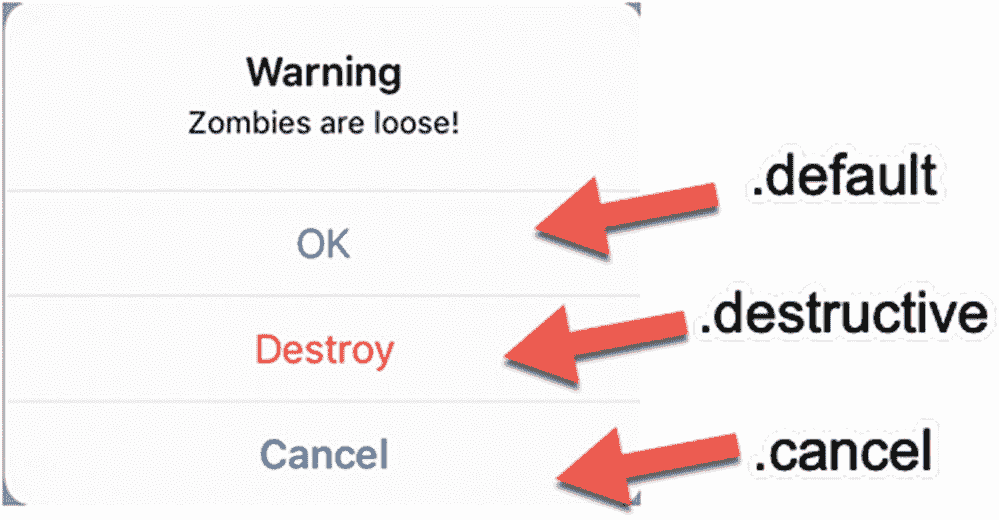

图 12-4

警报控制器显示三种类型的按钮：`.default`、`.destructive` 和 `.cancel`

19. 点击“OK”按钮（该按钮使用 `.default` 样式显示）。注意，标签现在显示“OK”，并且警报控制器被关闭。

20. 点击“Destroy”按钮（该按钮使用 `.destructive` 样式显示）。注意，标签现在显示“Destroy”，并且警报控制器被关闭。

21. 点击“Cancel”按钮（该按钮使用 `.cancel` 样式显示）。注意，标签现在显示“Cancel”，并且警报控制器被关闭。

22. 选择 模拟器 > 退出模拟器 返回 Xcode。

### 在警报控制器上显示文本字段

按钮允许警报控制器接受用户的选项。你的代码可以根据这些选项做出响应。但有时你可能希望在警报控制器上显示一个文本字段，以便用户输入数据。然后你需要存储这些数据。


#### 备注

你只能在以 `.alert` preferredStyle 显示**警告控制器**上添加文本字段。在以 `.actionSheet` preferredStyle 显示的警告控制器上无法显示文本字段。

当你向警告控制器添加文本字段时，你可以像对待任何其他文本字段一样对其进行修改，例如定义背景颜色或字体。此外，你还必须创建一个常量来存储该文本字段的内容，以便应用的其他部分能够访问用户在警告控制器的文本字段中输入的任何数据。

要了解如何在警告控制器上显示文本字段并访问其内容，请按照以下步骤操作：

1.  使用“单视图应用”模板创建一个新的 iOS 项目（参见第 1 章），并将此新项目命名为 `AlertControllerTextFieldApp`。这将为用户界面创建一个单一视图。

2.  在导航窗格中点击 `Main.storyboard` 文件。Xcode 会显示该单一视图。

3.  点击“资源库”图标以打开“对象库”窗口。

4.  将按钮和标签拖放到视图上的任意位置。

5.  选择编辑器 ➤ 解决自动布局问题 ➤ 重置为建议的约束（位于子菜单的下半部分）。Xcode 将为按钮和标签添加约束。

6.  选择视图 ➤ 助理编辑器 ➤ 显示助理编辑器。Xcode 会并排显示 `Main.storyboard` 和 `ViewController.swift` 文件。

7.  将鼠标指针移到标签上，按住 Control 键，从图像视图拖拽到 `class ViewController` 行下方的 `ViewController.swift` 文件中。

8.  松开 Control 键和鼠标左键。此时会弹出一个窗口。

9.  在“名称”文本字段中点击，输入 `labelResult`，然后点击“连接”按钮。Xcode 会创建一个如下所示的 IBOutlet 变量：

```
@IBOutlet var labelResult: UILabel!
```

10. 将鼠标指针移到按钮上，按住 Control 键，从图像视图拖拽到文件底部最后一个大括号上方的 `ViewController.swift` 文件中。

11. 松开 Control 键和鼠标左键。此时会弹出一个窗口。

12. 在“名称”文本字段中点击，输入 `buttonTapped`，点击“类型”弹出菜单并选择 `UIButton`，然后点击“连接”按钮。Xcode 会创建一个 IBAction 方法。

13. 选择视图 ➤ 标准编辑器 ➤ 显示标准编辑器，或者点击 Xcode 窗口右上角的“标准编辑器”图标。

14. 在导航窗格中点击 `ViewController.swift` 文件。

15. 按如下方式修改 `viewDidLoad` 方法：

```
override func viewDidLoad() {
    super.viewDidLoad()
    labelResult.numberOfLines = 0
    // 加载视图后的任何其他设置，通常来自 nib 文件。
}
```

将标签的 `numberOfLines` 属性设置为 0，使其能够根据存储文本的大小自动扩展宽度。如果此 `numberOfLines` 属性保持默认值 1，那么标签将不会自动调整大小，并且如果文本长度超过标签宽度，可能会截断文本。

16. 按如下方式向 `buttonTapped` IBAction 方法添加以下代码：

```
let alert = UIAlertController(title: "Log In", message: "Enter Password", preferredStyle: .alert)
alert.addTextField(configurationHandler: {(textField) in
    textField.placeholder = "Password here"
    textField.isSecureTextEntry = true
})
```

第一行创建了一个警告控制器，显示标题“Log In”以及下方的消息“Enter Password”。因为我们希望在警告控制器上显示文本字段，所以警告控制器的 `preferredStyle` 必须是 `.alert`。

第二行向警告控制器添加了一个文本字段，并将其配置为显示“Password here”作为占位符文本，同时将其 `isSecureTextEntry` 属性设置为 `true`，这会在用户输入时隐藏输入的字符。此处的任何代码只是对文本字段进行了自定义。

17. 按如下方式向 `buttonTapped` IBAction 方法添加以下代码：

```
let okAction = UIAlertAction(title: "OK", style: .default, handler: { action -> Void in
    let savedText = alert.textFields![0] as UITextField
    self.labelResult.text = savedText.text
})
alert.addAction(okAction)
self.present(alert, animated: true, completion: nil)
```

第一行定义了一个标题为“OK”、样式为 `.default` 的按钮。在代码的 handler 部分，这行定义了一个名为 `savedText` 的常量，它代表警告控制器上的第一个文本字段（注意索引值为 0）。如果你向警告控制器添加了多个文本字段，则需要定义额外的常量来表示其他文本字段。最后，这行存储了文本字段中的文本（`savedText`），并将其显示在连接到用户界面标签的 `labelResult` IBOutlet 中。

第二行将按钮添加到警告控制器，第三行呈现或显示该警告控制器。

整个 `ViewController.swift` 文件应如下所示：

```
import UIKit
class ViewController: UIViewController {
    @IBOutlet var labelResult: UILabel!
    override func viewDidLoad() {
        super.viewDidLoad()
        labelResult.numberOfLines = 0
        // 加载视图后的任何其他设置，通常来自 nib 文件。
    }
    @IBAction func buttonTapped(_ sender: UIButton) {
        let alert = UIAlertController(title: "Log In", message: "Enter Password", preferredStyle: .alert)
        alert.addTextField(configurationHandler: {(textField) in
            textField.placeholder = "Password here"
            textField.isSecureTextEntry = true
        })
        let okAction = UIAlertAction(title: "OK", style: .default, handler: { action -> Void in
            let savedText = alert.textFields![0] as UITextField
            self.labelResult.text = savedText.text
        })
        alert.addAction(okAction)
        self.present(alert, animated: true, completion: nil)
    }
}
```

18. 点击“运行”按钮，或选择产品 ➤ 运行。模拟器屏幕出现。

19. 点击按钮。警告控制器显示出来，如图 12-5 所示。

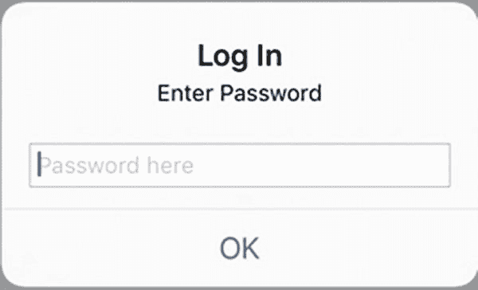

**图 12-5** 显示文本字段和按钮的警告控制器

20. 在警告控制器的文本字段中输入一些文本。注意，当你输入时，文本字段会对字符进行掩码处理，因为其 `isSecureTextEntry` 属性被设置为 `true`。

21. 点击“OK”按钮。注意，你在文本字段中输入的任何文本现在都会出现在标签中。

22. 选择模拟器 ➤ 退出模拟器以返回 Xcode。


## 使用日期选择器

当应用需要用户输入日期和/或时间时，最好使用日期选择器来提供有效选项列表。用户可以通过旋转日期选择器上的不同滚轮来选择星期、日期和时间，而无需输入任何内容。

将日期选择器从对象库窗口拖放到视图后，您可以通过在属性检查器中修改以下选项来自定义日期选择器，如图 12-6 所示：

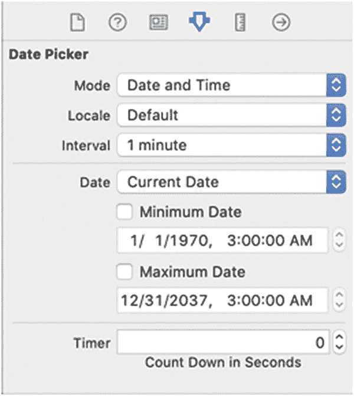

图 12-6 – 属性检查器面板可让您自定义日期选择器

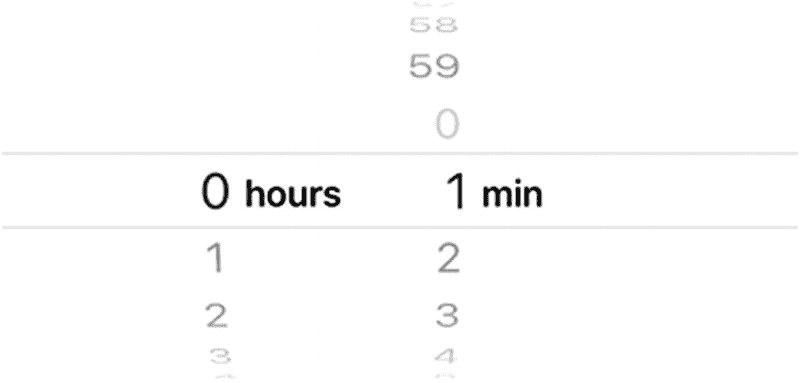

图 12-7 – 将日期选择器的模式更改为倒计时器

- **模式** – 定义日期选择器显示时间、日期、时间和日期，或倒计时器，如图 12-7 所示
- **区域设置** – 覆盖系统默认的区域设置属性，该属性定义本地语言，例如美式英语或澳式英语
- **间隔** – 定义以分钟为单位的时间间隔，从 1 分钟到 30 分钟
- **日期** – 定义初始显示的日期
- **最小日期** – 定义允许的最小日期
- **最大日期** – 定义允许的最大日期

无论您为日期选择器选择哪种模式，其值都存储为 `NSDate` 数据类型。要将此 `NSDate` 数据转换为文本，需要两步过程。首先，您需要创建一个表示 `DateFormatter` 的常量，例如：

```
let dateFormatter: DateFormatter = DateFormatter()
```

其次，您必须定义 `.dateStyle` 和 `.timeStyle` 属性来显示日期和时间。要定义日期和时间样式，您需要将 `DateFormatter` 常量的 `.dateStyle` 和 `.timeStyle` 属性设置为以下选项之一：

- `.none` – 不显示日期或时间
- `.short` – 以“11/23/19”格式显示日期，以“3:48 PM”格式显示时间
- `.medium` – 以“Nov 23, 2019”格式显示日期，以“3:48:21 PM”格式显示时间
- `.long` – 以“November 23, 2019”格式显示日期，以“3:48:21 PM EST”格式显示时间
- `.full` – 以“Saturday, November 23, 2019 AD”格式显示日期，以“3:48 PM Eastern Standard Time”格式显示时间

```
dateFormatter.dateStyle = .short
dateFormatter.timeStyle = .short
```

最后，您必须检索日期选择器中当前显示的日期/时间。由于日期选择器中存储的日期/时间值是 `NSDate` 数据类型，您必须使用如下代码将其 `.date` 属性转换为字符串：

```
let selectedDate: String = dateFormatter.string(from: myDatePicker.date)
```

在下面的示例中，我们将看到如何以两种不同方式检索日期选择器中显示的值。首先，当用户更改日期选择器时，我们将检索日期选择器的值。其次，我们将检索日期选择器的值并将其显示在警报控制器上。

要了解如何在按钮上定义标题，请遵循以下步骤：

1. 使用单视图应用模板（见第 1 章）创建一个新的 iOS 项目，并将此新项目命名为 `DatePickerApp`。这将为用户界面创建一个单视图。

2. 在导航器面板中点击 `Main.storyboard` 文件。Xcode 会显示该单视图。

3. 点击库图标以打开对象库窗口。

4. 将按钮和日期选择器拖放到视图上的任意位置，如图 12-8 所示。

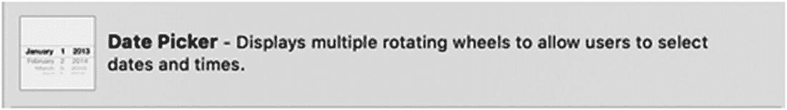

图 12-8 – 对象库窗口中的日期选择器

5. 选择 **编辑器** ➤ **解决自动布局问题** ➤ **设置为建议的约束**。Xcode 会为您的按钮和日期选择器添加约束。

6. 选择 **视图** ➤ **助理编辑器** ➤ **显示助理编辑器**。Xcode 会并排显示 `Main.storyboard` 和 `ViewController.swift` 文件。

7. 将鼠标指针移到日期选择器上，按住 Control 键，从日期选择器 Control-拖动到 `ViewController.swift` 文件中“class ViewController”行的下方。

8. 松开 Control 键和鼠标左键。会出现一个弹出窗口。

9. 在名称文本字段中点击，输入 `myDatePicker`，然后点击“连接”按钮。Xcode 会创建一个 `IBOutlet` 变量，如下所示：

```
@IBOutlet var myDatePicker: UIDatePicker!
```

10. 在 `IBOutlet` 下方添加以下代码行来定义一个日期格式化器：

```
let dateFormatter: DateFormatter = DateFormatter()
```

11. 按如下方式编辑 `viewDidLoad` 方法：

```
override func viewDidLoad() {
    super.viewDidLoad()
    dateFormatter.dateStyle = .short
    dateFormatter.timeStyle = .short
    // 加载视图后执行任何额外设置，通常从 nib 文件加载。
}
```

这些代码行将 `.dateStyle` 和 `.timeStyle` 属性定义为 `.short`。您可以尝试将这些值更改为 `.medium`、`.long` 和 `.full`，看看它们如何以不同方式定义日期和时间。

12. 在 `viewDidLoad` 方法下方，添加以下函数，该函数将接受一个字符串并将其显示在警报控制器中：

```
func ShowAlert(dateTime : String) {
    let alert = UIAlertController(title: "选中的日期和时间", message: "\(dateTime)", preferredStyle: .alert)
    let okAction = UIAlertAction(title: "确定", style: .default, handler: { action -> Void in
        // 只需关闭操作表
    })
    alert.addAction(okAction)
    self.present(alert, animated: true, completion: nil)
}
```

13. 将鼠标指针移到按钮上，按住 Control 键，从按钮 Control-拖动到 `ViewController.swift` 文件中底部最后一个大括号的上方。

14. 松开 Control 键和鼠标左键。会出现一个弹出窗口。

15. 在名称文本字段中点击，输入 `getCurrentDateTime`，点击类型弹出菜单并选择 `UIButton`，然后点击“连接”按钮。Xcode 会创建一个 `IBAction` 方法。

16. 按如下方式编辑此 `getCurrentDateTime` `IBAction` 方法：

```
@IBAction func getCurrentDateTime(_ sender: UIButton) {
    let selectedDate: String = dateFormatter.string(from: myDatePicker.date)
    ShowAlert(dateTime: selectedDate)
}
```

此 `IBAction` 方法检索 `myDatePicker` `IBOutlet`（代表日期选择器）的值，并将此日期和时间转换为字符串，该字符串存储在 `selectedDate` 常量中。然后，它将此 `selectedDate` 常量传递给 `ShowAlert` 函数，以将其显示在警报控制器上。

17. 将鼠标指针移到日期选择器上，按住 Control 键，从日期选择器 Control-拖动到 `ViewController.swift` 文件中底部最后一个大括号的上方。

18. 松开 Control 键和鼠标左键。会出现一个弹出窗口。

19. 在名称文本字段中点击，输入 `dateChanged`，点击类型弹出菜单并选择 `UIDatePicker`，然后点击“连接”按钮。Xcode 会创建一个 `IBAction` 方法。

20. 按如下方式编辑此 `dateChanged` `IBAction` 方法：

```
@IBAction func dateChanged(_ sender: UIDatePicker) {
    let selectedDate: String = dateFormatter.string(from: sender.date)
    ShowAlert(dateTime: selectedDate)
}
```

每当用户在日期选择器中更改日期或时间时，此 `dateChanged` `IBAction` 方法都会运行。它从日期选择器中检索 `.date` 属性并将其转换为字符串，存储在 `selectedDate` 常量中。然后，它将此 `selectedDate` 常量传递给 `ShowAlert` 函数，该函数将其显示在警报控制器上。

整个 `ViewController.swift` 文件应该如下所示。


```swift
import UIKit
class ViewController: UIViewController {
    @IBOutlet var myDatePicker: UIDatePicker!
    let dateFormatter: DateFormatter = DateFormatter()
    override func viewDidLoad() {
        super.viewDidLoad()
        dateFormatter.dateStyle = .short
        dateFormatter.timeStyle = .short
        // Do any additional setup after loading the view, typically from a nib.
    }
    func ShowAlert(dateTime : String) {
        let alert = UIAlertController(title: "Selected Date and Time", message: "\(dateTime)", preferredStyle: .alert)
        let okAction = UIAlertAction(title: "OK", style: .default, handler: { action -> Void in
            //Just dismiss the action sheet
        })
        alert.addAction(okAction)
        self.present(alert, animated: true, completion: nil)
    }
    @IBAction func dateChanged(_ sender: UIDatePicker) {
        let selectedDate: String = dateFormatter.string(from: sender.date)
        ShowAlert(dateTime: selectedDate)
    }
    @IBAction func getCurrentDateTime(_ sender: UIButton) {
        let selectedDate: String = dateFormatter.string(from: myDatePicker.date)
        ShowAlert(dateTime: selectedDate)
    }
}
```

21. 点击`Run`按钮或依次选择 Product ➤ Run。模拟器屏幕出现。

22. 点击该按钮。一个警报控制器出现，显示日期选择器中显示的当前日期和时间。

23. 点击按钮关闭警报控制器。

24. 更改日期选择器中的日期或时间。注意另一个警报控制器出现，显示日期选择器中修改后的日期/时间。

25. 点击按钮关闭警报控制器。

26. 依次选择 Simulator ➤ Quit Simulator 返回 Xcode。

回到步骤 11，将`.dateStyle`和`.timeStyle`属性从`.short`改为`.medium`、`.long`或`.full`，观察这对日期和时间显示方式的影响。如果将`.dateStyle`或`.timeStyle`改为`.none`，则日期选择器中显示的日期或时间将被忽略。

## 创建自定义选择器

日期选择器适用于让用户选择日期和时间，但很多时候你希望为用户提供有限的选项范围，而这些选项并非日期或时间。在这种情况下，你需要使用标准的选择器对象，并创建要显示在选择器中的数据。

要使用选择器，你必须定义委托和数据源。委托定义了包含函数的文件，这些函数用于确定要显示的列数（例如日和月）、选择器中要显示的总选项数，以及用户在选择器中选择了哪些数据。

数据源定义了包含要显示在选择器中的数据的文件。这些数据可以是数组或数据库。

要了解如何使用`Picker View`，请按以下步骤操作：

1. 使用“单视图应用”模板（见第 1 章）创建一个新的 iOS 项目，并将新项目命名为`PickerApp`。这会为用户界面创建一个单视图。

2. 在导航窗格中点击`Main.storyboard`文件。Xcode 会显示该单视图。

3. 点击库图标打开对象库窗口。

4. 将一个按钮和一个选择器视图拖放到视图上的任意位置，如图 12-9 所示。

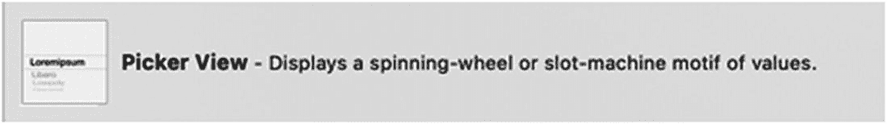

图 12-9

对象库窗口中的选择器视图

5. 选择 Editor ➤ Resolve Auto Layout Issues ➤ 在子菜单下半部分选择 Set to Suggested Constraints。Xcode 会为你的按钮和选择器视图添加约束。

6. 选择 View ➤ Assistant Editor ➤ Show Assistant Editor。Xcode 会并排显示`Main.storyboard`和`ViewController.swift`文件。

7. 按如下所示编辑 `class ViewController` 这一行：

```swift
class ViewController: UIViewController, UIPickerViewDataSource, UIPickerViewDelegate {
```

这使`ViewController.swift`文件成为选择器视图的数据源和委托。

8. 将鼠标指针移到选择器视图上，按住 Control 键，然后从选择器视图 Control-拖拽到`ViewController.swift`文件中“class ViewController”行的下方。

9. 释放 Control 键和鼠标左键。会弹出一个弹出窗口。

10. 在“名称”文本字段中点击，输入 **myPicker**，然后点击“连接”按钮。Xcode 会创建一个如下所示的 `IBOutlet` 变量：

```swift
@IBOutlet var myPicker: UIDatePicker!
```

11. 在 `IBOutlet` 下方添加以下行，定义一个用于保存字符串数组的变量：

```swift
var pickerData: [String] = [String]()
```

12. 按如下所示编辑 `viewDidLoad` 方法：

```swift
override func viewDidLoad() {
    super.viewDidLoad()
    myPicker.delegate = self
    myPicker.dataSource = self
    pickerData = ["cat", "dog", "hamster", "lizard", "parrot", "goldfish"]
    // Do any additional setup after loading the view, typically from a nib.
}
```

这几行代码声明了`ViewController.swift`文件作为选择器视图的委托和数据源。然后定义了一个字符串数组，存储在`pickerData`变量中。

13. 在 `viewDidLoad` 方法下方，添加以下函数来定义选择器视图中将显示多少个组件。由于我们只显示一个滚轮选项，因此组件数量为一：

```swift
func numberOfComponents(in pickerView: UIPickerView) -> Int {
    return 1
}
```

14. 在其下方添加另一个函数，定义选择器视图中将显示的项数。这个数字可以通过对`pickerData`数组使用`.count`方法获得：

```swift
func pickerView(_ pickerView: UIPickerView, numberOfRowsInComponent component: Int) -> Int {
    return pickerData.count
}
```

15. 在其下方添加第三个函数，用于在选择器视图中显示数据：

```swift
func pickerView(_ pickerView: UIPickerView, titleForRow row: Int, forComponent component: Int) -> String? {
    return pickerData[row]
}
```


16. 将鼠标指针移到按钮上，按住`Control`键，并从按钮`Ctrl-拖移`到`ViewController.swift`文件中底部最后一个大括号的上方。

17. 松开`Control`键和鼠标左键。弹出窗口出现。

18. 在“名称（Name）”文本字段中点击，输入`buttonTapped`，在“类型（Type）”弹出菜单中选择`UIButton`，然后点击“连接（Connect）”按钮。Xcode 会创建一个`IBAction`方法。

19. 按如下方式编辑`buttonTapped IBAction`方法：

```swift
@IBAction func buttonTapped(_ sender: UIButton) {
    let pickerIndex = myPicker.selectedRow(inComponent: 0)
    let alert = UIAlertController(title: "Your Choice", message: "\(pickerData[pickerIndex])", preferredStyle: .alert)
    let okAction = UIAlertAction(title: "OK", style: .default, handler: { action -> Void in
        //Just dismiss the action sheet
    })
    alert.addAction(okAction)
    self.present(alert, animated: true, completion: nil)
}
```

`buttonTapped IBAction`方法中的第一行获取选择器视图中当前显示选项的索引号，其中第一个项目的索引为 0，第二个项目的索引为 1，以此类推。然后，它使用该索引值来确定在警告控制器中显示`pickerData`数组中的哪个项目。

整个`ViewController.swift`文件应如下所示：

```swift
import UIKit
class ViewController: UIViewController, UIPickerViewDataSource, UIPickerViewDelegate {
    @IBOutlet var myPicker: UIPickerView!
    var pickerData: [String] = [String]()
    override func viewDidLoad() {
        super.viewDidLoad()
        myPicker.delegate = self
        myPicker.dataSource = self
        pickerData = ["cat", "dog", "hamster", "lizard", "parrot", "goldfish"]
        // Do any additional setup after loading the view, typically from a nib.
    }
    func numberOfComponents(in pickerView: UIPickerView) -> Int {
        return 1
    }
    func pickerView(_ pickerView: UIPickerView, numberOfRowsInComponent component: Int) -> Int {
        return pickerData.count
    }
    func pickerView(_ pickerView: UIPickerView, titleForRow row: Int, forComponent component: Int) -> String? {
        return pickerData[row]
    }
    @IBAction func buttonTapped(_ sender: UIButton) {
        let pickerIndex = myPicker.selectedRow(inComponent: 0)
        let alert = UIAlertController(title: "Your Choice", message: "\(pickerData[pickerIndex])", preferredStyle: .alert)
        let okAction = UIAlertAction(title: "OK", style: .default, handler: { action -> Void in
            //Just dismiss the action sheet
        })
        alert.addAction(okAction)
        self.present(alert, animated: true, completion: nil)
    }
}
```

20. 点击“运行”按钮或选择“产品”>“运行”。模拟器屏幕出现，如图 12-10 所示。

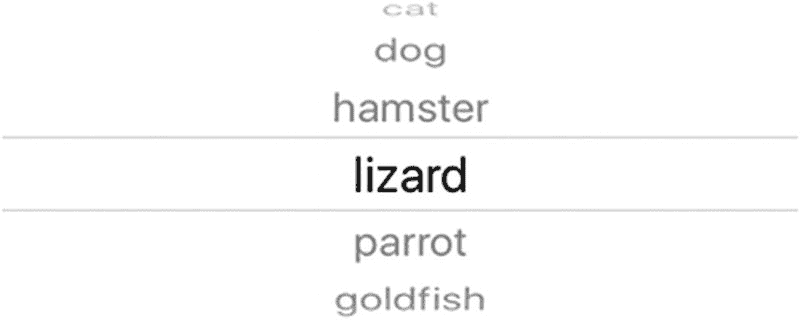

**图 12-10** 应用上的选择器视图

21. 滚动选择器视图并选择一个选项。

22. 点击按钮。会出现一个警告控制器，显示您在选取器视图中选择的选项。

23. 点击按钮以关闭警告控制器。

24. 重复步骤 20-22，并在选择器视图中选择不同的选项。

25. 选择“模拟器”>“退出模拟器”以返回 Xcode。

### 显示多组件选择器视图

如果您查看日期选择器，它会显示用于日、时、分以及上午或下午的独立滚轮或组件。我们在上一个例子中创建的简单选择器视图仅显示一个列出不同宠物类型的滚轮或组件。

对于您希望在选择器视图中显示的每个组件，您需要定义一个单独的数据源。然后，您需要定义选择器视图要显示的总组件数量（例如两个或三个），同时显示所有组件并存储每个组件中的数据。

要了解如何创建包含三个组件的选择器视图，请按以下步骤操作：

1.  使用“单视图应用（Single View App）”模板创建一个新的 iOS 项目（参见第 1 章），并将此新项目命名为`ThreePickerApp`。这会为用户界面创建一个单视图。

2.  在导航窗格中点击`Main.storyboard`文件。Xcode 会显示该单视图。

3.  点击“库”图标以打开“对象库”窗口。

4.  将按钮和选择器视图拖放到视图上的任意位置（参见图 12-9）。

5.  选择“编辑器”>“解决自动布局问题”>“在子菜单的下半部分选择建议约束”。Xcode 会为按钮和选择器视图添加约束。

6.  按如下方式编辑`class ViewController`一行：

```swift
class ViewController: UIViewController, UIPickerViewDataSource, UIPickerViewDelegate {
```

这会使`ViewController.swift`文件成为选择器视图的数据源和委托。

7.  选择“视图”>“助理编辑器”>“显示助理编辑器”。Xcode 会并排显示`Main.storyboard`和`ViewController.swift`文件。

8.  将鼠标指针移到选择器视图上，按住`Control`键，并从选择器视图`Ctrl-拖移`到`ViewController.swift`文件中`class ViewController`行下方。

9.  松开`Control`键和鼠标左键。弹出窗口出现。

10. 在“名称（Name）”文本字段中点击，输入`myPicker`，然后点击“连接（Connect）”按钮。Xcode 会创建一个`IBOutlet`变量，如下所示：

```swift
@IBOutlet var myPicker: UIDatePicker!
```

11. 在`IBOutlet`下方添加以下三行，以定义三个用于保存字符串数组的变量：

```swift
var componentOne: [String] = [String]()
var componentTwo: [String] = [String]()
var componentThree: [String] = [String]()
```

12. 按如下方式编辑`viewDidLoad`方法：

```swift
override func viewDidLoad() {
    super.viewDidLoad()
    myPicker.delegate = self
    myPicker.dataSource = self
    componentOne = ["cat", "dog", "hamster", "lizard", "parrot", "goldfish"]
    componentTwo = ["house", "apartment", "condo", "RV"]
    componentThree = ["indoor", "outdoor"]
    // Do any additional setup after loading the view, typically from a nib.
}
```

这些代码行声明`ViewController.swift`文件既是选择器视图的委托又是其数据源。然后，它定义了三个字符串数组，这些数组将出现在选择器视图的每个组件中。

13. 在`viewDidLoad`方法下方，添加以下函数以定义选择器视图中将显示多少个组件。由于我们只显示单个滚轮选项，因此组件数量为一：

```swift
func numberOfComponents(in pickerView: UIPickerView) -> Int {
    return 3
}
```

14. 在下方添加另一个函数，以定义选择器视图中将显示多少个项目。这个数字可以通过对三个不同的数组使用`.count`方法来找到，因此我们需要一个`switch`语句来定义每个组件中出现的元素数量。第一个组件将显示不同的宠物（如`"仓鼠"`），第二个组件将显示不同的家（如`"公寓"`），第三个组件将显示不同的地点（如`"室内"`）。


```swift
func pickerView(_ pickerView: UIPickerView, numberOfRowsInComponent component: Int) -> Int {
    switch component {
    case 0: return componentOne.count
    case 1: return componentTwo.count
    default: return componentThree.count
    }
}
```

15. 在其下方添加第三个函数，用于在选取视图中显示数据：第一个组件（0）显示宠物，第二个组件（1）显示房屋，第三个组件（2）显示位置：

```swift
func pickerView(_ pickerView: UIPickerView, titleForRow row: Int, forComponent component: Int) -> String? {
    switch component {
    case 0: return componentOne[row]
    case 1: return componentTwo[row]
    default: return componentThree[row]
    }
}
```

16. 将鼠标指针移到按钮上，按住 Control 键，然后从按钮拖拽到文件底部最后一个花括号上方的 `ViewController.swift` 文件中。

17. 松开 Control 键和鼠标左键。此时会弹出一个窗口。

18. 在“名称”文本框中点击，输入 `buttonTapped`，在“类型”弹出菜单中选择 `UIButton`，然后点击“连接”按钮。Xcode 会创建一个 `IBAction` 方法。

19. 按如下方式编辑这个 `buttonTapped` IBAction 方法：

```swift
@IBAction func buttonTapped(_ sender: UIButton) {
    let petIndex = myPicker.selectedRow(inComponent: 0)
    let homeIndex = myPicker.selectedRow(inComponent: 1)
    let placeIndex = myPicker.selectedRow(inComponent: 2)
    let alert = UIAlertController(title: "Your Choice", message: "\(componentOne[petIndex]) \(componentTwo[homeIndex]) \(componentThree[placeIndex])", preferredStyle: .alert)
    let okAction = UIAlertAction(title: "OK", style: .default, handler: { action -> Void in
        //只需关闭操作表
    })
    alert.addAction(okAction)
    self.present(alert, animated: true, completion: nil)
}
```

`buttonTapped` IBAction 方法中的三行代码会获取选取视图中当前显示选项的索引号（第一个项目的索引为 0，第二个项目的索引为 1，以此类推）。然后，它会使用这个索引值来确定在警告控制器中显示三个不同数组中的哪个项目。

整个 `ViewController.swift` 文件应如下所示：

```swift
import UIKit
class ViewController: UIViewController, UIPickerViewDataSource, UIPickerViewDelegate {
    @IBOutlet var myPicker: UIPickerView!
    var componentOne: [String] = [String]()
    var componentTwo: [String] = [String]()
    var componentThree: [String] = [String]()
    override func viewDidLoad() {
        super.viewDidLoad()
        myPicker.delegate = self
        myPicker.dataSource = self
        componentOne = ["cat", "dog", "hamster", "lizard", "parrot", "goldfish"]
        componentTwo = ["house", "apartment", "condo", "RV"]
        componentThree = ["indoor", "outdoor"]
        // 在此处执行任何额外的视图加载设置，通常来自 nib 文件。
    }
    func numberOfComponents(in pickerView: UIPickerView) -> Int {
        return 3
    }
    func pickerView(_ pickerView: UIPickerView, numberOfRowsInComponent component: Int) -> Int {
        switch component {
        case 0: return componentOne.count
        case 1: return componentTwo.count
        default: return componentThree.count
        }
    }
    func pickerView(_ pickerView: UIPickerView, titleForRow row: Int, forComponent component: Int) -> String? {
        switch component {
        case 0: return componentOne[row]
        case 1: return componentTwo[row]
        default: return componentThree[row]
        }
    }
    @IBAction func buttonTapped(_ sender: UIButton) {
        let petIndex = myPicker.selectedRow(inComponent: 0)
        let homeIndex = myPicker.selectedRow(inComponent: 1)
        let placeIndex = myPicker.selectedRow(inComponent: 2)
        let alert = UIAlertController(title: "Your Choice", message: "\(componentOne[petIndex]) \(componentTwo[homeIndex]) \(componentThree[placeIndex])", preferredStyle: .alert)
        let okAction = UIAlertAction(title: "OK", style: .default, handler: { action -> Void in
            //只需关闭操作表
        })
        alert.addAction(okAction)
        self.present(alert, animated: true, completion: nil)
    }
}
```

20. 点击“运行”按钮，或选择“产品” ➤ “运行”。模拟器屏幕会如图 12-11 所示显示。

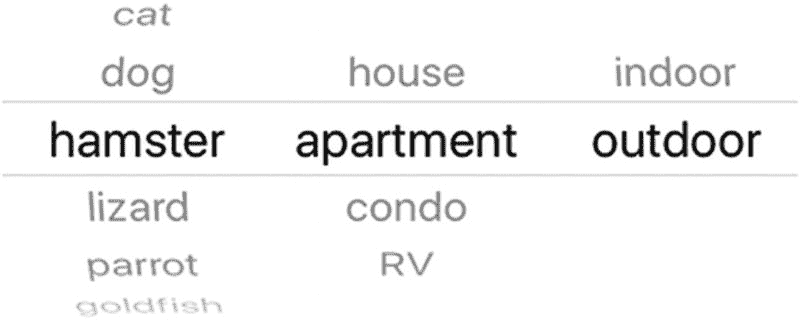

**图 12-11** 包含三个组件的选取视图

21. 旋转选取视图，并从每个滚轮或组件中选择一个选项，例如仓鼠、公寓、户外。

22. 点击按钮。此时会出现一个警告控制器，显示您在选取视图中选择的所有选项。

23. 点击按钮以关闭警告控制器。

24. 重复步骤 20-22，并在选取视图中选择不同的选项。

25. 选择“模拟器” ➤ “退出模拟器”以返回 Xcode。

## 本章小结

警告可以在屏幕中央（`.alert`）或屏幕底部（`.actionSheet`）显示信息。警告可以显示标题和下方较小字体的消息，并至少附带一个用于关闭警告的按钮。不过，警告也可以显示多个按钮，甚至一个文本字段。

根据用户点击的按钮，应用可以做出不同的响应。如果警告显示了一个文本字段，您可以自定义该文本字段的外观和行为，并存储其内容以供后续使用或操作。警告通过显示用户需要立即了解的重要信息来中断用户操作。

当您的应用需要向用户提供有限范围的选项时，可以使用日期选取器或选取视图。日期选取器允许用户选择不同的日期和时间。您可以根据需要定义检索到的日期和时间的格式（短格式或长格式）。选取视图允许您定义显示的选择类型，并支持多个组件或滚轮，以便用户选择多个选项。

当需要向用户显示信息并获取即时反馈时，请使用警告。当需要将用户的选择限制在有效的有限范围内时，请使用日期选取器或选取视图。

# 13. 约束和堆栈视图

由于 iPhone 和 iPad 具有不同的屏幕尺寸，每个 iOS 应用都需要根据其运行的 iOS 设备类型适应这些不同的屏幕尺寸。要定义不同用户界面对象的位置和间距，可以使用约束。

约束可以定义以下内容：

-   位置（例如屏幕中心）
-   大小（例如对象的宽度或高度）
-   距离（例如两个对象之间的间距）

如果没有约束，用户界面上的对象可能在一个尺寸的 iOS 屏幕上看起来不错，但在另一个屏幕上却完全错位。这就是为什么需要为用户界面上的所有对象添加约束。

添加约束最简单的方法是让 Xcode 为您完成。但是，您可能需要修改约束，因为 Xcode 并不总是能准确添加约束。您可以添加、删除和修改约束，直到您的用户界面在所有不同尺寸的 iOS 屏幕上看起来都完美。

如果用户界面上有多个对象，添加多个约束可能会显得笨拙，尤其是在需要重新排列对象时。为了简化对单个对象添加约束的过程，您可以将对象组织到堆栈中。这样，您可以移动对象组，并对该组而不是组中的每个对象设置约束。

约束和堆栈视图都使得在用户界面上创建和组织对象变得容易，确保无论应用在哪种 iOS 屏幕尺寸上运行，它们都能正确显示。


## 理解约束

约束通过三个标准来定义位置、大小或距离：

*   `常量` – 定义约束的数值
*   `优先级` – 定义哪些约束比其他约束更重要，范围从必需（1000）到高（750）再到低（250）
*   `乘数` – 乘以常量以定义约束的总值

常量的三种选择是像 `37` 这样的数值、`标准值`或`画布值`，如图 13-1 所示。

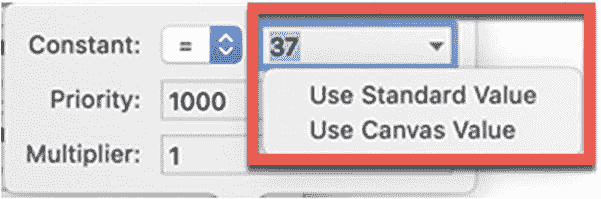

**图 13-1** — 在约束中定义常量的三种选项

数值定义了一个特定的值，例如 `12` 或 `84`。当你创建约束时，Xcode 会使用数值。

`标准值` 使用 Xcode 推荐的值。由于你的应用可能运行在不同尺寸的 iOS 屏幕上，`标准值`通常是最安全的选择。

`画布值` 与特定的数值类似，但它与故事板的当前 iOS 屏幕尺寸绑定。这意味着如果你的应用在另一个屏幕尺寸上运行，该约束可能无法保持对象的正确距离或位置。

#### 注意
作为编程中的一般原则，通常最好避免依赖被称为“魔术数字”的特定值。“魔术数字”表现为一个抽象的数值，不解释其含义或程序员是如何得出该值的。在大多数情况下，为约束使用`标准值`。

在定义约束的值时，有三种选择：

*   `等于 (=)` – 约束必须精确等于特定值。
*   `小于或等于 (≤)` – 约束可以小于或等于特定值。
*   `大于或等于 (≥)` – 约束可以大于或等于特定值。

通过将约束定义为小于等于或大于等于某个值，你可以为约束提供更大的灵活性，使其即使在屏幕尺寸或方向发生变化时也能正常工作。

`优先级`定义了约束的重要性。默认情况下，每个约束都被分配为必需（1000）优先级。然而，当你添加多个约束时，两个或更多约束可能会冲突。例如，一个约束可以定义一个按钮距离左边缘 `97` 点，而第二个约束可能定义该按钮距离右边缘 `232` 点。

当 iPhone 处于竖屏模式时，这可能工作得很好，但当你将其侧放至横屏模式时，保持距左 `97` 点和距右 `232` 点的距离意味着按钮必须在宽度上拉伸以满足这两个约束。如果按钮的宽度也被限制在某个尺寸（例如 `46` 点），那么所有三个约束将不可能同时工作，如图 13-2 所示。

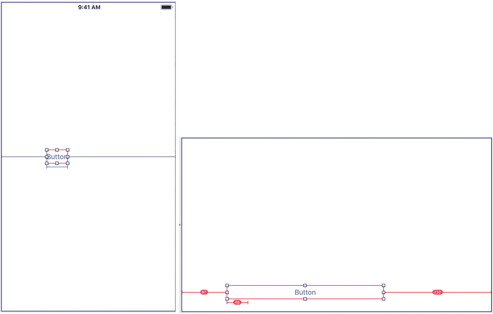

**图 13-2** — 约束在不同方向或屏幕尺寸下可能相互冲突

为了避免多个约束冲突，你可以为每个约束分配不同的优先级值。最重要的约束获得更高的值（例如 `1000`），而其他不太重要的约束获得较低的值（例如 `750` 或 `250`）。现在，Xcode 会先遵循最高优先级的约束，然后再尝试遵循较低优先级的约束。如果较低优先级的约束无法满足，那么较高优先级的约束将优先，而较低优先级的约束将被忽略。

`乘数`可以定义两个对象之间的百分比关系。默认乘数值是 `1`，但你可以更改它，使乘数值小于或大于 `1`，例如 `0.5` 或 `1.5`。

对象通常需要两个或更多约束来准确地在用户界面上定义其大小和位置。当你向对象添加约束时，Xcode 会使用颜色来告知你约束的有效程度。这些不同颜色的含义是：

*   **蓝色** – 该对象拥有所有必要的约束，以准确地在用户界面上定义其大小和位置。
*   **橙色** – 该对象没有足够的约束来在用户界面上定义其大小和位置。
*   **红色** – 该对象存在冲突的约束，需要修改或删除。

当你添加约束时，Xcode 还会在你选定的对象周围显示一个框架。该框架通常出现在对象的边框周围，但如果你应用了约束然后移动对象，你会看到该框架呈现为虚线矩形。该框架显示了对象将出现的位置，即使该对象出现在用户界面的其他位置，如图 13-3 所示。

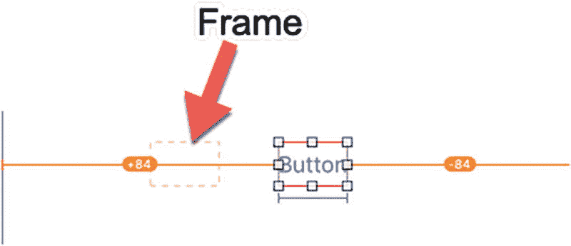

**图 13-3** — 框架显示了因约束而对象将出现的位置

要创建对象上的约束，请选择该对象，然后选择以下方法之一：


*   选择 `Editor` ➤ `Resolve Auto Layout Issues`，然后选取一个选项，让 Xcode 自动定义约束。
*   点击 Xcode 窗口底部的 `Align` 或 `Add new constraints` 图标。
*   从一个对象 `Ctrl`-拖拽至另一个对象。

`Resolve Auto Layout Issues` 子菜单会在上半部分和下半部分显示相同的命令，如图 13-4 所示。上半部分的子菜单仅影响所选对象，而下半部分的子菜单则影响当前视图中显示的所有对象。

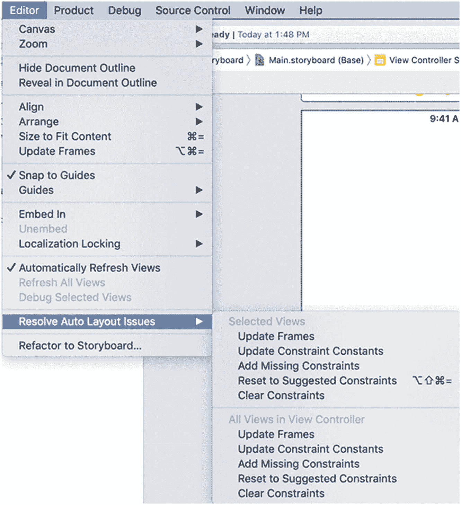

**图 13-4** `Resolve Auto Layout` 子菜单

`Resolve Auto Layout Issues` 子菜单的可用选项包括：

*   `Update Frames` – 用于将对象移动到其框架所在的位置。
*   `Update Constraint Constants` – 用于将框架和所有约束移动到对象的当前位置。
*   `Add Missing Constraints` – 为对象上的现有约束添加新约束。
*   `Reset to Suggested Constraints` – 删除所有现有约束，并添加 Xcode 认为对象需要的新约束。
*   `Clear Constraints` – 删除对象上的所有约束。

点击 `Align` 图标会显示一个弹出窗口，让您可以定义对象在视图中的位置，例如水平或垂直位置。如果您选择了两个或多个对象，可以按对象的侧边、顶部或底部将一个对象与另一个对象对齐，如图 13-5 所示。

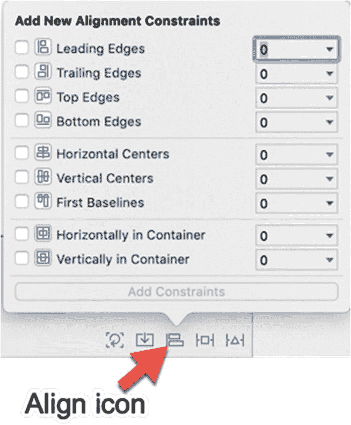

**图 13-5** `Align` 弹出窗口

点击 `Add new constraints` 图标会显示一个弹出窗口，让您可以定义尺寸（宽度和高度）以及到附近对象的距离，如图 13-6 所示。如果您选择了两个或多个对象，还可以定义所有选中的对象具有相同的宽度或高度。

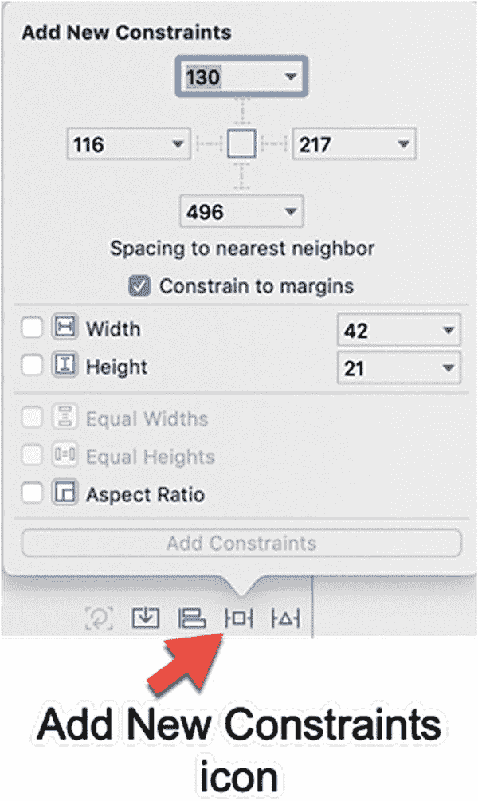

**图 13-6** `Add new constraints` 弹出窗口

为对象添加约束的第三种方式是：从对象 `Ctrl`-拖拽到屏幕边缘或另一个对象上。当您 `Ctrl`-拖拽并释放 `Control` 键和鼠标左键时，会弹出一个窗口，让您可以选择不同的约束，如图 13-7 所示。此弹出菜单中显示的可用约束会根据您 `Ctrl`-拖拽的位置而有所不同。

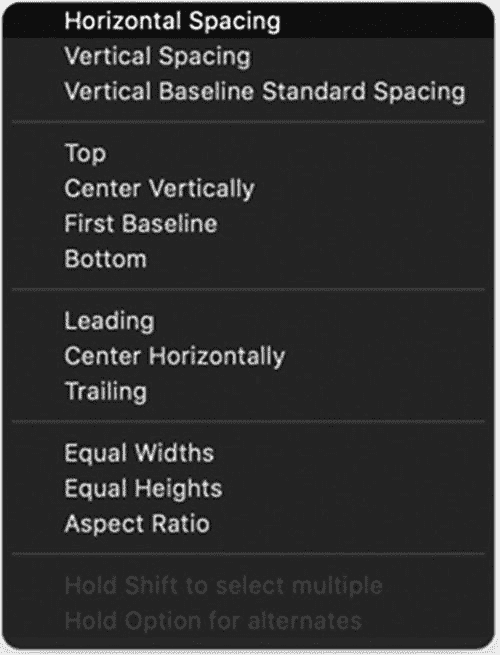

**图 13-7** 当您 `Ctrl`-拖拽以创建约束时出现的弹出菜单

要了解如何创建、编辑和删除约束以及使用框架，请按以下步骤操作：

1.  使用 `Single View App` 模板创建一个新的 iOS 项目（参见第 1 章），并将此新项目命名为 `ConstraintApp`。这为用户界面创建了一个单一视图。
2.  在导航窗格中点击 `Main.storyboard` 文件。Xcode 会显示该单一视图。
3.  点击 `Library` 图标打开 `Object Library` 窗口。
4.  在视图上的任意位置拖放一个按钮和一个标签。确保按钮位于标签的下方。
5.  将鼠标指针移到按钮上，按住 `Control` 键，然后 `Ctrl`-拖拽鼠标，直到鼠标指针出现在标签上方。
6.  释放 `Control` 键和鼠标左键。会弹出一个窗口（见图 13-7）。
7.  选择 `Vertical Spacing`。Xcode 会以红色显示此约束，提示您没有足够的约束来正确定义按钮在用户界面上的位置。
8.  点击按钮以将其选中。
9.  点击 Xcode 窗口底部的 `Add new constraints` 图标。会弹出一个窗口。


10.  点击屏幕右侧和底部表示约束的两条虚线，如图 13-8 所示。

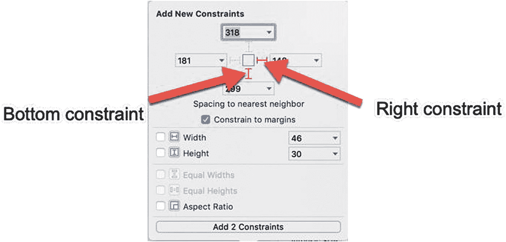

图 13-8

定义屏幕右侧和底部的约束

11.  点击 `Add 2 Constraints` 按钮。Xcode 会添加两个新的约束。请注意，所有约束现在都以蓝色显示，这意味着该按钮已具备足够约束条件，无论应用在何种 iOS 设备上运行，都能正确放置。

12.  将鼠标指针移到按钮上，然后将其拖拽到用户界面的新位置。请注意，Xcode 现在会显示一个虚线矩形来定义框架。该框架显示了应用运行时按钮将出现的位置，即便按钮当前显示在其他位置，如图 13-9 所示。

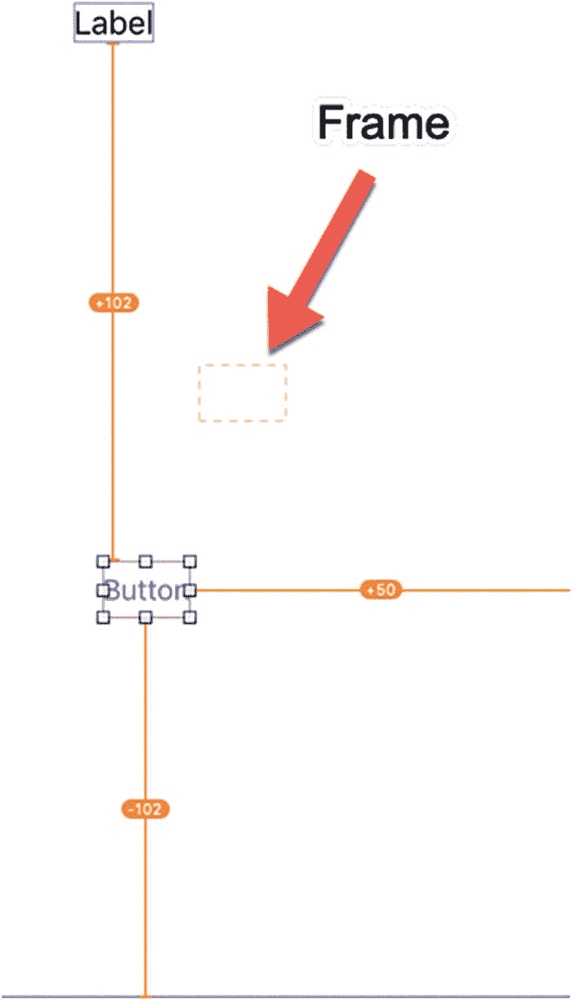

图 13-9

框架显示了对象根据其约束将出现的位置

13.  选择 `Editor` ➤ `Resolve Auto Layout Issues` ➤ `Update Frames`。Xcode 会将按钮移动到框架所在的位置。

14.  选择 `Edit` ➤ `Undo` 或按下 `Command + Z`。Xcode 会将按钮移回先前的位置，并再次显示框架。

15.  选择 `Editor` ➤ `Resolve Auto Layout Issues` ➤ `Update Constraint Constants`。Xcode 会将按钮保留在当前位置，并更改其约束，以便按钮在当前位置显示。

**注** `Update Frames` 命令会将对象移回其框架，而 `Update Constraint Constants` 命令则会将框架和所有约束移动到对象的当前位置。

16.  按住 `SHIFT` 键，点击按钮和标签，将两者同时选中。

17.  点击 Xcode 窗口底部的 `Align` 图标。此时会弹出一个窗口。

18.  选中 `Leading Edges` 复选框（前导边缘定义对象的左侧，而尾随边缘定义对象的右侧），如图 13-10 所示。

19.  点击 `Add 1 Constraint` 按钮。注意，Xcode 会根据标签和按钮的前导（左侧）边缘对齐它们。

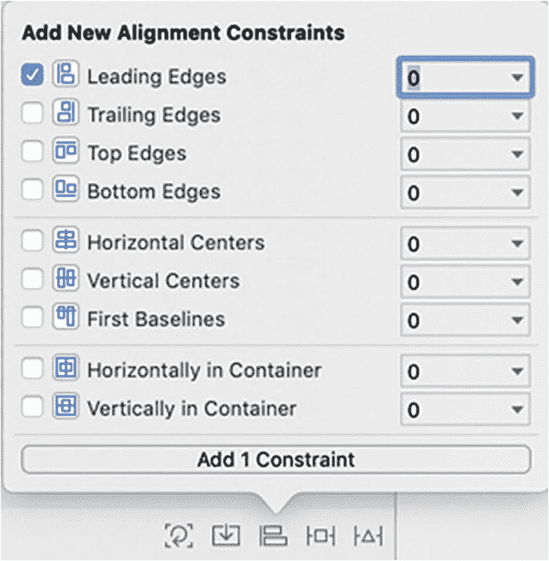

图 13-10

通过前导边缘对齐两个对象

20.  点击按钮将其选中，然后选择 `View` ➤ `Inspectors` ➤ `Show Size Inspector`，或者点击 Xcode 窗口右上角的 `Size Inspector` 图标。此时，在 `Constraints` 类别下会显示一个约束列表，如图 13-11 所示。

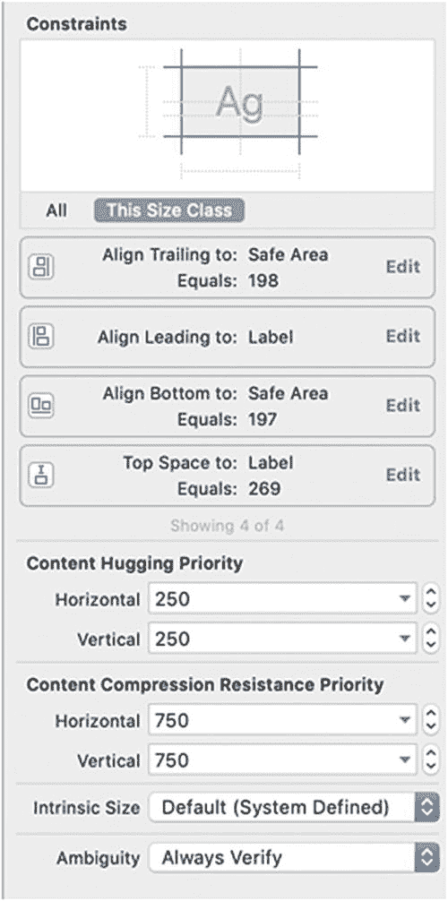

图 13-11

约束显示在 `Size Inspector` 面板中

21.  点击每条约束右侧出现的 `Edit` 按钮。此时会弹出一个窗口，列出该约束的常量、优先级和乘数数值，如图 13-12 所示。

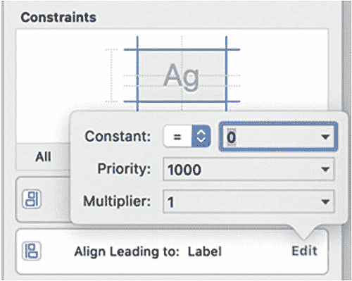

图 13-12

编辑约束

22.  在 `Constant` 弹出菜单中点击，可以定义一个 `=`、`≤` 或 `≥` 关系。

23.  点击显示数值的文本字段右侧出现的向下箭头。此时会出现一个弹出菜单，允许你选择 `Standard Value` 或 `Canvas Value`。

24.  点击显示数值的 `Priority` 文本字段右侧出现的向下箭头。此时会出现一个弹出菜单，允许你选择不同的优先级。（你也可以随时在此文本字段中手动输入数值。）

25.  点击按钮，显示所有约束。

26.  点击一个约束将其选中，然后按下 `BACKSPACE` 或 `DELETE` 键删除该约束。这样你可以删除单个约束。

27.  在子菜单底部选择 `Editor` ➤ `Resolve Auto Layout Issues` ➤ `Clear Constraints`。这将删除视图上所有对象的约束。

在此练习中，你学习了如何添加、编辑和删除约束。你设计的每个用户界面都必须定义约束，以确保无论应用在何种屏幕尺寸的设备上运行，对象都能在用户界面上正确显示。


## 使用堆栈视图

当用户界面上有多个对象时，为所有对象定义约束可能会很麻烦。更糟的是，一旦你为多个对象定义了约束，之后可能还想将一个或多个对象移动到不同的位置，这意味着需要重新定义所有约束。

要使用堆栈视图，只需从`对象库`窗口中将一个堆栈视图拖放到视图上。然后将其他对象拖放到堆栈视图中。堆栈视图确保对象垂直或水平对齐，因此你只需要为堆栈视图本身添加约束。这样就无需为堆栈视图内部的对象添加约束。

你可以在堆栈视图中修改的一些属性包括：

- `轴` – 垂直或水平显示对象
- `对齐` – 定义对象在堆栈视图内的显示方式，包含以下选项：`填充`、`顶部`、`居中`、`底部`、`第一基线`和`最后基线`
- `分布` – 定义对象在堆栈视图内的显示方式，包含以下选项：`填充`、`均匀填充`、`等比填充`、`等间距`和`等中心距`
- `间距` – 定义堆栈视图内对象之间的距离

更改`轴`可以让您定义对象在堆栈视图内的显示方式。`水平`将对象按行显示。`垂直`将对象按列显示，如图 13-13 所示。虽然`对象库`窗口提供了`水平堆栈视图`和`垂直堆栈视图`，但您只需修改`轴`属性即可改变任一堆栈视图的行为。

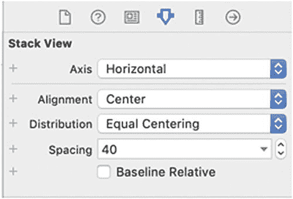

图 13-13

堆栈视图的`属性检查器`面板

`对齐`属性定义了对象在堆栈视图中的排列方式：

- `填充` – 扩展所有对象的高度（水平堆栈）或宽度（垂直堆栈），以匹配最高或最宽的对象
- `居中` – 水平或垂直居中所有对象
- `前导`（仅垂直堆栈） – 将所有对象对齐到堆栈视图的左侧
- `尾随`（仅垂直堆栈） – 将所有对象对齐到堆栈视图的右侧
- `顶部`（仅水平堆栈） – 将所有对象对齐到堆栈视图的顶部
- `底部`（仅水平堆栈） – 将所有对象对齐到堆栈视图的底部
- `第一基线`（仅水平堆栈） – 根据第一行文本的底部对齐所有对象（`第一基线`），如图 13-14 所示
- `最后基线`（仅水平堆栈） – 根据最后一行文本的底部对齐所有对象（`最后基线`），如图 13-15 所示

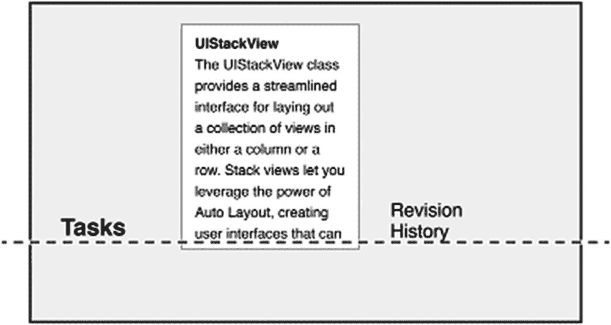

图 13-15

`最后基线`是最后一行文本的底部

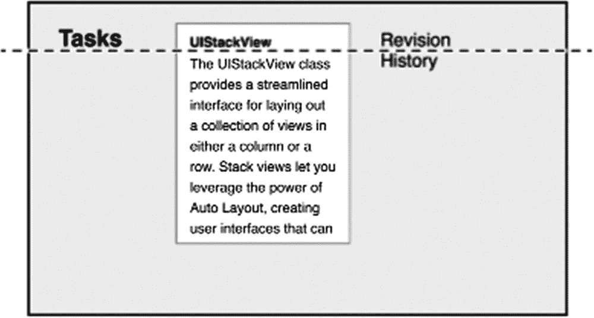

图 13-14

`第一基线`是第一行文本的底部

`分布`属性定义了对象如何在堆栈视图内调整自身大小：

- `填充` – 堆栈视图会扩展或缩小，以确保所有对象可见。
- `均匀填充` – 调整所有对象的大小，使其基于最宽或最高的对象具有相同的宽度（水平堆栈）或高度（垂直堆栈）。
- `等比填充` – 扩展或缩小堆栈视图，以保持内部所有对象的原始大小。
- `等间距` – 在堆栈视图中的所有对象之间添加相等的空间。
- `等中心距` – 保持相邻对象中心之间的等距，同时保留由`间距`属性定义的值，以确定相邻对象之间的距离。

`间距`属性定义了堆栈视图中相邻对象边缘之间的距离。您无需直接调整堆栈视图的大小，而是可以通过修改其各种属性来调整它，使堆栈视图适应其包含的对象，并且在两端没有浪费的空间。

最终，堆栈视图的主要目的是将多个对象垂直排列成列或水平排列成行。这样，您就不必为多个对象创建约束，而只需为单个堆栈视图添加约束。


#### 注意

与其他允许你定义高度和宽度的对象不同，栈视图会自动根据其内部存储的对象调整自身的高度和宽度。

要了解如何使用栈视图，请遵循以下步骤：

1. 使用单视图应用模板创建一个新的 iOS 项目（参见第 1 章），并将此新项目命名为 `StackViewApp`。这将为用户界面创建一个单视图。
2. 在导航窗格中点击 `Main.storyboard` 文件。Xcode 会显示该单视图。
3. 点击库图标以打开对象库窗口。
4. 在视图上拖放一个水平或垂直的栈视图，如图 13-16 所示。尽管栈视图显示为一个大型矩形，但其尺寸会根据你放入栈视图内的对象数量和类型进行调整。

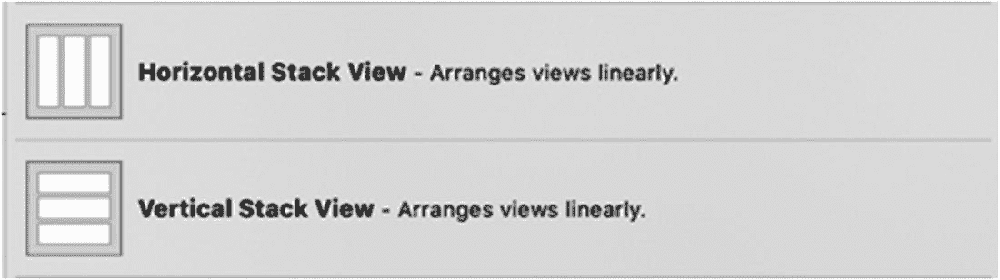

*图 13-16* 对象库窗口中的水平和垂直栈视图

5. 点击库图标以打开对象库窗口，并将以下项目拖放到栈视图中：
   - 标签
   - 按钮
   - 文本字段

由于当你向栈视图添加任何对象时，它会自动调整大小，因此你可以轻松地将一个对象直接拖放到用户界面上显示的栈视图中。之后，你需要通过将其他对象拖放到文档大纲中栈视图的下方来添加它们，如图 13-17 所示。

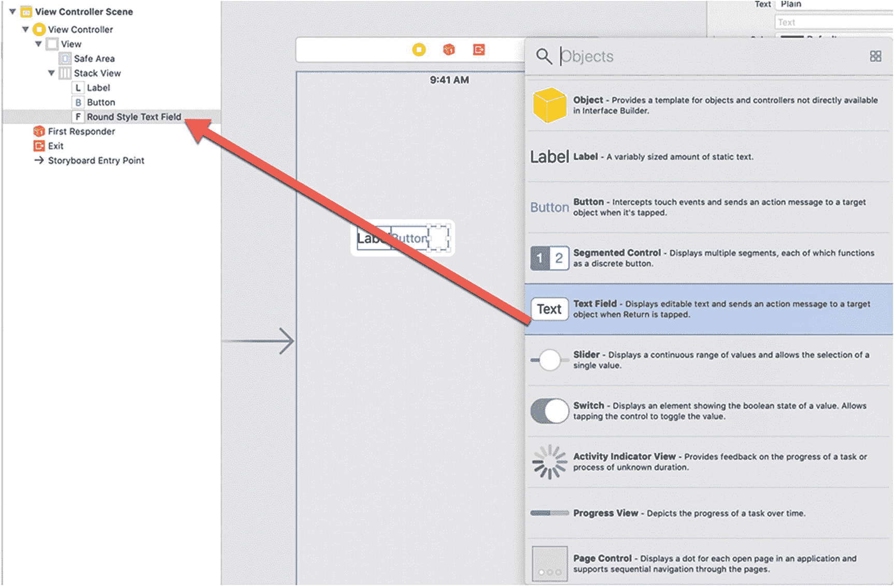

*图 13-17* 将对象拖放到文档大纲中

6. 在文档大纲中点击栈视图以将其选中。
7. 将鼠标指针移动到栈视图上，直到鼠标指针变为手型图标。然后拖动鼠标以移动栈视图。请注意，移动栈视图也会将所有对象作为一个整体一起移动。
8. 选择“视图”➤“检查器”➤“显示属性检查器”，或点击 Xcode 窗口右上角的属性检查器图标。将出现栈视图的属性检查器窗格（参见图 13-13）。
9. 点击“轴”弹出菜单并在水平和垂直之间来回切换。无论你最初使用的是水平还是垂直栈视图，之后你都可以通过更改其“轴”属性来修改其方向。
10. 确保“轴”属性设置为垂直。然后点击“间距”文本字段并输入 `40`。
11. 点击“对齐”弹出菜单并选择“填充”。这将使所有对象在宽度（垂直栈视图）或高度（水平栈视图）上扩展。
12. 点击“分布”弹出菜单并选择“等间距”。请注意，Xcode 会在栈视图内的所有对象之间创建间距，如图 13-18 所示。

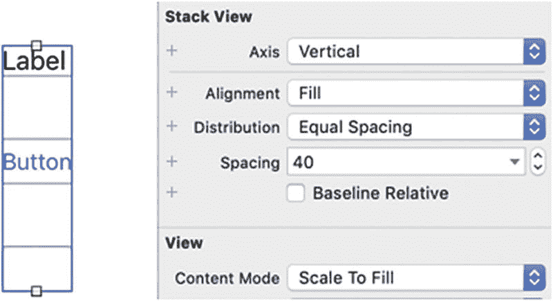

*图 13-18* “间距”属性在栈视图中的对象之间创建空白空间

13. 点击“对齐”弹出菜单并选择“居中对齐”。请注意，栈视图现在将根据最大的对象定义其宽度，如图 13-19 所示。

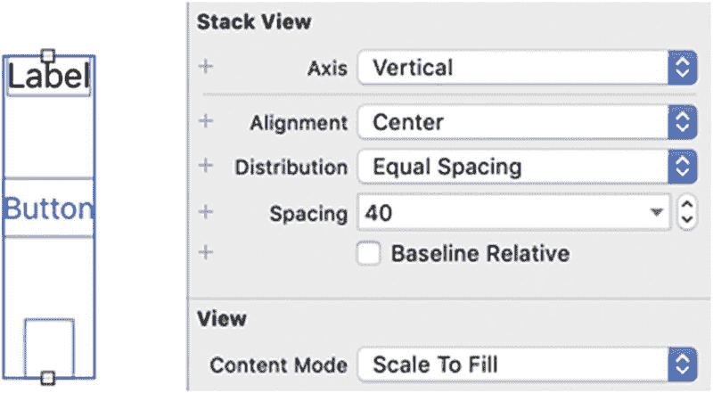

*图 13-19* 居中对齐根据最宽的对象定义栈宽度

14. 点击“对齐”弹出菜单并选择“前导对齐”。请注意，栈视图将所有对象在左侧对齐。
15. 点击“对齐”弹出菜单并选择“尾随对齐”。请注意，栈视图将所有对象在右侧对齐。
16. 点击“轴”弹出菜单并选择“水平”。
17. 点击“对齐”弹出菜单并选择“顶部对齐”。请注意，栈视图将所有对象按其顶部对齐。
18. 点击“对齐”弹出菜单并选择“底部对齐”。请注意，栈视图将所有对象按其底部对齐。
19. 点击“分布”弹出菜单并选择“均匀填充”。请注意，栈视图内的所有对象现在显示为相同宽度。尝试使用不同的选项，看看它们如何影响栈视图内对象的外观。

一旦你定义了栈视图内对象的外观，就可以对栈视图应用约束。栈视图允许你将对象组织成行或列，而无需对每个对象单独应用约束。

## 小结

设计用户界面涉及将对象放置到视图上。然而，这些对象的确切位置可能会根据应用程序运行的屏幕尺寸而改变。如果你为较大的屏幕设计用户界面，那么在较小的屏幕上查看时可能会显得过于拥挤。如果你为小屏幕设计用户界面，那么在较大的屏幕上可能会显得空旷且失衡。

为了确保用户界面在所有尺寸的屏幕上看起来都很好，你需要添加约束。约束可以定义对象的大小（宽度和高度）、位置或与附近对象的距离。你可以定义具体的数值和关系，例如等于、小于或等于、大于或等于。添加约束时，Xcode 会使用颜色来让你知道约束是否足够（蓝色）、约束不足（橙色）或存在冲突的约束（红色）。

任何时候，你都可以添加、删除或修改约束。由于对多个对象应用约束可能很麻烦，你可以通过将对象存储在栈视图中，将它们分组为垂直列或水平行。然后你可以对栈视图应用约束。

约束和栈视图提供了两种设计用户界面的方法，并确保无论应用程序运行在什么屏幕尺寸上，它们看起来都很好。

# 14. 使用表视图

表视图是最常见的用户界面对象之一，用于以行列表的形式显示大量信息。邮件和照片应用程序使用表视图让用户滚动浏览信息。表视图看起来就像一个无穷无尽的列表，因为当用户向上或向下滚动时，新的数据会不断地填充进来。表视图由单元格组成，这些单元格包含一个或多个对象，例如标签或图像视图，如图 14-1 所示。

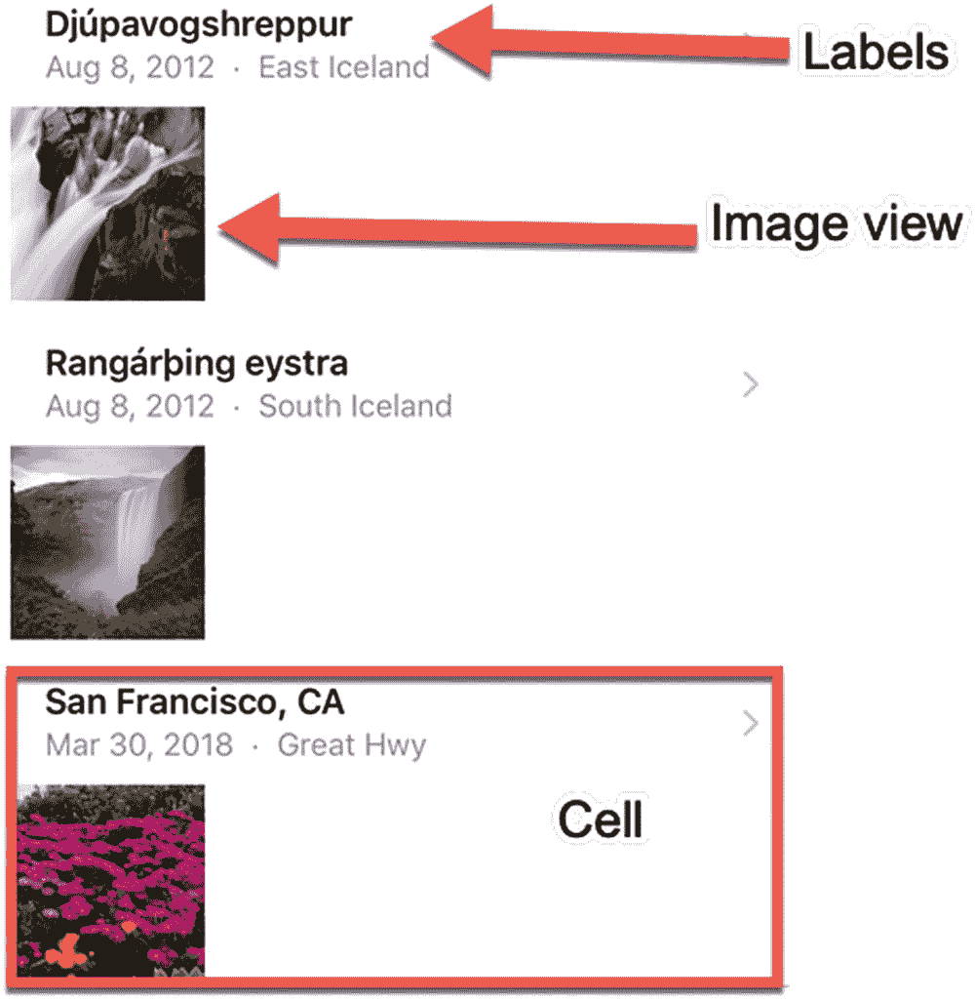

*图 14-1* 一个表视图由单元格组成，这些单元格在标签和图像视图等对象中显示数据

要创建表视图，你可以从对象库窗口拖动一个表视图并将其放置到视图上。另一种替代方法是从对象库窗口拖动一个表视图控制器并将其放置为故事板的一部分。表视图控制器只不过是一个带有表视图的视图控制器。

要使用表视图，你需要执行以下操作：

- 定义一个包含表视图要显示信息的单元格。
- 定义一个数据源，用于将信息放入表视图的每个单元格中。
- 定义一个委托（`.swift` 文件），其中包含用于定义节数和行数，以及构成表视图的单元格的方法。


## 创建简单的表格视图

如果你已有现有视图，可以将`Table View`拖放到该视图上。有了表格视图后，必须用数据（来自数据源）填充它，并定义表格包含多少分区和行。数据可以来自任何地方，但每个数据块应包含相同数量的项。例如，如果你希望表格视图显示姓名和图片，那么每个数据块应包含文本（姓名）和图像（图片）。

要了解如何创建并填充表格视图，请按照以下步骤操作：

1. 使用单视图应用模板创建一个新的 iOS 项目（见第 1 章），并将此新项目命名为`TableViewApp`。这将为用户界面创建一个单视图。

2. 在导航窗格中点击`Main.storyboard`文件。Xcode 会显示该单视图。

3. 点击库图标以打开对象库窗口。

4. 拖放一个表格视图，如图 14-2 所示，放置在视图的任意位置。

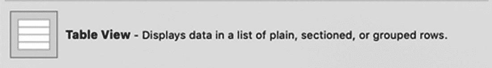

图 14-2 对象库窗口中的表格视图

5. 调整表格视图的大小，使其填满整个屏幕。

6. 选择 编辑器 ➤ 解决自动布局问题 ➤ 重置为建议的约束。Xcode 会为表格视图添加约束，如图 14-3 所示。

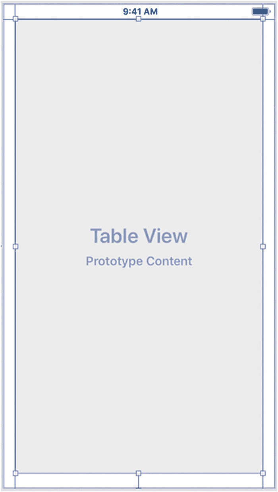

图 14-3 带有约束的表格视图

7. 选择 视图 ➤ 辅助编辑器 ➤ 显示辅助编辑器，或点击 Xcode 窗口右上角的辅助编辑器图标。

8. 将鼠标指针移到表格视图上，按住 Control 键，并在`ViewController.swift`文件中的“class ViewController”行下方进行 Ctrl-拖拽。

9. 松开 Control 键和鼠标左键。会弹出一个窗口。

10. 点击名称文本字段，输入`petTable`，然后点击连接按钮。Xcode 会创建一个`IBOutlet`，如下所示：

```
@IBOutlet var petTable: UITableView!
```

11. 选择 视图 ➤ 标准编辑器 ➤ 显示标准编辑器，或点击 Xcode 窗口右上角的标准编辑器图标。

12. 在导航窗格中点击`ViewController.swift`文件。

13. 修改类`ViewController`行，添加`UITableViewDelegate`、`UITableViewDataSource`，如下所示：

```
class ViewController: UIViewController, UITableViewDelegate, UITableViewDataSource {
```

这段代码的目的是将`ViewController.swift`文件标识为表格视图的委托和数据源。

14. 在类`ViewController`行的下方，添加以下数组：

```
let petArray = ["cat", "dog", "parakeet", "parrot", "canary", "finch", "tropical fish", "goldfish", "sea horses", "hamster", "gerbil", "rabbit", "turtle", "snake", "lizard", "hermit crab"]
```

15. 在此数组下方，添加以下代码行：

```
let cellID = "cellID"
```

这段代码的目的是为单元格创建一个任意常量名称。表格视图由一行行单元格组成，因此我们需要标识单元格，以便稍后存储数据。

16. 按如下方式修改`viewDidLoad`方法：

```
override func viewDidLoad() {
    super.viewDidLoad()
    petTable.dataSource = self
    petTable.delegate = self
    // Do any additional setup after loading the view, typically from a nib.
}
```

这段代码的目的是定义表格（`IBOutlet petTable`）从它所在的`ViewController.swift`文件（`self`）获取数据。此外，委托也被定义为`ViewController.swift`文件（`self`）。这意味着`ViewController.swift`文件需要包含定义表格需要多少行以及数据来源（即`petArray`）的函数。

17. 在`viewDidLoad`方法下方添加以下函数：

```
func tableView(_ tableView: UITableView, numberOfRowsInSection section: Int) -> Int {
    return petArray.count
}
```

这段代码定义了表格需要多少行。行数由`petArray`中存储项的总数决定。

18. 在`viewDidLoad`方法下方添加以下函数：

```
func tableView(_ tableView: UITableView, cellForRowAt indexPath: IndexPath) -> UITableViewCell {
    var cell = tableView.dequeueReusableCell(withIdentifier: cellID)
    if (cell == nil) {
        cell = UITableViewCell(
            style: UITableViewCell.CellStyle.default,
            reuseIdentifier: cellID)
    }
    cell?.textLabel?.text = petArray[indexPath.row]
    return cell!
}
```

每当表格视图需要将数据放入行时，就会运行此函数。这可能发生在表格视图首次出现时，或者用户上下滚动以显示之前因一次无法显示所有数据而被隐藏的数据时。由于表格视图中的每一行都由一个单元格定义，因此需要创建一个具有名称的单元格：

```
var cell = tableView.dequeueReusableCell(withIdentifier: cellID)
```

如果单元格为空，则`if`语句会定义单元格的样式，并赋予其任意的`cellID`名称来标识它：

```
if (cell == nil) {
    cell = UITableViewCell(
        style: UITableViewCell.CellStyle.default,
        reuseIdentifier: cellID)
}
```

接着，它从`petArray`中获取数据，并根据单元格在表格视图中的位置（其行号），将这些数据存储在单元格`textLabel`的文本属性中。然后返回该单元格，使其显示在表格视图中：

```
cell?.textLabel?.text = petArray[indexPath.row]
return cell!
```

完整的`ViewController.swift`文件应如下所示：

```
import UIKit
class ViewController: UIViewController, UITableViewDelegate, UITableViewDataSource {
    @IBOutlet var petTable: UITableView!
    let petArray = ["cat", "dog", "parakeet", "parrot", "canary", "finch", "tropical fish", "goldfish", "sea horses", "hamster", "gerbil", "rabbit", "turtle", "snake", "lizard", "hermit crab"]
    let cellID = "cellID"
    override func viewDidLoad() {
        super.viewDidLoad()
        petTable.dataSource = self
        petTable.delegate = self
        // Do any additional setup after loading the view, typically from a nib.
    }
    func tableView(_ tableView: UITableView, numberOfRowsInSection section: Int) -> Int {
        return petArray.count
    }
    func tableView(_ tableView: UITableView, cellForRowAt indexPath: IndexPath) -> UITableViewCell {
        var cell = tableView.dequeueReusableCell(withIdentifier: cellID)
        if (cell == nil) {
            cell = UITableViewCell(
                style: UITableViewCell.CellStyle.default,
                reuseIdentifier: cellID)
        }
        cell?.textLabel?.text = petArray[indexPath.row]
        return cell!
    }
}
```

19. 点击运行按钮或选择 产品 ➤ 运行。模拟器窗口会出现，显示表格视图中的数据，如图 14-4 所示。

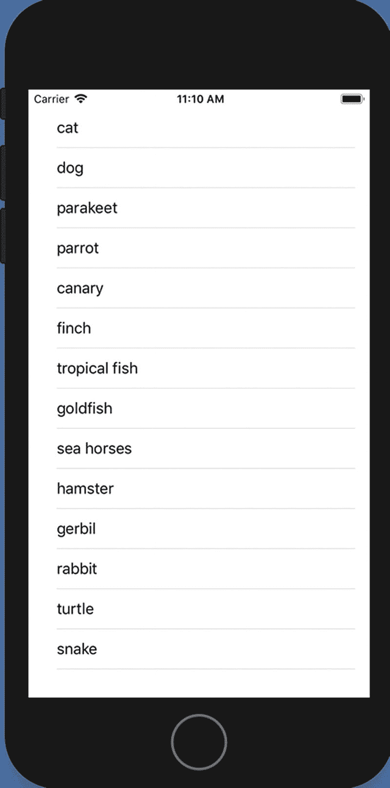

图 14-4 用数组数据填充后的表格视图

20. 在表格视图中上下滚动，查看数据如何从屏幕顶部和底部滚动消失。

21. 选择 模拟器 ➤ 退出模拟器，返回 Xcode。

创建表格视图的基本步骤如下：

- 从对象库窗口将表格视图拖放到视图上。
- 将`.swift`文件定义为表格视图的委托和数据源。
- 创建或获取要存储在表格视图中的数据。
- 编写一个函数，定义表格视图需要显示多少行。
- 编写一个函数，将数据存储到表格视图的不同行中。


好的，作为高级文档工程师和翻译员，我将严格遵守您提供的注意事项，将给定的英文文本翻译成符合 Markdown 格式的中文。


在前一个例子中，我们通过在`ViewController.swift`文件中编写代码来创建并填充了一个表格视图。由于 Xcode 提供了多种方式（通过代码或可视化）来完成同一任务，接下来我们将看到如何用更少的代码复制完全相同的表格视图项目。

我们将通过两种方式实现这一点。首先，我们将通过可视化方式定义委托和数据源，从而省略以下三行代码：

```swift
@IBOutlet var petTable: UITableView!
petTable.dataSource = self
petTable.delegate = self
```

接着，我们将从对象库窗口中拖放一个单元格到表格视图上，从而省略以下代码：

```swift
let cellID = "cellID"
if (cell == nil) {
    cell = UITableViewCell(
        style: UITableViewCell.CellStyle.default,
        reuseIdentifier: "cellID")
}
```

减少创建应用所需的代码量，可以让您专注于编写使应用独具特色的代码。不过，减少代码的代价是，您必须意识到这些代码已被其他方式替代，而这些方式初看之下并不总是显而易见。

要了解如何以可视化方式创建表格视图，请按照以下步骤操作：

1.  使用“单视图应用”模板创建一个新的 iOS 项目（参见第 1 章），并将这个新项目命名为`TableViewVisualApp`。这将为用户界面创建一个单视图。

2.  在导航面板中点击`Main.storyboard`文件。Xcode 会显示该单视图。

3.  点击库图标打开对象库窗口。

4.  将表格视图（见图 14-2）拖放到视图上的任意位置。

5.  调整表格视图的大小，使其填满整个屏幕。

6.  选择 `Editor ➤ Resolve Auto Layout Issues ➤ Reset to Suggested Constraints`。Xcode 会为表格视图添加约束（见图 14-3）。

7.  点击库图标打开对象库窗口。然后拖放一个表格视图单元格到顶部，如图 14-5 所示。

    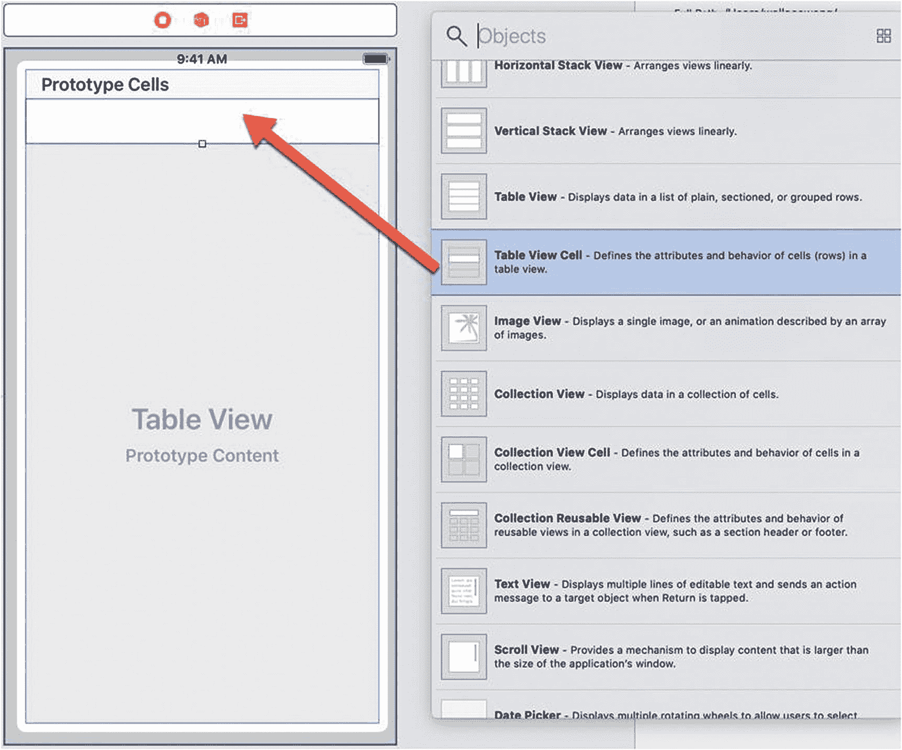

    图 14-5

    将表格视图单元格拖到表格视图上

8.  选择 `View ➤ Inspectors ➤ Show Attributes Inspector`，或者点击 Xcode 窗口右上角的属性检查器图标。

9.  点击标识符文本字段（如图 14-6 所示），输入**cellID**（您可以给它任意名称），然后按回车键。

    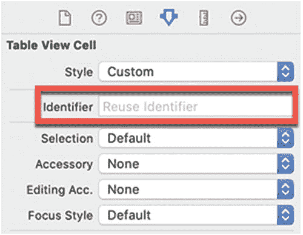

    图 14-6

    属性检查器中的标识符文本字段

10. 点击表格视图以将其选中，然后选择 `View ➤ Inspectors ➤ Show Connections Inspector`，或者点击 Xcode 窗口右上角的连接检查器图标。

11. 点击`dataSource`右侧出现的圆圈，然后将鼠标拖到视图控制器顶部的`ViewController`图标上，或者文档大纲中的对应图标上，如图 14-7 所示。

    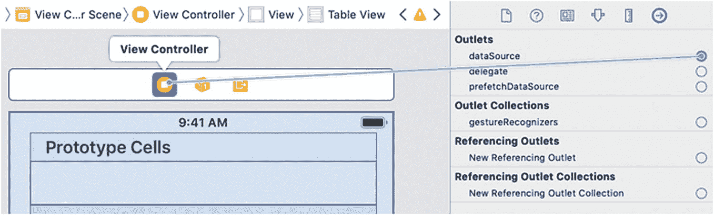

    图 14-7

    连接检查器面板允许您将`dataSource`和`delegate`连接到视图控制器

12. 松开鼠标左键。

13. 点击`delegate`右侧出现的圆圈，然后将鼠标拖到视图控制器顶部的`ViewController`图标上，或者文档大纲中的对应图标上。

14. 松开鼠标左键。连接检查器面板应显示`ViewController`文件现在是`dataSource`和`delegate`，如图 14-8 所示。

    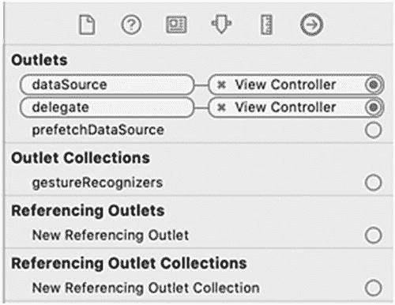

    图 14-8

    将`delegate`和`dataSource`连接到`ViewController.swift`文件

15. 在导航面板中点击`ViewController.swift`文件。

16. 通过添加`UITableViewDelegate, UITableViewDataSource`来修改`class ViewController`这一行，如下所示：

    ```swift
    class ViewController: UIViewController, UITableViewDelegate, UITableViewDataSource {
    ```

    这段代码的目的是将`ViewController.swift`文件标识为表格视图的委托和数据源。

17. 在`class ViewController`这一行的下方，添加以下数组：

    ```swift
    let petArray = ["cat", "dog", "parakeet", "parrot", "canary", "finch", "tropical fish", "goldfish", "sea horses", "hamster", "gerbil", "rabbit", "turtle", "snake", "lizard", "hermit crab"]
    ```

18. 在`viewDidLoad`方法的下方，添加以下函数来定义所需的总行数：

    ```swift
    func tableView(_ tableView: UITableView, numberOfRowsInSection section: Int) -> Int {
        return petArray.count
    }
    ```

19. 在`viewDidLoad`方法的下方，添加以下函数来将数据加载到表格中：

    ```swift
    func tableView(_ tableView: UITableView, cellForRowAt indexPath: IndexPath) -> UITableViewCell {
        let cell = tableView.dequeueReusableCell(withIdentifier: "cellID")
        cell?.textLabel?.text = petArray[indexPath.row]
        return cell!
    }
    ```

    这段代码引用了具有`"cellID"`标识符的单元格，这正是我们在第 9 步中为表格视图单元格定义的标识符。整个`ViewController.swift`文件应如下所示：

    ```swift
    import UIKit
    class ViewController: UIViewController, UITableViewDelegate, UITableViewDataSource {
        let petArray = ["cat", "dog", "parakeet", "parrot", "canary", "finch", "tropical fish", "goldfish", "sea horses", "hamster", "gerbil", "rabbit", "turtle", "snake", "lizard", "hermit crab"]
        override func viewDidLoad() {
            super.viewDidLoad()
            // Do any additional setup after loading the view, typically from a nib.
        }
        func tableView(_ tableView: UITableView, numberOfRowsInSection section: Int) -> Int {
            return petArray.count
        }
        func tableView(_ tableView: UITableView, cellForRowAt indexPath: IndexPath) -> UITableViewCell {
            let cell = tableView.dequeueReusableCell(withIdentifier: "cellID")
            cell?.textLabel?.text = petArray[indexPath.row]
            return cell!
        }
    }
    ```

20. 点击运行按钮或选择 `Product ➤ Run`。模拟器窗口出现，显示表格视图中的数据（见图 14-4）。

21. 在表格视图中上下滚动，观察数据如何从屏幕顶部和底部滚动出去。

22. 选择 `Simulator ➤ Quit Simulator` 返回 Xcode。


## 在表格视图中选择项目

表格视图会显示数据行供用户选择。为了检测用户点击并选择了哪一行，我们需要另一个名为 `didSelectRowAt` 的函数，它可以识别被选中的行并从中检索数据。要了解如何在表格视图中选择项目，请按照以下步骤操作：

1.  确保 `TableViewApp` 项目已在 Xcode 中加载。
2.  在导航窗格中点击 `ViewController.swift` 文件。Xcode 会显示单个视图。
3.  在 `viewDidLoad` 方法下方添加以下函数：

```swift
func tableView(_ tableView: UITableView, didSelectRowAt indexPath: IndexPath) {
    let selectedItem = petArray[indexPath.row]
    let alert = UIAlertController(title: "Your Choice", message: "\(selectedItem)", preferredStyle: .alert)
    let okAction = UIAlertAction(title: "OK", style: .default, handler: { action -> Void in
        //Just dismiss the action sheet
    })
    alert.addAction(okAction)
    self.present(alert, animated: true, completion: nil)
}
```

该函数返回 `indexPath`，可用于识别用户点击的行。基于此索引，我们可以从填充表格视图数据的 `petArray` 中检索到正确的项目。然后，它显示一个警告控制器来标识用户点击的项目。整个 `ViewController.swift` 文件应如下所示：

```swift
import UIKit
class ViewController: UIViewController, UITableViewDelegate, UITableViewDataSource {
    let petArray = ["cat", "dog", "parakeet", "parrot", "canary", "finch", "tropical fish", "goldfish", "sea horses", "hamster", "gerbil", "rabbit", "turtle", "snake", "lizard", "hermit crab"]
    override func viewDidLoad() {
        super.viewDidLoad()
        // Do any additional setup after loading the view, typically from a nib.
    }
    func tableView(_ tableView: UITableView, numberOfRowsInSection section: Int) -> Int {
        return petArray.count
    }
    func tableView(_ tableView: UITableView, cellForRowAt indexPath: IndexPath) -> UITableViewCell {
        let cell = tableView.dequeueReusableCell(withIdentifier: "cellID")
        cell?.textLabel?.text = petArray[indexPath.row]
        return cell!
    }
    func tableView(_ tableView: UITableView, didSelectRowAt indexPath: IndexPath) {
        let selectedItem = petArray[indexPath.row]
        let alert = UIAlertController(title: "Your Choice", message: "\(selectedItem)", preferredStyle: .alert)
        let okAction = UIAlertAction(title: "OK", style: .default, handler: { action -> Void in
            //Just dismiss the action sheet
        })
        alert.addAction(okAction)
        self.present(alert, animated: true, completion: nil)
    }
}
```

4.  点击运行按钮或选择产品 ➤ 运行。模拟器窗口出现，显示表格视图中的数据（见图 14-4）。
5.  点击表格视图中的一个项目。会弹出一个警告控制器来标识您的选择，如图 14-9 所示。

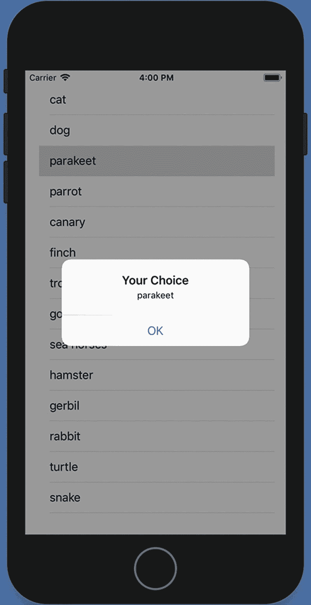

图 14-9：弹出警告标识所选选项

6.  点击“OK”关闭警告控制器。
7.  选择模拟器 ➤ 退出模拟器以返回 Xcode。

## 创建分组表格

目前示例中的表格只是将数据列为无尽的行，这被称为普通表格样式。为了帮助组织表格视图中显示的数据，您可以创建分组表格样式，将数据划分为多个分区，每个分区都有一个标题，如图 14-10 所示。

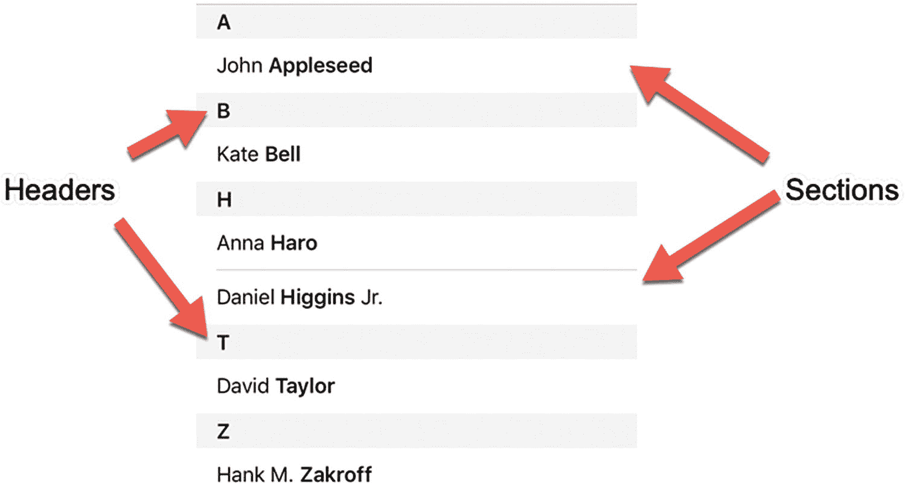

图 14-10：分组表格将数据划分为带有标题的分区

创建分组表格需要额外的步骤：

-   将表格视图定义为分组样式。
-   编写一个 `numberOfSections` 函数，定义表格视图包含多少个分区。
-   编写一个 `numberOfRowsInSection` 函数，定义每个分区中有多少行。
-   编写一个 `titleForHeaderInSection` 函数，定义每个分区显示的标题。

为了定义分区，数据必须以不同的方式排列。在前面的例子中，我们只有一个字符串数组。但是要在分区中显示数据，我们需要一个数组的数组。每个字符串数组代表一个不同的分区，例如：

```swift
let petArray = [["Mammal", "cat", "dog", "hamster", "gerbil", "rabbit"], ["Bird", "parakeet", "parrot", "canary", "finch"], ["Fish", "tropical fish", "goldfish", "sea horses"], ["Reptile", "turtle", "snake", "lizard"]]
```

上面的数组包含四个字符串数组，其中每个数组的第一项定义了该分区的标题。因此，第一个数组的标题是“Mammal”，第二个数组的标题是“Bird”，第三个数组的标题是“Fish”，第四个数组的标题是“Reptile”。

在确定每个分区中的行数时，我们需要减去 1，因为分区标题出现在每个数组的开头。因此，`numberOfRowsInSection` 函数会减去 1 来准确计算每个分区中的行数，如下所示：

```swift
func tableView(_ tableView: UITableView, numberOfRowsInSection section: Int) -> Int {
    return petArray[section].count - 1
}
```

在表格视图中显示数据涉及识别分区和行。但是，由于每个数组的第一个元素包含分区标题，我们需要通过在数组索引上加 1 来跳过这个标题，就像 `cellForRowAt` 函数中的这一行代码：

```swift
cell?.textLabel?.text = petArray[indexPath.section][indexPath.row + 1]
```

此外，我们需要使用 `didSelectRowAt` 函数中的以下代码来识别用户点击的项目：

```swift
let selectedItem = petArray[indexPath.section][indexPath.row + 1]
```

识别分区数量只需统计 `petArray` 中所有元素（数组）的数量，如下所示：

```swift
func numberOfSections(in tableView: UITableView) -> Int {
    return petArray.count
}
```

为了显示标题，我们需要从每个分区中检索第一个元素，如下所示：

```swift
func tableView(_ tableView: UITableView, titleForHeaderInSection section: Int) -> String? {
    return petArray[section][0]
}
```

要了解如何创建分组表格，请按照以下步骤操作：

1.  使用单视图应用模板创建一个新的 iOS 项目（见第 1 章），并将此新项目命名为 `GroupTableViewApp`。这将为用户界面创建一个单独的视图。
2.  在导航窗格中点击 `Main.storyboard` 文件。Xcode 会显示单个视图。
3.  点击库图标以打开对象库窗口。
4.  将表格视图（见图 14-2）拖放到视图的任意位置。
5.  调整表格视图的大小，使其填满整个屏幕。
6.  选择编辑器 ➤ 解析自动布局问题 ➤ 重置为建议的约束。Xcode 会向表格视图添加约束（见图 14-3）。
7.  选择视图 ➤ 检查器 ➤ 显示属性检查器，或点击 Xcode 窗口右上角的属性检查器图标。


```markdown
8.  点击`Style`弹出菜单，选择`Grouped`，如图 14-11 所示。

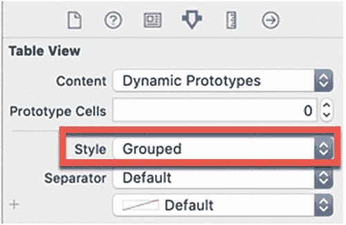

*图 14-11* 将表视图定义为分组表

9.  选择`View` ➤ `Assistant Editor` ➤ `Show Assistant Editor`，或点击 Xcode 窗口右上角的`Assistant Editor`图标。

10. 将鼠标指针移到表视图上，按住`Control`键，在`ViewController.swift`文件的`class ViewController`行下方进行`Ctrl`-拖拽。

11. 松开`Control`键和鼠标左键。出现一个弹出窗口。

12. 点击`Name`文本字段，输入`petTable`，然后点击`Connect`按钮。Xcode 会创建一个`IBOutlet`，如下所示：

```swift
@IBOutlet var petTable: UITableView!
```

1.  选择`View` ➤ `Standard Editor` ➤ `Show Standard Editor`，或点击 Xcode 窗口右上角的`Standard Editor`图标。

2.  在导航窗格中点击`ViewController.swift`文件。

3.  添加`UITableViewDelegate`和`UITableViewDataSource`，修改`class ViewController`行，如下所示：

```swift
class ViewController: UIViewController, UITableViewDelegate, UITableViewDataSource {
```

这段代码的目的是将`ViewController.swift`文件标识为表视图的委托和数据源。

4.  在`class ViewController`行下方，添加以下数组：

```swift
let petArray = [["Mammal", "cat", "dog", "hamster", "gerbil", "rabbit"], ["Bird", "parakeet", "parrot", "canary", "finch"], ["Fish", "tropical fish", "goldfish", "sea horses"], ["Reptile", "turtle", "snake", "lizard"]]
```

5.  在此数组下方，添加以下行：

```swift
let cellID = "cellID"
```

这段代码的目的是为单元格创建一个任意常量名。表视图由多行单元格组成，因此我们需要标识单元格，以便稍后存储数据。

6.  修改`viewDidLoad`方法，如下所示：

```swift
override func viewDidLoad() {
    super.viewDidLoad()
    petTable.dataSource = self
    petTable.delegate = self
    // Do any additional setup after loading the view, typically from a nib.
}
```

这段代码的目的是定义表（`IBOutlet petTable`）从其所在的`ViewController.swift`文件（`self`）获取数据。此外，委托也被定义为`ViewController.swift`文件（`self`）。这意味着`ViewController.swift`文件需要包含定义表需要多少行以及在哪里找到其数据（即`petArray`）的函数。

7.  在`viewDidLoad`方法下方，添加以下函数来计算每个分区中的行数：

```swift
func tableView(_ tableView: UITableView, numberOfRowsInSection section: Int) -> Int {
    return petArray[section].count - 1
}
```

8.  在上一个函数下方，添加以下函数来用数据填充表视图：

```swift
func tableView(_ tableView: UITableView, cellForRowAt indexPath: IndexPath) -> UITableViewCell {
    var cell = tableView.dequeueReusableCell(withIdentifier: cellID)
    if (cell == nil) {
        cell = UITableViewCell(
            style: UITableViewCell.CellStyle.default,
            reuseIdentifier: cellID)
    }
    cell?.textLabel?.text = petArray[indexPath.section][indexPath.row + 1]
    return cell!
}
```

9.  在上一个函数下方，添加以下函数来标识用户选择了哪个项目：

```swift
func tableView(_ tableView: UITableView, didSelectRowAt indexPath: IndexPath) {
    let selectedItem = petArray[indexPath.section][indexPath.row + 1]
    let alert = UIAlertController(title: "Your Choice", message: "\(selectedItem)", preferredStyle: .alert)
    let okAction = UIAlertAction(title: "OK", style: .default, handler: { action -> Void in
        //Just dismiss the action sheet
    })
    alert.addAction(okAction)
    self.present(alert, animated: true, completion: nil)
}
```

10. 在上一个函数下方，添加以下函数来计算要在表视图中显示的分区数：

```swift
func numberOfSections(in tableView: UITableView) -> Int {
    return petArray.count
}
```

11. 在上一个函数下方，添加以下函数来将每个数组中的第一个项目显示为该分组的标题：

```swift
func tableView(_ tableView: UITableView, titleForHeaderInSection section: Int) -> String? {
    return petArray[section][0]
}
```

完整的`ViewController.swift`文件应如下所示：

```swift
import UIKit
class ViewController: UIViewController, UITableViewDelegate, UITableViewDataSource {
    @IBOutlet var petTable: UITableView!
    let petArray = [["Mammal", "cat", "dog", "hamster", "gerbil", "rabbit"], ["Bird", "parakeet", "parrot", "canary", "finch"], ["Fish", "tropical fish", "goldfish", "sea horses"], ["Reptile", "turtle", "snake", "lizard"]]
    let cellID = "cellID"
    override func viewDidLoad() {
        super.viewDidLoad()
        petTable.dataSource = self
        petTable.delegate = self
        // Do any additional setup after loading the view, typically from a nib.
    }
    func tableView(_ tableView: UITableView, numberOfRowsInSection section: Int) -> Int {
        return petArray[section].count - 1
    }
    func tableView(_ tableView: UITableView, cellForRowAt indexPath: IndexPath) -> UITableViewCell {
        var cell = tableView.dequeueReusableCell(withIdentifier: cellID)
        if (cell == nil) {
            cell = UITableViewCell(
                style: UITableViewCell.CellStyle.default,
                reuseIdentifier: cellID)
        }
        cell?.textLabel?.text = petArray[indexPath.section][indexPath.row + 1]
        return cell!
    }
    func tableView(_ tableView: UITableView, didSelectRowAt indexPath: IndexPath) {
        let selectedItem = petArray[indexPath.section][indexPath.row + 1]
        let alert = UIAlertController(title: "Your Choice", message: "\(selectedItem)", preferredStyle: .alert)
        let okAction = UIAlertAction(title: "OK", style: .default, handler: { action -> Void in
            //Just dismiss the action sheet
        })
        alert.addAction(okAction)
        self.present(alert, animated: true, completion: nil)
    }
    // Code for creating a grouped table
    // First, change the Style property of the table view to Grouped in the Attributes Inspector pane
    func numberOfSections(in tableView: UITableView) -> Int {
        return petArray.count
    }
    func tableView(_ tableView: UITableView, titleForHeaderInSection section: Int) -> String? {
        return petArray[section][0]
    }
}
```

12. 点击`Run`按钮或选择`Product` ➤ `Run`。模拟器窗口出现，在表视图中显示分组数据，如图 14-12 所示。

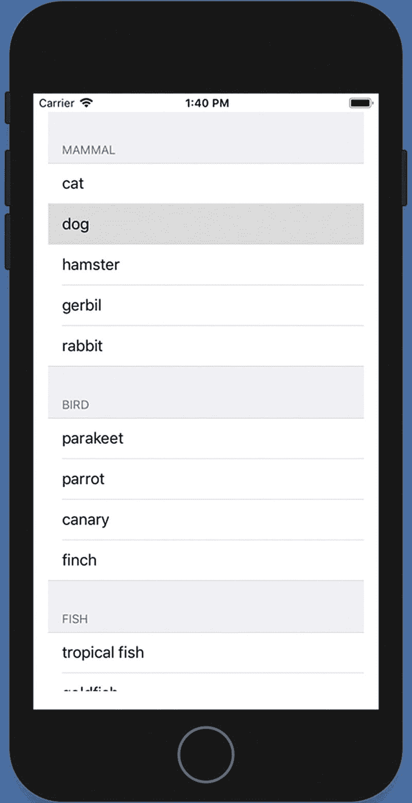

*图 14-12* 分组表视图

13. 点击表视图中的某个项目。将出现一个警告控制器来标识您的选择。

14. 点击`OK`关闭警告控制器。

15. 选择`Simulator` ➤ `Quit Simulator`以返回 Xcode。

### 显示索引

当表视图显示大量数据时，用户从一个末端滚动表视图列表到另一个末端可能会很繁琐。为了解决这个问题，表视图可以显示一个索引，该索引出现在屏幕的最右侧。现在用户可以点击索引中的某个项目以立即跳转到特定的分区。
```


#### 注意

只有当表格视图样式为 Plain（普通）而非 Grouped（分组）时，表格视图才能显示索引。

索引通常由 A 到 Z 的字母组成，但也可以包含任何字符，包括表情符号。每个索引项的位置对应每个分区。因此，索引中显示的第一项会将用户带到第一个分区，第二项带到第二个分区，以此类推。

要了解如何创建索引，请按以下步骤操作：

1.  使用单视图应用模板创建一个新的 iOS 项目（参见第 1 章），并将这个新项目命名为 `TableViewIndexApp`。这会为用户界面创建一个单视图。

2.  在导航窗格中点击 `Main.storyboard` 文件。Xcode 会显示这个单视图。

3.  点击库图标以打开对象库窗口。

4.  将一个表格视图拖放到视图的任意位置（参见图 14-2）。

5.  调整表格视图的大小，使其填满整个屏幕。

6.  选择**编辑器** ➤ **解决自动布局问题** ➤ **重置为建议的约束**。Xcode 会为表格视图添加约束（参见图 14-3）。

7.  选择**视图** ➤ **检查器** ➤ **显示属性检查器**，或点击 Xcode 窗口右上角的**属性检查器**图标。

8.  选择**视图** ➤ **助理编辑器** ➤ **显示助理编辑器**，或点击 Xcode 窗口右上角的**助理编辑器**图标。

9.  将鼠标指针移到表格视图上，按住 **Control** 键，然后按住 Ctrl 键拖拽到 `ViewController.swift` 文件中 `class ViewController` 行的下方。

10. 松开 **Control** 键和鼠标左键。会弹出一个窗口。

11. 点击 **名称** 文本框，输入 `petTable`，然后点击 **连接** 按钮。Xcode 会创建一个 `IBOutlet`，如下所示：

```
@IBOutlet var petTable: UITableView!
```

12. 选择**视图** ➤ **标准编辑器** ➤ **显示标准编辑器**，或点击 Xcode 窗口右上角的**标准编辑器**图标。

13. 在导航窗格中点击 `ViewController.swift` 文件。

14. 修改 `class ViewController` 这一行，添加 `UITableViewDelegate, UITableViewDataSource`，如下所示：

```
class ViewController: UIViewController, UITableViewDelegate, UITableViewDataSource {
```

此代码的目的是将 `ViewController.swift` 文件标识为表格视图的委托和数据源。

15. 在 `class ViewController` 行下方，添加以下数组：

```
let petArray = [["Bird", "parakeet", "parrot", "canary", "finch", "cockatiel"], ["Fish", "tropical fish", "goldfish", "sea horses", "eel"], ["Mammal", "cat", "dog", "hamster", "gerbil", "rabbit", "mouse"], ["Reptile", "turtle", "snake", "lizard"]]
```

这个 `petArray` 包含多个字符串数组，每个字符串数组代表一个不同的分区。每个字符串数组中的第一项代表该分区的分区头。

16. 在 `petArray` 下方，添加第二个数组：

```
let indexArray = ["B", "F", "M", "R"]
```

这个 `indexArray` 中的每一项代表一个分区。由于 `petArray` 包含四个分区，因此 `indexArray` 也包含四个项。虽然你可以使用普通的字母，但也可以添加表情符号。要将表情符号插入代码中，请选择**编辑** ➤ **表情与符号**以打开字符查看器。

然后点击**表情符号** ➤ **动物与自然**，如图 14-13 所示。现在将光标移到你想插入表情符号的位置，然后双击该表情符号即可将其放入代码中。分别点击一个鸟、鱼、哺乳动物和爬行动物的表情符号。

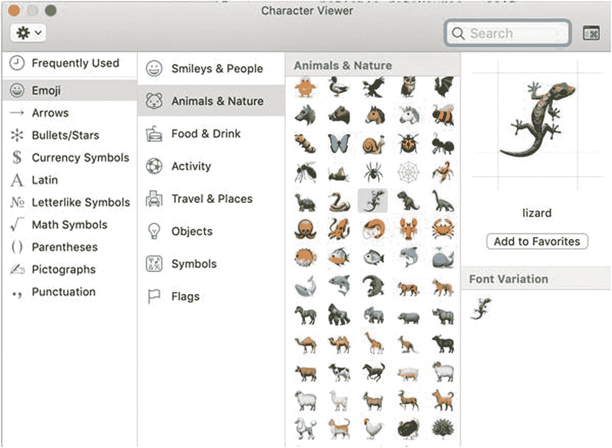

图 14-13 — 用于将表情符号插入代码的字符查看器窗口

17. 在 `indexArray` 下方添加以下行：

```
let cellID = "cellID"
```

18. 修改 `viewDidLoad` 方法，如下所示：

```
override func viewDidLoad() {
    super.viewDidLoad()
    petTable.dataSource = self
    petTable.delegate = self
    petTable.sectionIndexColor = UIColor.white
    petTable.sectionIndexBackgroundColor = UIColor.black
    petTable.sectionIndexTrackingBackgroundColor = UIColor.darkGray
    // Do any additional setup after loading the view, typically from a nib.
}
```

`sectioIndexColor`、`sectioIndexBackgroundColor` 和 `sectioIndexTrackingBackgroundColor` 通过在黑色背景上显示白色文本，使索引更易识别。

19. 在 `viewDidLoad` 方法下方，添加以下函数来定义每个分区显示的行数，减去 1 以考虑到每个分区开头的分区头：

```
func tableView(_ tableView: UITableView, numberOfRowsInSection section: Int) -> Int {
    return petArray[section].count - 1
}
```

20. 在上一个函数下方，添加以下函数以使用 `petArray` 中的数据填充表格视图：

```
func tableView(_ tableView: UITableView, cellForRowAt indexPath: IndexPath) -> UITableViewCell {
    var cell = tableView.dequeueReusableCell(withIdentifier: cellID)
    if (cell == nil) {
        cell = UITableViewCell(
            style: UITableViewCell.CellStyle.default,
            reuseIdentifier: cellID)
    }
    cell?.textLabel?.text = petArray[indexPath.section][indexPath.row + 1]
    return cell!
}
```

21. 在上一个函数下方，添加以下函数以显示用户从表格视图选择的项目：

```
func tableView(_ tableView: UITableView, didSelectRowAt indexPath: IndexPath) {
    let selectedItem = petArray[indexPath.section][indexPath.row + 1]
    let alert = UIAlertController(title: "Your Choice", message: "\(selectedItem)", preferredStyle: .alert)
    let okAction = UIAlertAction(title: "OK", style: .default, handler: { action -> Void in
        //Just dismiss the action sheet
    })
    alert.addAction(okAction)
    self.present(alert, animated: true, completion: nil)
}
```

22. 在上一个函数下方，添加以下函数以定义表格视图中的分区数量：

```
func numberOfSections(in tableView: UITableView) -> Int {
    return petArray.count
}
```

23. 在上一个函数下方，添加以下函数以定义每个分区的分区头，即每个字符串数组中的第一项：

```
func tableView(_ tableView: UITableView, titleForHeaderInSection section: Int) -> String? {
    return petArray[section][0]
}
```

24. 在上一个函数下方，添加以下函数以定义显示在表格视图右侧的索引：

```
func sectionIndexTitles (for tableView: UITableView) -> [String]? {
    return indexArray
}
```

完整的 `ViewController.swift` 文件应如下所示：

```
import UIKit

class ViewController: UIViewController, UITableViewDelegate, UITableViewDataSource {
    @IBOutlet var petTable: UITableView!

    let petArray = [["Bird", "parakeet", "parrot", "canary", "finch", "cockatiel"],
                    ["Fish", "tropical fish", "goldfish", "sea horses", "eel"],
                    ["Mammal", "cat", "dog", "hamster", "gerbil", "rabbit", "mouse"],
                    ["Reptile", "turtle", "snake", "lizard"]]

    let indexArray = ["B", "F", "M", "R"]
    let cellID = "cellID"

    override func viewDidLoad() {
        super.viewDidLoad()
        petTable.dataSource = self
        petTable.delegate = self
        petTable.sectionIndexColor = UIColor.white
        petTable.sectionIndexBackgroundColor = UIColor.black
        petTable.sectionIndexTrackingBackgroundColor = UIColor.darkGray
        // Do any additional setup after loading the view, typically from a nib.
    }

    func tableView(_ tableView: UITableView, numberOfRowsInSection section: Int) -> Int {
        return petArray[section].count - 1
    }

    func tableView(_ tableView: UITableView, cellForRowAt indexPath: IndexPath) -> UITableViewCell {
        var cell = tableView.dequeueReusableCell(withIdentifier: cellID)
        if (cell == nil) {
            cell = UITableViewCell(
                style: UITableViewCell.CellStyle.default,
                reuseIdentifier: cellID)
        }
        cell?.textLabel?.text = petArray[indexPath.section][indexPath.row + 1]
        return cell!
    }

    func tableView(_ tableView: UITableView, didSelectRowAt indexPath: IndexPath) {
        let selectedItem = petArray[indexPath.section][indexPath.row + 1]
        let alert = UIAlertController(title: "Your Choice", message: "\(selectedItem)", preferredStyle: .alert)
        let okAction = UIAlertAction(title: "OK", style: .default, handler: { action -> Void in
            //Just dismiss the action sheet
        })
        alert.addAction(okAction)
        self.present(alert, animated: true, completion: nil)
    }

    func numberOfSections(in tableView: UITableView) -> Int {
        return petArray.count
    }

    func tableView(_ tableView: UITableView, titleForHeaderInSection section: Int) -> String? {
        return petArray[section][0]
    }

    func sectionIndexTitles (for tableView: UITableView) -> [String]? {
        return indexArray
    }
}
```


```
let cellID = "cellID"
override func viewDidLoad() {
    super.viewDidLoad()
    petTable.dataSource = self
    petTable.delegate = self
    petTable.sectionIndexColor = UIColor.white
    petTable.sectionIndexBackgroundColor = UIColor.black
    petTable.sectionIndexTrackingBackgroundColor = UIColor.darkGray
    // Do any additional setup after loading the view, typically from a nib.
}
func tableView(_ tableView: UITableView, numberOfRowsInSection section: Int) -> Int {
    return petArray[section].count - 1
}
func tableView(_ tableView: UITableView, cellForRowAt indexPath: IndexPath) -> UITableViewCell {
    var cell = tableView.dequeueReusableCell(withIdentifier: cellID)
    if (cell == nil) {
        cell = UITableViewCell(
            style: UITableViewCell.CellStyle.default,
            reuseIdentifier: cellID)
    }
    cell?.textLabel?.text = petArray[indexPath.section][indexPath.row + 1]
    return cell!
}
func tableView(_ tableView: UITableView, didSelectRowAt indexPath: IndexPath) {
    let selectedItem = petArray[indexPath.section][indexPath.row + 1]
    let alert = UIAlertController(title: "Your Choice", message: "\(selectedItem)", preferredStyle: .alert)
    let okAction = UIAlertAction(title: "OK", style: .default, handler: { action -> Void in
        //Just dismiss the action sheet
    })
    alert.addAction(okAction)
    self.present(alert, animated: true, completion: nil)
}
func numberOfSections(in tableView: UITableView) -> Int {
    return petArray.count
}
func tableView(_ tableView: UITableView, titleForHeaderInSection section: Int) -> String? {
    return petArray[section][0]
}
func sectionIndexTitles(for tableView: UITableView) -> [String]? {
    return indexArray
}
```

8. 点击 **运行** (Run) 按钮或选择 **产品** ➤ **运行** (Product ➤ Run)。模拟器窗口出现，表格视图中显示分组数据，如图 14-14 所示。

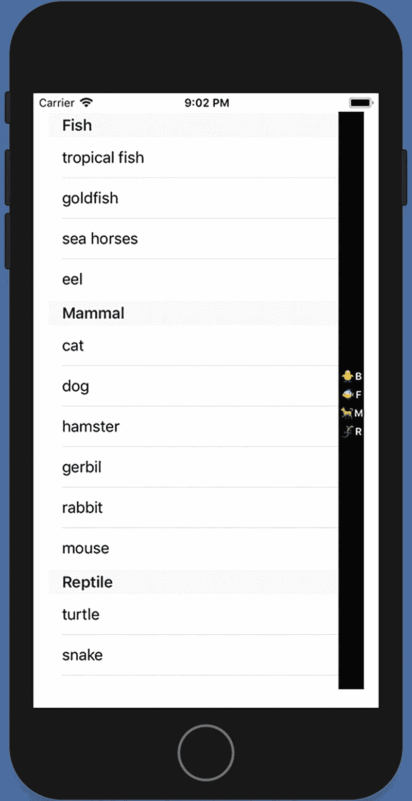

图 14-14

在表格视图的最右侧出现一个索引

9. 点击 `R` 索引项。注意，由于字母 `R` 是索引中的第四项，表格视图会跳转到第四部分。

10. 点击 `B` 索引项。注意，由于字母 `B` 是索引中的第一项，表格视图会跳转到第一部分。

11. 点击另外两个索引条目（`F` 和 `M`），查看表格视图如何跳转到各个部分。

12. 选择 **模拟器** ➤ **退出模拟器** (Simulator ➤ Quit Simulator) 以返回 `Xcode`。

## 使用表格视图控制器

在本章中，我们一直使用的是**单视图应用** (Single View App) 项目，并从对象库窗口中添加了一个**表视图** (table view)。创建表格视图的第二种方法是在故事板中添加一个表格视图控制器。表视图和表格视图控制器之间的主要区别在于，表格视图控制器包含以下部分：

* 一个视图控制器
* 该视图控制器上的一个表视图
* 表视图上的一个表格视图单元格

要了解如何使用表格视图控制器，请遵循以下步骤：

1. 使用**单视图应用** (Single View App) 模板创建一个新的 iOS 项目（参见第 1 章），并将此新项目命名为 `TableViewControllerApp`。这会为用户界面创建一个单视图。

2. 在导航面板中点击 `Main.storyboard` 文件。Xcode 会显示每个单视图应用项目自动附带的单视图。

3. 在文档大纲中点击**视图控制器场景** (View Controller Scene)，如图 14-15 所示。

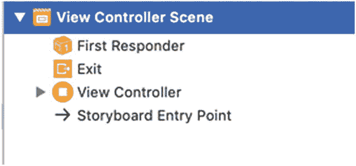

图 14-15

选中一个视图控制器

4. 按 **退格键** (BACKSPACE) 或 **删除键** (DELETE) 从故事板中删除该视图控制器。Xcode 会从故事板中移除选中的视图控制器。

5. 在导航面板中点击 `ViewController.swift` 文件。这个 `.swift` 文件之前是连接到我们刚删除的那个视图控制器的，所以我们不再需要它了。

6. 按 **退格键** (BACKSPACE) 或 **删除键** (DELETE) 删除 `ViewController.swift` 文件。此时会弹出一个对话框，询问您是移除文件的引用还是将其移到废纸篓，如图 14-16 所示。

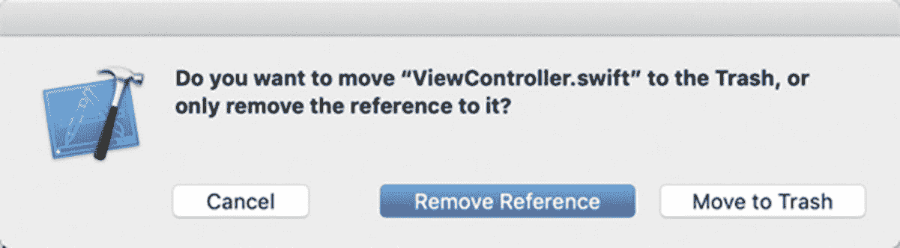

图 14-16

删除 `.swift` 文件时提供选项

7. 点击 **移到废纸篓** (Move to Trash)。Xcode 会删除 `ViewController.swift` 文件。

8. 点击 **库** (Library) 图标打开**对象库** (Object Library) 窗口，查找黄色的**表格视图控制器**图标，如图 14-17 所示。

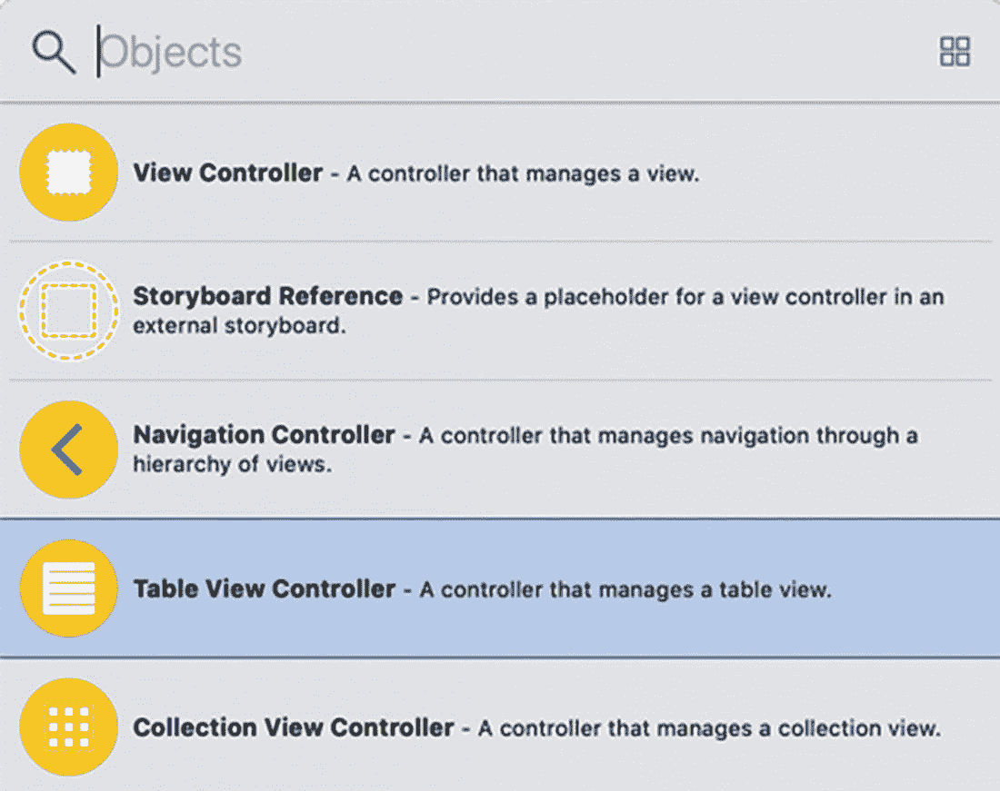

图 14-17

对象库窗口中的表格视图控制器

9. 将**表格视图控制器**从对象库窗口拖拽到空白的故事板上。Xcode 会显示该表格视图控制器，如图 14-18 所示。

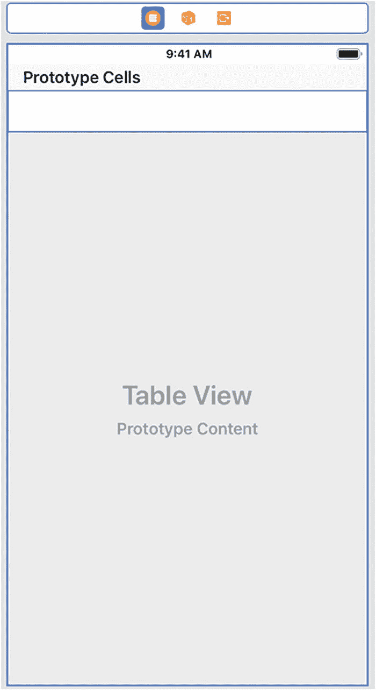

图 14-18

故事板中的表格视图控制器

10. 选择 **视图** ➤ **检查器** ➤ **显示属性检查器** (View ➤ Inspectors ➤ Show Attributes Inspector)，或者点击 Xcode 窗口右上角的**属性检查器** (Attributes Inspector) 图标。

11. 选中 **是初始视图控制器** (Is Initial View Controller) 复选框，如图 14-19 所示。注意，选中此复选框后，表格视图控制器的左侧会出现一个箭头。

**注意** **只有一个**视图控制器可以被指定为初始视图控制器。初始视图控制器定义了应用运行时会出现的第一个视图控制器。

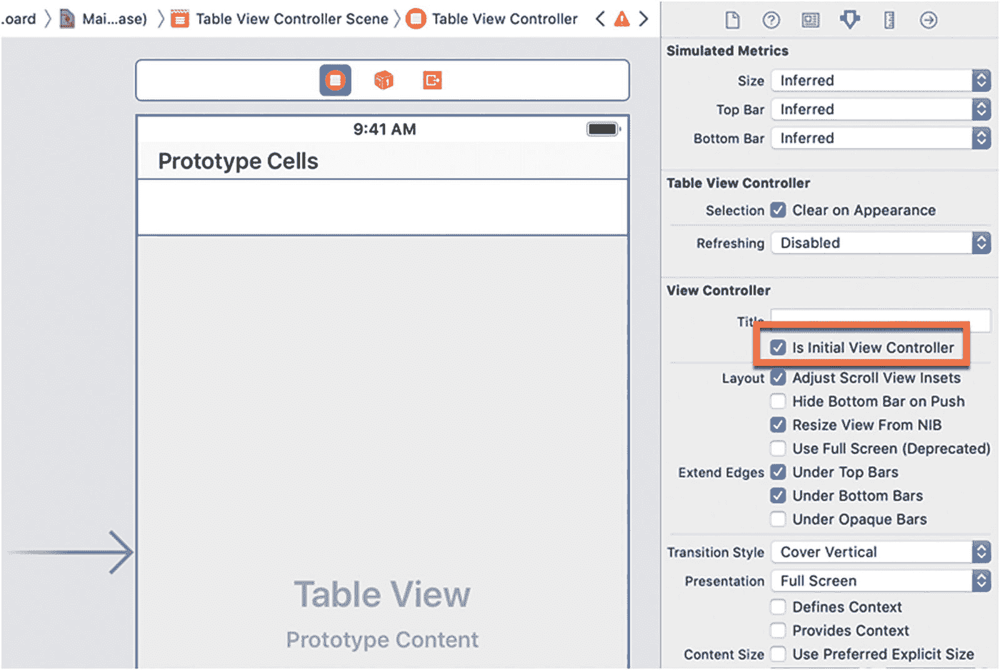

图 14-19

“是初始视图控制器”复选框

现在故事板中有了一个表格视图控制器，我们需要将其连接到一个 `.swift` 文件。这涉及两步过程：首先创建一个 `.swift` 文件，然后将它连接到表格视图控制器。

1. 选择 **文件** ➤ **新建** ➤ **文件** (File ➤ New ➤ File)。此时会弹出一个模板对话框，如图 14-20 所示。

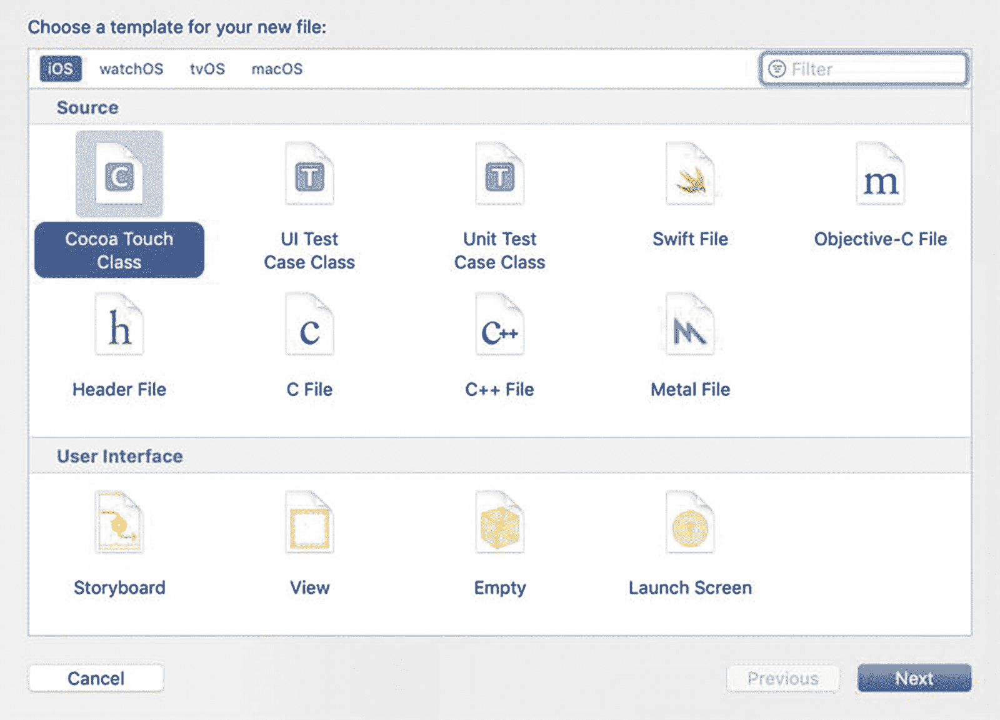

图 14-20

文件模板对话框


2.  点击 `Cocoa Touch Class`，然后点击**Next**按钮。此时会出现另一个对话框。

3.  点击 `Class` 文本字段，删除现有文本，并输入 `TableViewController`。（该类名可任意指定。）

4.  点击 `Subclass of` 文本字段，选择 `UITableViewController`，如图 14-21 所示。然后点击**Next**按钮。

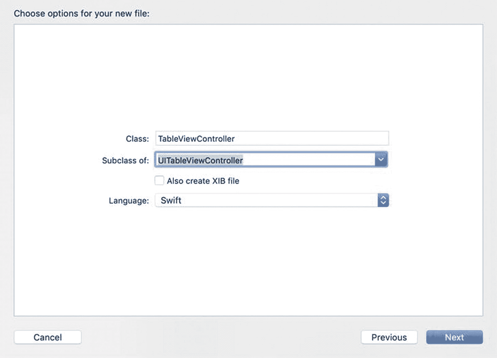

图 14-21  
命名 `.swift` 文件并定义其子类

5.  会出现另一个对话框询问你将该 `.swift` 文件存储在哪里。点击**Create**按钮。Xcode 会创建 `TableViewController.swift` 文件。下一步是将此 `.swift` 文件连接到 Table View Controller。

6.  在导航窗格中点击 `Main.storyboard` 文件。

7.  点击文档大纲中的“Table View Controller Scene”（表格视图控制器场景），或点击故事板中表格视图控制器上方的“Table View Controller”（表格视图控制器）图标。

8.  选择 `View` ➤ `Inspectors` ➤ `Show Identity Inspector`，或者点击 Xcode 窗口右上角的“Identity Inspector”（身份检查器）图标。

9.  点击 `Class` 弹出菜单，选择 `TableViewController`（或你在步骤 14 中给 `.swift` 文件起的任何名称），如图 14-22 所示。将 `.swift` 文件连接到视图控制器后，你现在可以创建用于处理表格视图控制器的 `IBOutlets`、`IBAction` 方法和 Swift 代码。

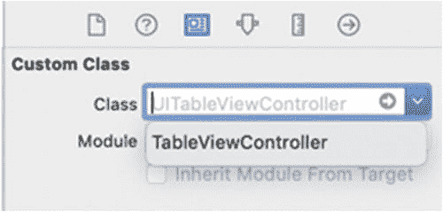

图 14-22  
将 `.swift` 文件连接到 Table View Controller

10. 在文档大纲中点击“Table View Cell”（表格视图单元格）。（你可能需要点击灰色的展开三角才能找到表格视图单元格。）

11. 选择 `View` ➤ `Inspectors` ➤ `Show Attributes Inspector`，或者点击 Xcode 窗口右上角的“Attributes Inspector”（属性检查器）图标。

12. 点击 `Identifier` 文本字段，输入 `cellID`，如图 14-23 所示。（该名称可任意指定。）然后按 ENTER 键。

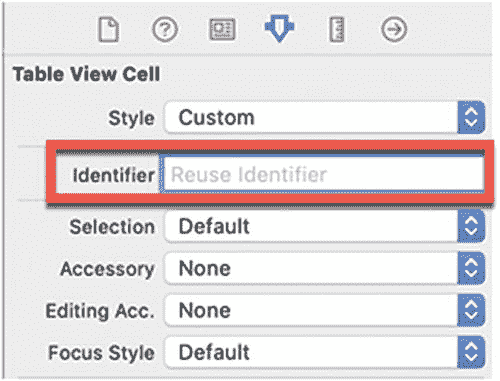

图 14-23  
为 Table View Cell 定义标识符

13. 在导航窗格中点击 `TableViewController.swift` 文件。

14. 在 `class TableViewController` 行下方添加如下代码：

```
let petArray = ["cat", "dog", "parakeet", "parrot", "canary", "finch", "tropical fish", "goldfish", "sea horses", "hamster", "gerbil", "rabbit", "turtle", "snake", "lizard", "hermit crab"]
```

15. 按如下方式编辑 `numberOfSections` 函数：

```
override func numberOfSections(in tableView: UITableView) -> Int {
    return 1
}
```

16. 按如下方式编辑 `numberOfRowsInSection` 函数：

```
override func tableView(_ tableView: UITableView, numberOfRowsInSection section: Int) -> Int {
    return petArray.count
}
```

17. 添加以下 `cellForRowAt` 函数以将数据存储到表格视图单元格中：

```
override func tableView(_ tableView: UITableView, cellForRowAt indexPath: IndexPath) -> UITableViewCell {
    let cell = tableView.dequeueReusableCell(withIdentifier: "cellID")
    cell?.textLabel?.text = petArray[indexPath.row]
    return cell!
}
```

18. 添加以下 `didSelectRowAt` 函数以识别用户选择了哪一项：

```
override func tableView(_ tableView: UITableView, didSelectRowAt indexPath: IndexPath) {
    let selectedItem = petArray[indexPath.row]
    let alert = UIAlertController(title: "Your Choice", message: "\(selectedItem)", preferredStyle: .alert)
    let okAction = UIAlertAction(title: "OK", style: .default, handler: { action -> Void in
        //Just dismiss the action sheet
    })
    alert.addAction(okAction)
    self.present(alert, animated: true, completion: nil)
}
```

19. 在导航窗格中点击 `Main.storyboard` 文件。

20. 点击“Run”（运行）按钮，或选择 `Product` ➤ `Run`。模拟器窗口会打开，并在你的表格视图中显示数据（见图 14-4）。

21. 点击表格视图中的某一项。会弹出一个警告控制器来标识你的选择（见图 14-9）。

22. 点击 OK 以关闭警告控制器。

23. 选择 `Simulator` ➤ `Quit Simulator` 以返回 Xcode。

## 总结

表格视图显示可供用户选择的数据行。表格视图需要一个数据源以及用于定义显示行数的函数。一个简单的表格视图只显示一个分区，但表格视图也可以显示多个分区，每个分区包含不同数量的行。

表格视图中的每一行都由一个单元格定义。你可以使用 Swift 代码定义单元格，也可以通过将表格视图单元格拖放到表格视图上来以可视方式定义。你必须为该单元格指定一个标识名称，这样你的 Swift 代码才能引用此单元格以在其中存储数据。

使用 Table View Controller 时，你需要将其连接到自己的 `.swift` 文件，你可以定义该文件以使其代表一个 `UITableViewController`。这样就无需将 `.swift` 文件声明为表格视图的委托和数据源。

表格视图和 Table View Controller 的主要区别在于，表格视图出现在现有视图上，而 Table View Controller 则出现在故事板中。

# 15. 自定义表格视图单元格

第 14 章介绍了如何创建不同类型的表格视图，包括普通表格和分组表格以及分区索引。到目前为止，我们只使用了显示单行文本的简单单元格。在本章中，你将学习如何自定义单元格以显示额外的文本和图像。此外，你还将学习如何修改单元格的外观。

表格视图中的单元格可以显示如图 15-1 所示的内容：

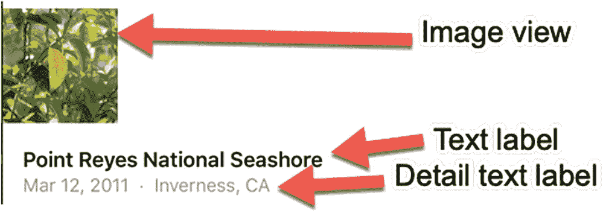

图 15-1  
表格视图单元格的组成部分

*   `textLabel` – 定义单元格中显示的主要文本
*   `detailTextLabel` – 定义次要文本，其字体大小小于 `textLabel` 文本
*   `imageView` – 定义单元格中显示的图像

## 在 Swift 中自定义表格视图单元格

表格视图单元格可以有不同的样式，这些样式定义了文本、详细文本和图像如何显示。四种不同的单元格样式类型如图 15-2 所示：

*   `.default` – 显示文本标签，但不显示详细文本标签。图像视图可以显示在左侧。
*   `.value1` – 在左侧显示文本标签，在右侧显示详细文本标签。图像视图可以显示在左侧。
*   `.value2` – 在左侧以蓝色缩进显示文本标签，在右侧以缩进显示详细文本标签。不显示图像视图。
*   `.subtitle` – 在左侧显示文本标签，在其下方以较小字体显示详细文本标签。图像视图可以显示在左侧。

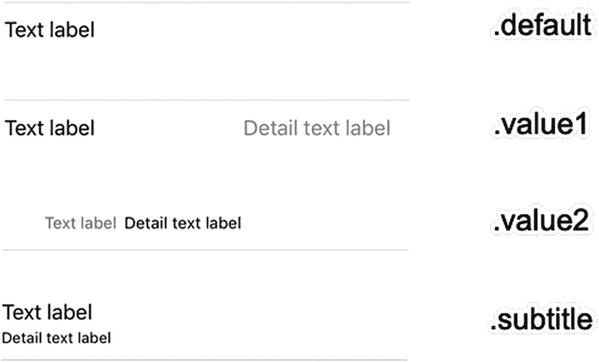

图 15-2  
单元格的四种不同样式


好的，作为一名高级文档工程师和翻译员，我将严格遵守您提供的注意事项和示例格式，将给定的英文文本翻译成中文。

---


#### 注意

`.default` 单元格样式是唯一不允许显示详细文本标签的样式。`.value2` 单元格样式是唯一不允许显示图像视图的样式。

在创建可以显示图像的表格视图之前，我们需要一些图像。一些免费的、公共领域的图片来源包括：

-   icons8.com
-   iconarchive.com
-   aiconica.net

对于本例，我们需要四个不同的图像，最好是相同大小和文件格式，例如 `.png` 或 `.jpg`。每个图像的具体名称无关紧要，但我们需要能够识别每个图像。

在本例中，我们将在表格视图中显示四个项目。为简化问题，我们将使用三个包含四个项目的不同数组，一个用于文本标签，一个用于详细文本标签，一个用于图像视图。在实际应用中，您可能希望使用单一数据结构（如字典）来将相关数据放在一起。

在表格视图单元格中显示文本涉及将表格视图单元格的 `textLabel.text` 和 `detailTextLabel.text` 属性分配给一个字符串，例如：

```swift
cell?.textLabel?.text = "String or string variable"
cell?.detailTextLabel?.text = "String or string variable"
```

在表格视图单元格中显示图像涉及将图像文件名分配给图像视图的 `Image` 属性，例如：

```swift
cell?.imageView?.image = UIImage(named: "Image file name")
```

要了解如何创建并用文本、详细文本和图像填充表格视图，请遵循以下步骤：

1.  使用单视图应用模板创建一个新的 iOS 项目（见第 1 章），并将这个新项目命名为 `TableCellApp`。这会为用户界面创建一个单一视图。

2.  在导航窗格中点击 `Main.storyboard` 文件。Xcode 会显示该单一视图。

3.  点击库图标以打开对象库窗口。

4.  将一个表格视图拖放到视图上。

5.  调整表格视图的大小，使其填满整个屏幕。

6.  选择 **Editor > Resolve Auto Layout Issues > Reset to Suggested Constraints**。Xcode 会为表格视图添加约束。

7.  选择 **View > Assistant Editor > Show Assistant Editor**，或点击 Xcode 窗口右上角的 Assistant Editor 图标。

8.  将鼠标指针移到表格视图上，按住 **Control** 键，然后在 `ViewController.swift` 文件中的 `class ViewController` 行下方进行 Ctrl-拖拽。

9.  松开 **Control** 键和鼠标左键。会弹出一个窗口。

10. 点击名称文本字段，输入 `tableData`，然后点击连接按钮。Xcode 会创建一个 `IBOutlet`，如下所示：

```swift
@IBOutlet var tableData: UITableView!
```

11. 选择 **View > Standard Editor > Show Standard Editor**，或点击 Xcode 窗口右上角的 Standard Editor 图标。

12. 在导航窗格中点击 `ViewController.swift` 文件。

13. 通过添加 `UITableViewDelegate`, `UITableViewDataSource` 来修改 `class ViewController` 行，如下所示：

```swift
class ViewController: UIViewController, UITableViewDelegate, UITableViewDataSource {
```

此代码的目的是将 `ViewController.swift` 文件标识为表格视图的委托和数据源。

14. 将四个图像拖放到导航窗格中，如图 15-3 所示。会弹出一个对话框，询问如何将文件添加到项目中。

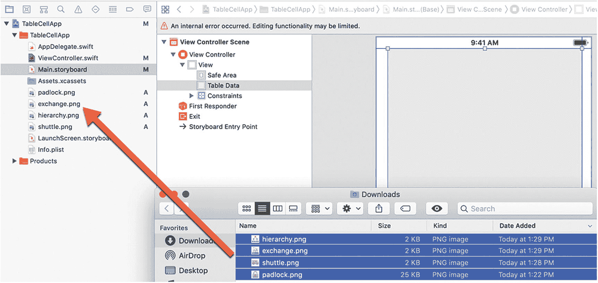

图 15-3：将图像文件拖放到导航窗格

15. 点击完成按钮。记下所有图像文件的确切名称。

16. 在 `class ViewController` 行下方，添加以下三个数组以用四行数据填充表格视图：

```swift
let mainArray = ["Shuttle bus", "Hierarchy", "Exchange", "Padlock"]
let detailArray = ["6am - 10pm", "Acme corporation", "Ideas worth sharing", "Access denied"]
let imageArray = ["shuttle.png", "hierarchy.png", "exchange.png", "padlock.png"]
```

对于 `imageArray`，请将这些文件名替换为您在第 14 步中拖放到导航窗格中的图像文件的名称。

17. 在此数组下方，添加以下代码行：

```swift
let cellID = "cellID"
```

此代码的目的是为单元格创建一个任意的常量名称。表格视图由一行行单元格组成，因此我们需要标识这些单元格以便稍后存储数据。

18. 修改 `viewDidLoad` 方法，如下所示：

```swift
override func viewDidLoad() {
    super.viewDidLoad()
    tableData.delegate = self
    tableData.dataSource = self
    // Do any additional setup after loading the view, typically from a nib.
}
```

19. 在 `viewDidLoad` 方法下方添加以下函数：

```swift
func tableView(_ tableView: UITableView, numberOfRowsInSection section: Int) -> Int {
    return mainArray.count
}
```

20. 在 `viewDidLoad` 方法下方添加以下函数：

```swift
func tableView(_ tableView: UITableView, cellForRowAt indexPath: IndexPath) -> UITableViewCell {
    var cell = tableView.dequeueReusableCell(withIdentifier: cellID)
    if (cell == nil) {
        cell = UITableViewCell(
            style: UITableViewCell.CellStyle.subtitle,
            reuseIdentifier: cellID)
    }
    cell?.textLabel?.text = mainArray[indexPath.row]
    cell?.detailTextLabel?.text = detailArray[indexPath.row]
    cell?.imageView?.image = UIImage(named: imageArray[indexPath.row])
    return cell!
}
```

该函数将数组中的数据存储到表格视图中。由于表格视图中的每一行都由一个单元格定义，因此需要创建一个带有名称的单元格：

```swift
var cell = tableView.dequeueReusableCell(withIdentifier: cellID)
```

如果单元格为空，则 `if` 语句会定义单元格的样式，并为其指定一个任意的 `cellID` 名称以便识别，并将单元格样式定义为 `.subtitle`（您可以随意将其更改为 `.default` 或 `.value1`）：

```swift
if (cell == nil) {
    cell = UITableViewCell(
        style: UITableViewCell.CellStyle.subtitle,
        reuseIdentifier: cellID)
}
```

接着，它从 `mainArray` 中获取数据以存储在文本标签中，从 `detailArray` 中获取数据以存储在详细文本标签中，并从 `imageArray` 中获取数据以确定将哪个图像放入图像视图：

```swift
cell?.textLabel?.text = mainArray[indexPath.row]
cell?.detailTextLabel?.text = detailArray[indexPath.row]
cell?.imageView?.image = UIImage(named: imageArray[indexPath.row])
```

21. 在 `viewDidLoad` 方法下方添加以下函数，以检测用户选择了哪个项目：

```swift
func tableView(_ tableView: UITableView, didSelectRowAt indexPath: IndexPath) {
    let selectedItem = mainArray[indexPath.row]
    let alert = UIAlertController(title: "Your Choice", message: "\(selectedItem)", preferredStyle: .alert)
    let okAction = UIAlertAction(title: "OK", style: .default, handler: { action -> Void in
        //Just dismiss the action sheet
    })
    alert.addAction(okAction)
    self.present(alert, animated: true, completion: nil)
}
```

完整的 `ViewController.swift` 文件应如下所示。


```swift
import UIKit
class ViewController: UIViewController, UITableViewDelegate, UITableViewDataSource {
    @IBOutlet var tableData: UITableView!
    let mainArray = ["Shuttle bus", "Hierarchy", "Exchange", "Padlock"]
    let detailArray = ["6am - 10pm", "Acme corporation", "Ideas worth sharing", "Access denied"]
    let imageArray = ["shuttle.png", "hierarchy.png", "exchange.png", "padlock.png"]
    let cellID = "cellID"
    override func viewDidLoad() {
        super.viewDidLoad()
        tableData.delegate = self
        tableData.dataSource = self
        // 在此处执行任何额外的设置，通常是从 nib 加载后执行。
    }
    func tableView(_ tableView: UITableView, numberOfRowsInSection section: Int) -> Int {
        return mainArray.count
    }
    func tableView(_ tableView: UITableView, cellForRowAt indexPath: IndexPath) -> UITableViewCell {
        var cell = tableView.dequeueReusableCell(withIdentifier: cellID)
        if (cell == nil) {
            cell = UITableViewCell(
                style: UITableViewCell.CellStyle.subtitle,
                reuseIdentifier: cellID)
        }
        cell?.textLabel?.text = mainArray[indexPath.row]
        cell?.detailTextLabel?.text = detailArray[indexPath.row]
        cell?.imageView?.image = UIImage(named: imageArray[indexPath.row])
        return cell!
    }
    func tableView(_ tableView: UITableView, didSelectRowAt indexPath: IndexPath) {
        let selectedItem = mainArray[indexPath.row]
        let alert = UIAlertController(title: "您的选择", message: "\(selectedItem)", preferredStyle: .alert)
        let okAction = UIAlertAction(title: "确定", style: .default, handler: { action -> Void in
            // 仅关闭操作表
        })
        alert.addAction(okAction)
        self.present(alert, animated: true, completion: nil)
    }
}
```

22. 点击运行按钮或者选择**产品（Product）** ➤ **运行（Run）**。模拟器窗口将出现，显示表格视图中的数据，如图 15-4 所示。

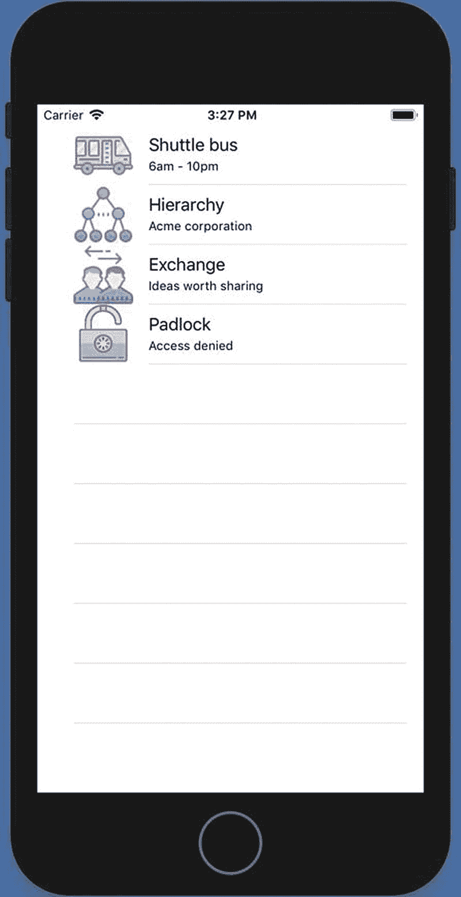

图 15-4

显示文本标签、详细文本标签和图像视图的表格视图

23. 点击某一项，会看到一个提示控制器显示您所选的项。然后点击**确定**以关闭提示控制器。

24. 选择**模拟器（Simulator）** ➤ **退出模拟器（Quit Simulator）** 返回 Xcode。

尝试使用不同的单元格样式，例如 `.default`、`.value1`、`.value2` 和 `.subtitle`，看看它们如何改变表格视图的外观。请注意，如果将单元格样式更改为 `.value2`，图像视图将不会显示。

## 设计自定义表格视图单元格

通过更改表格视图单元格样式，我们可以改变表格视图中每一行显示文本、详细文本和图像的方式。为了获得更大的灵活性，我们还可以通过从对象库窗口拖放对象到表格视图单元格上来设计自定义的表格视图单元格。

您不仅可以在自定义单元格中定义标签的位置，还可以自定义标签中文字的字体和字号大小。要了解如何创建自定义的表格视图单元格，请按照以下步骤操作：

1. 使用单视图应用模板创建一个新的 iOS 项目（参见第 1 章），并将这个新项目命名为 `TableViewCellVisualApp`。这将为用户界面创建一个单视图。

2. 在导航窗格中点击 `Main.storyboard` 文件。Xcode 将显示该单视图。

3. 点击库图标以打开对象库窗口。

4. 将表格视图拖放到视图的任意位置。

5. 调整表格视图的大小，使其填满整个屏幕。

6. 选择**编辑器（Editor）** ➤ **解决自动布局问题（Resolve Auto Layout Issues）** ➤ **重置为建议的约束（Reset to Suggested Constraints）**。Xcode 将为表格视图添加约束。

7. 点击库图标以打开对象库窗口。

8. 将一个表格视图单元格（如图 15-5 所示）拖放到表格视图上。

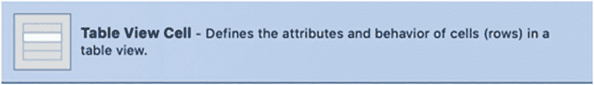

图 15-5

对象库窗口中的表格视图单元格

9. 点击库图标以打开对象库窗口，并将一个图像视图拖放到表格视图单元格的最左侧。

10. 点击库图标以打开对象库窗口，并将两个标签拖放到表格视图单元格上。

11. 将一个标签移动到图像视图的右上角。

12. 将第二个标签移动到第一个标签的下方，并向右缩进。

13. 点击第二个标签，然后选择**视图（View）** ➤ **检查器（Inspectors）** ➤ **属性检查器（Attributes Inspector）**，或者点击 Xcode 窗口右上角的属性检查器图标。

14. 点击字体文本字段中的方形 T 图标，将弹出一个窗口。

15. 点击**系列（Family）**弹出菜单，并选择 **Courier New**。

16. 在**大小（Size）**文本字段中点击并输入 12，如图 15-6 所示。整个表格视图单元格的外观应类似于图 15-7。

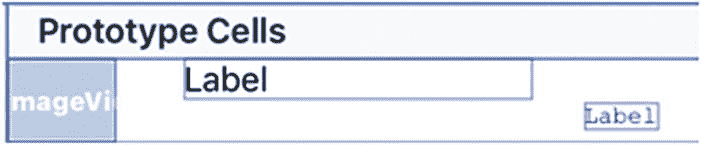

图 15-7

表格视图单元格上两个标签和一个图像视图的设计

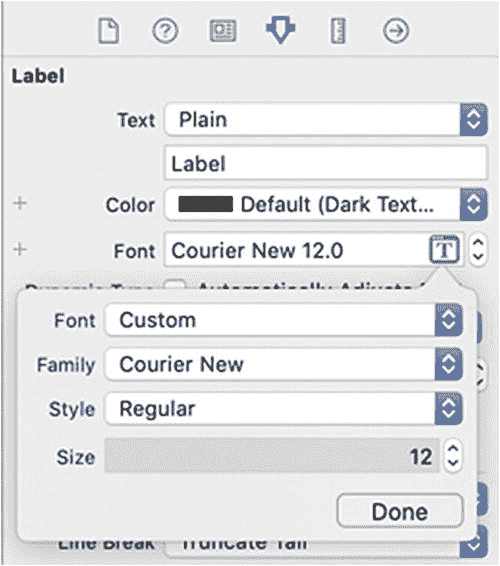

图 15-6

为表格视图单元格自定义标签中的文本

17. 在文档大纲中点击表格视图单元格，然后选择**视图（View）** ➤ **检查器（Inspectors）** ➤ **显示属性检查器（Show Attributes Inspector）**，或者点击 Xcode 窗口右上角的属性检查器图标。

18. 在**标识符（Identifier）**文本字段中点击，输入 `customCell`，然后按回车键，如图 15-8 所示。

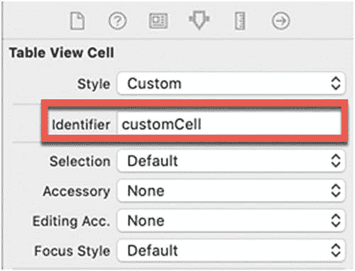

图 15-8

更改表格视图单元格的标识符

19. 选择**文件（File）** ➤ **新建（New）** ➤ **文件（File）**。将出现一个模板窗口。

20. 选择 **Cocoa Touch 类（Cocoa Touch Class）**，然后点击**下一步（Next）**按钮。将出现另一个对话框，要求您输入文件的名称和子类。

21. 在**类（Class）**文本字段中点击并输入 `TableViewCell`。

22. 在**子类于（Subclass of）**弹出菜单中点击，然后选择 `UITableViewCell`，如图 15-9 所示。

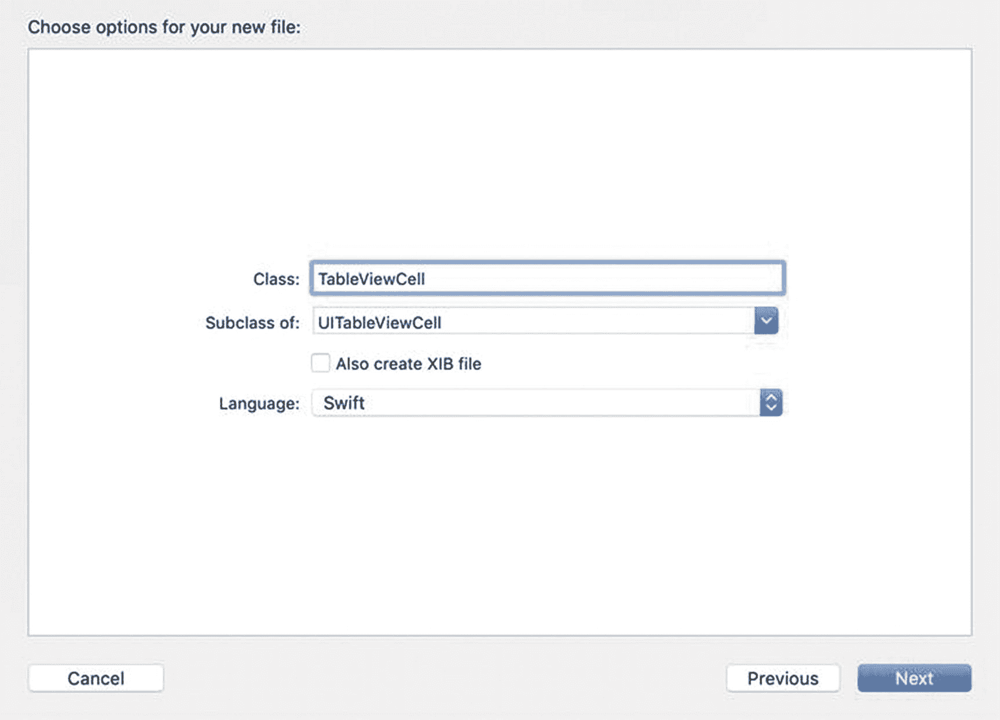

图 15-9

定义一个新的 Cocoa Touch 类文件的类名和子类类型


23.  点击**下一步**按钮。Xcode 会询问文件的存储位置。点击**创建**按钮。Xcode 会在导航器面板中显示`TableViewCell.swift`文件。

24.  点击导航器面板中的`Main.storyboard`文件。

25.  在文档大纲中点击 customCell，然后选择“视图”➤“检查器”➤“显示身份检查器”，或点击 Xcode 窗口右上角的身份检查器图标。

26.  点击类弹出菜单，然后选择`TableViewCell`，即你刚刚创建的`.swift`文件，如图 15-10 所示。

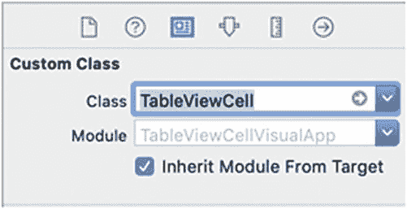

图 15-10

将表格视图单元格连接到`TableViewCell.swift`文件

27.  选择“视图”➤“辅助编辑器”➤“显示辅助编辑器”，或点击 Xcode 窗口右上角的辅助编辑器图标。此时，`Main.storyboard`文件显示在左侧，一个`.swift`文件显示在右侧。

28.  点击辅助编辑器顶部看似两个圆环交错的图标，如图 15-11 所示。将出现一个弹出菜单。

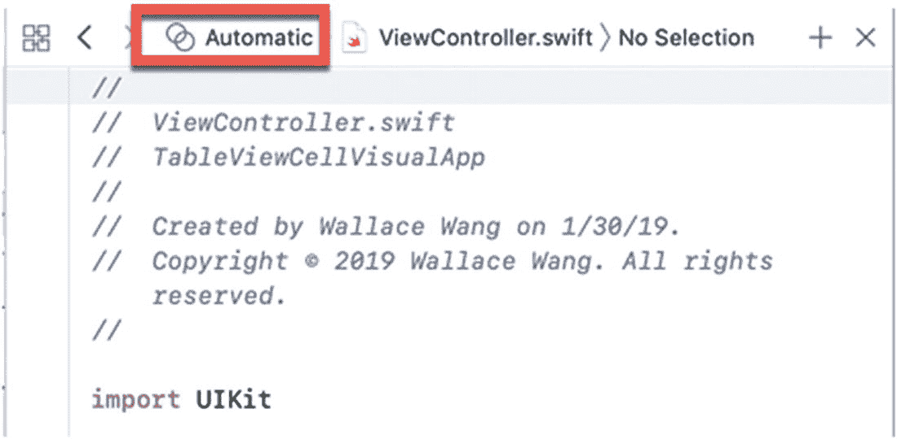

图 15-11

两个圆环交错的图标

29.  选择“手动”➤`TableViewCellVisualApp`➤`TableViewCellVisualApp`➤`TableViewCell.swift`，如图 15-12 所示。现在，Xcode 会在`Main.storyboard`文件的右侧显示`TableViewCell.swift`文件。

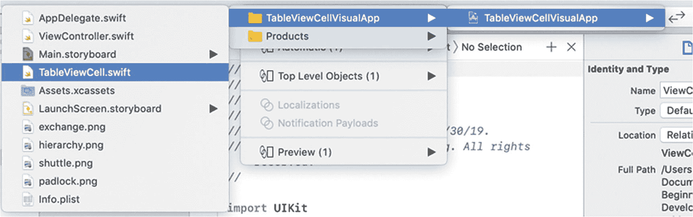

图 15-12

导航至`TableViewCell.swift`文件

30.  将鼠标指针移到顶部标签上，按住 Control 键，然后 Ctrl-拖拽到`TableViewCell.swift`文件中的`class TableViewCell`行下方。

31.  松开 Control 键和鼠标左键。将出现一个弹出窗口。

32.  点击“名称”文本框，输入`mainText`，然后点击“连接”按钮。Xcode 会创建一个 `IBOutlet` 如下：

```
@IBOutlet var mainText: UILabel!
```

33.  将鼠标指针移到底部标签上，按住 Control 键，然后 Ctrl-拖拽到 `IBOutlet` 行的下方。

34.  松开 Control 键和鼠标左键。将出现一个弹出窗口。

35.  点击“名称”文本框，输入`detailText`，然后点击“连接”按钮。Xcode 会创建一个 `IBOutlet` 如下：

```
@IBOutlet var detailText: UILabel!
```

36.  将鼠标指针移到图像视图上，按住 Control 键，然后 Ctrl-拖拽到 `IBOutlet` 行的下方。

37.  松开 Control 键和鼠标左键。将出现一个弹出窗口。

38.  点击“名称”文本框，输入`cellImage`，然后点击“连接”按钮。Xcode 会创建一个 `IBOutlet` 如下：

```
@IBOutlet var cellImage: UIImageView!
```

整个`TableViewCell.swift`文件应如下所示：

```
import UIKit
class TableViewCell: UITableViewCell {
    @IBOutlet var mainText: UILabel!
    @IBOutlet var detailText: UILabel!
    @IBOutlet var cellImage: UIImageView!
    override func awakeFromNib() {
        super.awakeFromNib()
        // Initialization code
    }
    override func setSelected(_ selected: Bool, animated: Bool) {
        super.setSelected(selected, animated: animated)
        // Configure the view for the selected state
    }
}
```

39.  选择“视图”➤“标准编辑器”➤“显示标准编辑器”，或点击 Xcode 窗口右上角的标准编辑器图标。

40.  点击导航器面板中的`ViewController.swift`文件。

41.  将`class ViewController`行修改如下：

```
class ViewController: UIViewController, UITableViewDelegate, UITableViewDataSource {
```

42.  将四张图片拖放至导航器面板中（见图 15-3）。将出现一个对话框，询问如何将这些文件添加到你的项目中。


43. 点击`Finish`按钮。记下所有图像文件的确切名称。

44. 在`class ViewController`这行代码下方，添加如下三个数组：

```swift
let mainArray = ["Shuttle bus", "Hierarchy", "Exchange", "Padlock"]
let detailArray = ["6am - 10pm", "Acme corporation", "Ideas worth sharing", "Access denied"]
let imageArray = ["shuttle.png", "hierarchy.png", "exchange.png", "padlock.png"]
```

对于`imageArray`，请确保将文件名修改为与你在步骤 42 中拖入导航面板的实际图像文件相匹配。在实际应用中，你可能会使用一种能够将所有相关数据保存在一起的数据结构，而不是将它们存储在三组独立的数组中。

45. 在`viewDidLoad`方法下方，添加以下函数来计算每个分区中的行数：

```swift
func tableView(_ tableView: UITableView, numberOfRowsInSection section: Int) -> Int {
    return mainArray.count
}
```

46. 在上一个函数下方，添加以下函数来为表格视图填充数据：

```swift
func tableView(_ tableView: UITableView, cellForRowAt indexPath: IndexPath) -> UITableViewCell {
    let cell: TableViewCell = tableView.dequeueReusableCell(withIdentifier: "customCell") as! TableViewCell
    cell.mainText?.text = self.mainArray[indexPath.row]
    cell.detailText?.text = self.detailArray[indexPath.row]
    cell.imageView?.image = UIImage(named: self.imageArray[indexPath.row])
    return cell
}
```

第一行基于`TableViewCell.swift`文件定义了一个单元格。然后它将`mainArray`中的字符串存储到`mainText` IBOutlet，将`detailArray`中的字符串存储到`detailText` IBOutlet，并将`imageArray`中的文件存储到`TableViewCell.swift`文件的图像视图 IBOutlet 中。

47. 在上一个函数下方，添加以下函数来识别用户选择了哪个项目：

```swift
func tableView(_ tableView: UITableView, didSelectRowAt indexPath: IndexPath) {
    let selectedItem = mainArray[indexPath.row]
    let alert = UIAlertController(title: "Your Choice", message: "\(selectedItem)", preferredStyle: .alert)
    let okAction = UIAlertAction(title: "OK", style: .default, handler: { action -> Void in
        //Just dismiss the action sheet
    })
    alert.addAction(okAction)
    self.present(alert, animated: true, completion: nil)
}
```

整个`ViewController.swift`文件应如下所示：

```swift
import UIKit
class ViewController: UIViewController, UITableViewDelegate, UITableViewDataSource {
    let mainArray = ["Shuttle bus", "Hierarchy", "Exchange", "Padlock"]
    let detailArray = ["6am - 10pm", "Acme corporation", "Ideas worth sharing", "Access denied"]
    let imageArray = ["shuttle.png", "hierarchy.png", "exchange.png", "padlock.png"]
    
    func tableView(_ tableView: UITableView, numberOfRowsInSection section: Int) -> Int {
        return mainArray.count
    }
    
    func tableView(_ tableView: UITableView, cellForRowAt indexPath: IndexPath) -> UITableViewCell {
        let cell: TableViewCell = tableView.dequeueReusableCell(withIdentifier: "customCell") as! TableViewCell
        cell.mainText?.text = self.mainArray[indexPath.row]
        cell.detailText?.text = self.detailArray[indexPath.row]
        cell.imageView?.image = UIImage(named: self.imageArray[indexPath.row])
        return cell
    }
    
    override func viewDidLoad() {
        super.viewDidLoad()
        // Do any additional setup after loading the view, typically from a nib.
    }
    
    func tableView(_ tableView: UITableView, didSelectRowAt indexPath: IndexPath) {
        let selectedItem = mainArray[indexPath.row]
        let alert = UIAlertController(title: "Your Choice", message: "\(selectedItem)", preferredStyle: .alert)
        let okAction = UIAlertAction(title: "OK", style: .default, handler: { action -> Void in
            //Just dismiss the action sheet
        })
        alert.addAction(okAction)
        self.present(alert, animated: true, completion: nil)
    }
}
```

48. 点击`Run`按钮或选择**Product** ➤ **Run**。模拟器窗口出现，在两个标签中显示图像和文本，如图 15-13 所示。请注意，底部标签从左边缘缩进，并以不同的字体和大小显示——这是我们在之前自定义的。

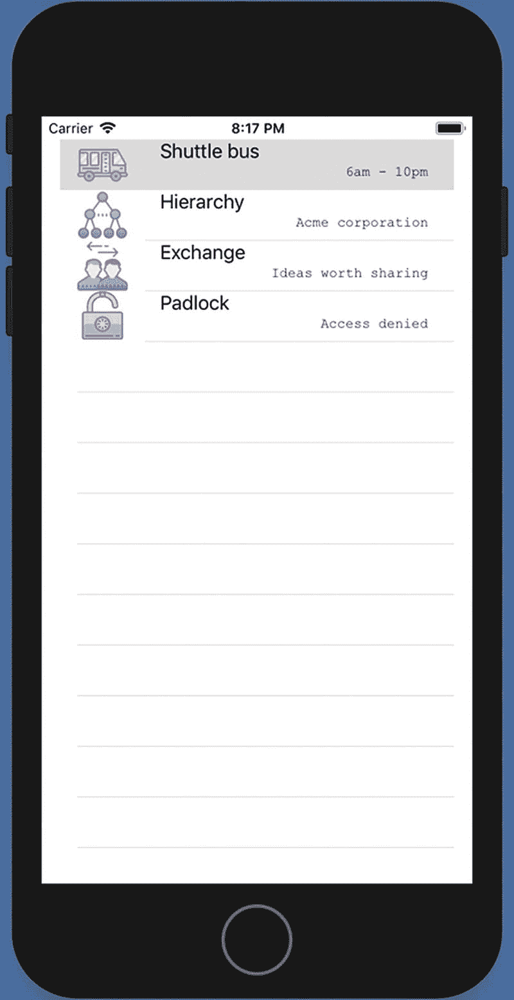

**图 15-13** 显示自定义表格视图单元格的表格视图

49. 在表格视图中点击一个项目。会出现一个提醒控制器来标识你的选择。

50. 点击`OK`关闭提醒控制器。

51. 选择**Simulator** ➤ **Quit Simulator**以返回 Xcode。


## 滑动添加与删除行

表格视图可以在多行中显示大量数据。然而，除了查看数据，你可能还希望能够向表格视图添加或删除数据。修改表格视图以添加或删除项目的一种方法是使用左滑手势。当用户在表格视图行上向左滑动时，可以显示一个或多个按钮，让用户选择诸如添加新项目或删除现有项目等选项。

要允许在表格视图行上使用左滑手势，我们需要一个 `editActionsForRowAt` 函数，例如：

```
func tableView(_ tableView: UITableView, editActionsForRowAt indexPath: IndexPath) -> [UITableViewRowAction]? {
}
```

在这个函数内部，我们可以定义一个或多个按钮，例如：

```
let addAction = UITableViewRowAction(style: UITableViewRowAction.Style.normal, title: "Add", handler: {(action: UITableViewRowAction, indexPath: IndexPath) in
})
let deleteAction = UITableViewRowAction(style: UITableViewRowAction.Style.destructive, title: "Delete", handler: {(action: UITableViewRowAction, indexPath: IndexPath) in
})
return [deleteAction, addAction]
```

上述代码定义了两个按钮，分别标记为“Add”和“Delete”。“Add”按钮使用 `.normal` 样式，显示为浅灰色。“Delete”按钮使用 `.destructive` 样式，因此显示为亮红色。最后一行返回代表“Add”和“Delete”按钮的两个 `UITableViewRowAction` 常量。

要了解如何使用滑动手势在表格视图中添加和删除项目，请按以下步骤操作：

1. 使用单视图应用模板（参见第 1 章）创建一个新的 iOS 项目，并将此新项目命名为 EditRowApp。这将为用户界面创建一个单一视图。

2. 在导航面板中点击 `Main.storyboard` 文件。Xcode 会显示该单一视图。

3. 点击库图标以打开对象库窗口。

4. 将表格视图拖放到视图的任意位置。

5. 调整表格视图大小，使其填满整个屏幕。

6. 选择 Editor ➤ Resolve Auto Layout Issues ➤ Reset to Suggested Constraints。Xcode 会为表格视图添加约束。

7. 选择 View ➤ Inspectors ➤ Show Attributes Inspector，或点击 Xcode 窗口右上角的 Attributes Inspector 图标。

8. 选择 View ➤ Assistant Editor ➤ Show Assistant Editor，或点击 Xcode 窗口右上角的 Assistant Editor 图标。

9. 将鼠标指针移动到表格视图上，按住 Control 键，然后按住 Ctrl 键并拖动到 `ViewController.swift` 文件中 `class ViewController` 行的下方。

10. 松开 Control 键和鼠标左键。将出现一个弹出窗口。

11. 点击 Name 文本字段，输入 `tableView`，然后点击 Connect 按钮。Xcode 会创建一个 `IBOutlet`，如下所示：

    ```
    @IBOutlet var tableView: UITableView!
    ```

12. 选择 View ➤ Standard Editor ➤ Show Standard Editor，或点击 Xcode 窗口右上角的 Standard Editor 图标。

13. 在导航面板中点击 `ViewController.swift` 文件。

14. 修改 `class ViewController` 行，添加 `UITableViewDelegate`、`UITableViewDataSource`，如下所示：

    ```
    class ViewController: UIViewController, UITableViewDelegate, UITableViewDataSource {
    ```

    此代码的目的是将 `ViewController.swift` 文件标识为表格视图的委托和数据源。

15. 在 `class ViewController` 行的下方，添加以下数组：

    ```
    var petArray = ["cat", "dog", "parakeet", "parrot", "canary", "finch", "tropical fish", "goldfish", "sea horses", "hamster", "gerbil", "rabbit", "turtle", "snake", "lizard", "hermit crab"]
    ```

    注意，此 `petArray` 被声明为 `var`，这意味着我们能够通过向此数组添加或删除项目来修改它。如果我们用 `let` 声明此 `petArray`，则无法从数组中添加或删除项目。

16. 在 `petArray` 下方添加以下行：

    ```
    let cellID = "cellID"
    ```


17. 修改`viewDidLoad`方法如下：

```
override func viewDidLoad() {
    super.viewDidLoad()
    tableView.dataSource = self
    tableView.delegate = self
    // Do any additional setup after loading the view, typically from a nib.
}
```

18. 在`viewDidLoad`方法下方，添加以下函数来定义表格视图中显示的行数，该表格仅包含一个分区：

```
func tableView(_ tableView: UITableView, numberOfRowsInSection section: Int) -> Int {
    return petArray.count
}
```

19. 在上一个函数下方，添加以下函数以使用`petArray`中的数据填充表格视图：

```
func tableView(_ tableView: UITableView, cellForRowAt indexPath: IndexPath) -> UITableViewCell {
    var cell = tableView.dequeueReusableCell(withIdentifier: cellID)
    if (cell == nil) {
        cell = UITableViewCell(
            style: UITableViewCell.CellStyle.default,
            reuseIdentifier: cellID)
    }
    cell?.textLabel?.text = petArray[indexPath.row]
    return cell!
}
```

20. 在上一个函数下方，添加以下函数以显示用户从表格视图中选择的项目：

```
func tableView(_ tableView: UITableView, didSelectRowAt indexPath: IndexPath) {
    let selectedItem = petArray[indexPath.row]
    let alert = UIAlertController(title: "Your Choice", message: "\(selectedItem)", preferredStyle: .alert)
    let okAction = UIAlertAction(title: "OK", style: .default, handler: { action -> Void in
        //Just dismiss the action sheet
    })
    alert.addAction(okAction)
    self.present(alert, animated: true, completion: nil)
}
```

21. 在上一个函数下方，添加以下函数以显示一个带有文本字段的警告控制器，让用户输入数据以向表格视图添加新行：

```
func displayAlert(location: Int) {
    let alert = UIAlertController(title: "Add", message: "New Pet", preferredStyle: .alert)
    alert.addTextField(configurationHandler: {(textField) in
        textField.placeholder = "Pet type here"
    })
    let okAction = UIAlertAction(title: "OK", style: .default, handler: { action -> Void in
        let savedText = alert.textFields![0] as UITextField
        self.petArray.insert(savedText.text ?? "default", at: location)
        self.tableView.reloadData()
    })
    let cancelAction = UIAlertAction(title: "Cancel", style: .default, handler: { action -> Void in
        // Do nothing
    })
    alert.addAction(okAction)
    alert.addAction(cancelAction)
    self.present(alert, animated: true, completion: nil)
}
```

`displayAlert`函数接受一个整数，该整数代表一个索引位置值，用于标识`petArray`中当前选中的项目。然后它会显示一个警告控制器，其中包含一个文本字段和两个标记为“OK”和“Cancel”的按钮。

如果用户点击“Cancel”按钮，则不会发生任何操作，警告控制器消失。如果用户点击“OK”按钮，则警告控制器获取文本字段中的内容，并将其插入到`petArray`中。然后，它会重新加载整个表格视图以显示修改后的数组内容。

22. 在上一个函数下方，添加以下函数以在用户滑动表格视图行时显示两个按钮：

```
func tableView(_ tableView: UITableView, editActionsForRowAt indexPath: IndexPath) -> [UITableViewRowAction]? {
    let addAction = UITableViewRowAction(style: UITableViewRowAction.Style.normal, title: "Add", handler: {(action: UITableViewRowAction, indexPath: IndexPath) in
        self.displayAlert(location: indexPath.row)
    })
    let deleteAction = UITableViewRowAction(style: UITableViewRowAction.Style.destructive, title: "Delete", handler: {(action: UITableViewRowAction, indexPath: IndexPath) in
        self.petArray.remove(at: indexPath.row)
        tableView.deleteRows(at: [indexPath], with: UITableView.RowAnimation.fade)
    })
    return [deleteAction, addAction]
}
```

`addAction`行定义了一个使用`.normal`样式（显示为灰色按钮）的“Add”按钮。点击“Add”按钮会运行`displayAlert`函数，并传递表格视图中选中项目的当前索引值。

`deleteAction`行定义了一个“Delete”按钮，它从`petArray`和表格视图中移除选中的项目。

整个`ViewController.swift`文件应如下所示：

```
import UIKit
class ViewController: UIViewController, UITableViewDelegate, UITableViewDataSource {
    @IBOutlet var tableView: UITableView!
    var petArray = ["cat", "dog", "parakeet", "parrot", "canary", "finch", "tropical fish", "goldfish", "sea horses", "hamster", "gerbil", "rabbit", "turtle", "snake", "lizard", "hermit crab"]
    let cellID = "cellID"
    override func viewDidLoad() {
        super.viewDidLoad()
        tableView.dataSource = self
        tableView.delegate = self
        // Do any additional setup after loading the view, typically from a nib.
    }
    func tableView(_ tableView: UITableView, numberOfRowsInSection section: Int) -> Int {
        return petArray.count
    }
    func tableView(_ tableView: UITableView, cellForRowAt indexPath: IndexPath) -> UITableViewCell {
        var cell = tableView.dequeueReusableCell(withIdentifier: cellID)
        if (cell == nil) {
            cell = UITableViewCell(
                style: UITableViewCell.CellStyle.default,
                reuseIdentifier: cellID)
        }
        cell?.textLabel?.text = petArray[indexPath.row]
        return cell!
    }
    func tableView(_ tableView: UITableView, didSelectRowAt indexPath: IndexPath) {
        let selectedItem = petArray[indexPath.row]
        let alert = UIAlertController(title: "Your Choice", message: "\(selectedItem)", preferredStyle: .alert)
        let okAction = UIAlertAction(title: "OK", style: .default, handler: { action -> Void in
            //Just dismiss the action sheet
        })
        alert.addAction(okAction)
        self.present(alert, animated: true, completion: nil)
    }
    func displayAlert(location: Int) {
        let alert = UIAlertController(title: "Add", message: "New Pet", preferredStyle: .alert)
        alert.addTextField(configurationHandler: {(textField) in
            textField.placeholder = "Pet type here"
        })
        let okAction = UIAlertAction(title: "OK", style: .default, handler: { action -> Void in
            let savedText = alert.textFields![0] as UITextField
            self.petArray.insert(savedText.text ?? "default", at: location)
            self.tableView.reloadData()
        })
        let cancelAction = UIAlertAction(title: "Cancel", style: .default, handler: { action -> Void in
            // Do nothing
        })
        alert.addAction(okAction)
        alert.addAction(cancelAction)
        self.present(alert, animated: true, completion: nil)
    }
    func tableView(_ tableView: UITableView, editActionsForRowAt indexPath: IndexPath) -> [UITableViewRowAction]? {
        let addAction = UITableViewRowAction(style: UITableViewRowAction.Style.normal, title: "Add", handler: {(action: UITableViewRowAction, indexPath: IndexPath) in
            self.displayAlert(location: indexPath.row)
        })
        let deleteAction = UITableViewRowAction(style: UITableViewRowAction.Style.destructive, title: "Delete", handler: {(action: UITableViewRowAction, indexPath: IndexPath) in
            self.petArray.remove(at: indexPath.row)
            tableView.deleteRows(at: [indexPath], with: UITableView.RowAnimation.fade)
        })
        return [deleteAction, addAction]
    }
}
```

23. 点击运行按钮或选择 Product ➤ Run。模拟器窗口出现，显示表格视图。

24. 将鼠标指针移到“tropical fish”上，按住鼠标左键并向左拖动。“Add”和“Delete”按钮出现，如图 15-14 所示。

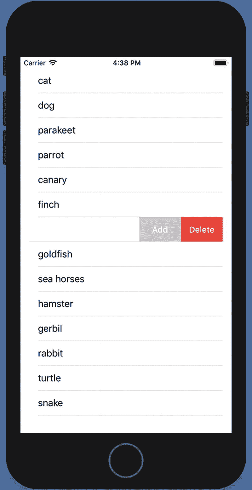

图 15-14
向左滑动会显示“Add”和“Delete”按钮


25.  点击“添加”按钮。此时会出现一个提示控制器，其中显示一个文本字段，如图 15-15 所示。

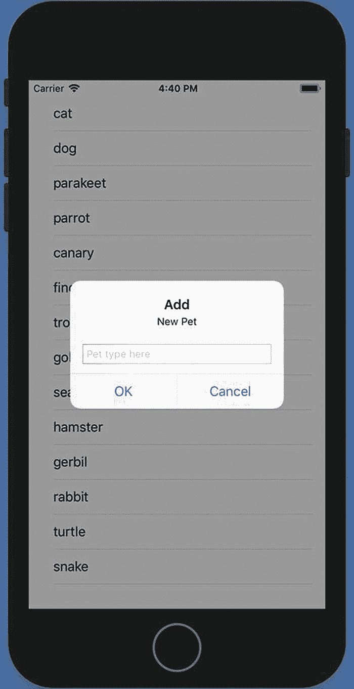

**图 15-15**

该提示控制器允许用户输入新的文本。

26.  点击文本字段（显示占位符文本“在此处输入宠物类型”），输入`tarantula`，然后点击“确定”按钮。注意，表格视图现在显示“tarantula”。

27.  将鼠标指针移到“rabbit”上，按住鼠标左键，然后向左拖动。“添加”和“删除”按钮会显示出来（见图 15-14）。

28.  点击“删除”按钮。注意，包含“rabbit”的行消失了。

29.  选择“模拟器 ➤ 退出模拟器”以返回 Xcode。

## 总结

通过定义不同的表格视图单元格样式，你可以显示主文本、通常以较小字体显示的详细文本以及图像。图像和详细文本可以使表格视图中显示的数据在视觉上更有趣、更具描述性。

除了选择不同的单元格样式外，你还可以通过从对象库窗口将表格视图单元格拖放到表格视图上，来设计自定义的表格视图单元格。创建自定义表格视图单元格后，你可以将多个标签和图像视图等其他对象拖放到此单元格上，然后自定义每个标签或图像视图以创建独特的视觉效果。

虽然表格视图便于显示数据，但它们也可用于允许编辑操作，例如在表格视图中添加或删除行。为此，你可以包含一个左滑手势，让行显示按钮。通过点击按钮，用户可以向表格视图添加新项或删除现有行。

通过自定义表格视图单元格并实现用于在表格视图中添加或删除行的左滑手势，你可以定义应用独特的表格视图。

# 16. 使用集合视图

表格视图非常适合以行形式显示大量数据，以便用户可以滚动浏览。虽然表格视图对于 iPhone 较小、较窄的屏幕来说是完美的，但它们仅限于上下滚动数据行。如果你想水平滚动数据或显示多列数据，你可以改用集合视图。

与表格视图一样，集合视图需要数据源和委托，它们实现的方法定义了集合视图中将显示多少数据。可以将集合视图视为功能更丰富的表格视图。

## 创建集合视图

集合视图在构成网格的单元格中显示数据，该网格可以垂直或水平滚动。要了解如何创建简单的集合视图，请按照以下步骤操作：

1.  使用“单视图应用”模板创建一个新的 iOS 项目（参见第 1 章），并将此新项目命名为`SimpleCollectionViewApp`。这会为用户界面创建一个单视图。

2.  点击导航器窗格中的`Main.storyboard`文件。Xcode 会显示该单视图。

3.  点击库图标以打开对象库窗口。

4.  将一个集合视图拖放到视图上，如图 16-1 所示。

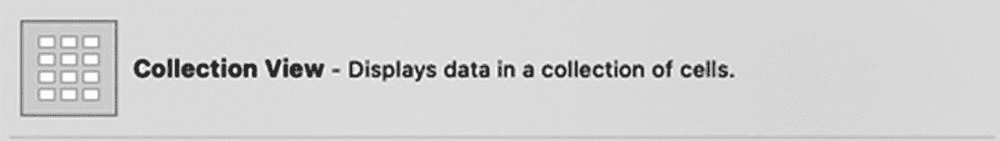

**图 16-1**

对象库窗口中的集合视图

5.  调整集合视图的大小，使其填满整个屏幕。

6.  选择“编辑器 ➤ 解决自动布局问题 ➤ 重置为建议的约束”。Xcode 会向集合视图添加约束。

7.  点击文档大纲中的“集合视图单元格”。

8.  选择“视图 ➤ 检查器 ➤ 显示属性检查器”，或点击 Xcode 窗口右上角的属性检查器图标。

9.  点击“标识符”文本字段，输入`customCell`，然后按回车键，如图 16-2 所示。

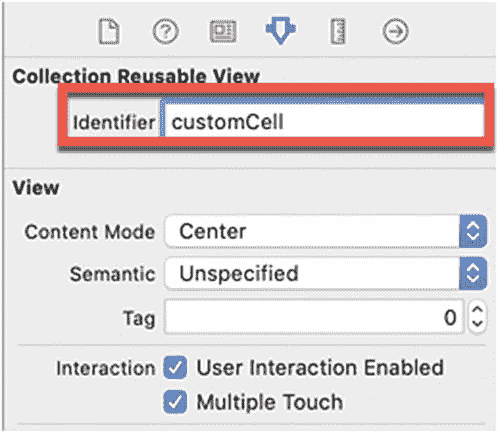

**图 16-2**

集合视图单元格的属性检查器窗格中显示的“标识符”文本字段

10.  选择“视图 ➤ 助理编辑器 ➤ 显示助理编辑器”，或点击 Xcode 窗口右上角的助理编辑器图标。

11.  将鼠标指针移到集合视图上，按住 Control 键，并按住 Control 键从集合视图拖拽到`ViewController.swift`文件中的“`class ViewController`”行下方。

12.  松开 Control 键和鼠标左键。会弹出一个窗口。

13.  点击“名称”文本字段，输入`collectionView`，然后点击“连接”按钮。Xcode 会创建一个`IBOutlet`，如下所示：

```
    @IBOutlet var collectionView: UICollectionView!
```

14.  选择“视图 ➤ 标准编辑器 ➤ 显示标准编辑器”，或点击 Xcode 窗口右上角的标准编辑器图标。

15.  点击导航器窗格中的`ViewController.swift`文件。

16.  修改`class ViewController`行，添加`UITableViewDelegate`和`UITableViewDataSource`，如下所示：

```
    class ViewController: UIViewController, UICollectionViewDataSource, UICollectionViewDelegate {
```

这段代码的目的是将`ViewController.swift`文件标识为集合视图的委托和数据源。

17.  在`class ViewController`行下方，添加以下代码：

```
    var cellColor = true
```

18.  修改`viewDidLoad`方法，如下所示：

```
    override func viewDidLoad() {
        super.viewDidLoad()
        collectionView.dataSource = self
        collectionView.delegate = self
        // Do any additional setup after loading the view.
    }
```

19.  在`viewDidLoad`方法下方添加以下函数，以定义集合视图分区中显示多少个项目。默认情况下，集合视图有一个分区：

```
    func collectionView(_ collectionView: UICollectionView, numberOfItemsInSection section: Int) -> Int {
        return 100
    }
```

20.  在`viewDidLoad`方法下方添加以下函数，以向集合视图单元格填充数据：

```
    func collectionView(_ collectionView: UICollectionView, cellForItemAt indexPath: IndexPath) -> UICollectionViewCell {
        let cell = collectionView.dequeueReusableCell(withReuseIdentifier: "customCell", for: indexPath)
        // Alternate colors in the Collection View cells
        if cellColor {
            cell.backgroundColor = UIColor.yellow
        } else {
            cell.backgroundColor = UIColor.green
        }
        cellColor = !cellColor
        return cell
    }
```


该函数通过标识符“customCell”定义了集合视图单元格：

```swift
let cell = collectionView.dequeueReusableCell(withReuseIdentifier: "customCell", for: indexPath)
```

接下来，如果`cellColor`的值为`true`，则将集合视图单元格填充为黄色。否则，如果`cellColor`的值为`false`，则将集合视图单元格填充为绿色。

```swift
if cellColor {
    cell.backgroundColor = UIColor.yellow
} else {
    cell.backgroundColor = UIColor.green
}
```

最后，它将`cellColor`的值从`true`改为`false`（或从`false`改为`true`），并返回该单元格。

完整的`ViewController.swift`文件应如下所示：

```swift
import UIKit
class ViewController: UIViewController, UICollectionViewDataSource, UICollectionViewDelegate {
    @IBOutlet var collectionView: UICollectionView!
    var cellColor = true
    override func viewDidLoad() {
        super.viewDidLoad()
        collectionView.dataSource = self
        collectionView.delegate = self
        // Do any additional setup after loading the view.
    }
    func collectionView(_ collectionView: UICollectionView, numberOfItemsInSection section: Int) -> Int {
        return 100
    }
    func collectionView(_ collectionView: UICollectionView, cellForItemAt indexPath: IndexPath) -> UICollectionViewCell {
        let cell = collectionView.dequeueReusableCell(withReuseIdentifier: "customCell", for: indexPath)
        // Alternate colors in the Collection View cells
        if cellColor {
            cell.backgroundColor = UIColor.yellow
        } else {
            cell.backgroundColor = UIColor.green
        }
        cellColor = !cellColor
        return cell
    }
}
```

21. 点击运行按钮或选择“Product ➤ Run”。模拟器窗口将出现，显示交替显示绿色和黄色单元格的集合视图，如图 16-3 所示。

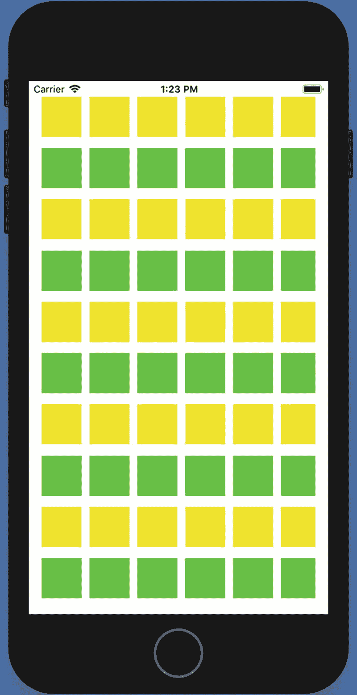

**图 16-3** 显示交替单元格颜色的集合视图

22. 上下滚动。

23. 选择“Simulator ➤ Quit Simulator”返回 Xcode。

24. 点击`Main.storyboard`文件，然后在文档大纲中点击“Collection View”。

25. 选择“View ➤ Inspectors ➤ Show Attributes Inspector”，或点击 Xcode 窗口右上角的属性检查器图标。

26. 点击“Scroll Direction”弹出菜单，选择“Horizontal”，如图 16-4 所示。

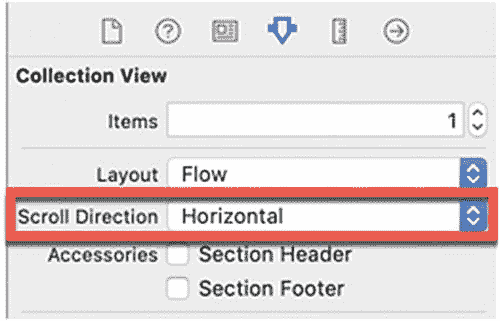

**图 16-4** “Scroll Direction”弹出菜单允许您在垂直或水平滚动之间选择

27. 点击运行按钮或选择“Product ➤ Run”。模拟器窗口将出现，显示交替显示绿色和黄色单元格的集合视图（参见图 16-3）。

28. 注意，您现在可以左右滚动，但不能上下滚动。

29. 选择“Simulator ➤ Quit Simulator”返回 Xcode。

## 在集合视图中显示数据

集合视图的主要目的是在单元格中显示信息。要在单元格中显示信息，需要以下几个步骤：

- 将对象拖放到集合视图单元格上。
- 创建一个新的`.swift`类文件来表示集合视图单元格。
- 在身份检查器窗格中将这个新的`.swift`类文件连接到集合视图单元格。
- 从集合视图单元格上的对象按住 Ctrl 键拖拽到`.swift`类文件，创建`IBOutlet`变量来表示每个对象。
- 在`cellForItemAt`函数中编写代码，将数据存储到每个集合视图单元格中。

在设计集合视图单元格时，您可以调整其高度和宽度。此外，您还可以定义单元格之间的间距，以及单元格距离屏幕顶部、左侧、底部或右侧边缘的距离。

要了解如何在集合视图单元格中显示文本，请按照以下步骤操作：

1. 使用单视图应用模板创建一个新的 iOS 项目（参见第 1 章），并将此新项目命名为`CollectionViewDataApp`。这将为用户界面创建一个单一视图。

2. 在导航器窗格中点击`Main.storyboard`文件。Xcode 会显示该单一视图。

3. 点击库图标打开对象库窗口。

4. 将集合视图拖放到视图上的任意位置。

5. 调整集合视图的大小，使其填满整个屏幕。

6. 选择“Editor ➤ Resolve Auto Layout Issues ➤ Reset to Suggested Constraints”。Xcode 会为集合视图添加约束。

7. 选择“File ➤ New ➤ File”。Xcode 会显示一个模板列表。

8. 在 iOS 类别下选择“Cocoa Touch Class”，然后点击**Next**按钮。将出现另一个对话框，要求提供类名和子类。

9. 在“Class”文本字段中点击并输入`itemCell`。

10. 点击“Subclass of”弹出菜单，选择`UICollectionViewCell`，如图 16-5 所示。

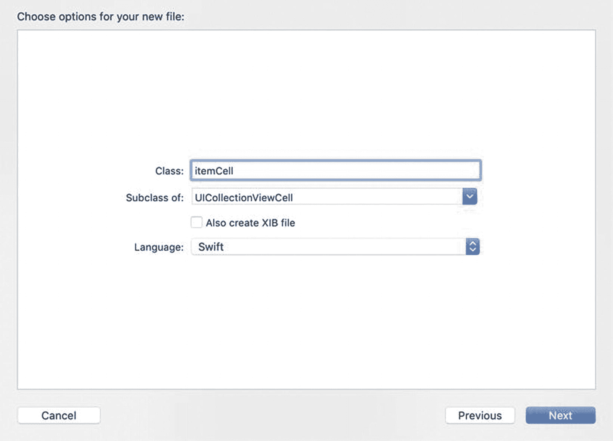

**图 16-5** 为集合视图单元格创建一个新的`.swift`类文件

11. 点击**Next**按钮。Xcode 会询问文件的存储位置。

12. 点击**Create**按钮。Xcode 会在导航器窗格中显示`itemCell.swift`文件。

13. 在导航器窗格中点击`Main.storyboard`，在文档大纲中点击“Collection View Cell”，然后选择“View ➤ Inspectors ➤ Show Attributes Inspector”，或点击 Xcode 窗口右上角的属性检查器图标。

14. 在标识符文本字段中点击，输入`customCell`，然后按回车键，如图 16-6 所示。

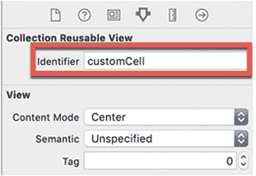

**图 16-6** 在属性检查器窗格中定义集合视图单元格的标识符

15. 点击“Background color”弹出菜单，选择一种颜色，例如黄色。Xcode 会高亮显示该集合视图单元格。

16. 选择“View ➤ Inspectors ➤ Show Identity Inspector”，或点击 Xcode 窗口右上角的身份检查器图标。

17. 点击“Class”弹出菜单，选择`itemCell`，如图 16-7 所示。

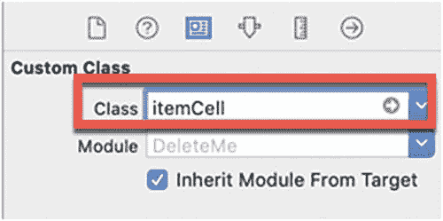

**图 16-7** 将集合视图单元格连接到`itemCell.swift`文件

18. 点击库图标打开对象库窗口，将一个标签拖放到集合视图单元格的中心。

19. 点击 Xcode 窗口底部的对齐图标，选中“Horizontally in Container”和“Vertically in Container”复选框，然后点击“Add 2 Constraints”按钮。Xcode 会添加约束，以确保标签在集合视图单元格内居中，如图 16-8 所示。


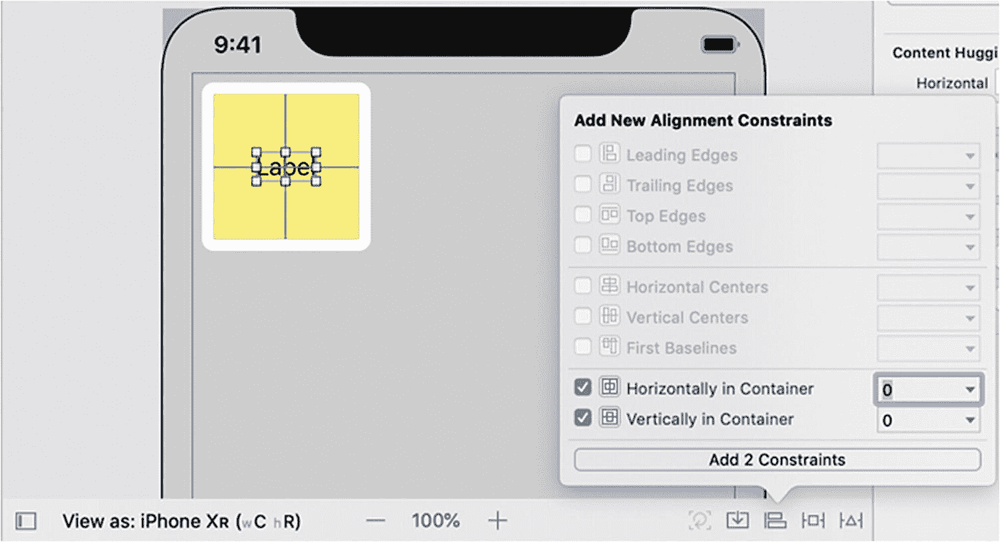

图 16-8  
将标签居中对齐到集合视图标签内

20. 在文档大纲中点击 `Collection View`，然后选择 `View ➤ Inspectors ➤ Show Size Inspector`，或点击 `Xcode` 窗口右上角的“大小检查器”图标。

21. 在 `Cell Size Width` 文本框中点击，输入 `100`，然后按 `ENTER` 键。

22. 在 `Cell Size Height` 文本框中点击，输入 `100`，然后按 `ENTER` 键。

23. 在 `Min Spacing For Cells` 文本框中点击，输入 `20`，然后按 `ENTER` 键。

24. 在 `Section Insets Top` 文本框中点击，输入 `15`，然后按 `ENTER` 键。`Xcode` 会将 `Collection View Cell` 向下移动。

25. 在 `Section Insets Left` 文本框中点击，输入 `15`，然后按 `ENTER` 键。`Xcode` 会将 `Collection View Cell` 从左边距移开，如图 16-9 所示。

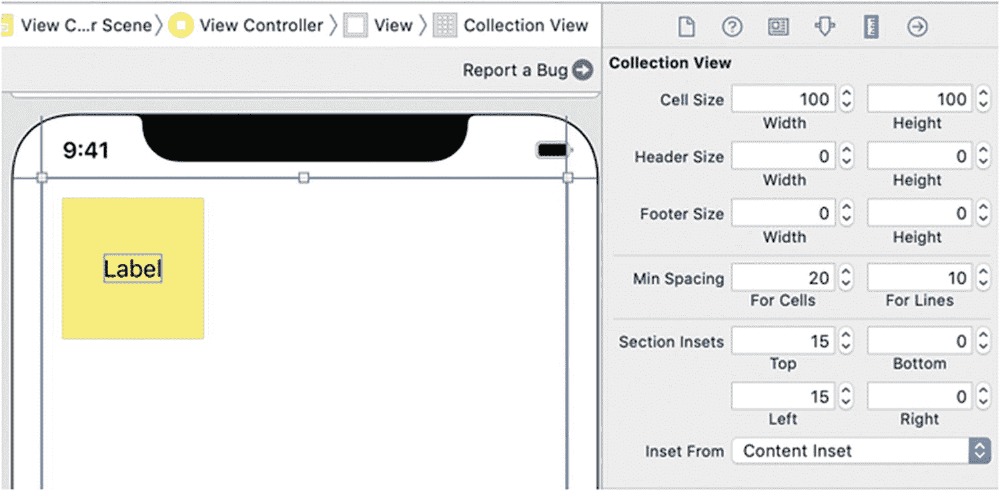

图 16-9  
在集合视图中修改单元格大小和间距

26. 选择 `View ➤ Assistant Editor ➤ Show Assistant Editor`，或点击 `Xcode` 窗口右上角的“助理编辑器”图标。这将在左侧显示 `Main.storyboard` 文件，在右侧显示 `ViewController.swift` 文件。

27. 将鼠标指针移到文档大纲中的 `Collection View` 上，按住 `Control` 键，然后从 `Collection View` 向 `ViewController.swift` 文件中的 `class ViewController` 行下方按住 Control 键拖拽。

28. 释放 `Control` 键和鼠标左键。此时会出现一个弹出窗口。

29. 在 `Name` 文本框中点击，输入 `collectionView`，然后点击 `Connect` 按钮。`Xcode` 会创建一个 `IBOutlet`，如下所示：

```
    @IBOutlet var collectionView: UICollectionView!
```

30. 将鼠标指针移到文档大纲中 `customCell` 下的 `Label` 上。如果 `Xcode` 没有在助理编辑器中显示 `itemCell.swift` 文件，请点击助理编辑器顶部的两个交叉圆圈图标以显示菜单。

31. 选择 `Automatic ➤ itemCell.swift`，如图 16-10 所示。

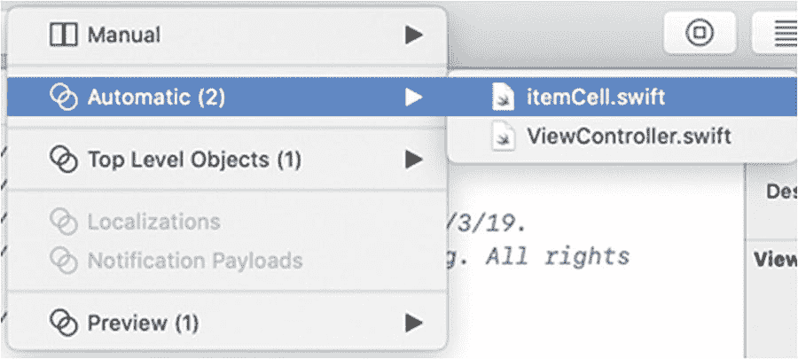

图 16-10  
选择要在助理编辑器中显示的 `itemCell.swift` 文件

32. 将鼠标指针移到标签上，按住 `Control` 键，然后从该标签向 `itemCell.swift` 文件中的 `class TableViewCell` 行下方按住 Control 键拖拽。

33. 释放 `Control` 键和鼠标左键。此时会出现一个弹出窗口。

34. 在 `Name` 文本框中点击，输入 `itemLabel`，然后点击 `Connect` 按钮。`Xcode` 会创建一个 `IBOutlet`，如下所示：

```
    @IBOutlet var itemLabel: UILabel!
```

整个 `itemCell.swift` 文件应如下所示：

```
    import UIKit
    class itemCell: UICollectionViewCell {
        @IBOutlet var itemLabel: UILabel!
    }
```

35. 选择 `View ➤ Standard Editor ➤ Show Standard Editor`，或点击 `Xcode` 窗口右上角的“标准编辑器”图标。

36. 在导航面板中点击 `ViewController.swift` 文件。

37. 将 `class ViewController` 行编辑为以下内容：

```
    class ViewController: UIViewController, UICollectionViewDataSource, UICollectionViewDelegate {
```

38. 在 `IBOutlet` 下方输入以下内容：

```
    let petArray = ["cat", "dog", "parakeet", "parrot", "canary", "finch", "tropical fish", "goldfish", "sea horses", "hamster", "gerbil", "rabbit", "turtle", "snake", "lizard", "hermit crab"]
```

39. 将 `viewDidLoad()` 方法编辑为以下内容：

```
    override func viewDidLoad() {
        super.viewDidLoad()
        collectionView.dataSource = self
        collectionView.delegate = self
        // Do any additional setup after loading the view.
    }
```

40. 在 `viewDidLoad()` 方法下方添加以下函数：

```
    func collectionView(_ collectionView: UICollectionView, numberOfItemsInSection section: Int) -> Int {
        return petArray.count
    }
```

41. 在上一个函数下方添加以下函数：

```
    func collectionView(_ collectionView: UICollectionView, cellForItemAt indexPath: IndexPath) -> UICollectionViewCell {
        let cell = collectionView.dequeueReusableCell(withReuseIdentifier: "customCell", for: indexPath) as! itemCell
        cell.itemLabel.text = petArray[indexPath.row]
        return cell
    }
```

42. 在上一个函数下方添加以下函数：

```
    func collectionView(_ collectionView: UICollectionView, didSelectItemAt indexPath: IndexPath) {
        let alert = UIAlertController(title: "Your Choice", message: "\(petArray[indexPath.row])", preferredStyle: .alert)
        let action = UIAlertAction(title: "OK", style: .default, handler: nil)
        alert.addAction(action)
        self.present(alert, animated: true, completion: nil)
    }
```

整个 `ViewController.swift` 文件应如下所示：

```
    import UIKit
    class ViewController: UIViewController, UICollectionViewDataSource, UICollectionViewDelegate {
        @IBOutlet var collectionView: UICollectionView!
        let petArray = ["cat", "dog", "parakeet", "parrot", "canary", "finch", "tropical fish", "goldfish", "sea horses", "hamster", "gerbil", "rabbit", "turtle", "snake", "lizard", "hermit crab"]
        override func viewDidLoad() {
            super.viewDidLoad()
            collectionView.dataSource = self
            collectionView.delegate = self
            // Do any additional setup after loading the view.
        }
        func collectionView(_ collectionView: UICollectionView, numberOfItemsInSection section: Int) -> Int {
            return petArray.count
        }
        func collectionView(_ collectionView: UICollectionView, cellForItemAt indexPath: IndexPath) -> UICollectionViewCell {
            let cell = collectionView.dequeueReusableCell(withReuseIdentifier: "customCell", for: indexPath) as! itemCell
            cell.itemLabel.text = petArray[indexPath.row]
            return cell
        }
        func collectionView(_ collectionView: UICollectionView, didSelectItemAt indexPath: IndexPath) {
            let alert = UIAlertController(title: "Your Choice", message: "\(petArray[indexPath.row])", preferredStyle: .alert)
            let action = UIAlertAction(title: "OK", style: .default, handler: nil)
            alert.addAction(action)
            self.present(alert, animated: true, completion: nil)
        }
    }
```

43. 点击“运行”按钮，或选择 `Product ➤ Run`。模拟器窗口会出现，并在 `Collection View` 标签内显示文本，如图 16-11 所示。

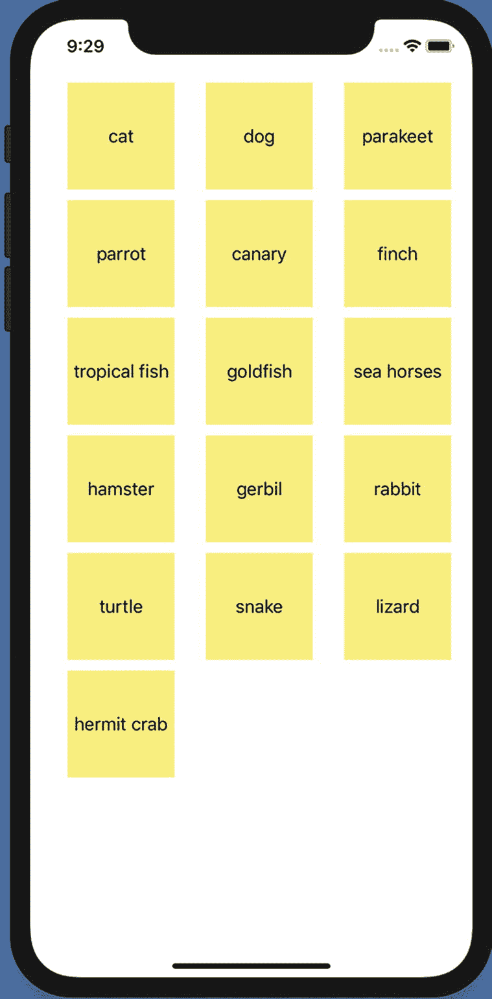

图 16-11  
在多个集合视图单元格中显示数组中的文本

44. 点击一个单元格。会弹出一个警告，列出您选择的项目。

45. 点击 `OK` 关闭警告控制器。

46. 选择 `Simulator ➤ Quit Simulator` 返回 Xcode。

要在集合视图单元格中显示任何数据，都需要在该集合视图单元格内部拖放对象。此示例使用了标签，但您也可以添加图像视图，以便在每个集合视图单元格内显示图片。


### 在集合视图中显示分区标题

最简单的集合视图仅包含一个分区，在屏幕上显示网格项目。然而，数据更有可能被分为两个或更多组或分区。在这种情况下，集合视图可以显示分区标题来分隔屏幕上的项目。

创建分区标题涉及以下几个步骤：

- 在集合视图的属性检查器窗格中启用分区标题。
- 为标题定义一个任意的标识符名称。
- 将一个或多个对象（例如标签）拖放到分区标题中。
- 将分区标题对象连接到`.swift`文件中的`IBOutlets`。
- 实现`viewForSupplementaryElementOfKind`方法，以定义标题中显示的内容。

要了解如何在集合视图中创建并显示分区标题，请遵循以下步骤：

1. 使用单视图应用模板创建一个新的 iOS 项目（参见第 1 章），并将此新项目命名为 `CollectionViewSectionApp`。这会为用户界面创建一个单视图。

2. 在导航窗格中点击 `Main.storyboard` 文件。Xcode 会显示该单视图。

3. 点击库图标以打开对象库窗口。

4. 将一个集合视图拖放到视图上的任意位置。

5. 调整集合视图的大小，使其填满整个屏幕。

6. 选择 Editor ➤ Resolve Auto Layout Issues ➤ Reset to Suggested Constraints。Xcode 会向集合视图添加约束。

7. 选择 View ➤ Inspectors ➤ Show Size Inspector，或点击 Xcode 窗口右上角的尺寸检查器图标。

8. 点击单元格大小宽度文本字段，输入 `100`，然后按 ENTER 键。

9. 点击单元格大小高度文本字段，输入 `100`，然后按 ENTER 键。

10. 选择 View ➤ Inspectors ➤ Show Attributes Inspector，或点击 Xcode 窗口右上角的属性检查器图标。

11. 选中“分区标题”复选框，如图 16-12 所示。Xcode 会在文档大纲和视图上创建一个集合可复用视图（分区标题），如图 16-13 所示。

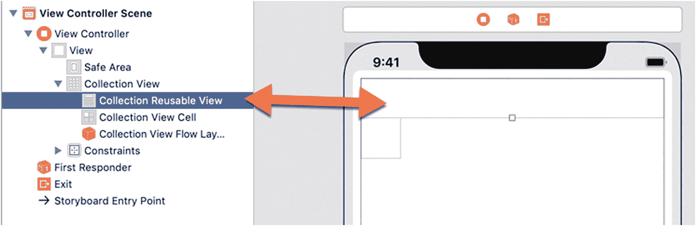

图 16-13 集合可复用视图（分区标题）

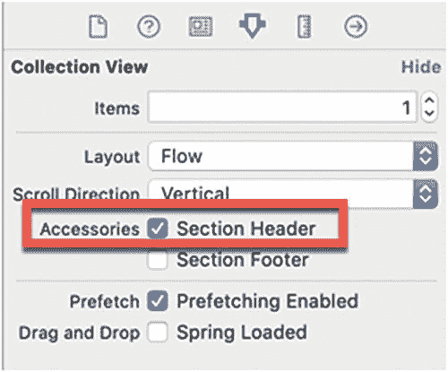

图 16-12 在属性检查器中选中“分区标题”复选框

12. 点击“背景”弹出菜单，选择一种颜色，使分区标题易于识别。

13. 选择 File ➤ New ➤ File。此时会弹出一个模板对话框。

14. 在 iOS 类别下点击 Cocoa Touch Class，然后点击**下一步**按钮。出现另一个对话框。

15. 在“类”文本字段中点击，输入 `itemCell`，然后按 ENTER 键。

16. 在“继承自”弹出菜单中点击，选择 `UICollectionViewCell`，如图 16-14 所示。

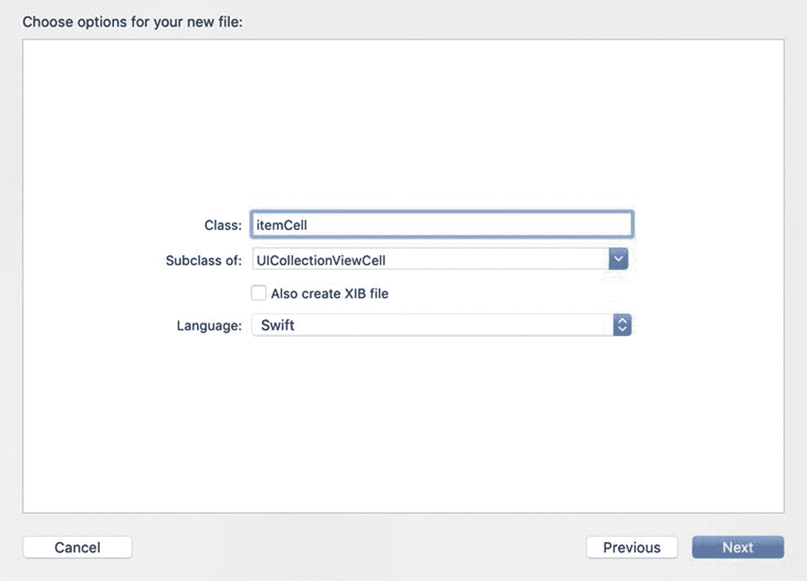

图 16-14 为`.swift`文件定义类名和子类类型

17. 点击**下一步**按钮。Xcode 会询问您希望将 `itemCell.swift` 文件存储在何处。

18. 点击**创建**按钮。Xcode 会在导航窗格中显示 `itemCell.swift` 文件。

19. 在文档大纲中点击“集合可复用视图”，然后选择 View ➤ Inspectors ➤ Show Attributes Inspector，或点击 Xcode 窗口右上角的属性检查器图标。

20. 在“标识符”文本字段中点击，输入 `headerView`，然后按 ENTER 键，如图 16-15 所示。

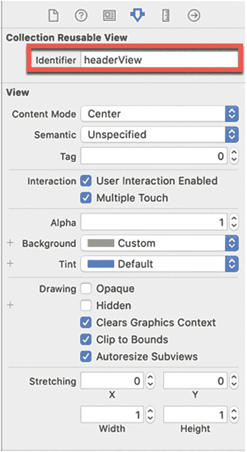

图 16-15 为分区标题定义标识符


21.  选择“视图”➤“检查器”➤“显示身份检查器”，或点击 Xcode 窗口右上角的身份检查器图标。

22.  点击 Class 弹出菜单，选择 `itemCell`，如图 16-16 所示。

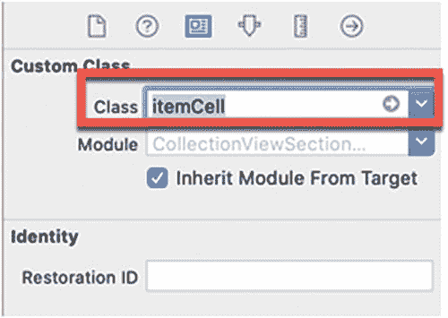

*图 16-16 将 `itemCell.swift` 文件连接到 Collection Reusable View*

23.  在文档大纲中点击 Collection View Cell。

24.  选择“视图”➤“检查器”➤“显示身份检查器”，或点击 Xcode 窗口右上角的身份检查器图标。

25.  点击 Class 弹出菜单，选择 `itemCell`（参见图 16-16）。

26.  选择“视图”➤“检查器”➤“显示属性检查器”，或点击 Xcode 窗口右上角的属性检查器图标。

27.  点击 Identifier 文本字段，输入 `customCell`，然后按 ENTER 键。

28.  点击 Background 弹出菜单，选择一种颜色，使 Collection View Cell 易于查看。

29.  点击 Library 图标以显示对象库窗口。

30.  将一个标签拖放到单元格的中心。

31.  点击 Xcode 窗口底部的 Align 图标，选中 Horizontally in Container 和 Vertically in Container 复选框，然后点击 Add 2 Constraints 按钮。

32.  点击 Library 图标以显示对象库窗口。

33.  将一个标签拖放到节标题的中心。

34.  点击 Xcode 窗口底部的 Align 图标，选中 Horizontally in Container 和 Vertically in Container 复选框，然后点击 Add 2 Constraints 按钮。用户界面应如图 16-17 所示。

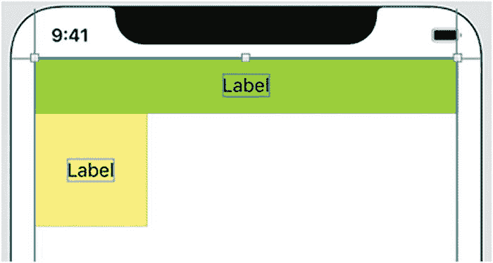

*图 16-17 单元格和节标题中心的标签*

35.  选择“视图”➤“助理编辑器”➤“显示助理编辑器”，或点击 Xcode 窗口右上角的助理编辑器图标。`Main.storyboard` 显示在左侧。

36.  点击右侧助理编辑器顶部的两个相连圆圈，选择 Manual。然后浏览文件夹以选择 `itemCell.swift`。

37.  将鼠标指针移到节标题中的标签上，按住 Control 键，然后 Ctrl-拖动到 `itemCell.swift` 文件中 "class ViewController" 行的下方。

38.  松开 Control 键和鼠标左键。弹出一个窗口。

39.  点击 Name 文本字段，输入 `headerLabel`，然后点击 Connect 按钮。Xcode 会创建一个 `IBOutlet`，如下所示：

```
    @IBOutlet var headerLabel: UILabel!
```

40.  将鼠标指针移到 Collection View Cell 中的标签上，按住 Control 键，然后 Ctrl-拖动到 `itemCell.swift` 文件中 "class ViewController" 行的下方。

41.  松开 Control 键和鼠标左键。弹出一个窗口。

42.  点击 Name 文本字段，输入 `itemLabel`，然后点击 Connect 按钮。Xcode 会创建一个 `IBOutlet`，如下所示：

```
    @IBOutlet var itemLabel: UILabel!
```

整个 `itemCell.swift` 文件应如下所示：

```
    import UIKit
    class itemCell: UICollectionViewCell {
    @IBOutlet var headerLabel: UILabel!
    @IBOutlet var itemLabel: UILabel!
    }
```

43.  选择“视图”➤“标准编辑器”➤“显示标准编辑器”，或点击 Xcode 窗口右上角的标准编辑器图标。

44.  在导航器窗格中点击 `ViewController.swift` 文件。

45.  修改 `class ViewController` 行，添加 `UICollectionViewDelegate` 和 `UICollectionViewDataSource`，如下所示：

```
    class ViewController: UIViewController, UICollectionViewDataSource, UICollectionViewDelegate {
```

此代码的目的是将 `ViewController.swift` 文件标识为 Collection View 的委托和数据源。


好的，这是根据您的要求和示例格式翻译的中文版本：


46. 在`class ViewController`行下方添加以下数组：

```
let petArray = [["Mammal", "cat", "dog", "hamster", "gerbil", "rabbit"], ["Bird", "parakeet", "parrot", "canary", "finch"], ["Fish", "tropical fish", "goldfish", "sea horses"], ["Reptile", "turtle", "snake", "lizard"]]
```

`petArray`由四个字符串数组组成，每个数组中的第一个元素定义了分区标题，例如`"Mammal"`或`"Bird"`。

47. 单击导航面板中的`Main.storyboard`文件。

48. 选择`View ➤ Assistant Editor ➤ Show Assistant Editor`，或单击 Xcode 窗口右上角的 Assistant Editor 图标。`Main.storyboard`显示在左侧，`ViewController.swift`文件应显示在右侧。

49. 将鼠标指针移到文档大纲中的`Collection View`上，按住 Control 键，然后 Ctrl-拖拽到`itemCell.swift`文件中`class ViewController`行下方。

50. 松开 Control 键和鼠标左键，弹出窗口出现。

51. 在名称文本字段中单击，输入`collectionView`，然后单击 Connect 按钮。Xcode 创建一个`IBOutlet`，如下所示：

```
@IBOutlet var collectionView: UICollectionView!
```

52. 选择`View ➤ Standard Editor ➤ Show Standard Editor`，或单击 Xcode 窗口右上角的 Standard Editor 图标。

53. 单击导航面板中的`ViewController.swift`文件。

54. 修改`viewDidLoad`方法如下：

```
override func viewDidLoad() {
    super.viewDidLoad()
    collectionView.delegate = self
    collectionView.dataSource = self
    // Do any additional setup after loading the view.
}
```

55. 在`viewDidLoad`方法下方添加以下函数，以定义 Collection View 中显示的分区数量：

```
func numberOfSections(in collectionView: UICollectionView) -> Int {
    return petArray.count
}
```

56. 在上一个函数下方添加以下函数，以标识每个分区中的项目数量：

```
func collectionView(_ collectionView: UICollectionView, numberOfItemsInSection section: Int) -> Int {
    return petArray[section].count - 1
}
```

该函数返回每个字符串数组中除一个项目外的所有项目计数，因为每个字符串数组中的一个项目是分区标题名称（例如`"Mammal"`）。

57. 在上一个函数下方添加以下函数，以使用`petArray`中的数据填充 Collection View：

```
func collectionView(_ collectionView: UICollectionView, cellForItemAt indexPath: IndexPath) -> UICollectionViewCell {
    let cell = collectionView.dequeueReusableCell(withReuseIdentifier: "customCell", for: indexPath) as! itemCell
    cell.itemLabel.text = petArray[indexPath.section][indexPath.row + 1]
    return cell
}
```

58. 在上一个函数下方添加以下函数，以显示用户从 Collection View 中选择的项目：

```
func collectionView(_ collectionView: UICollectionView, didSelectItemAt indexPath: IndexPath) {
    let alert = UIAlertController(title: "Your Choice", message: "\(petArray[indexPath.section][indexPath.row + 1])", preferredStyle: .alert)
    let action = UIAlertAction(title: "OK", style: .default, handler: nil)
    alert.addAction(action)
    self.present(alert, animated: true, completion: nil)
}
```

59. 在上一个函数下方添加以下函数，以用每个字符串数组中的第一个元素填充分区标题：

```
func collectionView(_ collectionView: UICollectionView, viewForSupplementaryElementOfKind kind: String, at indexPath: IndexPath) -> UICollectionReusableView {
    let headerView = collectionView.dequeueReusableSupplementaryView(ofKind: kind, withReuseIdentifier: "headerView", for: indexPath) as! itemCell
    headerView.headerLabel.text = petArray[indexPath.section][0]
    return headerView
}
```

整个`ViewController.swift`文件应如下所示：

```
import UIKit
class ViewController: UIViewController, UICollectionViewDataSource, UICollectionViewDelegate {
    @IBOutlet var collectionView: UICollectionView!
    let petArray = [["Mammal", "cat", "dog", "hamster", "gerbil", "rabbit"], ["Bird", "parakeet", "parrot", "canary", "finch"], ["Fish", "tropical fish", "goldfish", "sea horses"], ["Reptile", "turtle", "snake", "lizard"]]
    override func viewDidLoad() {
        super.viewDidLoad()
        collectionView.delegate = self
        collectionView.dataSource = self
        // Do any additional setup after loading the view.
    }
    func numberOfSections(in collectionView: UICollectionView) -> Int {
        return petArray.count
    }
    func collectionView(_ collectionView: UICollectionView, numberOfItemsInSection section: Int) -> Int {
        return petArray[section].count - 1
    }
    func collectionView(_ collectionView: UICollectionView, cellForItemAt indexPath: IndexPath) -> UICollectionViewCell {
        let cell = collectionView.dequeueReusableCell(withReuseIdentifier: "customCell", for: indexPath) as! itemCell
        cell.itemLabel.text = petArray[indexPath.section][indexPath.row + 1]
        return cell
    }
    func collectionView(_ collectionView: UICollectionView, didSelectItemAt indexPath: IndexPath) {
        let alert = UIAlertController(title: "Your Choice", message: "\(petArray[indexPath.section][indexPath.row + 1])", preferredStyle: .alert)
        let action = UIAlertAction(title: "OK", style: .default, handler: nil)
        alert.addAction(action)
        self.present(alert, animated: true, completion: nil)
    }
    func collectionView(_ collectionView: UICollectionView, viewForSupplementaryElementOfKind kind: String, at indexPath: IndexPath) -> UICollectionReusableView {
        let headerView = collectionView.dequeueReusableSupplementaryView(ofKind: kind, withReuseIdentifier: "headerView", for: indexPath) as! itemCell
        headerView.headerLabel.text = petArray[indexPath.section][0]
        return headerView
    }
}
```

60. 单击 Run 按钮或选择`Product ➤ Run`。模拟器窗口出现，显示按分区划分的 Collection View，如图 16-18 所示。

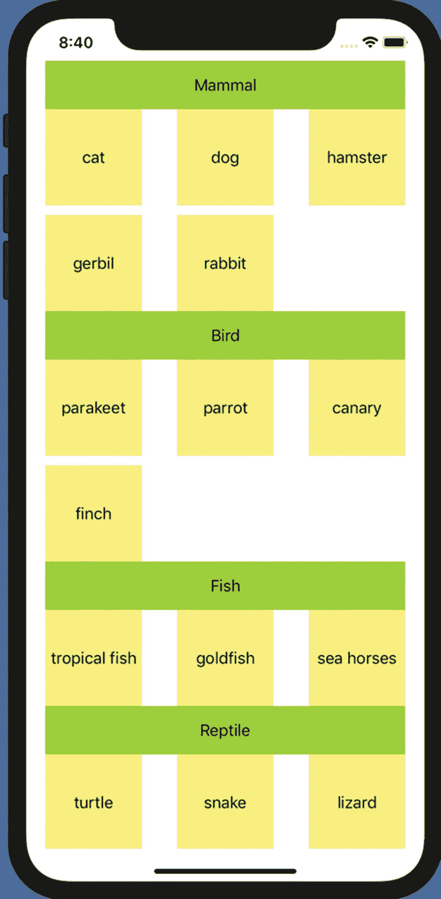

**图 16-18** 显示不同分区的 Collection View

61. 单击任意项目，弹出一个警报控制器，显示所选项目。

62. 单击 OK 关闭警报控制器。

63. 选择`Simulator ➤ Quit Simulator`返回 Xcode。

## 总结

Collection View 的工作方式类似于 Table View，都需要定义代理和数据源。Collection View 更加灵活，因为它支持水平或垂直滚动，并以网格形式显示项目，而不是像 Table View 那样堆叠成行。

为了组织 Collection View 中数据的显示，可以定义分区标题。要进一步自定义 Collection View 的外观，可以将标签等对象拖放到 Collection View Cell 上，并创建一个单独的`.swift`类文件链接到该 Cell。这样便可以创建`IBOutlet`来显示数据。

可以将 Collection View 视为更复杂、更通用的 Table View。一旦理解了 Table View 的工作方式，就可以轻松学习如何在未来的应用中创建和使用 Collection View。


# 17. 使用导航控制器

只有最简易的应用程序（如计算器应用）才由单个视图构成。大多数应用通常需要两个或更多视图来展示信息。虽然你可以创建按钮并将它们链接到不同视图，但这是一种笨拙的解决方案。更好的做法是将相关视图组织在一起。

`Xcode` 提供了两种将相关视图分组的方法。一种是使用导航控制器（Navigation Controller）。这允许用户按顺序浏览一系列视图，每个视图可以打开下一个视图，并且一个特殊的返回按钮可以返回到上一个视图，如图 17-1 所示。

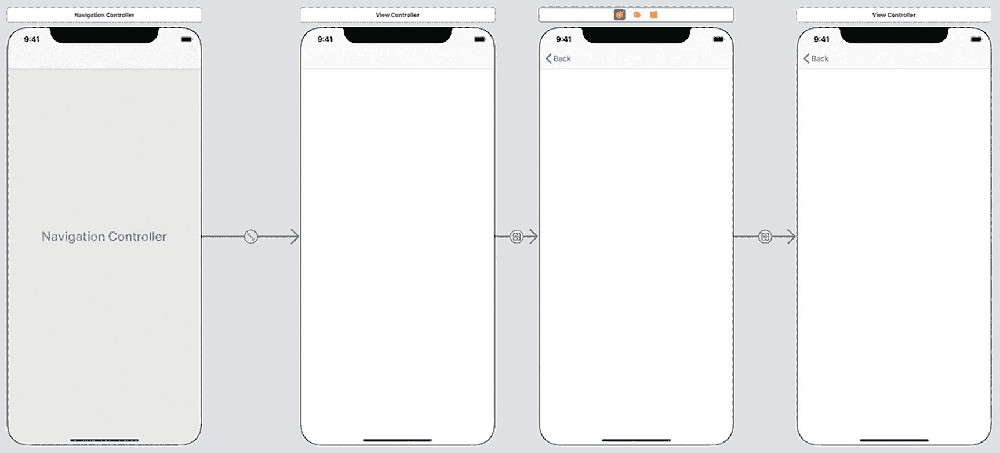

图 17-1

导航控制器可以按顺序显示多个视图

iOS 自带的许多应用都依赖导航控制器，例如邮件、照片和设置应用。通常，应用会在表格视图中以行列表的形式显示选项。选择一个选项后，会显示另一个选项列表，直到最终到达显示信息的最后一个屏幕，如图 17-2 所示。

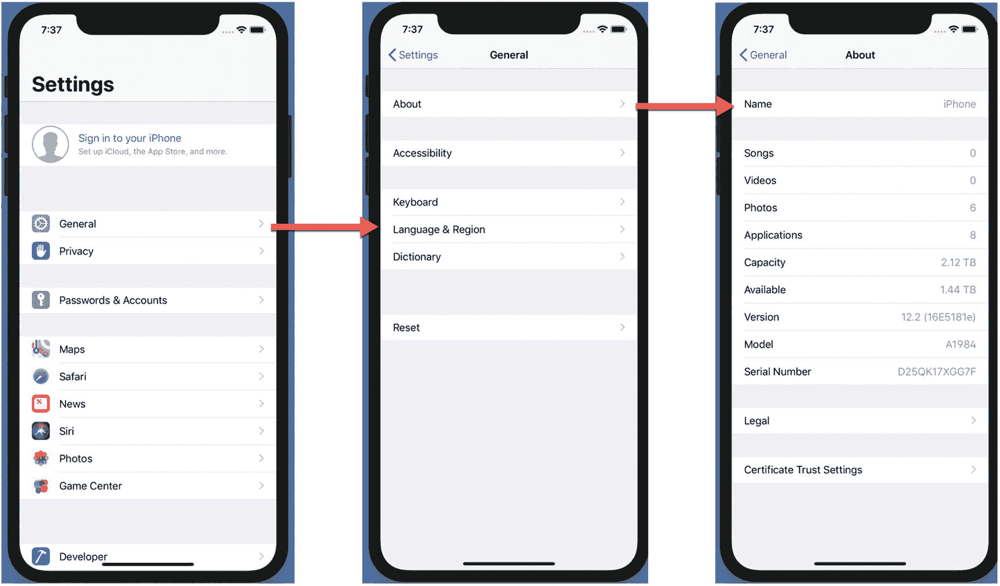

图 17-2

许多应用依赖导航控制器来显示多个选项

导航控制器旨在向用户展示层级数据，通常以表格视图中存储的信息行形式呈现。请注意，无论屏幕上显示哪个视图，导航控制器始终会在屏幕左上角提供一个返回按钮，允许用户返回到上一个视图。导航控制器使用户能够轻松地在顺序排列的视图列表中来回切换。

## 使用导航控制器

导航控制器充当根视图（root view）周围的框架。根视图显示数据，而导航控制器在每个视图顶部提供一个导航栏（navigation bar），可以显示标题和按钮，如图 17-3 所示。

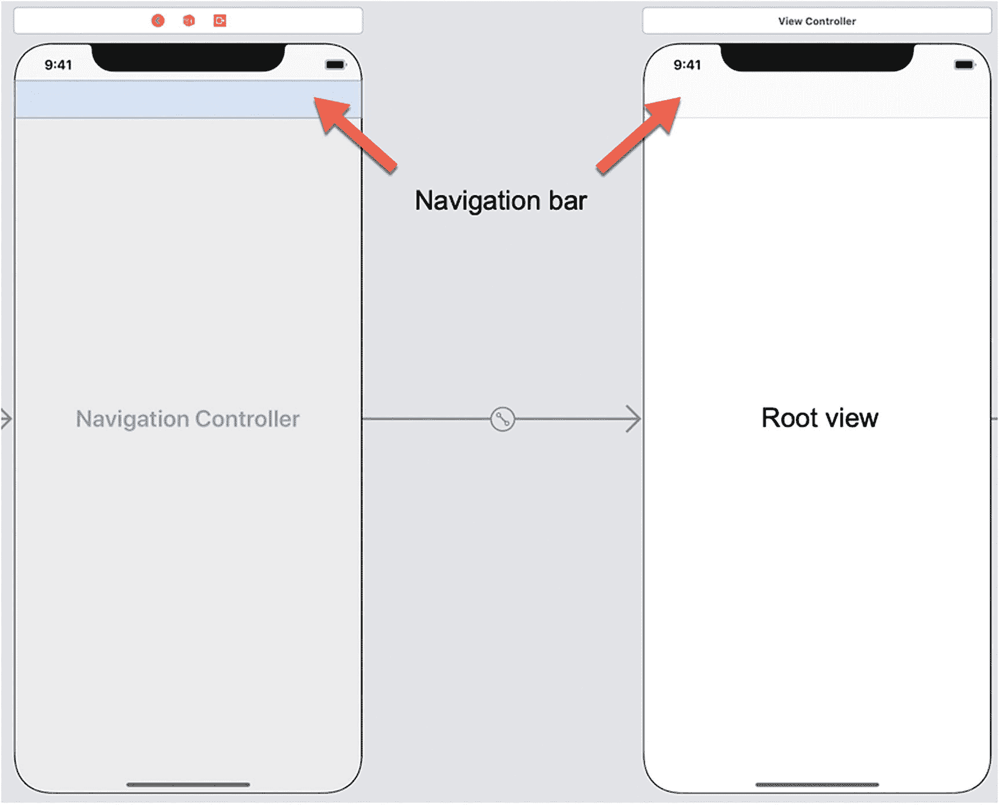

图 17-3

导航控制器的组成部分

每个导航控制器恰好需要一个根视图。就其本身而言，导航控制器及其根视图除了显示数据外别无他用。使导航控制器变得有用的是，根视图通过一个称为转场（segue）的链接连接到另一个视图。

转场由一个标识名称和从一个视图到另一个视图的可视链接组成。第一个视图需要一个按钮或其他元素，供用户触发转场并显示第二个视图。然后，导航控制器会自动在第二个视图的导航栏上显示一个返回按钮，允许用户返回第一个视图。显示另一个视图所需的唯一代码是：

```
performSegue(withIdentifier: "segueIdentifier", sender: self)
```

要了解如何创建一个简单的导航控制器，请按照以下步骤操作：

1.  使用单视图应用模板创建一个新的 iOS 项目（参见第 1 章），并将此新项目命名为 `SimpleNavigationApp`。这会为界面创建一个单独的视图。

2.  在导航器面板中点击 `Main.storyboard` 文件。`Xcode` 会显示该单视图。

3.  在文档大纲中点击视图控制器场景。

4.  选择 Editor ➤ Embed In ➤ Navigation Controller。`Xcode` 会在故事板中显示一个导航控制器，并将该单视图设为导航控制器的根视图，如图 17-4 所示。

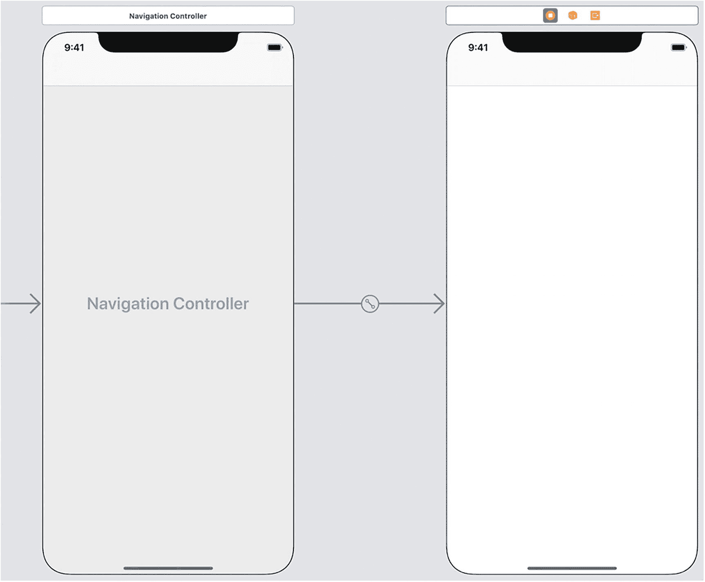

图 17-4

将视图嵌入导航控制器

5.  点击库图标以打开对象库窗口。

6.  从对象库窗口中拖放一个视图控制器到故事板上，如图 17-5 所示。

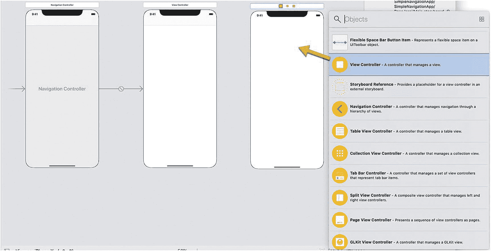

图 17-5

将视图控制器拖放到故事板上

7.  在文档大纲中，点击你刚添加到故事板的视图控制器下的 View。`Xcode` 会高亮显示该视图。此视图出现在未连接到导航控制器的视图控制器上，如图 17-6 所示。

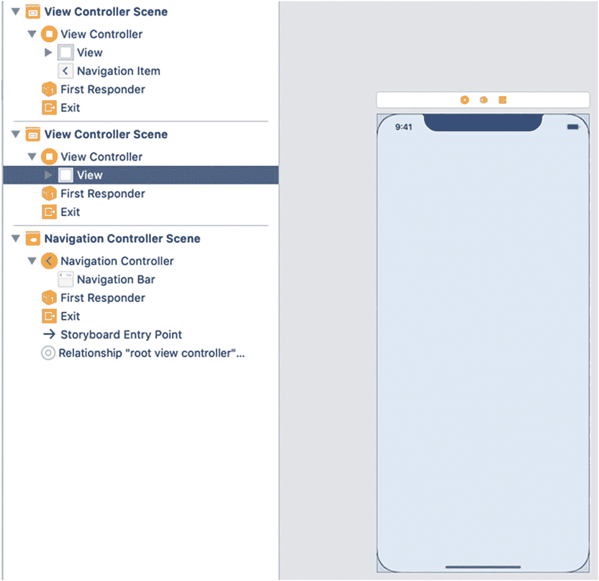

图 17-6

选择新添加的视图控制器的视图

8.  选择 View ➤ Inspectors ➤ Show Attributes Inspector，或点击 Xcode 窗口右上角的属性检查器图标。

9.  点击 Background 弹出菜单并选择一种颜色。`Xcode` 会用该颜色填充这个新添加的视图控制器的视图。当这个视图控制器出现时，此颜色将便于验证。

10.  点击根控制器的视图控制器图标，按住 Control 键，然后 Ctrl-拖动鼠标以指向新添加的视图控制器内部，如图 17-7 所示。

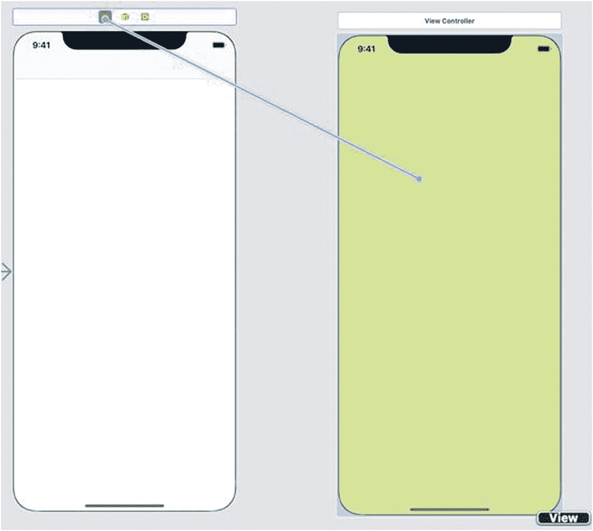

图 17-7

在根控制器和另一个视图控制器之间创建转场

11.  松开 Control 键和鼠标左键。会弹出如图 17-8 所示的弹出菜单。

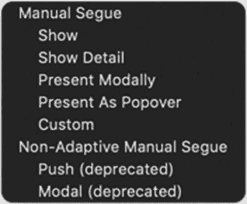

图 17-8


### 弹出菜单助你定义转场

12.  选择**显示**。Xcode 会绘制一条连接根视图与新添加视图控制器的箭头（转场），如图 17-9 所示。

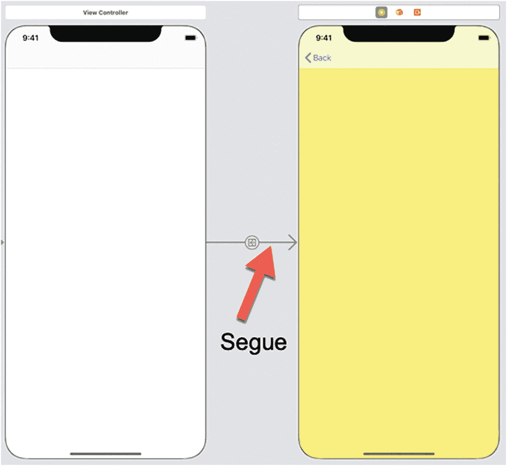

**图 17-9** – 导航控制器内连接两个视图的转场

13.  在文档大纲中点击**显示转场到“视图控制器”**。Xcode 会高亮显示两个视图之间的转场，如图 17-10 所示。

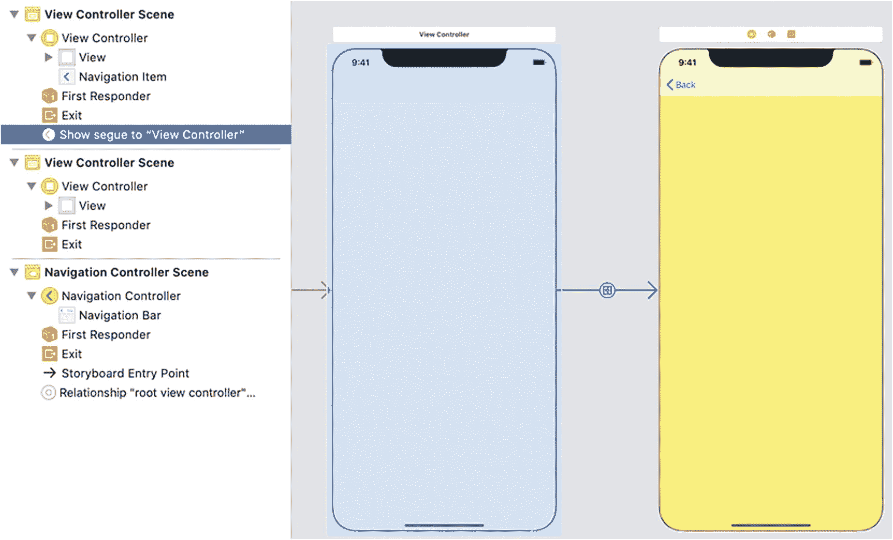

**图 17-10** – 选中两个视图之间的转场

14.  选择**视图 ➤ 检查器 ➤ 显示属性检查器**，或点击 Xcode 窗口右上角的属性检查器图标。

15.  点击标识符文本字段，输入 **firstLink**，然后按回车键，如图 17-11 所示。

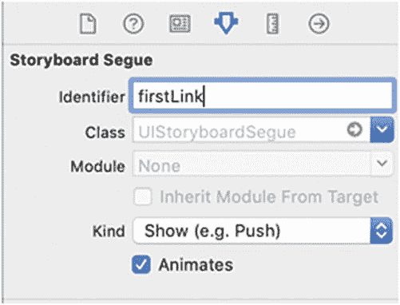

**图 17-11** – 为转场定义标识符名称

16.  在导航面板中点击 `ViewController.swift` 文件。

17.  添加以下函数：

```swift
override func touchesBegan(_ touches: Set<UITouch>, with event: UIEvent?) {
    performSegue(withIdentifier: "firstLink", sender: self)
}
```

这段代码的作用是识别名为 `"firstLink"` 的转场，并沿着该转场打开另一个视图，即具有不同背景颜色的视图。

完整的 `ViewController.swift` 文件应如下所示：

```swift
import UIKit
class ViewController: UIViewController {
    override func viewDidLoad() {
        super.viewDidLoad()
        // 加载视图后进行其他设置
    }
    override func touchesBegan(_ touches: Set<UITouch>, with event: UIEvent?) {
        performSegue(withIdentifier: "firstLink", sender: self)
    }
}
```

18.  点击**运行**按钮或选择**产品 ➤ 运行**。模拟器窗口出现，显示一个空白屏幕。

19.  在模拟器窗口内任意位置点击。这会触发 `touchesBegan` 函数运行并调用 `performSegue` 命令。请注意，现在第二个视图（带有彩色背景）出现了，并在左上角显示一个**返回**按钮，该按钮由导航控制器自动创建。

20.  选择**模拟器 ➤ 退出模拟器**以返回 Xcode。

## 向其他视图传递数据

当应用在导航控制器中显示多个视图时，在一个视图中选择或输入的数据可能需要在另一个视图中使用。由于面向对象编程的全部目的就是隔离数据，解决方案是将数据从一个视图传递到另一个视图。

若要**接收**数据，一个视图需要具备以下条件：

*   一个连接到其视图控制器的 `.swift` Cocoa Touch 类文件。
*   在此 `.swift` 文件中使用 `var` 关键字定义的属性。存储在属性中的任何数据随后都可以复制到用户界面上由 `IBOutlet` 变量连接的任何对象中。

若要**发送**数据，一个视图需要在其自身的 `.swift` Cocoa Touch 类文件中具备以下条件：

*   一个 `prepare(for:sender:)` 函数，用于定义一个表示转场目的地的常量
*   分配给接收视图的 `.swift` 文件所定义的属性的数据

要了解如何在导航控制器中将数据从一个视图传递到另一个视图，请按照以下步骤操作：

1.  确保 `CollectionViewDataApp` 已加载到 Xcode 中。
2.  在导航面板中点击 `Main.storyboard` 文件。Xcode 会显示故事板。
3.  点击库图标以打开对象库窗口。
4.  在第二个（彩色）视图上任意位置拖放一个标签。
5.  调整标签的宽度，使其能够显示超过一个单词的文本。
6.  选择**编辑器 ➤ 解决自动布局问题 ➤ 重置为建议的约束**。Xcode 会向标签添加约束。
7.  选择**文件 ➤ 新建 ➤ 文件**。Xcode 会显示一个模板列表。
8.  在 iOS 类别下选择**Cocoa Touch 类**，然后点击**下一步**按钮。会弹出另一个对话框，要求输入类名和子类。
9.  点击类文本字段，输入 **SecondViewController**。
10. 点击子类弹出菜单，选择 `UIViewController`。
11. 点击**下一步**按钮。Xcode 会询问文件存储位置。
12. 点击**创建**按钮。Xcode 会在导航面板中显示 `SecondViewController.swift` 文件。
13. 在导航面板中点击 `Main.storyboard`。
14. 点击第二个视图上方的视图控制器图标以将其选中。
15. 选择**视图 ➤ 检查器 ➤ 显示身份检查器**，或点击 Xcode 窗口右上角的身份检查器图标。
16. 点击类弹出菜单，选择 **SecondViewController**，如图 17-12 所示。这会将 `SecondViewController.swift` 文件连接到带有彩色背景的第二个视图控制器上。

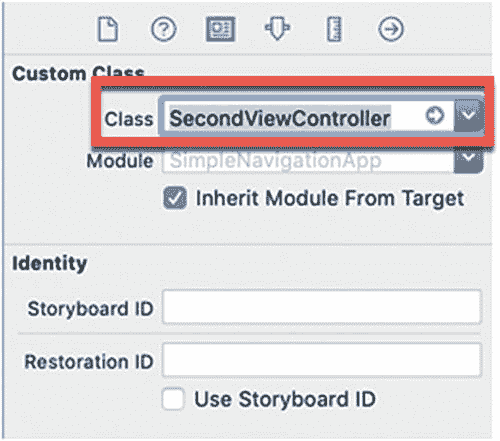

**图 17-12** – 将 `SecondViewController.swift` 文件连接到第二个视图控制器

17. 选择**视图 ➤ 助理编辑器 ➤ 显示助理编辑器**，或点击 Xcode 窗口右上角的助理编辑器图标。这会在左侧显示 `Main.storyboard` 文件，右侧显示 `SecondViewController.swift` 文件。
18. 将鼠标指针移到第二个视图的标签上，按住 Control 键，然后从标签按住 Control 键拖拽到 `class SecondViewController` 行下方的 `SecondViewController.swift` 文件中。
19. 释放 Control 键和鼠标左键。会出现一个弹出窗口。
20. 点击名称文本字段，输入 **labelDisplay**。然后点击**连接**按钮。Xcode 会创建一个 `IBOutlet`，如下所示：

```swift
@IBOutlet var labelDisplay: UILabel!
```

21. 在此 `IBOutlet` 下方添加以下内容：

```swift
var receivedString = ""
```

22. 按如下方式编辑 `viewDidLoad` 方法：

```swift
override func viewDidLoad() {
    super.viewDidLoad()
    labelDisplay.text = receivedString
    // 加载视图后进行其他设置
}
```

这个 `viewDidLoad` 方法会获取存储在 `receivedString` 属性中的任何数据，并将其存储到 `labelDisplay.text` 属性中，以便文本能够显示在用户界面的标签上。

完整的 `SecondViewController.swift` 文件应如下所示：


```swift
import UIKit
class SecondViewController: UIViewController {
@IBOutlet var labelDisplay: UILabel!
var receivedString = ""
override func viewDidLoad() {
super.viewDidLoad()
labelDisplay.text = receivedString
// Do any additional setup after loading the view.
}
}
```

23. 选择 `View ➤ Standard Editor ➤ Show Standard Editor`，或者点击 Xcode 窗口右上角的“标准编辑器”图标。

24. 在导航面板中点击 `ViewController.swift` 文件。

25. 在 `ViewController.swift` 文件中添加以下函数：

```swift
override func prepare(for segue: UIStoryboardSegue, sender: Any?) {
let nextVC = segue.destination as! SecondViewController
nextVC.navigationItem.title = "Second View Title"
nextVC.receivedString = "Passed text"
}
```

整个 `ViewController.swift` 文件应如下所示：

```swift
import UIKit
class ViewController: UIViewController {
override func viewDidLoad() {
super.viewDidLoad()
// Do any additional setup after loading the view.
}
override func touchesBegan(_ touches: Set<UITouch>, with event: UIEvent?) {
performSegue(withIdentifier: "firstLink", sender: self)
}
override func prepare(for segue: UIStoryboardSegue, sender: Any?) {
let nextVC = segue.destination as! SecondViewController
nextVC.navigationItem.title = "Second View Title"
nextVC.receivedString = "Passed text"
}
}
```

第一行声明了一个名为 `nextVC`（可以是任意名称）的常量，它将 `segue.destination` 表示为 `SecondViewController`，而后者是与 segue 目标（第二个视图控制器）相连的 `.swift` 文件的名称。

导航控制器在每个视图的顶部显示一个导航栏。访问此导航栏需要使用 `navigationItem` 并访问 `Title` 属性，以存储“Second View Title”文本。

然后我们可以访问在 `SecondViewController.swift` 文件中定义的 `receivedString` 属性，并存储“Passed text”字符串。

26. 点击运行按钮或选择 `Product ➤ Run`。模拟器窗口将会出现，显示一个空白屏幕。

27. 点击屏幕。第二个（彩色）视图将会出现，顶部显示“Second View Title”，标签中显示“Passed text”，如图 17-13 所示。

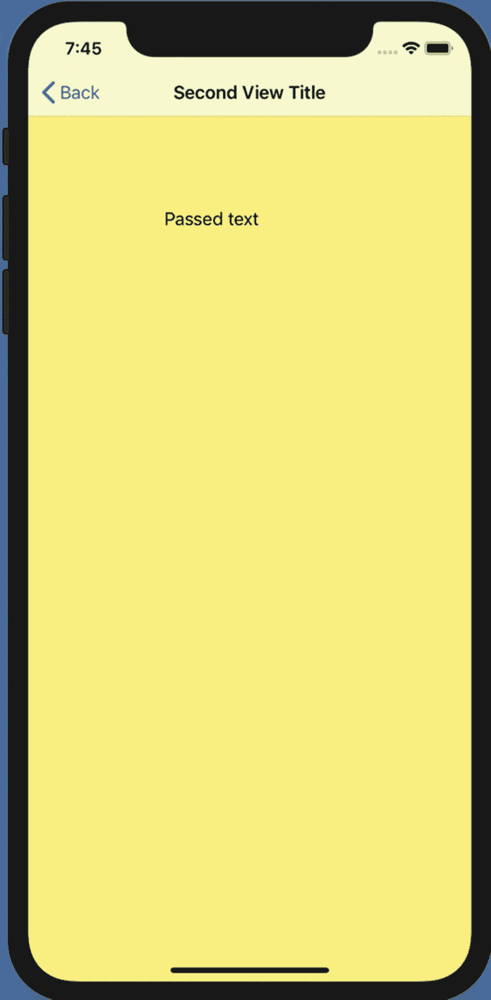

图 17-13

传递的文本显示在标题和标签中

28. 点击返回按钮返回到第一个（白色）视图。

29. 选择 `Simulator ➤ Quit Simulator` 返回到 Xcode。

## 在导航控制器中显示多个视图

每个导航控制器都需要一个根视图。但为了有用，导航控制器还需要至少一个其他视图。这样用户就可以从根视图移动到第二个视图，然后再返回根视图。当然，导航控制器可以显示多个视图，以便与根视图配合使用。通过将多个视图存储在顺序列表中，导航控制器可以显示更多信息。

每次在故事板中添加新的视图控制器时，都需要执行以下操作：

- 创建一个新的 `.swift` Cocoa Touch 类文件，并将其连接到该视图控制器。
- 从导航控制器中的最后一个视图控制器创建一个 segue 链接，连接到新添加的视图。
- 为此新的 segue 链接定义一个标识名称。
- 在最后一个视图的 `.swift` 文件中编写 Swift 代码，以便在用户交互（例如点击按钮或屏幕）触发时打开下一个显示。

要了解如何向导航控制器添加更多视图，请按照以下步骤操作：

1. 使用“单视图应用”模板创建一个新的 iOS 项目（参见第 1 章），并将此新项目命名为 `MultipleNavigationApp`。这将为用户界面创建一个单一视图。

2. 在导航面板中点击 `Main.storyboard` 文件。Xcode 会显示该单一视图。

3. 在文档大纲中点击视图控制器场景。

4. 选择 `Editor ➤ Embed In ➤ Navigation Controller`。Xcode 会在故事板中显示一个导航控制器，并将该单一视图设为导航控制器的根视图（参见图 17-4）。

5. 点击库图标以打开对象库窗口。

6. 将两个视图控制器拖放到根视图的右侧。此时应有一个导航控制器和三个视图控制器，如图 17-14 所示。此时，`ViewController.swift` 文件已连接到导航控制器的根视图（即通过箭头连接到导航控制器的那个视图）。我们需要为另外两个视图控制器分别创建独立的 `.swift` Cocoa Touch 类文件，并将它们连接起来。

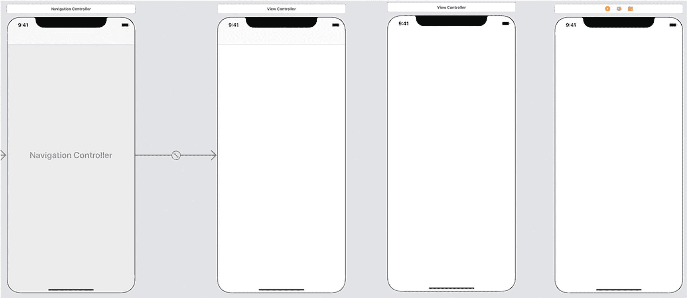

图 17-14

两个视图控制器与导航控制器及其根视图分开

7. 选择 `File ➤ New ➤ File`。Xcode 会显示一个模板列表。

8. 在 iOS 类别下选择 `Cocoa Touch Class`，然后点击 **Next** 按钮。会弹出另一个对话框，要求输入类名和子类。

9. 点击“类”文本字段，输入 `SecondViewController`。

10. 点击“子类化自”弹出菜单，选择 `UIViewController`。

11. 点击 **Next** 按钮。Xcode 会询问文件的存储位置。

12. 点击 **Create** 按钮。Xcode 会在导航面板中显示 `SecondViewController.swift` 文件。

13. 选择 `File ➤ New ➤ File`。Xcode 会显示一个模板列表。

14. 在 iOS 类别下选择 `Cocoa Touch Class`，然后点击 **Next** 按钮。会弹出另一个对话框，要求输入类名和子类。

15. 点击“类”文本字段，输入 `ThirdViewController`。

16. 点击“子类化自”弹出菜单，选择 `UIViewController`。

17. 点击 **Next** 按钮。Xcode 会询问文件的存储位置。

18. 点击 **Create** 按钮。Xcode 会在导航面板中显示 `ThirdViewController.swift` 文件。

19. 在导航面板中点击 `Main.storyboard`。

20. 点击出现在导航控制器根视图右侧的视图控制器上方的视图控制器图标，如图 17-15 所示。

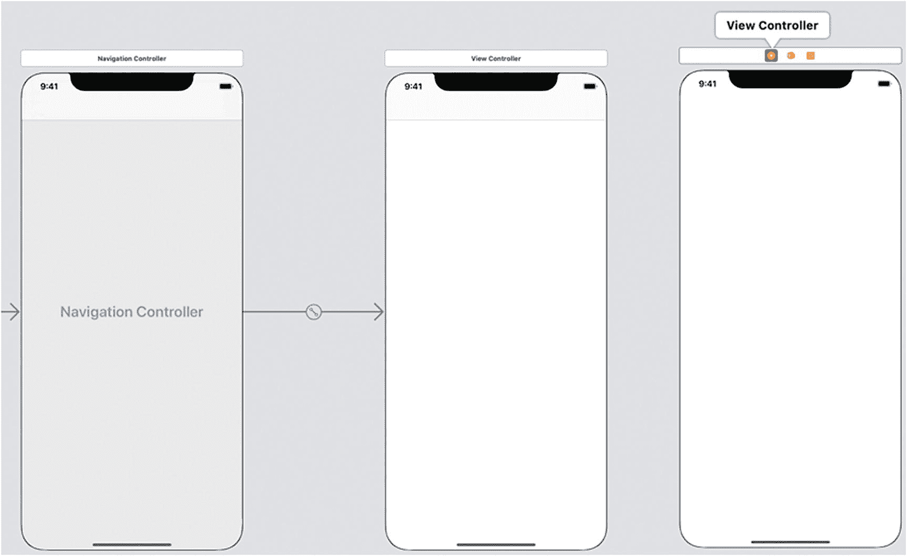

图 17-15

选择第二个视图控制器

21. 选择 `View ➤ Inspectors ➤ Show Identity Inspector`，或者点击 Xcode 窗口右上角的“身份检查器”图标。


22. 在 `Class` 弹出菜单中选择并点击 `SecondViewController`。

23. 点击最右侧出现的视图控制器（ViewController）上方的 `View Controller` 图标，如图 17-16 所示。

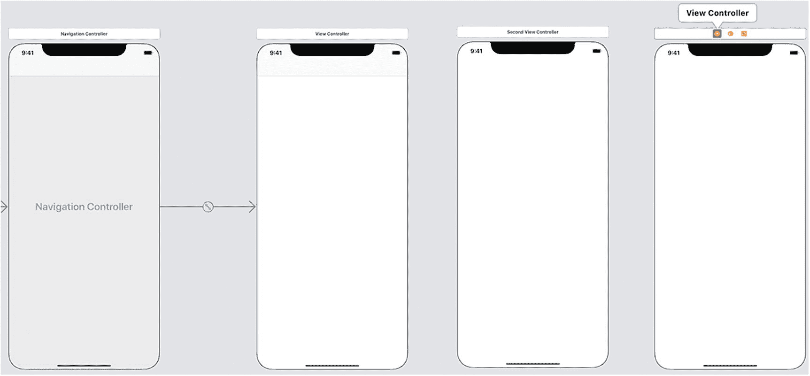

图 17-16 – 选择第三个视图控制器

24. 选择“视图”➤“检查器”➤“显示身份检查器”，或点击 Xcode 窗口右上角的 `Identity Inspector` 图标。

25. 在 `Class` 弹出菜单中选择并点击 `ThirdViewController`。

26. 将鼠标指针移到根视图上方的 `View Controller` 图标上，按住 `Control` 键，然后按住 Ctrl 键并向右拖动到视图控制器，如图 17-17 所示。

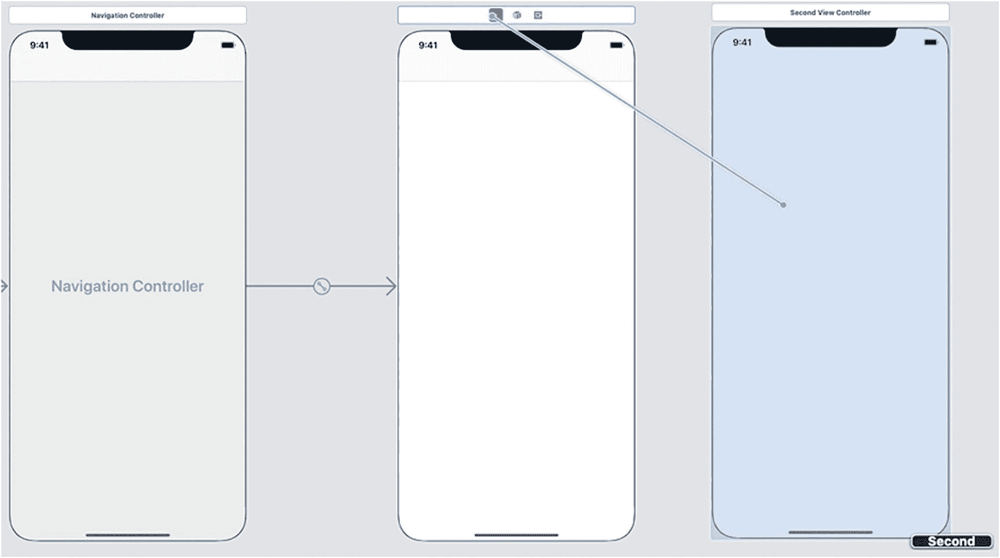

图 17-17 – 在根视图与下一个视图控制器之间创建转场

27. 松开 `Control` 键和鼠标左键。此时会出现一个弹出菜单（参见图 17-8）。

28. 选择 `Show`。Xcode 将在根视图与第二个视图控制器之间创建一个转场。

29. 点击该转场，然后选择“视图”➤“检查器”➤“显示属性检查器”，或点击 Xcode 窗口右上角的 `Attributes Inspector` 图标。

30. 在 `Identifier` 文本字段中点击，输入 `firstLink`，然后按回车键。

31. 将鼠标指针移到第二个视图控制器上方的 `View Controller` 图标上，按住 `Control` 键，然后按住 Ctrl 键并拖动到第三个视图控制器，如图 17-18 所示。

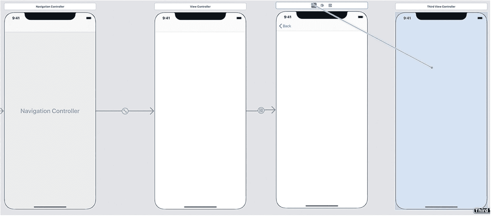

图 17-18 – 在第二个与第三个视图控制器之间创建转场

32. 松开 `Control` 键和鼠标左键。此时会出现一个弹出菜单（参见图 17-8）。

33. 选择 `Show`。Xcode 将在第二个视图控制器与第三个视图控制器之间创建一个转场。

34. 点击该转场，然后选择“视图”➤“检查器”➤“显示属性检查器”，或点击 Xcode 窗口右上角的 `Attributes Inspector` 图标。

35. 在 `Identifier` 文本字段中点击，输入 `secondLink`，然后按回车键。

36. 在导航面板中点击 `ViewController.swift` 文件，并添加以下两个函数：

```swift
override func touchesBegan(_ touches: Set, with event: UIEvent?) {
    performSegue(withIdentifier: "firstLink", sender: self)
}
override func prepare(for segue: UIStoryboardSegue, sender: Any?) {
    let nextVC = segue.destination as! SecondViewController
    nextVC.navigationItem.title = "Second View Controller"
}
```

整个 `ViewController.swift` 文件应如下所示：

```swift
import UIKit
class ViewController: UIViewController {
    override func viewDidLoad() {
        super.viewDidLoad()
        // Do any additional setup after loading the view.
    }
    override func touchesBegan(_ touches: Set, with event: UIEvent?) {
        performSegue(withIdentifier: "firstLink", sender: self)
    }
    override func prepare(for segue: UIStoryboardSegue, sender: Any?) {
        let nextVC = segue.destination as! SecondViewController
        nextVC.navigationItem.title = "Second View Controller"
    }
}
```

37. 在导航面板中点击 `SecondViewController.swift` 文件，并添加以下两个函数：

```swift
override func touchesBegan(_ touches: Set, with event: UIEvent?) {
    performSegue(withIdentifier: "secondLink", sender: self)
}
override func prepare(for segue: UIStoryboardSegue, sender: Any?) {
    let nextVC = segue.destination as! ThirdViewController
    nextVC.navigationItem.title = "Third View Controller"
}
```

整个 `SecondViewController.swift` 文件应如下所示：

```swift
import UIKit
class SecondViewController: UIViewController {
    override func viewDidLoad() {
        super.viewDidLoad()
        // Do any additional setup after loading the view.
    }
    override func touchesBegan(_ touches: Set, with event: UIEvent?) {
        performSegue(withIdentifier: "secondLink", sender: self)
    }
    override func prepare(for segue: UIStoryboardSegue, sender: Any?) {
        let nextVC = segue.destination as! ThirdViewController
        nextVC.navigationItem.title = "Third View Controller"
    }
}
```

38. 点击 `Run` 按钮，或选择“产品”➤“运行”。模拟器窗口将出现，并显示空白的根视图屏幕。

39. 点击屏幕。第二个视图将出现，显示标题“Second View Controller”，左上角有一个 `Back` 按钮，如图 17-19 所示。

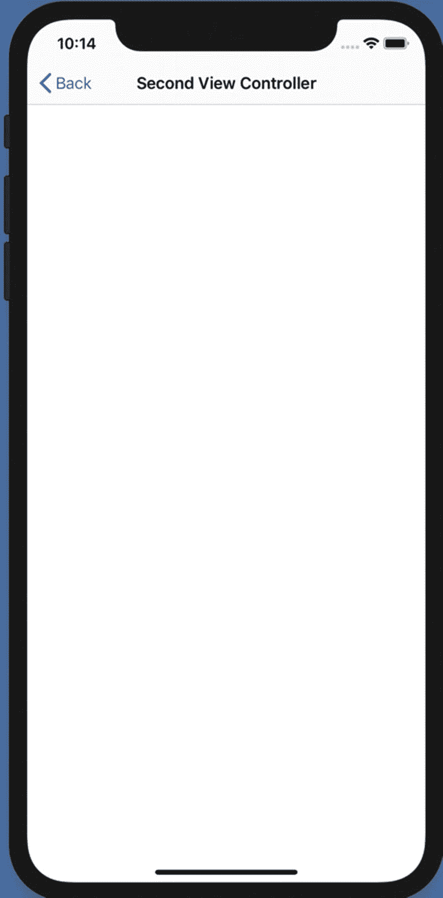

图 17-19 – 显示第二个视图控制器

40. 点击视图。第三个视图控制器将出现，显示标题“Third View Controller”。

41. 点击 `Back` 按钮，然后点击视图，即可在所有三个视图控制器之间来回切换。

42. 选择“模拟器”➤“退出模拟器”以返回 Xcode。

## 自定义导航栏

导航控制器会在每个视图的顶部自动显示一个导航栏。该导航栏至少会在左上角显示一个 `Back` 按钮，以便用户始终可以返回上一个视图。

默认情况下，此 `Back` 按钮始终显示“Back”，但你可以将这段文本自定义为上一个视图的标题。你还可以在导航栏上添加自己的按钮来显示其他选项。自定义导航栏可以为你的应用用户创造更独特的视觉体验，如图 17-20 所示。

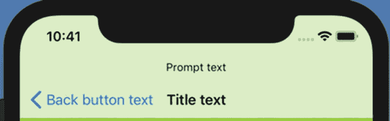

图 17-20 – 为提示、标题和返回按钮显示自定义文本

自定义导航栏的一些不同方式包括：

* **提示** – 在导航栏顶部显示一行额外的文本
* **标题** – 定义显示在导航栏中间的文本
* **返回按钮** – 将返回按钮的默认文本“Back”更改为更具描述性的内容
* **颜色** – 定义导航栏的颜色


### 修改提示文本与标题文本

默认情况下，导航栏不显示提示文字或标题文字。标题文字通常显示屏幕上信息的名称或类别，例如“设置”应用中标识不同数据类别的标题文本，如图 17-21 所示。

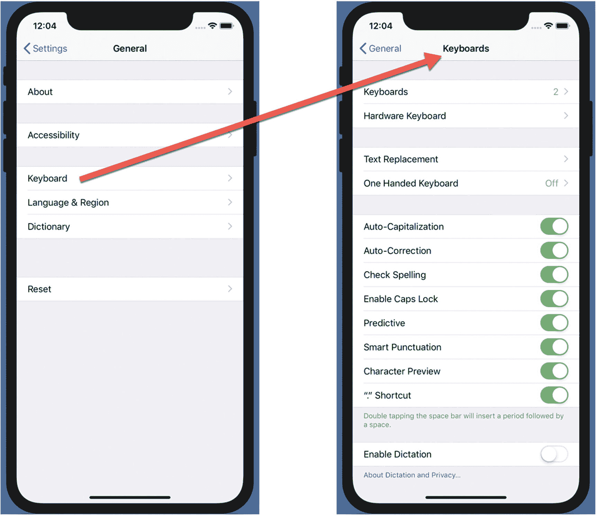

图 17-21：标题通常显示上一视图中选中的选项

提示文本使用较少，但可以向用户显示有用的信息。要了解如何修改导航栏的提示文本和标题文本，请按照以下步骤操作：

1.  使用“单视图应用”模板创建一个新的 iOS 项目（参见第 1 章），并将该项目命名为 `NavigationTextApp`。这将为用户界面创建一个单视图。

2.  在导航器窗格中点击 `Main.storyboard` 文件。Xcode 将显示该单视图。

3.  在文档大纲中点击“视图控制器场景”。

4.  选择“编辑器”➤“嵌入”➤“导航控制器”。Xcode 会在故事板中显示一个导航控制器，并将该单视图设置为导航控制器的根视图（见图 17-4）。

5.  点击“库”图标以打开“对象库”窗口。

6.  将一个视图控制器拖放到根视图的右侧。

7.  选择“文件”➤“新建”➤“文件”。Xcode 会显示一个模板列表。

8.  在 iOS 类别下选择“Cocoa Touch 类”，然后点击**下一步**按钮。会弹出另一个对话框，要求输入类名和子类。

9.  在“类”文本字段中点击，然后输入 `SecondViewController`。

10. 在“子类”弹出菜单中点击，然后选择 `UIViewController`。

11. 点击**下一步**按钮。Xcode 会询问文件的存储位置。

12. 点击**创建**按钮。Xcode 会在导航器窗格中显示 `SecondViewController.swift` 文件。

13. 在导航器窗格中点击 `Main.storyboard` 文件，然后点击你刚刚添加到故事板的视图控制器顶部的“视图控制器”图标。

14. 选择“视图”➤“检查器”➤“显示身份检查器”，或点击 Xcode 窗口右上角的“身份检查器”图标。

15. 在“类”弹出菜单中点击，然后选择 `SecondViewController`。

16. 将鼠标指针移到根视图的“视图控制器”图标上，按住 Control 键，并向你刚刚添加的第二个视图控制器进行 Ctrl-拖拽，如图 17-22 所示。

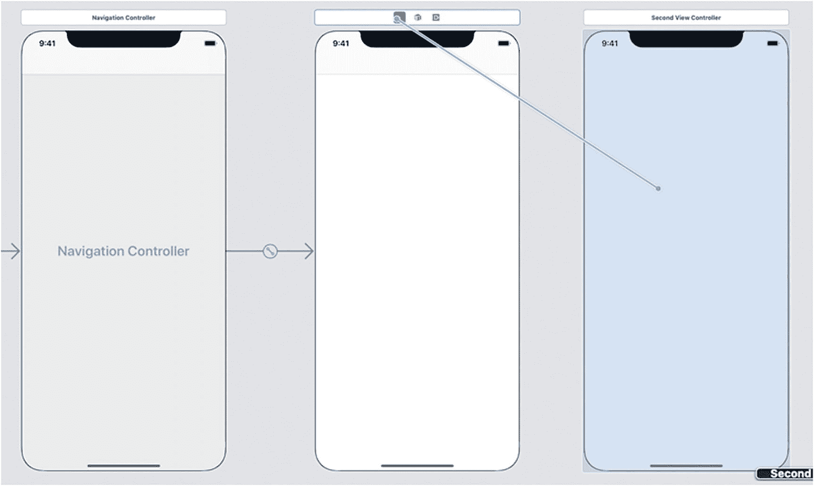

图 17-22：将根视图连接到新添加的视图控制器

17. 松开 Control 键和鼠标左键。会弹出一个菜单（见图 17-8）。

18. 选择“Show”。Xcode 会绘制一个箭头（转场），将根视图连接到新添加的视图控制器（见图 17-9）。

19. 在文档大纲中点击“Show segue to 'Second View Controller'”。Xcode 会高亮显示两个视图之间的转场。

20. 选择“视图”➤“检查器”➤“显示属性检查器”，或点击 Xcode 窗口右上角的“属性检查器”图标。

21. 在“标识符”文本字段中点击，输入 `firstLink`，然后按回车键。

22. 在导航器窗格中点击 `ViewController.swift` 文件。

23. 按如下方式编辑 `viewDidLoad` 方法，以定义根视图的提示文本和标题文本：

```
override func viewDidLoad() {
    super.viewDidLoad()
    navigationItem.prompt = "Prompt text"
    navigationItem.title = "Title text"
    // Do any additional setup after loading the view.
}
```

24. 在 `viewDidLoad` 方法下方添加以下函数：

```
override func touchesBegan(_ touches: Set, with event: UIEvent?) {
    performSegue(withIdentifier: "firstLink", sender: self)
}
```

25. 在上一个函数下方添加以下函数：

```
override func prepare(for segue: UIStoryboardSegue, sender: Any?) {
    let nextVC = segue.destination as! SecondViewController
    nextVC.navigationItem.prompt = "New prompt here"
    nextVC.navigationItem.title = "New title here"
}
```

此函数为第二个视图控制器定义了新的提示文本和标题文本。

26. 点击“运行”按钮，或选择“产品”➤“运行”。模拟器窗口将出现，显示根视图屏幕，顶部为“Prompt text”，其下方为“Title text”，如图 17-23 所示。

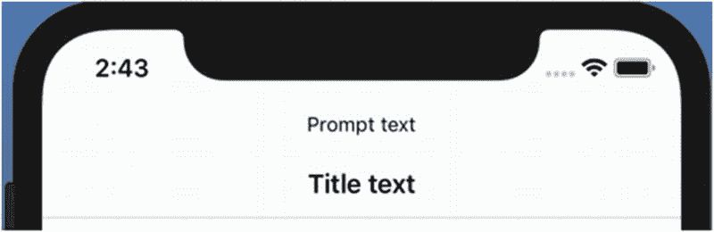

图 17-23：在根视图上显示提示文本和标题文本

27. 点击屏幕以显示第二个视图控制器。请注意，此时提示文本显示为“New prompt here”，标题文本显示为“New title here”。同时请注意，“返回”按钮显示了上一个视图的标题，如图 17-24 所示。（如果上一个视图没有标题，那么“返回”按钮将仅显示默认文本“Back”。）

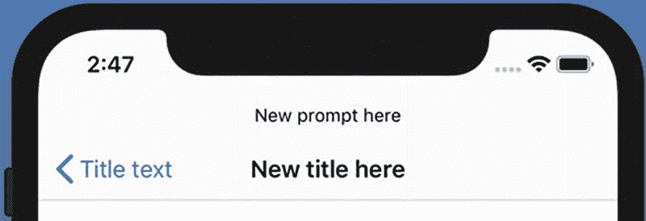

图 17-24：第二个视图控制器上不同的提示文本和标题文本

28. 选择“模拟器”➤“退出模拟器”以返回 Xcode。


### 修改返回按钮

导航控制器始终在视图的左上角显示一个返回按钮，以便用户可以返回上一个视图。你可以修改返回按钮上显示的颜色和文字。修改返回按钮文字有以下三种方式：

- 如果上一个视图没有标题，则返回按钮默认显示“返回”。
- 如果上一个视图有标题，则返回按钮显示该标题。
- 如果你自定义了`backBarButtonItem`属性，则可以定义新的返回按钮文字。

返回按钮文字的默认颜色为浅蓝色，但你可以通过修改导航栏的`tintColor`属性来定义不同的颜色。要了解如何更改返回按钮的文字和颜色，请按照以下步骤操作：

1. 确保 `NavigationTextApp` 项目已加载到 Xcode 中。
2. 单击导航器窗格中的 `ViewController.swift` 文件。
3. 修改 `prepare(for:sender:)` 函数，如下所示：

    ```
    override func prepare(for segue: UIStoryboardSegue, sender: Any?) {
        let nextVC = segue.destination as! SecondViewController
        nextVC.navigationItem.prompt = "New prompt here"
        nextVC.navigationItem.title = "New title here"
        let customButton = UIBarButtonItem()
        customButton.title = "New back text"
        navigationItem.backBarButtonItem = customButton
    }
    ```

    这最后三行代码创建了一个新的 `UIBarButtonItem`，定义了一个新标题，然后将这个新的栏按钮存储在 `backBarButtonItem` 属性中，以定义返回按钮上显示的新文字。

4. 修改 `viewDidLoad` 方法，如下所示：

    ```
    override func viewDidLoad() {
        super.viewDidLoad()
        navigationItem.prompt = "Prompt text"
        navigationItem.title = "Title text"
        navigationController?.navigationBar.tintColor = UIColor.red
        // Do any additional setup after loading the view.
    }
    ```

    导航栏上的 `tintColor` 属性（由导航控制器定义）决定了返回按钮文字的颜色。上述代码将返回按钮文字改为红色，但你可以选择任何颜色，例如黄色或绿色。

    完整的 `ViewController.swift` 文件应如下所示：

    ```
    import UIKit
    class ViewController: UIViewController {
        override func viewDidLoad() {
            super.viewDidLoad()
            navigationItem.prompt = "Prompt text"
            navigationItem.title = "Title text"
            navigationController?.navigationBar.tintColor = UIColor.red
            // Do any additional setup after loading the view.
        }
        override func touchesBegan(_ touches: Set, with event: UIEvent?) {
            performSegue(withIdentifier: "firstLink", sender: self)
        }
        override func prepare(for segue: UIStoryboardSegue, sender: Any?) {
            let nextVC = segue.destination as! SecondViewController
            nextVC.navigationItem.prompt = "New prompt here"
            nextVC.navigationItem.title = "New title here"
            let customButton = UIBarButtonItem()
            customButton.title = "New back text"
            navigationItem.backBarButtonItem = customButton
        }
    }
    ```

5. 单击“运行”按钮或选择“产品”➤“运行”。此时将显示模拟器窗口，顶部为“Prompt text”文本，其下方为“Title text”文本（参见图 17-23）。
6. 单击屏幕。将出现下一个视图。请注意，第二个视图将返回按钮文字显示为“New back text”，并且颜色为红色。
7. 选择“模拟器”➤“退出模拟器”以返回 Xcode。

### 修改导航栏的颜色

`barTintColor` 属性用于定义导航栏的颜色。请记住，无论你为导航栏选择何种颜色，都应与为返回按钮定义的颜色形成对比，以便清晰可见。

要了解如何更改导航栏的颜色，请按照以下步骤操作：

1. 确保 `NavigationTextApp` 项目已加载到 Xcode 中。
2. 单击导航器窗格中的 `ViewController.swift` 文件。
3. 修改 `viewDidLoad` 方法，如下所示：

    ```
    override func viewDidLoad() {
        super.viewDidLoad()
        navigationItem.prompt = "Prompt text"
        navigationItem.title = "Title text"
        navigationController?.navigationBar.tintColor = UIColor.red
        navigationController?.navigationBar.barTintColor = UIColor.green
        // Do any additional setup after loading the view.
    }
    ```

    请注意，导航栏的 `tintColor` 属性定义了返回按钮文字，而 `barTintColor` 属性定义了导航栏的颜色。

4. 单击“运行”按钮或选择“产品”➤“运行”。将显示模拟器窗口。请注意，导航栏现在显示为绿色。
5. 单击屏幕。将出现下一个视图。
6. 选择“模拟器”➤“退出模拟器”以返回 Xcode。


### 向导航栏添加按钮

导航栏始终会在除根视图以外的所有视图上显示一个返回按钮。不过，你还可以在导航栏右侧添加更多按钮。然后，你可以将这些按钮连接到 `IBAction` 方法，使它们真正发挥作用。

除了自定义按钮标题外，Xcode 还包含几种常见的按钮类型供你选择，例如“保存”、“完成”、“回复”、“相机”、“播放”、“搜索”或“撤销”，如图 17-25 所示。

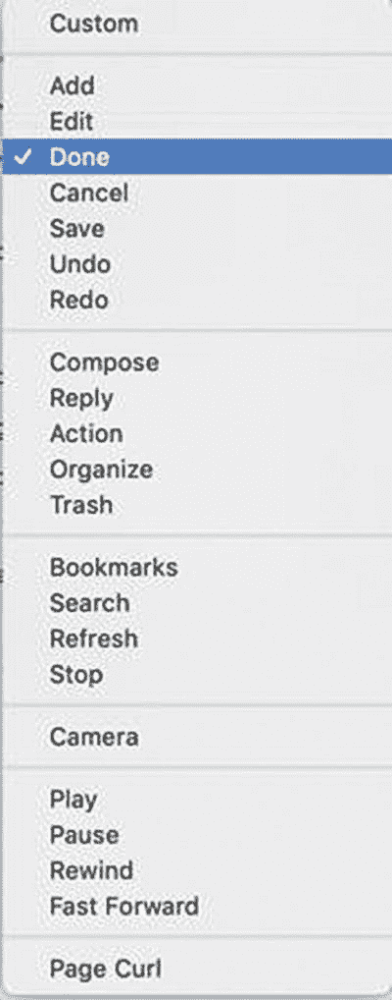

图 17-25：可放置在导航栏上的常见按钮类型

要了解如何添加和自定义导航栏上的按钮，请按照以下步骤操作：

1.  使用“单视图应用程序”模板创建一个新的 iOS 项目（请参阅第 1 章），并将此新项目命名为 `NavigationButtonApp`。这将为用户界面创建一个单视图。
2.  在导航器面板中点击 `Main.storyboard` 文件。Xcode 会显示该单视图。
3.  在文档大纲中点击“视图控制器场景”。
4.  选择“编辑器”➤“嵌入于”➤“导航控制器”。Xcode 会在故事板中显示一个导航控制器，并将该单视图设为导航控制器的根视图（见图 17-4）。
5.  点击“库”图标以打开“对象库”窗口。
6.  将一个“视图控制器”拖放到根视图的右侧。
7.  选择“文件”➤“新建”➤“文件”。Xcode 会显示模板列表。
8.  在 iOS 类别下选择“Cocoa Touch 类”，然后点击**“下一步”**按钮。会出现另一个对话框，要求输入类名和子类。
9.  在“类”文本框中点击，并输入 **`SecondViewController`**。
10. 在“子类”弹出菜单中点击，并选择 `UIViewController`。
11. 点击**“下一步”**按钮。Xcode 会询问文件的存储位置。
12. 点击**“创建”**按钮。Xcode 会在导航器面板中显示 `SecondViewController.swift` 文件。
13. 在导航器面板中点击 `Main.storyboard` 文件，然后点击你刚刚添加到故事板的视图控制器顶部的“视图控制器”图标。
14. 选择“视图”➤“检查器”➤“显示身份检查器”，或点击 Xcode 窗口右上角的“身份检查器”图标。
15. 在“类”弹出菜单中点击，并选择 `SecondViewController`。
16. 将鼠标指针移到根视图的“视图控制器”图标上，按住 Control 键，然后按住 Control 键拖动到刚刚添加的第二个视图控制器上（见图 17-22）。
17. 松开 Control 键和鼠标左键。会弹出一个菜单（见图 17-8）。
18. 选择“显示”。Xcode 会绘制一个箭头（转场），将根视图连接到新添加的视图控制器（见图 17-9）。
19. 在文档大纲中点击“显示转场到‘第二个视图控制器’”。Xcode 会高亮两个视图之间的转场。
20. 选择“视图”➤“检查器”➤“显示属性检查器”，或点击 Xcode 窗口右上角的“属性检查器”图标。
21. 在“标识符”文本框中点击，输入 **`firstLink`**，然后按回车键。
22. 在导航器面板中点击 `ViewController.swift` 文件。
23. 在 `viewDidLoad` 方法下方添加以下函数：
    ```
    override func touchesBegan(_ touches: Set, with event: UIEvent?) {
        performSegue(withIdentifier: "firstLink", sender: self)
    }
    ```
24. 在导航器面板中点击 `Main.storyboard` 文件。
25. 点击“库”图标以打开“对象库”窗口。
26. 将一个“栏按钮项”拖放到根视图导航栏的最右侧，如图 17-26 所示。

    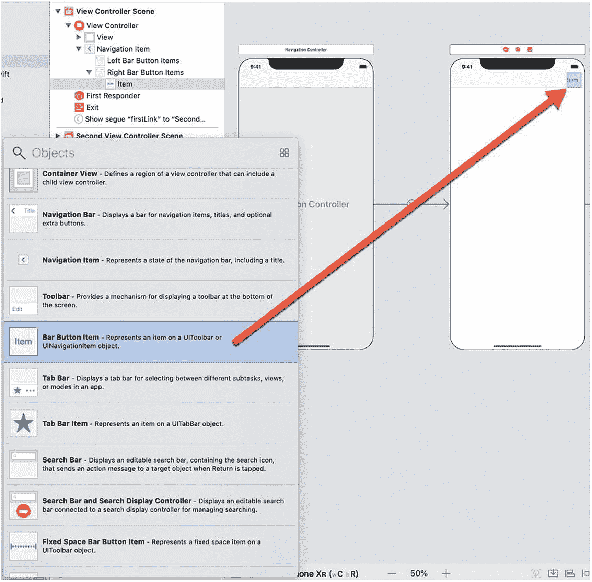

    图 17-26：将“栏按钮项”拖放到根视图的导航栏上

27. 选择“视图”➤“检查器”➤“显示属性检查器”，或点击 Xcode 窗口右上角的“属性检查器”图标。
28. 在“系统项目”弹出菜单中点击，并选择“操作”。注意，Xcode 会在栏按钮上显示一个图标，如图 17-27 所示。

    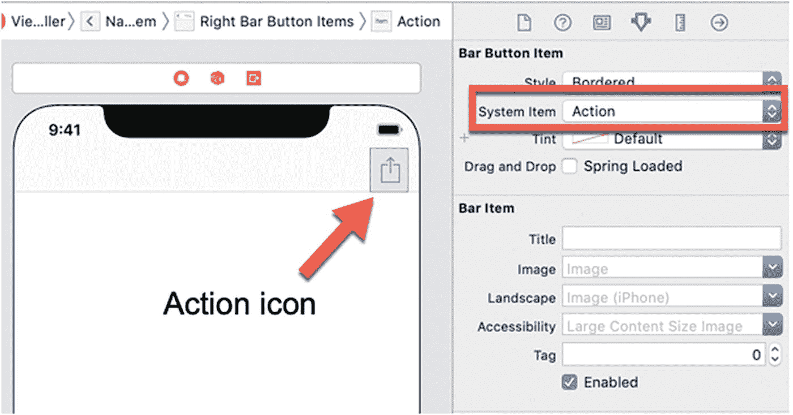

    图 17-27：从“系统项目”弹出菜单中选择“操作”

29. 选择“视图”➤“辅助编辑器”➤“显示辅助编辑器”。Xcode 会并排显示 `Main.storyboard` 和 `ViewController.swift` 文件。
30. 将鼠标指针移到显示“操作”图标的栏按钮上，按住 Control 键，然后按住 Control 键从栏按钮拖拽到 `ViewController.swift` 文件底部最后一个花括号上方的空白区域内。
31. 松开 Control 键和鼠标左键。会弹出一个窗口。
32. 在“名称”文本框中点击，并输入 **`buttonTapped`**。
33. 在“类型”弹出菜单中点击，选择 `UIBarButtonItem`，然后点击“连接”按钮。Xcode 会创建一个 `IBAction` 方法。
34. 按如下方式编辑 `buttonTapped` `IBAction` 方法：
    ```
    @IBAction func buttonTapped(_ sender: UIBarButtonItem) {
        let alert = UIAlertController(title: "消息", message: "栏按钮已点击", preferredStyle: .alert)
        let okAction = UIAlertAction(title: "确定", style: .default, handler: { action -> Void in
            // 只是关闭操作表
        })
        alert.addAction(okAction)
        self.present(alert, animated: true, completion: nil)
    }
    ```

如果你此时运行该应用程序，将看到一个视图，右上角有一个按钮。点击此按钮将显示一个警报控制器。点击视图本身将显示第二个视图，其左上角有一个返回按钮。

如果你希望导航栏按钮也出现在这个第二个视图上，你必须首先在此第二个视图控制器上添加一个导航项（导航栏）。然后，你才能向该导航项添加一个栏按钮。

35. 选择“视图”➤“标准编辑器”➤“显示标准编辑器”。Xcode 会并排显示 `Main.storyboard` 和 `ViewController.swift` 文件。
36. 在导航器面板中点击 `Main.storyboard` 文件。
37. 点击出现在第二个视图控制器顶部的“第二个视图控制器”图标。
38. 选择“编辑器”➤“嵌入于”➤“导航控制器”。Xcode 会将第二个视图控制器嵌入到一个导航控制器中，如图 17-28 所示。

    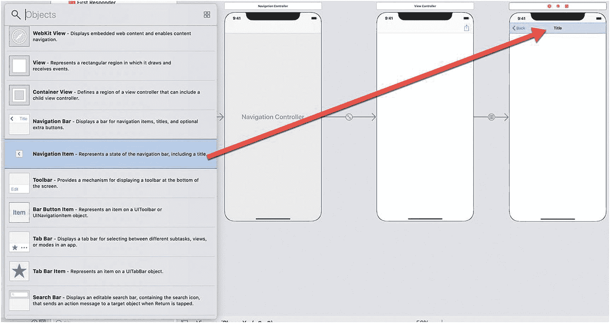

    图 17-28：向第二个视图控制器添加导航项

39. 点击“库”图标以打开“对象库”窗口。
40. 将一个“栏按钮项”拖放到第二个视图控制器根视图的导航栏最右侧，如图 17-29 所示。

    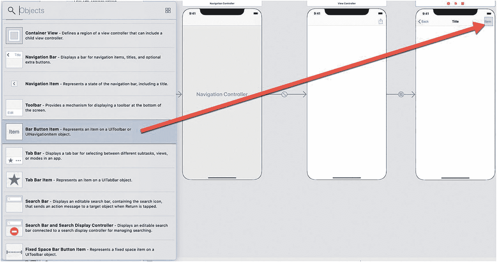

    图 17-29：将一个“栏按钮项”拖放到第二个视图控制器的导航栏上

41. 选择“视图”➤“检查器”➤“显示属性检查器”，或点击 Xcode 窗口右上角的“属性检查器”图标。
42. 在“系统项目”弹出菜单中点击，并选择“完成”。注意，Xcode 会在栏按钮上显示“完成”字样，如图 17-30 所示。

    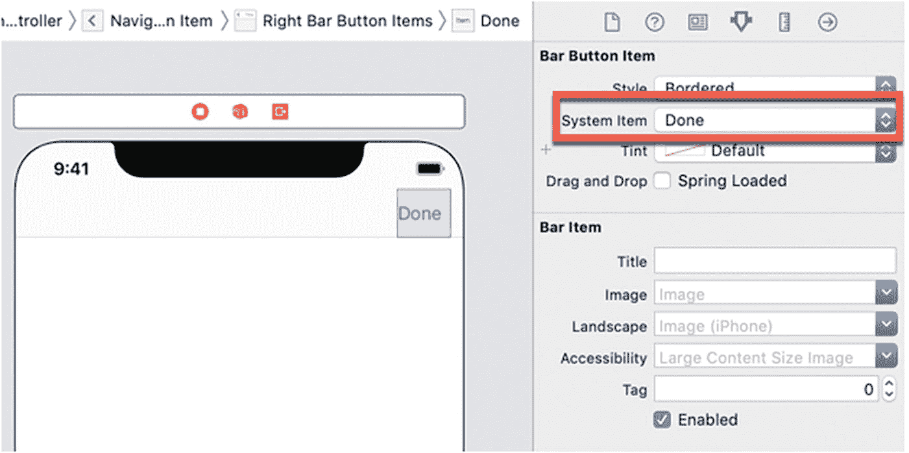

    图 17-30：从“系统项目”弹出菜单中选择“完成”

43. 选择“视图”➤“辅助编辑器”➤“显示辅助编辑器”。Xcode 会并排显示 `Main.storyboard` 和 `SecondViewController.swift` 文件。


44. 将鼠标指针悬停在显示`Done`按钮的栏按钮上，按住`Control`键，然后从该栏按钮`Ctrl`-拖拽到`SecondViewController.swift`文件底部最后一个花括号上方的空白处。

45. 松开`Control`键和鼠标左键。此时会弹出一个窗口。

46. 点击`Name`文本字段，并输入`doneTapped`。

47. 点击`Type`弹出菜单，选择`UIBarButtonItem`，然后点击`Connect`按钮。Xcode 会创建一个`IBAction`方法。

48. 按如下方式编辑`doneTapped`这个`IBAction`方法：

```
@IBAction func doneTapped(_ sender: UIBarButtonItem) {
let alert = UIAlertController(title: "Message", message: "Done button tapped", preferredStyle: .alert)
let okAction = UIAlertAction(title: "OK", style: .default, handler: { action -> Void in
//Just dismiss the action sheet
})
alert.addAction(okAction)
self.present(alert, animated: true, completion: nil)
}
```

49. 点击`Run`按钮或选择`Product` ➤ `Run`。模拟器窗口将出现，显示带有右上角`Action`图标的根视图屏幕。

50. 点击屏幕。下一个视图出现。请注意，这个第二个视图显示了`Back`按钮。

51. 点击右上角的`Done`按钮。会出现一个警告控制器（alert controller）。

52. 点击`OK`以关闭警告控制器。

53. 选择`Simulator` ➤ `Quit Simulator` 返回 Xcode。

在根视图之外的任何导航栏上添加`Bar Button Items`之前，你需要先添加一个导航项（navigation item）。然后，你可以在这个导航项上添加一个栏按钮。

## 摘要

一个`Navigation Controller`总是需要且只有一个根视图。要链接到其他视图，你需要创建 segue（转场）。当你创建一个 segue 时，也必须为其指定一个标识符名称。然后，要显示与某个 segue 相连的下一个`View Controller`，请使用下面这行代码，并将`"Link Identifier"`替换为你为 segue 指定的标识符名称：

```
performSegue(withIdentifier: "Link Identifier", sender: self)
```

`Navigation Controller`会自动在其显示的任何`View Controller`上显示一个导航栏。这个导航栏会在左上角显示一个`Back`按钮。默认情况下，这个`Back`按钮显示“Back”，但如果之前的`View Controller`有标题，这个`Back`按钮将会显示那个标题。如果你愿意，也可以自定义`Back`按钮的文本。

由于一个`Navigation Controller`可以显示多个`View Controller`，你可以将数据从一个`View Controller`传递到另一个。这样，从一个视图获取的信息就可以在另一个视图中使用和显示。

为了使`Navigation Controller`看起来更具吸引力，你可以更改导航栏的颜色或添加`Bar Button Items`。你可以将这些栏按钮链接到`IBAction`方法，并在其上显示你想要的任何文本。作为快捷方式，Xcode 也可以在栏按钮上显示图标和常见的按钮标题（例如`Done`或`Cancel`）。

一个`Navigation Controller`可以顺序显示一系列`View Controller`。每当你需要将相关的`View Controller`组合在一起并逐个显示时，请使用`Navigation Controller`。

# 18. 使用标签栏和工具栏

与`Navigation Controller`类似，`Tab Bar Controller`也能将相关的`View Controller`组合在一起。主要区别在于，`Navigation Controller`只能按顺序显示`View Controller`。而另一方面，`Tab Bar Controller`可以直接跳转到另一个`View Controller`。

尽管`Navigation Controller`在其打开的每个`View Controller`上始终会显示一个导航栏和一个`Back`按钮，但`Tab Bar Controller`始终会在屏幕底部显示一系列图标，每个图标代表一个不同的`View Controller`。通过点击图标，用户可以立即跳转到特定的`View Controller`。然后，用户可以再次返回到`Tab Bar Controller`查看代表其他`View Controller`的图标列表，如图 18-1 所示。

### 注

由于`Tab Bar Controller`在屏幕底部能显示的图标数量有限，这往往会限制`Tab Bar Controller`所能包含的`View Controller`的数量。通常，在 iPhone 竖屏模式下，`Tab bar`上最多显示五个图标在视觉上比较美观。

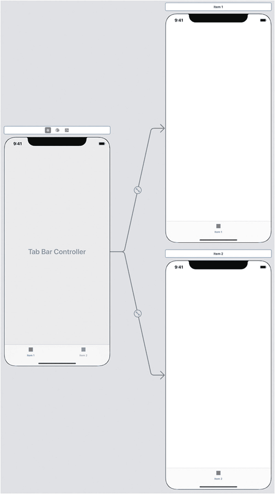

图 18-1

一个`Tab bar Controller`显示代表多个视图的图标

与`Tab bar`类似的是`Toolbar`（工具栏）。`Tab bar`严格用于导航到不同视图，而`Toolbar`则显示代表用户可能想要执行的操作的图标。许多 iOS 自带的应用如`Mail`和`Photos`应用，会在屏幕底部显示`Toolbar`，这些工具栏可以删除选中的消息或照片，如图 18-2 所示。

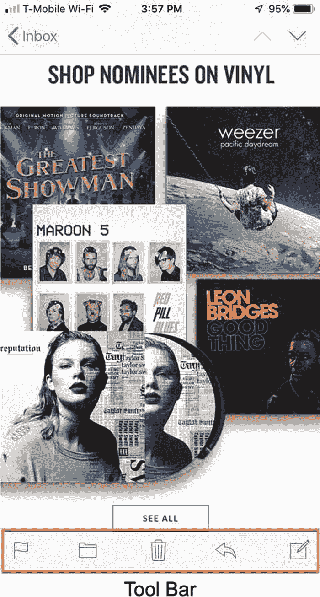

图 18-2

许多应用在屏幕底部显示`Toolbar`

`Tab bar`和`Toolbar`都受限于在任意时刻能舒适显示的图标数量。图标越多，`Tab bar`的外观就越拥挤，用户也就越难点击到正确的图标。通常，不要在`Tab bar`上显示太多图标，以免让用户难以找到或选择特定图标。

`Tab Bar`和`Tool Bar`的主要区别在于：

*   `Tab Bar`显示不同的`View Controller`。
*   `Tool Bar`执行不同的命令。


## 在标签栏控制器中切换视图控制器

标签栏控制器让你能够轻松地按照任意顺序从一个视图切换到另一个视图。标签栏上的每个图标代表一个不同的视图控制器。使用标签栏控制器展示不同视图的基本步骤是：向故事板中添加多个视图控制器，然后通过`Ctrl-拖拽`将标签栏控制器连接到某个视图控制器。

接下来需要为这个视图控制器创建标题和图标。你可能还想重新排列标签栏上的图标顺序，或者稍后删除某个视图控制器及其标签栏图标。

要了解如何创建一个简单的标签栏控制器，请按照以下步骤操作：

1.  使用“单视图应用”模板创建一个新的 iOS 项目（参见第 1 章），并将这个新项目命名为 `TabBarApp`。这将为用户界面创建一个单视图。

2.  在导航面板中点击 `Main.storyboard` 文件。Xcode 会显示这个单视图。

3.  点击视图控制器顶部的视图控制器场景。

4.  选择“编辑器” ➤ “嵌入为” ➤ “标签栏控制器”。Xcode 会在故事板中显示一个标签栏控制器，并与现有的视图控制器连接，如图 18-3 所示。

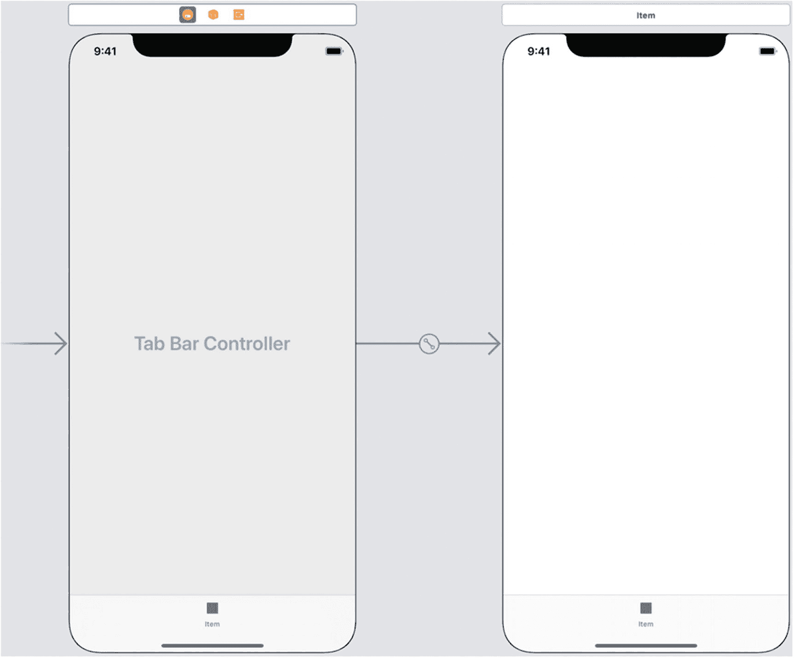

图 18-3 在标签栏控制器中嵌入视图

5.  点击“库”图标以打开“对象库”窗口。

6.  从“对象库”窗口中拖放一个视图控制器到故事板上，如图 18-4 所示。

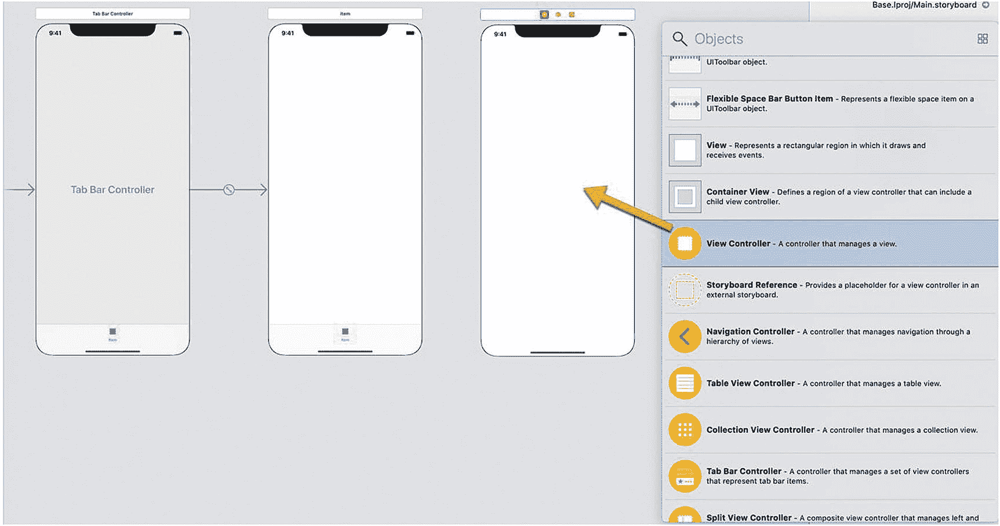

图 18-4 将视图控制器拖放到故事板上

7.  将鼠标移到标签栏控制器顶部的标签栏控制器图标上（或移到大纲面板中的标签栏控制器上）。

8.  按住 Control 键，然后`Ctrl-拖拽`到刚刚添加到故事板上的新视图控制器上，如图 18-5 所示。

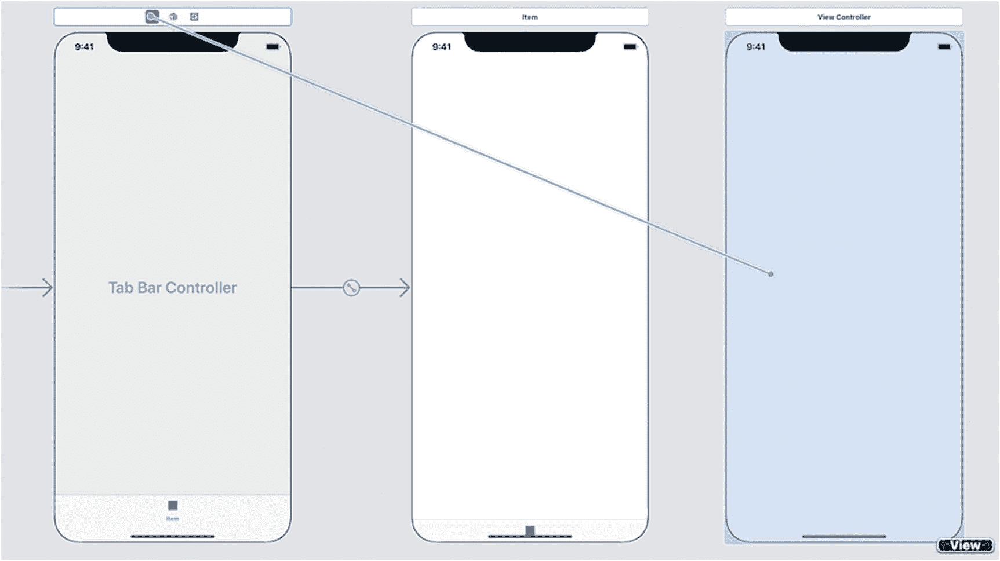

图 18-5 从标签栏控制器 Ctrl-拖拽到独立的视图控制器

9.  松开鼠标左键和 Control 键。会弹出一个弹出菜单，如图 18-6 所示。

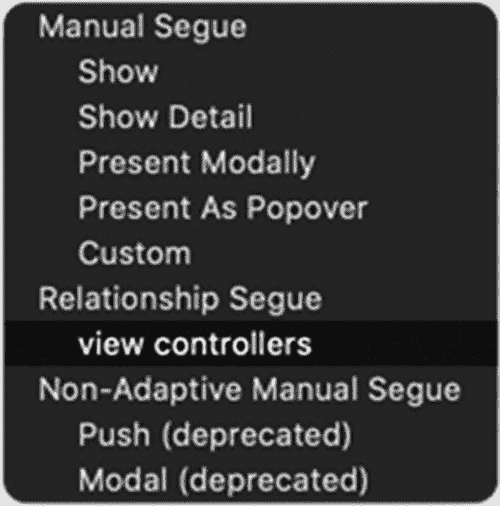

图 18-6 用于将视图控制器连接到标签栏控制器的弹出菜单

10. 在“关系转场”类别下选择“视图控制器”。Xcode 会绘制一个箭头（转场）将标签栏控制器连接到新添加的视图控制器，如图 18-7 所示。（你可能需要移动视图控制器才能看到标签栏控制器的转场分叉连接到两个视图控制器。）

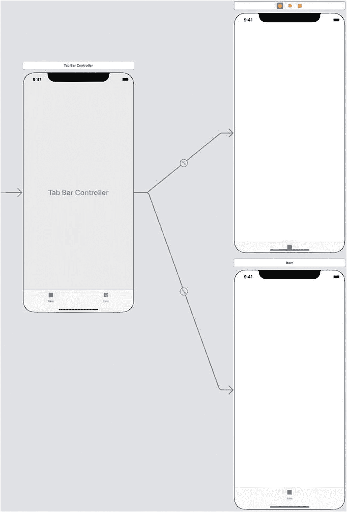

图 18-7 转场在导航控制器内连接两个视图

11. 点击顶部视图控制器的中间区域（或在大纲面板中点击“视图”）。

12. 选择“视图” ➤ “检查器” ➤ “显示属性检查器”，或者点击 Xcode 窗口右上角的“属性检查器”图标。

13. 在“背景”弹出菜单中点击，并选择一种颜色，例如黄色。

14. 点击底部视图控制器的中间区域（或在大纲面板中点击“视图”）。

15. 在“背景”弹出菜单中点击，并选择一种颜色，例如橙色。

16. 点击“运行”按钮，或选择“产品” ➤ “运行”。模拟器窗口会弹出，显示第一个视图控制器的彩色屏幕。

17. 点击屏幕底部标签栏上的第二个图标。第二个视图控制器会显示，并呈现不同的颜色。

18. 选择“模拟器” ➤ “退出模拟器”以返回 Xcode。

## 自定义标签栏图标

标签栏控制器会在屏幕底部的标签栏上显示图标。默认情况下，这个图标仅显示一个通用标签，例如“项目”，但你可以自定义此图标以包含更具描述性的文本和/或图标。你可以使用图形编辑器（如 Adobe Illustrator）创建图标。创建自己的图标时，请务必遵循 Apple 的图标设计指南（ `https://developer.apple.com/design/human-interface-guidelines/ios/icons-and-images/custom-icons/` ）。

除了自己创建图标，你还可以从以下网站购买或下载图标：

*   iconbeast.com
*   icons8.com
*   pixellove.com

要了解如何自定义标签栏图标，请按照以下步骤操作：

1.  确保 `TabBarApp` 已加载到 Xcode 中。

2.  从任何提供免费图标的网站下载两个或更多的免费图标。

3.  点击 `Assets.xcassets` 文件夹。

4.  点击 `+` 图标以显示弹出菜单，如图 18-8 所示。

    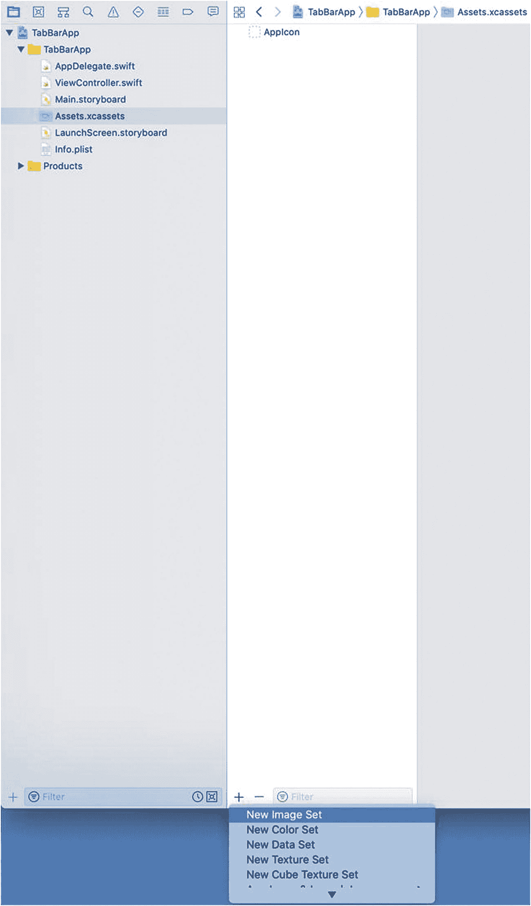

    图 18-8 在 `Assets.xcassets` 文件夹中创建新的图像集

5.  选择“新建图像集”。Xcode 会在 AppIcon 下方显示一个“图像”项。

6.  点击这个“图像”项，然后按 ENTER 键高亮显示文本，如图 18-9 所示。

    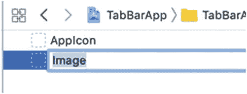

    图 18-9 编辑图像名称

7.  输入 `First` 并按 ENTER 键。

8.  将一个图标拖放到所有标有 `1x`、`2x` 和 `3x` 的占位符中，如图 18-10 所示。

    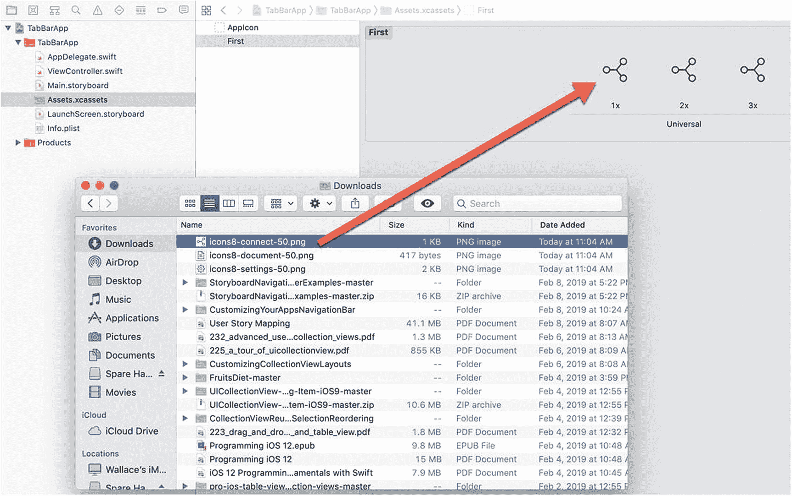

    图 18-10 将图标拖放到图像集中

9.  重复步骤 5–8，但将此图像集命名为 `Second`，并将不同的图标拖放到每个 `1x`、`2x` 和 `3x` 占位符中，如图 18-11 所示。

    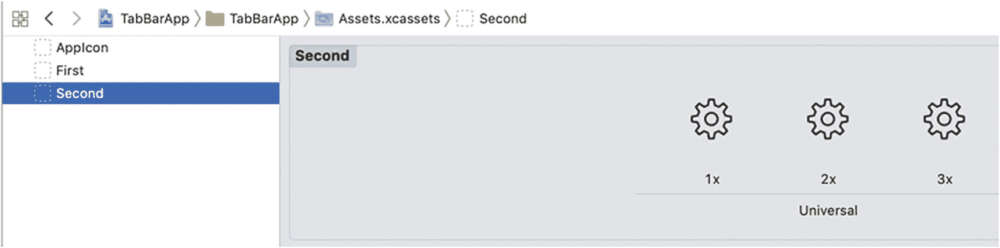

    图 18-11 创建两个包含图标的图像集

图 18-11. 创建第二个图像集。


#### 注意

1x 图像出现在旧款 iOS 设备屏幕上。2x 图像出现在 Retina 显示屏上。3x 图标图像则用于 iPhone X 及更新机型的 Retina Display HD 显示屏。

1. 在导航窗格中点击 `Main.storyboard` 文件。
2. 在文档大纲中点击 `Item`，如图 18-12 所示。
   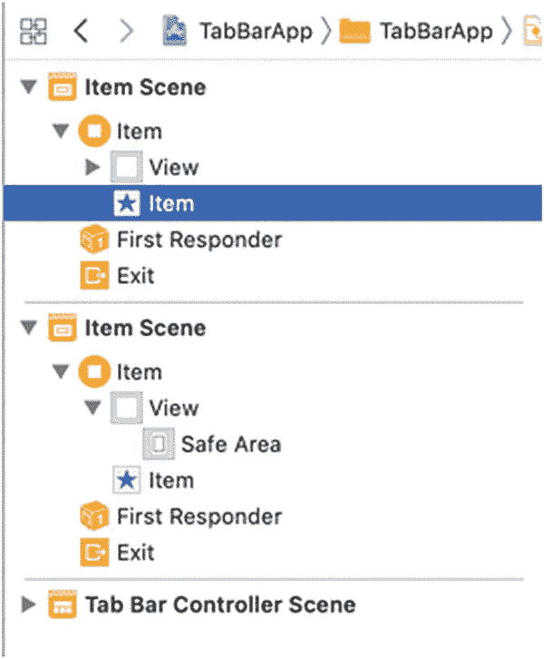
   **图 18-12** 在视图控制器上选中标签栏
3. 选择 `View ➤ Inspectors ➤ Show Attributes Inspector`，或点击 Xcode 窗口右上角的 `Attributes Inspector` 图标。
4. 在 `Bar Item` 分类下点击 `Image` 弹出菜单，并选择 `First`，如图 18-13 所示。
   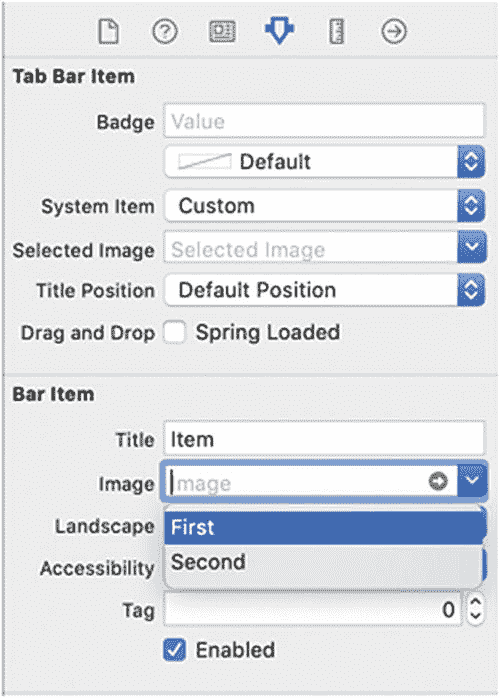
   **图 18-13** 为标签栏图标选择一个图像集
5. 点击 `Title` 文本字段，删除“Item”文本，输入视图控制器的颜色（例如 yellow），然后按 ENTER 键。注意标签栏现在显示了你选择的图标和文本。
6. 对另一个标签栏项重复步骤 11–14，但将其 `Image` 选择为 `Second`，并在 `Title` 中输入不同的颜色。
7. 点击 `Run` 按钮或选择 `Product ➤ Run`。模拟器窗口出现，显示标签栏上的两个图标，如图 18-14 所示。
   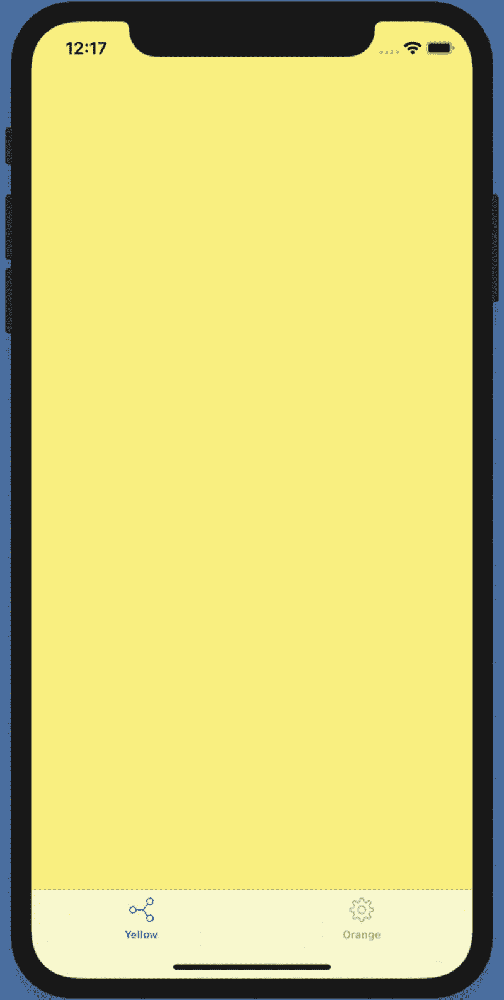
   **图 18-14** 显示自定义文本和图标的标签栏
8. 点击第二个标签。注意该标签对应的第二个视图控制器出现。
9. 点击第一个标签。注意该标签对应的第一个视图控制器出现。
10. 选择 `Simulator ➤ Quit Simulator` 以返回 Xcode。

## 从标签栏控制器中删除视图控制器

你可以将多个视图控制器连接到标签栏控制器。然而，如果之后你想断开某个视图控制器与标签栏控制器的连接，有两个选项：
- 删除视图控制器及其与标签栏控制器的转场（segue）。
- 仅删除与标签栏控制器之间的转场，但保留视图控制器。

删除视图控制器会同时删除它与标签栏控制器的转场以及视图控制器本身，但这意味着你也会丢失存储在该视图控制器上的所有内容，例如按钮、文本字段和标签。另一种选择是仅删除转场而保留视图控制器。

要同时从标签栏控制器删除视图控制器及其转场，请按以下步骤操作：
1. 在导航窗格中点击 `Main.storyboard`。
2. 在文档大纲中点击代表你想删除并从标签栏控制器断开的视图控制器的 `Item Scene`，如图 18-15 所示。
   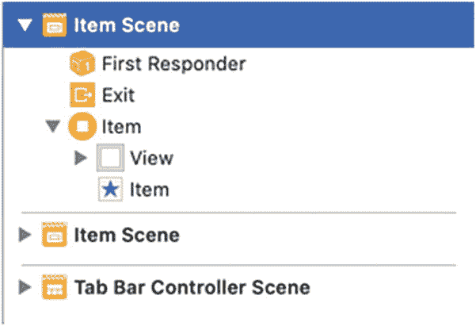
   **图 18-15** 选中一个 Item Scene 以从标签栏控制器中删除
3. 按 BACKSPACE 或 DELETE 键。Xcode 会移除选中的视图控制器及其与标签栏控制器之间的转场。

#### 注意
如果在删除转场和/或其连接的视图控制器时操作有误，请选择 `Edit ➤ Undo` 或按 `Command + Z` 来撤销删除命令。

有时你可能不想删除视图控制器，而只是希望将其与标签栏控制器断开连接。要断开视图控制器与标签栏控制器的转场同时保留视图控制器，请按以下步骤操作：
1. 在导航窗格中点击 `Main.storyboard`。
2. 在文档大纲中的 `Tab Bar Controller Scene` 下点击一个 `Relationship` 图标，如图 18-16 所示。
   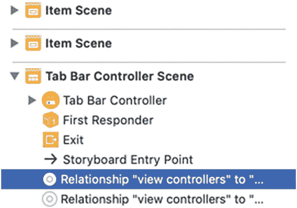
   **图 18-16** 在文档大纲中选择一个转场
3. 按 BACKSPACE 或 DELETE 键。Xcode 会移除与标签栏控制器的转场，但会在 storyboard 中保留该视图控制器。


## 创建工具栏

与标签栏控制器类似的是工具栏。标签栏控制器旨在屏幕底部显示图标，代表用户可以打开的不同视图；而工具栏则用于显示图标，代表用户可以选择的命令。从对象库窗口中使用的两个对象如图 18-17 所示：

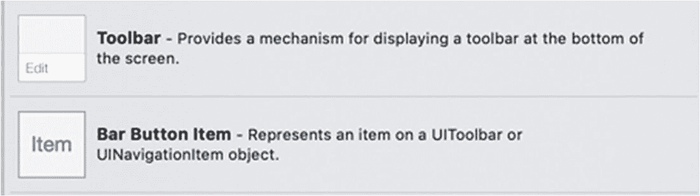

图 18-17

对象库窗口中的工具栏和栏按钮项

- `Tool Bar` – 在屏幕底部显示一个栏
- `Bar Button Item` – 在工具栏上显示文本和/或图标

要了解如何添加工具栏和图标并将其连接到 IBAction 方法，请按照以下步骤操作：

1. 使用单视图应用模板创建一个新的 iOS 项目（参见第 1 章），并将此新项目命名为 `TabBarMethodsApp`。这将为用户界面创建一个单一视图。

2. 在导航器窗格中点击 `Main.storyboard` 文件。Xcode 会显示该单一视图。

3. 点击库图标以打开对象库窗口。

4. 从对象库窗口中拖放一个工具栏到视图底部，如图 18-18 所示。

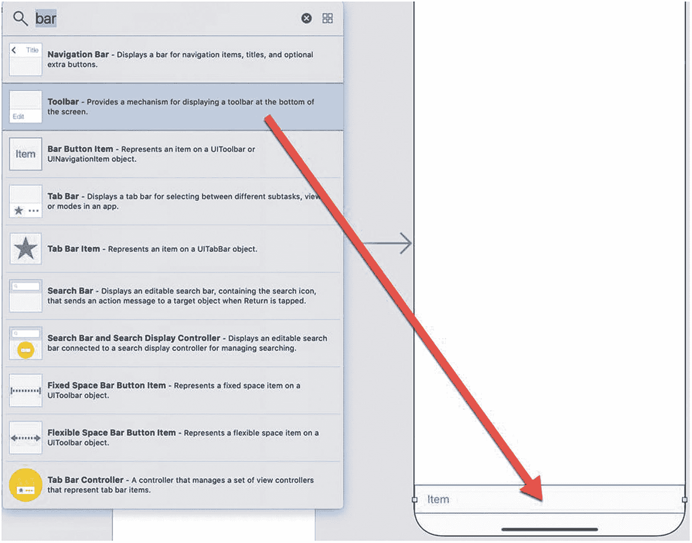

图 18-18

将工具栏拖放到视图上

5. 在文档大纲中点击工具栏下方的 `Item`，如图 18-19 所示。这将选中工具栏上当前可见的栏按钮。

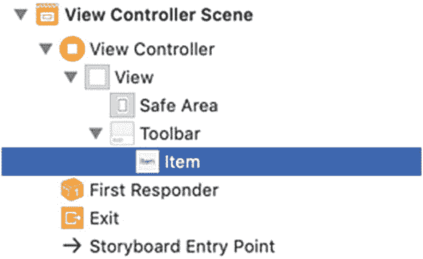

图 18-19

文档大纲中工具栏上的栏按钮项

6. 选择 `View` ➤ `Inspectors` ➤ `Show Attributes Inspector`，或点击 Xcode 窗口右上角的属性检查器图标。

7. 点击 `System Item` 弹出菜单。将出现一个弹出菜单，列出您可以选择的常见图标类型，如图 18-20 所示。

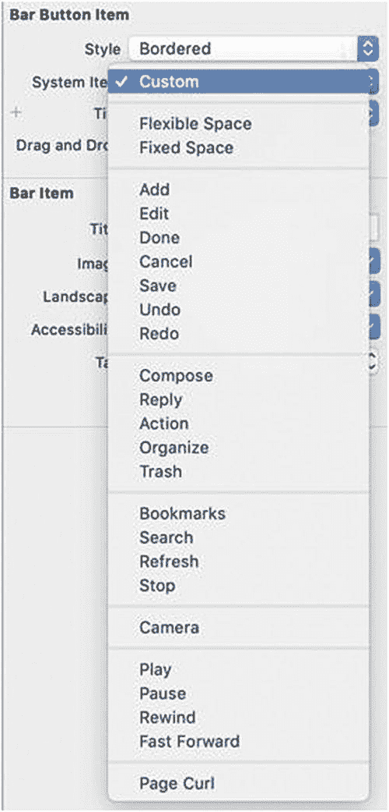

图 18-20

点击系统项弹出菜单

8. 选择 `Add`。注意，Xcode 现在将栏按钮显示为 `+` 图标。

9. 选择 `View` ➤ `Assistant Editor` ➤ `Show Assistant Editor`，或点击 Xcode 窗口右上角的助理编辑器图标。Xcode 会并排显示 `Main.storyboard` 文件和 `ViewController.swift` 文件。

10. 将鼠标指针移到工具栏上的 Add (`+`) 按钮上，按住 Control 键，然后从 Add (`+`) 按钮拖拽到 `ViewController.swift` 文件底部最后一个大括号上方。

11. 松开 Control 键和鼠标左键。将出现一个弹出窗口。

12. 点击名称文本字段，输入 **addTapped**。

13. 点击类型弹出菜单，选择 `UIBarButtonItem`。然后点击连接按钮。Xcode 会创建一个 `addTapped` IBAction 方法。

14. 按如下方式编辑此 `addTapped` IBAction 方法：

```
@IBAction func addTapped(_ sender: UIBarButtonItem) {
    let alert = UIAlertController(title: "Add", message: "Add button tapped", preferredStyle: .alert)
    let okAction = UIAlertAction(title: "OK", style: .default, handler: { action -> Void in
        //Just dismiss the action sheet
    })
    alert.addAction(okAction)
    self.present(alert, animated: true, completion: nil)
}
```

整个 `ViewController.swift` 文件应如下所示：

```
import UIKit
class ViewController: UIViewController {
    override func viewDidLoad() {
        super.viewDidLoad()
        // Do any additional setup after loading the view.
    }
    @IBAction func addTapped(_ sender: UIBarButtonItem) {
        let alert = UIAlertController(title: "Add", message: "Add button tapped", preferredStyle: .alert)
        let okAction = UIAlertAction(title: "OK", style: .default, handler: { action -> Void in
            //Just dismiss the action sheet
        })
        alert.addAction(okAction)
        self.present(alert, animated: true, completion: nil)
    }
}
```

15. 点击运行按钮，或选择 `Product` ➤ `Run`。模拟器窗口将出现，在屏幕底部显示工具栏和 Add (`+`) 按钮。

16. 点击 Add (`+`) 按钮。将出现一个警告控制器。

17. 点击 OK 以关闭警告控制器。

18. 选择 `Simulator` ➤ `Quit Simulator` 返回 Xcode。

### 添加和删除工具栏按钮

当你添加一个工具栏时，它会自带一个通用标签为“Item”的栏按钮。自定义此栏按钮后，你可能需要向工具栏添加更多按钮。如果添加了过多栏按钮，你也可以随时删除它们。栏按钮可以显示图标和/或文本，如图 18-21 所示。

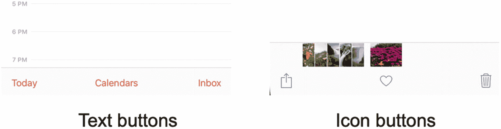

图 18-21

栏按钮通常显示文本或图标


#### 注意

尽管工具栏按钮可以同时显示文本和图标，但你也可以只使用其中一种。如果在`Toolbar`上有三个或更少的按钮，文本（不带图标）可以让每个选项更容易理解。如果在`Toolbar`上有超过三个按钮，图标（不带文本）占用的空间更少，但代价是用户可能不理解每个图标代表的命令。

除了工具栏按钮，另一个可以添加到`Toolbars`中的对象是间距。`Xcode`提供了两种不同类型的间距，如图 18-22 所示：

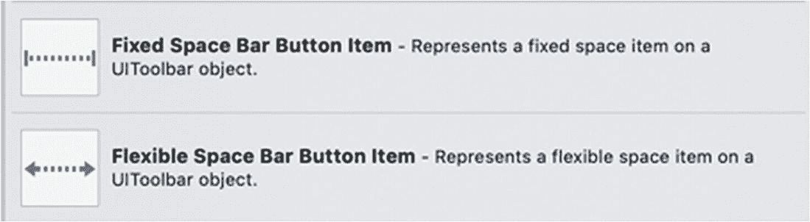

图 18-22

可在工具栏按钮之间添加的两种间距类型

- `Fixed space`（固定间距）—— 定义两个工具栏按钮之间的精确间距值
- `Flexible space`（弹性间距）—— 像一个弹簧，在不同尺寸屏幕（例如`iPhone`和`iPad`）上查看时，能在两个工具栏按钮之间收缩或扩展

要了解如何在`Toolbar`上添加、删除和添加间距，请遵循以下步骤：

1.  使用`Single View App`模板（见第 1 章）创建一个新的 iOS 项目，并将此新项目命名为`ToolBarEditApp`。这将为用户界面创建一个单一视图。
2.  在导航窗格中点击`Main.storyboard`文件。`Xcode`会显示该单一视图。
3.  点击库图标以打开对象库窗口。
4.  拖放一个`Tool Bar`到视图底部。一个通用的“Item”工具栏按钮会出现在`Toolbar`上。
5.  点击库图标以打开对象库窗口，并拖放一个`Bar Button Item`到`Toolbar`上。注意，两个工具栏按钮会紧挨在一起，如图 18-23 所示。

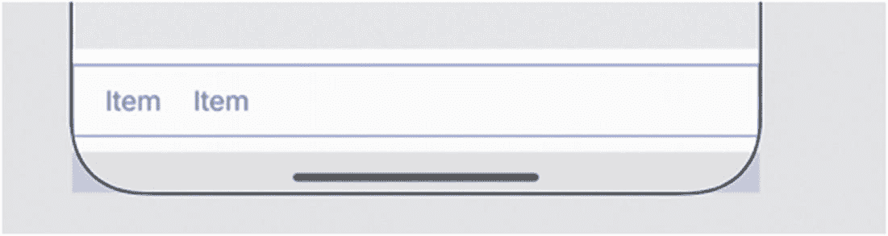

图 18-23

`Toolbar`上出现两个工具栏按钮

6.  点击库图标以打开对象库窗口，并拖放一个`Fixed Space Bar Button Item`到`Toolbar`上现有两个按钮之间。`Fixed Space Bar Button Item`只是在两个工具栏按钮之间添加间距，并且看起来是不可见的。
7.  在文档大纲中点击`Fixed Space`以选中`Fixed Space Bar Button Item`。
8.  选择`View` ➤ `Inspectors` ➤ `Show Size Inspector`，或点击`Xcode`窗口右上角的`Size Inspector`图标。
9.  点击`Width`文本字段，输入`75`，然后按下`ENTER`键。`Width`属性定义了`Fixed Space Bar Button Item`的精确间距。
10. 点击`Run`按钮或选择`Product` ➤ `Run`。模拟器窗口出现，在屏幕底部显示带有两个工具栏按钮的`Toolbar`。
11. 选择`Hardware` ➤ `Rotate Left`。注意，`Toolbar`上两个工具栏按钮之间的间距保持不变，如图 18-24 所示。

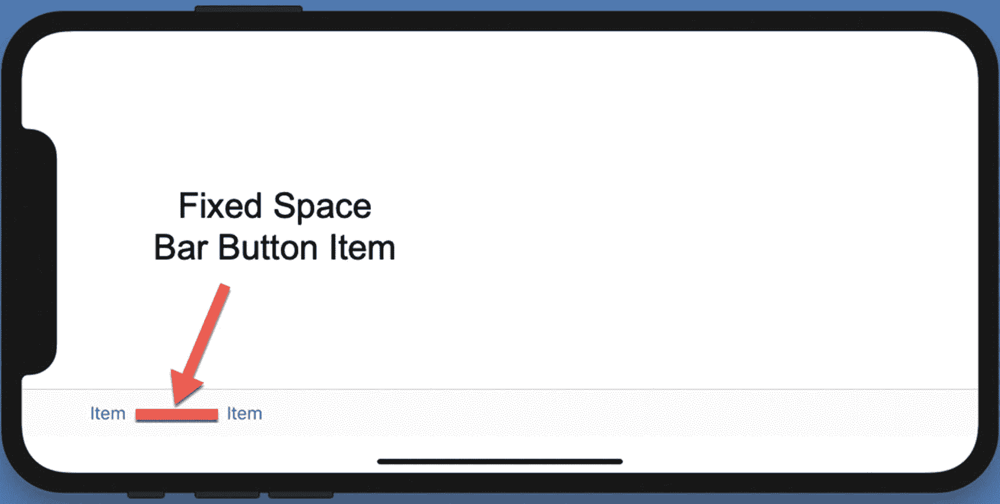

图 18-24

`Fixed Space Bar Button Item`在两个工具栏按钮之间保持精确距离

12. 选择`Simulator` ➤ `Quit Simulator`以返回`Xcode`。
13. 在文档大纲中点击`Fixed Space`，然后按下`BACKSPACE`或`DELETE`键以移除`Fixed Space Bar Button Item`。
14. 点击库图标以打开对象库窗口，并拖放一个`Flexible Space Bar Button Item`到`Toolbar`上现有两个按钮之间。注意，`Flexible Space Bar Button`会将两个工具栏按钮推到`Toolbar`的两端，如图 18-25 所示。

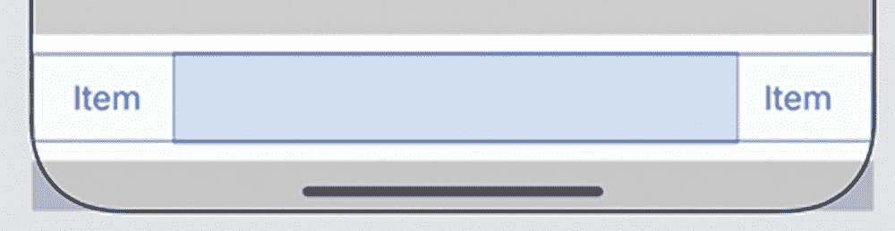

图 18-25

`Flexible Space Bar Button Item`在两个工具栏按钮之间起到弹簧作用

15. 点击`Run`按钮或选择`Product` ➤ `Run`。模拟器窗口出现，在屏幕底部显示`Toolbar`，其两个工具栏按钮位于`Toolbar`的两端。
16. 选择`Hardware` ➤ `Rotate Left`。注意，`Toolbar`上两个工具栏按钮之间的间距会扩大，以适应 iPhone 横向时更宽的屏幕距离，如图 18-26 所示。

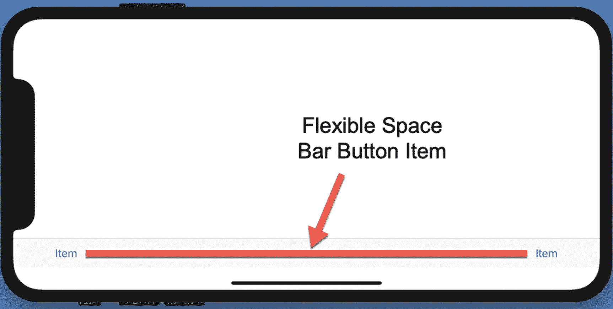

图 18-26

无论 iOS 设备方向如何，`Flexible Space Bar Button Item`都会将两个工具栏按钮推开

17. 选择`Simulator` ➤ `Quit Simulator`以返回`Xcode`。

## 总结

标签栏控制器在屏幕底部显示代表不同视图控制器的图标。与强制用户按顺序显示视图控制器的导航控制器不同，标签栏控制器允许用户以任意顺序导航到不同的视图控制器。由于标签栏控制器只能显示有限数量的图标，因此用户只能导航到有限数量的视图控制器。

工具栏也在屏幕底部显示图标。标签栏显示用于跳转到不同视图控制器的图标，而工具栏则显示代表操作当前屏幕显示数据的不同命令的图标。例如，“邮件”应用在显示消息时会在屏幕底部显示图标。一个图标允许你删除消息，另一个允许你转发消息，还有一个图标允许你将消息存储到另一个文件夹。

按钮可以显示文本和图像，尽管更常见的是按钮仅显示文本或图像，而不一定两者都显示。文本使每个按钮的用途易于理解，但文本按钮占用更多空间。图标占用的空间少得多，但可能更难理解其所代表的含义。

在`Toolbar`上放置按钮时，你还可以使用固定间距或弹性间距来定义按钮之间的间距。固定间距允许你为两个按钮之间的间距定义一个特定值。弹性间距则允许按钮之间的间距根据 iOS 设备的方向进行收缩或扩展。

通过使用标签栏导航到不同的视图控制器，或使用工具栏显示可用于操作当前显示数据的不同类型的命令，你可以使你的应用更易于使用。


# 19. 使用页面视图控制器

显示两个或多个视图控制器内容的一种独特方式是通过页面视图控制器，它允许用户向左或向右滑动。每次滑动都会显示不同的视图控制器，就像在电子书中翻阅页面一样。

要使用页面控制器，你需要在故事板中添加一个页面控制器。然后，你可以通过在属性检查器面板中定义以下属性来自定义此页面控制器，如图 19-1 所示：

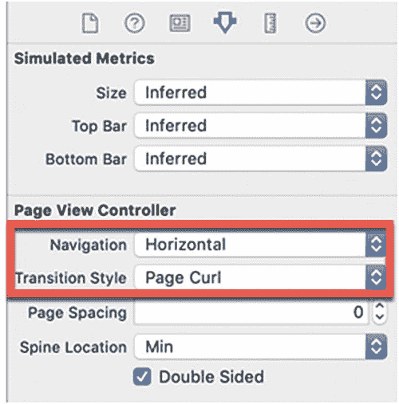

图 19-1

修改页面控制器的行为

- **导航** – 定义用户需要水平还是垂直滑动以显示上一个或下一个视图
- **过渡样式** – 定义视图是像书页一样卷曲（页面卷曲），还是简单地滑入到位（滚动）

自定义页面控制器的行为后，下一步是创建多个完全独立于故事板的视图控制器（不通过转场连接到任何现有的故事板场景）。为了让这些视图控制器出现在页面控制器中，每个视图控制器都需要一个唯一的 Storyboard ID，你可以在身份检查器面板中定义它。

最后，你需要创建独立的 `.swift` 文件，并将它们连接到每个视图控制器。此外，你还需要创建一个独立的 `.swift` 文件并将其连接到页面控制器。总共，你需要两种类型的 `.swift` 文件：

- 一个连接到页面控制器的 `UIPageViewController` 类文件
- 一个连接到每个你想要显示在页面控制器内部的视图控制器的 `UIViewController` 类文件

一旦你在故事板中添加了一个页面控制器和多个未通过转场连接到故事板任何部分的视图控制器，你就可以编写 Swift 代码来加载这些多个视图控制器。

## 添加和自定义页面控制器

使用页面控制器的第一步是将其添加到你的故事板中。要了解如何在故事板中放置页面控制器，请按照以下步骤操作：

1. 使用单视图应用模板创建一个新的 iOS 项目（参见第 1 章），并将此新项目命名为 `PageControllerApp`。这将为用户界面创建一个单一视图。
2. 在导航器面板中点击 `Main.storyboard` 文件。Xcode 会显示该单一视图。
3. 点击库图标以打开对象库窗口。
4. 从对象库窗口拖放一个页面控制器到故事板，如图 19-2 所示。

   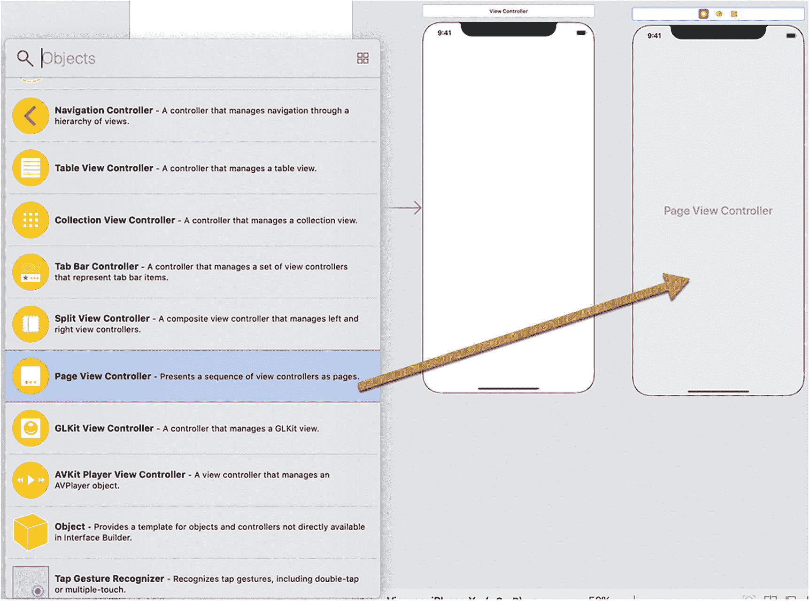

   图 19-2

   将页面控制器拖放到故事板上

5. 点击页面控制器顶部的页面视图控制器图标（或文档大纲中的页面视图控制器）。
6. 选择 视图 ➤ 检查器 ➤ 显示属性检查器，或点击 Xcode 窗口右上角的属性检查器图标。
7. 点击导航弹出菜单并选择水平。
8. 点击过渡样式弹出菜单并选择页面卷曲。
9. 选中“是初始视图控制器”复选框。Xcode 现在会在故事板中页面控制器的左侧显示一个箭头。

## 添加视图控制器

页面控制器显示一个或多个视图控制器。为了让每个视图控制器出现在页面控制器内部，每个视图控制器需要：

- 一个唯一的 Storyboard ID（任意文本）
- 连接到 `.swift` 的 `UIViewController` 文件

为了让我们在查看不同视图控制器时一目了然，我们还需要更改每个视图控制器的背景颜色，但在实际应用中，每个视图控制器会显示不同的信息，例如文本、图片或用户界面设计。

要了解如何向故事板添加视图控制器以在页面控制器中使用，请按照以下步骤操作：

1. 确保 `PageControllerApp` 已加载到 Xcode 中。
2. 在文档大纲中点击视图控制器场景下的视图以将其选中，如图 19-3 所示。

   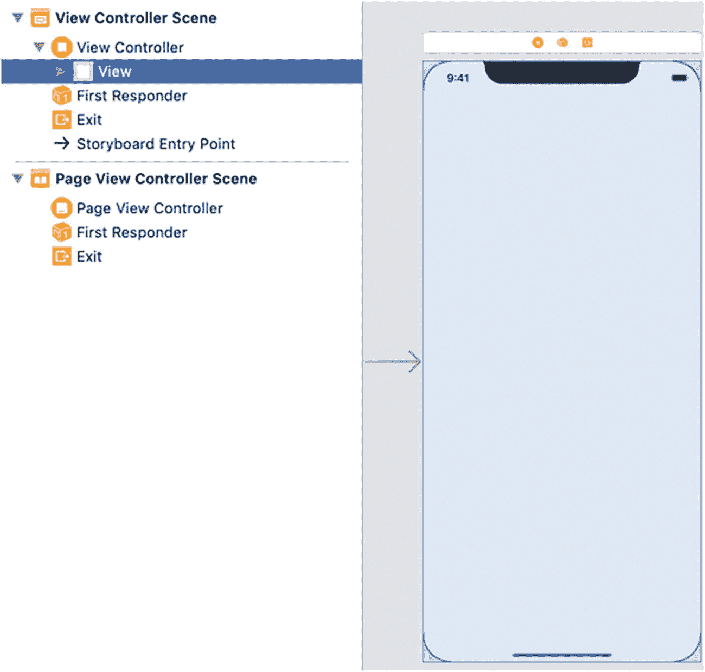

   图 19-3

   在视图控制器上选择视图

3. 选择 视图 ➤ 检查器 ➤ 显示属性检查器，或点击 Xcode 窗口右上角的属性检查器图标。
4. 点击背景弹出菜单并选择一种颜色，例如黄色。我们希望页面控制器显示的所有视图控制器都有不同的颜色，以便清楚地看到我们正在查看不同的视图控制器。
5. 点击文档大纲中的视图控制器，或点击视图控制器上方的视图控制器图标。
6. 选择 视图 ➤ 检查器 ➤ 显示身份检查器，或点击 Xcode 窗口右上角的身份检查器图标。
7. 点击 Storyboard ID 文本字段，输入 `page01`，然后按回车键，如图 19-4 所示。

   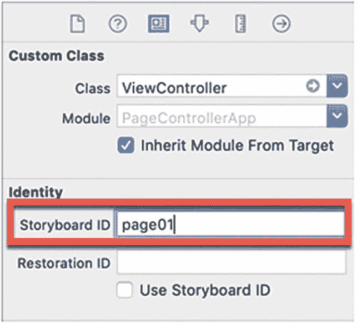

   图 19-4

   每个视图控制器在身份检查器面板中都需要一个唯一的 Storyboard ID

8. 选择 文件 ➤ 新建 ➤ 文件。会弹出一个对话框，显示不同的模板。
9. 在 iOS 类别下选择 Cocoa Touch Class，然后点击**下一步**按钮。另一个窗口会弹出，让你为文件命名。
10. 点击类文本字段并输入 `SecondViewController`。（确保子类弹出菜单显示 `UIViewController`。）
11. 点击**下一步**按钮，然后点击**创建**按钮。Xcode 会在导航器面板中显示 `SecondViewController.swift` 文件。
12. 重复步骤 8–11，但将此 `.swift` 文件命名为 `ThirdViewController`。导航器面板现在应显示 `ViewController.swift`、`SecondViewController.swift` 和 `ThirdViewController.swift` 文件，如图 19-5 所示。（如果需要，你可以重新排列导航器面板中的文件。）

    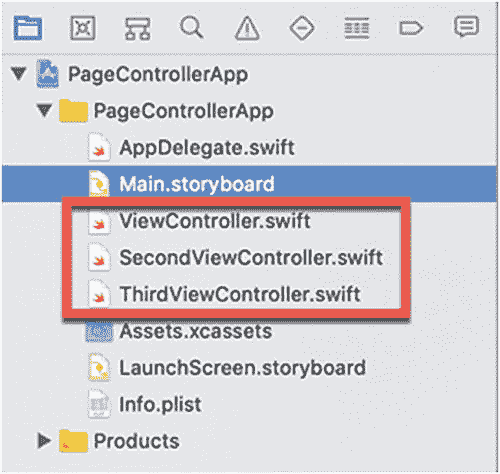

    图 19-5

    创建三个独立的视图控制器 `.swift` 文件

13. 点击库图标以打开对象库窗口，并从对象库窗口拖放一个视图控制器到故事板。故事板现在应包含一个页面控制器和两个视图控制器。
14. 点击文档大纲中的视图控制器，或点击视图控制器上方的视图控制器图标。
15. 选择 视图 ➤ 检查器 ➤ 显示身份检查器，或点击 Xcode 窗口右上角的身份检查器图标。
16. 点击类弹出菜单并选择 `SecondViewController`。
17. 点击 Storyboard ID 文本字段，输入 `page02`，然后按回车键，如图 19-6 所示。

    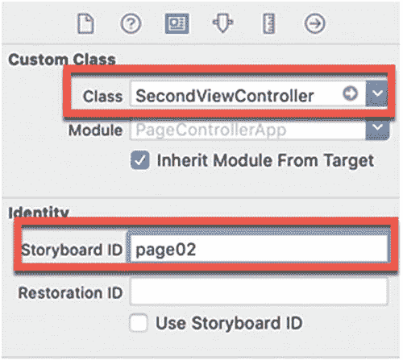

    图 19-6

    将第二个视图控制器连接到 `.swift` 类文件并为其指定 Storyboard ID


18.  在文档大纲中点击第二个`View Controller`的`View`，或点击第二个`View Controller`的中间区域。

19.  选择`View` ➤ `Inspectors` ➤ `Show Attributes Inspector`，或点击 Xcode 窗口右上角的`Attributes Inspector`图标。

20.  点击`Background`弹出菜单并选择一个颜色，例如橙色。

21.  点击`Library`图标打开`Object Library`窗口，然后从`Object Library`窗口拖放一个`View Controller`到故事板。此时故事板应包含一个`Page Controller`和三个`View Controllers`。

22.  在文档大纲中点击`View Controller`，或点击`View Controller`上方的`View Controller`图标。

23.  选择`View` ➤ `Inspectors` ➤ `Show Identity Inspector`，或点击 Xcode 窗口右上角的`Identity Inspector`图标。

24.  点击`Class`弹出菜单并选择`ThirdViewController`。

25.  点击`Storyboard ID`文本字段，输入`page03`，然后按`ENTER`键。

26.  在文档大纲中点击第三个`View Controller`的`View`，或点击第三个`View Controller`的中间区域。

27.  选择`View` ➤ `Inspectors` ➤ `Show Attributes Inspector`，或点击 Xcode 窗口右上角的`Attributes Inspector`图标。

28.  点击`Background`弹出菜单并选择一个颜色，例如青色。此时故事板应包含一个`Page Controller`和三个`View Controllers`，每个`View Controller`具有不同的背景颜色，如图 19-7 所示。

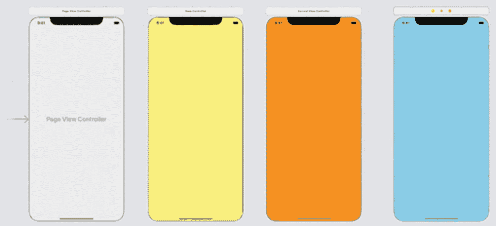

图 19-7

包含一个`Page Controller`和三个`View Controllers`的故事板

## 让视图控制器在页面控制器中显示

要使多个`View Controllers`在`Page Controller`内部显示，首先必须将`Page Controller`连接到一个 `.swift` 的 `UIPageController` 类文件。然后，在此 `UIPageController` `.swift` 文件中，需要编写 Swift 代码来完成以下操作：

*   定义一个数组，用于容纳所有需要在`Page Controller`内显示的`View Controllers`。

*   编写一个`viewControllerBefore`方法，用于定义当用户滑动打开上一个视图时，应显示哪个`View Controller`。

*   编写一个`viewControllerAfter`方法，用于定义当用户滑动打开下一个视图时，应显示哪个`View Controller`。

要了解如何编写 Swift 代码使`Page Controller`工作，请遵循以下步骤：

1.  确保`PageControllerApp`已加载到 Xcode 中。

2.  选择`File` ➤ `New` ➤ `File`。将会出现一个对话框，显示可用的不同模板。

3.  点击 iOS 类别下的`Cocoa Touch Class`，然后点击**Next**按钮。将出现另一个窗口，要求输入类名和子类类型。

4.  点击`Class`文本字段并输入`PageViewController`。

5.  点击`Subclass of`弹出菜单并选择`UIPageViewController`，如图 19-8 所示。

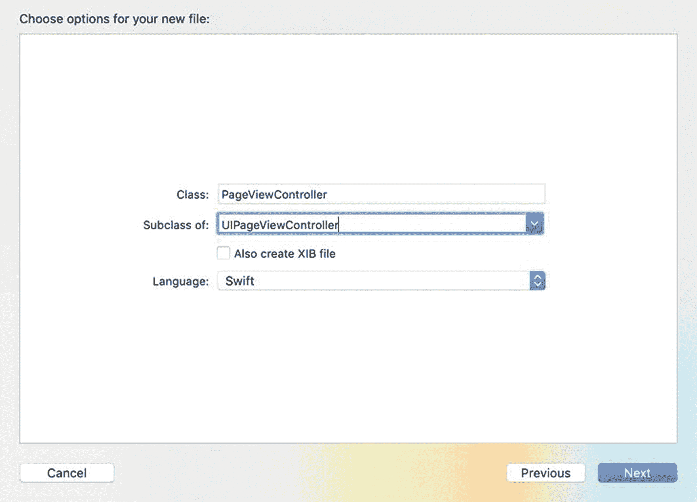

图 19-8

创建一个`UIPageViewController` `.swift` 类文件

6.  点击**Next**按钮，然后点击**Create**按钮。Xcode 会在导航窗格中显示`PageViewController.swift`文件。

7.  在导航窗格中点击`Main.storyboard`文件。Xcode 会显示该故事板。

8.  在文档大纲中点击`Page View Controller`，或点击`Page Controller`顶部的`Page View Controller`图标，如图 19-9 所示。

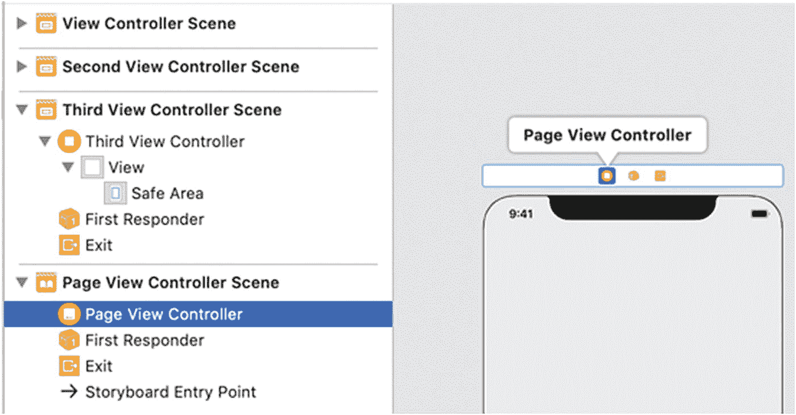

图 19-9

选择`Page View Controller`

9.  选择`View` ➤ `Inspectors` ➤ `Show Identity Inspector`，或点击 Xcode 窗口右上角的`Identity Inspector`图标。

10.  点击`Class`弹出菜单并选择`PageViewController`，如图 19-10 所示。

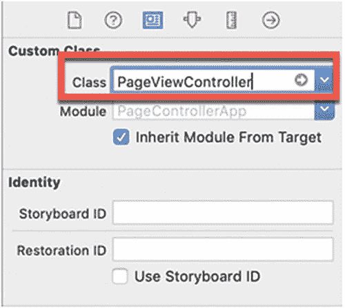

图 19-10

将`Page Controller`连接到`PageViewController.swift`文件

11.  在导航窗格中点击`PageViewController.swift`文件。

12.  按如下方式编辑`class PageViewController`这行代码：

```
    class PageViewController: UIPageViewController, UIPageViewControllerDataSource {
```

13.  在`class PageViewController`这行代码下方，添加以下代码行来声明一个`UIViewControllers`数组：

```
    var controllerArray: [UIViewController]? = nil
```

14.  按如下方式修改`viewDidLoad`方法：

```
    override func viewDidLoad() {
    super.viewDidLoad()
    dataSource = self
    let storyBoard = UIStoryboard(name: "Main", bundle: nil)
    let firstVC = storyBoard.instantiateViewController(withIdentifier: "page01")
    let secondVC = storyBoard.instantiateViewController(withIdentifier: "page02")
    let thirdVC = storyBoard.instantiateViewController(withIdentifier: "page03")
    controllerArray = [firstVC, secondVC, thirdVC]
    self.setViewControllers([controllerArray![0]], direction: UIPageViewController.NavigationDirection.forward, animated: true, completion: nil)
    }
```

第一行将`PageViewController.swift`文件定义为`Page Controller`的数据源。下一行创建了一个名为`Main`的故事板常量。接下来的三行定义了常量（`firstVC`、`secondVC`和`thirdVC`），用于表示将在`Page Controller`内显示的每个`View Controller`。请注意，每个`View Controller`都使用其自身的`Storyboard ID`来标识，例如`page01`或`page03`。

接下来，我们将所有这些`View Controllers`存储到`controllerArray`数组中。最后，我们在`Page Controller`内部设置这个`View Controllers`数组。

15.  添加以下函数，用于定义当用户显示上一个`View Controller`时应出现的`View Controller`：

```
    func pageViewController(_ pageViewController: UIPageViewController, viewControllerBefore viewController: UIViewController) -> UIViewController? {
    guard let vcIndex = controllerArray!.firstIndex(of: viewController) else {
    return nil
    }
    let preIndex = vcIndex - 1
    guard preIndex >= 0 else {
    return controllerArray!.last // 循环回到末尾
    }
    guard controllerArray!.count > preIndex else {
    return nil
    }
    return controllerArray![preIndex]
    }
```

第一个`guard`语句检查确保控制器数组包含有效的`View Controllers`。然后它创建一个`preIndex`常量来表示上一个`View Controller`。只要`preIndex`的值大于 0，`Page Controller`就可以显示数组中的上一个`View Controller`。一旦`preIndex`的值等于或小于 0，那么显示的下一个`View Controller`将是数组中的最后一个。这创建了一个无限循环，因此显示的第一个`View Controller`会链接到数组中的最后一个`View Controller`。

最后一个`guard`语句确保数组中`View Controllers`的总数大于`preIndex`的值。最后，此函数返回数组中的上一个`View Controller`。

16.  添加以下函数，用于定义当用户显示下一个`View Controller`时应出现的`View Controller`：

```
    func pageViewController(_ pageViewController: UIPageViewController, viewControllerAfter viewController: UIViewController) -> UIViewController? {
    guard let vcIndex = controllerArray!.firstIndex(of: viewController) else {
    return nil
    }
    let nextIndex = vcIndex + 1
    guard controllerArray!.count != nextIndex else {
    return controllerArray!.first // 循环回到开头
    }
    guard controllerArray!.count > nextIndex else {
    return nil
    }
    return controllerArray![nextIndex]
    }
```

整个`PageViewController.swift`文件应如下所示：


```swift
import UIKit
class PageViewController: UIPageViewController, UIPageViewControllerDataSource {
    var controllerArray: [UIViewController]? = nil
    override func viewDidLoad() {
        super.viewDidLoad()
        dataSource = self
        let storyBoard = UIStoryboard(name: "Main", bundle: nil)
        let firstVC = storyBoard.instantiateViewController(withIdentifier: "page01")
        let secondVC = storyBoard.instantiateViewController(withIdentifier: "page02")
        let thirdVC = storyBoard.instantiateViewController(withIdentifier: "page03")
        controllerArray = [firstVC, secondVC, thirdVC]
        self.setViewControllers([controllerArray![0]], direction: UIPageViewController.NavigationDirection.forward, animated: true, completion: nil)
        // 加载视图后的其他设置
    }
    func pageViewController(_ pageViewController: UIPageViewController, viewControllerBefore viewController: UIViewController) -> UIViewController? {
        guard let vcIndex = controllerArray!.firstIndex(of: viewController) else {
            return nil
        }
        let preIndex = vcIndex - 1
        guard preIndex >= 0 else {
            return controllerArray!.last // 循环回到末尾
        }
        guard controllerArray!.count > preIndex else {
            return nil
        }
        return controllerArray![preIndex]
    }
    func pageViewController(_ pageViewController: UIPageViewController, viewControllerAfter viewController: UIViewController) -> UIViewController? {
        guard let vcIndex = controllerArray!.firstIndex(of: viewController) else {
            return nil
        }
        let nextIndex = vcIndex + 1
        guard controllerArray!.count != nextIndex else {
            return controllerArray!.first // 循环回到开头
        }
        guard controllerArray!.count > nextIndex else {
            return nil
        }
        return controllerArray![nextIndex]
    }
}
```

17.  点击 `Run` 按钮，或选择 **Product** ➤ **Run**。模拟器窗口将显示第一个视图控制器。

18.  从屏幕右下角向左拖动鼠标。注意，翻页卷曲过渡效果会使视图控制器看起来像一页真实的纸张，如图 19-11 所示。

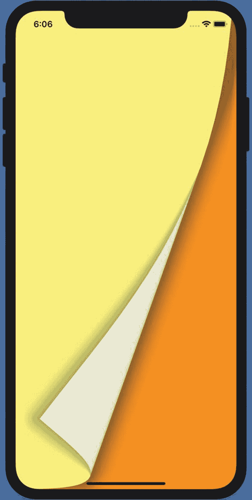

图 19-11

翻页卷曲过渡样式使视图控制器之间的切换如同真实纸张翻页

19.  继续向左和向右滑动。注意，当到达最后一个视图控制器时，向左滑动会显示第一个视图控制器。当到达第一个视图控制器时，向左滑动则显示最后一个视图控制器。

20.  选择 **Simulator** ➤ **Quit Simulator** 返回 Xcode。

## 总结

页面控制器提供了另一种按顺序显示多个视图控制器的方式。通过使用翻页卷曲过渡样式，滑动操作可以让每个视图控制器看起来像纸张在角落翻动。要使用页面控制器，必须从对象库窗口中拖放一个页面控制器到应用程序的故事板中。

将页面控制器添加到故事板后，还需要向故事板中添加视图控制器。每个视图控制器都需要一个唯一的故事板 ID（可以是任意文本）。此外，每个视图控制器都需要连接到一个 `.swift` 的 `UIViewController` 类文件。

最后，需要创建一个 `.swift` 的 `UIPageViewController` 类文件，并将其连接到该页面控制器。在这个 `.swift` 的 `UIPageViewController` 文件中，需要编写 Swift 代码来创建一个视图控制器数组，通过它们唯一的故事板 ID 来标识所有视图控制器。

在 `UIPageViewController` 类文件中，需要编写两个方法，分别定义在当前显示的视图控制器之前和之后要显示哪个视图。

通过使用页面控制器，可以创建有趣的视觉效果，营造出翻动实体书页的错觉。

# 20. 使用分栏视图控制器

用于显示信息列表的最常见的用户界面对象之一就是表格视图。当在竖屏方向的窄屏 iPhone 上查看时，表格视图看起来没问题。然而，在更大的 iPad 屏幕上查看时，尤其是横屏方向，表格视图可能会显得不平衡，文本偏向一侧，而大部分屏幕区域被空白填充，如图 20-1 所示。

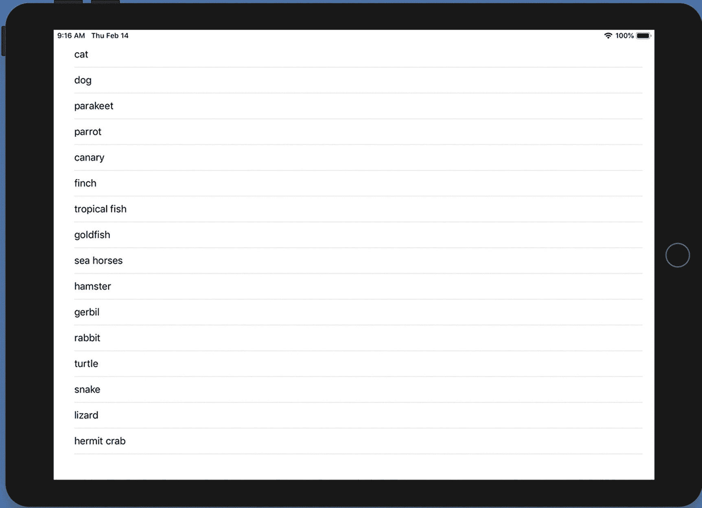

图 20-1

在 iPad 大屏幕上显示的表格视图

为了避免这种不平衡、空荡荡的外观，可以针对 iPad 以及某些 iPhone 型号的大屏幕使用分栏视图控制器。分栏视图控制器不是一次只显示一个表格视图，而是并排显示两个视图。左侧视图（称为主视图或母视图）在右侧视图（称为次视图或明细视图）中显示附加信息，如图 20-2 所示。

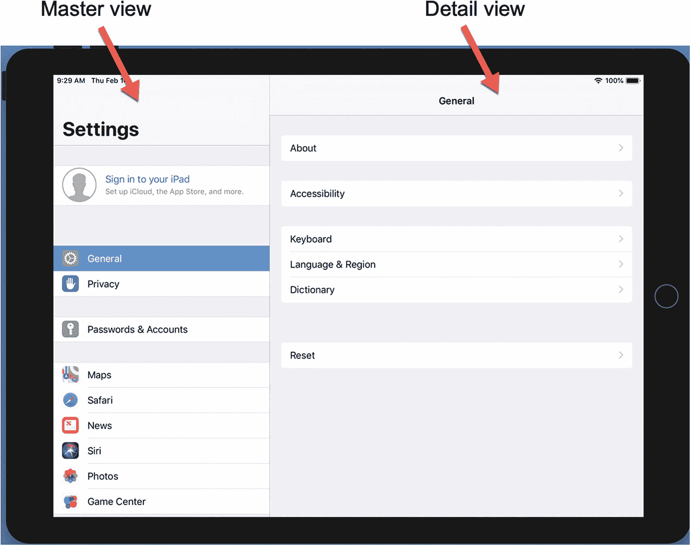

图 20-2

分栏视图控制器并排显示两个视图以填充更大的屏幕

主视图本质上显示的是上一个表格视图，而次视图显示的是下一个表格视图。通过将它们并排显示，可以轻松看到各个列表之间的关系，例如在“通用”类别下可以看到“关于”、“辅助功能”、“键盘”、“语言与地区”、“词典”和“还原”等选项（见图 20-2）。

当在更大的 iPad 和 iPhone 屏幕上运行时，分栏视图控制器会将屏幕分成两部分，分别显示主视图和次视图。当在较小的 iPhone 屏幕上运行时，分栏视图控制器的行为类似于普通表格视图，只显示单一的项目列表。


## 理解分视图控制器的结构

虽然其他类型的控制器（例如页面视图控制器或表视图控制器）仅由单一项目构成，但**分视图控制器**要复杂得多。分视图控制器必须连接两个独立的视图控制器，它们分别代表主视图和详细视图，并排显示。

为了定义主视图，分视图控制器必须要连接到一个导航控制器。为了定义详细视图，分视图控制器可以连接到一个视图控制器。当你从对象库中拖放一个分视图控制器时，你将看到其基本结构，如图 20-3 所示。

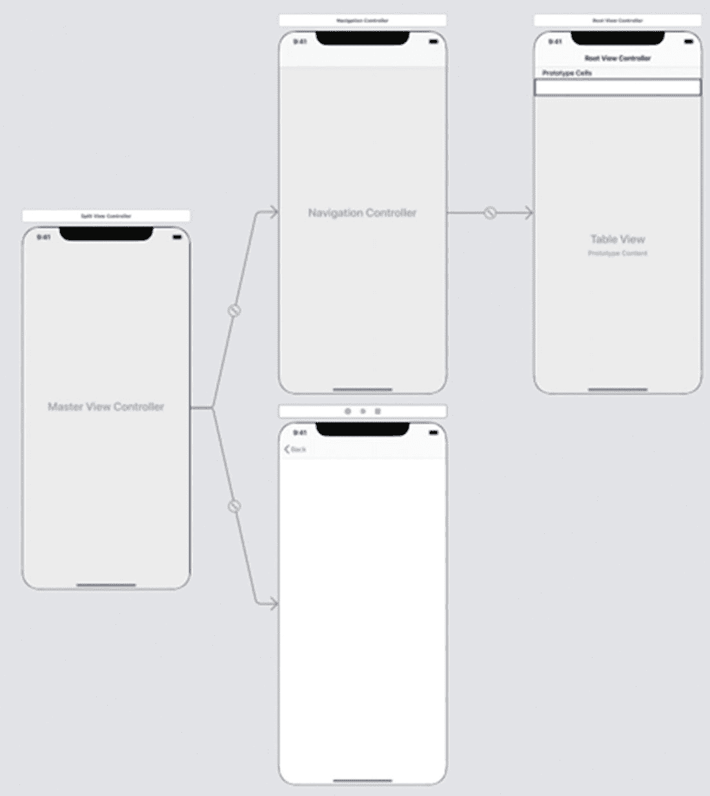

图 20-3

分视图控制器的基本结构

除了分视图控制器需要依赖至少一个导航控制器和一个视图控制器之外，它还需要分布在三个不同文件中的 Swift 代码才能工作：

- `AppDelegate.swift` – 控制组成主视图和详细视图的两个视图控制器。
- 一个连接到主视图的 `.swift` 文件 – 控制主视图控制器。
- 一个连接到详细视图的 `.swift` 文件 – 控制详细视图控制器。

要了解分视图控制器如何工作，请遵循以下步骤：

1. 选择“文件”➤“新建”➤“项目”。会出现一个对话框，列出不同的模板。
2. 在 iOS 类别下选择“主-详细应用”，如图 20-4 所示。

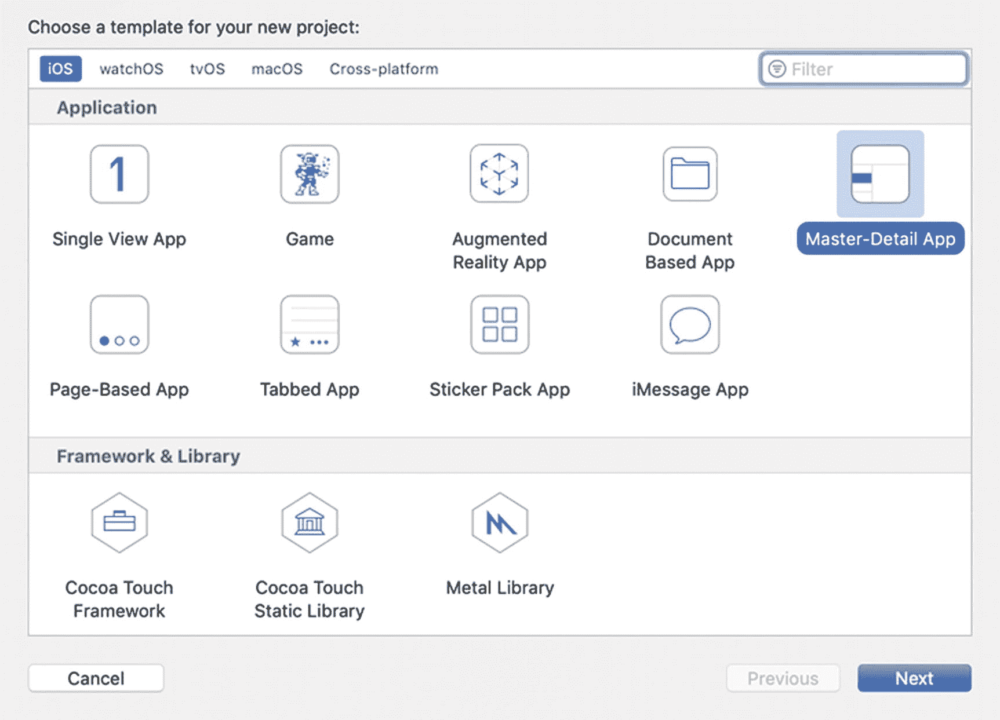

图 20-4

分视图控制器的基本结构

3. 点击**下一步**按钮。Xcode 会显示另一个窗口，要求提供“产品名称”。
4. 点击“产品名称”文本字段，输入 `SplitViewApp`，然后点击**下一步**按钮。接着点击**创建**按钮。Xcode 会显示主-详细应用。
5. 在导航窗格中点击 `AppDelegate.swift` 文件，并注意其中的 Swift 代码。
6. 在导航窗格中点击 `MasterViewController.swift` 文件，并研究其中的 Swift 代码。
7. 在导航窗格中点击 `DetailViewController.swift` 文件，并研究其中的 Swift 代码。
8. 在导航窗格中点击 `Main.storyboard` 文件。注意故事板如何显示一个连接到两个导航控制器的分视图控制器，如图 20-5 所示。

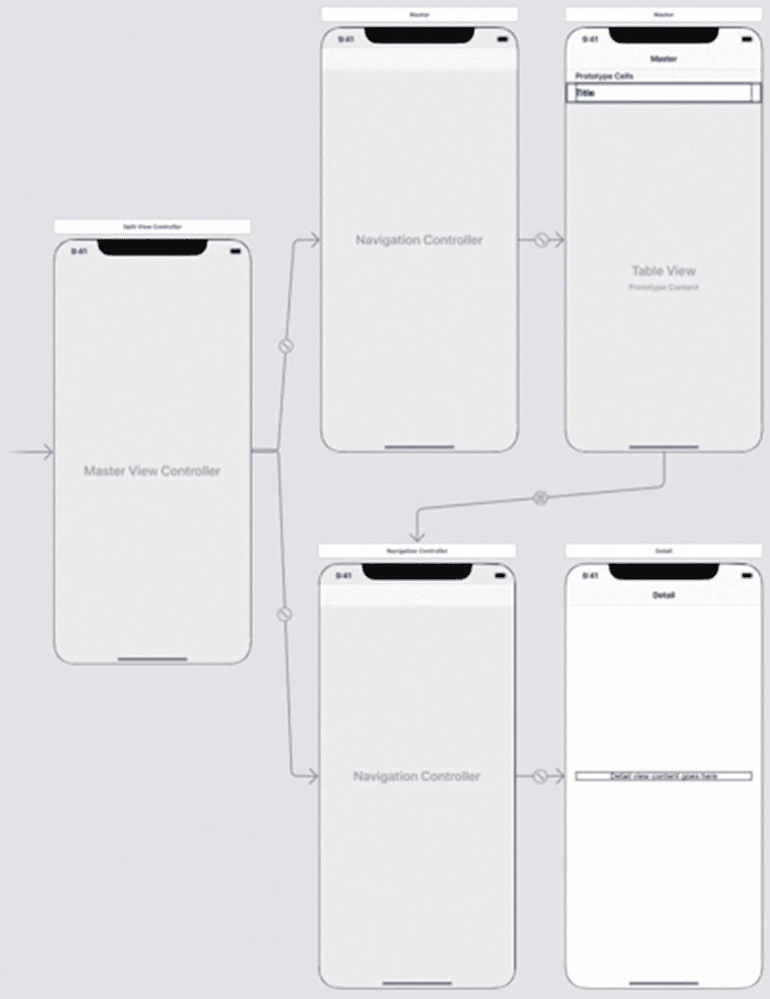

图 20-5

主-详细应用的故事板

9. 点击“活动方案”弹出菜单，如图 20-6 所示。会出现一个弹出菜单。

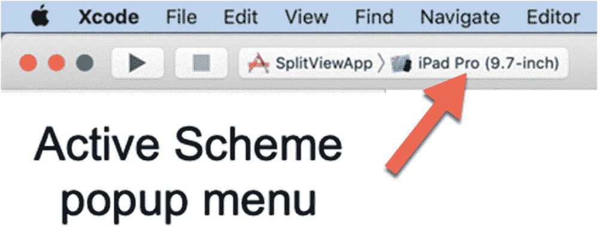

图 20-6

点击“活动方案”弹出菜单

10. 选择一个 iPad 型号，例如 iPad Air 或 iPad Pro。
11. 点击“运行”按钮，或选择“产品”➤“运行”。模拟器窗口会出现，模拟你所选的 iPad 型号。
12. 选择“硬件”➤“向左旋转”。注意分视图控制器会在左侧显示一个表格视图，在右侧显示一个空白视图，如图 20-7 所示。

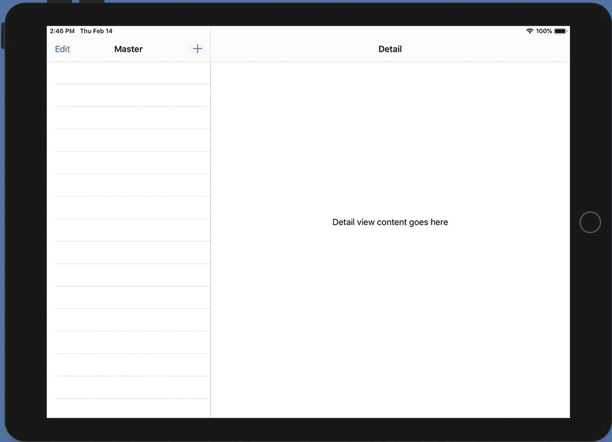

图 20-7

显示分视图控制器

13. 点击左侧（主）视图顶部出现的 + 图标。多次点击这个 + 图标。每次点击此 + 图标时，点击的时间会显示在左侧（主）视图中。
14. 点击左侧（主）视图中显示的任何一条时间。注意右侧（详细）视图会显示该时间，如图 20-8 所示。

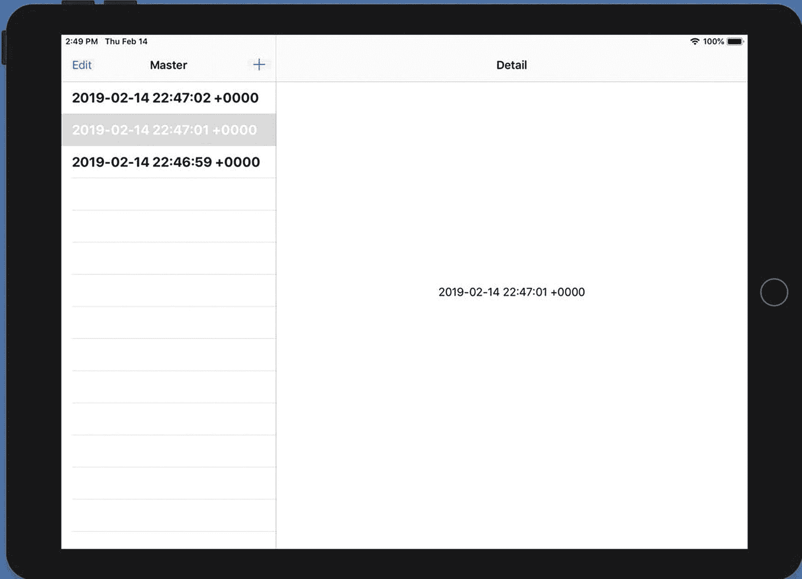

图 20-8

在左侧（主）视图中选择一项，会在右侧（详细）视图中显示更多信息

15. 选择“硬件”➤“向右旋转”。注意分视图控制器现在会隐藏主视图，仅显示详细视图。
16. 点击模拟 iPad 屏幕左上角的 `< 主` 按钮。注意主视图会像图 20-9 所示的那样滑出。

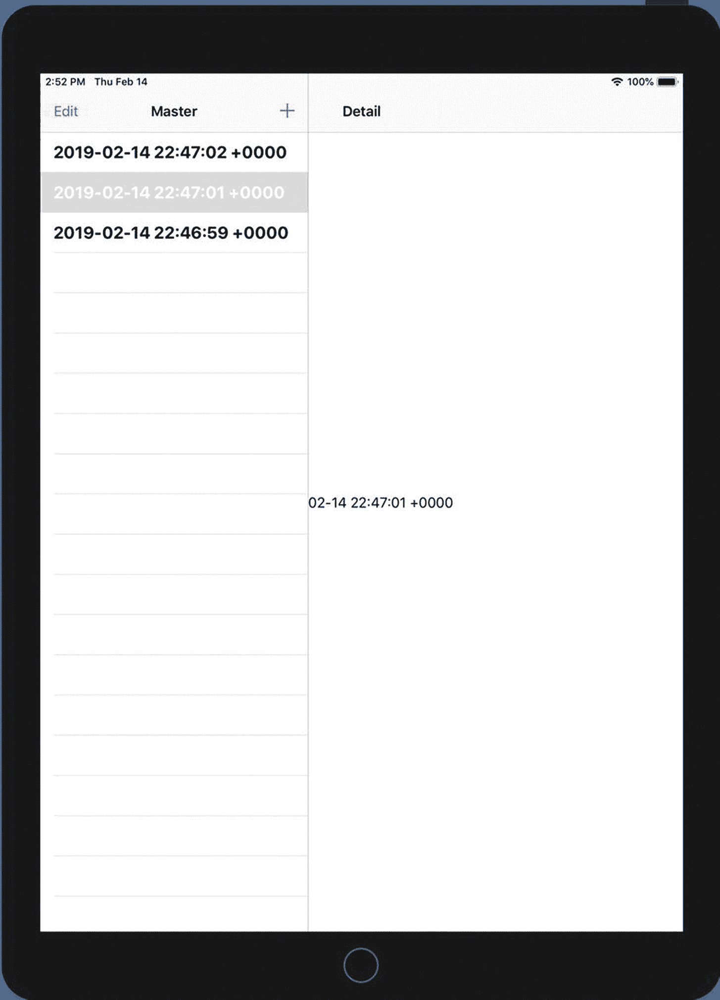

图 20-9

主视图从左侧滑出

17. 选择“模拟器”➤“退出模拟器”以返回 Xcode。

通过在“主-详细应用”模板中试验分视图控制器，你可以看到分视图控制器如何根据模拟 iPad 的方向（竖屏或横屏）改变其外观。

18. 点击“活动方案”弹出菜单（见图 20-6）。会出现一个弹出菜单。
19. 选择 iPhone XR。
20. 点击“运行”按钮，或选择“产品”➤“运行”。模拟器窗口会出现，模拟竖屏方向的 iPhone XR。
21. 多次点击右上角的 + 图标。每次点击 + 图标时，主视图都会显示时间。注意在竖屏方向的较小 iPhone 屏幕上，分视图控制器看起来像一个标准的表格视图，如图 20-10 所示。

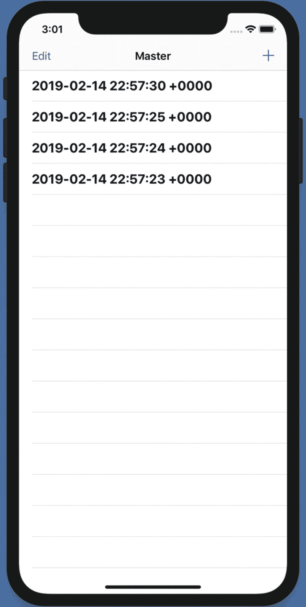

图 20-10

在竖屏方向的 iPhone 上，分视图控制器显示为表格视图

22. 选择“硬件”➤“向左旋转”。
23. 点击左上角的 `< 主` 按钮。注意分视图控制器会将主视图从左侧滑出，并在右侧显示详细视图，如图 20-11 所示。

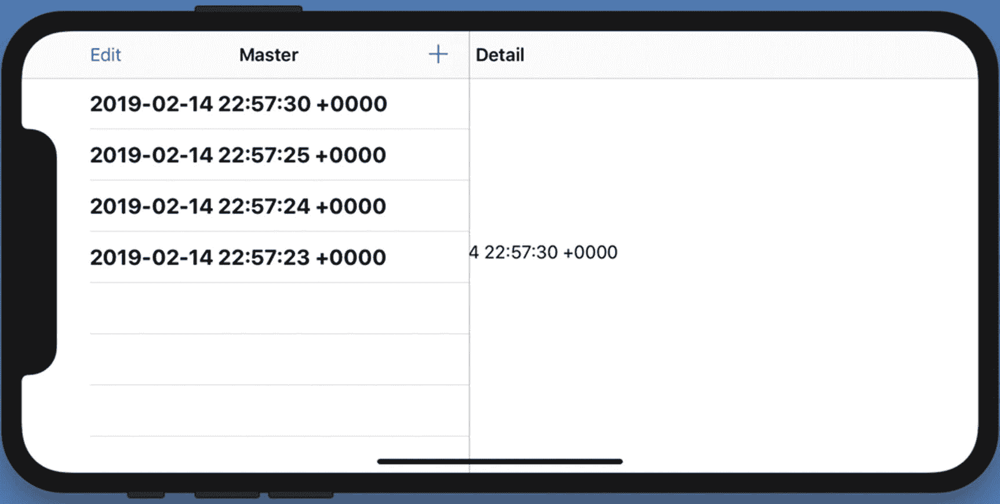

图 20-11

当 iPhone 切换到横屏方向时，主视图可以从左侧滑出

24. 选择“硬件”➤“向右旋转”。注意主视图再次消失。
25. 选择“模拟器”➤“退出模拟器”以返回 Xcode。

尝试在不同的 iOS 设备上运行此应用，例如小屏幕的 iPhone 5s 或大屏幕的 iPad Pro。然后向左和向右旋转 iOS 设备。注意分视图控制器会根据所选的 iOS 设备及其方向表现出不同的行为：

- 在竖屏方向的 iPad 上，分视图控制器会隐藏主视图，但在用户请求时可以将其滑出。
- 在横屏方向的 iPad 上，分视图控制器会在左侧显示主视图，在右侧显示详细视图。
- 在大屏幕 iPhone 的竖屏方向上，分视图控制器显示为表格视图。
- 在大屏幕 iPhone 的横屏方向上，分视图控制器会隐藏主视图，但在用户请求时可以将其滑出。
- 在小屏幕 iPhone 上，无论在竖屏还是横屏方向，分视图控制器都显示为表格视图。


## 在 Storyboard 中添加分视图控制器

了解 `Split View Controller` 在不同 iOS 设备和方向下的行为后，接下来要学习如何创建和自定义 `Split View Controller`。一个 `Split View Controller` 通常至少需要一张表格视图来代表主视图，以及一个 `View Controller` 来代表详细视图。

这意味着你需要用数据填充表格视图，然后编写代码来定义 `Split View Controller` 如何在主视图和详细视图中显示数据。

若要了解如何为 `Split View Controller` 创建 storyboard，请按以下步骤操作：

1.  使用 Single View App 模板创建一个新的 iOS 项目（参见第 1 章），并将这个新项目命名为 `SplitViewCustomApp`。这将为用户界面创建一个单一视图。

2.  在导航窗格中点击 `Main.storyboard`。

3.  在文档大纲中点击 View Controller Scene，然后按 BACKSPACE 或 DELETE 键从 storyboard 中移除该 View Controller。

4.  在导航窗格中点击 `ViewController.swift`，然后选择 编辑 ➤ 删除。此时会出现一个对话框，询问您希望如何删除文件。

5.  点击“移到废纸篓”按钮。`ViewController.swift` 文件会从导航窗格中消失。

6.  在导航窗格中点击 `Main.storyboard` 文件。

7.  点击“库”图标以打开“对象库”窗口。

8.  从“对象库”窗口中将一个 Split View Controller 拖放到 storyboard 上，如图 20-12 所示。

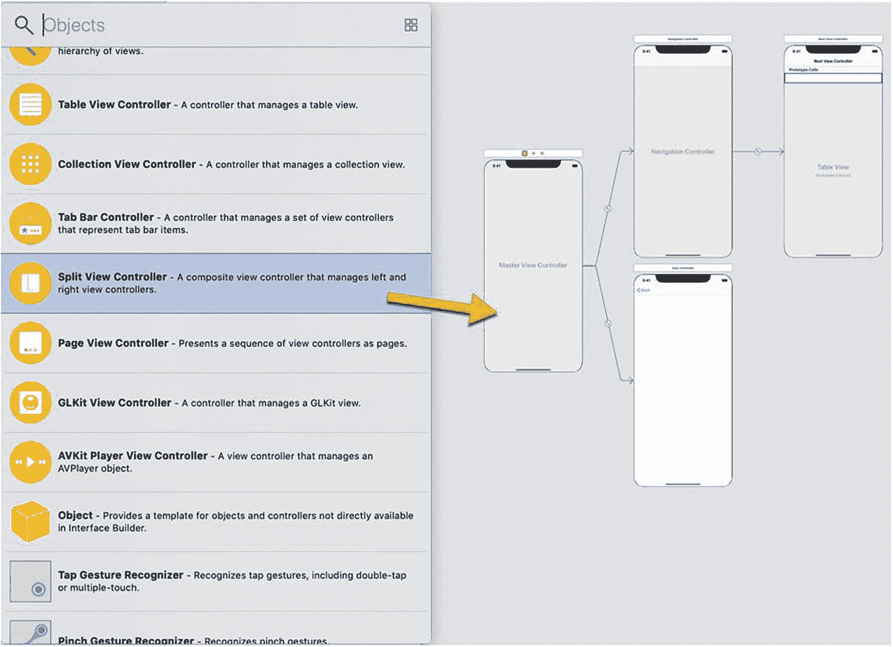

图 20-12

将分视图控制器拖放到 storyboard 上

9.  在文档大纲中点击 Split View Controller Scene。

10. 选择 视图 ➤ 检查器 ➤ 显示属性检查器，或点击 Xcode 窗口右上角的“属性检查器”图标。

11. 选中“是初始视图控制器”复选框。Xcode 会显示一个指向 Split View Controller 的箭头。

12. 在文档大纲中点击 View Controller Scene。

13. 选择 编辑器 ➤ 嵌入于 ➤ 导航控制器。Xcode 将 View Controller 嵌入到一个 Navigation Controller 中。这将使 View Controller 能够滑入和滑出，但我们需要在表格单元格和这个 Navigation Controller 之间创建一个转场，以便用户在点击表格单元格时，显示此 Navigation Controller 内的 View Controller。

14. 在文档大纲的 Root View Controller Scene 下，点击 Table View 下方的 Table View Cell。

15. 选择 视图 ➤ 检查器 ➤ 显示属性检查器，或点击 Xcode 窗口右上角的“属性检查器”图标。

16. 点击标识符文本字段，输入 `customCell`，然后按 ENTER 键。Xcode 会将文档大纲中的 Table View Cell 名称更改为 `customCell`。

17. 将鼠标指针移动到文档大纲中的 `customCell` 上，按住 Control 键，然后从 `customCell` 按住 Control 键拖动到嵌入了空白 View Controller 的 Navigation Controller 上，如图 20-13 所示。

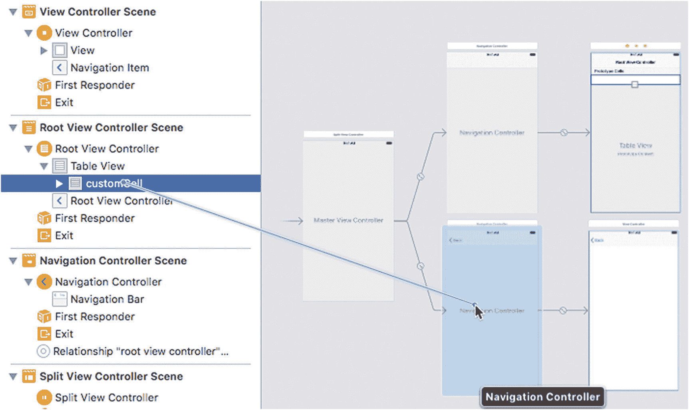

图 20-13

在表格视图单元格和导航控制器之间创建转场

18. 松开 Control 键和鼠标左键。此时会出现一个弹出菜单，如图 20-14 所示。

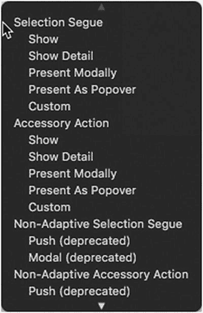

图 20-14

转场弹出菜单

19. 选择“显示详细信息”。Xcode 会在 Table View Cell（名为 `customCell`）和嵌入了空白 View Controller 的 Navigation Controller 之间创建一个转场。

20. 在文档大纲中点击“showDetail”至“Navigation Controller”的 Show Detail 转场。这将选中从 Table View Cell (`customCell`) 到 Navigation Controller 的转场。

21. 选择 视图 ➤ 检查器 ➤ 显示属性检查器，或点击 Xcode 窗口右上角的“属性检查器”图标。

22. 点击标识符文本字段，输入 `showDetail`，然后按 ENTER 键，如图 20-15 所示。

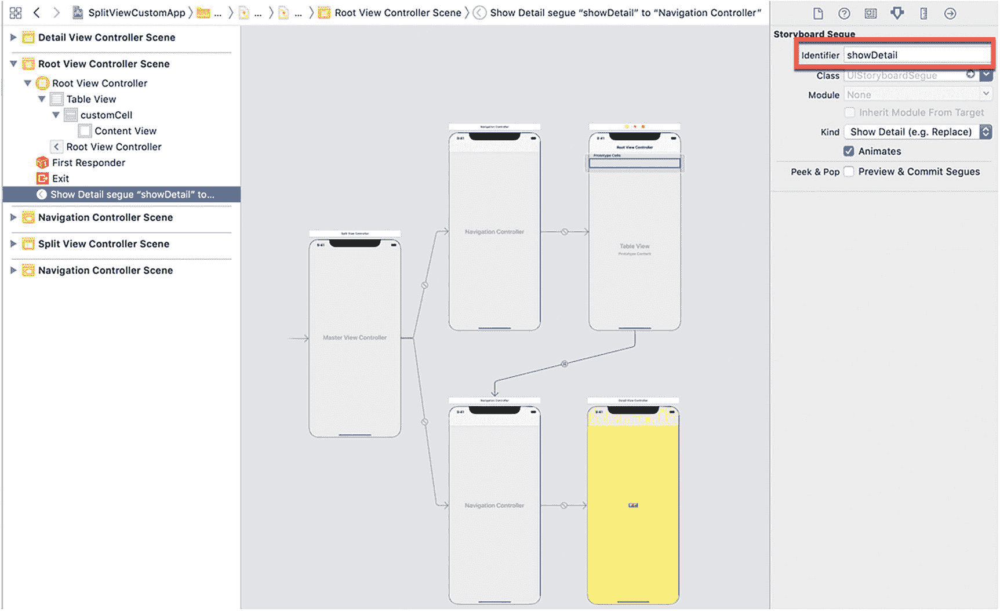

图 20-15

为表格视图单元格和导航控制器之间的转场定义标识符名称

23. 在文档大纲中，点击 View Controller Scene 下的 View。

24. 选择 视图 ➤ 检查器 ➤ 显示属性检查器，或点击 Xcode 窗口右上角的“属性检查器”图标。

25. 点击背景弹出菜单，选择一种不同的颜色（例如黄色），以便在应用运行时更容易识别此 View Controller。

26. 点击“库”图标以打开“对象库”窗口。

27. 将一个标签拖放到您刚刚修改过的、显示背景颜色（如黄色）的视图中央。

28. 点击 Xcode 窗口底部的“对齐”图标，显示一个弹出窗口。

29. 选中“在容器中水平居中”和“在容器中垂直居中”复选框。然后点击“添加 2 个约束”按钮。

至此，Split View Controller 的 storyboard 就完成了。现在我们需要为 Split View Controller 的主视图和详细视图创建 `.swift` 文件。


### 创建类文件

使用分割视图控制器时，需要两个 .swift 类文件：一个用于表格视图（`UITableViewController`），另一个用于视图控制器（`UIViewController`）。`UITableViewController` 的 .swift 文件定义了主视图，负责用数据填充表格视图的行，并检测用户何时点击特定行。而 `UIViewController` 的 .swift 文件则负责在代表详细视图的视图控制器上显示数据。

要创建两个 .swift 类文件，请按以下步骤操作：

1. 确保 `SplitViewCustomApp` 已加载到 Xcode 中。
2. 选择 File ➤ New ➤ File。将出现一个对话框，显示可用的不同模板。
3. 点击 iOS 类别下的 Cocoa Touch Class，然后点击 **Next** 按钮。将出现另一个窗口，要求输入类名和子类类型。
4. 在 Class 文本字段中点击并输入 `MasterTableViewController`。
5. 在 Subclass of 弹出菜单中点击并选择 `UITableViewController`。
6. 点击 **Next** 按钮，然后点击 **Create** 按钮。Xcode 会在导航器面板中显示 `MasterViewController.swift` 文件。
7. 选择 File ➤ New ➤ File。将出现一个对话框，显示可用的不同模板。
8. 点击 iOS 类别下的 Cocoa Touch Class，然后点击 **Next** 按钮。将出现另一个窗口，要求输入类名和子类类型。
9. 在 Class 文本字段中点击并输入 `DetailViewController`。
10. 在 Subclass of 弹出菜单中点击并选择 `UIViewController`。
11. 点击 **Next** 按钮，然后点击 **Create** 按钮。Xcode 会在导航器面板中显示 `DetailViewController.swift` 文件。
12. 在导航器面板中点击 `Main.storyboard` 文件。Xcode 会显示故事板。
13. 在文档大纲中点击根视图控制器。
14. 选择 View ➤ Inspectors ➤ Show Identity Inspector，或点击 Xcode 窗口右上角的身份检查器图标。
15. 在 Class 弹出菜单中点击并选择 `MasterViewController`，如图 20-16 所示。
    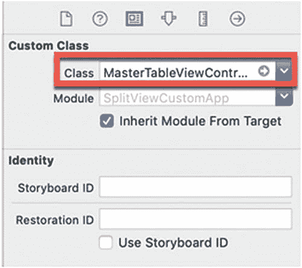
    **图 20-16** 将根视图控制器连接到 `MasterViewController.swift` 文件
16. 在文档大纲中点击视图控制器场景。
17. 选择 View ➤ Inspectors ➤ Show Identity Inspector，或点击 Xcode 窗口右上角的身份检查器图标。
18. 点击 Class 弹出菜单并选择 `DetailViewController`。

### 修改 AppDelegate.swift 文件

`AppDelegate.swift` 文件通常监控应用的行为，例如加载或终止。在我们的示例中，需要 `AppDelegate.swift` 文件来设置分割视图控制器。这意味着要编写 Swift 代码，并将 `AppDelegate.swift` 文件声明为分割视图控制器的代理。

也就是说，需要添加以下两行代码，将 `AppDelegate.swift` 文件指定为分割视图控制器的代理：

```
let splitVC = window!.rootViewController as! UISplitViewController
splitVC.delegate = self
```

第一行声明了一个 `splitVC` 常量，它代表故事板上的分割视图控制器。第二行确保分割视图控制器（`splitVC` 常量）知道 `AppDelegate.swift` 文件是它的代理，这意味着 `AppDelegate.swift` 文件将包含用于将导航控制器加载到分割视图控制器中的 Swift 代码。

分割视图控制器通过将可显示的所有视图控制器存储在一个数组中来进行跟踪。最初，分割视图控制器会显示该数组中的最后一个项。

```
let navigationVC = splitVC.viewControllers.last as? UINavigationController
```

最后，导航控制器需要一个左侧栏按钮，以下代码可以创建该按钮：

```
navigationVC.topViewController!.navigationItem.leftBarButtonItem = splitVC.displayModeButtonItem
```

要进行所有这些更改，请按以下步骤操作：

1. 确保 `SplitViewCustomApp` 项目已加载到 Xcode 中。
2. 在导航器面板中点击 `AppDelegate.swift` 文件。
3. 按如下方式编辑类 AppDelegate 行：

```
    class AppDelegate: UIResponder, UIApplicationDelegate, UISplitViewControllerDelegate {
```

4. 按如下方式编辑 `didFinishLaunchingWithOptions` 方法：

```
    func application(_ application: UIApplication, didFinishLaunchingWithOptions launchOptions: [UIApplication.LaunchOptionsKey: Any]?) -> Bool {
        let splitVC = window!.rootViewController as! UISplitViewController
        splitVC.delegate = self
        let navigationVC = splitVC.viewControllers.last as? UINavigationController
        navigationVC?.topViewController!.navigationItem.leftBarButtonItem = splitVC.displayModeButtonItem
        return true
    }
```

5. 在 `AppDelegate.swift` 文件末尾、最后一个花括号之前添加以下方法：

```
    func splitViewController(_ splitViewController: UISplitViewController, collapseSecondary secondaryViewController:UIViewController, onto primaryViewController:UIViewController) -> Bool {
        guard let secondaryAsNavController = secondaryViewController as? UINavigationController else { return false }
        guard let topAsDetailController = secondaryAsNavController.topViewController as? DetailViewController else { return false }
        if topAsDetailController.detailItem == nil {
            // 返回 true 表示已通过不做任何操作来处理折叠；次要控制器将被丢弃。
            return true
        }
        return false
    }
```

这个 `collapseSecondary` 函数负责显示或隐藏详细视图。`if` 语句检查 `detailItem` 属性是否为空。这个 `detailItem` 属性保存要在详细视图中显示的数据，并将在 `DetailViewController.swift` 文件中定义，因此如果 Xcode 现在显示错误消息，不必担心。

整个 `AppDelegate.swift` 文件应如下所示：

```
import UIKit
@UIApplicationMain
class AppDelegate: UIResponder, UIApplicationDelegate, UISplitViewControllerDelegate {
    var window: UIWindow?
    func application(_ application: UIApplication, didFinishLaunchingWithOptions launchOptions: [UIApplication.LaunchOptionsKey: Any]?) -> Bool {
        let splitVC = window!.rootViewController as! UISplitViewController
        splitVC.delegate = self
        let navigationVC = splitVC.viewControllers.last as? UINavigationController
        navigationVC?.topViewController!.navigationItem.leftBarButtonItem = splitVC.displayModeButtonItem
        return true
    }
    func splitViewController(_ splitViewController: UISplitViewController, collapseSecondary secondaryViewController:UIViewController, onto primaryViewController:UIViewController) -> Bool {
        guard let secondaryAsNavController = secondaryViewController as? UINavigationController else { return false }
        guard let topAsDetailController = secondaryAsNavController.topViewController as? DetailViewController else { return false }
        if topAsDetailController.detailItem == nil {
            // 返回 true 表示已通过不做任何操作来处理折叠；次要控制器将被丢弃。
            return true
        }
        return false
    }
}
```


### 修改 `DetailViewController.swift` 文件

`DetailViewController.swift` 文件用于显示用户的选择。当前，详情视图控制器显示了一个标签，但这个标签需要连接到 `IBOutlet`，以便 Swift 代码能够在该标签中显示数据。

此外，`DetailViewController.swift` 文件还需要定义一个 `detailItem` 属性。该 `detailItem` 属性用于存储从 `MasterTableViewController.swift` 文件发送过来的数据，该文件定义了用户所选表格视图行中的项目。当详情视图控制器首次加载以及用户每次在表格视图中选择不同项目时，这些数据都需要显示在标签中。

要修改 `DetailViewController.swift` 文件，请按照以下步骤操作：

1.  确保 `SplitViewCustomApp` 项目已在 Xcode 中加载。
2.  在导航器窗格中点击 `Main.storyboard` 文件。
3.  在文档大纲中点击详情视图控制器场景。
4.  选择 视图 ➤ 辅助编辑器 ➤ 显示辅助编辑器，或者点击 Xcode 窗口右上角的辅助编辑器图标。这将并排显示 `Main.storyboard` 和 `DetailViewController.swift` 文件。
5.  将鼠标移到文档大纲中详情视图控制器场景下的标签上，按住 Control 键，然后 Ctrl-拖拽到 `DetailViewController.swift` 文件中的“class `DetailViewController`”行。
6.  松开 Control 键和鼠标左键。会弹出一个窗口。
7.  点击名称文本字段，输入 `petLabel`，然后点击连接按钮。Xcode 会创建一个 `IBOutlet`，如下所示：

    ```
    @IBOutlet var petLabel: UILabel!
    ```

8.  选择 视图 ➤ 标准编辑器 ➤ 显示标准编辑器，或者点击 Xcode 窗口右上角的标准编辑器图标。
9.  在导航器窗格中点击 `DetailViewController.swift` 文件。
10. 在 `IBOutlet` 下方添加以下属性：

    ```
    var detailItem: String? {
        didSet {
            configureView()
        }
    }
    ```

11. 在 `IBOutlet` 下方添加以下函数：

    ```
    func configureView() {
        if let label = petLabel {
            label.text = detailItem
        }
    }
    ```

12. 修改 `viewDidLoad` 方法如下：

    ```
    override func viewDidLoad() {
        super.viewDidLoad()
        configureView()
    }
    ```

当视图首次加载时，它会调用 `configureView()` 函数，该函数将 `detailItem` 数据存储到标签中。每次用户在主视图显示的表格视图中选择不同项目时，所选项目都会被存储到 `detailItem` 属性中。

完整的 `DetailViewController.swift` 文件应如下所示：

```
import UIKit
class DetailViewController: UIViewController {
    @IBOutlet var petLabel: UILabel!
    var detailItem: String? {
        didSet {
            configureView()
        }
    }
    func configureView() {
        if let label = petLabel {
            label.text = detailItem
        }
    }
    override func viewDidLoad() {
        super.viewDidLoad()
        configureView()
        // 视图加载后执行任何其他设置
    }
}
```

### 修改 `MasterTableViewController.swift` 文件

`MasterTableViewController.swift` 文件显示一个表格视图，供用户选择项目。这意味着 `MasterTableViewController.swift` 文件需要定义表格视图中显示的分区数（1）以及表格视图中显示的行数（数据的数组总长度），并使用数组中的数据填充表格视图。该数组仅显示一个字符串列表，每个字符串显示在表格视图的一行中。

除了用数据填充表格视图，`MasterTableViewController.swift` 文件还需要创建一个代表详情视图控制器的变量，并通过故事板中定义的转场（segue）将用户在表格视图中选择的项目传递给该详情视图控制器。

要修改 `MasterTableViewController.swift` 文件，请按照以下步骤操作：

1.  确保 `SplitViewCustomApp` 项目已在 Xcode 中加载。
2.  在导航器窗格中点击 `MasterTableViewController.swift` 文件。
3.  在“class `MasterTableViewController`”行下方添加以下代码：

    ```
    var detailVC: DetailViewController? = nil
    let petArray = ["cat", "dog", "parakeet", "parrot", "canary", "finch", "tropical fish", "goldfish", "sea horses", "hamster", "gerbil", "rabbit", "turtle", "snake", "lizard", "hermit crab"]
    ```

4.  修改 `viewDidLoad()` 方法如下：

    ```
    override func viewDidLoad() {
        super.viewDidLoad()
        if let split = splitViewController {
            detailVC = (split.viewControllers.last as! UINavigationController).topViewController as? DetailViewController
        }
    }
    ```

5.  在 `viewDidLoad()` 方法下方添加以下方法：

    ```
    override func viewWillAppear(_ animated: Bool) {
        clearsSelectionOnViewWillAppear = splitViewController!.isCollapsed
        super.viewWillAppear(animated)
    }
    ```

6.  在 `viewWillAppear(_:)` 方法下方添加以下代码，以定义表格视图并使用数组中的数据填充它：

    ```
    override func numberOfSections(in tableView: UITableView) -> Int {
        return 1
    }
    override func tableView(_ tableView: UITableView, numberOfRowsInSection section: Int) -> Int {
        return petArray.count
    }
    override func tableView(_ tableView: UITableView, cellForRowAt indexPath: IndexPath) -> UITableViewCell {
        // 确保在属性检查器面板中定义了表格视图的单元格标识符
        let cell = tableView.dequeueReusableCell(withIdentifier: "customCell", for: indexPath)
        cell.textLabel!.text = petArray[indexPath.row]
        return cell
    }
    ```

7.  添加以下 `prepare(for:sender:)` 函数，从表格视图中检索数据并发送到 `DetailViewController.swift` 文件：

    ```
    override func prepare(for segue: UIStoryboardSegue, sender: Any?) {
        if segue.identifier == "showDetail" {
            if let indexPath = tableView.indexPathForSelectedRow {
                let object = petArray[indexPath.row]
                let controller = (segue.destination as! UINavigationController).topViewController as! DetailViewController
                controller.detailItem = object
                controller.navigationItem.leftBarButtonItem = splitViewController?.displayModeButtonItem
                controller.navigationItem.leftItemsSupplementBackButton = true
            }
        }
    }
    ```

8.  点击运行按钮，或选择 产品 ➤ 运行。模拟器窗口会出现，显示一个填充了 `petArray` 中项目的表格视图。
9.  点击任意项目。请注意，详情视图会在其标签中显示所选项目。
10. 选择 硬件 ➤ 向左旋转。
11. 将鼠标移到模拟器左侧并向右侧拖拽，以拉出主视图，如图 20-17 所示。

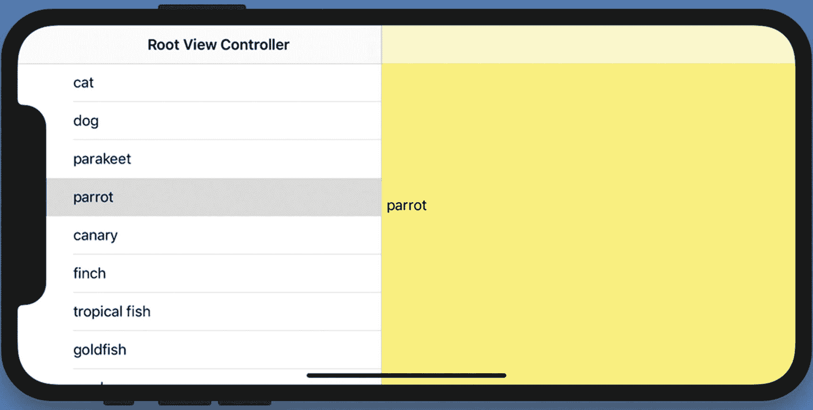

图 20-17

在模拟的 iPhone 上以横屏方向运行应用

12. 将鼠标指针移到主视图右侧，并向左侧拖拽鼠标以收起主视图。
13. 选择 硬件 ➤ 向右旋转。
14. 选择 模拟器 ➤ 退出模拟器，返回 Xcode。


## 摘要

分割视图控制器专为 iPad 或 iPhone 的大屏幕型号等较大屏幕而设计。分割视图控制器可以并排显示两个视图，其中一个视图（称为主视图）通常显示一个项目列表。从该列表中选择一个项目后，会将此数据传输到第二个视图（称为详细视图）。

当在大屏幕上显示时，分割视图控制器可以并排显示主视图和详细视图。当在较小屏幕上显示时，分割视图控制器的行为类似于普通的导航控制器，通过滑动视图来前后切换。

使用分割视图控制器时，请确保通过在属性检查器面板中定义转场的 `Identifier` 属性，来命名表格视图单元格和导航控制器之间的转场。同时，也要通过修改表格视图单元格的 `Identifier` 属性来为其命名。

主视图控制器和详细视图控制器都需要连接一个单独的 `.swift` 类文件。除了在这两个 `.swift` 文件中编写代码外，你还需要在 `AppDelegate.swift` 文件中编写代码。

分割视图控制器有助于在大屏幕和小屏幕上正确显示数据。可以将分割视图控制器视为导航控制器的更高级版本，它特别适用于 iPad 等大屏幕。

### A

`Activity Indicator view` `addObserver` 方法 `Alert controller` 操作表创建 `buttonTapped` IBAction 方法 `Object Library` `Single View App` 模板 显示多个按钮的消息，显示 `buttonTapped` IBAction 方法 `Cancel` 按钮 `Control` 键 `destroy` 按钮 `labelResult` `Object Library` `UIAlertAction` `ViewController.swift` 文件 `viewDidLoad` 方法 属性 文本字段，显示 `buttonTapped` `buttonTapped` IBAction 方法 `Control` 键 模拟器屏幕 `ViewController.swift` `viewDidLoad` 方法 `Xcode` `AppDelegate.swift` 文件 `Attributes inspector` 按钮标签场景，自定义文本 自定义视图，自定义 `Auto Layout`

### B

`backBarButtonItem` 属性 `barTintColor` 属性 `bottomEdgeDetected` IBAction 方法 `Bottom edge gesture` `Buttons` 文本修改 标题 定义 `Touch Up Inside` `buttonTapped` IBAction 方法 `buttonTapped` 方法

### C

`Canvas` 值 `Cell styles` `Cocoa Touch` 类 `CollectionViewDataApp` `Collection views` 单元格颜色 创建 从数组显示信息到单元格中 居中标签 创建新的 `.swift` 类文件 `itemCell.swift` 文件 修改单元格大小 `ViewController.swift` 文件 `viewDidLoad` 方法 `Scroll Direction` 弹出菜单 节头 连接 `itemCell.swift` 文件 创建 标识符 标签 `petArray` `Reusable View` 选择 `ViewController` `ViewController.swift` 文件 `viewDidLoad` 方法 文本字段 `ViewController.swift` 文件 `viewDidLoad` 方法 `Constraints` `Add new constraints` 弹出窗口 对齐对象，边缘 `align` 弹出窗口 常量值 标准 帧 方法 方向/屏幕尺寸 解决 `auto layout` 大小检查器面板 `Xcode`，颜色 `Controller` `Attributes Inspector` 背景，更改 初始视图 更改 `Is Initial View` `Main.storyboard` 文件 手动链接 部件 第二视图 转场链接 故事板链接 swift 类文件 类型 用户界面创建 视图，选择 工作

### D

`Data structures` 数组 字典 `myStructure` 元组 `DateFormatter` 常量 `Date picker` 属性检查器面板 `dateChanged` IBAction 方法 `DateFormatter` `.dateStyle` 和 `.timeStyle` 属性 拖放 `getCurrentDateTime` IBAction 方法 `mode` 更改 `Object Library` 检索值 按钮上的标题 `ViewController.swift` 文件 `viewDidLoad` 方法 `DetailViewController.swift` 文件 `dismissKeyboard` 函数 `Document outline` 显示/隐藏 选择控制器和故事板 显示视图场景 `doneTapped` IBAction 方法

### E, F

`Events`

### G

`Grouped tables`，创建 字符串数组 `Assistant Editor` `Attributes Inspector` 类 `ViewController` 显示数据 `GroupTableViewApp` `numberOfRowsInSection` 函数 `numberOfSections` 函数 `Object Library` `petTable` 带标题的节 模拟器窗口 `Style` 弹出菜单 表格视图，定义 带数据的表格视图 `titleForHeaderInSection` 函数 `ViewController.swift` 文件 `viewDidLoad` 方法

### H

`handleBottomEdge` 函数 `handleLeftEdge` 函数 `handleLongPress` 函数 `handlePan` 函数 `handlePinch` 函数

### I, J

`IBAction` 方法 `Assistant Editor` 属性检查器 选择对象类型 连接按钮 连接第二个对象 `Connections Inspector` 面板 `IBOutlets` 模拟器 `.swift` 文件 `Tag` 值 类型 默认为 `Any` 用户界面对象 验证对象 Xcode 的自动补全功能 `IBActions` `IBOutlets` 变量 属性检查器面板 连接检查器 创建 定义 打开 `Assistant Editor` `Refactor` 命令 重命名/删除 选择控制器 `Standard Editor` `.swift` 文件 用户界面对象 `if-elseif` 语句 `Inspector` 面板 iOS 设备，更改步骤 iOS 编程 文件类型 文件夹和文件 部件 技能 故事板 Xcode 编译器 iPad Pro 屏幕 iPad Pro 用户界面

### K

`keyboardWillHideNotification` `keyboardWillShowNotification`

### L

`leftEdgeDetected` IBAction 方法 `longPressDetected` IBAction 方法 `Long press gesture` `Attributes Inspector` 图像视图 `LongPressApp` `LongPressCodeApp` `Object Library` 属性 识别器 `Swift` 代码 `UILongPressGestureRecognizer` `User Interaction` 用户界面 `viewDidLoad` 方法 `Xcode` `Loop statement`

### M

`MARK` 注释 代码弹出菜单 工作 `MasterTableViewController.swift` 文件 `Multiple views`，`Navigation Controller` `Object Library` 窗口 `SecondViewController.swift` 文件 模拟器 故事板 `ThirdViewController` `View Controller` `ViewController.swift` 文件 `Xcode` `myDictionary.count` 命令

### N

`Navigation bar`，自定义 返回按钮 `backBarButtonItem` 属性 模拟器 文本和颜色 `ViewController.swift` 文件 按钮，添加 `Assistant Editor` `Attributes Inspector` `Bar Button Item` `Identity Inspector` `Object Library` 第二个 `View Controller` `Show` 转场 模拟器 `System Item` 弹出类型 `UIBarButtonItem` `View Controller` `View Controller Scene` `Xcode` 颜色 提示文本 `Cocoa Touch` 类 `Object Library` `SecondViewController` 模拟器 `View Controller` `Xcode` 标题文本 `Navigation controller` 创建 颜色 `Identifier` iOS 项目 `Object Library` 弹出菜单 `Show` 转场 模拟器 故事板 `View Controller` 传递数据到其他视图 `IBOutlet` `navigationItem` 传递的文本 `SecondViewController` 故事板 嵌入 分层数据 `Object Library` 根视图 顺序 `Navigator` 面板 文件，点击 隐藏/显示 `Issue navigator` `.storyboard` 文件 `.swift` 文件 信息类型 导航器类型 工作 工作

### O

`ObjectApp` 用户界面 `Object-oriented programming` 封装 继承 多态 `Orientation` 图标

### P, Q

`Page View Controller` 添加和自定义 行为修改 拖放 属性 `.swift` 文件 `panDetected` IBAction 方法 `Pan gesture` `Attributes Inspector` `CGFloat` 数据类型 图像视图 `Object Library` `PanApp` `PanCodeApp` `panDetected` 弹出菜单 `Recognizer` `Swift` 代码 `User Interaction` `viewDidLoad` 方法 `Xcode` `Picker view` `buttonTapped` `buttonTapped` IBAction 方法 类 `ViewController` `Control` 键 `.count` 方法 显示数据 `IBOutlet` 变量 多组件，显示 `Object Library` 窗口 弹出窗口 模拟器屏幕 `ViewController.swift` 文件 `viewDidLoad` 方法 `PinchCodeApp` `pinchDetected` IBAction 方法 `Pinch gestures` `Attributes Inspector` `gestureRecognizers` 图像视图 `Object Library` 选项键 `PinchApp` `pinchDetected` `Recognizer` 模拟器 `Swift` 代码 `User Interaction` `viewDidLoad` 方法 `Xcode` `Progress view` `Project navigator` `Prompt text`

### R

`receivedString` 属性 `rightSwipeDetected` IBAction 方法 `RotateCodeApp` `rotationDetected` IBAction 方法 `Rotation gestures` `Assistant Editor` `Attributes Inspector` `handleRotation` `IBOutlet` 图像视图 `Object Library` 识别器 `RotateApp` `rotationDetected` 模拟器 `Swift` 代码 `User Interaction` `viewDidLoad` 方法 `Xcode`


### S

- **方案弹出菜单**
- **屏幕边缘滑动手势**
- - `Attributes Inspector` `bottomEdgeDetected`
- - `EdgePanApp` `EdgePanCodeApp`
- - `IBOutlet`
- - `对象库`
- - `识别器`
- - `Swift 代码`
- - `Xcode`
- - `SecondViewController.swift` 文件
- **分段控件**
- - `Attributes Inspector` 修改，标题编辑
- **模拟器程序**，硬件菜单
- **单视图应用模板**
- **尺寸检查器窗格**
- **滑块**
- **分割视图控制器**
- - `AppDelegate.swift` 文件
- - 类文件，创建
- - 详细视图 `DetailViewController.swift` 文件
- - `MasterTableViewController.swift` 文件
- - 主视图
- - 故事板创建
- - 拖拽 `导航控制器` 转场
- - 弹出菜单结构（*参见* 结构，分割视图控制器）
- - 表格视图
- **堆栈视图**，约束
- - 对齐属性
- - `属性检查器` 窗格
- - 基线
- - `文档大纲`
- - `对象库` 窗口
- - 属性
- - 间距属性
- - 堆栈宽度
- - 使用堆栈视图
- - `标准值`
- **`startAnimating` 方法**
- **`stepperChanged` IBAction 方法**
- **步进器**
- **`stopAnimating` 方法**
- **结构，分割视图控制器**
- - 活动方案弹出菜单
- - 显示
- - 横屏方向
- - 主从应用
- - 主视图滑动
- - `导航控制器`
- - `对象库`
- - 竖屏方向
- - 工作步骤
- **Swift**
- - 分支语句
- - 布尔运算符
- - 布尔值
- - `if` 语句
- - `switch` 语句
- - 驼峰命名法
- - 注释
- - 数据存储
- - 不同数据类型
- - 可选数据类型
- - 数据结构（*参见* 数据结构）
- - 函数
- - 循环语句
- - `for` 循环
- - `repeat` 循环
- - `while` 循环
- - 数学运算符
- - 面向对象编程（*参见* 面向对象编程）
- - 输出
- - Playground 选择
- - 模板创建
- **iOS Swift 代码**
- - Apple 框架
- - 函数
- - IBAction 方法创建
- - IBOutlets 和 IBAction
- - IBOutlets 创建
- - Xcode 编辑器颜色选项
- - 命令
- - 折叠和展开函数
- **`UITextField`**
- - 轻扫手势
- - `属性检查器`
- - 约束
- - `gestureRecognizers`
- - 图像视图
- - `对象库`
- - 弹出菜单
- - `识别器`
- - `rightSwipeDetected`
- - 右滑手势
- - `Swift 代码`
- - `SwipeApp` `SwipeCodeApp`
- - 上滑手势
- - `用户交互`
- - `viewDidLoad` 方法
- - `Xcode`
- **开关**
- - 设置使用显示属性

### T

- **标签栏**
- - 关闭图标文件名
- - 缩略图使用
- - **标签栏控制器**应用
- - 选择，创建图像集
- - 自定义图标
- - `Assets.xcassets` 文件夹创建
- - 拖放图像集
- - 图像名称
- - 导航器窗格
- - 自定义文本/图标
- - 删除视图控制器
- - 拖放视图控制器
- - 嵌入视图
- - 多个视图 *对比* 导航控制器
- - 弹出菜单
- - 转场链接
- - 选择
- - 工具栏视图控制器 *对比* 工具栏
- - **表格视图控制器**
- - `cellForRowAt` 函数
- - `didSelectRowAt` 函数
- - 文件模板对话框
- - 标识符定义
- - `身份检查器`
- - `numberOfRowsInSection` 函数
- - `numberOfSections` 函数
- - `对象库` 窗口
- - 故事板
- - `.swift` 文件
- - `TableViewControllerApp`
- - 视图控制器场景
- - `ViewController.swift` 文件，删除
- - **表格视图单元格**，自定义
- - 单元格样式
- - Control 键
- - 设计数组
- - `属性检查器` 图标
- - `cellImage`
- - 类名和子类类型
- - 类 `ViewController`
- - `detailText` 图标，交织圆环
- - 标识符，更改
- - 标签和图像视图
- - `mainText`
- - 导航，`TableViewCell.swift` 文件
- - `对象库` 窗口
- - 模拟器窗口
- - `TableViewCell.swift` 文件
- - `TableViewCellVisualApp`
- - 表格视图显示
- - 带数据的表格视图
- - 标签中的文本
- - `UITableViewCell`
- - `ViewController.swift` 文件
- - `viewDidLoad` 方法
- - `detailArray` 显示
- - 图像
- - 拖放图像文件
- - `imageArray`
- - `对象库` 窗口
- - 部件
- - 公共领域图像
- - 模拟器窗口
- - 样式
- - `tableData`
- - 文本标签、详细文本标签和图像视图
- - `ViewController.swift` 文件
- - `viewDidLoad` 方法
- - **表格视图**
- - 添加和删除项目，滑动手势
- - `addAction` 行
- - 提示控制器
- - 带文本字段的提示控制器
- - `属性检查器`
- - 按钮
- - 显示
- - 类 `ViewController` 行
- - `deleteAction` 行
- - 显示项目，用户选择的
- - `对象库` 窗口
- - `petArray`
- - 模拟器窗口
- - `tableView`
- - 带数据的表格视图
- - `UITableViewDataSource` `UITableViewDelegate`
- - `ViewController.swift` 文件
- - `viewDidLoad` 方法
- - 单元格创建
- - `属性检查器`
- - 类 `ViewController`
- - `连接检查器` 窗格
- - 委托和数据源
- - 拖拽
- - 标识符文本字段
- - `对象库` 窗口
- - `petArray`
- - `petTable`
- - 模拟器窗口
- - 单视图应用模板
- - `ViewController.swift` 文件
- - `viewDidLoad` 方法
- - 分组表格（*参见* 分组表格，创建）
- - 索引显示
- - `助理编辑器`
- - `属性检查器`
- - 字符视图窗口，表情符号
- - 类 `ViewController` 行
- - Control 键
- - 每个部分的标题
- - 部分数量
- - `对象库`
- - `petArray`
- - `sectionIndexTitles` 函数
- - 模拟器窗口
- - `TableViewIndexApp`
- - 带数据的表格视图
- - `UITableViewDataSource`
- - `ViewController.swift` 文件
- - `viewDidLoad` 方法
- - 项目选择
- - **标签属性**
- **`tapDetected` IBAction 方法**
- **轻击手势**
- - `属性检查器`
- - 连接检查器
- - `IBOutlet`
- - `对象库`
- - 弹出菜单
- - 编程解决方案
- - `识别器`
- - Swift 代码
- - `TapApp`
- - 用户交互
- - 视图控制器
- - `viewDidLoad` 方法
- - 可视化解决方案
- - `Xcode`
- **文本字段**
- - `addObserver` 方法
- - 外观
- - 内容
- - 虚拟键盘
- - `dismissKeyboard`
- - `keyboardWillHideNotification`
- - `keyboardWillShow` 函数
- - 数字和标点
- - 数字键盘
- - `viewDidLoad` 方法
- **文本视图**
- - 更改外观
- - 创建可点击文本
- - 内容模式弹出菜单
- - 显示
- - 虚拟键盘
- - IBAction 方法
- - `ViewController.swift` 文件
- - `viewDidLoad` 方法
- - 拖放
- - 图像交互
- - 修改
- - 存储图形图像
- - 工作
- - `tintColor` 属性
- **工具栏**
- - 命令
- - 隐藏/显示
- - **工具栏控制器**
- - 添加/删除按钮
- - 显示文本/图标
- - 固定空格栏按钮
- - 灵活空格栏按钮
- - 空格
- - `addTapped`
- - `文档大纲`
- - IBAction 方法
- - `对象库` 窗口
- - 系统项目弹出菜单
- - `ViewController.swift` 文件
- - `touchesBegan` 方法

### U

- **`UIBarButtonItem`**
- **`UIButton` 对象**
- **`UIPageController`** `.swift` 文件
- **`UIPinchGestureRecognizer`**
- **`UIRotationGestureRecognizer`**
- **`UIScreenEdgePanGestureRecognizer`**
- **`UISwipeGestureRecognizer`**
- **`UITapGestureRecognizer`**
- **`UIViewController` 类文件**
- **`uppercased()` 函数**
- **`upSwipeDetected` IBAction 方法**
- **用户界面对象**
- - 活动指示器视图
- - 属性
- - 自动布局
- - 按钮定义
- - IBAction 方法
- - 更改属性
- - 更改大小/位置
- - 添加约束
- - 对齐图标
- - 自动布局问题
- - 自动更改
- - 关系颜色
- - Xcode
- - 存在矛盾
- - 已固定
- - 固定距离
- - 解决自动布局图标
- - 菜单
- - 堆栈视图
- - 标准/画布
- - 值
- - 顶部视图或删除
- - `IBOutlet` 变量
- - 标签
- - 属性
- - 显示文本
- - 显示文本
- - `IBOutlet` 变量属性
- - 调整部分大小
- - 预览功能
- - 以编程方式创建对象
- - 进度视图 *对比* 活动指示器视图
- - 在标签和步进器之间
- - 增加/减少值
- - `stepperChanged` IBAction 方法
- - `ViewController.swift` 文件
- - `viewDidLoad` 方法
- - 工作
- - 安全区域
- - 屏幕尺寸
- - 滑块
- - 最大轨道
- - 最小轨道
- - 滑块按钮
- - 使用 Swift 代码
- - 步进器
- - 文本字段（*参见* 文本字段）

### V, W

- **视图控制器**
- - guard 语句
- - 身份检查器窗格
- - 页面控制器
- - 页面卷曲过渡样式
- - `PageViewController.swift` 文件
- - 页面视图选择
- - 故事板
- - `.swift` 文件
- - `UIPageViewController`，创建
- - `viewDidLoad` 方法
- - 视图选择
- - `ViewController.swift` 文件
- - `viewDidLoad`
- - 折叠函数
- - `viewDidLoad` 方法

### X, Y, Z

- **`Xcode`**
- - 颜色
- - 调试区
- - 功能
- - 图标
- - 工作
- - 导航器窗格（*参见* 导航器窗格）
- - 部件
- - 项目名称
- - 标签栏（*参见* 标签栏）
- - 工具栏（*参见* 工具栏）
- - 查看详细信息
- - 欢迎屏幕
