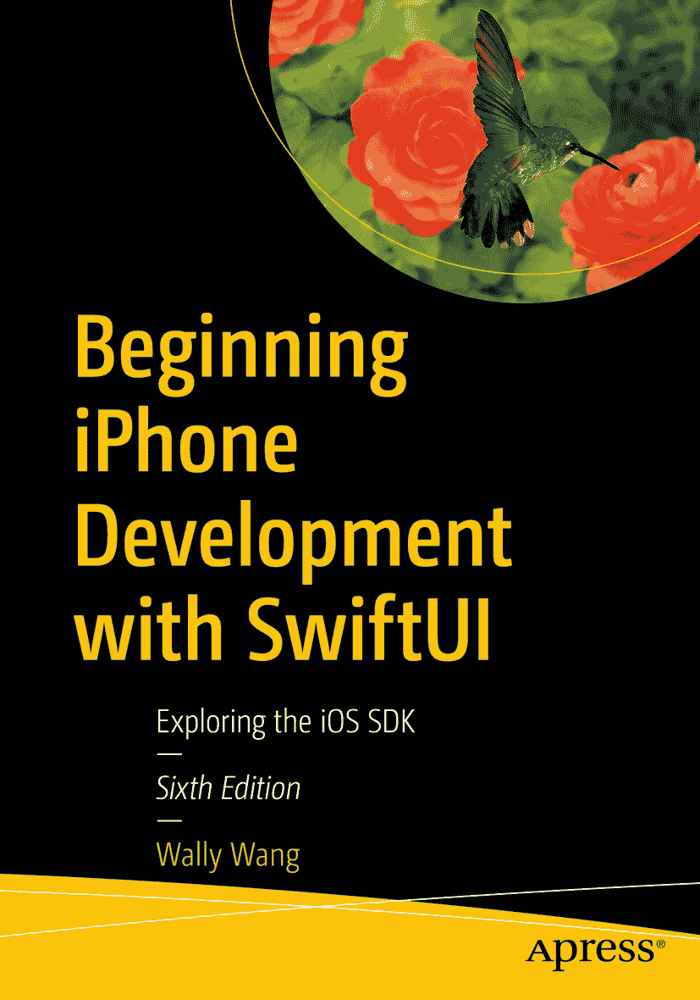

ISBN 978-1-4842-7817-8 电子版 ISBN 978-1-4842-7818-5 [`doi.org/10.1007/978-1-4842-7818-5`](https://doi.org/10.1007/978-1-4842-7818-5)  
© 沃利·王 2022  
本作品受版权保护。所有权利均由出版商独家许可，涉及的全部或部分材料，具体包括翻译、重印、复用插图、朗诵、广播、微缩胶卷复制或以任何其他物理形式复制、传输或信息存储与检索、电子改编、计算机软件，或目前已知或未来开发的类似或不类似方法的权利。本出版物中使用通用描述性名称、注册商标名称、商标、服务标记等，即使未作特别声明，也不意味着这些名称不受相关保护性法律和法规的约束，因此可自由用于一般用途。出版商、作者及编辑均认为，本书中的建议和信息在出版之日是真实准确的。出版商、作者或编辑对本出版物所含材料或可能存在的任何错误或遗漏，不作任何明示或暗示的保证。对于已出版地图中的管辖权主张及机构隶属关系，出版商保持中立。

本 Apress 印记由注册公司 APress Media, LLC（斯普林格自然旗下）出版。

注册公司地址为：1 New York Plaza, New York, NY 10004, U.S.A。

**关于作者**  
**关于技术审校**

