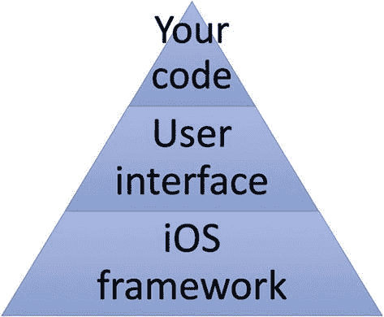

# 1. 理解 iOS 编程

所有编程都涉及编写计算机要执行的命令这一相同任务。要学会 iOS 编程，你需要掌握三种不同的技能：

- 如何用 Swift 编程语言编写命令
- 如何使用苹果的软件框架
- 如何在 Xcode 中创建用户界面

你需要用 Swift 编程语言编写命令，让应用实现独特的功能。然后借助苹果的软件框架来处理常见任务，例如检测触摸手势或访问摄像头。最后，使用 Xcode 设计应用的界面。

应尽可能多地依赖苹果的软件框架，因为这样无需编写（并测试）自己的 Swift 代码，就能执行常见任务。通过依赖苹果的软件框架，你可以专注于应用的独特功能，而无需处理让应用使用 iPhone 或 iPad 不同硬件特性的繁琐细节。

理想情况下，你希望用户界面能够适配 iPhone、iPad 或 iPod Touch 等所有不同的屏幕尺寸，从而呈现良好外观。用户界面让你可以向用户展示信息，并从用户那里获取信息。最好的用户界面是那种用户几乎无需思考就能使用的界面。

本质上，每个 iOS 应用都由三部分组成，如图 1-1 所示：

**图 1-1** iOS 应用的三个组成部分

- 你的代码，用于让应用做有用的事
- 一个你可以在 Xcode 中可视化设计的用户界面
- 通过一个或多个苹果 iOS 框架对 iOS 设备硬件特性的访问

苹果为 iOS（及其其他操作系统，如 macOS、watchOS 和 tvOS）提供了数十个框架。只需使用苹果的框架，你就能通过编写少量自己的代码来完成常见任务。苹果提供的一些框架包括：

- `SwiftUI` – 用户界面及触控屏支持
- `ARKit` – 增强现实功能
- `Core Animation` – 显示动画
- `GameKit` – 创建多人互动应用
- `Contacts` – 访问 iOS 设备上的通讯录数据
- `SiriKit` – 允许通过 Siri 使用语音命令
- `AVKit` – 允许播放音频和视频文件
- `MediaLibrary` – 允许访问 iOS 设备上存储的图像、音频和视频
- `CallKit` – 提供语音通话功能

苹果的框架本质上包含了你可以复用的代码。这使应用更可靠、更一致，同时通过使用经过验证且能正确运行的代码，节省了开发者的时间。要查看苹果提供的完整软件框架列表，请访问苹果开发者文档网站（[`https://developer.apple.com/documentation`](https://developer.apple.com/documentation)）。

苹果的框架可以为你创建 iOS 应用提供巨大优势，但你仍然需要提供用户界面，以便用户能与应用交互。虽然你可以从头创建用户界面，但这既繁琐、耗时，又容易出错。更糟的是，如果每个应用开发者都从头创建用户界面，那么没有两个 iOS 应用会看起来或操作方式完全相同，从而使用户感到困惑。

这就是为什么苹果的 Xcode 编译器能帮助你使用大多数应用中使用的标准功能来设计用户界面，例如视图（屏幕上的窗口）、按钮、标签、文本字段和滑块。在 Xcode 中，用户界面的每个窗口被称为一个视图。简单的 iOS 应用可能只包含一个视图（想想 iPhone 上的计算器应用），而更复杂的 iOS 应用则由多个视图组成。

为了创建用户界面，Xcode 提供了两种选择：

- 故事板
- SwiftUI

故事板让你组织每个屏幕（称为视图），并使用转场将它们连接起来。故事板最大的缺点是，当应用需要显示多个屏幕时，使用起来往往很笨拙。此外，你需要编写大量 Swift 代码来使各种用户界面对象（如表视图、文本字段和按钮）工作。最后，故事板使得创建能够自动适应不同尺寸 iOS 设备屏幕的用户界面变得繁琐且困难。

由于这些原因，苹果现在提供了第二种设计用户界面的方式，即使用名为 `SwiftUI` 的框架。`SwiftUI` 的主要理念是，你只需编写尽可能少的代码就能让用户界面工作。取而代之的是，你选择希望在用户界面上显示的内容，然后定义修改器来改变该用户界面在屏幕上的外观。

你可以在单个项目中同时使用故事板和 `SwiftUI`，也可以只使用故事板或只使用 `SwiftUI`。由于 `SwiftUI` 代表了为苹果所有产品开发应用的未来方向，本书将专门聚焦于使用 `SwiftUI` 而非故事板来创建用户界面。

