# 了解 Xcode

学习 iOS 开发不仅仅是学习如何使用 `Swift` 编程语言编写代码。除了了解 `Swift`，你还必须知道如何查找和使用 Apple 的不同软件框架、如何使用 `Xcode` 通过 `SwiftUI` 设计用户界面，以及如何组织、创建和删除包含 `Swift` 代码的文件。此外，你还必须学习如何使用 `Xcode` 的编辑器编写代码。

每次创建一个 `Xcode` 项目时，实际上你都在创建一个包含多个文件的文件夹。一个简单的 iOS 应用可能只包含几个文件，而一个复杂的应用则可能包含数百甚至数千个独立的文件。

通过将代码存储在不同的文件中，你可以快速找到包含你要编辑和修改的数据的那个文件，同时安全地忽略其他文件。无论你有多少个 `.swift` 文件，`Xcode` 都会将它们视为存储在一个文件中。通过将程序分解成多个 `.swift` 文件，你可以将程序的不同部分分组到不同的文件中，从而更容易修改应用的特定部分。

为了进一步帮助你组织项目中的多个文件，`Xcode` 允许你创建单独的文件夹。这些文件夹的存在纯粹是为了方便你组织代码。图 1-2 展示了 `Xcode` 如何将应用划分为文件夹和文件。

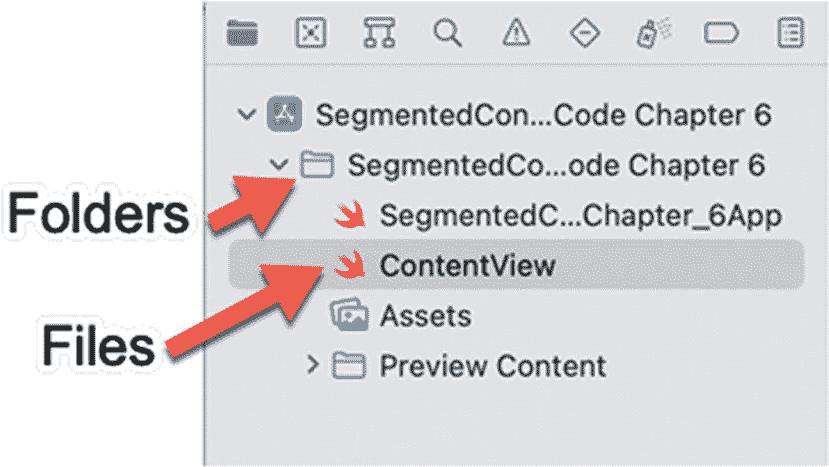

图 1-2

`Xcode` 将你的代码存储在文件中，你可以将这些文件组织到文件夹中

为了熟悉 iOS 应用开发，让我们从一个简单的项目开始，该项目将教你：

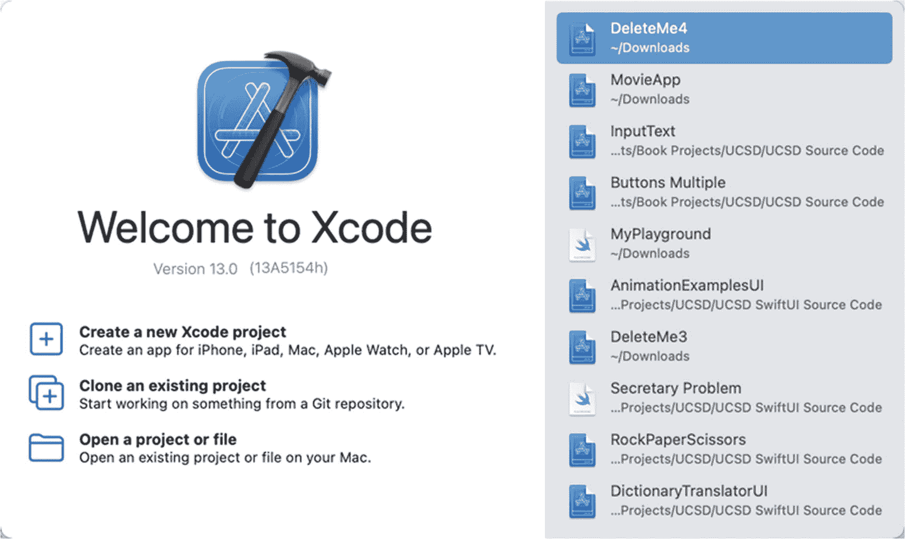

图 1-3

`Xcode` 欢迎界面

1.  启动 `Xcode`。屏幕上会出现欢迎界面，让你选择最近使用过的项目或创建新项目的选项，如图 1-3 所示。（你随时可以通过选择“窗口 ➤ 欢迎使用 Xcode”或按下 Shift + Command + 1 来从 `Xcode` 内部打开此欢迎界面。）

*   如何理解项目的组成部分

*   如何查看不同的文件

*   `Xcode` 的不同部分如何工作

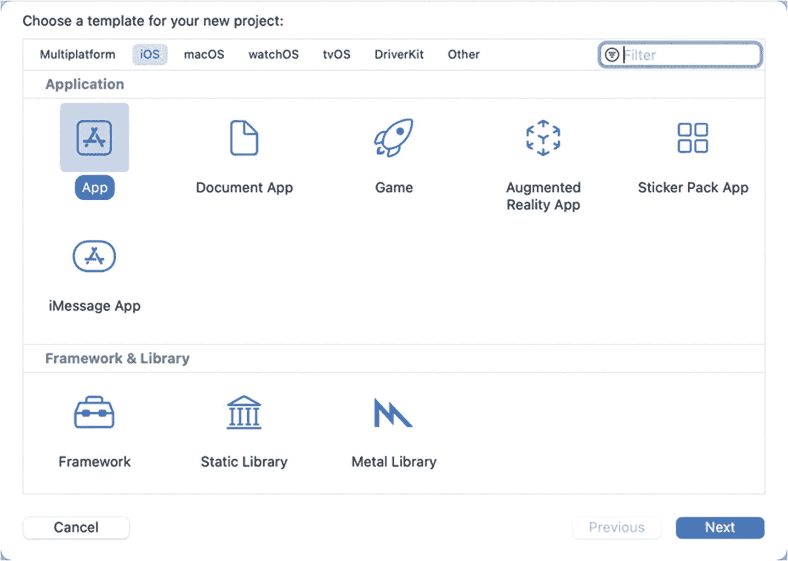

图 1-4

选择项目模板

1.  点击“创建新的 Xcode 项目”选项。`Xcode` 会显示用于设计不同类型应用的模板，如图 1-4 所示。请注意，模板窗口顶部会显示你可以为其开发应用的不同操作系统，例如 iOS、watchOS、tvOS 和 macOS。通过选择不同的操作系统，你可以创建专为运行该特定操作系统的设备设计的项目。

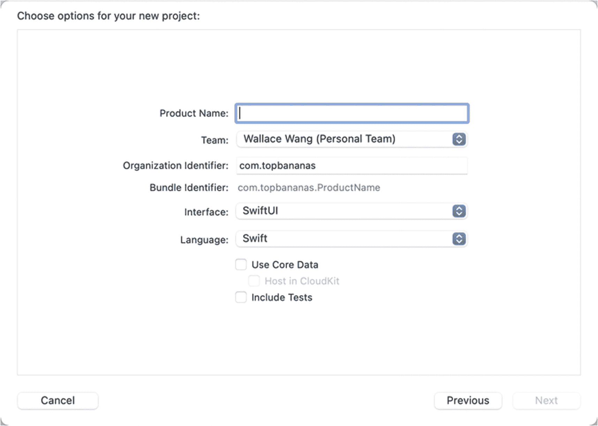

图 1-5

定义项目名称、组织名称和组织标识符

1.  点击 `iOS`，然后点击 `App`。`App` 模板代表了最基本的 iOS 项目。

2.  点击“下一步”按钮。将会出现另一个窗口，要求你输入项目名称以及组织名称和组织标识符，如图 1-5 所示。你必须填写所有三个文本字段，但项目名称、组织名称和组织标识符可以是任何你想要的描述性文本。请注意，“界面”弹出菜单让你可以在 `SwiftUI` 和 `Storyboard` 之间进行选择。对于本书中的所有项目，请务必确保你选择了 `SwiftUI`。

1.  点击“项目名称”文本字段，然后为你的项目键入一个名称，例如 `MyFirstApp`。

2.  点击“团队”文本字段，然后键入你的姓名或公司名称。

3.  点击“组织标识符”文本字段，然后键入你想要的任何标识文本。通常，此标识符是你的网站名称反向拼写，例如 `com.microsoft`。

4.  点击“界面”弹出菜单并选择 `SwiftUI`。确保所有复选框都未选中。然后点击“下一步”按钮。`Xcode` 会显示一个对话框，让你选择将项目存储在哪个驱动器和文件夹中。

5.  选择一个驱动器和文件夹，然后点击“创建”按钮。`Xcode` 会显示你新创建的项目。

`Xcode` 窗口最初可能看起来令人困惑，但你需要明白 `Xcode` 将信息分组到几个窗格中。最左边的窗格称为导航窗格。通过点击导航窗格顶部的图标，你可以查看项目的不同部分，如图 1-6 所示。

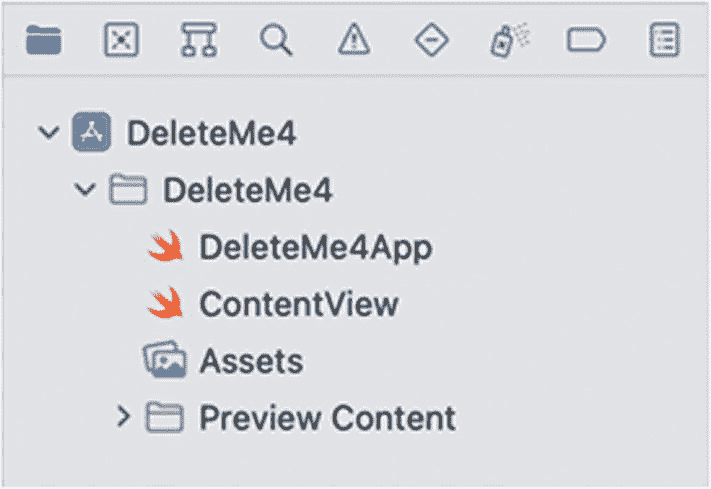

图 1-6

导航窗格显示在 `Xcode` 窗口的最左侧

主要的 SwiftUI 文件名为 `ContentView`，它包含定义应用用户界面的 Swift 代码。

```
import SwiftUI
struct ContentView: View {
var body: some View {
Text("Hello, world!")
.padding()
}
}
struct ContentView_Previews: PreviewProvider {
static var previews: some View {
ContentView()
}
}
```

`import SwiftUI` 这行代码让你的应用能够使用 `SwiftUI` 框架来设计用户界面。

`ContentView: View` 结构体在屏幕上显示一个单一视图。SwiftUI 一次只能在屏幕上显示一个视图。当你创建一个 SwiftUI iOS 应用时，默认视图是一个显示“Hello, world!”的 `Text` 视图，位于屏幕中央。

`ContentView_Previews: PreviewProvider` 结构体实际上是在画布窗格上显示用户界面，该窗格位于 Swift 代码的右侧，如图 1-7 所示。

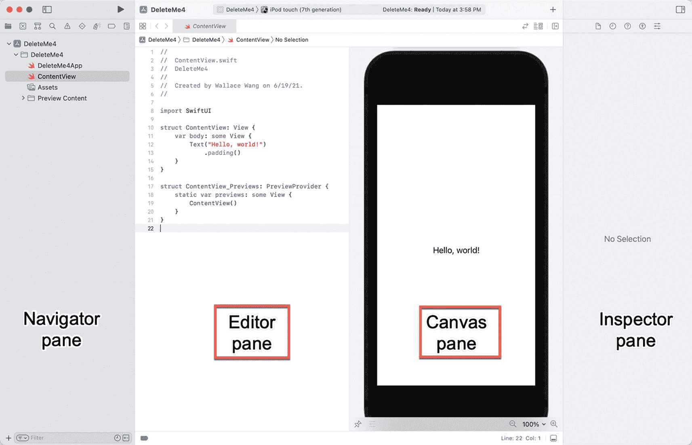

图 1-7

编辑器窗格和画布窗格

当编辑器窗格和画布窗格并排显示时，你对编辑器窗格所做的任何更改都会显示在画布窗格中，反之亦然。如果你点击右上角的编辑器选项图标，可以隐藏或显示画布窗格，如图 1-8 所示。

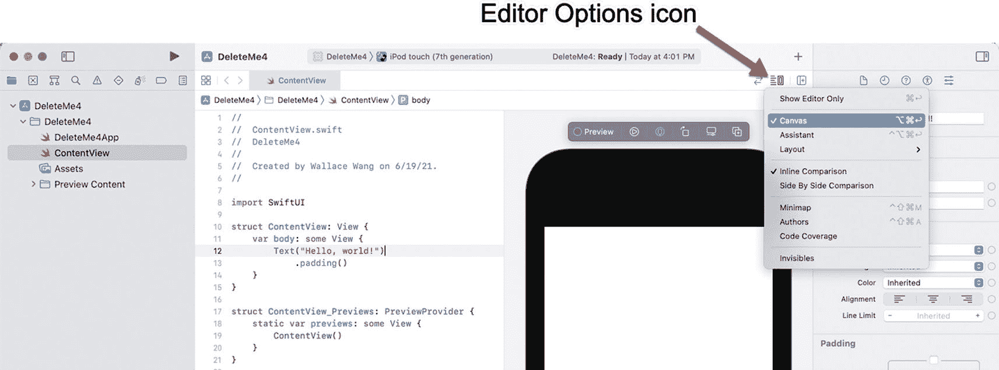

图 1-8

编辑器选项图标允许你在显示和隐藏画布窗格之间切换

画布窗格有两个用途。首先，它让你在创建用户界面时，能精确地看到它在模拟的 iOS 设备上的外观。其次，它让你可以在模拟的 iOS 设备上运行你的应用。

画布窗格可以模拟单个 iOS 设备，例如 iPod Touch。如果你想更改画布窗格模拟的 iOS 设备，`Xcode` 提供了三种方法，如图 1-9 所示：

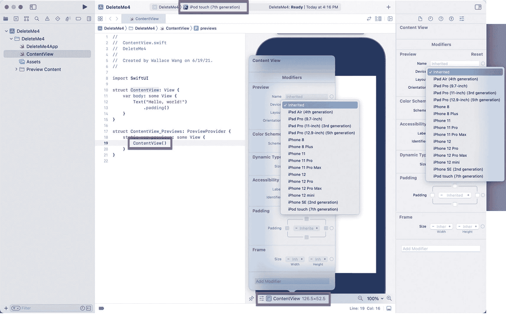

图 1-9

显示要模拟的 iOS 设备菜单

*   点击左上角的弹出菜单以显示 iOS 设备列表。

*   将光标移动到 `ContentView_Previews: PreviewProvider` 结构体中的 `ContentView()` 内，点击“检查选中的对象”以显示一个菜单，然后点击“设备”弹出菜单以显示 iOS 设备列表。

*   将光标移动到 `ContentView_Previews: PreviewProvider` 结构体中的 `ContentView()` 内，然后点击检查器窗格（位于 `Xcode` 窗口右侧）中的“设备”弹出菜单以显示 iOS 设备列表。

在为画布窗格选择了不同的 iOS 设备后，你可能需要点击出现在画布窗格右上角的“恢复”按钮。“恢复”按钮可确保画布窗格与你可能所做的任何更改保持同步。


## 操控 Xcode 面板

Xcode 的四个面板（`Navigator`、`Editor`、`Canvas` 和 `Inspector`）各自服务于不同的目的。`Navigator` 面板会显示关于你项目的信息，例如组成该项目的所有文件名称。`Editor` 面板是你可以编写和编辑 Swift 代码的地方。`Canvas` 面板则是你可以查看并测试由 Swift 代码定义的用户界面的地方。`Inspector` 面板会显示关于当前选中对象的信息。

你可以通过将鼠标指针移动到面板边框上，并向左或向右拖动鼠标来调整任何面板的大小。你也可以切换隐藏或显示 `Navigator` 和 `Inspector` 面板。这样一来，你就能看到更多 `Editor` 和 `Canvas` 面板的内容。

要隐藏/显示 `Navigator` 或 `Inspector` 面板，你有两个选项，如图 1-10 所示：

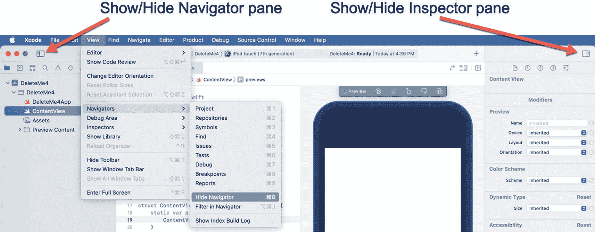

**图 1-10** — 隐藏或显示 `Navigator` 和 `Inspector` 面板

*   选择 `View ➤ Navigators/Inspectors ➤ Hide/Show Navigator/Inspector`。
*   点击 `Show/Hide Navigator/Inspector` 面板图标。

`Navigator` 面板让你可以选择要在 `Editor` 面板中显示的内容。`Inspector` 面板则让你可以选择用户界面项目，以便采用不同的方式来修改它们，如图 1-11 所示。

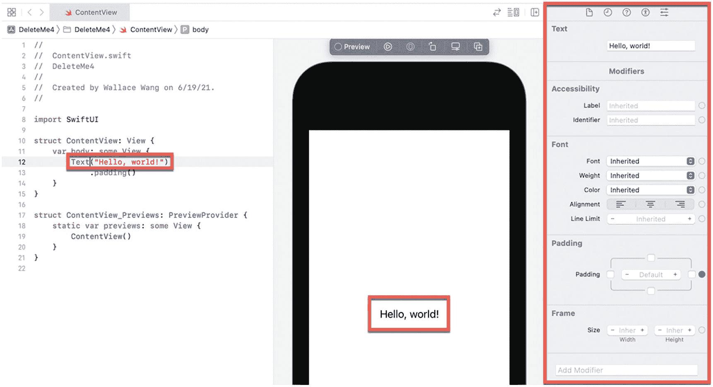

**图 1-11** — `Inspector` 面板列出了修改选中项目的不同方式

要了解 `Inspector` 面板的工作方式，请遵循以下步骤：

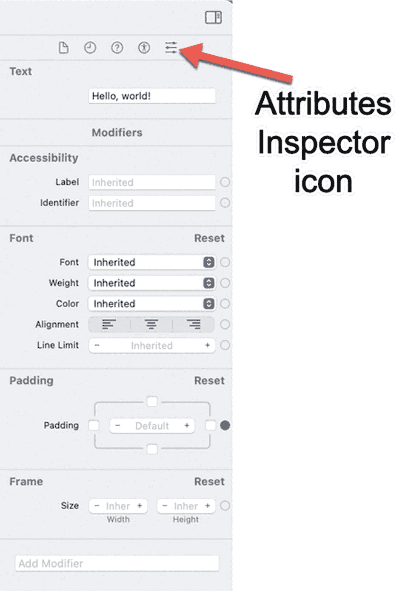

**图 1-12** — `Attributes Inspector` 图标让你可以在 `Inspector` 面板中查看修改项目的额外方式

1.  在 `Navigator` 面板中点击 `ContentView` 文件。`Editor` 面板会显示 `ContentView` 文件的内容。
2.  将光标移动到 `Text("Hello, world!")` 行。
3.  点击 `Inspector` 面板中的 `Attributes Inspector` 图标，如图 1-12 所示。`Inspector` 面板会显示修改当前选中项目的额外方式。

如你所见，Xcode 的面板会显示关于一个项目的不同信息。`Navigator` 面板（位于最左侧）让你可以概览你的项目。在 `Navigator` 面板中点击具体项目，会在 `Editor` 面板中显示该项目。`Inspector` 面板（位于最右侧）会显示关于在 `Editor` 面板中选中内容的额外信息。`Canvas` 面板则允许你预览用户界面的外观。

如果你探索 Xcode，会发现它有数十种功能，但刚开始使用 Xcode 时，没必要一下全部理解。只需专注于使用你需要的那些功能，在需要用到其他功能之前，完全可以忽略它们。

## 总结

创建 iOS 应用不仅仅涉及编写代码。为了让你的应用能够访问不同 iOS 设备的硬件特性，你可以使用苹果的软件框架，这些框架提供了访问摄像头或 Siri 自然语言界面的能力。所有 SwiftUI 项目使用的最重要的框架是 `SwiftUI` 框架。通过将你的代码与苹果现有的软件框架结合，你可以专注于编写让应用运行起来的代码，并利用苹果的软件框架来帮助你实现在大多数 iOS 设备上常见的功能。

除了编写代码，每个 iOS 应用还需要一个用户界面。要创建用户界面，请使用 `SwiftUI`。由于 `SwiftUI` 无需编写大量代码就能更轻松地创建用户界面，它正迅速成为在苹果所有平台（`macOS`、`iOS`、`iPadOS`、`watchOS` 和 `tvOS`）上为应用设计用户界面的首选方式。

创建 iOS 应用的主要工具是苹果免费的 `Xcode` 程序，它可以让你创建项目、组织项目中的各个文件、以及查看和编辑每个文件的内容。`Xcode` 让你能在同一个程序中设计、编辑和测试你的应用。尽管 `Xcode` 提供了数十种功能，但开始创建你自己的 iOS 应用时，你只需使用其中一小部分。

学习 iOS 编程涉及学习如何使用 `Swift` 编程语言编写命令，学习如何查找和使用苹果的各种软件框架，学习如何在 `SwiftUI` 中设计用户界面，以及学习如何使用 `Xcode`。虽然这看起来任务繁重，但本书会带你逐步了解每一个环节，让你在不久的将来能够自如地使用 `Xcode` 并创建你自己的 iOS 应用。


