# 使用 SwiftUI 设计用户界面

每个应用都需要一个用户界面。SwiftUI 的基本理念是利用被称为“视图”的构建块来创建用户界面。一个视图在用户界面上显示一个单一项目，例如文本、图像或按钮，如图 2-1 所示。

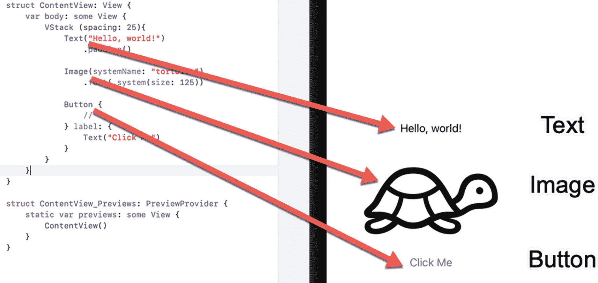

图 2-1

SwiftUI 用户界面的组成部分

SwiftUI 的一个限制是它一次只能在屏幕上显示一个视图。为了突破这个限制，SwiftUI 提供了所谓的“堆栈”。一个堆栈被视为单个视图，但它允许你组合或堆叠多达十个额外的视图。通过创建堆栈，你可以在屏幕上显示不止一个视图。堆栈甚至可以容纳其他堆栈，这实际上让你可以在单个屏幕上显示任意数量的视图。

共有三种类型的堆栈，如图 2-2 所示：

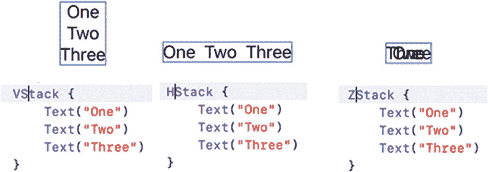

图 2-2

垂直、水平堆栈和 ZStack

* `VStack` – 垂直堆栈，将视图排列在另一个视图的上方和下方
* `HStack` – 水平堆栈，将视图并排排列
* `ZStack` – 一个将视图直接叠加在一起的堆栈

一个堆栈算作单个视图。通过使用水平（`HStack`）或垂直（`VStack`）堆栈，你可以在一个堆栈内添加最多十个视图。为了更大的灵活性，你可以在堆栈中嵌入堆栈，以便根据需要显示任意数量的视图。

> **注意：** 一个堆栈最多只能包含十个视图。如果你试图在堆栈中存储 11 个或更多视图，Xcode 将显示错误信息并拒绝运行你的程序。

在 SwiftUI 中创建用户界面时，你有三种选择：

* 在编辑器面板中键入 Swift 代码。
* 将一个视图（例如按钮）拖放到编辑器面板中的 Swift 代码中。
* 将一个视图（例如按钮）拖放到画布面板上。

在编辑器面板中键入 Swift 代码来设计用户界面是最快且最灵活的方法，但这需要时间，并且需要熟悉不同的选项。为了使键入 Swift 代码定义用户界面视图更容易，当 Xcode 识别出你正在尝试键入的内容时，它会显示一个选项弹出菜单。通过选择一个选项并按回车键，你可以快速创建用户界面视图，如图 2-3 所示。

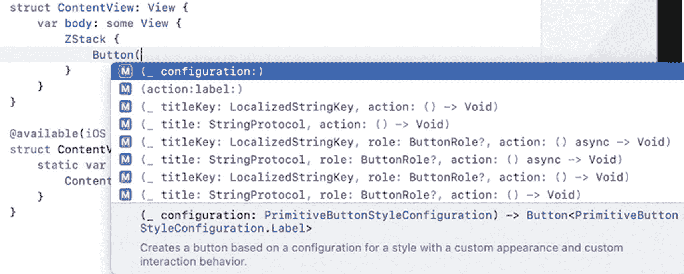

图 2-3

当你键入 Swift 代码来定义用户界面视图时，Xcode 会显示一个选项菜单

如果你不熟悉设计用户界面的各种选项，使用库窗口会更简单，该窗口列出了所有你可以使用的用户界面视图，如图 2-4 所示。

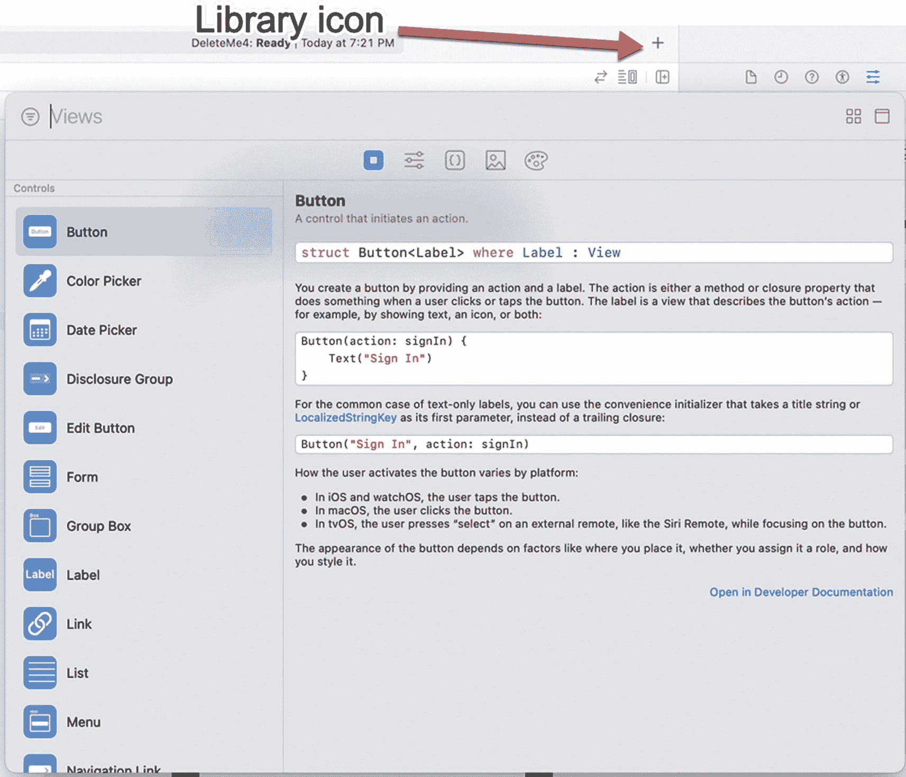

图 2-4

点击库图标会打开库窗口

打开库窗口后，你可以将用户界面视图从库窗口中拖放到：

* 编辑器面板中，如图 2-5 所示
* 画布面板中模拟的 iOS 设备用户界面上，如图 2-6 所示

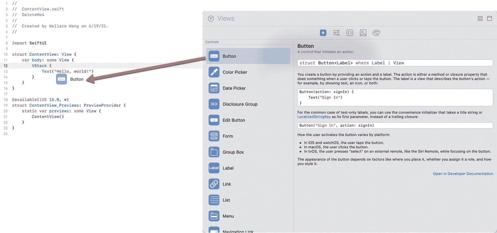

图 2-5

将用户界面视图拖放到编辑器面板中

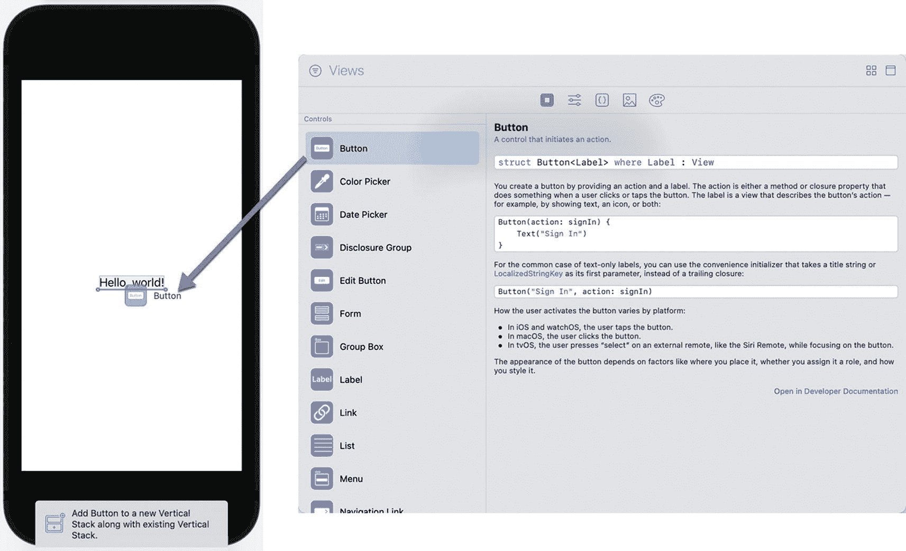

图 2-6

将用户界面视图拖放到画布面板上

无论你如何更改用户界面，Xcode 都会保持编辑器面板和画布面板之间的所有更改同步。这意味着当你在编辑器面板中键入 Swift 代码时，画布面板会立即显示你的更改。当你将用户界面视图拖放到画布面板上时，Xcode 会立即在编辑器面板中自动添加相应的 Swift 代码。

画布面板显示你的用户界面，但如果你想测试你的应用，你有两种选择，如图 2-7 所示：

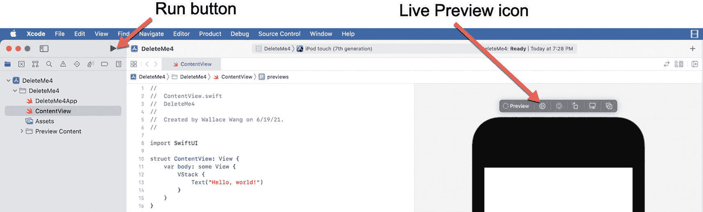

图 2-7

运行按钮和实时预览图标

* 点击运行按钮或选择“产品”➤“运行”以打开模拟器。
* 点击画布面板中的实时预览图标。

要了解 SwiftUI 如何创建能够响应用户的简单用户界面，请按照以下步骤操作：

1. 创建一个新的 iOS App 项目，确保它使用 SwiftUI，并为其起一个描述性的名称（例如 `SwiftExample`）。

2. 在导航器面板中点击 `ContentView` 文件。编辑器面板会显示 `ContentView` 文件的内容。

3. 选择“编辑器”➤“画布”。（如果“画布”选项前已经有一个复选标记，则跳过此步骤。）这将打开画布，以便你可以预览用户界面。

4. 删除 `Text` 命令中的文本“Hello World”，并键入以下内容，使 `ContentView` 结构如下所示：

```
struct ContentView: View {
@State private var message = true
var body: some View {
VStack {
Toggle(isOn: $message) {
Text("切换消息显示/隐藏")
}
if message {
Text ("这是一条秘密消息！")
}
}
}
}
```

上述 Swift 代码在屏幕上显示了一个切换开关，但除非你在模拟器（模拟 iOS 设备，如 iPhone 或 iPad）中运行你的应用，或者通过实时预览进行测试，否则你无法看到它工作。在大多数情况下，实时预览提供了一种更快的方式来查看和测试你的用户界面。

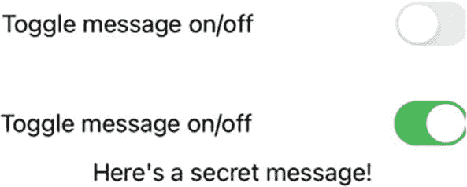

图 2-8

实时预览让你能与用户界面交互

1. 点击实时预览图标以开启实时预览。当你点击切换开关时，注意消息会如 2-8 所示出现和消失。

2. 再次点击实时预览按钮以关闭实时预览。

重复上述步骤，但这次点击运行按钮以打开模拟器。在模拟器或画布面板中测试你的应用是相同的。主要区别在于画布面板通常使用起来快得多。

记住，你总是可以选择不同的 iOS 设备来测试你的应用。要更改模拟哪个 iOS 设备，请点击运行按钮右侧的菜单，如图 2-9 所示。

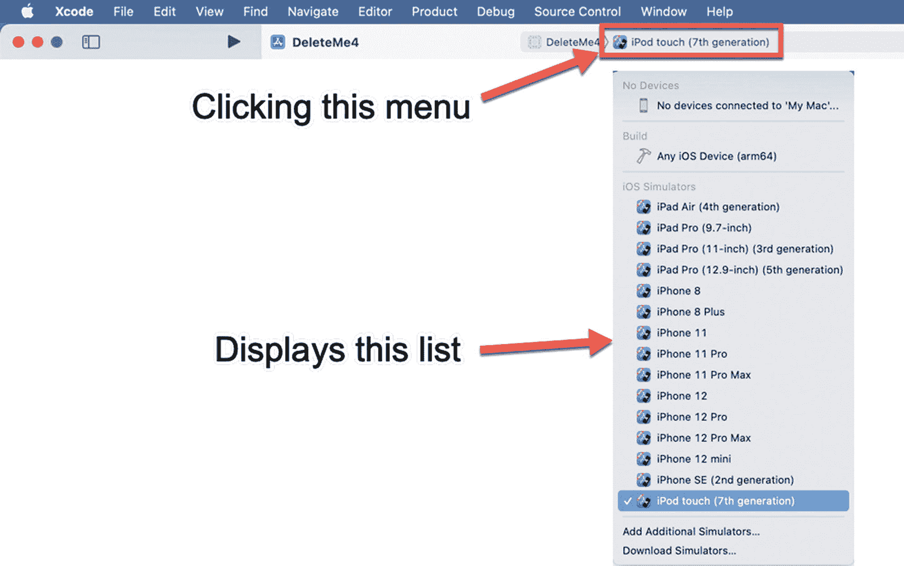

图 2-9

更改模拟器模拟的 iOS 设备

更改要模拟的 iOS 设备的另一种方法是将光标移动到 `ContentView_Previews: PreviewProvider` 结构中的 `ContentView()` 里。然后点击检查器面板中的“设备”弹出菜单，如图 2-10 所示。

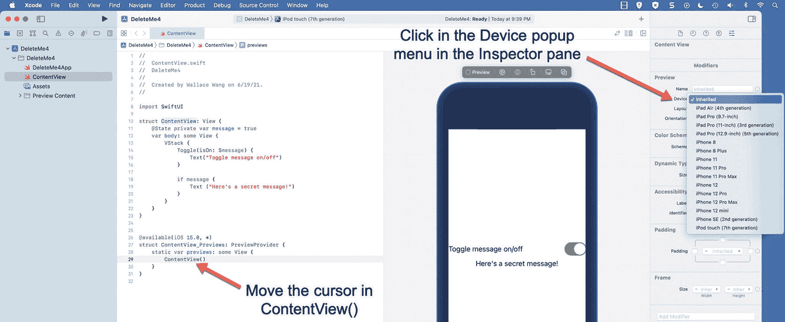

图 2-10

更改实时预览模拟的 iOS 设备

现在让我们回顾一下这个项目，以便你对它的工作方式有一个大致了解。`ContentView` 结构将单个视图定义为 `VStack`。这意味着该 `VStack` 内部的任何内容都将相互堆叠显示。

`VStack` 内的第一个视图是一个 `Toggle`，它使用一个 `Text` 视图在切换开关左侧显示以下文本：“切换消息显示/隐藏”。当 `Toggle` 开启时，一个名为 `message` 的变量会存储为 `true` 值。当 `Toggle` 关闭时，`message` 变量会存储为 `false` 值。


在 `Toggle` 下方，出现了一个 `if` 语句。如果 `message` 变量为 `true`，它会显示一个 `Text` 视图，内容为“这里有一条秘密消息！”。如果 `message` 变量为 `false`，则该 `Text` 视图根本不会出现。

## 使用检查器面板修改用户界面

在 SwiftUI 中创建用户界面通常包含两个步骤。首先，你需要安排各种用户界面视图在屏幕上的显示方式。接下来，你需要通过更改每个用户界面视图的大小、颜色或位置来对其进行自定义。

要自定义用户界面视图，你需要添加修改器。Xcode 提供了两种添加修改器的方式：

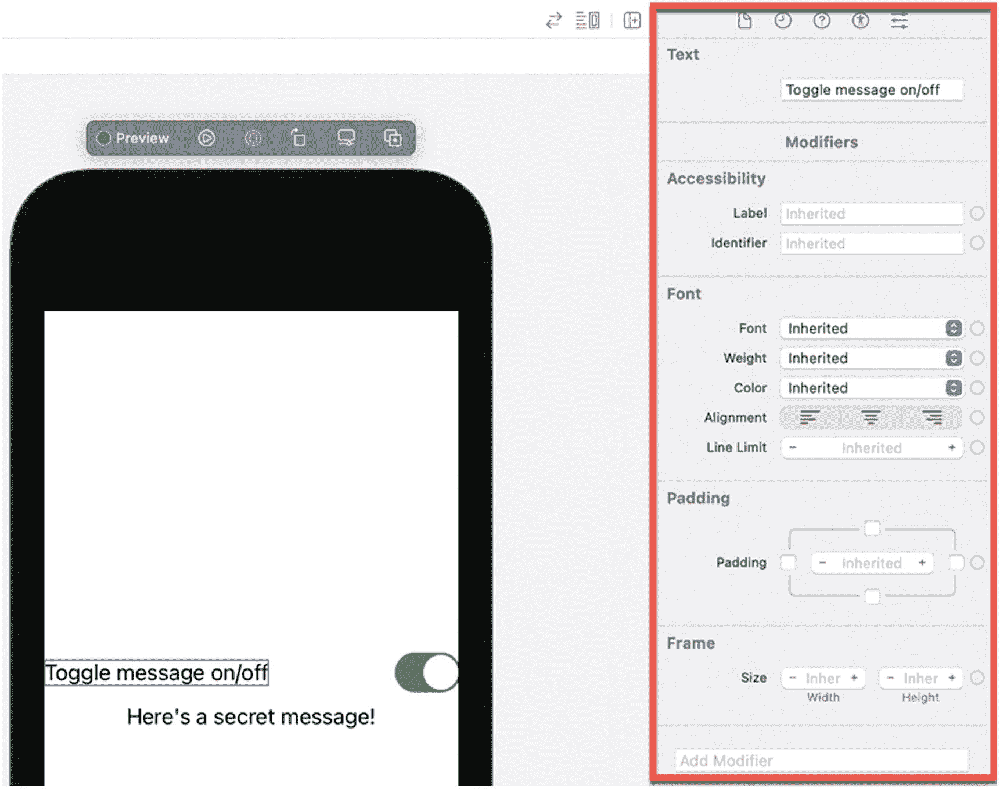

图 2-11：检查器面板显示了修改用户界面视图的不同方式

*   直接在编辑器面板中输入修改器。
*   点击你想要修改的视图，然后从检查器面板中选择一个修改器，如图 2-11 所示。

直接在编辑器面板中输入修改器需要你知道要使用的修改器的名称。随着你经验越来越丰富，直接在 Swift 代码中输入修改器会更快。然而，在刚开始的时候，你可能并不知道有哪些可用的修改器。这时，你可能会更倾向于使用检查器面板。

首先，选择你想要修改的用户界面视图。你可以通过将光标移动到定义该用户界面视图的 Swift 代码中，或者点击画布面板中的该用户界面视图来完成此操作。当你选中一个用户界面视图后，检查器面板会显示该特定视图的修改器。

检查器面板会显示最常用的修改器，例如让你为文本选择字体、对齐方式或颜色。通过点击检查器面板底部附近的 **添加修改器** 按钮，你可以查看额外修改器的列表，如图 2-12 所示。

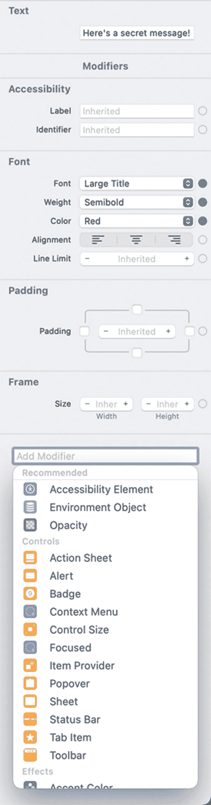

图 2-12：**添加修改器** 按钮会显示一个你可以使用的额外修改器列表

当你在 **添加修改器** 列表中看到想要使用的修改器时，点击该修改器。Xcode 会在检查器面板中显示该修改器。如果你不再想看到可能已添加到检查器面板中的任何修改器，可以点击该修改器右上角的 **删除** 按钮，如图 2-13 所示。

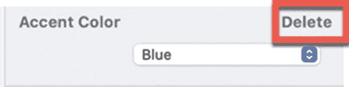

图 2-13：会出现一个 **删除** 按钮，用于移除你可能已添加到检查器面板的修改器

请记住，应用修改器的顺序可能会产生影响。考虑以下带有两个修改器（背景和内边距）的 `Text` 视图：

```
Text("Here's a secret message!")
.background(Color.yellow)
.padding()
```

这会为 `Text` 视图添加一个黄色的背景色，然后在 `Text` 视图周围添加内边距（空间）。假设你这样调换了这些修改器的顺序：

```
Text("Here's a secret message!")
.padding()
.background(Color.yellow)
```

这个顺序会先在 `Text` 视图周围添加内边距（空间）。然后才给背景上色，但由于背景现在包含了新增的空间，背景色也会填充 `Text` 视图周围的空间，如图 2-14 所示。

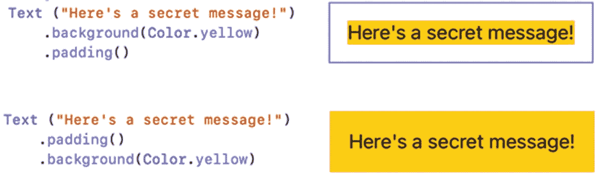

图 2-14：修改器的顺序可能会产生影响

无论你使用哪种方法来添加修改器，Xcode 都会保持所有内容的同步。因此，如果你在编辑器面板中输入修改器，你的更改会自动出现在检查器面板中。同样地，如果你在检查器面板中选择了一个修改器，Xcode 会自动将该修改器添加到编辑器面板中的 Swift 代码里。

要了解如何更改用户界面项目的外观，请按以下步骤操作：

1.  确保 Xcode 中加载了上一节中的 `SwiftExample` 项目。`ContentView` 文件应包含一个 `Toggle` 和一个出现在 `Toggle` 下方的 `Text` 视图。

2.  点击画布面板中的 `Toggle`，或者将光标移动到编辑器面板中的 `Toggle` 里。Xcode 会在 Xcode 窗口右侧显示检查器面板，其中显示了你可以选择用来更改 `Toggle` 外观的修改器。

3.  点击画布面板中显示“这里有一条秘密消息！”的 `Text` 视图，或者将光标移动到编辑器面板中的 `Text` 视图里。注意检查器面板会显示用于更改 `Text` 视图外观的修改器。

4.  点击 **字体** 弹出菜单。会出现一个不同的字体选项列表，如图 2-15 所示。

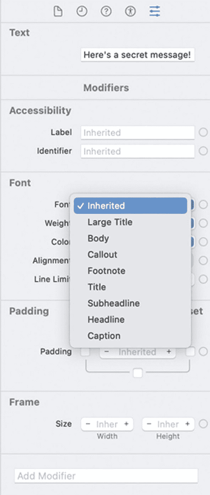

图 2-15：**字体** 弹出菜单会显示不同的字体选项

5.  选择 **大标题**。注意 Xcode 会自动在 `ContentView` 文件中添加 `.font(.largeTitle)` 命令，如下所示：

```
Text("Here's a secret message!")
.font(.largeTitle)
```

6.  点击 **字重** 弹出菜单，然后选择 **半粗体**。
7.  点击 **颜色** 弹出菜单，然后选择 **红色**。注意每次你选择一个修改器时，Xcode 都会自动将相应的 Swift 代码添加到你的 `.swift` 文件中，如下所示：

```
Text("Here's a secret message!")
.font(.largeTitle)
.fontWeight(.semibold)
.foregroundColor(Color.red)
```

8.  将光标移动到 `ContentView_Previews: PreviewProvider` 结构体中的 `ContentView()` 内。
9.  点击检查器面板中的 **设备** 弹出菜单。
10. 选择一个 iPad 型号。注意画布面板会变为模拟 iPad 的显示效果。同时注意 SwiftUI 如何自动修改你的用户界面外观，以便它在不同尺寸的屏幕上正确显示，如图 2-16 所示。（Xcode 可能需要一些时间来更改画布面板以显示不同的 iOS 设备，请耐心等待。）

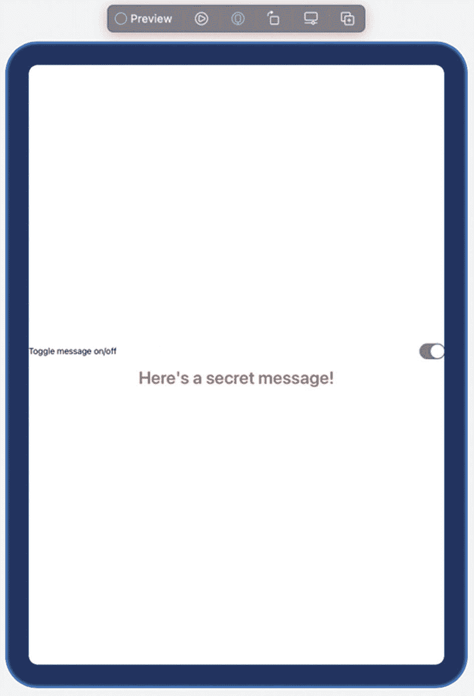

图 2-16：SwiftUI 使用户界面适配不同尺寸的屏幕

11. 再次点击 **设备** 弹出菜单，选择一个 iPhone 型号，例如 **iPhone 11**。画布现在会变为模拟你选择的 iPhone 型号。

SwiftUI 的基本理念是让你设计用户界面，然后让 Xcode 自动调整其外观以适应不同的 iOS 屏幕尺寸。SwiftUI 让你不必编写大量 Swift 代码来设计用户界面，而是专注于编写最少的 Swift 代码来设计用户界面，从而让你能够将时间用于编写 Swift 代码，让你的应用实现独特的功能。


## 摘要

每个应用程序都需要用户界面。使用 SwiftUI，你只需定义所需的用户界面元素，SwiftUI 便会确保你的用户界面在不同尺寸的 iOS 屏幕上都能正常显示并呈现美观的视觉效果。

你可以通过编程方式（编写 Swift 代码）或可视化方式（从“库”窗口拖放用户界面元素）来设计用户界面。程序员通常结合使用这两种方法来设计他们的用户界面。一旦你将元素（按钮、标签、文本字段等）添加到用户界面，就可以通过代码或检查器面板来自定义这些元素。

设计和自定义用户界面的外观后，你可以通过两种方式对其进行测试。首先，你可以在模拟器程序中运行应用，该程序可以模拟不同的 iOS 设备，如 iPhone 或 iPad。

其次，你可以使用实时预览功能，在 Xcode 的画布中与用户界面进行交互。实时预览对于快速测试用户界面非常便捷（但实时预览仅适用于 macOS 10.15 Catalina 或更高版本）。

用户界面代表了用户看到的内容，因此无论用户在何种类型的 iOS 设备上运行应用，你的用户界面始终看起来美观至关重要。现在你已经了解了用户界面的基本工作原理，是时候开始学习特定用户界面元素（如按钮、选择器和滑块）的细节了。

