# 3. 在用户界面上放置视图

当你在用户界面上放置单个视图时，无论屏幕是小尺寸的 iPhone 还是大得多的 iPad，SwiftUI 都会将其居中显示在屏幕中间。当你在用户界面中添加更多视图时，SwiftUI 会根据你将它们排列在垂直或水平堆栈中，简单地将这些视图相互叠放或并排显示。然而，添加到用户界面的视图越多，相邻视图可能显得越拥挤。为了解决这个问题，SwiftUI 提供了几种在用户界面上放置视图的方法：

- 使用填充修饰符
- 在堆栈内定义间距
- 使用 Spacer
- 定义偏移或位置

你可以使用这些不同方法中的一种或多种来在用户界面上排列视图，使它们正好出现在你想要的位置。最重要的是，这些定位方法适用于 SwiftUI 中的所有用户界面视图。

## 使用填充修饰符

填充修饰符会在用户界面视图周围添加空间。默认情况下，填充修饰符会在视图的顶部、底部、前导（左侧）和尾随（右侧）边缘添加空间。要使用填充修饰符，只需在任何视图后添加以下代码：

```
.padding()
```

填充有两个目的。首先，它在视图周围添加空间，这会改变背景（你可以为其着色），从而使视图更大且更易于查看。其次，填充修饰符会将相邻视图推得更远，从而使相邻视图更易于查看并消除拥挤。

最简单的填充修饰符会在视图的所有四个边缘添加 16 点的间距。如果你添加一个数字，则可以定义所需的精确间距，例如 `.padding(45)` 或 `.padding(3)`，如图 3-1 所示。

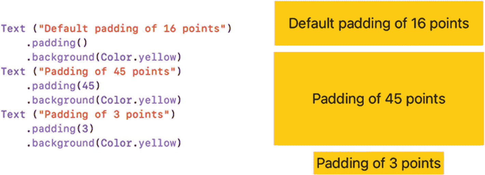

*图 3-1*  
为填充修饰符定义不同的间距

请注意，填充修饰符会在所有边缘添加空间。如果你愿意，可以定义仅在一个或多个特定区域添加间距，如图 3-2 所示：

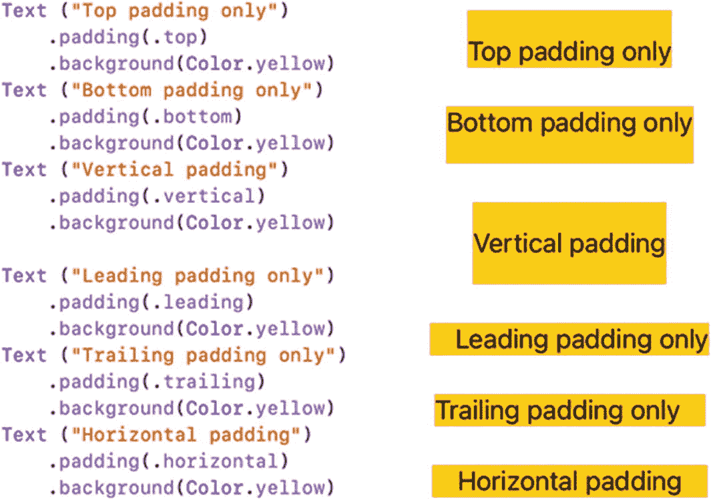

*图 3-2*  
在特定区域定义填充

- `.top`
- `.bottom`
- `.vertical`（顶部和底部）
- `.leading`（左侧）
- `.trailing`（右侧）
- `.horizontal`（尾随和前导）

如果你不添加特定值，SwiftUI 将使用默认的 16 点间距。要同时定义添加填充的区域和特定间距，你必须先定义添加填充的区域，然后跟上特定值，例如：

```
.padding(.top, 30)
```

如果你想添加间距到两个或三个区域，可以在方括号中定义这些区域，后跟可选的间距值，如下所示：

```
.padding([.top, .leading])
.padding([.top, .leading] , 30)
```

这允许你定义两个添加间距的区域，如图 3-3 所示。

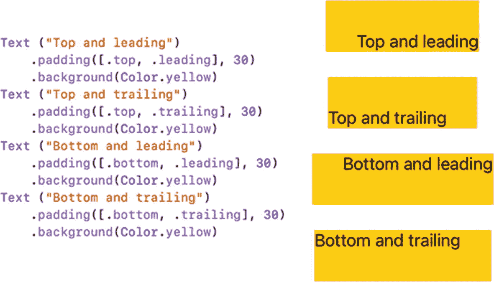

*图 3-3*  
在两个区域定义填充

你也可以添加间距到三个区域，并附带可选的间距值，如图 3-4 所示。

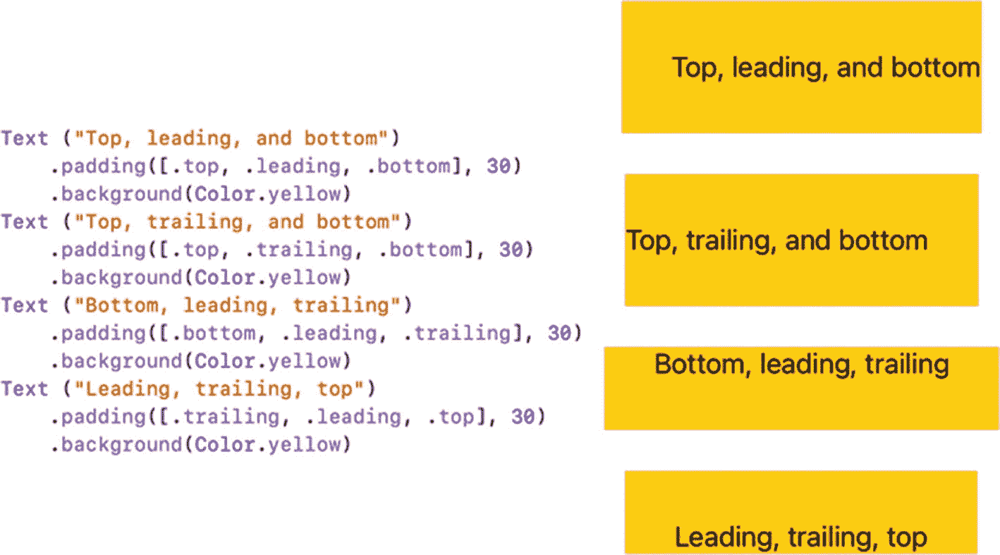

*图 3-4*  
在三个区域定义填充

## 在堆栈内定义间距

`.padding()` 修饰符可以方便地分隔不同的视图。如果没有填充，多个视图在堆栈内可能会显得挤压和拥挤。通过为堆栈内的每个视图添加填充，你可以将它们分开，使每个视图更易于查看，如图 3-5 所示。

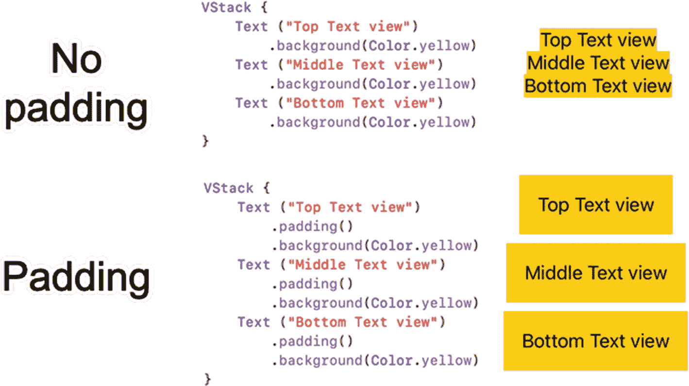

*图 3-5*  
填充将堆栈内的视图分隔开

虽然填充可以使每个视图更易于查看，但你可能希望对堆栈内视图之间的间距有更多控制。为此，你可以在定义堆栈时定义一个间距值，例如：

```
VStack (spacing: 40) {
}
```

在堆栈内，间距会将视图推开一个固定距离，如图 3-6 所示。

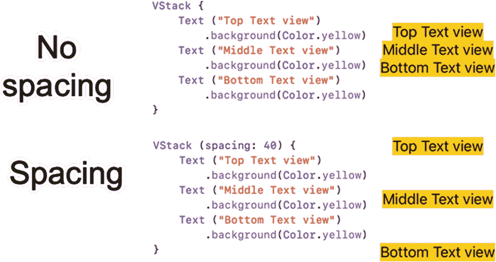

*图 3-6*  
间距在堆栈内的所有视图之间创建了一个固定距离


## 在堆栈中对齐视图

当创建堆栈（`VStack` 或 `HStack`）时，你可以选择定义对齐方式，无论是否定义间距，例如：

```
VStack (alignment: .leading)
VStack (alignment: .leading, spacing: 24)
```

注意

如果在堆栈中同时定义了对齐方式和间距，必须先定义对齐方式，再定义间距。

对于 `VStack`，有三种对齐视图的方式，如图 3-7 所示：

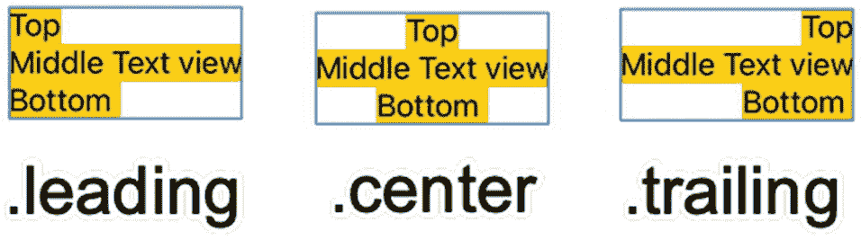

图 3-7

在 `VStack` 中对齐视图的三种方式

*   `.leading`（左对齐）
*   `.center`（未选择其他对齐选项时的默认设置）
*   `.trailing`（右对齐）

以下 Swift 代码为 `VStack` 定义了 `.leading` 对齐方式：

```
VStack (alignment: .leading){
Text ("Top")
.background(Color.yellow)
Text ("Middle Text View")
.background(Color.yellow)
Text ("Bottom")
.background(Color.yellow)
}
```

对于 `HStack`，有五种不同的对齐视图方式，如图 3-8 所示：

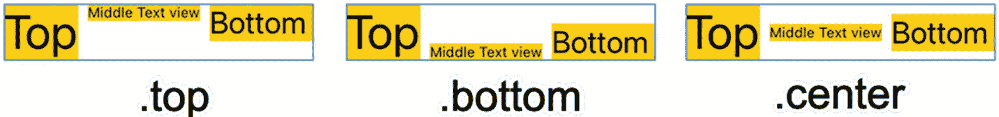

图 3-8

在 `HStack` 中对齐视图的五种方式

*   `.top`
*   `.bottom`
*   `.center`（未选择其他对齐选项时的默认设置）
*   `.firstTextBaseline`
*   `.lastTextBaseline`

以下 Swift 代码为 `HStack` 定义了 `.bottom` 对齐方式：

```
HStack (alignment: .bottom){
Text ("Top")
.font(.system(size: 40))
.background(Color.yellow)
Text ("Middle Text View")
.background(Color.yellow)
Text ("Bottom")
.font(.largeTitle)
.background(Color.yellow)
}
```

`.top`、`.bottom` 和 `.center` 对齐选项适用于所有类型的用户界面视图。但是，如果你专门处理 `Text` 视图，SwiftUI 还提供了两种基于基线对齐 `Text` 视图的额外方式。你可以根据第一个视图（`.firstTextBaseline`）或最后一个视图（`.lastTextBaseline`）来对齐文本，如图 3-9 所示。


图 3-9

在 `HStack` 中对齐文本

## 使用间距器

在堆栈中的视图之间使用内边距和间距，对于在用户界面上排列视图非常方便。作为在用户界面上定位视图的另一种方法，你还可以使用间距器。间距器就像一个弹簧，尽可能地将两个视图推开。间距器在编辑器窗格中显示如下：

```
Spacer()
```

因为间距器会自动适应不同的屏幕尺寸，所以无论屏幕大小如何，间距器都能将视图对齐到屏幕边缘，如图 3-10 所示。

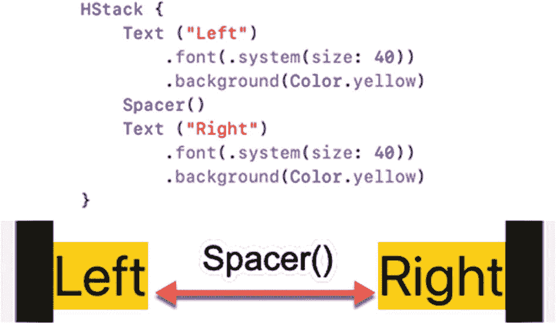

图 3-10

间距器尽可能地将视图推开

你可以组合多个间距器来将视图推得更开。例如，考虑在视图前后各使用一个间距器来分隔它们，使用以下 Swift 代码：

```
struct ContentView: View {
var body: some View {
VStack {
Text ("Top")
.font(.system(size: 40))
.background(Color.yellow)
Spacer()
Text ("Middle")
.font(.system(size: 40))
.background(Color.yellow)
Spacer()
Text ("Bottom")
.font(.system(size: 40))
.background(Color.yellow)
}
}
}
```

上述代码定义了一个包含三个 `Text` 视图的垂直堆栈。每个 `Text` 视图之间的间距器将它们均等推开，如图 3-11 所示。

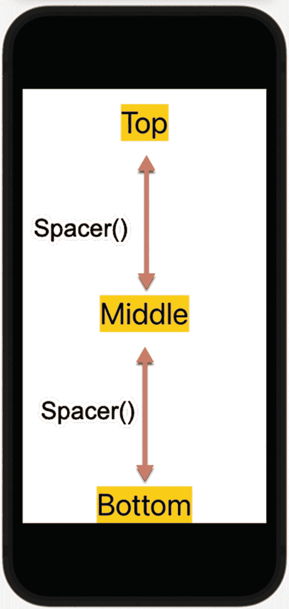

图 3-11

间距器将三个视图均等分隔

如果组合使用间距器，多个间距器会将视图推得更开。如果在 Top 和 Middle 视图之间添加两个间距器，这两个间距器会将 Middle 视图推得更靠下，如下列 Swift 代码所示：

```
struct ContentView: View {
var body: some View {
VStack {
Text ("Top")
.font(.system(size: 40))
.background(Color.yellow)
Spacer ()
Spacer()
Text ("Middle")
.font(.system(size: 40))
.background(Color.yellow)
Spacer()
Text ("Bottom")
.font(.system(size: 40))
.background(Color.yellow)
}
}
}
```

由于现在 Top 和 Middle 视图之间有两个间距器，它们将 Middle 视图进一步向下推，如图 3-12 所示。

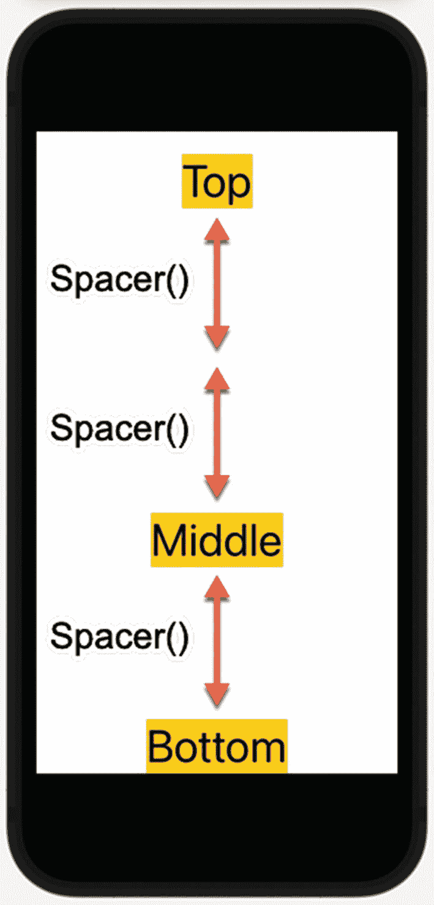

图 3-12

两个间距器将 Middle 视图进一步向下推

通过使用多个间距器，你可以根据屏幕尺寸调整用户界面上的视图。当应用在较大屏幕上运行时，间距器会将视图进一步推向屏幕边界。当应用在较小屏幕上运行时，间距器推动视图的距离则较短。

间距器会根据屏幕尺寸自动调整其大小。但是，你可能希望为间距器定义一个最小长度，以防止其收缩过度。要定义最小长度，请使用以下代码：

```
Spacer(minLength: 25.73)
```

请注意，你可以将最小长度定义为小数值（`CGFloat`），不过也可以使用整数值，例如：

```
Spacer(minLength: 25)
```

如果没有指定最小长度，间距器将仅根据应用运行的屏幕尺寸进行伸缩。


## 使用偏移与位置修饰符

堆栈中的间隔器、内边距和对齐方式可以改变视图在用户界面上的位置，但要想以另一种方式定位视图，你还可以使用`offset`修饰符。`offset`修饰符允许你指定特定的`x`和`y`值，将视图从 SwiftUI 原本放置的位置移开。

在每个 iOS 屏幕上，原点(0,0)位于左上角。`x`值越大，视图水平方向越靠右；`y`值越大，视图垂直方向越靠下，如图 3-13 所示。

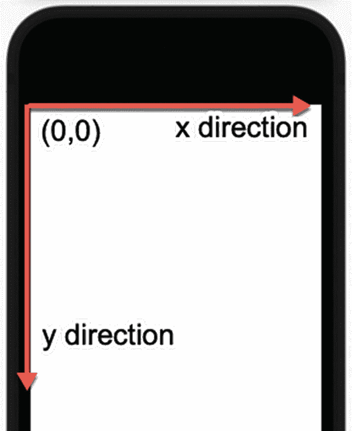

图 3-13

iOS 屏幕上的原点与 x、y 方向

下面的`ZStack`将两个完全相同的`Text`视图叠放在一起。由于两个`Text`视图出现在完全相同的位置，因此无法同时看到两者：

```
ZStack {
Text ("Top")
.font(.system(size: 40))
.background(Color.yellow)
Text ("Top")
.font(.system(size: 40))
.background(Color.yellow)
}
```

如果我们为其中一个`Text`视图添加`offset`修饰符，`offset`修饰符会将第二个`Text`视图从其正常显示位置移动固定的距离，例如：

```
ZStack {
Text ("Top")
.font(.system(size: 40))
.background(Color.yellow)
Text ("Top")
.font(.system(size: 40))
.background(Color.yellow)
.offset(x: 75, y: 125)
}
```

这个偏移将第二个`Text`视图向右移动 75 点、向下移动 125 点，如图 3-14 所示。

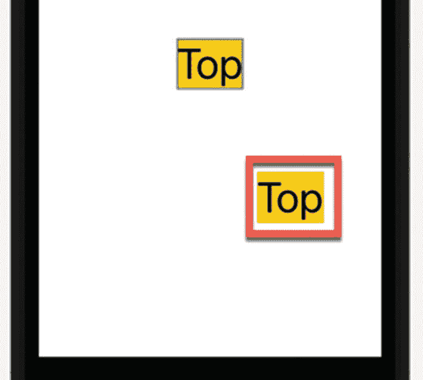

图 3-14

偏移修饰符将视图从其正常显示位置移开

`x`正值将视图向右移动，`x`负值将视图向左移动。同样，`y`正值将视图向下移动，`y`负值将视图向上移动。假设我们有如下的`offset`修饰符：

```
.offset(x: -75, y: -125)
```

这会将第二个`Text`视图从其正常显示位置向左上方移动，如图 3-15 所示。

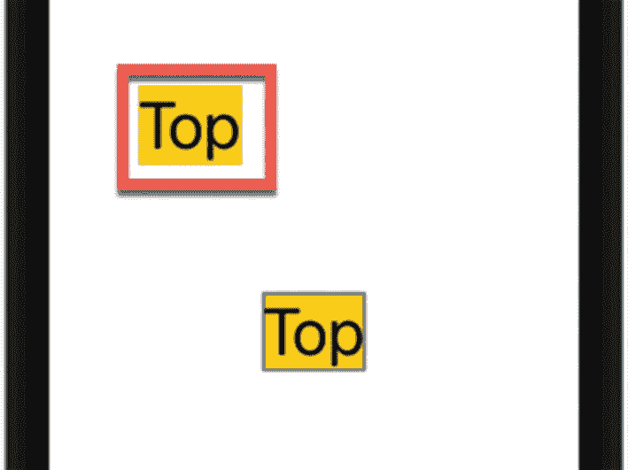

图 3-15

x 和 y 负值将视图向左上方偏移

`offset`修饰符让你能够基于 SwiftUI 通常放置视图的位置来定位视图。如果你希望基于原点（屏幕左上角）定位视图，那么你可能需要使用`position`修饰符。

与`offset`修饰符类似，`position`修饰符也需要`x`和`y`值来定义视图的中心位置。以下 Swift 代码将一个`Text`视图放置在距右侧 225 点、距下方 126 点的位置，如图 3-16 所示：

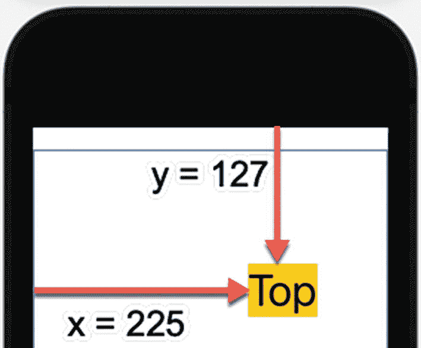

图 3-16

使用位置修饰符在用户界面上放置视图

```
Text ("Top")
.font(.system(size: 40))
.background(Color.yellow)
.position(x: 225, y: 127)
```

**注意**

无论使用`offset`还是`position`修饰符，都要小心使用较大的`x`或`y`值。这是因为较大的值可能在大屏幕上完美定位视图，但在小屏幕上却可能使同一视图超出屏幕边缘。

你可以将`offset`和`position`修饰符应用于任何视图。由于堆栈也是视图，你可以在堆栈上应用`offset`和`position`修饰符，这也会自动移动堆栈内每个视图的位置。考虑以下将`offset`修饰符应用于整个`VStack`的 Swift 代码：

```
VStack {
Text ("First")
.font(.system(size: 40))
.background(Color.yellow)
Text ("Second View")
.font(.system(size: 40))
.background(Color.yellow)
}.offset(x: 25, y: 125)
```

上面的代码将整个`VStack`的内容（两个`Text`视图）从其正常显示位置向右下方移动，如图 3-17 所示。

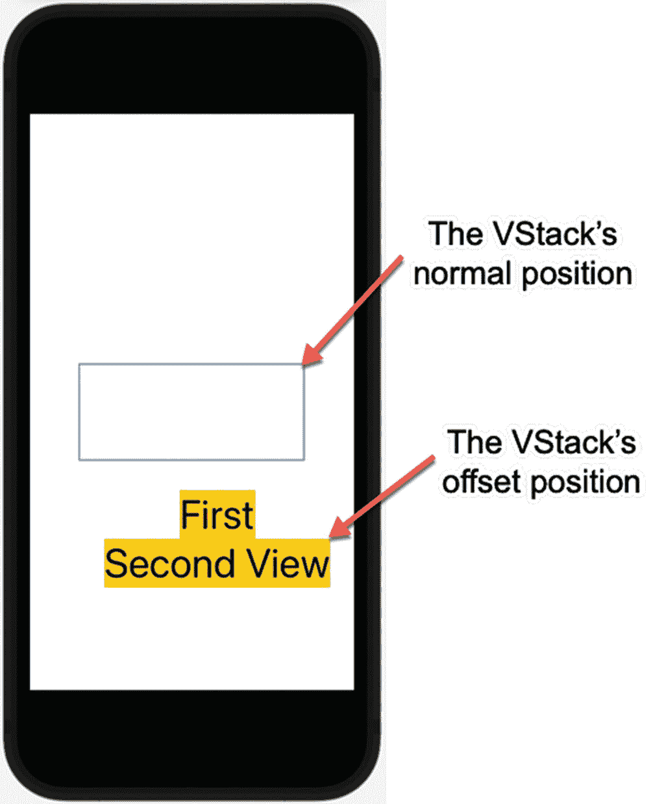

图 3-17

偏移修饰符将整个堆栈从其正常显示位置移开

`offset`修饰符将整个`VStack`从其正常位置移动，而`position`修饰符则基于原点（屏幕左上角）定位`VStack`。以下 Swift 代码使用了完全相同的`x`和`y`值，但在`VStack`上使用了`position`修饰符：

```
VStack {
Text ("First")
.font(.system(size: 40))
.background(Color.yellow)
Text ("Second View")
.font(.system(size: 40))
.background(Color.yellow)
}.position(x: 25, y: 125)
```

注意，由于`position`修饰符从原点移动`VStack`，`x`值不够大，导致`VStack`的内容被屏幕截断，如图 3-18 所示。

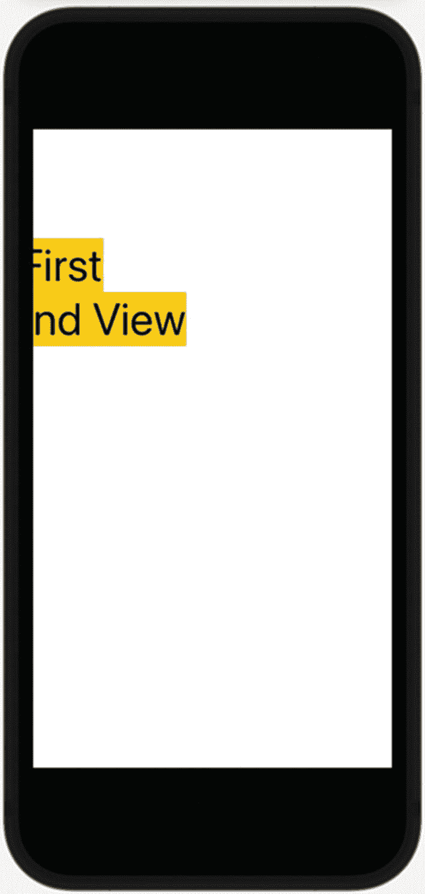

图 3-18

位置修饰符相对于原点放置 VStack

## 总结

在 SwiftUI 中设计用户界面时，视图通常居中于屏幕中央。通过使用`padding`修饰符，你可以增加视图周围的空间。`padding`修饰符可以影响视图的一个边、两个边、三个边或全部四个边。

当你希望将视图推开时，可以使用间隔器，它们像弹簧一样，无论屏幕实际大小如何，都能将视图推到屏幕边缘。通过使用多个间隔器，你可以将视图推得更远。你还可以定义间隔器可以收缩的最小长度，以确保它不会收缩到特定长度以下。

在垂直和水平堆栈内，你可以定义堆栈内所有视图之间的间距。通过使用`offset`修饰符，你可以将视图从其正常显示位置移开。通过使用`position`修饰符，你可以基于原点（即 iOS 屏幕的左上角）精确地将视图放置在屏幕上。

`padding`修饰符、间隔器、堆栈内的间距以及 offset/position 修饰符使你能够安排视图在用户界面上的布局。你可以在任何视图（包括堆栈）上应用`padding`、`offset`和`position`修饰符。通过修改整个堆栈，你可以修改该堆栈内的所有视图。

SwiftUI 有助于创建能够适应任何尺寸 iOS 屏幕的用户界面，无论你的应用运行在小型 iPhone 屏幕还是大得多的 iPad 屏幕上。这样，你可以花更少的时间担心应用在不同 iOS 设备上的外观，而将更多时间集中在编写代码上，让你的应用实现有用且出色的功能。


