# 4. 文本处理

每个用户界面都需要在屏幕上显示信息。虽然这些信息可以以多种形式呈现，但用户界面上一种常见的信息显示类型涉及文本。如果你想在用户界面上显示文本，就需要定义一个字符串，并让它出现在一个 `Text` 视图中，例如：

```
Text("Hello World")
```

为了获得更高的灵活性，你可以将字符串存储在一个变量或常量中，然后在 `Text` 视图中使用该变量或常量的名称，例如：

```
let myString = "展示一个字符串变量"
Text(myString)
```

通过使用字符串变量，你可以在该变量中存储不同的字符串，使 `Text` 视图显示新的文本。为了更灵活，`Text` 视图还可以使用字符串插值来显示非字符串数据，例如：

```
let myString = 46
Text("这是我的年龄 = \(myString)")
```

一个 `Text` 视图可以显示任意长度的字符串。然而，显示的字符串长度可能会因应用程序运行时的屏幕尺寸而异，例如较大的 iPad 屏幕或较小的 iPhone 屏幕。为了自定义字符串的显示方式，SwiftUI 允许你定义以下内容：

- **行数限制** – 定义 `Text` 视图可以显示的最大行数，例如两行或四行。
- **截断方式** – 定义当无法显示整个字符串时如何进行截断或裁切。

行数限制修改器允许你定义要显示的最大行数。如果你未指定行数限制值，SwiftUI 将尽可能多地显示行数。要定义行数限制，请在 Swift 代码中添加一个 `lineLimit` 修改器，如下所示：

```
Text("这是我的年龄 \(myString)。由于我已经退休，现在有资格领取养老金和社会保障金，因此我可以在余生中放松身心、享受生活，而无需再为收入而工作。")
.lineLimit(2)
```

图 4-1 展示了两个相同的 `Text` 视图，但顶部的 `Text` 视图没有行数限制。因此，它显示了全部文本。底部的 `Text` 视图限制为两行，因此它只显示前两行文本。

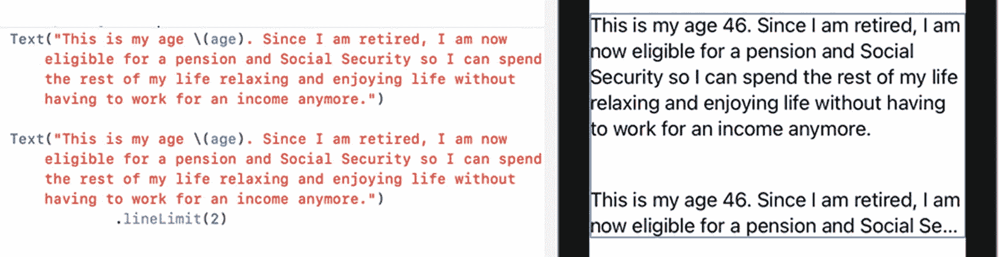

**图 4-1** – `lineLimit` 修改器可能会截断部分文本。

除了键入 Swift 代码来定义行数限制，你还可以单击 `Text` 视图并打开检查器。然后你可以在检查器窗格中定义行数限制，如图 4-2 所示。

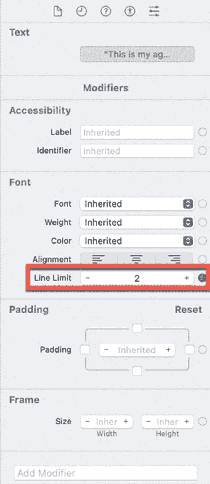

**图 4-2** – 在检查器窗格中定义行数限制。

如果你定义了行数限制（例如两行），而文本超过该限制（例如显示三行或更多行），SwiftUI 就会裁切或截断文本。SwiftUI 提供了三种在超出行数限制时截断文本的方式，如图 4-3 所示：

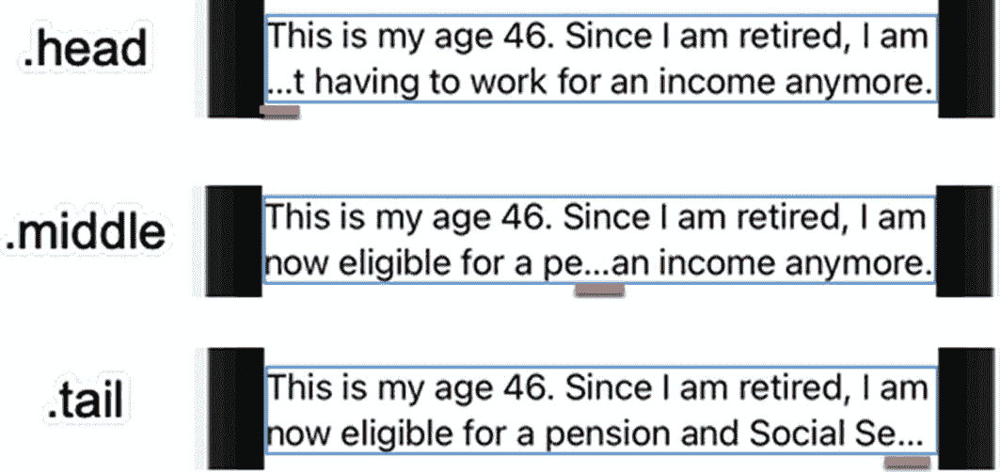

**图 4-3** – 超出行数限制时截断文本的三种不同方式。

- `.head` – 截断最后一行的开头部分。
- `.middle` – 截断最后一行的中间部分。
- `.tail` – 截断最后一行的末尾部分。

默认情况下，SwiftUI 在行尾（Tail）截断文本，但你可以在 `Text` 视图上通过将 `truncationMode` 修改器与 `lineLimit` 修改器配合使用来定义开头或中间截断选项，例如：

```
.truncationMode(.middle)
```

如果你将光标移入 `Text` 视图，然后单击检查器窗格底部的“添加修改器”按钮，便可以将“截断模式”修改器添加到检查器窗格中。然后你可以在检查器窗格中定义截断选项，如图 4-4 所示。

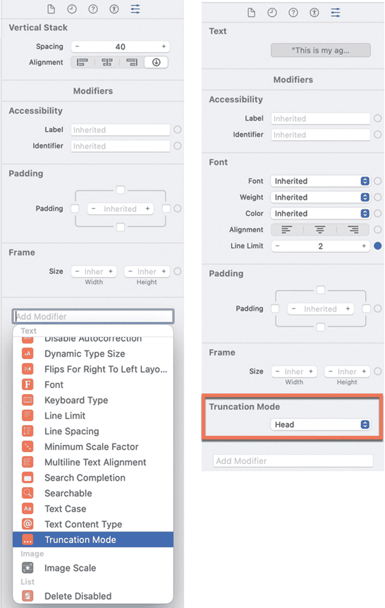

**图 4-4** – 在检查器窗格中定义截断选项。


## 更改文本外观

`Text` 视图通常显示纯文本。为了美化文本外观，SwiftUI 允许你通过在 Swift 代码中键入修饰符或通过检查器面板来定义字体大小、字重和颜色。字体大小选项包括特定的文本样式，这些样式可以自动适应 iPhone 或 iPad 上定义的任何辅助功能设置。可用的字体大小选项如图 4-5 所示：

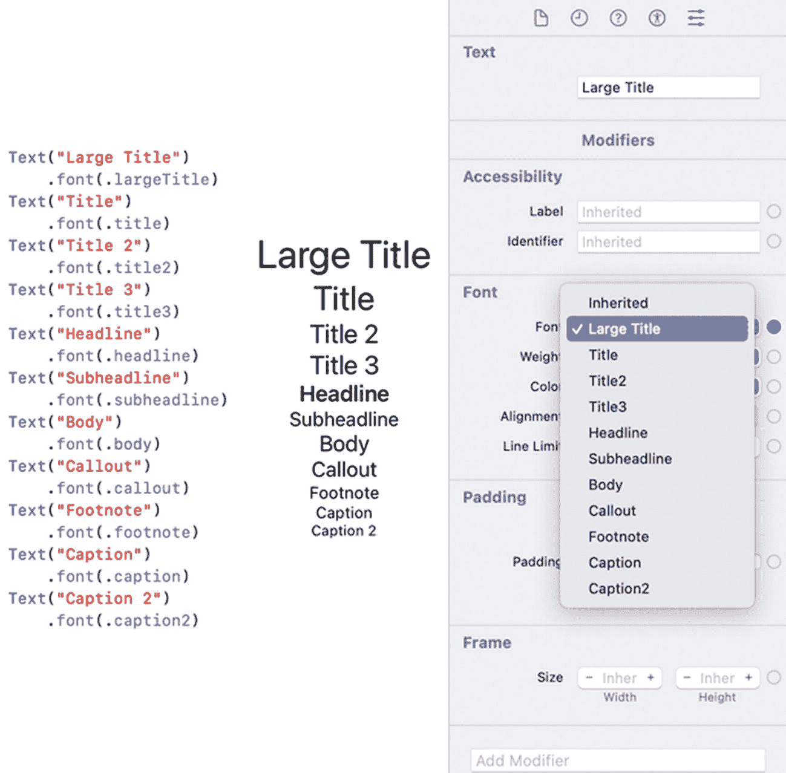

图 4-5

用于显示文本的不同字体大小

- 大标题
- 标题
- 标题 2
- 标题 3
- 标题行
- 副标题行
- 正文
- 标注
- 脚注
- 说明
- 说明 2

如果你想为 `Text` 视图选择特定字体，可以通过自定义字体修饰符来实现，如下所示：

```
.font(.custom("Courier", size: 36))
```

在上述代码中，你定义了字体系列，后跟字体大小。请记住，Xcode 可能不支持所有字体。如果你只想定义自定义字体大小，可以省略字体名称，例如：

```
.font(.custom("", size: 36))
```

注意

当你定义自定义字体和字体大小时，`Text` 视图将不会根据用户的 iOS 设置自动调整文本大小。因此，除非你确实需要，否则最好避免使用自定义字体。

除了字体大小，你还可以选择字重，它定义了文本显示的粗细程度。字重选项包括以下内容，如图 4-6 所示：

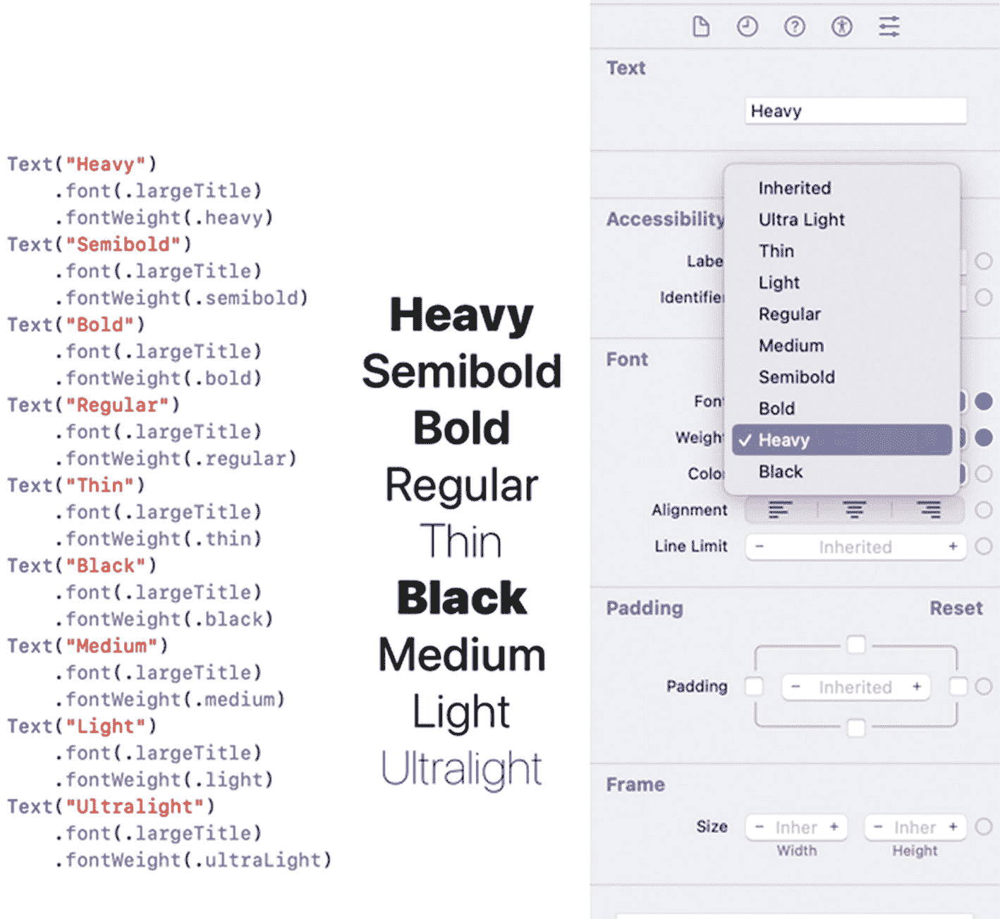

图 4-6

用于显示文本的不同字重

- 超级粗体
- 半粗体
- 粗体
- 常规
- 细体
- 黑色
- 中等
- 轻细
- 极细

修改文本外观的第三种方法是为文本选择颜色。你可以在 Swift 代码中键入颜色修饰符，或者在检查器面板中选择颜色，如图 4-7 所示。

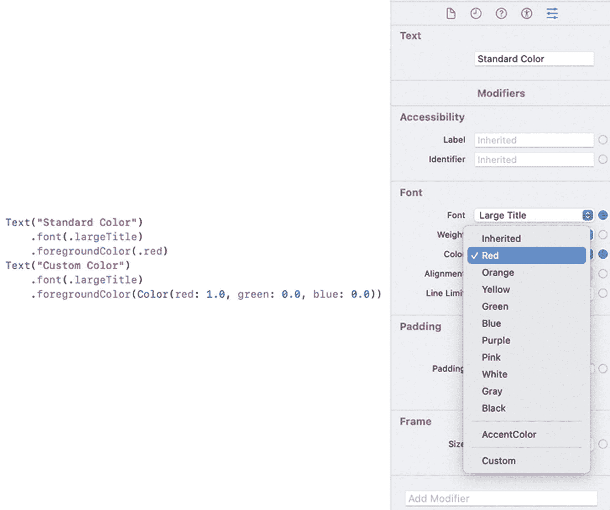

图 4-7

定义文本的颜色

使用颜色时，你可以选择标准颜色选项，例如绿色、蓝色或黄色。如果你不想使用标准颜色，还可以选择“自定”，它允许你定义不同的颜色值以及不透明度值（范围从 0（不可见）到 1（完全可见））。当你选择“自定”颜色选项时，会弹出一个颜色对话框，供你选择非标准颜色，如图 4-8 所示。

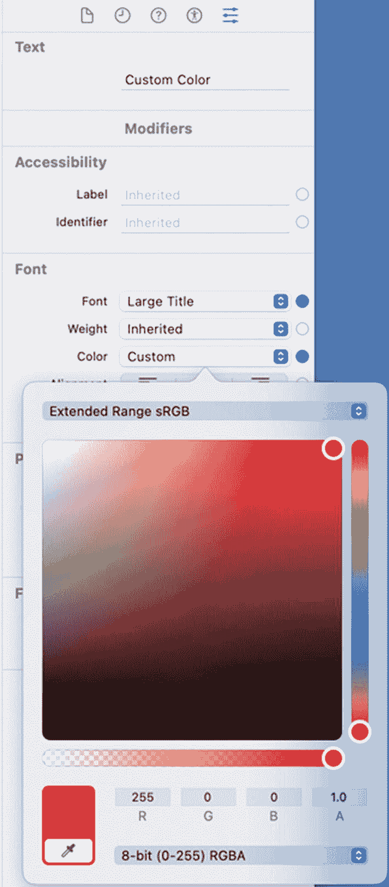

图 4-8

为文本定义自定义颜色

像文字处理软件一样，SwiftUI 也允许你将文本修改为斜体、粗体、下划线或删除线。要将这些效果添加到文本中，你可以键入以下命令：

```
.bold()
.italic()
.underline()
.strikethrough()
```

除了键入这些修饰符，你还可以单击检查器面板中的“添加修饰符”弹出菜单，如图 4-9 所示。

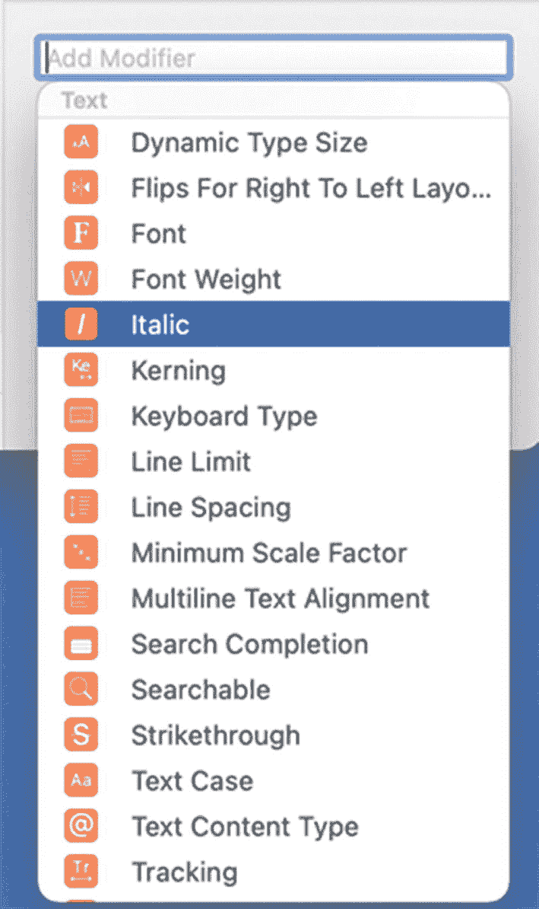

图 4-9

为文本添加粗体、斜体、下划线或删除线

修改文本的另一种方法是定义其对齐方式。三种对齐方式如图 4-10 所示：

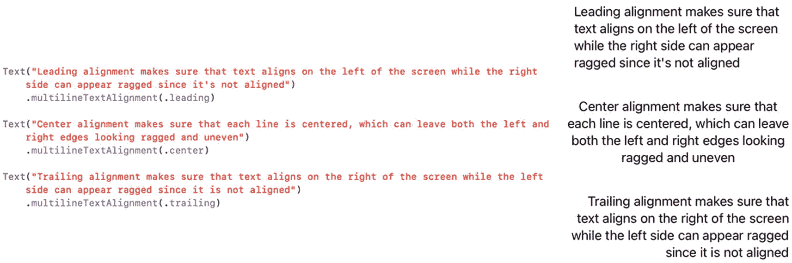

图 4-10

三种文本对齐方式

- 前导 – 文本向左边缘对齐。
- 居中 – 每行文本在左右边缘之间居中显示。
- 尾随 – 文本向右边缘对齐。

你可以通过使用 `.multilineTextAlignment` 修饰符，或者在属性检查器中选择文本对齐选项来定义文本对齐，如图 4-11 所示。

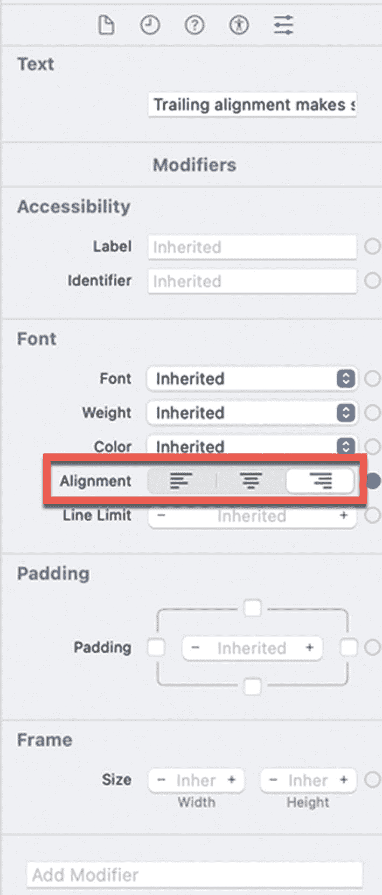

图 4-11

在检查器面板中对齐文本


## 使用标签视图

标签视图与文本视图类似。文本视图仅显示单一文本字符串，而标签视图可以并排显示文本和图像，如图 4-12 所示。

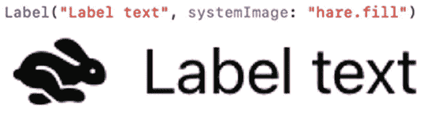

图 4-12 标签视图可以同时显示图像和文本

这些图像可以是添加到 Xcode 项目 `Assets` 文件夹中的任意图像，也可以是苹果免费 SF Symbols 应用 ([`https://developer.apple.com/sf-symbols/`](https://developer.apple.com/sf-symbols/)) 中可查看的任意图像，该应用显示了所有可用的系统图像，如图 4-13 所示。

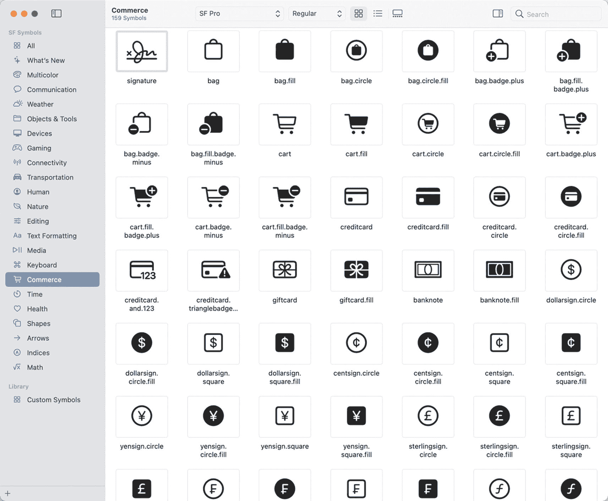

图 4-13 SF Symbols 应用显示了可包含在 Xcode 项目中的图标

使用 SF Symbol 图标时，无需将其添加到 Xcode 项目。如果想使用自己的图像，则需要将其拖拽到 `Assets` 文件夹中，如图 4-14 所示。

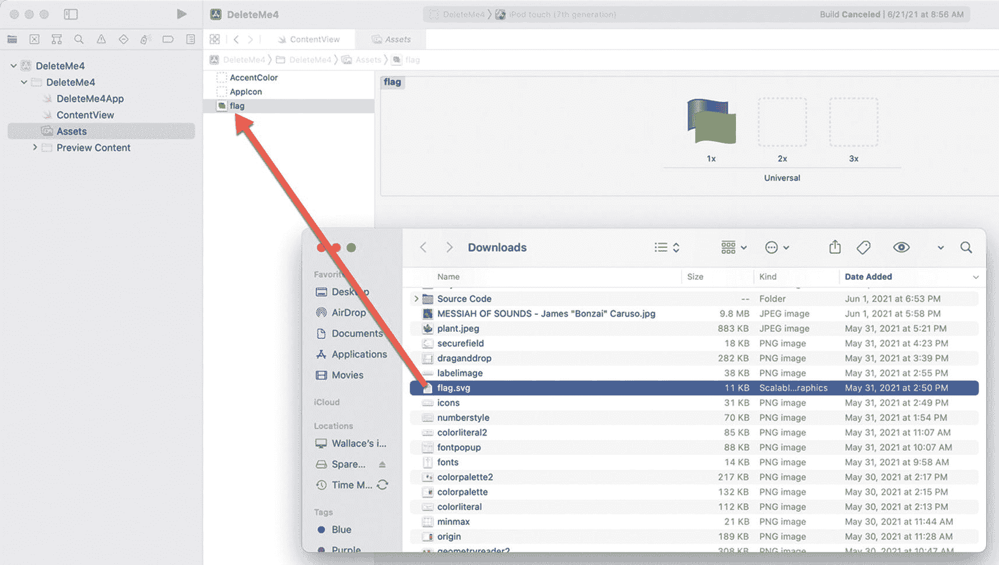

图 4-14 可以将图像拖拽到 Xcode 项目的 `Assets` 文件夹中

如果要在标签视图中显示 SF Symbol 图标，可以使用以下代码：

```
Label("文本", systemImage: "此处填写 SF Symbol 图像名称")
```

文本可以是任意字符串或字符串变量，而 SF Symbol 名称必须完全包含在双引号内，例如 `"creditcard"` 或 `"banknote.fill"`。请确保完全按照 SF Symbols 应用中显示的图标名称来输入。你也可以在 SF Symbols 应用中右键点击任意图标，在弹出的菜单中选择“复制名称”，如图 4-15 所示，然后将此名称粘贴到标签视图中。

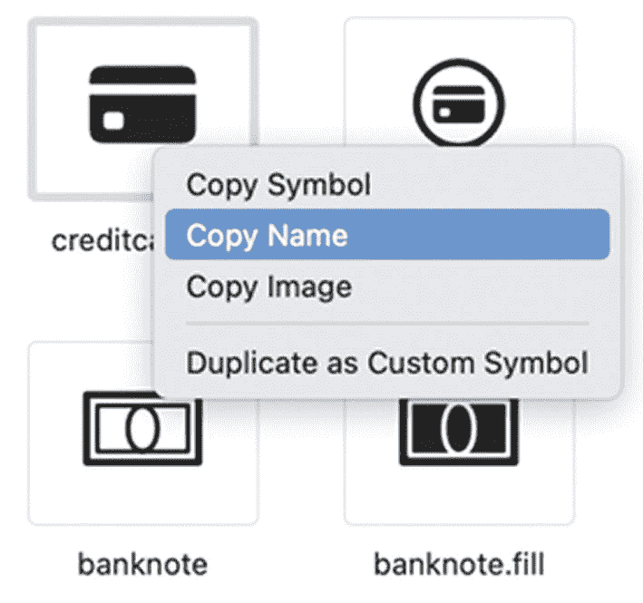

图 4-15 右键点击图标可在 SF Symbols 应用中复制其名称

如果要显示存储在 Xcode 项目 `Assets` 文件夹中的图像，可以使用以下代码：

```
Label("文本", image: "此处填写图像名称")
```

文本可以是任意字符串或字符串变量，而图像名称必须与 `Assets` 文件夹中的图像文件名完全一致，但不包含文件扩展名。

**注意：** 你可能希望在将图像添加到 Xcode 项目的 `Assets` 文件夹之前先调整其大小。否则，如果图像过大，标签视图将以原始尺寸显示该图像，这可能会比你期望的大得多。

定义标签视图最简单的方式是定义一个 `systemImage` 或普通图像，如下所示：

```
Label("文本", systemImage: "此处填写 SF Symbol 图像名称")
Label("文本", image: "此处填写图像名称")
```

然而，如果你想自定义文本和/或图像的外观，可以改用以下代码创建标签视图：

```
Label {
    Text("备选标签定义")
} icon: {
    Image(systemName: "此处填写 SF Symbol 图像名称")
}
```

或者

```
Label {
    Text("备选标签定义")
} icon: {
    Image("此处填写图像名称")
}
```

**注意：** 使用 SF Symbol 图标时，必须定义 `systemName:` 参数；但使用 `Assets` 文件夹中的图像时，只需定义图像名称，无需任何参数。

当使用 `Text` 和 `Image` 视图定义标签视图时，可以分别自定义每个元素，例如为文本选择字体和为图像设置透明度，如下所示：

```
Label {
    Text("修饰符")
        .font(.title)
} icon: {
    Image("旗帜")
        .opacity(0.25)
}
```

上述代码中，标签使用 `.title` 字体显示文本，并以 0.25 的透明度显示旗帜图像，如图 4-16 所示。

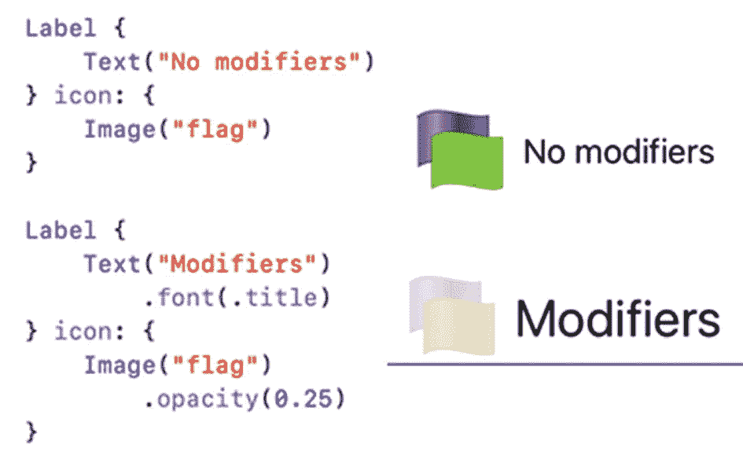

图 4-16 在标签视图中修改文本和图像

创建标签视图时，你有三个选项，如图 4-17 所示：

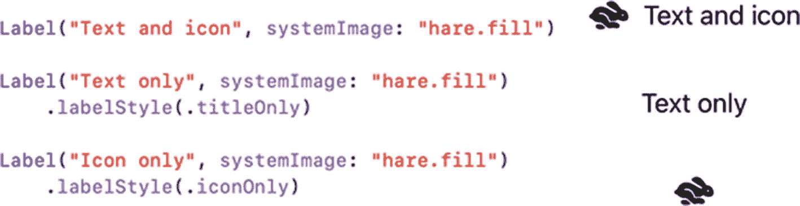

图 4-17 标签视图显示信息的三种不同方式

- 文本和图标（默认）
- 仅文本
- 仅图标

### 为文本或标签视图添加边框

要突出显示文本视图和标签视图，可以在其周围添加边框。边框可以由颜色和宽度组成，例如：

```
.border(Color.red, width: 3)
```

当对文本或标签视图使用 `.border` 修饰符时，边框会紧密包裹内部的文本，如图 4-18 所示。

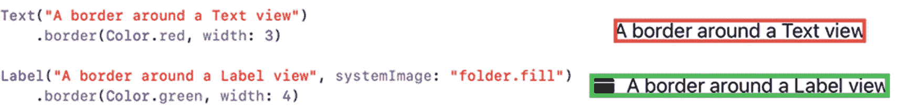

图 4-18 边框紧密包裹文本或标签视图内部的文本

如果你不希望边框包裹得太紧，可以首先在文本或标签视图周围添加内边距，然后再应用 `.border` 修饰符，如图 4-19 所示。

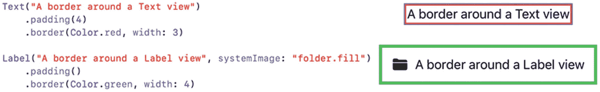

图 4-19 内边距修饰符可以为文本或标签视图周围的边框添加空间

**注意：** 请确保在 `.border` 修饰符之前应用 `.padding` 修饰符。否则，如果 `.border` 修饰符出现在前面，SwiftUI 将先绘制边框，再在文本或标签视图周围应用内边距。

## 总结

文本视图便于在用户界面上显示任何类型的文本信息。即使需要显示数字、日期或其他数据类型，你也可以使用字符串插值在文本视图中显示数据。标签视图与文本视图类似。

文本视图仅显示文本，而标签视图可以并排显示图像和文本。标签视图可以显示 SF Symbols 应用中列出的图标，或你添加到 Xcode 项目 `Assets` 文件夹中的任何图像。通过对标签视图应用不同的样式，你可以显示文本和图标、仅文本或仅图标。通过使用文本视图或标签视图，你的应用可以在用户界面上显示信息供用户查看。

