# 5. 使用图像

大多数用户界面由文本组成，但仅靠文本可能显得单调。这就是为什么屏幕上第二常见的显示信息类型是图像。图像可以纯粹用于装饰目的，也可以帮助用户在用户界面中进行导航。

最常见的显示图像类型是图标。SF Symbols 应用 ([`https://developer.apple.com/sf-symbols/`](https://developer.apple.com/sf-symbols/)) 列出了所有可以包含在应用用户界面中的可用图标。除了这些图标，你还可以包含拖拽到 Xcode 项目 `Assets` 文件夹中的任何图像。此外，你还可以包含常见的形状，如矩形或圆形，这些形状可以显示在屏幕上。

图像允许你通过在屏幕上显示彩色或信息丰富的图形来美化任何用户界面的外观。每当你创建用户界面时，请思考如何添加图形图像，以使你的用户界面在视觉上更吸引用户。


## 显示形状

用户界面中最简单的图像就是常见的几何形状。几何形状可以单独使用，也可以放在其他类型视图（例如`Text`视图）后面的背景中，用于装饰目的。图 5-1 展示了五种常见的几何形状：

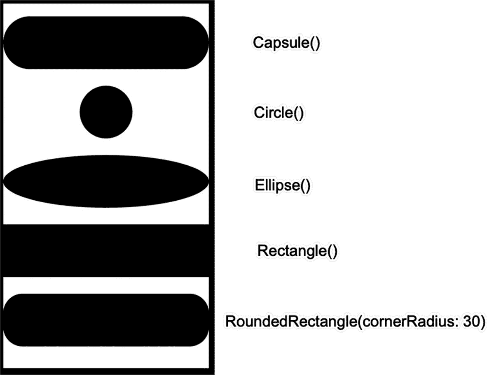

图 5-1

SwiftUI 中可用的五种不同类型的几何形状

*   `Capsule`（胶囊形）
*   `Circle`（圆形）
*   `Ellipse`（椭圆形）
*   `Rectangle`（矩形）
*   `RoundedRectangle(cornerRadius: x)`（圆角矩形）

要创建这些几何形状中的任何一种，只需声明所需形状的名称，例如 `Circle()`。唯一的例外是圆角矩形，它需要一个圆角半径值来定义角的弯曲程度。值越低，角看起来越锐利，圆角半径为 0 时会创建一个像普通矩形一样的 90 度角。圆角半径值越高，圆角矩形就越像一个胶囊形。

### 为形状着色

由于每个几何形状的默认颜色都是黑色，你可能希望为你的形状选择不同的颜色。要为形状添加颜色，你可以使用 `fill` 修改器，如下所示：

```
Capsule()
.fill(Color.yellow)
```

如果你不喜欢使用任何标准颜色（`green`、`red`、`yellow`、`blue` 等），你也可以通过定义红、绿、蓝值或者色相、饱和度、亮度值来自定义颜色，如下所示：

```
Circle()
.fill(Color(red: 1.0, green: 0.0, blue: 0.0, opacity: 1.0))
```

或者

```
Ellipse()
.fill(Color(hue: 1.7, saturation: 2.9, brightness: 0.58))
```

### 使用渐变给形状着色

另一种添加颜色的方法是使用渐变，它以不同的方式扩散两种或多种颜色。SwiftUI 提供了三种可用的渐变类型，如图 5-2 所示：

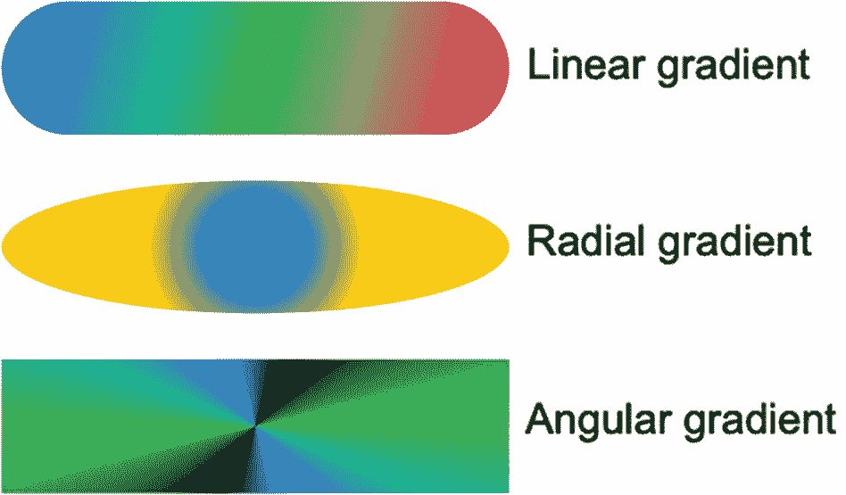

图 5-2

三种可用的渐变类型

*   线性渐变
*   径向渐变
*   角度渐变

线性渐变需要定义两种或多种颜色，以及一个起点和一个终点。颜色存储在中括号内，起点和终点可以定义以下位置之一，如图 5-3 所示：

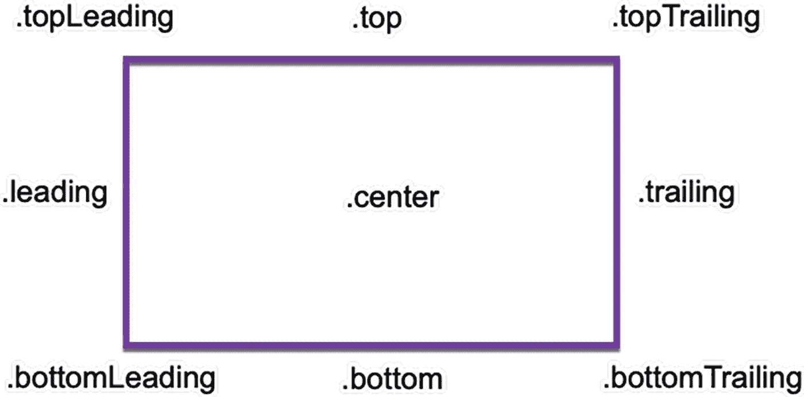

图 5-3

线性渐变不同起点/终点的位置

*   `bottom`（底部）
*   `bottomLeading`（底部左侧）
*   `bottomTrailing`（底部右侧）
*   `center`（中心）
*   `leading`（左侧）
*   `top`（顶部）
*   `topLeading`（顶部左侧）
*   `topTrailing`（顶部右侧）
*   `trailing`（右侧）
*   `zero`（零点）

要创建线性渐变，只需像这样定义两种或多种颜色以及一个起点和终点：

```
Capsule()
.fill(LinearGradient(gradient: Gradient(colors: [.blue, .green, .pink]), startPoint: .topLeading, endPoint: .bottomTrailing))
```

径向渐变在由 `center` 参数（例如 `.center` 或 `.top`）指定的特定位置绘制一个圆形颜色。如果你选择诸如 `.top` 这样的值，那么渐变中心将从形状的顶部中心开始，如图 5-4 所示。

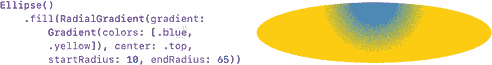

图 5-4

`center` 参数定义了径向渐变中心开始的位置

第一种颜色的大小由 `startRadius` 定义。`startRadius` 值越小，第一种颜色的半径就越小。`endRadius` 值与 `startRadius` 值相比越大，颜色之间的融合就越扩散。`endRadius` 值与 `startRadius` 值相比越小，颜色之间的边界就越清晰，如图 5-5 所示。

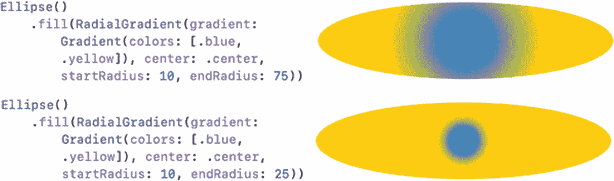

图 5-5

比较径向渐变中的 `startRadius` 和 `endRadius` 值

要创建径向渐变，定义两种或多种颜色，指定渐变中心的位置（例如 `.center` 或 `.topLeading`），以及 `startRadius` 和 `endRadius`，如下所示：

```
Ellipse()
.fill(RadialGradient(gradient: Gradient(colors: [.blue, .yellow]), center: .top, startRadius: 10, endRadius: 65))
```

虽然线性渐变和径向渐变只用两种颜色就能很好地工作，但角度渐变在颜色数量更多时效果最佳。如果你只为角度渐变定义两种颜色，SwiftUI 会将这两种颜色并排显示，然后在它们逐渐融合的地方形成过渡，如图 5-6 所示。

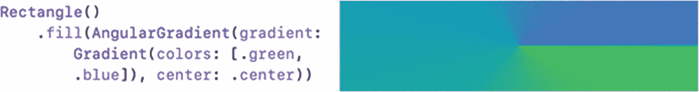

图 5-6

仅显示两种不同颜色的角度渐变

在角度渐变中定义的颜色越多，它们就能更好地混合在一起。除了定义多种颜色，你只需要定义角度渐变的中心，例如 `.center` 或 `.bottomTrailing`。要创建角度渐变，定义多种颜色或重复多次相同的颜色（如图 5-7 所示）以及中心位置：

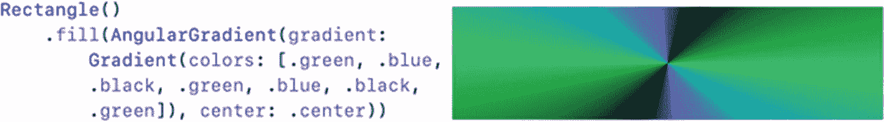

图 5-7

多次显示相同颜色的角度渐变

```
Rectangle()
.fill(AngularGradient(gradient: Gradient(colors: [.green, .blue, .black, .green, .blue, .black, .green]), center: .center))
```


## 显示图像

与 `Text` 视图在用户界面上显示文本类似，`Image` 视图用于在用户界面上显示图标和图形文件。如果你想显示 SF Symbols 应用中存储的图标，可以使用如下 Swift 代码：

```swift
Image(systemName: "hare.fill")
```

当要显示 SF Symbol 图标时，必须使用 `systemName` 参数。由于图标较小，你可能需要放大它们。最简单的放大方式是定义更大的字体，例如 `.largeTitle` 或 `.custom`，如图 5-8 所示。

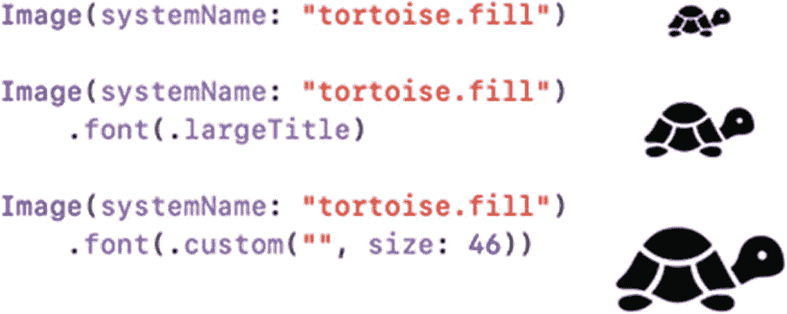

**图 5-8** – 通过更改字体大小来修改 SF Symbol 图标的大小

要显示图像，首先需要将其拖放到 Assets 文件夹中。然后，要显示 Assets 文件夹中存储的图像，可以使用 `Image` 视图并指定图像名称，如下所示：

```swift
Image("flag")
```

图像的尺寸可以任意，但如果图像太大或太小，`Image` 视图会以其原始尺寸显示。由于你可能需要调整图像大小以适应用户界面，因此需要在 `Image` 视图上使用以下三个修饰符：

- `.resizable()`
- `.aspectRatio(contentMode: z)`
- `.frame(width: x, height: y)`

`.resizable()` 修饰符允许 `Image` 视图更改显示图像的大小。如果 `Image` 视图缺少此 `.resizable()` 修饰符，那么无论 `Image` 视图的尺寸如何，图像都将保持其原始大小。

`.frame(width: x, height: y)` 修饰符用于定义 `Image` 视图的大小。当与 `.resizable()` 修饰符一起使用时，`.frame` 修饰符允许你定义图像的固定宽度和高度。

由于拉伸 `Image` 视图的宽度和高度可能会使内部显示的图像变形，`.aspectRatio` 修饰符允许你定义图像应如何反应。`.fill` 选项将图像扩展到由 `.frame` 修饰符定义的最大宽度或高度。`.fit` 选项将图像缩小到由 `.frame` 修饰符定义的最小宽度或高度，如图 5-9 所示。

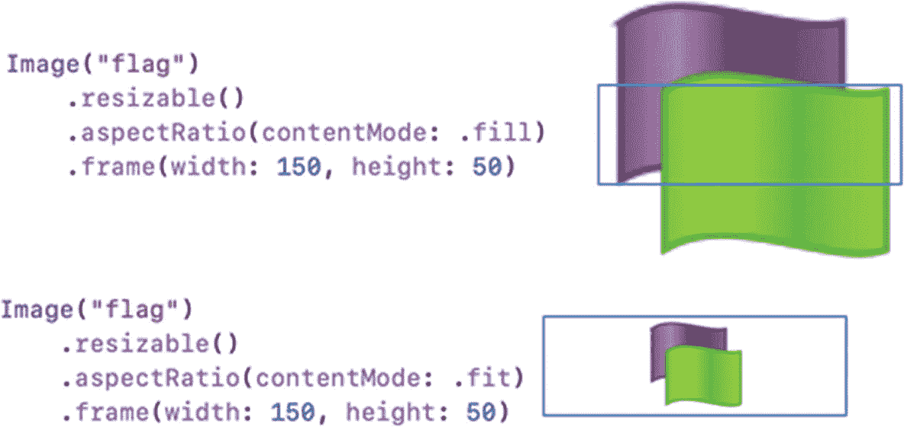

**图 5-9** – 在图像上使用 `.fill` 和 `.fit` 宽高比

如果你想要进一步细化宽高比，可以包含一个宽高比值，例如：

```swift
Image("flag")
.resizable()
.frame(width: 150, height: 150)
.aspectRatio(0.5, contentMode: .fill)
```

此宽高比定义了宽度与高度的比例，因此值 `0.5` 表示宽度与高度比为 1:2，而值 `0.75` 则表示 3:4 的宽度与高度比。

### 裁剪图像

`Image` 视图可以显示他人绘制的剪贴画图像，也可以显示用数码相机拍摄的照片。通常，`Image` 视图会在 `.frame` 修饰符定义的矩形内显示任何图片。但是，为了创造更独特的视觉效果，你可以通过使用 `.clipShape` 修饰符将图像覆盖在几何形状上来裁剪图像。

`.clipShape` 修饰符接受任何常见的几何形状，例如：

```swift
.clipShape(Circle())
```

当使用其他几何形状（如 `Ellipse()` 或 `Capsule()`）时，请确保框架宽度足够宽。如果框架的宽度和高度相同，那么 `Ellipse()` 和 `Capsule()` 形状看起来就像 `Circle()`。图 5-10 展示了 `.clipShape(Circle())` 修饰符如何改变通常显示为矩形图像的图像外观。

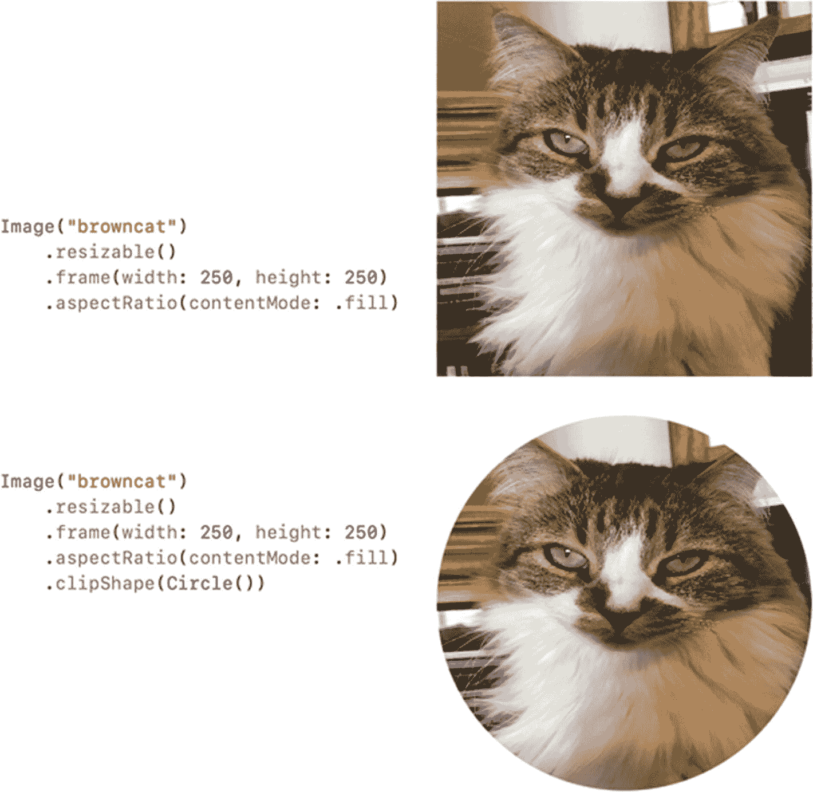

**图 5-10** – 使用 `.clipShape()` 修饰符

### 为图像添加阴影

另一种突出 `Image` 视图外观的方法是使用 `.shadow` 修饰符，它可以在视图周围添加阴影。你可以通过定义其半径来调整阴影在视图周围出现的程度，例如：

```swift
.shadow(color: .red, radius: 46, x: 0, y: 0)
```

`.shadow` 修饰符需要以下参数：

- `Color` – 定义阴影的颜色。
- `Radius` – 定义阴影在视图周围的大小。
- `X` – 定义阴影的 x（水平）偏移量；值为 `0` 时，阴影在水平方向上围绕视图居中。
- `Y` – 定义阴影的 y（垂直）偏移量；值为 `0` 时，阴影在垂直方向上围绕视图居中。

如果 `x` 和 `y` 值非零，则阴影会偏离 `Image` 视图。如果 `x` 和 `y` 值都为 `0`，则阴影会均匀出现在 `Image` 视图的所有四个边缘周围，如图 5-11 所示。

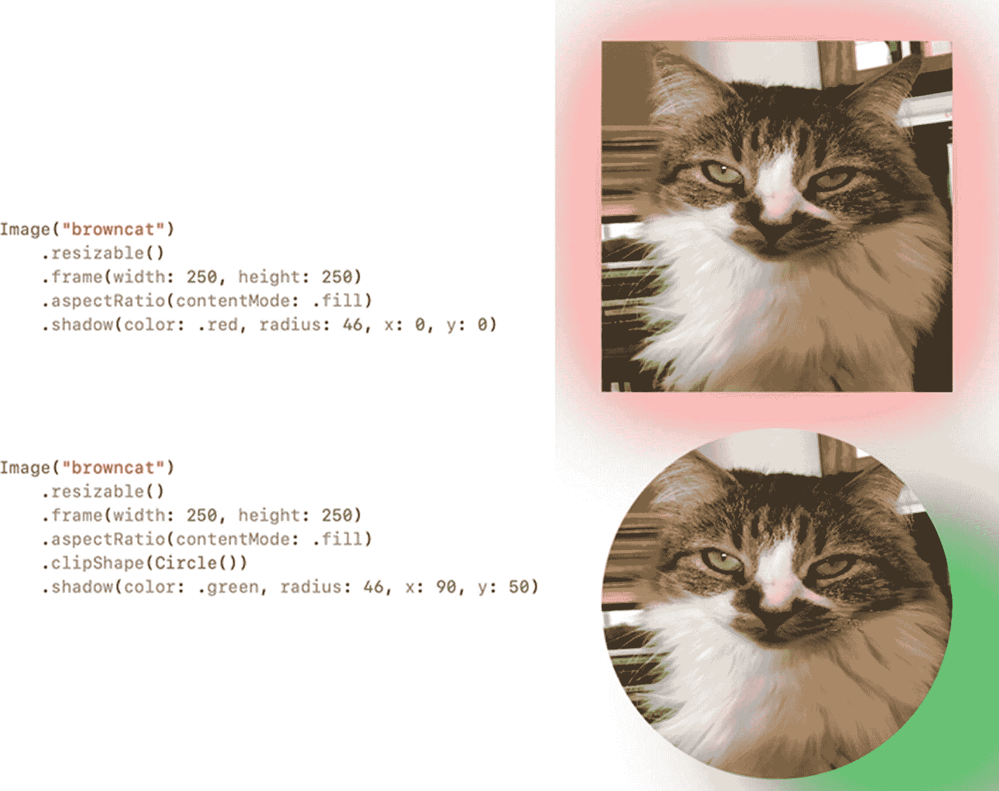

**图 5-11** – 使用不同的 `x` 和 `y` 值为 `Image` 视图添加阴影

### 为图像添加边框

为了进一步突出 `Image` 视图，你可以使用 `.overlay` 修饰符在其周围添加边框，如下所示：

```swift
.overlay(Rectangle().stroke(Color.blue, lineWidth: 10))
```

`.overlay` 修饰符需要以下参数：

- `Shape` – 定义边框的形状以匹配 `Image` 视图的形状
- `Color` – 定义边框的颜色
- `lineWidth` – 定义 `Image` 视图周围边框线的粗细

图 5-12 展示了使用不同形状、颜色和线宽的 `.overlay` 修饰符的两种用法。

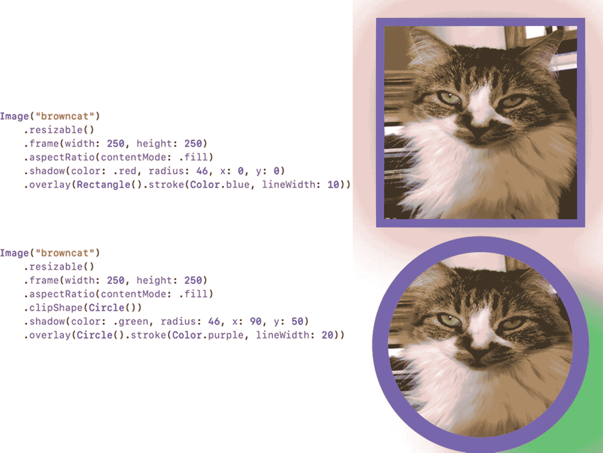

**图 5-12** – 为 `.overlay` 修饰符使用不同的值

### 定义图像的不透明度

修改图像外观的另一种方法是定义其不透明度。不透明度为 `0` 意味着图像不可见。不透明度为 `1` 意味着图像完全不改变地显示。不透明度越接近 `0`，图像越模糊。不透明度越接近 `1`，图像越清晰。

要使用不透明度修饰符，只需像这样定义一个介于 `0` 到 `1` 之间的不透明度值：

```swift
.opacity(0.75)
```

图 5-13 展示了不同的不透明度值如何修改图像的外观。

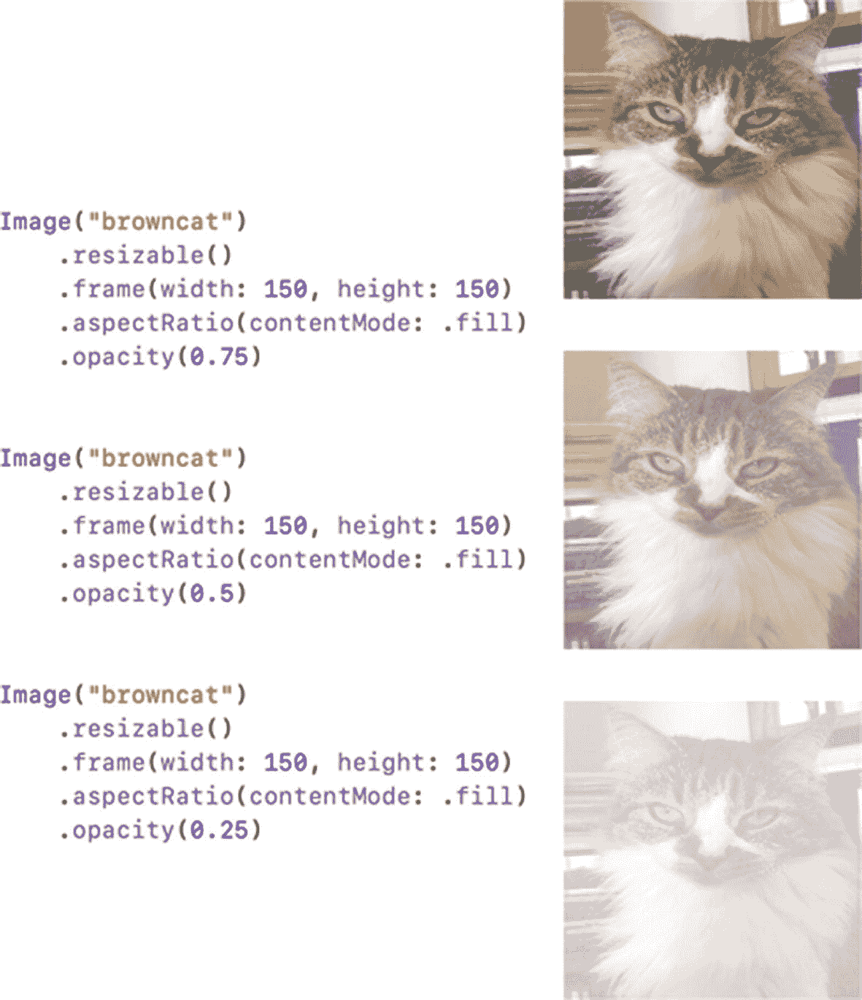

**图 5-13** – 为 `.opacity` 修饰符使用不同的值

## 总结

图像提供了在用户界面上呈现信息的另一种方式。图像可以是常见的几何形状（如圆形、椭圆和圆角矩形）、可以在 SF Symbols 应用中找到的图标，也可以是拖放到 Xcode 项目 Assets 文件夹中的图形图像或数码照片。

如果你正在创建几何形状，可以使用纯色、自定义颜色或渐变填充它们，以创建多颜色混合的视觉效果。如果你正在使用 SF Symbol 图标，可以使用 `.font` 修饰符调整其大小。如果你正在使用 Xcode 项目 Assets 文件夹中存储的图像，可以将 `.resizable`、`.frame` 和 `.aspectRatio` 修饰符结合使用，以定义图像的大小和外观。

要创造额外的视觉效果，你可以将图像裁剪成几何形状（如圆形）、为图像添加边框、为图像添加阴影以及修改不透明度。有如此多调整图像外观的方法，你应该能够定义图像，使其在用户界面上完全按照你期望的方式显示。


