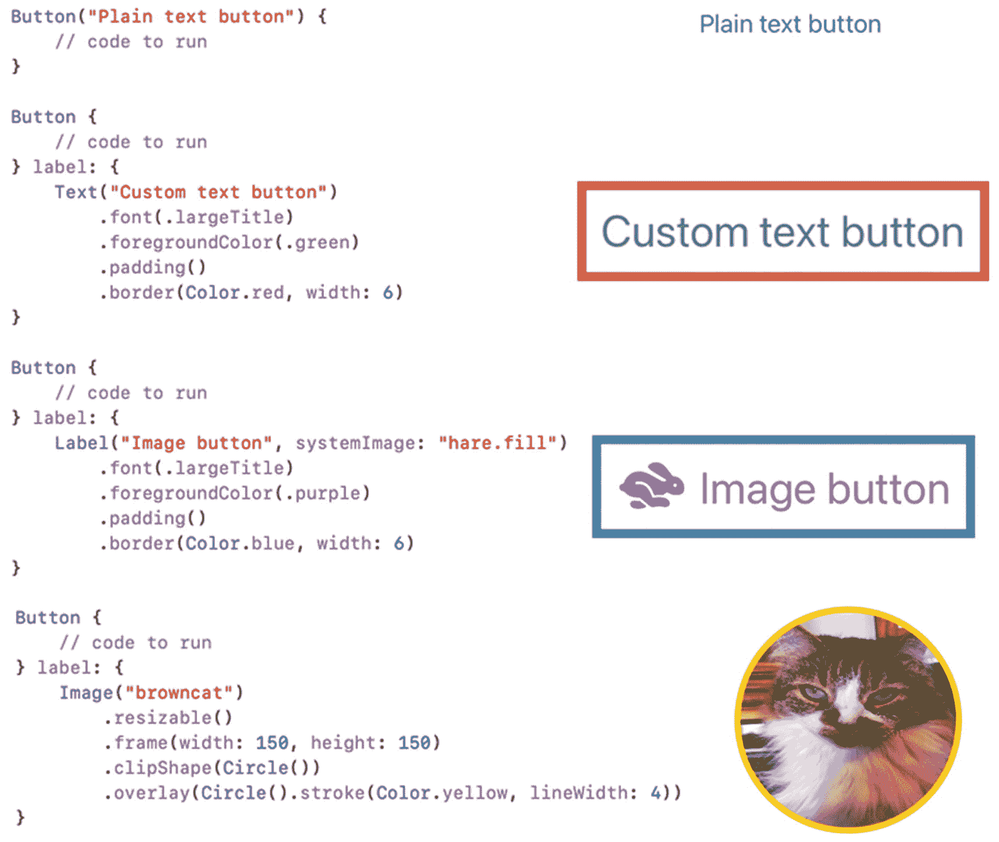
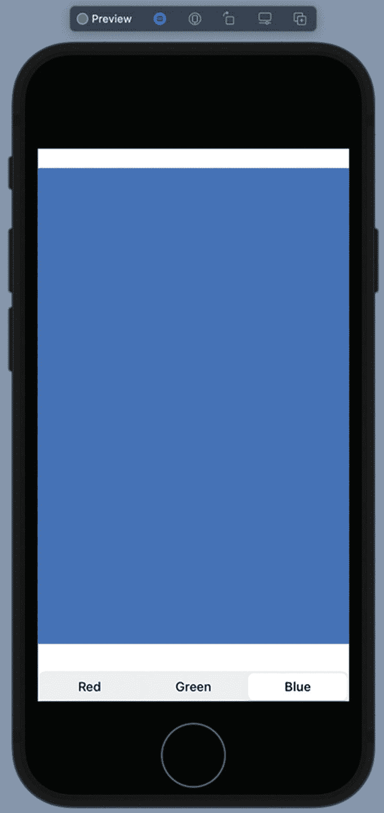
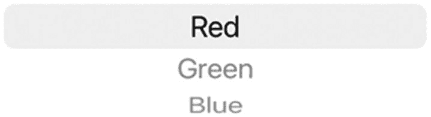
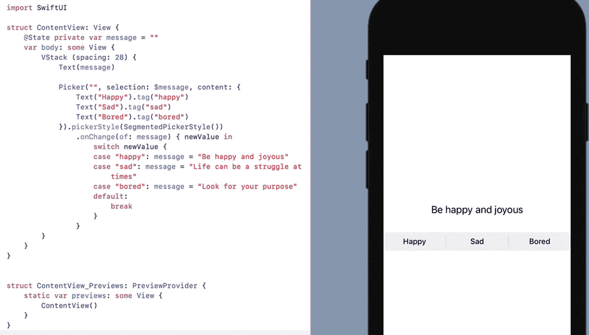

# 6. 使用按钮和分段控件响应用户操作

每个用户界面都需要向用户显示信息，无论是文本还是图像。然而，用户界面的另一个功能是接收用户的命令。通过用户界面接收命令的最简单方式就是使用按钮。

按钮代表单个命令，可以像确认（如确定或取消）一样简单。要创建一个`Button`，你需要定义：

- 在按钮上显示文本的标题
- 用户点击按钮时运行的 Swift 代码

SwiftUI 提供了两种创建`Button`的方式。最简单的方式只需定义按钮上显示的文本，紧接着是用户选择按钮时要运行的 Swift 代码，如下所示：

```
Button("点击此处") {
    // 要运行的代码
}
```

第二种创建按钮的方式在修改按钮上文本的外观时提供了更大的灵活性，例如：

```
Button {
    // 要运行的代码
} label: {
    Text("点击此处")
        .font(.largeTitle)
        .foregroundColor(.green)
        .padding()
        .border(Color.red, width: 6)
}
```

第二种方法使用`Text`视图来定义按钮上显示的标题。然后它使用`.font`修饰符定义字体大小，使用`.foregroundColor`修饰符将文本显示为绿色，使用`.padding`修饰符在`Text`视图周围添加间距，并使用`.border`修饰符在`Text`视图周围添加宽度为 6 点的红色边框。

除了使用`Text`视图定义按钮的标题，你也可以使用`Label`视图来同时显示文本和图标，如下所示：

```
Button {
    // 要运行的代码
} label: {
    Label("图像按钮", systemImage: "hare.fill")
        .font(.largeTitle)
        .foregroundColor(.purple)
        .padding()
        .border(Color.blue, width: 6)
}
```

这个`Label`视图定义了要显示的文本和图标，然后使用`.font`修饰符定义文本和图标的大小。它使用`.foregroundColor`修饰符将文本和图标显示为紫色，使用`.padding`修饰符在`Label`视图周围添加间距，并使用`.border`修饰符在`Label`视图周围显示宽度为 6 点的蓝色边框。

你也可以使用`Image`视图让图像显示为按钮，如下所示：

```
Button {
    // 要运行的代码
} label: {
    Image("browncat")
        .resizable()
        .frame(width: 150, height: 150)
        .clipShape(Circle())
        .overlay(Circle().stroke(Color.yellow, lineWidth: 4))
}
```

这个`Image`视图使用存储在 Assets 文件夹中的图像（名为`browncat`），然后使用`.frame`修饰符将图像压缩成一个宽高均为 150 的正方形。接着它使用`.clipShape`修饰符在圆形内显示图像，随后使用`.overlay`修饰符显示线宽为 4 的黄色边框。

通过使用第二种方法定义`Button`的标题，你可以看到如何更好地控制按钮标题的外观，特别是与使用纯文本简单定义`Button`的方式相比，如图 6-1 所示。



图 6-1

使用`Text`视图、`Label`视图或`Image`视图定义按钮标题

## 在按钮中运行代码

你可以存储任何代码，以便在用户点击`Button`时运行。按钮内部常见的一种代码类型是改变状态的代码。在 SwiftUI 中，你可以像这样将特殊变量声明为 State 变量：

```
@State var colorMe = false
```

当你将更新后的数据存储到普通变量中时，使用该变量的程序的其他部分并不知道数据已被更新。确保程序的每个部分都能接收到变量中存储的更新数据可能既繁琐又容易出错。这就是 SwiftUI 提供 State 变量来解决这个问题的原因。

一旦你改变了 State 变量的值，任何使用该 State 变量的内容都会自动获取该 State 变量中存储的最新数据，无需编写任何额外代码。当一个变量持有一个值时，它处于一种状态；当同一个变量持有不同的值时，那就是第二种状态。SwiftUI State 变量自动简化了让程序每个部分都了解变量值或状态变化的过程。

前面的例子通过使用`@State`关键字，后跟一个变量声明（`var`）来创建一个 State 变量，该声明定义了变量的名称（`colorMe`）、数据类型（推断为布尔类型）和初始值（`false`）。

当使用表示布尔数据类型的 State 变量时，一个常用的命令是`.toggle()`命令，它将布尔变量从`true`改为`false`（或从`false`改为`true`），例如：

```
colorMe.toggle()
```

如果`colorMe` State 变量的值是`true`，那么`.toggle()`命令会将`colorMe`的值改为`false`。如果`colorMe` State 变量的值是`false`，那么`.toggle()`命令会将`colorMe`的值改为`true`。

布尔 State 变量常用于做出 if-else 决策。通常，修饰符只包含单个值，例如：

```
.fill(Color.green)
```

然而，如果你在修饰符中嵌入 if-else 三元运算符，就可以将传统的 if-else 语句压缩到单行中，如下所示：

```
.fill(colorMe ? Color.green : Color.gray)
```

前面的 Swift 代码检查`colorMe`变量的布尔值。如果为`true`，则使用绿色。否则，使用灰色。让我们看看如何将 State 变量、`.toggle()`命令和 if-else 三元运算符组合起来，使按钮响应用户操作：

1. 创建一个新的 SwiftUI iOS App 项目，并为其指定任意名称，例如`Buttons`。

2. 在导航器面板中点击`ContentView`文件。

3. 在`struct ContentView: View`行下方添加一个 State 变量，如下所示：

```
    struct ContentView: View {
    @State var colorMe = false
    var body: some View {
```

这定义了一个名为`colorMe`的 State 变量（具体名称可任意），并将其初始值设置为`false`，同时定义它只保存布尔数据类型。

4. 在`var body: some View`内部创建一个间距值为 28 的`VStack`，如下所示：

```
    struct ContentView: View {
    @State var colorMe = false
    var body: some View {
    VStack (spacing: 28) {
    }
    }
    }
```

间距为 28 将使`VStack`内的所有视图彼此分离，避免显得拥挤。

5. 在`VStack`内部输入以下内容：

```
    Rectangle()
    .fill(colorMe ? Color.green : Color.gray)
    .frame(width: 250, height: 100)
```

这会创建一个矩形，其中`.frame`修饰符将其宽度定义为 250，高度定义为 100。注意，`.fill`修饰符使用`colorMe`布尔 State 变量来决定显示哪种颜色。如果`colorMe`为`true`，则矩形显示为绿色。如果`colorMe`为`false`，则矩形显示为灰色。

6. 在`VStack`内部的`Rectangle()`下方输入以下内容，以创建一个普通按钮：

```
    Button("纯文本按钮") {
    colorMe.toggle()
    }
```


这定义了一个用于显示纯文本的 `Button`。每当用户点击此 `Button`，它都会使用 `.toggle()` 命令将 `colorMe` 的值从 `true` 改为 `false`（或从 `false` 改为 `true`）。

7.  在 `VStack` 中的 `Button` 下方输入以下内容，以创建一个使用自定义 `Text` 视图来显示其标题的 `Button`：

```
    Button {
    colorMe.toggle()
    } label: {
    Text("自定义文本按钮")
    .font(.largeTitle)
    .foregroundColor(.green)
    .padding()
    .border(Color.red, width: 6)
    }
    ```

这定义了一个 `Button`，它也使用 `.toggle()` 命令来更改 `colorMe` 变量的布尔值。然而，它使用 `Text` 视图来显示 `Button` 的标题。`.font` 修饰符更改 `Text` 视图的大小，`.foregroundColor` 修饰符使文本显示为绿色，`.padding` 修饰符在 `Text` 视图周围添加空间，而 `.border` 修饰符在 `Text` 视图周围显示宽度为 6 的红色边框。

8.  在 `VStack` 中的前一个 `Button` 下方输入以下内容，以使用 `Label` 视图来定义 `Button` 的标题：

```
    Button {
    colorMe.toggle()
    } label: {
    Label("图片按钮", systemImage: "hare.fill")
    .font(.largeTitle)
    .foregroundColor(.purple)
    .padding()
    .border(Color.blue, width: 6)
    }
    ```

这定义了一个 `Button`，它使用 `.toggle()` 命令来更改 `colorMe` 变量的布尔值。然而，它使用 `Label` 视图来显示文本（“图片按钮”）以及一个名为“hare.fill”的图标。然后它使用 `.font` 修饰符来放大文本和图标，并使用 `.foregroundColor` 修饰符将文本和图标显示为紫色。最后，它使用 `.padding` 修饰符在 `Label` 视图周围添加空间，并在 `Label` 视图周围放置宽度为 6 的蓝色边框。

9.  在 `VStack` 中的前一个 `Button` 下方输入以下内容，以使用 `Image` 视图来定义 `Button` 的标题：

```
    Button {
    colorMe.toggle()
    } label: {
    Image("browncat")
    .resizable()
    .frame(width: 150, height: 150)
    .clipShape(Circle())
    .overlay(Circle().stroke(Color.yellow, lineWidth: 4))
    }
    ```

这定义了一个 `Button`，它使用 `.toggle()` 命令来更改 `colorMe` 变量的布尔值。`Image` 视图没有为 `Button` 的标题显示文本，而是使用存储在 Xcode 项目 Assets 文件夹中的图像（称为“browncat”）。然后它使用 `.resizable` 和 `.frame` 修饰符将图像大小调整为宽度 150、高度 150 的方框。最后，它使用 `.clipShape` 修饰符将图像裁剪为圆形，并使用 `.overlay` 修饰符在图像周围放置一个线宽为 4 的黄色圆形边框。

整个 SwiftUI 代码应如下所示：

```
    import SwiftUI
    struct ContentView: View {
    @State var colorMe = false
    var body: some View {
    VStack (spacing: 28) {
    Rectangle()
    .fill(colorMe ? Color.green : Color.gray)
    .frame(width: 250, height: 100)
    Button("纯文本按钮") {
    colorMe.toggle()
    }
    Button {
    colorMe.toggle()
    } label: {
    Text("自定义文本按钮")
    .font(.largeTitle)
    .foregroundColor(.green)
    .padding()
    .border(Color.red, width: 6)
    }
    Button {
    colorMe.toggle()
    } label: {
    Label("图片按钮", systemImage: "hare.fill")
    .font(.largeTitle)
    .foregroundColor(.purple)
    .padding()
    .border(Color.blue, width: 6)
    }
    Button {
    colorMe.toggle()
    } label: {
    Image("browncat")
    .resizable()
    .frame(width: 150, height: 150)
    .clipShape(Circle())
    .overlay(Circle().stroke(Color.yellow, lineWidth: 4))
    }
    }
    }
    }
    struct ContentView_Previews: PreviewProvider {
    static var previews: some View {
    ContentView()
    }
    }
    ```

10. 单击画布窗格中的“实时预览”图标。

11. 单击任意按钮。请注意，每次单击按钮时，它都会切换 `colorMe` 布尔变量，从而在矩形中交替显示绿色或灰色。

## 使用分段控件

`Button` 代表单个命令，因此如果要向用户提供多个命令之间的选择，则需要使用多个 `Button`。不幸的是，多个 `Button` 可能会挤占用户界面空间，使用起来很不方便。为了解决这个问题，SwiftUI 提供了分段控件。

分段控件的主要思想是在紧凑的空间中显示两个或更多选项，而不是使用多个 `Button`。要创建分段控件，您需要以下内容：

*   一个 `@State` 变量，用于表示用户选择的段（选项）
*   一个列出两个或更多选项的 `Picker` 视图
*   链接到每个选项的 `.tag` 属性
*   `SegmentedPickerStyle` 修饰符

要了解如何使用分段控件，请按照以下步骤操作：



**图 6-2** 分段控件的完整用户界面

1.  创建一个新的 SwiftUI iOS App 项目，并为其指定任意名称，例如“SegmentedControl”。

2.  在导航器窗格中单击 `ContentView` 文件。

3.  在 `struct ContentView: View` 行下方添加一个 `@State` 变量，如下所示：

```
    struct ContentView: View {
    @State private var selectedColor = Color.gray
    var body: some View {
    ```

这将创建一个名为 `selectedColor` 的 `@State` 变量。请注意，“private”关键字是可选的，仅表示此变量只能在此 `ContentView` 结构中使用。注意，此 `selectedColor` 变量的初始值是 `Color.gray`，这意味着其推断数据类型为 `Color`。

4.  在 `var body: some View` 内部创建一个间距值为 28 的 `VStack`，如下所示：

```
    struct ContentView: View {
    @State private var selectedColor = Color.gray
    var body: some View {
    VStack (spacing: 28) {
    }
    }
    }
    ```

间距值可以是您想要的任何数字，但它会在您添加到 `VStack` 内部的任何视图之间添加间距，这样它们在用户界面上就不会显得拥挤。

5.  输入以下内容在 `VStack` 内部创建一个彩色矩形：

```
    Rectangle()
    .fill(selectedColor)
```

这将创建一个矩形，其颜色由 `selectedColor` `@State` 变量定义。最初，此矩形填充为 `Color.gray`。

6.  输入以下内容在 `VStack` 内部创建一个分段控件：

```
    Picker("最喜欢的颜色", selection: $selectedColor, content: {
    Text("红色").tag(Color.red)
    Text("绿色").tag(Color.green)
    Text("蓝色").tag(Color.blue)
    }).pickerStyle(SegmentedPickerStyle())
    ```

这将创建一个 `Picker` 视图，该视图在分段控件上列出三个选项（“红色”、“绿色”和“蓝色”）。每个选项后面都有一个链接到该选项的 `.tag`。虽然用户看到的是由三个 `Text` 视图（“红色”、“绿色”和“蓝色”）显示的选项，但 `selectedColor` `@State` 变量实际存储的是 `.tag` 值，即颜色类型（`.red`、`.green` 和 `.blue`）。`.pickerStyle` 修饰符通过定义 `SegmentedPickerStyle()` 将 `Picker` 视图显示为分段控件。

整个 SwiftUI 代码应如下所示：

```
    import SwiftUI
    struct ContentView: View {
    @State private var selectedColor = Color.gray
    var body: some View {
    VStack (spacing: 28) {
    Rectangle()
    .fill(selectedColor)
    Picker("最喜欢的颜色", selection: $selectedColor, content: {
    Text("红色").tag(Color.red)
    Text("绿色").tag(Color.green)
    Text("蓝色").tag(Color.blue)
    }).pickerStyle(SegmentedPickerStyle())
    }
    }
    }
    struct ContentView_Previews: PreviewProvider {
    static var previews: some View {
    ContentView()
    }
    }
    ```

7.  单击画布窗格中的“实时预览”图标。


8.  点击分段控件上的“红色”、“绿色”和“蓝色”选项。每次你从分段控件中选择不同的选项时，`selectedColor` 状态变量都会发生变化。随后，这个状态变量会自动更改矩形的颜色，如图 6-2 所示。

**注意**

如果省略了 `.pickerStyle(SegmentedPickerStyle())` 修饰符，`Picker` 视图将以转轮形式垂直显示这三个选项（“红色”、“绿色”和“蓝色”），如图 6-3 所示。



*图 6-3* 未使用 `.pickerStyle(SegmentedPickerStyle())` 修饰符时的 `Picker` 视图外观

### 从分段控件运行代码

仅仅通过选择分段控件上的选项，分段控件只能更改一个状态变量。如果你想根据用户在分段控件中选择的选项来运行代码，则需要添加一个 `.onChange` 修饰符，如下所示：

```
.onChange(of: stateVariable) { newValue in
// 要运行的代码
}
```

每当用户选择分段控件中的不同选项时，它就会更改一个状态变量。`.onChange` 修饰符会在每次该状态变量发生变化时运行代码。`newValue` 变量包含了最新的更改值，然后即可据此运行代码。要了解其工作原理，请按照以下步骤操作：



*图 6-4* `.onChange` 修饰符可以在 `Text` 视图中显示不同的文本

1.  创建一个新的 SwiftUI iOS App 项目，并为其命名任意你喜欢的名称，例如“SegmentedControl Code”。
2.  在导航器窗格中点击 `ContentView` 文件。
3.  在 `struct ContentView: View` 代码行下方添加一个状态变量，如下所示：

```
    struct ContentView: View {
    @State private var message = ""
    var body: some View {
    ```

这将创建一个名为 `message` 的状态变量。请注意，`private` 关键字是可选的，它仅表示该变量只能在此 `ContentView` 结构体内部使用。其初始值为一个空字符串，因此其数据类型被推断为 `String`。

4.  在 `var body: some View` 内部创建一个间距值为 28 的 `VStack`，如下所示：

```
    struct ContentView: View {
    @State private var message = ""
    var body: some View {
    VStack (spacing: 28) {
    }
    }
    }
    ```

间距值可以是任意你想要的数字，它会在 `VStack` 内部添加的任意视图之间增加间距，以防止它们在用户界面上显得拥挤。

5.  输入以下代码，在 `VStack` 内部创建一个 `Text` 视图：

```
    Text(message)
    ```

这将创建一个显示 `message` 状态变量内容的 `Text` 视图。

6.  输入以下代码，在 `VStack` 内部创建一个分段控件：

```
    Picker("", selection: $message, content: {
    Text("Happy").tag("happy")
    Text("Sad").tag("sad")
    Text("Bored").tag("bored")
    }).pickerStyle(SegmentedPickerStyle())
    ```

这将创建一个显示三个选项（“Happy”、“Sad”和“Bored”）的 `Picker` 视图，选项显示在分段控件上。每个选项后面都有一个与之关联的 `.tag`。虽然用户看到的是由三个 `Text` 视图显示的选项，但 `message` 状态变量实际存储的是 `.tag` 值，这些值是字符串（`“happy”`、`“sad”`、`“bored”`）。`.pickerStyle` 修饰符通过定义 `SegmentedPickerStyle()` 将 `Picker` 视图显示为分段控件。

7.  在 `.pickerStyle` 修饰符之后输入以下代码：

```
    .onChange(of: message) { newValue in
    switch newValue {
    case "happy": message = "Be happy and joyous"
    case "sad": message = "Life can be a struggle at times"
    case "bored": message = "Look for your purpose"
    default:
    break
    }
    }
    ```

当检测到 `message` 状态变量发生变化时（即用户选择了分段控件上的不同选项），`.onChange` 修饰符就会运行代码。当用户选择不同选项时，`newValue` 变量会存储该选中的选项（例如 `.tag("happy")`）。

根据 `newValue` 的值，`switch` 语句决定将哪个文本存储到 `message` 状态变量中。一旦 `message` 状态变量获得新值，它就会立即显示在 `Text` 视图中。

完整的 SwiftUI 代码应该如下所示：

```
    import SwiftUI
    struct ContentView: View {
    @State private var message = ""
    var body: some View {
    VStack (spacing: 28) {
    Text(message)
    Picker("", selection: $message, content: {
    Text("Happy").tag("happy")
    Text("Sad").tag("sad")
    Text("Bored").tag("bored")
    }).pickerStyle(SegmentedPickerStyle())
    .onChange(of: message) { newValue in
    switch newValue {
    case "happy": message = "Be happy and joyous"
    case "sad": message = "Life can be a struggle at times"
    case "bored": message = "Look for your purpose"
    default:
    break
    }
    }
    }
    }
    }
    struct ContentView_Previews: PreviewProvider {
    static var previews: some View {
    ContentView()
    }
    }
    ```

8.  点击 Canvas 窗格中的实时预览图标。
9.  点击分段控件上的“Happy”、“Sad”和“Bored”选项。每次你从分段控件中选择不同的选项时，`message` 状态变量都会发生变化。然后，`.onChange` 修饰符会运行代码来更改 `message` 状态变量。这个新的文本随后会出现在 `Text` 视图中，如图 6-4 所示。

通过将 `.onChange` 修饰符与分段控件结合使用，当用户在分段控件上选择不同选项时，你可以运行任何你想要的 Swift 代码。

## 总结

按钮是让用户向程序发出命令的最简单方式。在最简单的层面，一个 `Button` 由文本和每次用户选中该 `Button` 时要运行的一段代码列表组成。要自定义一个 `Button`，你可以使用带有修饰符的 `Text` 视图或 `Label` 视图，或者使用可以显示图像（如图标或数码照片）的 `Image` 视图。

分段控件就像是将两个或多个 `Buttons` 挤在一个单一控件中。通过使用分段控件，你可以比使用多个 `Buttons` 占用更少的空间来向用户显示多个选项。

当处理 `Buttons` 和分段控件时，你通常需要创建一个状态变量。当程序的任何部分更改了状态变量的值时，更新后的数据会自动出现在整个程序中。

虽然 `Buttons` 可以在每次用户选中该 `Button` 时运行一行或多行 Swift 代码，但分段控件只有与 `.onChange` 修饰符结合使用时才能运行代码。`Buttons` 和分段控件都可以让你在用户界面上显示不同的选项供用户选择。

