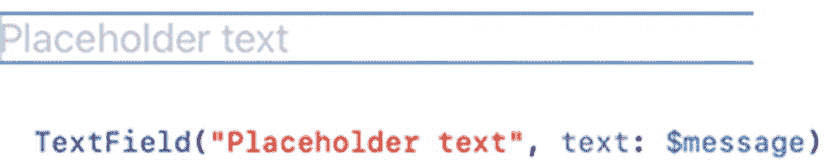
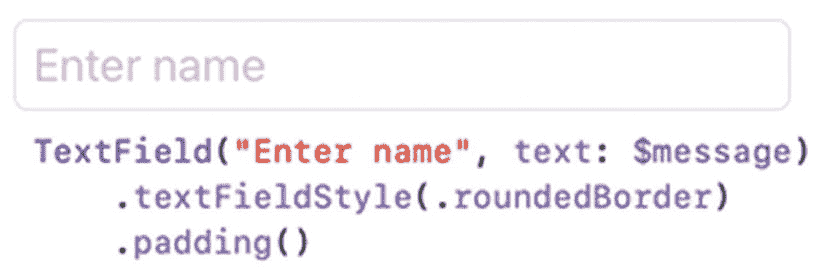
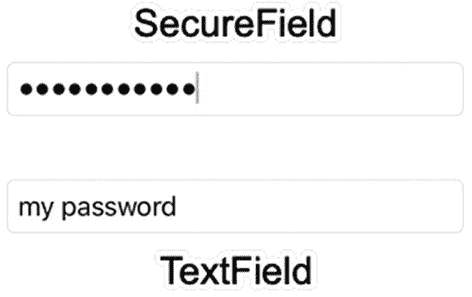
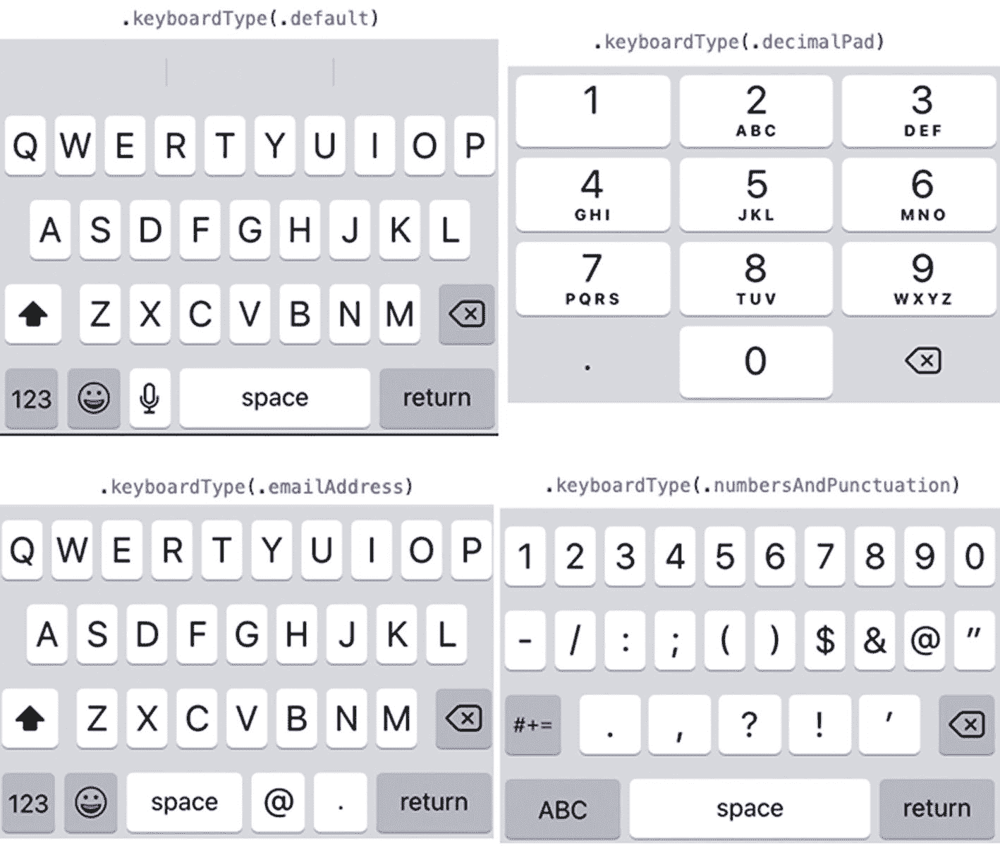
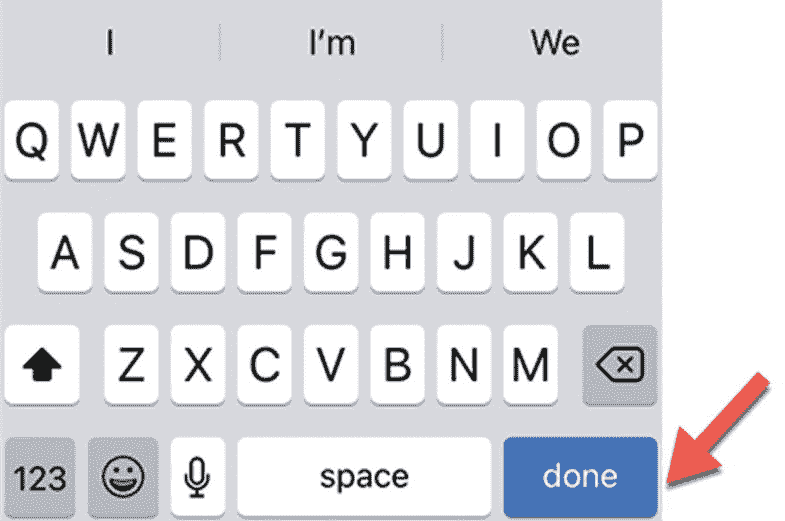

# 7. 从文本字段和文本编辑器中检索文本

用户界面通常需要从用户处检索文本。有时，这个文本可能是一个单词或短句，但其他时候，这个文本可能由几个段落组成。为了从用户处检索文本，SwiftUI 提供了三种类型的视图：

*   文本字段（Text Field）
*   安全字段（Secure Field）
*   文本编辑器（Text Editor）

文本字段允许用户输入单行文本，例如姓名或地址。可选地，文本字段可以显示占位符文本，该文本以浅灰色显示，用于说明文本字段期望什么类型的信息。

安全字段的工作方式与文本字段完全相同，只是它会屏蔽用户输入的任何文本。这在要求用户输入敏感信息（如信用卡号）时很有用。

文本编辑器显示为一个大的方框，用户可以在其中输入和编辑多行文本，例如多个段落。

由于文本字段、安全字段和文本编辑器需要存储数据，它们需要与一个可以持有 `String` 数据类型的状态变量配合使用，例如：

```
@State private var message = ""
```


## 使用文本字段

文本字段的主要用途是接收用户输入的少量文本，可以是一个单词或一个短句。为了提示用户输入预期文本，文本字段可以显示占位符文本，这些文本以浅灰色呈现，如图 7-1 所示。



图 7-1：文本字段可以显示占位符文本来引导用户

当用户在文本字段中输入内容时，该文本会存储在 State 变量中。在图 7-1 中，State 变量名为“message”，其中的美元符号（`$`）表示该 State 变量已绑定到此文本字段。这意味着更改文本字段的内容会自动更改 `message` State 变量。

### 更改文本字段样式

让文本字段更易于识别的一种方法是显示浅灰色的占位符文本，让用户知道输入什么内容以及在哪里输入。强调文本字段的第二种方法是在其周围添加圆角边框，如图 7-2 所示。



图 7-2：文本字段周围的圆角边框外观

`.textFieldStyle` 修饰符提供了 `.plain` 或 `.rounded` 边框选项：

```
.textFieldStyle(.roundedBorder)
```

`.roundedBorder` 会在文本字段周围显示边框，而 `.plain` 修饰符则移除边框，使文本字段看起来就像没有使用 `.textFieldStyle` 修饰符一样。

### 创建安全文本字段

在文本字段中输入时，输入的文本会直接显示在屏幕上。虽然这在大多数情况下很方便，但在输入密码或信用卡号等敏感信息时就不合适了。为了掩盖用户输入的任何文本，SwiftUI 提供了一种特殊的文本字段，称为 `SecureField`。

与文本字段类似，`SecureField` 也会显示占位符文本，并绑定到一个 State 变量，如下所示：

```
SecureField("密码", text: $message)
```

`SecureField` 在用户界面上看起来与 `TextField` 完全相同。唯一的区别是，在 `SecureField` 中输入时，它会掩盖你的文本，如图 7-3 所示。



图 7-3：`SecureField` 会掩盖文本，而文本字段则会显示用户输入的所有内容

任何可用于文本字段的修饰符，同样也可用于 `SecureField`，例如 `.textFieldStyle` 修饰符。

### 使用自动更正和文本内容类型

默认情况下，文本字段会启用自动更正功能，这意味着当你输入时，文本字段会尝试猜测你想写的单词。在某些情况下，这很有帮助，但当你试图输入一个名字时，你肯定不希望自动更正功能将名字改成常见单词。

要关闭自动更正，只需添加以下修饰符：

```
.disableAutocorrection(true)
```

如果你想重新启用自动更正，可以删除整个 `.disableAutocorrection` 修饰符，或向其传递 `false` 值，如下所示：

```
.disableAutocorrection(false)
```

虽然禁用自动更正可以阻止文本字段提供不相关的建议，但另一种解决方案是使用 `.textContentType` 修饰符来定义文本字段应期望的文本类型，例如姓名、电子邮件地址或电话号码。要使用 `.textContentType` 修饰符，只需指定期望的文本类型即可，例如：

```
TextField("输入你的电子邮件地址", text: $emailAddress)
.textContentType(.emailAddress)
```

通过定义特定的 `.textContentType`，自动更正功能将减少其提供的不相关建议数量。不同的 `.textContentType` 修饰符选项如下：

- `.URL` – 用于输入网址数据
- `.namePrefix` – 用于输入前缀或称谓，例如“博士”或“先生”
- `.name` – 用于输入姓名
- `.nameSuffix` – 用于输入姓名后缀，例如“Jr.”
- `.givenName` – 用于输入名
- `.middleName` – 用于输入中间名
- `.familyName` – 用于输入家族名或姓
- `.nickname` – 用于输入别名
- `.organizationName` – 用于输入组织名称
- `.jobTitle` – 用于输入职位
- `.location` – 用于输入位置，包括地址
- `.fullStreetAddress` – 用于输入完整的街道地址
- `.streetAddressLine1` – 用于输入街道地址的第一行
- `.streetAddressLine2` – 用于输入街道地址的第二行
- `.addressCity` – 用于输入地址中的城市名称
- `.addressCityAndState` – 用于输入地址中的城市和州名
- `.postalCode` – 用于输入地址中的邮政编码
- `.sublocality` – 用于输入地址中的子区域
- `.countryName` – 用于输入地址中的国家或地区名称
- `.username` – 用于输入账户或登录名
- `.password` – 用于输入密码
- `.newPassword` – 用于输入新密码
- `.oneTimeCode` – 用于输入一次性验证码
- `.emailAddress` – 用于输入电子邮件地址
- `.telephoneNumber` – 用于输入电话号码
- `.creditCardNumber` – 用于输入信用卡号
- `.dateTime` – 用于输入日期、时间或时长
- `.flightNumber` – 用于输入航班号
- `.shipmentTrackingNumber` – 用于输入包裹追踪号

### 定义不同的键盘

在真实的 iOS 设备上，应用会显示一个虚拟键盘，用户可以点击它来输入数字或字符。由于文本字段可能期望特定类型的信息（例如姓名、数字或电子邮件地址），你可以为用户界面上的每个文本字段定义要使用的特定虚拟键盘类型。文本字段可以显示的不同虚拟键盘包括：

- `.default` – 除非另行指定，否则通常显示的虚拟键盘
- `.asciiCapable` – 显示标准 ASCII 字符
- `.numbersAndPunctuation` – 显示数字和标点符号
- `.URL` – 显示针对 URL 输入优化的键盘
- `.numberPad` – 显示用于输入 PIN 码的数字键盘
- `.phonePad` – 显示用于输入电话号码的拨号键盘
- `.namePhonePad` – 显示用于输入人名和电话号码的键盘
- `.emailAddress` – 显示用于输入电子邮件地址的键盘
- `.decimalPad` – 显示带有数字和小数点的键盘
- `.twitter` – 显示用于 Twitter 文本输入的键盘
- `.webSearch` – 显示用于网络搜索词和 URL 输入的键盘
- `.asciiCapableNumberPad` – 显示仅输出 ASCII 数字的数字键盘
- `.alphabet` – 显示用于字母输入的键盘

图 7-4 展示了虚拟键盘的四种不同外观。



图 7-4：虚拟键盘的不同外观

要为文本字段定义特定的键盘类型，请使用 `.keyboardType` 修饰符，如下所示：

```
TextField("输入姓名", text: $message)
.keyboardType(.phonePad)
```

> **注意：** 要查看虚拟键盘，你必须在模拟器或真实的 iOS 设备上测试项目。在模拟器中，你可以通过选择 I/O ➤ 键盘 ➤ 切换软件键盘，或按 `Command+K` 来隐藏或显示虚拟键盘。你无法在画布窗格中查看虚拟键盘。


#### 隐藏虚拟键盘

当用户在 `TextField` 中输入时，虚拟键盘会弹出，用户界面会自动向上滑动。然而，当输入完成后，你需要让虚拟键盘再次消失。

一种技术是使用 `.submitLabel` 修饰符，它定义了一个显示在虚拟键盘上的特定按键。通过点击这个由 `.submitLabel` 修饰符定义的按键，用户可以让虚拟键盘消失，如图 7-5 所示。`.submitLabel` 修饰符看起来像这样：



图 7-5

`.submitLabel(.done)` 修饰符会在虚拟键盘上显示一个“完成”按钮。

```
.submitLabel(.done)
```

如果你没有指定 `.submitLabel` 修饰符，SwiftUI 默认会在虚拟键盘的右下角显示一个“返回”按钮。无论右下角按键上显示什么标签，点击它都会让虚拟键盘消失。

`.submitLabel` 修饰符可以放置在虚拟键盘上的不同按钮类型包括：

- `.continue` – 添加一个“继续”按钮
- `.done` – 添加一个“完成”按钮
- `.go` – 添加一个“前往”按钮
- `.join` – 添加一个“加入”按钮
- `.next` – 添加一个“下一个”按钮
- `.return` – 添加一个“返回”按钮
- `.route` – 添加一个“路线”按钮
- `.search` – 添加一个“搜索”按钮
- `.send` – 添加一个“发送”按钮

**注意**

`.submitLabel` 修饰符仅适用于 iOS 15 及更高版本。

要了解如何通过你可以定义的虚拟键盘按钮来隐藏虚拟键盘，请按照以下步骤操作：

1.  创建一个新的 SwiftUI iOS App 项目，并为其命名，例如“DismissKeyboard”。
2.  在导航器窗格中点击 `ContentView` 文件。
3.  在 `ContentView` 文件中两个结构体的上方添加以下代码行：

```
@available(iOS 15.0, *)
```

这会检查确保项目仅在 iOS 15 或更高版本上运行。

4.  在 `struct ContentView: View` 行下方添加一个 `@State` 变量，如下所示：

```
@State var message = ""
```

5.  在 `body` 内部添加一个 `TextField`，如下所示：

```swift
var body: some View {
    TextField("在此输入", text: $message)
        .submitLabel(.done)
        .padding()
}
```

整个 `ContentView` 文件应如下所示：

```swift
import SwiftUI

@available(iOS 15.0, *)
struct ContentView: View {
    @State var message = ""
    
    var body: some View {
        TextField("在此输入", text: $message)
            .submitLabel(.done)
            .padding()
    }
}

@available(iOS 15.0, *)
struct ContentView_Previews: PreviewProvider {
    static var previews: some View {
        ContentView()
    }
}
```

注意每个结构体上方的两行 `@available(iOS 15.0, *)`。

6.  点击 `_____App` 文件名，其中 `_____` 是你为项目指定的名称。这个其他文件也包含你需要修改的 Swift 代码。
7.  在结构体上方添加 `@available(iOS 15.0, *)` 行，如下所示：

```swift
import SwiftUI

@available(iOS 15.0, *)
@main
struct DismissKeyboard_Chapter_7App: App {
    var body: some Scene {
        WindowGroup {
            ContentView()
        }
    }
}
```

在上面的示例中，项目名称为“DismissKeyboard Chapter 7”，因此 Xcode 会在导航器窗格中创建一个名为 `DismissKeyboard_Chapter_7App` 的文件。

8.  点击“运行”按钮或选择 `Product` ➤ `Run` 在模拟器中运行你的应用。
9.  当你的应用出现在模拟器中时，点击 `TextField`。如果虚拟键盘没有出现，请按 `Command+K` 或选择 `I/O` ➤ `Keyboard` ➤ `Toggle Software Keyboard`。
10. 点击虚拟键盘右下角的“完成”按钮，使虚拟键盘消失。

### 使用文本编辑器

`TextField` 允许用户输入一个单词或短句，而 `TextEditor` 则允许用户输入多行文本，很像一个文字处理器。当你将 `TextEditor` 放置在用户界面上时，它会扩展以填充所有可用空间。这就是为什么最好使用 `.frame` 修饰符为 `TextEditor` 定义特定大小。

对于 `TextField`，点击虚拟键盘右下角的按钮即可使其消失。由于 `TextEditor` 可以容纳多行文本，虚拟键盘右下角的按钮只是将光标移到下一行，并且始终显示“return”标签。

因此，如果你想在使用 `TextEditor` 时隐藏虚拟键盘，需要执行以下操作：

- 创建一个代表 `Bool` 值的 `FocusState` 变量。
- 将 `.focused` 修饰符添加到 `TextEditor`，并使用 `FocusState` 变量。
- 创建一个额外的控件，例如 `Button`，将 `FocusState` 变量设置为 `false`。

**注意**

这种将 `FocusState` 变量与 `.focused` 修饰符和单独控件一起使用的方法也适用于 `TextField`。

首先，你需要创建一个 `FocusState` 变量，如下所示：

```swift
@FocusState var dismissKeyboard: Bool
```

一旦定义了 `FocusState` 变量，你需要在 `TextEditor`（或 `TextField`）上使用 `.focused` 修饰符来链接到 `FocusState` 变量，如下所示：

```swift
TextEditor(text: $message)
    .focused($dismissKeyboard)
```

然后，你可以通过一个单独的控件将 `FocusState` 变量的值设置为 `false`，以使虚拟键盘消失，如下所示：

```swift
Button("隐藏键盘") {
    dismissKeyboard = false
}
```

要了解 `FocusState` 变量如何工作，请按照以下步骤操作：

1.  创建一个新的 SwiftUI iOS App 项目，并为其命名，例如“DismissKeyboardTextEditor”。
2.  在导航器窗格中点击 `ContentView` 文件。
3.  在 `ContentView` 文件中两个结构体的上方添加以下代码行：

```
@available(iOS 15.0, *)
```

4.  创建一个 `@State` 变量来保存 `TextEditor` 的内容，并创建一个 `@FocusState` 变量来使虚拟键盘消失，如下所示：

```swift
@available(iOS 15.0, *)
struct ContentView: View {
    @State var message = ""
    @FocusState var dismissKeyboard: Bool
```

5.  在 `VStack` 内部添加一个 `Button` 和一个 `TextEditor`。为了防止 `TextEditor` 扩展，请确保为 `TextEditor` 添加一个 `.frame` 修饰符。`ContentView` 文件中的完整代码如下所示：

```swift
import SwiftUI

@available(iOS 15.0, *)
struct ContentView: View {
    @State var message = ""
    @FocusState var dismissKeyboard: Bool
    
    var body: some View {
        VStack {
            TextEditor(text: $message)
                .focused($dismissKeyboard)
                .frame(width: 250, height: 150)
                .padding()
            Button("隐藏键盘") {
                dismissKeyboard = false
            }
        }
    }
}

@available(iOS 15.0, *)
struct ContentView_Previews: PreviewProvider {
    static var previews: some View {
        ContentView()
    }
}
```

6.  点击 `_____App` 文件名，其中 `_____` 是你为项目指定的名称。这个其他文件也包含你需要修改的 Swift 代码。
7.  在结构体上方添加 `@available(iOS 15.0, *)` 行，如下所示：

```swift
import SwiftUI

@available(iOS 15.0, *)
@main
struct DismissKeyboardTextEditor_Chapter_7App: App {
    var body: some Scene {
        WindowGroup {
            ContentView()
        }
    }
}
```

8.  点击“运行”按钮或选择 `Product` ➤ `Run` 在模拟器中运行你的应用。
9.  当你的应用出现在模拟器中时，点击 `TextEditor`。如果虚拟键盘没有出现，请按 `Command+K` 或选择 `I/O` ➤ `Keyboard` ➤ `Toggle Software Keyboard`。
10. 输入一些文本，然后点击你在 `TextEditor` 下方创建的“隐藏键盘” `Button`。这会将 `FocusState` 变量 `dismissKeyboard` 设置为 `false`，从而使虚拟键盘消失。

你必须使用 `FocusState` 变量才能让 `TextEditor` 的虚拟键盘消失。


## 概述

用户向应用输入数据最常见的方式之一就是键入文本。`Text` 字段可以接收简短文本，例如姓名或一句话。如果用户需要输入不应显示在屏幕上的敏感信息，可以使用`Secure` 字段，它会遮蔽已输入的所有内容。要显示多行文本，可以使用`Text` 编辑器，它的作用类似于一个微型文字处理程序。

为了使文本输入更便捷，请使用 `.contentType` 修饰符来定义`Text` 字段预期的信息类型，例如姓名或电子邮件地址。然后使用 `.keyboardType` 修饰符来定义一个特定的虚拟键盘，该键盘针对输入特定类型信息（如电话号码或姓名）进行了优化。

当用户不再需要虚拟键盘时，为使其消失，`Text` 字段和`Secure` 字段可以依靠右下角的按钮来关闭虚拟键盘。通过使用 `.submitLabel` 修饰符，你可以为这个右下角的虚拟键盘按钮定义常见的标题类型，例如“完成”、“发送”或“下一步”。

创建`Text` 编辑器时，它会自动扩展以填充所有可用空间，因此你可能需要使用 `.frame` 修饰符为`Text` 编辑器定义特定的宽度和高度。在使用`Text` 编辑器时，若要隐藏虚拟键盘，请结合使用一个焦点状态变量与 `.focused` 修饰符。然后创建一个单独的控件（例如`Button`），将该焦点状态变量设置为 `false`。这将使虚拟键盘消失。

文本是最常见的输入数据方式，因此请确保用户能够轻松地在`Text` 字段、`Secure` 字段或`Text` 编辑器中键入数据。

