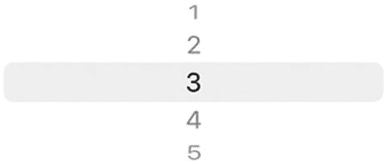
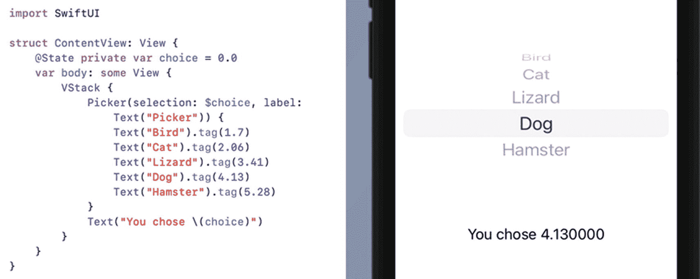
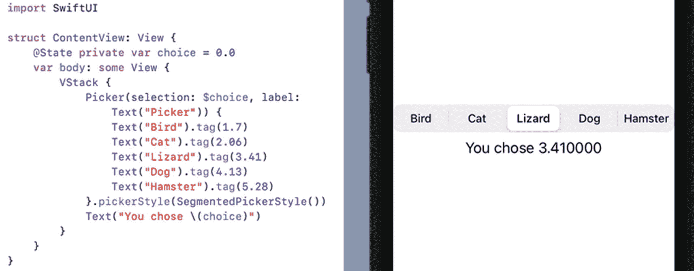
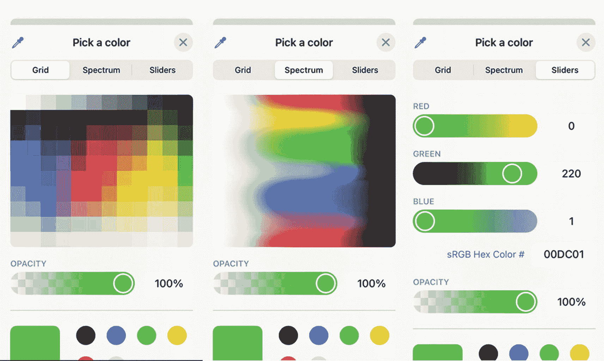
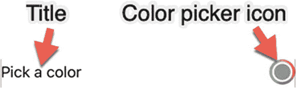
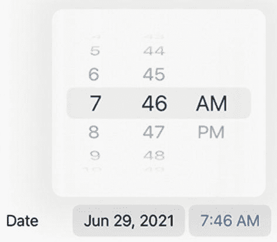
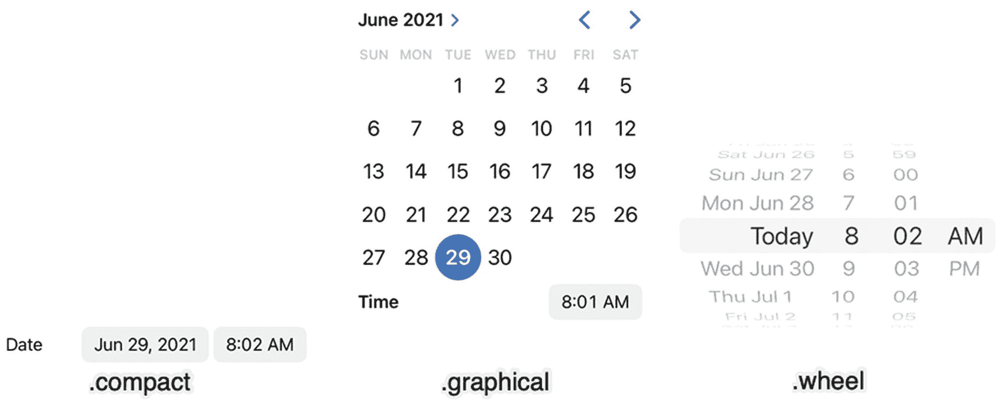
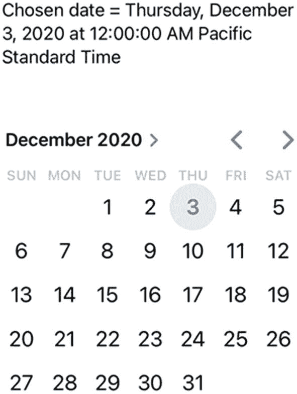

# 8. 使用选择器限制选择

`Text` 字段非常适合让用户输入任意类型的信息，例如姓名或问题的简短答案。问题在于，如果用户有输入任何内容的自由，他们可能会意外（或故意）输入无效数据。

例如，如果一个`Text` 字段要求输入地址，你希望用户能够自由地输入任何内容。然而，如果一个`Text` 字段要求输入州、语言或性别，你就不希望用户输入“狗”、“1258dke3”或“我在找鞋子”，因为这些都不是有效输入，并且很可能导致程序崩溃。

一种解决方案是让用户输入任意数据，然后编写 Swift 代码来验证输入是否有效。不幸的是，这可能需要花费大量时间，并且仍然可能不准确。一个好得多的解决方案是，当只有少数几个可接受的选项时，最好将用户限制在有限选项范围内进行选择。

`Picker`s 会显示多个选项，并让用户通过点击选择一个选项。由于所有选项都是有效的，`Picker`s 确保用户只能输入有效数据。普通的`Picker` 适用于让用户从一系列文本选项中进行选择。对于选择颜色或日期，SwiftUI 也提供了专门的`Color` 选择器和`Date` 选择器。

`Date` 选择器甚至允许你定义有效的日期范围。`Picker`s 的全部目的就是确保用户在任何时候都只能向程序中输入有效数据。

## 使用选择器

一个`Picker` 会显示由多个`Text` 视图定义的选项列表。尽管`Picker` 使用文本字符串来显示可用选项，但用户选择的任何选项实际上都可以代表任何值，例如字符串、十进制数、整数或由枚举定义的值。

要创建一个`Picker`，请使用多个`Text` 视图来显示选项，并为每个选项附加一个 `.tag` 修饰符。`.tag` 修饰符定义了用户选择的实际值，例如

```
Picker(selection: $choice, label: Text("Picker")) {
    Text("1").tag("one")
    Text("2").tag("two")
    Text("3").tag("three")
    Text("4").tag("four")
    Text("5").tag("five")
}
```

在这个例子中，可用选项是数字，但当用户选择一个数字时，实际的选择会存储为字符串，例如“three”或“five”，如图 8-1 所示。



图 8-1

`Picker` 使用`Text` 视图在用户界面上显示选项

在`Text` 视图上的 `.tag` 修饰符可以包含任何数据类型，但同一`Picker` 内部的所有 `.tag` 修饰符必须是与它链接的状态变量相匹配的相同数据类型。以下 Swift 代码定义了一个`Picker`，其中多个`Text` 视图显示诸如“Cat”或“Bird”之类的单词，但 `.tag` 修饰符存储的是整数，例如 0 或 2：

```
Picker(selection: $choice, label: Text("Picker")) {
    Text("Bird").tag(1)
    Text("Cat").tag(2)
    Text("Lizard").tag(3)
    Text("Dog").tag(4)
    Text("Hamster").tag(5)
}
```

因为 `.tag` 修饰符包含整数，所以 `choice` 状态变量现在需要存储 `Int` 数据类型，例如

```
@State private var choice = 0
```

要了解`Picker` 的工作原理，请按以下步骤操作：

1. 创建一个新的 SwiftUI iOS App 项目，并为其命名，例如“Picker”。
2. 在导航窗格中单击 `ContentView` 文件。
3. 在 `struct ContentView: View` 行下方添加以下状态变量：

```
struct ContentView: View {
    @State private var choice = 0
```

这将创建一个初始设置为 0 的状态变量，它是一个整数，因此 `choice` 状态变量被定义为保存 `Int` 数据类型。

4. 创建一个 `VStack`，并在 `var body: some View` 行内部创建一个 `Picker` 和一个 `Text` 视图：

```
var body: some View {
    VStack {
        Picker(selection: $choice, label: Text("Picker")) {
            Text("Bird").tag(1)
            Text("Cat").tag(2)
            Text("Lizard").tag(3)
            Text("Dog").tag(4)
            Text("Hamster").tag(5)
        }
        Text("You chose \(choice)")
    }
}
```

`ContentView` 文件中的完整代码应如下所示：

```
import SwiftUI

struct ContentView: View {
    @State private var choice = 0
    var body: some View {
        VStack {
            Picker(selection: $choice, label: Text("Picker")) {
                Text("Bird").tag(1)
                Text("Cat").tag(2)
                Text("Lizard").tag(3)
                Text("Dog").tag(4)
                Text("Hamster").tag(5)
            }
            Text("You chose \(choice)")
        }
    }
}

struct ContentView_Previews: PreviewProvider {
    static var previews: some View {
        ContentView()
    }
}
```

5. 在画布窗格中单击“实时预览”图标。
6. 在 `Picker` 中选择不同的选项。注意，每次选择不同的选项时，`Text` 视图都会显示“You chose __”，其中 __ 是附加到用户选择的`Text` 视图上的 `.tag` 值。
7. 按如下方式更改状态变量，以保存 `Double` 数据类型：

```
@State private var choice = 0.0
```

由于此 `choice` 状态变量的初始值为 0.0，是一个十进制数，因此 Swift 推断 `choice` 变量现在只能保存 `Double` 数据类型。

8. 按如下方式更改 `Picker` 中的 `.tag` 修饰符：

```
Picker(selection: $choice, label: Text("Picker")) {
    Text("Bird").tag(1.7)
    Text("Cat").tag(2.06)
    Text("Lizard").tag(3.41)
    Text("Dog").tag(4.13)
    Text("Hamster").tag(5.28)
}
```

因为 `choice` 状态变量已被重新定义为保存 `Double` 数据类型，所以 `.tag` 修饰符的值现在也必须全部表示 `Double` 数据类型。


## 使用选择器



**图 8-2** – 一个 `Picker` 视图在其 `.tag` 修饰符中使用 `Double` 值

1. 点击画布面板中的**实时预览**图标。
2. 在 `Picker` 中选择不同选项。请注意，每次选择不同选项时，`Text` 视图会显示“你选择了 __”，其中 `__` 是 `.tag` 值（以 `Double` 值表示），如图 8-2 所示。

由于 `"choice"` 这个 `State` 变量已被重定义为保存 `Double` 数据类型，因此 `.tag` 修饰符的值现在也必须全部表示为 `Double` 数据类型。

请回顾第 6 章的内容，你只需为 `Picker` 视图添加 `.pickerStyle(SegmentedPickerStyle())` 修饰符，即可将其转换为分段控件，如图 8-3 所示：



**图 8-3** – 以分段控件形式显示的 `Picker` 视图

```
Picker(selection: $choice, label: Text("Picker")) {
    Text("Bird").tag(1.7)
    Text("Cat").tag(2.06)
    Text("Lizard").tag(3.41)
    Text("Dog").tag(4.13)
    Text("Hamster").tag(5.28)
}.pickerStyle(SegmentedPickerStyle())
```

## 使用 `ColorPicker`

普通的 `Picker` 可以让你选择在 `Text` 视图中显示的不同选项。但是，如果你希望用户选择一种特定的颜色该怎么办？你可以在 `Picker` 中列出几种颜色，但如果用户想选择自定义颜色呢？这时就可以使用 `ColorPicker` 了。

`ColorPicker` 允许用户从网格、色谱或红绿蓝滑块中选择标准颜色（红色、蓝色、绿色、黄色等）或自定义颜色，如图 8-4 所示。



**图 8-4** – `ColorPicker` 提供了三种不同的自定义颜色选择方式

要创建一个 `ColorPicker`，你首先需要创建一个 `State` 变量来保存 `Color` 数据类型，例如：

```
@State var myColor = Color.red
```

然后，你可以通过定义一个描述性标题，并链接到代表 `Color` 的 `State` 变量来创建 `ColorPicker`，如下所示：

```
ColorPicker("Pick a color", selection: $myColor)
```

要了解 `ColorPicker` 的工作原理，请按以下步骤操作：

1. 创建一个新的 SwiftUI iOS 应用项目，并为其指定任意名称，例如“ColorPicker”。
2. 点击导航面板中的 `ContentView` 文件。
3. 在 `struct ContentView: View` 行下方添加以下 `State` 变量：
4. 创建一个 `VStack`，并在其中放置一个矩形。由于矩形会扩展至填满整个屏幕，请务必为其添加 `.frame` 修饰符，并使用之前定义的 `State` 变量设置其 `.foregroundColor`：

```
struct ContentView: View {
    @State var myColor = Color.gray
```

5. 在 `Rectangle()` 下方，定义一个链接或绑定到 `State` 变量的 `ColorPicker`：

```
var body: some View {
    VStack {
        Rectangle()
            .frame(width: 200, height: 150)
            .foregroundColor(myColor)
    }
}
```

```
ColorPicker("Pick a color", selection: $myColor)
```

完整的 `ContentView` 文件应如下所示：



**图 8-5** – `ColorPicker` 图标

6. 点击画布面板中的**实时预览**图标。请注意，由于 `State` 变量 `myColor` 的初始值被设为灰色，矩形最初会显示为灰色。
7. 点击 `ColorPicker` 图标（如图 8-5 所示），以显示不同的颜色选项（参见图 8-4）。

```
import SwiftUI

struct ContentView: View {
    @State var myColor = Color.gray

    var body: some View {
        VStack {
            Rectangle()
                .frame(width: 200, height: 150)
                .foregroundColor(myColor)
            ColorPicker("Pick a color", selection: $myColor)
        }
    }
}

struct ContentView_Previews: PreviewProvider {
    static var previews: some View {
        ContentView()
    }
}
```

8. 点击一种颜色，然后点击 `ColorPicker` 对话框右上角的关闭 (X) 图标将其关闭。请注意，矩形现在会显示你选择的颜色。

## 使用 `DatePicker`

用户需要输入的常见数据类型之一是日期和时间。然而，一个人可能会将日期写为“2023 年 6 月 14 日”，而另一个人可能会将同一日期写为“2023-06-14”。在书写时间时，有人可能会输入“下午 6:45”，而另一个人可能会输入“18:45”。

为了便于用户输入日期和时间，SwiftUI 提供了 `DatePicker`。用户无需手动输入日期或时间，只需点击他们想要的日期或时间即可，如图 8-6 所示。



**图 8-6** – `DatePicker`

要创建一个 `DatePicker`，你只需要定义描述性文本和一个用于存储用户所选日期和/或时间的 `State` 变量，如下所示：

```
DatePicker(selection: $myDate, label: { Text("Date") })
```

### 选择日期选择器样式

默认情况下，`DatePicker` 以用户可选择的字段形式显示日期和时间。选中后，日期或时间会显示用户可选的日期或时间。如果你不喜欢这种默认的紧凑格式，可以使用 `.datePickerStyle()` 修饰符自定义 `DatePicker` 的外观，如图 8-7 所示：



**图 8-7** – `DatePicker` 的不同样式

* `.compact` – 显示日期和时间的默认方式。当用户选择日期时，会像 `.graphical` 样式一样显示一个日历。当用户选择时间时，会像 `.wheel` 样式一样显示不同的时间选项。
* `.graphical` – 以日历形式显示日期，但时间以字段形式显示。当用户选择时间时，会像 `.wheel` 样式一样显示不同的时间选项。
* `.wheel` – 以滚轮形式显示日期和时间。

创建 `DatePicker` 的 Swift 代码只需要添加一个用于存储日期的 `State` 变量，然后使用该 `State` 变量。此外，`DatePicker` 允许你在样式为 `.compact` 时定义显示的文本：

```
@State var myDate = Date.now
DatePicker(selection: $myDate, label: { Text("Date") })
    .datePickerStyle(.graphical)
```

### 显示日期和/或时间

尽管 `DatePicker` 允许用户同时选择日期和时间，但你可能只需要 `DatePicker` 选择日期或时间中的一项。要将 `DatePicker` 限制为仅显示日期或时间，你可以添加 `displayedComponents` 参数，并指定 `[.date]` 或 `[.hourAndMinute]`，如下所示：

```
DatePicker(selection: $myDate, displayedComponents: [.date], label: { Text("Date") })
DatePicker(selection: $myDate, displayedComponents: [.hourAndMinute], label: { Text("Time") })
```


### 限制日期范围

当允许用户选择日期时，你可能希望限制有效日期的列表。例如，如果你正在询问某人的出生日期，那么让 `DatePicker` 允许用户选择如 1737 年 2 月 3 日这样过时的出生日期是没有意义的。

要限制 `DatePicker` 的日期范围，你必须首先定义起始和结束日期范围，例如：

```
let dateRange: ClosedRange = {
    let calendar = Calendar.current
    let startComponents = DateComponents(year: 2022, month: 1, day: 1)
    let endComponents = DateComponents(year: 2022, month: 12, day: 31, hour: 23, minute: 59, second: 59)
    return calendar.date(from: startComponents)!
    ...
    calendar.date(from: endComponents)!
}()
```

注意，闭合区间需要同时定义起始日期和结束日期。用户不能选择早于起始日期的过去日期，也不能选择晚于结束日期的未来日期。

除了闭合区间，你还可以选择部分区间。一种方法是定义一个从特定日期开始的部分区间，例如：

```
let dateRange2: PartialRangeFrom = {
    let calendar = Calendar.current
    let startComponents = DateComponents(year: 2021, month: 1, day: 1)
    return calendar.date(from: startComponents)!...
}()
```

上述区间从 2021 年 1 月 1 日开始，允许 `DatePicker` 选择此起始日期之后的任何日期。另一种定义部分区间的方式是定义一个可以达到但停止于特定日期的区间，例如：

```
let dateRange3: PartialRangeThrough = {
    let calendar = Calendar.current
    let stopComponents = DateComponents(year: 2021, month: 1, day: 1)
    return ...calendar.date(from: stopComponents)!
}()
```

此区间允许 `DatePicker` 选择截止到指定日期（本例中为 2021 年 1 月 1 日）的任何日期。一旦定义了日期区间，你需要将此日期区间添加到 `DatePicker` 中，如下所示：

```
DatePicker(selection: $myDate, in: dateRange, displayedComponents: [.date], label: { Text("Date") })
```

这个 `DatePicker` 使用一个名为 `myDate` 的 `State` 变量，通过 `dateRange` 常量定义有效范围，并且仅显示日期（而非时间）。如果该 `DatePicker` 的样式是 `.compact`，那么它还会在 `DatePicker` 上显示“Date”。

要了解如何使用 `DatePicker`，请遵循以下步骤：

1. 创建一个新的 SwiftUI iOS App 项目，并为其任意命名，例如“DatePicker”。

2. 单击导航面板中的 `ContentView` 文件。

3. 在 `ContentView` 文件中的两个结构体上方添加以下代码行：

4. 在 `_____App` 文件的 `import SwiftUI` 代码行下方添加这一行 `@available(iOS 15, *)`，其中 `_____` 是你的项目名称，例如：

```
@available(iOS 15, *)
```

5. 单击 `ContentView` 文件，然后创建一个 `State` 变量来保存一个日期，如下所示：

```
import SwiftUI
@available(iOS 15, *)
@main
struct DatePickerApp: App {
    var body: some Scene {
        WindowGroup {
            ContentView()
        }
    }
}
```

6. 定义三个日期区间，如下所示：

```
@State var myDate = Date.now
```

7. 创建一个 `VStack` 来容纳一个 `Text` 视图和一个 `DatePicker`，如下所示：

```
let dateRange: ClosedRange = {
    let calendar = Calendar.current
    let startComponents = DateComponents(year: 2021, month: 1, day: 1)
    let endComponents = DateComponents(year: 2021, month: 12, day: 31, hour: 23, minute: 59, second: 59)
    return calendar.date(from: startComponents)!
    ...
    calendar.date(from: endComponents)!
}()
let dateRange2: PartialRangeFrom = {
    let calendar = Calendar.current
    let startComponents = DateComponents(year: 2021, month: 1, day: 1)
    let endComponents = DateComponents(year: 2021, month: 12, day: 31, hour: 23, minute: 59, second: 59)
    return calendar.date(from: endComponents)!...
}()
let dateRange3: PartialRangeThrough = {
    let calendar = Calendar.current
    let startComponents = DateComponents(year: 2021, month: 1, day: 1)
    let endComponents = DateComponents(year: 2021, month: 12, day: 31, hour: 23, minute: 59, second: 59)
    return ...calendar.date(from: startComponents)!
}()
```

```
var body: some View {
    VStack {
        Text("Chosen date = \(myDate)")
            .padding()
        DatePicker(selection: $myDate, in: dateRange3, displayedComponents: [.date], label: { Text("Date") })
            .datePickerStyle(.graphical)
            .padding()
    }
}
```

完整的 `ContentView` 文件应该如下所示：



**图 8-8** – 显示 `Text` 视图和 `DatePicker` 的用户界面

8. 单击画布中的实时预览图标，并单击任意日期。注意，当你选择一个日期时，它会显示在 `DatePicker` 上方，如图 8-8 所示。

```
import SwiftUI
@available(iOS 15, *)
struct ContentView: View {
    @State var myDate = Date.now
    let dateRange: ClosedRange = {
        let calendar = Calendar.current
        let startComponents = DateComponents(year: 2021, month: 1, day: 1)
        let endComponents = DateComponents(year: 2021, month: 12, day: 31, hour: 23, minute: 59, second: 59)
        return calendar.date(from: startComponents)!
        ...
        calendar.date(from: endComponents)!
    }()
    let dateRange2: PartialRangeFrom = {
        let calendar = Calendar.current
        let startComponents = DateComponents(year: 2021, month: 1, day: 1)
        let endComponents = DateComponents(year: 2021, month: 12, day: 31, hour: 23, minute: 59, second: 59)
        return calendar.date(from: endComponents)!...
    }()
    let dateRange3: PartialRangeThrough = {
        let calendar = Calendar.current
        let startComponents = DateComponents(year: 2021, month: 1, day: 1)
        let endComponents = DateComponents(year: 2021, month: 12, day: 31, hour: 23, minute: 59, second: 59)
        return ...calendar.date(from: startComponents)!
    }()
    var body: some View {
        VStack {
            Text("Chosen date = \(myDate)")
                .padding()
            DatePicker(selection: $myDate, in: dateRange3, displayedComponents: [.date], label: { Text("Date") })
                .datePickerStyle(.graphical)
                .padding()
        }
    }
}
@available(iOS 15, *)
struct ContentView_Previews: PreviewProvider {
    static var previews: some View {
        ContentView()
    }
}
```

9. 尝试更改 `DatePicker` 样式（`.compact`、`.graphical`、`.wheel`），同时选择不同的日期区间（`dateRange`、`dateRange2`、`dateRange3`）。


### 格式化日期

默认情况下，SwiftUI 会显示包含大量细节的日期，而这些细节你可能并不需要展示。要以特定格式显示日期，你可以使用 `DateFormatter`，如下所示：

```
let formatter = DateFormatter()
```

然后，你可以定义一种样式来显示日期和时间，例如以下之一：

| 样式 | 日期 | 时间 |
| --- | --- | --- |
| `.short` | 22/2/15 | 下午 7:15 |
| `.medium` | 2022 年 2 月 15 日 | 下午 7:15:29 |
| `.long` | 2022 年 2 月 15 日 | 下午 7:15:29 CST |
| `.full` | 2022 年 2 月 15 日星期二 | 中央标准时间下午 7:15:29 |

**注意**

区域设置可能会改变日期的实际显示方式，例如 “15 June 2021” 或 “June 15, 2021”。

要使用日期样式，你必须像这样定义格式化器的 `dateStyle` 属性：

```
formatter.dateStyle = .medium
```

要使用时间样式，你必须像这样定义格式化器的 `timeStyle` 属性：

```
formatter.timeStyle = .short
```

一旦你创建了一个 `DateFormatter` 并定义了它的 `.dateStyle` 和 `.timeStyle` 属性，最后一步就是使用该格式化器及其 `dateStyle` 来格式化日期，例如：

```
formatter.string(from: myDate)
```

要了解如何格式化从日期选择器中选择的日期，请遵循以下步骤：

1. 创建一个新的 SwiftUI iOS App 项目，并为其取任意名称，例如 “DatePickerFormat”。
2. 在导航窗格中点击 `ContentView` 文件。
3. 在 `ContentView` 文件中的两个结构体上方添加以下代码行：
   在 `_____App` 文件的 `import SwiftUI` 行下方添加 `@available(iOS 15, *)` 这行代码，其中 `_____` 是你的项目名称，例如：

   ```
   @available(iOS 15, *)
   ```

4. 点击 `ContentView` 文件，并创建一个用于存储日期的状态变量，如下所示：

   ```
   import SwiftUI
   @available(iOS 15, *)
   @main
   struct DatePickerFormatApp: App {
       var body: some Scene {
           WindowGroup {
               ContentView()
           }
       }
   }
   ```

5. 在状态变量下方输入以下内容以定义 `DateFormatter`：

   ```
   @State var myDate = Date.now
   ```

6. 在 `var body: some View` 代码行内添加一个 `VStack`，并在 `VStack` 内部创建一个日期选择器，如下所示：

   ```
   let formatter = DateFormatter()
   ```

   ```
   VStack {
       Text("所选日期 = \(formatter.string(from: myDate))")
           .padding()
       DatePicker(selection: $myDate, label: { Text("日期") })
   }.onAppear() {
       formatter.dateStyle = .full
       formatter.timeStyle = .full
   }
   ```

   `Text` 视图显示 “所选日期 = ” 后跟存储在 `myDate` 状态变量中的日期。请注意，`formatter.string` 命令定义了该日期的实际显示方式。

   日期选择器将所选日期存储在 `myDate` 状态变量中。然后，`.onAppear` 修饰符会在 `VStack` 定义的用户界面每次出现时运行 Swift 代码。在该 `.onAppear` 修饰符内部，有一行代码将 `formatter` 的 `.dateStyle` 定义为 `.full`。如果你将 `.full` 更改为 `.short`、`.medium` 或 `.long`，你可以看到 `Text` 视图中日期的格式如何变化。

7. 点击画布窗格中的实时预览图标，然后点击任意日期。请注意，当你选择一个日期时，它会显示在日期选择器上方，并使用 `.onAppear` 修饰符中定义的日期和时间样式，例如 `.full` 或 `.short`。

## 总结

文本字段可以方便用户输入数据。不幸的是，用户可以在文本字段中输入任何内容，甚至完全无意义的数据。

为了将用户限制在有效的选择范围内，你可以使用选择器。选择器可以提供所有有效选项的列表。这样，用户就不可能通过选择器输入无效数据。

创建选择器时，你可以使用 `.tag` 属性为用户在选择器中的选择分配一个特定值。`.tag` 属性可以持有任何类型的数据，例如整数、小数或字符串。所有 `.tag` 属性必须持有相同的数据类型。

另一种显示有效选项列表的方式是通过颜色选择器。使用颜色选择器，用户可以选择标准颜色，如红、绿、蓝，或创建自定义颜色。

对于选择日期，SwiftUI 提供了日期选择器。你可以格式化日期的显示方式，例如 “22/6/15” 或 “2022 年 6 月 15 日”。日期选择器还可以以三种不同的样式（`.compact`、`.graphical` 或 `.wheel`）显示。这样，你可以让日期选择器以最适合你应用的方式呈现。通过使用选择器，你可以让用户轻松输入仅有效的数据。

