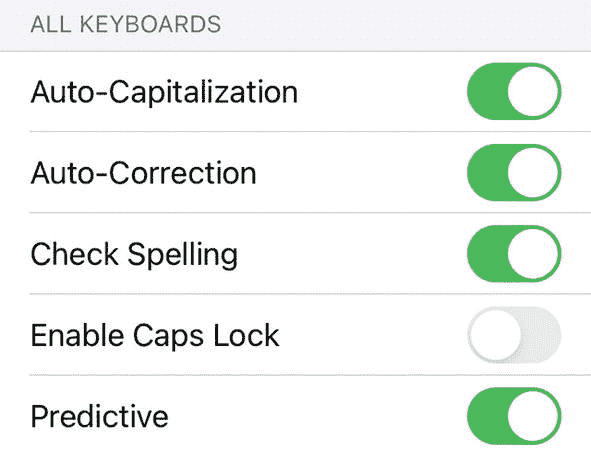
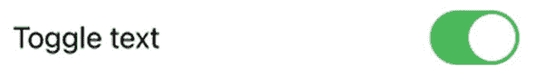
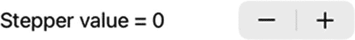
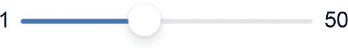

# 9. 使用开关、步进器和滑块限制选择

理想情况下，你希望限制用户仅选择有效选项。这可以防止用户输入无效数据，例如拼写出数字（如 “thirty-seven”）而不是输入数字（37）。另外三种限制用户仅选择有效数据的方式是开关、步进器和滑块。

开关为用户提供恰好两个选项，例如开或关、是或否、真或假。因为开关只提供两个选项，它表示一个布尔值（真或假）。

步进器将用户输入限制在有效数据范围内。步进器显示减号/加号图标，用户可以点击它以固定增量递增或递减一个值。通过使用步进器，用户无需输入特定数字即可定义值。

滑块也将用户输入限制在有效数据范围内。滑块允许用户通过拖拽来输入特定值，无需任何输入。步进器和滑块都可以定义最小值和最大值，以限制用户仅选择有效的数值。对许多人来说，点击或拖拽选择值比输入数字本身更容易。步进器和滑块都表示一个 `Double` 值（小数）。

开关、滑块和步进器的全部目的在于确保用户在任何时候都只能向程序输入有效数据。


## 使用开关

如果你查看 iPhone 或 iPad 的设置，你会看到一系列可以开启或关闭的选项，如图 9-1 所示。



图 9-1

`Toggle` 的典型用途

要创建一个 `Toggle`，你需要定义显示在 `Toggle` 旁边的文本，并将一个 `State` 变量链接或绑定到 `Toggle`，例如：

```
Toggle(isOn: $settingValue) {
Text("开关文本")
}
```

在这个示例中，`Toggle` 会改变名为 `settingValue` 的 `State` 变量的值，该变量应定义为一个 `Boolean` 类型，如下所示：

```
@State var settingValue = true
```

然后，`Text` 视图会在 `Toggle` 本身旁边显示“开关文本”，如图 9-2 所示。



图 9-2

典型 `Toggle` 的外观

要了解 `Toggle` 的工作原理，请按照以下步骤操作：

1. 创建一个新的 SwiftUI iOS App 项目，并给它任意你喜欢的名称，例如“Toggle”。

2. 在导航器面板中点击 `ContentView` 文件。

3. 在 `struct ContentView: View` 这行下方添加以下 `State` 变量：

4. 创建一个 `VStack` 并在其中放入一个矩形。由于矩形会扩展以填满整个屏幕，请确保为其添加 `.frame` 修饰符，并使用之前定义的 `State` 变量来定义其 `.foregroundColor`：

```
struct ContentView: View {
@State var myToggle = true
```

5. 在 `Rectangle` 及其修饰符下方添加 `Toggle`，如下所示：

```
var body: some View {
VStack {
Rectangle()
.frame(width: 200, height: 150)
.foregroundColor(myToggle ? .orange : .green)
}
}
```

```
Toggle(myToggle ? "橙色" : "绿色", isOn: $myToggle)
```

完整的 `ContentView` 文件应如下所示：

6. 点击画布面板中的 Live Preview 图标。请注意，由于 `State` 变量 `myToggle` 为 `true`，矩形初始显示为橙色。

7. 点击 `Toggle`。请注意，每次点击 `Toggle` 时，矩形的颜色会在橙色和绿色之间切换，并且 `Toggle` 上的文本也会在“橙色”和“绿色”之间切换。

```
import SwiftUI
struct ContentView: View {
@State var myToggle = true
var body: some View {
VStack {
Rectangle()
.frame(width: 200, height: 150)
.foregroundColor(myToggle ? .orange : .green)
Toggle(myToggle ? "橙色" : "绿色", isOn: $myToggle)
}
}
}
struct ContentView_Previews: PreviewProvider {
static var previews: some View {
ContentView()
}
}
```

## 使用步进器

当你希望用户输入数值数据时，你可能希望限制可接受数据的范围。毕竟，如果你询问用户的年龄，你不希望看到 `–23` 或 `938478`，因为这两个值对于某人的年龄来说显然都是不可能的。为了让用户能够在可接受的范围内轻松输入数值数据，你可以使用 `Stepper`。

`Stepper` 存储一个值，用户可以按固定的增量（例如 `1` 或 `2.5`）来增加该值。你可以定义步进器可以表示的最小值和最大值，例如 `1` 到 `10` 之间的范围。此外，你还可以定义步进器是否循环。循环意味着如果你持续增加步进器超出其最大值，它将回到最小值。同样，如果你持续减少步进器低于其最小值，它将跳转到最大值。这可以让用户轻松选择不同的值，而无需从一个极端值一步步地增加到另一个极端值。

要了解步进器的工作原理，请按照以下步骤操作：

1. 创建一个新的 SwiftUI iOS App 项目，并给它任意你喜欢的名称，例如“Stepper”。

2. 在导航器面板中点击 `ContentView` 文件。

3. 在 `struct ContentView: View` 这行下方添加以下 `State` 变量：

4. 在 `var body: some View` 内部创建一个 `VStack`，并添加一个 `Stepper`，如下所示：

```
struct ContentView: View {
@State var newValue = 0
```

```
var body: some View {
VStack {
Stepper(value: $newValue) {
Text("步进器值 = \(newValue)")
}.padding()
}
}
```

这定义了一个简单的 `Stepper`，它可以表示任何值，并以 `1` 为单位增加或减少其值，如图 9-3 所示。



图 9-3

一个简单的 `Stepper`

完整的 `ContentView` 文件应如下所示：

5. 点击画布面板中的 Live Preview 图标来运行你的应用。

6. 点击 `Stepper` 上的 `–` 和 `+` 图标来减少或增加其值。

```
import SwiftUI
struct ContentView: View {
@State var newValue = 0
var body: some View {
VStack {
Stepper(value: $newValue) {
Text("步进器值 = \(newValue)")
}.padding()
}
}
}
struct ContentView_Previews: PreviewProvider {
static var previews: some View {
ContentView()
}
}
```

### 定义步进器的范围

在许多情况下，你希望定义 `Stepper` 可以表示的有效值范围，例如从 `1` 到 `25`。要为 `Stepper` 定义一个范围，你需要在 `in:` 参数中列出该范围，如下所示：

```
Stepper(value: $newValue, in: 1...10) {
Text("步进器值 = \(newValue)")
}.padding()
```

要了解如何定义 `Stepper` 可以表示的值范围，请添加上述代码，使完整的 `ContentView` 文件如下所示：

```
import SwiftUI
struct ContentView: View {
@State var newValue = 0
var body: some View {
VStack {
// 基础步进器
Stepper(value: $newValue) {
Text("步进器值 = \(newValue)")
}.padding()
// 带范围的步进器
Stepper(value: $newValue, in: 1...10) {
Text("步进器值 = \(newValue)")
}.padding()
}
}
}
struct ContentView_Previews: PreviewProvider {
static var previews: some View {
ContentView()
}
}
```

点击画布面板上的 Live Preview 图标，然后点击底部的 `Stepper`。请注意，由于其范围限制在 `1` 到 `10` 之间，点击底部 `Stepper` 上的 `–` 和 `+` 图标不会将 `Stepper` 的值减少到 `1` 以下或增加到 `10` 以上。


#### 在步进器中定义增量/减量值

通常，`Stepper`（步进器）以 1 为单位增加或减少其值。有时，你可能希望以 1 以外的值（例如 2 或 5）进行增减。要为 `Stepper` 定义一个用于增减的整数值，你需要为 `step:` 参数定义一个整数值，如下所示：

```
Stepper(value: $newValue, in: 1...10, step: 2) {
    Text("Stepper value = \(newValue)")
}.padding()
```

点击画布面板上的实时预览图标，然后点击底部的 `Stepper`。请注意，由于其范围被限制在 1 到 10 之间，点击底部 `Stepper` 上的 – 和 + 图标不会将其值减小到 1 以下或增大到 10 以上。然而，点击底部 `Stepper` 上的 – 和 + 图标会以 2 为单位增减该 `Stepper` 的值。

如果你希望为 `step:` 参数定义一个十进制值，你需要确保 `Stepper` 中使用的每个值都是十进制值，例如：

```
Stepper(value: $decimalValue,
        in: 1.0...10.0,
        step: 0.25) {
    Text("Stepper value = \(decimalValue)")
}.padding()
```

在上述 `Stepper` 定义中，范围从 1.0（不仅仅是 1）到 10.0（包含，不仅仅是 10）。然后 `step:` 参数被定义为 0.25。最后，`State` 变量（`decimalValue`）也必须被定义为十进制值（`Double` 数据类型），如下所示：

```
@State var decimalValue: Double = 0
```

整个 `ContentView` 文件应如下所示：

```
import SwiftUI

struct ContentView: View {
    @State var newValue = 0
    @State var decimalValue: Double = 0

    var body: some View {
        VStack {
            // 基础步进器
            Stepper(value: $newValue) {
                Text("Stepper value = \(newValue)")
            }.padding()

            // 限定范围的步进器
            Stepper(value: $newValue, in: 1...10) {
                Text("Stepper value = \(newValue)")
            }.padding()

            // 带增量值的步进器
            Stepper(value: $newValue, in: 1...10, step: 2) {
                Text("Stepper value = \(newValue)")
            }.padding()

            // 带十进制增量值的步进器
            Stepper(value: $decimalValue,
                    in: 1.0...10.0,
                    step: 0.25) {
                Text("Stepper value = \(decimalValue)")
            }.padding()
        }
    }
}

struct ContentView_Previews: PreviewProvider {
    static var previews: some View {
        ContentView()
    }
}
```

点击画布面板上的实时预览图标，然后点击底部的 `Stepper`。请注意，由于其范围被限制在 1.0 到 10.0 之间，点击底部 `Stepper` 上的 – 和 + 图标不会将其值减小到 1.0 以下或增大到 10.0 以上。然而，点击底部 `Stepper` 上的 – 和 + 图标会以 0.25 为单位增减该 `Stepper` 的值。

## 使用滑块

与 `Stepper` 类似，`Slider`（滑块）允许用户在不输入特定数字的情况下选择数值。`Stepper` 强制用户以固定量增减数值，而 `Slider` 则通过简单的滑动改变滑块位置，使用户能够快速在值域范围内进行选择。这使得 `Slider` 比 `Stepper` 更适合让用户从大范围数值中进行选择。

要了解 `Slider` 的工作方式，请遵循以下步骤：

1.  创建一个新的 SwiftUI iOS 应用项目，并为其随意命名，例如“Slider”。
2.  在导航器面板中点击 `ContentView` 文件。
3.  在 `struct ContentView: View` 一行下方添加以下 `State` 变量：

```
@State var sliderValue = 0.0
```

4.  在 `var body: some View` 内部创建一个 `VStack`，并像这样添加一个 `Text` 和一个 `Slider`：

```
var body: some View {
    VStack (spacing: 28){
        Text("Slider value = \(sliderValue)")
        Slider(value: $sliderValue)
    }
}
```

5.  点击画布面板中的实时预览图标，并左右拖动滑块。请注意，此 `Slider` 的值范围是从 0 到 1，作为 `Double` 值显示，即显示十进制数值。

### 更改滑块的颜色

默认情况下，当您向右拖动滑块时，`Slider` 显示为蓝色。如果您想更改该颜色，可以使用 `.accentColor` 修饰符，如下所示：

```
Slider(value: $sliderValue)
    .accentColor(.red)
```

### 为滑块定义范围

默认情况下，`Slider` 的值范围是从 0 到 1。然而，您可能希望为 `Slider` 定义不同的范围，例如：

```
Slider(value: $sliderValue, in: 1...50)
```

这将 `Slider` 的最小值定义为 1，最大值定义为 50。请记住，这些值实际上是十进制值，例如 1.0 到 50.0。

### 为滑块定义步进增量

如果 `Slider` 的范围大于 1，拖动滑块将使其以 1 为单位增减。要为 `Slider` 定义不同的增减值，您需要定义一个 `step:` 参数，例如：

```
Slider(value: $sliderValue, in: 1...50, step: 4)
```

这定义了 `Slider` 按 4 来改变值，例如从 1 到 5 再到 9。

### 在滑块上显示最小值和最大值标签

为了让 `Slider` 更易于理解，您可以在 `Slider` 的两端显示最小值和最大值标签。这样，您可以明确显示 `Slider` 的最小值和最大值可能是什么，例如：

```
Slider(value: $sliderValue, in: 1...50, step: 4) {
    Text("Slider")
} minimumValueLabel: {
    Text("1")
} maximumValueLabel: {
    Text("50")
}
```

这定义了一个 `Slider`，其最左侧显示 1，最右侧显示 50，如图 9-4 所示。



**图 9-4** 在滑块上显示最小值和最大值标签

> **注意：** `minimumValueLabel` 和 `maximumValueLabel` 仅在 iOS 15.0 或更高版本中可用。

要了解所有这些不同的 `Slider` 如何工作，请如下所示编辑 `ContentView` 文件：

```
import SwiftUI

@available(iOS 15.0, *)
struct ContentView: View {
    @State var sliderValue = 0.0

    var body: some View {
        VStack (spacing: 28){
            Text("Slider value = \(sliderValue)")
            Slider(value: $sliderValue)
                .padding()
            Slider(value: $sliderValue, in: 1...50)
                .padding()
            Slider(value: $sliderValue, in: 1...50, step: 4)
                .padding()
            Slider(value: $sliderValue, in: 1...50, step: 4) {
                Text("Slider")
            } minimumValueLabel: {
                Text("1")
            } maximumValueLabel: {
                Text("50")
            }.padding()
        }
    }
}

@available(iOS 15.0, *)
struct ContentView_Previews: PreviewProvider {
    static var previews: some View {
        ContentView()
    }
}
```

确保你还在 `____App` 文件中添加了 `@available(iOS 15.0, *)` 一行，例如：

```
import SwiftUI

@available(iOS 15.0, *)
@main
struct Slider_Chapter_9App: App {
    var body: some Scene {
        WindowGroup {
            ContentView()
        }
    }
}
```

当你运行这个项目时，顶部的 `Slider` 值范围是从 0 到 1。这意味着当你拖动其他 `Slider` 时，顶部的 `Slider` 会立即移动到最右侧。这是因为顶部的 `Slider` 最大只能为 1，而其他滑块的值范围是从 1 到 50。所以拖动其他 `Slider` 总是会将顶部的 `Slider` 固定到最右侧，以表示其能表示的最大值 1。

## 总结

当你的应用需要用户输入数值数据时，文本字段虽然可行，但可能比较笨拙，尤其是当你只想接受有限范围的数值时。为了便于输入数值数据，请使用 `Stepper` 或 `Slider`。

`Stepper` 和 `Slider` 都可以定义最小值和最大值，这样用户就无法输入低于最小值或高于最大值的数值数据。`Stepper` 和 `Slider` 都允许你定义除 1 以外的不同增减值。

`Stepper` 占用的空间较小，但 `Slider` 通过简单的左右拖动滑块，能更方便地从一个极端值快速切换到另一个极端值。

通过使用 `Stepper` 和 `Slider`，你可以让用户轻松输入数值数据。通过使用 `Toggle`（开关），你可以让用户轻松地在恰好两个选项之间进行选择，例如开/关或是/否。`Stepper`、`Slider` 和 `Toggle` 只是让用户更容易仅输入有效数据。


