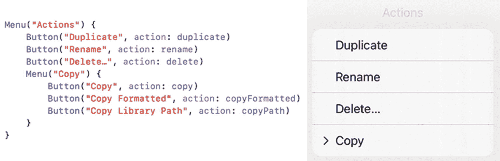
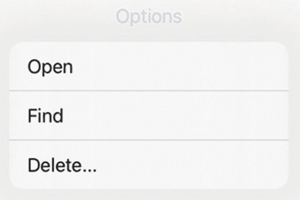
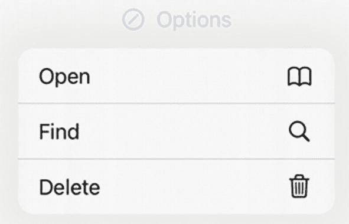
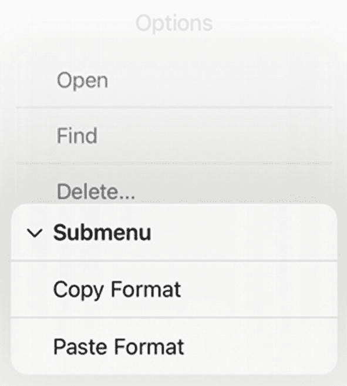
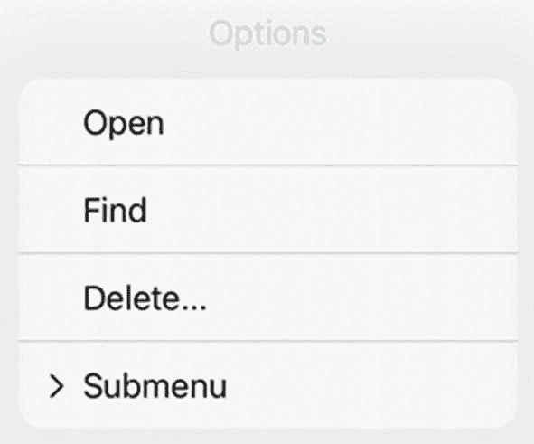

# 10. 通过链接和菜单提供选项

曾几何时，应用程序只需按钮就能让用户选择命令。随着 iPhone 和 iPad 应用日益复杂，为用户提供其他选择命令方式的需求也随之增长。两种常见的用于展示命令供用户选择的组件是 **链接**（Link）和 **菜单**（Menu）。

`Link` 类似于 `Button`，不同之处在于它会打开浏览器来显示网站内容。`Menu` 让你可以显示一个选项列表，其中也可以包含子菜单，如图 10-1 所示。



*图 10-1* —— 菜单显示包含子菜单在内的选项列表

## 使用链接

`Link` 提供了一种便捷的方式，让用户能够从应用内部访问网站。一个 `Link` 定义了一个网站地址，例如：

```
Link(destination: URL(string: "https://www.apple.com")! ) {
    Text("Apple")
}
```

`Text` 视图定义了链接上显示的文本。你可以对这个 `Text` 视图应用任何你想要的修饰符，例如定义字体或背景颜色。

`Link` 必须将 `destination` 定义为一个 `URL`。确保网站地址准确无误的一种方法是访问目标网站，然后从浏览器中复制其地址，再粘贴到你的 Swift 代码中。

> **注意：** 要测试 `Link` 能否成功加载网站地址，你需要在模拟器或实际的 iOS 设备上运行项目。画布窗格（Canvas pane）无法像模拟器或 iOS 设备那样打开 Safari 浏览器。

## 使用菜单

有时候，你可能想为用户提供多个选择。在屏幕上塞满多个 `Button` 会显得笨拙，就连分段控件也可能过于局限。当你需要在有限的空间内显示多个选项时，就可以使用 `Menu`。

`Menu` 在用户界面上表现为一个 `Button`。当用户点击它时，`Menu` 会显示一个选项列表（见图 10-1）。然后用户可以选择一个选项，或打开另一个子菜单来查看更多选项。菜单使得在有限的空间内隐藏多个选项变得容易。

最简单的 `Menu` 由一个标题和一个由 `Button` 定义的选项列表组成，如下所示：

```
Menu("Options") {
    Button("Open ", action: openFile)
    Button("Find", action: findFile)
    Button("Delete...", action: deleteFile)
}
```

上述代码会在屏幕上显示一个显示着 "Options" 字样的 `Menu`。当用户点击 "Options" 时，会弹出一个菜单，列出三个选项：Open、Find 和 Delete...，如图 10-2 所示。



*图 10-2* —— 菜单在下拉列表中显示按钮列表

当用户点击某个 `Button` 时，该 `Button` 会调用一个函数，例如 `openFile`、`findFile` 或 `deleteFile`。请注意，这些函数调用并不包含参数列表，例如 `openFile()`。若要了解如何创建一个简单的菜单，请遵循以下步骤：

1. 创建一个新的 SwiftUI iOS 应用项目，并为其命名，例如 "MenuSimple"。
2. 在导航窗格中点击 `ContentView` 文件。
3. 在 `struct ContentView: View` 代码行下方添加以下 `State` 变量：
   - 在 `var body: some View` 代码行下创建一个 `VStack`。
   - 在 `VStack` 内部创建一个 `Text` 视图、`Menu` 和 `Spacer()`，如下所示：

```
struct ContentView: View {
    @State var message = ""
    
    var body: some View {
        VStack {
            Text(message)
                .padding()
            Menu("Options") {
                Button("Open ", action: openFile)
                Button("Find", action: findFile)
                Button("Delete...", action: deleteFile)
            }
            Spacer()
        }
    }
}
```

所有三个 `Button` 都会调用函数来执行操作。因此，我们需要创建函数来使这些 `Button` 生效。

4. 在 `struct ContentView: View` 中最后一个花括号的上方，添加以下三个函数：

```
func openFile() {
    message = "Open chosen"
}
func findFile() {
    message = "Find chosen"
}
func deleteFile() {
    message = "Delete chosen"
}
```

完整的 `ContentView` 文件应如下所示：

5. 点击画布窗格中的“实时预览”图标。
6. 点击模拟 iOS 设备中间的 Options 按钮。会弹出一个菜单，列出由三个 `Button` 视图定义的三个选项：Open、Find 和 Delete...
7. 点击任意选项。请注意，无论你选择哪个选项，它都会在 `Menu` 上方的 `Text` 视图中显示略有不同的消息。

```
import SwiftUI

struct ContentView: View {
    @State var message = ""
    
    var body: some View {
        VStack {
            Text(message)
                .padding()
            Menu("Options") {
                Button("Open ", action: openFile)
                Button("Find", action: findFile)
                Button("Delete...", action: deleteFile)
            }
            Spacer()
        }
    }
    
    func openFile() {
        message = "Open chosen"
    }
    
    func findFile() {
        message = "Find chosen"
    }
    
    func deleteFile() {
        message = "Delete chosen"
    }
}

struct ContentView_Previews: PreviewProvider {
    static var previews: some View {
        ContentView()
    }
}
```

请注意，`Menu` 中的每个 `Button` 都调用由 `action:` 参数定义的函数。除了调用函数，你也可以直接在花括号内包裹一个或多个命令，如下所示：

```
Menu("Options") {
    Button("Open ", action: {
        message = "Open chosen"
    })
    Button("Find", action: {
        message = "Find chosen"
    })
    Button("Delete...", action: {
        message = "Delete chosen"
    })
}
```

### 格式化菜单和按钮上的标题

`Menu` 允许你定义一个看起来像标准 `Button` 的标题。然而，如果你想要格式化标题，还有一种替代方式来定义 `Menu`。除了仅定义要显示为标题的文本外，你还可以定义一个 `label:` 参数，在其中使用 `Text` 或 `Label` 视图，如下所示：

```
Menu {
    Button("Open ", action: {
        message = "Open chosen"
    })
    Button("Find", action: {
        message = "Find chosen"
    })
    Button("Delete...", action: {
        message = "Delete chosen"
    })
} label: {
    Text("Options")
        .font(.largeTitle)
        .foregroundColor(.purple)
        .italic()
}
```

此示例使用 `.largeTitle` 字体、紫色和斜体来显示菜单的标题。除了使用 `Text` 视图，你还可以使用 `Label` 视图来并排显示图标和文本，例如：

```
Menu {
    Button("Open ", action: {
        message = "Open chosen"
    })
    Button("Find", action: {
        message = "Find chosen"
    })
    Button("Delete...", action: {
        message = "Delete chosen"
    })
} label: {
    Label("Options", systemImage: "pencil.circle")
}
```

通过使用 `label:` 参数来定义菜单标题，你可以用多种方式自定义菜单标题。使用上述 `Label` 视图会显示一个带有图标和文本的菜单，如图 10-3 所示。


*图 10-3* —— 标签视图为菜单标题显示图标和文本

你也可以使用 `Label` 视图而不是 `Text` 视图来格式化 `Button` 标题，如下所示：

```
Menu {
    Button(action: {
        message = "Open chosen"
    }) {
        Label("Open", systemImage: "book")
    }
    Button(action: {
        message = "Find chosen"
    }) {
        Label("Find", systemImage: "magnifyingglass")
    }
    Button(action: {
        message = "Delete chosen"
    }) {
        Label("Delete", systemImage: "trash")
    }
} label: {
    Label("Options", systemImage: "pencil.circle")
}
```

上述代码显示的菜单列表如图 10-4 所示。



*图 10-4* —— 使用标签视图在菜单列表中显示按钮


### 添加子菜单

一个`Menu`可以显示由`Button`定义的选项列表。然而，`Menu`也可以显示列出附加相关命令的子菜单，如图 10-5 所示。



**图 10-5** 显示子菜单

要创建子菜单，只需定义另一个`Menu`而不是`Button`。然后在子菜单中包含额外的`Button`，如下所示：

```swift
Menu("选项") {
    Button("打开", action: openFile)
    Button("查找", action: findFile)
    Button("删除...", action: deleteFile)
    Menu("子菜单") {
        Button("复制格式", action: copyFormat)
        Button("粘贴格式", action: pasteFormat)
    }
}
```

**注意** 可以在子菜单中创建子菜单。作为一般规则，建议只使用一级子菜单，否则过多的选项列表可能会让用户感到混乱。

要了解子菜单的工作方式，请按照以下步骤操作：

1. 创建一个新的 SwiftUI iOS 应用项目，并为其指定任意名称，例如`"Submenu"`。
2. 在导航窗格中点击`ContentView`文件。
3. 编辑`ContentView`文件，使其全部内容如下所示：



**图 10-6** `➤`符号标识一个子菜单

4. 在画布窗格上点击实时预览图标。
5. 点击由`Menu`定义的选项。这将显示一个选项列表，其中包括由`➤`符号标识的子菜单，如图 10-6 所示。

```swift
import SwiftUI
struct ContentView: View {
    @State var message = ""
    var body: some View {
        VStack {
            Text(message)
                .padding()
            Menu("选项") {
                Button("打开", action: openFile)
                Button("查找", action: findFile)
                Button("删除...", action: deleteFile)
                Menu("子菜单") {
                    Button("复制格式", action: copyFormat)
                    Button("粘贴格式", action: pasteFormat)
                }
            }
            Spacer()
        }
    }
    func openFile() {
        message = "已选择打开"
    }
    func findFile() {
        message = "已选择查找"
    }
    func deleteFile() {
        message = "已选择删除"
    }
    func copyFormat() {
        message = "已选择复制格式"
    }
    func pasteFormat() {
        message = "已选择粘贴格式"
    }
}
struct ContentView_Previews: PreviewProvider {
    static var previews: some View {
        ContentView()
    }
}
```

6. 点击子菜单，查看出现的额外选项列表。

子菜单可以轻松地将相关选项分组，但由于这些选项最初是隐藏的，请谨慎使用子菜单，以免让用户感到困惑。

## 总结

`Link`和`Menu`是用户界面提供选项供用户选择的两种额外方式。`Link`会打开浏览器并跳转到特定网站。`Menu`则显示由`Button`和其他定义子菜单的`Menu`组成的选项列表。

通过在`Menu`中使用`Label`视图，可以将图标和文本并排组合。通过在`Menu`中使用`Text`视图，可以自定义用户界面中显示的文本外观，例如选择字体或颜色。`Menu`提供了一种在不占用大量屏幕空间的情况下向用户显示多个选项的方法。

