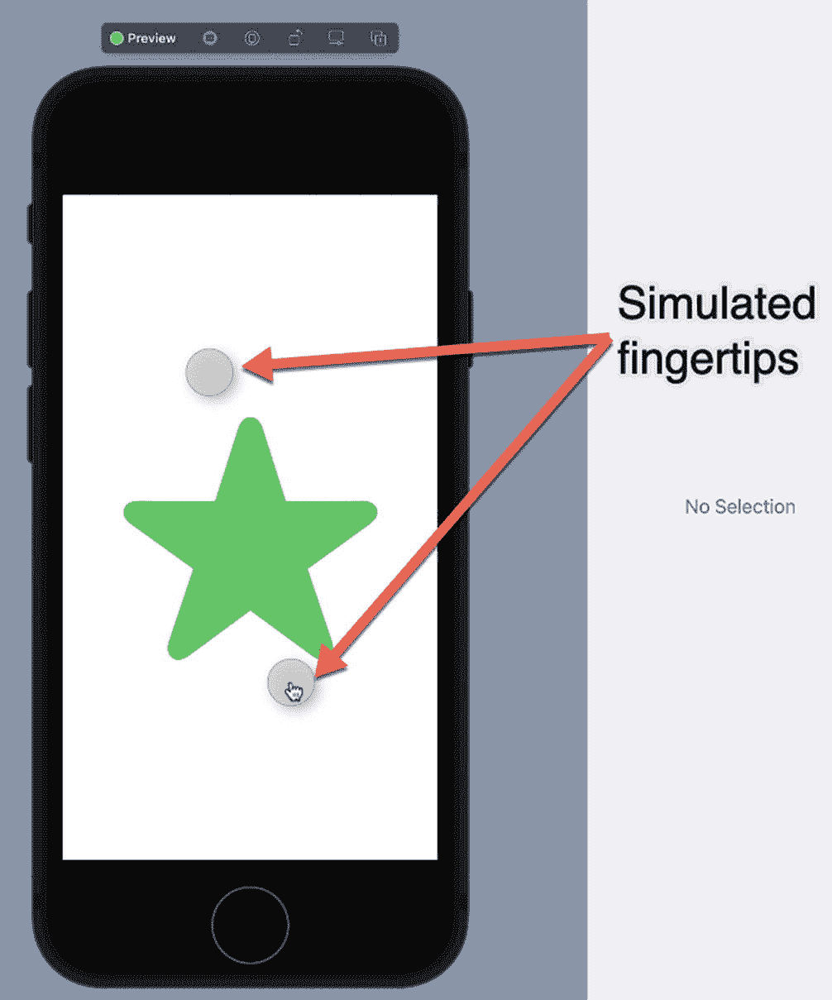
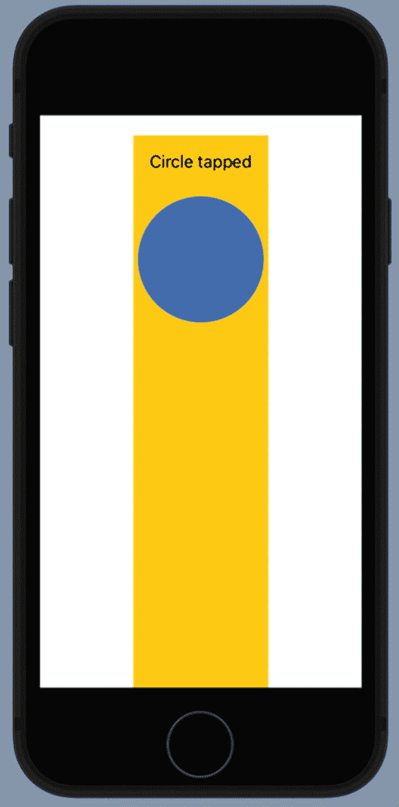

# 11. 触摸手势

允许用户通过`Button`、`Toggle`或`Menu`来控制应用程序很方便，但这些控件都会占用屏幕空间。为了消除用户界面上多余的对象，应用程序还可以检测并响应触摸手势，从而允许直接操作屏幕上显示的项目。

iOS 应用可以检测并响应的不同类型的触摸手势包括：

- **轻点** – 指尖触碰屏幕然后抬起。
- **捏合** – 两个指尖合拢或分开。
- **旋转** – 两个指尖以圆形运动向左或向右旋转。
- **平移** – 指尖以拖拽动作在屏幕上滑动。
- **轻扫** – 指尖在屏幕上向上、向下、向左或向右滑动然后抬起。
- **长按** – 指尖触碰并按住屏幕。

你可以将触摸手势应用于任何视图，例如`Image`、`Text`视图，或像`Rectangle`或`Ellipse`这样的形状。

## 检测轻点手势

轻点手势仅仅是检测用户何时点击屏幕。默认情况下，轻点手势识别单指的单次轻点，但你可以定义由两个或多个手指进行的多次轻点。

要了解如何检测轻点手势，请按照以下步骤操作：

1. 创建一个新的 SwiftUI iOS 应用项目，并为其指定任意名称，例如`"TapGesture"`。
2. 在导航窗格中点击`ContentView`文件。
3. 在`struct ContentView: View`这一行下添加以下状态变量：

```swift
struct ContentView: View {
    @State var changeMe = false
```

4. 在`body`内部添加一个`VStack`以及一个`Rectangle`，如下所示：

```swift
var body: some View {
    VStack {
        Rectangle()
            .frame(width: 175, height: 125)
            .foregroundColor(changeMe ? .red : .yellow)
            .onTapGesture {
                changeMe.toggle()
            }
    }
}
```

这将创建一个填满整个屏幕的`Rectangle`。然后`.frame`修饰符将其宽度限制为 175，高度限制为 125。`.foregroundColor`修饰符使用`changeMe`状态变量来决定将矩形着色为红色还是黄色。

`.onTapGesture`修饰符使矩形能够检测单次轻点手势。当检测到轻点手势时，它会将`changeMe`状态变量的值从`true`切换为`false`（或`false`切换为`true`）。整个`ContentView`文件应如下所示：

5. 在画布窗格上点击实时预览图标，然后点击矩形。注意，每次点击矩形时，`.onTapGesture`修饰符都会切换`changeMe`状态变量，这会使矩形的颜色在红色和黄色之间交替。

```swift
import SwiftUI
struct ContentView: View {
    @State var changeMe = false
    var body: some View {
        VStack {
            Rectangle()
                .frame(width: 175, height: 125)
                .foregroundColor(changeMe ? .red : .yellow)
                .onTapGesture {
                    changeMe.toggle()
                }
        }
    }
}
struct ContentView_Previews: PreviewProvider {
    static var previews: some View {
        ContentView()
    }
}
```

默认情况下，`.onTapGesture`修饰符检测单次轻点手势。如果你想检测多次轻点，例如双击或三击，可以像这样定义`count:`参数：

```swift
.onTapGesture(count: 2)
```

值为 2 表示双击，而值为 3 则表示三击。


## 检测长按手势

长按手势发生在用户将一根或多根手指按住屏幕固定时间，且手指没有明显移动时。要定义长按，你可以修改以下属性：

- `minimumDuration` – 定义一根或多根手指需按下屏幕多久才能识别为长按
- `maximumDistance` – 定义手指在长按手势失败前允许移动的最大距离

最简单的 `.onLongPressGesture` 修饰符如下所示：

```
.onLongPressGesture {
//  要运行的代码
}
```

如果需要，你可以像这样添加 `minimumDuration:` 和 `maximumDistance:` 参数：

```
.onLongPressGesture(minimumDuration: 3, maximumDistance: 2) {
//  要运行的代码
}
```

上述版本的 `.onLongPressGesture` 修饰符强制用户至少按住三秒钟。如果你希望在用户按下时执行某些操作，可以使用 `pressing:` 参数，如下所示：

```
.onLongPressGesture(minimumDuration: 2, maximumDistance: 2, pressing: {stillPressed in
//  在长按发生时运行的代码
}) {
//  检测到长按手势后运行的代码
}
```

如需了解如何检测长按手势，请按照以下步骤操作：

1. 新建一个 SwiftUI iOS App 项目，并为其任意命名，例如 "LongPressGesture"。
2. 在导航器面板中点击 `ContentView` 文件。
3. 在 `struct ContentView: View` 行下方添加以下 State 变量：
4. 在 body 中添加一个 `VStack` 以及一个 `Text` 视图，如下所示：

```
struct ContentView: View {
@State var changeMe = false
@State var message = ""
```

5. 在 `Text` 视图下方添加一个 `Rectangle`：

```
var body: some View {
VStack {
Text(message)
}
}
```

6. 为 `Rectangle` 添加 `.onLongPressGesture` 修饰符，如下所示：

```
Rectangle()
.frame(width: 175, height: 125)
.foregroundColor(changeMe ? .red : .yellow)
```

```
.onLongPressGesture(minimumDuration: 2, maximumDistance: 2, pressing: {stillPressed in
message = "正在进行长按: \(stillPressed)"
}) {
changeMe.toggle()
}
```

`pressing:` 参数在长按手势进行时显示 `true`，在长按手势完成后立即显示 `false`。一旦长按手势完成，它会将 State 变量 `changeMe` 从 `false` 切换为 `true`（或从 `true` 切换为 `false`）。

完整的 `ContentView` 文件应如下所示：

7. 在画布面板中点击实时预览图标。
8. 将鼠标指针移到矩形上，按住鼠标左键模拟按压手势。注意 `Text` 视图会显示 "正在进行长按: true"。
9. 持续按住鼠标左键，直到矩形改变颜色。这表明已达到 2 秒的 `minimumDuration` 并且长按手势已被识别。

```
import SwiftUI
struct ContentView: View {
@State var changeMe = false
@State var message = ""
var body: some View {
VStack {
Text(message)
Rectangle()
.frame(width: 175, height: 125)
.foregroundColor(changeMe ? .red : .yellow)
.onLongPressGesture(minimumDuration: 2, maximumDistance: 2, pressing: {stillPressed in
message = "正在进行长按: \(stillPressed)"
}) {
changeMe.toggle()
}
}
}
}
struct ContentView_Previews: PreviewProvider {
static var previews: some View {
ContentView()
}
}
```

## 检测缩放手势

缩放手势（也称为捏合手势）发生在用户用两根手指按住屏幕，然后分开或合拢手指时。这种缩放手势通常出现在用户想要放大图片或缩小以查看更多内容（例如地图的全景视图）时。

由于缩放手势会改变视图的大小，你需要定义两个 State 变量来表示当前大小和最终大小，数据类型为 `CGFloat`，如下所示：

```
@State private var tempValue: CGFloat = 0
@State private var finalValue: CGFloat = 1
```

要调整视图大小，缩放手势需要与你要调整大小的视图上的 `.scaleEffect` 修饰符配合使用，例如：

```
Image(systemName: "star.fill")
.font(.system(size: 200))
.foregroundColor(.green)
.scaleEffect(finalValue + tempValue)
```

然后，你需要使用缩放手势为要调整大小的视图附加 `.gesture` 修饰符，如下所示：

```
.gesture(
)
```

在 `.gesture` 修饰符的括号内，你需要定义缩放手势。你需要在缩放手势变化时以及最终结束时进行检测，如下所示：

```
.gesture(
MagnificationGesture()
.onChanged { amount in
//  要运行的代码
}
.onEnded { amount in
//  要运行的代码
}
)
```

`.onChanged` 修饰符测量用户将两根手指分开或合拢的距离。`.onEnded` 修饰符在用户将两根手指都抬起离开屏幕，结束缩放手势时，测量两根手指之间的距离。

如需了解如何检测缩放手势，请按照以下步骤操作：

1. 新建一个 SwiftUI iOS App 项目，并为其任意命名，例如 "MagnificationGesture"。
2. 在导航器面板中点击 `ContentView` 文件。
3. 在 `struct ContentView: View` 行下方添加以下 State 变量：
4. 在 body 中添加一个带有 `Image` 的 `VStack`，如下所示：

```
struct ContentView: View {
@State private var tempValue: CGFloat = 0
@State private var finalValue: CGFloat = 1
```

```
var body: some View {
VStack {
Image(systemName: "star.fill")
.font(.system(size: 200))
.foregroundColor(.green)
.scaleEffect(finalValue + tempValue)
}
}
```

这将在 `Image` 视图中显示一颗星号，字体大小为 200，颜色为绿色。注意 `.scaleEffect` 修饰符将星型图片的大小定义为两个 State 变量的组合值。大小为 1 代表图片的当前大小，较小的值会缩小图片，较大的值会放大图片。

5. 为 `Image` 添加一个 `.gesture` 修饰符，因为我们希望使用缩放手势来调整其大小，如下所示：

```
var body: some View {
VStack {
Image(systemName: "star.fill")
.font(.system(size: 200))
.foregroundColor(.green)
.scaleEffect(finalValue + tempValue)
.gesture(
)
}
}
```

这使得 `Image` 视图能够识别手势。现在，我们只需定义要识别的手势即可。

6. 在 `.gesture ()` 括号内添加 `MagnificationGesture`，并同时定义 `.onChanged` 和 `.onEnded` 修饰符，如下所示：

```
var body: some View {
VStack {
Image(systemName: "star.fill")
.font(.system(size: 200))
.foregroundColor(.green)
.scaleEffect(finalValue + tempValue)
.gesture(
MagnificationGesture()
.onChanged { amount in
tempValue = amount - 1
}
.onEnded { amount in
finalValue += tempValue
tempValue = 0
}
)
}
}
```

`.onChanged` 修饰符测量两根手指之间的距离，并减去 1 来计算 `tempValue` State 变量的值。如果用户将两根手指分开，`amount` 的值会大于 1，因此减去 1 后剩下的值就是调整 `Image` 大小所需的增量。

`.onEnded` 修饰符使用用户两根手指最后定义的距离，并将该值存储到 `finalValue` State 变量中。然后将 `tempValue` State 值重置为 0。

完整的 `ContentView` 文件应如下所示：




**图 11-1** – 在画布面板中模拟双指按压手势

1.  点击画布面板上的 **Live Preview** 图标。
2.  按住 **Option** 键，并点击画布面板中显示的模拟 iOS 设备屏幕。按住 **Option** 键的同时点击鼠标左键，会显示两个灰色圆圈，模拟用两个指尖按压屏幕，如图 11-1 所示。

```
import SwiftUI
struct ContentView: View {
@State private var tempValue: CGFloat = 0
@State private var finalValue: CGFloat = 1
var body: some View {
VStack {
Image(systemName: "star.fill")
.font(.system(size: 200))
.foregroundColor(.green)
.scaleEffect(finalValue + tempValue)
.gesture(
MagnificationGesture()
.onChanged { amount in
tempValue = amount - 1
}
.onEnded { amount in
finalValue += tempValue
tempValue = 0
}
)
}
}
}
struct ContentView_Previews: PreviewProvider {
static var previews: some View {
ContentView()
}
}
```

3.  按住 **Option** 键不放，拖动鼠标以模拟两个指尖靠近或远离的动作。注意，当拖动鼠标时，星星图像会按比例缩小或放大，以响应缩放手势。

## 检测旋转手势

旋转手势与缩放手势类似，因为它们都使用两个指尖。主要区别在于，旋转手势检测的是两个指尖以顺时针或逆时针方向做圆周运动。

由于缩放手势会改变视图的角度，你需要定义一个 `State` 变量，用于以 `Double` 数据类型测量旋转角度，如下所示：

```
@State private var degree = 0.0
```

要旋转一个视图，旋转手势需要与要旋转视图上的 `.rotationEffect` 修饰符配合使用，例如：

```
Image(systemName: "star.fill")
.font(.system(size: 200))
.foregroundColor(.green)
.rotationEffect(Angle.degrees(degree))
```

然后，你需要使用旋转手势将要旋转的视图附加 `.gesture` 修饰符，如下所示：

```
.gesture(
)
```

在 `.gesture` 修饰符的括号内，你可以定义旋转手势并检测其变化，如下所示：

```
.gesture(
RotationGesture()
.onChanged({ angle in
degree = angle.degrees
})
)
```

`.onChanged` 修饰符用于测量用户以顺时针或逆时针方向旋转两个指尖的角度。要了解如何检测旋转手势，请按照以下步骤操作：

1.  创建一个新的 SwiftUI iOS App 项目，并为其指定任意名称，例如 "RotationGesture"。
2.  在导航器面板中点击 **ContentView** 文件。
3.  在 `struct ContentView: View` 行下方添加以下 `State` 变量：

```
@State private var degree = 0.0
```

4.  在 `body` 内部添加一个包含 `Image` 的 `VStack`，如下所示：

```
var body: some View {
VStack {
Image(systemName: "star.fill")
.font(.system(size: 200))
.foregroundColor(.green)
.rotationEffect(Angle.degrees(degree))
}
}
```

这定义了一个 `Image` 视图，用于显示一颗字号为 200、颜色为绿色的星星。然后，它使用 `.rotationEffect` 修饰符来旋转该 `Image`。

5.  为 `Image` 添加一个 `.gesture` 修饰符，因为我们要使用旋转手势来旋转它，如下所示：

```
var body: some View {
VStack {
Image(systemName: "star.fill")
.font(.system(size: 200))
.foregroundColor(.green)
.rotationEffect(Angle.degrees(degree))
.gesture(
)
}
}
```

6.  在 `.gesture()` 括号内添加 `RotationGesture`，并定义一个 `.onChanged` 修饰符，如下所示：

```
var body: some View {
VStack {
Image(systemName: "star.fill")
.font(.system(size: 200))
.foregroundColor(.green)
.rotationEffect(Angle.degrees(degree))
.gesture(
RotationGesture()
.onChanged({ angle in
degree = angle.degrees
})
)
}
}
```

`.onChanged` 修饰符测量用户在屏幕上以双指手势旋转的角度。整个 `ContentView` 文件应如下所示：

```
var body: some View {
VStack {
Image(systemName: "star.fill")
.font(.system(size: 200))
.foregroundColor(.green)
.rotationEffect(Angle.degrees(degree))
.gesture(
RotationGesture()
.onChanged({ angle in
degree = angle.degrees
})
)
}
}
```

7.  点击画布面板中的 **Live Preview** 图标。
8.  按住 **Option** 键，并点击画布面板中显示的绿色星星内部。按住 **Option** 键的同时点击鼠标左键，会显示两个灰色圆圈，模拟用两个指尖按压屏幕（见图 11-1）。
9.  按住 **Option** 键不放，拖动鼠标以模拟两个指尖旋转的动作。注意，当拖动鼠标时，星星图像会旋转以响应旋转手势。

```
import SwiftUI
struct ContentView: View {
@State private var degree = 0.0
var body: some View {
VStack {
Image(systemName: "star.fill")
.font(.system(size: 200))
.foregroundColor(.green)
.rotationEffect(Angle.degrees(degree))
.gesture(
RotationGesture()
.onChanged({ angle in
degree = angle.degrees
})
)
}
}
}
struct ContentView_Previews: PreviewProvider {
static var previews: some View {
ContentView()
}
}
```


## 检测拖动手势

拖动手势发生在用户按下手指并在屏幕上滑动指尖时。拖动手势通常会将屏幕上的某个项目移动到新位置。

由于拖动手势会改变视图的位置，你需要定义一个 `State` 变量，用于将位置测量为一个 `CGPoint`，如下所示：

```
@State private var circlePosition = CGPoint(x: 50, y: 50)
```

要移动视图，拖动手势需要与你要旋转的视图上的 `.position` 修饰符配合使用，例如：

```
Circle()
.fill(Color.blue)
.frame(width: 100, height: 100)
.position(circlePosition)
```

然后，你需要将 `.gesture` 修饰符附加到你要使用拖动手势移动的视图上，如下所示：

```
.gesture(
)
```

在 `.gesture` 修饰符的括号内，你可以定义拖动手势并检测其变化，如下所示：

```
.gesture(DragGesture()
.onChanged({ value in
//  要运行的代码
}))
```

`.onChanged` 修饰符测量用户在屏幕上拖动指尖的距离。要了解如何检测拖动手势，请按照以下步骤操作：

1.  创建一个新的 SwiftUI iOS App 项目，并为其任意命名，例如 `"DragGesture"`。

2.  在导航器窗格中点击 `ContentView` 文件。

3.  在 `struct ContentView: View` 行下方添加以下 `State` 变量：

4.  在 body 中添加一个包含 `Text` 视图和 `Circle` 的 `VStack`，如下所示：

```
struct ContentView: View {
@State private var circlePosition = CGPoint(x: 50, y: 50)
@State private var circleLabel = "50, 50"
```

```
var body: some View {
VStack {
Text(circleLabel)
.padding()
Circle()
.fill(Color.blue)
.frame(width: 100, height: 100)
.opacity(0.8)
.position(circlePosition)
}
}
```

这定义了一个显示 `circleLabel` 状态变量内容的 `Text` 视图，并定义了一个蓝色的 `Circle`。这个 `Circle` 使用 `.position` 修饰符与拖动手势配合工作。

5.  为 `Circle` 添加一个 `.gesture` 修饰符，因为这是我们要使用拖动手势移动的对象，如下所示：

6.  在 `.gesture()` 括号内添加 `DragGesture`，并定义一个 `.onChanged` 修饰符，如下所示：

```
var body: some View {
VStack {
Text(circleLabel)
.padding()
Circle()
.fill(Color.blue)
.frame(width: 100, height: 100)
.opacity(0.8)
.position(circlePosition)
.gesture(
)
}
}
```

```
var body: some View {
VStack {
Text(circleLabel)
.padding()
Circle()
.fill(Color.blue)
.frame(width: 100, height: 100)
.opacity(0.8)
.position(circlePosition)
.gesture(DragGesture()
.onChanged({ value in
circlePosition = value.location
circleLabel = "\(Int(value.location.x)), \(Int(value.location.y))"
}))
}
}
```

`.onChanged` 修饰符测量用户指尖在屏幕上的位置。然后将 x 和 y 位置值存储到 `circleLabel` 中，以显示在 `Text` 视图内。整个 `ContentView` 文件应如下所示：

7.  在画布窗格中点击 Live Preview 图标。

8.  将鼠标指针移到画布窗格中模拟 iOS 设备上的 `Circle` 上，然后拖动鼠标。注意，当你拖动鼠标时，`Text` 视图会不断更新 `Circle` 的 x 和 y 位置。

```
import SwiftUI
struct ContentView: View {
@State private var circlePosition = CGPoint(x: 50, y: 50)
@State private var circleLabel = "50, 50"
var body: some View {
VStack {
Text(circleLabel)
.padding()
Circle()
.fill(Color.blue)
.frame(width: 100, height: 100)
.opacity(0.8)
.position(circlePosition)
.gesture(DragGesture()
.onChanged({ value in
circlePosition = value.location
circleLabel = "\(Int(value.location.x)), \(Int(value.location.y))"
}))
}
}
}
struct ContentView_Previews: PreviewProvider {
static var previews: some View {
ContentView()
}
}
```

## 定义优先级与同时手势

你可以向任何视图添加触摸手势。由于栈本身也是一个视图，这意味着你也可以向 `VStack`、`HStack` 和 `ZStack` 添加触摸手势。如果你向栈内的一个视图添加了一个手势，然后又向栈本身添加了第二个相同的手势，哪个手势会被识别？

当一个手势修改整个栈时，该栈内的每个视图都可以识别该手势。但是，如果该栈内的某个视图有自己的手势修饰符，那么该视图的手势修饰符将优先被识别。要了解其工作原理，请按照以下步骤操作：

1.  创建一个新的 SwiftUI iOS App 项目，并为其任意命名，例如 `"TwoGestures"`。

2.  在导航器窗格中点击 `ContentView` 文件。

3.  在 `struct ContentView: View` 行下方添加以下 `State` 变量：

4.  在 body 中添加一个包含 `Text` 视图、`Circle` 和 `Spacer` 的 `VStack`，如下所示：

```
struct ContentView: View {
@State var message = ""
```



图 11-2  
创建一个 `VStack`，其中 `Spacer` 将边界推至屏幕底部

5.  这将在顶部创建一个 `Text` 视图，并在其下方创建一个蓝色的 `Circle`。然后，`Spacer` 将 `VStack` 的边界向下推，并将其背景色设为黄色以便于查看，如图 11-2 所示。

```
var body: some View {
VStack {
Text(message)
.padding()
Circle()
.frame(width: 125, height: 125)
.foregroundColor(.blue)
Spacer()
}.background(Color.yellow)
}
```

6.  为 `Circle` 添加一个 `.onTapGesture` 修饰符，如下所示：

```
Circle()
.frame(width: 125, height: 125)
.foregroundColor(.blue)
.onTapGesture {
message = "Circle tapped"
}
```

当用户点击 `Circle` 时，`message` 状态变量将包含字符串 `"Circle tapped"`。

7.  为整个 `VStack` 添加一个 `.onTapGesture` 修饰符，如下所示：

```
var body: some View {
VStack {
Text(message)
.padding()
Circle()
.frame(width: 125, height: 125)
.foregroundColor(.blue)
.onTapGesture {
message = "Circle tapped"
}
Spacer()
}.background(Color.yellow)
.onTapGesture {
message = "VStack tapped"
}
```

如果你点击 `Circle`，`Circle` 的 `.onTapGesture` 修饰符（`"Circle tapped"`）将被识别。如果你点击 `VStack` 中的任何其他位置，`VStack` 的 `.onTapGesture` 修饰符（`"VStack tapped"`）将被识别。整个 `ContentView` 文件应如下所示：

8.  点击画布窗格上的 Live Preview 图标，然后点击蓝色的 `Circle`。注意，`Text` 视图中会出现 `"Circle tapped"`。尽管 `Circle` 位于 `VStack` 内部，但 `VStack` 的 `.onTapGesture` 修饰符会被忽略。

9.  点击 `VStack` 的黄色背景。注意，`Text` 视图中会出现 `"VStack tapped"`。

```
import SwiftUI
struct ContentView: View {
@State var message = ""
var body: some View {
VStack {
Text(message)
.padding()
Circle()
.frame(width: 125, height: 125)
.foregroundColor(.blue)
.onTapGesture {
message = "Circle tapped"
}
Spacer()
}.background(Color.yellow)
.onTapGesture {
message = "VStack tapped"
}
}
}
struct ContentView_Previews: PreviewProvider {
static var previews: some View {
ContentView()
}
}
```


### 定义高优先级手势

附加到堆栈内部视图上的手势总会被优先识别，而不是附加到堆栈本身的手势。如果你希望堆栈的手势修饰符优先于其内部视图上的手势修饰符运行，则需要使用 `.highPriorityGesture` 修饰符。

这个 `.highPriorityGesture` 修饰符只是用来指定哪个手势应具有更高优先级。在此例中，我们希望堆栈的手势修饰符先运行，因此需要将其包裹在 `.highPriorityGesture` 修饰符中，如下所示：

```
.highPriorityGesture(
  TapGesture()
    .onEnded { _ in
      message = "VStack tapped"
    }
)
```

注意，`TapGesture` 使用 `.onEnded` 修饰符来检测轻点手势何时结束，从而能够将 "VStack tapped" 存储到 `message` 状态变量中。

要了解 `.highPriorityGesture` 修饰符的工作原理，请按以下步骤操作：

1. 创建一个新的 SwiftUI iOS App 项目，并为其取任意名称，例如 “HighPriorityGestures”。
2. 在导航窗格中点击 `ContentView` 文件。
3. 在 `struct ContentView: View` 这一行下方添加以下状态变量：
4. 在 body 内部添加一个包含 `Text` 视图、`Circle` 和 `Spacer` 的 `VStack`，如下所示：

```
struct ContentView: View {
  @State var message = ""
```

```
var body: some View {
  VStack {
    Text(message)
      .padding()
    Circle()
      .frame(width: 125, height: 125)
      .foregroundColor(.blue)
    Spacer()
  }.background(Color.yellow)
}
```

1. 为 `Circle` 添加一个 `.onTapGesture` 修饰符，如下所示：

```
Circle()
  .frame(width: 125, height: 125)
  .foregroundColor(.blue)
  .onTapGesture {
    message = "Circle tapped"
  }
```

通常情况下，当用户轻点 `Circle` 时，`message` 状态变量会持有字符串 "Circle tapped"。

1. 为整个 `VStack` 添加一个 `.highPriorityGesture` 修饰符，如下所示：

```
var body: some View {
  VStack {
    Text(message)
      .padding()
    Circle()
      .frame(width: 125, height: 125)
      .foregroundColor(.blue)
      .onTapGesture {
        message = "Circle tapped"
      }
    Spacer()
  }.background(Color.yellow)
    .highPriorityGesture(
      TapGesture()
        .onEnded { _ in
          message = "VStack tapped"
        }
    )
}
```

如果你轻点 `Circle`，正常情况下 `Circle` 的 `.onTapGesture` 修饰符（"Circle tapped"）会被识别。然而，`.highPriorityGesture` 修饰符定义了 `VStack` 上的 `TapGesture` 会先被识别。整个 `ContentView` 文件应该如下所示：

1. 点击画布窗格上的实时预览图标，然后点击蓝色 `Circle`。请注意，由于 `VStack` 上的 `.highPriorityGesture` 修饰符覆盖了 `Circle` 的 `.onTapGesture` 修饰符，`Text` 视图中会显示 "VStack tapped"。
2. 点击 `VStack` 的黄色背景。请注意，`Text` 视图中仍然显示 "VStack tapped"。

```
import SwiftUI

struct ContentView: View {
  @State var message = ""

  var body: some View {
    VStack {
      Text(message)
        .padding()
      Circle()
        .frame(width: 125, height: 125)
        .foregroundColor(.blue)
        .onTapGesture {
          message = "Circle tapped"
        }
      Spacer()
    }.background(Color.yellow)
      .highPriorityGesture(
        TapGesture()
          .onEnded { _ in
            message = "VStack tapped"
          }
      )
  }
}

struct ContentView_Previews: PreviewProvider {
  static var previews: some View {
    ContentView()
  }
}
```

### 定义同时手势

通常情况下，附加到单个视图上的手势修饰符会优先于附加到堆栈上的任何手势修饰符运行。如果你使用 `.highPriorityGesture` 修饰符，则可以让堆栈的手势优先于附加到单个视图上的任何手势修饰符运行。但是，如果希望附加到视图和堆栈上的两个手势都运行呢？

那么你可以使用 `.simultaneousGesture` 修饰符来确保堆栈的手势修饰符与附加到单个视图上的手势修饰符同时运行。要定义同时运行的手势，请将通常会被忽略的手势包裹在 `.simultaneousGesture` 修饰符中，如下所示：

```
.simultaneousGesture(
  TapGesture()
    .onEnded { _ in
      message = "VStack tapped"
    }
)
```

要了解 `.simultaneousGesture` 修饰符的工作原理，请按以下步骤操作：

1. 创建一个新的 SwiftUI iOS App 项目，并为其取任意名称，例如 “SimultaneousGestures”。
2. 在导航窗格中点击 `ContentView` 文件。
3. 在 `struct ContentView: View` 这一行下方添加以下状态变量：
4. 在 body 内部添加一个包含 `Text` 视图、`Circle` 和 `Spacer` 的 `VStack`，如下所示：

```
struct ContentView: View {
  @State var message = ""
```

```
var body: some View {
  VStack {
    Text(message)
      .padding()
    Circle()
      .frame(width: 125, height: 125)
      .foregroundColor(.blue)
    Spacer()
  }.background(Color.yellow)
}
```

1. 为 `Circle` 添加一个 `.onTapGesture` 修饰符，如下所示：

```
Circle()
  .frame(width: 125, height: 125)
  .foregroundColor(.blue)
  .onTapGesture {
    message += "Circle tapped"
  }
```

注意，当 `Circle` 识别到轻点手势时，它会将 ("Circle tapped") 追加（`+=`）到 `message` 状态变量的当前值中。

1. 为整个 `VStack` 添加一个 `.simultaneousGesture` 修饰符，如下所示：

```
var body: some View {
  VStack {
    Text(message)
      .padding()
    Circle()
      .frame(width: 125, height: 125)
      .foregroundColor(.blue)
      .onTapGesture {
        message += "Circle tapped"
      }
    Spacer()
  }.background(Color.yellow)
    .simultaneousGesture(
      TapGesture()
        .onEnded { _ in
          message = "VStack tapped"
        }
    )
}
```

如果你轻点 `Circle`，正常情况下 `Circle` 的 `.onTapGesture` 修饰符（"Circle tapped"）会被识别。然而，`.simultaneousGesture` 修饰符定义了 `VStack` 上的 `TapGesture` 会先被识别，然后再识别 `Circle` 上的手势修饰符。整个 `ContentView` 文件应该如下所示：

1. 点击画布窗格上的实时预览图标，然后点击蓝色 `Circle`。请注意，由于 `VStack` 上的 `.simultaneousGesture` 修饰符使其在 `Circle` 的 `.onTapGesture` 修饰符之前运行，`Text` 视图中会显示 "VStack tappedCircle tapped"。
2. 点击 `VStack` 的黄色背景。请注意，`Text` 视图中仍然显示 "VStack tapped"。

```
import SwiftUI

struct ContentView: View {
  @State var message = ""

  var body: some View {
    VStack {
      Text(message)
        .padding()
      Circle()
        .frame(width: 125, height: 125)
        .foregroundColor(.blue)
        .onTapGesture {
          message += "Circle tapped"
        }
      Spacer()
    }.background(Color.yellow)
      .simultaneousGesture(
        TapGesture()
          .onEnded { _ in
            message = "VStack tapped"
          }
      )
  }
}

struct ContentView_Previews: PreviewProvider {
  static var previews: some View {
    ContentView()
  }
}
```

## 总结

触摸手势无需在用户界面上放置按钮等对象，即可向应用下达命令。手势通常可以用一根或多根手指进行操作，例如双击或三击。

在添加多个手势时，请记住，附加到单个视图上的手势会优先于附加到堆栈上的手势运行。如果你希望堆栈的手势修饰符先运行，请将其包裹在 `.highPriorityGesture` 修饰符中。如果你希望堆栈和单个视图的手势修饰符依次运行，请将其包裹在 `.simultaneousGesture` 修饰符中。

向应用添加手势可以让用户直接操作屏幕上的对象，从而使用户界面更简洁、更直观。


