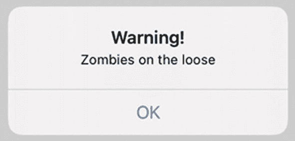
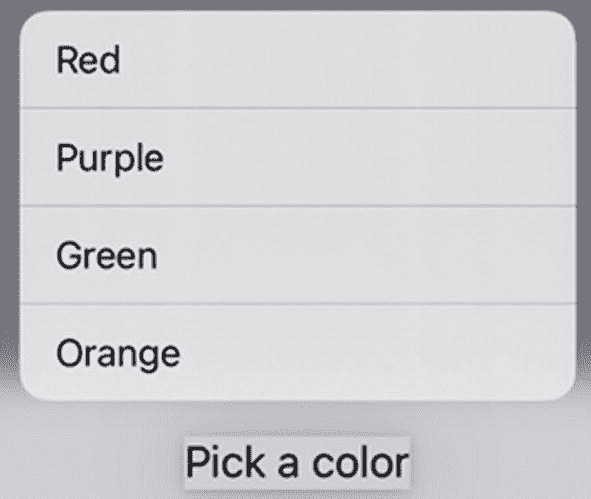
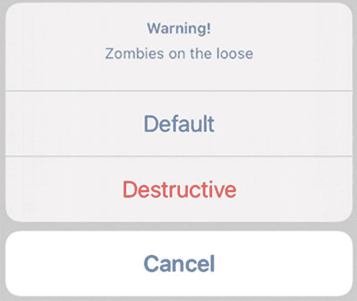

# 12. 使用警告框、操作列表和上下文菜单

几乎每个应用程序都需要向用户显示信息并接收数据。显示数据最简单的方式是通过一个`Text`视图，但有时你需要展示数据并让用户能够进行回应。在这种情况下，你可以使用`Alert`或`ActionSheet`。另一种向用户展示选项的方式是上下文菜单。

一个`Alert`会弹出在屏幕上，给用户一个回应的机会。然后用户可以通过点击一个或多个按钮来关闭这个`Alert`，如图 12-1 所示。



图 12-1 一个典型的`Alert`会显示一条信息和一或多个按钮

一个`ActionSheet`看起来几乎与`Alert`一模一样，区别在于`Alert`出现在屏幕中央，而`ActionSheet`从屏幕底部向上滑出。`Alert`更多地是为了吸引用户的注意力，比如警告你将删除那些之后无法找回或撤销的数据。另一方面，`ActionSheet`更像是一种提醒，可能不那么关键或具有破坏性。

上下文菜单会在对某个视图（例如`Text`视图）执行长按手势后出现。然后它会弹出一个选项列表供用户选择，如图 12-2 所示。



图 12-2 上下文菜单列出多个选项供选择

## 显示警告框/操作列表

每个用户界面都需要向用户回显数据。在某些情况下，这些数据可以通过标签直接显示，但有时你需要确保用户看到特定信息。

`Alert`/`ActionSheet`会覆盖在应用程序的用户界面上，并可以通过更改以下属性进行定制：

- `Title` – 出现在`Alert`/`ActionSheet`顶部的文本，通常为粗体和大号字体
- `Message` – 出现在标题下方、字体较小的文本
- 一个或多个`Button` – 可以关闭`Alert`/`ActionSheet`的按钮

标题通常由单个单词或简短短语组成，用于说明其目的，例如显示“警告”或“登录”。要关闭`Alert`/`ActionSheet`，你至少需要一个按钮。

要了解如何创建一个仅显示标题、消息和一个关闭按钮的简单`Alert`/`ActionSheet`，请按照以下步骤操作：

1. 创建一个新的 SwiftUI iOS App 项目，并为其任意命名，例如“Alert”。
2. 在导航器窗格中点击`ContentView`文件。
3. 在`struct ContentView: View`这一行下方添加以下 State 变量：

```swift
@State var showAlert = false
```

4. 像这样添加一个包含`Button`的`VStack`：

```swift
var body: some View {
    VStack {
        Button("Show Alert") {
            showAlert.toggle()
        }
    }
}
```

5. 像这样为`Button`添加`.alert`修饰符：

```swift
.alert(isPresented: $showAlert) {
    Alert(title: Text("Warning!"), message: Text("Zombies on the loose"), dismissButton: .default(Text("OK")))
}
```

当`showAlert` State 变量为`true`时，这个`.alert`修饰符会显示一个`Alert`。然后它使用一个`Text`视图显示“Warning!”，并使用第二个`Text`视图显示“Zombies on the loose.”。最后，它使用第三个`Text`视图在`Button`上显示“OK”。

**注意**  
`Alert`使用`dismissButton:`参数定义要显示的单个按钮。为了简化代码，你可以直接使用样式（`.default`）来定义`Button`的外观，而不是使用更长的版本，如下所示：`Alert.Button.default`。

整个`ContentView`文件应该如下所示：

```swift
import SwiftUI

struct ContentView: View {
    @State var showAlert = false
    var body: some View {
        VStack {
            Button("Show Alert") {
                showAlert.toggle()
            }
            .alert(isPresented: $showAlert) {
                Alert(title: Text("Warning!"), message: Text("Zombies on the loose"), dismissButton: .default(Text("OK")))
            }
        }
    }
}

struct ContentView_Previews: PreviewProvider {
    static var previews: some View {
        ContentView()
    }
}
```

6. 点击画布上的实时预览图标，然后点击`Button`，`Alert`就会显示在屏幕中央（参见图 12-1）。
7. 点击 OK 按钮让`Alert`消失。
8. 像这样将`.alert`替换为`.actionSheet`：

```swift
.actionSheet(isPresented: $showAlert) {
    ActionSheet(title: Text("Warning!"), message: Text("Zombies on the loose"), buttons: [.default(Text("OK"))])
}
```

**注意**  
`Alert`使用`dismissButton:`参数定义按钮，而`ActionSheet`则使用`buttons:`参数，并将一个或多个按钮像数组一样放在方括号`[ ]`内。为了简化代码，你可以直接使用样式（`.default`）来定义`Button`的外观，而不是使用更长的版本，如下所示：`ActionSheet.Button.default`。

9. 在模拟的 iOS 屏幕上点击`Button`。注意，此时一个`ActionSheet`会出现在屏幕底部。
10. 点击 OK 按钮让`ActionSheet`消失。

创建`Alert`或`ActionSheet`几乎完全相同，仅在定义按钮以及使用`.alert`（和`Alert`）还是`.actionSheet`（和`ActionSheet`）上存在微小差异。


### 显示和响应多个按钮

最简单的提醒/操作表会显示单个按钮，让用户能够将其关闭。然而，你可能希望为用户提供多个选项，并根据用户点击的按钮做出不同响应。

一个提醒最多可以显示两个按钮，分别称为 `primaryButton` 和 `secondaryButton`。一个操作表最多可以显示三个按钮。对于每个要显示的按钮，你可以从如图 12-3 所示的三种样式中选择一种：



**图 12-3** 按钮的三种不同样式

- `.default` – 以蓝色显示文本
- `.destructive` – 以红色显示文本
- `.cancel` – 以粗体显示文本

要了解如何创建显示两个按钮的提醒，请按照以下步骤操作：

1.  创建一个新的 SwiftUI iOS 应用项目，并为其任意命名，例如 "AlertTwoButtons"。
2.  单击导航窗格中的 `ContentView` 文件。
3.  在 `struct ContentView: View` 行下方添加以下 `State` 变量：
    -   在 `var body: some View` 内部添加一个 `VStack` 和一个 `Button`，如下所示：

    ```
    struct ContentView: View {
        @State var showAlert = false
    ```

    ```
    var body: some View {
        VStack {
            Button("Show Alert") {
                showAlert.toggle()
            }
        }
    }
    ```

4.  为 `Button` 添加一个 `.alert` 修饰符，如下所示：

    ```
    .alert(isPresented: $showAlert) {
        Alert(title: Text("Warning!"),
              message: Text("Zombies on the loose"),
              primaryButton: .default(Text("Default")),
              secondaryButton: .cancel(Text("Cancel")))
    }
    ```

对于 `primaryButton` 或 `secondaryButton`，你也可以改用 `.destructive` 按钮类型，来观察按钮在提醒中的外观变化。整个 `ContentView` 文件应如下所示：

```
import SwiftUI

struct ContentView: View {
    @State var showAlert = false

    var body: some View {
        VStack {
            Button("Show Alert") {
                showAlert.toggle()
            }
            .alert(isPresented: $showAlert) {
                Alert(title: Text("Warning!"),
                      message: Text("Zombies on the loose"),
                      primaryButton: .default(Text("Default")),
                      secondaryButton: .cancel(Text("Cancel")))
            }
        }
    }
}

struct ContentView_Previews: PreviewProvider {
    static var previews: some View {
        ContentView()
    }
}
```

5.  单击画布窗格中的“实时预览”图标，然后单击“Show Alert”按钮。提醒会显示出来。
6.  单击“Default”或“Cancel”按钮以关闭提醒。

要了解如何创建显示三个按钮的操作表，请按照以下步骤操作：

1.  创建一个新的 SwiftUI iOS 应用项目，并为其任意命名，例如 "ActionSheetButtons"。
2.  单击导航窗格中的 `ContentView` 文件。
3.  在 `struct ContentView: View` 行下方添加以下 `State` 变量：
    -   在 `var body: some View` 内部添加一个 `VStack` 和一个 `Button`，如下所示：

    ```
    struct ContentView: View {
        @State var showAlert = false
    ```

    ```
    var body: some View {
        VStack {
            Button("Show Action Sheet") {
                showAlert.toggle()
            }
        }
    }
    ```

4.  为 `Button` 添加一个 `.actionSheet` 修饰符，如下所示：

    ```
    .actionSheet(isPresented: $showAlert) {
        ActionSheet(title: Text("Warning!"),
                    message: Text("Zombies on the loose"),
                    buttons: [
                        .default(Text("Default")),
                        .cancel(Text("Cancel")),
                        .destructive(Text("Destructive"))])
    }
    ```

整个 `ContentView` 文件应如下所示：

```
import SwiftUI

struct ContentView: View {
    @State var showAlert = false

    var body: some View {
        VStack {
            Button("Show Action Sheet") {
                showAlert.toggle()
            }
            .actionSheet(isPresented: $showAlert) {
                ActionSheet(title: Text("Warning!"),
                            message: Text("Zombies on the loose"),
                            buttons: [
                                .default(Text("Default")),
                                .cancel(Text("Cancel")),
                                .destructive(Text("Destructive"))])
            }
        }
    }
}

struct ContentView_Previews: PreviewProvider {
    static var previews: some View {
        ContentView()
    }
}
```

5.  单击画布窗格中的“实时预览”图标，然后单击“Show Action Sheet”按钮。操作表会出现在模拟的 iOS 屏幕底部。
6.  单击“Default”、“Cancel”或“Destructive”按钮以关闭操作表。


### 使 Alert/ActionSheet 按钮可响应

仅仅向 Alert 或 Action Sheet 添加按钮，只会让这些按钮在用户选中时简单地关闭 Alert 或 Action Sheet。大多数情况下，你希望按钮能执行某种操作。要做到这一点，你必须先创建一个函数，其中包含用户点击特定按钮时要运行的代码。然后，当用户点击按钮时，你必须调用该函数。

要使按钮可响应，你需要像这样添加 `action:` 参数：

```
.alert(isPresented: $showAlert) {
Alert(title: Text("Warning!"),
message: Text("Zombies on the loose"),
primaryButton: .default(Text("Default"), action: {
message = "Default chosen"
}),
secondaryButton: .cancel(Text("Cancel"), action: cancelFunction))
}
}
}
func cancelFunction() {
message = "Cancel chosen"
}
```

使用 `action:` 参数的第一种方法涉及花括号，你可以在其中编写任意多行代码。然而，你编写的代码越多，整个 `.alert` 或 `.actionSheet` 看起来就越杂乱。

使用 `action:` 参数的第二种方法是调用一个函数。这样，`action:` 代码被隔离在一个独立的函数中，同时保持 `.alert` 或 `.actionSheet` 代码更简短、更易读。

无论你选择哪种方法，选中任何一个按钮都会从屏幕上关闭 Alert 或 Action Sheet。这就是为什么如果你完全省略了 `action:` 参数，选中该按钮也会关闭 Alert 或 Action Sheet。

要了解如何在 Alert 中使按钮可响应，请按照以下步骤操作：

1.  创建一个新的 SwiftUI iOS App 项目，并为其指定任意名称，例如 “AlertResponsiveButtons”。
2.  在导航器窗格中点击 `ContentView` 文件。
3.  在 `struct ContentView: View` 行下方添加以下状态变量：
    ```
    struct ContentView: View {
    @State var showAlert = false
    @State var message = ""
    ```
4.  在 `var body: some View` 中添加一个 `VStack`，并在 VStack 内放置一个 `Text` 视图和一个 `Button`，如下所示：
    ```
    var body: some View {
    VStack {
    Text(message)
    .padding()
    Button("Show Alert") {
    showAlert.toggle()
    }
    }
    }
    }
    ```
5.  向 Button 添加一个 `.alert` 修饰符，如下所示：
    ```
    .alert(isPresented: $showAlert) {
    Alert(title: Text("Warning!"),
    message: Text("Zombies on the loose"),
    primaryButton: .default(Text("Default"), action: {
    message = "Default chosen"
    }),
    secondaryButton: .cancel(Text("Cancel"), action: cancelFunction))
    }
    ```
6.  在 `struct ContentView: View` 的最后一个花括号之前添加以下函数，如下所示：
    ```
    func cancelFunction() {
    message = "Cancel chosen"
    }
    ```

完整的 ContentView 文件应如下所示：
```
import SwiftUI
struct ContentView: View {
@State var showAlert = false
@State var message = ""
var body: some View {
VStack {
Text(message)
.padding()
Button("Show Alert") {
showAlert.toggle()
}
.alert(isPresented: $showAlert) {
Alert(title: Text("Warning!"),
message: Text("Zombies on the loose"),
primaryButton: .default(Text("Default"), action: {
message = "Default chosen"
}),
secondaryButton: .cancel(Text("Cancel"), action: cancelFunction))
}
}
}
func cancelFunction() {
message = "Cancel chosen"
}
}
struct ContentView_Previews: PreviewProvider {
static var previews: some View {
ContentView()
}
}
```

7.  点击画布窗格中的 Live Preview 图标，然后点击 Show Alert 按钮。会出现一个 Alert。
8.  点击 Cancel 或 Default 按钮。注意，会出现一条消息告知你选择了哪个按钮。

要了解如何在 Action Sheet 中使按钮可响应，请按照以下步骤操作：

1.  创建一个新的 SwiftUI iOS App 项目，并为其指定任意名称，例如 “ActionSheetResponsiveButtons”。
2.  在导航器窗格中点击 `ContentView` 文件。
3.  在 `struct ContentView: View` 行下方添加以下状态变量：
    ```
    struct ContentView: View {
    @State var showAlert = false
    @State var message = ""
    ```
4.  在 `var body: some View` 中添加一个 `VStack`，并在 VStack 内放置一个 `Text` 视图和一个 `Button`，如下所示：
    ```
    var body: some View {
    VStack {
    Text(message)
    .padding()
    Button("Show Action Sheet") {
    showAlert.toggle()
    }
    }
    }
    }
    ```
5.  向 Button 添加一个 `.actionSheet` 修饰符，如下所示：
    ```
    .actionSheet(isPresented: $showAlert) {
    ActionSheet(title: Text("Warning!"),
    message: Text("Zombies on the loose"),
    buttons: [
    .default(Text("Default"), action: {
    message = "Default chosen"
    }),
    .cancel(Text("Cancel"), action: cancelFunction),
    .destructive(Text("Destructive"), action: {
    message = "Destructive chosen"
    })])
    }
    ```
6.  在 `struct ContentView: View` 的最后一个花括号之前添加以下函数，如下所示：
    ```
    func cancelFunction() {
    message = "Cancel chosen"
    }
    ```

完整的 ContentView 文件应如下所示：
```
import SwiftUI
struct ContentView: View {
@State var showAlert = false
@State var message = ""
var body: some View {
VStack {
Text(message)
.padding()
Button("Show Action Sheet") {
showAlert.toggle()
}
.actionSheet(isPresented: $showAlert) {
ActionSheet(title: Text("Warning!"),
message: Text("Zombies on the loose"),
buttons: [
.default(Text("Default"), action: {
message = "Default chosen"
}),
.cancel(Text("Cancel"), action: cancelFunction),
.destructive(Text("Destructive"), action: {
message = "Destructive chosen"
})])
}
}
}
func cancelFunction() {
message = "Cancel chosen"
}
}
struct ContentView_Previews: PreviewProvider {
static var previews: some View {
ContentView()
}
}
```

7.  点击画布窗格中的 Live Preview 图标，然后点击 Show Action Sheet 按钮。会出现一个 Action Sheet。
8.  点击 Cancel、Default 或 Destructive 按钮。注意，会出现一条消息告知你选择了哪个按钮。


## 使用上下文菜单

上下文菜单可以将多个选项隐藏在用户界面中，仅当检测到用户长按某个视图（例如`Text`视图）时才会显示。当上下文菜单列出选项时，用户可以选择其中一个。

上下文菜单定义了一个`Button`列表，每个`Button`都显示文本内容，并在用户选择该按钮时执行相应的操作。该操作可以调用函数，也可以在花括号内编写 Swift 代码，如下所示：

```
.contextMenu(menuItems: {
Button("Red", action: {
myColor = Color.red
})
Button("Purple", action: purple)
Button("Green", action: green)
Button("Orange", action: orange)
})
```

在此示例中，标题为“Red”的`Button`使用花括号定义了要运行的代码。其他三个`Button`（“Purple”、“Green”和“Orange”）则调用函数。请注意，每个函数调用只需使用函数名，如果参数为空，则不需要参数列表。

要了解如何创建上下文菜单，请按照以下步骤操作：

1.  创建一个新的 SwiftUI iOS App 项目，并为其命名，例如“ContextualMenu”。
2.  在导航器窗格中单击`ContentView`文件。
3.  在`struct ContentView: View`行下方添加以下`State`变量：

```
@State var myColor = Color.gray
```

4.  在`var body: some View`中添加一个`VStack`，并在`VStack`内部放置一个`Rectangle`视图和一个`Text`视图，如下所示：

```
var body: some View {
VStack {
Rectangle()
.foregroundColor(myColor)
Text("Pick a color")
.padding()
}
}
```

上述代码定义了一个`Rectangle`，并基于`myColor` State 变量为其着色，该变量初始设置为`.gray`。然后显示一个`Text`视图。

5.  为`Text`视图添加一个`.contextualMenu`修改器，如下所示：

```
.contextMenu(menuItems: {
Button("Red", action: {
myColor = Color.red
})
Button("Purple", action: purple)
Button("Green", action: green)
Button("Orange", action: orange)
})
```

6.  在`struct ContentView: View`的最后一个花括号上方添加以下函数，如下所示：

```
func purple() {
myColor = Color.purple
}
func green() {
myColor = Color.green
}
func orange() {
myColor = Color.orange
}
```

完整的`ContentView`文件应如下所示：

7.  在画布窗格中点击“Live Preview”图标。
8.  将鼠标指针移动到“Pick a color”`Text`视图上，并按住鼠标左键模拟长按手势。稍等片刻，上下文菜单就会出现。
9.  点击上下文菜单中显示的任何选项。注意，矩形会随着您选择的选项改变颜色。

```
import SwiftUI
struct ContentView: View {
@State var myColor = Color.gray
var body: some View {
VStack {
Rectangle()
.foregroundColor(myColor)
Text("Pick a color")
.padding()
.contextMenu(menuItems: {
Button("Red", action: {
myColor = Color.red
})
Button("Purple", action: purple)
Button("Green", action: green)
Button("Orange", action: orange)
})
}
}
func purple() {
myColor = Color.purple
}
func green() {
myColor = Color.green
}
func orange() {
myColor = Color.orange
}
}
struct ContentView_Previews: PreviewProvider {
static var previews: some View {
ContentView()
}
}
```

## 总结

`Alert`在屏幕中央（`.alert`）显示信息，而操作表（Action Sheet）则在屏幕底部（`.actionSheet`）显示信息。Alert 和操作表可以显示标题和消息，以及至少一个用于关闭 Alert/操作表的`Button`。但是，一个 Alert 最多可以显示两个`Button`，而一个操作表最多可以显示三个`Button`。

Alert/操作表上的`Button`只会关闭 Alert/操作表，但您可以附加代码，以便在用户选择`Button`时运行。一种方法是直接在`.alert`/`.actionSheet`修改器中编写代码，但更好的解决方案是调用一个函数，并将该函数中的代码与`.alert`/`.actionSheet`修改器分离。

当需要向用户显示重要信息并立即获得反馈时，例如验证用户是否要删除数据，请使用 Alert。当需要在屏幕底部显示信息时，请使用操作表。当希望将多个选项隐藏在用户界面之外，但在用户想查看时使其可用时，请使用上下文菜单。

