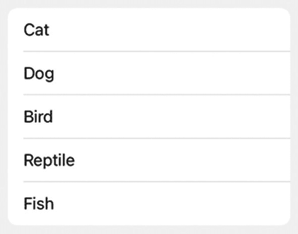
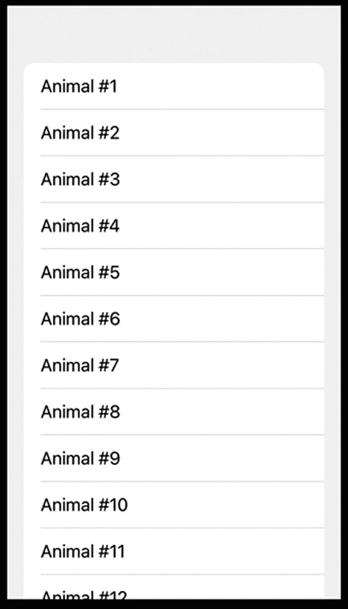
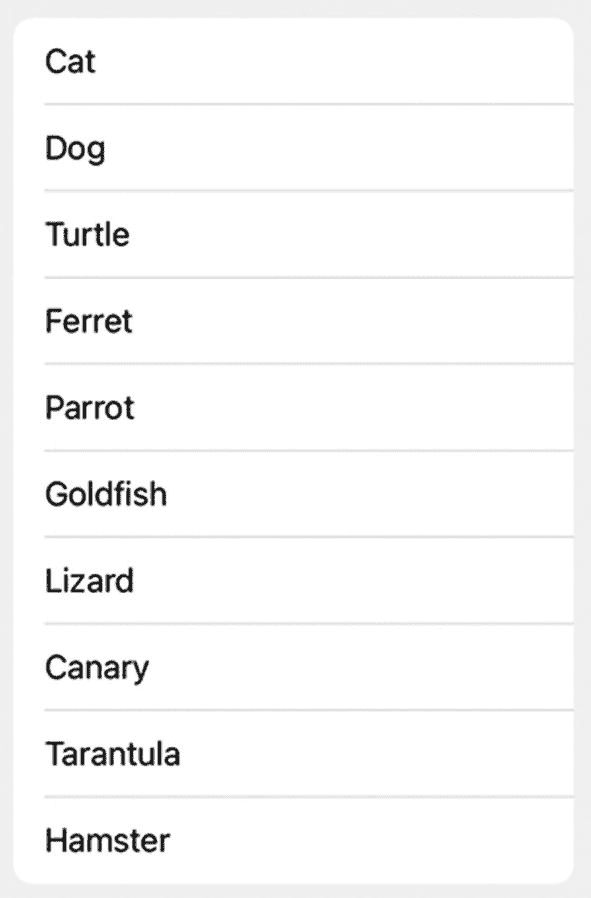
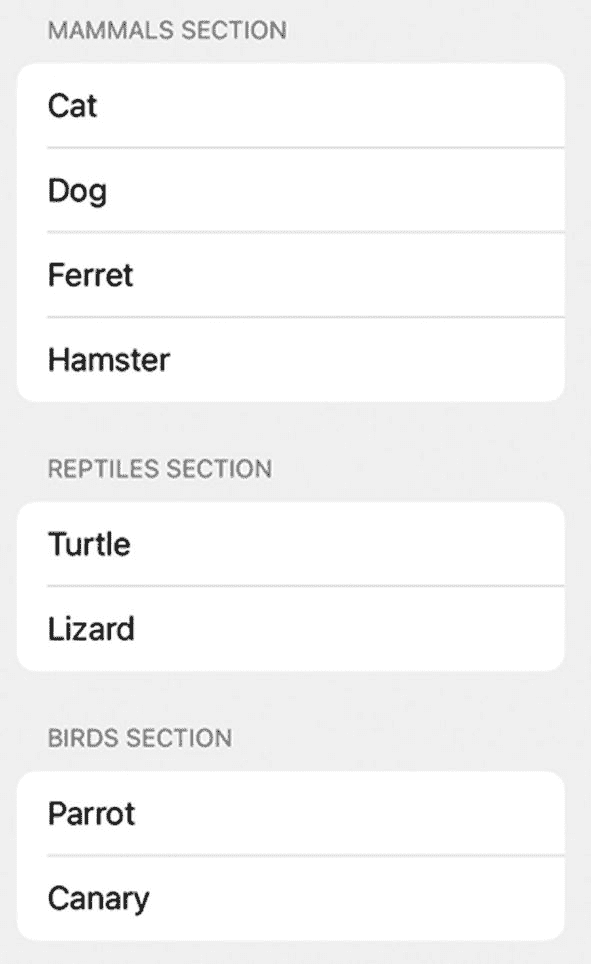
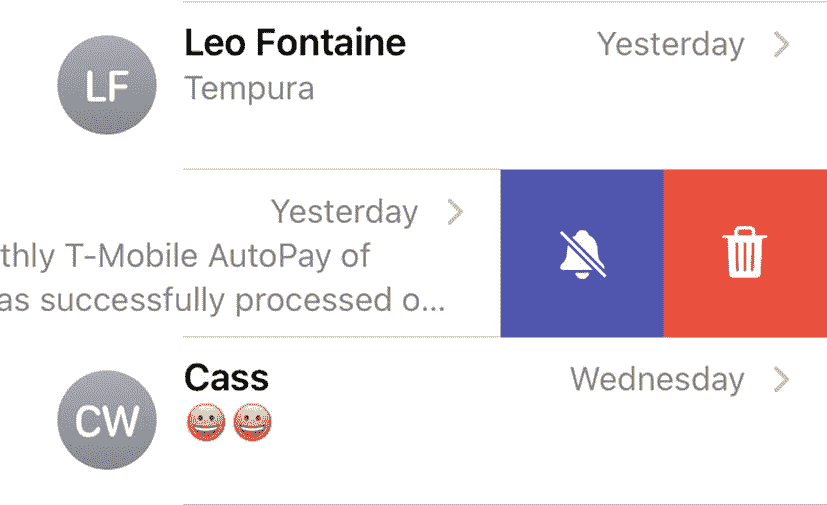
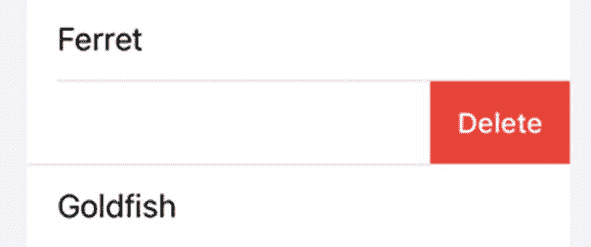
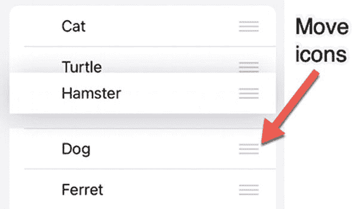
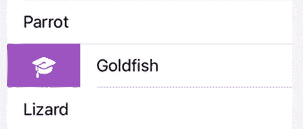
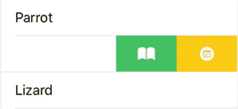

# 显示列表

向用户显示大量相关数据的一种常见方式是通过`List`（也称为表格视图）。`List`只是垂直堆叠多行相似类型的数据，如图 13-1 所示：



**图 13-1** 一个包含多个`Text`视图的简单`List`

```
List {
Text("Cat")
Text("Dog")
Text("Bird")
Text("Reptile")
Text("Fish")
}
```

如果`List`包含的项目超过屏幕一次可显示的范围，`List`将允许用户向上或向下滑动以查看所有数据。最重要的是，此滚动功能不需要任何额外的编码。要了解如何通过上下滑动查看`List`中的所有项目，请按照以下步骤操作：

1.  创建一个新的 SwiftUI iOS App 项目，并为其命名，例如“SimpleList”。
2.  在导航器窗格中单击`ContentView`文件。
3.  在`var body: some View`内部添加一个`List`，如下所示：

```
var body: some View {
List {
ForEach(1...25, id: \.self) { index in
Text("Animal #\(index)")
}
}
```

此代码使用`ForEach`循环来创建 25 个独立的项目。每次`ForEach`循环运行时，`index`变量都会递增，因此`index`的值将从 1 开始，到 25 结束。完整的`ContentView`文件应如下所示：



**图 13-2** 由`ForEach`循环定义的`List`的显示效果

4.  在画布窗格上点击“Live Preview”图标。请注意，即使`List`包含 25 个项目，屏幕上也不会同时显示所有项目，如图 13-2 所示。

```
import SwiftUI
struct ContentView: View {
var body: some View {
List {
ForEach(1...25, id: \.self) { index in
Text("Animal #\(index)")
}
}
}
}
struct ContentView_Previews: PreviewProvider {
static var previews: some View {
ContentView()
}
}
```

5.  向上和向下拖动鼠标以模拟滑动手势。注意，`List`会自动向上/向下滚动，向您显示其余内容。


## 在列表中显示数组数据

`List` 中显示的数据通常存储在数组中。数组中的项目数量可能是固定的，但更常见的情况是项目数量会随时间变化。这意味着随着数组随时间增加或减少，`List` 的内容也可能会发生变化。

要了解如何在 `List` 中显示数组的内容，请按照以下步骤操作：

1. 创建一个新的 SwiftUI iOS 应用项目，并为其取任意名称，例如“ListArray”。
2. 在导航器窗格中点击 `ContentView` 文件。
3. 在 `struct ContentView: View` 行下方定义一个数组，如下所示：
4. 在 `var body: some View` 内部添加一个 `VStack`，并像这样创建一个 `List`：

```
struct ContentView: View {
    var myArray = ["Cat", "Dog", "Turtle", "Ferret", "Parrot", "Goldfish", "Lizard", "Canary", "Tarantula", "Hamster"]
}
```

```
var body: some View {
    VStack {
        List {
            ForEach(0...myArray.count - 1, id: \.self) { index in
                Text(myArray[index])
            }
        }
    }
}
```

这会创建一个 `List`，并使用 `ForEach` 循环从 0 计数到数组中的最后一个项目。（请记住，数组中的第一个项目索引值为 0，因此数组中最后一个项目的索引值等于数组中的项目总数减去 1。）然后，它使用此索引值从数组中检索每个项目，以显示在 `List` 中，如图 13-3 所示。



**图 13-3** – 在 `List` 中显示数组的内容

完整的 `ContentView` 文件应如下所示：

```
import SwiftUI

struct ContentView: View {
    var myArray = ["Cat", "Dog", "Turtle", "Ferret", "Parrot", "Goldfish", "Lizard", "Canary", "Tarantula", "Hamster"]

    var body: some View {
        VStack {
            List {
                ForEach(0...myArray.count - 1, id: \.self) { index in
                    Text(myArray[index])
                }
            }
        }
    }
}

struct ContentView_Previews: PreviewProvider {
    static var previews: some View {
        ContentView()
    }
}
```

## 在列表中显示结构体数组

之前的代码使用 `ForEach` 循环通过索引值检索数组项目。另一种存储数据的方法是使用结构体，然后创建一个结构体数组。

这样做的目的是定义你想要存储的数据，同时附带一个唯一的 ID，你可以用这个 ID 来标识每个结构体，例如：

```
struct Animals: Identifiable {
    let pet: String
    let id = UUID()
}
```

一旦你定义了一个 `Identifiable` 结构体，就可以像这样将其存储在一个数组中：

```
var myAnimals = [
    Animals(pet: "Cat"),
    Animals(pet: "Dog"),
    Animals(pet: "Turtle"),
    Animals(pet: "Ferret"),
    Animals(pet: "Parrot"),
    Animals(pet: "Goldfish"),
    Animals(pet: "Lizard"),
    Animals(pet: "Canary"),
    Animals(pet: "Tarantula"),
    Animals(pet: "Hamster")
]
```

这个数组不仅在 `pet` 字段中存储了字符串，而且还为每个结构体分配了一个唯一的 ID。现在，你可以使用这个唯一的 ID 在 `List` 中显示每个项目，如下所示：

```
List(myAnimals) {
    Text($0.pet)
}
```

请注意，上述代码不需要循环。要了解这段代码的工作原理，请按照以下步骤操作：

1. 创建一个新的 SwiftUI iOS 应用项目，并为其取任意名称，例如“ListOfStructures”。
2. 在导航器窗格中点击 `ContentView` 文件。
3. 在 `struct ContentView: some View` 行下方定义一个结构体和一个数组，如下所示：
4. 在 `var body: some View` 内部添加一个 `List`，如下所示：

```
struct ContentView: View {
    struct Animals: Identifiable {
        let pet: String
        let id = UUID()
    }

    var myAnimals = [
        Animals(pet: "Cat"),
        Animals(pet: "Dog"),
        Animals(pet: "Turtle"),
        Animals(pet: "Ferret"),
        Animals(pet: "Parrot"),
        Animals(pet: "Goldfish"),
        Animals(pet: "Lizard"),
        Animals(pet: "Canary"),
        Animals(pet: "Tarantula"),
        Animals(pet: "Hamster")
    ]
}
```

```
var body: some View {
    List(myAnimals) {
        Text($0.pet)
    }
}
```

完整的 `ContentView` 文件应如下所示：

```
import SwiftUI

struct ContentView: View {
    struct Animals: Identifiable {
        let pet: String
        let id = UUID()
    }

    var myAnimals = [
        Animals(pet: "Cat"),
        Animals(pet: "Dog"),
        Animals(pet: "Turtle"),
        Animals(pet: "Ferret"),
        Animals(pet: "Parrot"),
        Animals(pet: "Goldfish"),
        Animals(pet: "Lizard"),
        Animals(pet: "Canary"),
        Animals(pet: "Tarantula"),
        Animals(pet: "Hamster")
    ]

    var body: some View {
        List(myAnimals) {
            Text($0.pet)
        }
    }
}

struct ContentView_Previews: PreviewProvider {
    static var previews: some View {
        ContentView()
    }
}
```

请注意，与之前需要 `ForEach` 循环的版本相比，创建 `List` 的代码看起来要简洁得多。


## 在列表中创建分组

当`List`中显示的项目过多时，滚动浏览所有数据来查找目标项会变得很困难。为解决这一问题，`List`允许你创建分组，如图 13-4 所示。



*图 13-4 - 在`List`中以分组形式显示内容*

要定义分组，你需要创建两个结构体。一个结构体用于定义分组标题，另一个结构体用于定义要显示的数据。定义分组标题时，你需要定义：

- 一个`String`常量，用于保存每个分组的名称
- 一个数组常量，用于保存包含实际数据的结构体数组
- 一个`ID`，用于为每个分组定义唯一标识

该结构体名称必须定义为`Identifiable`，以便创建唯一 ID，示例如下：

```
struct SectionHeading: Identifiable {
    let name: String
    let animalList: [Animals]
    let id = UUID()
}
```

上述结构体使用`animalList`来存储一个名为`Animals`的结构体数组。这个`Animals`结构体需要：

- 一个`String`常量，用于保存要在`List`中显示的数据
- 一个`ID`，用于为`List`中的每个项目定义唯一标识

第二个结构体必须定义为`Hashable`和`Identifiable`，示例如下：

```
struct Animals: Hashable, Identifiable {
    let pet: String
    let id = UUID()
}
```

最后，你可以创建一个数组来定义分组及其包含的项目，示例如下：

```
var myAnimals = [
    SectionHeading(name: "Mammals",
                   animalList: [
                       Animals(pet: "Cat"),
                       Animals(pet: "Dog"),
                       Animals(pet: "Ferret"),
                       Animals(pet: "Hamster")])
]
```

要在`List`中显示项目，你需要使用嵌套的`ForEach`循环。外层的`ForEach`循环用于定义分组名称，示例如下：

```
ForEach(myAnimals) { heading in
    Section(header: Text("\(heading.name) Section")) {
    }
}
```

然后，内层的`ForEach`循环用于定义每个分组内显示的项目，示例如下：

```
ForEach(heading.animalList) { creature in
    Text(creature.pet)
}
```

要了解如何创建分组的`List`，请按照以下步骤操作：

1. 创建一个新的 SwiftUI iOS App 项目，并为其任意命名，例如“ListSections”。
2. 在导航窗格中点击`ContentView`文件。
3. 在`struct ContentView: some View`代码行下方定义一个结构体，用于定义要在`List`中显示的数据，代码如下：

```
struct Animals: Hashable, Identifiable {
    let pet: String
    let id = UUID()
}
```

4. 在其下方添加第二个结构体，用于定义要在`List`中显示的分组名称，代码如下：

```
struct SectionHeading: Identifiable {
    let name: String
    let animalList: [Animals]
    let id = UUID()
}
```

5. 添加一个数组，列出分组以及每个分组内要显示的项目，代码如下：

```
var myAnimals = [
    SectionHeading(name: "Mammals",
                   animalList: [
                       Animals(pet: "Cat"),
                       Animals(pet: "Dog"),
                       Animals(pet: "Ferret"),
                       Animals(pet: "Hamster")]),
    SectionHeading(name: "Reptiles",
                   animalList: [
                       Animals(pet: "Turtle"),
                       Animals(pet: "Lizard")]),
    SectionHeading(name: "Birds",
                   animalList: [
                       Animals(pet: "Parrot"),
                       Animals(pet: "Canary")]),
    SectionHeading(name: "Other",
                   animalList: [
                       Animals(pet: "Tarantula"),
                       Animals(pet: "Goldfish")])
]
```

6. 在`var body: some View`内部添加一个`List`，代码如下：

```
var body: some View {
    List {
    }
}
```

7. 在`List`内部添加一个`ForEach`循环，用于定义分组名称，代码如下：

```
var body: some View {
    List {
        ForEach(myAnimals) { heading in
            Section(header: Text("\(heading.name) Section")) {
            }
        }
    }
}
```

请注意，`Text`视图显示每个分组的`name`属性，该属性由之前定义的数组提供（“Mammals”，“Reptiles”，“Birds”和“Other”）。

8. 添加第二个`ForEach`循环，用于定义要在`List`中显示的实际数据，代码如下：

```
var body: some View {
    List {
        ForEach(myAnimals) { heading in
            Section(header: Text("\(heading.name) Section")) {
                ForEach(heading.animalList) { creature in
                    Text(creature.pet)
                }
            }
        }
    }
}
```

请注意，第二个`ForEach`循环使用了`pet`属性，该属性由之前定义的数组提供（“Cat”，“Dog”，“Ferret”，“Hamster”，“Turtle”，“Lizard”，“Parrot”，“Canary”，“Tarantula”，“Goldfish”）。

整个`ContentView`文件应如下所示：

```
import SwiftUI

struct ContentView: View {
    struct Animals: Hashable, Identifiable {
        let pet: String
        let id = UUID()
    }

    struct SectionHeading: Identifiable {
        let name: String
        let animalList: [Animals]
        let id = UUID()
    }

    var myAnimals = [
        SectionHeading(name: "Mammals",
                       animalList: [
                           Animals(pet: "Cat"),
                           Animals(pet: "Dog"),
                           Animals(pet: "Ferret"),
                           Animals(pet: "Hamster")]),
        SectionHeading(name: "Reptiles",
                       animalList: [
                           Animals(pet: "Turtle"),
                           Animals(pet: "Lizard")]),
        SectionHeading(name: "Birds",
                       animalList: [
                           Animals(pet: "Parrot"),
                           Animals(pet: "Canary")]),
        SectionHeading(name: "Other",
                       animalList: [
                           Animals(pet: "Tarantula"),
                           Animals(pet: "Goldfish")])
    ]

    var body: some View {
        List {
            ForEach(myAnimals) { heading in
                Section(header: Text("\(heading.name) Section")) {
                    ForEach(heading.animalList) { creature in
                        Text(creature.pet)
                    }
                }
            }
        }
    }
}

struct ContentView_Previews: PreviewProvider {
    static var previews: some View {
        ContentView()
    }
}
```


## 为列表添加行分隔线

列表通常会在项目之间显示分隔线。从 iOS 15 开始，SwiftUI 允许你选择隐藏或显示这些分隔线，或者为它们着色。

要隐藏或显示 `List` 中的分隔线，请使用 `.listRowSeparator` 修饰符，并设置为 `.visible` 或 `.hidden`，如下所示：

```
.listRowSeparator(.hidden)
```

要为 `List` 中分隔项目的线条着色，请使用 `.listRowSeparatorTint` 修饰符，并传入一个颜色，例如 `.red` 或 `.blue`，如下所示：

```
.listRowSeparatorTint(.red)
```

你可以在 `List` 内部同时使用这两个修饰符来修改定义 `List` 显示内容的 `ForEach` 循环。要了解如何隐藏和着色列表中的行分隔线，请按照以下步骤操作：

1.  创建一个新的 SwiftUI iOS 应用项目，并为其命名，例如“ListLines”。
2.  在导航器窗格中点击 `____App` 文件，其中 `____` 是你的项目名称，例如 `ListLinesApp`。
3.  在 `struct` 行上方添加如下代码：

```
@available(iOS 15.0, *)
@main
struct DeleteMe3App: App {
    var body: some Scene {
        WindowGroup {
            ContentView()
        }
    }
}
```

1.  在导航器窗格中点击 `ContentView` 文件。
2.  在 `ContentView` 文件的两个结构体中的 `struct` 行上方添加如下代码：

```
@available(iOS 15.0, *)
```

1.  在 `struct ContentView: View` 行下方添加一个数组，如下所示：

```
@available(iOS 15.0, *)
struct ContentView: View {
    var myArray = ["Cat", "Dog", "Turtle", "Ferret", "Parrot", "Goldfish", "Lizard", "Canary", "Tarantula", "Hamster"]
```

1.  在此数组下方添加一个 `State` 变量，如下所示：

```
@State var showLines = true
```

1.  在 `var body: some View` 行下方添加一个 `List`，如下所示：

```
var body: some View {
    List {
    }
}
```

1.  在 `List` 内部添加一个 `ForEach` 循环，用于遍历从 0 到数组总项数减 1 的所有数组项，如下所示：

```
var body: some View {
    List {
        ForEach(0...myArray.count - 1, id: \.self) { index in
            Text(myArray[index])
        }
    }
}
```

1.  向 `Text(myArray[index])` 视图添加一个 `.onTapGesture`，如下所示：

```
var body: some View {
    List {
        ForEach(0...myArray.count - 1, id: \.self) { index in
            Text(myArray[index])
                .onTapGesture {
                    showLines.toggle()
                }
        }
    }
}
```

每当用户选择 `List` 中的任何项目时，`.onTapGesture` 修饰符会将 `showLines` `State` 变量的值从 `true` 更改为 `false`（或从 `false` 更改为 `true`）。

1.  向 `ForEach` 循环添加一个 `.listRowSeparator` 修饰符，如下所示：

```
var body: some View {
    List {
        ForEach(0...myArray.count - 1, id: \.self) { index in
            Text(myArray[index])
                .onTapGesture {
                    showLines.toggle()
                }
        }.listRowSeparator(showLines ? .visible : .hidden)
    }
}
```

此 `.listRowSeparator` 使用 `showLines` `State` 变量来决定是显示分隔线（`.visible`）还是隐藏它们（`.hidden`）。

1.  向 `ForEach` 循环添加一个 `.listRowSeparatorTint` 修饰符，如下所示：

```
var body: some View {
    List {
        ForEach(0...myArray.count - 1, id: \.self) { index in
            Text(myArray[index])
                .onTapGesture {
                    showLines.toggle()
                }
        }.listRowSeparator(showLines ? .visible : .hidden)
        .listRowSeparatorTint(.red)
    }
}
```

你可以选择任何你想要的颜色，例如 `.orange` 或 `.purple`。整个 `ContentView` 文件应如下所示：

```
import SwiftUI

@available(iOS 15.0, *)
struct ContentView: View {
    var myArray = ["Cat", "Dog", "Turtle", "Ferret", "Parrot", "Goldfish", "Lizard", "Canary", "Tarantula", "Hamster"]
    @State var showLines = true

    var body: some View {
        List {
            ForEach(0...myArray.count - 1, id: \.self) { index in
                Text(myArray[index])
                    .onTapGesture {
                        showLines.toggle()
                    }
            }.listRowSeparator(showLines ? .visible : .hidden)
            .listRowSeparatorTint(.red)
        }
    }
}

@available(iOS 15.0, *)
struct ContentView_Previews: PreviewProvider {
    static var previews: some View {
        ContentView()
    }
}
```

1.  在画布窗格中点击“实时预览”图标。
2.  点击 `List` 中的任何项目。注意，每次点击时，`List` 中的分隔线都会在显示和隐藏之间切换。

## 为列表添加滑动手势

许多常见应用（如邮件、信息和照片）会在 `List` 中显示项目。通过这些 `List`，用户可以向左或向右滑动，以显示可供选择的更多选项，如图 13-5 所示。



图 13-5 – 在 `List` 上滑动可以显示更多选项

`List` 的两种常见操作是删除和移动项目。从 `List` 中删除项目涉及移除该项目，通常是在用户从右向左滑动之后。在列表中移动项目涉及用手指滑动项目，将其放到 `List` 中的新位置。

### 从列表中删除项目

iOS 中删除 `List` 项目最常用的快捷方式是从右向左滑动以显示删除按钮。或者，用户可以继续从右向左滑动来删除项目，而无需点击删除按钮。由于这种滑动删除手势经常使用，SwiftUI 使其易于实现。

第一步是将 `.onDelete` 修饰符添加到 `List` 中的 `ForEach` 循环，如下所示：

```
List {
    ForEach(0...myArray.count - 1, id: \.self) { index in
    }.onDelete(perform: delete)
}
```

这会调用一个 `delete` 函数，该函数使用包含 `List` 中显示项目的数组名称（在以下示例中称为 `"myArray"`），并调用 `remove` 方法，如下所示：

```
func delete(at offsets: IndexSet) {
    myArray.remove(atOffsets: offsets)
}
```

要了解如何在 `List` 中创建滑动删除手势，请按照以下步骤操作：

1.  创建一个新的 SwiftUI iOS 应用项目，并为其命名，例如“ListDelete”。
2.  在导航器窗格中点击 `ContentView` 文件。
3.  在 `struct ContentView` 行下方添加一个 `State` 变量数组，如下所示：

```
struct ContentView: View {
    @State var myArray = ["Cat", "Dog", "Turtle", "Ferret", "Parrot", "Goldfish", "Lizard", "Canary", "Tarantula", "Hamster"]
```

输入的具体字符串无关紧要，只要输入足够的字符串来填充数组即可。

1.  在 `var body: some View` 行下方添加一个 `List`，如下所示：

```
var body: some View {
    List {
    }
}
```

1.  在此 `List` 内部添加一个 `ForEach` 循环，用于从 0 计数到数组总项数减 1。然后在 `Text` 视图中显示数组项，如下所示：

```
var body: some View {
    List {
        ForEach(0...myArray.count - 1, id: \.self) { index in
            Text(myArray[index])
        }
    }
}
```

1.  向 `ForEach` 循环添加 `.onDelete` 修饰符，以调用名为 `delete` 的函数，如下所示：

```
var body: some View {
    List {
        ForEach(0...myArray.count - 1, id: \.self) { index in
            Text(myArray[index])
        }.onDelete(perform: delete)
    }
}
```

1.  在 `struct ContentView: View` 的最后一个右花括号上方添加以下函数，如下所示：

```
func delete(at offsets: IndexSet) {
    myArray.remove(atOffsets: offsets)
}
```

整个 `ContentView` 文件应如下所示：



图 13-6 – 由 `.onDelete` 修饰符创建的删除按钮

```
import SwiftUI

struct ContentView: View {
    @State var myArray = ["Cat", "Dog", "Turtle", "Ferret", "Parrot", "Goldfish", "Lizard", "Canary", "Tarantula", "Hamster"]

    var body: some View {
        List {
            ForEach(0...myArray.count - 1, id: \.self) { index in
                Text(myArray[index])
            }.onDelete(perform: delete)
        }
    }

    func delete(at offsets: IndexSet) {
        myArray.remove(atOffsets: offsets)
    }
}

struct ContentView_Previews: PreviewProvider {
    static var previews: some View {
        ContentView()
    }
}
```

1.  在画布窗格上点击“实时预览”图标。
2.  在 `List` 中的任意项目上从右向左滑动。注意，如图 13-6 所示，`.onDelete` 修饰符会自动显示“删除”按钮。
3.  点击“删除”按钮。注意，包含该项目的那一行会消失。


#### 在列表中移动项目

使用列表的另一种常见方式是在列表内重新排列或移动项目。在 iOS 中，这通常分两步完成：首先，你需编辑列表，使其在每个项目右侧显示三条横线图标；其次，你使用这三条横线图标滑动项目，将其放置到新位置，如图 13-7 所示。



图 13-7

移动图标出现在列表中项目的右侧

第一步是为列表内的 `ForEach` 循环添加 `.onMove` 修饰符，具体如下：

```
ForEach(0...myArray.count - 1, id: \.self) { index in
}.onMove(perform: move)
```

这会调用一个 `move` 函数，该函数使用包含列表显示项目的数组名称（在以下示例中为 `myArray`），并调用 `move` 方法，如下所示：

```
func move(from source: IndexSet, to destination: Int) {
myArray.move(fromOffsets: source, toOffset: destination)
}
```

若要了解如何创建滑动以移动列表中的项目，请按以下步骤操作：

1.  创建一个新的 SwiftUI iOS App 项目，并为其任意命名，例如 `ListMove`。

2.  在导航面板中点击 `ContentView` 文件。

3.  在 `struct ContentView` 行下添加一个状态变量数组，如下所示：

```
struct ContentView: View {
@State var myArray = ["Cat", "Dog", "Turtle", "Ferret", "Parrot", "Goldfish", "Lizard", "Canary", "Tarantula", "Hamster"]
```

具体输入的字符串内容无关紧要，只要输入多个字符串来填充数组即可。

4.  在 `var body: some View` 行下添加一个 `NavigationView`，如下所示：

```
var body: some View {
NavigationView {
}
```

`NavigationView` 用于在屏幕右上角显示“编辑”按钮。

5.  在 `NavigationView` 内部添加一个 `List`，如下所示：

6.  在该 `List` 内部添加一个 `ForEach` 循环，用于从 0 计数到数组中的项目总数减 1。然后在 `Text` 视图中显示数组项目，如下所示：

```
var body: some View {
NavigationView {
List {
}
}
}
```

7.  为 `List` 添加 `.toolbar` 修饰符，如下所示：

```
var body: some View {
NavigationView {
List {
ForEach(0...myArray.count - 1, id: \.self) { index in
Text(myArray[index])
}
}
}
}
```

```
var body: some View {
NavigationView {
List {
ForEach(0...myArray.count - 1, id: \.self) { index in
Text(myArray[index])
}
}.toolbar {
EditButton()
}
}
}
```

` .toolbar { EditButton() } ` 这段代码会在 `NavigationView` 的右上角添加一个“编辑”按钮。

8.  为 `ForEach` 循环添加 `.onMove` 修饰符，以调用名为 `move` 的函数，如下所示：

9.  在 `struct ContentView: View` 中最后一个花括号上方添加以下函数，如下所示：

```
var body: some View {
NavigationView {
List {
ForEach(0...myArray.count - 1, id: \.self) { index in
Text(myArray[index])
}.onMove(perform: move)
}.toolbar {
EditButton()
}
}
}
```

```
func move(from source: IndexSet, to destination: Int) {
myArray.move(fromOffsets: source, toOffset: destination)
}
```

完整的 `ContentView` 文件应如下所示：

10. 点击画布面板上的“实时预览”图标。

11. 点击屏幕右上角的“编辑”按钮。三条横线图标会出现在列表每个项目的右侧（参见图 13-7）。请注意，点击“编辑”按钮后，它会变为“完成”按钮。

12. 向上或向下滑动任意横线图标，即可将项目移动到列表中的新位置。

13. 点击屏幕右上角的“完成”按钮，隐藏列表每个项目右侧的三条横线图标。

```
import SwiftUI
struct ContentView: View {
@State var myArray = ["Cat", "Dog", "Turtle", "Ferret", "Parrot", "Goldfish", "Lizard", "Canary", "Tarantula", "Hamster"]
var body: some View {
NavigationView {
List {
ForEach(0...myArray.count - 1, id: \.self) { index in
Text(myArray[index])
}.onMove(perform: move)
}.toolbar {
EditButton()
}
}
}
func move(from source: IndexSet, to destination: Int) {
myArray.move(fromOffsets: source, toOffset: destination)
}
}
struct ContentView_Previews: PreviewProvider {
static var previews: some View {
ContentView()
}
}
```


### 为列表创建自定义滑动操作

在 iOS 15 中，SwiftUI 还允许在 `List` 项上执行自定义的从左到右和从右到左手势。第一步是向在 `List` 中显示项的视图（例如 `Text` 视图）添加一个 `.swipeActions` 修饰符。然后定义是需要 `.leading`（从左到右）还是 `.trailing`（从右到左）滑动手势，如下所示：

```
.swipeActions(edge: .trailing)
```

每个 `.swipeActions` 修饰符都需要定义一个 `Button`（包括 `Button` 的标题和选中时运行的代码），以及一个用于在选中时显示特定颜色的 `.tint` 修饰符，例如：

```
.swipeActions(edge: .trailing) {
Button {
//  要运行的代码
} label: {
//  要显示的图标
}.tint(.red)
```

要了解如何创建滑动来移动 `List` 中的项，请按照以下步骤操作：

1. 创建一个新的 SwiftUI iOS App 项目，并为其指定任意名称，例如 "ListCustomSwipes"。
2. 在导航器窗格中单击 `____App` 文件，其中 `____` 是你的项目名称。
3. 在结构体之前添加以下代码：

```
@available(iOS 15.0, *)
```

4. 在导航器窗格中单击 `ContentView` 文件。
5. 在每个结构体之前添加以下代码：

```
@available(iOS 15.0, *)
```

6. 在 `struct ContentView` 行下添加一个 `@State` 变量和一个 `@State` 变量数组，如下所示：

```
struct ContentView: View {
@State var myArray = ["Cat", "Dog", "Turtle", "Ferret", "Parrot", "Goldfish", "Lizard", "Canary", "Tarantula", "Hamster"]
@State var message = ""
```

7. 在 `var body: some View` 行下添加一个 `VStack`、`Text` 视图和一个 `List`，如下所示：

```
var body: some View {
VStack {
Text("\(message)")
List {
}
}
}
```

8. 在这个 `List` 内部添加一个 `ForEach` 循环，从 0 计数到数组中项的总数减 1。然后在 `Text` 视图中显示数组项，如下所示：

```
var body: some View {
VStack {
Text("\(message)")
List {
ForEach(0...myArray.count - 1, id: \.self) { index in
Text(myArray[index])
}
}
}
}
```

9. 在 `ForEach` 循环内的 `Text` 视图中添加多个 `.swipeActions` 修饰符，如下所示：

```
var body: some View {
VStack {
Text("\(message)")
List {
ForEach(0...myArray.count - 1, id: \.self) { index in
Text(myArray[index])
.swipeActions(edge: .trailing) {
Button {
message = "Item = \(myArray[index]) -- Index = \(index)"
} label: {
Image(systemName: "calendar.circle")
}.tint(.yellow)
}
.swipeActions(edge: .trailing) {
Button {
message = "Green button selected"
} label: {
Image(systemName: "book")
}.tint(.green)
}
.swipeActions(edge: .leading) {
Button {
message = "Left to right swipe"
} label: {
Image(systemName: "graduationcap")
}.tint(.purple)
}
}
}
}
}
```

完整的 `ContentView` 文件应如下所示：



图 13-8 – 从左到右滑动手势后 `List` 项的外观

10. 单击画布窗格上的 Live Preview 图标。
11. 从左向右滑动，查看 `.leading` 滑动手势 `Button` 的出现，如图 13-8 所示。

```
import SwiftUI
@available(iOS 15.0, *)
struct ContentView: View {
@State var myArray = ["Cat", "Dog", "Turtle", "Ferret", "Parrot", "Goldfish", "Lizard", "Canary", "Tarantula", "Hamster"]
@State var message = ""
var body: some View {
VStack {
Text("\(message)")
List {
ForEach(0...myArray.count - 1, id: \.self) { index in
Text(myArray[index])
.swipeActions(edge: .trailing) {
Button {
message = "Item = \(myArray[index]) -- Index = \(index)"
} label: {
Image(systemName: "calendar.circle")
}.tint(.yellow)
}
.swipeActions(edge: .trailing) {
Button {
message = "Green button selected"
} label: {
Image(systemName: "book")
}.tint(.green)
}
.swipeActions(edge: .leading) {
Button {
message = "Left to right swipe"
} label: {
Image(systemName: "graduationcap")
}.tint(.purple)
}
}
}
}
}
}
@available(iOS 15.0, *)
struct ContentView_Previews: PreviewProvider {
static var previews: some View {
ContentView()
}
}
```



图 13-9 – 从右到左滑动手势后 `List` 项的外观

12. 点击紫色毕业帽图标。屏幕顶部附近会出现 "Left to right swipe" 消息。
13. 从右向左滑动，查看两个 `.trailing` 滑动手势 `Button` 的出现，如图 13-9 所示。
14. 点击绿色书本图标。会出现 "Green button selected" 消息。
15. 从右向左滑动，查看两个 `.trailing` 滑动手势 `Button` 的出现（参见图 13-9）。
16. 点击黄色日历圆圈图标。该项的名称及其在数组中的索引位置将出现在屏幕顶部。

> **注**  
> 如果你创建了自定义的从右到左滑动手势，它将覆盖 `.onDelete` 手势。

## 总结

列表是一种将多个相关项显示在同一位置的常见方式。为了帮助组织 `List` 中的项，你可以将相关项分组。

除了在 `List` 中显示项之外，你还可以检测从左到右或从右到左的滑动手势。通过使用 `.onDelete` 修饰符，你可以允许用户从 `List` 中删除项。通过使用 `NavigationView` 和一个 Edit 按钮，你可以使用 `.onMove` 修饰符允许用户在 `List` 内移动项。

你还可以定义要在 `List` 上显示的自定义滑动手势。创建自定义滑动手势时，你可以为每个 `Button` 定义要显示的图标和颜色。通过将滑动手势与 `List` 结合使用，用户可以通过不同方式修改 `List` 项。

