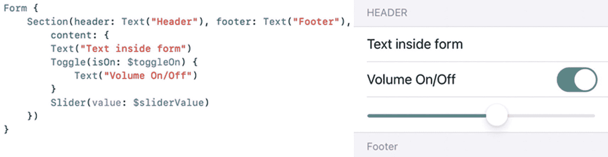
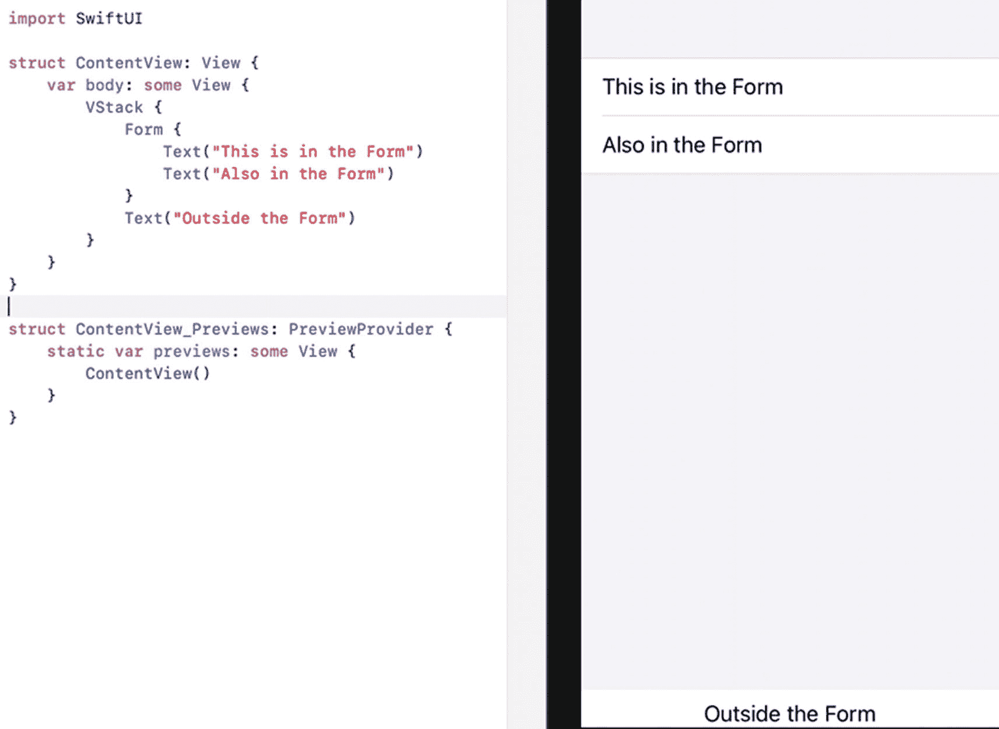
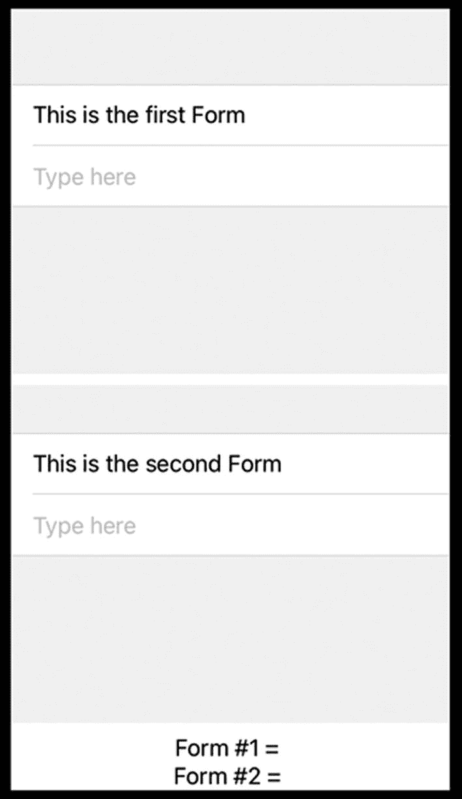
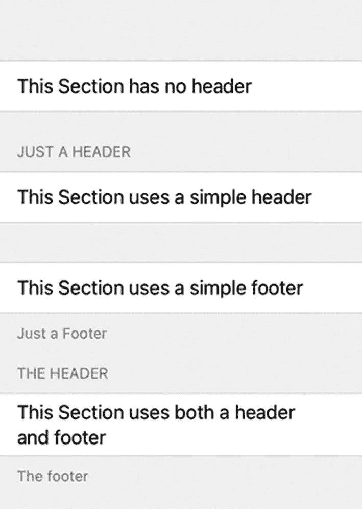
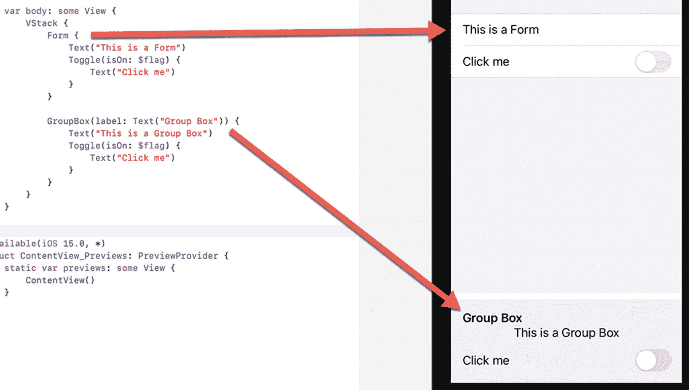
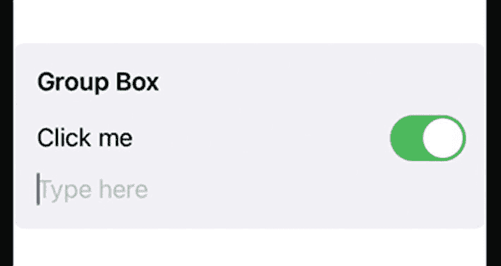

# 14. 使用表单和分组框

当你填写纸质表单时，可能会注意到纸质表单将相关项分组在一起。例如，表单可能会在表单的一个区域询问你的姓名、地址和电话号码，并在表单的另一个区域询问你的性别、种族背景或婚姻状况。纸质表单使得在同一个区域输入相关数据变得很容易。

SwiftUI 的 Form 以类似的方式工作，它将提供用户可选择选项和设置的相关视图分组在一起。表单由可选的页眉、可选的页脚以及由 `Text`、`Slider` 或 `Toggle` 等视图定义的内容组成，如图 14-1 所示。



图 14-1 – 表单的典型组成部分

一个 Form 像堆栈一样将相关视图分组在一起。不同之处在于，Form 还在用户界面上以视觉方式将视图分组。Form 内的所有视图会一起显示，而任何不在 Form 内的视图则会通过灰色区域分隔开，如图 14-2 所示。



图 14-2 – 表单在用户界面上将视图分组在一起

与 Form 类似的是 Group Boxes（分组框），它为你提供了一种更简单的方法来在用户界面上以视觉方式将相关视图分组。当你需要将视图分组时，可以在 Form 和 Group Box 之间进行选择。


## 创建简单表单

最简单的`Form`仅用于将单个或多个视图组合在一起。要创建一个`Form`，只需这样做：

```
Form {
    //
}
```

要了解如何创建简单的`Form`，请按以下步骤操作：

1. 新建一个 SwiftUI iOS App 项目，并为其任意命名，例如 "SimpleForm"。
2. 在导航器窗格中点击`ContentView`文件。
3. 在`struct ContentView: View`代码行下添加两个`State`变量，如下所示：

```
struct ContentView: View {
    @State var messageOne = ""
    @State var messageTwo = ""
```

4. 在`var body: some View`内部添加一个`VStack`，如下所示：

```
var body: some View {
    VStack {
    }
}
```

5. 在`VStack`内部添加两个`Form`视图和两个`Text`视图，如下所示：

```
var body: some View {
    VStack {
        Form {
            Text("This is the first Form")
            TextField("Type here", text: $messageOne)
        }
        Form {
            Text("This is the second Form")
            TextField("Type here", text: $messageTwo)
        }
        Text("Form #1 = \(messageOne)")
        Text("Form #2 = \(messageTwo)")
    }
}
```

整个`ContentView`文件应如下所示：

```
import SwiftUI

struct ContentView: View {
    @State var messageOne = ""
    @State var messageTwo = ""

    var body: some View {
        VStack {
            Form {
                Text("这是第一个表单")
                TextField("在此输入", text: $messageOne)
            }
            Form {
                Text("这是第二个表单")
                TextField("在此输入", text: $messageTwo)
            }
            Text("表单 #1 = \(messageOne)")
            Text("表单 #2 = \(messageTwo)")
        }
    }
}

struct ContentView_Previews: PreviewProvider {
    static var previews: some View {
        ContentView()
    }
}
```

此代码创建了一个用户界面，屏幕上显示两个表单，以及两个不属于任何`Form`的`Text`视图，如图 14-3 所示。



**图 14-3** 用户界面上出现两个表单

1. 点击画布窗格中的 Live Preview（实时预览）图标。
2. 点击顶部的`TextField`并输入一些文本。请注意，此文本现在会显示在屏幕底部的`Text`视图（"表单 #1 ="）中。
3. 点击中间的`TextField`并输入一些文本。请注意，此文本现在会显示在屏幕底部的`Text`视图（"表单 #2 ="）中。

### 将表单划分为分区

一个`Form`可以容纳一个或多个视图。然而，`Form`中的视图越多，所有视图会显得越拥挤。为了对相关视图进行分组，你可以将`Form`划分为多个`Section`，每个`Section`可以包含一个或多个要在屏幕上显示的视图。此外，`Section`还可以显示可选的页眉和/或页脚。

最简单的`Section`仅将相关视图分组在一起，如下所示：

```
Section {
    // 在此添加视图
}
```

尽管`Section`在用户界面上看起来有明显的区别，你还可以通过使用页眉和/或页脚来进一步区隔`Section`。如果你只想定义一个页眉，可以使用如下代码：

```
Section("此处的页眉文本") {
    // 在此添加视图
}
```

这种方法会以大写字母显示文本，即使你没有以这种方式输入。定义页眉的另一种方式如下所示：

```
Section(content: {
    // 在此添加视图
}, header: {
    // 在此定义页眉文本
})
```

你也可以使用此方法仅定义页脚，如下所示：

```
Section(content: {
    // 在此添加视图
}, footer: {
    // 在此定义页脚文本
})
```

**注意：** 页脚中的文本会完全按照你输入的形式显示，这与自动以全大写形式显示文本的页眉不同。

如果你想同时定义页眉和页脚，可以使用以下代码：

```
Section {
    // 在此添加视图
} header: {
    // 在此定义页眉文本
} footer: {
    // 在此定义页脚文本
}
```

要了解如何在`Section`中创建页眉和页脚，请按以下步骤操作：

1. 新建一个 SwiftUI iOS App 项目，并为其任意命名，例如 "HeaderFormSections"。
2. 在导航器窗格中点击`____App`文件，其中`____`是你的项目名称。
3. 在`struct`上方添加以下内容：

```
@available(iOS 15.0, *)
```

4. 在导航器窗格中点击`ContentView`文件。
5. 在两个结构体上方添加以下内容：

```
@available(iOS 15.0, *)
```

6. 在`var body: some View`内部添加一个`Form`，如下所示：

```
var body: some View {
    Form {
    }
}
```

7. 在`Form`内部以不同方式添加四个`Section`，如下所示：

```
var body: some View {
    Form {
        Section {
            Text("此分区没有页眉")
        }
        Section("仅一个页眉") {
            Text("此分区使用简单的页眉")
        }
        Section {
            Text("此分区使用简单的页脚")
        } footer: {
            Text("仅一个页脚")
        }
        Section {
            Text("此分区同时使用了页眉和页脚")
        } header: {
            Text("页眉")
        } footer: {
            Text("页脚")
        }
    }
}
```

整个`ContentView`文件应如下所示：

```
import SwiftUI

@available(iOS 15.0, *)
struct ContentView: View {
    var body: some View {
        Form {
            Section {
                Text("此分区没有页眉")
            }
            Section("仅一个页眉") {
                Text("此分区使用简单的页眉")
            }
            Section {
                Text("此分区使用简单的页脚")
            } footer: {
                Text("仅一个页脚")
            }
            Section {
                Text("此分区同时使用了页眉和页脚")
            } header: {
                Text("页眉")
            } footer: {
                Text("页脚")
            }
        }
    }
}

@available(iOS 15.0, *)
struct ContentView_Previews: PreviewProvider {
    static var previews: some View {
        ContentView()
    }
}
```

上述代码创建了一个包含四个不同`Section`的`Form`，如图 14-4 所示。



**图 14-4** 显示分区的四种不同方式


## 在表单中禁用视图

通常，纸质表单可能会提出一系列问题。根据你的回答，另一组问题可能不再相关。例如，如果纸质表单询问你是已婚还是单身，你可能会回答“已婚”。在这种情况下，表单的另一部分可能会询问你配偶的姓名和联系方式。

然而，如果你回答“单身”，就没有必要再回答任何关于配偶的问题了。使用 SwiftUI 表单，你可以通过使用 `.disabled` 修饰符，基于一个布尔值选择性地禁用 `Form` 中的视图，如下所示：

```
.disabled(flag)
```

如果布尔变量的值为 `true`，那么 `.disabled` 修饰符会阻止用户与所选视图进行交互。如果布尔变量的值为 `false`，那么 `.disabled` 修饰符则允许用户与所选视图进行交互。

要了解如何在 `Form` 中使用 `.disabled` 修饰符，请按照以下步骤操作：

1.  创建一个新的 SwiftUI iOS App 项目，并为其命名，例如 “FormDisable”。
2.  在导航窗格中点击 `____App` 文件，其中 `____` 是你项目的名称。
3.  在 `struct` 上方添加以下代码：

1.  在导航窗格中点击 `ContentView` 文件。
2.  在两个结构体上方添加以下代码：

```
@available(iOS 15.0, *)
```

1.  在 `struct ContentView: View` 行下方添加以下 `State` 变量，如下所示：

```
@available(iOS 15.0, *)
```

1.  在 `var body: some View` 中添加一个 `Form`，如下所示：

```
struct ContentView: View {
@State var flag = false
```

1.  在 `Form` 内部添加一个 `Section` 来定义页眉和页脚，如下所示：

```
var body: some View {
Form {
}
}
```

1.  在 `Section` 内部添加一个 `Toggle` 和一个 `Button`，如下所示：

```
var body: some View {
Form {
Section {
} header: {
Text("Header")
} footer: {
Text("Footer")
}
}
}
```

```
var body: some View {
Form {
Section {
Toggle(isOn: $flag) {
Text("Are you married?")
}
Button(flag ? "Disabled" : "Click Me") {
}.disabled(flag)
} header: {
Text("Header")
} footer: {
Text("Footer")
}
}
}
```

注意，`.disabled` 修饰符会影响 `Button`。如果 `flag` 布尔变量为 `true`，则 `Button` 将被禁用。如果 `flag` 布尔变量为 `false`，则 `Button` 将处于启用状态。整个 `ContentView` 文件应该如下所示：

1.  点击画布窗格中的“Live Preview”图标。注意 `Button` 以蓝色显示标题“Click Me”。
2.  点击 `Toggle`。这会将 `flag` 状态变量从 `false` 更改为 `true`（或从 `true` 更改为 `false`）。当 `flag` 状态变量等于 `true` 时，`.disabled` 修饰符会使 `Button` 变灰，使用户无法选择它。

```
import SwiftUI
@available(iOS 15.0, *)
struct ContentView: View {
@State var flag = false
var body: some View {
Form {
Section {
Toggle(isOn: $flag) {
Text("Are you married?")
}
Button(flag ? "Disabled" : "Click Me") {
}.disabled(flag)
} header: {
Text("Header")
} footer: {
Text("Footer")
}
}
}
}
@available(iOS 15.0, *)
struct ContentView_Previews: PreviewProvider {
static var previews: some View {
ContentView()
}
}
```

## 使用分组框

分组框提供了一种更简单的方法来将相关视图组织在一起。虽然与 `Form` 类似，但分组框可以显示标签并以图形方式在灰色矩形内显示多个视图，而 `Form` 则在白色矩形内显示多个视图，如图 14-5 所示。



图 14-5

`Form` 和分组框之间的视觉差异

要了解如何使用分组框，请按照以下步骤操作：

1.  创建一个新的 SwiftUI iOS App 项目，并为其命名，例如 “GroupBox”。
2.  在导航窗格中点击 `ContentView` 文件。
3.  在 `struct ContentView: View` 行下方添加以下 `State` 变量，如下所示：

1.  在 `var body: some View` 中添加一个分组框，如下所示：

```
struct ContentView: View {
@State var flag = false
@State var message = ""
```

1.  在分组框内部添加一个 `Toggle` 和一个 `TextField`，如下所示：

```
var body: some View {
GroupBox(label: Text("Group Box")) {
}
}
```

```
var body: some View {
GroupBox(label: Text("Group Box")) {
Toggle(isOn: $flag) {
Text("Click me")
}
TextField("Type here", text: $message)
}
}
```

整个 `ContentView` 文件应该如下所示：

```
import SwiftUI
struct ContentView: View {
@State var flag = false
@State var message = ""
var body: some View {
GroupBox(label: Text("Group Box")) {
Toggle(isOn: $flag) {
Text("Click me")
}
TextField("Type here", text: $message)
}
}
}
struct ContentView_Previews: PreviewProvider {
static var previews: some View {
ContentView()
}
}
```

上述代码创建了一个分组框，如图 14-6 所示。



图 14-6

分组框的外观

## 总结

`Form` 允许你在用户界面上将相关视图视觉上分组在一起。为了进一步区分 `Form` 上的视图，你可以将一个 `Form` 划分为多个 `Section`，每个 `Section` 允许你定义可选的页眉和/或页脚。一个 `Section` 可以有页眉、页脚、同时有页眉和页脚，或者两者都没有。

根据用户对用户界面的响应方式，你可能希望禁用一个或多个视图，以防止用户与之交互。禁用一个或多个视图可以防止用户输入不必要的数据。

`Form` 和分组框只是将相关视图分组在一起的两种不同方式，目的是使你的应用程序用户界面更易于理解。

