# 15. 使用 Disclosure Groups、Scroll Views 和 Outline Groups

许多应用程序包含大量信息，例如姓名和地址。但是，你可能不希望同时查看所有存储的信息，以免屏幕过于杂乱。当你希望为用户提供选择性地隐藏或显示信息的选项时，就可以使用 Disclosure Group 或 Outline Group。

Disclosure Group 可以呈现两种状态。首先，它可以显示为一行代表链接的文本。其次，当用户点击此链接时，它会展开以显示一个或多个附加视图，如图 15-1 所示。

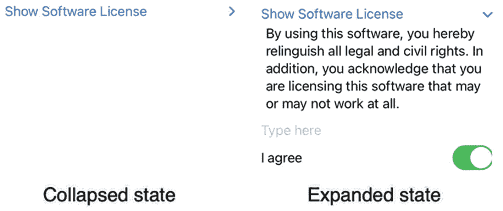

图 15-1

Disclosure Group 的两种状态

Disclosure Group 可以选择性地隐藏或显示一组相关视图，而 Outline Group 则可以在 `List`（参见第 13 章）中选择性地隐藏或显示文本组，如图 15-2 所示。

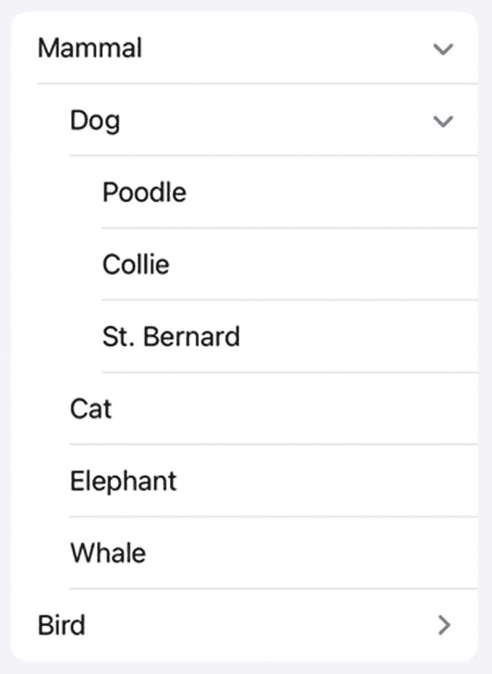

图 15-2

Outline Group 的外观


## 使用 Disclosure Group

`DisclosureGroup` 旨在隐藏一个或多个视图（如 `Text`、`Slider`、`Toggle` 等），直到用户点击 `DisclosureGroup` 名称将其展开。展开时，`DisclosureGroup` 会在用户界面上显示一个或多个视图。

**注意：** 与堆栈类似，一个 `DisclosureGroup` 最多可以容纳十个视图。但是，其中某些视图可以是能容纳多个子视图的堆栈。此外，你还可以在 `DisclosureGroup` 内嵌套其他 `DisclosureGroup`。

要创建一个 `DisclosureGroup`，首先需要创建一段描述性文本，它在用户界面上代表一个链接。这段文本右侧会显示一个 ➤ 符号，提示用户该链接包含隐藏项。其次，你需要创建一个视图列表（最多十个），当用户选择该 `DisclosureGroup` 链接时，这些视图将会显示出来。

要了解如何创建 `DisclosureGroup`，请按照以下步骤操作：

1.  创建一个新的 SwiftUI iOS App 项目，并随意命名，例如 “`DisclosureGroup`”。
2.  在导航器面板中点击 `ContentView` 文件。
3.  在 `struct ContentView: View` 代码行下方添加三个 `State` 变量，如下所示：

    ```
    struct ContentView: View {
    @State var sliderValue = 0.0
    @State var message = ""
    @State var flag = true
    ```

4.  在 `var body: some View` 内部添加一个 `DisclosureGroup`，如下所示：

    ```
    var body: some View {
    DisclosureGroup("展开我") {
    }
    }
    ```

5.  在 `DisclosureGroup` 内部添加以下内容：

    ```
    var body: some View {
    DisclosureGroup("展开我") {
    Text("你输入了 = \(message)")
    TextField("在此输入", text: $message)
    .padding()
    Text(flag ? "开关 = 开启" : "开关 = 关闭")
    Toggle(isOn: $flag) {
    Text("开关")
    }.padding()
    Text("滑块值 = \(sliderValue)")
    Slider(value: $sliderValue, in: 0...15)
    .padding()
    }
    }
    ```

完整的 `ContentView` 文件应如下所示：

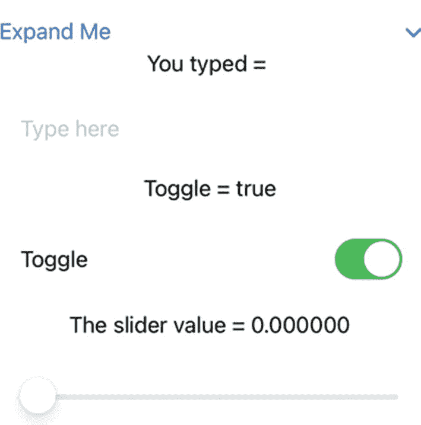

**图 15-3** 展开后的 `DisclosureGroup`

6.  点击画布面板中的实时预览图标。
7.  点击 “展开我” `DisclosureGroup` 链接，以显示隐藏在内的所有视图，如图 15-3 所示。

    ```
    import SwiftUI
    struct ContentView: View {
    @State var sliderValue = 0.0
    @State var message = ""
    @State var flag = true
    var body: some View {
    DisclosureGroup("展开我") {
    Text("你输入了 = \(message)")
    TextField("在此输入", text: $message)
    .padding()
    Text(flag ? "开关 = 开启" : "开关 = 关闭")
    Toggle(isOn: $flag) {
    Text("开关")
    }.padding()
    Text("滑块值 = \(sliderValue)")
    Slider(value: $sliderValue, in: 0...15)
    .padding()
    }
    }
    }
    struct ContentView_Previews: PreviewProvider {
    static var previews: some View {
    ContentView()
    }
    }
    ```

8.  点击文本字段并输入一些文字。注意，你输入的任何文字都会显示在显示 “你输入了 =” 的 `Text` 视图中。
9.  点击开关。注意，每次点击开关时，开关上方显示 “开关 = 开启” 或 “开关 = 关闭” 的 `Text` 视图会相应更新。
10. 左右拖动滑块。注意，拖动滑块时，其数值会显示在滑块上方显示 “滑块值 =” 的 `Text` 视图中。
11. 再次点击 `DisclosureGroup` 链接以隐藏所有视图。每次点击 `DisclosureGroup` 链接时，它会在显示 `DisclosureGroup` 内的所有视图和隐藏它们之间切换。

## 使用 Scroll View

当你在 `VStack` 中排列多个视图时，这些视图会固定在用户界面中。如果你显示的视图数量超过用户界面所能显示的范围，部分视图将被截断或隐藏不见。为了解决这个问题，SwiftUI 提供了一种特殊的容器，称为 Scroll View（滚动视图）。

与堆栈类似，Scroll View 可以容纳多个视图。与堆栈不同，Scroll View 允许用户垂直或水平滚动以查看 Scroll View 的全部内容。Scroll View 可以在任何你可能使用堆栈的地方工作，包括在 `DisclosureGroup` 内部。

创建 Scroll View 最简单的方法是像这样定义一个 `ScrollView`：

```
ScrollView {
//  在此放置多个视图
}
```

这允许你垂直滚动，并在右侧显示滚动指示器。滚动指示器让你了解当前滚动位置距离列表项开头或结尾的远近程度，如图 15-4 所示。

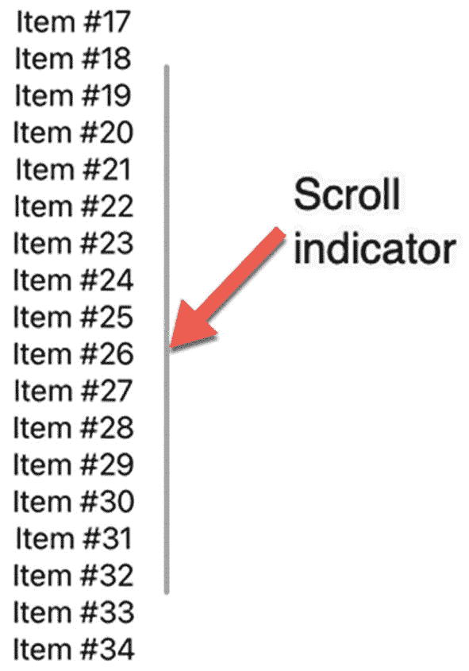

**图 15-4** 滚动指示器出现在垂直滚动的 Scroll View 右侧

另一种创建 Scroll View 的方法是定义滚动方向（`Axis.Set.horizontal` 或 `Axis.Set.vertical`）以及是否显示滚动指示器（`showsIndicators:` 参数），如下所示：

```
ScrollView(Axis.Set.horizontal, showsIndicators: false, content: {
}
```

要了解 Scroll View 如何工作，请按照以下步骤操作：

1.  创建一个新的 SwiftUI iOS App 项目，并随意命名，例如 “`ScrollView`”。
2.  在导航器面板中点击 `ContentView` 文件。
3.  在 `var body: some View` 代码行下方添加一个 `ScrollView`，如下所示：

    ```
    var body: some View {
    ScrollView(Axis.Set.vertical, showsIndicators: true, content: {
    })
    ```

    要缩短 `ScrollView` 代码，你可以直接这样写：

    ```
    var body: some View {
    ScrollView {
    }
    ```

4.  在 `ScrollView` 内部添加一个 `ForEach` 循环，如下所示：

    ```
    var body: some View {
    ScrollView(Axis.Set.vertical, showsIndicators: true, content: {
    ForEach(0..<50) {
    Text("项目 #\($0)     ")
    }
    })
    ```

5.  点击画布面板上的实时预览图标。
6.  在用户界面上显示的 “项目 #” 列表项中上下滚动。注意上下滚动时，你可以看到右侧的滑块指示器。


## 使用大纲组

`OutlineGroup` 的作用类似于一个超级 `DisclosureGroup`。主要区别在于，`DisclosureGroup` 最多只能显示十个视图，而 `OutlineGroup` 可以显示在单独类中定义的无限数量的项目。此外，`OutlineGroup` 会自动缩进类别，以便更容易看清项目之间的层级关系（见图 15-2）。

`OutlineGroup` 用于显示定义关系的对象数组。要使用 `OutlineGroup`，您需要执行以下操作：

-   创建一个用于存放要显示数据的类。
-   创建一个用于存放由该类定义的多个对象的数组。
-   创建一个用于显示对象中存储数据的 `OutlineGroup`。

要创建一个存放要显示数据的类，您需要使其符合 `Identifiable` 协议。这样，基于该类创建的每个对象都将拥有一个唯一的标识号，如下所示：

```
class Species: Identifiable {
    let id = UUID()
}
```

接下来，您需要在 `OutlineGroup` 中定义要显示的数据，例如一个字符串，如下所示：

```
class Species: Identifiable {
    let id = UUID()
    var name: String
}
```

下一步是创建一个可选的数组，用于存放子类别。这些子类别项也必须是同一个类，如下所示：

```
class Species: Identifiable {
    let id = UUID()
    var name: String
    var classification: [Species]?
}
```

最后，该类需要一个初始化器，因为该类的所有属性都没有初始值。这意味着每次创建对象时，都必须为其属性赋值。在这种情况下，唯一需要赋值的属性是“name”属性，它持有一个绝对必要的 `String` 数据类型。另一个名为“classification”的属性可以持有一个对象数组，也可以是 `nil` 值：

```
class Species: Identifiable {
    let id = UUID()
    var name: String
    var classification: [Species]?
    init(name: String, classification: [Species]? = nil) {
        self.name = name
        self.classification = classification
    }
}
```

定义类之后，下一步是定义一个基于该类存放对象的数组，如下所示：

```
var Animals: [Species] = [
    Species(name: "Mammal", classification: [
        Species(name: "Dog", classification: [
            Species(name: "Poodle"),
            Species(name: "Collie"),
        ]),
    ]),
]
```

请注意，此数组被定义为存放基于所定义类的对象（本例中为“`Animals`”）。数组中的每个对象都需要一个名称（例如“Mammal”或“Collie”）。某些对象不包含子类别列表，但对于那些包含子类别列表的对象，您需要指定一个基于同一个类（“`Species`”）的对象数组。在前面的示例中，“Dog”对象定义了一个包含“Poodle”和“Collie”的对象数组。

第三步是定义一个 `OutlineGroup`：

```
OutlineGroup(Animals, id: \.id, children: \.classification) { creature in
    Text(creature.name)
}
```

这定义了要使用的数组（`Animals`），并使用唯一 ID（在类声明中由 `UUID()` 定义）来显示数组中的每个项目。如果对象中存储有任何子项或子类别，则由 `children:` 参数标识。最后，`OutlineGroup` 中的 `Text` 视图显示每个对象的 `name` 属性。

要了解如何使用 `OutlineGroup`，请按照以下步骤操作：

1.  创建一个新的 SwiftUI iOS App 项目，并为其指定任意名称，例如“`OutlineGroup`”。
2.  在导航器窗格中点击 `ContentView` 文件。
3.  在 `import SwiftUI` 行下方添加以下类声明，如下所示：

```
class Species: Identifiable {
    let id = UUID()
    var name: String
    var classification: [Species]?
    init(name: String, classification: [Species]? = nil) {
        self.name = name
        self.classification = classification
    }
}
```

4.  在 `struct ContentView: View` 行下方添加以下数组，如下所示：

```
struct ContentView: View {
    var Animals: [Species] = [
        Species(name: "Mammal", classification: [
            Species(name: "Dog", classification: [
                Species(name: "Poodle"),
                Species(name: "Collie"),
                Species(name: "St. Bernard"),
            ]),
            Species(name: "Cat"),
            Species(name: "Elephant"),
            Species(name: "Whale"),
        ]),
        Species(name: "Bird", classification: [
            Species(name: "Canary"),
            Species(name: "Parakeet"),
            Species(name: "Eagle"),
        ]),
    ]
}
```

5.  在 `var body: some View` 行下方添加 `OutlineGroup`，如下所示：

```
var body: some View {
    List {
        OutlineGroup(Animals, id: \.id, children: \.classification) { creature in
            Text(creature.name)
        }
    }
}
```

整个 `ContentView` 文件应如下所示：

```
import SwiftUI

class Species: Identifiable {
    let id = UUID()
    var name: String
    var classification: [Species]?
    init(name: String, classification: [Species]? = nil) {
        self.name = name
        self.classification = classification
    }
}

struct ContentView: View {
    var Animals: [Species] = [
        Species(name: "Mammal", classification: [
            Species(name: "Dog", classification: [
                Species(name: "Poodle"),
                Species(name: "Collie"),
                Species(name: "St. Bernard"),
            ]),
            Species(name: "Cat"),
            Species(name: "Elephant"),
            Species(name: "Whale"),
        ]),
        Species(name: "Bird", classification: [
            Species(name: "Canary"),
            Species(name: "Parakeet"),
            Species(name: "Eagle"),
        ]),
    ]

    var body: some View {
        List {
            OutlineGroup(Animals, id: \.id, children: \.classification) { creature in
                Text(creature.name)
            }
        }
    }
}

struct ContentView_Previews: PreviewProvider {
    static var previews: some View {
        ContentView()
    }
}
```

6.  在画布窗格中点击 Live Preview 图标。
7.  点击 `OutlineGroup` 中任何在最右侧显示 ➤ 字符的项目。这表示该项目包含可以显示的附加列表（见图 15-2）。

`OutlineGroup` 可以很方便地存储和显示用户可以隐藏或显示的项目列表。由于 `OutlineGroup` 使用数组，因此在 `OutlineGroup` 中可以显示的项目数量没有限制（这与 `DisclosureGroup` 最多十个视图的限制不同）。

## 总结

`DisclosureGroup` 可以方便地暂时隐藏一个或多个视图。通过点击 `DisclosureGroup` 标题，您可以在显示和隐藏附加视图之间切换。可以把 `DisclosureGroup` 想象成一个可折叠的视图列表。

`DisclosureGroup` 使隐藏或查看数据变得容易，而 `ScrollView` 则使上下滚动查看附加数据变得简单。您甚至可以在 `DisclosureGroup` 内部使用 `ScrollView`。

如果您需要以层次结构显示数据，请考虑使用 `OutlineGroup`。使用 `OutlineGroup` 需要定义一个类，其中包含您要存储的属性以及一个 `UUID()`，以便为每一块数据自动创建不同的 ID 编号。然后，您需要根据定义的类创建一个对象数组。最后，您可以使用 `OutlineGroup` 在屏幕上显示数据。

`DisclosureGroup`、`ScrollView` 和 `OutlineGroup` 只是将相关数据分组在一起的不同方式。`DisclosureGroup` 类似于可折叠的列表。`ScrollView` 允许用户查看通常可能被截断的数据。`OutlineGroup` 类似于多个可以有选择地隐藏或显示数据的 `DisclosureGroup`。这三种视图的全部目的都是为了提供向用户显示信息的不同方式。


## 使用导航视图

只有最简单的应用（如计算器应用）才由单个屏幕组成。然而，大多数应用通常需要两个或更多屏幕来显示信息。在 SwiftUI 中，你可以通过创建独立的结构来定义应用用户界面的每个屏幕。然后，你需要提供一种从一个屏幕跳转到另一个屏幕的方法。

从一个屏幕跳转到另一个屏幕的最简单方法之一是通过**导航视图**，它可以按顺序显示多个屏幕。这种导航视图广泛用于许多 iOS 应用（如“设置”），让用户可以查看不同的选项，如图 16-1 所示。

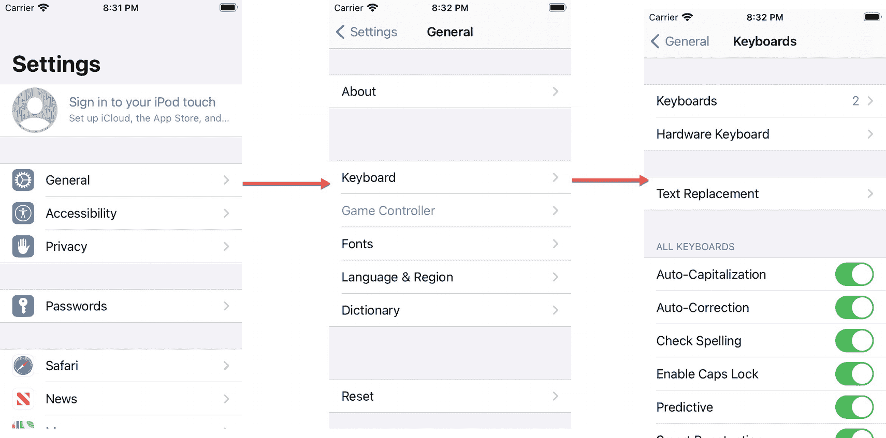

图 16-1

导航视图使从一个屏幕跳转到另一个屏幕变得简单

在图 16-1 中，用户可以点击主屏幕上的“设置”图标来显示设置屏幕。点击“通用”会打开通用屏幕。接着点击“键盘”会打开键盘屏幕。请注意，要返回，只需点击左上角的“返回”按钮即可。

从键盘屏幕，返回按钮带你回到通用屏幕。从通用屏幕，返回按钮带你回到设置屏幕。导航视图所做的仅仅是允许用户按顺序从一个屏幕跳转到另一个屏幕。

## 使用导航视图

导航视图可以像栈一样容纳最多十个视图。导航视图使用如下代码包含多个视图：

```
NavigationView {
// 在这里放置多个视图
}
```

导航视图会在屏幕顶部创建一小块空间，称为导航栏。这个空间的目的是显示按钮或图标。在添加任何按钮或图标之前，这个导航栏空间将显示为空白。

修改导航视图的一种常见方式是使用 `.navigationTitle` 和 `.navigationBarTitleDisplayMode` 修饰符来添加标题。

> **注意**
> 当为 `NavigationView` 添加修饰符时，请将修饰符放在 `NavigationView` 的花括号内，如下所示：
> ```
> NavigationView {
>     .navigationTitle("导航标题")
>     .navigationBarTitleDisplayMode(.inline)
> }
> ```

`.navigationTitle` 修饰符允许你定义显示在屏幕顶部的文本。`.navigationBarTitleDisplayMode` 修饰符允许你定义该标题在屏幕上的显示方式。两个选项是 `.large` 和 `.inline`，如图 16-2 所示，如果你不添加 `.navigationBarTitleDisplayMode` 修饰符，`.large` 是默认选项。

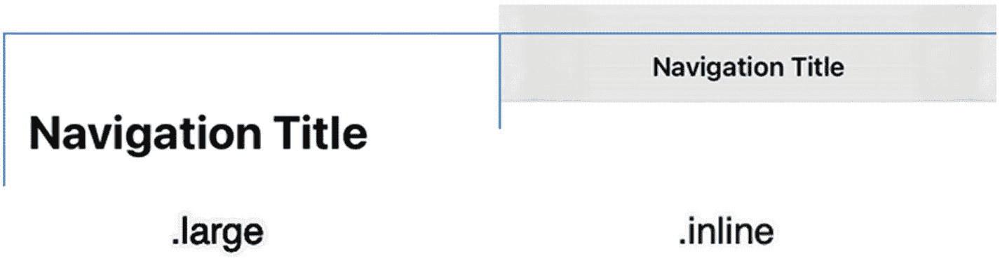

图 16-2

导航标题在 `.large` 和 `.inline` 修饰符下的外观

要了解如何创建一个简单的导航视图，请遵循以下步骤：

1. 创建一个新的 SwiftUI iOS 应用项目，并为其指定任意名称，例如 “SimpleNavigationView”。
2. 在导航器面板中点击 `ContentView` 文件。
3. 在 `struct ContentView: View` 行下添加一个状态变量，如下所示：
4. 在 `var body: some View` 内部添加一个 `NavigationView`，如下所示：
5. 添加一个 `Toggle`、一个 `.navigationTitle` 修饰符和一个 `.navigationBarTitleDisplayMode` 修饰符，如下所示：

```
struct ContentView: View {
    @State var flag = true
}
```

```
var body: some View {
    NavigationView {
    }
}
```

```
var body: some View {
    NavigationView {
        Toggle(isOn: $flag, label: {
            Text("切换显示模式")
        })
        .navigationTitle("导航标题")
        .navigationBarTitleDisplayMode(flag ? .large : .inline)
    }
}
```

这段代码根据 `Toggle` 的值将导航标题的外观更改为 `.large` 或 `.inline`。

1. 点击画布面板上的 Live Preview 图标。
2. 点击 `Toggle`，观察导航标题如何在 `.large` 和 `.inline` 样式之间切换。

如果你想完全隐藏导航标题和导航栏，可以使用 `.navigationBarHidden` 修饰符，如下所示：

```
.navigationBarHidden(true)
```

如果你不希望导航视图占据屏幕顶部的空间，或者想临时隐藏导航标题，这会很有用。

### 向导航栏添加按钮

导航栏提供了在屏幕顶部显示一个或多个按钮的空间。在导航栏上创建按钮的第一步是向 Navigation View 内部添加 `.toolbar` 修饰符，如下所示：

```
NavigationView {
    .navigationTitle("导航标题")
    .toolbar {
    }
}
```

默认情况下，在 `.toolbar` 内部定义的任何按钮或图标的颜色都是蓝色。如果你想定义不同的颜色，可以向 `NavigationView` 添加 `.accentColor` 修饰符，如下所示：

```
NavigationView {
    .navigationTitle("导航标题")
    .toolbar {
    }
}
.accentColor(.purple)
```

在 `.toolbar` 修饰符内部，你可以定义一个或多个 `ToolbarItem`。对于添加的每个 `ToolbarItem`，你可以定义其位置（在左上角为 `.navigationBarLeading`，或在右上角为 `.navigationBarTrailing`）。此外，你必须定义按钮的外观以及用户选择该按钮时要运行的代码，如下所示：

```
.toolbar {
    ToolbarItem(placement: .navigationBarLeading) {
        Button {
            //  要运行的代码
        } label: {
            //  在此处定义按钮的外观
        }
    }
    ToolbarItem(placement: .navigationBarTrailing) {
        Button {
            //  要运行的代码
        } label: {
            //  在此处定义按钮的外观
        }
    }
}
```

要了解如何在导航视图中定义按钮，请遵循以下步骤：

1. 创建一个新的 SwiftUI iOS 应用项目，并为其指定任意名称，例如 “NavigationViewButtons”。
2. 在导航器面板中点击 `ContentView` 文件。
3. 在 `struct ContentView: View` 行下添加两个状态变量，如下所示：
4. 在 `var body: some View` 行下添加一个 `NavigationView` 和一个 `VStack`，如下所示：
5. 向 `NavigationView` 添加 `.accentColor` 修饰符，如下所示：
6. 添加一个 `Text` 视图、一个 `Toggle`、`.navigationTitle`、`.navigationBarTitleDisplayMode` 和 `.toolbar` 修饰符，如下所示：
7. 在 `.toolbar` 内部添加两个 `ToolbarItems`，如下所示：

```
struct ContentView: View {
    @State var flag = true
    @State var message = ""
}
```

```
var body: some View {
    NavigationView {
        VStack {
        }
    }
}
```

```
var body: some View {
    NavigationView {
        VStack {
        }
    }
    .accentColor(.purple)
}
```

```
var body: some View {
    NavigationView {
        VStack {
            Text(message)
            Toggle(isOn: $flag, label: {
                Text("切换显示模式")
            })
            .navigationTitle("导航标题")
            .navigationBarTitleDisplayMode(flag ? .large : .inline)
            .toolbar {
            }
        }
    }
    .accentColor(.purple)
}
```

```
var body: some View {
    NavigationView {
        VStack {
            Text(message)
            Toggle(isOn: $flag, label: {
                Text("切换显示模式")
            })
            .navigationTitle("导航标题")
            .navigationBarTitleDisplayMode(flag ? .large : .inline)
            .toolbar {
                ToolbarItem(placement: .navigationBarLeading) {
                    Button {
                        message = "已点击 iCloud 图标"
                    } label: {
                        Image(systemName: "icloud")
                    }
                }
                ToolbarItem(placement: .navigationBarTrailing) {
                    Button {
                        message = "已点击完成按钮"
                    } label: {
                        Text("完成")
                    }
                }
            }
        }
    }
    .accentColor(.purple)
}
```

对于每个 `ToolbarItem`，你可以使用 `Text` 视图或 `Image` 视图来定义按钮的外观。上述代码在左上角显示一个云图标，在右上角显示单词“完成”，如图 16-3 所示。

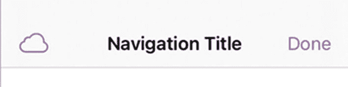

图 16-3

使用 `.inline` 修饰符的工具栏按钮外观

1. 点击画布面板上的 Live Preview 图标。
2. 点击导航栏中由 `ToolbarItem` 定义的按钮。注意每次点击工具栏按钮时，`Text` 视图中会显示一条消息，例如“已点击 iCloud 图标”或“已点击完成按钮”。


## 为导航视图添加链接

`NavigationView`的主要目的是让用户从一个屏幕跳转到另一个屏幕。为此，你需要使用`NavigationLink`来定义：

- 链接上显示的文本
- 用户选择`NavigationLink`后要显示的下一个视图

`NavigationLink`的结构如下所示：

```
NavigationLink(destination: /* 要显示的下一个视图 */) {
    // 用于定义链接外观的文本视图
}
```

目标可以是任何视图，而链接通常是一个`Text`视图，但也可以是`Image`视图。要了解如何创建导航链接，请按以下步骤操作：

1. 创建一个新的 SwiftUI iOS App 项目，并为其指定任意名称，例如`SimpleNavigationViewLinks`。
2. 在导航器窗格中点击`ContentView`文件。
3. 在`var body: some View`代码行内添加一个`NavigationView`和一个`VStack`，如下所示：

```
var body: some View {
    NavigationView {
        VStack {
        }
    }
}
```

4. 在`VStack`内部添加两个`NavigationLinks`，并添加一个`.navigationTitle`修饰符，如下所示：

```
var body: some View {
    NavigationView {
        VStack {
            NavigationLink(destination: Text("文本视图")) {
                Text("这是一个导航链接")
            }
            NavigationLink(destination: Image(systemName: "hare")) {
                Text("第二个导航链接")
            }
            .navigationTitle("导航标题")
        }
    }
}
```

第一个`NavigationLink`将`Text`视图定义为其目标，而第二个`NavigationLink`将`Image`视图定义为其目标。两者都将显示在`NavigationView`内，并在左上角带有一个返回按钮。整个`ContentView`文件应如下所示：

```
import SwiftUI

struct ContentView: View {
    var body: some View {
        NavigationView {
            VStack {
                NavigationLink(destination: Text("文本视图")) {
                    Text("这是一个导航链接")
                }
                NavigationLink(destination: Image(systemName: "hare")) {
                    Text("第二个导航链接")
                }
                .navigationTitle("导航标题")
            }
        }
    }
}

struct ContentView_Previews: PreviewProvider {
    static var previews: some View {
        ContentView()
    }
}
```

5. 点击画布窗格上的**实时预览**图标。两个`NavigationLinks`将显示在`导航标题`下方的屏幕上。
6. 点击`这是一个导航链接`。注意，显示`文本视图`的`Text`视图将出现在屏幕上，并在左上角带有一个返回按钮。
7. 点击**返回**按钮，返回到显示这两个导航链接的`NavigationView`。
8. 点击`第二个导航链接`。注意，显示`hare`图标的`Image`视图将出现在屏幕上，并在左上角带有一个返回按钮。

### 在导航视图中显示结构

在某些情况下，仅在`NavigationView`内显示单个视图（如`Text`或`Image`视图）可能没问题。然而，很多时候你可能希望显示一个全新的用户界面。由于你可以使用结构体定义用户界面屏幕，因此你可以使用多个结构体创建多个屏幕，这些屏幕可以显示在`NavigationView`内。

创建新结构体的最简单方法是在`ContentView`文件内进行。然而，这可能会使代码变得臃肿，因此第二种方法是将结构体存储在单独的文件中。

要了解如何创建定义另一个用户界面屏幕的结构体，请按以下步骤操作：

1. 创建一个新的 SwiftUI iOS App 项目，并为其指定任意名称，例如`NavigationViewStructures`。
2. 在导航器窗格中点击`ContentView`文件。
3. 在`var body: some View`代码行内添加一个`NavigationView`和一个`VStack`，如下所示：

```
var body: some View {
    NavigationView {
        VStack {
        }
    }
}
```

4. 向`VStack`添加两个`NavigationLinks`和一个`.navigationTitle`修饰符，如下所示：

```
var body: some View {
    NavigationView {
        VStack {
            NavigationLink(destination: FileView()) {
                Text("链接到同一文件中的结构")
            }
            NavigationLink(destination: SeparateFileView()) {
                Text("链接到单独文件")
            }
            .navigationTitle("导航标题")
        }
    }
}
```

第一个`NavigationLink`将显示一个名为`FileView`的结构体。第二个`NavigationLink`将显示一个名为`SeparateFileView`的结构体。由于这两个结构体尚不存在，我们需要创建它们。

5. 在`struct ContentView: View`整个结构体下方添加以下结构体，如下所示：

```
struct FileView: View {
    var body: some View {
        HStack {
            Spacer()
            VStack {
                Spacer()
                Text("这是一个独立的结构")
                Text("存储在同一个文件中")
                Spacer()
            }
            Spacer()
        }.background(Color.yellow)
    }
}
```

整个`ContentView`文件应如下所示：

```
import SwiftUI

struct ContentView: View {
    var body: some View {
        NavigationView {
            VStack {
                NavigationLink(destination: FileView()) {
                    Text("链接到同一文件中的结构")
                }
                NavigationLink(destination: SeparateFileView()) {
                    Text("链接到单独文件")
                }
                .navigationTitle("导航标题")
            }
        }
    }
}

struct FileView: View {
    var body: some View {
        HStack {
            Spacer()
            VStack {
                Spacer()
                Text("这是一个独立的结构")
                Text("存储在同一个文件中")
                Spacer()
            }
            Spacer()
        }.background(Color.yellow)
    }
}

struct ContentView_Previews: PreviewProvider {
    static var previews: some View {
        ContentView()
    }
}
```

我们可以继续在`ContentView`文件中添加新的结构体，但这有使文件变得臃肿的风险。创建结构体的第二种方法是将它们存储在单独的文件中，接下来的步骤将指导我们完成此操作。

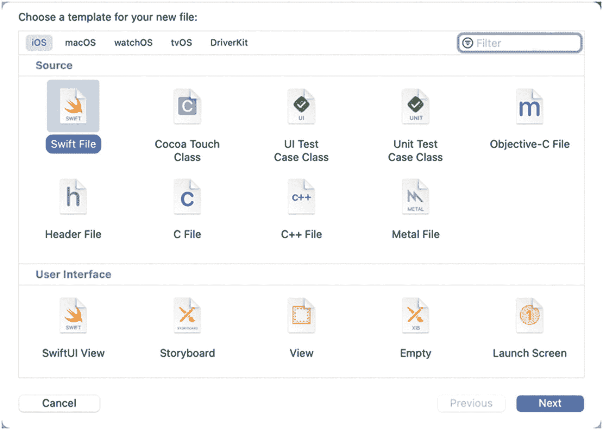

**图 16-4** — 用于选择创建文件的对话框

6. 选择**文件** ➤ **新建** ➤ **文件**。将出现一个对话框，如图 16-4 所示。
7. 点击对话框顶部的 **iOS**，点击 **Swift 文件**，然后点击**下一步**。Xcode 会提示你为新创建的文件命名。
8. 输入`SeparateFile`并点击**创建**。Xcode 会创建一个新的 Swift 文件。
9. 删除`SeparateFile`中当前的所有代码，并用以下代码替换：

```
import SwiftUI

struct SeparateFileView: View {
    var body: some View {
        HStack {
            Spacer()
            VStack {
                Spacer()
                Text("这是另一个结构")
                Text("但存储在单独的文件中")
                Spacer()
            }
            Spacer()
        }.background(Color.orange)
    }
}

struct SeparateFileView_Previews: PreviewProvider {
    static var previews: some View {
        SeparateFileView()
    }
}
```

> **注意：**将结构体存储在单独文件中时，你需要第二个结构体（`PreviewProvider`）才能在画布窗格中显示该用户界面。

10. 在导航器窗格中点击`ContentView`文件。
11. 点击画布窗格中的**实时预览**图标。
12. 点击`链接到同一文件中的结构`。注意，这将显示存储在`ContentView`文件中的`FileView`结构体。
13. 点击**返回**按钮返回原始屏幕。
14. 点击`链接到单独文件`。注意，这将显示存储在名为`SeparateFile`的文件中的`SeparateFileView`结构体。


#### 在导航视图中传递数据

上一个项目创建了两个结构体，其中一个存储在 `ContentView` 文件中，另一个存储在单独的文件夹中。在这两种情况下，这些结构体定义的用户界面显示的都是静态信息，与原始结构体 (`ContentView`) 中的任何内容都没有关联。

在许多情况下，你可能希望将某个结构体中的数据传递到另一个结构体中。这意味着我们必须将数据从一个结构体传递到另一个。

幸运的是，这项任务类似于在函数之间传递数据。当一个结构体需要接收数据时，我们只需通过创建一个变量、为该变量起一个描述性名称并定义该变量可以容纳的数据类型（如 `String` 或 `Double`）来声明一个属性，如下所示：

```
struct FileView: View {
var choice: String
```

这定义了一个名为 `choice` 的变量，它可以容纳一个 `String` 值。要将数据传递给此结构体，我们可以通过调用结构体名称 (`FileView`) 并将这个 `choice` 变量作为参数来加载此结构体，如下所示：

```
FileView(choice: "Heads")
```

当将数据传递给存储在同一文件中的结构体时，我们只需遵循以下两步流程：

-   在结构体内部声明一个或多个变量来接收数据。
-   使用这些变量作为参数来调用该结构体。

然而，当将数据传递给存储在单独文件中的结构体时，还需要额外一步。因为存储在单独文件中的结构体也包含另一个在画布面板中显示用户界面的预览结构体，所以这个预览结构体必须包含该结构体的参数，并同样为其传递数据，如下所示：

```
struct SeparateFileView_Previews: PreviewProvider {
static var previews: some View {
SeparateFileView(passedData: "")
}
}
```

要了解如何在结构体之间传递数据，请遵循以下步骤：

1.  创建一个新的 SwiftUI iOS 应用项目，并为其任意命名，例如 `NavigationViewPassData`。
2.  在导航窗格中点击 `ContentView` 文件。
3.  像这样编辑 `struct ContentView` 结构体：

```
struct ContentView: View {
var body: some View {
NavigationView {
VStack (spacing: 26) {
Text("Choose Heads or Tails")
NavigationLink(destination: FileView(choice: "Heads")) {
Text("Heads")
}
NavigationLink(destination: SeparateFileView(passedData: "Tails")) {
Text("Tails")
}
.navigationTitle("Flip a Coin")
}
}
}
}
```

上述代码定义了两个 `NavigationLink`：其中一个调用名为 `FileView` 的结构体，并传入参数 `choice:`，其值为 `"Heads"`。第二个 `NavigationLink` 调用名为 `SeparateFileView` 的结构体，并传入参数 `passedData:`，其值为 `"Tails"`。

4.  在 `struct ContentView` 下方添加一个新的结构体，如下所示：

```
struct FileView: View {
var choice: String
var body: some View {
HStack {
Spacer()
VStack {
Spacer()
Text("You chose = \(choice)")
Spacer()
}
Spacer()
}.background(Color.yellow)
}
}
```

这个 `FileView` 结构体声明了一个 `choice` 变量，它可以容纳一个 `String` 值。然后，它在一个显示 `"You chose = "` 的 `Text` 视图中展示了这个 `choice` 变量。整个 `ContentView` 文件应该如下所示：

```
import SwiftUI
struct ContentView: View {
var body: some View {
NavigationView {
VStack (spacing: 26) {
Text("Choose Heads or Tails")
NavigationLink(destination: FileView(choice: "Heads")) {
Text("Heads")
}
NavigationLink(destination: SeparateFileView(passedData: "Tails")) {
Text("Tails")
}
.navigationTitle("Flip a Coin")
}
}
}
}
struct FileView: View {
var choice: String
var body: some View {
HStack {
Spacer()
VStack {
Spacer()
Text("You chose = \(choice)")
Spacer()
}
Spacer()
}.background(Color.yellow)
}
}
struct ContentView_Previews: PreviewProvider {
static var previews: some View {
ContentView()
}
}
```

这段代码创建了一个名为 `FileView` 的结构体，但现在我们需要创建第二个名为 `SeparateFileView` 的结构体，它声明了一个 `passedData` 字符串变量。

5.  选择 **文件 ➤ 新建 ➤ 文件**。出现一个对话框（参见图 16-4）。
6.  点击对话框顶部附近的 **iOS**，点击 **Swift 文件**，然后点击 **下一步**。Xcode 会要求你为新建的文件命名。
7.  输入 `SeparateFile` 并点击 **创建**。Xcode 会创建一个新的 Swift 文件。
8.  删除 `SeparateFile` 文件中当前的所有代码，并用以下代码替换：

```
import SwiftUI
struct SeparateFileView: View {
var passedData: String
var body: some View {
HStack {
Spacer()
VStack {
Spacer()
Text("You chose = \(passedData)")
Spacer()
}
Spacer()
}.background(Color.orange)
}
}
struct SeparateFileView_Previews: PreviewProvider {
static var previews: some View {
SeparateFileView(passedData: "")
}
}
```

此文件创建了一个 `SeparateFileView` 结构体，它声明了一个 `passedData` 字符串变量。由于这个 `SeparateFileView` 结构体存储在单独的文件中，它包含一个 `struct PreviewProvider`，我们必须在此处也使用 `passedData` 参数。

9.  点击导航窗格中的 `ContentView` 以返回 `ContentView` 结构体。
10. 点击画布面板中的 **实时预览** 图标。
11. 点击 **Heads** 导航链接。`FileView` 结构体会出现，并显示 `"You chose = Heads"`。
12. 点击左上角的 **返回** 按钮。
13. 点击 **Tails** 导航链接。`SeparateFileView` 结构体会出现，并显示 `"You chose = Tails"`。


### 在导航视图中改变结构体间的数据

上一个项目创建了两个结构体，其中一个存储在 `ContentView` 文件中，另一个存储在单独的文件中。在这两种情况下，结构体都定义了用于接收和显示数据的用户界面。

如果我们将数据传递给一个结构体，然后允许该结构体修改这些数据，会发生什么？这需要做出几项修改：

- 创建一个 `State` 变量。
- 使用 `NavigationLink` 打开另一个结构体，并向该结构体传递一个与 `State` 变量绑定的（`$` 符号）引用，例如：
- 在接收数据的结构体中定义一个 `@Binding` 变量。
- 在接收数据的结构体中修改该 `Binding` 变量。

```
FileView(choice: $message)
```

要了解如何在导航视图中改变结构体间的数据，请按照以下步骤操作：

1. 创建一个新的 SwiftUI iOS App 项目，并为其任意命名，例如 "NavigationViewBindingData"。

2. 在导航器窗格中点击 `ContentView` 文件。

3. 在 `struct ContentView: View` 行下方创建一个 `State` 变量，如下所示：

```
struct ContentView: View {
@State var message = ""
```

4. 在 `var body: some View` 行内部添加一个 `NavigationView` 和一个 `VStack`，如下所示：

```
var body: some View {
NavigationView {
VStack {
}
}
```

5. 在 `VStack` 内部添加一个 `Text` 视图和两个 `NavigationLink`，如下所示：

```
NavigationView {
VStack (spacing: 26) {
TextField("在此输入", text: $message)
NavigationLink(destination: FileView(choice: $message)) {
Text("发送消息")
}
NavigationLink(destination: SeparateFileView(passedData: $message)) {
Text("单独文件")
}
.navigationTitle("传递数据")
}
}
```

请注意，第一个 `NavigationLink` 打开了一个名为 `FileView` 的结构体，并将一个绑定变量（`$message`）发送给 `choice:` 参数。第二个 `NavigationLink` 打开了一个名为 `SeparateFileView` 的结构体，并将同一个绑定变量（`$message`）发送给 `passedData` 参数。

6. 在 `struct ContentView: View` 结构体下方添加如下结构体：

```
struct FileView: View {
@Binding var choice: String
var body: some View {
HStack {
Spacer()
VStack {
Spacer()
TextField("在此输入:", text: $choice)
Spacer()
}
Spacer()
}.background(Color.yellow)
}
}
```

请注意，此结构体声明了一个名为 `choice` 的 `@Binding` 变量，该变量可以保存一个 `String`。此结构体使用一个 `TextField` 来更改此 `@Binding` 变量（`$choice`），更改会自动发送回 `ContentView` 结构体。

7. 选择 `File ➤ New ➤ File`。将会出现一个对话框（见图 16-4）。

8. 点击对话框顶部的 `iOS`，点击 `Swift File`，然后点击 `Next`。Xcode 会提示你为新创建的文件命名。

9. 输入 `SeparateFile` 并点击 `Create`。Xcode 会创建一个新的 Swift 文件。

10. 删除 `SeparateFile` 中当前的所有代码，并将其替换为以下内容：

```
import SwiftUI
struct SeparateFileView: View {
@Binding var passedData: String
var body: some View {
HStack {
Spacer()
VStack {
Spacer()
TextField("在此输入", text: $passedData)
Spacer()
}
Spacer()
}.background(Color.orange)
}
}
struct SeparateFileView_Previews: PreviewProvider {
static var previews: some View {
SeparateFileView(passedData: .constant(""))
}
}
```

请注意，此结构体声明了一个名为 `passedData` 的 `@Binding` 变量，该变量可以保存一个 `String`。`TextField` 可以更改此变量（`$passedData`）并自动将更改发送回 `ContentView` 结构体。

另请注意，由于此结构体存储在单独的文件中，因此 `PreviewProvider` 结构体也必须包含 `passedData` 参数，方法是为其提供一个 `.constant("")` 值。

11. 在导航器窗格中点击 `ContentView` 文件。

12. 点击画布窗格上的实时预览图标。

13. 点击 `TextField` 并输入一个短语。

14. 点击 "发送消息" 导航链接，该链接将字符串传递给存储在 `ContentView` 文件中的 `FileView` 结构体。

15. 点击 `FileView` 结构体显示的 `TextField` 并编辑数据。然后点击返回按钮返回到显示修改后数据的 `ContentView` 结构体。

16. 点击 "单独文件" 导航链接，该链接将字符串传递给存储在单独文件中的 `SeparateFileView` 结构体。

17. 点击 `SeparateFileView` 结构体显示的 `TextField` 并编辑数据。然后点击返回按钮返回到显示修改后数据的 `ContentView` 结构体。


### 在导航视图中实现结构体间数据共享

使用 `@State` 和 `@Binding` 变量能让多个视图共享和修改数据。但假设你创建了一个 `NavigationView`，按顺序串联起四个结构体。如果在第一个结构体中更改了数据，并希望将其传递到第四个结构体，那么你也必须将数据依次传递给第二和第三个结构体。

虽然这种方法可行，但相当笨拙。更优的做法是直接将数据传递给需要它的结构体。为此，SwiftUI 提供了另一种在结构体间共享数据的方式。首先，创建一个 `ObservableObject` 类，其中包含一个或多个待共享的变量。每个变量必须标记为 `@Published`，如下所示：

```
class ShareString: ObservableObject {
@Published var message = ""
}
```

包含 `NavigationView` 的结构体（例如 `ContentView`）需要定义一个 `@StateObject` 变量，该变量用于创建 `ObservableObject` 类的一个实例，如下所示：

```
@StateObject var showMe = ShareString()
```

由于我们希望在导航视图内的所有视图之间共享此 `ObservableObject`，需要在 `NavigationView` 上添加 `.environmentObject` 修饰符，并传入要共享的 `StateObject`，如下所示：

```
NavigationView {
}.environmentObject(showMe)
```

与其将数据传递给每个视图，`NavigationLink` 只需指定要显示的视图名称即可，例如：

```
NavigationLink(destination: FileView()) {
Text("发送消息")
}
```

在每个需要访问 `ObservableObject` 的结构体内部，我们需要声明一个 `@EnvironmentObject` 变量，该变量的类型为 `ObservableObject` 类，如下所示：

```
@EnvironmentObject var choice: ShareString
```

最后，在每个定义了 `@EnvironmentObject` 的结构体中，我们可以通过 `@EnvironmentObject` 变量名加上 `@Published` 的属性名来访问实际要共享的数据，如下所示：

```
$choice.message
```

在此示例中，`choice` 是 `@EnvironmentObject` 变量名，`message` 是在 `ObservableObject` 中定义的 `@Published` 属性。要了解如何使用 `ObservableObject` 共享数据，请按照以下步骤操作：

1.  创建一个新的 SwiftUI iOS App 项目，并为其指定任意名称，例如 `NavigationViewObservable`。

2.  在导航器窗格中点击 `ContentView` 文件。

3.  在 `import SwiftUI` 行下方创建一个 `ObservableObject` 类，如下所示：

```
class ShareString: ObservableObject {
@Published var message = ""
}
```

`@Published` 变量将包含要在导航视图内的结构体之间共享的数据。

4.  在 `struct ContentView: View` 行下方创建一个 `StateObject` 变量，如下所示：

```
struct ContentView: View {
@StateObject var showMe = ShareString()
```

这将基于 `ShareString` 这个 `ObservableObject` 创建一个新对象（`showMe`）。

5.  在 `var body: some View` 行内添加一个 `NavigationView` 和一个 `VStack`，如下所示：

```
var body: some View {
NavigationView {
VStack (spacing: 26) {
}
}
```

6.  在 `VStack` 内添加一个 `TextField`、两个 `NavigationLinks` 以及一个 `.navigationTitle` 修饰符，如下所示：

```
NavigationView {
VStack (spacing: 26) {
TextField("在此输入", text: $showMe.message)
NavigationLink(destination: FileView()) {
Text("发送消息")
}
NavigationLink(destination: SeparateFileView()) {
Text("单独文件")
}
.navigationTitle("共享数据")
}
}.environmentObject(showMe)
```

确保在 `NavigationView` 的末尾添加了 `.environmentObject(showMe)` 修饰符。这允许共享 `showMe` 这个 `ObservableObject`（即 `ShareString` 类）。前面的 `NavigationLinks` 将打开我们需要创建的两个结构体：`FileView` 和 `SeparateFileView`。

7.  在 `struct ContentView` 结构体下方添加以下结构体：

```
struct FileView: View {
@EnvironmentObject var choice: ShareString
var body: some View {
HStack {
Spacer()
VStack {
Spacer()
TextField("在此输入:", text: $choice.message)
Spacer()
}
Spacer()
}.background(Color.yellow)
}
}
```

注意，此结构体定义了一个 `@EnvironmentObject` 变量，用于容纳 `ShareString` 这个 `ObservableObject`。在 `TextField` 中，我们必须将文本存储在使用 `message` 这个 `@Published` 属性的 `choice` 这个 `@EnvironmentObject` 中（`$choice.message`）。整个 `ContentView` 文件应如下所示：

8.  选择 `文件` ➤ `新建` ➤ `文件`。将出现一个对话框（见图 \[16-4\]）。

9.  点击对话框顶部附近的 `iOS`，点击 `Swift 文件`，然后点击 `下一步`。Xcode 会要求为你新创建的文件命名。

10. 输入 `SeparateFile` 并点击 `创建`。Xcode 会创建一个新的 Swift 文件。

11. 删除 `SeparateFile` 中当前的所有代码，并将其替换为以下内容：

```
import SwiftUI
struct SeparateFileView: View {
@EnvironmentObject var passedData: ShareString
var body: some View {
HStack {
Spacer()
VStack {
Spacer()
TextField("在此输入", text: $passedData.message)
Spacer()
}
Spacer()
}.background(Color.orange)
}
}
struct SeparateFileView_Previews: PreviewProvider {
static var previews: some View {
SeparateFileView()
}
}
```

注意，此结构体也声明了一个 `@EnvironmentObject`，用于容纳 `ShareString` 这个 `ObservableObject`。然后 `TextField` 使用 `passedData` 这个 `@EnvironmentObject` 来访问 `message` 这个 `@Published` 属性（`$passedData.message`）。

12. 在导航器窗格中点击 `ContentView` 文件。

13. 在画布窗格中点击 `实时预览` 图标。

14. 点击 `TextField` 并输入一个短语。

15. 点击 `发送消息` 导航链接以打开 `FileView` 结构体。注意，第 14 步输入的内容现在会出现在 `FileView` 的 `TextField` 中。

16. 编辑 `TextField` 中的文本，然后点击 `返回` 按钮。注意，修改后的文本现在会出现在 `ContentView` 的 `TextField` 中。

17. 编辑 `TextField` 中的文本，然后点击 `单独文件` 导航链接。编辑后的文本现在会出现在 `SeparateFileView` 的 `TextField` 中。

18. 编辑 `TextField` 中的文本并点击 `返回` 按钮。注意，修改后的文本现在会出现在 `ContentView` 的 `TextField` 中。这一切展示了各个结构体如何访问 `ObservableObject` 中的 `@Published` 属性。


### 在导航视图中使用列表

另一种常见做法是不单独显示`NavigationLink`，而是创建一个`List`（参见第 13 章），让`List`中的每个条目都像链接一样工作。通过选择`List`中的条目，导航视图可以打开一个新视图。这种在导航视图中组合`List`的方式在 iOS 的“设置”应用中很常见。

首先，定义一个结构体，用于将相关信息存储在一个数组中，并使该结构体符合`Identifiable`协议，这样每个结构体都会拥有一个唯一的 ID，如下所示：

```
struct Books: Identifiable {
    var id = UUID()
    var title: String
    var summary: String
}
```

接下来，创建一个可以容纳该结构体的数组：

```
let books: [Books] = [
    Books(title: "华氏 451 度", summary: "关于焚书的反乌托邦小说"),
    Books(title: "火星编年史", summary: "关于火星殖民的故事"),
    Books(title: "邪恶降临", summary: "一个邪恶的马戏团来到小镇"),
    Books(title: "纹身人", summary: "围绕一个纹身男子展开的短篇故事集")
]
```

现在，创建一个结构体来定义一个视图，该视图将在用户选择导航链接时显示。这个结构体需要接收存储在结构体数组中的数据，例如：

```
struct BookView: View {
    var bookInfo: Books
    var body: some View {
        VStack (spacing: 24) {
            Text("\(bookInfo.title)")
                .font(.largeTitle)
            Text("\(bookInfo.summary)")
                .font(.body)
        }
    }
}
```

最后，创建一个`NavigationView`来显示一个`List`。该`List`必须使用数组来创建`NavigationLink`，这些链接不仅显示结构体数组中的数据，还定义了当用户选择`NavigationLink`时将出现的用户界面屏幕：

```
NavigationView {
    List(books) { book in
        NavigationLink(destination: BookView(bookInfo: book)) {
            Text("\(book.title)")
        }
    }
}
```

要了解如何在导航视图中使用`List`，请遵循以下步骤：

1.  创建一个新的 SwiftUI iOS App 项目，并为其取任意名称，例如“NavigationViewList”。
2.  在导航器窗格中单击`ContentView`文件。
3.  在`import SwiftUI`代码行下方添加如下结构体：

```
struct Books: Identifiable {
    var id = UUID()
    var title: String
    var summary: String
}
```

4.  在`struct ContentView: View`代码行下方添加一个结构体数组，如下所示：

```
let books: [Books] = [
    Books(title: "华氏 451 度", summary: "关于焚书的反乌托邦小说"),
    Books(title: "火星编年史", summary: "关于火星殖民的故事"),
    Books(title: "邪恶降临", summary: "一个邪恶的马戏团来到小镇"),
    Books(title: "纹身人", summary: "围绕一个纹身男子展开的短篇故事集")
]
```

5.  在`struct ContentView_Previews: PreviewProvider`代码行上方添加如下结构体：

```
struct BookView: View {
    var bookInfo: Books
    var body: some View {
        VStack (spacing: 24) {
            Text("\(bookInfo.title)")
                .font(.largeTitle)
            Text("\(bookInfo.summary)")
                .font(.body)
        }
    }
}
```

6.  在`var body: some View`内部添加`NavigationView`、`List`和`NavigationLink`，如下所示：

```
var body: some View {
    NavigationView {
        List(books) { book in
            NavigationLink(destination: BookView(bookInfo: book)) {
                Text("\(book.title)")
            }
        }.navigationBarTitle("书籍列表")
    }
}
```

完整的`ContentView`文件应如下所示：

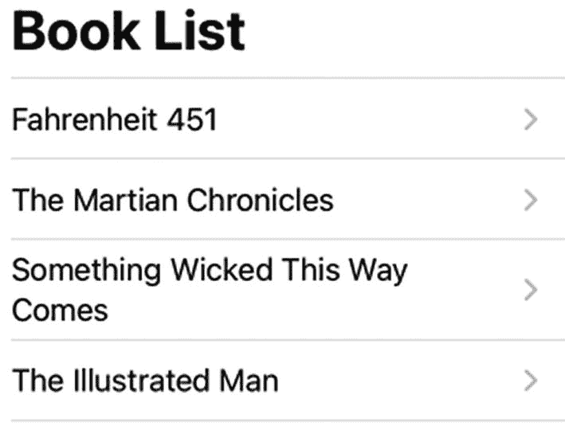

图 16-5：导航链接列表

7.  单击画布面板上的“实时预览”图标。注意，`List`将书籍标题显示为导航链接，如图 16-5 所示。

```
import SwiftUI

struct Books: Identifiable {
    var id = UUID()
    var title: String
    var summary: String
}

struct ContentView: View {
    let books: [Books] = [
        Books(title: "华氏 451 度", summary: "关于焚书的反乌托邦小说"),
        Books(title: "火星编年史", summary: "关于火星殖民的故事"),
        Books(title: "邪恶降临", summary: "一个邪恶的马戏团来到小镇"),
        Books(title: "纹身人", summary: "围绕一个纹身男子展开的短篇故事集")
    ]

    var body: some View {
        NavigationView {
            List(books) { book in
                NavigationLink(destination: BookView(bookInfo: book)) {
                    Text("\(book.title)")
                }
            }.navigationBarTitle("书籍列表")
        }
    }
}

struct BookView: View {
    var bookInfo: Books
    var body: some View {
        VStack (spacing: 24) {
            Text("\(bookInfo.title)")
                .font(.largeTitle)
            Text("\(bookInfo.summary)")
                .font(.body)
        }
    }
}

struct ContentView_Previews: PreviewProvider {
    static var previews: some View {
        ContentView()
    }
}
```

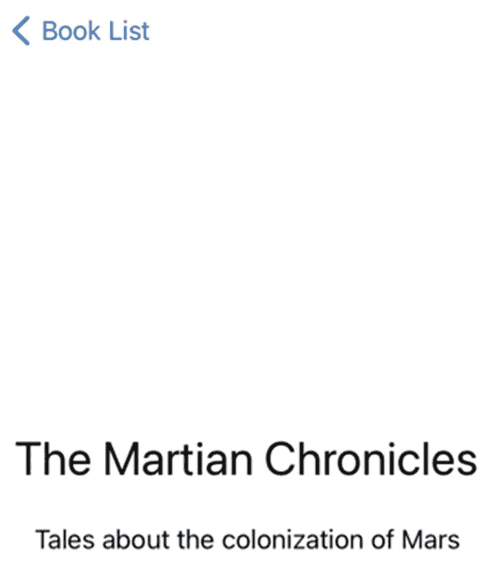

图 16-6：选择导航链接后显示的用户界面

8.  单击任意书籍标题（导航链接）。由`struct BookView`定义的用户界面将出现，并在左上角显示一个“返回”按钮，如图 16-6 所示。

`List`可以成为在导航视图中创建导航链接的便捷方式。由于`List`通常依赖数组来提供数据，因此你很可能需要创建一个结构体来存储在数组中。

## 总结

导航视图是显示多个视图的一种便捷方式。一个结构体可以定义一个包含一个或多个`NavigationLink`的导航视图。这些`NavigationLink`可以打开像`Text`或`Image`视图这样简单的视图，但更常见的是打开由结构体定义的视图。这些结构体可以存储在同一个文件中，也可以存储在单独的文件中。

`NavigationLink`可以将数据传递到另一个视图，这类似于向函数传递数据。另一个视图需要定义一个属性，然后`NavigationLink`就可以将数据传递到该属性。如果希望将数据传递到另一个可以修改该数据的视图，可以使用两种不同的方法。

第一种方法使用`@State`和`@Binding`变量，并强制`NavigationLink`将数据传递给其打开的每个视图。第二种方法使用`ObservableObject`、`StateObject`和`EnvironmentObject`在多个视图之间共享数据。

导航视图通常与`List`一起使用。通过点击`List`中的某个条目，用户可以跳转到一个新视图。`List`通常检索存储在数组中的数据。该数组可以存储像字符串这样的单一数据类型，但更常见的是存储结构体以将相关数据分组在一起。`List`中的条目可以自然而然地创建指向另一个视图的导航链接，就像 iOS 中“设置”应用里的条目一样。


## 使用标签视图

大多数应用程序由多个屏幕组成。第 16 章讲解了如何创建使用导航视图的应用，该视图可让用户按顺序从一个屏幕跳转到另一个屏幕。这在显示更多详细信息时非常方便，例如 iOS 中的“设置”应用，它允许你选择各种选项，然后查看多个屏幕以选取不同的设置。

然而，导航视图的一个问题是，如果将过多屏幕链接在一起，导航会变得繁琐，因为你需要从第一个屏幕导航到第二个、第三个，才能到达第四个屏幕。然后你还得反向遍历整个过程，从第四个屏幕返回到第一个屏幕。

为了提供一种在屏幕间跳转的替代方式，你可以使用标签视图，它会在屏幕底部显示图标和/或文本。选择一个标签（图标和/或文本）即可跳转到新的屏幕。例如，“时钟”应用在屏幕底部显示图标/文本，让你可以跳转到不同的功能，如图 17-1 所示。

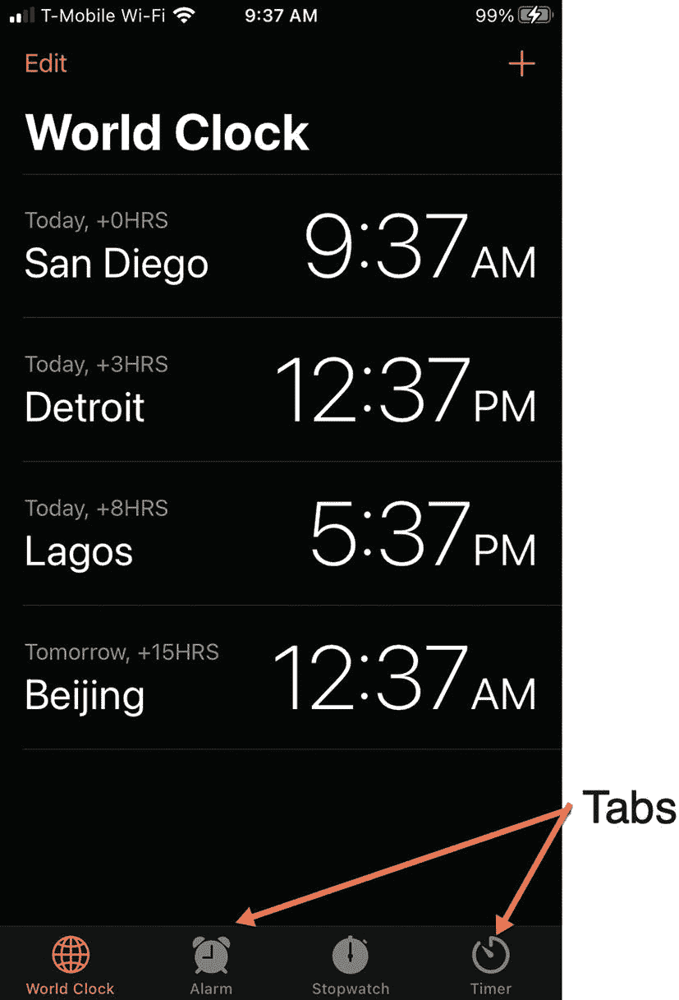

图 17-1

标签视图可以轻松地在屏幕间跳转

由于无论你在查看哪个屏幕，标签栏都会出现在屏幕底部，因此标签视图让你可以随时轻松跳转到想看的屏幕。

## 使用标签视图

标签视图通过如下代码包含多个视图：

```
TabView {
// 在此处放置多个视图
}
```

存储在标签视图中的每个视图可以简单到单个视图（例如 `Text` 或 `Image` 视图），也可以是更详细的结构，例如定义一个视图的结构体。创建标签视图的第一步就是列出你想要在标签视图中使用的所有视图，就像这样：

```
TabView {
Text("一")
Text("二")
Text("三")
Text("四")
}
```

在定义了要在标签视图中显示的视图之后，下一步是为每个视图定义一个图标和/或文本。为此，需要向每个视图添加一个 `.tabItem` 修饰符，其中使用 `Image` 和 `Text` 视图，如下所示：

```
Text("一")
.tabItem {
Image(systemName: "heart.fill")
Text("标签 1")
}
```

通过为每个视图附加 `.tabItem` 修饰符，并使用 `Image` 和 `Text` 视图定义其内容，你可以创建一个显示在屏幕底部的标签栏，如图 17-2 所示。


图 17-2

典型的标签栏显示图标和文本

`Image` 视图可以显示任何图像，但通常显示的是你可以在 SF Symbols 应用（`https://developer.apple.com/sf-symbols`）中查看的图标。

注意

标签可以显示为图像加文本、仅图像或仅文本。为了清晰起见，通常最好将标签定义为图像和文本的组合。

要了解如何创建一个简单的标签视图，请按照以下步骤操作：

1. 创建一个新的 SwiftUI iOS 应用项目，并为其指定任意名称，例如“SimpleTabView”。
2. 在导航器窗格中点击 `ContentView` 文件。
3. 在 `var body: some View` 中添加以下视图，如下所示：

```
var body: some View {
TabView {
Text("一")
Text("二")
Text("三")
Text("四")
}
}
```

为了在屏幕底部创建一个标签栏，我们需要添加使用 `Image` 和 `Text` 视图的 `.tabItem` 修饰符。

1. 像这样为每个视图添加以下 `.tabItem` 修饰符：

```
var body: some View {
TabView {
Text("一")
.tabItem {
Image(systemName: "heart.fill")
Text("一")
}
Text("二")
.tabItem {
Image(systemName: "hare.fill")
Text("二")
}
Text("三")
.tabItem {
Image(systemName: "tortoise.fill")
Text("三")
}
Text("四")
.tabItem {
Image(systemName: "folder.fill")
Text("四")
}
}
}
```

你可以随意使用不同的 SF Symbols 图标和文本来自定义屏幕底部标签栏中的按钮。除了使用 `Image` 和 `Text` 视图的组合，你也可以像这样使用单个 `Label` 视图：

1. 点击画布面板上的实时预览图标。
2. 点击屏幕底部的不同标签以查看不同的视图。

**注意** 由于标签视图将每个视图表示为图标/文本，因此标签视图在屏幕底部最多只能显示五个项目。如果你在标签视图中存储了超过五个视图，标签视图会自动创建一个“更多”图标，将任何额外的视图隐藏在第二个标签栏中。

```
Label("四", systemImage: "folder.fill")
```

要了解当你显示超过五个视图时，标签视图如何自动在标签栏中创建一个“更多”按钮，请按照以下步骤操作：

1. 打开你之前创建的 Xcode 项目（`SimpleTabView`）。
2. 编辑 `ContentView` 文件，使整个代码如下所示：

```
import SwiftUI
struct ContentView: View {
var body: some View {
TabView {
Text("一")
.tabItem {
Image(systemName: "heart.fill")
Text("一")
}
Text("二")
.tabItem {
Image(systemName: "hare.fill")
Text("二")
}
Text("三")
.tabItem {
Image(systemName: "tortoise.fill")
Text("三")
}
Text("四")
.tabItem {
Image(systemName: "folder.fill")
Text("四")
}
Text("五")
.tabItem {
Image(systemName: "internaldrive.fill")
Text("五")
}
Text("六")
.tabItem {
Image(systemName: "cloud.drizzle.fill")
Text("六")
}
}.accentColor(.purple)
}
}
struct ContentView_Previews: PreviewProvider {
static var previews: some View {
ContentView()
}
}
```

注意，标签视图上的 `.accentColor` 修饰符可以让你定义标签栏的颜色。

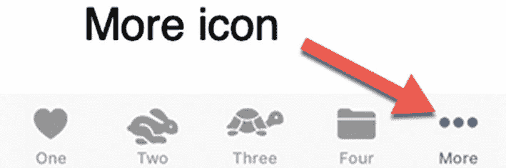

图 17-3

当标签视图包含超过五个标签时，“更多”图标会自动出现

1. 点击画布面板上的实时预览图标。标签栏出现，但现在最右侧会出现一个“更多”图标，如图 17-3 所示。

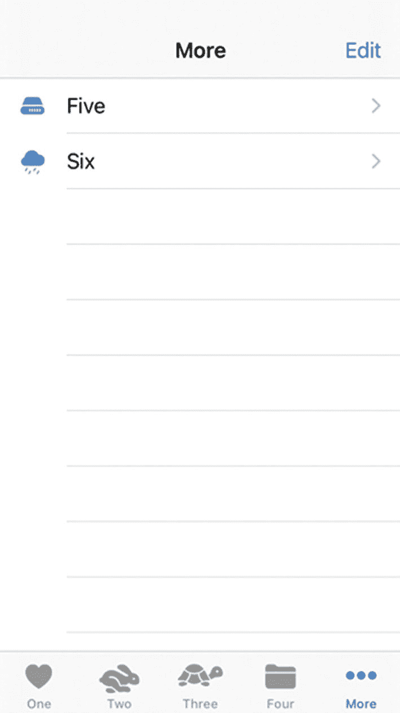

图 17-4

“更多”图标显示一个导航视图

1. 点击“更多”图标。注意会出现一个导航视图，以列表形式显示你的其他标签，如图 17-4 所示。

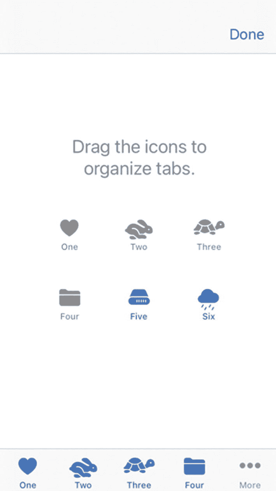

图 17-5

用于修改标签栏的拖放屏幕

1. 在导航视图中点击“五”或“六”项目，以查看对应的 `Text` 视图。
2. 点击右上角的“编辑”按钮。注意会出现一个新屏幕，允许用户拖放标签栏上的图标以重新排列它们，如图 17-5 所示。
3. 将“五”或“六”图标拖放到标签栏上。注意，当你这样做时，屏幕会高亮显示当前未在标签栏上可见的两个图标。
4. 完成标签栏上图标的重新排列后，点击“完成”按钮。

由于标签栏最多只能显示五个图标，因此最好将选项数量限制在五个或更少。


### 在标签栏中以编程方式选择按钮

用户只需点击标签栏上的标签即可切换不同视图。默认情况下，最左侧的第一个标签会高亮显示。但有时你可能需要通过代码来选择标签。在这种情况下，你需要使用 `.tag` 修饰符来标识每个 `.tabItem`。

`.tag` 修饰符允许你使用固定值（如 `2`）来标识每个标签。当每个 `.tabItem` 都有唯一的 `.tag` 值时，你就可以通过引用其 `.tag` 值，使用 Swift 代码来选择特定的标签。

要了解如何通过 Swift 代码访问 Tab View 中的标签，请遵循以下步骤：

1. 创建一个新的 SwiftUI iOS App 项目，并为其命名，例如 “PageView”。
2. 在导航窗格中点击 `ContentView` 文件。
3. 在 `struct ContentView: View` 行下添加一个 State 变量，如下所示：

```
struct ContentView: View {
@State var selectedView = 1
```

4. 在 `var body: some View` 行下添加一个 `VStack` 和一个 `HStack`，并在 `HStack` 内添加四个 Button，如下所示：

```
var body: some View {
VStack {
HStack {
Button ("1") {
selectedView = 1
}
Button ("2") {
selectedView = 2
}
Button ("3") {
selectedView = 3
}
Button ("4") {
selectedView = 4
}
}
}
}
```

5. 在 `VStack` 内部、`HStack` 下方添加一个 Tab View，如下所示：

```
TabView (selection: $selectedView){
Text("One")
.tabItem {
Image(systemName: "heart.fill")
Text("One")
}.tag(1)
Text("Two")
.tabItem {
Image(systemName: "hare.fill")
Text("Two")
}.tag(2)
Text("Three")
.tabItem {
Image(systemName: "tortoise.fill")
Text("Three")
}.tag(3)
Text("Four")
.tabItem {
Image(systemName: "folder.fill")
Text("Four")
}.tag(4)
}
```

整个 `ContentView` 文件应如下所示：

```
import SwiftUI
struct ContentView: View {
@State var selectedView = 1
var body: some View {
VStack {
HStack {
Button ("1") {
selectedView = 1
}
Button ("2") {
selectedView = 2
}
Button ("3") {
selectedView = 3
}
Button ("4") {
selectedView = 4
}
}
TabView (selection: $selectedView){
Text("One")
.tabItem {
Image(systemName: "heart.fill")
Text("One")
}.tag(1)
Text("Two")
.tabItem {
Image(systemName: "hare.fill")
Text("Two")
}.tag(2)
Text("Three")
.tabItem {
Image(systemName: "tortoise.fill")
Text("Three")
}.tag(3)
Text("Four")
.tabItem {
Image(systemName: "folder.fill")
Text("Four")
}.tag(4)
}
}
}
}
struct ContentView_Previews: PreviewProvider {
static var previews: some View {
ContentView()
}
}
```

此代码创建了一个 Tab View 以及位于屏幕顶部、标记为 1、2、3 和 4 的四个按钮。

6. 点击画布面板上的 Live Preview 图标。
7. 点击屏幕顶部的数字按钮。请注意，如果你点击 `2` 按钮，标签栏上的第二个标签将被选中。如果你点击 `4` 按钮，标签栏上的第四个标签将被选中。`.tag` 修饰符为你提供了一种通过 Swift 代码访问特定标签的方法。

### 显示页面视图

通常，Tab View 在屏幕底部显示标签，以便用户选择标签并跳转到不同的视图。作为一种替代方案，你可以将 Tab View 转换为 Page View。Page View 在屏幕底部中间显示代表不同屏幕的标签栏图标。然后，用户可以左右滚动以按顺序查看每个屏幕。

要将 Tab View 转换为 Page View，只需向 Tab View 添加 `.tabViewStyle` 修饰符并指定 `.page`，如下所示：

```
TabView {
}.tabViewStyle(.page)
```

现在，用户无需从屏幕底部选择标签来打开视图，而是可以左右滑动以按顺序打开每个视图。为了提供可用视图数量的视觉指示，你可以添加 `.indexViewStyle` 修饰符并为 `backgroundDisplayMode` 指定 `.always`，如下所示：

```
TabView {
}.tabViewStyle(.page)
.indexViewStyle(PageIndexViewStyle(backgroundDisplayMode: .always))
```

要了解 Page View 的工作原理，请遵循以下步骤：

1. 创建一个新的 SwiftUI iOS App 项目，并为其命名，例如 “PageView”。
2. 在导航窗格中点击 `ContentView` 文件。
3. 在 `var body: some View` 行内添加一个 Tab View，如下所示：

```
TabView {
Text("One")
.tabItem {
Image(systemName: "heart.fill")
}
Text("Two")
.tabItem {
Image(systemName: "hare.fill")
}
Text("Three")
.tabItem {
Image(systemName: "tortoise.fill")
}
Text("Four")
.tabItem {
Image(systemName: "folder.fill")
}
Text("Five")
.tabItem {
Image(systemName: "tray.fill")
}
Text("Six")
.tabItem {
Image(systemName: "keyboard.fill")
}
}
```

请随意为每个 `Text` 视图选择不同的文本，并为每个 `Image` 视图选择不同的 SF Symbol 图标。请注意，每个 `.tabItem` 只需添加一个 `Image` 视图，不需要 `Text` 视图。

4. 向 Tab View 添加 `.tabViewStyle` 和 `.indexViewStyle` 修饰符，如下所示：

```
TabView {
Text("One")
.tabItem {
Image(systemName: "heart.fill")
}
Text("Two")
.tabItem {
Image(systemName: "hare.fill")
}
Text("Three")
.tabItem {
Image(systemName: "tortoise.fill")
}
Text("Four")
.tabItem {
Image(systemName: "folder.fill")
}
Text("Five")
.tabItem {
Image(systemName: "tray.fill")
}
Text("Six")
.tabItem {
Image(systemName: "keyboard.fill")
}
}.tabViewStyle(.page)
.indexViewStyle(PageIndexViewStyle(backgroundDisplayMode: .always))
```

这会将每个 `Image` 显示为屏幕底部中间的图标列表，如图 17-6 所示。

**图 17-6** Page View 底部的图标栏

整个 `ContentView` 文件应如下所示：

```
import SwiftUI
struct ContentView: View {
var body: some View {
TabView {
Text("One")
.tabItem {
Image(systemName: "heart.fill")
}
Text("Two")
.tabItem {
Image(systemName: "hare.fill")
}
Text("Three")
.tabItem {
Image(systemName: "tortoise.fill")
}
Text("Four")
.tabItem {
Image(systemName: "folder.fill")
}
Text("Five")
.tabItem {
Image(systemName: "tray.fill")
}
Text("Six")
.tabItem {
Image(systemName: "keyboard.fill")
}
}.tabViewStyle(.page)
.indexViewStyle(PageIndexViewStyle(backgroundDisplayMode: .always))
}
}
struct ContentView_Previews: PreviewProvider {
static var previews: some View {
ContentView()
}
}
```

5. 点击画布面板上的 Live Preview 图标。
6. 从右向左（以及从左向右）拖动鼠标，从当前视图滑动到下一个视图。请注意，每次执行此操作时，屏幕底部都会有不同的图标高亮显示，以指示你当前所在的位置，以及当前显示视图之前和之后还有多少个其他视图。


## 在标签视图中显示结构

虽然标签视图可以显示单个视图（如`Text`或`Image`视图），但很多时候你可能希望显示全新的用户界面。由于可以用结构定义用户界面屏幕，因此可以创建多个屏幕，这些屏幕使用多个结构，并能够在标签视图中呈现。

创建新结构最简单的方法是在`ContentView`文件中进行。但这种方法可能使代码变得杂乱，因此第二种方法是将结构存储在单独的文件中。

要了解如何创建定义其他用户界面屏幕的结构，请按照以下步骤操作：

1.  创建一个新的 SwiftUI iOS App 项目，并为其指定任意名称，例如“TabViewStructures”。

2.  在导航器窗格中点击`ContentView`文件。

3.  在`var body: some View`行内添加一个`TabView`，如下所示：

```swift
var body: some View {
    TabView {
    }
}
```

4.  在`TabView`内部添加如下内容：

```swift
var body: some View {
    TabView {
        FileView()
            .tabItem {
                Image(systemName: "heart.fill")
                Text("第一")
            }
        SeparateFileView()
            .tabItem {
                Image(systemName: "hare.fill")
                Text("第二")
            }
    }
}
```

上述代码显示了两个视图：`FileView()`和`SeparateFileView()`，我们需要使用结构来定义这两个视图。

5.  在`struct ContentView: View`结构下方添加如下结构：

```swift
struct FileView: View {
    var body: some View {
        HStack {
            Spacer()
            VStack {
                Spacer()
                Text("这是单独的结构")
                Text("存储在同一个文件中")
                Spacer()
            }
            Spacer()
        }.background(Color.yellow)
    }
}
```

完整的`ContentView`文件应如下所示：

```swift
import SwiftUI

struct ContentView: View {
    var body: some View {
        TabView {
            FileView()
                .tabItem {
                    Image(systemName: "heart.fill")
                    Text("第一")
                }
            SeparateFileView()
                .tabItem {
                    Image(systemName: "hare.fill")
                    Text("第二")
                }
        }
    }
}

struct FileView: View {
    var body: some View {
        HStack {
            Spacer()
            VStack {
                Spacer()
                Text("这是单独的结构")
                Text("存储在同一个文件中")
                Spacer()
            }
            Spacer()
        }.background(Color.yellow)
    }
}

struct ContentView_Previews: PreviewProvider {
    static var previews: some View {
        ContentView()
    }
}
```

我们可以继续在`ContentView`文件中添加新结构，但这可能导致文件变得杂乱。第二种创建结构的方法是将它们存储在单独的文件中，接下来的步骤将实现这一点。

1.  选择**文件** ➤ **新建** ➤ **文件**。此时会弹出一个对话框。

2.  点击对话框顶部附近的**iOS**，点击**Swift 文件**，然后点击**下一步**。Xcode 会询问新创建文件的名称。

3.  输入`SeparateFile`并点击**创建**。Xcode 会创建一个新的 Swift 文件。

4.  删除`SeparateFile`中现有的所有代码，并替换为以下内容：

```swift
import SwiftUI

struct SeparateFileView: View {
    var body: some View {
        HStack {
            Spacer()
            VStack {
                Spacer()
                Text("这是另一个结构")
                Text("但存储在单独的文件中")
                Spacer()
            }
            Spacer()
        }.background(Color.orange)
    }
}

struct SeparateFileView_Previews: PreviewProvider {
    static var previews: some View {
        SeparateFileView()
    }
}
```

**注意：** 将结构存储在单独文件中时，需要第二个结构（`PreviewProvider`）才能在画布窗格中显示该用户界面。

5.  在导航器窗格中点击`ContentView`文件。

6.  点击画布窗格中的**实时预览**图标。请注意，`FileView`结构会显示出来，因为标签栏中的**第一**图标默认处于选中状态。

7.  点击标签栏中的**第二**图标。注意，这会显示在`SeparateFile`中定义的`SeparateFileView`结构。

在标签视图中显示由结构定义的视图是更常见的做法。你可以将定义视图的结构存储在同一个文件或不同的文件中。

### 在标签视图中的结构之间传递数据

之前的项目创建了两个结构，其中一个结构存储在`ContentView`文件中，另一个结构存储在单独的文件中。在这两种情况下，这些结构定义的用户界面都显示静态信息，与原始结构（`ContentView`）中的任何内容都没有关联。

在许多情况下，你可能希望一个结构中的数据出现在第二个结构中。这意味着我们必须将数据从一个结构传递到另一个结构。

幸运的是，这项任务类似于在函数之间传递数据。当结构需要接收数据时，我们只需声明一个属性：创建一个变量，为该变量指定一个描述性名称，并定义该变量可以保存的数据类型，例如`String`或`Double`，如下所示：

```swift
struct FileView: View {
    var choice: String
```

这里定义了一个名为“choice”的变量，它可以保存一个`String`。要向前一个结构传递数据，我们可以通过调用结构名称（`FileView`）并后跟“choice”变量作为参数来加载该结构，如下所示：

```swift
FileView(choice: "正面")
```

当向存储在同一个文件中的结构传递数据时，只需遵循以下两步流程：

-   在结构内部声明一个或多个变量用于接收数据。
-   使用该结构的变量作为参数来调用该结构。

但是，当向存储在单独文件中的结构传递数据时，还需要一个额外步骤。因为存储在单独文件中的结构还包含第二个结构，用于在画布窗格中显示用户界面，所以这个预览结构必须包含该结构的参数，并将数据传递给它，如下所示：

```swift
struct SeparateFileView_Previews: PreviewProvider {
    static var previews: some View {
        SeparateFileView(passedData: "")
    }
}
```

要了解如何在标签视图中的结构之间传递数据，请按照以下步骤操作：

1.  创建一个新的 SwiftUI iOS App 项目，并为其指定任意名称，例如“TabViewPassData”。

2.  在导航器窗格中点击`ContentView`文件。

3.  编辑`struct ContentView`结构，如下所示：

```swift
struct ContentView: View {
    @State var message = ""
    var body: some View {
        TabView {
            TextField("在此输入", text: $message)
                .tabItem {
                    Image(systemName: "house.fill")
                    Text("主页")
                }
            FileView(choice: message)
                .tabItem {
                    Image(systemName: "heart.fill")
                    Text("第一")
                }
            SeparateFileView(passedData: message)
                .tabItem {
                    Image(systemName: "hare.fill")
                    Text("第二")
                }
        }
    }
}
```

上述代码定义了一个名为`FileView`的结构，其参数为“choice:”，该参数接收状态变量“message”。第二个结构名为`SeparateFileView`，其参数为“passedData:”，同样接收状态变量“message”。

4.  在`struct ContentView`下方添加一个新结构，如下所示：

```swift
struct FileView: View {
    var choice: String
    var body: some View {
        HStack {
            Spacer()
            VStack {
                Spacer()
                Text("您输入了 = \(choice)")
                Spacer()
            }
            Spacer()
        }.background(Color.yellow)
    }
}
```

这个`FileView`结构声明了一个可以保存`String`的“choice”变量。然后它在`Text`视图中显示这个“choice”变量，显示结果为“您输入了 = ”。完整的`ContentView`文件应如下所示：

```swift
import SwiftUI

struct ContentView: View {
    @State var message = ""
    var body: some View {
        TabView {
            TextField("在此输入", text: $message)
                .tabItem {
                    Image(systemName: "house.fill")
                    Text("主页")
                }
            FileView(choice: message)
                .tabItem {
                    Image(systemName: "heart.fill")
                    Text("第一")
                }
            SeparateFileView(passedData: message)
                .tabItem {
                    Image(systemName: "hare.fill")
                    Text("第二")
                }
        }
    }
}

struct FileView: View {
    var choice: String
    var body: some View {
        HStack {
            Spacer()
            VStack {
                Spacer()
                Text("您输入了 = \(choice)")
                Spacer()
            }
            Spacer()
        }.background(Color.yellow)
    }
}

struct ContentView_Previews: PreviewProvider {
    static var previews: some View {
        ContentView()
    }
}
```


此代码创建了一个名为 `FileView` 的结构体，但现在我们需要创建第二个名为 `SeparateFileView` 的结构体，该结构体声明一个 `String` 类型的 `passedData` 变量。

1.  选择 `File` ➤ `New` ➤ `File`。此时会弹出一个对话框。
2.  在对话框顶部附近点击 `iOS`，点击 `Swift File`，然后点击 `Next`。`Xcode` 会要求您为新创建的文件命名。
3.  输入 `SeparateFile` 并点击 `Create`。`Xcode` 会创建一个新的 Swift 文件。
4.  删除 `SeparateFile` 中当前的所有代码，并将其替换为以下内容：

```swift
import SwiftUI
struct SeparateFileView: View {
var passedData: String
var body: some View {
HStack {
Spacer()
VStack {
Spacer()
Text("来自文本字段的字符串 = \(passedData)")
Spacer()
}
Spacer()
}.background(Color.orange)
}
}
struct SeparateFileView_Previews: PreviewProvider {
static var previews: some View {
SeparateFileView(passedData: "")
}
}
```

该文件创建了一个 `SeparateFileView` 结构体，该结构体声明了一个 `String` 类型的 `passedData` 变量。由于此 `SeparateFileView` 结构体存储在单独的文件中，它包含一个 `struct PreviewProvider`，在其中我们也必须使用 `passedData` 参数。

1.  在导航器窗格中点击 `ContentView` 以返回 `ContentView` 结构体。
2.  在画布窗格中点击实时预览图标。此时会出现 `TextField`。
3.  在 `TextField` 中点击并输入一个单词或短语。
4.  点击标签栏中的第一个图标。这会将您在 `TextField` 中输入的字符串传递并显示在 `FileView` 结构体中。
5.  点击标签栏中的第二个图标。这会将您在 `TextField` 中输入的字符串传递并显示在 `SeparateFileView` 结构体中。

### 在标签视图中更改结构体之间的数据

上一个项目创建了两个结构体，其中一个结构体存储在 `ContentView` 文件中，另一个结构体存储在单独的文件中。在这两种情况下，这些结构体都定义了接收数据并显示数据的用户界面。

如果我们向一个结构体传递数据，然后允许该结构体修改该数据，会发生什么？这将需要几个更改：

*   创建一个 `State` 变量。
*   使用 `NavigationLink` 打开另一个结构体，并向其传递一个指向该 `State` 变量的绑定（使用 `$` 符号），例如：
*   在将要接收数据的结构体中定义一个 `@Binding` 变量。
*   在接收数据的结构体中更改该 `Binding` 变量。

```swift
FileView(choice: $message)
```

要了解如何在标签视图中更改结构体之间的数据，请按照以下步骤操作：

1.  创建一个新的 SwiftUI iOS App 项目，并任意命名，例如 “TabViewBindingData”。
2.  在导航器窗格中点击 `ContentView` 文件。
3.  在 `struct ContentView: View` 行下方创建一个 `State` 变量，如下所示：
4.  在 `var body: some View` 行内部添加一个 `TabView`，如下所示：

```swift
struct ContentView: View {
@State var message = ""
```

```swift
var body: some View {
TabView {
TextField("在此输入", text: $message)
.tabItem {
Image(systemName: "house.fill")
Text("主页")
}
FileView(choice: $message)
.tabItem {
Image(systemName: "heart.fill")
Text("第一个")
}
SeparateFileView(passedData: $message)
.tabItem {
Image(systemName: "hare.fill")
Text("第二个")
}
}
}
```

请注意，`FileView` 向 `choice:` 参数发送了一个绑定变量（`$message`）。名为 `SeparateFileView` 的第二个结构体向 `passedData` 参数发送了相同的绑定变量（`$message`）。

1.  在 `struct ContentView: View` 结构体下方添加以下结构体：

```swift
struct FileView: View {
@Binding var choice: String
var body: some View {
HStack {
Spacer()
VStack {
Spacer()
TextField("在此输入:", text: $choice)
Spacer()
}
Spacer()
}.background(Color.yellow)
}
}
```

请注意，此结构体声明了一个名为 `choice` 的 `@Binding` 变量，该变量可以保存一个 `String`。此结构体使用 `TextField` 来更改此 `@Binding` 变量（`$choice`），这会将更改自动发送回 `ContentView` 结构体。

1.  选择 `File` ➤ `New` ➤ `File`。此时会弹出一个对话框。
2.  在对话框顶部附近点击 `iOS`，点击 `Swift File`，然后点击 `Next`。`Xcode` 会要求您为新创建的文件命名。
3.  输入 `SeparateFile` 并点击 `Create`。`Xcode` 会创建一个新的 Swift 文件。
4.  删除 `SeparateFile` 中当前的所有代码，并将其替换为以下内容：

```swift
import SwiftUI
struct SeparateFileView: View {
@Binding var passedData: String
var body: some View {
HStack {
Spacer()
VStack {
Spacer()
TextField("在此输入", text: $passedData)
Spacer()
}
Spacer()
}.background(Color.orange)
}
}
struct SeparateFileView_Previews: PreviewProvider {
static var previews: some View {
SeparateFileView(passedData: .constant(""))
}
}
```

请注意，此结构体声明了一个名为 `passedData` 的 `@Binding` 变量，该变量可以保存一个 `String`。`TextField` 可以更改此变量（`$passedData`）并自动将更改发送回 `ContentView` 结构体。

同时注意，由于此结构体存储在单独的文件中，`PreviewProvider` 结构体也必须通过为其提供 `.constant("")` 来包含 `passedData` 参数。

1.  在导航器窗格中点击 `ContentView` 文件。
2.  在画布窗格中点击实时预览图标。
3.  在 `TextField` 中点击并输入一个短语。
4.  点击第一个图标，将字符串传递给存储在 `ContentView` 文件中的 `FileView` 结构体。
5.  点击 `FileView` 结构体显示的 `TextField` 并编辑数据。然后点击 `Home` 标签返回到显示已修改数据的 `ContentView` 结构体。
6.  编辑此数据。
7.  点击第二个标签，将字符串传递给存储在单独文件中的 `SeparateFileView` 结构体。请注意，您编辑后的数据现在显示在 `SeparateFileView` 结构体中。
8.  点击 `SeparateFileView` 结构体显示的 `TextField` 并编辑数据。然后点击 `Home` 标签返回到显示已修改数据的 `ContentView` 结构体。


### 在标签页视图中在结构体之间共享数据

使用 `@State` 和 `@Binding` 变量可以让多个视图共享和修改数据。然而，更优的做法是将数据直接传递给需要它的结构体。为此，SwiftUI 提供了另一种在结构体之间共享数据的方式。首先，创建一个包含一个或多个待共享变量的 `ObservableObject` 类。每个变量都必须像这样标记为 `@Published`：

```
class ShareString: ObservableObject {
    @Published var message = ""
}
```

包含 `TabView` 的结构体（例如 `ContentView`）需要定义一个 `@StateObject` 变量，该变量定义一个来自 `ObservableObject` 类的对象，如下所示：

```
@StateObject var showMe = ShareString()
```

由于我们想要在 Tab View 内的所有视图之间共享这个 `ObservableObject`，我们需要向 `TabView` 添加 `.environmentObject` 修饰符，并附带要共享的 StateObject，如下所示：

```
TabView {
}.environmentObject(showMe)
```

在每个需要访问 `ObservableObject` 的结构体内部，我们需要声明一个使用该 `ObservableObject` 类的 `@EnvironmentObject` 变量，如下所示：

```
@EnvironmentObject var choice: ShareString
```

最后，在每个定义了 `@EnvironmentObject` 的结构体内部，我们可以通过使用 `@EnvironmentObject` 的名称加上 `@Published` 属性名来访问要共享的实际数据，如下所示：

```
$choice.message
```

在此例中，`choice` 是 `@EnvironmentObject` 的名称，`message` 是在 `ObservableObject` 内定义的 `@Published` 属性。要了解如何使用 `ObservableObject` 共享数据，请遵循以下步骤：

1.  创建一个新的 SwiftUI iOS App 项目，并为其任意命名，例如 `TabViewObservable`。

2.  在导航器窗格中点击 `ContentView` 文件。

3.  在 `import SwiftUI` 行下创建一个 `ObservableObject` 类，如下所示：

```
class ShareString: ObservableObject {
    @Published var message = ""
}
```

`@Published` 变量将包含在 Tab View 内的结构体之间共享的数据。

4.  在 `struct ContentView: View` 行下创建一个 `StateObject` 变量，如下所示：

```
struct ContentView: View {
    @StateObject var showMe = ShareString()
```

这将基于 `ShareString` `ObservableObject` 创建一个新对象 (`showMe`)。

5.  在 `var body: some View` 行内添加一个 `TabView`，如下所示：

```
var body: some View {
    TabView {
        TextField("在此输入", text: $showMe.message)
            .tabItem {
                Image(systemName: "house.fill")
                Text("主页")
            }
        FileView()
            .tabItem {
                Image(systemName: "heart.fill")
                Text("第一个")
            }
        SeparateFileView()
            .tabItem {
                Image(systemName: "hare.fill")
                Text("第二个")
            }
    }.environmentObject(showMe)
}
```

确保在 `TabView` 的末尾添加了 `.environmentObject(showMe)` 修饰符。这允许共享 `showMe` 这个 `ObservableObject` (`ShareString` 类)。前面的 `TabView` 打开了我们需要创建的名称为 `FileView` 和 `SeparateFileView` 的结构体。

6.  在 `struct ContentView` 结构体下方添加如下结构体：

```
struct FileView: View {
    @EnvironmentObject var choice: ShareString
    var body: some View {
        HStack {
            Spacer()
            VStack {
                Spacer()
                TextField("在此输入:", text: $choice.message)
                Spacer()
            }
            Spacer()
        }.background(Color.yellow)
    }
}
```

请注意，此结构体定义了一个可以持有 `ShareString` `ObservableObject` 的 `@EnvironmentObject` 变量。在 `TextField` 中，我们必须将文本存储在使用了 `message` `@Published` 属性 (`$choice.message`) 的 `choice` `@EnvironmentObject` 中。整个 `ContentView` 文件应如下所示：

7.  选择 **文件** ➤ **新建** ➤ **文件**。出现一个对话框。

8.  点击对话框顶部附近的 **iOS**，点击 **Swift 文件**，然后点击 **下一步**。Xcode 会要求你为新创建的文件命名。

9.  输入 `SeparateFile` 并点击 **创建**。Xcode 会创建一个新的 Swift 文件。

10. 删除 `SeparateFile` 中当前的所有代码，并将其替换为以下内容：

```
import SwiftUI

class ShareString: ObservableObject {
    @Published var message = ""
}

struct ContentView: View {
    @StateObject var showMe = ShareString()
    var body: some View {
        TabView {
            TextField("在此输入", text: $showMe.message)
                .tabItem {
                    Image(systemName: "house.fill")
                    Text("主页")
                }
            FileView()
                .tabItem {
                    Image(systemName: "heart.fill")
                    Text("第一个")
                }
            SeparateFileView()
                .tabItem {
                    Image(systemName: "hare.fill")
                    Text("第二个")
                }
        }.environmentObject(showMe)
    }
}

struct FileView: View {
    @EnvironmentObject var choice: ShareString
    var body: some View {
        HStack {
            Spacer()
            VStack {
                Spacer()
                TextField("在此输入:", text: $choice.message)
                Spacer()
            }
            Spacer()
        }.background(Color.yellow)
    }
}

struct ContentView_Previews: PreviewProvider {
    static var previews: some View {
        ContentView()
    }
}
```

```
import SwiftUI

struct SeparateFileView: View {
    @EnvironmentObject var passedData: ShareString
    var body: some View {
        HStack {
            Spacer()
            VStack {
                Spacer()
                TextField("在此输入", text: $passedData.message)
                Spacer()
            }
            Spacer()
        }.background(Color.orange)
    }
}

struct SeparateFileView_Previews: PreviewProvider {
    static var previews: some View {
        SeparateFileView()
    }
}
```

请注意，此结构体也声明了一个可以持有 `ShareString` `ObservableObject` 的 `@EnvironmentObject`。然后，`TextField` 使用 `passedData` `@EnvironmentObject` 来访问 `message` `@Published` 属性 (`$passedData.message`)。

11. 在导航器窗格中点击 `ContentView` 文件。

12. 点击画布窗格中的 **实时预览** 图标。

13. 点击 `TextField` 并输入一个短语。

14. 点击 **第一个** 标签。注意，你在第 13 步输入的内容现在出现在 `FileView` 的 `TextField` 中。

15. 编辑 `TextField` 中的文本，然后点击 **主页** 标签。注意，修改后的文本现在出现在 `ContentView` 的 `TextField` 中。

16. 编辑 `TextField` 中的文本，然后点击 **第二个** 标签。编辑后的文本现在出现在 `SeparateFileView` 的 `TextField` 中。

17. 编辑 `TextField` 中的文本，然后点击 **主页** 标签。注意，修改后的文本现在出现在 `ContentView` 的 `TextField` 中。所有这些都展示了不同结构体如何访问 `ObservableObject` 中的 `@Published` 属性。

## 总结

标签页视图提供了另一种显示多个视图的方式，其中每个视图都可以由屏幕底部的一个标签页表示。标签页视图可以打开像 `Text` 或 `Image` 视图这样简单的视图，但更常使用由结构体定义的视图。这些结构体可以存储在同一个文件中，也可以存储在单独的文件中。

标签页视图可以将数据传递给另一个视图，很像将数据传递给函数。这个其他视图需要定义一个属性，然后标签页视图就可以将数据传递给该属性。如果你想将可以修改的数据传递给另一个视图，可以使用两种不同的方法。

第一种方法使用 `@State` 和 `@Binding` 变量，并强制标签页视图将数据传递给它打开的每个视图。第二种方法使用 `ObservableObjects`、`StateObjects` 和 `EnvironmentObjects` 在多个视图之间共享数据。

标签页视图在屏幕底部最多可以显示五个标签页。如果你定义了超过五个标签页，SwiftUI 会自动创建一个**更多**标签页，并在导航视图中显示所有额外的标签页。

由于标签页视图在屏幕底部只能显示五个标签页，你可以将标签页视图转换为页面视图。这样，你可以在屏幕底部显示超过五个图标。与标签页视图不同，页面视图强制用户按顺序在屏幕之间导航。当用户需要跳转到你应用用户界面上的不同屏幕时，标签页视图非常方便。


