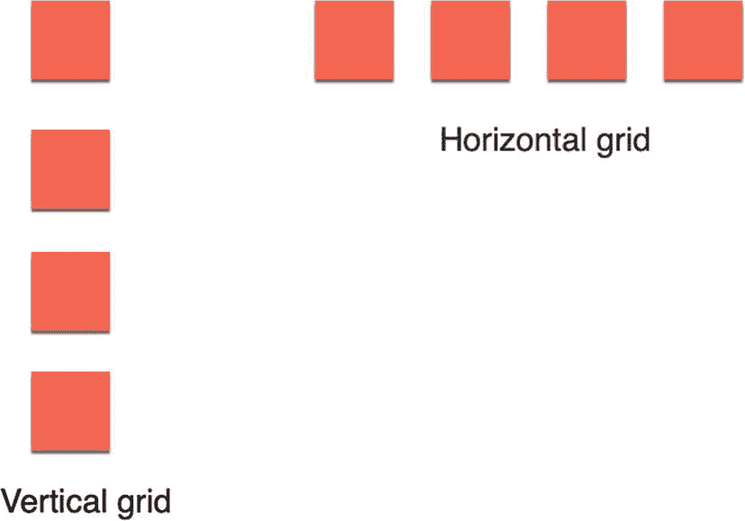
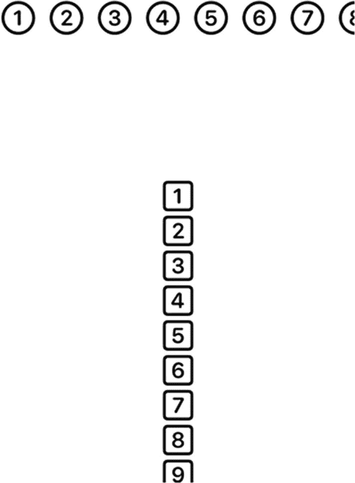
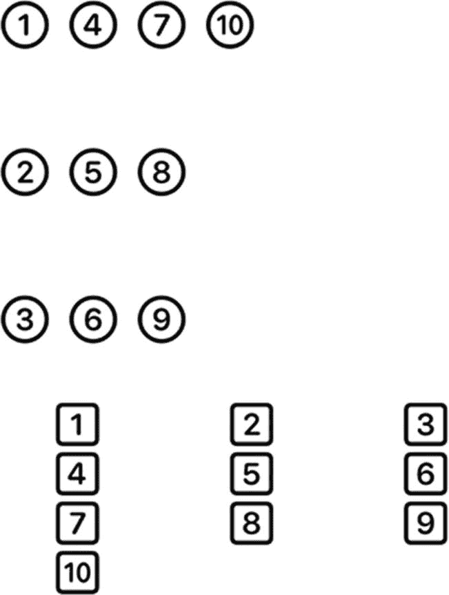
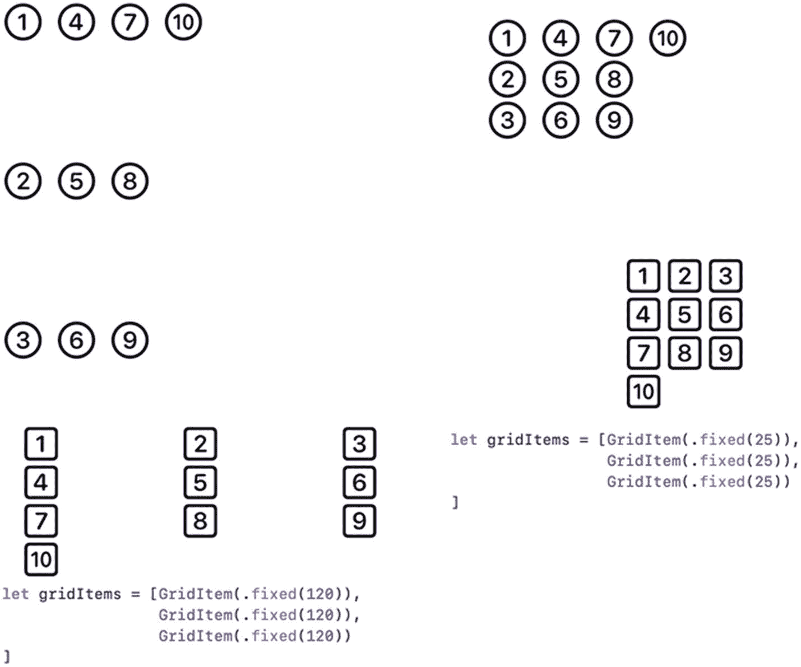
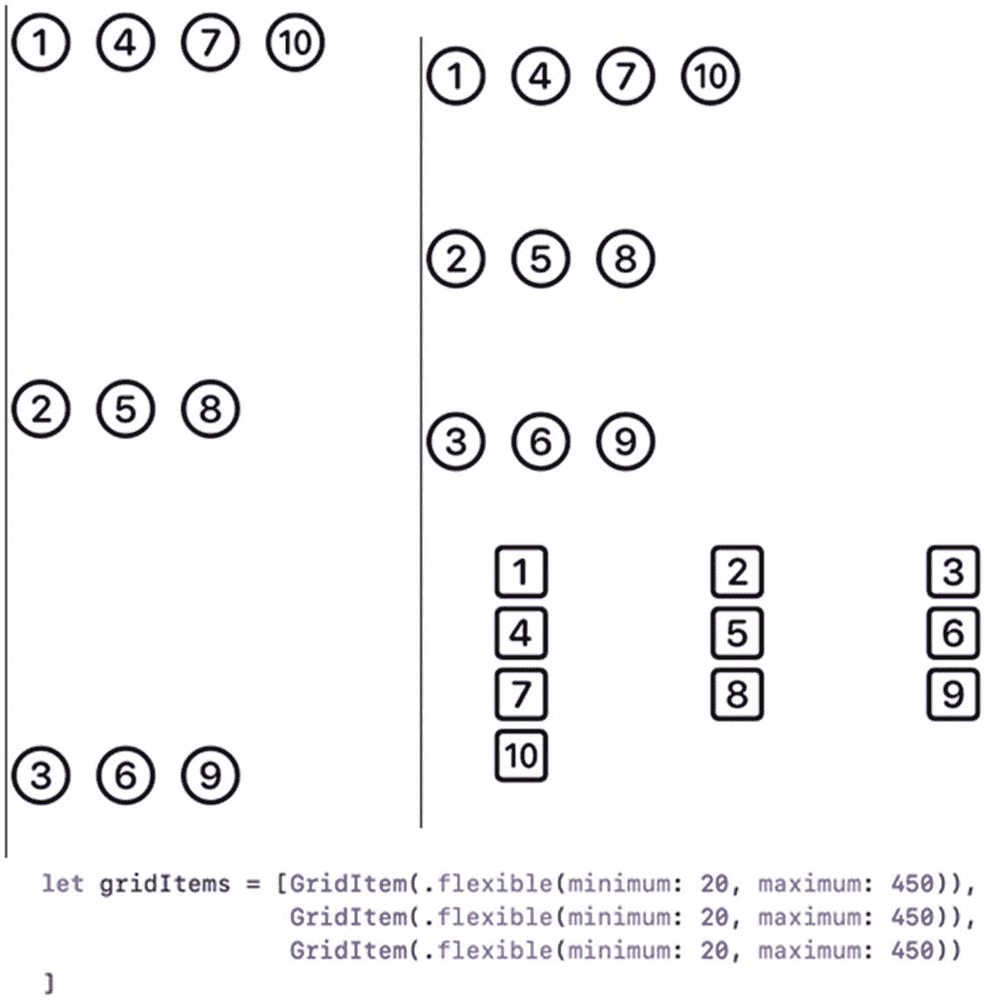
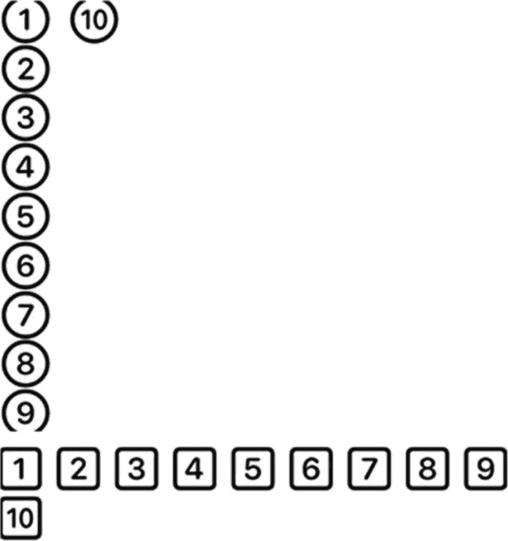

# 18. 使用网格

`Text` 视图适合显示字符串，而 `Image` 视图则完美适用于显示图形。但是，如果你想在屏幕上显示多块数据呢？这时你可以使用网格，它能够以行（水平方向）或列（垂直方向）的形式显示数据，如图 18-1 所示。



图 18-1 —— 网格可以水平或垂直显示数据

创建网格需要三个要素：

*   你想要显示的数据
*   一个 `GridItem` 数组，用于定义数据在网格中的排列方式
*   一个 `LazyVGrid` 或 `LazyHGrid`，用于将你的数据放置到 `GridItem` 数组中

“Lazy”一词指的是网格加载数据的方式。如果一个网格需要显示 1000 个项目，它可能会将所有 1000 个项目加载到内存中，即使其中大部分项目无法显示在屏幕上。由于这会浪费内存，“懒加载”网格只会加载那些需要显示的项目。当用户滚动以查看更多数据时，懒加载网格会立即加载这些项目。通过等到最后一刻才加载数据，懒加载网格使用的内存少得多，并且能让应用运行更高效，代价是运行速度会稍微慢一点。

> **注意：** 懒加载网格通常嵌入在 `ScrollView` 内部，以便用户能够滚动查看网格中存储的更多数据。

要了解如何创建一个简单的水平和垂直网格，请按照以下步骤操作：

1.  创建一个新的 SwiftUI iOS App 项目，并为其命名，例如“SimpleGrid”。
2.  在导航器窗格中点击 `ContentView` 文件。
3.  在 `var body: some View` 中添加一个 `VStack`，并创建一个 `GridItem` 数组，如下所示：

```
var body: some View {
    VStack {
        let gridItems = [GridItem()]
    }
}
```

`GridItem` 是 SwiftUI 中的一个结构体，允许你定义列和行之间的间距。目前，我们通过将 `GridItem` 的参数列表留空来使用默认值。

4.  在 `gridItems` 数组下方，添加一个 `ScrollView` 和一个 `LazyHGrid`，如下所示：

```
ScrollView(Axis.Set.horizontal, showsIndicators: true, content: {
    LazyHGrid(rows: gridItems) {
        Image(systemName: "1.circle")
        Image(systemName: "2.circle")
        Image(systemName: "3.circle")
        Image(systemName: "4.circle")
        Image(systemName: "5.circle")
        Image(systemName: "6.circle")
        Image(systemName: "7.circle")
        Image(systemName: "8.circle")
        Image(systemName: "9.circle")
        Image(systemName: "10.circle")
    }.font(.largeTitle)
})
```

这段代码定义了一个水平的 `ScrollView`（`Axis.Set.horizontal`），里面包含一个 `LazyHGrid`，用于显示一行数据。`LazyHGrid` 最多可以容纳十个视图，所以我们用十个 `Image` 视图填充它，每个视图在圆圈内显示一个不同的数字。由于圆圈图标很小，`.font(.largeTitle)` 修饰符使它们变大，更容易看清。

5.  在另一个 `ScrollView` 下方，添加第二个带有 `LazyVGrid` 的 `ScrollView`，如下所示：

```
ScrollView(Axis.Set.vertical, showsIndicators: true, content: {
    LazyVGrid(columns: gridItems) {
        Image(systemName: "1.square")
        Image(systemName: "2.square")
        Image(systemName: "3.square")
        Image(systemName: "4.square")
        Image(systemName: "5.square")
        Image(systemName: "6.square")
        Image(systemName: "7.square")
        Image(systemName: "8.square")
        Image(systemName: "9.square")
        Image(systemName: "10.square")
    }.font(.largeTitle)
})
```

这段代码定义了一个垂直的 `ScrollView`（`Axis.Set.vertical`），里面包含一个 `LazyVGrid`，用于显示一列数据。这些数据由十个 `Image` 视图组成，每个视图在方块内显示一个不同的数字。`.font(.largeTitle)` 修饰符使这些方块图标变大，更容易看清。整个 `ContentView` 文件应该如下所示：



图 18-2 —— 在垂直网格上方显示水平网格

6.  点击画布窗格上的 Live Preview 图标。
7.  从左到右滚动水平网格，查看所有带编号的圆圈，如图 18-2 所示。

```
import SwiftUI
struct ContentView: View {
    var body: some View {
        VStack {
            let gridItems = [GridItem()]
            ScrollView(Axis.Set.horizontal, showsIndicators: true, content: {
                LazyHGrid(rows: gridItems) {
                    Image(systemName: "1.circle")
                    Image(systemName: "2.circle")
                    Image(systemName: "3.circle")
                    Image(systemName: "4.circle")
                    Image(systemName: "5.circle")
                    Image(systemName: "6.circle")
                    Image(systemName: "7.circle")
                    Image(systemName: "8.circle")
                    Image(systemName: "9.circle")
                    Image(systemName: "10.circle")
                }.font(.largeTitle)
            })
            ScrollView(Axis.Set.vertical, showsIndicators: true, content: {
                LazyVGrid(columns: gridItems) {
                    Image(systemName: "1.square")
                    Image(systemName: "2.square")
                    Image(systemName: "3.square")
                    Image(systemName: "4.square")
                    Image(systemName: "5.square")
                    Image(systemName: "6.square")
                    Image(systemName: "7.square")
                    Image(systemName: "8.square")
                    Image(systemName: "9.square")
                    Image(systemName: "10.square")
                }.font(.largeTitle)
            })
        }
    }
}
struct ContentView_Previews: PreviewProvider {
    static var previews: some View {
        ContentView()
    }
}
```

8.  上下滚动垂直网格，查看所有带编号的方块。


## 定义多行/多列

上一个项目在 `LazyHGrid` 中创建了单行，在 `LazyVGrid` 中创建了单列。这个单行和单列是由 `GridItem` 的数组定义的，如下所示：

```
let gridItems = [GridItem()]
```

如果你想创建多行或多列，只需要在数组中定义多个 `GridItem`，如下所示：

```
let gridItems = [GridItem(),
GridItem()
]
```

这样会在 `LazyHGrid` 中创建两行，或在 `LazyVGrid` 中创建两列。每次向数组中添加一个 `GridItem`，网格中的行数或列数就会增加。

要了解如何更改网格中的行数或列数，请按照以下步骤操作：

1. 确保在 Xcode 中加载了上一个项目（例如"SimpleGrid"）。
2. 按如下方式编辑数组，为 `LazyHGrid` 定义三行，为 `LazyVGrid` 定义三列：

```
let gridItems = [GridItem(),
GridItem(),
GridItem()
]
```

完整的 `ContentView` 文件应如下所示：



图 18-3 显示一个包含三行三列的网格

1. 点击画布面板上的"实时预览"图标。
2. 水平滚动网格，左右滑动查看所有带编号的圆圈，如图 18-3 所示。

```
import SwiftUI
struct ContentView: View {
var body: some View {
VStack {
let gridItems = [GridItem(),
GridItem(),
GridItem()
]
ScrollView(Axis.Set.horizontal, showsIndicators: true, content: {
LazyHGrid(rows: gridItems) {
Image(systemName: "1.circle")
Image(systemName: "2.circle")
Image(systemName: "3.circle")
Image(systemName: "4.circle")
Image(systemName: "5.circle")
Image(systemName: "6.circle")
Image(systemName: "7.circle")
Image(systemName: "8.circle")
Image(systemName: "9.circle")
Image(systemName: "10.circle")
}.font(.largeTitle)
})
ScrollView(Axis.Set.vertical, showsIndicators: true, content: {
LazyVGrid(columns: gridItems) {
Image(systemName: "1.square")
Image(systemName: "2.square")
Image(systemName: "3.square")
Image(systemName: "4.square")
Image(systemName: "5.square")
Image(systemName: "6.square")
Image(systemName: "7.square")
Image(systemName: "8.square")
Image(systemName: "9.square")
Image(systemName: "10.square")
}.font(.largeTitle)
})
}
}
}
struct ContentView_Previews: PreviewProvider {
static var previews: some View {
ContentView()
}
}
```

1. 垂直滚动网格，上下滑动查看所有带编号的方块。

请注意，当填充 `LazyHGrid` 时，SwiftUI 会将每个项目放置到单独的行中。这就是为什么圆圈 1 出现在第一行，圆圈 2 出现在第二行，圆圈 3 出现在第三行，而圆圈 4 又回到第一行的原因。

填充 `LazyVGrid` 时也是如此，只不过 SwiftUI 会将每个项目放置到单独的列中。方块 1 出现在第一列，方块 2 出现在第二列，方块 3 出现在第三列，而方块 4 又回到第一列。

> **注意：** 滚动指示器仅在网格无法同时显示所有项目时出现。当显示三行或三列时，所有项目都可见，因此滚动指示器无需出现。

### 调整行/列间距

通过创建 `GridItem` 数组，我们可以定义网格中的行数/列数。为了进一步自定义，我们还可以定义行与列之间的间距。在网格中定义行/列间距的三种方式包括：

- `.fixed`
- `.flexible`
- `.adaptive`

`.fixed` 选项允许你定义一个十进制值（`CGFloat` 数据类型），用于创建特定的间距量。图 18-4 显示了不同的固定间距选项，以及它们如何影响网格中行和列的外观。



图 18-4 网格的各种 `.fixed` 间距选项

> **注意：** 在图 18-4 中，数组中的所有 `GridItem` 元素都使用了相同的 `.fixed` 大小值，但你可以根据需要为每个 `GridItem` 赋予不同的大小值。

为网格中的行和列间距定义 `.fixed` 值，可以在任何 iOS 设备上获得可预测的结果。然而，在较小或较大的 iOS 设备屏幕上，`.fixed` 值可能并不总是美观。如果你希望创建能够根据不同屏幕尺寸变化的网格，请改用 `.flexible` 或 `.adaptive`。

`.flexible` 选项会尽可能扩大行/列之间的间距。另一方面，`.adaptive` 选项会尽可能缩小行/列之间的间距。`.flexible` 和 `.adaptive` 选项都允许你定义最小值和最大值。这定义了网格间距可以使用的值范围。

如果未选择任何选项，默认值为 `.flexible`，最大值为 `.infinity`。要了解 `.fixed`、`.flexible` 和 `.adaptive` 选项的工作原理，请按照以下步骤操作：

1. 确保在 Xcode 中加载了上一个项目（例如"SimpleGrid"）。
2. 按如下方式编辑数组，为 `LazyHGrid` 定义三行，为 `LazyVGrid` 定义三列：

```
let gridItems = [GridItem(.fixed(120)),
GridItem(.fixed(120)),
GridItem(.fixed(120))
]
```

请注意，这会按固定量分隔网格中的行和列（见图 18-4）。

1. 按如下方式编辑数组，为 `LazyHGrid` 定义三行，为 `LazyVGrid` 定义三列：
2. 像这样注释掉第二个 `ScrollView`：

```
let gridItems = [GridItem(.flexible(minimum: 20, maximum: 450)),
GridItem(.flexible(minimum: 20, maximum: 450)),
GridItem(.flexible(minimum: 20, maximum: 450))
]
```

```
//            ScrollView(Axis.Set.vertical, showsIndicators: true, content: {
//                LazyVGrid(columns: gridItems) {
//                    Image(systemName: "1.square")
//                    Image(systemName: "2.square")
//                    Image(systemName: "3.square")
//                    Image(systemName: "4.square")
//                    Image(systemName: "5.square")
//                    Image(systemName: "6.square")
//                    Image(systemName: "7.square")
//                    Image(systemName: "8.square")
//                    Image(systemName: "9.square")
//                    Image(systemName: "10.square")
//                }.font(.largeTitle)
//            })
```

请注意，没有第二个 `ScrollView` 后，`LazyHGrid` 现在可以扩展行之间的间距，如图 18-5 所示。



图 18-5 左侧显示行间距被扩大，而右侧显示行间距被缩小

1. 按如下方式编辑数组，为 `LazyHGrid` 定义三行，为 `LazyVGrid` 定义三列：

```
let gridItems = [GridItem(.adaptive(minimum: 20, maximum: 450)),
GridItem(.adaptive(minimum: 20, maximum: 450)),
GridItem(.adaptive(minimum: 20, maximum: 450))
]
```

请注意，`.adaptive` 选项会将间距缩小到最小值，如图 18-6 所示。



图 18-6 `.adaptive` 选项将间距缩小到可能的最小值


## 总结

网格提供了在用户界面上显示视图的另一种方式。`LazyHGrids` 可以在行中水平显示视图，而 `LazyVGrids` 可以在列中垂直显示视图。要使用网格，你需要准备要显示的数据、一个用于定义数据在网格中排列方式的 `GridItem` 数组，以及一个 `LazyHGrid` 或 `LazyVGrid`。

数组中定义的 `GridItem` 数量决定了网格中显示的行/列数。通过每个 `GridItem`，你可以定义间距选项，例如 `.fixed`、`.flexible` 或 `.adaptive`。

`.fixed` 选项允许你为间距定义一个十进制值，例如 `25.7`。`.flexible` 选项会尽可能扩展间距，而 `.adaptive` 选项则会尽可能缩小间距。你可以为数组中的每个 `GridItem` 应用不同的间距选项。

通过使用网格，你可以按行和列显示数据。网格通常嵌入在滚动视图中，允许用户上下或左右滚动，以查看因网格和 iOS 设备屏幕尺寸而可能不可见的数据。

