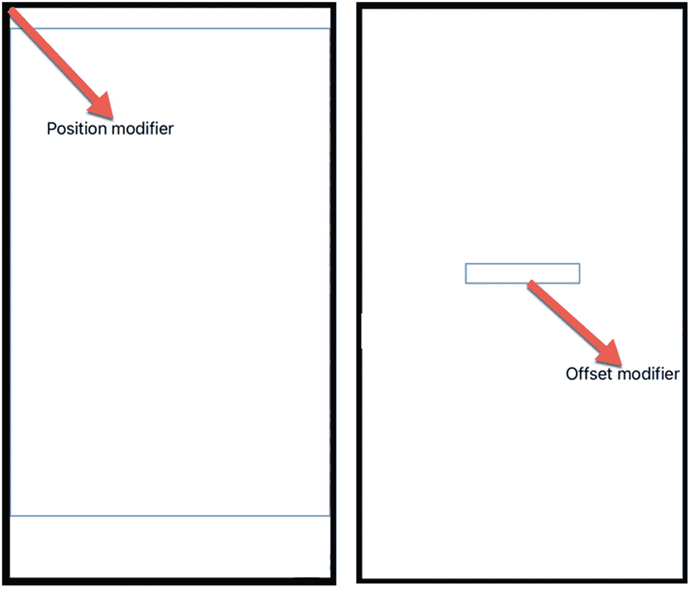

# 19. 使用动画

动画可以移动用户界面上的项目，以提供反馈或只是增加美观效果。与传统的逐帧手绘动画不同，在 SwiftUI 中，动画只需定义开始和结束状态即可工作。然后，SwiftUI 会负责在这些开始和结束状态之间为项目制作动画。

最常见的三种动画类型包括：

*   移动 – 改变项目在用户界面上的 x 和 y 位置
*   缩放 – 通过缩小或放大来改变项目的大小
*   旋转 – 顺时针或逆时针改变项目的角度

创建动画涉及定义要动画化的内容、动画化的方式（移动、缩放、旋转）以及何时进行动画化。通常，当用户执行某些操作（例如点击按钮）或特定事件发生时（例如数值达到某个点），动画就会触发。

## 移动动画

要移动视图，我们必须定义一个 x、y 起始位置和一个 x、y 结束位置。指定位置的两个修改器是 `.position` 和 `.offset`。

`.position` 修改器将视图放置在距离 iOS 设备屏幕左上角（被视为原点 (0,0)）特定的 x 和 y 位置处。`.offset` 修改器将视图放置在距离它在用户界面上正常显示位置特定的 x 和 y 位置处。

`.position` 修改器定义了屏幕上的固定位置。 `.offset` 修改器定义了相对于其 `.offset` 修改器 x 和 y 值均为 0 时正常显示位置的位置。在这两种情况下，正的 x 值将视图向右移动，正的 y 值将视图向下移动，如图 19-1 所示。



图 19-1

`.position` 修改器和 `.offset` 修改器之间的区别

注意

使用 `.position` 和 `.offset` 修改器时，极端的 x 或 y 值可能会使视图移出屏幕。

要了解如何使用 `.position` 和 `.offset` 修改器移动视图，请按照以下步骤操作：

1.  创建一个新的 SwiftUI iOS 应用项目，并随意命名，例如“MoveAnimation”。

2.  在导航器窗格中点击 `ContentView` 文件。

3.  在 `struct ContentView: View` 行下添加一个状态变量，如下所示：

    ```
    struct ContentView: View {
    @State var move = true
    ```

4.  在 `var body: some View` 内部添加一个 `VStack`。

5.  在 `VStack` 内部添加一个 `Text` 视图和一个 `Toggle`，如下所示：

    ```
    var body: some View {
    VStack {
    Text("A Text view")
    .offset(x: move ? 100 : 0, y: move ? 100 : 0)
    Toggle(isOn: $move) {
    Text("Toggle me")
    }
    }
    }
    ```

整个 `ContentView` 文件应如下所示：

    ```
    import SwiftUI
    struct ContentView: View {
    @State var move = true
    var body: some View {
    VStack {
    Text("A Text view")
    .offset(x: move ? 100 : 0, y: move ? 100 : 0)
    Toggle(isOn: $move) {
    Text("Toggle me")
    }
    }
    }
    }
    struct ContentView_Previews: PreviewProvider {
    static var previews: some View {
    ContentView()
    }
    }
    ```

6.  在画布窗格上点击 Live Preview 图标。

7.  点击 Toggle。注意 `.offset` 修改器将 `Text` 视图移离其正常位置。

8.  编辑 `ContentView` 文件，将 `.offset` 替换为 `.position`，如下所示：

    ```
    .position(x: move ? 100 : 0, y: move ? 100 : 0)
    ```

9.  确保 Live Preview 仍处于开启状态，然后点击 Toggle。注意 `Text` 视图现在基于屏幕左上角的原点 (0,0) 移动。

    注意，`.offset` 和 `.position` 修改器都会使 `Text` 视图从一个位置跳到另一个位置。现在是时候为 `Text` 视图添加 `.animation` 修改器，以使移动看起来更平滑。

10. 为 `Text` 视图添加 `.animation` 修改器，使整个 `ContentView` 文件如下所示：

    ```
    import SwiftUI
    struct ContentView: View {
    @State var move = true
    var body: some View {
    VStack {
    Text("A Text view")
    //                .offset(x: move ? 100 : 0, y: move ? 100 : 0)
    .position(x: move ? 100 : 0, y: move ? 100 : 0)
    .animation(.default, value: move)
    Toggle(isOn: $move) {
    Text("Toggle me")
    }
    }
    }
    }
    struct ContentView_Previews: PreviewProvider {
    static var previews: some View {
    ContentView()
    }
    }
    ```

11. 确保 Live Preview 仍处于开启状态，然后点击 Toggle。注意 `Text` 视图现在在基于屏幕左上角原点 (0,0) 移动时呈现动画效果。

12. 将 `.position` 修改器替换为 `.offset` 修改器。

13. 确保 Live Preview 仍处于开启状态，然后点击 Toggle。注意 `Text` 视图现在在基于其正常位置移动时呈现动画效果。

在这个项目中，`.animation` 修改器提供了 `Text` 视图在两个不同 x 和 y 位置之间的过渡。每次 Toggle 更改布尔状态变量时，动画都会再次运行。


## 缩放动画

另一种创建动画的方式是为视图定义两种不同的尺寸，即缩放。若要定义视图尺寸的起始和结束状态，可使用 `.scaleEffect` 修饰符并指定要进行的相对尺寸变化。例如，`.scaleEffect(1)` 代表视图的当前尺寸。大于 1 的 `.scaleEffect` 值定义更大的尺寸或缩放比例，而小于 1 的值则定义更小的尺寸或缩放比例。

若要了解如何通过将视图缩放到不同尺寸来实现动画效果，请按以下步骤操作：

1. 创建一个新的 SwiftUI iOS App 项目，并为其任意命名，例如"ScaleAnimation"。
2. 在导航器窗格中点击 `ContentView` 文件。
3. 在 `struct ContentView: View` 行下方添加一个 `State` 变量，如下所示：
4. 在 `var body: some View` 中添加一个 `Image` 视图，如下所示：

```
struct ContentView: View {
@State private var changeMe = false
```

```
var body: some View {
Image(systemName: "tortoise.fill")
.font(.system(size:100))
.foregroundColor(.red)
.scaleEffect(changeMe ? 1.75 : 1)
}
```

这将在屏幕上以 100 的尺寸显示一个乌龟图标，以便于观察。然后，它将乌龟图标设为红色，并使用 `.scaleEffect` 修饰符将乌龟尺寸在其正常大小的 1.75 倍和原始大小之间交替变化。

5. 向 `Image` 视图添加以下修饰符，如下所示：

```
.animation(.default, value: changeMe)
.onTapGesture {
changeMe.toggle()
}
```

这会为 `Image` 视图添加 `.animation` 修饰符，使其尺寸变化呈现动画效果。接着，`.onTapGesture` 修饰符检测点击手势，以将 `changeMe` 状态变量从 `true` 切换为 `false`（或从 `false` 切换为 `true`）。整个 `ContentView` 文件应如下所示：

6. 点击画布面板上的实时预览图标。
7. 点击乌龟图像。注意，每次点击乌龟图像时，它都会在放大和缩小之间交替变化。

```
import SwiftUI
struct ContentView: View {
@State private var changeMe = false
var body: some View {
Image(systemName: "tortoise.fill")
.font(.system(size:100))
.foregroundColor(.red)
.scaleEffect(changeMe ? 1.75 : 1)
.animation(.default, value: changeMe)
.onTapGesture {
changeMe.toggle()
}
}
}
struct ContentView_Previews: PreviewProvider {
static var previews: some View {
ContentView()
}
}
```

## 旋转动画

旋转动画涉及使用 `.rotationEffect` 修饰符改变视图的角度。`.rotationEffect` 值为 0 表示不旋转，而小于或大于 0 的旋转值则会使视图逆时针或顺时针旋转。

若要了解如何通过将视图旋转不同角度来实现动画效果，请按以下步骤操作：

1. 创建一个新的 SwiftUI iOS App 项目，并为其任意命名，例如"RotateAnimation"。
2. 在导航器窗格中点击 `ContentView` 文件。
3. 在 `struct ContentView: View` 行下方添加两个 `State` 变量，如下所示：
4. 在 `var body: some View` 中添加一个 `VStack`。
5. 在 `VStack` 中添加一个 `Text` 视图，如下所示：

```
struct ContentView: View {
@State var myDegrees: Double = 0.0
@State var flag = false
```

```
var body: some View {
VStack {
Text("Hello, world!")
.padding()
.rotationEffect(Angle(degrees: flag ? myDegrees : 0))
.animation(.default, value: flag)
```

此 `Text` 视图使用 `.rotationEffect` 来定义起始和结束角度。然后使用 `.animation` 修饰符来让 `Text` 视图在起始和结束角度之间旋转时呈现动画效果。

6. 在 `VStack` 中的 `Text` 视图下方添加一个 `Button` 和一个 `Slider`，如下所示：

```
var body: some View {
VStack {
Text("Hello, world!")
.padding()
.rotationEffect(Angle(degrees: flag ? myDegrees : 0))
.animation(.default, value: flag)
Button("现在开始动画") {
flag.toggle()
}
Slider(value: $myDegrees, in: -180...180, step: 1)
.padding()
}
}
```

`Slider` 允许你在 -180 度到 180 度之间选择角度。整个 `ContentView` 文件应如下所示：

7. 点击画布面板上的实时预览图标。
8. 向左或向右拖动 `Slider` 来定义一个结束角度。（起始角度为 0。）
9. 点击 `Button`。注意，`.animation` 修饰符会在 `Text` 视图旋转到新角度时为其添加动画效果。

```
import SwiftUI
struct ContentView: View {
@State var myDegrees: Double = 0.0
@State var flag = false
var body: some View {
VStack {
Text("Hello, world!")
.padding()
.rotationEffect(Angle(degrees: flag ? myDegrees : 0))
.animation(.default, value: flag)
Button("现在开始动画") {
flag.toggle()
}
Slider(value: $myDegrees, in: -180...180, step: 1)
.padding()
}
}
}
struct ContentView_Previews: PreviewProvider {
static var previews: some View {
ContentView()
}
}
```

## 动画选项

到目前为止，我们一直使用 `.animation` 修饰符的 `.default` 设置。虽然这有效，但你还可以选择其他几种动画选项：

- `.easeIn` – 动画开始时较慢，然后加速
- `.easeOut` – 动画在接近结束时减速
- `.easeInOut` – 动画开始时较慢，然后加速，最后在接近结束时减速（与 `.default` 相同）
- `.linear` – 动画从开始到结束保持恒定速度

通过选择不同的 `.animation` 选项，你可以调整动画运行时的呈现效果。为了比较这些不同的 `.animation` 选项，请按以下步骤操作：

1. 创建一个新的 SwiftUI iOS App 项目，并为其任意命名，例如"CompareAnimation"。
2. 在导航器窗格中点击 `ContentView` 文件。
3. 在 `struct ContentView: View` 行下方添加一个 `State` 变量，如下所示：
4. 在 `var body: some View` 中添加一个 `VStack`。
5. 在 `VStack` 中添加一个 `Button`，如下所示：

```
struct ContentView: View {
@State private var start = false
```

```
var body: some View {
VStack {
Button("开始动画") {
start.toggle()
}
```

6. 在 `Button` 下方添加一个包含四个 `Text` 视图的 `HStack`，如下所示：

```
HStack {
Text("easeIn")
.offset(x: 0, y: start ? 450 : 0)
.animation(.easeIn, value: start)
Text("easeOut")
.offset(x: 0, y: start ? 450 : 0)
.animation(.easeOut, value: start)
Text("easeInOut")
.offset(x: 0, y: start ? 450 : 0)
.animation(.easeInOut, value: start)
Text("linear")
.offset(x: 0, y: start ? 450 : 0)
.animation(.linear, value: start)
}.position(x: 150, y: 10)
```

注意，`.position` 修饰符初始时将整个 `HStack` 及其所有四个 `Text` 视图放置在靠近屏幕顶部的位置。整个 `ContentView` 文件应如下所示：

7. 点击画布面板上的实时预览图标。
8. 点击 `Button`。注意，所有四个 `Text` 视图都会下落至屏幕底部，但由于它们使用了不同的 `.animation` 选项，即使都同时开始和停止，动画的呈现效果也略有不同。

```
import SwiftUI
struct ContentView: View {
@State private var start = false
var body: some View {
VStack {
Button("开始动画") {
start.toggle()
}
HStack {
Text("easeIn")
.offset(x: 0, y: start ? 450 : 0)
.animation(.easeIn, value: start)
Text("easeOut")
.offset(x: 0, y: start ? 450 : 0)
.animation(.easeOut, value: start)
Text("easeInOut")
.offset(x: 0, y: start ? 450 : 0)
.animation(.easeInOut, value: start)
Text("linear")
.offset(x: 0, y: start ? 450 : 0)
.animation(.linear, value: start)
}.position(x: 150, y: 10)
}
}
}
struct ContentView_Previews: PreviewProvider {
static var previews: some View {
ContentView()
}
}
```


### 在动画中使用延迟和持续时间

通过时间修改动画的两种方式包括延迟和持续时间。延迟可让你指定开始动画前等待的秒数。持续时间可让你指定动画应持续的时间。较大的时间值会使动画运行得更慢，而较短的时间值则会使动画运行得更快。

若要定义延迟，请在你希望的 `.animation` 选项上添加 `.delay` 修饰符，例如：

```
.animation(.linear.delay(2.5), value: BooleanStateVariable)
```

要了解延迟的工作原理，请按照以下步骤操作：

1.  加载之前的 "CompareAnimation" Xcode 项目。
2.  像这样为每个 `.animation` 选项添加 `.delay` 修饰符：

```
HStack {
Text("easeIn")
.offset(x: 0, y: start ? 450 : 0)
.animation(.easeIn.delay(0.5), value: start)
Text("easeOut")
.offset(x: 0, y: start ? 450 : 0)
.animation(.easeOut.delay(1.0), value: start)
Text("easeInOut")
.offset(x: 0, y: start ? 450 : 0)
.animation(.easeInOut.delay(1.5), value: start)
Text("linear")
.offset(x: 0, y: start ? 450 : 0)
.animation(.linear.delay(2.5), value: start)
}.position(x: 150, y: 10)
```

整个 `ContentView` 文件应如下所示：

1.  点击画布面板上的“实时预览”图标。
2.  点击按钮。请注意，如果每个 `Text` 视图都有不同的 `.delay` 值，现在它们会在不同的时间开始动画。

```
import SwiftUI
struct ContentView: View {
@State private var start = false
var body: some View {
VStack {
Button("Start animation") {
start.toggle()
}
HStack {
Text("easeIn")
.offset(x: 0, y: start ? 450 : 0)
.animation(.easeIn.delay(0.5), value: start)
Text("easeOut")
.offset(x: 0, y: start ? 450 : 0)
.animation(.easeOut.delay(1.0), value: start)
Text("easeInOut")
.offset(x: 0, y: start ? 450 : 0)
.animation(.easeInOut.delay(1.5), value: start)
Text("linear")
.offset(x: 0, y: start ? 450 : 0)
.animation(.linear.delay(2.5), value: start)
}.position(x: 150, y: 10)
}
}
}
struct ContentView_Previews: PreviewProvider {
static var previews: some View {
ContentView()
}
}
```

若要定义持续时间，请在你希望的 `.animation` 选项中添加持续时间，例如：

```
.animation(.easeIn(duration(0.7)), value: BooleanStateVariable)
```

> **注意：** 你可以像这样将持续时间与延迟结合使用：`.animation(.linear(duration: 3.1).delay(1.2)), value: BooleanStateVariable)`

延迟暂时阻止动画开始，而持续时间则定义了动画实际运行的时间。要了解持续时间的工作原理，请按照以下步骤操作：

1.  加载之前的 "CompareAnimation" Xcode 项目。
2.  像这样为每个 `.animation` 选项添加一个持续时间：

```
HStack {
Text("easeIn")
.offset(x: 0, y: start ? 450 : 0)
.animation(.easeIn(duration(0.7)), value: start)
Text("easeOut")
.offset(x: 0, y: start ? 450 : 0)
.animation(.easeOut(duration(1.7)), value: start)
Text("easeInOut")
.offset(x: 0, y: start ? 450 : 0)
.animation(.easeInOut(duration(2.6)), value: start)
Text("linear")
.offset(x: 0, y: start ? 450 : 0)
.animation(.linear(duration(3.1)), value: start)
}.position(x: 150, y: 10)
```

整个 `ContentView` 文件应如下所示：

1.  点击画布面板上的“实时预览”图标。
2.  点击按钮。请注意不同的持续时间值如何修改各个动画。

```
import SwiftUI
struct ContentView: View {
@State private var start = false
var body: some View {
VStack {
Button("Start animation") {
start.toggle()
}
HStack {
Text("easeIn")
.offset(x: 0, y: start ? 450 : 0)
.animation(.easeIn(duration: 0.7), value: start)
Text("easeOut")
.offset(x: 0, y: start ? 450 : 0)
.animation(.easeOut(duration: 1.7), value: start)
Text("easeInOut")
.offset(x: 0, y: start ? 450 : 0)
.animation(.easeInOut(duration: 2.6), value: start)
Text("linear")
.offset(x: 0, y: start ? 450 : 0)
.animation(.linear(duration: 3.1), value: start)
}.position(x: 150, y: 10)
}
}
}
struct ContentView_Previews: PreviewProvider {
static var previews: some View {
ContentView()
}
}
```

### 在动画中使用插值弹簧

为了提供更多自定义动画工作方式的方法，你还可以为动画定义一个 `.interpolatingSpring` 修饰符。`.interpolatingSpring` 允许你定义一个或多个以下属性：

-   **质量（Mass）** – 低值动画较慢，减震较小；高值动画较快，减震较大。
-   **刚度（Stiffness）** – 低值动画较慢；高值动画较快。
-   **阻尼（Damping）** – 低值会产生更多“弹跳”；高值则会抑制“弹跳”。
-   **初始速度（InitialVelocity）** – 低值开始时动画缓慢；高值开始时动画较快。

要了解刚度和阻尼的工作原理，请按照以下步骤操作：

1.  加载之前的 "CompareAnimation" Xcode 项目。
2.  将所有 `Text` 视图改为显示相同的字符串，例如 "spring"。
3.  像这样为每个 `Text` 视图添加一个 `.interpolatingSpring` 修饰符：

```
HStack {
Text("spring")
.offset(x: 0, y: start ? 450 : 0)
.animation(.interpolatingSpring(stiffness: 1, damping: 1), value: start)
Text("spring")
.offset(x: 0, y: start ? 450 : 0)
.animation(.interpolatingSpring(stiffness: 1.8, damping: 1), value: start)
Text("spring")
.offset(x: 0, y: start ? 450 : 0)
.animation(.interpolatingSpring(stiffness: 0.5, damping: 1), value: start)
Text("spring")
.offset(x: 0, y: start ? 450 : 0)
.animation(.interpolatingSpring(stiffness: 2, damping: 1), value: start)
}.position(x: 150, y: 10)
```

确保每个 `.animation` 修饰符的阻尼参数相同，并确保每个 `.animation` 修饰符的刚度参数不同。整个 `ContentView` 文件应如下所示：

1.  点击画布面板上的“实时预览”图标。
2.  点击按钮。请注意不同的刚度值如何改变每个 `Text` 视图的动画方式。
3.  编辑 `.animation` 修饰符，使刚度值相同但阻尼值不同。
4.  点击按钮。请注意不同的阻尼值如何改变每个 `Text` 视图在停止前上下弹跳的方式。

```
import SwiftUI
struct ContentView: View {
@State private var start = false
var body: some View {
VStack {
Button("Start animation") {
start.toggle()
}
HStack {
Text("spring")
.offset(x: 0, y: start ? 450 : 0)
.animation(.interpolatingSpring(stiffness: 1, damping: 1), value: start)
Text("spring")
.offset(x: 0, y: start ? 450 : 0)
.animation(.interpolatingSpring(stiffness: 1.8, damping: 1), value: start)
Text("spring")
.offset(x: 0, y: start ? 450 : 0)
.animation(.interpolatingSpring(stiffness: 0.5, damping: 1), value: start)
Text("spring")
.offset(x: 0, y: start ? 450 : 0)
.animation(.interpolatingSpring(stiffness: 2, damping: 1), value: start)
}.position(x: 150, y: 10)
}
}
}
struct ContentView_Previews: PreviewProvider {
static var previews: some View {
ContentView()
}
}
```

除了刚度和阻尼，你还可以定义质量和初始速度。通过尝试四个参数的不同值，你可以进一步自定义动画。

要了解质量和初始速度如何影响动画，请按照以下步骤操作：

1.  加载之前的 "CompareAnimation" Xcode 项目。
2.  像这样为每个 `Text` 视图添加一个 `.interpolatingSpring` 修饰符：

```
HStack {
Text("spring")
.offset(x: 0, y: start ? 450 : 0)
.animation(.interpolatingSpring(mass: 1, stiffness: 1, damping: 1, initialVelocity: 1), value: start)
Text("spring")
.offset(x: 0, y: start ? 450 : 0)
.animation(.interpolatingSpring(mass: 1.9, stiffness: 1, damping: 1, initialVelocity: 1), value: start)
Text("spring")
.offset(x: 0, y: start ? 450 : 0)
.animation(.interpolatingSpring(mass: 2.5, stiffness: 1, damping: 1, initialVelocity: 1), value: start)
Text("spring")
.offset(x: 0, y: start ? 450 : 0)
.animation(.interpolatingSpring(mass: 3.5, stiffness: 1, damping: 1, initialVelocity: 1), value: start)
}.position(x: 150, y: 10)
```


确保每个`.animation`修饰器的`initialVelocity`相同，但每个`.animation`修饰器的`mass`值不同。完整的`ContentView`文件应如下所示：

1.  单击 Canvas 面板上的“Live Preview”图标。
2.  单击 Button。观察相比于较低的`mass`值，较高的`mass`值如何影响动画。
3.  编辑`.animation`修饰器，使`mass`值相同，但`initialVelocity`值不同。
4.  单击 Button。观察不同的`initialVelocity`值如何改变每个`Text`视图开始动画的方式。

```swift
import SwiftUI
struct ContentView: View {
@State private var start = false
var body: some View {
VStack {
Button("Start animation") {
start.toggle()
}
HStack {
Text("spring")
.offset(x: 0, y: start ? 450 : 0)
.animation(.interpolatingSpring(mass: 1, stiffness: 1, damping: 1, initialVelocity: 1), value: start)
Text("spring")
.offset(x: 0, y: start ? 450 : 0)
.animation(.interpolatingSpring(mass: 1.9, stiffness: 1, damping: 1, initialVelocity: 1), value: start)
Text("spring")
.offset(x: 0, y: start ? 450 : 0)
.animation(.interpolatingSpring(mass: 2.5, stiffness: 1, damping: 1, initialVelocity: 1), value: start)
Text("spring")
.offset(x: 0, y: start ? 450 : 0)
.animation(.interpolatingSpring(mass: 3.5, stiffness: 1, damping: 1, initialVelocity: 1), value: start)
}.position(x: 150, y: 10)
}
}
}
struct ContentView_Previews: PreviewProvider {
static var previews: some View {
ContentView()
}
}
```

通过修改`mass`、`stiffness`、`damping`和`initialVelocity`的值，您可以为用户界面找到完美的动画效果。

## 使用`withAnimation`

通过使用`.animation`修饰器，您可以定义要动画化的视图。`.animation`修饰器的一个问题是，如果您有五个视图要以相同方式动画化，您必须为所有五个视图添加相同的`.animation`修饰器，如下所示：

```swift
HStack {
Text("One")
.offset(x: 0, y: start ? 450 : 0)
.animation(.default, value: start)
Text("Two")
.offset(x: 0, y: start ? 450 : 0)
.animation(.default, value: start)
Text("Three")
.offset(x: 0, y: start ? 450 : 0)
.animation(.default, value: start)
Text("Four")
.offset(x: 0, y: start ? 450 : 0)
.animation(.default, value: start)
Text("Five")
.offset(x: 0, y: start ? 450 : 0)
.animation(.default, value: start)
}
```

为了解决这个问题，SwiftUI 提供了第二种动画化视图的方法。`withAnimation`允许您指定可以动画化视图的`State`变量。您无需在多个视图上编写多个`.animation`修饰器，只需定义要影响的`State`变量，当该`State`变量发生更改时，它会自动动画化使用该`State`变量的任何视图，如下所示：

```swift
withAnimation {
start.toggle()
}
```

要了解`withAnimation`如何工作，请按照以下步骤操作：

1.  创建一个新的 SwiftUI iOS App 项目，并为您喜欢的任何名称，例如“WithAnimation”。
2.  在 Navigator 窗格中单击`ContentView`文件。
3.  在`struct ContentView: View`行下添加一个`State`变量，如下所示：

```swift
struct ContentView: View {
@State private var start = false
```

1.  在`var body: some View`行下添加一个`VStack`和一个`Button`，如下所示：

```swift
var body: some View {
VStack {
Button("Start animation") {
start.toggle()
}
```

1.  在`Button`下方添加一个包含五个`Text`视图的`HStack`，如下所示：

```swift
HStack {
Text("One")
.offset(x: 0, y: start ? 450 : 0)
.animation(.default, value: start)
Text("Two")
.offset(x: 0, y: start ? 450 : 0)
.animation(.default, value: start)
Text("Three")
.offset(x: 0, y: start ? 450 : 0)
.animation(.default, value: start)
Text("Four")
.offset(x: 0, y: start ? 450 : 0)
.animation(.default, value: start)
Text("Five")
.offset(x: 0, y: start ? 450 : 0)
.animation(.default, value: start)
}.position(x: 150, y: 10)
```

请注意，每个`Text`视图都具有相同的`.animation`修饰器。完整的`ContentView`文件应如下所示：

```swift
import SwiftUI
struct ContentView: View {
@State private var start = false
var body: some View {
VStack {
Button("Start animation") {
start.toggle()
}
HStack {
Text("One")
.offset(x: 0, y: start ? 450 : 0)
.animation(.default, value: start)
Text("Two")
.offset(x: 0, y: start ? 450 : 0)
.animation(.default, value: start)
Text("Three")
.offset(x: 0, y: start ? 450 : 0)
.animation(.default, value: start)
Text("Four")
.offset(x: 0, y: start ? 450 : 0)
.animation(.default, value: start)
Text("Five")
.offset(x: 0, y: start ? 450 : 0)
.animation(.default, value: start)
}.position(x: 150, y: 10)
}
}
}
struct ContentView_Previews: PreviewProvider {
static var previews: some View {
ContentView()
}
}
```

1.  单击 Canvas 面板上的“Live Preview”图标。
2.  单击 Button 使所有五个`Text`视图以相同方式动画化。
3.  注释掉（或删除）每个`Text`视图上的所有`.animation`修饰器。
4.  编辑`ContentView`文件中的`Button`代码，以包含`withAnimation`块，如下所示：

```swift
Button("Start animation") {
withAnimation {
start.toggle()
}
}
```

完整的`ContentView`文件应如下所示：

```swift
import SwiftUI
struct ContentView: View {
@State private var start = false
var body: some View {
VStack {
Button("Start animation") {
withAnimation {
start.toggle()
}
}
HStack {
Text("One")
.offset(x: 0, y: start ? 450 : 0)
//                    .animation(.default, value: start)
Text("Two")
.offset(x: 0, y: start ? 450 : 0)
//                    .animation(.default, value: start)
Text("Three")
.offset(x: 0, y: start ? 450 : 0)
//                    .animation(.default, value: start)
Text("Four")
.offset(x: 0, y: start ? 450 : 0)
//                    .animation(.default, value: start)
Text("Five")
.offset(x: 0, y: start ? 450 : 0)
//                    .animation(.default, value: start)
}.position(x: 150, y: 10)
}
}
}
struct ContentView_Previews: PreviewProvider {
static var previews: some View {
ContentView()
}
}
```

1.  单击 Button，注意所有五个`Text`视图的动画化效果与之前每个`Text`视图都有自己的`.animation`修饰器时完全相同。

如果您想添加延迟和持续时间，可以使用如下代码：

```swift
withAnimation(.easeOut(duration: 2.1).delay(1.2)) {
}
```

您还可以使用`.interpolatingSpring`来定义`stiffness`和`damping`，如下所示：

```swift
withAnimation(.interpolatingSpring(stiffness: 2.4, damping: 1.6)) {
}
```

要包含`mass`和`initialVelocity`参数，您可以使用如下代码：

```swift
withAnimation(.interpolatingSpring(mass: 25, stiffness: 1.5, damping: 2.3, initialVelocity: 1.7)) {
}
```

您用`.animation`修饰器能做的任何事情，也都可以用`withAnimation`块来完成。您可以在同一代码中使用一种方法代替另一种方法，或者同时使用两种方法。

## 总结

动画通过向用户提供视觉反馈或提供吸引用户的趣味视觉图像，可以使您的用户界面生动起来。作为一般规则，请谨慎使用动画，因为同时发生过多的视觉变化可能会造成混淆和干扰。最佳的动画能够突出一个动作，但不会在过程中使用户不知所措。

动画涉及定义开始和结束状态，无论您是在移动、调整大小还是旋转视图。然后，您需要某种触发器来定义新状态。最后，您需要用到`.animation`修饰器。如果您要使用完全相同的`.animation`修饰器来动画化多个视图，则可以通过使用`withAnimation`来减少代码重复。

要自定义动画，您可以定义`delay`和`duration`值，以减缓动画开始前的时间以及完成动画所需的时间。要实现更大的自定义，请使用`.interpolatingSpring`修饰器，并定义`mass`、`stiffness`、`damping`和`initialVelocity`。通过使用动画，您可以使您的用户界面更富趣味性和吸引力。


