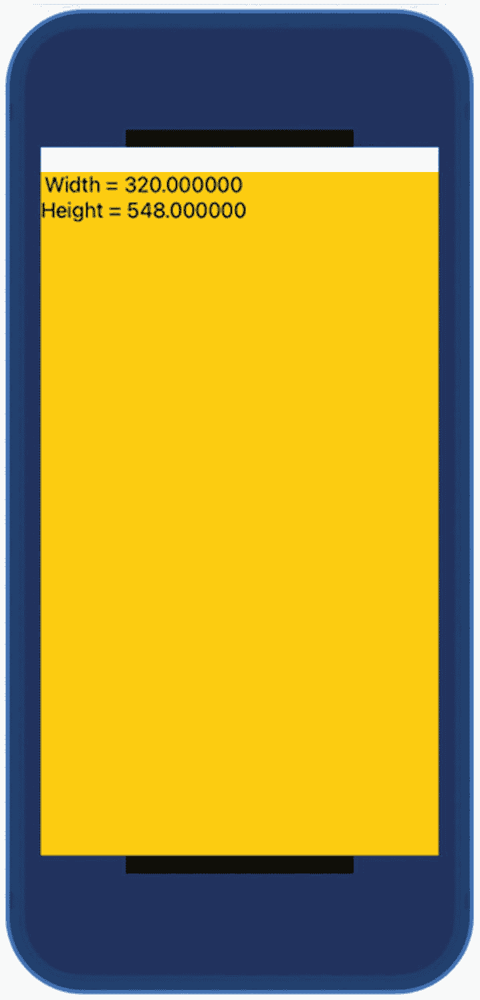
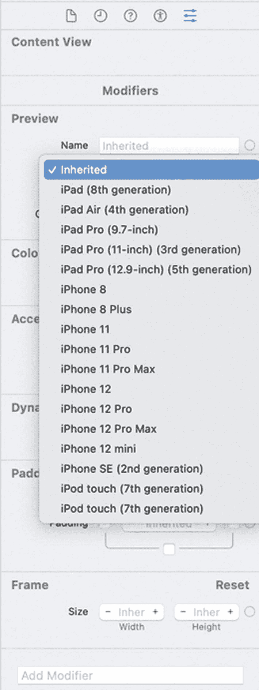
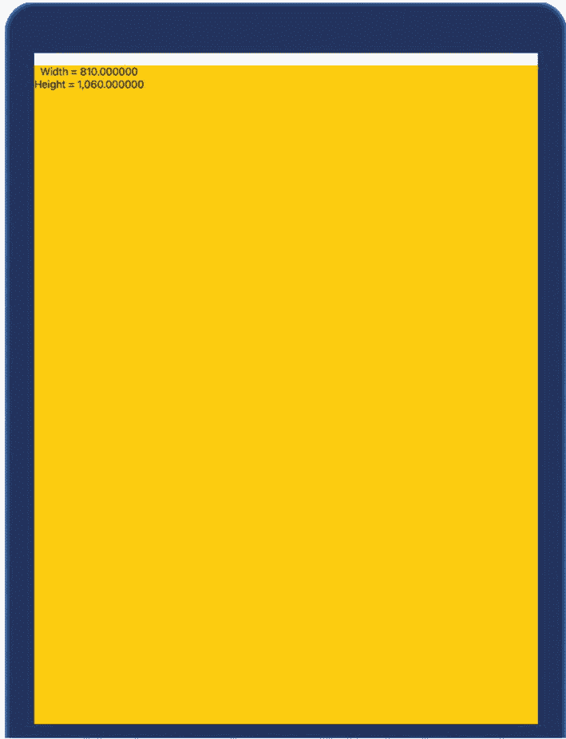
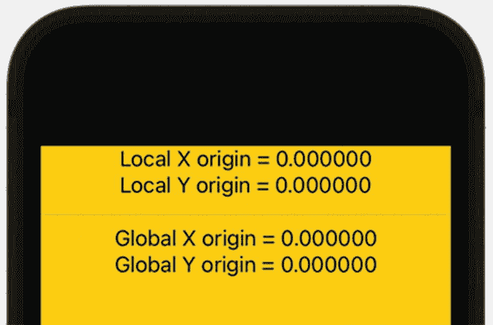
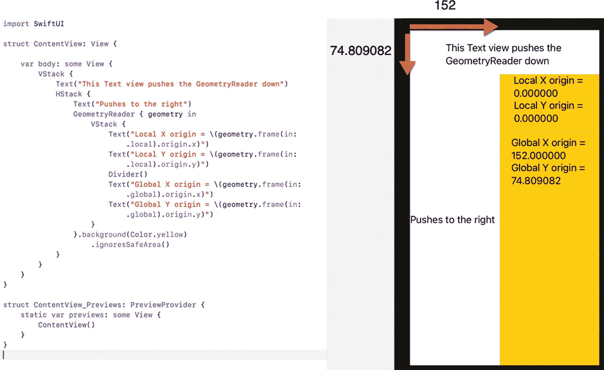
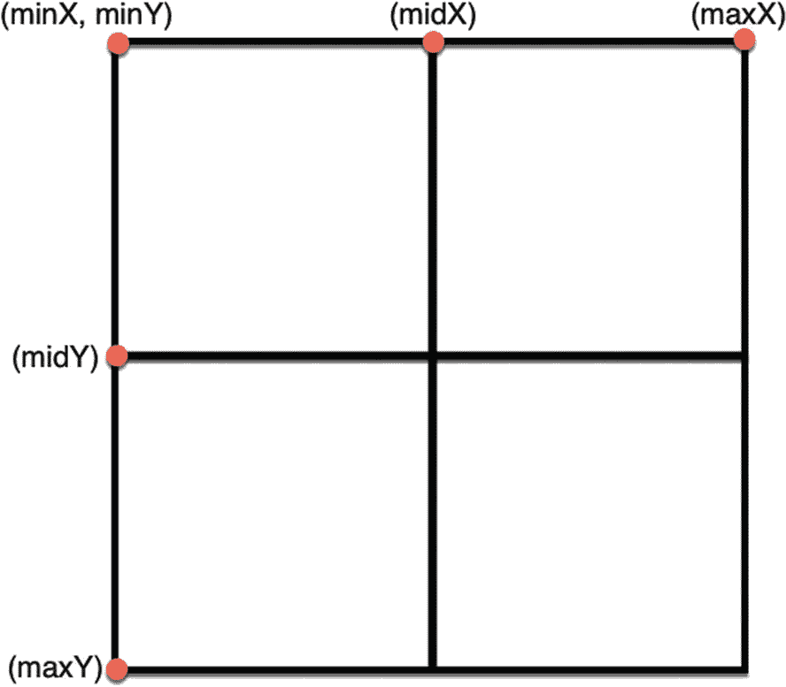

# 20. 使用 `GeometryReader`

iOS 设备的用户界面必须适配不同的屏幕尺寸。不仅 iPhone 和 iPad 的屏幕尺寸不同，而且市面上不同型号的 iPhone 和 iPad 也有不同的屏幕尺寸。为了解决这个问题，SwiftUI 会将用户界面元素居中放置，但如果需要将用户界面元素精确地放置在特定位置呢？

具体的 X 和 Y 坐标是行不通的，因为在大屏幕上看起来效果好的坐标，在小屏幕上可能就不合适，反之亦然。当需要将用户界面元素放置在屏幕上的特定位置时，更安全的做法是使用 `GeometryReader`。

`GeometryReader` 就像一个容器，能够自动适配不同的屏幕尺寸。添加 `GeometryReader` 后，你可以使用它的相对坐标来放置用户界面元素，而不是不同屏幕尺寸的精确坐标。这样，当应用在不同尺寸的屏幕上运行时，`GeometryReader` 也会相应地调整其相对坐标。

## 理解 `GeometryReader`

`GeometryReader` 可以像堆栈一样容纳多个视图。关键区别在于 `GeometryReader` 会尽可能多地扩展空间。此外，`GeometryReader` 可以获取自身的宽度和高度。定义 `GeometryReader` 的代码如下所示：

```
GeometryReader { geometry in
// 在此处定义视图
}
```

在上面的示例中，`GeometryReader` 使用了一个任意命名的变量，例如 "geometry"，当然这个变量可以任意命名。然后，要获取 `GeometryReader` 的宽度和高度，可以像这样获取 `size.width` 和 `size.height` 属性：

```
geometry.size.width
geometry.size.height
```

要了解 `GeometryReader` 是如何工作的，请按照以下步骤操作：

1.  创建一个新的 SwiftUI iOS App 项目，并随意给它命名，例如 "BasicGeometryReader"。
2.  在导航器窗格中单击 `ContentView` 文件。
3.  在 `var body: some View` 内部添加一个 `GeometryReader`，如下所示：

```
var body: some View {
GeometryReader { geometry in
}.background(Color.yellow)
}
```

`.background` 修饰符为 `GeometryReader` 着色，便于看清其边界。

4.  在 `GeometryReader` 内部添加一个 `VStack`。
5.  在 `VStack` 内部添加两个 `Text` 视图，如下所示：

```
var body: some View {
GeometryReader { geometry in
VStack {
Text("Width = \(geometry.size.width)")
Text("Height = \(geometry.size.height)")
}
}.background(Color.yellow)
}
```

整个 `ContentView` 文件应该如下所示：

```
import SwiftUI
struct ContentView: View {
var body: some View {
GeometryReader { geometry in
VStack {
Text("Width = \(geometry.size.width)")
Text("Height = \(geometry.size.height)")
}
}.background(Color.yellow)
}
}
struct ContentView_Previews: PreviewProvider {
static var previews: some View {
ContentView()
}
}
```

请注意，`geometry.size.width` 和 `geometry.size.height` 属性定义了当前 iOS 设备（例如图 20-1 中显示的 iPod Touch）内 `GeometryReader` 的高度和宽度。



图 20-1 `GeometryReader` 在 iPod Touch 中定义其宽度和高度



图 20-2 检查器窗格中的设备弹出菜单

6.  在 `struct ContentView_Previews: PreviewProvider` 内部单击 `ContentView()`。Xcode 窗口右侧将显示检查器窗格。
7.  单击设备弹出菜单，选择不同的屏幕尺寸，例如较大或较小的 iPhone 或 iPad，如图 20-2 所示。



图 20-3 在不同尺寸的 iOS 屏幕上显示 `GeometryReader` 的宽度和高度

8.  选择不同尺寸的 iPhone 或 iPad。注意，`GeometryReader` 会扩展或收缩以适应新的 iOS 屏幕尺寸的边界，并显示不同的宽度和高度，如图 20-3 所示。

尝试使用不同的 iOS 设备，例如小屏幕的 iPhone 5s 或大屏幕的 iPad Pro。无论你选择哪种尺寸的 iOS 设备屏幕，`GeometryReader` 都可以扩展或收缩，并返回其宽度和高度。


## 理解全局坐标与局部坐标的区别

了解 `GeometryReader` 如何根据不同的 iOS 屏幕尺寸缩放以适配宽度和高度后，下一步就是理解它的坐标系统。`GeometryReader` 内的坐标被称为局部坐标。

而全局坐标则是指整个 iOS 屏幕。不同 iOS 设备屏幕的全局坐标始终不同，但 `GeometryReader` 内的局部坐标始终保持一致。

要观察局部坐标与全局坐标的区别，请按以下步骤操作：

1.  创建一个新的 SwiftUI iOS App 项目，并为其命名，例如 “GeometryReaderCoordinates”。
2.  单击导航面板中的 `ContentView` 文件。
3.  在 `var body: some View` 内添加一个 `GeometryReader`，代码如下：

```
var body: some View {
GeometryReader { geometry in
}.background(Color.yellow)
.ignoresSafeArea()
}
```

如果你注意图 20-1 和图 20-3，会看到 iOS 屏幕顶部有一条水平白色条带。由于许多 iPhone 型号在屏幕顶部有刘海，这条白色条带会将所有内容下推，以确保刘海不会遮挡用户界面的任何部分。

这里的 `.ignoresSafeArea()` 修饰符就是告诉 `GeometryReader` 忽略这条水平条带，并一直扩展到屏幕顶部。

4.  在 `GeometryReader` 内部添加一个 `VStack`，并添加四个 `Text` 视图和一个 `Divider`，代码如下：

```
GeometryReader { geometry in
VStack {
Text("Local X origin = \(geometry.frame(in: .local).origin.x)")
Text("Local Y origin = \(geometry.frame(in: .local).origin.y)")
Divider()
Text("Global X origin = \(geometry.frame(in: .global).origin.x)")
Text("Global Y origin = \(geometry.frame(in: .global).origin.y)")
}
}.background(Color.yellow)
.ignoresSafeArea()
```

首先要注意，`Divider()` 在 `VStack` 中绘制一条水平线（在 `HStack` 中则绘制垂直线）。其次，`frame` 方法返回坐标值。当使用 `.local` 坐标时，`GeometryReader` 的 x 和 y 原点始终为 (0,0)。当使用 `.global` 坐标时，`GeometryReader` 的 x 和 y 原点基于其距离 iOS 屏幕左上角的距离。

整个 `ContentView` 文件应如下所示：

```
import SwiftUI
struct ContentView: View {
var body: some View {
GeometryReader { geometry in
VStack {
Text("Local X origin = \(geometry.frame(in: .local).origin.x)")
Text("Local Y origin = \(geometry.frame(in: .local).origin.y)")
Divider()
Text("Global X origin = \(geometry.frame(in: .global).origin.x)")
Text("Global Y origin = \(geometry.frame(in: .global).origin.y)")
}
}.background(Color.yellow)
.ignoresSafeArea()
}
}
struct ContentView_Previews: PreviewProvider {
static var previews: some View {
ContentView()
}
}
```

请注意，因为 `GeometryReader` 扩展到 iOS 屏幕的最顶部，所以 `GeometryReader` 的左上角与 iOS 屏幕的左上角重合。因此，局部原点和全局原点都是 (0,0)，如图 20-4 所示。



图 20-4

当 GeometryReader 扩展到屏幕顶部时，局部原点与全局原点相同

5.  按如下方式编辑 `var body: some View` 中的代码：

```
var body: some View {
VStack {
Text("This Text view pushes the GeometryReader down")
HStack {
Text("Pushes to the right")
GeometryReader { geometry in
VStack {
Text("Local X origin = \(geometry.frame(in: .local).origin.x)")
Text("Local Y origin = \(geometry.frame(in: .local).origin.y)")
Divider()
Text("Global X origin = \(geometry.frame(in: .global).origin.x)")
Text("Global Y origin = \(geometry.frame(in: .global).origin.y)")
}
}.background(Color.yellow)
.ignoresSafeArea()
}
}
}
```

上述代码使用 `VStack` 将 `GeometryReader` 下推，然后使用 `HStack` 将其右移。注意，`GeometryReader` 的局部原点仍然是 (0,0)，但全局原点发生了变化，该值是从 iOS 屏幕左上角开始测量的，如图 20-5 所示。



图 20-5

定义 GeometryReader 的全局原点

## 识别 GeometryReader 的最小值、中值和最大值

全局坐标取决于当前 iOS 屏幕的尺寸。较小 iOS 屏幕上的最大 X 和 Y 坐标，会与较大屏幕上的最大 X 和 Y 坐标不同。因此，使用全局坐标定位视图可能会导致视图完全移出屏幕或被部分裁切。

相比之下，在 `GeometryReader` 内部使用局部坐标则始终能自动适配不同屏幕尺寸。由于 `GeometryReader` 的宽度或高度会随 iOS 屏幕尺寸变化，因此务必使用最小值和最大值，而不是固定值。

`GeometryReader` 允许你访问以下定义的属性，如图 20-6 所示：



图 20-6

GeometryReader 的最小值、中值和最大值 X 与 Y 值

- `minX`
- `minY`
- `midX`
- `midY`
- `maxX`
- `maxY`

要观察 `GeometryReader` 的最小值、中值和最大值 X 与 Y 值是如何工作的，请按以下步骤操作：

1.  创建一个新的 SwiftUI iOS App 项目，并为其命名，例如 “GeometryReaderValues”。
2.  单击导航面板中的 `ContentView` 文件。
3.  在 `var body: some View` 内添加一个 `GeometryReader`，代码如下：

```
var body: some View {
GeometryReader { geometry in
}.background(Color.yellow)
}
```

4.  在 `GeometryReader` 内部添加一个 `VStack`，并添加六个 `Text` 视图和一个 `Divider`，代码如下：

```
var body: some View {
GeometryReader { geometry in
VStack {
Text("minX = \(geometry.frame(in: .local).minX)")
Text("midX = \(geometry.frame(in: .local).midX)")
Text("maxX = \(geometry.frame(in: .local).maxX)")
Divider()
Text("minY = \(geometry.frame(in: .local).minY)")
Text("midY = \(geometry.frame(in: .local).midY)")
Text("maxY = \(geometry.frame(in: .local).maxY)")
}
}.background(Color.yellow)
}
```

整个 `ContentView` 文件应如下所示：

```
import SwiftUI
struct ContentView: View {
var body: some View {
GeometryReader { geometry in
VStack {
Text("minX = \(geometry.frame(in: .local).minX)")
Text("midX = \(geometry.frame(in: .local).midX)")
Text("maxX = \(geometry.frame(in: .local).maxX)")
Divider()
Text("minY = \(geometry.frame(in: .local).minY)")
Text("midY = \(geometry.frame(in: .local).midY)")
Text("maxY = \(geometry.frame(in: .local).maxY)")
}
}.background(Color.yellow)
}
}
struct ContentView_Previews: PreviewProvider {
static var previews: some View {
ContentView()
}
}
```

请注意，`maxX` 和 `maxY` 属性只是另一种测量 `GeometryReader` 宽度和高度的方法。

5.  单击结构体 `ContentView_Previews: PreviewProvider` 内的 `ContentView()`。检查器面板会出现在 Xcode 窗口的右侧。
6.  单击设备弹出菜单，选择不同尺寸的屏幕，例如较大或较小的 iPhone 或 iPad（见图 20-2）。
7.  选择不同尺寸的 iPhone 或 iPad。注意，`GeometryReader` 会扩展或收缩以适应新 iOS 屏幕尺寸的边界，并显示不同的 `maxX` 和 `maxY` 值。


## 总结

`GeometryReader`是一个独特的容器，可以容纳多个视图。通过使用`GeometryReader`的本地坐标，你可以在用户界面上放置不同的视图，这些视图能够自动适应不同的 iOS 屏幕尺寸。

`GeometryReader`可以扩展以填充整个屏幕，也可以与堆栈内的其他视图共享屏幕。识别`GeometryReader`宽度和高度的两种方法是：获取`size.height`和`size.width`属性，以及获取`maxX`和`maxY`属性。

通过使用`GeometryReader`内的本地坐标，你始终知道原点`(0,0)`出现在`GeometryReader`的左上角，无论`GeometryReader`出现在何处。通过使用全局坐标，你始终知道原点`(0,0)`出现在屏幕的左上角。

`GeometryReader`只是使用特定的 X 和 Y 坐标在屏幕上定位不同视图的另一种方式。


