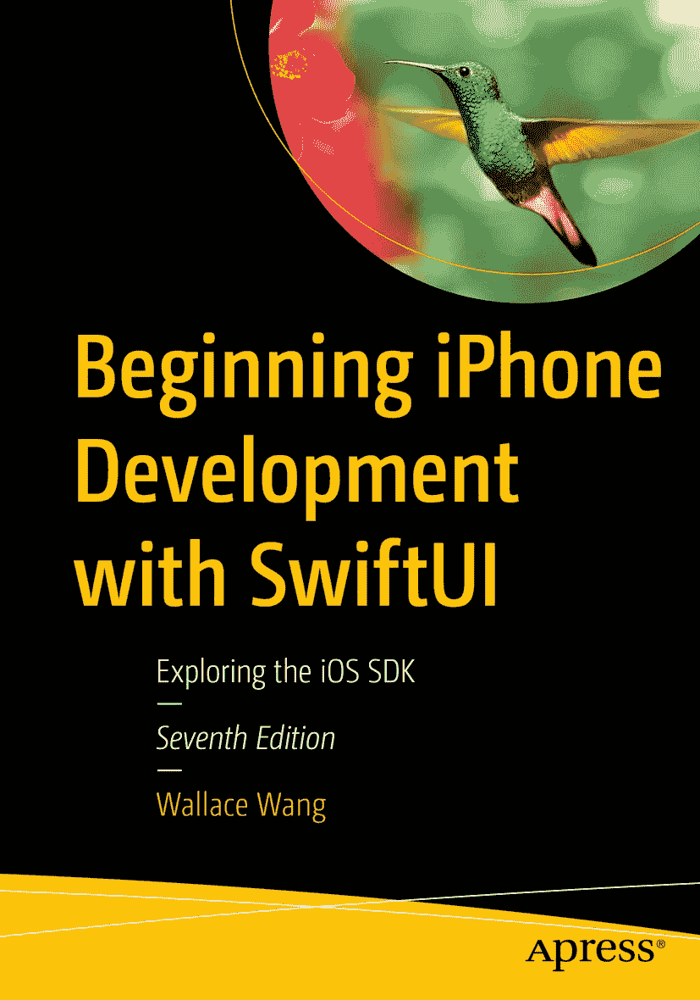

ISBN 978-1-4842-9540-3 电子书 ISBN 978-1-4842-9541-0 [`doi.org/10.1007/978-1-4842-9541-0`](https://doi.org/10.1007/978-1-4842-9541-0)  
© Wallace Wang 2014, 2015, 2016, 2017, 2019, 2022, 2023  
本作品受版权保护。版权所有，无论是全部还是部分材料，均由出版商独家授权，具体包括翻译、重印、插图重用、朗诵、广播、以微缩胶片或任何其他物理形式复制，以及通过电子方式改编、计算机软件或现在已知或未来开发的类似或不同方法进行传输或信息存储与检索。在本出版物中使用通用描述性名称、注册商标名称、商标、服务标记等，即使没有明确声明，也不意味着这些名称不受相关保护性法律和法规的约束，因此可自由通用。出版商、作者和编辑可以合理地假设，本书中的建议和信息在出版之日是真实和准确的。出版商、作者或编辑均不对本材料中包含的内容或可能存在的任何错误或遗漏提供明示或暗示的保证。对于出版地图中的管辖权主张和机构隶属关系，出版商保持中立立场。

本 Apress 印记由注册公司 APress Media, LLC 出版，该公司隶属于 Springer Nature。  
注册公司地址为：1 New York Plaza, New York, NY 10004, U.S.A.

关于作者  
关于技术审阅者

