# 1. 理解 iOS 编程

编程涉及编写供计算机遵循的指令。在 iOS 编程中，计算机指的就是 iPhone 或 iPad。要为 iPhone 或 iPad 创建应用，你需要学习三种不同的技能：

- 如何用 Swift 编程语言编写指令
- 如何使用苹果的软件框架
- 如何在 Xcode 中创建用户界面

你需要用 Swift 编程语言编写指令，让应用实现独特的功能。然后，依赖苹果的软件框架来处理诸如检测触摸手势或访问摄像头等常见任务。最后，设计应用的用户界面。

苹果的软件框架让你无需编写（和测试）自己的 Swift 代码就能执行常见任务。通过依赖苹果成熟且经过测试的软件框架，你可以专注于应用的独特功能，而不是处理让应用访问 iPhone 或 iPad 不同硬件功能的繁琐细节。

理想情况下，你希望用户界面能够适应 iPhone 或 iPad 等所有不同的屏幕尺寸，看起来美观。用户界面用于向用户显示信息并从用户那里获取信息。最好的用户界面是那种甚至无需用户思考的界面。

本质上，每个 iOS 应用都由三部分组成，如图 1-1 所示：

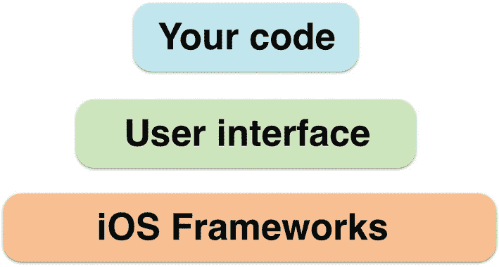

**图 1-1** iOS 应用的三个组成部分

- 你的代码，使应用实现有用的功能
- 可在 Xcode 中可视设计的用户界面
- 通过一个或多个苹果 iOS 框架访问 iOS 设备的硬件功能

苹果为 iOS（及其其他操作系统，如 macOS、watchOS 和 tvOS）提供了数十个框架。只需使用苹果的框架，你就能通过编写少量自己的代码来完成常见任务。苹果提供的一些框架包括：

- `SwiftUI` – 用户界面和触摸屏支持
- `ARKit` – 增强现实功能
- `Core Animation` – 显示动画
- `GameKit` – 创建多人互动应用
- `Contacts` – 访问 iOS 设备上的通讯录数据
- `SiriKit` – 允许通过 Siri 使用语音命令
- `AVKit` – 允许播放音频和视频文件
- `Media Library` – 允许访问存储在 iOS 设备上的图片、音频和视频
- `CallKit` – 提供语音通话功能

苹果的框架本质上包含可以重复使用的代码。这使得应用更可靠、更一致，同时通过使用经过验证的正确代码，也节省了开发者的时间。要查看苹果可用软件框架的完整列表，请访问苹果开发者文档网站（[`https://developer.apple.com/documentation`](https://developer.apple.com/documentation)）。

苹果的框架可以为创建 iOS 应用提供巨大的先发优势，但你仍然需要提供一个用户界面，以便用户能够与你的应用进行交互。虽然你可以从头开始创建用户界面，但这同样繁琐、耗时且容易出错。更糟糕的是，如果每个应用开发者都从头创建用户界面，那么 iOS 应用的外观和操作方式就会各不相同，让用户感到困惑。

正因如此，苹果的 Xcode 编译器能帮助你使用大多数应用中常见的标准功能（如按钮、标签、文本字段和滑块）来设计用户界面。在 Xcode 中，用户界面的每个窗口被称为**视图**。虽然简单的 iOS 应用可能只包含一个视图（想想 iPhone 上的计算器应用），但更复杂的 iOS 应用包含多个视图。

为了创建用户界面，Xcode 提供了两种选择：

- Storyboards
- `SwiftUI`

Storyboards 让你通过将用户界面对象放置在屏幕上的特定位置来可视化设计用户界面，如图 1-2 所示。不幸的是，使用固定值来定义用户界面上各种对象的位置，意味着 Storyboard 用户界面不容易适应不同尺寸的 iOS 设备屏幕或方向（竖屏或横屏）。

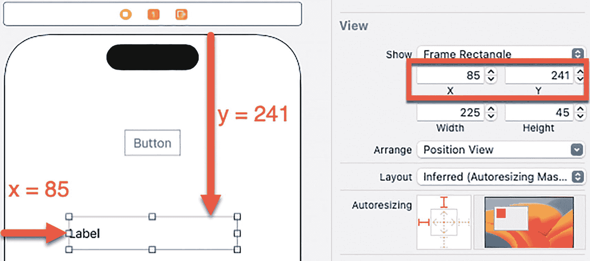

**图 1-2** Storyboards 使用固定值来定义用户界面上对象的排列方式

由于使用固定值排列用户界面上的对象无法适应不同的屏幕尺寸，苹果提供了第二种设计用户界面的方法，即使用名为`SwiftUI`的框架。`SwiftUI`的主要思想是将对象放置在用户界面的中心，并定义它们相对于中心的位置。

当屏幕尺寸较大时，用户界面对象之间的距离会扩大。当屏幕尺寸较小时，用户界面对象之间的距离会缩小，因此用户界面会自动适应屏幕尺寸，如图 1-3 所示。

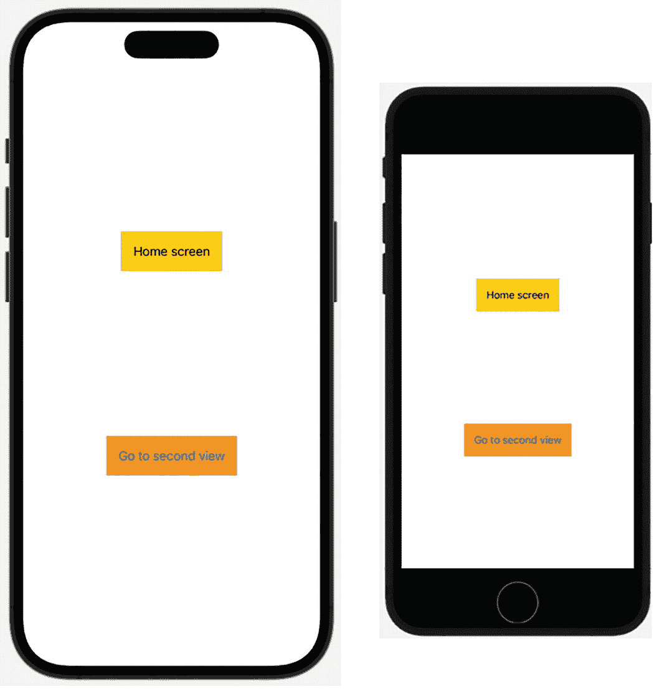

**图 1-3** `SwiftUI`用户界面可以自动适应不同的屏幕尺寸

你可以在一个项目中将 Storyboards 和`SwiftUI`结合使用，也可以单独使用 Storyboards 或`SwiftUI`。由于`SwiftUI`代表了为所有苹果产品开发应用的未来，本书将专注于使用`SwiftUI`而非 Storyboards 来创建用户界面。


## 了解 Xcode

学习 iOS 开发不仅仅是学习如何使用 `Swift` 编程语言编写代码。除了掌握 `Swift`，你还必须知道如何查找并使用苹果公司的不同软件框架，如何使用 `Xcode` 通过 `SwiftUI` 设计用户界面，以及如何组织、创建和删除包含 `Swift` 代码的文件。此外，你还必须学习如何使用 `Xcode` 的编辑器编写代码。

每次创建 `Xcode` 项目时，你实际上是在创建一个包含多个文件的文件夹。一个简单的 iOS 应用可能由少数几个文件组成，而一个复杂的应用可能包含成百上千个单独的文件。

通过将代码存储在不同的文件中，你可以快速找到包含你想要编辑和修改数据的文件，同时安全地忽略其他文件。无论一个项目包含多少文件，`Xcode` 都会将它们视为所有 `Swift` 代码都存储在一个文件中。通过将程序分解成多个文件，你可以将程序的不同部分分组到不同的文件中，从而组织你的应用。

为了进一步帮助你在项目中组织多个文件，`Xcode` 允许你创建单独的文件夹。这些文件夹的存在仅仅是为了方便你组织代码。图 1-4 展示了 `Xcode` 如何将一个应用划分为文件夹和文件。

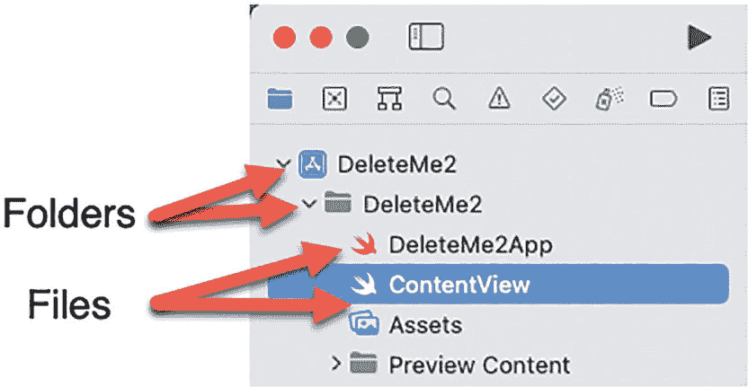

**图 1-4** – `Xcode` 将代码存储在文件中，你可以在文件夹中组织这些文件

为了熟悉 iOS 应用开发，让我们从一个简单的项目开始，它将教你：

- 如何理解项目的组成部分
- 如何查看不同的文件
- `Xcode` 的不同部分如何工作

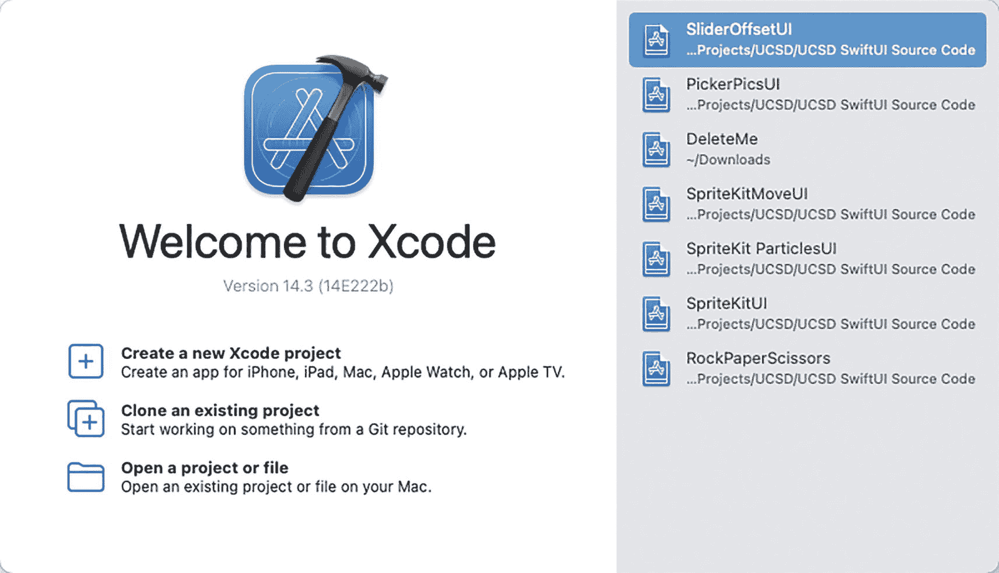

**图 1-5** – `Xcode` 欢迎屏幕

1.  启动 `Xcode`。会出现一个欢迎屏幕，让你选择最近使用的项目或创建新项目的选项，如图 1-5 所示。（你总是可以通过选择 **Windows ➤ Welcome to Xcode** 或按下 `Shift + Command + 1` 在 `Xcode` 中打开此欢迎屏幕。）

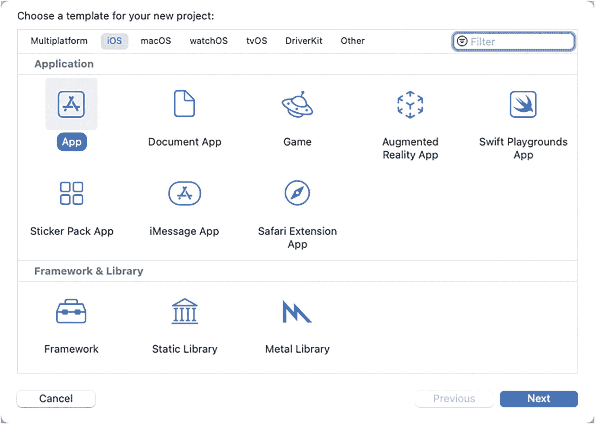

**图 1-6** – 选择项目模板

2.  点击 **Create a new Xcode project** 选项。`Xcode` 会显示用于设计不同类型应用的模板，如图 1-6 所示。请注意，模板窗口的顶部会显示你可以为其开发应用的不同操作系统，例如 iOS、watchOS、tvOS 和 macOS。通过选择不同的操作系统，你可以创建针对运行该特定操作系统的设备而设计的项目。

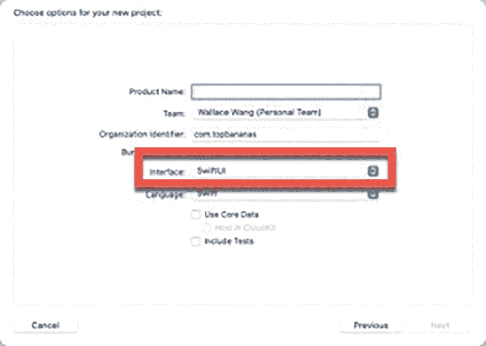

**图 1-7** – 定义项目名称、组织名称和组织标识符

3.  点击 **iOS**，然后点击 **App**。**App** 模板代表最基本的 iOS 项目。
4.  点击 **Next** 按钮。会出现另一个窗口，要求你输入项目名称以及组织名称和组织标识符，如图 1-7 所示。你必须填写全部三个文本框，但项目名称、组织名称和组织标识符可以是任何你想要的描述性文本。请注意，用户界面弹出菜单让你可以在 `SwiftUI` 和 `Storyboard` 之间进行选择。对于本书中的所有项目，请务必确保选择 `SwiftUI`。
5.  点击 **Project Name** 文本框，并为你的项目输入一个名称，例如 `MyFirstApp`。
6.  点击 **Team** 文本框，并输入你的名字或公司名称。
7.  点击 **Organization Identifier** 文本框，并输入你想要的任何标识文本。通常，此标识符是你网站名称的反写，例如 `com.microsoft`。
8.  点击 **Interface** 弹出菜单，并选择 **SwiftUI**。确保所有复选框都未选中。然后点击 **Next** 按钮。`Xcode` 会显示一个对话框，让你选择存储项目的驱动器和文件夹。
9.  选择一个驱动器和文件夹，然后点击 **Create** 按钮。`Xcode` 会显示你新创建的项目。

`Xcode` 窗口一开始可能看起来很混乱，但你需要明白 `Xcode` 将信息分组在几个窗格中。最左边的窗格称为**导航器**窗格。通过点击**导航器**窗格顶部的图标，你可以查看项目的不同部分，如图 1-8 所示。

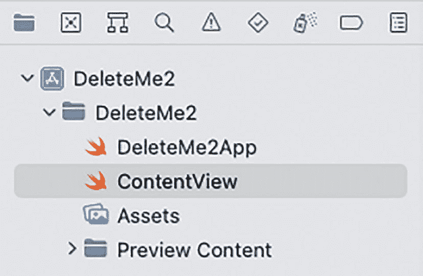

**图 1-8** – **导航器**窗格出现在 `Xcode` 窗口的最左侧

主要的 `SwiftUI` 文件称为 `ContentView`，它包含定义应用用户界面的 `Swift` 代码：

```
import SwiftUI
struct ContentView: View {
    var body: some View {
        VStack {
            Image(systemName: "globe")
                .imageScale(.large)
                .foregroundColor(.accentColor)
            Text("Hello, world!")
        }
        .padding()
    }
}
struct ContentView_Previews: PreviewProvider {
    static var previews: some View {
        ContentView()
    }
}
```

`import SwiftUI` 这一行让你的应用能够使用 `SwiftUI` 框架来设计用户界面。

`ContentView: View` 结构体在屏幕上显示单个视图。`SwiftUI` 一次只能在屏幕上显示一个视图。当你创建一个 `SwiftUI` iOS 应用时，默认视图是一个垂直堆栈（`VStack`），其中包含一个 `Image` 视图和一个 `Text` 视图。`Image` 视图显示一个地球图标，`Text` 视图在屏幕上显示“Hello, world!”。

`ContentView_Previews: PreviewProvider` 结构体实际上在**画布**窗格中显示用户界面，该窗格出现在 `Swift` 代码的右侧，如图 1-9 所示。

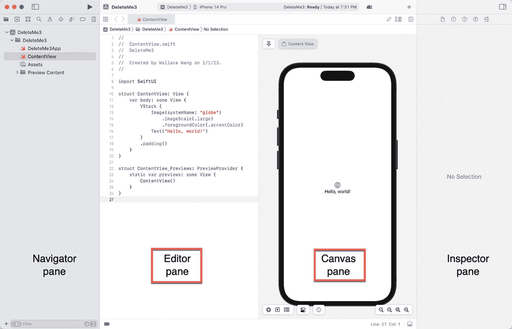

**图 1-9** – **编辑器**窗格和**画布**窗格

当**编辑器**窗格和**画布**窗格并排显示时，你对**编辑器**窗格所做的任何更改都会出现在**画布**窗格中，反之亦然。如果你点击右上角的**编辑器选项**图标，你可以隐藏或显示**画布**窗格，如图 1-10 所示。

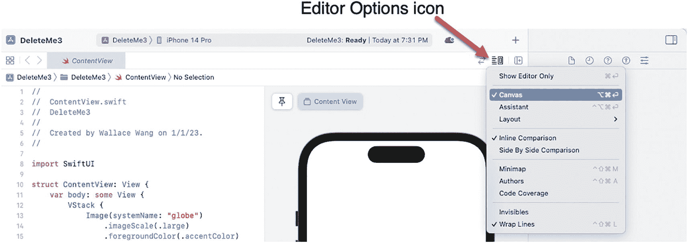

**图 1-10** – **编辑器选项**图标可用于切换**画布**窗格的显示和隐藏

**画布**窗格有两个用途。首先，它让你能确切地看到你的用户界面在模拟 iOS 设备上的样子。除了让你在不同的模拟 iOS 设备（例如不同的 iPhone 或 iPad 型号）之间切换，**画布**窗格还允许你选择不同的设置，例如浅色或深色模式以及动态字体。更改 iOS 设置可以让你看到用户界面在不同外观选项下可能的样子。


### 在 iOS 设备间切换

`Canvas` 面板可模拟单个 iOS 设备，例如 iPhone 14 Pro 或 iPad Mini。这样，您就能看到用户界面如何适配不同 iOS 设备的屏幕尺寸。要使 `Canvas` 面板模拟其他 iOS 设备，请按以下步骤操作：

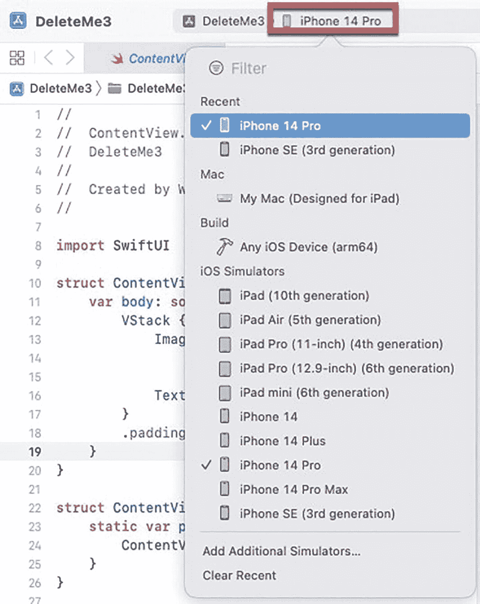

*Xcode 窗口截图突出显示了顶部的 iOS 设备列表，其中列出了不同的 iOS 设备。*

**图 1-11** — `Canvas` 面板可模拟的 iOS 设备列表

1.  点击 Xcode 窗口顶部当前显示的 iOS 设备名称。将会出现一个列表，其中列出了不同的 iOS 设备，如图 1-11 所示。
2.  点击您希望在 `Canvas` 面板中显示的 iOS 设备。

Xcode 还提供了第二种更改 `Canvas` 面板中 iOS 设备模拟的方法，即通过 `Inspector` 面板。请按以下步骤操作：

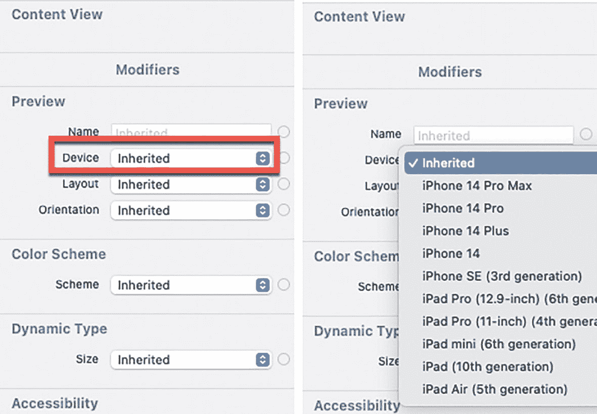

*内容视图界面的两张截图。左侧：在预览选项中高亮显示了设备下拉菜单。右侧：设备弹出菜单高亮显示了“继承”选项。*

**图 1-12** — `Device` 弹出菜单可在 `Inspector` 面板中选择 iOS 设备

1.  将光标移动到 `ContentView_Previews: PreviewProvider` 结构体中的 `ContentView()` 内。`Inspector` 面板将会出现。
2.  点击 `Device` 弹出菜单，选择一个 iOS 设备，使其显示在 `Canvas` 面板中，如图 1-12 所示。

为 `Canvas` 面板选择了不同的 iOS 设备后，您可以通过点击 `Canvas` 面板右下角出现的不同图标来更改其放大倍率，如图 1-13 所示：

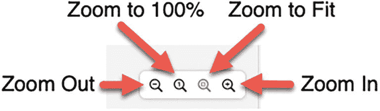

*插图解释了 `Canvas` 面板中出现的不同图标，包括缩小、缩放到 100%、适合窗口缩放和放大。*

**图 1-13** — 缩放图标可让您更改 `Canvas` 面板的放大倍率

- **缩小** – 缩小 iOS 设备的尺寸
- **缩放到 100%** – 以实际尺寸显示 iOS 设备（可能会截断 iOS 设备的部分内容，尤其是在模拟 iPad 或较大型号的 iPhone 时）
- **适合窗口** – 使整个 iOS 设备可见
- **放大** – 放大 iOS 设备的尺寸

`缩放到 100%` 可让您在所模拟 iOS 设备的实际尺寸下查看用户界面，而 `适合窗口` 则让您看到完整的模拟 iOS 设备，如图 1-14 所示。然后您可以使用 `缩小` 和 `放大` 选项，根据需要调整 iOS 设备的尺寸。

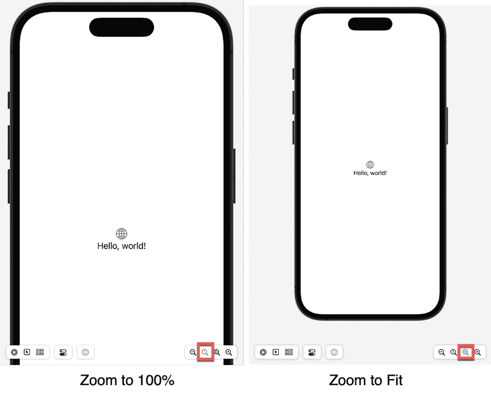

*两张 iOS 设备插图比较了“缩放到 100%”和“适合窗口”两种编程效果。左侧：iOS 设备完全缩放显示；右侧：适合窗口显示。*

**图 1-14** — 比较 `缩放到 100%` 和 `适合窗口`

### 更改 iOS 设备模拟的外观

在 `Canvas` 面板中选定了要模拟的 iOS 设备后，您可以通过三种额外的方式来定制用户界面的外观：

- **配色方案** – 显示浅色或深色模式
- **方向** – 显示纵向或横向模式
- **动态字体** – 更改文本大小

要更改 `Canvas` 面板中 iOS 设备模拟的外观，请按以下步骤操作：

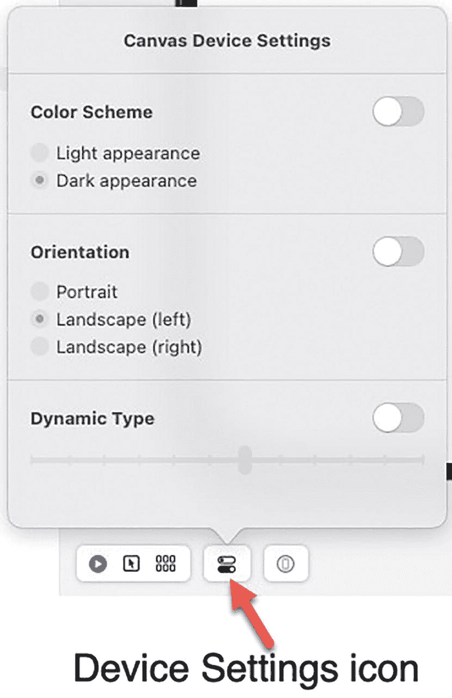

*Canvas 设备设置窗口截图。其中包含以下切换按钮：配色方案、方向和动态字体。*

**图 1-15** — 设备设置窗口

1.  点击 `Canvas` 面板底部的“设备设置”图标。将会出现一个弹出窗口，如图 1-15 所示。
2.  点击您想要更改的设置（如 `配色方案` 或 `方向`）右侧的开关按钮。
3.  点击某个选项以更改 iOS 设备的外观，或拖动滑块以更改 `动态字体` 选项下的文本大小。

如果您想要并排比较不同的选项，请按以下步骤操作：

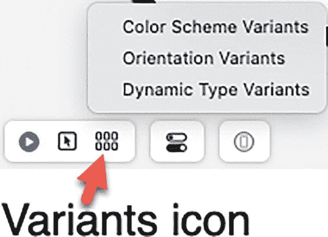

*“变体”弹出菜单截图。它包含以下选项：配色方案变体、方向变体和动态字体变体。*

**图 1-16** — “变体”弹出菜单

1.  点击 `Canvas` 面板底部的“变体”图标。将会出现一个弹出菜单，如图 1-16 所示。

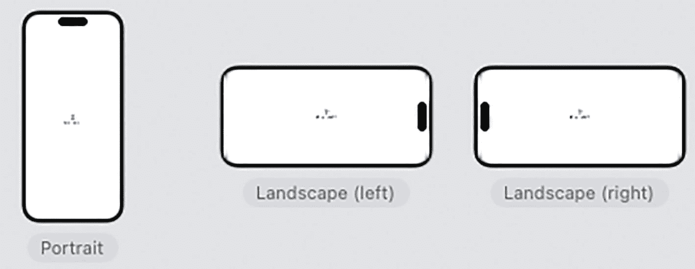

*三张 iOS 设备插图展示了不同的方向变体：纵向、左侧横向和右侧横向。*

**图 1-17** — 显示的方向变体

1.  选择一个选项，例如 `配色方案变体` 或 `动态字体变体`。Xcode 会一次性显示所有不同的选项，如图 1-17 所示。

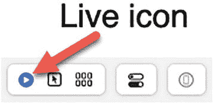

*Canvas 面板中“实时”图标的插图。*

**图 1-18** — “实时”图标

1.  点击 `实时` 图标，即可在 `Canvas` 面板中再次查看 iOS 设备，如图 1-18 所示。

### 选择用户界面对象

一旦您将对象放置在用户界面上，只能通过将光标移动到该对象的 Swift 代码中来选择它们。如果您更倾向于使用鼠标点击用户界面上的对象，则必须点击 `Canvas` 面板底部的`可选择`图标，如图 1-19 所示。

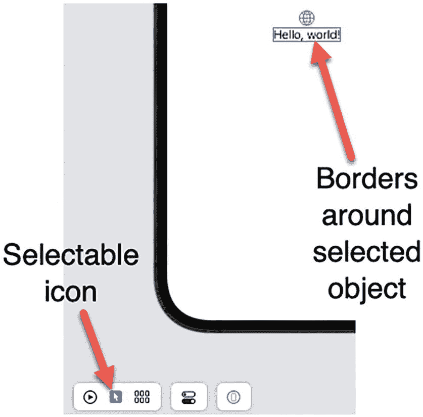

*插图显示 Canvas 面板底部的“可选择”图标。顶部的文本带有边框，并且已被选中。*

**图 1-19** — “可选择”图标

点击 `可选择` 图标，然后点击用户界面上的某个对象后，该对象周围会出现蓝色边框。这些蓝色边框让您能看到该对象的大小。如果您添加了背景颜色，这有助于了解对象背景区域的大小。

`实时` 图标（见图 1-18）让您能够与用户界面互动以测试您的应用。`可选择` 图标则让您能轻松编辑用户界面。


  
