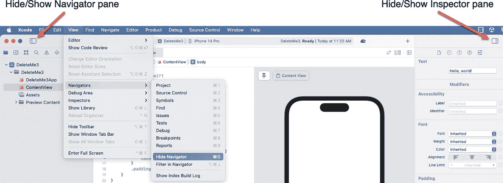
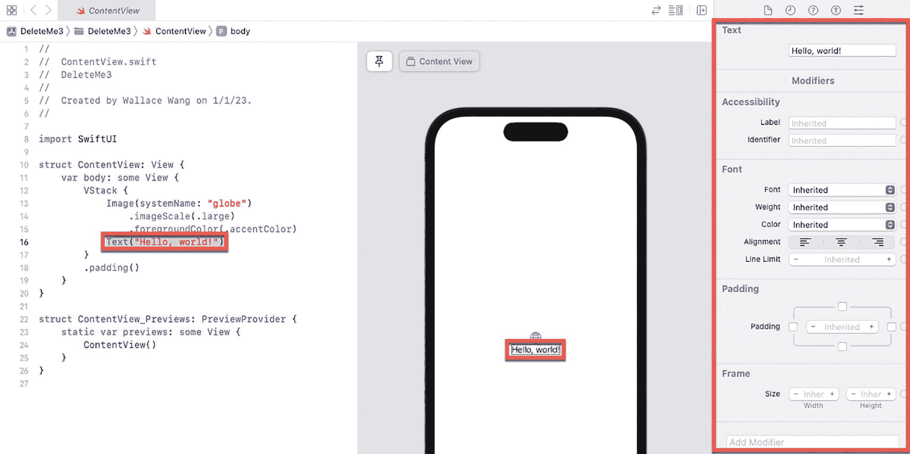
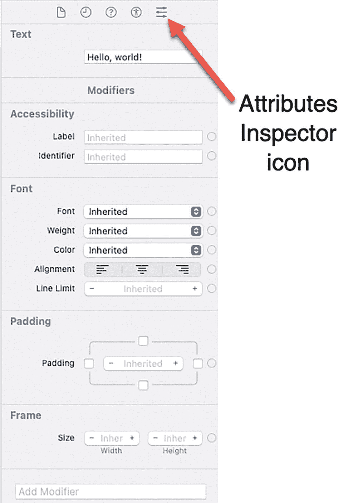

# 操作 Xcode 面板  

Xcode 的四个面板（`Navigator`（导航器）、`Editor`（编辑器）、`Canvas`（画布）和 `Inspector`（检查器））各有用处。`Navigator` 面板显示你项目的相关信息，例如构成该项目的所有文件名称。`Editor` 面板是你编写和编辑 Swift 代码的地方。`Canvas` 面板让你可以查看并测试由 Swift 代码定义的用户界面。`Inspector` 面板则显示当前选中对象的相关信息。

你可以通过将鼠标指针移动到面板边框上，然后左右拖动鼠标来调整任意面板的大小。你也可以切换 `Navigator` 和 `Inspector` 面板的隐藏与显示，这样就能看到更多 `Editor` 和 `Canvas` 面板的内容。

要隐藏/显示 `Navigator` 或 `Inspector` 面板，有两种操作方式，如图 1-20 所示：

  

一张 Xcode 窗口的截图，展示了左侧隐藏或显示导航器面板以及右侧隐藏或显示检查器面板的功能。  

图 1-20  
隐藏或显示导航器和检查器面板  

* 选择 `View` ➤ `Navigators`/`Inspectors` ➤ `Hide`/`Show Navigator`/`Inspector`。  
* 点击 `Show`/`Hide Navigator`/`Inspector` 面板图标。  

`Navigator` 面板允许你选择要在 `Editor` 面板中显示的选项。`Inspector` 面板则允许你选择用户界面项目，并选取不同的修改方式，如图 1-21 所示。  

  

一张截图展示了 Xcode 窗口的不同面板。右侧的检查器面板被高亮显示。左侧下方一行文字被高亮：`Text("Hello, world!")`。  

图 1-21  
检查器面板列出了修改选中项目的不同方式  

要了解 `Inspector` 面板的工作方式，请按以下步骤操作：  

  

一张检查器面板的截图，其中属性检查器图标被高亮显示。包含以下字段：文本、辅助功能、字体、内边距和框架。  

图 1-22  
属性检查器图标让你可以在检查器面板中查看修改项目的更多方式  

1. 创建一个新的 iOS App 项目，然后在 `Navigator` 面板中点击 `ContentView` 文件。`Editor` 面板会显示 `ContentView` 文件的内容。  
2. 将光标移动到 `Text("Hello, world!")` 这一行。  
3. 点击 `Inspector` 面板中的 `Attributes Inspector` 图标，如图 1-22 所示。`Inspector` 面板会显示修改当前选中项目的更多方式。  

如你所见，Xcode 的不同面板会显示项目相关的不同信息。`Navigator` 面板（最左侧）让你可以查看项目的概览。在 `Navigator` 面板中点击特定项目，该内容便会显示在 `Editor` 面板中。`Inspector` 面板（最右侧）会显示 `Editor` 面板中选中内容的额外信息。`Canvas` 面板则让你可以预览用户界面的外观。  

如果你深入探索 Xcode，会发现它拥有数十项功能，但不必一次性全部掌握才能开始使用 Xcode。只需专注于使用你需要的功能，暂时忽略其余部分，直到你需要它们时再说。  

## 总结  

创建 iOS 应用不仅仅是编写代码。为了让你的应用能够访问不同 iOS 设备的硬件功能，你可以使用 Apple 的软件框架，这些框架提供了访问摄像头或 iOS 设备通讯录的接口。所有 SwiftUI 项目都会用到的最重要框架就是 SwiftUI 框架。通过将你的代码与 Apple 现有的软件框架结合，你可以专注于编写让应用运行起来的代码，并利用 Apple 的软件框架来帮助你实现大多数 iOS 设备上的常见功能。  

除了编写代码，每个 iOS 应用还需要用户界面。要创建用户界面，请使用 SwiftUI。由于 SwiftUI 可以轻松创建适配不同设备的用户界面，它正迅速成为为 Apple 所有平台（macOS、iOS、iPadOS、watchOS 和 tvOS）上的应用设计用户界面的首选方式。  

创建 iOS 应用的主要工具是 Apple 的免费软件 Xcode，它能让你创建项目、组织项目中的各个文件，并查看和编辑每个文件的内容。Xcode 让你可以在一个程序中完成应用的设计、编辑和测试。尽管 Xcode 提供了数十项功能，但你只需使用其中少数几项，就能开始创建你自己的 iOS 应用。  

学习 iOS 编程涉及学习如何使用 Swift 编程语言编写指令、学习如何查找并使用 Apple 的各种软件框架、学习如何在 SwiftUI 中设计用户界面，以及学习如何使用 Xcode。虽然这听起来任务繁多，但本书将循序渐进地引导你完成每一步，让你在不久的将来能自如地使用 Xcode 并创建自己的 iOS 应用。  

好的，作为一名高级文档工程师和翻译员，我将严格按照您提供的注意事项和示例格式，将给定的英文文本翻译成中文。

