# 使用 SwiftUI 设计用户界面

每个应用程序都需要一个用户界面。SwiftUI 背后的基本思想是使用称为“视图”的构建块来创建用户界面。视图在用户界面上显示单个项目，例如文本、图像或按钮，如图 2-1 所示。

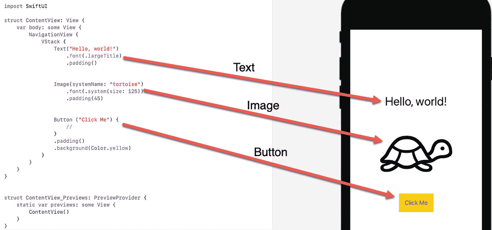

**图 2-1** SwiftUI 用户界面的组成部分

SwiftUI 的一个限制是它一次只能在屏幕上显示一个视图。为了解决这个限制，SwiftUI 提供了称为“堆栈”的东西。一个堆栈被视为一个单一的视图，但它允许你组合或堆叠最多十个额外的视图。通过创建堆栈，你可以在屏幕上显示多个视图。堆栈甚至可以容纳其他堆栈，从而让你在单个屏幕上显示任意数量的视图。

如图 2-2 所示，共有三种类型的堆栈：

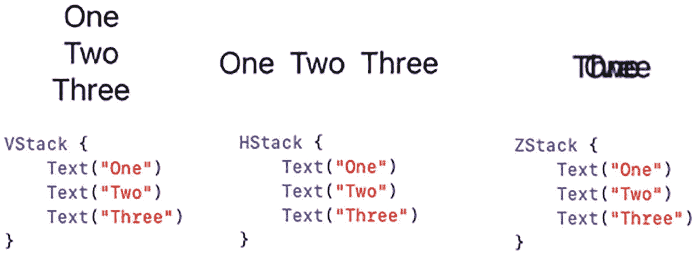

**图 2-2** 垂直、水平和 Z 堆栈

- `VStack` – 垂直堆栈，将视图排列在另一个视图的上方和下方
- `HStack` – 水平堆栈，将视图并排排列
- `ZStack` – 一个将视图直接相互重叠的堆栈

一个堆栈算作一个单一的视图。通过使用水平 (`HStack`) 或垂直 (`VStack`) 堆栈，你可以在一个堆栈内添加最多十 (10) 个视图。为了获得更大的灵活性，你可以将堆栈嵌入到堆栈中，以显示尽可能多的视图。

> **注意：** 一个堆栈最多只能包含十 (10) 个视图。如果你尝试在堆栈中存储 11 个或更多视图，Xcode 将显示错误消息并拒绝运行你的程序。

在 SwiftUI 中创建用户界面时，你有三个选择：

- 在编辑器窗格中键入 Swift 代码。
- 将一个视图（例如按钮）拖放至编辑器窗格中的 Swift 代码中。
- 将一个视图（例如按钮）拖放至画布窗格中。

在编辑器窗格中键入 Swift 代码来设计用户界面是最快、最灵活的方法，但这需要时间，并且需要熟悉不同的选项。为了使键入 Swift 代码定义用户界面视图更容易，Xcode 在识别出你正在尝试键入的内容时会显示一个选项弹出菜单。通过选择一个选项并按 Return 键，你可以快速创建用户界面视图，如图 2-3 所示。

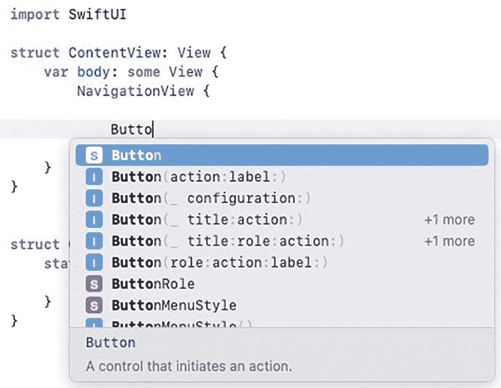

**图 2-3** 当你键入 Swift 代码定义用户界面视图时，Xcode 会显示一个选项菜单

如果你不熟悉设计用户界面的选项，使用库窗口会更简单，该窗口列出了你可以使用的所有可能的用户界面视图，如图 2-4 所示。

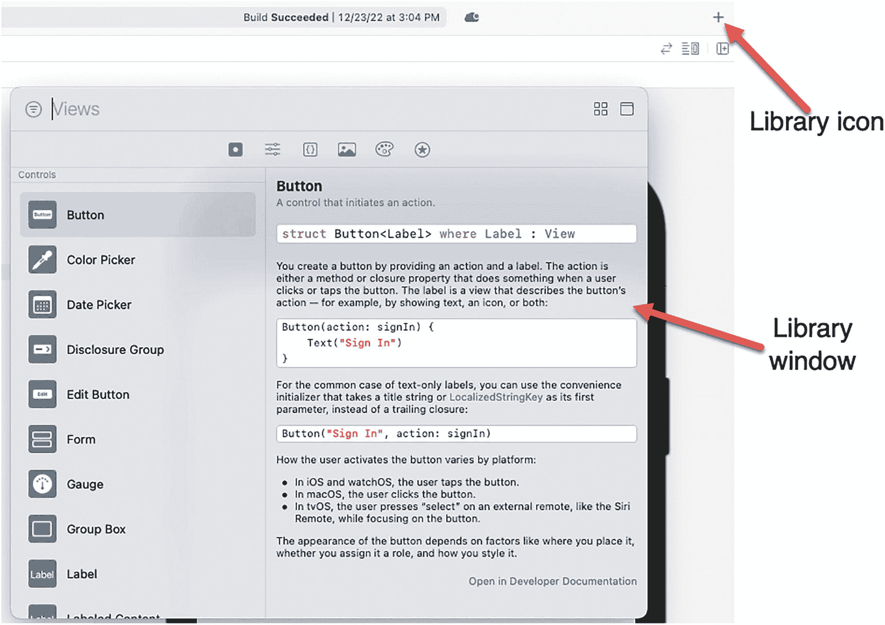

**图 2-4** 单击库图标会打开库窗口

一旦你打开库窗口，你可以执行以下任一操作：

- 将用户界面视图从库窗口拖放至编辑器窗格中，如图 2-5 所示。
- 单击可选图标，然后将用户界面视图拖放至画布窗格中模拟的 iOS 设备用户界面上，如图 2-6 所示。

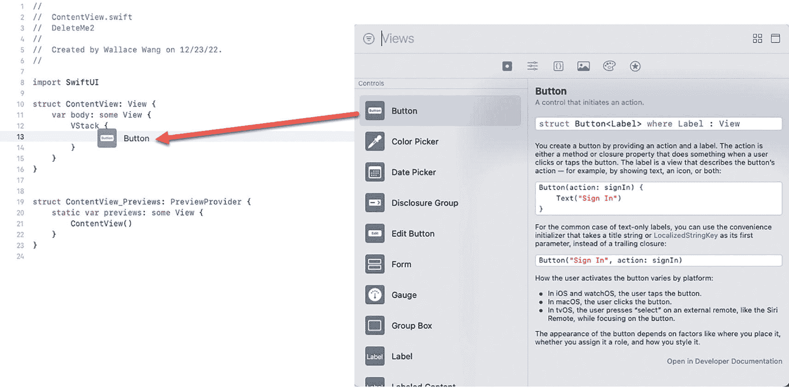

**图 2-5** 将用户界面视图拖放至编辑器窗格

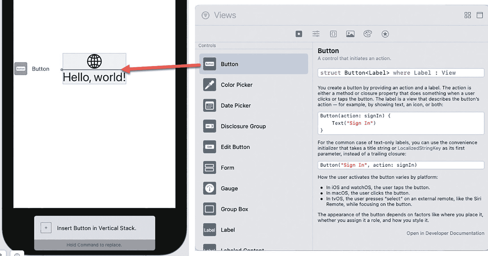

**图 2-6** 将用户界面视图拖放至画布窗格

无论你如何更改用户界面，Xcode 都会保持编辑器窗格和画布窗格之间的所有更改同步。这意味着当你在编辑器窗格中键入 Swift 代码时，画布窗格会立即显示你的更改。当你将用户界面视图拖放至画布窗格时，Xcode 会立即自动将该 Swift 代码添加到编辑器窗格中。

画布窗格显示你的用户界面，但如果你想测试你的应用程序，你有两个选择，如图 2-7 所示：

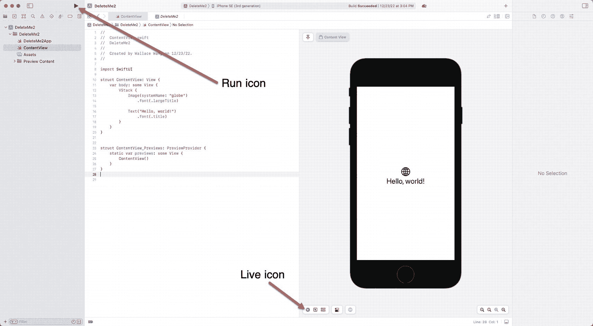

**图 2-7** “运行”按钮和“实时预览”图标

- 单击“运行”按钮或选择“产品”➤“运行”以打开模拟器。
- 单击画布窗格底部的“实时”图标。

要了解 SwiftUI 如何创建一个可以响应用户的简单用户界面，请按照以下步骤操作：

1. 创建一个新的 iOS App 项目，确保界面是 SwiftUI，并为其指定一个描述性名称（例如 `SwiftExample`）。
2. 在导航器窗格中单击 `ContentView` 文件。编辑器窗格将显示 `ContentView` 文件的内容。
3. 选择“编辑器”➤“画布”。（如果 Canvas 选项前面已经出现复选标记，则跳过此步骤。）这将打开画布，以便你可以预览用户界面。
4. 删除 `Text` 命令中的文本 “Hello, world!”，并键入以下内容，使 `ContentView` 结构体如下所示：

```swift
struct ContentView: View {
    @State private var message = true
    var body: some View {
        VStack {
            Toggle(isOn: $message) {
                Text("Toggle message on/off")
            }
            if message {
                Text("Here's a secret message!")
            }
        }
    }
}
```

上述 Swift 代码在屏幕上显示了一个切换开关，但除非你在模拟器（它模拟如 iPhone 或 iPad 之类的 iOS 设备）中运行你的应用程序，或者通过单击“实时”图标进行测试，否则你将无法看到它的工作。在大多数情况下，“实时”图标提供了一种在画布窗格中查看和测试用户界面的更快方法。

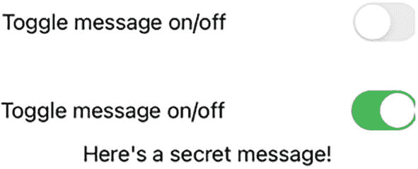

**图 2-8** 实时预览让你可以在画布窗格中与用户界面进行交互

5. 单击“实时”图标以打开“实时预览”。当你单击切换开关时，请注意消息会按图 2-8 所示出现和消失。
6. 再次单击“实时”图标以关闭“实时预览”。


重复前面的步骤，但这次点击“运行”按钮打开模拟器。在模拟器或画布面板中测试你的应用是完全相同的，主要区别在于画布面板通常使用起来快得多。

现在让我们快速浏览这个项目，以便你对其工作原理有一个大致了解。首先，它声明了一个名为“message”的特殊状态变量，初始设置为`true`。接着，`ContentView`结构体定义了一个视图为`VStack`。这意味着`VStack`内部的任何内容都将垂直堆叠显示。

`VStack`中的第一个视图是一个`Toggle`开关，它使用一个`Text`视图在开关左侧显示以下文本：“Toggle message on/off”。当开关打开时，“message”状态变量会被修改为存储`true`值。当开关关闭时，“message”状态变量则会被修改为存储`false`值。

在`Toggle`下方，有一个`if`语句。如果“message”状态变量为`true`，它会显示一个`Text`视图，内容为“Here’s a secret message!”。如果“message”状态变量为`false`，则该`Text`视图根本不会显示。

## 使用检查器面板修改用户界面

在 SwiftUI 中创建用户界面通常涉及两个步骤。首先，你需要安排各个用户界面视图在屏幕上的显示方式。接着，你需要通过更改每个用户界面视图的大小、颜色或位置来自定义它们。

要自定义用户界面视图，你需要添加修改器。Xcode 提供了两种添加修改器的方式：

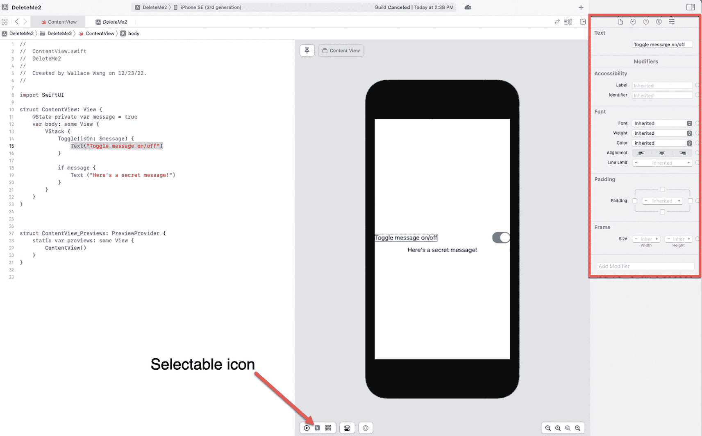

屏幕显示一个名为“Delete Me 2”的项目，并选择了 iPhone SE。`ContentView`结构体包含一个带有`Toggle`按钮和`Text`视图的`VStack`。一个可选择的图标被高亮显示。

**图 2-9** 检查器面板显示了修改用户界面视图的不同方式

*   直接在编辑器面板中输入修改器。
*   点击你想要修改的视图（在编辑器面板中，或者点击可选择图标后在画布面板中点击该视图）。然后，如图 2-9 所示，从检查器面板中选择一个修改器。

直接在编辑器面板中输入修改器需要你知道想要使用的修改器名称。随着经验增长，直接在 Swift 代码中输入修改器会变得很快。然而，刚开始学习时，你可能不知道有哪些修改器可用。这时，你可能会倾向于使用检查器面板。

首先，选择你想要修改的用户界面视图。你可以通过将光标移动到定义该用户界面视图的 Swift 代码中，或者点击可选择图标然后在画布面板中点击一个用户界面视图来完成此操作。当你选中一个用户界面视图时，检查器面板会显示该特定视图的修改器。

检查器面板会显示最常用的修改器，例如让你选择文本的字体、对齐方式或颜色。通过点击检查器面板底部的“Add Modifier”按钮，你可以查看其他修改器的列表，如图 2-10 所示。

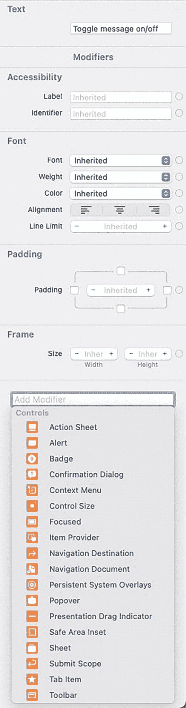

截图中显示了文本、辅助功能、字体、填充和框架等选项。“添加修改器”控件列出了动作、街景、徽章以及其他选项。

**图 2-10** “Add Modifier”按钮会显示一个你可以使用的其他修改器列表

当你在“Add Modifier”列表中看到你想要使用的修改器时，点击该修改器。Xcode 会在检查器面板中显示该修改器。如果你不再想看到已添加到检查器面板中的任何修改器，可以点击该修改器右上角的“Delete”按钮，如图 2-11 所示。

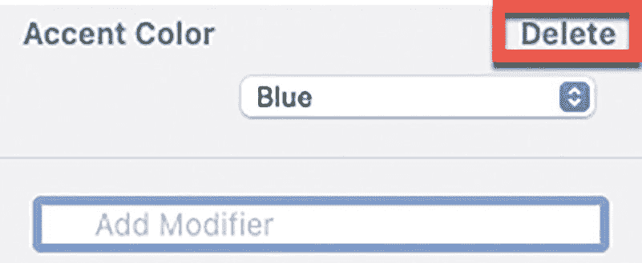

屏幕显示了一个强调色（蓝色），并且在右上角有一个带深色轮廓高亮的删除按钮。

**图 2-11** 出现一个“Delete”按钮，用于移除已添加到检查器面板中的修改器

请记住，你应用修改器的顺序可能会产生影响。考虑下面的`Text`视图，它有两个修改器：背景（`background`）和填充（`padding`）：

```
Text ("Here's a secret message!")
    .background(Color.yellow)
    .padding()
```

这会为`Text`视图添加黄色背景，然后在该`Text`视图周围添加填充（间距）。假设你像这样调换了这些修改器的顺序：

```
Text ("Here's a secret message!")
    .padding()
    .background(Color.yellow)
```

这个顺序会先在`Text`视图周围添加填充（间距），然后为背景着色。因为背景现在包含了新添加的间距，背景色也会填满`Text`视图周围的空白区域，如图 2-12 所示。

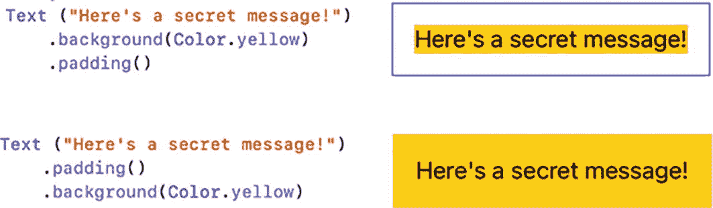

一段 6 行代码的片段产生了 2 组输出。文本显示：“here's a secret message”。1. 一个带有高亮文本的矩形块。2. 一个带有文本的阴影矩形块。

**图 2-12**


修饰符的顺序会影响最终效果

无论使用哪种方法添加修饰符，Xcode 都会保持所有内容同步。因此，若你在编辑器面板中键入修饰符，更改会自动出现在检查器面板中。同样，若你在检查器面板中选择一个修饰符，Xcode 会自动将该修饰符添加到编辑器面板的 Swift 代码中。

要了解如何更改用户界面项目的外观，请按以下步骤操作：

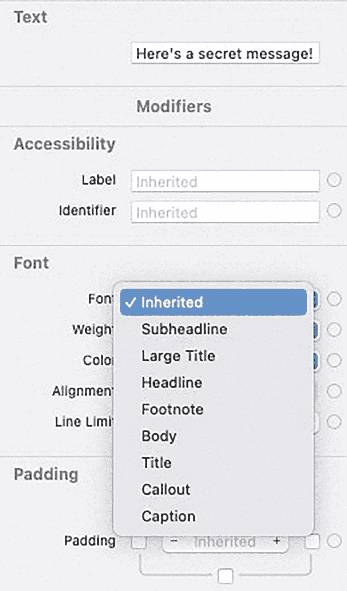

屏幕显示一段文本，内容为"这是一条秘密消息"，并附带多种修饰符选项，如辅助功能、标签、字体、字重、颜色、对齐方式、行数限制、内边距等。

图 2-13

`Font`弹出菜单显示了不同的字体选项

1.  确保上一节中的 `SwiftExample` 项目已加载到 Xcode 中。`ContentView` 文件应包含一个 `Toggle` 和一个位于其下方的 `Text` 视图。

2.  点击画布面板底部的"可选中"图标。这样你就可以通过在画布面板中直接点击来选中视图。

3.  点击画布面板中的 `Toggle`，或者将光标移动到编辑器面板中的 `Toggle` 上。Xcode 会在 Xcode 窗口右侧显示检查器面板，其中列出了可用来更改 `Toggle` 外观的修饰符。

4.  点击画布面板中显示"这是一条秘密消息！"的 `Text` 视图，或者将光标移动到编辑器面板中的 `Text` 视图上。注意，检查器面板会显示用于更改 `Text` 视图外观的修饰符。

5.  点击 `Font` 弹出菜单。会弹出如图 2-13 所示的不同字体选项列表。

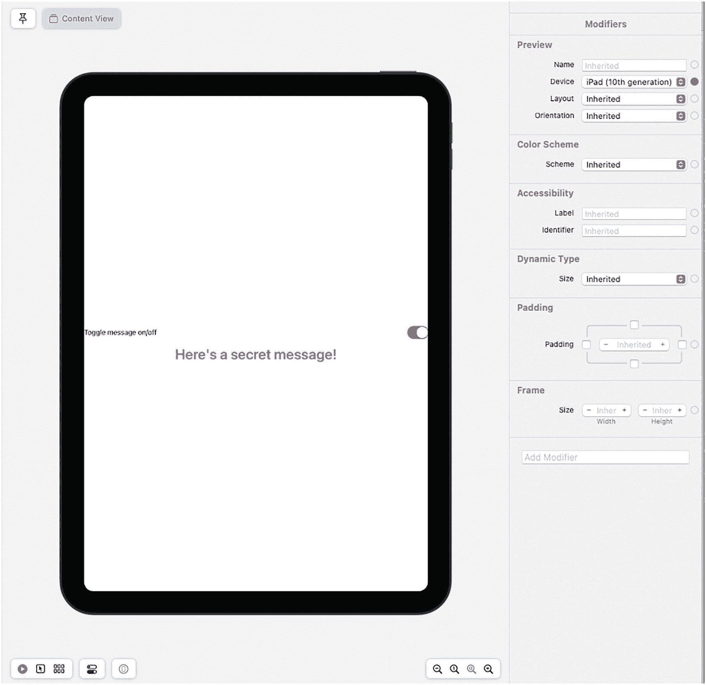

屏幕显示包含多种修饰符的内容视图，包括预览设置、设备布局、方向、配色方案、辅助功能、内边距、秘密消息的切换开关、框架大小调整，以及添加宽度和高度等额外修饰符的选项。

图 2-14

SwiftUI 会自动适配不同尺寸屏幕的用户界面

1.  选择 `Large Title`。注意，Xcode 会自动在 `ContentView` 文件中添加 `.font(.largeTitle)` 命令，如下所示：

    ```
    Text ("这是一条秘密消息！")
    .font(.largeTitle)
    ```

2.  点击 `Weight` 弹出菜单，选择 `Semibold`。

3.  点击 `Color` 弹出菜单，选择 `Red`。注意，每次选择修饰符时，Xcode 都会自动将对应的 Swift 代码添加到你的 `.swift` 文件中，如下所示：

    ```
    Text ("这是一条秘密消息！")
    .font(.largeTitle)
    .fontWeight(.semibold)
    .foregroundColor(Color.red)
    ```

4.  将光标移动到 `ContentView_Previews: PreviewProvider` 结构体中的 `ContentView()` 内部。

5.  点击检查器面板中的 `Device` 弹出菜单。

6.  选择一个 iPad 型号。注意，画布面板会随之变化，模拟出 iPad 的外观。同时留意 SwiftUI 如何自动修改你的用户界面外观，使其在不同尺寸的屏幕上正确显示，如图 2-14 所示。（Xcode 可能需要一些时间才能将画布面板切换为显示不同的 iOS 设备，请耐心等待。）

1.  再次点击 `Device` 弹出菜单，选择一个 iPhone 型号，例如 iPhone 11。画布随即会改变，模拟出你选择的 iPhone 型号。

SwiftUI 的基本理念是让你设计用户界面，并让 Xcode 自动调整其外观以适应不同的 iOS 屏幕尺寸。无需编写大量 Swift 代码来设计用户界面，SwiftUI 让你只需编写最少的 Swift 代码就能完成界面设计，这样你就可以将精力集中在编写 Swift 代码上，让你的应用实现独特的功能。

## 总结

每个应用都需要一个用户界面。使用 SwiftUI，你只需定义所需的用户界面元素，SwiftUI 会负责确保你的用户界面在不同尺寸的 iOS 屏幕上都能正常工作并呈现正确的外观。

你可以通过编程方式（编写 Swift 代码）或可视化方式（从库窗口拖放用户界面项目）来设计用户界面。程序员通常结合使用这两种方法来设计界面。将项目（按钮、标签、文本字段等）添加到用户界面后，你可以通过代码或使用检查器面板中的修饰符来自定义这些项目。

设计并自定义用户界面外观后，可以通过两种方式进行测试。首先，你可以在模拟器程序中运行你的应用，该程序可以模拟不同的 iOS 设备，如 iPhone 或 iPad。其次，你可以使用实时预览功能，在画布面板中与你的用户界面进行交互。

用户界面代表了用户所看到的内容，因此无论用户在何种 iOS 设备上运行你的应用，确保用户界面始终美观至关重要。既然你已经了解了用户界面的基本工作原理，那么是时候开始学习特定用户界面元素（如按钮、选择器和滑块）的细节了。

