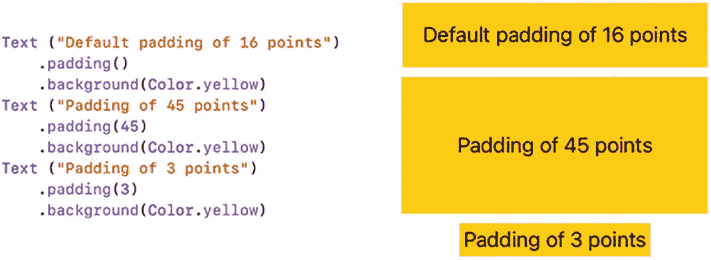
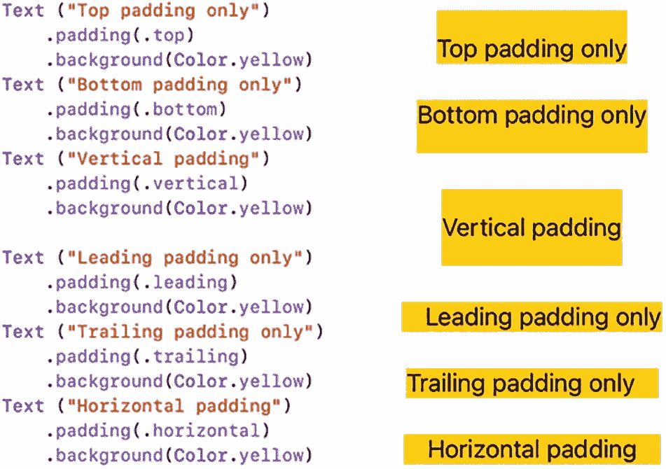
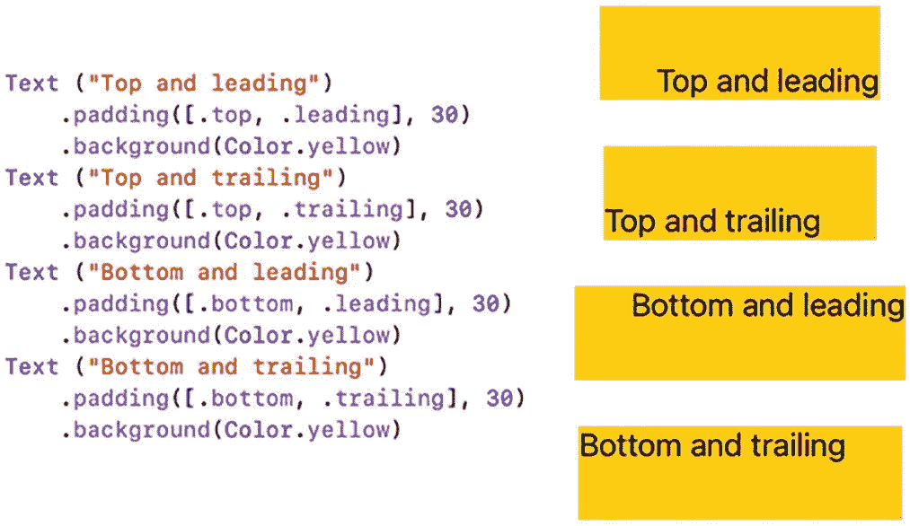
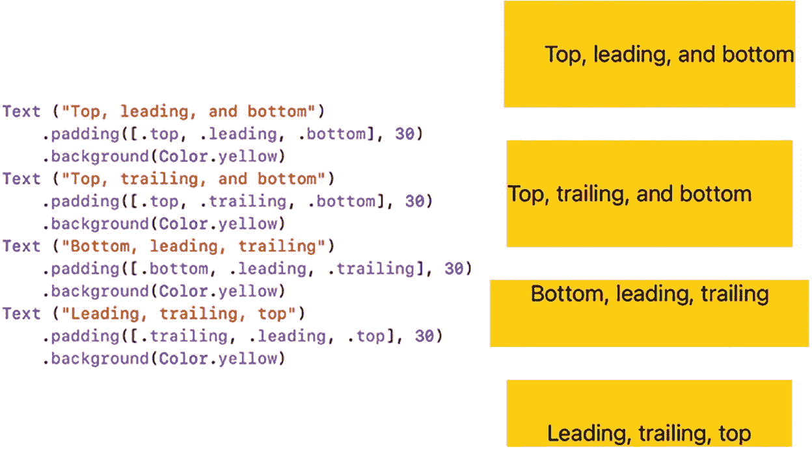
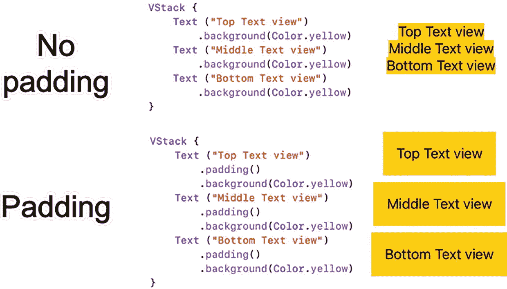
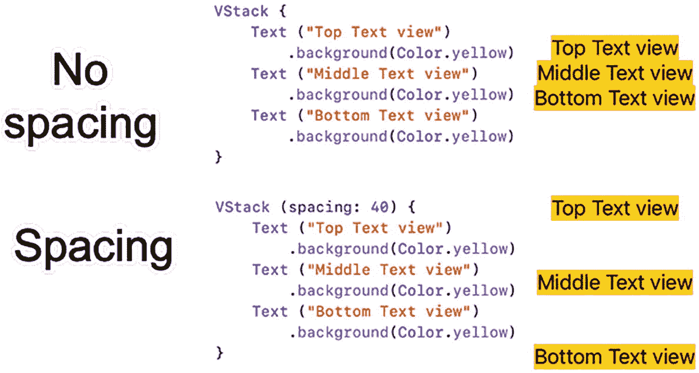
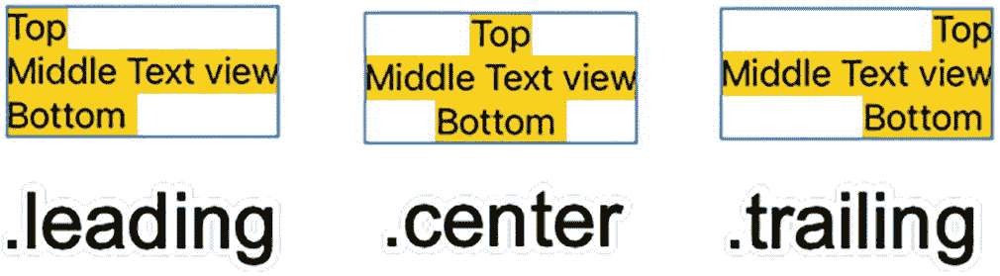

# 3. 在用户界面上放置视图

当你在用户界面上放置单个视图时，无论屏幕是小尺寸的 iPhone 还是大得多的 iPad，SwiftUI 都会将其居中显示。随着你在用户界面中添加更多视图，SwiftUI 会根据你是将它们排列在垂直堆栈还是水平堆栈中，简单地将这些视图上下堆叠或并排显示。然而，你在用户界面上添加的视图越多，相邻的视图就会显得越拥挤。为了解决这个问题，SwiftUI 提供了几种在用户界面上放置视图的方法：

*   使用 `padding` 修饰符。

*   在堆栈内定义间距。

*   在视图之间使用间隔器。

*   定义偏移量或位置坐标。

你可以使用这些方法中的一种或多种来在用户界面上排列视图，使其精确显示在你想要的位置。最重要的是，这些定位方法适用于 SwiftUI 中的所有用户界面视图。


## 使用填充修饰符

填充修饰符可以在用户界面视图周围添加空间。默认情况下，填充修饰符会在视图的顶部、底部、前导（左侧）和尾部（右侧）添加空间。要使用填充修饰符，只需在任何视图后添加以下代码：

```
.padding()
```

填充有两个作用。首先，它在视图周围添加空间，这会改变背景，你可以为其添加颜色，使视图更大、更容易看到。其次，填充修饰符会将相邻视图推开得更远，使相邻视图更容易看清并消除拥挤感。

最简单的填充修饰符会在视图的四边各添加 16 点的间距。如果你添加一个数字，则可以定义所需的精确间距，例如 `.padding(45)` 或 `.padding(3)`，如图 3-1 所示。



一段代码和示意图展示了填充修饰符的不同间距。第一个是默认的 16 点填充，第二个是 45 点的厚填充，第三个是薄填充。

**图 3-1** 为填充修饰符定义不同的间距

请注意，填充修饰符会为所有边添加空间。如果需要，你可以将间距定义在单个或多个特定区域，如图 3-2 所示：



一段代码和框图展示了不同区域填充的不同间距。它列出了填充类型，例如仅顶部填充、仅底部填充、垂直填充、仅前导填充、仅尾部填充和水平填充。

**图 3-2** 在特定区域定义填充

- `.top`
- `.bottom`
- `.vertical`（顶部和底部）
- `.leading`（左侧）
- `.trailing`（右侧）
- `.horizontal`（尾部和前导）

如果你没有添加具体的数值，SwiftUI 会默认使用 16 点的间距。要同时定义填充区域和具体间距，你必须先定义填充区域，接着指定具体数值，例如：

```
.padding(.top, 30)
```

如果你想在两个或三个区域添加间距，你可以将这些区域定义在方括号内，后面跟上可选的间距值，就像这样：

```
.padding([.top, .leading])
.padding([.top, .leading], 30)
```

这样你就能定义两个区域来添加间距，如图 3-3 所示。



一段代码和框图展示了不同区域填充的不同间距。它列出了填充类型，例如顶部和前导、顶部和尾部、底部和前导、底部和尾部。

**图 3-3** 在两个区域定义填充

你也可以在三个区域添加填充，并附带可选的间距值，如图 3-4 所示。



一段代码和插图展示了不同区域填充的不同间距。它列出了填充区域，例如顶部、前导和底部；顶部、尾部和底部；底部、前导和尾部；以及前导、尾部和顶部。

**图 3-4** 在三个区域定义填充

除了使用固定的数值来定义填充间距，你也可以使用代表数值的变量，像这样：

```
var distanceSize = 15.0
```

然后你可以使用这个 `CGFloat` 变量来定义填充大小，像这样：

```
.padding(CGFloat(distanceSize))
```

请注意，`.padding` 修饰符会将任何数值专门转换为 `CGFloat` 数据类型。通过在 `.padding` 修饰符中使用数值变量来定义间距，代码可以通过更改此变量的值来改变 `.padding` 修饰符的间距。

## 在堆栈内定义间距

`.padding()` 修饰符可以方便地将不同的视图隔开。没有填充时，堆栈内的多个视图可能会显得拥挤和挤压在一起。通过给堆栈内的每个视图添加填充，你可以将它们分隔开，使每个视图更容易看清，如图 3-5 所示。



两段代码和插图展示了无填充状态和不同区域的填充状态。它列出了填充区域，例如顶部文本视图、中间文本视图和底部文本视图。

**图 3-5** 填充分隔了堆栈内的视图

虽然填充能让每个视图更易看清，但你可能希望更精确地控制堆栈内视图之间的间距。要做到这一点，你可以在定义堆栈时定义一个间距值，例如：

```
VStack(spacing: 40) {
}
```

在堆栈内部，间距会将视图推开一个固定的距离，如图 3-6 所示。



两段代码和插图展示了无间距状态和不同区域的间距状态。它列出了间距区域，例如顶部文本视图、中间文本视图和底部文本视图。

**图 3-6** 间距在堆栈中的所有视图间创建了一个固定的距离

## 在堆栈内对齐视图

当你创建一个堆栈（`VStack` 或 `HStack`）时，你可以选择定义对齐方式，无论你是否定义了间距，例如：

```
VStack(alignment: .leading)
VStack(alignment: .leading, spacing: 24)
```

注意

> 如果你在堆栈中同时定义了对齐方式和间距，则必须首先定义对齐方式，然后定义间距。

对于 `VStack`（垂直堆栈），你有三种方式来对齐视图，如图 3-7 所示：



三张垂直堆栈中视图对齐的图示。它展示了顶部文本视图、中间文本视图和底部文本视图的前导对齐、居中对齐和尾部对齐。

**图 3-7** 在 `VStack` 中对齐视图的三种方式

- `.leading`（左侧）
- `.center`（如果未选择其他对齐选项时的默认设置）
- `.trailing`（右侧）

以下 Swift 代码为 `VStack` 定义了 `.leading` 对齐：

```
VStack(alignment: .leading) {
    Text("Top")
        .background(Color.yellow)
    Text("Middle Text View")
        .background(Color.yellow)
    Text("Bottom")
        .background(Color.yellow)
}
```

对于 `HStack`（水平堆栈），你有五种不同的方式来对齐视图，如图 3-8 所示：


三张水平堆栈中视图对齐的图示。它展示了顶部文本视图、中间文本视图和底部文本视图的顶部对齐、底部对齐和居中对齐。

**图 3-8** 在 `HStack` 中对齐视图

- `.top`
- `.bottom`
- `.center`（如果未选择其他对齐选项时的默认设置）
- `.firstTextBaseline`
- `.lastTextBaseline`

以下 Swift 代码为 `HStack` 定义了 `.bottom` 对齐：

```
HStack(alignment: .bottom) {
    Text("Top")
        .font(.system(size: 40))
        .background(Color.yellow)
    Text("Middle Text View")
        .background(Color.yellow)
    Text("Bottom")
        .font(.largeTitle)
        .background(Color.yellow)
}
```

`.top`、`.bottom` 和 `.center` 对齐选项适用于所有类型的用户界面视图。但是，如果你专门处理 `Text` 视图，SwiftUI 提供了另外两种基于基线对齐 `Text` 视图的方式。你可以根据第一个视图（`.firstTextBaseline`）或最后一个视图（`.lastTextBaseline`）来对齐文本，如图 3-9 所示。


一张水平堆栈中视图对齐的图示。它展示了顶部文本视图、中间文本视图和底部文本视图的对齐方式。右侧的文字写着“基线”。

**图 3-9** 在 `HStack` 中对齐文本


