# 使用间距器

在用户界面中，利用堆栈内视图之间的内边距和间距可以便捷地排列视图。要定位视图在用户界面的位置，你还可以使用间距器。间距器就像一个弹簧，能将两个视图尽可能地推向两端。间距器在编辑器窗格中显示如下：

```
Spacer()
```

由于间距器能自动适应不同屏幕尺寸，无论屏幕大小如何，它都能将视图对齐到屏幕边缘，如图 3-10 所示。

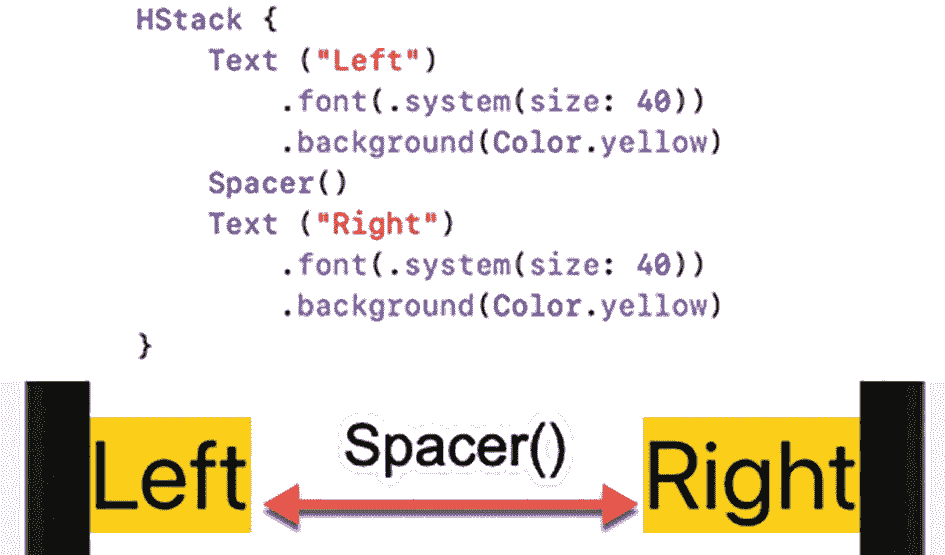

一张展示视图与一个间距器位置的代码及示例图。它描绘了左侧视图与右侧视图之间通过一个间距器对齐的方式。

**图 3-10** 间距器将视图尽可能地推向两端

你可以组合使用多个间距器来将视图推得更开。例如，考虑在视图前后各使用一个间距器，用以下 Swift 代码将它们分开：

```
struct ContentView: View {
var body: some View {
VStack {
Text ("Top")
.font(.system(size: 40))
.background(Color.yellow)
Spacer()
Text ("Middle")
.font(.system(size: 40))
.background(Color.yellow)
Spacer()
Text ("Bottom")
.font(.system(size: 40))
.background(Color.yellow)
}
}
}
```

上述代码定义了一个垂直堆栈，其中包含三个 `Text` 视图。每个 `Text` 视图之间的间距器将它们均匀推开，如图 3-11 所示。

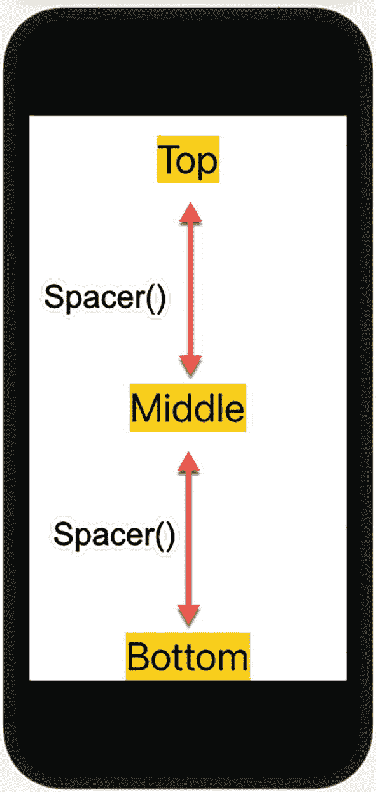

一张在手机上展示视图与间距器位置的示意图。它描绘了顶部、中间和底部视图的排列，它们之间由间距器隔开。

**图 3-11** 间距器将三个视图均匀分开

如果你组合使用间距器，多个间距器会将视图推得更开。如果我们在顶部视图与中间视图之间添加两个间距器，这两个间距器会将中间视图进一步向下推，如下列 Swift 代码所示：

```
struct ContentView: View {
var body: some View {
VStack {
Text ("Top")
.font(.system(size: 40))
.background(Color.yellow)
Spacer()
Spacer()
Text ("Middle")
.font(.system(size: 40))
.background(Color.yellow)
Spacer()
Text ("Bottom")
.font(.system(size: 40))
.background(Color.yellow)
}
}
}
```

由于顶部视图与中间视图之间现在有两个间距器，它们将中间视图进一步向下推，如图 3-12 所示。

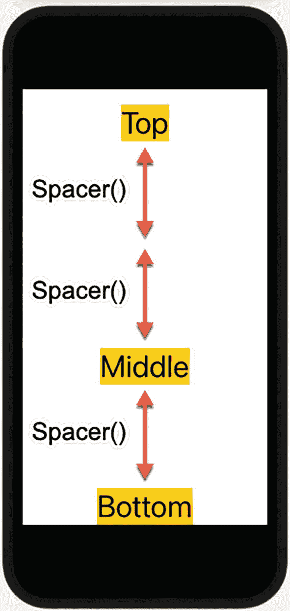

一张在手机上展示视图与间距器位置的示意图。它描绘了顶部、中间和底部视图的排列，顶部和中间视图之间有两个间距器，中间和底部视图之间有一个间距器。

**图 3-12** 两个间距器将中间视图进一步向下推

通过使用多个间距器，你可以根据屏幕尺寸调整用户界面上的视图。当应用在较大屏幕上运行时，间距器会将视图推向屏幕边缘更远处。当应用在较小屏幕上运行时，间距器推动视图的距离较短。

间距器会根据屏幕尺寸自动调整自身大小。不过，你可能会希望为间距器定义最小长度，以防止它过度缩小。要定义最小长度，请使用以下代码：

```
Spacer(minLength: 25.73)
```

请注意，你可以将最小长度定义为小数值（`CGFloat`），不过你也可以使用整数值，例如：

```
Spacer(minLength: 25)
```

如果你没有指定最小长度，间距器将根据应用运行的屏幕尺寸自由伸缩。如果需要对间距器指定固定值，你可以使用 `.frame` 修饰符。如果你在 `VStack` 中使用间距器，可以在 frame 修饰符中定义一个高度，如图 3-13 所示。

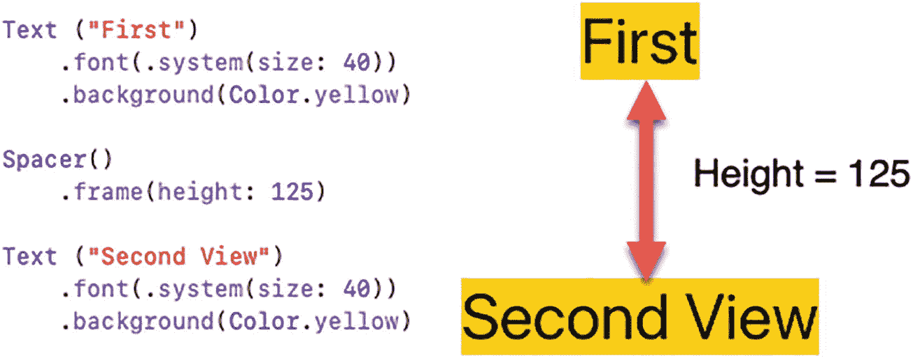

一张展示第一个视图与第二个视图之间被一个高度为 125 的间距器分隔的代码及示例图。

**图 3-13** `.frame` 修饰符的高度为 `VStack` 中的间距器定义了固定尺寸

当在 `HStack` 中使用间距器时，则应为间距器定义宽度，如图 3-14 所示。

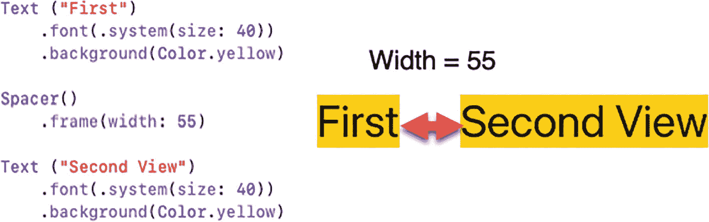

一张展示第一个视图与第二个视图之间被一个宽度为 55 的间距器分隔的代码及示例图。

**图 3-14** `.frame` 修饰符的宽度为 `HStack` 中的间距器定义了固定尺寸


## 使用偏移和位置修饰符

堆栈中的间距、填充和对齐可以改变视图在用户界面上的位置，但若想以另一种方式定位视图，你还可以使用`offset`修饰符。`offset`修饰符允许你指定具体的`x`和`y`值，将视图从 SwiftUI 通常放置的位置移开。

在每个 iOS 屏幕中，原点 (`0,0`) 位于左上角。`x` 值越大，水平方向越靠右。`y` 值越大，垂直方向越靠下，如图 3-15 所示。

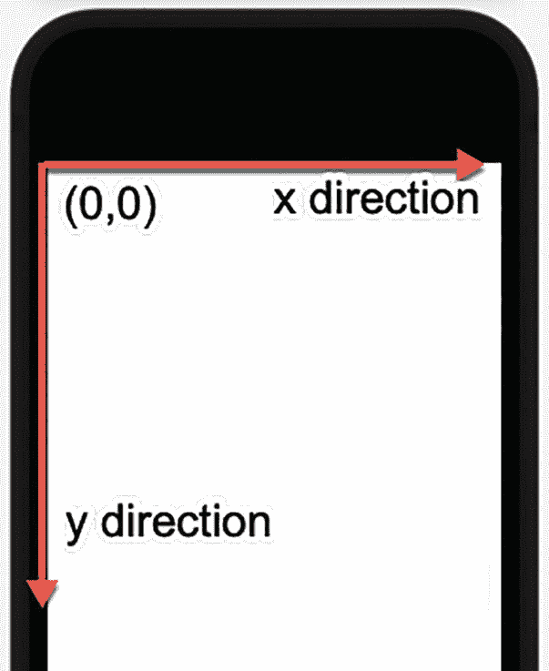

一张手机示意图，屏幕左上角沿着宽度和高度方向标有箭头。原点标记为 `0, 0`，并标出了 `X` 和 `Y` 轴。

**图 3-15** — iOS 屏幕上的原点及 `x,y` 方向

以下 `ZStack` 将两个相同的 `Text` 视图叠放在一起。因为两个 `Text` 视图出现在完全相同的位置，所以无法同时看到它们：

```
ZStack {
Text ("Top")
.font(.system(size: 40))
.background(Color.yellow)
Text ("Top")
.font(.system(size: 40))
.background(Color.yellow)
}
```

如果我们为其中一个 `Text` 视图添加 `offset` 修饰符，该修饰符会将第二个 `Text` 视图从其常规位置移动一个固定距离，例如：

```
ZStack {
Text ("Top")
.font(.system(size: 40))
.background(Color.yellow)
Text ("Top")
.font(.system(size: 40))
.background(Color.yellow)
.offset(x: 75, y: 125)
}
```

这个偏移会将第二个 `Text` 视图向右移动 75 点，向下移动 125 点，如图 3-16 所示。

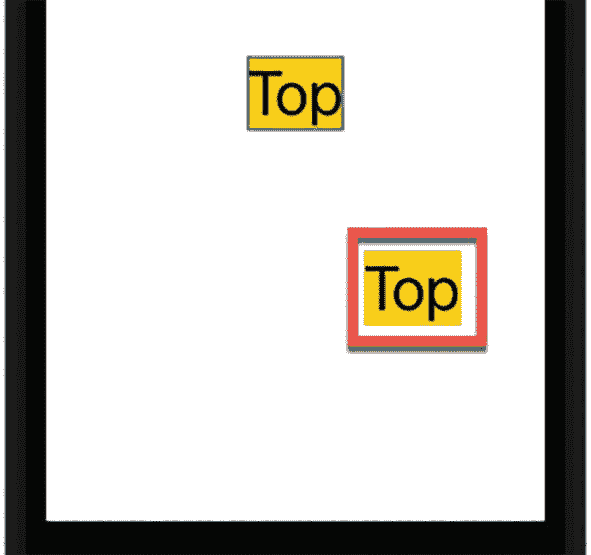

一张手机显示屏示意图，有两个 "top" 视图块，其中一个高亮显示。`offset` 修饰符将视图移离其原始位置。

**图 3-16** — `offset` 修饰符将视图从其正常显示位置移开

正 `x` 值将视图向右移动，负 `x` 值将视图向左移动。同样，正 `y` 值将视图向下移动，负 `y` 值将视图向上移动。假设我们有如下 `offset` 修饰符：

```
.offset(x: -75, y: -125)
```

这会将第二个 `Text` 视图从其正常显示位置向左上方移动，如图 3-17 所示。

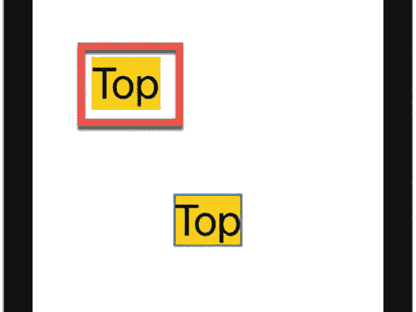

一张手机显示屏示意图，有两个 "top" 视图块，其中一个高亮显示。`offset` 修饰符将视图移离其原始位置。

**图 3-17** — 负的 `x` 和 `y` 值使视图向左和向上偏移

`offset` 修饰符允许你根据 SwiftUI 通常放置视图的位置来定位视图。如果你更希望基于原点（屏幕左上角）来定位视图，则应使用 `position` 修饰符。

与 `offset` 修饰符类似，`position` 修饰符也需要 `x` 和 `y` 值来定义视图的中心位置。以下 Swift 代码将一个 `Text` 视图放置在向右 225 点、向下 126 点处，如图 3-18 所示：

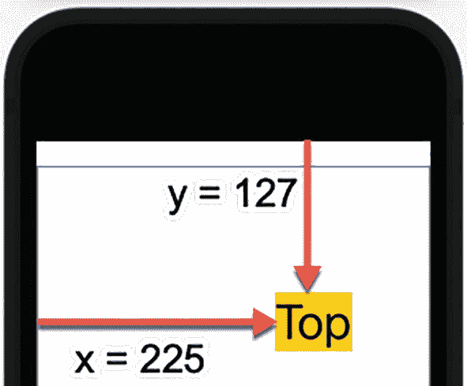

一张手机示意图，屏幕的宽度和高度方向标有箭头。`X` 和 `Y` 轴标记有值：`X` 等于 225，`Y` 等于 127。

**图 3-18** — 使用 `position` 修饰符将视图放置在用户界面上

```
Text ("Top")
.font(.system(size: 40))
.background(Color.yellow)
.position(x: 225, y: 127)
```

> **注意：** 在使用 `offset` 或 `position` 修饰符时，要小心使用过大的 `x` 或 `y` 值。因为较大的值可能在大屏幕上完美定位视图，但在较小的屏幕上却可能使该视图移出屏幕边缘。

你可以将 `offset` 和 `position` 修饰符应用于任何视图。由于堆栈也是视图，因此可以将 `offset` 和 `position` 修饰符应用于堆栈，这会自动移动堆栈内每个视图的位置。考虑以下将 `offset` 修饰符应用于整个 `VStack` 的 Swift 代码：

```
VStack {
Text ("First")
.font(.system(size: 40))
.background(Color.yellow)
Text ("Second View")
.font(.system(size: 40))
.background(Color.yellow)
}.offset(x: 25, y: 125)
```

上述代码将整个 `VStack` 的内容（两个 `Text` 视图）从其正常显示位置向右下方移动，如图 3-19 所示。

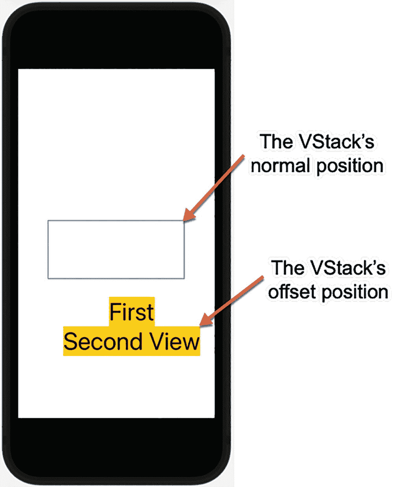

一张手机示意图。其上标有箭头，分别指示了 `VStack` 的正常位置以及 `VStack` 偏移后第一个和第二个视图在屏幕上的位置。

**图 3-19** — `offset` 修饰符将整个堆栈从其正常显示位置移开

`offset` 修饰符将整个 `VStack` 从其正常位置移动，但 `position` 修饰符是基于原点（屏幕左上角）来定位 `VStack` 的。以下 Swift 代码使用了完全相同的 `x` 和 `y` 值，但将其应用于 `VStack` 的却是 `position` 修饰符：

```
VStack {
Text ("First")
.font(.system(size: 40))
.background(Color.yellow)
Text ("Second View")
.font(.system(size: 40))
.background(Color.yellow)
}.position(x: 25, y: 125)
```

请注意，由于 `position` 修饰符是从原点开始移动 `VStack`，因此 `x` 值不够大，导致 `VStack` 的内容被屏幕截断，如图 3-20 所示。

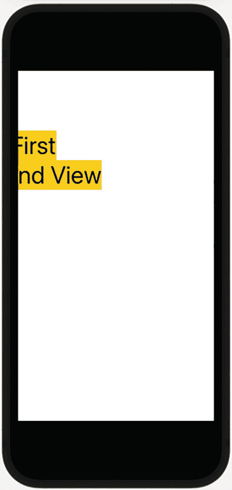

一张手机示意图。它展示了 `VStack` 的第一个和第二个视图位于显示屏最左侧部分的位置。

**图 3-20** — `position` 修饰符相对于原点放置 `VStack`

## 总结

在 SwiftUI 中设计用户界面时，默认会将视图居中显示在屏幕中间。通过使用 `padding` 修饰符，你可以增加视图周围的间距。`padding` 修饰符可以影响视图的一个、两个、三个或全部四个边。

当你想要推开视图时，可以使用间距器，它们就像弹簧一样，无论屏幕实际尺寸如何，都能将视图推到屏幕边缘。通过使用多个间距器，你可以将视图推得更远。你还可以定义间距器可以收缩的最小长度，以确保它不会收缩到特定长度以下。

在垂直和水平堆栈中，你可以定义堆栈内所有视图之间的间距。通过使用 `offset` 修饰符，你可以将视图从其正常显示位置移开。通过使用 `position` 修饰符，你可以根据原点（即 iOS 屏幕的左上角）精确地将视图放置在屏幕上。

`padding` 修饰符、间距器、堆栈内的间距以及 `offset`/`position` 修饰符让你能够安排视图在用户界面上的布局。你可以将 `padding`、`offset` 和 `position` 修饰符应用于任何视图，包括堆栈。通过修改整个堆栈，你可以修改该堆栈内的所有视图。

由于堆栈间距、`offset` 修饰符和 `position` 修饰符可以使用固定的数值，请确保这些值不要过大，以免在较小尺寸的 iOS 设备屏幕上将视图推出屏幕边缘。通过使用 `padding`、间距器以及 `position` 和 `offset` 修饰符，你可以设计出在不同 iOS 设备上外观和功能都完全一致的用户界面。这样，你就可以将更多时间用于编写代码，让应用实现有用且令人惊叹的功能，而减少花费在让用户界面适配不同尺寸屏幕和方向上的时间。


